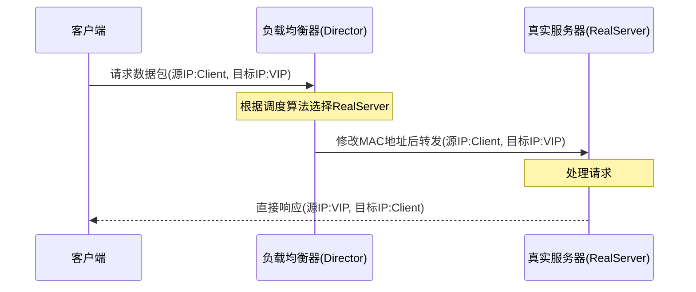
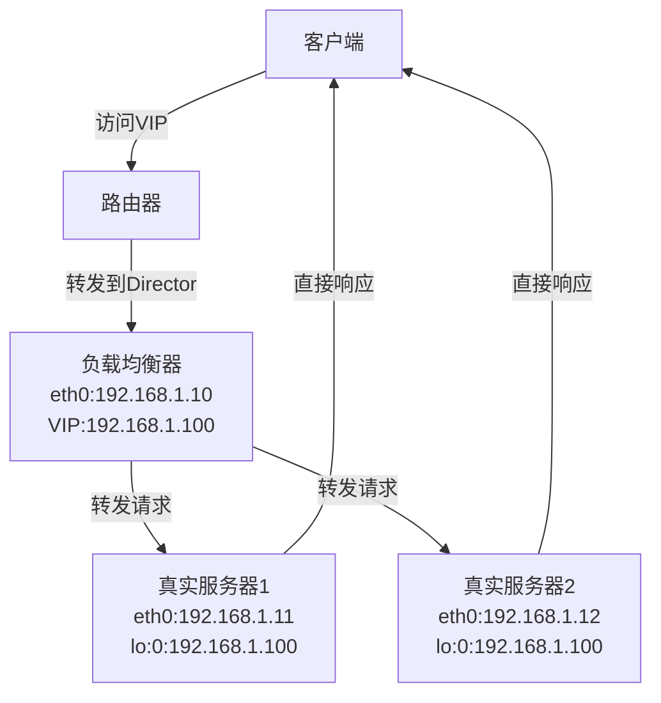

# LVS-DR模式部署与配置

LVS-DR(Direct Routing)模式是LVS三种工作模式中性能最高的一种，广泛应用于高流量的生产环境。本文将详细介绍LVS-DR模式的工作原理、网络拓扑和具体配置步骤，帮助读者掌握这一高效负载均衡模式的部署技术。

## LVS-DR模式原理

LVS-DR模式(Direct Routing，直接路由模式)的基本工作流程如下：

1. 客户端发送请求到VIP(虚拟IP)
2. 负载均衡器根据调度算法选择一台后端服务器
3. 负载均衡器将请求直接路由到选中的服务器（保持目标IP为VIP）
4. 后端服务器直接响应客户端（响应不再经过负载均衡器）

DR模式的核心特点是数据包在转发过程中不修改IP头部信息，而是通过修改数据链路层的MAC地址来实现转发。这种方式使得响应流量可以直接从真实服务器返回给客户端，大大减轻了负载均衡器的压力。

### 数据流向详解



## 网络拓扑设计

在LVS-DR模式下，所有服务器（负载均衡器和真实服务器）必须在同一个物理网络中，因为数据包转发是通过二层网络（MAC地址）实现的。

### 典型网络拓扑



### IP地址规划示例

| 设备 | 接口 | IP地址 | 说明 |
|------|------|--------|------|
| 负载均衡器 | eth0 | 192.168.1.10 | 真实IP |
| 负载均衡器 | eth0:0 | 192.168.1.100 | 虚拟IP(VIP) |
| 真实服务器1 | eth0 | 192.168.1.11 | 真实IP |
| 真实服务器1 | lo:0 | 192.168.1.100 | VIP(配置在回环接口) |
| 真实服务器2 | eth0 | 192.168.1.12 | 真实IP |
| 真实服务器2 | lo:0 | 192.168.1.100 | VIP(配置在回环接口) |

## 环境准备

### 硬件要求

- 负载均衡器：至少2核CPU，2GB内存
- 真实服务器：根据实际业务需求配置
- 所有服务器必须在同一个物理网段

### 软件要求

- 操作系统：CentOS 7/8 或 RHEL 7/8
- 内核版本：3.10以上（支持IPVS模块）
- 软件包：ipvsadm（LVS管理工具）

### 安装必要软件

在负载均衡器上安装ipvsadm：

```bash
# CentOS/RHEL系统
yum install -y ipvsadm

# Ubuntu/Debian系统
apt-get install -y ipvsadm
```

## 负载均衡器(Director)配置

### 1. 配置网络接口

首先，在负载均衡器上配置VIP：

```bash
# 临时配置（重启后失效）
ip addr add 192.168.1.100/32 dev eth0

# 永久配置（创建ifcfg-eth0:0文件）
cat > /etc/sysconfig/network-scripts/ifcfg-eth0:0 << EOF
DEVICE=eth0:0
IPADDR=192.168.1.100
NETMASK=255.255.255.255
ONBOOT=yes
EOF
```

### 2. 开启IP转发

```bash
# 临时开启
echo 1 > /proc/sys/net/ipv4/ip_forward

# 永久开启
cat >> /etc/sysctl.conf << EOF
net.ipv4.ip_forward = 1
EOF
sysctl -p
```

### 3. 配置LVS规则

使用ipvsadm命令配置LVS-DR模式的负载均衡规则：

```bash
# 清除现有规则
ipvsadm -C

# 设置连接超时值（单位：秒）
ipvsadm --set 30 5 60

# 添加虚拟服务
ipvsadm -A -t 192.168.1.100:80 -s rr

# 添加真实服务器（使用DR模式）
ipvsadm -a -t 192.168.1.100:80 -r 192.168.1.11 -g -w 1
ipvsadm -a -t 192.168.1.100:80 -r 192.168.1.12 -g -w 1

# 保存规则
ipvsadm-save > /etc/sysconfig/ipvsadm
```

参数说明：
- `-A`：添加虚拟服务
- `-t`：TCP协议
- `-s rr`：使用轮询(Round Robin)调度算法
- `-a`：添加真实服务器
- `-r`：指定真实服务器地址
- `-g`：使用DR模式(Direct Routing)
- `-w`：指定权重

### 4. 创建启动脚本

为了方便管理，可以创建一个启动脚本：

```bash
cat > /usr/local/bin/lvs-dr-start.sh << 'EOF'
#!/bin/bash

# 配置VIP
ip addr add 192.168.1.100/32 dev eth0

# 开启IP转发
echo 1 > /proc/sys/net/ipv4/ip_forward

# 清除现有规则
ipvsadm -C

# 添加虚拟服务
ipvsadm -A -t 192.168.1.100:80 -s rr

# 添加真实服务器
ipvsadm -a -t 192.168.1.100:80 -r 192.168.1.11 -g -w 1
ipvsadm -a -t 192.168.1.100:80 -r 192.168.1.12 -g -w 1

# 保存规则
ipvsadm-save > /etc/sysconfig/ipvsadm

echo "LVS-DR已启动"
EOF

chmod +x /usr/local/bin/lvs-dr-start.sh
```

## 真实服务器(RealServer)配置

在DR模式下，真实服务器的配置是关键，需要解决ARP问题并正确配置VIP。

### 1. 配置VIP到回环接口

在每台真实服务器上执行：

```bash
# 临时配置
ip addr add 192.168.1.100/32 dev lo
ip link set dev lo up

# 永久配置
cat > /etc/sysconfig/network-scripts/ifcfg-lo:0 << EOF
DEVICE=lo:0
IPADDR=192.168.1.100
NETMASK=255.255.255.255
ONBOOT=yes
EOF
```

### 2. 解决ARP问题

DR模式下最关键的问题是解决ARP响应问题。由于所有服务器都配置了相同的VIP，需要确保只有负载均衡器响应对VIP的ARP请求，真实服务器不能响应。

```bash
# 临时配置
echo 1 > /proc/sys/net/ipv4/conf/all/arp_ignore
echo 2 > /proc/sys/net/ipv4/conf/all/arp_announce
echo 1 > /proc/sys/net/ipv4/conf/lo/arp_ignore
echo 2 > /proc/sys/net/ipv4/conf/lo/arp_announce

# 永久配置
cat >> /etc/sysctl.conf << EOF
net.ipv4.conf.all.arp_ignore = 1
net.ipv4.conf.all.arp_announce = 2
net.ipv4.conf.lo.arp_ignore = 1
net.ipv4.conf.lo.arp_announce = 2
EOF
sysctl -p
```

参数说明：
- `arp_ignore = 1`：只响应目标IP地址是本地接口上配置的地址的ARP请求
- `arp_announce = 2`：对外通告时使用最适合的本地地址

### 3. 创建真实服务器启动脚本

```bash
cat > /usr/local/bin/lvs-rs-start.sh << 'EOF'
#!/bin/bash

# 配置VIP到回环接口
ip addr add 192.168.1.100/32 dev lo
ip link set dev lo up

# 配置ARP
echo 1 > /proc/sys/net/ipv4/conf/all/arp_ignore
echo 2 > /proc/sys/net/ipv4/conf/all/arp_announce
echo 1 > /proc/sys/net/ipv4/conf/lo/arp_ignore
echo 2 > /proc/sys/net/ipv4/conf/lo/arp_announce

echo "RealServer配置完成"
EOF

chmod +x /usr/local/bin/lvs-rs-start.sh
```

## 部署Web服务

在真实服务器上部署Web服务，以Nginx为例：

```bash
# 安装Nginx
yum install -y nginx

# 创建测试页面，用于区分不同服务器
echo "This is RealServer 1" > /usr/share/nginx/html/index.html  # 在服务器1上
echo "This is RealServer 2" > /usr/share/nginx/html/index.html  # 在服务器2上

# 启动Nginx
systemctl enable nginx
systemctl start nginx
```

## 测试与验证

### 1. 检查LVS规则

在负载均衡器上执行：

```bash
ipvsadm -ln
```

应该看到类似以下输出：

```
IP Virtual Server version 1.2.1 (size=4096)
Prot LocalAddress:Port Scheduler Flags
  -> RemoteAddress:Port           Forward Weight ActiveConn InActConn
TCP  192.168.1.100:80 rr
  -> 192.168.1.11:80              Route   1      0          0         
  -> 192.168.1.12:80              Route   1      0          0
```

### 2. 测试负载均衡

从客户端多次访问VIP：

```bash
curl http://192.168.1.100
```

应该能看到请求被轮流分配到不同的真实服务器。

### 3. 验证数据流向

使用tcpdump工具验证数据包流向：

在负载均衡器上：
```bash
tcpdump -i eth0 host 192.168.1.100
```

在真实服务器上：
```bash
tcpdump -i eth0 host 192.168.1.100
```

应该能观察到请求包经过负载均衡器，而响应包直接从真实服务器返回给客户端。

## 高级配置

### 1. 配置会话保持

某些应用需要会话保持，可以使用源IP哈希调度算法：

```bash
# 修改调度算法为源IP哈希
ipvsadm -E -t 192.168.1.100:80 -s sh
```

### 2. 配置健康检查

LVS本身不提供健康检查功能，通常与Keepalived结合使用：

```bash
# 安装Keepalived
yum install -y keepalived

# 配置Keepalived
cat > /etc/keepalived/keepalived.conf << 'EOF'
global_defs {
   router_id LVS_DEVEL
}

vrrp_instance VI_1 {
    state MASTER
    interface eth0
    virtual_router_id 51
    priority 100
    advert_int 1
    authentication {
        auth_type PASS
        auth_pass 1111
    }
    virtual_ipaddress {
        192.168.1.100
    }
}

virtual_server 192.168.1.100 80 {
    delay_loop 6
    lb_algo rr
    lb_kind DR
    protocol TCP
    
    real_server 192.168.1.11 80 {
        weight 1
        HTTP_GET {
            url { 
              path /
              status_code 200
            }
            connect_timeout 3
            nb_get_retry 3
            delay_before_retry 3
        }
    }
    
    real_server 192.168.1.12 80 {
        weight 1
        HTTP_GET {
            url { 
              path /
              status_code 200
            }
            connect_timeout 3
            nb_get_retry 3
            delay_before_retry 3
        }
    }
}
EOF

# 启动Keepalived
systemctl enable keepalived
systemctl start keepalived
```

### 3. 配置多端口服务

如果需要负载均衡多个端口的服务：

```bash
# 添加多个虚拟服务
ipvsadm -A -t 192.168.1.100:80 -s rr
ipvsadm -A -t 192.168.1.100:443 -s rr

# 添加真实服务器
ipvsadm -a -t 192.168.1.100:80 -r 192.168.1.11:80 -g -w 1
ipvsadm -a -t 192.168.1.100:80 -r 192.168.1.12:80 -g -w 1
ipvsadm -a -t 192.168.1.100:443 -r 192.168.1.11:443 -g -w 1
ipvsadm -a -t 192.168.1.100:443 -r 192.168.1.12:443 -g -w 1
```

## 常见问题与解决方案

### 1. ARP问题

**症状**：客户端无法访问VIP或访问不稳定

**解决方案**：
- 确保真实服务器正确配置了ARP参数
- 检查VIP是否正确配置在回环接口上
- 使用`arping`命令测试ARP响应

```bash
# 从另一台机器测试
arping -I eth0 192.168.1.100
```

### 2. 路由问题

**症状**：请求可以到达负载均衡器，但无法转发到真实服务器

**解决方案**：
- 确保IP转发已开启
- 检查防火墙规则
- 验证所有服务器在同一个物理网段

```bash
# 检查IP转发
cat /proc/sys/net/ipv4/ip_forward

# 临时关闭防火墙
systemctl stop firewalld
```

### 3. 服务不可用

**症状**：负载均衡正常工作，但无法访问服务

**解决方案**：
- 检查真实服务器上的Web服务是否正常运行
- 确认服务监听在正确的IP和端口上

```bash
# 检查服务状态
systemctl status nginx

# 检查监听端口
netstat -tnlp | grep 80
```

## 性能优化

### 1. 内核参数优化

```bash
cat >> /etc/sysctl.conf << EOF
# 连接超时相关
net.ipv4.tcp_fin_timeout = 30
net.ipv4.tcp_keepalive_time = 1200

# 缓冲区相关
net.core.somaxconn = 65535
net.core.netdev_max_backlog = 262144
net.ipv4.tcp_max_syn_backlog = 262144

# TIME_WAIT相关
net.ipv4.tcp_tw_reuse = 1
EOF
sysctl -p
```

### 2. 文件描述符优化

```bash
cat >> /etc/security/limits.conf << EOF
* soft nofile 65535
* hard nofile 65535
EOF
```

### 3. 网卡多队列优化

对于高流量环境，启用网卡多队列可以提高性能：

```bash
# 检查网卡是否支持多队列
ethtool -l eth0

# 设置队列数
ethtool -L eth0 combined 4
```

## 监控与维护

### 1. 监控LVS状态

```bash
# 查看当前连接状态
ipvsadm -lnc

# 查看统计信息
ipvsadm -ln --stats
```

### 2. 动态调整配置

```bash
# 调整权重（实现简单的负载调整）
ipvsadm -e -t 192.168.1.100:80 -r 192.168.1.11 -g -w 2

# 临时移除服务器（维护时）
ipvsadm -d -t 192.168.1.100:80 -r 192.168.1.12
```

### 3. 集成监控系统

将LVS状态集成到监控系统（如Prometheus、Zabbix）中：

```bash
# 示例：创建简单的监控脚本
cat > /usr/local/bin/check_lvs.sh << 'EOF'
#!/bin/bash

# 获取活动连接数
ACTIVE_CONN=$(ipvsadm -ln | grep -v "RemoteAddress" | awk '{sum+=$6} END {print sum}')

# 输出为Prometheus格式
echo "lvs_active_connections $ACTIVE_CONN"
EOF

chmod +x /usr/local/bin/check_lvs.sh
```

## 总结

LVS-DR模式是一种高效的负载均衡解决方案，特别适合处理高流量的Web应用。其主要优势在于：

1. **高性能**：响应流量直接从真实服务器返回给客户端，不经过负载均衡器
2. **可扩展性**：可以轻松添加更多真实服务器来提高系统容量
3. **透明性**：对客户端完全透明，无需任何客户端配置

部署LVS-DR模式时需要特别注意ARP问题的处理，这是确保系统正常工作的关键。通过结合Keepalived等工具，可以构建一个高可用、高性能的负载均衡系统。

随着容器化和云原生技术的发展，LVS也在不断演进，如今已经能够很好地与Kubernetes等现代基础设施集成，为微服务架构提供高效的负载均衡支持。