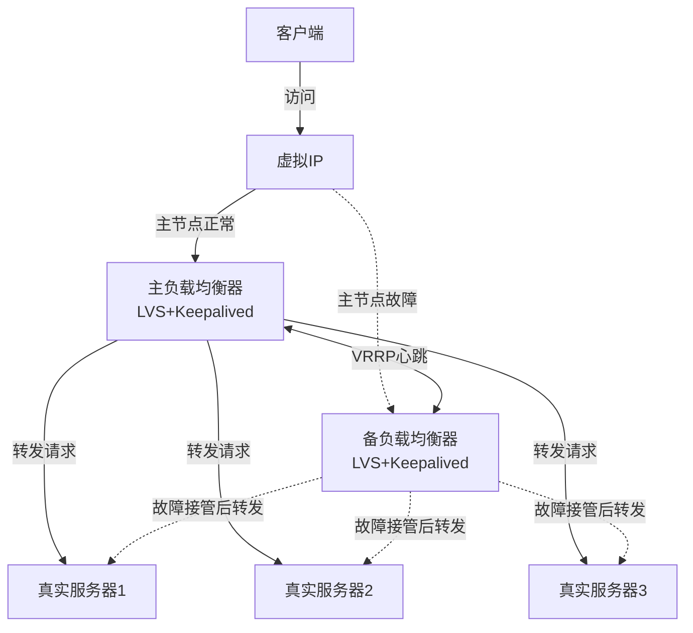
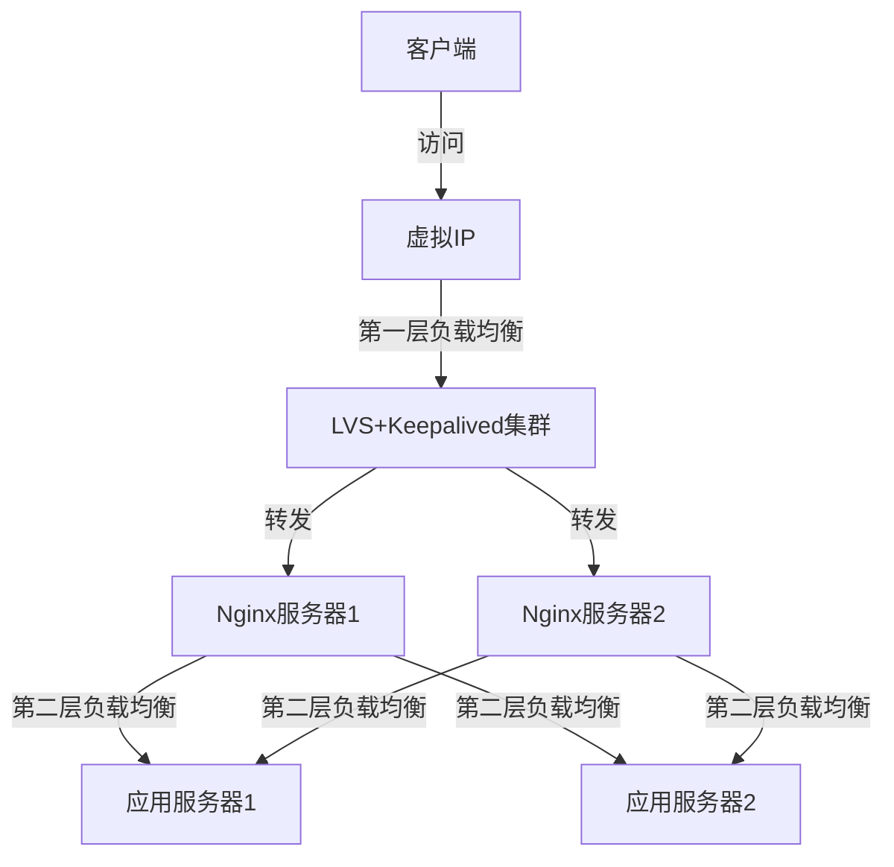

# Keepalived+LVS高可用集群构建

Keepalived与LVS的结合是构建高性能、高可用负载均衡集群的经典方案，通过这种组合可以同时实现负载均衡和故障转移功能。本文将详细介绍Keepalived+LVS高可用集群的架构设计、部署步骤和配置方法，帮助读者构建企业级的负载均衡解决方案。

## Keepalived+LVS架构概述

Keepalived+LVS高可用集群通常采用双机热备架构，包含以下组件：

1. **主负载均衡器**：运行LVS和Keepalived，处理正常流量
2. **备负载均衡器**：运行LVS和Keepalived，在主节点故障时接管服务
3. **真实服务器集群**：提供实际服务的后端服务器
4. **VIP(虚拟IP)**：对外提供服务的虚拟IP地址，由主负载均衡器持有

### 工作原理

在这个架构中，Keepalived和LVS各自承担不同的职责：

- **Keepalived**：负责监控服务器状态，管理VIP，实现主备切换
- **LVS**：负责实际的负载均衡功能，将请求分发到后端服务器



### 故障转移流程

1. 正常情况下，主负载均衡器持有VIP，处理所有请求
2. Keepalived通过VRRP协议在主备节点间发送心跳包
3. 当主节点故障时，备节点检测到心跳中断
4. 备节点接管VIP，成为新的主节点
5. 新主节点开始处理客户端请求，实现无缝切换

## 环境准备

### 硬件要求

- 至少3台服务器：2台用作负载均衡器，1台以上用作真实服务器
- 每台服务器至少2核CPU、2GB内存
- 网络环境：所有服务器在同一网段，网络互通

### 软件要求

- 操作系统：CentOS 7/8 或 RHEL 7/8
- 软件包：
  - ipvsadm（LVS管理工具）
  - keepalived（高可用组件）
  - 网络工具（如net-tools、tcpdump等）

### 网络规划示例

| 服务器角色 | 主机名 | IP地址 | VIP |
|------------|--------|--------|-----|
| 主负载均衡器 | lb01 | 192.168.1.10 | 192.168.1.100 |
| 备负载均衡器 | lb02 | 192.168.1.11 | (故障时接管) |
| 真实服务器1 | rs01 | 192.168.1.21 | - |
| 真实服务器2 | rs02 | 192.168.1.22 | - |

## 安装与基础配置

### 负载均衡器配置（主备节点）

首先在两台负载均衡器上安装必要的软件包：

```bash
# 安装ipvsadm和keepalived
yum install -y ipvsadm keepalived

# 启用IP转发
echo "net.ipv4.ip_forward = 1" >> /etc/sysctl.conf
sysctl -p
```

### 真实服务器配置

在真实服务器上部署Web服务（以Nginx为例）：

```bash
# 安装Nginx
yum install -y nginx

# 创建测试页面，用于区分不同服务器
echo "<h1>This is Real Server $(hostname)</h1>" > /usr/share/nginx/html/index.html

# 启动Nginx
systemctl enable nginx
systemctl start nginx
```

## LVS-DR模式配置

本文以LVS-DR模式为例进行配置，因为它是三种LVS模式中性能最高的一种。

### 主负载均衡器配置

#### 1. 配置Keepalived

创建Keepalived配置文件：

```bash
cat > /etc/keepalived/keepalived.conf << 'EOF'
! Configuration File for keepalived

global_defs {
   notification_email {
     admin@example.com
   }
   notification_email_from keepalived@example.com
   smtp_server 127.0.0.1
   smtp_connect_timeout 30
   router_id LVS_MASTER
}

vrrp_script check_nginx {
    script "/usr/bin/curl -s -f http://localhost:80/"
    interval 2
    weight -20
}

vrrp_instance VI_1 {
    state MASTER
    interface eth0
    virtual_router_id 51
    priority 100
    advert_int 1
    authentication {
        auth_type PASS
        auth_pass 1111
    }
    virtual_ipaddress {
        192.168.1.100/24
    }
    track_script {
        check_nginx
    }
}

virtual_server 192.168.1.100 80 {
    delay_loop 6
    lb_algo rr
    lb_kind DR
    persistence_timeout 50
    protocol TCP

    real_server 192.168.1.21 80 {
        weight 1
        HTTP_GET {
            url {
              path /
              status_code 200
            }
            connect_timeout 3
            nb_get_retry 3
            delay_before_retry 3
        }
    }
    
    real_server 192.168.1.22 80 {
        weight 1
        HTTP_GET {
            url {
              path /
              status_code 200
            }
            connect_timeout 3
            nb_get_retry 3
            delay_before_retry 3
        }
    }
}
EOF
```

#### 2. 创建健康检查脚本

```bash
cat > /usr/bin/check_nginx.sh << 'EOF'
#!/bin/bash
curl -s -f http://localhost:80/ &>/dev/null
exit $?
EOF

chmod +x /usr/bin/check_nginx.sh
```

### 备负载均衡器配置

备负载均衡器的配置与主负载均衡器类似，主要区别在于Keepalived的状态和优先级：

```bash
cat > /etc/keepalived/keepalived.conf << 'EOF'
! Configuration File for keepalived

global_defs {
   notification_email {
     admin@example.com
   }
   notification_email_from keepalived@example.com
   smtp_server 127.0.0.1
   smtp_connect_timeout 30
   router_id LVS_BACKUP
}

vrrp_script check_nginx {
    script "/usr/bin/curl -s -f http://localhost:80/"
    interval 2
    weight -20
}

vrrp_instance VI_1 {
    state BACKUP
    interface eth0
    virtual_router_id 51
    priority 90
    advert_int 1
    authentication {
        auth_type PASS
        auth_pass 1111
    }
    virtual_ipaddress {
        192.168.1.100/24
    }
    track_script {
        check_nginx
    }
}

virtual_server 192.168.1.100 80 {
    delay_loop 6
    lb_algo rr
    lb_kind DR
    persistence_timeout 50
    protocol TCP

    real_server 192.168.1.21 80 {
        weight 1
        HTTP_GET {
            url {
              path /
              status_code 200
            }
            connect_timeout 3
            nb_get_retry 3
            delay_before_retry 3
        }
    }
    
    real_server 192.168.1.22 80 {
        weight 1
        HTTP_GET {
            url {
              path /
              status_code 200
            }
            connect_timeout 3
            nb_get_retry 3
            delay_before_retry 3
        }
    }
}
EOF
```

同样创建健康检查脚本：

```bash
cat > /usr/bin/check_nginx.sh << 'EOF'
#!/bin/bash
curl -s -f http://localhost:80/ &>/dev/null
exit $?
EOF

chmod +x /usr/bin/check_nginx.sh
```

### 真实服务器DR模式配置

在DR模式下，真实服务器需要特殊配置来解决ARP问题。在每台真实服务器上执行：

```bash
# 创建配置脚本
cat > /usr/local/bin/lvs-dr-rs.sh << 'EOF'
#!/bin/bash

VIP=192.168.1.100

# 配置VIP到lo接口
ip addr add $VIP/32 dev lo
ip link set dev lo up

# 配置ARP抑制
echo 1 > /proc/sys/net/ipv4/conf/all/arp_ignore
echo 2 > /proc/sys/net/ipv4/conf/all/arp_announce
echo 1 > /proc/sys/net/ipv4/conf/lo/arp_ignore
echo 2 > /proc/sys/net/ipv4/conf/lo/arp_announce

echo "RealServer configured for LVS-DR mode"
EOF

chmod +x /usr/local/bin/lvs-dr-rs.sh

# 执行配置脚本
/usr/local/bin/lvs-dr-rs.sh

# 设置开机自动配置
echo "/usr/local/bin/lvs-dr-rs.sh" >> /etc/rc.local
chmod +x /etc/rc.local
```

## 启动服务

### 在负载均衡器上启动Keepalived

在主备负载均衡器上执行：

```bash
# 启动Keepalived服务
systemctl enable keepalived
systemctl start keepalived

# 检查Keepalived状态
systemctl status keepalived
```

### 验证VIP配置

在主负载均衡器上，VIP应该已经被配置：

```bash
ip addr show eth0
```

应该能看到192.168.1.100已经被添加到eth0接口。

## 测试与验证

### 1. 基本功能测试

从客户端访问VIP：

```bash
curl http://192.168.1.100
```

多次执行，应该能看到请求被轮流分配到不同的真实服务器。

### 2. 高可用性测试

测试主负载均衡器故障时的自动切换：

```bash
# 在主负载均衡器上模拟故障
systemctl stop keepalived
```

此时，备负载均衡器应该接管VIP。在备负载均衡器上验证：

```bash
ip addr show eth0
```

应该能看到VIP已经被配置到备负载均衡器上。

从客户端再次访问VIP，服务应该仍然可用：

```bash
curl http://192.168.1.100
```

### 3. 恢复测试

重新启动主负载均衡器上的Keepalived：

```bash
systemctl start keepalived
```

由于主负载均衡器的优先级更高，VIP应该会自动切回主负载均衡器。

## 高级配置

### 1. 配置邮件通知

修改Keepalived配置，添加邮件通知功能：

```bash
global_defs {
   notification_email {
     admin@example.com
   }
   notification_email_from keepalived@example.com
   smtp_server smtp.example.com
   smtp_connect_timeout 30
   router_id LVS_MASTER
}
```

### 2. 配置多个虚拟服务

如果需要负载均衡多个服务，可以在Keepalived配置中添加多个virtual_server块：

```bash
# HTTP服务
virtual_server 192.168.1.100 80 {
    # 配置...
}

# HTTPS服务
virtual_server 192.168.1.100 443 {
    # 配置...
}

# 其他服务
virtual_server 192.168.1.100 8080 {
    # 配置...
}
```

### 3. 配置不同的调度算法

LVS支持多种调度算法，可以根据需求选择：

```bash
# 轮询算法
virtual_server 192.168.1.100 80 {
    lb_algo rr
    # 其他配置...
}

# 加权轮询
virtual_server 192.168.1.100 443 {
    lb_algo wrr
    # 其他配置...
}

# 最少连接
virtual_server 192.168.1.100 8080 {
    lb_algo lc
    # 其他配置...
}

# 源地址哈希（会话保持）
virtual_server 192.168.1.100 3306 {
    lb_algo sh
    # 其他配置...
}
```

### 4. 配置非抢占模式

默认情况下，当主负载均衡器恢复时，会自动抢回VIP。如果希望避免频繁切换，可以配置非抢占模式：

```bash
vrrp_instance VI_1 {
    state BACKUP
    nopreempt
    # 其他配置...
}
```

注意：`nopreempt`参数只能在`state`为`BACKUP`的配置中使用。

## 监控与维护

### 1. 查看LVS状态

```bash
# 查看虚拟服务和真实服务器
ipvsadm -ln

# 查看连接状态
ipvsadm -lnc

# 查看统计信息
ipvsadm -ln --stats
```

### 2. 查看Keepalived状态

```bash
# 查看Keepalived进程
ps -ef | grep keepalived

# 查看Keepalived日志
journalctl -u keepalived

# 查看VRRP状态
ip -d link show eth0
```

### 3. 动态调整配置

可以在不重启Keepalived的情况下动态调整LVS配置：

```bash
# 临时移除一台真实服务器（维护时）
ipvsadm -d -t 192.168.1.100:80 -r 192.168.1.21

# 添加回真实服务器
ipvsadm -a -t 192.168.1.100:80 -r 192.168.1.21 -g -w 1

# 调整权重
ipvsadm -e -t 192.168.1.100:80 -r 192.168.1.22 -g -w 2
```

## 常见问题与解决方案

### 1. VIP无法正常漂移

**问题**：主节点故障时，VIP没有成功切换到备节点

**解决方案**：
- 检查网络连接，确保主备节点间可以正常通信
- 检查防火墙规则，确保VRRP协议(IP协议号112)未被阻止
- 检查Keepalived配置，特别是virtual_router_id和认证信息是否一致

```bash
# 允许VRRP协议通过防火墙
firewall-cmd --direct --permanent --add-rule ipv4 filter INPUT 0 --protocol 112 --in-interface eth0 --jump ACCEPT
firewall-cmd --reload
```

### 2. 真实服务器无法接收流量

**问题**：LVS正常工作，但真实服务器没有收到请求

**解决方案**：
- 检查真实服务器上的ARP配置
- 确认VIP已正确配置到lo接口
- 检查服务是否正常运行

```bash
# 检查ARP配置
cat /proc/sys/net/ipv4/conf/all/arp_ignore
cat /proc/sys/net/ipv4/conf/all/arp_announce

# 检查VIP配置
ip addr show lo

# 检查服务状态
systemctl status nginx
```

### 3. 服务间歇性不可用

**问题**：服务偶尔不可用，主备节点频繁切换

**解决方案**：
- 增加Keepalived广播间隔和超时时间
- 配置非抢占模式
- 检查网络稳定性

```bash
vrrp_instance VI_1 {
    # 增加广播间隔
    advert_int 2
    
    # 配置非抢占模式（仅在BACKUP状态下）
    nopreempt
    
    # 配置抢占延迟
    preempt_delay 300
    
    # 其他配置...
}
```

## 性能优化

### 1. 系统参数优化

```bash
cat >> /etc/sysctl.conf << EOF
# 连接跟踪表大小
net.netfilter.nf_conntrack_max = 1000000
net.nf_conntrack_max = 1000000

# TCP连接相关
net.ipv4.tcp_fin_timeout = 30
net.ipv4.tcp_keepalive_time = 1200
net.ipv4.tcp_max_syn_backlog = 65536

# 网络缓冲区
net.core.somaxconn = 65535
net.core.netdev_max_backlog = 65535

# TIME_WAIT优化
net.ipv4.tcp_tw_reuse = 1
EOF

sysctl -p
```

### 2. LVS连接同步

在大型集群中，可以配置LVS连接同步，确保主备切换时连接状态不丢失：

```bash
# 加载连接同步模块
modprobe ip_vs_sync

# 在主负载均衡器上启动同步发送
ipvsadm --start-daemon master --syncid 1

# 在备负载均衡器上启动同步接收
ipvsadm --start-daemon backup --syncid 1
```

### 3. 多队列网卡优化

对于高流量环境，启用网卡多队列可以提高性能：

```bash
# 检查网卡是否支持多队列
ethtool -l eth0

# 设置队列数
ethtool -L eth0 combined 4
```

## 扩展与集成

### 1. 与Nginx结合

Keepalived+LVS可以与Nginx结合，构建多层负载均衡架构：



### 2. 与云平台集成

在云环境中，可以使用云平台提供的负载均衡服务替代或补充Keepalived+LVS：

- AWS：使用Elastic Load Balancer (ELB)
- Azure：使用Azure Load Balancer
- 阿里云：使用Server Load Balancer (SLB)

### 3. 与容器编排平台集成

在Kubernetes环境中，可以使用MetalLB或kube-vip等工具实现类似Keepalived+LVS的功能：

```bash
# 使用Helm安装MetalLB
helm repo add metallb https://metallb.github.io/metallb
helm install metallb metallb/metallb --namespace metallb-system --create-namespace

# 配置地址池
kubectl apply -f - <<EOF
apiVersion: metallb.io/v1beta1
kind: IPAddressPool
metadata:
  name: first-pool
  namespace: metallb-system
spec:
  addresses:
  - 192.168.1.100-192.168.1.100
EOF

# 配置L2广播
kubectl apply -f - <<EOF
apiVersion: metallb.io/v1beta1
kind: L2Advertisement
metadata:
  name: example
  namespace: metallb-system
spec:
  ipAddressPools:
  - first-pool
EOF
```

## 总结

Keepalived+LVS高可用集群是一种成熟的负载均衡解决方案，具有以下优势：

1. **高性能**：LVS工作在网络层，性能极高，适合处理大流量
2. **高可用性**：通过Keepalived实现自动故障转移，确保服务连续性
3. **灵活性**：支持多种负载均衡算法和工作模式，适应不同场景
4. **可扩展性**：可以轻松添加更多真实服务器，提高系统容量

通过本文的配置步骤，读者可以构建一个基于LVS-DR模式的高可用负载均衡集群，为企业应用提供可靠的负载均衡服务。随着技术的发展，Keepalived+LVS仍然是许多企业级应用的首选负载均衡解决方案，特别是在对性能要求极高的场景中。