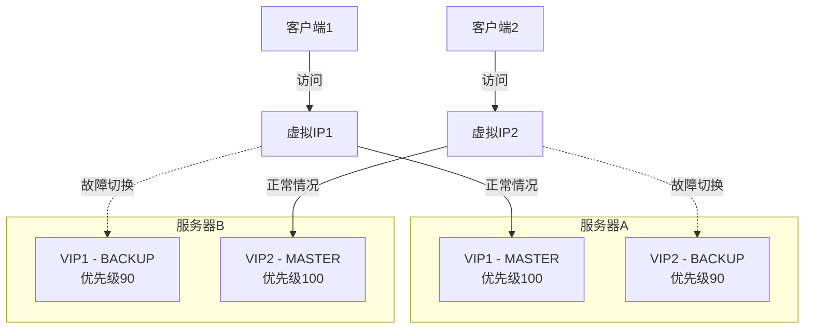
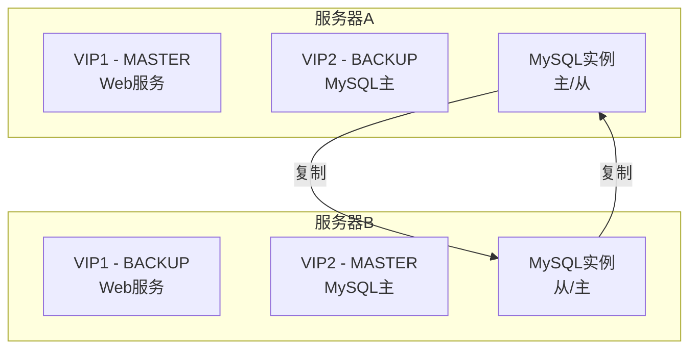
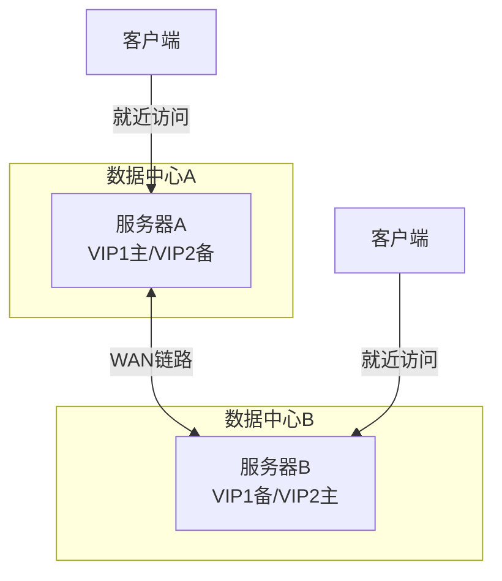

# Keepalived双主架构实现

Keepalived双主架构是一种高效利用资源的高可用方案，通过配置两台服务器互为主备，同时提供不同的服务，提高了资源利用率。本文将详细介绍Keepalived双主架构的设计原理、配置方法和实施步骤，帮助读者构建更加高效的高可用系统。

## 双主架构概述

传统的主备架构中，备用节点在正常情况下处于空闲状态，资源利用率较低。而双主架构中，两台服务器同时工作，互为备份，每台服务器都是某个服务的主节点，同时又是另一个服务的备节点，这样可以充分利用硬件资源。

### 双主架构的优势

1. **资源利用率高**：两台服务器都处于活动状态，避免了资源浪费
2. **负载分担**：不同服务分布在不同服务器上，分散了系统负载
3. **故障隔离**：一个服务的故障不会直接影响另一个服务
4. **维护便利**：可以单独维护一台服务器而不中断所有服务

### 双主架构的工作原理

在Keepalived双主架构中，每台服务器配置两个VRRP实例，分别对应两个虚拟IP(VIP)。每台服务器对其中一个VIP为MASTER状态，对另一个VIP为BACKUP状态。



当一台服务器发生故障时，另一台服务器将接管所有服务，确保服务的连续性。

## 环境准备

### 硬件要求

- 两台配置相近的服务器
- 每台服务器至少2个网络接口（用于服务和心跳）
- 足够的处理能力，能够在单台服务器上运行所有服务

### 软件要求

- 操作系统：CentOS 7/8 或 RHEL 7/8
- Keepalived：2.0.0或更高版本
- 网络工具：如net-tools、tcpdump等

### 网络规划示例

| 服务器 | 主机名 | 管理IP | VIP1 | VIP2 | 心跳IP |
|-------|-------|--------|------|------|--------|
| 服务器A | node1 | 192.168.1.11 | 192.168.1.100 (主) | 192.168.1.200 (备) | 10.0.0.11 |
| 服务器B | node2 | 192.168.1.12 | 192.168.1.100 (备) | 192.168.1.200 (主) | 10.0.0.12 |

## 安装与基础配置

### 安装Keepalived

在两台服务器上安装Keepalived：

```bash
# CentOS/RHEL系统
yum install -y keepalived

# Ubuntu/Debian系统
apt-get install -y keepalived
```

### 配置网络接口

确保两台服务器的网络接口正确配置：

```bash
# 服务器A配置心跳接口
cat > /etc/sysconfig/network-scripts/ifcfg-eth1 << EOF
DEVICE=eth1
BOOTPROTO=static
IPADDR=10.0.0.11
NETMASK=255.255.255.0
ONBOOT=yes
EOF

# 服务器B配置心跳接口
cat > /etc/sysconfig/network-scripts/ifcfg-eth1 << EOF
DEVICE=eth1
BOOTPROTO=static
IPADDR=10.0.0.12
NETMASK=255.255.255.0
ONBOOT=yes
EOF
```

重启网络服务或重启服务器使配置生效。

## Keepalived双主配置

### 服务器A配置

创建Keepalived配置文件：

```bash
cat > /etc/keepalived/keepalived.conf << 'EOF'
! Configuration File for keepalived

global_defs {
   router_id node1
   vrrp_skip_check_adv_addr
   vrrp_strict
   vrrp_garp_interval 0
   vrrp_gna_interval 0
}

# 第一个VRRP实例 - 服务器A为主
vrrp_instance VI_1 {
    state MASTER
    interface eth0
    virtual_router_id 51
    priority 100
    advert_int 1
    authentication {
        auth_type PASS
        auth_pass 1111
    }
    virtual_ipaddress {
        192.168.1.100/24
    }
    track_script {
        chk_service_1
    }
    notify /usr/local/bin/notify_service.sh
}

# 第二个VRRP实例 - 服务器A为备
vrrp_instance VI_2 {
    state BACKUP
    interface eth0
    virtual_router_id 52
    priority 90
    advert_int 1
    authentication {
        auth_type PASS
        auth_pass 2222
    }
    virtual_ipaddress {
        192.168.1.200/24
    }
    track_script {
        chk_service_2
    }
    notify /usr/local/bin/notify_service.sh
}

# 服务1健康检查脚本
vrrp_script chk_service_1 {
    script "/usr/local/bin/check_service_1.sh"
    interval 2
    weight -20
    fall 2
    rise 1
}

# 服务2健康检查脚本
vrrp_script chk_service_2 {
    script "/usr/local/bin/check_service_2.sh"
    interval 2
    weight -20
    fall 2
    rise 1
}
EOF
```

### 服务器B配置

创建Keepalived配置文件：

```bash
cat > /etc/keepalived/keepalived.conf << 'EOF'
! Configuration File for keepalived

global_defs {
   router_id node2
   vrrp_skip_check_adv_addr
   vrrp_strict
   vrrp_garp_interval 0
   vrrp_gna_interval 0
}

# 第一个VRRP实例 - 服务器B为备
vrrp_instance VI_1 {
    state BACKUP
    interface eth0
    virtual_router_id 51
    priority 90
    advert_int 1
    authentication {
        auth_type PASS
        auth_pass 1111
    }
    virtual_ipaddress {
        192.168.1.100/24
    }
    track_script {
        chk_service_1
    }
    notify /usr/local/bin/notify_service.sh
}

# 第二个VRRP实例 - 服务器B为主
vrrp_instance VI_2 {
    state MASTER
    interface eth0
    virtual_router_id 52
    priority 100
    advert_int 1
    authentication {
        auth_type PASS
        auth_pass 2222
    }
    virtual_ipaddress {
        192.168.1.200/24
    }
    track_script {
        chk_service_2
    }
    notify /usr/local/bin/notify_service.sh
}

# 服务1健康检查脚本
vrrp_script chk_service_1 {
    script "/usr/local/bin/check_service_1.sh"
    interval 2
    weight -20
    fall 2
    rise 1
}

# 服务2健康检查脚本
vrrp_script chk_service_2 {
    script "/usr/local/bin/check_service_2.sh"
    interval 2
    weight -20
    fall 2
    rise 1
}
EOF
```

### 创建健康检查脚本

在两台服务器上创建服务健康检查脚本：

```bash
# 服务1健康检查脚本
cat > /usr/local/bin/check_service_1.sh << 'EOF'
#!/bin/bash
# 检查服务1是否正常运行
# 例如检查Nginx服务
systemctl status nginx > /dev/null 2>&1
exit $?
EOF

chmod +x /usr/local/bin/check_service_1.sh

# 服务2健康检查脚本
cat > /usr/local/bin/check_service_2.sh << 'EOF'
#!/bin/bash
# 检查服务2是否正常运行
# 例如检查MySQL服务
systemctl status mysql > /dev/null 2>&1
exit $?
EOF

chmod +x /usr/local/bin/check_service_2.sh
```

### 创建通知脚本

在两台服务器上创建状态变化通知脚本：

```bash
cat > /usr/local/bin/notify_service.sh << 'EOF'
#!/bin/bash

# 获取Keepalived传递的参数
TYPE=$1
NAME=$2
STATE=$3

# 记录日志
logger -t keepalived "Transition of $NAME to $STATE"

# 根据状态变化执行相应操作
case $STATE in
    "MASTER")
        # 当成为MASTER时执行的操作
        logger -t keepalived "$NAME became MASTER"
        # 如果是VI_1实例，启动服务1
        if [ "$NAME" = "VI_1" ]; then
            systemctl start nginx
        fi
        # 如果是VI_2实例，启动服务2
        if [ "$NAME" = "VI_2" ]; then
            systemctl start mysql
        fi
        ;;
    "BACKUP")
        # 当成为BACKUP时执行的操作
        logger -t keepalived "$NAME became BACKUP"
        # 如果是VI_1实例，停止服务1
        if [ "$NAME" = "VI_1" ]; then
            systemctl stop nginx
        fi
        # 如果是VI_2实例，停止服务2
        if [ "$NAME" = "VI_2" ]; then
            systemctl stop mysql
        fi
        ;;
    "FAULT")
        # 当发生故障时执行的操作
        logger -t keepalived "$NAME went into FAULT state"
        ;;
    *)
        # 其他状态变化
        logger -t keepalived "Unknown state transition of $NAME to $STATE"
        ;;
esac

exit 0
EOF

chmod +x /usr/local/bin/notify_service.sh
```

## 部署服务

在这个双主架构中，我们将在服务器A上部署Nginx作为服务1，在服务器B上部署MySQL作为服务2。

### 服务器A上部署Nginx

```bash
# 安装Nginx
yum install -y nginx

# 配置Nginx监听VIP1
cat > /etc/nginx/conf.d/vip.conf << EOF
server {
    listen 192.168.1.100:80;
    server_name _;
    
    location / {
        root /usr/share/nginx/html;
        index index.html;
    }
}
EOF

# 创建测试页面
echo "<h1>This is Service 1 running on Server A</h1>" > /usr/share/nginx/html/index.html

# 启动Nginx
systemctl enable nginx
systemctl start nginx
```

### 服务器B上部署MySQL

```bash
# 安装MySQL
yum install -y mysql-server

# 配置MySQL监听VIP2
cat >> /etc/my.cnf << EOF
[mysqld]
bind-address = 192.168.1.200
EOF

# 启动MySQL
systemctl enable mysqld
systemctl start mysqld

# 初始化MySQL（根据实际情况调整）
mysql_secure_installation
```

## 启动Keepalived服务

在两台服务器上启动Keepalived服务：

```bash
# 启动Keepalived
systemctl enable keepalived
systemctl start keepalived

# 检查Keepalived状态
systemctl status keepalived
```

## 测试与验证

### 1. 验证VIP分配

在两台服务器上检查IP地址分配情况：

```bash
ip addr show eth0
```

服务器A应该有VIP1(192.168.1.100)，服务器B应该有VIP2(192.168.1.200)。

### 2. 测试服务可用性

测试Nginx服务（VIP1）：

```bash
curl http://192.168.1.100
```

应该返回"This is Service 1 running on Server A"。

测试MySQL服务（VIP2）：

```bash
mysql -h 192.168.1.200 -u root -p
```

应该能够成功连接到MySQL服务器。

### 3. 测试故障切换

模拟服务器A故障：

```bash
# 在服务器A上停止Keepalived
systemctl stop keepalived
```

此时，服务器B应该接管VIP1，同时保持VIP2。验证：

```bash
# 在服务器B上检查IP
ip addr show eth0
```

应该同时看到VIP1和VIP2。

测试服务是否仍然可用：

```bash
curl http://192.168.1.100
mysql -h 192.168.1.200 -u root -p
```

两个服务应该都能正常访问。

### 4. 恢复测试

重新启动服务器A上的Keepalived：

```bash
systemctl start keepalived
```

VIP1应该回到服务器A，VIP2保持在服务器B。

## 高级配置

### 1. 配置VRRP同步组

VRRP同步组可以确保相关的VRRP实例一起进行状态转换，避免部分服务切换导致的问题。

修改服务器A的配置：

```bash
cat > /etc/keepalived/keepalived.conf << 'EOF'
! Configuration File for keepalived

global_defs {
   router_id node1
   vrrp_skip_check_adv_addr
   vrrp_strict
   vrrp_garp_interval 0
   vrrp_gna_interval 0
}

# 定义VRRP同步组
vrrp_sync_group VG1 {
    group {
        VI_1
        VI_2
    }
    notify_master "/usr/local/bin/notify_master.sh"
    notify_backup "/usr/local/bin/notify_backup.sh"
    notify_fault "/usr/local/bin/notify_fault.sh"
}

# 第一个VRRP实例 - 服务器A为主
vrrp_instance VI_1 {
    state MASTER
    interface eth0
    virtual_router_id 51
    priority 100
    advert_int 1
    authentication {
        auth_type PASS
        auth_pass 1111
    }
    virtual_ipaddress {
        192.168.1.100/24
    }
    track_script {
        chk_service_1
    }
}

# 第二个VRRP实例 - 服务器A为备
vrrp_instance VI_2 {
    state BACKUP
    interface eth0
    virtual_router_id 52
    priority 90
    advert_int 1
    authentication {
        auth_type PASS
        auth_pass 2222
    }
    virtual_ipaddress {
        192.168.1.200/24
    }
    track_script {
        chk_service_2
    }
}

# 服务1健康检查脚本
vrrp_script chk_service_1 {
    script "/usr/local/bin/check_service_1.sh"
    interval 2
    weight -20
    fall 2
    rise 1
}

# 服务2健康检查脚本
vrrp_script chk_service_2 {
    script "/usr/local/bin/check_service_2.sh"
    interval 2
    weight -20
    fall 2
    rise 1
}
EOF
```

类似地修改服务器B的配置。

### 2. 配置非抢占模式

非抢占模式可以避免服务频繁切换，提高稳定性：

```bash
vrrp_instance VI_1 {
    state BACKUP
    nopreempt
    # 其他配置...
}
```

注意：`nopreempt`参数只能在`state`为`BACKUP`的配置中使用。

### 3. 配置多个网络接口监控

监控多个网络接口，当任何一个接口故障时触发切换：

```bash
vrrp_instance VI_1 {
    # 其他配置...
    track_interface {
        eth0 weight 10
        eth1 weight 10
    }
}
```

## 监控与维护

### 1. 查看Keepalived状态

```bash
# 查看Keepalived进程
ps -ef | grep keepalived

# 查看Keepalived日志
journalctl -u keepalived

# 查看VRRP状态
ip -d link show eth0
```

### 2. 监控VIP状态

创建一个简单的监控脚本：

```bash
cat > /usr/local/bin/check_vips.sh << 'EOF'
#!/bin/bash

# 检查VIP1
ip addr show eth0 | grep -q "192.168.1.100"
VIP1_STATUS=$?

# 检查VIP2
ip addr show eth0 | grep -q "192.168.1.200"
VIP2_STATUS=$?

echo "VIP1 (192.168.1.100): $([ $VIP1_STATUS -eq 0 ] && echo 'ACTIVE' || echo 'INACTIVE')"
echo "VIP2 (192.168.1.200): $([ $VIP2_STATUS -eq 0 ] && echo 'ACTIVE' || echo 'INACTIVE')"

exit 0
EOF

chmod +x /usr/local/bin/check_vips.sh
```

### 3. 集成监控系统

将Keepalived状态集成到监控系统（如Prometheus、Zabbix）中：

```bash
# 示例：创建Prometheus格式的监控脚本
cat > /usr/local/bin/keepalived_exporter.sh << 'EOF'
#!/bin/bash

# 检查VIP1
ip addr show eth0 | grep -q "192.168.1.100"
VIP1_STATUS=$?

# 检查VIP2
ip addr show eth0 | grep -q "192.168.1.200"
VIP2_STATUS=$?

# 输出Prometheus格式的指标
echo "# HELP keepalived_vip_status VIP status (1=active, 0=inactive)"
echo "# TYPE keepalived_vip_status gauge"
echo "keepalived_vip_status{vip=\"192.168.1.100\"} $([ $VIP1_STATUS -eq 0 ] && echo '1' || echo '0')"
echo "keepalived_vip_status{vip=\"192.168.1.200\"} $([ $VIP2_STATUS -eq 0 ] && echo '1' || echo '0')"

exit 0
EOF

chmod +x /usr/local/bin/keepalived_exporter.sh
```

## 常见问题与解决方案

### 1. VIP漂移问题

**问题**：VIP在没有故障的情况下频繁在两台服务器间切换

**解决方案**：
- 检查网络连接，确保心跳链路稳定
- 增加`advert_int`值，减少心跳频率
- 配置非抢占模式
- 检查是否有IP地址冲突

```bash
# 增加广播间隔
vrrp_instance VI_1 {
    advert_int 2
    # 其他配置...
}
```

### 2. 脑裂问题

**问题**：两台服务器同时认为自己是主节点，导致VIP冲突

**解决方案**：
- 配置独立的心跳网络
- 使用多个心跳检测方法
- 配置fence设备或仲裁机制

```bash
# 配置使用专用心跳接口
vrrp_instance VI_1 {
    interface eth0  # 服务接口
    use_vmac
    vmac_xmit_base  # 在基础接口上发送VRRP包
    
    # 心跳通过另一个接口
    lvs_sync_daemon_interface eth1
    
    # 其他配置...
}
```

### 3. 服务启动顺序问题

**问题**：Keepalived启动时服务尚未完全初始化，导致健康检查失败

**解决方案**：
- 在启动脚本中添加延迟
- 使用systemd依赖关系确保正确的启动顺序
- 调整健康检查参数，增加容错性

```bash
# 创建systemd依赖关系
cat > /etc/systemd/system/keepalived.service.d/override.conf << EOF
[Unit]
After=network.target nginx.service mysql.service
Requires=nginx.service mysql.service

[Service]
ExecStartPre=/bin/sleep 5
EOF

systemctl daemon-reload
```

## 扩展应用场景

### 1. 数据库主从复制架构

在双主架构中实现MySQL主从复制：



### 2. 多服务负载均衡

扩展双主架构支持多个服务：

```bash
# 添加更多VRRP实例
vrrp_instance VI_3 {
    state MASTER
    interface eth0
    virtual_router_id 53
    priority 100
    # 其他配置...
    virtual_ipaddress {
        192.168.1.300/24
    }
}
```

### 3. 地理分布式高可用

在不同数据中心部署双主架构，实现跨地域高可用：



## 总结

Keepalived双主架构是一种高效的高可用解决方案，通过让两台服务器互为主备，同时提供不同的服务，实现了资源的最大化利用。与传统的主备架构相比，双主架构具有以下优势：

1. **资源利用率高**：两台服务器都处于活动状态，避免了资源浪费
2. **负载分担**：不同服务分布在不同服务器上，分散了系统负载
3. **灵活性强**：可以根据服务特性和负载情况灵活调整配置
4. **成本效益好**：相同硬件投入下获得更高的服务能力

通过本文的配置步骤，读者可以构建一个基于Keepalived的双主高可用架构，为企业应用提供高效、可靠的服务保障。随着业务的发展，还可以根据需要扩展更多的服务和功能，构建更加复杂和强大的高可用系统。