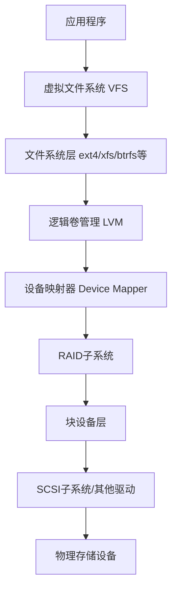

# Linux存储架构与设备类型

Linux系统中的存储架构是一个多层次的体系，从物理设备到文件系统，每一层都有其特定的功能和特性。本文将详细介绍Linux存储架构的组成部分以及各种存储设备类型，帮助读者理解Linux系统如何管理和访问存储资源。

## Linux存储架构概述

Linux存储架构是一个分层的系统，从上到下主要包括以下几个层次：



### 各层功能说明

1. **应用程序层**：用户空间的应用程序通过系统调用访问文件和存储。
2. **虚拟文件系统(VFS)**：提供统一的接口，使不同的文件系统对应用程序透明。
3. **文件系统层**：实现具体的文件系统，如ext4、xfs、btrfs等。
4. **逻辑卷管理(LVM)**：提供逻辑卷管理功能，实现存储空间的灵活分配。
5. **设备映射器**：提供块设备的映射机制，是LVM和软RAID的基础。
6. **RAID子系统**：实现软件RAID功能，提供数据冗余和性能提升。
7. **块设备层**：管理块设备，提供统一的块设备访问接口。
8. **设备驱动层**：包括SCSI、SATA、NVMe等设备的驱动程序。
9. **物理存储设备**：实际的存储硬件，如硬盘、SSD、闪存等。

## Linux中的设备文件系统

Linux遵循"一切皆文件"的理念，存储设备也不例外。在Linux中，设备通过特殊的文件（设备文件）来表示和访问。

### 设备文件类型

Linux中的设备文件主要分为三类：

1. **块设备(b)**：以块为单位进行I/O操作的设备，如硬盘、SSD。
2. **字符设备(c)**：以字符为单位进行I/O操作的设备，如终端、串口。
3. **伪设备**：不对应实际硬件的虚拟设备，如/dev/null、/dev/zero。

### 设备文件命名规则

Linux中的设备文件遵循特定的命名规则，位于/dev目录下：

```
/dev/sda    # 第一个SCSI/SATA硬盘
/dev/sda1   # 第一个SCSI/SATA硬盘的第一个分区
/dev/nvme0n1 # 第一个NVMe设备
/dev/nvme0n1p1 # 第一个NVMe设备的第一个分区
/dev/md0    # 第一个软RAID设备
/dev/mapper/vg-lv # LVM逻辑卷
```

### udev设备管理

现代Linux系统使用udev动态设备管理系统，它能够：

1. 动态创建和删除设备文件
2. 根据设备属性为设备命名
3. 在设备插入或移除时执行自定义操作
4. 维护设备的持久命名

```bash
# 查看udev规则
ls /etc/udev/rules.d/

# 查看设备属性
udevadm info --name=/dev/sda

# 监控设备事件
udevadm monitor
```

## 物理存储设备类型

### 1. 硬盘驱动器(HDD)

传统机械硬盘，使用旋转磁盘存储数据。

**特点**：
- 容量大，价格相对较低
- 读写速度较慢（约100-200MB/s）
- 存在机械部件，可靠性相对较低
- 适合大容量、低频访问的数据存储

**在Linux中的表示**：
- SATA/SCSI硬盘：/dev/sd[a-z]
- IDE硬盘（旧系统）：/dev/hd[a-z]

### 2. 固态驱动器(SSD)

使用闪存芯片存储数据的设备，没有机械部件。

**特点**：
- 读写速度快（约500-600MB/s，SATA接口）
- 随机访问性能优秀
- 无机械部件，可靠性高
- 写入次数有限，存在磨损问题
- 价格相对较高

**在Linux中的表示**：
- SATA SSD：/dev/sd[a-z]
- PCIe/NVMe SSD：/dev/nvme[0-9]n[1-9]

### 3. NVMe固态驱动器

通过PCIe接口连接的高性能SSD。

**特点**：
- 极高的读写速度（可达3000MB/s以上）
- 超低延迟
- 支持高并发I/O操作
- 价格较高

**在Linux中的表示**：
- /dev/nvme0n1（第一个NVMe设备）
- /dev/nvme0n1p1（第一个NVMe设备的第一个分区）

### 4. 闪存设备(Flash)

包括USB闪存、SD卡等便携式存储设备。

**特点**：
- 便携性好
- 容量适中
- 速度适中
- 适合数据传输和临时存储

**在Linux中的表示**：
- USB闪存：/dev/sd[a-z]（与SATA硬盘类似）
- SD卡：/dev/mmcblk[0-9]

### 5. 光学存储设备

包括CD、DVD、蓝光光盘等。

**特点**：
- 适合数据分发和长期归档
- 读写速度较慢
- 容量有限

**在Linux中的表示**：
- /dev/sr0（第一个光驱）
- /dev/cdrom（通常是指向光驱的符号链接）

## 存储接口与协议

### 1. SATA (Serial ATA)

串行ATA接口，是目前桌面和部分服务器中最常见的硬盘接口。

**特点**：
- 速度：SATA 3.0提供6Gbps带宽
- 热插拔支持
- 点对点连接
- 成本低

**Linux支持**：
- 通过libata驱动支持
- 设备表示为/dev/sd[a-z]

### 2. SAS (Serial Attached SCSI)

串行连接SCSI，主要用于企业级存储。

**特点**：
- 高性能，支持15000RPM高转速硬盘
- 支持多路径I/O
- 可靠性高
- 支持更长的电缆和更多设备

**Linux支持**：
- 通过SCSI子系统支持
- 设备表示为/dev/sd[a-z]（与SATA设备相同）

### 3. NVMe (Non-Volatile Memory Express)

专为SSD设计的高性能接口，直接连接到PCIe总线。

**特点**：
- 超高带宽（PCIe 4.0 x4可达8GB/s）
- 极低延迟
- 设计简化，减少协议开销
- 支持高并发I/O

**Linux支持**：
- 通过nvme驱动支持
- 设备表示为/dev/nvme[0-9]n[1-9]

### 4. FC (Fibre Channel)

光纤通道，用于SAN（存储区域网络）中的高速数据传输。

**特点**：
- 高带宽（16Gbps、32Gbps）
- 长距离传输
- 高可靠性
- 适合大型数据中心

**Linux支持**：
- 通过SCSI子系统和FC驱动支持
- 设备表示为/dev/sd[a-z]

### 5. iSCSI (Internet SCSI)

通过IP网络传输SCSI命令和数据。

**特点**：
- 利用现有以太网基础设施
- 成本较低
- 支持远程存储访问
- 性能受网络影响

**Linux支持**：
- 通过open-iscsi包提供
- 设备表示为/dev/sd[a-z]

```bash
# 安装iSCSI启动器
apt-get install open-iscsi  # Debian/Ubuntu
yum install iscsi-initiator-utils  # RHEL/CentOS

# 发现iSCSI目标
iscsiadm -m discovery -t sendtargets -p 192.168.1.100

# 登录到iSCSI目标
iscsiadm -m node -T iqn.2020-01.com.example:storage -p 192.168.1.100 -l
```

## 逻辑存储管理

### 1. 分区(Partition)

将物理磁盘划分为多个逻辑部分。

**分区表类型**：
- MBR（传统）：支持最多4个主分区，最大2TB磁盘
- GPT（现代）：支持128个分区，支持大于2TB的磁盘

**Linux分区工具**：
- fdisk：传统分区工具，支持MBR
- gdisk：支持GPT的分区工具
- parted：支持MBR和GPT的高级分区工具

```bash
# 使用fdisk创建分区
fdisk /dev/sdb

# 使用parted创建GPT分区
parted /dev/sdc mklabel gpt
parted /dev/sdc mkpart primary 0% 100%
```

### 2. 逻辑卷管理(LVM)

提供灵活的存储管理功能，允许动态调整存储空间。

**LVM组件**：
- 物理卷(PV)：实际的存储设备或分区
- 卷组(VG)：由一个或多个物理卷组成
- 逻辑卷(LV)：从卷组中分配的逻辑存储单元

**LVM优势**：
- 动态调整卷大小
- 跨多个物理设备
- 支持快照
- 支持缓存和精简配置

```bash
# 创建物理卷
pvcreate /dev/sdb1 /dev/sdc1

# 创建卷组
vgcreate myvg /dev/sdb1 /dev/sdc1

# 创建逻辑卷
lvcreate -n mylv -L 100G myvg

# 扩展逻辑卷
lvextend -L +50G /dev/myvg/mylv
resize2fs /dev/myvg/mylv  # 调整文件系统大小
```

### 3. 软件RAID

通过软件实现冗余磁盘阵列，提供数据保护和性能提升。

**常见RAID级别**：
- RAID 0：条带化，提高性能，无冗余
- RAID 1：镜像，提供数据冗余
- RAID 5：条带化+分布式奇偶校验，平衡性能和冗余
- RAID 6：条带化+双重分布式奇偶校验，提供更高冗余
- RAID 10：RAID 1+0组合，提供高性能和冗余

**Linux软件RAID管理**：
- mdadm：Linux软件RAID管理工具

```bash
# 创建RAID 5
mdadm --create /dev/md0 --level=5 --raid-devices=3 /dev/sdb1 /dev/sdc1 /dev/sdd1

# 查看RAID状态
cat /proc/mdstat
mdadm --detail /dev/md0

# 添加备用磁盘
mdadm --add /dev/md0 /dev/sde1
```

### 4. 设备映射器(Device Mapper)

Linux内核提供的框架，用于实现块设备的映射。

**Device Mapper应用**：
- LVM的基础
- dm-crypt：磁盘加密
- dm-multipath：多路径I/O
- dm-cache：块设备缓存

```bash
# 查看设备映射
dmsetup ls

# 查看映射详情
dmsetup info /dev/mapper/myvg-mylv

# 创建加密设备
cryptsetup luksFormat /dev/sdb1
cryptsetup luksOpen /dev/sdb1 encrypted_disk
```

## 存储性能与监控

### 1. I/O调度器

Linux内核中的组件，负责优化I/O请求的处理顺序。

**常见I/O调度器**：
- CFQ (Completely Fair Queuing)：公平分配I/O带宽
- Deadline：确保请求在截止时间内完成
- NOOP：最小化CPU开销，适合SSD
- BFQ (Budget Fair Queuing)：基于预算的公平队列

```bash
# 查看当前I/O调度器
cat /sys/block/sda/queue/scheduler

# 修改I/O调度器
echo "deadline" > /sys/block/sda/queue/scheduler
```

### 2. 存储性能测试工具

用于评估存储系统性能的工具。

**常用工具**：
- dd：简单的I/O性能测试
- fio：灵活的I/O基准测试工具
- iozone：文件系统基准测试
- bonnie++：文件系统和硬盘性能测试

```bash
# 使用dd测试写性能
dd if=/dev/zero of=/tmp/test bs=1M count=1000 oflag=direct

# 使用fio测试随机读写
fio --name=random-rw --ioengine=libaio --direct=1 --bs=4k --size=1G --readwrite=randrw --rwmixread=70
```

### 3. 存储监控工具

用于监控存储系统状态和性能的工具。

**常用工具**：
- iostat：显示CPU和设备I/O统计信息
- iotop：类似top的I/O监控工具
- dstat：系统资源统计工具
- smartctl：监控磁盘健康状态

```bash
# 使用iostat监控I/O活动
iostat -xz 1

# 使用iotop监控进程I/O
iotop

# 检查磁盘健康状态
smartctl -a /dev/sda
```

## 存储设备管理最佳实践

### 1. 分区对齐

确保分区边界与物理存储单元对齐，提高性能。

```bash
# 使用parted创建对齐分区
parted -a optimal /dev/sdb mklabel gpt
parted -a optimal /dev/sdb mkpart primary 0% 100%
```

### 2. 文件系统选择

根据使用场景选择合适的文件系统：
- ext4：通用文件系统，稳定可靠
- xfs：适合大文件和大容量存储
- btrfs：支持快照、校验和等高级功能
- zfs：企业级文件系统，支持数据完整性检查

### 3. 挂载选项优化

通过合适的挂载选项提高性能和可靠性：

```bash
# SSD优化挂载选项
mount -o discard,noatime /dev/sdb1 /mnt/data

# 在/etc/fstab中添加优化选项
/dev/sdb1 /mnt/data ext4 defaults,noatime,discard 0 2
```

### 4. TRIM/UNMAP支持

对SSD启用TRIM支持，延长使用寿命：

```bash
# 手动执行TRIM
fstrim -v /mnt/data

# 启用定期TRIM
systemctl enable fstrim.timer
systemctl start fstrim.timer
```

### 5. 多路径I/O配置

在企业环境中配置多路径I/O，提高可用性：

```bash
# 安装多路径工具
apt-get install multipath-tools  # Debian/Ubuntu
yum install device-mapper-multipath  # RHEL/CentOS

# 配置多路径
mpathconf --enable --with_multipathd y

# 查看多路径设备
multipath -ll
```

## 云原生环境中的存储

### 1. 容器存储接口(CSI)

Kubernetes中用于连接存储系统的标准接口。

**特点**：
- 标准化存储接口
- 支持动态配置
- 插件化架构
- 支持各种存储后端

### 2. 软件定义存储(SDS)

通过软件层实现存储功能，与硬件解耦。

**常见SDS解决方案**：
- Ceph：分布式存储系统，支持对象、块和文件存储
- GlusterFS：分布式文件系统
- Longhorn：Kubernetes原生分布式块存储
- OpenEBS：容器化存储解决方案

```bash
# 部署Ceph存储集群
ceph-deploy new node1 node2 node3
ceph-deploy install node1 node2 node3
ceph-deploy mon create-initial
ceph-deploy osd create node1:/dev/sdb node2:/dev/sdb node3:/dev/sdb
```

### 3. 存储虚拟化

将物理存储资源抽象为虚拟资源池。

**优势**：
- 资源池化
- 简化管理
- 提高利用率
- 支持多租户

## 总结

Linux存储架构是一个复杂而灵活的系统，从物理设备到逻辑管理，再到文件系统，每一层都提供了丰富的功能和选项。理解这些组件及其相互关系，对于构建高性能、高可靠性的存储系统至关重要。

随着技术的发展，Linux存储架构也在不断演进，特别是在云原生和容器化环境中，新的存储模式和接口正在改变传统的存储管理方式。掌握Linux存储架构的基础知识，将有助于适应这些新的技术趋势，并在不同的应用场景中做出合适的存储选择。