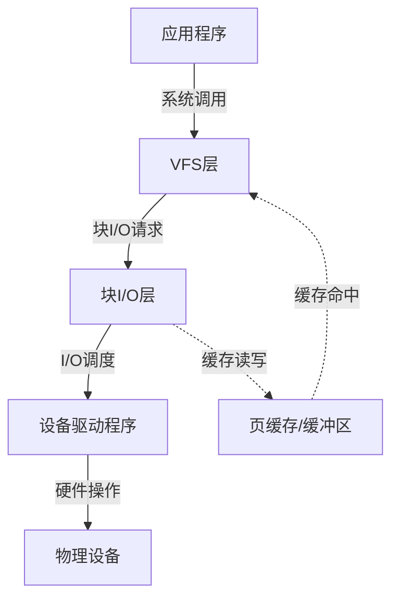
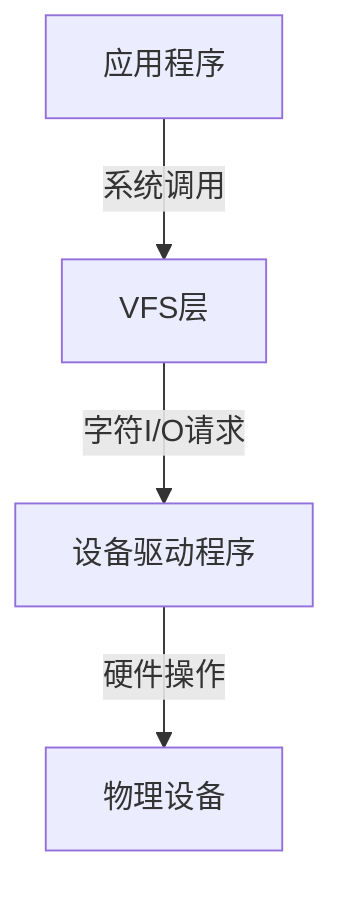

# 块设备与字符设备区别

Linux系统中的设备文件主要分为块设备和字符设备两种类型，它们在数据访问方式和应用场景上有着本质的区别。本文将详细介绍块设备和字符设备的概念、特性以及它们在系统中的应用，帮助读者理解Linux设备模型的基础知识。

## 设备文件基础概念

在Linux系统中，遵循"一切皆文件"的哲学，硬件设备也被抽象为文件，通常位于`/dev`目录下。这些特殊的文件称为设备文件或设备节点，它们提供了应用程序与硬件设备交互的接口。

设备文件的类型可以通过`ls -l`命令查看，在输出结果的第一个字符中显示：

```bash
ls -l /dev/sda /dev/tty0
# 输出示例：
# brw-rw---- 1 root disk    8,  0 Jan 1 12:00 /dev/sda
# crw--w---- 1 root tty     4,  0 Jan 1 12:00 /dev/tty0
```

其中：
- `b`表示块设备（block device）
- `c`表示字符设备（character device）

## 块设备详解

### 块设备的定义与特性

块设备是一种能够以固定大小的数据块为单位进行数据传输的设备。这些数据块通常为512字节、1KB、4KB等固定大小。块设备的核心特性包括：

1. **随机访问**：可以直接访问任意位置的数据块，不需要按顺序读取
2. **缓冲机制**：使用内核缓冲区（buffer cache）来提高I/O性能
3. **固定块大小**：数据传输以固定大小的块为单位
4. **可寻址**：每个数据块都有唯一的地址

### 块设备的内部工作机制

块设备的工作流程可以简化为以下步骤：



当应用程序请求读取块设备上的数据时：

1. 系统首先检查请求的数据是否已在缓冲区中
2. 如果在缓冲区中（缓存命中），直接返回数据
3. 如果不在缓冲区中（缓存未命中），系统会：
   - 将请求转换为块I/O请求
   - 通过I/O调度器优化请求顺序
   - 通过设备驱动程序从物理设备读取数据
   - 将数据存入缓冲区并返回给应用程序

### 常见的块设备

Linux系统中常见的块设备包括：

1. **硬盘驱动器**：如`/dev/sda`、`/dev/hda`
2. **固态硬盘**：如`/dev/sda`、`/dev/nvme0n1`
3. **USB存储设备**：如`/dev/sdb`
4. **SD卡**：如`/dev/mmcblk0`
5. **光盘驱动器**：如`/dev/sr0`
6. **RAID设备**：如`/dev/md0`
7. **逻辑卷**：如`/dev/mapper/vg-lv`

### 块设备的主要用途

块设备主要用于：

1. **文件系统**：大多数文件系统都构建在块设备上
2. **交换空间**：用于虚拟内存的交换分区
3. **数据库存储**：数据库通常存储在块设备上
4. **虚拟机镜像**：虚拟机的磁盘镜像文件

## 字符设备详解

### 字符设备的定义与特性

字符设备是一种能够以字符（字节）为单位进行数据传输的设备。字符设备的核心特性包括：

1. **顺序访问**：通常按顺序读取或写入数据
2. **无缓冲**：一般不使用内核缓冲区（某些驱动可能实现自己的缓冲）
3. **字节流**：数据被视为连续的字节流
4. **不可寻址**：通常不能直接访问任意位置的数据

### 字符设备的内部工作机制

字符设备的工作流程相对简单：



当应用程序请求从字符设备读取数据时：

1. 系统调用直接传递给设备驱动程序
2. 设备驱动程序与硬件交互，读取或写入数据
3. 数据直接传递给应用程序，通常不经过缓冲区

### 常见的字符设备

Linux系统中常见的字符设备包括：

1. **终端设备**：如`/dev/tty`、`/dev/pts/0`
2. **串行端口**：如`/dev/ttyS0`
3. **并行端口**：如`/dev/lp0`
4. **音频设备**：如`/dev/dsp`、`/dev/audio`
5. **输入设备**：如`/dev/input/mouse0`、`/dev/input/keyboard0`
6. **随机数生成器**：如`/dev/random`、`/dev/urandom`
7. **空设备**：如`/dev/null`、`/dev/zero`

### 字符设备的主要用途

字符设备主要用于：

1. **用户交互**：终端、键盘、鼠标等
2. **串行通信**：串口、调制解调器等
3. **音频/视频流**：声卡、摄像头等
4. **特殊功能**：随机数生成、空设备等

## 块设备与字符设备的对比

### 核心区别

| 特性 | 块设备 | 字符设备 |
|------|--------|----------|
| 数据传输单位 | 固定大小的块 | 单个字符/字节 |
| 访问方式 | 随机访问 | 通常为顺序访问 |
| 缓冲机制 | 使用内核缓冲区 | 通常无缓冲 |
| 寻址能力 | 可寻址 | 通常不可寻址 |
| I/O调度 | 支持 | 通常不支持 |
| 典型应用 | 存储设备 | 输入/输出设备 |

### 性能特性对比

1. **吞吐量**：
   - 块设备通常具有更高的吞吐量，适合大量数据传输
   - 字符设备通常吞吐量较低，但延迟可能更小

2. **延迟**：
   - 块设备由于缓冲机制，可能引入额外延迟
   - 字符设备通常直接操作，延迟较低

3. **CPU使用率**：
   - 块设备通过缓冲和批处理减少CPU干预
   - 字符设备可能需要更多CPU干预

### 使用场景对比

| 场景 | 适合的设备类型 | 原因 |
|------|--------------|------|
| 文件存储 | 块设备 | 需要随机访问和高吞吐量 |
| 实时数据流 | 字符设备 | 需要低延迟和顺序处理 |
| 大文件传输 | 块设备 | 缓冲机制提高效率 |
| 用户交互 | 字符设备 | 按字符处理输入输出 |
| 数据库 | 块设备 | 需要随机访问和事务支持 |
| 日志记录 | 两者皆可 | 取决于性能和可靠性需求 |

## 设备文件的创建与管理

### 设备号

每个设备文件都有两个数字来唯一标识它：主设备号和次设备号。

- **主设备号**：标识设备驱动程序
- **次设备号**：标识使用同一驱动程序的特定设备

可以通过`ls -l`命令查看设备号：

```bash
ls -l /dev/sda
# 输出示例：brw-rw---- 1 root disk 8, 0 Jan 1 12:00 /dev/sda
#                               ↑  ↑
#                               |  └─ 次设备号
#                               └──── 主设备号
```

### 手动创建设备文件

虽然现代Linux系统通常使用udev自动管理设备文件，但了解如何手动创建设备文件仍然很有用：

```bash
# 创建块设备文件
mknod /dev/myblock b 8 5

# 创建字符设备文件
mknod /dev/mychar c 4 1
```

参数说明：
- `b`或`c`：指定设备类型（块或字符）
- 第一个数字：主设备号
- 第二个数字：次设备号

### udev设备管理

现代Linux系统使用udev动态管理设备文件。udev的主要功能包括：

1. **自动创建设备节点**：当设备连接时创建设备文件
2. **持久命名**：提供稳定的设备名称
3. **事件处理**：在设备添加或移除时执行操作
4. **设备属性管理**：设置权限、所有权等

udev规则存储在`/etc/udev/rules.d/`和`/usr/lib/udev/rules.d/`目录中。

示例udev规则：

```
# 为特定USB设备创建符号链接
SUBSYSTEM=="block", ATTRS{idVendor}=="1234", ATTRS{idProduct}=="5678", SYMLINK+="my_usb_drive"
```

## 编程接口对比

### 块设备编程接口

块设备通常通过文件系统接口访问，使用标准的文件操作函数：

```c
#include <stdio.h>
#include <fcntl.h>
#include <unistd.h>

int main() {
    int fd;
    char buffer[4096];
    
    // 打开块设备
    fd = open("/dev/sda1", O_RDONLY);
    if (fd < 0) {
        perror("Failed to open device");
        return 1;
    }
    
    // 读取数据块
    read(fd, buffer, 4096);
    
    // 随机访问 - 跳到特定位置
    lseek(fd, 1024*1024, SEEK_SET);  // 跳到1MB位置
    read(fd, buffer, 4096);
    
    close(fd);
    return 0;
}
```

也可以使用直接I/O绕过缓冲区：

```c
fd = open("/dev/sda1", O_RDONLY | O_DIRECT);
```

### 字符设备编程接口

字符设备也使用文件操作函数，但通常不支持随机访问：

```c
#include <stdio.h>
#include <fcntl.h>
#include <unistd.h>

int main() {
    int fd;
    char buffer[1024];
    
    // 打开字符设备
    fd = open("/dev/ttyS0", O_RDWR);
    if (fd < 0) {
        perror("Failed to open device");
        return 1;
    }
    
    // 写入数据
    write(fd, "AT\r\n", 4);
    
    // 读取响应
    read(fd, buffer, 1024);
    
    close(fd);
    return 0;
}
```

字符设备通常需要特殊的I/O控制操作，使用`ioctl`函数：

```c
#include <sys/ioctl.h>
#include <termios.h>

// 设置串口参数
struct termios tty;
tcgetattr(fd, &tty);
cfsetospeed(&tty, B9600);  // 设置波特率为9600
tcsetattr(fd, TCSANOW, &tty);

// 使用ioctl控制设备
ioctl(fd, TIOCMGET, &status);  // 获取调制解调器状态
```

## 内核中的设备驱动实现

### 块设备驱动结构

在Linux内核中，块设备驱动程序需要实现以下关键组件：

1. **块设备操作结构**：`struct block_device_operations`
2. **请求队列**：管理和调度I/O请求
3. **磁盘结构**：`struct gendisk`表示一个磁盘设备

简化的块设备驱动框架：

```c
#include <linux/module.h>
#include <linux/blkdev.h>

static struct block_device_operations example_fops = {
    .owner = THIS_MODULE,
    .open = example_open,
    .release = example_release,
    .ioctl = example_ioctl,
};

static int example_init(void) {
    // 分配磁盘
    struct gendisk *disk = alloc_disk(16);
    
    // 设置磁盘参数
    disk->major = MAJOR_NUM;
    disk->first_minor = 0;
    disk->fops = &example_fops;
    
    // 设置请求队列
    disk->queue = blk_init_queue(example_request, &lock);
    
    // 添加磁盘到系统
    add_disk(disk);
    
    return 0;
}

static void example_exit(void) {
    // 清理资源
    del_gendisk(disk);
    blk_cleanup_queue(disk->queue);
}

module_init(example_init);
module_exit(example_exit);
```

### 字符设备驱动结构

字符设备驱动程序相对简单，主要实现以下组件：

1. **文件操作结构**：`struct file_operations`
2. **字符设备结构**：`struct cdev`

简化的字符设备驱动框架：

```c
#include <linux/module.h>
#include <linux/fs.h>
#include <linux/cdev.h>

static struct cdev example_cdev;

static struct file_operations example_fops = {
    .owner = THIS_MODULE,
    .read = example_read,
    .write = example_write,
    .open = example_open,
    .release = example_release,
    .unlocked_ioctl = example_ioctl,
};

static int example_init(void) {
    dev_t dev;
    
    // 分配设备号
    alloc_chrdev_region(&dev, 0, 1, "example");
    
    // 初始化字符设备
    cdev_init(&example_cdev, &example_fops);
    example_cdev.owner = THIS_MODULE;
    
    // 添加设备到系统
    cdev_add(&example_cdev, dev, 1);
    
    return 0;
}

static void example_exit(void) {
    // 清理资源
    cdev_del(&example_cdev);
    unregister_chrdev_region(dev, 1);
}

module_init(example_init);
module_exit(example_exit);
```

## 实际应用案例

### 案例1：磁盘性能测试

测试块设备性能的常用工具是`dd`和`fio`：

```bash
# 使用dd测试顺序写入性能
dd if=/dev/zero of=/dev/sda bs=1M count=1000 oflag=direct

# 使用fio测试随机读写性能
fio --filename=/dev/sda --direct=1 --rw=randrw --bs=4k --size=1G --numjobs=4 --name=test
```

### 案例2：串口通信

通过字符设备与串行设备通信：

```bash
# 设置串口参数
stty -F /dev/ttyS0 9600 cs8 -cstopb -parenb

# 发送数据到串口
echo "Hello" > /dev/ttyS0

# 从串口读取数据
cat /dev/ttyS0
```

### 案例3：特殊字符设备的使用

使用`/dev/null`和`/dev/zero`等特殊字符设备：

```bash
# 丢弃输出
command > /dev/null 2>&1

# 创建固定大小的文件
dd if=/dev/zero of=file.img bs=1M count=100

# 获取随机数据
dd if=/dev/urandom of=random.dat bs=1M count=1
```

### 案例4：块设备与文件系统

在块设备上创建和管理文件系统：

```bash
# 在块设备上创建文件系统
mkfs.ext4 /dev/sdb1

# 挂载文件系统
mount /dev/sdb1 /mnt/data

# 检查文件系统
fsck.ext4 /dev/sdb1
```

## 故障排除与调试

### 块设备问题排查

常见块设备问题及解决方法：

1. **I/O错误**：
   ```bash
   # 检查设备健康状态
   smartctl -a /dev/sda
   
   # 检查系统日志
   dmesg | grep sda
   ```

2. **性能问题**：
   ```bash
   # 查看I/O统计信息
   iostat -x 1
   
   # 查看I/O等待进程
   iotop
   ```

3. **文件系统错误**：
   ```bash
   # 检查并修复文件系统
   fsck -f /dev/sda1
   ```

### 字符设备问题排查

常见字符设备问题及解决方法：

1. **权限问题**：
   ```bash
   # 检查设备权限
   ls -l /dev/ttyS0
   
   # 修改权限
   chmod 666 /dev/ttyS0
   ```

2. **设备忙**：
   ```bash
   # 查找使用设备的进程
   fuser -v /dev/ttyS0
   ```

3. **配置问题**：
   ```bash
   # 查看设备配置
   stty -F /dev/ttyS0 -a
   ```

### 使用strace调试设备访问

`strace`工具可以跟踪程序的系统调用，对调试设备访问非常有用：

```bash
# 跟踪程序对设备的访问
strace -e trace=open,read,write,ioctl program

# 跟踪特定设备的访问
strace -e trace=open,read,write,ioctl -f -p $(pgrep program)
```

## 总结

块设备和字符设备是Linux设备模型中的两个基本概念，它们在数据访问方式和应用场景上有着本质的区别：

- **块设备**以固定大小的数据块为单位进行传输，支持随机访问，使用缓冲机制提高性能，主要用于存储设备如硬盘、SSD等。

- **字符设备**以字符（字节）为单位进行传输，通常按顺序访问，不使用缓冲机制，主要用于输入/输出设备如终端、串口等。

理解这两种设备类型的区别和特性，对于系统管理、性能优化和设备驱动开发都至关重要。随着技术的发展，虽然设备的具体实现可能变化，但块设备和字符设备的基本概念和区别仍然是Linux系统的基础知识。

在实际应用中，我们应根据数据访问模式和性能需求，选择合适的设备类型和访问方式，以获得最佳的系统性能和用户体验。