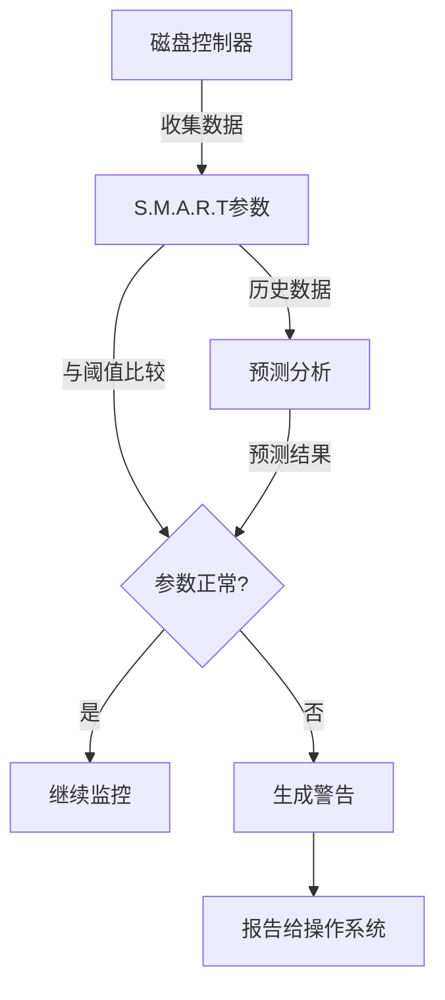

# 磁盘健康状态检查

磁盘是计算机系统中最容易出现故障的硬件之一，定期检查磁盘健康状态可以及时发现潜在问题并采取预防措施。本文将详细介绍Linux系统中检查磁盘健康状态的工具和方法，包括S.M.A.R.T监控、badblocks检测以及磁盘性能测试等内容。

## 磁盘故障的类型与征兆

在深入了解磁盘健康检查工具之前，首先需要了解常见的磁盘故障类型及其征兆，这有助于我们更好地理解和解释检测结果。

### 常见磁盘故障类型

1. **物理损坏**：磁盘表面划伤、磁头故障、电机失效等物理组件问题
2. **逻辑错误**：文件系统损坏、分区表错误、坏扇区等
3. **电子元件故障**：控制电路、接口电路故障
4. **固件问题**：磁盘固件缺陷或损坏

### 磁盘故障的早期征兆

以下征兆可能预示着磁盘即将发生故障：

1. **异常噪音**：咔哒声、摩擦声或嗡嗡声
2. **性能下降**：读写速度明显变慢、系统频繁卡顿
3. **频繁I/O错误**：系统日志中出现大量磁盘I/O错误
4. **文件系统错误**：无法解释的文件损坏或丢失
5. **启动问题**：系统启动时出现磁盘检测错误
6. **S.M.A.R.T警告**：S.M.A.R.T监控工具报告预警信息

## S.M.A.R.T技术简介

### 什么是S.M.A.R.T

S.M.A.R.T（Self-Monitoring, Analysis and Reporting Technology，自我监控、分析与报告技术）是一种硬盘自我监控系统，旨在检测和报告硬盘的各种可靠性指标，以预测可能的硬盘故障。

现代几乎所有的硬盘（包括HDD和SSD）都内置了S.M.A.R.T技术，它通过监控各种参数来评估磁盘的健康状态，如：

- 重新分配扇区计数
- 读写错误率
- 通电时间
- 温度
- 坏扇区数量
- 磁头飞行高度

### S.M.A.R.T的工作原理

S.M.A.R.T系统在磁盘内部工作，持续监控并记录关键参数：

1. **数据收集**：磁盘控制器持续收集各种操作参数和错误统计
2. **阈值比较**：将收集的数据与预设阈值进行比较
3. **状态报告**：当参数超过阈值时，向操作系统报告警告
4. **预测分析**：基于历史数据趋势预测可能的故障



## 使用smartctl检查磁盘健康状态

`smartctl`是Linux系统中最常用的S.M.A.R.T监控工具，它是smartmontools软件包的一部分。

### 安装smartmontools

```bash
# Debian/Ubuntu系统
apt-get install smartmontools

# RHEL/CentOS系统
yum install smartmontools

# Fedora系统
dnf install smartmontools

# Arch Linux系统
pacman -S smartmontools
```

### 基本使用方法

#### 检查磁盘是否支持S.M.A.R.T

```bash
smartctl -i /dev/sda
```

输出示例：
```
Model Family:     Samsung SSD 850 PRO
Device Model:     Samsung SSD 850 PRO 256GB
Serial Number:    S251NXAG123456
Firmware Version: EXM02B6Q
User Capacity:    256,060,514,304 bytes [256 GB]
Sector Size:      512 bytes logical/physical
Rotation Rate:    Solid State Device
Device is:        In smartctl database
ATA Version is:   ACS-2, ATA8-ACS T13/1699-D revision 4c
SATA Version is:  SATA 3.1, 6.0 Gb/s (current: 6.0 Gb/s)
Local Time is:    Mon Jan 01 12:00:00 2023 CST
SMART support is: Available - device has SMART capability.
SMART support is: Enabled
```

关键是查看最后两行，确认"SMART support is: Available"和"SMART support is: Enabled"。

#### 查看S.M.A.R.T健康状态摘要

```bash
smartctl -H /dev/sda
```

输出示例：
```
SMART overall-health self-assessment test result: PASSED
```

这是一个快速检查，如果结果是"PASSED"，表示磁盘当前状态良好；如果是"FAILED"，则表示磁盘可能即将故障，应立即备份数据并考虑更换磁盘。

#### 查看详细S.M.A.R.T属性

```bash
smartctl -a /dev/sda
```

这个命令会显示所有S.M.A.R.T属性和值，输出较长，包含大量信息。以下是部分关键属性的解释：

| ID | 属性名称 | 说明 | 警戒值 |
|----|---------|------|--------|
| 5 | Reallocated_Sector_Ct | 重新分配的扇区数 | 任何非零值都需关注 |
| 9 | Power_On_Hours | 通电时间 | 取决于磁盘类型 |
| 10 | Spin_Retry_Count | 主轴电机启动重试次数 | 任何非零值都需关注 |
| 184 | End-to-End_Error | 端到端数据传输错误 | 任何非零值都需关注 |
| 187 | Reported_Uncorrect | 无法纠正的错误数 | 任何非零值都需关注 |
| 188 | Command_Timeout | 命令超时次数 | 增长趋势需关注 |
| 197 | Current_Pending_Sector | 待处理扇区数 | 任何非零值都需关注 |
| 198 | Offline_Uncorrectable | 无法修复的扇区数 | 任何非零值都需关注 |

#### 查看错误日志

```bash
smartctl -l error /dev/sda
```

这个命令会显示磁盘记录的错误日志，包括读写错误、命令超时等。

#### 查看自检日志

```bash
smartctl -l selftest /dev/sda
```

显示之前运行的自检结果历史记录。

### 运行S.M.A.R.T自检

S.M.A.R.T提供了几种不同类型的自检，可以主动检查磁盘状态：

#### 短时间自检

短时间自检通常只需要几分钟完成，主要检查磁盘的关键组件：

```bash
smartctl -t short /dev/sda
```

#### 长时间自检

长时间自检会对整个磁盘表面进行扫描，根据磁盘大小可能需要几小时：

```bash
smartctl -t long /dev/sda
```

#### 传输自检

检查磁盘接口和数据传输路径：

```bash
smartctl -t conveyance /dev/sda
```

#### 查看自检结果

自检启动后，系统会显示预计完成时间。完成后，可以查看结果：

```bash
smartctl -l selftest /dev/sda
```

### 持续监控与自动化

#### 设置smartd守护进程

`smartd`是smartmontools包中的守护进程，可以持续监控磁盘健康状态并在发现问题时发出警报：

1. 编辑配置文件：

```bash
vi /etc/smartd.conf
```

2. 添加监控规则，例如：

```
/dev/sda -a -o on -S on -s (S/../.././02|L/../../6/03) -m admin@example.com -M exec /usr/local/bin/smart-notify.sh
```

这条规则的含义是：
- `-a`：监控所有属性
- `-o on`：启用自动离线数据收集
- `-S on`：启用属性自动保存
- `-s (S/../.././02|L/../../6/03)`：每天凌晨2点运行短时间自检，每周六凌晨3点运行长时间自检
- `-m admin@example.com`：发现问题时发送邮件通知
- `-M exec /usr/local/bin/smart-notify.sh`：发现问题时执行指定脚本

3. 启动并启用smartd服务：

```bash
systemctl start smartd
systemctl enable smartd
```

#### 创建通知脚本

创建一个简单的通知脚本`/usr/local/bin/smart-notify.sh`：

```bash
#!/bin/bash

# 获取设备名称和故障类型
DEVICE=$1
FAILTYPE=$2

# 记录到系统日志
logger -t smart-notify "SMART error ($FAILTYPE) detected on $DEVICE"

# 发送桌面通知(如果在桌面环境中)
if [ -n "$DISPLAY" ]; then
    XUSER=$(who | grep -m1 '(:0)' | cut -d' ' -f1)
    sudo -u $XUSER DISPLAY=:0 notify-send -u critical "磁盘警告" "设备 $DEVICE 检测到 SMART 错误: $FAILTYPE"
fi

# 可以添加其他通知方式，如短信、Slack等
```

确保脚本具有执行权限：

```bash
chmod +x /usr/local/bin/smart-notify.sh
```

## 使用badblocks检测坏扇区

虽然S.M.A.R.T可以报告许多磁盘问题，但有时需要直接扫描磁盘表面来检测坏扇区。`badblocks`是一个专门用于检测坏扇区的工具。

### 安装badblocks

在大多数Linux发行版中，`badblocks`是e2fsprogs包的一部分，通常已预装：

```bash
# 如果需要安装
apt-get install e2fsprogs  # Debian/Ubuntu
yum install e2fsprogs      # RHEL/CentOS
```

### 基本使用方法

#### 只读模式检测

这是最安全的检测方式，不会修改磁盘数据：

```bash
badblocks -v /dev/sda
```

参数说明：
- `-v`：显示详细输出

#### 非破坏性读写测试

这种模式会读取数据，写入相同的数据，然后再次读取进行验证：

```bash
badblocks -nsv /dev/sda
```

参数说明：
- `-n`：非破坏性读写测试
- `-s`：显示进度
- `-v`：显示详细输出

⚠️ **警告**：虽然这种模式理论上不会破坏数据，但在实际操作中仍有风险，建议在测试前备份重要数据。

#### 破坏性测试

这种模式会擦除磁盘上的所有数据，只应在新磁盘或不需要保留数据的磁盘上使用：

```bash
badblocks -wsv /dev/sda
```

参数说明：
- `-w`：破坏性写入测试
- `-s`：显示进度
- `-v`：显示详细输出

⚠️ **警告**：此操作将永久删除磁盘上的所有数据！

#### 指定测试模式

可以指定测试使用的模式（写入的数据模式）：

```bash
badblocks -wsv -t random /dev/sda
```

参数说明：
- `-t random`：使用随机数据模式（其他选项包括0xaa、0x55、0xff等）

#### 将坏块信息保存到文件

```bash
badblocks -v /dev/sda > bad-blocks.txt
```

这个命令会将检测到的坏块列表保存到文件中，可以在格式化时使用。

### 与文件系统工具集成

#### 在格式化时标记坏块

使用badblocks检测到的坏块信息可以在格式化文件系统时使用：

```bash
# 先运行badblocks
badblocks -v /dev/sda > bad-blocks.txt

# 在格式化时使用坏块列表
mkfs.ext4 -l bad-blocks.txt /dev/sda
```

#### 在现有文件系统中标记坏块

对于已有的ext文件系统，可以使用e2fsck工具标记坏块：

```bash
# 先运行badblocks
badblocks -v /dev/sda > bad-blocks.txt

# 使用e2fsck标记坏块
e2fsck -l bad-blocks.txt /dev/sda
```

## 磁盘性能测试

除了检查磁盘的物理健康状态，测试磁盘性能也是评估磁盘状况的重要方面。性能下降可能是磁盘问题的早期征兆。

### 使用dd进行简单测试

`dd`是一个简单但有效的工具，可以测试磁盘的读写速度：

#### 写入速度测试

```bash
# 写入1GB的测试文件
dd if=/dev/zero of=/tmp/test_file bs=1G count=1 oflag=direct
```

参数说明：
- `if=/dev/zero`：输入源（零设备，产生无限的空字符）
- `of=/tmp/test_file`：输出目标
- `bs=1G`：块大小为1GB
- `count=1`：写入1个块
- `oflag=direct`：使用直接I/O，绕过缓存

#### 读取速度测试

```bash
# 读取之前创建的测试文件
dd if=/tmp/test_file of=/dev/null bs=1G count=1 iflag=direct
```

参数说明：
- `if=/tmp/test_file`：输入源（之前创建的测试文件）
- `of=/dev/null`：输出目标（空设备，丢弃所有写入的数据）
- `iflag=direct`：使用直接I/O，绕过缓存

#### 清理测试文件

```bash
rm /tmp/test_file
```

### 使用hdparm测试

`hdparm`是一个用于获取和设置硬盘参数的工具，也可以用于性能测试：

#### 安装hdparm

```bash
apt-get install hdparm  # Debian/Ubuntu
yum install hdparm      # RHEL/CentOS
```

#### 测试磁盘读取速度

```bash
# 测试缓存读取速度
hdparm -T /dev/sda

# 测试实际磁盘读取速度
hdparm -t /dev/sda

# 同时测试两种速度
hdparm -Tt /dev/sda
```

输出示例：
```
 Timing cached reads:   14372 MB in  2.00 seconds = 7186.00 MB/sec
 Timing buffered disk reads: 456 MB in  3.01 seconds = 151.50 MB/sec
```

### 使用fio进行高级性能测试

`fio`(Flexible I/O Tester)是一个强大的I/O基准测试工具，可以模拟各种工作负载：

#### 安装fio

```bash
apt-get install fio  # Debian/Ubuntu
yum install fio      # RHEL/CentOS
```

#### 随机读写测试

创建一个测试配置文件`random-rw.fio`：

```
[global]
bs=4k
ioengine=libaio
iodepth=32
size=1g
direct=1
runtime=60
directory=/tmp

[random-read]
rw=randread
name=random-read

[random-write]
rw=randwrite
name=random-write
```

运行测试：

```bash
fio random-rw.fio
```

#### 顺序读写测试

创建一个测试配置文件`sequential-rw.fio`：

```
[global]
bs=1m
ioengine=libaio
iodepth=8
size=1g
direct=1
runtime=60
directory=/tmp

[sequential-read]
rw=read
name=sequential-read

[sequential-write]
rw=write
name=sequential-write
```

运行测试：

```bash
fio sequential-rw.fio
```

### 使用iostat监控磁盘I/O

`iostat`是一个用于监控系统I/O设备负载的工具，可以帮助识别性能瓶颈：

#### 安装iostat

```bash
apt-get install sysstat  # Debian/Ubuntu
yum install sysstat      # RHEL/CentOS
```

#### 基本使用

```bash
# 每2秒显示一次，共显示5次
iostat -xm 2 5
```

参数说明：
- `-x`：显示扩展统计信息
- `-m`：以MB为单位显示

输出示例：
```
Device:         rrqm/s   wrqm/s     r/s     w/s    rMB/s    wMB/s avgrq-sz avgqu-sz   await r_await w_await  svctm  %util
sda               0.00     0.50    0.00    2.00     0.00     0.01     8.00     0.00    0.00    0.00    0.00   0.00   0.00
```

关键指标解释：
- `r/s`, `w/s`：每秒读写请求数
- `rMB/s`, `wMB/s`：每秒读写MB数
- `await`：I/O请求的平均等待时间（毫秒）
- `%util`：设备利用率，接近100%表示设备饱和

## 固态硬盘(SSD)特殊检查

SSD与传统机械硬盘(HDD)的工作原理不同，因此有一些特殊的健康检查方法。

### SSD寿命评估

SSD有写入寿命限制，可以通过检查已写入的数据量来评估剩余寿命：

```bash
smartctl -a /dev/sda | grep -i "total_lba_written"
```

或者查看更直观的数据：

```bash
smartctl -a /dev/sda | grep -i "wear_leveling"
```

### 检查TRIM支持

TRIM命令允许操作系统通知SSD哪些数据块不再使用，这对SSD性能和寿命很重要：

```bash
# 检查文件系统是否启用TRIM
mount | grep discard

# 检查SSD是否支持TRIM
hdparm -I /dev/sda | grep -i TRIM
```

### 手动执行TRIM

对于支持TRIM的SSD，可以手动执行TRIM操作：

```bash
# 对单个文件系统执行TRIM
fstrim /

# 对所有支持TRIM的挂载点执行TRIM
fstrim -a

# 查看TRIM状态
fstrim -v /
```

### 设置定期TRIM

大多数现代Linux发行版已经配置了定期TRIM服务：

```bash
# 检查fstrim.timer是否启用
systemctl status fstrim.timer

# 如果未启用，可以启用它
systemctl enable fstrim.timer
systemctl start fstrim.timer
```

## 磁盘健康监控最佳实践

### 制定监控策略

1. **定期检查**：设置定期运行S.M.A.R.T自检的计划
2. **自动监控**：配置smartd守护进程持续监控磁盘状态
3. **性能基准**：建立磁盘性能基准，定期比较性能变化
4. **日志分析**：定期检查系统日志中的磁盘错误

### 预防性维护

1. **保持固件更新**：定期检查并更新磁盘固件
2. **温度控制**：确保系统有良好的散热，避免磁盘过热
3. **防震措施**：对于机械硬盘，避免物理震动
4. **电源保护**：使用UPS防止电源问题导致的磁盘损坏

### 数据备份策略

即使有最好的监控系统，磁盘故障仍然可能发生，因此备份至关重要：

1. **3-2-1备份原则**：
   - 保留至少3份数据副本
   - 使用至少2种不同的存储介质
   - 至少1份副本存储在异地

2. **定期测试恢复**：定期测试从备份恢复数据的过程，确保备份有效

### 故障响应计划

制定磁盘故障响应计划，包括：

1. **紧急备份**：当检测到磁盘即将故障时，立即进行完整备份
2. **更换流程**：准备好更换磁盘的流程和所需组件
3. **数据恢复**：了解数据恢复选项和服务提供商
4. **根本原因分析**：分析故障原因，防止类似问题再次发生

## 磁盘健康监控脚本示例

以下是一个综合性的磁盘健康监控脚本示例，可以定期运行以检查系统中所有磁盘的健康状态：

```bash
#!/bin/bash

# 磁盘健康监控脚本
# 用法: ./disk_health_check.sh [email@example.com]

# 设置邮件接收者
EMAIL=${1:-"admin@example.com"}
REPORT_FILE="/tmp/disk_health_report_$(date +%Y%m%d).txt"

# 清空报告文件
> $REPORT_FILE

# 添加系统信息
echo "===== 磁盘健康状态报告 =====" >> $REPORT_FILE
echo "主机名: $(hostname)" >> $REPORT_FILE
echo "日期: $(date)" >> $REPORT_FILE
echo "内核: $(uname -r)" >> $REPORT_FILE
echo "" >> $REPORT_FILE

# 获取所有物理磁盘
DISKS=$(lsblk -d -o NAME -n | grep -v loop)

# 检查每个磁盘
for DISK in $DISKS; do
    echo "===== 磁盘 /dev/$DISK 信息 =====" >> $REPORT_FILE
    
    # 基本信息
    echo "--- 基本信息 ---" >> $REPORT_FILE
    lsblk -o NAME,SIZE,MODEL,SERIAL /dev/$DISK >> $REPORT_FILE
    echo "" >> $REPORT_FILE
    
    # S.M.A.R.T状态
    echo "--- S.M.A.R.T健康状态 ---" >> $REPORT_FILE
    if smartctl -H /dev/$DISK >> $REPORT_FILE 2>&1; then
        # 检查关键S.M.A.R.T属性
        echo "" >> $REPORT_FILE
        echo "--- 关键S.M.A.R.T属性 ---" >> $REPORT_FILE
        smartctl -A /dev/$DISK | grep -E 'ID|Reallocated_Sector|Current_Pending_Sector|Offline_Uncorrectable|Power_On_Hours|Temperature|UDMA_CRC_Error|Wear_Leveling' >> $REPORT_FILE
        
        # 检查错误日志
        echo "" >> $REPORT_FILE
        echo "--- S.M.A.R.T错误日志 ---" >> $REPORT_FILE
        smartctl -l error /dev/$DISK | head -20 >> $REPORT_FILE
    else
        echo "此设备不支持S.M.A.R.T或S.M.A.R.T未启用" >> $REPORT_FILE
    fi
    
    # 磁盘性能测试（简单）
    echo "" >> $REPORT_FILE
    echo "--- 磁盘性能测试 ---" >> $REPORT_FILE
    echo "读取速度测试:" >> $REPORT_FILE
    hdparm -t /dev/$DISK 2>/dev/null >> $REPORT_FILE || echo "无法执行hdparm测试" >> $REPORT_FILE
    
    echo "" >> $REPORT_FILE
    echo "----------------------------------------" >> $REPORT_FILE
    echo "" >> $REPORT_FILE
done

# 文件系统使用情况
echo "===== 文件系统使用情况 =====" >> $REPORT_FILE
df -h >> $REPORT_FILE

# 检查是否有警告或错误
if grep -E 'FAILING|FAILED|failure|error|Error|WARNING|warning' $REPORT_FILE > /dev/null; then
    SUBJECT="[警告] 磁盘健康状态报告 - $(hostname)"
else
    SUBJECT="磁盘健康状态报告 - $(hostname)"
fi

# 发送报告
if command -v mail > /dev/null; then
    cat $REPORT_FILE | mail -s "$SUBJECT" $EMAIL
    echo "报告已发送至 $EMAIL"
else
    echo "mail命令不可用，报告保存在 $REPORT_FILE"
fi

# 保存报告副本
cp $REPORT_FILE /var/log/disk_health_$(date +%Y%m%d).txt
```

将此脚本保存为`disk_health_check.sh`，添加执行权限，并设置为定期运行：

```bash
chmod +x disk_health_check.sh

# 添加到crontab，每周运行一次
(crontab -l 2>/dev/null; echo "0 0 * * 0 /path/to/disk_health_check.sh admin@example.com") | crontab -
```

## 总结

定期检查磁盘健康状态是系统维护的重要组成部分，可以帮助及时发现潜在问题，防止数据丢失和系统宕机。本文详细介绍了多种磁盘健康检查工具和方法：

1. **S.M.A.R.T监控**：使用smartctl和smartd检查磁盘内部健康指标
2. **坏扇区检测**：使用badblocks扫描磁盘表面查找坏扇区
3. **性能测试**：使用dd、hdparm和fio测试磁盘性能
4. **SSD特殊检查**：针对SSD的特殊检查和维护方法
5. **监控最佳实践**：制定完整的磁盘监控策略和故障响应计划

通过综合使用这些工具和方法，系统管理员可以全面了解磁盘健康状态，及时发现并解决潜在问题，确保系统的稳定运行和数据安全。

记住，没有任何监控工具能100%预测所有磁盘故障，因此良好的备份策略始终是数据保护的最后一道防线。定期备份数据，并确保备份可以成功恢复，是防范磁盘故障最有效的方法。