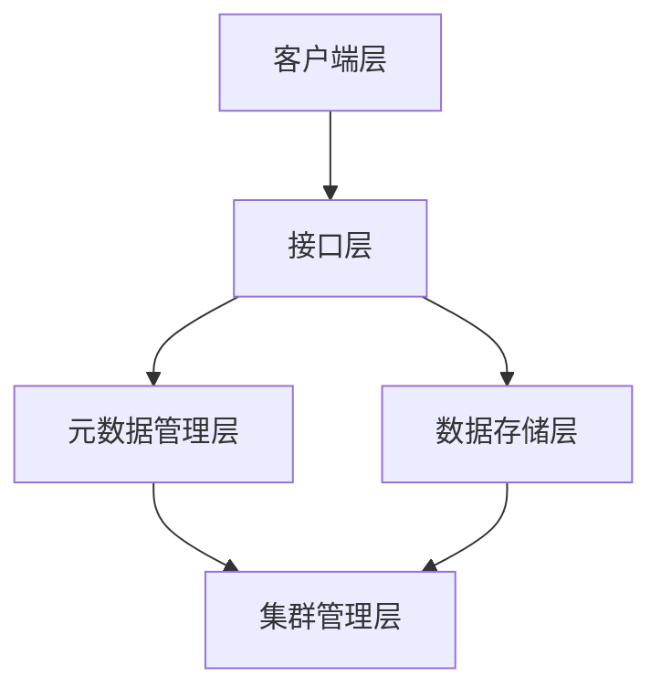
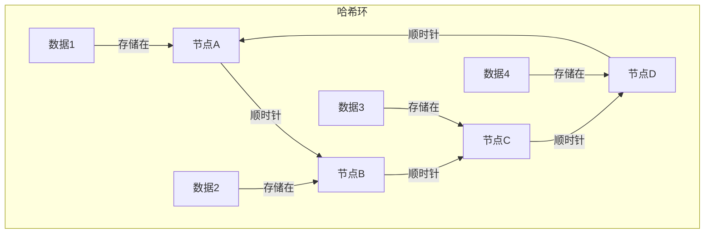
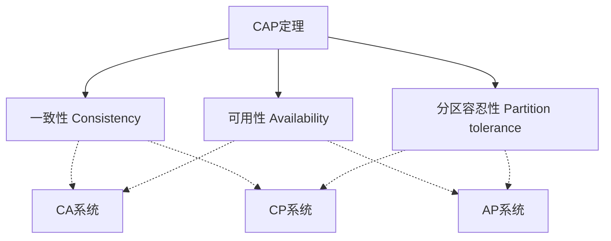

# 分布式存储系统原理

分布式存储系统是将数据分散存储在多个物理节点上，通过网络协同工作提供统一存储服务的系统。本文将详细介绍分布式存储系统的基本原理、架构设计和关键技术，帮助读者理解现代大规模数据存储的核心机制。

## 分布式存储基本概念

分布式存储系统是一种将数据分布在多个物理节点上的存储架构，通过集群技术提供高可扩展性、高可用性和高性能的存储服务。与传统的集中式存储相比，分布式存储具有以下特点：

1. **可扩展性**：通过添加新节点线性扩展存储容量和性能
2. **高可用性**：通过数据冗余和多副本技术确保系统可靠性
3. **容错能力**：能够在部分节点故障的情况下继续提供服务
4. **负载均衡**：将数据和访问请求分散到多个节点，避免单点瓶颈

### 分布式存储系统的发展历程

分布式存储系统的发展经历了多个阶段，每个阶段都解决了不同的技术挑战：

1. **早期文件系统（1980-1990年代）**：如NFS（网络文件系统）和AFS（Andrew文件系统），提供了基本的网络文件共享功能，但扩展性和容错性有限。

2. **分布式文件系统（1990-2000年代）**：如GFS（Google文件系统）和HDFS（Hadoop分布式文件系统），专为大规模数据处理设计，提供了更好的扩展性和容错性。

3. **云存储时代（2000年代至今）**：如Amazon S3、OpenStack Swift等对象存储系统，以及各种分布式键值存储和NoSQL数据库，为云计算环境提供了灵活、高可用的存储服务。

4. **新一代分布式存储（2010年代至今）**：如Ceph、GlusterFS等统一存储系统，提供块存储、文件存储和对象存储多种接口，满足不同应用场景的需求。

### 分布式存储系统的分类

根据存储模型和接口类型，分布式存储系统可以分为以下几类：

#### 分布式文件存储

提供类似于传统文件系统的接口，支持文件和目录的层次结构，适合存储非结构化数据。

**代表系统**：
- HDFS（Hadoop分布式文件系统）
- GlusterFS
- MooseFS
- Lustre（高性能计算领域）

**特点**：
- 支持POSIX或类POSIX文件接口
- 适合大文件存储和顺序访问
- 通常提供强一致性保证

#### 分布式块存储

将存储空间划分为固定大小的块，提供类似于物理硬盘的接口，适合需要原始存储访问的应用。

**代表系统**：
- Ceph RBD（RADOS块设备）
- Amazon EBS（弹性块存储）
- OpenStack Cinder

**特点**：
- 提供原始块设备接口
- 适合数据库、虚拟机等需要低延迟和高IOPS的场景
- 通常支持快照和克隆功能

#### 分布式对象存储

将数据作为对象存储，每个对象包含数据、元数据和全局唯一标识符，通过HTTP/REST API访问。

**代表系统**：
- Amazon S3
- OpenStack Swift
- Ceph RADOS Gateway
- MinIO

**特点**：
- 高度可扩展，适合PB级数据存储
- 通过HTTP/REST API访问
- 适合静态内容、备份、归档等场景
- 通常提供最终一致性

#### 分布式键值存储

将数据存储为键值对，提供简单的查询接口，适合高吞吐量的应用场景。

**代表系统**：
- Redis Cluster
- Cassandra
- Riak
- DynamoDB

**特点**：
- 简单的键值访问模型
- 高性能、高吞吐量
- 可调节的一致性级别
- 适合缓存、会话存储等场景

## 分布式存储系统架构

分布式存储系统通常采用多层架构设计，每一层负责不同的功能，共同协作提供完整的存储服务。

### 典型的分层架构

#### 客户端层

客户端层是用户或应用程序与分布式存储系统交互的入口，负责处理用户请求并转发到适当的服务节点。

**主要功能**：
- 提供API或客户端库供应用程序调用
- 处理请求路由和负载均衡
- 实现客户端缓存以提高性能
- 处理认证和授权

#### 接口层

接口层提供不同类型的存储接口，如文件接口、块接口或对象接口，满足不同应用场景的需求。

**主要功能**：
- 协议转换（如将REST请求转换为内部操作）
- 请求验证和权限检查
- 接口兼容性维护（如S3兼容接口）

#### 元数据管理层

元数据管理层负责管理数据的位置、属性和状态信息，是分布式存储系统的"大脑"。

**主要功能**：
- 维护数据分布和位置映射
- 管理文件/对象的元数据（如名称、大小、权限等）
- 处理命名空间和目录结构
- 协调分布式锁和一致性控制

#### 数据存储层

数据存储层负责实际数据的存储和检索，通常由多个存储节点组成。

**主要功能**：
- 数据分片和复制
- 数据读写操作
- 数据压缩和加密
- 数据完整性检查

#### 集群管理层

集群管理层负责监控和管理整个存储集群的状态，确保系统的可靠运行。

**主要功能**：
- 节点健康监控
- 故障检测和恢复
- 资源调度和负载均衡
- 集群配置管理

### 分布式存储系统的组件

#### 存储节点

存储节点是分布式存储系统的基本单元，负责实际数据的存储和处理。

**组成部分**：
- 计算资源（CPU、内存）
- 存储资源（硬盘、SSD）
- 网络接口
- 本地存储软件

**功能**：
- 执行数据读写操作
- 参与数据复制和同步
- 执行本地数据完整性检查
- 向集群管理层报告状态

#### 元数据服务器

元数据服务器管理数据的位置和属性信息，是系统的核心组件。

**设计模式**：
1. **集中式元数据服务**：如HDFS的NameNode，简单但可能成为单点故障和性能瓶颈
2. **分布式元数据服务**：如Ceph的CRUSH算法，提高可扩展性和可靠性
3. **混合式元数据服务**：结合集中式和分布式的优点，如GFS的master-slave架构

**关键技术**：
- 元数据缓存
- 元数据分片
- 元数据复制和一致性维护

#### 协调服务

协调服务负责管理集群成员关系、配置信息和分布式锁等，确保集群的一致性和可靠性。

**常用实现**：
- ZooKeeper
- etcd
- Consul

**主要功能**：
- 集群成员管理
- 分布式锁服务
- 配置管理
- 领导者选举

#### 客户端

客户端是用户或应用程序与分布式存储系统交互的接口，负责处理用户请求并转发到适当的服务节点。

**类型**：
- 文件系统客户端（如FUSE接口）
- 块设备客户端（如iSCSI、NBD）
- 对象存储客户端（如S3 SDK）
- 原生API客户端

## 关键技术与算法

### 数据分布与定位

数据分布是分布式存储系统的核心问题，决定了如何将数据分散到多个节点以实现负载均衡和高可用性。

#### 一致性哈希

一致性哈希是一种特殊的哈希算法，用于将数据均匀分布到多个节点，并在节点加入或离开时最小化数据迁移。

**工作原理**：
1. 将哈希空间表示为一个环（0到2^n-1）
2. 将存储节点和数据项映射到环上的位置
3. 数据项存储在顺时针方向上的第一个节点

**优点**：
- 节点加入或离开时，只影响相邻节点的数据分布
- 数据迁移量与节点数成反比，而不是与数据总量成正比
- 支持虚拟节点技术，进一步提高负载均衡性

**应用系统**：
- Cassandra
- Riak
- Amazon Dynamo

#### CRUSH算法

CRUSH（Controlled Replication Under Scalable Hashing）是Ceph使用的数据分布算法，提供确定性的数据放置策略。

**工作原理**：
1. 使用层次化的集群地图（CRUSH map）描述存储拓扑
2. 基于数据标识符和放置规则计算数据位置
3. 考虑故障域和权重进行智能数据放置

**优点**：
- 完全分布式，无中心元数据服务器
- 支持复杂的数据放置策略和故障域隔离
- 高效的数据重新平衡

**应用系统**：
- Ceph

#### 分片与分区

分片（Sharding）是将大型数据集分割成多个较小部分的技术，每个分片可以独立存储和处理。

**分片策略**：
1. **范围分片**：基于键的范围划分数据
2. **哈希分片**：基于键的哈希值划分数据
3. **目录分片**：基于目录或前缀划分数据
4. **动态分片**：根据负载动态调整分片

**优点**：
- 提高并行处理能力
- 均衡存储负载
- 支持局部性优化

**挑战**：
- 分片再平衡
- 跨分片操作的一致性
- 热点问题

### 数据复制与一致性

数据复制是提高分布式存储系统可用性和性能的关键技术，但同时也带来了数据一致性的挑战。

#### 复制策略

**同步复制**：
- 写操作必须在所有副本确认后才返回成功
- 提供强一致性保证
- 延迟较高，可用性受限于最慢的副本

**异步复制**：
- 写操作在主副本确认后即返回成功
- 提供较弱的一致性保证
- 延迟较低，可用性高

**半同步复制**：
- 写操作在部分副本（如多数派）确认后返回成功
- 平衡一致性和性能
- 常用于分布式共识算法

#### 一致性模型

分布式系统中的一致性模型定义了系统对并发操作的行为保证。

**强一致性**：
- 所有读操作都能看到最新的写入结果
- 实现复杂，性能开销大
- 适用于需要严格数据正确性的场景

**最终一致性**：
- 在没有新的更新的情况下，最终所有副本都会收敛到相同的状态
- 性能好，可用性高
- 适用于对一致性要求不严格的场景

**因果一致性**：
- 保证因果相关的操作按正确顺序被观察到
- 比强一致性开销小，比最终一致性保证强
- 适用于需要保持操作顺序的场景

**会话一致性**：
- 在单个客户端会话内提供读自己写的一致性
- 不同会话之间可能看到不同的视图
- 适用于用户交互型应用

#### CAP定理与PACELC

**CAP定理**：在分布式系统中，一致性（Consistency）、可用性（Availability）和分区容忍性（Partition tolerance）三者不可能同时满足，最多只能满足其中两个。

**PACELC扩展**：当网络分区发生时（P），系统必须在可用性（A）和一致性（C）之间做出选择；即使在没有分区的情况下（E），系统也必须在延迟（L）和一致性（C）之间做出选择。

**系统定位**：
- **CP系统**：如HBase、Redis Cluster，优先保证一致性
- **AP系统**：如Cassandra、DynamoDB，优先保证可用性
- **CA系统**：如传统关系数据库，在分区情况下无法同时保证一致性和可用性

#### 分布式共识算法

分布式共识算法用于确保分布式系统中的多个节点就某个值达成一致，是实现强一致性的基础。

**Paxos算法**：
- 由Leslie Lamport提出的经典分布式共识算法
- 基于多数派投票机制
- 复杂难以实现，但理论基础坚实

**Raft算法**：
- 设计目标是易于理解和实现的共识算法
- 将问题分解为领导者选举、日志复制和安全性三个子问题
- 使用心跳机制和随机超时来避免选举冲突

**ZAB（ZooKeeper Atomic Broadcast）**：
- ZooKeeper使用的原子广播协议
- 类似于Paxos，但针对主备模式优化
- 支持崩溃恢复和原子广播

**应用系统**：
- ZooKeeper（ZAB）
- etcd（Raft）
- Consul（Raft）
- Chubby（Paxos）

### 数据可靠性与容错

分布式存储系统面临各种故障风险，需要采用多种技术确保数据可靠性和系统容错能力。

#### 纠删码技术

纠删码（Erasure Coding）是一种数据保护技术，通过将数据编码成多个片段，并添加冗余信息，在部分片段丢失的情况下仍能恢复原始数据。

**工作原理**：
- 将数据分割成k个数据块
- 生成m个校验块
- 只需要任意k个块就能恢复原始数据

**常见编码方案**：
- Reed-Solomon编码：经典的纠删码算法，平衡存储效率和计算复杂度
- LRC（Locally Repairable Code）：优化修复性能的编码方案
- Fountain Codes：适用于分布式存储的率性编码

**与复制的比较**：
- 存储效率：纠删码通常比多副本复制更节省存储空间
- 修复开销：纠删码的修复通常需要更多的网络带宽和计算资源
- 访问延迟：纠删码的读取可能需要额外的解码操作，增加延迟

**应用系统**：
- HDFS-EC
- Ceph（RADOS）
- Azure Storage
- Facebook冷存储

#### 故障检测与恢复

有效的故障检测和快速恢复是保证分布式存储系统高可用性的关键。

**故障检测机制**：
1. **心跳检测**：节点定期发送心跳消息，超时未收到则判定为故障
2. **Gossip协议**：节点间传播状态信息，检测故障
3. **Phi Accrual故障检测器**：基于概率的自适应故障检测算法
4. **多级故障检测**：结合多种机制提高准确性

**故障恢复策略**：
1. **数据重建**：从剩余副本或纠删码重建丢失数据
2. **自动再平衡**：重新分配数据以恢复均衡状态
3. **降级运行**：在部分节点故障时提供有限服务
4. **快速故障转移**：将服务从故障节点迅速转移到健康节点

**挑战**：
- 网络分区与"脑裂"问题
- 大规模重建的性能影响
- 级联故障风险

#### 数据完整性保护

确保数据在存储和传输过程中不被损坏是分布式存储系统的基本要求。

**校验和技术**：
- CRC（循环冗余校验）：检测数据传输和存储错误
- MD5/SHA：用于验证大块数据的完整性
- 分层校验和：在不同层次验证数据完整性

**端到端数据保护**：
- 从客户端到存储节点的全路径数据完整性验证
- 写入时验证和读取时验证相结合
- 定期后台数据完整性扫描

**静默数据损坏检测**：
- 定期数据擦洗（scrubbing）
- 副本比较
- 基于校验和的损坏检测

### 性能优化技术

分布式存储系统需要通过各种技术优化来提高性能，满足不同应用场景的需求。

#### 缓存策略

缓存是提高分布式存储系统性能的关键技术，可以减少网络传输和磁盘访问。

**多级缓存**：
- 客户端缓存：减少网络请求
- 服务端内存缓存：减少磁盘访问
- SSD缓存：作为内存和HDD之间的缓冲层

**缓存一致性**：
- 基于时间的缓存失效（TTL）
- 基于事件的缓存失效（如数据更新时）
- 缓存一致性协议（如MESI）

**缓存预取**：
- 顺序预取：适用于顺序访问模式
- 基于模式的预取：根据历史访问模式预测
- 应用提示预取：应用程序提供访问提示

#### I/O优化

I/O操作是分布式存储系统的主要性能瓶颈，需要通过多种技术进行优化。

**I/O调度**：
- 请求合并：将多个小请求合并为大请求
- 请求排序：重新排序请求以减少磁盘寻道
- 优先级调度：根据请求重要性分配资源

**异步I/O**：
- 非阻塞操作：提高并发处理能力
- 批量处理：减少系统调用开销
- 事件驱动架构：高效处理大量并发请求

**零拷贝技术**：
- 减少数据在内核空间和用户空间之间的复制
- 直接内存访问（DMA）
- 内存映射文件（mmap）

#### 负载均衡

负载均衡是确保分布式存储系统各节点资源利用率均衡的关键技术。

**静态负载均衡**：
- 基于哈希的请求分发
- 轮询（Round Robin）
- 一致性哈希

**动态负载均衡**：
- 基于负载的请求路由
- 热点数据迁移
- 自适应复制因子

**负载监控与预测**：
- 实时负载监控
- 负载趋势分析
- 基于预测的资源分配

## 分布式存储系统案例分析

### Ceph：统一存储系统

Ceph是一个开源的分布式存储系统，提供对象、块和文件存储接口，适用于各种规模的存储需求。

#### 架构特点

**RADOS（Reliable Autonomic Distributed Object Store）**：
- Ceph的核心组件，提供可靠的分布式对象存储
- 由多个OSD（Object Storage Daemon）组成，每个OSD管理一个物理磁盘
- 使用CRUSH算法进行数据分布，无中心化设计

**CRUSH算法**：
- 控制数据放置的确定性算法
- 考虑故障域和设备权重
- 支持复杂的数据放置策略

**Monitor**：
- 维护集群地图（cluster map）
- 提供一致性保证
- 管理集群成员关系

**接口层**：
- RBD（RADOS Block Device）：块存储接口
- RGW（RADOS Gateway）：对象存储接口，兼容S3和Swift
- CephFS：POSIX兼容的文件系统接口

#### 数据流程

**写入流程**：
1. 客户端计算对象的位置（使用CRUSH算法）
2. 客户端直接与主OSD通信
3. 主OSD复制数据到从OSD
4. 所有OSD确认后，主OSD回复客户端

**读取流程**：
1. 客户端计算对象的位置
2. 客户端直接从主OSD读取数据
3. 如果主OSD不可用，可以从从OSD读取

#### 优势与挑战

**优势**：
- 统一的存储平台，支持多种接口
- 高度可扩展，可以扩展到EB级别
- 无单点故障，自动数据恢复
- 开源社区活跃

**挑战**：
- 复杂的配置和管理
- 对网络性能要求高
- 小文件性能相对较弱
- 调优需要专业知识

### HDFS：大数据分布式文件系统

Hadoop分布式文件系统（HDFS）是为大数据处理框架Hadoop设计的分布式文件系统，专注于大文件存储和批处理工作负载。

#### 架构特点

**NameNode**：
- 中心化的元数据服务器
- 管理文件系统命名空间和数据块映射
- 记录数据块位置和文件属性

**DataNode**：
- 存储实际数据块
- 定期向NameNode报告状态
- 执行数据块复制和删除操作

**块存储**：
- 默认块大小为128MB（早期版本为64MB）
- 每个块在多个DataNode上存储多个副本（默认3个）
- 针对大文件和顺序访问优化

#### 数据流程

**写入流程**：
1. 客户端向NameNode请求创建文件
2. NameNode分配数据块和DataNode列表
3. 客户端直接向第一个DataNode写入数据
4. 数据通过管道方式复制到其他DataNode
5. 所有DataNode确认后，写入完成

**读取流程**：
1. 客户端向NameNode请求文件块位置
2. NameNode返回每个块的DataNode列表
3. 客户端直接从最近的DataNode读取数据

#### 优势与挑战

**优势**：
- 针对大文件和批处理优化
- 与Hadoop生态系统紧密集成
- 高吞吐量设计
- 成熟稳定，广泛应用

**挑战**：
- NameNode单点故障风险（HDFS Federation和HA部分解决）
- 不适合小文件和随机访问
- 不支持文件随机写入和修改
- 元数据操作可能成为瓶颈

### GlusterFS：分布式文件系统

GlusterFS是一个可扩展的分布式文件系统，设计用于云存储和媒体流等应用场景。

#### 架构特点

**无中心化设计**：
- 没有专用的元数据服务器
- 使用分布式哈希表（DHT）进行文件定位
- 所有节点对等工作

**Brick**：
- 基本存储单元，通常是服务器上的一个导出目录
- 多个Brick组成Volume
- 支持不同的Volume类型（分布式、复制、条带化等）

**Translator**：
- 模块化的功能组件
- 以堆栈方式组合，提供各种功能
- 包括复制、条带化、缓存、加密等功能

#### 数据流程

**写入流程**：
1. 客户端根据DHT算法确定文件位置
2. 客户端直接向对应的Brick写入数据
3. 如果配置了复制，数据会同步到其他Brick

**读取流程**：
1. 客户端根据DHT算法确定文件位置
2. 客户端直接从对应的Brick读取数据
3. 如果原始Brick不可用，可以从复制Brick读取

#### 优势与挑战

**优势**：
- 简单易用，配置灵活
- 无中心化设计，没有单点故障
- 支持POSIX兼容的文件系统接口
- 可以动态扩展存储容量

**挑战**：
- 元数据操作性能较弱
- 大规模集群下性能可能下降
- 复杂操作可能导致一致性问题
- 自动修复能力有限

### MinIO：轻量级对象存储

MinIO是一个高性能的轻量级对象存储服务器，兼容Amazon S3 API，适用于私有云和边缘计算场景。

#### 架构特点

**简单设计**：
- 单一二进制文件，易于部署
- 无外部依赖，自包含系统
- 支持分布式和单机模式

**纠删码保护**：
- 默认使用Reed-Solomon纠删
我将继续为您编写关于分布式存储系统原理的内容。

#### 架构特点（续）

**纠删码保护**：
- 默认使用Reed-Solomon纠删码提供数据保护
- 支持N/2数据丢失的容错能力
- 比传统复制方法节省50%的存储空间

**分布式锁**：
- 基于命名空间的分布式锁机制
- 支持读写锁和租约
- 确保分布式环境下的数据一致性

**多租户支持**：
- 基于IAM（身份和访问管理）的访问控制
- 支持策略和角色
- 兼容S3的访问控制列表（ACL）

#### 数据流程

**写入流程**：
1. 客户端通过S3 API发送PUT请求
2. 服务器验证请求并分配唯一对象ID
3. 数据被分割成多个部分并应用纠删码
4. 编码后的数据分布存储在多个磁盘上

**读取流程**：
1. 客户端通过S3 API发送GET请求
2. 服务器定位对象的所有部分
3. 读取足够的部分以重建对象（即使部分磁盘不可用）
4. 重组数据并返回给客户端

#### 优势与挑战

**优势**：
- 轻量级，资源消耗低
- 高性能，适合边缘计算
- 完全兼容S3 API
- 简单易用，维护成本低

**挑战**：
- 功能相对简单，不适合复杂存储需求
- 大规模部署下管理复杂度增加
- 元数据性能在大量小文件场景下可能受限
- 企业级功能需要商业版本

## 分布式存储系统的挑战与解决方案

### 扩展性挑战

随着数据量的增长，分布式存储系统面临各种扩展性挑战。

#### 元数据扩展

**挑战**：
- 元数据服务器成为瓶颈
- 内存限制元数据规模
- 元数据操作延迟增加

**解决方案**：
1. **元数据分片**：
   - 将元数据分散到多个服务器
   - 基于命名空间或哈希进行分片
   - 例如：HDFS Federation、CephFS多MDS

2. **分层元数据管理**：
   - 热门元数据保存在内存
   - 冷门元数据存储在磁盘
   - 使用缓存加速访问

3. **元数据去中心化**：
   - 使用分布式算法计算数据位置
   - 减少中心化元数据依赖
   - 例如：Ceph的CRUSH算法、GlusterFS的DHT

#### 数据再平衡

**挑战**：
- 节点添加或删除后数据分布不均
- 再平衡过程消耗大量资源
- 再平衡期间性能下降

**解决方案**：
1. **增量再平衡**：
   - 逐步移动数据而非一次性迁移
   - 限制再平衡带宽和资源使用
   - 例如：Cassandra的节点移动

2. **智能数据放置**：
   - 考虑硬件能力和负载进行数据放置
   - 使用权重调整数据分布
   - 例如：Ceph的CRUSH权重调整

3. **后台再平衡**：
   - 在系统负载低时执行再平衡
   - 优先级低于用户请求
   - 可暂停和恢复的再平衡过程

### 性能挑战

分布式存储系统需要在各种工作负载下提供高性能，这带来了多方面的挑战。

#### 延迟敏感型应用

**挑战**：
- 网络延迟增加访问时间
- 一致性协议引入额外延迟
- 负载波动导致性能不稳定

**解决方案**：
1. **多层缓存**：
   - 客户端缓存减少网络请求
   - 边缘缓存减少距离延迟
   - 服务端缓存加速热点数据访问

2. **局部性优化**：
   - 数据就近放置
   - 感知拓扑的数据访问
   - 例如：HDFS的机架感知策略

3. **服务质量保证**：
   - 资源隔离和预留
   - 请求优先级管理
   - 流量控制和限流

#### 小文件处理

**挑战**：
- 大量小文件导致元数据膨胀
- 小文件I/O效率低下
- 存储碎片化

**解决方案**：
1. **文件合并**：
   - 将小文件合并为大文件
   - 使用容器格式（如HAR、SequenceFile）
   - 例如：HDFS的HAR（Hadoop Archive）

2. **元数据优化**：
   - 批量元数据操作
   - 元数据缓存和预取
   - 例如：Lustre的目录索引

3. **分层存储**：
   - 小文件存储在SSD
   - 大文件存储在HDD
   - 自动数据分级

### 可靠性挑战

确保数据在各种故障情况下的安全是分布式存储系统的核心挑战。

#### 大规模故障恢复

**挑战**：
- 大容量磁盘恢复时间长
- 恢复过程中系统脆弱
- 网络带宽限制恢复速度

**解决方案**：
1. **分布式恢复**：
   - 多个节点并行参与恢复
   - 负载均衡的恢复任务分配
   - 例如：Ceph的并行恢复

2. **增量恢复**：
   - 只恢复活跃数据
   - 优先恢复热点数据
   - 延迟恢复冷数据

3. **本地修复**：
   - 使用局部冗余信息修复
   - 减少跨机架网络流量
   - 例如：Facebook的本地重建码（LRC）

#### 静默数据损坏

**挑战**：
- 硬件错误导致的数据损坏难以检测
- 损坏可能在多个层次发生
- 长期存储面临更高风险

**解决方案**：
1. **端到端校验**：
   - 从客户端到存储的全路径校验
   - 读取时验证数据完整性
   - 例如：ZFS的校验和验证

2. **定期数据擦洗**：
   - 主动扫描和验证存储数据
   - 发现问题及时修复
   - 例如：Ceph的深度擦洗

3. **多级数据保护**：
   - 结合校验和、复制和纠删码
   - 不同层次的保护机制
   - 例如：HDFS的块校验和+复制

### 管理复杂性

随着规模增长，分布式存储系统的管理复杂性也显著增加。

#### 监控与故障诊断

**挑战**：
- 大量节点和组件需要监控
- 故障原因复杂多样
- 问题定位困难

**解决方案**：
1. **分层监控系统**：
   - 硬件、系统、服务多层监控
   - 自动聚合和关联告警
   - 例如：Prometheus+Grafana监控栈

2. **分布式追踪**：
   - 跟踪请求在系统中的完整路径
   - 识别性能瓶颈和异常
   - 例如：Jaeger、Zipkin

3. **智能根因分析**：
   - 基于机器学习的异常检测
   - 自动关联事件和日志
   - 预测性故障分析

#### 版本升级与兼容性

**挑战**：
- 在线升级不中断服务
- 保持向后兼容性
- 大规模集群升级复杂

**解决方案**：
1. **滚动升级**：
   - 逐个节点或组件升级
   - 保持服务持续可用
   - 例如：Ceph的滚动升级

2. **兼容性层**：
   - 支持多版本协议
   - 提供兼容性API
   - 渐进式功能迁移

3. **蓝绿部署**：
   - 并行维护两个版本的系统
   - 逐步将流量切换到新版本
   - 支持快速回滚

## 分布式存储系统的未来趋势

### 新兴硬件技术的影响

新型存储硬件正在改变分布式存储系统的设计和实现。

#### 非易失性内存（NVM）

**技术特点**：
- 持久性接近存储，性能接近内存
- 字节寻址而非块寻址
- 例如：Intel Optane、NVDIMM

**对分布式存储的影响**：
1. **存储层次重构**：
   - NVM作为内存和SSD之间的新层次
   - 用于元数据存储和缓存
   - 减少持久化开销

2. **一致性模型简化**：
   - 降低复制和日志开销
   - 支持更高效的事务处理
   - 例如：PMDK（持久内存开发套件）

3. **新型存储架构**：
   - 专为NVM优化的文件系统和数据结构
   - 减少传统I/O栈开销
   - 例如：NOVA、PMFS

#### 计算存储融合

**技术特点**：
- 在存储设备内部执行计算
- 减少数据移动
- 例如：计算型SSD、SmartNIC

**对分布式存储的影响**：
1. **数据本地处理**：
   - 将计算推送到数据所在位置
   - 减少网络传输和延迟
   - 例如：Samsung SmartSSD

2. **存储侧过滤和聚合**：
   - 在存储层执行基本数据处理
   - 只返回处理结果
   - 例如：Hadoop的存储侧计算

3. **分布式查询优化**：
   - 智能数据放置和查询规划
   - 利用存储计算能力
   - 例如：Spark与计算存储的集成

### 软件定义存储的演进

软件定义存储正在向更高级别的抽象和自动化方向发展。

#### 容器化与微服务架构

**趋势特点**：
- 存储服务容器化部署
- 微服务化的存储组件
- 与Kubernetes等平台集成

**发展方向**：
1. **容器原生存储**：
   - 专为容器环境设计的存储系统
   - 支持动态配置和生命周期管理
   - 例如：Rook、Longhorn

2. **存储编排**：
   - 自动化存储资源分配和管理
   - 基于策略的存储服务
   - 例如：Kubernetes CSI（容器存储接口）

3. **多云存储抽象**：
   - 统一不同云平台的存储接口
   - 数据无缝迁移和复制
   - 例如：MinIO多云网关

#### 自治存储系统

**趋势特点**：
- 自我管理和自我修复
- 基于AI的存储优化
- 极简的人工干预

**发展方向**：
1. **自适应数据放置**：
   - 根据访问模式自动调整数据位置
   - 智能热点检测和缓解
   - 例如：TiKV的热点调度

2. **预测性维护**：
   - 基于机器学习预测硬件故障
   - 在故障发生前主动迁移数据
   - 例如：Google的磁盘故障预测

3. **自优化性能**：
   - 自动调整系统参数
   - 学习工作负载特征
   - 例如：Oracle自治数据库存储

### 边缘计算与分布式存储

边缘计算的兴起为分布式存储带来了新的挑战和机遇。

#### 边缘-云协同存储

**趋势特点**：
- 数据在边缘和云之间流动
- 有限资源环境下的存储
- 间歇性连接的容错

**发展方向**：
1. **分层数据管理**：
   - 边缘存储热数据和时间敏感数据
   - 云端存储冷数据和长期数据
   - 智能数据同步和迁移

2. **边缘缓存**：
   - 智能预缓存和预测
   - 本地优先访问策略
   - 断连时的本地服务保障

3. **轻量级分布式存储**：
   - 为资源受限设备优化
   - 低带宽环境下高效同步
   - 例如：EdgeFS、Minio Edge

#### 物联网数据存储

**趋势特点**：
- 海量设备产生的时序数据
- 异构数据类型
- 实时处理需求

**发展方向**：
1. **时序数据优化**：
   - 专为IoT数据设计的存储格式
   - 高效压缩和索引
   - 例如：InfluxDB、TimescaleDB

2. **事件驱动存储**：
   - 基于事件的数据捕获和处理
   - 流处理与存储集成
   - 例如：Apache Kafka与存储的集成

3. **边缘智能**：
   - 本地数据分析和过滤
   - 只将有价值的数据发送到云端
   - 例如：AWS IoT Greengrass

## 总结与展望

分布式存储系统是现代数据中心和云计算基础设施的核心组件，通过将数据分散存储在多个物理节点上，提供了高可扩展性、高可用性和高性能的存储服务。

### 关键技术回顾

分布式存储系统的成功依赖于多项关键技术的协同工作：

1. **数据分布算法**：如一致性哈希和CRUSH，确保数据均匀分布和高效定位。

2. **一致性保证**：从强一致性到最终一致性的不同模型，平衡可用性和一致性需求。

3. **数据保护机制**：复制和纠删码等技术提供不同级别的数据冗余和保护。

4. **故障检测与恢复**：自动检测节点故障并恢复数据，确保系统可靠性。

5. **性能优化**：缓存、I/O调度和负载均衡等技术提高系统性能。

### 未来发展方向

分布式存储系统将继续演进，以适应不断变化的技术环境和应用需求：

1. **硬件融合**：存储系统将更好地利用新型硬件如NVM和计算存储设备，重构传统架构。

2. **智能自治**：AI驱动的自我管理、自我优化和自我修复能力将减少人工干预。

3. **多云与边缘**：跨云和边缘-云协同的存储解决方案将成为主流，支持数据无处不在。

4. **简化与抽象**：更高级别的抽象和自动化将降低复杂性，使存储资源像水电一样易于使用。

5. **安全与隐私**：端到端加密、零信任架构和数据主权保护将成为标准功能。

分布式存储系统将继续作为数字基础设施的关键组件，支撑着从云计算到边缘计算、从大数据分析到人工智能的各种应用场景。随着技术的不断进步，我们可以期待更加智能、高效、可靠的分布式存储系统出现，为数据驱动的世界提供坚实基础。