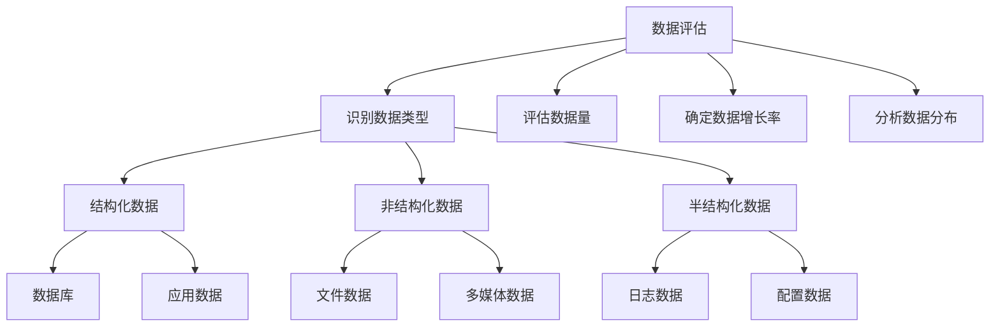

# 企业级备份系统构建

企业级备份系统需要考虑更复杂的因素，如多系统协同、大规模数据处理、高可用性保障等。本文将详细介绍企业级备份系统的设计原则、架构模型以及实施步骤，帮助读者构建适合企业环境的大规模备份解决方案。

## 企业级备份系统的特点与挑战

企业级备份系统与小型备份解决方案有着本质区别，主要体现在以下几个方面：

### 数据规模与复杂性

企业环境通常面临的数据挑战包括：

- **海量数据**：企业数据量通常达到TB甚至PB级别
- **数据类型多样**：结构化数据（数据库）、非结构化数据（文档、图像、视频）、半结构化数据（日志、XML）
- **数据分布广泛**：分布在不同地理位置、不同系统和平台上
- **数据增长迅速**：企业数据通常以每年30%-50%的速度增长

### 业务连续性要求

企业对备份系统的业务连续性要求更为严格：

- **最小化停机时间**：备份过程不能影响业务运行
- **快速恢复能力**：关键系统需要能在分钟级别恢复
- **恢复点目标(RPO)**：数据丢失必须控制在可接受范围内
- **恢复时间目标(RTO)**：系统恢复时间必须满足业务需求

### 合规与安全需求

企业备份系统必须满足严格的合规和安全要求：

- **行业法规遵从**：如GDPR、HIPAA、PCI DSS等
- **数据保留策略**：满足不同数据类型的保留期限要求
- **数据加密与访问控制**：保护敏感数据免受未授权访问
- **审计与报告**：提供完整的备份操作审计记录

### 异构环境支持

企业IT环境通常是异构的，备份系统需要支持：

- **多操作系统**：Windows、Linux、Unix、macOS等
- **多应用平台**：各种数据库、邮件系统、ERP、CRM等
- **多存储平台**：SAN、NAS、对象存储、云存储等
- **虚拟化与容器环境**：VMware、Hyper-V、Docker、Kubernetes等

## 企业级备份系统设计原则

构建企业级备份系统应遵循以下设计原则：

### 分层架构设计

采用分层架构可以提高系统的灵活性和可扩展性：

```
┌───────────────────────────────────────────────────────┐
│                   管理与监控层                         │
│  ┌─────────────┐  ┌─────────────┐  ┌─────────────┐    │
│  │ 集中管理控制台 │  │ 监控与报警  │  │ 策略管理    │    │
│  └─────────────┘  └─────────────┘  └─────────────┘    │
├───────────────────────────────────────────────────────┤
│                   备份服务层                           │
│  ┌─────────────┐  ┌─────────────┐  ┌─────────────┐    │
│  │ 备份服务器   │  │ 媒体服务器   │  │ 目录服务器   │    │
│  └─────────────┘  └─────────────┘  └─────────────┘    │
├───────────────────────────────────────────────────────┤
│                   客户端层                             │
│  ┌─────────────┐  ┌─────────────┐  ┌─────────────┐    │
│  │ 物理服务器   │  │ 虚拟机      │  │ 应用服务    │    │
│  └─────────────┘  └─────────────┘  └─────────────┘    │
├───────────────────────────────────────────────────────┤
│                   存储层                               │
│  ┌─────────────┐  ┌─────────────┐  ┌─────────────┐    │
│  │ 磁盘存储    │  │ 磁带库      │  │ 云存储      │    │
│  └─────────────┘  └─────────────┘  └─────────────┘    │
└───────────────────────────────────────────────────────┘
```

- **管理与监控层**：提供统一的管理界面、监控告警和策略配置
- **备份服务层**：负责备份作业调度、数据传输和元数据管理
- **客户端层**：部署在需要备份的系统上，负责数据采集和传输
- **存储层**：提供多种存储选项，满足不同的性能和成本需求

### 集中管理与分布式执行

平衡集中管理与分布式执行的优势：

- **集中管理**：
  - 统一的策略制定和执行
  - 全局资源调度和优化
  - 简化管理和监控
  
- **分布式执行**：
  - 减轻网络负载
  - 提高备份和恢复性能
  - 增强系统可扩展性

### 多层次数据保护

实施多层次数据保护策略：

1. **本地快速恢复层**：
   - 使用快照、复制等技术
   - 提供最快的恢复速度
   - 通常保留时间较短（几天到几周）

2. **近线备份层**：
   - 使用磁盘存储系统
   - 平衡性能和成本
   - 中等保留时间（几周到几个月）

3. **离线归档层**：
   - 使用磁带或低成本云存储
   - 优化长期存储成本
   - 长期保留（几个月到几年）

4. **异地灾备层**：
   - 将数据复制到异地数据中心或云平台
   - 防范区域性灾难
   - 根据业务重要性选择同步或异步复制

### 自动化与智能化

通过自动化和智能化提高系统效率：

- **自动化备份调度**：根据策略自动执行备份任务
- **智能资源分配**：根据负载动态调整资源
- **自动故障转移**：在组件故障时自动切换
- **智能数据分层**：根据访问频率自动迁移数据
- **预测性分析**：预测存储需求和潜在问题

### 可扩展性设计

确保系统能够随业务增长而扩展：

- **水平扩展**：通过增加节点提高系统容量和性能
- **垂直扩展**：通过升级现有组件提高单点性能
- **模块化架构**：支持按需添加或移除功能模块
- **开放API**：便于与其他系统集成和扩展

## 企业级备份系统架构模型

根据企业规模和需求，可以选择不同的架构模型：

### 集中式架构

适合中小型企业或数据中心集中的组织：

```
                    ┌─────────────────┐
                    │  备份管理服务器  │
                    └─────────────────┘
                            │
                ┌───────────┴───────────┐
                │                       │
        ┌───────┴───────┐       ┌───────┴───────┐
        │  备份介质服务器 │       │  备份介质服务器 │
        └───────┬───────┘       └───────┬───────┘
                │                       │
    ┌───────────┴───────────┐   ┌───────┴───────────────┐
    │                       │   │                       │
┌───┴───┐             ┌─────┴───┐                 ┌─────┴───┐
│ 客户端 │             │ 客户端  │                 │ 客户端  │
└───────┘             └─────────┘                 └─────────┘
```

**特点**：
- 单一备份管理服务器控制所有备份操作
- 备份介质服务器负责数据传输和存储
- 客户端部署在需要备份的系统上
- 管理简单，适合规模较小的环境

### 分布式架构

适合大型企业或地理分布广泛的组织：

```
                    ┌─────────────────┐
                    │  主备份管理服务器 │
                    └─────────────────┘
                            │
            ┌───────────────┼───────────────┐
            │               │               │
    ┌───────┴───────┐┌──────┴───────┐┌──────┴───────┐
    │ 区域管理服务器 ││区域管理服务器 ││区域管理服务器 │
    └───────┬───────┘└──────┬───────┘└──────┬───────┘
            │               │               │
     ┌──────┴──────┐  ┌─────┴──────┐  ┌─────┴──────┐
     │ 介质服务器群 │  │ 介质服务器群│  │ 介质服务器群│
     └──────┬──────┘  └─────┬──────┘  └─────┬──────┘
            │               │               │
     ┌──────┴──────┐  ┌─────┴──────┐  ┌─────┴──────┐
     │   客户端群   │  │   客户端群  │  │   客户端群  │
     └─────────────┘  └────────────┘  └────────────┘
```

**特点**：
- 主备份管理服务器负责全局策略和监控
- 区域管理服务器负责本地备份操作
- 支持跨地域部署和管理
- 更好的可扩展性和容错性

### 云混合架构

适合采用混合云策略的现代企业：

```
┌─────────────────────────────────────────────────────────┐
│                      企业数据中心                         │
│                                                         │
│  ┌─────────────┐     ┌─────────────┐    ┌────────────┐  │
│  │ 备份管理服务器 │────→│ 本地存储池   │←───│ 本地客户端  │  │
│  └──────┬──────┘     └─────────────┘    └────────────┘  │
│         │                                               │
└─────────┼───────────────────────────────────────────────┘
          │
          │ 安全连接
          ▼
┌─────────────────────────────────────────────────────────┐
│                        云平台                            │
│                                                         │
│  ┌─────────────┐     ┌─────────────┐    ┌────────────┐  │
│  │ 云备份网关   │────→│ 云存储服务   │←───│ 云端客户端  │  │
│  └─────────────┘     └─────────────┘    └────────────┘  │
│                                                         │
└─────────────────────────────────────────────────────────┘
```

**特点**：
- 结合本地备份和云备份的优势
- 本地存储用于频繁访问的数据
- 云存储用于长期归档和灾备
- 提供更灵活的扩展选项和成本优化

## 企业级备份系统关键组件

企业级备份系统由多个关键组件组成，每个组件都有特定的功能和作用：

### 备份管理服务器

备份管理服务器是整个备份系统的核心，负责：

- **策略管理**：定义和管理备份策略
- **作业调度**：安排和监控备份作业
- **资源分配**：分配和优化系统资源
- **目录管理**：维护备份数据的目录信息
- **报告生成**：生成备份状态和趋势报告

### 备份介质服务器

备份介质服务器负责数据传输和存储管理：

- **数据传输**：在客户端和存储设备之间传输数据
- **数据处理**：执行重复数据删除、压缩等处理
- **存储管理**：管理和优化存储资源使用
- **负载均衡**：分散备份负载，提高性能

### 备份客户端

备份客户端部署在需要保护的系统上，负责：

- **数据采集**：收集需要备份的数据
- **应用集成**：与数据库、邮件系统等应用集成
- **数据传输**：将数据传输到介质服务器
- **本地处理**：执行本地数据处理和优化

### 存储系统

企业级备份系统通常使用多种存储技术：

- **磁盘存储**：
  - 提供快速备份和恢复
  - 支持随机访问和快照功能
  - 适合短期到中期备份

- **磁带存储**：
  - 提供低成本长期存储
  - 支持离线存储和异地保管
  - 适合长期归档和合规要求

- **对象存储**：
  - 提供可扩展的存储容量
  - 支持元数据管理和内容寻址
  - 适合大规模非结构化数据

- **云存储**：
  - 提供按需扩展的存储容量
  - 支持地理冗余和灾难恢复
  - 降低基础设施投资和管理成本

### 目录服务

目录服务管理备份数据的元数据：

- **备份目录**：记录所有备份的内容和位置
- **索引服务**：提供快速搜索和定位功能
- **版本控制**：管理数据的多个版本
- **保留管理**：执行数据保留和过期策略

### 监控与报告系统

监控与报告系统提供可见性和管理能力：

- **实时监控**：监控备份作业和系统状态
- **告警管理**：在出现问题时发出警报
- **性能分析**：分析系统性能和瓶颈
- **合规报告**：生成满足审计和合规要求的报告
- **容量规划**：预测未来存储需求

## 企业级备份系统实施步骤

构建企业级备份系统是一个复杂的项目，需要系统的规划和实施：

### 需求分析与规划

首先进行全面的需求分析和规划：

#### 数据评估



1. **数据分类**：
   - 按业务重要性分类（关键、重要、一般）
   - 按数据类型分类（结构化、非结构化、半结构化）
   - 按合规要求分类（需要长期保留的数据）

2. **业务需求分析**：
   - 确定各系统的RTO和RPO要求
   - 识别备份窗口限制
   - 确定数据保留期限要求

3. **技术环境评估**：
   - 盘点现有IT基础设施
   - 评估网络带宽和连接性
   - 识别技术限制和挑战

4. **预算和资源规划**：
   - 估算初始投资和运营成本
   - 规划人力资源需求
   - 制定项目时间表

### 架构设计

基于需求分析，设计适合企业的备份系统架构：

1. **架构模型选择**：
   - 根据企业规模和分布选择架构模型
   - 确定集中式、分布式或混合架构

2. **组件规划**：
   - 确定备份服务器数量和分布
   - 规划存储系统类型和容量
   - 设计网络拓扑和连接

3. **容量规划**：
   - 计算备份存储需求
   - 估算网络带宽需求
   - 规划系统扩展路径

4. **高可用性设计**：
   - 设计关键组件的冗余方案
   - 规划故障转移机制
   - 设计灾难恢复策略

### 备份策略制定

制定全面的备份策略，包括：

1. **备份类型与频率**：
   - 全量备份：通常每周执行一次
   - 增量备份：通常每天执行
   - 差异备份：根据需要选择性使用
   - 连续数据保护：用于关键系统

2. **备份窗口管理**：
   - 确定各系统的备份时间窗口
   - 错开高负载系统的备份时间
   - 考虑全球业务的时区差异

3. **数据保留策略**：
   - 短期保留：通常保留30-90天的日常备份
   - 中期保留：保留3-12个月的月度备份
   - 长期保留：保留1-7年的年度备份
   - 特殊保留：满足法规要求的特定数据

4. **存储分层策略**：
   - 定义数据在不同存储层之间的迁移规则
   - 根据数据访问频率和重要性分配存储资源

### 系统部署

系统部署阶段包括以下步骤：

1. **基础设施准备**：
   - 准备服务器硬件和虚拟化环境
   - 配置存储系统和网络连接
   - 安装操作系统和必要的依赖软件

2. **核心组件部署**：
   - 安装备份管理服务器
   - 部署介质服务器
   - 配置存储设备和库

3. **客户端部署**：
   - 制定客户端部署计划
   - 使用自动化工具批量部署客户端
   - 验证客户端连接和功能

4. **集成与配置**：
   - 与现有系统集成（如监控系统、CMDB）
   - 配置备份策略和调度
   - 设置告警和通知机制

### 测试与验证

全面测试系统功能和性能：

1. **功能测试**：
   - 验证各类备份操作（全量、增量、差异）
   - 测试不同类型数据的备份和恢复
   - 验证特殊应用的备份功能（如数据库、虚拟机）

2. **性能测试**：
   - 测量备份和恢复速度
   - 评估系统在高负载下的表现
   - 验证网络带宽使用情况

3. **恢复测试**：
   - 执行不同场景的恢复测试
   - 验证RTO和RPO是否满足要求
   - 测试跨平台恢复能力

4. **灾难恢复演练**：
   - 模拟灾难场景
   - 执行完整的灾难恢复流程
   - 评估恢复时间和数据完整性

### 运维与优化

系统上线后的运维和持续优化：

1. **日常运维**：
   - 监控备份作业执行情况
   - 处理告警和异常
   - 执行定期维护任务

2. **性能优化**：
   - 分析系统性能数据
   - 识别和解决瓶颈
   - 优化资源分配

3. **容量管理**：
   - 监控存储使用趋势
   - 预测未来存储需求
   - 及时扩展系统容量

4. **安全审计**：
   - 定期审查访问权限
   - 检查安全配置
   - 验证加密和数据保护措施

## 企业级备份技术与最佳实践

### 高级备份技术

企业级备份系统通常采用多种高级技术：

#### 重复数据删除

重复数据删除技术可以显著减少存储需求：

```
┌────────────────┐
│ 原始数据流     │
└────────┬───────┘
         │
         ▼
┌────────────────┐
│ 数据分块       │
└────────┬───────┘
         │
         ▼
┌────────────────┐    ┌────────────────┐
│ 计算块哈希值   │───→│ 哈希索引       │
└────────┬───────┘    └────────┬───────┘
         │                     │
         ▼                     │
┌────────────────┐             │
│ 检查块是否存在 │←────────────┘
└────────┬───────┘
         │
         ▼
┌────────────────┐    ┌────────────────┐
│ 存储唯一数据块 │───→│ 数据存储       │
└────────────────┘    └────────────────┘
```

- **源端重复数据删除**：在数据源处执行，减少网络传输
- **目标端重复数据删除**：在备份存储上执行，集中处理
- **全局重复数据删除**：跨多个备份集识别重复数据
- **可变长度分块**：根据数据内容动态调整块大小，提高效率

#### 快照技术

快照提供了高效的时间点恢复能力：

- **存储级快照**：由存储系统直接提供的快照功能
- **文件系统快照**：操作系统或文件系统级别的快照
- **应用程序一致性快照**：与应用程序协调的快照，确保数据一致性
- **快照复制**：将快照复制到备份存储或灾备站点

#### 连续数据保护(CDP)

CDP技术提供了近乎零数据丢失的保护：

```
┌────────────────────────────────────────────────────┐
│                                                    │
│  ┌──────────┐    ┌──────────┐    ┌──────────┐     │
│  │ 应用服务器│    │ CDP引擎  │    │ 变更日志 │     │
│  └─────┬────┘    └─────┬────┘    └─────┬────┘     │
│        │               │                │          │
│        │  拦截I/O操作  │                │          │
│        ├──────────────→│                │          │
│        │               │  记录变更      │          │
│        │               ├───────────────→│          │
│        │               │                │          │
└────────┼───────────────┼────────────────┼──────────┘
         │               │                │
         │               │                │
┌────────┼───────────────┼────────────────┼──────────┐
│        │               │                │          │
│        │               │  恢复到任意时间点         │
│        │               │←───────────────┘          │
│        │               │                           │
│        │  恢复数据     │                           │
│        │←──────────────┘                           │
│        │                                           │
│  ┌─────┴────┐                                      │
│  │ 恢复服务器│                                      │
│  └──────────┘                                      │
│                                                    │
└────────────────────────────────────────────────────┘
```

- **基于日志的CDP**：记录所有数据变更，支持恢复到任意时间点
- **基于快照的CDP**：定期创建快照，支持恢复到快照时间点
- **应用感知CDP**：与应用程序集成，确保应用程序一致性
- **远程CDP**：将变更数据实时复制到远程站点

#### 虚拟化备份

针对虚拟化环境的专用备份技术：

- **基于主机的备份**：在虚拟化主机层面执行备份
- **基于VM的备份**：在虚拟机内部执行备份
- **无代理备份**：利用虚拟化平台API执行备份，无需在VM内安装代理
- **即时恢复**：直接从备份存储启动虚拟机，无需完全恢复

### 存储优化技术

优化存储使用和性能的技术：

#### 数据压缩

- **标准压缩**：使用通用压缩算法（如LZ77、DEFLATE）
- **专用压缩**：针对特定数据类型优化的压缩算法
- **自适应压缩**：根据数据特性和系统负载动态调整压缩级别
- **硬件加速压缩**：利用专用硬件加速压缩过程

#### 数据分层

根据数据特性和访问模式将数据存储在不同层次：

```
┌─────────────────────────────────────────────────┐
│ 性能层                                          │
│ ┌───────────────────────────────────────────┐   │
│ │ 高性能闪存存储                            │   │
│ │ - 最近备份的关键数据                      │   │
│ │ - 频繁访问的恢复点                        │   │
│ └───────────────────────────────────────────┘   │
│                      │                           │
│                      │ 自动迁移                  │
│                      ▼                           │
│ ┌───────────────────────────────────────────┐   │
│ │ 容量层                                    │   │
│ │ - 标准磁盘存储                            │   │
│ │ - 较少访问的备份数据                      │   │
│ │ - 中期保留的备份                          │   │
│ └───────────────────────────────────────────┘   │
│                      │                           │
│                      │ 自动迁移                  │
│                      ▼                           │
│ ┌───────────────────────────────────────────┐   │
│ │ 归档层                                    │   │
│ │ - 低成本磁盘、磁带或云存储                │   │
│ │ - 长期保留的备份                          │   │
│ │ - 很少访问的历史数据                      │   │
│ └───────────────────────────────────────────┘   │
└─────────────────────────────────────────────────┘
```

- **自动分层**：根据预定义规则自动迁移数据
- **策略驱动分层**：基于数据类型、年龄和访问频率制定分层策略
- **智能缓存**：在高性能层保留频繁访问的数据

#### 存储虚拟化

- **存储池化**：将多个物理存储设备整合为逻辑存储池
- **抽象存储接口**：提供统一
继续完成企业级备份系统构建的内容：

#### 存储虚拟化

- **存储池化**：将多个物理存储设备整合为逻辑存储池
- **抽象存储接口**：提供统一的存储访问接口
- **动态资源分配**：根据需求动态分配存储资源
- **存储迁移**：在不同存储系统间无缝迁移数据

### 网络优化技术

优化备份网络传输的技术：

#### 网络加速

- **WAN优化**：使用压缩、缓存和协议优化加速WAN传输
- **多路径传输**：利用多个网络路径并行传输数据
- **流量整形**：控制备份流量，避免影响业务网络
- **带宽调度**：根据时间和优先级动态分配带宽

#### 源端传输优化

- **变更块跟踪**：只传输变更的数据块
- **本地缓存**：在本地缓存频繁访问的数据
- **智能调度**：根据网络状况调整传输时间和速率
- **断点续传**：支持在传输中断后从断点继续

### 安全与合规最佳实践

保护备份数据安全的最佳实践：

#### 数据加密

- **传输加密**：使用SSL/TLS保护数据传输
- **存储加密**：加密备份存储中的数据
- **密钥管理**：安全管理和保护加密密钥
- **硬件加密**：利用硬件加密加速器提高性能

#### 访问控制

- **基于角色的访问控制**：根据用户角色分配权限
- **多因素认证**：要求多种认证方式
- **最小权限原则**：只授予必要的最小权限
- **访问审计**：记录和监控所有访问活动

#### 合规管理

- **数据分类**：根据合规要求分类数据
- **保留管理**：执行合规的数据保留策略
- **审计跟踪**：维护完整的审计记录
- **合规报告**：生成满足监管要求的报告

## 企业级备份系统案例分析

### 大型金融机构备份系统

以下是一个大型金融机构的备份系统案例：

#### 环境概述

- **数据规模**：总数据量超过5PB
- **系统分布**：3个主要数据中心，20个分支机构
- **关键应用**：核心银行系统、交易系统、CRM系统
- **合规要求**：需满足GDPR、PCI DSS等多项法规

#### 架构设计

采用分布式三层架构：

```
┌─────────────────────────────────────────────────────────┐
│                  总部数据中心                            │
│                                                         │
│  ┌─────────────┐     ┌─────────────┐    ┌────────────┐  │
│  │ 主备份管理服务器│────→│ 企业级存储阵列│←───│ 核心系统   │  │
│  └──────┬──────┘     └─────────────┘    └────────────┘  │
│         │                                               │
└─────────┼───────────────────────────────────────────────┘
          │
          │ 专用备份网络
          ▼
┌─────────────────────┐     ┌─────────────────────┐
│    区域数据中心A     │     │    区域数据中心B     │
│                     │     │                     │
│  ┌─────────────┐    │     │  ┌─────────────┐    │
│  │区域备份服务器 │    │     │  │区域备份服务器 │    │
│  └──────┬──────┘    │     │  └──────┬──────┘    │
│         │           │     │         │           │
│  ┌──────┴──────┐    │     │  ┌──────┴──────┐    │
│  │ 区域存储池   │    │     │  │ 区域存储池   │    │
│  └─────────────┘    │     │  └─────────────┘    │
│                     │     │                     │
└─────────────────────┘     └─────────────────────┘
          │                           │
          │                           │
          ▼                           ▼
┌─────────────────────┐     ┌─────────────────────┐
│     分支机构         │     │     分支机构         │
│  ┌─────────────┐    │     │  ┌─────────────┐    │
│  │本地备份设备  │    │     │  │本地备份设备  │    │
│  └─────────────┘    │     │  └─────────────┘    │
└─────────────────────┘     └─────────────────────┘
```

#### 技术实现

1. **多层次备份策略**：
   - 关键系统：每日全量 + 每小时增量 + CDP
   - 重要系统：每周全量 + 每日增量
   - 一般系统：每月全量 + 每周增量

2. **存储分层**：
   - 性能层：全闪存阵列，保存最近7天备份
   - 容量层：混合存储，保存30-90天备份
   - 归档层：磁带库，保存长期备份

3. **高级功能**：
   - 端到端加密保护
   - 全局重复数据删除
   - 自动化灾难恢复
   - 合规报告自动生成

#### 成果与收益

- **备份窗口缩短**：从12小时减少到4小时
- **恢复时间改善**：关键系统RTO从24小时减少到2小时
- **存储效率提升**：通过重复数据删除节省65%存储空间
- **合规性保障**：满足所有监管要求，通过多次审计

### 大型制造企业备份系统

以下是一个大型制造企业的备份系统案例：

#### 环境概述

- **数据规模**：总数据量约2PB
- **系统分布**：1个总部，5个生产基地，10个销售办事处
- **关键应用**：ERP系统、MES系统、PLM系统、CAD/CAM数据
- **特殊要求**：生产系统24x7运行，备份不能影响生产

#### 架构设计

采用云混合架构：

```
┌─────────────────────────────────────────────────────────┐
│                  企业总部                                │
│                                                         │
│  ┌─────────────┐     ┌─────────────┐    ┌────────────┐  │
│  │ 备份管理中心 │────→│ 中央存储系统 │←───│ 业务系统   │  │
│  └──────┬──────┘     └─────────────┘    └────────────┘  │
│         │                                               │
└─────────┼───────────────────────────────────────────────┘
          │
          │ 企业广域网
          ▼
┌─────────────────────┐     ┌─────────────────────┐
│    生产基地         │     │    销售办事处        │
│                     │     │                     │
│  ┌─────────────┐    │     │  ┌─────────────┐    │
│  │本地备份设备  │    │     │  │云备份网关    │    │
│  └──────┬──────┘    │     │  └──────┬──────┘    │
│         │           │     │         │           │
│  ┌──────┴──────┐    │     │         │           │
│  │ 生产系统    │    │     │  ┌──────┴──────┐    │
│  └─────────────┘    │     │  │ 销售系统    │    │
│                     │     │  └─────────────┘    │
└─────────────────────┘     └─────────────────────┘
          │                           │
          │                           │
          ▼                           ▼
┌─────────────────────────────────────────────────────────┐
│                  云备份平台                              │
│                                                         │
│  ┌─────────────┐     ┌─────────────┐    ┌────────────┐  │
│  │ 云备份服务   │────→│ 长期归档存储 │    │ 灾备恢复环境│  │
│  └─────────────┘     └─────────────┘    └────────────┘  │
│                                                         │
└─────────────────────────────────────────────────────────┘
```

#### 技术实现

1. **生产系统备份**：
   - 使用存储快照技术，最小化对生产的影响
   - 应用一致性备份，确保ERP和MES数据完整性
   - 本地备份设备提供快速恢复能力

2. **大文件处理**：
   - 针对CAD/CAM文件的专用备份策略
   - 块级变更跟踪，只备份变更部分
   - 专用压缩算法，优化大文件存储

3. **云集成**：
   - 销售办事处数据直接备份到云
   - 长期归档数据自动迁移到云存储
   - 云上灾备环境，提供低成本灾难恢复选项

#### 成果与收益

- **生产影响最小化**：备份过程对生产系统性能影响<5%
- **恢复能力提升**：本地快速恢复 + 云端灾备双重保障
- **IT成本优化**：通过云存储降低长期归档成本30%
- **管理简化**：统一管理平台，减少70%管理工作量

## 企业级备份系统的未来趋势

企业级备份系统正在快速发展，以下是几个重要趋势：

### 智能自动化

人工智能和机器学习正在改变备份系统：

- **智能调度**：AI优化备份时间和资源分配
- **异常检测**：ML算法识别备份异常和潜在问题
- **预测分析**：预测存储需求和系统瓶颈
- **自修复能力**：自动检测和修复备份问题

### 容器和微服务备份

随着容器和微服务架构的普及，备份系统也在适应：

- **容器原生备份**：专为容器环境设计的备份解决方案
- **Kubernetes集成**：与Kubernetes原生集成的备份工具
- **无状态/有状态服务分离**：针对不同类型服务的备份策略
- **GitOps支持**：与CI/CD流程集成的备份和恢复

### 多云备份策略

多云环境下的备份策略变得越来越重要：

- **云中立备份**：支持多个云平台的统一备份解决方案
- **跨云复制**：在不同云平台间复制备份数据
- **云到云备份**：直接在云平台间执行备份
- **混合云一致性**：确保跨本地和云环境的数据一致性

### 数据安全与隐私保护

随着安全威胁的增加和隐私法规的加强：

- **勒索软件防护**：专门防范勒索软件攻击的备份功能
- **不可变存储**：防止备份数据被篡改的技术
- **零信任架构**：基于零信任原则设计的备份系统
- **数据主权合规**：满足不同地区数据主权要求的备份策略

## 企业级备份系统选型指南

选择适合企业需求的备份系统是一项复杂的任务，以下是选型指南：

### 需求评估清单

在选择备份系统前，应全面评估企业需求：

| 评估维度 | 关键问题 |
|---------|---------|
| 数据规模 | 当前数据量是多少？年增长率是多少？ |
| 系统环境 | 需要保护哪些操作系统和应用？ |
| 性能要求 | 备份窗口有多长？恢复时间目标是什么？ |
| 可扩展性 | 系统需要支持多大的增长？ |
| 安全要求 | 需要哪些安全功能（如加密、访问控制）？ |
| 合规需求 | 需要满足哪些法规和标准？ |
| 预算限制 | 初始投资和长期运营预算是多少？ |

### 主流企业级备份解决方案比较

市场上有多种企业级备份解决方案，以下是几个主流产品的比较：

| 解决方案 | 优势 | 适用场景 |
|---------|------|---------|
| Veritas NetBackup | 功能全面，支持广泛的平台和应用 | 大型异构环境，需要统一管理 |
| Commvault Complete | 高度集成，用户界面友好 | 中大型企业，需要简化管理 |
| IBM Spectrum Protect | 可扩展性强，适合大规模环境 | IBM生态系统，大型企业 |
| Veeam Backup & Replication | 虚拟化环境支持出色 | 高度虚拟化的环境，中小型企业 |
| Rubrik Cloud Data Management | 简化架构，易于部署 | 现代化数据中心，云优先企业 |
| Cohesity DataProtect | 超融合备份架构，二次利用数据 | 寻求数据管理与备份集成的企业 |

### 开源备份解决方案

对于预算有限或有特殊需求的企业，开源备份解决方案也是一个选择：

| 开源解决方案 | 特点 | 适用场景 |
|------------|-----|---------|
| Bacula | 功能丰富，高度可配置 | 中小型企业，技术团队强 |
| Amanda | 简单可靠，历史悠久 | 小型环境，基本备份需求 |
| Bareos | Bacula的分支，更活跃的社区 | 需要现代化功能的中小企业 |
| Duplicati | 专注于加密和云备份 | 小型环境，需要云集成 |
| UrBackup | 客户端-服务器架构，易于使用 | 小型办公环境，桌面备份 |

### 总拥有成本(TCO)分析

选择备份系统时，应考虑总拥有成本，而不仅仅是初始购买成本：

```
TCO = 初始投资 + 运营成本 + 维护成本 + 升级成本 - 节省成本
```

- **初始投资**：
  - 软件许可证费用
  - 硬件设备购置费用
  - 实施和集成费用
  - 培训费用

- **运营成本**：
  - 存储成本（包括增长）
  - 网络带宽成本
  - 人力资源成本
  - 云服务费用（如适用）

- **维护成本**：
  - 年度维护和支持费用
  - 故障修复和更换成本
  - 定期审计和测试成本

- **升级成本**：
  - 软件版本升级费用
  - 硬件更新和扩展费用
  - 迁移和兼容性调整费用

- **节省成本**：
  - 减少数据丢失风险
  - 提高IT效率
  - 降低合规风险
  - 优化存储使用

## 结论

企业级备份系统是现代企业IT基础设施的关键组成部分，它不仅仅是数据保护的工具，更是业务连续性和灾难恢复的基础。构建一个成功的企业级备份系统需要全面考虑业务需求、技术环境、安全合规和成本效益等多个因素。

随着数据量的爆炸性增长和IT环境的日益复杂，企业级备份系统也在不断演进，采用更智能、更自动化、更安全的技术来应对挑战。未来的备份系统将更加注重数据价值的挖掘，不仅保护数据，还能帮助企业从备份数据中获取更多价值。

最后，选择和实施企业级备份系统是一个持续的过程，需要定期评估和优化，以适应不断变化的业务需求和技术环境。通过遵循本文介绍的设计原则、架构模型和最佳实践，企业可以构建一个可靠、高效、可扩展的备份系统，为业务连续性提供坚实保障。