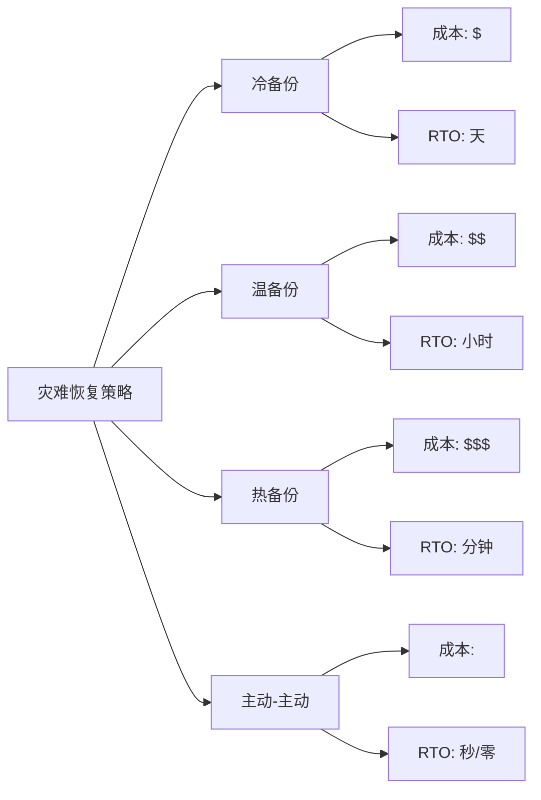
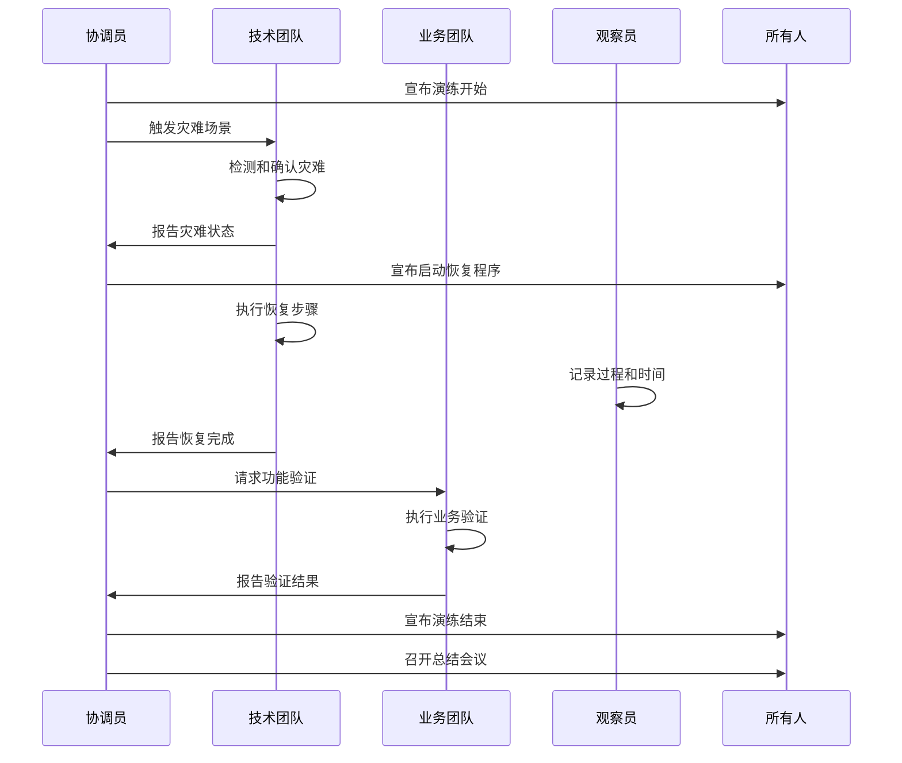
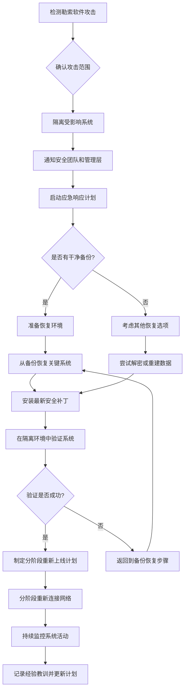
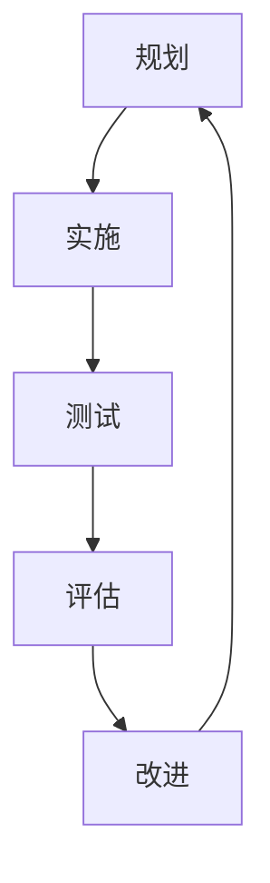

# 灾难恢复演练与方案

灾难恢复演练是验证灾难恢复计划有效性的重要手段，定期的演练可以发现潜在问题并提高团队应对真实灾难的能力。本文将详细介绍灾难恢复演练的规划、执行和评估方法，以及不同场景下的灾难恢复方案设计，帮助读者构建可靠的灾难应对机制。

## 灾难恢复基础概念

在深入灾难恢复演练之前，我们需要理解一些基础概念，这些概念构成了灾难恢复规划的基础。

### 关键指标：RTO与RPO

灾难恢复计划的有效性通常通过两个关键指标来衡量：

- **恢复时间目标(RTO, Recovery Time Objective)**：系统或服务从中断到恢复所允许的最长时间。例如，RTO为4小时意味着系统必须在灾难发生后4小时内恢复运行。

- **恢复点目标(RPO, Recovery Point Objective)**：可接受的数据丢失时间范围。例如，RPO为1小时意味着最多可以接受丢失灾难发生前1小时的数据。

这两个指标直接影响灾难恢复方案的设计和成本：

```
┌───────────────────────────────────────────────────────────┐
│                                                           │
│  RPO                                 RTO                  │
│◄────────►                       ◄──────────────►          │
│                                                           │
│  最后一次     灾难发生点         恢复开始         系统恢复    │
│  数据备份         │                │               │       │
│     │            │                │               │       │
├─────┼────────────┼────────────────┼───────────────┼───────┤
│     │            │                │               │       │
│     ▼            ▼                ▼               ▼       │
│  时间轴───────────────────────────────────────────────────►│
│                                                           │
│                  潜在数据丢失      恢复过程时间              │
│                  ◄────────►      ◄──────────────►          │
│                                                           │
└───────────────────────────────────────────────────────────┘
```

### 灾难类型与影响级别

灾难可以分为多种类型，每种类型对系统的影响程度不同：

1. **硬件故障**：服务器、存储设备或网络设备故障
2. **软件故障**：操作系统崩溃、应用程序错误、数据库损坏
3. **人为错误**：误操作、恶意攻击、内部威胁
4. **自然灾害**：地震、洪水、火灾、飓风
5. **基础设施故障**：电力中断、网络中断、空调故障
6. **网络安全事件**：勒索软件攻击、DDoS攻击、数据泄露

根据影响范围和严重程度，灾难可以分为不同级别：

| 级别 | 描述 | 影响范围 | 示例 |
|------|------|---------|------|
| 1级 | 轻微事件 | 单个组件 | 单台服务器故障 |
| 2级 | 局部中断 | 单个系统或服务 | 数据库服务不可用 |
| 3级 | 重大中断 | 多个关键系统 | 主数据中心网络中断 |
| 4级 | 灾难性事件 | 整个数据中心 | 数据中心火灾 |
| 5级 | 区域性灾难 | 整个地理区域 | 大规模自然灾害 |

### 灾难恢复策略类型

根据业务需求和预算，可以采用不同的灾难恢复策略：

1. **冷备份(Cold Backup)**：
   - 在灾难发生后才开始准备恢复环境
   - RTO通常为数天
   - 成本最低，但恢复时间最长

2. **温备份(Warm Backup)**：
   - 预先准备部分恢复环境，但不完全激活
   - RTO通常为数小时
   - 平衡了成本和恢复时间

3. **热备份(Hot Backup)**：
   - 完全准备好的备用环境，可以快速切换
   - RTO通常为分钟级
   - 成本较高，但恢复时间最短

4. **主动-主动(Active-Active)**：
   - 同时运行多个生产环境，负载均衡
   - RTO接近于零
   - 成本最高，但几乎无中断



## 灾难恢复演练规划

灾难恢复演练需要周密的规划，以确保演练有效且不会对生产环境造成负面影响。

### 演练类型与目标

灾难恢复演练可以分为多种类型，从简单到复杂：

1. **桌面演练(Tabletop Exercise)**：
   - 团队成员围坐讨论灾难场景和应对措施
   - 不涉及实际系统操作
   - 目标：验证团队对灾难恢复计划的理解和沟通流程

2. **演练测试(Walk-through Test)**：
   - 团队成员实际执行恢复程序，但不影响生产系统
   - 可能在测试环境中模拟部分操作
   - 目标：验证恢复程序的完整性和团队的熟练度

3. **模拟测试(Simulation Test)**：
   - 在隔离环境中模拟灾难场景
   - 团队执行完整的恢复程序
   - 目标：在接近真实的环境中测试恢复能力

4. **并行测试(Parallel Test)**：
   - 在备用系统上执行恢复，并与生产系统并行运行
   - 比较两个系统的输出结果
   - 目标：验证备用系统的功能完整性

5. **完全中断测试(Full Interruption Test)**：
   - 模拟生产系统完全中断
   - 完全切换到备用系统
   - 目标：验证在真实灾难情况下的恢复能力

每种演练类型都有不同的目标和复杂度：

| 演练类型 | 复杂度 | 风险 | 资源需求 | 适用频率 |
|---------|-------|------|---------|---------|
| 桌面演练 | 低 | 无 | 低 | 每季度 |
| 演练测试 | 中低 | 低 | 中 | 每半年 |
| 模拟测试 | 中 | 中 | 中高 | 每年 |
| 并行测试 | 中高 | 中 | 高 | 每年 |
| 完全中断测试 | 高 | 高 | 非常高 | 每1-2年 |

### 演练团队组建

成功的灾难恢复演练需要一个多学科团队，明确的角色和责任：

1. **演练协调员**：
   - 负责整体演练规划和协调
   - 确保演练按计划进行
   - 记录演练过程和结果

2. **技术团队**：
   - 系统管理员：负责系统恢复
   - 网络工程师：负责网络连接恢复
   - 数据库管理员：负责数据库恢复
   - 应用程序专家：负责应用程序恢复和验证

3. **业务代表**：
   - 验证恢复后的系统是否满足业务需求
   - 提供业务优先级和验收标准

4. **观察员**：
   - 独立观察演练过程
   - 记录问题和改进机会
   - 不直接参与恢复操作

5. **管理层代表**：
   - 提供必要的资源和决策支持
   - 评估演练结果对业务的影响

### 演练场景设计

设计真实且有挑战性的演练场景是成功演练的关键：

1. **场景选择原则**：
   - 基于风险评估选择最可能发生的灾难
   - 考虑对业务影响最大的场景
   - 从简单到复杂逐步推进

2. **常见演练场景**：
   - 服务器硬件故障
   - 数据库损坏
   - 网络中断
   - 数据中心电力故障
   - 勒索软件攻击
   - 主数据中心不可用

3. **场景文档模板**：

```
灾难恢复演练场景描述

场景名称：[例如：主数据库服务器故障]
场景级别：[1-5级]
影响范围：[受影响的系统和服务]

初始状态：
- [描述演练开始时的系统状态]
- [相关系统的配置和数据状态]

灾难事件：
- [详细描述将要模拟的灾难]
- [灾难的触发方式和时间点]

预期影响：
- [灾难对系统和业务的预期影响]
- [可能的连锁反应]

恢复目标：
- RTO：[目标恢复时间]
- RPO：[可接受的数据丢失范围]

成功标准：
- [列出演练成功的具体标准]
- [关键功能恢复的验证方法]

限制条件：
- [演练期间的限制和安全措施]
- [不允许的操作或需要模拟的步骤]

回滚计划：
- [如果演练出现问题，如何回滚到正常状态]
```

### 演练计划文档

完整的演练计划文档应包含以下内容：

1. **演练概述**：
   - 演练目的和目标
   - 演练类型和范围
   - 演练时间表和持续时间

2. **参与人员**：
   - 团队成员及其角色
   - 联系信息和通信方式
   - 上报路径和决策权限

3. **演练场景**：
   - 详细的场景描述
   - 触发条件和事件时间线
   - 预期影响和恢复目标

4. **演练步骤**：
   - 详细的操作步骤和时间安排
   - 每个步骤的负责人
   - 决策点和判断标准

5. **资源需求**：
   - 硬件和软件资源
   - 网络和存储资源
   - 人力资源和专业技能

6. **风险管理**：
   - 潜在风险识别
   - 风险缓解措施
   - 应急回滚计划

7. **成功标准**：
   - 明确的成功指标
   - 验证方法和工具
   - 结果评估框架

8. **沟通计划**：
   - 内部沟通流程
   - 外部沟通（如需要）
   - 状态报告频率和格式

## 灾难恢复演练执行

演练执行是整个灾难恢复演练过程中最关键的环节，需要严格按照计划进行，同时保持灵活应对突发情况。

### 演练前准备

在正式开始演练前，需要完成以下准备工作：

1. **环境准备**：
   - 确认所有必要的硬件和软件资源可用
   - 验证备份数据的完整性和可访问性
   - 准备测试和验证工具

2. **团队准备**：
   - 召开演练前简报会议
   - 确保所有参与者理解自己的角色和责任
   - 分发演练计划和联系信息

3. **基线数据收集**：
   - 记录系统的初始状态和性能指标
   - 创建关键配置文件的快照
   - 准备验证数据集

4. **安全措施**：
   - 实施隔离措施，防止演练影响生产环境
   - 准备回滚计划和应急程序
   - 确认监控系统正常运行

5. **通知相关方**：
   - 通知可能受影响的团队和部门
   - 确保管理层了解演练时间和可能的影响
   - 如需要，通知客户或合作伙伴

### 演练执行流程

演练执行应遵循结构化的流程：



1. **演练启动**：
   - 协调员正式宣布演练开始
   - 记录开始时间和初始状态
   - 触发预定的灾难场景

2. **灾难检测与评估**：
   - 监控团队检测并确认灾难事件
   - 评估灾难影响范围和严重程度
   - 确定恢复优先级和策略

3. **恢复操作执行**：
   - 技术团队按照预定步骤执行恢复操作
   - 记录每个步骤的开始和完成时间
   - 解决过程中遇到的问题和挑战

4. **恢复验证**：
   - 技术验证：确认系统和服务正常运行
   - 数据验证：确认数据完整性和一致性
   - 业务验证：确认业务功能正常工作

5. **演练结束**：
   - 协调员宣布演练结束
   - 记录结束时间和最终状态
   - 如需要，执行环境恢复和清理

### 常见问题与应对

演练过程中可能遇到各种问题，需要提前准备应对策略：

1. **技术问题**：
   - **问题**：恢复脚本失败或配置错误
   - **应对**：准备备用脚本和手动操作步骤
   - **预防**：提前测试脚本和验证配置

2. **资源问题**：
   - **问题**：恢复环境资源不足
   - **应对**：准备资源扩展计划或优先级调整策略
   - **预防**：提前评估资源需求并预留足够容量

3. **时间问题**：
   - **问题**：恢复时间超出预期
   - **应对**：确定关键路径并优先恢复核心功能
   - **预防**：进行小规模测试评估实际恢复时间

4. **协调问题**：
   - **问题**：团队沟通不畅或责任不清
   - **应对**：指定单点协调人，建立清晰的上报路径
   - **预防**：提前明确角色和责任，进行沟通演练

5. **意外情况**：
   - **问题**：出现计划外的系统故障或问题
   - **应对**：评估是否继续演练或启动回滚计划
   - **预防**：制定详细的风险评估和应急预案

### 实时监控与记录

演练过程中的监控和记录对于后续评估至关重要：

1. **技术监控**：
   - 系统性能指标：CPU、内存、磁盘I/O、网络流量
   - 应用程序状态：响应时间、错误率、事务成功率
   - 数据一致性：关键数据比对和验证

2. **时间记录**：
   - 灾难触发时间
   - 灾难检测时间
   - 恢复开始时间
   - 各关键步骤完成时间
   - 系统恢复时间
   - 业务功能恢复时间

3. **问题记录**：
   - 遇到的技术问题和解决方法
   - 决策点和决策理由
   - 计划外的操作和调整
   - 团队协作和沟通问题

4. **记录工具和方法**：
   - 自动化监控工具
   - 结构化日志记录
   - 视频记录关键操作
   - 实时协作文档

## 灾难恢复演练评估

演练结束后，全面评估演练结果是提升灾难恢复能力的关键步骤。

### 演练后总结会议

演练结束后应立即召开总结会议：

1. **会议目标**：
   - 收集所有参与者的反馈和观察
   - 讨论演练中的成功点和问题
   - 初步评估演练结果

2. **会议流程**：
   - 协调员概述演练过程和初步结果
   - 各团队代表分享经验和观察
   - 观察员提供独立评估
   - 开放讨论问题和改进机会
   - 确定后续行动项

3. **讨论要点**：
   - 恢复时间是否达到RTO目标
   - 数据丢失是否在RPO范围内
   - 恢复过程中的主要挑战
   - 团队协作和沟通效果
   - 计划与实际执行的差异

### 绩效指标评估

使用客观指标评估演练绩效：

1. **时间指标**：
   - 灾难检测时间：从灾难发生到检测到的时间
   - 响应时间：从检测到灾难到开始恢复的时间
   - 恢复时间：从开始恢复到系统可用的时间
   - 总中断时间：从灾难发生到业务恢复的总时间

2. **质量指标**：
   - 数据完整性：恢复数据的完整性百分比
   - 功能恢复率：成功恢复的功能百分比
   - 错误率：恢复过程中的错误数量
   - 手动干预次数：需要计划外手动操作的次数

3. **流程指标**：
   - 计划遵循度：实际执行与计划的符合程度
   - 文档完整性：文档对恢复过程的覆盖程度
   - 团队准备度：团队对角色和责任的理解程度
   - 沟通有效性：信息传递的准确性和及时性

### 问题分析与改进

识别问题并制定改进计划：

1. **根本原因分析**：
   - 使用"5个为什么"或鱼骨图分析问题根源
   - 区分技术问题、流程问题和人员问题
   - 评估问题的严重性和影响范围

2. **改进机会分类**：
   - 技术改进：系统架构、工具、自动化
   - 流程改进：文档、步骤、检查点
   - 人员改进：培训、角色分配、沟通

3. **改进计划制定**：
   - 短期改进：立即可实施的简单改进
   - 中期改进：需要一定规划和资源的改进
   - 长期改进：需要重大变更或投资的改进

4. **改进跟踪**：
   - 为每项改进分配负责人和截止日期
   - 建立定期检查点评估改进进度
   - 在下次演练中验证改进效果

### 演练报告编写

编写全面的演练报告记录结果和经验：

1. **报告结构**：
   - 执行摘要：主要结果和建议
   - 演练概述：目标、范围和参与者
   - 演练场景：详细描述和预期结果
   - 执行过程：时间线和关键事件
   - 结果分析：指标评估和问题分析
   - 经验教训：成功经验和改进机会
   - 改进计划：具体行动项和时间表
   - 附录：详细数据、日志和支持文档

2. **报告示例片段**：

```
灾难恢复演练报告

执行摘要：
2023年10月15日进行了主数据库服务器故障的灾难恢复演练。演练总体成功，
系统在45分钟内恢复（RTO目标为60分钟），数据丢失限制在5分钟内（RPO目标为15分钟）。
演练发现了三个主要问题：备份恢复脚本中的错误、网络配置不一致和团队沟通延迟。
已制定改进计划解决这些问题。

主要结果：
1. 恢复时间：45分钟（达到RTO目标）
2. 数据丢失：约5分钟的交易数据（达到RPO目标）
3. 功能恢复率：95%（核心功能100%恢复，非核心功能部分延迟）

主要问题：
1. 数据库恢复脚本在处理大型事务日志时出错，需要手动干预
2. 备用服务器的网络配置与生产环境不完全一致，导致连接问题
3. 技术团队与业务验证团队之间的沟通延迟，影响了整体恢复时间

改进建议：
1. 更新数据库恢复脚本，增加大型事务日志处理能力
2. 实施配置管理系统，确保生产和备用环境配置一致
3. 建立标准化的状态报告流程，提高团队间沟通效率
```

## 不同场景的灾难恢复方案

不同类型的灾难需要不同的恢复方案，以下是几种常见场景的具体方案。

### 数据库系统灾难恢复

数据库是大多数企业的核心系统，其恢复方案尤为重要：

1. **预防措施**：
   - 实施高可用架构（如主从复制、集群）
   - 定期备份（全量+增量+事务日志）
   - 数据库健康监控和预警

2. **恢复策略**：
   - **轻微故障**（如查询性能下降）：
     - 优化数据库参数
     - 重建索引或统计信息
     - 重启数据库服务

   - **数据损坏**：
     - 使用时间点恢复(PITR)
     - 从最近的备份恢复
     - 应用事务日志到目标时间点

   - **服务器故障**：
     - 激活备用服务器
     - 应用最新事务日志
     - 重新配置连接和访问权限

   - **完全灾难**（如数据中心不可用）：
     - 在灾备站点激活备用数据库
     - 重新配置应用程序连接
     - 验证数据一致性和完整性

3. **MySQL数据库恢复示例脚本**：

```bash
#!/bin/bash
# MySQL数据库灾难恢复脚本

# 配置变量
DB_NAME="production_db"
BACKUP_DIR="/backup/mysql"
LATEST_FULL_BACKUP=$(ls -t ${BACKUP_DIR}/full_*.sql.gz | head -1)
BINLOG_DIR="/var/log/mysql"
RECOVERY_TIME="2023-10-15 08:30:00"

# 1. 停止数据库服务
systemctl stop mysql

# 2. 移动当前数据目录（如果存在）
if [ -d /var/lib/mysql/${DB_NAME} ]; then
    mv /var/lib/mysql/${DB_NAME} /var/lib/mysql/${DB_NAME}_damaged_$(date +%Y%m%d%H%M%S)
fi

# 3. 创建新数据库
systemctl start mysql
mysql -e "CREATE DATABASE IF NOT EXISTS ${DB_NAME};"

# 4. 恢复全量备份
echo "正在恢复全量备份: ${LATEST_FULL_BACKUP}..."
gunzip -c ${LATEST_FULL_BACKUP} | mysql ${DB_NAME}

# 5. 应用二进制日志到指定时间点
echo "应用二进制日志到时间点: ${RECOVERY_TIME}..."
mysqlbinlog --stop-datetime="${RECOVERY_TIME}" \
    ${BINLOG_DIR}/mysql-bin.* | mysql ${DB_NAME}

# 6. 验证恢复结果
echo "验证数据库恢复结果..."
mysql -e "SELECT COUNT(*) FROM information_schema.tables WHERE table_schema='${DB_NAME}';"

echo "数据库恢复完成。请验证数据完整性。"
```

### 虚拟化环境灾难恢复

虚拟化环境的灾难恢复具有特殊性：

1. **预防措施**：
   - 虚拟机快照和备份
   - 主机集群和资源池
   - 存储复制和镜像

2. **恢复策略**：
   - **单个VM故障**：
     - 从快照恢复
     - 在另一主机上重新部署
     - 恢复最新数据

   - **主机故障**：
     - 自动或手动VM迁移
     - 重新分配资源
     - 验证VM功能

   - **集群故障**：
     - 在备用集群上激活VM
     - 恢复网络和存储连接
     - 按优先级启动VM

   - **数据中心故障**：
     - 在灾备站点激活复制的VM
     - 重新配置网络和DNS
     - 验证应用程序连接

3. **VMware环境恢复示例**：

```powershell
# VMware环境灾难恢复PowerCLI脚本

# 连接到vCenter服务器
Connect-VIServer -Server vcenter.example.com -User admin -Password "password"

# 定义恢复优先级组
$priorityGroup1 = "DB1", "APP1", "WEB1"  # 最高优
继续完成灾难恢复演练与方案的内容：

```powershell
# VMware环境灾难恢复PowerCLI脚本

# 连接到vCenter服务器
Connect-VIServer -Server vcenter.example.com -User admin -Password "password"

# 定义恢复优先级组
$priorityGroup1 = "DB1", "APP1", "WEB1"  # 最高优先级
$priorityGroup2 = "APP2", "WEB2", "CACHE1"  # 中等优先级
$priorityGroup3 = "DEV1", "TEST1", "REPORT1"  # 低优先级

# 在灾备站点恢复虚拟机
Write-Host "开始恢复第一优先级虚拟机..."
foreach ($vm in $priorityGroup1) {
    $replicaVM = Get-VM -Name "DR-$vm" -ErrorAction SilentlyContinue
    if ($replicaVM) {
        Write-Host "正在启动虚拟机: DR-$vm"
        Start-VM -VM $replicaVM -Confirm:$false
        # 等待VM启动并验证状态
        $timeout = 300  # 5分钟超时
        $elapsed = 0
        $interval = 10  # 每10秒检查一次
        do {
            Start-Sleep -Seconds $interval
            $elapsed += $interval
            $vmStatus = Get-VM -Name "DR-$vm" | Select-Object -ExpandProperty PowerState
            Write-Host "VM状态: $vmStatus"
        } until (($vmStatus -eq "PoweredOn") -or ($elapsed -ge $timeout))
    } else {
        Write-Host "警告: 未找到虚拟机 DR-$vm"
    }
}

# 继续恢复其他优先级组...
Write-Host "第一优先级虚拟机恢复完成"

# 验证网络连接
Write-Host "验证网络连接..."
foreach ($vm in $priorityGroup1) {
    $vmIP = (Get-VM "DR-$vm" | Get-VMGuest).IPAddress[0]
    if ($vmIP) {
        Write-Host "测试连接到 $vm ($vmIP)..."
        $pingResult = Test-Connection -ComputerName $vmIP -Count 2 -Quiet
        Write-Host "连接状态: $pingResult"
    }
}

# 断开vCenter连接
Disconnect-VIServer -Server vcenter.example.com -Confirm:$false
```

### 云环境灾难恢复

随着云计算的普及，云环境的灾难恢复方案变得越来越重要：

1. **预防措施**：
   - 多区域部署
   - 自动扩展和负载均衡
   - 基础设施即代码(IaC)

2. **恢复策略**：
   - **单个服务故障**：
     - 自动重启或替换实例
     - 从快照恢复
     - 流量重定向

   - **可用区故障**：
     - 跨可用区自动故障转移
     - 激活备用资源
     - 更新DNS和负载均衡器

   - **区域故障**：
     - 跨区域故障转移
     - 从备份恢复数据
     - 重新配置网络和安全组

3. **AWS云环境恢复示例**：

```bash
#!/bin/bash
# AWS跨区域灾难恢复脚本

# 配置变量
PRIMARY_REGION="us-east-1"
DR_REGION="us-west-2"
APP_NAME="production-app"
DB_SNAPSHOT_ID="rds-prod-snapshot"

# 检查主区域状态
echo "检查主区域状态..."
aws ec2 describe-regions --region $PRIMARY_REGION > /dev/null 2>&1
if [ $? -ne 0 ]; then
    echo "主区域 $PRIMARY_REGION 不可访问，开始灾难恢复流程..."
    
    # 1. 在灾备区域启动数据库
    echo "从快照恢复数据库..."
    aws rds restore-db-instance-from-db-snapshot \
        --db-instance-identifier "${APP_NAME}-db" \
        --db-snapshot-identifier $DB_SNAPSHOT_ID \
        --region $DR_REGION
    
    # 等待数据库可用
    echo "等待数据库可用..."
    aws rds wait db-instance-available \
        --db-instance-identifier "${APP_NAME}-db" \
        --region $DR_REGION
    
    # 2. 启动应用服务器
    echo "启动应用服务器..."
    LATEST_AMI=$(aws ec2 describe-images \
        --owners self \
        --filters "Name=name,Values=${APP_NAME}-*" \
        --query 'sort_by(Images, &CreationDate)[-1].ImageId' \
        --output text \
        --region $DR_REGION)
    
    INSTANCE_ID=$(aws ec2 run-instances \
        --image-id $LATEST_AMI \
        --instance-type m5.large \
        --security-group-ids sg-0123456789abcdef \
        --subnet-id subnet-0123456789abcdef \
        --tag-specifications "ResourceType=instance,Tags=[{Key=Name,Value=${APP_NAME}-server}]" \
        --region $DR_REGION \
        --query 'Instances[0].InstanceId' \
        --output text)
    
    # 等待实例运行
    echo "等待实例运行..."
    aws ec2 wait instance-running --instance-ids $INSTANCE_ID --region $DR_REGION
    
    # 3. 更新DNS记录
    echo "更新DNS记录指向灾备区域..."
    DB_ENDPOINT=$(aws rds describe-db-instances \
        --db-instance-identifier "${APP_NAME}-db" \
        --query 'DBInstances[0].Endpoint.Address' \
        --output text \
        --region $DR_REGION)
    
    INSTANCE_IP=$(aws ec2 describe-instances \
        --instance-ids $INSTANCE_ID \
        --query 'Reservations[0].Instances[0].PublicIpAddress' \
        --output text \
        --region $DR_REGION)
    
    # 使用Route 53更新DNS
    aws route53 change-resource-record-sets \
        --hosted-zone-id Z0123456789ABCDEF \
        --change-batch '{
            "Changes": [
                {
                    "Action": "UPSERT",
                    "ResourceRecordSet": {
                        "Name": "app.example.com",
                        "Type": "A",
                        "TTL": 60,
                        "ResourceRecords": [
                            {
                                "Value": "'$INSTANCE_IP'"
                            }
                        ]
                    }
                }
            ]
        }'
    
    echo "灾难恢复完成。应用现在运行在 $DR_REGION 区域。"
    echo "应用URL: http://app.example.com"
    echo "数据库端点: $DB_ENDPOINT"
else
    echo "主区域 $PRIMARY_REGION 正常运行，无需启动灾难恢复。"
fi
```

### 勒索软件攻击恢复

勒索软件攻击已成为企业面临的主要威胁之一：

1. **预防措施**：
   - 不可变备份（写一次，只读）
   - 离线备份（气隙备份）
   - 备份加密和访问控制

2. **恢复策略**：
   - **检测与隔离**：
     - 识别感染范围
     - 隔离受影响系统
     - 阻断恶意软件传播

   - **清理与恢复**：
     - 在隔离环境中恢复系统
     - 从已验证的干净备份恢复
     - 应用最新安全补丁

   - **验证与重新部署**：
     - 全面安全扫描
     - 分阶段重新连接网络
     - 监控异常活动

3. **勒索软件恢复流程**：



4. **勒索软件恢复检查清单**：

```
勒索软件恢复检查清单

1. 初始响应
   □ 确认勒索软件攻击并记录发现时间
   □ 隔离受影响的系统和网络
   □ 保存勒索信息和加密样本（用于取证）
   □ 通知关键利益相关者和管理层
   □ 联系网络安全保险提供商（如适用）

2. 评估与规划
   □ 确定受影响系统和数据的范围
   □ 识别感染源和攻击向量
   □ 评估可用备份的状态和完整性
   □ 确定恢复优先级
   □ 制定详细的恢复计划

3. 准备恢复环境
   □ 准备隔离的恢复环境
   □ 验证备份介质未受感染
   □ 确保恢复工具和资源可用
   □ 部署额外的安全监控

4. 执行恢复
   □ 重建关键服务器和基础设施
   □ 从已验证的备份恢复数据
   □ 应用所有安全补丁和更新
   □ 重置所有密码和访问凭证
   □ 恢复应用程序和服务

5. 验证与测试
   □ 验证系统功能和数据完整性
   □ 执行安全扫描确认无残留恶意软件
   □ 测试关键业务功能
   □ 验证系统间集成和数据流

6. 重新上线
   □ 制定分阶段重新上线计划
   □ 更新防火墙规则和安全控制
   □ 分阶段重新连接系统到网络
   □ 密切监控网络流量和系统活动
   □ 恢复用户访问（使用新凭证）

7. 后续行动
   □ 进行全面的事件分析
   □ 记录经验教训
   □ 更新灾难恢复和安全计划
   □ 加强安全意识培训
   □ 实施额外的预防措施
```

## 灾难恢复的最佳实践

多年的灾难恢复经验总结出了一系列最佳实践，可以帮助组织提高灾难恢复能力。

### 3-2-1备份策略

3-2-1备份策略是一种经典且有效的数据保护方法：

- **3份数据副本**：保留至少3份数据副本（1份原始数据 + 2份备份）
- **2种不同的存储介质**：使用至少2种不同的存储介质（如磁盘和磁带）
- **1份异地备份**：至少1份备份存储在异地位置

对于关键数据，可以考虑扩展为3-2-1-1-0策略：
- **3份数据副本**
- **2种不同的存储介质**
- **1份异地备份**
- **1份离线备份**（气隙备份，完全断网）
- **0错误**（定期验证备份，确保无错误）

### 分层恢复策略

不同系统和数据具有不同的重要性，应采用分层恢复策略：

| 层级 | 系统类型 | RTO | RPO | 恢复策略 |
|------|---------|-----|-----|---------|
| 0级 | 关键业务系统 | <1小时 | <15分钟 | 热备份/主动-主动 |
| 1级 | 重要业务系统 | <4小时 | <1小时 | 热备份/温备份 |
| 2级 | 一般业务系统 | <24小时 | <24小时 | 温备份 |
| 3级 | 非关键系统 | <72小时 | <48小时 | 冷备份 |

分层策略可以优化资源分配，将有限的资源集中在最关键的系统上。

### 自动化与编排

自动化是提高灾难恢复效率和可靠性的关键：

1. **自动化备份验证**：
   - 自动执行备份完整性检查
   - 定期测试备份可恢复性
   - 自动生成验证报告

2. **恢复流程编排**：
   - 使用工作流编排工具
   - 自动化恢复步骤序列
   - 处理依赖关系和并行任务

3. **基础设施即代码(IaC)**：
   - 使用代码定义基础设施
   - 版本控制基础设施配置
   - 快速重建一致的环境

4. **自动化测试**：
   - 自动执行功能验证测试
   - 性能基准测试
   - 安全合规性检查

### 持续改进循环

灾难恢复能力需要持续改进：



1. **规划阶段**：
   - 评估业务需求和风险
   - 制定或更新灾难恢复计划
   - 分配资源和责任

2. **实施阶段**：
   - 部署技术解决方案
   - 建立流程和程序
   - 培训相关人员

3. **测试阶段**：
   - 执行各类灾难恢复演练
   - 验证计划和解决方案
   - 记录结果和问题

4. **评估阶段**：
   - 分析测试结果
   - 识别差距和问题
   - 评估与目标的符合度

5. **改进阶段**：
   - 解决发现的问题
   - 优化流程和技术
   - 更新文档和培训

## 新兴技术与趋势

灾难恢复领域正在经历技术革新，以下是一些值得关注的新兴技术和趋势。

### 容器化灾难恢复

容器技术为灾难恢复带来新的可能性：

1. **优势**：
   - 环境一致性：消除"在我机器上能运行"的问题
   - 快速部署：容器可以在几秒钟内启动
   - 资源效率：比传统VM更轻量级
   - 可移植性：可以在任何支持容器的环境中运行

2. **实现方式**：
   - 容器镜像备份：保存应用程序容器镜像
   - 状态数据备份：单独备份持久化数据
   - Kubernetes状态备份：备份集群配置和状态

3. **工具与实践**：
   - Velero：Kubernetes集群备份和恢复
   - Portworx：容器存储和数据保护
   - StatefulSet备份策略：处理有状态应用

### 人工智能辅助恢复

AI正在改变灾难恢复的方式：

1. **预测性分析**：
   - 预测潜在故障和风险
   - 识别异常模式和行为
   - 优化资源分配和恢复顺序

2. **自动化决策**：
   - 基于AI的故障诊断
   - 智能恢复路径选择
   - 自适应恢复策略

3. **智能监控**：
   - 实时异常检测
   - 自学习基线和阈值
   - 关联事件分析

4. **案例**：
   - IBM Watson for Cyber Resilience
   - Splunk IT Service Intelligence
   - Dynatrace自愈自动化

### 多云灾难恢复

多云策略为灾难恢复提供更大的灵活性：

1. **跨云备份**：
   - 在多个云提供商之间复制数据
   - 使用云中立的备份解决方案
   - 优化成本和性能

2. **云间故障转移**：
   - 从一个云平台故障转移到另一个
   - 自动化跨云部署
   - 管理不同云平台的差异

3. **统一管理**：
   - 集中管理多云环境
   - 统一监控和报告
   - 标准化恢复流程

4. **挑战与解决方案**：
   - 数据一致性：使用分布式事务和同步机制
   - 网络连接：建立可靠的云间连接
   - 成本管理：优化多云资源使用

## 结论

灾难恢复演练是构建企业韧性的关键组成部分。通过系统化的规划、执行和评估，组织可以验证其灾难恢复能力，发现潜在问题，并持续改进其应对灾难的能力。

有效的灾难恢复不仅仅是技术问题，还涉及人员、流程和文化。建立一个重视灾难恢复的组织文化，定期进行演练，并从每次演练中学习和改进，是确保业务连续性的关键。

随着技术的发展和业务环境的变化，灾难恢复策略和方案也需要不断演进。采用新兴技术，关注行业趋势，并根据组织的特定需求定制灾难恢复方案，将帮助组织在面对各种灾难时保持韧性和连续性。

最后，记住灾难恢复不是一次性项目，而是一个持续的过程。只有通过持续的投入、测试和改进，组织才能建立真正有效的灾难恢复能力，确保在灾难发生时能够快速恢复业务运营，最小化损失和影响。