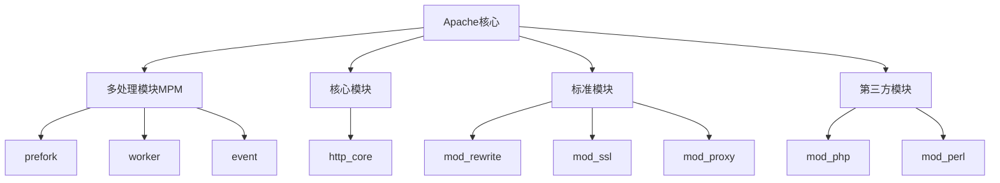
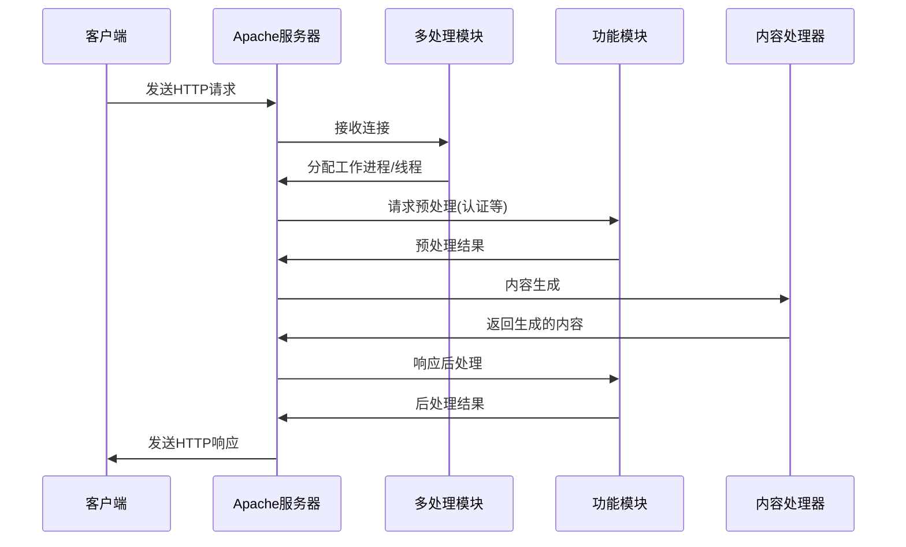

# Apache架构与工作原理

Apache HTTP Server是一个模块化设计的Web服务器，其核心架构和工作原理对于深入理解和优化Apache服务至关重要。本文将详细介绍Apache的整体架构、请求处理流程以及核心组件的工作机制，帮助读者建立对Apache服务器的系统性认识。

## Apache的历史与发展

Apache HTTP Server（简称Apache）诞生于1995年，是由Apache软件基金会开发和维护的开源Web服务器软件。其名称来源于"A Patchy Server"（一个补丁服务器），因为它最初是对NCSA HTTPd服务器的一系列补丁集合。

多年来，Apache一直是全球最流行的Web服务器之一，尽管近年来Nginx等新兴服务器的市场份额有所增长，但Apache仍然凭借其稳定性、可靠性和丰富的功能在众多企业和组织中广泛应用。

### 版本演进

Apache的主要版本演进：

- **Apache 1.x**：早期版本，采用进程模型，每个连接由一个独立进程处理，稳定但资源消耗较大
- **Apache 2.0**：引入了多处理模块(MPM)架构，支持多种并发处理模型，大幅提升了性能和可扩展性
- **Apache 2.2**：改进了性能和内存使用，增强了缓存功能，提供了更灵活的认证机制
- **Apache 2.4**：当前主流版本，进一步优化了性能，增强了模块化能力，改进了事件处理模型，降低了资源消耗

每个主要版本都带来了架构和性能上的显著改进，同时保持了向后兼容性，这也是Apache能够长期保持市场领先地位的重要原因之一。

## Apache的模块化架构

Apache的核心优势之一是其高度模块化的架构设计。这种设计使得Apache能够通过加载不同的模块来扩展功能，而无需修改核心代码。模块化架构不仅提高了系统的灵活性和可维护性，还允许用户根据实际需求定制服务器配置。

### 核心架构组件

Apache的架构主要由以下几个部分组成：

1. **Apache核心(Core)**：提供基本功能和API，负责协调各模块工作，管理生命周期和配置处理
2. **多处理模块(MPM)**：管理网络连接和请求分发，决定了Apache处理并发连接的方式
3. **功能模块**：提供各种具体功能的模块，如URL重写、SSL支持、代理等
4. **配置系统**：解析和应用配置指令，管理服务器的运行参数

这些组件之间的关系可以通过以下图表来表示：



Apache的核心提供了基础框架，而各种模块则在此基础上扩展功能。这种设计允许Apache能够适应各种不同的应用场景，从简单的静态文件服务到复杂的动态内容生成和反向代理。

### 多处理模块(MPM)

MPM是Apache架构中最关键的组件之一，它决定了Apache如何处理并发连接。不同的MPM采用不同的策略来平衡资源使用和性能需求。Apache提供了几种不同的MPM，每种都有其特定的使用场景：

#### 1. prefork MPM

prefork是Apache最传统的MPM，采用预先派生多个子进程的方式处理请求：

- **工作原理**：
  - 主进程负责创建子进程
  - 每个子进程处理一个连接
  - 每个子进程只有一个线程
  - 子进程数量根据负载动态调整

- **优势**：
  - 进程之间相互独立，一个进程崩溃不会影响其他进程
  - 无需考虑线程安全问题，兼容性最好
  - 适合运行非线程安全的模块(如早期的mod_php)
  - 配置简单，稳定性高

- **劣势**：
  - 内存占用较高，每个进程需要独立的内存空间
  - 进程创建和销毁开销大
  - 并发连接数受限于系统可创建的进程数

- **适用场景**：
  - 共享虚拟主机环境
  - 运行非线程安全模块的环境
  - 对稳定性要求高于性能的场景

#### 2. worker MPM

worker MPM采用混合的进程-线程模型，平衡了资源使用和并发处理能力：

- **工作原理**：
  - 创建多个子进程
  - 每个子进程可以有多个线程
  - 每个线程处理一个连接
  - 线程共享进程的内存空间

- **优势**：
  - 比prefork更节省内存，可处理更多并发连接
  - 线程创建和销毁的开销比进程小
  - 在多核系统上有更好的性能表现

- **劣势**：
  - 需要确保所有模块都是线程安全的
  - 一个线程崩溃可能影响同一进程中的其他线程
  - 配置和调优相对复杂

- **适用场景**：
  - 中等规模的Web服务
  - 内存资源有限但需要处理较多并发连接的环境
  - 使用线程安全模块的应用

#### 3. event MPM

event MPM是Apache 2.4中的默认MPM，它基于worker模型进行了改进，专门解决了keep-alive连接的性能问题：

- **工作原理**：
  - 基于worker MPM的多进程多线程模型
  - 使用专门的线程处理监听套接字
  - 将keep-alive连接与工作线程分离
  - 采用事件驱动模型处理连接状态变化

- **优势**：
  - 更高效地处理keep-alive连接
  - 减少了线程被空闲连接占用的情况
  - 在高并发场景下有更好的性能表现
  - 资源利用率更高

- **劣势**：
  - 实现复杂度高
  - 仍然需要所有模块都是线程安全的
  - 在某些特殊场景下可能不如专用的事件驱动服务器(如Nginx)

- **适用场景**：
  - 高并发Web服务
  - 大量长连接的应用
  - 现代Web应用部署

下表比较了三种主要MPM的特点：

| 特性 | prefork | worker | event |
|------|---------|--------|-------|
| 并发模型 | 多进程 | 多进程+多线程 | 多进程+多线程+事件驱动 |
| 内存占用 | 高 | 中 | 中 |
| 并发能力 | 低 | 中 | 高 |
| 稳定性 | 高 | 中 | 中高 |
| 兼容性 | 最佳 | 需线程安全模块 | 需线程安全模块 |
| 适用场景 | 共享主机、PHP应用 | 一般Web服务 | 高并发Web服务 |
| 资源消耗 | 每连接一个进程 | 每连接一个线程 | 按需分配线程 |
| Keep-alive效率 | 低 | 中 | 高 |

选择合适的MPM需要考虑服务器硬件资源、应用特性、并发需求以及使用的模块兼容性等多方面因素。

### 模块系统

Apache的模块系统是其灵活性的核心。模块可以在编译时静态链接，也可以作为动态共享对象(DSO)在运行时加载。这种设计使Apache能够根据需要添加或移除功能，而不必重新编译整个服务器。

#### 模块类型

Apache的模块可以分为以下几类：

1. **核心模块**：
   - 提供基本功能，如http_core
   - 实现HTTP协议处理
   - 通常静态编译到Apache中

2. **标准模块**：
   - Apache官方提供的常用功能模块
   - 包含在标准发行版中
   - 可以静态编译或动态加载

3. **第三方模块**：
   - 由社区或商业组织开发的扩展模块
   - 提供特定功能或与其他软件的集成
   - 通常作为动态模块加载

#### 常用模块功能介绍

Apache拥有丰富的模块生态系统，以下是一些常用模块及其功能：

- **mod_rewrite**：
  - 强大的URL重写引擎
  - 基于正则表达式的URL操作
  - 支持条件判断和规则链
  - 实现URL美化、重定向和内容协商

```apache
# 示例：将所有请求重定向到HTTPS
RewriteEngine On
RewriteCond %{HTTPS} off
RewriteRule (.*) https://%{HTTP_HOST}%{REQUEST_URI} [R=301,L]
```

- **mod_ssl**：
  - 提供SSL/TLS支持
  - 实现HTTPS安全连接
  - 管理证书和加密设置
  - 支持SNI(服务器名称指示)

```apache
# 示例：配置SSL虚拟主机
<VirtualHost *:443>
    ServerName example.com
    SSLEngine on
    SSLCertificateFile "/path/to/certificate.crt"
    SSLCertificateKeyFile "/path/to/private.key"
</VirtualHost>
```

- **mod_proxy**：
  - 提供代理/网关功能
  - 支持正向和反向代理
  - 实现负载均衡
  - 与其他服务器集成

```apache
# 示例：反向代理到应用服务器
ProxyPass "/app/" "http://localhost:8080/app/"
ProxyPassReverse "/app/" "http://localhost:8080/app/"
```

- **mod_security**：
  - Web应用防火墙功能
  - 防止常见的Web攻击
  - 提供实时监控和日志记录
  - 支持自定义安全规则

- **mod_expires**：
  - 控制HTTP头中的过期信息
  - 优化客户端缓存
  - 减少不必要的请求
  - 提高网站性能

```apache
# 示例：设置图片缓存时间
<IfModule mod_expires.c>
    ExpiresActive On
    ExpiresByType image/jpeg "access plus 1 month"
    ExpiresByType image/png "access plus 1 month"
</IfModule>
```

- **mod_php**：
  - 嵌入PHP解释器
  - 直接在Apache进程中执行PHP代码
  - 避免了CGI的进程创建开销
  - 适合共享主机环境

- **mod_perl**：
  - 嵌入Perl解释器
  - 在请求处理的各个阶段提供Perl钩子
  - 高性能Perl应用部署
  - 支持复杂的服务器扩展

#### 模块加载机制

Apache模块的加载过程如下：

1. **静态模块**：
   - 在编译Apache时通过`--enable-module`选项包含
   - 成为Apache二进制文件的一部分
   - 无需额外配置即可使用

2. **动态模块**：
   - 编译为共享对象(.so文件)
   - 通过`LoadModule`指令在配置文件中加载
   - 可以根据需要启用或禁用

```apache
# 示例：动态加载模块
LoadModule rewrite_module modules/mod_rewrite.so
LoadModule ssl_module modules/mod_ssl.so
```

3. **模块初始化**：
   - 模块注册钩子函数
   - 处理模块特定的配置指令
   - 分配必要的资源

模块系统的灵活性使Apache能够适应各种不同的部署需求，从轻量级的静态文件服务器到功能丰富的应用服务器平台。

## Apache的请求处理流程

了解Apache如何处理HTTP请求对于优化服务器性能至关重要。Apache采用了一种基于钩子(hooks)的请求处理模型，允许各个模块在请求处理的不同阶段介入。

### 基本请求处理流程

以下是一个典型HTTP请求在Apache中的处理流程：



### 详细处理阶段

Apache的请求处理可以分为以下几个主要阶段：

#### 1. 连接建立

当客户端尝试连接到Apache服务器时：

- MPM监听指定的端口(通常是80或443)
- 接受传入的TCP连接请求
- 根据MPM类型，分配给工作进程或线程处理
- 建立TCP连接，准备接收HTTP请求

在这个阶段，MPM的选择直接影响了服务器如何管理连接。例如，event MPM会更高效地处理keep-alive连接，而prefork则为每个连接分配一个独立进程。

#### 2. 请求解析

一旦连接建立，Apache开始解析HTTP请求：

- 读取并解析HTTP请求头
- 识别请求方法(GET, POST, PUT等)
- 解析请求URI和查询参数
- 识别HTTP版本和各种头信息
- 处理Cookie和其他客户端信息

这个阶段主要由http_core模块负责，它实现了HTTP协议的基本解析功能。

```
GET /example/page.html?param=value HTTP/1.1
Host: www.example.com
User-Agent: Mozilla/5.0
Accept: text/html
Cookie: session=abc123
```

上面的HTTP请求会被解析为各个组件，包括方法(GET)、URI(/example/page.html)、查询参数(param=value)、HTTP版本(1.1)以及各种头信息。

#### 3. 请求预处理

在实际处理请求内容之前，Apache会执行一系列预处理步骤：

- **URI转换**：
  - 应用别名(Alias)规则
  - 执行URL重写(如果启用了mod_rewrite)
  - 解析虚拟主机配置

- **访问控制**：
  - 检查IP基础的访问限制
  - 应用`<Directory>`、`<Location>`等容器中的规则
  - 执行`Allow`/`Deny`指令

- **认证与授权**：
  - 如果配置了认证要求，检查用户凭证
  - 验证用户是否有权访问请求的资源
  - 应用基于角色的访问控制

- **MIME类型处理**：
  - 确定请求资源的MIME类型
  - 应用内容协商(如语言、编码等)
  - 选择适当的内容处理器

这些预处理步骤由各种模块通过注册到特定处理阶段的钩子函数来实现。例如，mod_auth模块处理认证，mod_mime处理MIME类型识别。

#### 4. 内容生成

确定了请求的有效性和处理方式后，Apache进入内容生成阶段：

- **处理器选择**：
  - 根据文件类型或配置选择合适的内容处理器(handler)
  - 常见处理器包括：静态文件处理器、CGI处理器、代理处理器等

- **内容处理**：
  - 处理器执行实际的内容生成逻辑
  - 对于静态文件，直接从文件系统读取
  - 对于动态内容，调用相应的处理模块(如PHP、Perl等)
  - 对于代理请求，转发到后端服务器

- **过滤器应用**：
  - 内容生成后，可以通过过滤器链进行处理
  - 常见过滤器包括：压缩(mod_deflate)、SSL加密(mod_ssl)等
  - 过滤器可以修改、转换或增强生成的内容

内容生成是Apache处理流程中最核心的部分，不同类型的请求会使用不同的处理器：

```apache
# 示例：为不同文件类型指定处理器
<FilesMatch "\.php$">
    SetHandler application/x-httpd-php
</FilesMatch>

<FilesMatch "\.cgi$">
    SetHandler cgi-script
</FilesMatch>
```

#### 5. 响应完成

生成内容后，Apache完成HTTP响应的构建：

- **响应头生成**：
  - 设置状态码(如200 OK, 404 Not Found等)
  - 添加各种HTTP头(Content-Type, Content-Length等)
  - 应用自定义头信息

- **日志记录**：
  - 记录访问日志
  - 记录错误日志(如果有错误发生)
  - 执行自定义日志处理

- **连接处理**：
  - 如果是keep-alive连接，保持连接开放等待下一个请求
  - 否则关闭连接
  - 释放相关资源

响应完成阶段也允许模块通过钩子函数介入，例如mod_headers可以在此阶段添加或修改HTTP头信息。

### 钩子系统与模块交互

Apache的请求处理流程是通过钩子(hooks)系统实现的，这允许模块在请求处理的各个阶段注册自己的处理函数：

1. **钩子注册**：
   - 模块在初始化时注册钩子函数
   - 指定钩子函数应该在哪个处理阶段执行
   - 可以设置执行优先级

2. **钩子执行**：
   - Apache核心在处理请求的各个阶段调用已注册的钩子函数
   - 按照优先级顺序执行
   - 钩子函数可以修改请求/响应或中断处理流程

3. **常见钩子点**：
   - `post_config`：服务器启动时配置完成后
   - `translate_name`：URL到文件系统路径的转换
   - `check_access`：访问控制检查
   - `check_user_id`：用户认证
   - `check_auth`：用户授权
   - `type_checker`：确定内容类型
   - `fixups`：最终调整
   - `handler`：内容生成
   - `log_transaction`：请求日志记录

这种钩子系统使得Apache能够在不修改核心代码的情况下，通过模块扩展各种功能。模块可以选择性地介入请求处理的特定阶段，实现自定义的处理逻辑。

## Apache的配置系统

Apache的配置系统是其灵活性的另一个关键方面。通过配置文件，管理员可以定制服务器的行为，而无需修改源代码。

### 配置文件结构

Apache的配置通常分布在多个文件中，主要包括：

1. **主配置文件**：
   - 通常是`httpd.conf`或`apache2.conf`
   - 包含全局设置和基本配置
   - 可以包含或引用其他配置文件

2. **模块配置文件**：
   - 特定模块的配置，通常位于`mods-available`目录
   - 通过符号链接到`mods-enabled`目录来启用

3. **虚拟主机配置**：
   - 定义不同网站的配置
   - 通常位于`sites-available`目录
   - 通过符号链接到`sites-enabled`目录来启用

4. **.htaccess文件**：
   - 分布式配置文件，位于网站目录中
   - 允许在不访问主配置文件的情况下修改配置
   - 适用于共享主机环境

### 配置指令和容器

Apache配置由指令和容器组成：

1. **指令**：
   - 单行配置项，格式为`指令名 参数`
   - 例如：`ServerName www.example.com`

2. **容器**：
   - 包含多个指令的块，用于限定指令的作用范围
   - 常见容器包括：
     - `<Directory>` - 应用于特定文件系统目录
     - `<Location>` - 应用于特定URL路径
     - `<VirtualHost>` - 定义虚拟主机
     - `<Files>` - 应用于特定文件
     - `<IfModule>` - 条件性包含配置

```apache
# 示例：虚拟主机配置
<VirtualHost *:80>
    ServerName example.com
    DocumentRoot /var/www/example
    
    <Directory /var/www/example>
        Options Indexes FollowSymLinks
        AllowOverride All
        Require all granted
    </Directory>
    
    ErrorLog ${APACHE_LOG_DIR}/example_error.log
    CustomLog ${APACHE_LOG_DIR}/example_access.log combined
</VirtualHost>
```

### 配置处理流程

Apache在启动时处理配置的流程如下：

1. **读取主配置文件**
2. **处理Include指令**，加载其他配置文件
3. **解析所有指令**，构建配置树
4. **验证配置的语法和一致性**
5. **应用配置**到服务器运行环境
6. **模块初始化**，各模块处理自己的配置指令

配置更改通常需要重启或重新加载Apache服务器才能生效：

```bash
# 重新加载配置（不中断服务）
apachectl graceful

# 检查配置语法
apachectl configtest
```

## Apache的性能优化

了解Apache的架构和工作原理后，可以针对性地进行性能优化：

### MPM选择与调优

选择合适的MPM并进行调优是优化Apache性能的第一步：

1. **选择合适的MPM**：
   - 高并发场景优先考虑event MPM
   - 兼容性要求高的场景可以使用prefork MPM
   - 平衡场景可以使用worker MPM

2. **MPM参数调优**：
   - `StartServers` - 启动时创建的子进程数
   - `MinSpareServers`/`MaxSpareServers` - 空闲进程的最小/最大数量
   - `MaxRequestWorkers` - 同时处理的最大请求数
   - `MaxConnectionsPerChild` - 子进程处理的最大连接数

```apache
# event MPM优化示例
<IfModule mpm_event_module>
    StartServers             3
    MinSpareThreads         75
    MaxSpareThreads        250
    ThreadsPerChild         25
    MaxRequestWorkers      400
    MaxConnectionsPerChild   0
</IfModule>
```

### 模块优化

只加载必要的模块可以减少内存占用和提高性能：

1. **禁用不必要的模块**：
   - 使用`a2dismod`(Debian/Ubuntu)或直接编辑配置文件
   - 常见可禁用模块：autoindex, status, info等非必要模块

2. **优化模块配置**：
   - 为mod_expires设置适当的缓存策略
   - 配置mod_deflate进行内容压缩
   - 优化mod_rewrite规则，避免复杂的重写链

### 文件系统和操作系统优化

Apache性能也受到底层系统的影响：

1. **文件系统选择**：
   - 考虑使用性能更好的文件系统(如XFS)
   - 优化文件系统挂载选项

2. **操作系统参数**：
   - 增加文件描述符限制
   - 优化TCP参数(如keepalive设置)
   - 调整内存分配和交换设置

```bash
# 增加文件描述符限制
ulimit -n 65535

# 优化TCP参数
sysctl -w net.ipv4.tcp_fin_timeout=30
sysctl -w net.core.somaxconn=1024
```

### 缓存策略

合理使用缓存可以显著提高Apache性能：

1. **mod_cache配置**：
   - 启用磁盘缓存或内存缓存
   - 设置合理的缓存大小和过期策略

2. **客户端缓存控制**：
   - 使用mod_expires设置适当的过期时间
   - 配置ETag和Last-Modified头

```apache
# 启用缓存示例
<IfModule mod_cache.c>
    LoadModule cache_disk_module modules/mod_cache_disk.so
    
    CacheRoot "/var/cache/apache2/mod_cache_disk"
    CacheEnable disk /
    CacheDirLevels 2
    CacheDirLength 1
    CacheMaxFileSize 1000000
</IfModule>
```

## Apache与其他Web服务器的比较

了解Apache与其他Web服务器的区别有助于在不同场景下做出合适的选择：

### Apache vs Nginx

Nginx是近年来快速崛起的Web服务器，与Apache相比有以下区别：

1. **架构模型**：
   - Apache：多进程/多线程模型，每个连接由一个线程或进程处理
   - Nginx：事件驱动模型，单进程多线程，异步非阻塞

2. **资源消耗**：
   - Apache：在高并发下资源消耗较大
   - Nginx：设计为轻量级，内存占用小，高并发性能好

3. **配置灵活性**：
   - Apache：高度模块化，配置灵活，支持.htaccess
   - Nginx：配置相对简洁，不支持分布式配置

4. **功能特性**：
   - Apache：模块生态丰富，功能全面
   - Nginx：专注于核心功能，如静态文件服务、反向代理和负载均衡

5. **适用场景**：
   - Apache：适合复杂的Web应用，需要多种模块支持的环境
   - Nginx：适合静态内容、反向代理和负载均衡场景

### Apache vs IIS

IIS(Internet Information Services)是Microsoft的Web服务
让我继续介绍Apache架构与工作原理的内容：

### Apache vs IIS

IIS(Internet Information Services)是Microsoft的Web服务器，与Apache相比有以下特点：

1. **平台支持**：
   - Apache：跨平台，支持Linux、Unix、Windows等
   - IIS：仅支持Windows平台

2. **集成性**：
   - Apache：通过模块与各种技术集成
   - IIS：与Microsoft技术栈深度集成，如.NET、Active Directory

3. **管理界面**：
   - Apache：主要通过配置文件管理，图形界面通常是第三方工具
   - IIS：提供完善的图形管理界面，易于配置

4. **性能特点**：
   - Apache：在Linux平台上性能优秀
   - IIS：在Windows平台上经过优化，性能良好

5. **适用场景**：
   - Apache：适合多种环境，特别是开源技术栈
   - IIS：适合Windows环境和.NET应用

### Apache vs Tomcat

虽然Tomcat经常与Apache一起使用，但它们的定位不同：

1. **定位**：
   - Apache：通用Web服务器，处理各种Web请求
   - Tomcat：主要是Java Servlet容器，专注于Java Web应用

2. **功能范围**：
   - Apache：提供全面的Web服务器功能
   - Tomcat：专注于Java Servlet、JSP和WebSocket的支持

3. **集成方式**：
   - 常见的集成方式是Apache处理静态内容，通过mod_jk或mod_proxy将动态请求转发给Tomcat

4. **适用场景**：
   - Apache：通用Web服务，处理各种内容
   - Tomcat：Java Web应用部署

## Apache的安全机制

Apache提供了多层次的安全机制来保护Web应用和服务器：

### 访问控制

Apache提供了多种方式控制对资源的访问：

1. **基于IP的访问控制**：
   ```apache
   <Directory "/var/www/restricted">
       Require ip 192.168.1.0/24
       Require not ip 192.168.1.100
   </Directory>
   ```

2. **基于用户的访问控制**：
   ```apache
   <Directory "/var/www/private">
       AuthType Basic
       AuthName "Restricted Area"
       AuthUserFile /etc/apache2/.htpasswd
       Require valid-user
   </Directory>
   ```

3. **基于环境变量的控制**：
   ```apache
   SetEnvIf User-Agent "BadBot" bad_bot
   <Directory "/var/www/site">
       Require not env bad_bot
   </Directory>
   ```

### SSL/TLS支持

Apache通过mod_ssl模块提供SSL/TLS支持，实现加密通信：

1. **基本SSL配置**：
   ```apache
   <VirtualHost *:443>
       ServerName secure.example.com
       SSLEngine on
       SSLCertificateFile "/path/to/certificate.crt"
       SSLCertificateKeyFile "/path/to/private.key"
       SSLCertificateChainFile "/path/to/chain.crt"
   </VirtualHost>
   ```

2. **SSL协议和密码套件优化**：
   ```apache
   SSLProtocol all -SSLv2 -SSLv3 -TLSv1 -TLSv1.1
   SSLCipherSuite HIGH:!aNULL:!MD5:!3DES
   SSLHonorCipherOrder on
   ```

3. **HSTS(HTTP严格传输安全)**：
   ```apache
   <VirtualHost *:443>
       Header always set Strict-Transport-Security "max-age=31536000; includeSubDomains"
   </VirtualHost>
   ```

### 安全模块

Apache可以通过安全模块增强防护能力：

1. **mod_security**：
   - Web应用防火墙功能
   - 防止SQL注入、XSS等常见攻击
   - 支持自定义安全规则

   ```apache
   <IfModule security2_module>
       SecRuleEngine On
       SecRequestBodyAccess On
       SecRule REQUEST_HEADERS:Content-Type "text/xml" \
           "id:100001,phase:1,deny,status:400,msg:'XML内容被阻止'"
   </IfModule>
   ```

2. **mod_evasive**：
   - 防止DoS攻击
   - 监控请求频率
   - 自动阻止异常IP

3. **mod_qos**：
   - 提供服务质量控制
   - 限制连接数和带宽
   - 防止资源耗尽

### 安全最佳实践

使用Apache时应遵循以下安全最佳实践：

1. **最小权限原则**：
   - Apache进程使用低权限用户运行
   - 文件系统权限最小化
   - 禁用不必要的模块和功能

2. **隐藏服务器信息**：
   ```apache
   ServerTokens Prod
   ServerSignature Off
   ```

3. **定期更新**：
   - 保持Apache和模块的最新安全补丁
   - 监控安全公告

4. **安全配置检查**：
   - 使用工具如Mozilla Observatory、SSL Labs测试配置
   - 定期进行安全审计

## Apache的日志系统

Apache的日志系统是诊断问题和监控服务器的重要工具：

### 日志类型

Apache主要有两种核心日志：

1. **访问日志(Access Log)**：
   - 记录所有对服务器的请求
   - 默认格式包括客户端IP、时间、请求方法、URL、状态码等
   - 可自定义格式满足不同需求

   ```apache
   LogFormat "%h %l %u %t \"%r\" %>s %b \"%{Referer}i\" \"%{User-Agent}i\"" combined
   CustomLog ${APACHE_LOG_DIR}/access.log combined
   ```

2. **错误日志(Error Log)**：
   - 记录服务器错误和警告信息
   - 包含启动、关闭信息和运行时错误
   - 对排查问题至关重要

   ```apache
   ErrorLog ${APACHE_LOG_DIR}/error.log
   LogLevel warn
   ```

### 日志格式定制

Apache允许通过LogFormat指令定制日志格式：

```apache
# 详细日志格式示例
LogFormat "%h %l %u %t \"%r\" %>s %b \"%{Referer}i\" \"%{User-Agent}i\" %D" detailed
CustomLog ${APACHE_LOG_DIR}/detailed_access.log detailed
```

常用的格式占位符：
- `%h` - 客户端IP地址
- `%l` - 远程登录名（通常为"-"）
- `%u` - 认证用户名
- `%t` - 请求时间
- `%r` - 请求行
- `%>s` - 最终状态码
- `%b` - 响应大小（字节）
- `%{Referer}i` - Referer头
- `%{User-Agent}i` - User-Agent头
- `%D` - 处理请求所需时间（微秒）

### 日志轮转

为防止日志文件过大，应配置日志轮转：

1. **使用外部工具**：
   - 在Linux上使用logrotate
   - 配置定期轮转、压缩和清理旧日志

   ```
   # /etc/logrotate.d/apache2
   /var/log/apache2/*.log {
       daily
       missingok
       rotate 14
       compress
       delaycompress
       notifempty
       create 640 root adm
       sharedscripts
       postrotate
           if /etc/init.d/apache2 status > /dev/null ; then
               /etc/init.d/apache2 reload > /dev/null
           fi
       endscript
   }
   ```

2. **Apache内置轮转**：
   - 使用rotatelogs程序
   - 基于时间或大小自动轮转

   ```apache
   CustomLog "|/usr/bin/rotatelogs -l /var/log/apache2/access.%Y-%m-%d.log 86400" combined
   ```

### 日志分析

Apache日志可以通过多种工具进行分析：

1. **命令行工具**：
   - awk、grep等基本工具
   - 示例：统计访问最多的IP
     ```bash
     cat access.log | awk '{print $1}' | sort | uniq -c | sort -nr | head -10
     ```

2. **专用分析工具**：
   - AWStats - 生成详细的访问统计报告
   - GoAccess - 实时日志分析器
   - ELK Stack - 企业级日志分析平台

3. **关键指标监控**：
   - 请求量和流量
   - 响应时间
   - 错误率
   - 热门页面和资源

## 结语

Apache HTTP Server凭借其模块化架构、灵活的配置系统和丰富的功能，成为了Web服务器领域的标杆。深入理解Apache的架构和工作原理，不仅有助于更好地配置和优化服务器，还能帮助解决各种复杂问题。

虽然近年来Nginx等新兴Web服务器在某些场景下表现出更好的性能，但Apache凭借其成熟的生态系统、丰富的模块和广泛的社区支持，仍然是许多企业和组织的首选Web服务器。

通过合理选择MPM、优化配置、启用适当的模块和实施安全最佳实践，Apache可以满足从小型个人网站到大型企业应用的各种需求，继续在Web服务器领域发挥重要作用。