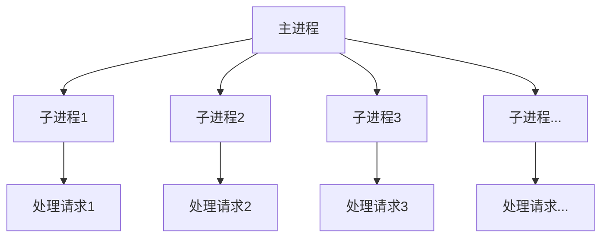
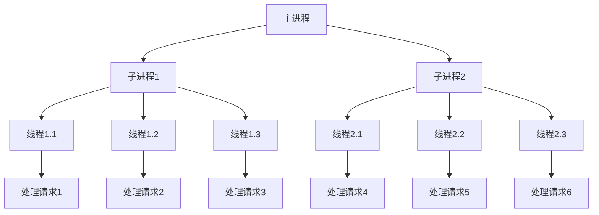
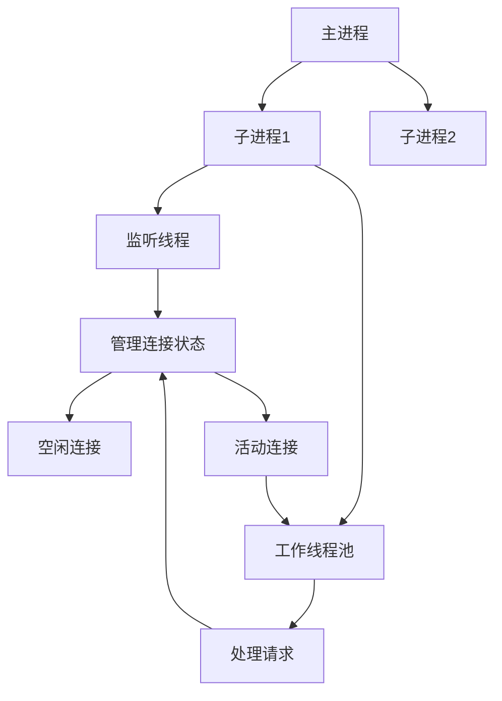

# MPM模块与处理模型

多处理模块(MPM, Multi-Processing Module)是Apache HTTP Server处理并发连接的核心机制，不同的MPM模块采用不同的处理模型来管理请求。本文将详细介绍Apache中的各种MPM模块，包括prefork、worker和event等，分析它们的工作原理、适用场景以及性能特点，帮助读者选择最适合自己环境的处理模型。

## MPM基础概念

在深入各种MPM模块之前，我们需要理解一些基础概念，这些概念对于理解Apache的工作方式至关重要。

### 什么是MPM

MPM(Multi-Processing Module)是Apache HTTP Server的核心组件，负责:

1. **绑定网络端口**：监听来自客户端的连接请求
2. **接受请求**：接收并处理HTTP请求
3. **管理子进程/线程**：创建和管理处理请求的子进程或线程

Apache设计了可插拔的MPM架构，允许根据不同的操作系统和需求选择最合适的处理模型。每个Apache实例在运行时只能使用一种MPM模型。

### 进程与线程的区别

理解MPM模型首先需要明确进程和线程的区别：

- **进程(Process)**：
  - 独立的执行单元，拥有独立的内存空间
  - 进程间通信相对复杂且开销大
  - 一个进程崩溃通常不会影响其他进程
  - 创建和销毁进程的开销较大

- **线程(Thread)**：
  - 进程内的执行单元，共享进程的内存空间
  - 线程间通信简单且开销小
  - 一个线程崩溃可能导致整个进程崩溃
  - 创建和销毁线程的开销较小

下图展示了进程与线程的关系：

```
┌────────────────────┐  ┌────────────────────┐
│     进程 A         │  │     进程 B         │
│                    │  │                    │
│  ┌──────┐ ┌──────┐ │  │  ┌──────┐ ┌──────┐ │
│  │线程A1│ │线程A2│ │  │  │线程B1│ │线程B2│ │
│  └──────┘ └──────┘ │  │  └──────┘ └──────┘ │
│                    │  │                    │
│  ┌──────────────┐  │  │  ┌──────────────┐  │
│  │  独立内存空间  │  │  │  独立内存空间  │  │
│  └──────────────┘  │  │  └──────────────┘  │
└────────────────────┘  └────────────────────┘
```

### 并发与并行

在讨论MPM模型时，还需要理解并发和并行的区别：

- **并发(Concurrency)**：
  - 多个任务在重叠的时间段内启动、运行和完成
  - 可能在单个CPU核心上通过时间片轮转实现
  - 强调任务的独立性，而非同时执行

- **并行(Parallelism)**：
  - 多个任务在同一时刻同时执行
  - 需要多核CPU或多处理器支持
  - 强调任务的同时执行

Apache的不同MPM模型提供了不同级别的并发和并行处理能力，这直接影响了服务器的性能和资源利用率。

## 主要MPM模型详解

Apache提供了几种主要的MPM模型，每种都有其独特的特点和适用场景。

### Prefork MPM

Prefork MPM是Apache最传统的处理模型，也是最稳定的一种。

#### 工作原理

Prefork MPM采用预先派生多个子进程的方式处理请求：

1. **主进程(Master Process)**：
   - 以root权限运行
   - 负责创建子进程
   - 监听端口并将连接传递给子进程
   - 管理子进程的生命周期

2. **子进程(Child Process)**：
   - 以较低权限运行(通常是www-data或apache)
   - 每个子进程独立处理一个连接
   - 子进程之间完全独立，互不影响
   - 处理完请求后可以处理新的连接

下图展示了Prefork MPM的工作模型：



#### 关键配置参数

Prefork MPM的主要配置参数包括：

```apache
<IfModule mpm_prefork_module>
    StartServers             5
    MinSpareServers          5
    MaxSpareServers         10
    MaxRequestWorkers      150
    MaxConnectionsPerChild   0
</IfModule>
```

- **StartServers**：启动时创建的子进程数
- **MinSpareServers**：最小空闲子进程数，如果空闲进程数低于此值，主进程会创建新的子进程
- **MaxSpareServers**：最大空闲子进程数，如果空闲进程数高于此值，主进程会杀死多余的子进程
- **MaxRequestWorkers**：同时处理的最大请求数（在Apache 2.4之前称为MaxClients）
- **MaxConnectionsPerChild**：一个子进程在被杀死前能处理的最大连接数，0表示无限制

#### 优缺点分析

**优点**：
- **稳定性高**：进程间完全隔离，一个进程崩溃不会影响其他进程
- **兼容性好**：适用于非线程安全的模块（如早期的mod_php）
- **调试简单**：每个请求由独立进程处理，便于跟踪和调试
- **安全性好**：进程间内存隔离，减少了安全风险

**缺点**：
- **资源消耗大**：每个进程需要独立的内存空间，内存占用高
- **并发能力有限**：受限于系统可创建的进程数量
- **进程创建开销大**：在高负载情况下，频繁创建和销毁进程会带来额外开销

#### 适用场景

Prefork MPM特别适合以下场景：
- 共享虚拟主机环境，需要运行非线程安全的模块
- 使用mod_php等非线程安全模块的PHP应用
- 内存资源充足但对稳定性要求高的环境
- 请求处理时间较长但并发量不大的应用

### Worker MPM

Worker MPM采用混合的多进程多线程模型，平衡了资源使用和并发处理能力。

#### 工作原理

Worker MPM的工作模式如下：

1. **主进程**：
   - 创建多个子进程
   - 管理子进程的生命周期

2. **子进程**：
   - 每个子进程创建多个工作线程
   - 线程共享进程的内存空间
   - 每个线程处理一个连接

下图展示了Worker MPM的工作模型：



#### 关键配置参数

Worker MPM的主要配置参数包括：

```apache
<IfModule mpm_worker_module>
    StartServers             3
    MinSpareThreads         75
    MaxSpareThreads        250
    ThreadsPerChild         25
    MaxRequestWorkers      400
    MaxConnectionsPerChild   0
</IfModule>
```

- **StartServers**：启动时创建的子进程数
- **MinSpareThreads**：最小空闲线程数
- **MaxSpareThreads**：最大空闲线程数
- **ThreadsPerChild**：每个子进程创建的线程数
- **MaxRequestWorkers**：同时处理的最大请求数
- **MaxConnectionsPerChild**：一个子进程在被杀死前能处理的最大连接数

#### 优缺点分析

**优点**：
- **内存效率高**：线程共享进程内存空间，减少了内存占用
- **并发能力强**：可以处理更多的并发连接
- **资源利用率高**：在多核系统上能更好地利用CPU资源
- **扩展性好**：可以通过调整进程数和线程数来适应不同的负载

**缺点**：
- **稳定性较低**：一个线程崩溃可能影响同一进程中的其他线程
- **兼容性问题**：要求所有模块都是线程安全的
- **调试复杂**：多线程环境下的问题排查较为复杂
- **Keep-Alive连接处理效率不高**：线程会被长连接占用

#### 适用场景

Worker MPM适合以下场景：
- 中等规模的Web服务，需要处理较多并发连接
- 内存资源有限但CPU资源充足的环境
- 使用线程安全模块的应用
- 需要平衡资源使用和并发能力的场景

### Event MPM

Event MPM是Apache 2.4中的默认MPM，它基于Worker模型进行了改进，专门解决了keep-alive连接的性能问题。

#### 工作原理

Event MPM的核心创新在于它如何处理keep-alive连接：

1. **连接状态分离**：
   - 将连接管理与请求处理分离
   - 专门的监听线程负责接受新连接
   - 工作线程只在有实际请求需要处理时才会被占用

2. **异步处理**：
   - 使用事件驱动模型处理连接状态变化
   - 一个线程可以监视多个keep-alive连接
   - 只有当连接上有新请求时，才会分配工作线程处理

下图展示了Event MPM的工作模型：



#### 关键配置参数

Event MPM的配置参数与Worker类似：

```apache
<IfModule mpm_event_module>
    StartServers             3
    MinSpareThreads         75
    MaxSpareThreads        250
    ThreadsPerChild         25
    MaxRequestWorkers      400
    MaxConnectionsPerChild   0
</IfModule>
```

参数含义与Worker MPM相同，但Event MPM对这些参数的使用方式有所不同，特别是在处理keep-alive连接时。

#### 优缺点分析

**优点**：
- **高效处理keep-alive连接**：解决了Worker MPM中线程被空闲连接占用的问题
- **更高的并发能力**：同样数量的线程可以处理更多的连接
- **资源利用率更高**：减少了线程等待的时间，提高了处理效率
- **适应现代Web应用**：更好地支持长连接和AJAX等技术

**缺点**：
- **实现复杂**：比其他MPM模型更复杂，调试和故障排除难度更大
- **仍需线程安全**：与Worker MPM一样，要求所有模块都是线程安全的
- **对系统要求较高**：需要操作系统提供良好的事件通知机制
- **某些场景下不如专用服务器**：在极高并发场景下，可能不如Nginx等专用事件驱动服务器

#### 适用场景

Event MPM特别适合以下场景：
- 高并发Web服务，特别是有大量keep-alive连接的应用
- 现代Web应用，如单页应用(SPA)和AJAX密集型应用
- 资源有限但需要处理大量并发连接的环境
- 需要Apache功能但又希望获得类似Nginx并发性能的场景

## MPM性能对比与选择

不同的MPM模型在不同场景下表现各异，选择合适的MPM需要考虑多种因素。

### 性能对比

下表比较了三种主要MPM在不同方面的性能表现：

| 性能指标 | Prefork | Worker | Event |
|---------|---------|--------|-------|
| 内存占用 | 高 | 中 | 中 |
| 并发能力 | 低 | 中 | 高 |
| CPU利用率 | 中 | 高 | 高 |
| Keep-alive效率 | 低 | 中 | 高 |
| 静态内容处理 | 中 | 高 | 高 |
| 动态内容处理 | 高(取决于模块) | 高 | 高 |
| 稳定性 | 高 | 中 | 中 |
| 兼容性 | 最佳 | 需线程安全模块 | 需线程安全模块 |

### 负载测试结果

以下是在典型场景下的负载测试结果示例（数值仅供参考，实际性能取决于硬件配置和应用特性）：

**测试环境**：
- 4核CPU，8GB内存
- 1000个并发连接
- 混合静态和动态内容

**每秒请求数(RPS)对比**：

```
┌─────────────────────────────────────────────────┐
│                                                 │
│  1200 ┼                                  ████   │
│       │                                  ████   │
│  1000 ┼                          ████    ████   │
│       │                          ████    ████   │
│   800 ┼                  ████    ████    ████   │
│       │                  ████    ████    ████   │
│   600 ┼          ████    ████    ████    ████   │
│       │          ████    ████    ████    ████   │
│   400 ┼  ████    ████    ████    ████    ████   │
│       │  ████    ████    ████    ████    ████   │
│   200 ┼  ████    ████    ████    ████    ████   │
│       │  ████    ████    ████    ████    ████   │
│     0 ┼──████────████────████────████────████───│
│        Prefork  Worker   Event   Event   Nginx  │
│        (PHP)    (PHP-FPM)(PHP-FPM)(静态)  (静态) │
└─────────────────────────────────────────────────┘
```

### 选择合适的MPM

选择MPM时需要考虑以下因素：

1. **应用兼容性**：
   - 如果使用非线程安全模块（如某些PHP模块），选择Prefork
   - 如果所有模块都是线程安全的，可以选择Worker或Event

2. **硬件资源**：
   - 内存有限但CPU核心多：优先考虑Worker或Event
   - 内存充足：可以使用Prefork，特别是对稳定性要求高的场景

3. **并发需求**：
   - 低并发场景：三种MPM差异不大，可以选择Prefork获得更好的稳定性
   - 中等并发：Worker通常是不错的选择
   - 高并发场景：Event通常能提供最佳性能

4. **连接特性**：
   - 短连接为主：三种MPM差异不大
   - 长连接(Keep-alive)为主：Event明显优于其他两种

5. **操作系统**：
   - Windows：通常只支持mpm_winnt（类似Worker的多线程模型）
   - Unix/Linux：支持所有三种MPM

### 实际应用建议

基于上述分析，以下是一些实际应用建议：

1. **共享虚拟主机环境**：
   - 推荐使用Prefork + mod_php
   - 原因：稳定性高，兼容性好，便于隔离不同用户的应用

2. **现代PHP应用**：
   - 推荐使用Event + PHP-FPM
   - 原因：高并发性能，更好的资源利用率，PHP-FPM提供了进程隔离

3. **Java应用代理**：
   - 推荐使用Event + mod_proxy
   - 原因：高效处理长连接，适合作为Tomcat等Java应用服务器的前端

4. **静态内容服务**：
   - 考虑使用Event或替代方案如Nginx
   - 原因：静态内容服务对并发要求高，Event在这方面表现良好

5. **混合应用环境**：
   - 可以考虑Apache与Nginx配合使用
   - Apache(Prefork)处理动态内容，Nginx处理静态内容和反向代理

## MPM配置与优化

正确配置和优化MPM对于Apache的性能至关重要。

### 查看当前MPM

在配置前，首先需要确认当前使用的MPM：

```bash
# 查看编译时包含的MPM模块
apache2 -l | grep mpm

# 或者查看当前加载的MPM模块
apache2ctl -M | grep mpm
```

在Debian/Ubuntu系统上，还可以使用：

```bash
a2query -M
```

### 切换MPM模块

在Debian/Ubuntu系统上，可以使用以下命令切换MPM：

```bash
# 启用event MPM
a2dismod mpm_prefork
a2enmod mpm_event
systemctl restart apache2

# 启用worker MPM
a2dismod mpm_prefork
a2enmod mpm_worker
systemctl restart apache2

# 启用prefork MPM
a2dismod mpm_event
a2enmod mpm_prefork
systemctl restart apache2
```

在其他系统上，需要编辑Apache配置文件，确保只加载一个MPM模块。

### MPM优化原则

优化MPM配置时，应遵循以下原则：

1. **资源评估**：
   - 评估服务器可用的内存和CPU资源
   - 考虑操作系统限制（如最大文件描述符数）
   - 考虑其他应用对资源的需求

2. **负载特性分析**：
   - 分析请求的平均处理时间
   - 评估并发连接数和请求率
   - 考虑峰值负载情况

3. **渐进式调整**：
   - 从保守配置开始，逐步调整
   - 每次只调整一个参数，观察效果
   - 进行负载测试验证调整效果

### Prefork MPM优化

Prefork MPM的优化主要关注进程数量和内存使用：

```apache
<IfModule mpm_prefork_module>
    # 根据CPU核心数设置，通常为核心数的1-2倍
    StartServers             5
    
    # 保持较小的空闲进程池以节省资源
    MinSpareServers          5
    MaxSpareServers         10
    
    # 关键参数，根据内存计算：
    # MaxRequestWorkers = 可用内存 / 每个进程内存使用量
    # 例如：8GB内存，每进程使用50MB，则可设为160
    MaxRequestWorkers      150
    
    # 设置为非零值可防止内存泄漏问题
    # 通常设为1000-10000之间
    MaxConnectionsPerChild 1000
</IfModule>
```

**内存计算公式**：
- 估算每个进程的内存使用：`ps -ylC apache2 --sort:rss | awk '{sum+=$8} END {print sum/NR/1024}'`（结果单位为MB）
- 最大进程数 = 可用内存 / 每个进程内存使用量

### Worker MPM优化

Worker MPM的优化需要平衡进程数和线程数：

```apache
<IfModule mpm_worker_module>
    # 通常设为CPU核心数的一半
    StartServers             2
    
    # 保持足够的空闲线程以应对突发流量
    MinSpareThreads         25
    MaxSpareThreads        75
    
    # 通常设为25-100之间，取决于应用特性
    ThreadsPerChild         25
    
    # 计算公式：ThreadsPerChild * 预计进程数
    # 需确保不超过系统限制
    MaxRequestWorkers      150
    
    # 同样设置非零值防止内存泄漏
    MaxConnectionsPerChild 10000
</IfModule>
```

**优化思路**：
- 减少进程数，增加每个进程的线程数，可以减少内存使用
- 但线程数过多会增加上下文切换开销，通常每个进程25-100个线程比较合理

### Event MPM优化

Event MPM的优化与Worker类似，但更注重连接处理：

```apache
<IfModule mpm_event_module>
    # 同样通常设为CPU核心数的一半
    StartServers             2
    
    # 由于Event MPM更高效地处理连接，可以设置更多的空闲线程
    MinSpareThreads         50
    MaxSpareThreads        150
    
    # 可以比Worker设置更多的线程
    ThreadsPerChild         25
    
    # 同样需要计算总体资源限制
    MaxRequestWorkers      200
    
    # 连接限制
    MaxConnectionsPerChild 10000
</IfModule>
```

**额外优化**：
- 对于Event MPM，还可以调整以下参数：
  - `AsyncRequestWorkerFactor`：控制异步连接与工作线程的比例
  - `ThreadLimit`：设置每个子进程的最大线程数上限

### 系统级优化

除了MPM配置外，还需要进行系统级优化：

1. **文件描述符限制**：
   ```bash
   # 在/etc/security/limits.conf中添加
   apache soft nofile 65535
   apache hard nofile 65535
   ```

2. **TCP参数优化**：
   ```bash
   # 在/etc/sysctl.conf中添加
   net.ipv4.tcp_fin_timeout = 30
   net.core.somaxconn = 1024
   net.ipv4.tcp_max_syn_backlog = 1024
   ```

3. **内核参数**：
   ```bash
   # 在/etc/sysctl.conf中添加
   fs.file-max = 100000
   ```

### 性能监控与调优

配置后需要持续监控和调优：

1. **监控工具**：
   - `apache2ctl status`：查看Apache状态
   - `top`/`htop`：监控系统资源使用
   - `netstat -anp | grep apache`：查看连接状态

2. **性能测试工具**：
   - `ab`(Apache Benchmark)：简单的负载测试
   - `siege`：更复杂的负载测试
   - `jmeter`：企业级性能测试

3. **调优循环**：
   - 测试 → 监控 → 分析 → 调整 → 再测试

## 常见问题与解决方案

使用MPM时可能遇到的常见问题及其解决方案：

### 服务器响应缓慢

**可能原因**：
- MPM配置不当，进程/线程数不足
- 系统资源不足（CPU、内存、I/O）
- 应用程序效率低下

**解决方案**：
1. 检查负载情况：`top`、`vmstat`、`iostat`
2. 增加MaxRequestWorkers（确保有足够内存）
3. 考虑切换到更高效的MPM（如从Prefork切换到Event）
4. 优化应用程序代码和数据库查询

### 服务器频繁崩溃

**可能原因**：
- 内存不足，导致OOM Killer终止进程
- MPM配置过高，超出系统资源限制
- 模块兼容性问题

**解决方案**：
1. 检查系统日志：`journalctl -xe`或`/var/log/syslog`
2. 减少MaxRequestWorkers值
3. 增加MaxConnectionsPerChild防止内存泄漏
4. 如使用Worker/Event但模块不是线程安全的，考虑切换回Prefork

### 连接被拒绝

**可能原因**：
- 达到MaxRequestWorkers限制
- 文件描述符限制
- TCP连接队列已满

**解决方案**：
1. 检查Apache错误日志
2. 增加系统文件描述符限制
3. 调整TCP参数：`net.core.somaxconn`和`net.ipv4.tcp_max_syn_backlog`
4. 适当增加MaxRequestWorkers（确保有足够内存）

### 内存使用过高

**可能原因**：
- Prefork MPM进程数过多
- 应用程序内存泄漏
- 模块内存使用效率低

**解决方案**：
1. 减少MaxRequestWorkers
2. 设置合理的MaxConnectionsPerChild值
3. 考虑切换到Worker或Event MPM
4. 使用`mod_status`监控内存使用情况

## 结语

Apache的MPM模块是其处理并发连接的核心机制，选择合适的MPM并正确配置对于服务器性能至关重要。通过本文的介绍，我们详细了解了Prefork、Worker和Event三种主要MPM的工作原理、优缺点和适用场景。

在实际应用中，应根据应用特性、硬件资源和并发需求选择最合适的MPM。对于现代Web应用，Event MPM通常能提供最佳性能，特别是在处理大量keep-alive连接时；而对于需要使用非线程安全模块的环境，Prefork仍然是可靠的选择。

无论选择哪种MPM，合理的配置和持续的监控调优都是确保Apache服务器高效运行的关键。通过遵循本文提供的优化原则和方法，可以充分发挥Apache服务器的性能潜力，为用户提供快速、稳定的Web服务。