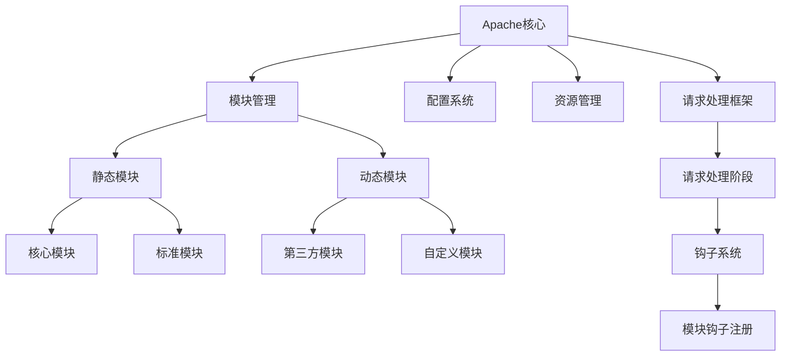
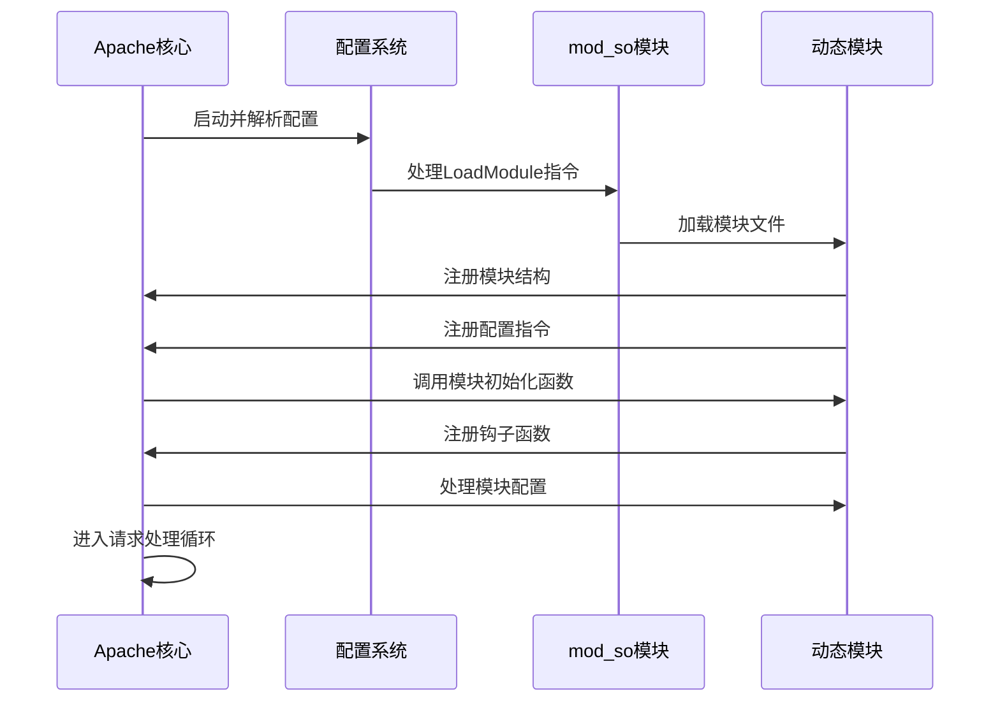
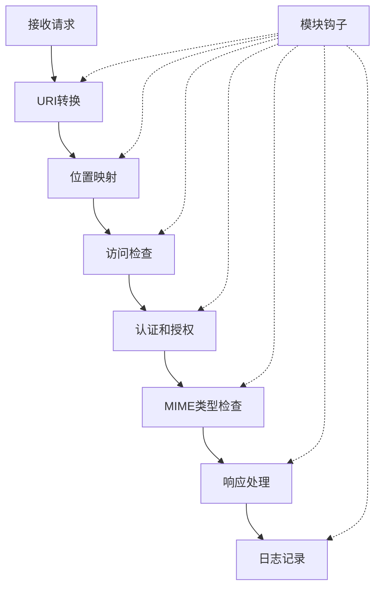

# Apache模块化设计分析

Apache HTTP Server采用模块化架构设计，这种设计使其成为最灵活和可扩展的Web服务器之一。模块化架构的核心思想是将核心功能与扩展功能分离，通过动态加载模块实现功能定制。本文将深入分析Apache的模块化设计原理、模块类型、加载机制以及模块开发方法，帮助读者全面理解Apache的可扩展性。

## 1. 模块系统架构

Apache的模块系统采用分层设计，通过明确的接口和钩子机制实现核心与模块的解耦，使得功能扩展不需要修改核心代码。

### 1.1 架构层次

Apache的模块系统主要分为以下几个层次：

1. **核心层** (httpd核心)
   - 提供基础服务：连接处理、配置解析、模块管理等
   - 包含最小功能集，保证服务器基本运行
   - 实现请求处理的基本流程和框架
   - 管理服务器生命周期

2. **模块层**
   - 通过`mod_so`模块实现动态加载
   - 模块通过hook机制接入核心处理流程
   - 实现具体的功能扩展
   - 可以在运行时加载或卸载

3. **应用层**
   - 基于模块提供的功能构建Web应用
   - 通过配置文件定制服务器行为

### 1.2 核心与模块的关系

Apache核心与模块之间的关系可以用以下图表表示：



### 1.3 动态模块加载机制

`mod_so`模块是Apache动态加载其他模块的关键组件，它允许在不重新编译服务器的情况下加载和卸载模块。以下是其核心实现原理：

```c
// 模块加载关键函数示例
AP_DECLARE(module*) ap_load_module(apr_pool_t *p, const char *filename, const char **err)
{
    void *dlhandle;
    module *modp;
    
    // 使用动态链接库函数加载模块
    dlhandle = dlopen(filename, RTLD_NOW | RTLD_GLOBAL);
    if (!dlhandle) {
        *err = apr_pstrcat(p, "Cannot load ", filename, " into server: ",
                          dlerror(), NULL);
        return NULL;
    }
    
    // 查找模块入口点
    modp = dlsym(dlhandle, "module");
    if (!modp) {
        *err = apr_pstrcat(p, "Module ", filename,
                          " does not contain a module structure", NULL);
        dlclose(dlhandle);
        return NULL;
    }
    
    // 返回模块指针
    return modp;
}
```

这个函数展示了Apache如何使用操作系统的动态链接库功能来加载模块。在Linux系统上使用`dlopen`和`dlsym`，而在Windows系统上则使用`LoadLibrary`和`GetProcAddress`。

## 2. 模块类型分类

Apache模块按功能和用途可以分为多种类型，每种类型的模块在服务器中扮演不同的角色。

### 2.1 核心功能模块

核心功能模块提供Apache基本功能，通常默认编译或加载：

| 模块名 | 功能描述 | 是否默认加载 | 重要性 |
|-------|---------|------------|-------|
| mod_core | HTTP协议核心实现 | 是(静态) | 必需 |
| mod_so | 动态模块加载 | 是 | 必需(动态模块) |
| mod_mime | 文件类型识别 | 是 | 高 |
| mod_dir | 目录请求处理 | 是 | 高 |
| mod_alias | URL映射 | 是 | 高 |
| mod_access_compat | 基于主机的访问控制 | 是 | 中 |
| mod_auth_basic | 基本认证 | 否 | 中 |
| mod_log_config | 日志配置 | 是 | 高 |

### 2.2 扩展功能模块

扩展功能模块提供额外功能，可以根据需要加载：

| 模块名 | 功能描述 | 应用场景 | 资源消耗 |
|-------|---------|---------|---------|
| mod_rewrite | URL重写引擎 | URL美化、重定向 | 中 |
| mod_proxy | 代理/负载均衡 | 反向代理、负载均衡 | 高 |
| mod_ssl | HTTPS支持 | 安全连接 | 高 |
| mod_deflate | 内容压缩 | 减少传输数据量 | 中 |
| mod_expires | 控制缓存头 | 优化客户端缓存 | 低 |
| mod_headers | 自定义HTTP头 | 安全头设置、跨域 | 低 |
| mod_security | Web应用防火墙 | 安全防护 | 高 |

### 2.3 处理器模块

处理器模块负责生成内容或处理特定类型的请求：

| 模块名 | 处理内容 | 工作方式 |
|-------|---------|---------|
| mod_cgi | CGI脚本 | 创建新进程执行脚本 |
| mod_cgid | CGI脚本(多线程) | 通过守护进程执行脚本 |
| mod_php | PHP脚本 | 嵌入PHP解释器 |
| mod_perl | Perl脚本 | 嵌入Perl解释器 |
| mod_wsgi | Python WSGI应用 | 嵌入Python解释器 |
| mod_fcgid | FastCGI | 通过FastCGI协议与外部应用通信 |

### 2.4 过滤器模块

过滤器模块可以修改请求或响应内容：

| 模块名 | 过滤类型 | 功能 |
|-------|---------|------|
| mod_deflate | 输出过滤器 | 压缩响应内容 |
| mod_include | 输出过滤器 | 处理服务器端包含(SSI) |
| mod_substitute | 输出过滤器 | 内容替换 |
| mod_sed | 输出过滤器 | 基于sed的内容替换 |
| mod_ext_filter | 外部过滤器 | 使用外部程序处理内容 |

## 3. 模块加载机制

Apache的模块加载机制是其灵活性的关键，它允许服务器根据配置动态加载所需功能。

### 3.1 模块加载流程

Apache模块加载的完整流程如下：

1. 服务器启动，解析主配置文件
2. 处理`LoadModule`指令，确定需要加载的模块
3. 通过`mod_so`调用动态链接库函数加载模块文件(.so/.dll)
4. 模块初始化，注册配置指令和钩子函数
5. 服务器完成配置，各模块按注册顺序执行配置处理
6. 服务器进入请求处理循环，模块参与请求处理



### 3.2 模块配置示例

以下是Apache配置文件中加载和配置模块的典型示例：

```apache
# 加载模块
LoadModule rewrite_module modules/mod_rewrite.so
LoadModule ssl_module modules/mod_ssl.so
LoadModule proxy_module modules/mod_proxy.so
LoadModule proxy_http_module modules/mod_proxy_http.so

# 模块配置
<IfModule mod_rewrite.c>
    RewriteEngine On
    RewriteRule ^/oldpath(/.*)?$ /newpath$1 [R=301,L]
</IfModule>

<IfModule mod_ssl.c>
    SSLEngine On
    SSLCertificateFile "/path/to/certificate.crt"
    SSLCertificateKeyFile "/path/to/private.key"
</IfModule>

<IfModule mod_proxy.c>
    ProxyRequests Off
    ProxyPass /app http://localhost:8080/app
    ProxyPassReverse /app http://localhost:8080/app
</IfModule>
```

`<IfModule>`指令用于条件性地应用配置，只有当指定模块已加载时，其中的配置才会生效。这提供了配置的灵活性和向后兼容性。

### 3.3 静态模块与动态模块

Apache支持两种模块加载方式：

1. **静态模块**：
   - 在编译Apache时直接链接到服务器可执行文件中
   - 优点：启动更快，不依赖外部文件
   - 缺点：需要重新编译Apache才能添加或移除模块
   - 配置方法：编译时使用`--enable-module`选项

2. **动态模块**：
   - 编译为独立的共享对象(.so/.dll)，运行时加载
   - 优点：灵活性高，可以在不重启服务器的情况下加载/卸载
   - 缺点：轻微的性能开销，依赖外部文件
   - 配置方法：使用`LoadModule`指令

大多数现代Apache安装都倾向于使用动态模块，因为它提供了更大的灵活性和更简单的维护。

## 4. 模块开发基础

开发Apache模块需要理解Apache的API和模块结构，以下是开发自定义模块的基本步骤和关键概念。

### 4.1 模块结构

Apache模块的基本结构包括模块定义、钩子注册和处理函数：

```c
#include "httpd.h"
#include "http_config.h"
#include "http_protocol.h"
#include "ap_config.h"

// 模块处理函数
static int my_handler(request_rec *r) {
    // 检查是否应该处理此请求
    if (strcmp(r->handler, "my-handler"))
        return DECLINED;
    
    // 设置内容类型
    ap_set_content_type(r, "text/html");
    
    // 发送响应内容
    ap_rputs("<!DOCTYPE html><html><head>", r);
    ap_rputs("<title>My Apache Module</title></head><body>", r);
    ap_rputs("<h1>Hello from my custom module!</h1>", r);
    ap_rputs("</body></html>", r);
    
    // 返回OK表示请求已处理
    return OK;
}

// 注册模块钩子
static void register_hooks(apr_pool_t *p) {
    // 注册内容处理钩子
    ap_hook_handler(my_handler, NULL, NULL, APR_HOOK_MIDDLE);
}

// 模块定义
module AP_MODULE_DECLARE_DATA my_module = {
    STANDARD20_MODULE_STUFF,  // 标准模块信息
    NULL,                     // 创建目录配置
    NULL,                     // 合并目录配置
    NULL,                     // 创建服务器配置
    NULL,                     // 合并服务器配置
    NULL,                     // 命令表
    register_hooks            // 注册钩子
};
```

### 4.2 钩子系统

钩子(Hooks)是Apache模块系统的核心机制，它允许模块在请求处理的不同阶段插入自定义处理逻辑：

| 钩子名称 | 处理阶段 | 用途 |
|---------|---------|------|
| ap_hook_pre_config | 配置前 | 在读取配置前执行初始化 |
| ap_hook_post_config | 配置后 | 配置完成后执行初始化 |
| ap_hook_translate_name | URI转换 | 将URI转换为文件系统路径 |
| ap_hook_map_to_storage | 映射存储 | 确定如何处理请求 |
| ap_hook_check_access | 访问检查 | 检查是否允许访问 |
| ap_hook_check_user_id | 用户认证 | 验证用户身份 |
| ap_hook_auth_checker | 授权检查 | 检查用户权限 |
| ap_hook_type_checker | 类型检查 | 确定内容类型 |
| ap_hook_fixups | 最终调整 | 请求处理前的最后调整 |
| ap_hook_handler | 内容处理 | 生成响应内容 |
| ap_hook_log_transaction | 日志记录 | 记录请求信息 |

钩子注册时可以指定优先级和依赖关系，确保模块按正确顺序执行：

```c
ap_hook_handler(my_handler,        // 处理函数
               NULL,               // 前置依赖
               NULL,               // 后置依赖
               APR_HOOK_MIDDLE);   // 优先级
```

优先级可以是：
- `APR_HOOK_REALLY_FIRST`: 最高优先级
- `APR_HOOK_FIRST`: 高优先级
- `APR_HOOK_MIDDLE`: 中等优先级(默认)
- `APR_HOOK_LAST`: 低优先级
- `APR_HOOK_REALLY_LAST`: 最低优先级

### 4.3 配置指令处理

模块可以定义自己的配置指令，通过命令表(command_rec)注册：

```c
// 配置处理函数
static const char *set_my_config(cmd_parms *cmd, void *cfg, const char *arg) {
    my_config *conf = (my_config *)cfg;
    conf->enabled = (strcasecmp(arg, "on") == 0) ? 1 : 0;
    return NULL;  // 返回NULL表示成功，否则返回错误消息
}

// 命令表
static const command_rec my_commands[] = {
    AP_INIT_TAKE1(
        "MyDirective",             // 指令名称
        set_my_config,             // 处理函数
        NULL,                      // 传递给处理函数的数据
        RSRC_CONF | ACCESS_CONF,   // 指令上下文
        "Enable or disable my module (On/Off)"  // 帮助文本
    ),
    { NULL }  // 表结束标记
};

// 在模块定义中设置命令表
module AP_MODULE_DECLARE_DATA my_module = {
    STANDARD20_MODULE_STUFF,
    create_dir_conf,    // 创建目录配置
    merge_dir_conf,     // 合并目录配置
    NULL,               // 创建服务器配置
    NULL,               // 合并服务器配置
    my_commands,        // 命令表
    register_hooks      // 注册钩子
};
```

### 4.4 编译和安装模块

编译Apache模块通常使用Apache提供的`apxs`(APache eXtenSion)工具：

```bash
# 编译模块
apxs -c mod_mymodule.c

# 安装模块
apxs -i -a mod_mymodule.la
```

这将编译模块，安装到Apache模块目录，并自动在配置文件中添加`LoadModule`指令。

## 5. 请求处理流程与模块交互

了解Apache的请求处理流程对于理解模块如何参与服务器工作至关重要。

### 5.1 请求处理阶段

Apache将HTTP请求处理分为多个阶段，每个阶段都允许模块通过钩子参与处理：



### 5.2 过滤器链

Apache的过滤器系统允许模块处理请求和响应数据流：


过滤器可以是输入过滤器(处理请求数据)或输出过滤器(处理响应数据)。模块可以注册过滤器并指定处理顺序。

### 5.3 模块间通信

模块之间可以通过以下方式进行通信：

1. **请求记录(request_rec)**：
   - 所有模块都可以访问和修改请求记录
   - 可以通过`ap_set_module_config`和`ap_get_module_config`存取模块特定数据

2. **请求注记(notes)**：
   - 使用`apr_table_set`和`apr_table_get`在请求的notes表中存取数据
   - 例如：`apr_table_set(r->notes, "my_key", "my_value");`

3. **环境变量**：
   - 使用`ap_setenv`设置环境变量
   - 其他模块可以通过`ap_getenv`读取

4. **共享内存**：
   - 使用APR提供的共享内存功能
   - 适用于需要在进程间共享数据的场景

## 6. 性能优化与最佳实践

合理配置和使用Apache模块对于服务器性能至关重要。

### 6.1 模块选择原则

选择和加载模块时应遵循以下原则：

1. **最小化原则**：
   - 仅加载必要的模块
   - 每个额外模块都会增加内存占用和处理开销
   - 生产环境应禁用调试模块(mod_info, mod_status)或限制其访问

2. **功能整合**：
   - 优先选择功能整合的模块，减少模块数量
   - 例如，使用mod_proxy_balancer而不是单独的负载均衡模块

3. **性能考量**：
   - 评估模块对性能的影响
   - 某些模块(如mod_security)可能显著增加处理开销
   - 在关键路径上使用高效模块

### 6.2 加载顺序优化

模块加载顺序可能影响性能和行为：

1. **依赖关系**：
   - 被依赖的模块应先于依赖它的模块加载
   - 例如，mod_proxy_http依赖mod_proxy，应在其后加载

2. **处理顺序**：
   - 高频使用的模块优先加载可能提高缓存效率
   - 过滤器模块的加载顺序决定了过滤器链的顺序

3. **优化示例**：
   ```apache
   # 基础模块先加载
   LoadModule mime_module modules/mod_mime.so
   LoadModule dir_module modules/mod_dir.so
   
   # 然后是安全模块
   LoadModule ssl_module modules/mod_ssl.so
   
   # 功能模块
   LoadModule rewrite_module modules/mod_rewrite.so
   
   # 最后是依赖其他模块的模块
   LoadModule proxy_module modules/mod_proxy.so
   LoadModule proxy_http_module modules/mod_proxy_http.so
   ```

### 6.3 内存管理优化

Apache模块应遵循良好的内存管理实践：

1. **使用APR池**：
   - 利用Apache提供的内存池机制
   - 避免直接使用malloc/free
   - 例如：`apr_palloc(r->pool, size)`而不是`malloc(size)`

2. **资源释放**：
   - 注册清理函数释放非池管理的资源
   - 使用`apr_pool_cleanup_register`注册清理函数

3. **避免内存泄漏**：
   - 特别注意长期运行的进程中的内存管理
   - 使用工具如Valgrind检测内存泄漏

### 6.4 模块配置优化

优化模块配置可以显著提高性能：

1. **限制作用域**：
   - 使用`<Location>`、`<Directory>`等容器限制模块作用范围
   - 避免在全局范围启用资源密集型模块

2. **缓存配置**：
   - 合理配置mod_cache、mod_expires等缓存模块
   - 为静态内容设置适当的缓存策略

3. **配置示例**：
   ```apache
   # 只在特定目录启用重写
   <Directory "/var/www/dynamic">
       RewriteEngine On
       # 重写规则...
   </Directory>
   
   # 为静态内容配置缓存
   <IfModule mod_expires.c>
       <Directory "/var/www/static">
           ExpiresActive On
           ExpiresByType image/jpeg "access plus 1 month"
           ExpiresByType text/css "access plus 1 week"
       </Directory>
   </IfModule>
   ```

## 7. 常见问题与故障排除

在使用Apache模块时可能遇到各种问题，以下是一些常见问题及其解决方法。

### 7.1 模块加载失败

当模块无法加载时，可能有以下原因：

1. **文件不存在或权限问题**：
   - 检查模块文件是否存在
   - 验证Apache用户对模块文件有读取权限
   - 解决方法：`chmod 755 /path/to/module.so`

2. **依赖库缺失**：
   - 模块可能依赖其他共享库
   - 使用`ldd`命令检查依赖：`ldd /path/to/module.so`
   - 解决方法：安装缺失的依赖库

3. **符号冲突**：
   - 不同模块可能定义相同的符号
   - 检查Apache错误日志中的符号冲突信息
   - 解决方法：更新冲突模块或调整加载顺序

### 7.2 模块冲突

模块之间可能存在功能冲突：

1. **处理器冲突**：
   - 多个模块尝试处理同一类型的请求
   - 检查是否有多个模块注册了相同的处理器
   - 解决方法：禁用冲突模块或调整模块配置

2. **配置指令冲突**：
   - 不同模块可能定义相似但行为不同的指令
   - 检查配置文件中的指令使用
   - 解决方法：明确使用正确的模块指令

3. **资源竞争**：
   - 模块可能竞争系统资源
   - 监控系统资源使用情况
   - 解决方法：调整模块配置限制资源使用

### 7.3 调试技巧

调试Apache模块问题的有效方法：

1. **启用详细日志**：
   ```apache
   LogLevel debug
   # 或针对特定模块
   LogLevel info rewrite:trace5
   ```

2. **使用mod_info查看模块状态**：
   ```apache
   <Location "/server-info">
       SetHandler server-info
       Require ip 127.0.0.1
   </Location>
   ```

3. **检查模块加载顺序**：
   ```bash
   # 查看已加载模块
   apachectl -M
   ```

4. **使用调试工具**：
   - 使用GDB附加到Apache进程
   - 使用strace跟踪系统调用
   - 例如：`strace -p $(pgrep -n httpd)`

## 8. 案例分析：常用模块工作原理

通过分析几个常用模块的工作原理，可以更好地理解Apache的模块化设计。

### 8.1 mod_rewrite工作原理

mod_rewrite是Apache最强大的模块之一，它允许基于正则表达式的URL重写：

1. **处理流程**：
   - 在URI转换阶段注册钩子
   - 解析重写规则
   - 应用规则转换URL
   - 可能重新开始请求处理循环

2. **核心机制**：
   - 基于PCRE正则表达式引擎
   - 支持条件判断(RewriteCond)
   - 支持环境变量和后端映射

3. **性能考量**：
   - 复杂的重写规则可能影响性能
   - 内部重定向比外部重定向更高效
   - 规则应从特殊到一般排序

```apache
# mod_rewrite示例
RewriteEngine On
# 检查文件是否存在
RewriteCond %{REQUEST_FILENAME} !-f
# 检查目录是否存在
RewriteCond %{REQUEST_FILENAME} !-d
# 将请求重写到index.php
RewriteRule ^(.*)$ index.php?path=$1 [QSA,L]
```

### 8.2 mod_proxy工作原理

mod_proxy提供代理和负载均衡功能：

1. **处理流程**：
   - 在URI映射阶段注册钩子
   - 检查请求是否匹配代理规则
   - 创建到后端服务器的连接
   - 转发请求并返回响应

2. **核心机制**：
   - 支持多种协议(HTTP, AJP, FTP等)
   - 通过子模块实现具体协议处理
   - 支持连接池和会话保持

3. **负载均衡**：
   - 通过mod_proxy_balancer实现
   - 支持多种均衡算法(轮询、权重等)
   - 提供动态配置接口

```apache
# mod_proxy负载均衡示例
<Proxy "balancer://mycluster">
    BalancerMember "http://server1:8080" route=node1
    BalancerMember "http://server2:8080" route=node2
    ProxySet lbmethod=byrequests
</Proxy>

ProxyPass "/app" "balancer://mycluster"
ProxyPassReverse "/app" "balancer://mycluster"
```

### 8.3 mod_ssl工作原理

mod_ssl为Apache提供SSL/TLS支持：

1. **处理流程**：
   - 在连接处理阶段注册钩子
   - 建立SSL/TLS握手
   - 加密/解密数据流
   - 管理证书验证

2. **核心机制**：
   - 
让我继续完成Apache模块化设计分析的内容：

### 8.3 mod_ssl工作原理

mod_ssl为Apache提供SSL/TLS支持：

1. **处理流程**：
   - 在连接处理阶段注册钩子
   - 建立SSL/TLS握手
   - 加密/解密数据流
   - 管理证书验证

2. **核心机制**：
   - 基于OpenSSL库实现加密功能
   - 支持多种加密算法和协议版本
   - 实现服务器名称指示(SNI)，允许多个虚拟主机共享IP地址
   - 提供客户端证书验证功能

3. **性能考量**：
   - SSL握手过程计算密集型
   - 可以使用会话缓存减少握手开销
   - 考虑使用OCSP装订(Stapling)减少验证延迟

```apache
# mod_ssl配置示例
<VirtualHost *:443>
    ServerName secure.example.com
    SSLEngine on
    SSLCertificateFile "/path/to/certificate.crt"
    SSLCertificateKeyFile "/path/to/private.key"
    SSLCertificateChainFile "/path/to/chain.crt"
    
    # 性能优化
    SSLSessionCache shmcb:/var/cache/mod_ssl/scache(512000)
    SSLSessionCacheTimeout 300
    SSLUseStapling On
    SSLStaplingCache "shmcb:logs/ssl_stapling(32768)"
</VirtualHost>
```

## 9. 模块开发高级主题

对于有兴趣深入开发Apache模块的读者，以下是一些高级主题。

### 9.1 线程安全考虑

在多线程MPM(如worker或event)环境中开发模块时，线程安全是关键考虑因素：

1. **共享数据保护**：
   - 使用互斥锁(mutex)保护共享数据
   - 使用APR提供的线程安全函数
   - 避免使用全局变量或确保其访问是线程安全的

```c
// 线程安全示例
static apr_thread_mutex_t *my_mutex = NULL;

static int my_module_init(apr_pool_t *p, apr_pool_t *plog, apr_pool_t *ptemp, server_rec *s) {
    // 创建互斥锁
    apr_thread_mutex_create(&my_mutex, APR_THREAD_MUTEX_DEFAULT, p);
    return OK;
}

static int my_handler(request_rec *r) {
    // 锁定互斥锁
    apr_thread_mutex_lock(my_mutex);
    
    // 访问共享资源
    // ...
    
    // 解锁互斥锁
    apr_thread_mutex_unlock(my_mutex);
    return OK;
}
```

2. **线程局部存储**：
   - 使用APR的线程局部存储API
   - 避免使用C标准库的线程局部存储，因为它可能与APR不兼容

3. **避免的做法**：
   - 避免使用非线程安全的库函数
   - 避免使用静态缓冲区
   - 避免在请求处理函数中使用fork()

### 9.2 过滤器开发

开发Apache过滤器模块允许处理请求或响应数据流：

1. **过滤器类型**：
   - 输入过滤器：处理请求体数据
   - 输出过滤器：处理响应体数据
   - 连接过滤器：处理原始连接数据

2. **注册过滤器**：
```c
static void register_hooks(apr_pool_t *p) {
    // 注册输出过滤器
    ap_register_output_filter("MY_FILTER", my_output_filter,
                             NULL, AP_FTYPE_RESOURCE);
}
```

3. **过滤器实现**：
```c
static apr_status_t my_output_filter(ap_filter_t *f, apr_bucket_brigade *bb) {
    // 创建新的桶队列
    apr_bucket_brigade *newbb = apr_brigade_create(f->r->pool, f->c->bucket_alloc);
    apr_bucket *b;
    
    // 遍历输入桶队列
    for (b = APR_BRIGADE_FIRST(bb); b != APR_BRIGADE_SENTINEL(bb); b = APR_BUCKET_NEXT(b)) {
        if (APR_BUCKET_IS_EOS(b)) {
            // 处理结束标记
            APR_BRIGADE_INSERT_TAIL(newbb, b);
        } else if (APR_BUCKET_IS_FLUSH(b)) {
            // 处理刷新标记
            APR_BRIGADE_INSERT_TAIL(newbb, b);
        } else {
            // 处理数据桶
            const char *data;
            apr_size_t len;
            
            if (apr_bucket_read(b, &data, &len, APR_BLOCK_READ) == APR_SUCCESS) {
                // 处理数据...
                // 例如：转换为大写
                char *newdata = apr_palloc(f->r->pool, len);
                int i;
                for (i = 0; i < len; i++) {
                    newdata[i] = toupper(data[i]);
                }
                
                // 创建新桶并添加到新桶队列
                apr_bucket *nb = apr_bucket_heap_create(newdata, len, NULL, f->c->bucket_alloc);
                APR_BRIGADE_INSERT_TAIL(newbb, nb);
            }
        }
    }
    
    // 清空原桶队列
    apr_brigade_cleanup(bb);
    
    // 将新桶队列传递给下一个过滤器
    return ap_pass_brigade(f->next, newbb);
}
```

### 9.3 APR库使用

Apache可移植运行时(APR)库提供了跨平台的API，是模块开发的重要工具：

1. **内存管理**：
   - 使用apr_pool_t管理内存
   - 创建子池进行临时分配
   - 使用清理函数释放非池管理资源

2. **文件I/O**：
   - 使用apr_file_t代替标准文件操作
   - 支持跨平台的路径处理
   - 提供目录遍历功能

3. **网络I/O**：
   - 使用apr_socket_t进行网络操作
   - 支持非阻塞I/O和轮询
   - 提供DNS解析功能

4. **线程和进程**：
   - 线程创建和同步原语
   - 进程管理和进程间通信
   - 共享内存和内存映射文件

```c
// APR使用示例
static int my_handler(request_rec *r) {
    apr_pool_t *pool;
    apr_file_t *file;
    char buffer[1024];
    apr_size_t bytes_read;
    
    // 创建子池
    apr_pool_create(&pool, r->pool);
    
    // 打开文件
    if (apr_file_open(&file, "/path/to/file", APR_READ, APR_OS_DEFAULT, pool) != APR_SUCCESS) {
        apr_pool_destroy(pool);
        return HTTP_INTERNAL_SERVER_ERROR;
    }
    
    // 读取文件
    if (apr_file_read(file, buffer, &bytes_read) != APR_SUCCESS) {
        apr_file_close(file);
        apr_pool_destroy(pool);
        return HTTP_INTERNAL_SERVER_ERROR;
    }
    
    // 处理数据...
    
    // 关闭文件
    apr_file_close(file);
    
    // 销毁池
    apr_pool_destroy(pool);
    
    return OK;
}
```

## 10. 未来发展趋势

Apache模块系统在不断发展，以下是一些值得关注的趋势：

### 10.1 HTTP/2和HTTP/3支持

随着新HTTP协议的发展，Apache模块系统也在适应：

1. **mod_http2**：
   - 提供HTTP/2协议支持
   - 实现多路复用和服务器推送
   - 与现有模块集成

2. **HTTP/3计划**：
   - 基于QUIC协议的HTTP/3支持
   - 改进的连接建立和传输性能
   - 需要更深层次的架构调整

### 10.2 云原生适应

Apache正在适应云原生环境的需求：

1. **容器化支持**：
   - 优化Docker等容器环境下的性能
   - 减少内存占用和启动时间
   - 提供更灵活的配置机制

2. **微服务集成**：
   - 增强API网关功能
   - 改进服务发现集成
   - 支持现代认证机制(如OAuth, JWT)

### 10.3 WebAssembly模块

WebAssembly(WASM)为Apache模块开发提供了新的可能性：

1. **优势**：
   - 跨平台兼容性
   - 沙箱安全性
   - 接近原生的性能

2. **应用场景**：
   - 安全过滤器
   - 内容转换
   - 自定义认证逻辑

3. **实现状态**：
   - 实验性支持
   - 性能评估和优化
   - 与现有模块系统的集成

## 结语

Apache的模块化设计是其成功的关键因素之一，它使Apache能够在保持核心精简的同时，通过模块扩展支持各种功能。这种设计不仅提高了系统的灵活性和可维护性，还创造了一个丰富的模块生态系统，满足了从简单静态内容服务到复杂动态应用的各种需求。

通过深入理解Apache的模块架构、加载机制和开发方法，管理员可以更好地配置和优化服务器，开发者也能创建自定义模块来扩展Apache的功能。随着Web技术的不断发展，Apache的模块系统也在持续演进，以支持新的协议、提高性能并适应云原生环境的需求。

无论是作为Web服务器的使用者还是开发者，掌握Apache的模块化设计都能帮助我们更有效地利用这一强大的开源软件，构建更高效、更安全、更灵活的Web应用。