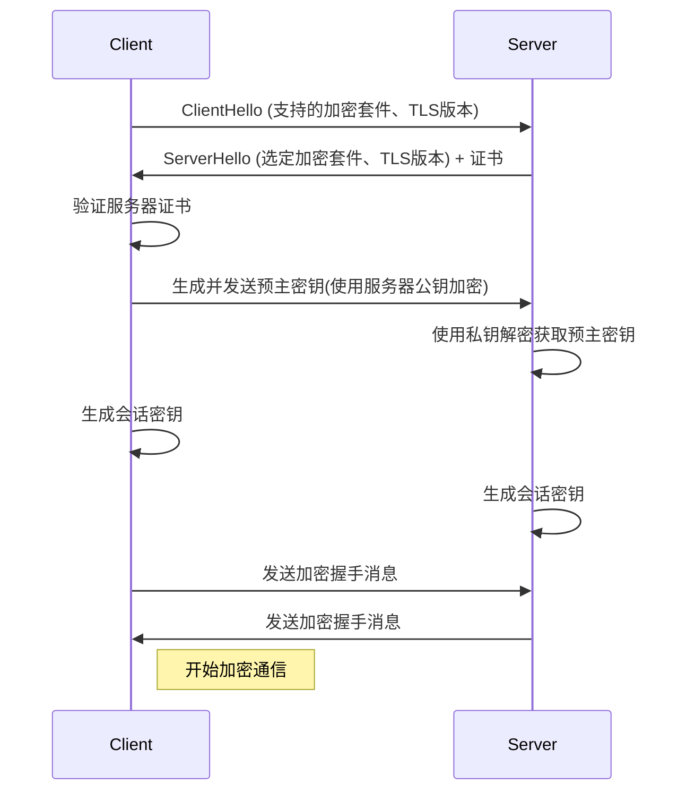

# SSL证书申请与HTTPS配置

SSL/TLS协议是保障网站安全的重要技术，它通过加密通信内容防止数据被窃听和篡改，同时验证网站身份，增强用户信任。本文将详细介绍SSL证书的申请流程和HTTPS的配置方法，帮助您为网站启用安全连接。

## 1. SSL/TLS基础原理

在深入了解SSL证书申请和HTTPS配置之前，我们需要先理解SSL/TLS的基本工作原理。

### 1.1 加密握手流程

SSL/TLS握手是建立安全连接的第一步，它确保客户端和服务器之间的通信是加密的。以下是TLS握手的简化流程：



握手过程详解：

1. **ClientHello**：客户端发送支持的加密算法列表、TLS版本和随机数
2. **ServerHello**：服务器选择加密算法和TLS版本，并发送自己的随机数和SSL证书
3. **证书验证**：客户端验证服务器证书的有效性和可信度
4. **密钥交换**：客户端生成预主密钥，使用服务器公钥加密后发送
5. **会话密钥生成**：双方使用相同的算法，基于预主密钥和之前交换的随机数生成会话密钥
6. **握手完成**：双方确认握手完成，后续通信使用会话密钥加密

这个过程确保了：
- 通信内容的机密性（加密）
- 通信双方的身份验证（证书）
- 消息完整性（防篡改）

### 1.2 证书类型对比

SSL证书根据验证级别分为三种主要类型，每种类型适用于不同的场景：

| 类型       | 验证级别 | 适用场景         | 签发时间 | 价格范围    | 信任显示                 |
|------------|----------|------------------|----------|-------------|--------------------------|
| DV SSL     | 域名验证 | 个人博客、小型网站 | 几分钟-数小时 | 免费-低价  | 锁形图标                 |
| OV SSL     | 组织验证 | 企业官网、商业网站 | 1-3天    | 中等       | 锁形图标+组织信息(部分浏览器) |
| EV SSL     | 扩展验证 | 金融网站、电商平台 | 5-7天    | 高         | 绿色地址栏+组织名称      |

**域名验证型(DV)**：
- 仅验证域名所有权，通常通过邮件验证或DNS记录验证
- 优点：申请快速、成本低（甚至免费）
- 缺点：不显示组织信息，信任度较低
- 适合：个人网站、博客、内容网站

**组织验证型(OV)**：
- 验证域名所有权和组织真实性
- 优点：增加了组织信息验证，提高可信度
- 缺点：申请时间较长，成本较高
- 适合：企业网站、电子商务（非支付页面）

**扩展验证型(EV)**：
- 最严格的验证，包括组织法律存在性、物理地址等
- 优点：最高级别的信任，浏览器地址栏显示组织名称（通常为绿色）
- 缺点：申请流程复杂，成本最高
- 适合：银行、金融机构、大型电商平台

### 1.3 证书链与信任模型

SSL证书基于PKI（公钥基础设施）信任链模型工作：

```
根证书颁发机构(Root CA)
      ↓
中间证书颁发机构(Intermediate CA)
      ↓
网站SSL证书(End-entity Certificate)
```

**信任链工作原理**：
1. 浏览器内置了受信任的根证书颁发机构(Root CA)列表
2. Root CA签发中间CA证书
3. 中间CA签发网站SSL证书
4. 浏览器通过验证这条信任链来确认网站证书的可信度

**为什么需要证书链**：
- 安全性：根CA证书离线存储，减少被攻击风险
- 灵活性：可以撤销中间CA而不影响根CA
- 扩展性：允许创建多个中间CA处理不同类型的证书请求

## 2. 证书申请实战

了解了SSL证书的基础知识后，我们来看如何申请证书。

### 2.1 Let's Encrypt免费证书

Let's Encrypt是一个免费、自动化、开放的证书颁发机构，提供DV类型的SSL证书。

#### 2.1.1 使用Certbot申请证书

Certbot是Let's Encrypt官方推荐的客户端工具：

```powershell
# 安装Certbot
winget install certbot

# 申请证书（需提前解析域名）
certbot certonly --standalone -d example.com -d www.example.com

# 证书存放路径：
# C:\Certbot\live\example.com\
# ├── cert.pem      - 服务器证书
# ├── chain.pem     - 中间证书
# ├── fullchain.pem - 服务器证书+中间证书
# └── privkey.pem   - 私钥
```

**申请过程详解**：
1. `--standalone`参数表示Certbot将启动一个临时Web服务器来验证域名所有权
2. `-d`参数指定要申请证书的域名，可以指定多个
3. 验证成功后，证书会保存在指定目录

**注意事项**：
- 申请前确保域名已正确解析到服务器IP
- 申请过程中80端口必须可用（或使用其他验证方式）
- Let's Encrypt证书有效期为90天，需要定期续期

#### 2.1.2 其他验证方式

除了standalone模式，Certbot还支持其他验证方式：

```powershell
# DNS验证（适用于无法开放80端口的情况）
certbot certonly --manual --preferred-challenges dns -d example.com

# Webroot验证（使用已有的Web服务器）
certbot certonly --webroot -w C:\project\kphub\www -d example.com
```

**DNS验证**：
- 系统会提示您在域名的DNS记录中添加一条TXT记录
- 适合无法开放80/443端口或需要申请通配符证书的情况
- 验证过程需要手动操作，不适合自动化

**Webroot验证**：
- 利用已运行的Web服务器进行验证
- 不需要停止现有Web服务
- 需要确保Web服务器能够正确提供`.well-known/acme-challenge/`路径下的文件

### 2.2 商业证书申请流程

对于需要更高验证级别(OV/EV)或更长有效期的证书，可以选择商业CA，如DigiCert、Comodo、GlobalSign等。

#### 2.2.1 生成CSR请求文件

CSR(Certificate Signing Request)是向CA申请证书的请求文件，包含您的公钥和身份信息：

```bash
openssl req -new -newkey rsa:2048 -nodes -keyout c:\project\kphub\ssl\example.com.key -out c:\project\kphub\ssl\example.com.csr
```

执行此命令后，系统会提示您输入以下信息：
- 国家代码（例如：CN）
- 省/州（例如：Guangdong）
- 城市（例如：Shenzhen）
- 组织名称（例如：Example Inc.）
- 组织单位（例如：IT Department）
- 通用名称（域名，例如：example.com）
- 电子邮件地址

**参数说明**：
- `-new`：生成新的CSR
- `-newkey rsa:2048`：生成2048位RSA密钥
- `-nodes`：不加密私钥（No DES）
- `-keyout`：指定私钥输出文件
- `-out`：指定CSR输出文件

#### 2.2.2 提交CSR并完成验证

1. 访问所选CA的网站，购买适合的SSL证书
2. 在CA的管理面板中提交CSR文件内容
3. 根据证书类型完成验证：
   - DV：通过邮件、DNS记录或HTTP文件验证
   - OV：额外需要提供组织注册文件，CA会电话验证
   - EV：需要提供更多法律文件，并通过严格的验证流程

#### 2.2.3 获取和安装证书

验证通过后，CA会签发证书，通常包含以下文件：
- 服务器证书（example.com.crt）
- 中间证书（intermediate.crt或ca-bundle.crt）
- 有时还会提供根证书（root.crt）

将这些文件下载到服务器上，准备配置Web服务器。

## 3. Apache HTTPS配置

获取SSL证书后，需要配置Apache服务器以启用HTTPS。

### 3.1 基础配置

首先确保Apache已启用SSL模块：

```apache
# 在httpd.conf中取消以下行的注释
LoadModule ssl_module modules/mod_ssl.so
Include conf/extra/httpd-ssl.conf
```

然后配置SSL虚拟主机：

```apache
<VirtualHost *:443>
    ServerName example.com
    ServerAlias www.example.com
    DocumentRoot "C:/project/kphub/www"
    
    # SSL配置
    SSLEngine on
    SSLCertificateFile "C:/Certbot/live/example.com/cert.pem"
    SSLCertificateKeyFile "C:/Certbot/live/example.com/privkey.pem"
    SSLCertificateChainFile "C:/Certbot/live/example.com/chain.pem"
    
    # 目录配置
    <Directory "C:/project/kphub/www">
        Options -Indexes +FollowSymLinks
        AllowOverride All
        Require all granted
    </Directory>
    
    # 日志配置
    ErrorLog "C:/project/kphub/logs/ssl_error.log"
    CustomLog "C:/project/kphub/logs/ssl_access.log" combined
</VirtualHost>
```

**配置说明**：
- `SSLEngine on`：启用SSL/TLS
- `SSLCertificateFile`：服务器证书路径
- `SSLCertificateKeyFile`：私钥路径
- `SSLCertificateChainFile`：中间证书路径

**注意**：在Apache 2.4.8及更高版本中，可以将服务器证书和中间证书合并在一个文件中（fullchain.pem），然后只使用`SSLCertificateFile`指令：

```apache
SSLCertificateFile "C:/Certbot/live/example.com/fullchain.pem"
SSLCertificateKeyFile "C:/Certbot/live/example.com/privkey.pem"
# 不再需要SSLCertificateChainFile
```

### 3.2 强制HTTPS跳转

为了确保所有访问都使用HTTPS，可以配置HTTP到HTTPS的自动跳转：

```apache
<VirtualHost *:80>
    ServerName example.com
    ServerAlias www.example.com
    
    # 永久重定向到HTTPS
    Redirect permanent / https://example.com/
    
    # 或使用更灵活的重写规则
    <IfModule mod_rewrite.c>
        RewriteEngine On
        RewriteCond %{HTTPS} off
        RewriteRule (.*) https://%{HTTP_HOST}%{REQUEST_URI} [R=301,L]
    </IfModule>
    
    # 日志配置
    ErrorLog "C:/project/kphub/logs/redirect_error.log"
    CustomLog "C:/project/kphub/logs/redirect_access.log" combined
</VirtualHost>
```

**配置说明**：
- `Redirect permanent`：返回301永久重定向状态码
- 重写规则方式更灵活，可以保留原始URL路径和参数

### 3.3 多域名/多站点HTTPS配置

如果需要为多个域名配置HTTPS，有两种方案：

#### 3.3.1 单证书多域名（SAN证书）

```apache
<VirtualHost *:443>
    ServerName main-domain.com
    ServerAlias www.main-domain.com sub1.main-domain.com sub2.main-domain.com
    
    SSLEngine on
    SSLCertificateFile "C:/project/kphub/ssl/multi-domain.crt"
    SSLCertificateKeyFile "C:/project/kphub/ssl/multi-domain.key"
    SSLCertificateChainFile "C:/project/kphub/ssl/multi-domain-chain.crt"
    
    # 其他配置...
</VirtualHost>
```

#### 3.3.2 多证书配置（基于SNI）

SNI（Server Name Indication）允许在同一IP地址和端口上使用多个证书：

```apache
# 确保启用SNI支持
SSLStrictSNIVHostCheck off

# 第一个站点
<VirtualHost *:443>
    ServerName site1.com
    DocumentRoot "C:/project/kphub/www/site1"
    
    SSLEngine on
    SSLCertificateFile "C:/project/kphub/ssl/site1.crt"
    SSLCertificateKeyFile "C:/project/kphub/ssl/site1.key"
    SSLCertificateChainFile "C:/project/kphub/ssl/site1-chain.crt"
    
    # 其他配置...
</VirtualHost>

# 第二个站点
<VirtualHost *:443>
    ServerName site2.com
    DocumentRoot "C:/project/kphub/www/site2"
    
    SSLEngine on
    SSLCertificateFile "C:/project/kphub/ssl/site2.crt"
    SSLCertificateKeyFile "C:/project/kphub/ssl/site2.key"
    SSLCertificateChainFile "C:/project/kphub/ssl/site2-chain.crt"
    
    # 其他配置...
</VirtualHost>
```

**注意**：SNI要求客户端支持，大多数现代浏览器都支持SNI，但一些旧版浏览器（如IE6）或旧设备可能不支持。

## 4. 高级安全配置

基本HTTPS配置可以提供加密通信，但为了获得更高的安全性，需要进行一些高级配置。

### 4.1 加密套件优化

TLS加密套件决定了加密通信的安全性和性能。默认配置可能包含一些不安全或过时的加密算法，应进行优化：

```apache
# 仅启用安全的TLS版本
SSLProtocol all -SSLv3 -TLSv1 -TLSv1.1
# 或明确指定
SSLProtocol TLSv1.2 TLSv1.3

# 配置强加密套件，禁用弱加密
SSLCipherSuite ECDHE-ECDSA-AES128-GCM-SHA256:ECDHE-RSA-AES128-GCM-SHA256:ECDHE-ECDSA-AES256-GCM-SHA384:ECDHE-RSA-AES256-GCM-SHA384:ECDHE-ECDSA-CHACHA20-POLY1305:ECDHE-RSA-CHACHA20-POLY1305:DHE-RSA-AES128-GCM-SHA256:DHE-RSA-AES256-GCM-SHA384

# 优先使用服务器定义的加密套件顺序
SSLHonorCipherOrder on

# 禁用SSL压缩（防CRIME攻击）
SSLCompression off

# 禁用TLS会话票据（增强前向保密性）
SSLSessionTickets off
```

**配置说明**：
- 禁用了不安全的SSLv3和TLSv1.0/1.1
- 优先使用支持前向保密(PFS)的加密套件
- 禁用了可能导致安全问题的功能

### 4.2 HSTS头配置

HTTP严格传输安全(HSTS)通知浏览器只能通过HTTPS访问网站，防止SSL剥离攻击：

```apache
# 启用mod_headers模块
LoadModule headers_module modules/mod_headers.so

# 在SSL虚拟主机中添加HSTS头
<VirtualHost *:443>
    # ...其他SSL配置...
    
    <IfModule mod_headers.c>
        # max-age=秒数，这里设置为2年
        # includeSubDomains表示子域名也适用
        # preload允许将域名提交到浏览器预加载列表
        Header always set Strict-Transport-Security "max-age=63072000; includeSubDomains; preload"
    </IfModule>
</VirtualHost>
```

**注意事项**：
- 启用HSTS前确保所有子域名都已配置HTTPS
- 一旦启用preload并提交到浏览器预加载列表，很难撤销
- 建议先使用较短的max-age（如1天）测试，确认无问题后再增加

### 4.3 OCSP装订

OCSP(在线证书状态协议)装订允许服务器预先获取证书状态并附加到TLS握手中，提高性能和隐私：

```apache
# 启用OCSP装订
SSLUseStapling on
SSLStaplingCache "shmcb:C:/project/kphub/logs/ssl_stapling(32768)"
SSLStaplingResponseMaxAge 86400
```

**配置说明**：
- `SSLUseStapling on`：启用OCSP装订
- `SSLStaplingCache`：定义缓存OCSP响应的共享内存
- `SSLStaplingResponseMaxAge`：OCSP响应的最大缓存时间（秒）

### 4.4 内容安全策略(CSP)

CSP可以防止XSS攻击和数据注入，通过限制页面可以加载的资源来源：

```apache
<VirtualHost *:443>
    # ...其他配置...
    
    <IfModule mod_headers.c>
        # 基本CSP策略
        Header always set Content-Security-Policy "default-src 'self'; script-src 'self' https://trusted-cdn.com; style-src 'self' https://trusted-cdn.com; img-src 'self' data: https:; font-src 'self' https://trusted-cdn.com; connect-src 'self';"
    </IfModule>
</VirtualHost>
```

**策略说明**：
- `default-src 'self'`：默认只允许加载同源资源
- `script-src`：JavaScript脚本允许的来源
- `style-src`：CSS样式表允许的来源
- `img-src`：图片允许的来源
- `font-src`：字体允许的来源
- `connect-src`：Ajax、WebSocket等连接允许的来源

### 4.5 公钥固定(HPKP)

公钥固定可以防止中间人攻击，但由于配置不当可能导致网站无法访问，现已被大多数浏览器弃用，推荐使用证书透明度(CT)和期望CT(Expect-CT)头代替：

```apache
<IfModule mod_headers.c>
    # 启用证书透明度期望
    Header always set Expect-CT "enforce, max-age=86400, report-uri=\"https://example.com/report-ct\""
</IfModule>
```

## 5. 证书维护管理

SSL证书需要定期维护，包括续期、更新和监控。

### 5.1 自动续期配置

Let's Encrypt证书有效期为90天，需要定期续期。Certbot可以自动处理这一过程：

```powershell
# 手动续期测试
certbot renew --dry-run

# 创建计划任务自动续期
$action = New-ScheduledTaskAction -Execute "certbot" -Argument "renew --quiet --post-hook ""httpd.exe -k restart"""
$trigger = New-ScheduledTaskTrigger -Weekly -DaysOfWeek Sunday -At 3am
$settings = New-ScheduledTaskSettingsSet -StartWhenAvailable -DontStopOnIdleEnd -AllowStartIfOnBatteries
Register-ScheduledTask -TaskName "Certbot Renew" -Action $action -Trigger $trigger -Settings $settings -RunLevel Highest -User "System"
```

**配置说明**：
- `--dry-run`：测试续期过程，不实际更新证书
- `--quiet`：减少输出信息
- `--post-hook`：续期成功后执行的命令，这里是重启Apache
- 计划任务设置为每周日凌晨3点执行，避开网站高峰期

### 5.2 证书链验证

定期验证证书链是否完整和正确：

```bash
# 验证证书链
openssl verify -CAfile C:\Certbot\live\example.com\chain.pem C:\Certbot\live\example.com\cert.pem

# 检查证书信息
openssl x509 -in C:\Certbot\live\example.com\cert.pem -text -noout

# 检查证书有效期
openssl x509 -in C:\Certbot\live\example.com\cert.pem -noout -dates
```

**验证内容**：
- 证书链是否完整
- 证书是否已过期或即将过期
- 证书的域名是否正确
- 证书的签发机构是否可信

### 5.3 证书监控脚本

创建一个PowerShell脚本定期检查证书状态：

```powershell
# 证书监控脚本 - check_ssl.ps1
param (
    [string]$domain = "example.com",
    [int]$port = 443,
    [int]$warningDays = 30
)

try {
    # 创建TLS连接并获取证书
    $tcpClient = New-Object System.Net.Sockets.TcpClient($domain, $port)
    $sslStream = New-Object System.Net.Security.SslStream($tcpClient.GetStream(), $false)
    $sslStream.AuthenticateAsClient($domain)
    $cert = $sslStream.RemoteCertificate
    
    # 转换为X509Certificate2对象以获取更多信息
    $certInfo = New-Object System.Security.Cryptography.X509Certificates.X509Certificate2($cert)
    
    # 获取证书信息
    $issuer = $certInfo.Issuer
    $subject = $certInfo.Subject
    $validFrom = $certInfo.NotBefore
    $validTo = $certInfo.NotAfter
    $daysRemaining = ($validTo - (Get-Date)).Days
    
    # 输出证书信息
    Write-Host "域名: $domain"
    Write-Host "证书颁发者: $issuer"
    Write-Host "证书主题: $subject"
    Write-Host "有效期: $validFrom 至 $validTo"
    Write-Host "剩余天数: $daysRemaining"
    
    # 检查是否即将过期
    if ($daysRemaining -le $warningDays) {
        Write-Host "警告: 证书将在 $daysRemaining 天后过期!" -ForegroundColor Red
        # 可以添加发送邮件通知的代码
    } else {
        Write-Host "证书状态正常" -ForegroundColor Green
    }
} catch {
    Write-Host "错误: $_" -ForegroundColor Red
} finally {
    # 关闭连接
    if ($sslStream) { $sslStream.Close() }
    if ($tcpClient) { $tcpClient.Close() }
}
```

将此脚本添加到计划任务中定期执行，可以提前发现证书问题。

## 6. 故障排查指南

即使按照最佳实践配置HTTPS，仍可能遇到各种问题。以下是常见问题的排查方法。

### 6.1 证书问题排查

#### 6.1.1 证书不信任

症状：浏览器显示"您的连接不是私密连接"或"此网站的安全证书有问题"

可能原因和解决方法：

1. **中间证书未正确安装**
   - 确保`SSLCertificateChainFile`指向正确的中间证书文件
   - 或使用`fullchain.pem`（包含服务器证书和中间证书）

2. **证书与域名不匹配**
   - 检查证书的CN(Common Name)或SAN(Subject Alternative Name)是否包含访问的域名
   - 使用以下命令检查证书包含的域名：
     ```bash
     openssl x509 -in cert.pem -text -noout | grep -A1 "Subject Alternative Name"
     ```

3. **证书已过期**
   - 检查证书有效期：
     ```bash
     openssl x509 -in cert.pem -noout -dates
     ```
   - 如果已过期，立即更新证书

4. **自签名证书**
   - 生产环境应使用受信任CA签发的证书
   - 如果必须使用自签名证书，需要将其添加到客户端的信任存储中

#### 6.1.2 使用SSL检测工具

使用在线工具检查SSL配置：
- [SSL Labs Server Test](https://www.ssllabs.com/ssltest/)
- [SSL Checker](https://www.sslshopper.com/ssl-checker.html)

这些工具可以检测：
- 证书链完整性
- 证书有效性
- 支持的协议和加密套件
- 已知漏洞（如BEAST、POODLE、Heartbleed等）
- 配置最佳实践

### 6.2 HTTPS混合内容问题

症状：浏览器显示"此页面包含不安全的内容"或锁形图标带有警告

原因：HTTPS页面中包含通过HTTP加载的资源（如图片、脚本、样式表等）

解决方法：

1. **使用相对URL**
   ```html
   <!-- 不推荐 -->
   
   
   <!-- 推荐 -->
   
   <!-- 或 -->
   
   ```

2. **启用内容安全策略**
   ```html
   <meta http-equiv="Content-Security-Policy" content="upgrade-insecure-requests">
   ```
   或在Apache配置中：
   ```apache
   Header always set Content-Security-Policy "upgrade-insecure-requests"
   ```

3. **使用工具查找混合内容**
   - 浏览器开发者工具的控制台会显示混合内容警告
   - 使用在线工具如[Why No Padlock](https://www.whynopadlock.com/)

### 6.3 性能问题排查

HTTPS可能导致一些性能开销，以下是优化方法：

1. **启用HTTP/2**
   ```apache
   # 确保加载HTTP/2模块
   Loa
让我继续完成SSL证书申请与HTTPS配置的内容：

### 6.3 性能问题排查

HTTPS可能导致一些性能开销，以下是优化方法：

1. **启用HTTP/2**
   ```apache
   # 确保加载HTTP/2模块
   LoadModule http2_module modules/mod_http2.so
   
   # 在全局配置或虚拟主机中启用HTTP/2
   Protocols h2 h2c http/1.1
   ```
   
   HTTP/2可以显著提高HTTPS性能，通过多路复用、头部压缩等特性减少延迟。

2. **会话缓存优化**
   ```apache
   # 配置SSL会话缓存
   SSLSessionCache "shmcb:C:/project/kphub/logs/ssl_scache(512000)"
   SSLSessionCacheTimeout 300
   ```
   
   这可以减少重复连接的握手开销，提高返回访客的加载速度。

3. **OCSP装订**（前面已介绍）可以减少证书验证的延迟。

4. **调整KeepAlive设置**
   ```apache
   KeepAlive On
   MaxKeepAliveRequests 100
   KeepAliveTimeout 5
   ```
   
   保持连接可以减少重复建立TLS握手的开销。

### 6.4 协议不匹配问题

症状：某些客户端无法连接，或连接被拒绝

可能原因和解决方法：

1. **客户端不支持配置的TLS版本**
   - 如果只启用了TLSv1.2和TLSv1.3，旧客户端可能无法连接
   - 检查客户端支持的TLS版本，必要时启用较旧版本（权衡安全性）
   ```apache
   # 兼容性更好但安全性较低的配置
   SSLProtocol all -SSLv3
   ```

2. **加密套件不匹配**
   - 客户端可能不支持服务器配置的加密套件
   - 使用更兼容的加密套件配置：
   ```apache
   # 更兼容的加密套件配置
   SSLCipherSuite HIGH:MEDIUM:!aNULL:!MD5:!RC4
   ```

3. **使用Wireshark分析**
   - 捕获TLS握手过程，查看具体失败原因
   - 关注"Client Hello"和"Server Hello"消息，以及任何警告或错误消息

## 7. 最佳实践与安全建议

### 7.1 证书管理最佳实践

1. **私钥安全**
   - 限制私钥文件访问权限：`chmod 600 privkey.pem`
   - 考虑使用硬件安全模块(HSM)存储私钥
   - 永远不要通过不安全的渠道传输私钥

2. **证书轮换计划**
   - 制定证书更新计划，避免过期导致服务中断
   - 提前30天开始证书更新流程
   - 实施自动化更新机制

3. **备份与恢复**
   - 备份所有证书和私钥
   - 记录证书详细信息（颁发者、序列号、指纹等）
   - 准备证书紧急恢复流程

4. **密钥算法选择**
   - 使用RSA 2048位或更高（推荐4096位）
   - 或使用ECC（椭圆曲线）证书，如ECDSA P-256
   - 避免使用弱密钥算法（如MD5、SHA-1）

### 7.2 HTTPS安全加固

1. **定期安全评估**
   - 每季度使用SSL Labs等工具评估配置
   - 跟踪TLS/SSL相关的CVE（通用漏洞披露）
   - 及时应用安全补丁和更新

2. **防御降级攻击**
   ```apache
   # 防止TLS降级攻击
   SSLHonorCipherOrder on
   SSLCompression off
   SSLSessionTickets off
   ```

3. **实施证书透明度(CT)监控**
   - 监控CT日志，检测未授权的证书签发
   - 使用工具如[Cert Spotter](https://sslmate.com/certspotter/)

4. **考虑使用客户端证书认证**
   ```apache
   <Directory "/secure">
       SSLVerifyClient require
       SSLVerifyDepth 2
       SSLCACertificateFile "C:/project/kphub/ssl/client-ca.crt"
   </Directory>
   ```
   
   这为敏感区域提供了双因素认证。

### 7.3 SSL/TLS配置模板

根据不同的安全需求和兼容性要求，可以选择不同的配置模板：

#### 7.3.1 现代配置（最高安全性，兼容性较低）

```apache
# 仅支持TLS 1.2和1.3
SSLProtocol TLSv1.2 TLSv1.3

# 强加密套件，优先AEAD算法
SSLCipherSuite TLS_AES_256_GCM_SHA384:TLS_CHACHA20_POLY1305_SHA256:TLS_AES_128_GCM_SHA256:ECDHE-ECDSA-AES256-GCM-SHA384:ECDHE-RSA-AES256-GCM-SHA384:ECDHE-ECDSA-CHACHA20-POLY1305:ECDHE-RSA-CHACHA20-POLY1305:ECDHE-ECDSA-AES128-GCM-SHA256:ECDHE-RSA-AES128-GCM-SHA256

SSLHonorCipherOrder on
SSLCompression off
SSLSessionTickets off

# 启用OCSP装订
SSLUseStapling on
SSLStaplingCache "shmcb:C:/project/kphub/logs/ssl_stapling(32768)"

# 强HSTS配置
Header always set Strict-Transport-Security "max-age=63072000; includeSubDomains; preload"
```

适用于：新建网站，目标用户使用现代浏览器

#### 7.3.2 中等配置（平衡安全性和兼容性）

```apache
# 支持TLS 1.0及以上
SSLProtocol all -SSLv3

# 更兼容的加密套件
SSLCipherSuite ECDHE-ECDSA-AES128-GCM-SHA256:ECDHE-RSA-AES128-GCM-SHA256:ECDHE-ECDSA-AES256-GCM-SHA384:ECDHE-RSA-AES256-GCM-SHA384:ECDHE-ECDSA-CHACHA20-POLY1305:ECDHE-RSA-CHACHA20-POLY1305:DHE-RSA-AES128-GCM-SHA256:DHE-RSA-AES256-GCM-SHA384:DHE-RSA-CHACHA20-POLY1305:ECDHE-ECDSA-AES128-SHA256:ECDHE-RSA-AES128-SHA256:ECDHE-ECDSA-AES128-SHA:ECDHE-RSA-AES128-SHA:ECDHE-ECDSA-AES256-SHA384:ECDHE-RSA-AES256-SHA384:ECDHE-ECDSA-AES256-SHA:ECDHE-RSA-AES256-SHA:DHE-RSA-AES128-SHA256:DHE-RSA-AES256-SHA256:AES128-GCM-SHA256:AES256-GCM-SHA384:AES128-SHA256:AES256-SHA256:AES128-SHA:AES256-SHA:DES-CBC3-SHA

SSLHonorCipherOrder on
SSLCompression off

# 较短的HSTS有效期
Header always set Strict-Transport-Security "max-age=31536000"
```

适用于：大多数商业网站，需要兼容较旧浏览器

#### 7.3.3 兼容性配置（最高兼容性，安全性较低）

```apache
# 支持TLS 1.0及以上
SSLProtocol all -SSLv3

# 高兼容性加密套件
SSLCipherSuite HIGH:MEDIUM:!aNULL:!MD5:!RC4

# 不强制服务器加密套件顺序
SSLHonorCipherOrder off

# 不使用HSTS
```

适用于：需要支持非常旧的客户端，内部系统

### 7.4 自动化部署与监控

为了简化SSL证书管理，可以实现自动化部署和监控：

1. **使用PowerShell脚本自动部署证书**

```powershell
# deploy_cert.ps1
param (
    [string]$domain,
    [string]$certPath,
    [string]$keyPath,
    [string]$chainPath,
    [string]$apacheConfPath = "C:/project/kphub/conf/extra/httpd-ssl.conf"
)

# 备份当前配置
Copy-Item -Path $apacheConfPath -Destination "$apacheConfPath.bak"

# 更新证书路径
$content = Get-Content -Path $apacheConfPath
$content = $content -replace 'SSLCertificateFile.*', "SSLCertificateFile `"$certPath`""
$content = $content -replace 'SSLCertificateKeyFile.*', "SSLCertificateKeyFile `"$keyPath`""
$content = $content -replace 'SSLCertificateChainFile.*', "SSLCertificateChainFile `"$chainPath`""
Set-Content -Path $apacheConfPath -Value $content

# 测试配置
$testResult = & httpd.exe -t
if ($LASTEXITCODE -eq 0) {
    # 重启Apache
    & httpd.exe -k restart
    Write-Host "证书已成功部署并重启Apache服务"
} else {
    # 恢复备份
    Copy-Item -Path "$apacheConfPath.bak" -Destination $apacheConfPath
    Write-Host "配置测试失败，已恢复备份: $testResult"
}
```

2. **证书到期监控与通知系统**

```powershell
# monitor_certs.ps1
param (
    [string]$certsDir = "C:/project/kphub/ssl",
    [int]$warningDays = 30,
    [string]$smtpServer = "smtp.example.com",
    [string]$fromEmail = "certs@example.com",
    [string]$toEmail = "admin@example.com"
)

# 获取所有证书文件
$certFiles = Get-ChildItem -Path $certsDir -Filter "*.crt" -Recurse

foreach ($certFile in $certFiles) {
    # 读取证书
    $cert = New-Object System.Security.Cryptography.X509Certificates.X509Certificate2 $certFile.FullName
    
    # 计算剩余天数
    $daysRemaining = ($cert.NotAfter - (Get-Date)).Days
    
    # 记录到日志
    $logMessage = "证书 $($certFile.Name) 将在 $daysRemaining 天后过期 (域名: $($cert.Subject))"
    Add-Content -Path "C:/project/kphub/logs/cert_monitor.log" -Value "$(Get-Date) - $logMessage"
    
    # 如果即将过期，发送通知
    if ($daysRemaining -le $warningDays) {
        $subject = "证书即将过期警告: $($cert.Subject)"
        $body = @"
证书即将过期，请尽快更新！

证书文件: $($certFile.FullName)
主题: $($cert.Subject)
颁发者: $($cert.Issuer)
有效期至: $($cert.NotAfter)
剩余天数: $daysRemaining

请及时更新证书以避免服务中断。
"@
        
        # 发送邮件通知
        try {
            Send-MailMessage -From $fromEmail -To $toEmail -Subject $subject -Body $body -SmtpServer $smtpServer
            Add-Content -Path "C:/project/kphub/logs/cert_monitor.log" -Value "$(Get-Date) - 已发送过期通知邮件"
        } catch {
            Add-Content -Path "C:/project/kphub/logs/cert_monitor.log" -Value "$(Get-Date) - 发送邮件失败: $_"
        }
    }
}
```

## 8. 高级应用场景

### 8.1 多域名证书与通配符证书

对于需要保护多个域名或子域名的情况，可以使用SAN证书或通配符证书：

#### 8.1.1 SAN证书（主题备用名称）

SAN证书可以在一个证书中包含多个域名：

```bash
# 生成包含多个域名的CSR
openssl req -new -newkey rsa:2048 -nodes \
  -keyout c:\project\kphub\ssl\multi-domain.key \
  -out c:\project\kphub\ssl\multi-domain.csr \
  -subj "/CN=example.com" \
  -addext "subjectAltName = DNS:example.com,DNS:www.example.com,DNS:api.example.com,DNS:admin.example.com"
```

使用Let's Encrypt申请多域名证书：

```powershell
certbot certonly --standalone -d example.com -d www.example.com -d api.example.com -d admin.example.com
```

#### 8.1.2 通配符证书

通配符证书可以保护一个域名的所有子域名：

```bash
# 生成通配符证书CSR
openssl req -new -newkey rsa:2048 -nodes \
  -keyout c:\project\kphub\ssl\wildcard.key \
  -out c:\project\kphub\ssl\wildcard.csr \
  -subj "/CN=*.example.com"
```

使用Let's Encrypt申请通配符证书（必须使用DNS验证）：

```powershell
certbot certonly --manual --preferred-challenges dns -d *.example.com -d example.com
```

系统会提示您在DNS中添加TXT记录以验证域名所有权。

### 8.2 双向SSL认证

双向SSL（也称为相互TLS或mTLS）要求客户端也提供证书，用于高安全性场景：

```apache
<VirtualHost *:443>
    ServerName secure.example.com
    
    SSLEngine on
    SSLCertificateFile "C:/project/kphub/ssl/server.crt"
    SSLCertificateKeyFile "C:/project/kphub/ssl/server.key"
    SSLCertificateChainFile "C:/project/kphub/ssl/chain.crt"
    
    # 客户端证书验证
    SSLVerifyClient require
    SSLVerifyDepth 2
    SSLCACertificateFile "C:/project/kphub/ssl/client-ca.crt"
    
    # 可选：将客户端证书信息传递给应用
    SSLOptions +StdEnvVars +ExportCertData
    
    # 可选：根据证书内容限制访问
    <Directory "C:/project/kphub/www/admin">
        SSLRequire %{SSL_CLIENT_S_DN_O} eq "Trusted Company" and %{SSL_CLIENT_S_DN_OU} eq "Admin Department"
    </Directory>
</VirtualHost>
```

客户端证书生成：

```bash
# 创建客户端私钥
openssl genrsa -out client.key 2048

# 创建客户端证书请求
openssl req -new -key client.key -out client.csr

# 使用CA签发客户端证书
openssl x509 -req -in client.csr -CA ca.crt -CAkey ca.key -CAcreateserial -out client.crt -days 365
```

### 8.3 HTTPS与负载均衡

在负载均衡环境中配置HTTPS有两种主要方式：

#### 8.3.1 SSL终止（SSL Termination）

SSL连接在负载均衡器终止，后端服务器使用HTTP：

```apache
# 负载均衡器配置
<VirtualHost *:443>
    ServerName www.example.com
    
    SSLEngine on
    SSLCertificateFile "C:/project/kphub/ssl/example.crt"
    SSLCertificateKeyFile "C:/project/kphub/ssl/example.key"
    SSLCertificateChainFile "C:/project/kphub/ssl/chain.crt"
    
    # 代理到后端HTTP服务器
    ProxyPass / http://backend-server/
    ProxyPassReverse / http://backend-server/
    
    # 传递原始协议信息
    RequestHeader set X-Forwarded-Proto "https"
    RequestHeader set X-Forwarded-Port "443"
</VirtualHost>
```

#### 8.3.2 SSL透传（SSL Passthrough）

SSL连接直接传递到后端服务器，每个后端服务器需要配置SSL：

```apache
# 负载均衡器配置（使用mod_proxy_wstunnel或专用负载均衡器）
<VirtualHost *:443>
    ServerName www.example.com
    
    # 直接转发SSL连接
    SSLProxyEngine On
    SSLProxyVerify none
    SSLProxyCheckPeerCN off
    SSLProxyCheckPeerName off
    
    ProxyPass / https://backend-server/
    ProxyPassReverse / https://backend-server/
</VirtualHost>
```

### 8.4 HTTP/2与ALPN

HTTP/2可以显著提高HTTPS性能，需要配合ALPN（应用层协议协商）使用：

```apache
# 加载HTTP/2模块
LoadModule http2_module modules/mod_http2.so

# 全局启用HTTP/2
Protocols h2 h2c http/1.1

# 或在特定虚拟主机中启用
<VirtualHost *:443>
    ServerName example.com
    
    Protocols h2 http/1.1
    
    SSLEngine on
    # ... SSL配置 ...
    
    # HTTP/2特定优化
    H2Direct on
    H2MaxSessionStreams 100
</VirtualHost>
```

**注意**：HTTP/2几乎只在HTTPS环境中使用，大多数浏览器不支持非加密的HTTP/2。

## 结语

SSL证书和HTTPS配置是现代网站不可或缺的安全基础设施。通过本文详细介绍的申请流程、配置方法和最佳实践，您可以为网站实现强大的加密保护，提升用户信任度，同时满足现代浏览器和搜索引擎的安全要求。

随着网络安全威胁的不断演变，定期更新SSL/TLS配置、及时续期证书、实施安全最佳实践变得尤为重要。通过自动化工具和监控系统，可以简化证书管理流程，降低人为错误风险，确保网站始终保持安全可靠的HTTPS连接。

无论是个人博客、企业网站还是电子商务平台，适当的SSL/TLS实施都能为您的在线服务提供必要的安全保障，保护用户数据和隐私，同时提升网站在搜索引擎中的排名和可信度。