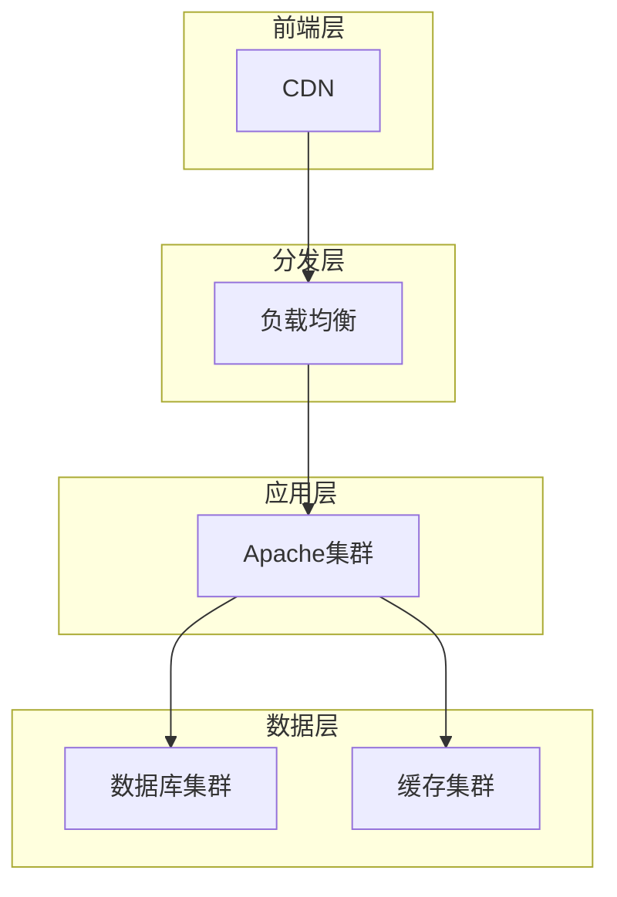

# 构建高性能Apache站点

## 1. 架构设计原则

### 1.1 分层架构模型

高性能Apache站点应采用清晰的分层架构，每一层都有明确的职责，便于扩展和维护。



**各层职责说明：**

1. **CDN层**：分发静态资源，降低源站压力，提高全球访问速度
2. **负载均衡层**：分发流量，确保集群各节点负载均衡
3. **Apache集群**：处理HTTP请求，执行业务逻辑
4. **数据库集群**：持久化存储，支持读写分离和分片
5. **缓存集群**：存储热点数据，减轻数据库压力

### 1.2 性能指标要求

设定明确的性能目标是构建高性能站点的前提。以下是企业级站点的基准指标：

| 指标            | 目标值       | 测量工具       | 说明 |
|----------------|-------------|---------------|------|
| 响应时间        | <500ms      | Apache Benchmark | 从请求发出到接收完整响应的时间 |
| 并发连接数      | >5000       | JMeter         | 系统同时处理的最大连接数 |
| 吞吐量          | >1000req/s  | wrk            | 每秒处理的请求数 |
| 错误率          | <0.1%       | Grafana/Prometheus | 请求失败的百分比 |
| TTFB           | <200ms      | WebPageTest    | 首字节时间 |
| 资源利用率      | CPU<70%, 内存<80% | top/htop | 服务器资源使用上限 |

## 2. 服务器集群配置

### 2.1 负载均衡设置

负载均衡是高性能站点的核心组件，可以使用Apache自带的mod_proxy_balancer模块实现：

```apache:c:\project\kphub\conf\load_balancer.conf
# 启用必要的模块
LoadModule proxy_module modules/mod_proxy.so
LoadModule proxy_http_module modules/mod_proxy_http.so
LoadModule proxy_balancer_module modules/mod_proxy_balancer.so
LoadModule lbmethod_byrequests_module modules/mod_lbmethod_byrequests.so
LoadModule slotmem_shm_module modules/mod_slotmem_shm.so

# 定义后端服务器集群
<Proxy balancer://mycluster>
    # 主要生产服务器
    BalancerMember http://192.168.1.101:80 route=node1 loadfactor=10
    BalancerMember http://192.168.1.102:80 route=node2 loadfactor=10
    
    # 备用服务器，权重较低
    BalancerMember http://192.168.1.103:80 route=node3 loadfactor=5 status=+H
    
    # 负载均衡方法：请求数(byrequests)、流量(bytraffic)、忙碌度(bybusyness)
    ProxySet lbmethod=byrequests
    
    # 故障转移设置
    ProxySet failonstatus=503,504
    ProxySet retry=30
</Proxy>

# 反向代理配置
ProxyRequests Off
ProxyPreserveHost On
ProxyTimeout 30

# 将请求转发到集群
ProxyPass "/" "balancer://mycluster/"
ProxyPassReverse "/" "balancer://mycluster/"

# 负载均衡管理控制台
<Location /balancer-manager>
    SetHandler balancer-manager
    Require ip 192.168.1.0/24 127.0.0.1
</Location>
```

**关键配置说明：**

- `loadfactor`：定义服务器权重，数值越高分配的请求越多
- `status=+H`：将服务器标记为热备份，只有当其他服务器不可用时才会使用
- `failonstatus`：指定哪些HTTP状态码被视为失败，触发故障转移
- `retry`：故障转移前的重试等待时间（秒）

### 2.2 会话保持配置

对于需要保持用户状态的应用，会话保持是必不可少的：

```apache:c:\project\kphub\conf\session.conf
# 启用必要的模块
LoadModule headers_module modules/mod_headers.so

# 使用cookie实现会话粘性
Header add Set-Cookie "ROUTEID=.%{BALANCER_WORKER_ROUTE}e; path=/" env=BALANCER_ROUTE_CHANGED

<Proxy balancer://mycluster>
    BalancerMember http://192.168.1.101:80 route=node1
    BalancerMember http://192.168.1.102:80 route=node2
    BalancerMember http://192.168.1.103:80 route=node3
    
    # 使用ROUTEID cookie进行会话粘性
    ProxySet stickysession=ROUTEID
    
    # 会话超时设置
    ProxySet timeout=120
    
    # 故障时会话转移
    ProxySet failover=On
</Proxy>

# 会话超时配置
<IfModule mod_php7.c>
    php_value session.gc_maxlifetime 3600
    php_value session.cookie_lifetime 3600
</IfModule>

# 共享会话存储（使用Redis）
<IfModule mod_php7.c>
    php_value session.save_handler redis
    php_value session.save_path "tcp://192.168.1.200:6379?auth=password&database=0"
</IfModule>
```

**会话保持策略说明：**

1. **基于Cookie的会话粘性**：将服务器标识存储在Cookie中
2. **共享会话存储**：使用Redis等外部存储保存会话数据，实现无状态服务器
3. **故障转移**：当服务器不可用时，自动将会话转移到其他服务器

## 3. 缓存加速策略

### 3.1 多级缓存配置

实施多级缓存策略可以显著提高站点性能：

```apache:c:\project\kphub\conf\cache_strategy.conf
# 启用缓存模块
LoadModule cache_module modules/mod_cache.so
LoadModule cache_disk_module modules/mod_cache_disk.so
LoadModule expires_module modules/mod_expires.so
LoadModule headers_module modules/mod_headers.so

# 浏览器缓存 - 静态资源长期缓存
<FilesMatch "\.(css|js|jpg|jpeg|png|gif|ico|woff|woff2|ttf|svg|eot)$">
    Header set Cache-Control "max-age=31536000, public, immutable"
    Header unset ETag
    FileETag None
</FilesMatch>

# HTML文件的适度缓存
<FilesMatch "\.(html|htm)$">
    Header set Cache-Control "max-age=3600, public"
</FilesMatch>

# API响应不缓存
<LocationMatch "/api/">
    Header set Cache-Control "no-store, no-cache, must-revalidate, max-age=0"
    Header set Pragma "no-cache"
</LocationMatch>

# 服务器端缓存配置
CacheRoot "c:/project/kphub/cache"
CacheEnable disk /
CacheDefaultExpire 3600
CacheMaxExpire 86400
CacheLastModifiedFactor 0.5
CacheIgnoreNoLastMod On
CacheIgnoreCacheControl On
CacheMaxFileSize 10000000

# 缓存清除策略
CacheDirLevels 2
CacheDirLength 1
CacheMinFileSize 1
CacheDetailHeader on

# 不缓存动态内容
<LocationMatch "\.(php|cgi)$">
    CacheDisable on
</LocationMatch>

# 启用压缩
<IfModule mod_deflate.c>
    AddOutputFilterByType DEFLATE text/html text/plain text/xml text/css text/javascript application/javascript application/json
    DeflateCompressionLevel 6
    BrowserMatch ^Mozilla/4 gzip-only-text/html
    BrowserMatch ^Mozilla/4\.0[678] no-gzip
    BrowserMatch \bMSIE !no-gzip !gzip-only-text/html
</IfModule>
```

**缓存策略说明：**

1. **浏览器缓存**：通过HTTP头控制客户端缓存行为
   - 静态资源：长期缓存（1年）
   - HTML文件：适度缓存（1小时）
   - API响应：禁止缓存

2. **服务器缓存**：使用mod_cache在服务器端缓存内容
   - `CacheDefaultExpire`：默认缓存时间（秒）
   - `CacheMaxExpire`：最大缓存时间（秒）
   - `CacheLastModifiedFactor`：基于Last-Modified的过期时间计算因子

3. **内容压缩**：减少传输数据量，提高加载速度

### 3.2 Redis缓存集成

Redis作为高性能缓存系统，可以与Apache集成提供更强大的缓存能力：

```apache:c:\project\kphub\conf\redis.conf
# 启用FastCGI代理模块
LoadModule proxy_fcgi_module modules/mod_proxy_fcgi.so

# PHP-FPM配置
<FilesMatch "\.php$">
    SetHandler "proxy:fcgi://127.0.0.1:9000"
</FilesMatch>

# Redis缓存集成（通过PHP扩展）
<Location /api/>
    # 使用PHP-FPM处理请求
    SetHandler "proxy:fcgi://127.0.0.1:9000"
    
    # 启用自定义缓存头
    Header set X-Cache-Status "%{CACHE_STATUS}e"
</Location>

# 缓存控制指令
<IfModule mod_rewrite.c>
    RewriteEngine On
    
    # 检查Redis缓存（通过自定义PHP脚本）
    RewriteCond %{REQUEST_METHOD} ^GET$
    RewriteCond %{REQUEST_URI} ^/api/
    RewriteRule ^(.*)$ /cache_check.php?url=$1 [L,QSA]
</IfModule>
```

**PHP Redis缓存处理脚本示例：**

```php:c:\project\kphub\www\cache_check.php
<?php
// Redis缓存检查和处理
$redis = new Redis();
$redis->connect('127.0.0.1', 6379);

// 获取请求的原始URL
$requestUrl = $_GET['url'] ?? $_SERVER['REQUEST_URI'];
$cacheKey = 'cache:' . md5($requestUrl);

// 检查缓存是否存在
if ($_SERVER['REQUEST_METHOD'] === 'GET' && $redis->exists($cacheKey)) {
    // 从缓存获取数据
    $cachedData = $redis->get($cacheKey);
    $cachedInfo = json_decode($cachedData, true);
    
    // 设置缓存状态头
    header('X-Cache-Status: HIT');
    
    // 设置原始响应头
    foreach ($cachedInfo['headers'] as $header) {
        header($header);
    }
    
    // 输出缓存内容
    echo $cachedInfo['content'];
    exit;
}

// 缓存未命中，继续正常处理
header('X-Cache-Status: MISS');

// 这里可以包含原始的API处理逻辑
// 或者通过内部重定向到实际处理脚本
include 'api_handler.php';

// 缓存响应（在api_handler.php中实现）
?>
```

**Redis缓存优势：**

1. **高性能**：内存存储，响应时间微秒级
2. **灵活性**：支持多种数据结构和过期策略
3. **分布式**：可以轻松扩展为集群
4. **原子操作**：支持复杂的原子操作和事务

## 4. 安全加固方案

### 4.1 WAF规则配置

Web应用防火墙(WAF)是保护Apache站点安全的重要组件：

```apache:c:\project\kphub\conf\mod_security.conf
# 加载ModSecurity模块
LoadModule security2_module modules/mod_security2.so

# 基本配置
<IfModule mod_security2.c>
    # 启用ModSecurity
    SecRuleEngine On
    
    # 请求体限制
    SecRequestBodyLimit 13107200
    SecRequestBodyNoFilesLimit 131072
    SecRequestBodyInMemoryLimit 131072
    
    # 响应体检查
    SecResponseBodyLimit 1048576
    SecResponseBodyMimeType text/plain text/html text/xml application/json
    
    # 临时文件配置
    SecTmpDir "c:/project/kphub/temp"
    SecDataDir "c:/project/kphub/data"
    
    # 审计日志
    SecAuditEngine RelevantOnly
    SecAuditLogRelevantStatus "^(?:5|4(?!04))"
    SecAuditLogParts ABIJDEFHZ
    SecAuditLogType Serial
    SecAuditLog "c:/project/kphub/logs/modsec_audit.log"
    
    # OWASP核心规则集
    Include "c:/project/kphub/conf/owasp-crs/crs-setup.conf"
    Include "c:/project/kphub/conf/owasp-crs/rules/*.conf"
    
    # 自定义规则
    
    # 1. 阻止恶意User-Agent
    SecRule REQUEST_HEADERS:User-Agent "@rx (nikto|sqlmap|acunetix|nessus|nmap|burpsuite|openvas|w3af|hydra|libwww|wget|curl|python-requests)" \
        "id:1000,phase:1,deny,status:403,log,msg:'恶意扫描工具检测'"
    
    # 2. 防止SQL注入
    SecRule REQUEST_COOKIES|REQUEST_COOKIES_NAMES|REQUEST_HEADERS|ARGS|ARGS_NAMES "@rx (?i:(?:union[\s\+]*(?:all|distinct|[(!]+)?[\s\+]*select)|(?:select[\s\+]+(?:[\[\]\w\,\.\s\(\)\-\"]+)[\s\+]*from))" \
        "id:1001,phase:2,deny,status:403,log,msg:'SQL注入尝试'"
    
    # 3. 防止XSS攻击
    SecRule REQUEST_COOKIES|REQUEST_COOKIES_NAMES|REQUEST_HEADERS|ARGS|ARGS_NAMES "@rx (?i:<script[^>]*>[\s\S]*?)" \
        "id:1002,phase:2,deny,status:403,log,msg:'XSS攻击尝试'"
    
    # 4. 防止路径遍历
    SecRule REQUEST_URI|REQUEST_HEADERS|ARGS|ARGS_NAMES "@rx (?:\.\.|%2e%2e)" \
        "id:1003,phase:1,deny,status:403,log,msg:'路径遍历尝试'"
    
    # 5. 防止敏感文件访问
    SecRule REQUEST_URI "@rx (?i:\.(?:bak|config|sql|ini|log|sh|inc|swp|conf)$)" \
        "id:1004,phase:1,deny,status:403,log,msg:'敏感文件访问尝试'"
    
    # 6. 限制上传文件类型
    SecRule FILES_NAMES "@rx \.(?:php|phtml|php3|php4|php5|php7|pht|phar|inc)$" \
        "id:1005,phase:2,deny,status:403,log,msg:'禁止上传PHP文件'"
</IfModule>
```

**WAF保护要点：**

1. **输入验证**：过滤和验证所有用户输入
2. **攻击检测**：识别常见的Web攻击模式
3. **响应控制**：阻止可疑请求并记录详细信息
4. **敏感信息保护**：防止敏感信息泄露
5. **文件上传控制**：限制可上传的文件类型和大小

### 4.2 DDoS防护

分布式拒绝服务(DDoS)攻击是高流量站点面临的主要威胁：

```apache:c:\project\kphub\conf\ddos.conf
# 加载mod_evasive模块
LoadModule evasive20_module modules/mod_evasive20.so

# DDoS防护配置
<IfModule mod_evasive20.c>
    # 哈希表大小（内存中跟踪的并发IP数）
    DOSHashTableSize 3097
    
    # 同一页面的请求阈值（每个时间间隔内）
    DOSPageCount 10
    
    # 同一站点的请求阈值（每个时间间隔内）
    DOSSiteCount 50
    
    # 页面间隔时间（秒）
    DOSPageInterval 1
    
    # 站点间隔时间（秒）
    DOSSiteInterval 1
    
    # 阻止时间（秒）
    DOSBlockingPeriod 60
    
    # 白名单IP
    DOSWhitelist 127.0.0.1
    DOSWhitelist 192.168.1.10
    
    # 日志目录
    DOSLogDir "c:/project/kphub/logs/evasive"
    
    # 触发时发送邮件通知
    DOSEmailNotify "admin@example.com"
    
    # 系统命令（可选，触发时执行）
    # DOSSystemCommand "c:/project/kphub/scripts/block_ip.ps1 %s"
</IfModule>

# 连接限制
<IfModule mod_reqtimeout.c>
    # 设置连接超时
    RequestReadTimeout header=20-40,MinRate=500
    RequestReadTimeout body=20,MinRate=500
</IfModule>

# 限制请求速率（使用mod_ratelimit）
<IfModule mod_ratelimit.c>
    <Location />
        # 限制带宽为1MB/s
        SetOutputFilter RATE_LIMIT
        SetEnv rate-limit 1024
    </Location>
</IfModule>

# IP连接限制（使用mod_qos）
<IfModule mod_qos.c>
    # 每个IP的最大并发连接数
    QS_SrvMaxConnPerIP 50
    
    # 服务器最大并发连接数
    QS_SrvMaxConn 500
    
    # 连接速率限制（每秒）
    QS_SrvRequestRate 100
    
    # 每个IP的最大请求速率
    QS_SrvMaxConnPerIPPerSec 5
    
    # 动态IP黑名单
    QS_DenyIPDuration 300
</IfModule>
```

**DDoS防护脚本示例：**

```powershell:c:\project\kphub\scripts\block_ip.ps1
param(
    [string]$ip
)

# 记录攻击IP
$logFile = "c:\project\kphub\logs\blocked_ips.log"
$timestamp = Get-Date -Format "yyyy-MM-dd HH:mm:ss"
"$timestamp - Blocked IP: $ip" | Out-File -Append -FilePath $logFile

# 使用Windows防火墙阻止IP
New-NetFirewallRule -DisplayName "Block DDoS Attacker $ip" -Direction Inbound -Action Block -RemoteAddress $ip -Enabled True

# 设置自动解除阻止（2小时后）
$job = Start-Job -ScriptBlock {
    param($ip)
    Start-Sleep -Seconds 7200
    Remove-NetFirewallRule -DisplayName "Block DDoS Attacker $ip"
} -ArgumentList $ip

# 记录作业ID以便后续管理
$jobId = $job.Id
"$timestamp - Created unblock job: $jobId for IP: $ip" | Out-File -Append -FilePath $logFile
```

**DDoS防护策略：**

1. **请求限制**：限制单个IP的请求频率
2. **连接控制**：限制并发连接数和连接速率
3. **资源保护**：限制带宽和服务器资源使用
4. **自动封禁**：自动识别和封禁攻击源
5. **白名单**：允许受信任IP不受限制访问

## 5. 监控与告警

### 5.1 实时监控配置

有效的监控系统是保障高性能站点稳定运行的关键：

```apache:c:\project\kphub\conf\monitoring.conf
# 启用状态模块
LoadModule status_module modules/mod_status.so
LoadModule info_module modules/mod_info.so

# 启用扩展状态信息
ExtendedStatus On

# 服务器状态页面
<Location /server-status>
    SetHandler server-status
    # 仅允许内部网络访问
    Require ip 127.0.0.1 192.168.1.0/24
    # 添加基本认证
    AuthType Basic
    AuthName "Apache Status"
    AuthUserFile "c:/project/kphub/conf/.htpasswd"
    Require valid-user
</Location>

# 服务器信息页面
<Location /server-info>
    SetHandler server-info
    Require ip 127.0.0.1 192.168.1.0/24
    AuthType Basic
    AuthName "Apache Info"
    AuthUserFile "c:/project/kphub/conf/.htpasswd"
    Require valid-user
</Location>

# 性能监控配置
<IfModule mod_heartmonitor.c>
    HeartbeatListen 127.0.0.1:8001
</IfModule>

# 自定义日志格式，包含性能指标
LogFormat "%h %l %u %t \"%r\" %>s %b \"%{Referer}i\" \"%{User-Agent}i\" %D %{mod_h2_push}n %{SSL_PROTOCOL}x %{SSL_CIPHER}x" combined_perf

# 使用自定义日志格式
CustomLog "c:/project/kphub/logs/access.log" combined_perf

# 错误日志配置
ErrorLogFormat "[%{u}t] [%-m:%l] [pid %P] [client %a] %M"
ErrorLog "c:/project/kphub/logs/error.log"
LogLevel warn
```

**监控集成脚本：**

```powershell:c:\project\kphub\scripts\monitor.ps1
# Apache性能监控脚本
param(
    [int]$interval = 60,  # 监控间隔（秒）
    [string]$outputDir = "c:\project\kphub\logs\metrics",
    [string]$serverStatusUrl = "http://localhost/server-status?auto",
    [string]$prometheusFile = "c:\project\kphub\logs\metrics\apache_metrics.prom"
)

# 创建输出目录
if (-not (Test-Path $outputDir)) {
    New-Item -Path $outputDir -ItemType Directory -Force
}

# 基本认证凭据
$credentials = Get-Content "c:\project\kphub\conf\monitor_credentials.txt" | ConvertFrom-SecureString
$username = "admin"
$password = "password"  # 实际环境中应使用加密存储

# 创建基本认证头
$base64AuthInfo = [Convert]::ToBase64String([Text.Encoding]::ASCII.GetBytes(("${username}:${password}")))
$headers = @{
    Authorization = "Basic $base64AuthInfo"
}

# 无限循环监控
while ($true) {
    $timestamp = Get-Date -Format "yyyy-MM-dd HH:mm:ss"
    
    try {
        # 获取Apache状态
        $response = Invoke-WebRequest -Uri $serverStatusUrl -Headers $headers -UseBasicParsing
        $statusContent = $response.Content
        
        # 解析关键指标
        $metrics = @{}
        
        # 总请求数
        if ($statusContent -match "Total Accesses:\s+(\d+)") {
            $metrics["total_accesses"] = $matches[1]
        }
        
        # 总流量
        if ($statusContent -match "Total kBytes:\s+(\d+)") {
            $metrics["total_kbytes"] = $matches[1]
        }
        
        # CPU负载
        if ($statusContent -match "CPULoad:\s+([\d\.]+)") {
            $metrics["cpu_load"] = $matches[1]
        }
        
        # 每秒请求数
        if ($statusContent -match "ReqPerSec:\s+([\d\.]+)") {
            $metrics["requests_per_second"] = $matches[1]
        }
        
        # 每请求字节数
        if ($statusContent -match "BytesPerReq:\s+([\d\.]+)") {
            $metrics["bytes_per_request"] = $matches[1]
        }
        
        # 每秒字节数
        if ($statusContent -match "BytesPerSec:\s+([\d\.]+)") {
            $metrics["bytes_per_second"] = $matches[1]
        }
        
        # 忙碌工作者
        if ($statusContent -match "BusyWorkers:\s+(\d+)") {
            $metrics["busy_workers"] = $matches[1]
        }
        
        # 空闲工作者
        if ($statusContent -match "IdleWorkers:\s+(\d+)") {
            $metrics["idle_workers"] = $matches[1]
        }
        
        # 获取系统资源使用情况
        $cpuUsage = (Get-Counter '\Processor(_Total)\% Processor Time').CounterSamples.CookedValue
        $memoryInfo = Get-CimInstance Win32_OperatingSystem
        $memoryUsage = 100 - ($memoryInfo.FreePhysicalMemory / $memoryInfo.TotalVisibleMemorySize * 100)
        
        $metrics["system_cpu_usage"] = [math]::Round($cpuUsage, 2)
        $metrics["system_memory_usage"] = [math]::Round($memoryUsage, 2)
        
        # 写入CSV日志
        $csvFile = Join-Path $outputDir "apache_metrics_$(Get-Date -Format 'yyyyMMdd').csv"
        $csvExists = Test-Path $csvFile
        
        $csvData = [PSCustomObject]@{
            Timestamp = $timestamp
            TotalAccesses = $metrics["total_accesses"]
            TotalKBytes = $metrics["total_kbytes"]
            CPULoad = $metrics["cpu_load"]
            RequestsPerSecond = $metrics["requests_per_second"]
            BytesPerRequest = $metrics["bytes_per_request"]
            BytesPerSecond = $metrics["bytes_per_second"]
            BusyWorkers = $metrics["busy_workers"]
            IdleWorkers = $metrics["idle_workers"]
            SystemCPUUsage = $metrics["system_cpu_usage"]
            SystemMemoryUsage = $metrics["system_memory_usage"]
        }
        
        if (-not $csvExists) {
            $csvData | Export-Csv -Path $csvFile -NoTypeInformation
        } else {
            $csvData | Export-Csv -Path $csvFile -NoTypeInformation -Append
        }
        
        # 生成Prometheus格式指标
        $prometheusContent = @"
# HELP apache_accesses_total Apache总请求数
# TYPE apache_accesses_total counter
apache_accesses_total $($metrics["total_accesses"])
# HELP apache_kbytes_total Apache总传输KB数
# TYPE apache_kbytes_total counter
apache_kbytes_total $($metrics["total_kbytes"])
# HELP apache_cpu_load Apache CPU负载
# TYPE apache_cpu_load gauge
apache_cpu_load $($metrics["cpu_load"])
# HELP apache_requests_per_second Apache每秒请求数
# TYPE apache_requests_per_second gauge
apache_requests_per_second $($metrics["requests_per_second"])
# HELP apache_bytes_per_request Apache每请求字节数
# TYPE apache_bytes_per_request gauge
apache_bytes_per_request $($metrics["bytes_per_request"])
# HELP apache_bytes_per_second Apache每秒字节数
# TYPE apache_bytes_per_second gauge
apache_bytes_per_second $($metrics["bytes_per_second"])
# HELP apache_workers_busy Apache忙碌工作者数
# TYPE apache_workers_busy gauge
apache_workers_busy $($metrics["busy_workers"])
# HELP apache_workers_idle Apache空闲工作者数
# TYPE apache_workers_
让我继续完成监控脚本的剩余部分：

```powershell:c:\project\kphub\scripts\monitor.ps1
# HELP apache_workers_idle Apache空闲工作者数
# TYPE apache_workers_idle gauge
apache_workers_idle $($metrics["idle_workers"])
# HELP system_cpu_usage 系统CPU使用率
# TYPE system_cpu_usage gauge
system_cpu_usage $($metrics["system_cpu_usage"])
# HELP system_memory_usage 系统内存使用率
# TYPE system_memory_usage gauge
system_memory_usage $($metrics["system_memory_usage"])
"@
        
        # 写入Prometheus格式文件
        $prometheusContent | Out-File -FilePath $prometheusFile -Encoding utf8
        
        # 检查告警阈值
        $alertsTriggered = @()
        
        # CPU负载告警
        if ([double]$metrics["cpu_load"] -gt 70) {
            $alertsTriggered += "Apache CPU负载过高: $($metrics["cpu_load"])%"
        }
        
        # 系统CPU使用率告警
        if ([double]$metrics["system_cpu_usage"] -gt 80) {
            $alertsTriggered += "系统CPU使用率过高: $($metrics["system_cpu_usage"])%"
        }
        
        # 系统内存使用率告警
        if ([double]$metrics["system_memory_usage"] -gt 85) {
            $alertsTriggered += "系统内存使用率过高: $($metrics["system_memory_usage"])%"
        }
        
        # 工作者比例告警
        $totalWorkers = [int]$metrics["busy_workers"] + [int]$metrics["idle_workers"]
        if ($totalWorkers -gt 0) {
            $busyRatio = [int]$metrics["busy_workers"] / $totalWorkers * 100
            if ($busyRatio -gt 90) {
                $alertsTriggered += "Apache工作者忙碌率过高: $([math]::Round($busyRatio, 2))%"
            }
        }
        
        # 发送告警
        if ($alertsTriggered.Count -gt 0) {
            $alertLogFile = Join-Path $outputDir "alerts.log"
            $alertMessage = "$timestamp - 告警触发:`n" + ($alertsTriggered -join "`n")
            $alertMessage | Out-File -FilePath $alertLogFile -Append
            
            # 这里可以添加发送邮件或其他通知的代码
            # Send-MailMessage -From "monitor@example.com" -To "admin@example.com" -Subject "Apache服务器告警" -Body $alertMessage -SmtpServer "smtp.example.com"
            
            Write-Host $alertMessage -ForegroundColor Red
        } else {
            Write-Host "$timestamp - 所有指标正常" -ForegroundColor Green
        }
        
    } catch {
        $errorMessage = "$timestamp - 监控错误: $_"
        $errorMessage | Out-File -FilePath (Join-Path $outputDir "monitor_errors.log") -Append
        Write-Host $errorMessage -ForegroundColor Red
    }
    
    # 等待下一个监控周期
    Start-Sleep -Seconds $interval
}
```

### 5.2 日志分析管道

日志分析是发现问题和优化性能的重要手段：

```powershell:c:\project\kphub\scripts\log_analysis.ps1
# Apache日志分析脚本
param(
    [string]$accessLog = "c:\project\kphub\logs\access.log",
    [string]$errorLog = "c:\project\kphub\logs\error.log",
    [string]$outputDir = "c:\project\kphub\logs\reports",
    [switch]$realtime = $false,
    [int]$alertThreshold = 10,
    [switch]$generateReport = $true
)

# 创建输出目录
if (-not (Test-Path $outputDir)) {
    New-Item -Path $outputDir -ItemType Directory -Force
}

# 日志解析函数
function Parse-AccessLog {
    param (
        [string]$logLine
    )
    
    # 解析Combined格式日志
    if ($logLine -match '^(\S+) \S+ \S+ \[([^\]]+)\] "([^"]*)" (\d+) (\S+) "([^"]*)" "([^"]*)" (\d+)') {
        $ip = $matches[1]
        $timestamp = $matches[2]
        $request = $matches[3]
        $status = $matches[4]
        $bytes = $matches[5]
        $referer = $matches[6]
        $userAgent = $matches[7]
        $responseTime = $matches[8]  # 微秒
        
        # 进一步解析请求
        if ($request -match '^(\S+) (\S+) (\S+)') {
            $method = $matches[1]
            $url = $matches[2]
            $protocol = $matches[3]
        } else {
            $method = $request
            $url = ""
            $protocol = ""
        }
        
        return [PSCustomObject]@{
            IP = $ip
            Timestamp = $timestamp
            Method = $method
            URL = $url
            Protocol = $protocol
            Status = $status
            Bytes = $bytes
            Referer = $referer
            UserAgent = $userAgent
            ResponseTime = [int]$responseTime / 1000  # 转换为毫秒
        }
    }
    
    return $null
}

# 错误日志解析函数
function Parse-ErrorLog {
    param (
        [string]$logLine
    )
    
    # 解析错误日志
    if ($logLine -match '\[([^\]]+)\] \[([^\]]+)\] \[pid (\d+)\] \[client ([^\]]+)\] (.+)') {
        $timestamp = $matches[1]
        $level = $matches[2]
        $pid = $matches[3]
        $client = $matches[4]
        $message = $matches[5]
        
        return [PSCustomObject]@{
            Timestamp = $timestamp
            Level = $level
            PID = $pid
            Client = $client
            Message = $message
        }
    }
    
    return $null
}

# 实时监控函数
function Monitor-LogsRealtime {
    Write-Host "开始实时监控日志..." -ForegroundColor Cyan
    
    # 错误计数器
    $errorCounter = @{}
    $statusCounter = @{}
    $slowRequests = @()
    
    # 使用Get-Content -Wait实时监控日志
    Get-Content $errorLog -Wait | ForEach-Object {
        $errorEntry = Parse-ErrorLog $_
        if ($errorEntry) {
            $errorType = $errorEntry.Message -replace '^.*?:', ''
            $errorType = $errorType -replace '^\s+|\s+$', ''
            
            if (-not $errorCounter.ContainsKey($errorType)) {
                $errorCounter[$errorType] = 0
            }
            $errorCounter[$errorType]++
            
            # 检查是否达到告警阈值
            if ($errorCounter[$errorType] -ge $alertThreshold) {
                $alertMessage = "告警: 错误类型 '$errorType' 在短时间内出现 $($errorCounter[$errorType]) 次"
                Write-Host $alertMessage -ForegroundColor Red
                $alertMessage | Out-File -FilePath "$outputDir\error_alerts.log" -Append
                
                # 重置计数器
                $errorCounter[$errorType] = 0
            }
            
            Write-Host "错误: $($errorEntry.Level) - $($errorEntry.Message)" -ForegroundColor Yellow
        }
    }
}

# 生成报告函数
function Generate-LogReport {
    Write-Host "正在分析日志文件..." -ForegroundColor Cyan
    
    # 读取访问日志
    $accessEntries = @()
    Get-Content $accessLog | ForEach-Object {
        $entry = Parse-AccessLog $_
        if ($entry) {
            $accessEntries += $entry
        }
    }
    
    # 读取错误日志
    $errorEntries = @()
    Get-Content $errorLog | ForEach-Object {
        $entry = Parse-ErrorLog $_
        if ($entry) {
            $errorEntries += $entry
        }
    }
    
    # 生成报告时间戳
    $reportTimestamp = Get-Date -Format "yyyyMMdd_HHmmss"
    $reportFile = "$outputDir\log_report_$reportTimestamp.html"
    
    # 计算统计数据
    $totalRequests = $accessEntries.Count
    $uniqueIPs = ($accessEntries | Select-Object -ExpandProperty IP -Unique).Count
    $statusCodes = $accessEntries | Group-Object -Property Status | Sort-Object -Property Count -Descending
    $topURLs = $accessEntries | Group-Object -Property URL | Sort-Object -Property Count -Descending | Select-Object -First 10
    $topIPs = $accessEntries | Group-Object -Property IP | Sort-Object -Property Count -Descending | Select-Object -First 10
    $slowestRequests = $accessEntries | Sort-Object -Property ResponseTime -Descending | Select-Object -First 10
    $errorsByType = $errorEntries | Group-Object -Property Message | Sort-Object -Property Count -Descending
    
    # 计算响应时间统计
    $avgResponseTime = ($accessEntries | Measure-Object -Property ResponseTime -Average).Average
    $maxResponseTime = ($accessEntries | Measure-Object -Property ResponseTime -Maximum).Maximum
    $p95ResponseTime = $accessEntries.ResponseTime | Sort-Object | Select-Object -Index ([int]($totalRequests * 0.95))
    
    # 生成HTML报告
    $htmlReport = @"
<!DOCTYPE html>
<html>
<head>
    <title>Apache日志分析报告</title>
    <meta charset="utf-8">
    <style>
        body { font-family: Arial, sans-serif; margin: 20px; }
        h1, h2 { color: #333; }
        .container { max-width: 1200px; margin: 0 auto; }
        .summary { background: #f5f5f5; padding: 15px; margin-bottom: 20px; border-radius: 5px; }
        table { width: 100%; border-collapse: collapse; margin-bottom: 20px; }
        th, td { padding: 8px; text-align: left; border-bottom: 1px solid #ddd; }
        th { background-color: #f2f2f2; }
        .chart-container { height: 300px; margin-bottom: 30px; }
        .error { color: #e74c3c; }
        .warning { color: #f39c12; }
        .success { color: #2ecc71; }
    </style>
    <script src="https://cdn.jsdelivr.net/npm/chart.js"></script>
</head>
<body>
    <div class="container">
        <h1>Apache日志分析报告</h1>
        <p>报告生成时间: $(Get-Date -Format "yyyy-MM-dd HH:mm:ss")</p>
        <p>分析日志文件: $accessLog</p>
        
        <div class="summary">
            <h2>访问摘要</h2>
            <p>总请求数: $totalRequests</p>
            <p>唯一IP数: $uniqueIPs</p>
            <p>平均响应时间: $([math]::Round($avgResponseTime, 2)) 毫秒</p>
            <p>最大响应时间: $maxResponseTime 毫秒</p>
            <p>95%响应时间: $p95ResponseTime 毫秒</p>
        </div>
        
        <h2>HTTP状态码分布</h2>
        <div class="chart-container">
            <canvas id="statusChart"></canvas>
        </div>
        <table>
            <tr>
                <th>状态码</th>
                <th>数量</th>
                <th>百分比</th>
            </tr>
"@

    foreach ($status in $statusCodes) {
        $percentage = [math]::Round(($status.Count / $totalRequests) * 100, 2)
        $statusClass = switch ($status.Name.Substring(0, 1)) {
            "2" { "success" }
            "3" { "success" }
            "4" { "warning" }
            "5" { "error" }
            default { "" }
        }
        
        $htmlReport += @"
            <tr>
                <td class="$statusClass">$($status.Name)</td>
                <td>$($status.Count)</td>
                <td>$percentage%</td>
            </tr>
"@
    }

    $htmlReport += @"
        </table>
        
        <h2>访问最多的URL</h2>
        <table>
            <tr>
                <th>URL</th>
                <th>请求数</th>
                <th>百分比</th>
            </tr>
"@

    foreach ($url in $topURLs) {
        $percentage = [math]::Round(($url.Count / $totalRequests) * 100, 2)
        $htmlReport += @"
            <tr>
                <td>$($url.Name)</td>
                <td>$($url.Count)</td>
                <td>$percentage%</td>
            </tr>
"@
    }

    $htmlReport += @"
        </table>
        
        <h2>访问最多的IP</h2>
        <table>
            <tr>
                <th>IP地址</th>
                <th>请求数</th>
                <th>百分比</th>
            </tr>
"@

    foreach ($ip in $topIPs) {
        $percentage = [math]::Round(($ip.Count / $totalRequests) * 100, 2)
        $htmlReport += @"
            <tr>
                <td>$($ip.Name)</td>
                <td>$($ip.Count)</td>
                <td>$percentage%</td>
            </tr>
"@
    }

    $htmlReport += @"
        </table>
        
        <h2>最慢的请求</h2>
        <table>
            <tr>
                <th>URL</th>
                <th>方法</th>
                <th>状态码</th>
                <th>响应时间(ms)</th>
                <th>IP地址</th>
            </tr>
"@

    foreach ($req in $slowestRequests) {
        $htmlReport += @"
            <tr>
                <td>$($req.URL)</td>
                <td>$($req.Method)</td>
                <td>$($req.Status)</td>
                <td>$($req.ResponseTime)</td>
                <td>$($req.IP)</td>
            </tr>
"@
    }

    $htmlReport += @"
        </table>
        
        <h2>错误日志分析</h2>
        <table>
            <tr>
                <th>错误类型</th>
                <th>出现次数</th>
            </tr>
"@

    foreach ($error in $errorsByType) {
        $htmlReport += @"
            <tr>
                <td>$($error.Name)</td>
                <td>$($error.Count)</td>
            </tr>
"@
    }

    $htmlReport += @"
        </table>
        
        <script>
            // 状态码图表
            const statusCtx = document.getElementById('statusChart').getContext('2d');
            new Chart(statusCtx, {
                type: 'pie',
                data: {
                    labels: [$(($statusCodes | ForEach-Object { "'$($_.Name)'" }) -join ', ')],
                    datasets: [{
                        data: [$(($statusCodes | ForEach-Object { $_.Count }) -join ', ')],
                        backgroundColor: [
                            '#2ecc71', '#3498db', '#9b59b6', '#f1c40f', '#e74c3c',
                            '#1abc9c', '#34495e', '#16a085', '#f39c12', '#d35400'
                        ]
                    }]
                },
                options: {
                    responsive: true,
                    plugins: {
                        legend: {
                            position: 'right',
                        },
                        title: {
                            display: true,
                            text: 'HTTP状态码分布'
                        }
                    }
                }
            });
        </script>
    </div>
</body>
</html>
"@

    # 保存HTML报告
    $htmlReport | Out-File -FilePath $reportFile -Encoding utf8
    Write-Host "日志分析报告已生成: $reportFile" -ForegroundColor Green
    
    # 返回报告文件路径
    return $reportFile
}

# 主执行逻辑
if ($realtime) {
    # 实时监控模式
    Monitor-LogsRealtime
} else {
    # 报告生成模式
    if ($generateReport) {
        $reportFile = Generate-LogReport
        # 可以自动打开报告
        Start-Process $reportFile
    }
}
```

## 6. 自动化部署方案

### 6.1 部署脚本示例

自动化部署可以大幅提高运维效率和减少人为错误：

```powershell:c:\project\kphub\scripts\deploy.ps1
# Apache集群自动部署脚本
param(
    [string[]]$servers = @("192.168.1.101", "192.168.1.102"),
    [string]$sourceDir = "c:\project\kphub",
    [string]$targetDir = "c$\Apache24",
    [string]$backupDir = "c$\Apache_Backups",
    [switch]$backupBeforeDeploy = $true,
    [switch]$restartService = $true,
    [switch]$validateConfig = $true,
    [switch]$rollbackOnError = $true,
    [string]$logFile = "c:\project\kphub\logs\deployment.log"
)

# 创建日志目录
$logDir = Split-Path $logFile
if (-not (Test-Path $logDir)) {
    New-Item -Path $logDir -ItemType Directory -Force | Out-Null
}

# 日志函数
function Write-Log {
    param(
        [string]$message,
        [string]$level = "INFO"
    )
    
    $timestamp = Get-Date -Format "yyyy-MM-dd HH:mm:ss"
    $logMessage = "[$timestamp] [$level] $message"
    
    # 输出到控制台
    switch ($level) {
        "INFO" { Write-Host $logMessage -ForegroundColor White }
        "SUCCESS" { Write-Host $logMessage -ForegroundColor Green }
        "WARNING" { Write-Host $logMessage -ForegroundColor Yellow }
        "ERROR" { Write-Host $logMessage -ForegroundColor Red }
        default { Write-Host $logMessage }
    }
    
    # 写入日志文件
    $logMessage | Out-File -FilePath $logFile -Append
}

# 验证Apache配置函数
function Test-ApacheConfig {
    param(
        [string]$server,
        [string]$configPath
    )
    
    try {
        $result = Invoke-Command -ComputerName $server -ScriptBlock {
            param($path)
            $apacheExe = "C:\Apache24\bin\httpd.exe"
            $output = & $apacheExe -t -f "$path\conf\httpd.conf" 2>&1
            $success = $LASTEXITCODE -eq 0
            return @{
                Success = $success
                Output = $output
            }
        } -ArgumentList $configPath
        
        return $result
    } catch {
        return @{
            Success = $false
            Output = "无法连接到服务器执行配置测试: $_"
        }
    }
}

# 创建备份函数
function Backup-ApacheConfig {
    param(
        [string]$server,
        [string]$targetPath,
        [string]$backupPath
    )
    
    $timestamp = Get-Date -Format "yyyyMMdd_HHmmss"
    $backupName = "apache_backup_$timestamp"
    
    try {
        $result = Invoke-Command -ComputerName $server -ScriptBlock {
            param($target, $backup, $name)
            
            # 创建备份目录
            if (-not (Test-Path "$backup")) {
                New-Item -Path "$backup" -ItemType Directory -Force | Out-Null
            }
            
            # 创建时间戳备份目录
            $backupDir = "$backup\$name"
            New-Item -Path $backupDir -ItemType Directory -Force | Out-Null
            
            # 备份配置文件
            Copy-Item -Path "$target\conf\*" -Destination "$backupDir\conf" -Recurse -Force
            
            # 备份模块（可选）
            if (Test-Path "$target\modules") {
                Copy-Item -Path "$target\modules\*" -Destination "$backupDir\modules" -Recurse -Force
            }
            
            # 备份htdocs（可选）
            if (Test-Path "$target\htdocs") {
                Copy-Item -Path "$target\htdocs\*" -Destination "$backupDir\htdocs" -Recurse -Force
            }
            
            return @{
                Success = $true
                BackupPath = $backupDir
            }
        } -ArgumentList $targetPath, $backupPath, $backupName
        
        return $result
    } catch {
        return @{
            Success = $false
            Error = "备份失败: $_"
        }
    }
}

# 部署函数
function Deploy-ApacheConfig {
    param(
        [string]$server,
        [string]$sourcePath,
        [string]$targetPath
    )
    
    try {
        # 复制配置文件到远程服务器
        Write-Log "正在将配置文件复制到服务器 $server..." "INFO"
        
        # 复制conf目录
        Copy-Item -Path "$sourcePath\conf\*" -Destination "\\$server\$targetPath\conf\" -Recurse -Force
        
        # 复制自定义模块（如果有）
        if (Test-Path "$sourcePath\modules") {
            Copy-Item -Path "$sourcePath\modules\*" -Destination "\\$server\$targetPath\modules\" -Recurse -Force
        }
        
        # 复制网站内容（如果需要）
        if (Test-Path "$sourcePath\www") {
            Copy-Item -Path "$sourcePath\www\*" -Destination "\\$server\$targetPath\htdocs\" -Recurse -Force
        }
        
        return $true
    } catch {
        Write-Log "部署到服务器 $server 失败: $_" "ERROR"
        return $false
    }
}

# 回滚函数
function Rollback-Deployment {
    param(
        [string]$server,
        [string]$targetPath,
        [string]$backupPath
    )
    
    try {
        Write-Log "正在回滚服务器 $server 的部署..." "WARNING"
        
        Invoke-Command -ComputerName $server -ScriptBlock {
            param($target, $backup)
            
            # 恢复配置文件
            Copy-Item -Path "$backup\conf\*" -Destination "$target\conf\" -Recurse -Force
            
            # 恢复模块（如果有）
            if (Test-Path "$backup\modules") {
                Copy-Item -Path "$backup\modules\*" -Destination "$target\modules\" -Recurse -Force
            }
            
            # 恢复htdocs（如果有）
            if (Test-Path "$backup\htdocs") {
                Copy-Item -Path "$backup\htdocs\*" -Destination "$target\htdocs\" -Recurse -Force
            }
            
            return $true
        } -ArgumentList $targetPath, $backupPath
        
        Write-Log "服务器 $server 回滚完成" "SUCCESS"
        return $true
    } catch {
        Write-Log "服务器 $server 回滚失败: $_" "ERROR"
        return $false
    }
}

# 重启Apache服务
function Restart-ApacheService {
    param(
        [string]$server
    )
    
    try {
        $result = Invoke-Command -ComputerName $server -ScriptBlock {
            $serviceName = "Apache2.4"
            
            # 检查服务是否存在
            $service = Get-Service -Name $serviceName -ErrorAction SilentlyContinue
            
            if ($service) {
                # 重启服务
                Restart-Service -Name $serviceName -Force
                Start-Sleep -Seconds 5
                
                # 检查服务状态
                $status = (Get-Service -Name $serviceName).Status
                return @{
                    Success = ($status -eq "Running")
                    Status = $status
                }
            } else {
                # 尝试使用httpd.exe重启
                $apacheExe = "C:\Apache24\bin\httpd.exe"
                
                # 先停止所有httpd进程
                Stop-Process -Name httpd -Force -ErrorAction SilentlyContinue
                Start-Sleep -Seconds 2
                
                # 启动Apache
                $process = Start-Process -FilePath $apacheExe -ArgumentList "-k start" -PassThru
                Start-Sleep -Seconds 5
                
                # 检查进程是否在运行
                $running = Get-Process -Name httpd -ErrorAction SilentlyContinue
                return @{
                    Success = ($running -ne $null)
                    Status = if ($running) { "Running" } else { "Stopped" }
                }
            }
        }
        
        return $result
    } catch {
        return @{
            Success = $false
            Status = "Error: $_"
        }
    }
}

# 主部署流程
Write-Log "开始Apache集群部署" "INFO"
Write-Log "目标服务器: $($servers -join ', ')" "INFO"

$deploymentResults = @{}
$backupPaths = @{}

# 遍历每个服务器进行部署
foreach ($server in $servers) {
    Write-Log "正在处理服务器: $server" "INFO"
    
    # 检查服务器连接
    if (-not (Test-Connection -ComputerName $server -Count 1 -Quiet)) {
        Write-Log "无法连接到服务器 $server，跳过部署" "ERROR"
        $deploymentResults[$server] = "连接失败"
        continue
    }
    
    # 创建备份
    if ($backupBeforeDeploy) {
        Write-Log "正在备份服务器 $server 的当前配置..." "INFO"
        $backupResult = Backup-ApacheConfig -server $server -targetPath $targetDir -backupPath $backupDir
        
        if ($backupResult.Success) {
            Write-Log "备份成功: $($backupResult.BackupPath)" "SUCCESS"
            $backupPaths[$server] = $backupResult.BackupPath
        } else {
            Write-Log "备份失败: $($backupResult.Error)" "ERROR"
            $deploymentResults[$server] = "备份失败"
            continue
        }
    }
    
    # 部署配置
    $deploySuccess = Deploy-ApacheConfig -server $server -sourcePath $sourceDir -targetPath $targetDir
    
    if (-not $deploySuccess) {
        Write-Log "部署到服务器 $server 失败" "ERROR"
        $deploymentResults[$server] = "部署失败"
        continue
    }
    
    # 验证配置
    if ($validateConfig) {
        Write-Log "正在验证服务器 $server 的Apache配置..." "INFO"
        $validateResult = Test-ApacheConfig -server $server -configPath $targetDir
        
        if (-not $validateResult.Success) {
            Write-Log "配置验证失败: $($validateResult.Output)" "ERROR"
            
            # 回滚
            if ($rollbackOnError -and $backupBeforeDeploy) {
                Rollback-Deployment -server $server -targetPath $targetDir -backupPath $backupPaths[$server]
            }
            
            $deploymentResults[$server] = "配置无效"
            continue
        }
        
        Write-Log "配置验证成功" "SUCCESS"
    }
    
    # 重启服务
    if ($restartService) {
        Write-Log "正在重启服务器 $server 上的Apache服务..." "INFO"
        $restartResult = Restart-ApacheService -server $server
        
        if ($restartResult.Success) {
            Write-Log "Apache服务重启成功" "SUCCESS"
            $deploymentResults[$server] = "部署成功"
        } else {
            Write-Log "Apache服务重启失败: $($restartResult.Status)" "ERROR"
            
            # 回滚
            if ($rollbackOnError -and $backupBeforeDeploy) {
                Rollback-Deployment -server $server -targetPath $targetDir -backupPath $backupPaths[$server]
                
                # 尝试重启服务
                $restartAfterRollback = Restart-ApacheService -server $server
                if ($restartAfterRollback.Success) {
                    Write-Log "回滚后Apache服务重启成功" "SUCCESS"
                } else {
                    Write-Log "回滚后Apache服务重启失败: $($restartAfterRollback.Status)" "ERROR"
                }
            }
            
            $deploymentResults[$server] = "重启失败"
            continue
        }
    } else {
        $deploymentResults[$server] = "部署成功（未重启）"
    }
}

# 输出部署摘要
Write-Log "`n部署摘要:" "INFO"
foreach ($server in $servers) {
    $status = $deploymentResults[$server]
    $statusLevel = if ($status -eq "部署成功" -or $status -eq "部署成功（未
让我继续完成部署脚本的最后部分：

```powershell:c:\project\kphub\scripts\deploy.ps1
# 输出部署摘要
Write-Log "`n部署摘要:" "INFO"
foreach ($server in $servers) {
    $status = $deploymentResults[$server]
    $statusLevel = if ($status -eq "部署成功" -or $status -eq "部署成功（未重启）") { "SUCCESS" } else { "ERROR" }
    Write-Log "服务器 $server: $status" $statusLevel
}

# 生成部署报告
$reportFile = "c:\project\kphub\logs\deployment_report_$(Get-Date -Format 'yyyyMMdd_HHmmss').html"
$reportContent = @"
<!DOCTYPE html>
<html>
<head>
    <title>Apache集群部署报告</title>
    <meta charset="utf-8">
    <style>
        body { font-family: Arial, sans-serif; margin: 20px; }
        h1, h2 { color: #333; }
        .container { max-width: 1000px; margin: 0 auto; }
        .summary { background: #f5f5f5; padding: 15px; margin-bottom: 20px; border-radius: 5px; }
        table { width: 100%; border-collapse: collapse; margin-bottom: 20px; }
        th, td { padding: 8px; text-align: left; border-bottom: 1px solid #ddd; }
        th { background-color: #f2f2f2; }
        .success { color: green; }
        .error { color: red; }
        .warning { color: orange; }
    </style>
</head>
<body>
    <div class="container">
        <h1>Apache集群部署报告</h1>
        <p>部署时间: $(Get-Date -Format "yyyy-MM-dd HH:mm:ss")</p>
        
        <div class="summary">
            <h2>部署摘要</h2>
            <p>目标服务器数: $($servers.Count)</p>
            <p>成功部署数: $($deploymentResults.Values | Where-Object { $_ -eq "部署成功" -or $_ -eq "部署成功（未重启）" } | Measure-Object | Select-Object -ExpandProperty Count)</p>
            <p>失败部署数: $($deploymentResults.Values | Where-Object { $_ -ne "部署成功" -and $_ -ne "部署成功（未重启）" } | Measure-Object | Select-Object -ExpandProperty Count)</p>
        </div>
        
        <h2>详细部署结果</h2>
        <table>
            <tr>
                <th>服务器</th>
                <th>部署状态</th>
                <th>备份路径</th>
            </tr>
"@

foreach ($server in $servers) {
    $status = $deploymentResults[$server]
    $statusClass = if ($status -eq "部署成功" -or $status -eq "部署成功（未重启）") { "success" } else { "error" }
    $backup = if ($backupPaths.ContainsKey($server)) { $backupPaths[$server] } else { "无备份" }
    
    $reportContent += @"
            <tr>
                <td>$server</td>
                <td class="$statusClass">$status</td>
                <td>$backup</td>
            </tr>
"@
}

$reportContent += @"
        </table>
        
        <h2>部署详情</h2>
        <p>源目录: $sourceDir</p>
        <p>目标目录: $targetDir</p>
        <p>备份目录: $backupDir</p>
        <p>部署选项:</p>
        <ul>
            <li>部署前备份: $backupBeforeDeploy</li>
            <li>重启服务: $restartService</li>
            <li>验证配置: $validateConfig</li>
            <li>错误时回滚: $rollbackOnError</li>
        </ul>
        
        <h2>部署日志</h2>
        <pre>$(Get-Content $logFile -Raw)</pre>
    </div>
</body>
</html>
"@

$reportContent | Out-File -FilePath $reportFile -Encoding utf8
Write-Log "部署报告已生成: $reportFile" "INFO"

# 可选：自动打开部署报告
Start-Process $reportFile

Write-Log "部署过程完成" "INFO"
```

### 6.2 CI/CD集成

通过GitHub Actions实现自动化部署流程：

```yaml:c:\project\kphub\.github\workflows\deploy.yml
name: Apache Deploy
on:
  push:
    branches: [ main, master ]
    paths:
      - 'conf/**'
      - 'www/**'
      - 'scripts/**'
  pull_request:
    branches: [ main, master ]
  workflow_dispatch:
    inputs:
      environment:
        description: '部署环境'
        required: true
        default: 'staging'
        type: choice
        options:
          - staging
          - production
      restart_service:
        description: '重启服务'
        required: false
        default: true
        type: boolean

jobs:
  validate:
    name: 验证配置
    runs-on: windows-latest
    steps:
      - name: 检出代码
        uses: actions/checkout@v3
      
      - name: 安装Apache
        run: |
          # 下载Apache
          Invoke-WebRequest -Uri "https://www.apachelounge.com/download/VS17/binaries/httpd-2.4.54-win64-VS17.zip" -OutFile "apache.zip"
          Expand-Archive -Path "apache.zip" -DestinationPath "C:\"
          
          # 设置环境变量
          echo "APACHE_HOME=C:\Apache24" | Out-File -FilePath $env:GITHUB_ENV -Encoding utf8 -Append
      
      - name: 验证Apache配置
        run: |
          # 复制配置文件到Apache目录
          Copy-Item -Path "conf\*" -Destination "$env:APACHE_HOME\conf\" -Recurse -Force
          
          # 验证配置
          $result = & "$env:APACHE_HOME\bin\httpd.exe" -t
          if ($LASTEXITCODE -ne 0) {
            Write-Error "Apache配置验证失败: $result"
            exit 1
          }
          
          Write-Host "Apache配置验证成功"
  
  deploy-staging:
    name: 部署到测试环境
    needs: validate
    runs-on: windows-latest
    if: github.event_name == 'push' || (github.event_name == 'workflow_dispatch' && github.event.inputs.environment == 'staging')
    steps:
      - name: 检出代码
        uses: actions/checkout@v3
      
      - name: 设置PowerShell执行策略
        run: Set-ExecutionPolicy -ExecutionPolicy Bypass -Scope Process -Force
      
      - name: 部署到测试服务器
        run: |
          # 配置远程服务器访问
          $password = ConvertTo-SecureString "${{ secrets.STAGING_PASSWORD }}" -AsPlainText -Force
          $credential = New-Object System.Management.Automation.PSCredential ("${{ secrets.STAGING_USERNAME }}", $password)
          
          # 创建PSSession
          $session = New-PSSession -ComputerName "${{ secrets.STAGING_SERVER }}" -Credential $credential
          
          # 复制文件到远程服务器
          Copy-Item -Path "conf\*" -Destination "C:\Apache24\conf\" -ToSession $session -Recurse -Force
          Copy-Item -Path "www\*" -Destination "C:\Apache24\htdocs\" -ToSession $session -Recurse -Force
          Copy-Item -Path "scripts\*" -Destination "C:\Apache24\scripts\" -ToSession $session -Recurse -Force
          
          # 验证配置
          $validateResult = Invoke-Command -Session $session -ScriptBlock {
            $result = & "C:\Apache24\bin\httpd.exe" -t
            return @{
              Success = ($LASTEXITCODE -eq 0)
              Output = $result
            }
          }
          
          if (-not $validateResult.Success) {
            Write-Error "远程服务器配置验证失败: $($validateResult.Output)"
            exit 1
          }
          
          # 重启服务
          if ("${{ github.event.inputs.restart_service }}" -eq "true") {
            Invoke-Command -Session $session -ScriptBlock {
              Restart-Service -Name "Apache2.4" -Force
              Start-Sleep -Seconds 5
              $status = (Get-Service -Name "Apache2.4").Status
              if ($status -ne "Running") {
                Write-Error "Apache服务未能成功启动"
                exit 1
              }
            }
          }
          
          # 关闭会话
          Remove-PSSession $session
      
      - name: 发送部署通知
        run: |
          $deployTime = Get-Date -Format "yyyy-MM-dd HH:mm:ss"
          $message = "Apache配置已成功部署到测试环境 - $deployTime"
          
          # 发送Teams通知
          $teamsWebhook = "${{ secrets.TEAMS_WEBHOOK }}"
          if ($teamsWebhook) {
            $body = @{
              "@type" = "MessageCard"
              "@context" = "http://schema.org/extensions"
              "themeColor" = "0076D7"
              "summary" = "部署通知"
              "sections" = @(
                @{
                  "activityTitle" = "Apache部署通知"
                  "activitySubtitle" = $message
                  "facts" = @(
                    @{
                      "name" = "环境"
                      "value" = "测试环境"
                    },
                    @{
                      "name" = "部署时间"
                      "value" = $deployTime
                    },
                    @{
                      "name" = "触发者"
                      "value" = "${{ github.actor }}"
                    }
                  )
                }
              )
            } | ConvertTo-Json
            
            Invoke-RestMethod -Uri $teamsWebhook -Method Post -Body $body -ContentType "application/json"
          }
  
  deploy-production:
    name: 部署到生产环境
    needs: validate
    runs-on: windows-latest
    if: github.event_name == 'workflow_dispatch' && github.event.inputs.environment == 'production'
    environment:
      name: production
      url: https://example.com
    steps:
      - name: 检出代码
        uses: actions/checkout@v3
      
      - name: 设置PowerShell执行策略
        run: Set-ExecutionPolicy -ExecutionPolicy Bypass -Scope Process -Force
      
      - name: 部署到生产服务器
        run: |
          # 配置远程服务器访问
          $servers = "${{ secrets.PRODUCTION_SERVERS }}".Split(',')
          $password = ConvertTo-SecureString "${{ secrets.PRODUCTION_PASSWORD }}" -AsPlainText -Force
          $credential = New-Object System.Management.Automation.PSCredential ("${{ secrets.PRODUCTION_USERNAME }}", $password)
          
          $deploymentResults = @{}
          
          foreach ($server in $servers) {
            Write-Host "正在部署到服务器: $server"
            
            try {
              # 创建PSSession
              $session = New-PSSession -ComputerName $server -Credential $credential
              
              # 备份当前配置
              $timestamp = Get-Date -Format "yyyyMMdd_HHmmss"
              $backupDir = "C:\Apache_Backups\backup_$timestamp"
              
              Invoke-Command -Session $session -ScriptBlock {
                param($backupPath)
                New-Item -Path $backupPath -ItemType Directory -Force | Out-Null
                Copy-Item -Path "C:\Apache24\conf\*" -Destination "$backupPath\conf\" -Recurse -Force
              } -ArgumentList $backupDir
              
              # 复制文件到远程服务器
              Copy-Item -Path "conf\*" -Destination "C:\Apache24\conf\" -ToSession $session -Recurse -Force
              Copy-Item -Path "www\*" -Destination "C:\Apache24\htdocs\" -ToSession $session -Recurse -Force
              Copy-Item -Path "scripts\*" -Destination "C:\Apache24\scripts\" -ToSession $session -Recurse -Force
              
              # 验证配置
              $validateResult = Invoke-Command -Session $session -ScriptBlock {
                $result = & "C:\Apache24\bin\httpd.exe" -t
                return @{
                  Success = ($LASTEXITCODE -eq 0)
                  Output = $result
                }
              }
              
              if (-not $validateResult.Success) {
                Write-Error "服务器 $server 配置验证失败: $($validateResult.Output)"
                
                # 回滚配置
                Invoke-Command -Session $session -ScriptBlock {
                  param($backupPath)
                  Copy-Item -Path "$backupPath\conf\*" -Destination "C:\Apache24\conf\" -Recurse -Force
                } -ArgumentList $backupDir
                
                $deploymentResults[$server] = "配置验证失败，已回滚"
                continue
              }
              
              # 重启服务
              if ("${{ github.event.inputs.restart_service }}" -eq "true") {
                $restartResult = Invoke-Command -Session $session -ScriptBlock {
                  Restart-Service -Name "Apache2.4" -Force
                  Start-Sleep -Seconds 5
                  $status = (Get-Service -Name "Apache2.4").Status
                  return $status -eq "Running"
                }
                
                if (-not $restartResult) {
                  Write-Error "服务器 $server Apache服务未能成功启动"
                  
                  # 回滚配置
                  Invoke-Command -Session $session -ScriptBlock {
                    param($backupPath)
                    Copy-Item -Path "$backupPath\conf\*" -Destination "C:\Apache24\conf\" -Recurse -Force
                    Restart-Service -Name "Apache2.4" -Force
                  } -ArgumentList $backupDir
                  
                  $deploymentResults[$server] = "服务启动失败，已回滚"
                  continue
                }
              }
              
              # 关闭会话
              Remove-PSSession $session
              
              $deploymentResults[$server] = "部署成功"
              Write-Host "服务器 $server 部署成功" -ForegroundColor Green
              
            } catch {
              Write-Error "服务器 $server 部署失败: $_"
              $deploymentResults[$server] = "部署失败: $_"
            }
          }
          
          # 输出部署摘要
          Write-Host "`n部署摘要:"
          foreach ($server in $servers) {
            $status = $deploymentResults[$server]
            if ($status -eq "部署成功") {
              Write-Host "服务器 $server: $status" -ForegroundColor Green
            } else {
              Write-Host "服务器 $server: $status" -ForegroundColor Red
            }
          }
          
          # 检查是否有任何服务器部署失败
          $failedServers = $deploymentResults.GetEnumerator() | Where-Object { $_.Value -ne "部署成功" }
          if ($failedServers.Count -gt 0) {
            Write-Error "部分服务器部署失败，请检查日志"
            exit 1
          }
      
      - name: 发送部署通知
        run: |
          $deployTime = Get-Date -Format "yyyy-MM-dd HH:mm:ss"
          $message = "Apache配置已成功部署到生产环境 - $deployTime"
          
          # 发送Teams通知
          $teamsWebhook = "${{ secrets.TEAMS_WEBHOOK }}"
          if ($teamsWebhook) {
            $body = @{
              "@type" = "MessageCard"
              "@context" = "http://schema.org/extensions"
              "themeColor" = "0076D7"
              "summary" = "部署通知"
              "sections" = @(
                @{
                  "activityTitle" = "Apache部署通知"
                  "activitySubtitle" = $message
                  "facts" = @(
                    @{
                      "name" = "环境"
                      "value" = "生产环境"
                    },
                    @{
                      "name" = "部署时间"
                      "value" = $deployTime
                    },
                    @{
                      "name" = "触发者"
                      "value" = "${{ github.actor }}"
                    }
                  )
                }
              )
            } | ConvertTo-Json
            
            Invoke-RestMethod -Uri $teamsWebhook -Method Post -Body $body -ContentType "application/json"
          }
```

## 7. 性能优化最佳实践

### 7.1 Apache MPM优化

多处理模块(MPM)是Apache性能调优的核心：

```apache:c:\project\kphub\conf\mpm.conf
# 加载MPM模块 - 选择一个适合的MPM
# 对于Windows，推荐使用event MPM
LoadModule mpm_event_module modules/mod_mpm_event.so
#LoadModule mpm_worker_module modules/mod_mpm_worker.so
#LoadModule mpm_prefork_module modules/mod_mpm_prefork.so

# Event MPM配置 - 适合高并发、低内存占用
<IfModule mpm_event_module>
    # 每个子进程的线程数
    ThreadsPerChild         150
    
    # 最小空闲线程数
    MinSpareThreads         25
    
    # 最大空闲线程数
    MaxSpareThreads         75
    
    # 最大工作者线程数
    MaxRequestWorkers       1000
    
    # 每个线程处理的最大请求数
    MaxConnectionsPerChild  10000
    
    # 连接超时（秒）
    Timeout                 60
    
    # KeepAlive设置
    KeepAlive               On
    MaxKeepAliveRequests    100
    KeepAliveTimeout        5
    
    # 异步连接设置
    AsyncRequestWorkerFactor 2
</IfModule>

# Worker MPM配置 - 混合多进程多线程模式
<IfModule mpm_worker_module>
    # 启动的子进程数
    StartServers            3
    
    # 最小空闲进程数
    MinSpareThreads         25
    
    # 最大空闲进程数
    MaxSpareThreads         75
    
    # 每个子进程的线程数
    ThreadsPerChild         25
    
    # 最大工作者线程数
    MaxRequestWorkers       800
    
    # 最大子进程数
    MaxRequestsPerChild     10000
</IfModule>

# Prefork MPM配置 - 传统多进程模式，适合与PHP等非线程安全模块一起使用
<IfModule mpm_prefork_module>
    # 启动的子进程数
    StartServers            5
    
    # 最小空闲进程数
    MinSpareServers         5
    
    # 最大空闲进程数
    MaxSpareServers         10
    
    # 最大工作者进程数
    MaxRequestWorkers       250
    
    # 每个进程处理的最大请求数
    MaxConnectionsPerChild  10000
</IfModule>

# 连接和请求处理优化
<IfModule core.c>
    # 限制请求体大小
    LimitRequestBody        10485760
    
    # 限制请求行大小
    LimitRequestLine        8190
    
    # 限制请求字段大小
    LimitRequestFieldSize   8190
    
    # 限制请求字段数量
    LimitRequestFields      100
    
    # 启用管道请求处理
    EnableMMAP              On
    EnableSendfile          On
    
    # 缓冲区大小
    ReadBufferSize          65536
    SendBufferSize          65536
</IfModule>
```

**MPM选择指南：**

1. **Event MPM**：
   - 优点：最高并发性能，低内存占用
   - 适用场景：高流量静态内容网站，支持HTTP/2
   - 注意：某些非线程安全的模块可能不兼容

2. **Worker MPM**：
   - 优点：良好的并发性能，中等内存占用
   - 适用场景：混合静态和动态内容的网站
   - 注意：需要线程安全的模块

3. **Prefork MPM**：
   - 优点：最佳兼容性，稳定性高
   - 适用场景：使用PHP等非线程安全模块的网站
   - 缺点：内存占用高，并发性能较低

### 7.2 PHP性能优化

PHP作为动态内容处理的核心，其性能直接影响站点响应速度：

```ini:c:\php\php.ini-performance
; PHP性能优化配置

; 内存限制
memory_limit = 256M

; 最大执行时间（秒）
max_execution_time = 60

; 最大输入时间（秒）
max_input_time = 60

; 错误报告级别（生产环境）
error_reporting = E_ALL & ~E_DEPRECATED & ~E_STRICT
display_errors = Off
log_errors = On
error_log = "c:/php/logs/php_error.log"

; 文件上传设置
file_uploads = On
upload_max_filesize = 20M
post_max_size = 20M
max_file_uploads = 20

; 会话设置
session.gc_maxlifetime = 1440
session.gc_probability = 1
session.gc_divisor = 100

; OPcache设置 - 极大提升PHP性能
[opcache]
opcache.enable = 1
opcache.enable_cli = 1
opcache.memory_consumption = 128
opcache.interned_strings_buffer = 8
opcache.max_accelerated_files = 10000
opcache.revalidate_freq = 60
opcache.fast_shutdown = 1
opcache.save_comments = 1
opcache.validate_timestamps = 1
opcache.consistency_checks = 0
opcache.optimization_level = 0xffffffff

; JIT编译器（PHP 8.0+）
opcache.jit_buffer_size = 100M
opcache.jit = 1255

; 实时编译（PHP 8.0+）
opcache.jit_debug = 0

; 输入处理
variables_order = "GPCS"
request_order = "GP"
auto_globals_jit = On

; 输出缓冲
output_buffering = 4096
implicit_flush = Off

; 资源限制
default_socket_timeout = 60

; URL打开
allow_url_fopen = On
allow_url_include = Off

; 动态扩展
extension_dir = "c:/php/ext"
extension=curl
extension=gd
extension=mbstring
extension=mysqli
extension=openssl
extension=pdo_mysql

; Zend扩展
zend_extension=opcache
```

**PHP-FPM配置优化：**

```ini:c:\php\php-fpm.conf
[global]
; 错误日志
error_log = c:/php/logs/php-fpm.log
log_level = notice

; 进程管理
daemonize = no
events.mechanism = select

[www]
; 监听设置
listen = 127.0.0.1:9000
listen.allowed_clients = 127.0.0.1
listen.backlog = 65535

; 进程池设置
user = nobody
group = nobody
pm = dynamic
pm.max_children = 100
pm.start_servers = 20
pm.min_spare_servers = 10
pm.max_spare_servers = 30
pm.max_requests = 500

; 慢请求日志
slowlog = c:/php/logs/php-fpm-slow.log
request_slowlog_timeout = 5s
request_terminate_timeout = 60s

; 状态页
pm.status_path = /status
ping.path = /ping
ping.response = pong

; 环境变量
env[HOSTNAME] = $HOSTNAME
env[PATH] = $PATH
env[TMP] = $TMP
env[TMPDIR] = $TMPDIR
env[TEMP] = $TEMP
```

**PHP性能优化关键点：**

1. **启用OPcache**：预编译PHP代码，减少解析和编译开销
2. **使用PHP-FPM**：比mod_php更高效的进程管理
3. **合理设置内存限制**：避免内存不足错误
4. **优化会话处理**：使用Redis等外部存储会话数据
5. **启用JIT编译**：PHP 8.0+的即时编译功能大幅提升性能

## 8. 总结与最佳实践

构建高性能Apache站点需要综合考虑架构设计、服务器配置、缓存策略、安全加固和监控告警等多个方面。以下是关键最佳实践：

### 8.1 架构设计
- 采用分层架构，明确各层职责
- 使用CDN分发静态资源
- 实施负载均衡提高可用性
- 设置明确的性能指标和监控

### 8.2 服务器配置
- 选择适合业务场景的MPM模块
- 优化连接和请求处理参数
- 配置合理的会话保持策略
- 使用PHP-FPM替代mod_php提高性能

### 8.3 缓存策略
- 实施多级缓存（浏览器缓存、服务器缓存、应用缓存）
- 使用Redis等高性能缓存系统
- 为不同类型的内容设置合适的缓存策略
- 启用内容压缩减少传输数据量

### 8.4 安全加固
- 部署WAF防护Web攻击
- 实施DDoS防护措施
- 定期更新软件版本修复漏洞
- 限制敏感文件访问权限

### 8.5 监控与告警
- 实时监控关键性能指标
- 设置合理的告警阈值
- 定期分析日志发现潜在问题
- 建立完善的故障响应流程

### 8.6 自动化部署
- 使用CI/CD实现自动化部署
- 部署前验证配置避免错误
- 实施灰度发布减少风险
- 建立回滚机制应对紧急情况

通过以上最佳实践，可以构建出高性能、高可用、安全可靠的Apache站点，满足企业级应用的需求。在实际部署中，应根据具体业务场景和资源情况进行适当调整，并持续优化以适应不断变化的需求。