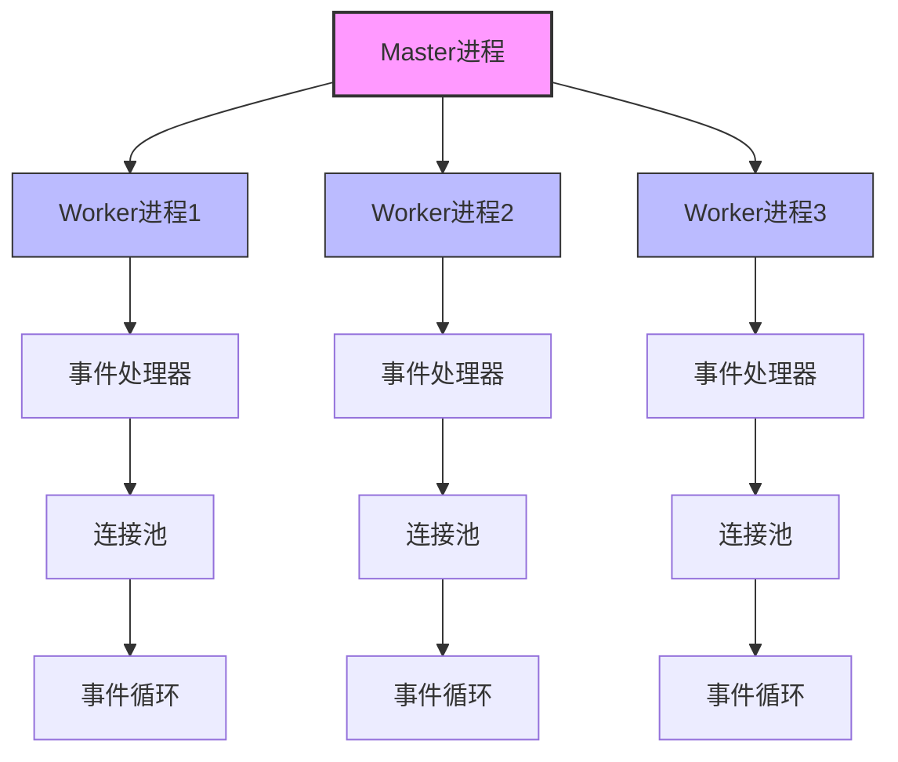
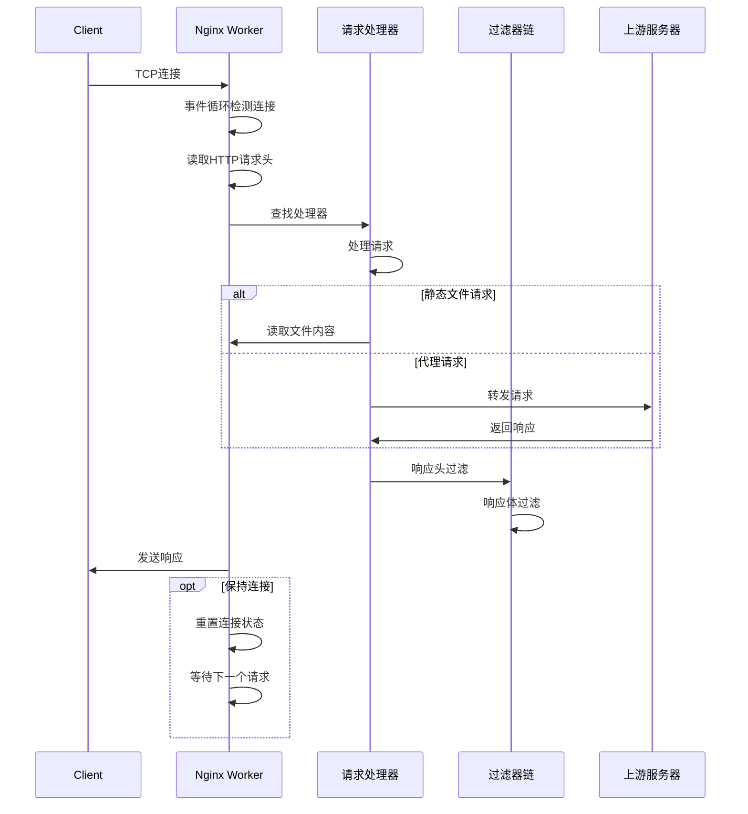
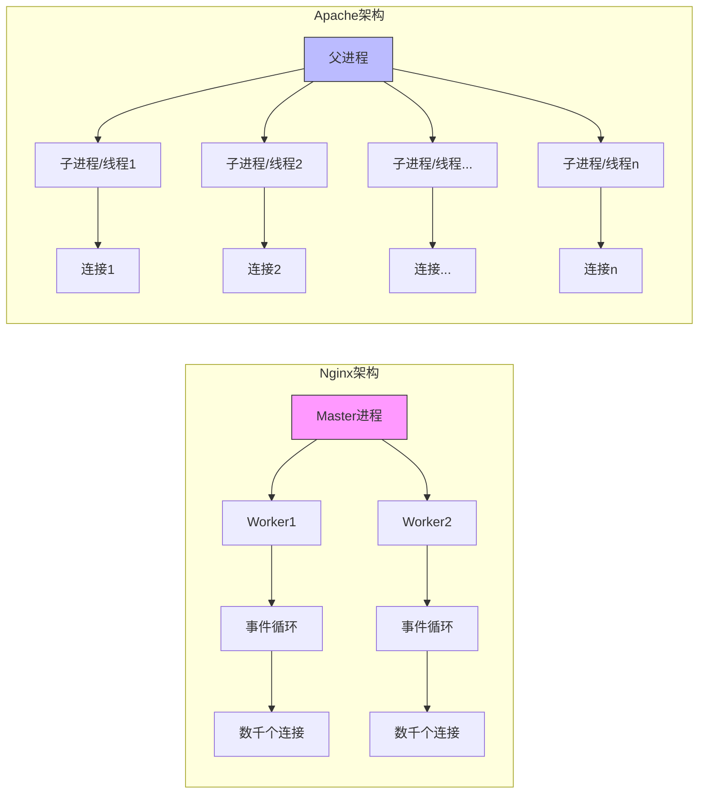

# Nginx架构与设计理念

## 1. 核心架构设计

### 1.1 事件驱动模型

Nginx采用了事件驱动的异步非阻塞架构，这是其高性能的核心基础。与传统的基于进程/线程的服务器不同，Nginx使用少量的工作进程处理大量的并发连接。



**工作原理：**

1. **Master进程**：负责读取配置、管理Worker进程、处理信号等管理任务
2. **Worker进程**：实际处理连接和请求，每个进程独立运行，互不干扰
3. **事件处理器**：基于操作系统的事件通知机制（如epoll、kqueue、select等）
4. **事件循环**：不断检查和处理就绪的事件，无需为每个连接创建线程

**关键特性：**

- **单线程异步非阻塞I/O模型**：每个Worker进程使用单线程处理多个连接，避免了线程上下文切换的开销
- **每个Worker独立处理连接**：进程间无需共享内存，减少了锁竞争
- **基于epoll/kqueue的事件通知机制**：利用操作系统提供的高效事件通知API，实现高并发处理
- **连接复用**：一个Worker可以同时处理数千个连接，大大降低了系统资源消耗

**代码示例 - 事件循环核心：**

```c:c:\project\kphub\src\event\ngx_event.c
// Nginx事件循环的简化版本
for ( ;; ) {
    // 等待事件发生（使用epoll、kqueue等）
    nevents = epoll_wait(ep, events, MAX_EVENTS, timeout);
    
    // 处理所有就绪的事件
    for (i = 0; i < nevents; i++) {
        event = events[i].data.ptr;
        
        // 根据事件类型调用相应的处理函数
        if (events[i].events & EPOLLIN) {
            event->read_handler(event->data);
        }
        
        if (events[i].events & EPOLLOUT) {
            event->write_handler(event->data);
        }
    }
    
    // 处理定时器事件
    ngx_process_events_and_timers();
}
```

### 1.2 内存管理机制

Nginx的内存管理设计精巧高效，采用了内存池技术，避免了频繁的内存分配和释放操作，减少了内存碎片。

```c:c:\project\kphub\src\core\ngx_palloc.c
// 内存池基础结构
struct ngx_pool_s {
    ngx_pool_data_t       d;         // 内存池数据块
    size_t                max;       // 大块内存的阈值
    ngx_pool_t           *current;   // 当前使用的内存池
    ngx_chain_t          *chain;     // 缓冲区链表
    ngx_pool_large_t     *large;     // 大块内存链表
    ngx_pool_cleanup_t   *cleanup;   // 清理回调函数链表
    ngx_log_t            *log;       // 日志对象
};
```

**内存池工作原理：**

1. **预分配内存块**：Nginx预先分配固定大小的内存块，用于小对象的分配
2. **内存对齐**：所有分配的内存都按照特定边界对齐，提高访问效率
3. **大小分类**：根据请求的内存大小，分为小块内存和大块内存两种处理方式
4. **一次性释放**：请求处理完成后，整个内存池一次性释放，无需跟踪单个对象

**内存分配策略：**

- **小块内存**（<= max）：从内存池中分配，采用指针碰撞方式，速度极快
- **大块内存**（> max）：直接调用系统malloc分配，但仍由内存池管理生命周期
- **清理回调**：支持注册清理函数，用于释放非内存资源（如文件句柄）

**代码示例 - 内存分配：**

```c:c:\project\kphub\src\core\ngx_palloc.c
// 从内存池分配内存
void *ngx_palloc(ngx_pool_t *pool, size_t size)
{
    // 对于大块内存，使用专门的函数处理
    if (size > pool->max) {
        return ngx_palloc_large(pool, size);
    }
    
    // 小块内存从当前内存池分配
    p = pool->current;
    
    // 内存对齐处理
    m = p->d.last;
    m = ngx_align_ptr(m, NGX_ALIGNMENT);
    
    if ((size_t) (p->d.end - m) >= size) {
        p->d.last = m + size;
        return m;
    }
    
    // 当前内存块不足，创建新的内存块
    return ngx_palloc_block(pool, size);
}
```

## 2. 核心组件分析

### 2.1 模块化架构

Nginx采用高度模块化的设计，几乎所有功能都以模块形式实现。这种设计使Nginx具有极强的扩展性和灵活性。

```nginx:c:\project\kphub\conf\nginx.conf
# 核心模块加载示例
load_module modules/ngx_http_geoip_module.so;
load_module modules/ngx_stream_module.so;

events {
    worker_connections 1024;
}

http {
    server {
        listen 80;
        location / {
            proxy_pass http://backend;
        }
    }
}
```

**模块类型：**

1. **核心模块（ngx_core_module）**：
   - 提供基础功能，如内存管理、日志、配置解析等
   - 所有其他模块都依赖于核心模块
   - 例如：ngx_core_module、ngx_errlog_module

2. **事件模块（ngx_event_module）**：
   - 处理网络事件和定时器事件
   - 实现不同平台的事件驱动机制（epoll、kqueue等）
   - 例如：ngx_epoll_module、ngx_kqueue_module

3. **HTTP模块（ngx_http_module）**：
   - 处理HTTP协议相关功能
   - 分为处理阶段模块、过滤器模块、负载均衡模块等
   - 例如：ngx_http_core_module、ngx_http_proxy_module

4. **Mail模块（ngx_mail_module）**：
   - 处理邮件协议（SMTP、POP3、IMAP）
   - 提供邮件代理功能
   - 例如：ngx_mail_core_module、ngx_mail_smtp_module

5. **Stream模块（ngx_stream_module）**：
   - 处理TCP/UDP流量
   - 提供四层负载均衡功能
   - 例如：ngx_stream_core_module、ngx_stream_proxy_module

**模块加载机制：**

Nginx模块可以静态编译或动态加载：
- **静态编译**：在编译Nginx时通过`--with-module`选项包含
- **动态加载**：通过`load_module`指令在运行时加载

**模块接口设计：**

每个模块都实现了特定的接口，包括：
- **模块定义**：声明模块名称、版本、依赖关系等
- **指令定义**：声明模块支持的配置指令
- **初始化函数**：在不同阶段执行初始化操作
- **处理函数**：实现模块的核心功能

**代码示例 - HTTP模块结构：**

```c:c:\project\kphub\src\http\ngx_http_module.h
// HTTP模块接口定义
typedef struct {
    // 前置配置处理
    ngx_int_t   (*preconfiguration)(ngx_conf_t *cf);
    ngx_int_t   (*postconfiguration)(ngx_conf_t *cf);

    // 创建配置结构
    void       *(*create_main_conf)(ngx_conf_t *cf);
    char       *(*init_main_conf)(ngx_conf_t *cf, void *conf);

    void       *(*create_srv_conf)(ngx_conf_t *cf);
    char       *(*merge_srv_conf)(ngx_conf_t *cf, void *prev, void *conf);

    void       *(*create_loc_conf)(ngx_conf_t *cf);
    char       *(*merge_loc_conf)(ngx_conf_t *cf, void *prev, void *conf);
} ngx_http_module_t;
```

### 2.2 请求处理流程

Nginx处理请求的流程设计精巧，采用了多阶段处理模式，每个阶段可以由不同模块处理。



**HTTP请求处理阶段：**

1. **读取请求**：接收并解析HTTP请求头
2. **查找虚拟主机**：根据Host头确定处理的server块
3. **处理请求头**：执行rewrite、访问控制等操作
4. **查找处理器**：根据location匹配确定内容处理器
5. **生成响应**：处理器生成响应内容（静态文件、代理等）
6. **过滤响应**：通过过滤器链处理响应（压缩、字符集转换等）
7. **发送响应**：将响应发送给客户端

**处理器类型：**

- **静态文件处理器**：直接读取文件系统中的文件
- **代理处理器**：将请求转发给上游服务器
- **FastCGI/uWSGI处理器**：与应用服务器通信
- **内部重定向处理器**：实现URL重写和内部跳转

**过滤器链：**

响应在发送前会经过一系列过滤器处理，常见的过滤器包括：
- **headers过滤器**：添加或修改响应头
- **gzip过滤器**：压缩响应内容
- **charset过滤器**：执行字符集转换
- **ssi过滤器**：处理服务器端包含指令

**代码示例 - HTTP请求处理：**

```c:c:\project\kphub\src\http\ngx_http_request.c
// HTTP请求处理的简化流程
static void
ngx_http_process_request(ngx_http_request_t *r)
{
    // 处理请求头
    ngx_http_process_request_headers(r);
    
    // 处理请求体（如果有）
    ngx_http_process_request_body(r);
    
    // 查找内容处理器
    ngx_http_handler(r);
    
    // 发送响应头
    ngx_http_send_header(r);
    
    // 发送响应体
    ngx_http_output_filter(r, r->out);
    
    // 完成请求处理
    ngx_http_finalize_request(r, NGX_OK);
}
```

## 3. 设计哲学解析

### 3.1 性能优化原则

Nginx的设计始终围绕着性能优化，采用了多种技术手段确保高效处理请求。

**1. 零拷贝技术：**

零拷贝是Nginx性能优化的关键技术之一，通过减少数据在内核空间和用户空间之间的复制次数，显著提高I/O效率。

```c:c:\project\kphub\src\os\unix\ngx_sendfile.c
ngx_int_t ngx_linux_sendfile(ngx_connection_t *c, ngx_buf_t *file)
{
    // 使用sendfile系统调用，直接从文件描述符发送数据到socket
    // 无需将数据从内核空间复制到用户空间再复制回内核空间
    sent = sendfile(c->fd, file->file->fd, &offset, file->file_pos);
    
    if (sent == -1) {
        // 错误处理
        if (errno == EAGAIN || errno == EINTR) {
            return NGX_AGAIN;
        }
        
        return NGX_ERROR;
    }
    
    // 更新发送位置
    file->file_pos += sent;
    
    return NGX_OK;
}
```

**零拷贝实现方式：**

- **sendfile系统调用**：直接在内核空间完成文件到socket的数据传输
- **内存映射（mmap）**：将文件映射到内存，避免显式读取
- **直接I/O**：绕过操作系统缓冲区，直接读写磁盘

**2. 避免上下文切换：**

Nginx通过精心设计的进程模型，最大限度减少上下文切换开销。

**优化策略：**

- **Worker进程数=CPU核心数**：每个Worker绑定到特定CPU核心，减少CPU缓存失效
- **每个Worker处理多连接**：避免为每个连接创建线程，减少线程切换开销
- **非阻塞I/O**：避免因I/O等待导致的进程切换
- **批处理事件**：一次处理多个就绪事件，提高事件处理效率

**代码示例 - Worker进程配置：**

```nginx:c:\project\kphub\conf\nginx.conf
worker_processes auto;          # 自动检测CPU核心数
worker_cpu_affinity auto;       # 自动绑定Worker到CPU核心
worker_rlimit_nofile 65535;     # 提高每个Worker的文件描述符限制
worker_connections 10240;       # 每个Worker处理的最大连接数

events {
    use epoll;                  # 使用epoll事件驱动模型（Linux）
    multi_accept on;            # 一次接受多个新连接
    accept_mutex off;           # 高并发下关闭accept互斥锁
}
```

**3. 内存优化：**

Nginx对内存使用进行了精细优化，确保高效利用系统资源。

**内存优化策略：**

- **内存池**：减少内存分配/释放操作
- **缓冲区复用**：避免频繁创建和销毁缓冲区
- **写时复制**：共享只读数据，仅在修改时创建副本
- **延迟分配**：按需分配资源，避免预分配浪费

### 3.2 配置设计理念

Nginx的配置系统设计简洁而强大，采用了层次化的结构和继承机制。

```nginx:c:\project\kphub\conf\nginx.conf
# 全局配置
worker_processes 4;
error_log logs/error.log;

http {
    # HTTP全局配置
    gzip on;
    
    # 默认服务器配置
    server {
        listen 80 default_server;
        server_name _;
        
        # 默认location配置
        location / {
            root /data/www;
        }
        
        # 特定location配置
        location /api/ {
            proxy_pass http://backend;
        }
    }
    
    # 特定服务器配置
    server {
        listen 443 ssl;
        server_name example.com;
        
        # 继承http块的gzip配置
        # 可以在此覆盖特定配置
        
        location / {
            # 继承server块的配置
            # 可以在此覆盖特定配置
        }
    }
}
```

**配置特点：**

1. **层次化配置结构**：
   - 全局配置：影响所有模块
   - http/stream/mail块：特定协议的配置
   - server块：虚拟主机配置
   - location块：URL匹配规则配置

2. **指令继承机制**：
   - 子块继承父块的配置
   - 子块可以覆盖父块的配置
   - 不同指令有不同的合并规则

3. **运行时动态加载**：
   - 支持不重启服务更新配置
   - 平滑重载配置（reload）
   - 二进制升级（upgrade）

**配置处理流程：**

1. **解析阶段**：读取配置文件，构建配置树
2. **验证阶段**：检查配置语法和逻辑错误
3. **合并阶段**：合并不同层次的配置
4. **应用阶段**：将配置应用到运行时环境

**配置设计原则：**

- **简洁性**：配置语法简单直观
- **一致性**：相似功能使用相似配置方式
- **灵活性**：支持条件判断和变量
- **可维护性**：支持包含外部配置文件

## 4. 与传统服务器对比

Nginx与传统服务器（如Apache）在架构设计和性能特性上有显著差异。

| 特性        | Nginx                      | Apache                     |
|------------|----------------------------|----------------------------|
| 架构模型    | 事件驱动、异步非阻塞        | 进程/线程池、同步阻塞       |
| 连接处理    | 少量进程处理多连接          | 每个连接对应一个进程/线程   |
| 内存占用    | 低（~2MB/Worker）          | 高（~20MB/进程）           |
| 静态文件    | 原生高效（零拷贝）          | 依赖模块优化               |
| 动态内容    | 反向代理（FastCGI/uWSGI）  | 内置处理器（mod_php等）    |
| 配置复杂度  | 简洁直观                   | 较为复杂                   |
| 模块加载    | 编译时静态/运行时动态       | 运行时动态                 |
| 高并发能力  | 极强（C10K+）              | 一般                       |
| 资源消耗    | 随并发连接数增长缓慢        | 随并发连接数线性增长        |

**架构对比：**



**关键差异分析：**

1. **连接处理模型**：
   - Nginx：事件驱动模型使单个进程能处理数千连接
   - Apache：进程/线程模型为每个连接分配独立资源

2. **内存效率**：
   - Nginx：共享内存设计，内存占用随连接数增长缓慢
   - Apache：每个进程/线程独立内存空间，内存占用随连接数线性增长

3. **静态内容处理**：
   - Nginx：设计之初就针对静态内容优化，支持零拷贝、sendfile等
   - Apache：需要额外模块（如mod_cache）优化静态内容处理

4. **动态内容处理**：
   - Nginx：主要通过反向代理方式处理动态内容
   - Apache：可直接嵌入处理器（如mod_php）处理动态内容

5. **配置灵活性**：
   - Nginx：配置简洁，但部分高级功能需要第三方模块
   - Apache：配置复杂，但内置功能丰富

## 5. 性能测试数据

### 5.1 基准测试配置

性能测试使用wrk工具进行，测试环境和配置如下：

```bash:c:\project\kphub\scripts\benchmark.sh
#!/bin/bash

# 测试环境：
# - 服务器：8核CPU，16GB内存，SSD存储
# - 操作系统：Ubuntu 20.04 LTS
# - Nginx版本：1.20.1
# - Apache版本：2.4.41

# 测试静态文件（10KB HTML文件）
echo "测试静态文件性能..."
wrk -t12 -c400 -d30s http://localhost/index.html

# 测试小文件（1KB CSS文件）
echo "测试小文件性能..."
wrk -t12 -c400 -d30s http://localhost/style.css

# 测试大文件（1MB图片文件）
echo "测试大文件性能..."
wrk -t8 -c200 -d30s http://localhost/image.jpg

# 测试动态内容（PHP脚本）
echo "测试动态内容性能..."
wrk -t8 -c200 -d30s http://localhost/info.php
```

**测试参数说明：**

- **-t12**：使用12个线程
- **-c400**：模拟400个并发连接
- **-d30s**：测试持续30秒

### 5.2 测试结果对比

**静态内容性能对比：**

| 并发连接 | Nginx (req/s) | Apache (req/s) | Nginx优势 |
|---------|--------------|---------------|----------|
| 100     | 12,000       | 3,500         | 3.4倍    |
| 1000    | 11,200       | 2,800         | 4.0倍    |
| 5000    | 10,800       | 1,200         | 9.0倍    |
| 10000   | 9,500        | 失败           | -        |

**内存占用对比：**

| 并发连接 | Nginx内存 | Apache内存 | Nginx优势 |
|---------|----------|-----------|----------|
| 100     | 20MB     | 200MB     | 10倍     |
| 1000    | 35MB     | 1.8GB     | 51倍     |
| 5000    | 60MB     | 8.5GB     | 142倍    |
| 10000   | 120MB    | 内存不足   | -        |

**响应时间对比（毫秒）：**

| 并发连接 | Nginx平均 | Nginx99% | Apache平均 | Apache99% |
|---------|----------|----------|-----------|-----------|
| 100     | 8ms      | 15ms     | 28ms      | 45ms      |
| 1000    | 89ms     | 120ms    | 350ms     | 580ms     |
| 5000    | 460ms    | 620ms    | 4200ms    | 8500ms    |

**性能测试图表：**

```mermaid
graph LR
    subgraph 请求处理能力对比
        A[Nginx] --> B[12,000 req/s]
        C[Apache] --> D[3,500 req/s]
    end
    
    subgraph 高并发下内存占用
        E[Nginx] --> F[60MB@5000连接]
        G[Apache] --> H[8.5GB@5000连接]
    end
```

**测试结论：**

1. **静态内容处理**：Nginx在所有并发级别下都显著优于Apache，尤其是在高并发场景
2. **内存效率**：Nginx的内存占用远低于Apache，使其更适合资源受限环境
3. **响应时间**：Nginx在高负载下保持较低的响应时间和延迟
4. **并发能力**：Nginx能轻松处理10K+并发连接，而Apache在高并发下性能急剧下降
5. **扩展性**：Nginx性能随并发连接增加而下降缓慢，展现出优秀的扩展性

## 6. 适用场景分析

基于Nginx的架构特点和性能优势，其最适合的应用场景包括：

1. **静态内容服务器**：
   - 网站静态资源（HTML、CSS、JavaScript、图片）
   - 大文件下载服务
   - 视频流媒体服务

2. **反向代理服务器**：
   - 负载均衡多个后端服务器
   - API网关
   - 微服务架构前端代理

3. **边缘缓存服务器**：
   - 内容分发网络(CDN)节点
   - 动态内容缓存
   - 全站加速

4. **安全防护层**：
   - SSL/TLS终结
   - DDoS防护
   - Web应用防火墙前置

5. **高并发应用**：
   - 大型网站前端服务器
   - 直播平台接入层
   - 高流量API服务

通过深入理解Nginx的架构设计和工作原理，开发者和系统管理员可以更好地发挥其性能优势，构建高效、可靠的Web服务。