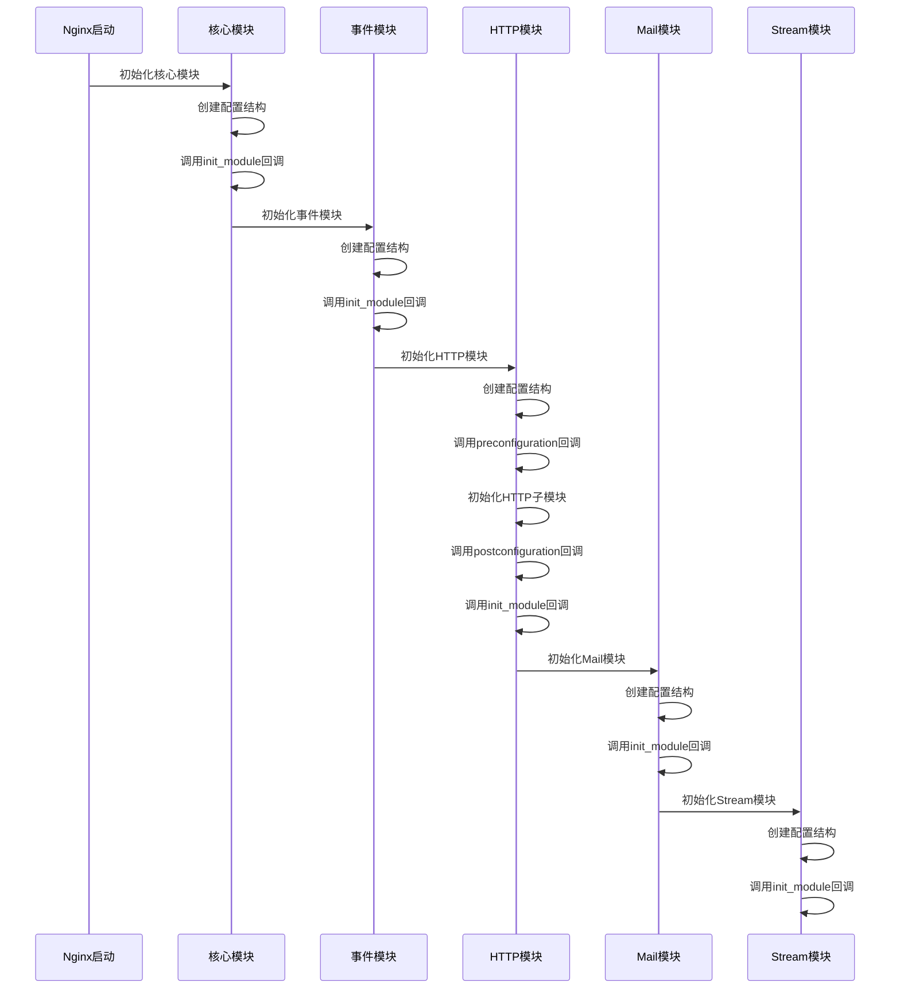
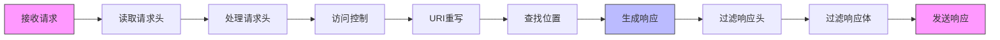

# Nginx模块系统分析  

Nginx的强大和灵活很大程度上归功于其精心设计的模块化架构。这种架构允许Nginx通过加载不同模块来扩展功能，同时保持核心部分的高效和稳定。本文将深入分析Nginx的模块系统，帮助读者理解其工作原理和开发方法。

## 1. 模块系统架构  

### 1.1 模块分类体系  

Nginx的模块系统采用分层设计，不同类型的模块负责不同的功能领域。这种设计使得Nginx可以根据需求灵活配置，只加载必要的功能模块。

```mermaid  
graph TD  
    A[Nginx模块] --> B[核心模块]  
    A --> C[事件模块]  
    A --> D[HTTP模块]  
    A --> E[Mail模块]  
    A --> F[Stream模块]  
    
    B --> B1[ngx_core_module]
    B --> B2[ngx_errlog_module]
    B --> B3[ngx_conf_module]
    
    C --> C1[ngx_epoll_module]
    C --> C2[ngx_kqueue_module]
    C --> C3[ngx_select_module]
    
    D --> G[HTTP Core]  
    D --> H[HTTP Handler模块]  
    D --> I[HTTP Filter模块]
    D --> J[HTTP Upstream模块]
    
    H --> H1[ngx_http_proxy_module]
    H --> H2[ngx_http_fastcgi_module]
    
    I --> I1[ngx_http_headers_module]
    I --> I2[ngx_http_gzip_module]
    
    J --> J1[ngx_http_upstream_module]
    
    E --> E1[ngx_mail_core_module]
    E --> E2[ngx_mail_pop3_module]
    E --> E3[ngx_mail_imap_module]
    E --> E4[ngx_mail_smtp_module]
    
    F --> F1[ngx_stream_core_module]
    F --> F2[ngx_stream_proxy_module]
    
    style A fill:#f9f,stroke:#333,stroke-width:2px
    style B fill:#bbf,stroke:#333
    style C fill:#bbf,stroke:#333
    style D fill:#bbf,stroke:#333
    style E fill:#bbf,stroke:#333
    style F fill:#bbf,stroke:#333
```  



**模块类型说明：**

1. **核心模块（Core Modules）**：
   - 提供基础功能，如配置解析、内存管理、进程管理等
   - 所有其他模块都依赖于核心模块
   - 例如：ngx_core_module、ngx_errlog_module

2. **事件模块（Event Modules）**：
   - 处理网络事件和定时器事件
   - 实现不同平台的事件驱动机制
   - 例如：ngx_epoll_module（Linux）、ngx_kqueue_module（BSD）

3. **HTTP模块（HTTP Modules）**：
   - 处理HTTP协议相关功能
   - 分为多个子类型：
     - **HTTP Core**：HTTP核心功能
     - **Handler模块**：处理请求并生成响应
     - **Filter模块**：处理响应内容
     - **Upstream模块**：与上游服务器通信

4. **Mail模块（Mail Modules）**：
   - 处理邮件协议（POP3、IMAP、SMTP）
   - 提供邮件代理功能

5. **Stream模块（Stream Modules）**：
   - 处理TCP/UDP流量
   - 提供四层负载均衡功能

### 1.2 模块数据结构  

Nginx模块系统的核心是`ngx_module_t`结构体，它定义了模块的基本属性和行为。每个Nginx模块都必须定义一个此类型的全局变量。

```c:c:\project\kphub\src\core\ngx_module.h  
typedef struct ngx_module_s  {  
    ngx_uint_t    ctx_index;    // 模块上下文索引  
    ngx_uint_t    index;        // 模块在全局模块数组中的索引  
    
    char         *name;         // 模块名称
    
    ngx_uint_t    version;      // 模块版本
    
    void         *ctx;          // 模块上下文，指向特定类型模块的上下文结构  
    ngx_command_t *commands;    // 模块支持的配置指令数组  
    
    ngx_uint_t    type;         // 模块类型标记（HTTP、EVENT、CORE等）  
    
    // 各个阶段的回调函数
    ngx_int_t   (*init_master)(ngx_log_t *log);              // master进程初始化
    ngx_int_t   (*init_module)(ngx_cycle_t *cycle);          // 模块初始化
    ngx_int_t   (*init_process)(ngx_cycle_t *cycle);         // worker进程初始化
    ngx_int_t   (*init_thread)(ngx_cycle_t *cycle);          // 线程初始化
    void        (*exit_thread)(ngx_cycle_t *cycle);          // 线程退出
    void        (*exit_process)(ngx_cycle_t *cycle);         // worker进程退出
    void        (*exit_master)(ngx_cycle_t *cycle);          // master进程退出
    
    // 保留字段，用于版本兼容
    uintptr_t    spare_hook0;
    uintptr_t    spare_hook1;
    uintptr_t    spare_hook2;
    uintptr_t    spare_hook3;
    uintptr_t    spare_hook4;
    uintptr_t    spare_hook5;
    uintptr_t    spare_hook6;
    uintptr_t    spare_hook7;
} ngx_module_t;  
```  

**模块指令结构体**：

每个模块可以定义自己的配置指令，这些指令通过`ngx_command_t`结构体数组定义：

```c:c:\project\kphub\src\core\ngx_conf_file.h
typedef struct ngx_command_s {
    ngx_str_t     name;          // 指令名称
    ngx_uint_t    type;          // 指令类型和位置标志
    
    // 指令处理函数
    char        *(*set)(ngx_conf_t *cf, ngx_command_t *cmd, void *conf);
    
    ngx_uint_t    conf;          // 配置结构体中的偏移量
    ngx_uint_t    offset;        // 字段偏移量
    void         *post;          // 指令处理完成后的回调
} ngx_command_t;
```

**模块上下文结构体**：

不同类型的模块有不同的上下文结构体，例如HTTP模块的上下文结构体：

```c:c:\project\kphub\src\http\ngx_http_config.h
typedef struct {
    // 配置前后的回调函数
    ngx_int_t   (*preconfiguration)(ngx_conf_t *cf);
    ngx_int_t   (*postconfiguration)(ngx_conf_t *cf);

    // 创建和合并配置的函数
    void       *(*create_main_conf)(ngx_conf_t *cf);
    char       *(*init_main_conf)(ngx_conf_t *cf, void *conf);

    void       *(*create_srv_conf)(ngx_conf_t *cf);
    char       *(*merge_srv_conf)(ngx_conf_t *cf, void *prev, void *conf);

    void       *(*create_loc_conf)(ngx_conf_t *cf);
    char       *(*merge_loc_conf)(ngx_conf_t *cf, void *prev, void *conf);
} ngx_http_module_t;
```

## 2. 核心模块详解  

### 2.1 HTTP核心模块配置  

HTTP核心模块（ngx_http_core_module）是Nginx处理HTTP请求的基础。它定义了HTTP服务器的基本行为和配置结构。

```nginx:c:\project\kphub\conf\nginx.conf  
http {  
    # 主上下文配置  
    sendfile       on;           # 启用零拷贝文件传输
    tcp_nopush     on;           # 启用TCP_NOPUSH选项，提高网络传输效率
    tcp_nodelay    on;           # 启用TCP_NODELAY选项，减少延迟
    keepalive_timeout  65;       # 保持连接超时时间
    types_hash_max_size 2048;    # 类型哈希表最大大小
    
    # MIME类型配置
    include       mime.types;
    default_type  application/octet-stream;

    # 日志格式和路径
    access_log  logs/access.log  main;

    # 服务器块配置
    server {  
        listen       80;         # 监听端口
        server_name  localhost;  # 服务器名称

        # 位置块配置
        location / {  
            root   html;         # 根目录
            index  index.html;   # 默认索引文件
        }  
        
        # 错误页面配置
        error_page   500 502 503 504  /50x.html;
        location = /50x.html {
            root   html;
        }
    }  
}  
```  

**HTTP配置的层次结构**：

HTTP模块的配置分为三个层次：

1. **主配置（Main）**：
   - 定义在http块中的全局配置
   - 影响所有虚拟主机

2. **服务器配置（Server）**：
   - 定义在server块中的配置
   - 特定于某个虚拟主机

3. **位置配置（Location）**：
   - 定义在location块中的配置
   - 特定于某个URL路径

**配置继承机制**：

Nginx采用配置继承机制，子级配置会继承父级配置的设置，但可以覆盖它们。例如：

```nginx:c:\project\kphub\conf\nginx.conf
http {
    gzip on;                # 全局启用gzip压缩
    
    server {
        # 继承http块的gzip设置
        
        location /api/ {
            gzip off;       # 覆盖继承的设置，在此位置禁用gzip
        }
    }
}
```

### 2.2 模块加载顺序  

Nginx模块的加载和初始化遵循特定的顺序，这对于理解模块间的依赖关系和交互至关重要。

**1. 配置解析阶段**：  

在Nginx启动时，首先解析配置文件：
- 按照nginx.conf中出现的顺序记录指令  
- 通过`ngx_conf_parse()`函数解析配置文件
- 为每个模块创建配置结构体
- 调用各个指令的处理函数

**2. 模块初始化顺序**：  

模块初始化遵循以下顺序：

```  
Core → Events → HTTP → HTTP Modules → Mail → Stream  
```  

具体流程如下：



**3. 进程初始化顺序**：

在Nginx创建worker进程后，会按照相同的顺序调用各模块的`init_process`回调函数：

```c:c:\project\kphub\src\core\ngx_cycle.c
ngx_int_t
ngx_init_modules(ngx_cycle_t *cycle)
{
    ngx_uint_t  i;

    for (i = 0; cycle->modules[i]; i++) {
        if (cycle->modules[i]->init_module) {
            if (cycle->modules[i]->init_module(cycle) != NGX_OK) {
                return NGX_ERROR;
            }
        }
    }

    return NGX_OK;
}
```

**4. 请求处理阶段**：

HTTP请求处理分为多个阶段，每个阶段可以有多个模块参与：



## 3. 模块开发规范  

### 3.1 模块定义模板  

开发Nginx模块需要遵循特定的结构和规范。以下是一个HTTP模块的基本模板：

```c:c:\project\kphub\src\mymodule\ngx_http_mymodule_module.c  
#include <ngx_config.h>
#include <ngx_core.h>
#include <ngx_http.h>

// 模块配置结构
typedef struct {
    ngx_flag_t  enable;          // 是否启用模块
    ngx_str_t   string;          // 配置字符串
    ngx_int_t   number;          // 配置数值
} ngx_http_mymodule_loc_conf_t;

// 模块指令定义  
static ngx_command_t ngx_http_mymodule_commands[] = {  
    // 启用/禁用模块的指令
    { 
        ngx_string("mymodule"),  
        NGX_HTTP_LOC_CONF|NGX_CONF_FLAG,  
        ngx_conf_set_flag_slot,  
        NGX_HTTP_LOC_CONF_OFFSET,  
        offsetof(ngx_http_mymodule_loc_conf_t, enable),  
        NULL 
    },
    
    // 设置字符串参数的指令
    { 
        ngx_string("mymodule_string"),  
        NGX_HTTP_LOC_CONF|NGX_CONF_TAKE1,  
        ngx_conf_set_str_slot,  
        NGX_HTTP_LOC_CONF_OFFSET,  
        offsetof(ngx_http_mymodule_loc_conf_t, string),  
        NULL 
    },
    
    // 设置数值参数的指令
    { 
        ngx_string("mymodule_number"),  
        NGX_HTTP_LOC_CONF|NGX_CONF_TAKE1,  
        ngx_conf_set_num_slot,  
        NGX_HTTP_LOC_CONF_OFFSET,  
        offsetof(ngx_http_mymodule_loc_conf_t, number),  
        NULL 
    },
    
    // 结束标记
    ngx_null_command  
};  

// 创建位置配置
static void *
ngx_http_mymodule_create_loc_conf(ngx_conf_t *cf)
{
    ngx_http_mymodule_loc_conf_t  *conf;

    conf = ngx_pcalloc(cf->pool, sizeof(ngx_http_mymodule_loc_conf_t));
    if (conf == NULL) {
        return NULL;
    }

    // 设置默认值
    conf->enable = NGX_CONF_UNSET;
    conf->number = NGX_CONF_UNSET;

    return conf;
}

// 合并位置配置
static char *
ngx_http_mymodule_merge_loc_conf(ngx_conf_t *cf, void *parent, void *child)
{
    ngx_http_mymodule_loc_conf_t *prev = parent;
    ngx_http_mymodule_loc_conf_t *conf = child;

    // 合并配置，未设置的值从父配置继承
    ngx_conf_merge_value(conf->enable, prev->enable, 0);
    ngx_conf_merge_str_value(conf->string, prev->string, "");
    ngx_conf_merge_value(conf->number, prev->number, 0);

    return NGX_CONF_OK;
}

// 请求处理函数
static ngx_int_t
ngx_http_mymodule_handler(ngx_http_request_t *r)
{
    ngx_http_mymodule_loc_conf_t  *mlcf;
    ngx_str_t                      response;
    ngx_int_t                      rc;
    
    // 获取模块配置
    mlcf = ngx_http_get_module_loc_conf(r, ngx_http_mymodule_module);
    
    // 检查模块是否启用
    if (!mlcf->enable) {
        return NGX_DECLINED;
    }
    
    // 设置响应内容类型
    r->headers_out.content_type_len = sizeof("text/plain") - 1;
    r->headers_out.content_type.len = sizeof("text/plain") - 1;
    r->headers_out.content_type.data = (u_char *) "text/plain";
    
    // 准备响应内容
    response.data = ngx_pcalloc(r->pool, 256);
    if (response.data == NULL) {
        return NGX_HTTP_INTERNAL_SERVER_ERROR;
    }
    
    response.len = ngx_sprintf(response.data, 
                              "MyModule is working!\nString: %V\nNumber: %i",
                              &mlcf->string, mlcf->number) - response.data;
    
    // 设置响应长度
    r->headers_out.status = NGX_HTTP_OK;
    r->headers_out.content_length_n = response.len;
    
    // 发送响应头
    rc = ngx_http_send_header(r);
    if (rc == NGX_ERROR || rc > NGX_OK || r->header_only) {
        return rc;
    }
    
    // 准备响应体缓冲区
    ngx_buf_t *b;
    b = ngx_pcalloc(r->pool, sizeof(ngx_buf_t));
    if (b == NULL) {
        return NGX_HTTP_INTERNAL_SERVER_ERROR;
    }
    
    b->pos = response.data;
    b->last = response.data + response.len;
    b->memory = 1;
    b->last_buf = 1;
    
    // 创建输出链
    ngx_chain_t out;
    out.buf = b;
    out.next = NULL;
    
    // 发送响应体
    return ngx_http_output_filter(r, &out);
}

// 模块初始化函数
static ngx_int_t
ngx_http_mymodule_init(ngx_conf_t *cf)
{
    ngx_http_handler_pt        *h;
    ngx_http_core_main_conf_t  *cmcf;
    
    // 获取HTTP核心模块的主配置
    cmcf = ngx_http_conf_get_module_main_conf(cf, ngx_http_core_module);
    
    // 在内容处理阶段注册处理函数
    h = ngx_array_push(&cmcf->phases[NGX_HTTP_CONTENT_PHASE].handlers);
    if (h == NULL) {
        return NGX_ERROR;
    }
    
    *h = ngx_http_mymodule_handler;
    
    return NGX_OK;
}

// 模块上下文  
static ngx_http_module_t ngx_http_mymodule_ctx = {  
    NULL,                          /* preconfiguration */  
    ngx_http_mymodule_init,        /* postconfiguration */  
    NULL,                          /* create main configuration */  
    NULL,                          /* init main configuration */  
    NULL,                          /* create server configuration */  
    NULL,                          /* merge server configuration */  
    ngx_http_mymodule_create_loc_conf, /* create location configuration */  
    ngx_http_mymodule_merge_loc_conf   /* merge location configuration */  
};  

// 模块声明  
ngx_module_t ngx_http_mymodule_module = {  
    NGX_MODULE_V1,                 // 模块版本标记
    &ngx_http_mymodule_ctx,        /* module context */  
    ngx_http_mymodule_commands,    /* module directives */  
    NGX_HTTP_MODULE,               /* module type */  
    NULL,                          /* init master */  
    NULL,                          /* init module */  
    NULL,                          /* init process */  
    NULL,                          /* init thread */  
    NULL,                          /* exit thread */  
    NULL,                          /* exit process */  
    NULL,                          /* exit master */  
    NGX_MODULE_V1_PADDING          // 版本兼容填充
};  
```  

### 3.2 模块开发关键点

开发Nginx模块时需要注意以下关键点：

**1. 内存管理**：

Nginx使用内存池（ngx_pool_t）管理内存，模块开发中应遵循以下原则：
- 使用ngx_palloc()而非malloc()分配内存
- 利用请求结束时自动释放内存的特性
- 对于长期存在的数据，使用共享内存

```c:c:\project\kphub\src\mymodule\memory_example.c
// 正确的内存分配方式
char *data = ngx_palloc(r->pool, size);
if (data == NULL) {
    return NGX_HTTP_INTERNAL_SERVER_ERROR;
}

// 对于需要初始化为0的内存
char *zero_data = ngx_pcalloc(r->pool, size);
if (zero_data == NULL) {
    return NGX_HTTP_INTERNAL_SERVER_ERROR;
}
```

**2. 配置管理**：

Nginx的配置系统分为创建和合并两个阶段：
- 创建阶段：为每个作用域分配配置结构体并设置默认值
- 合并阶段：将父作用域的配置值合并到子作用域

**3. 请求处理**：

HTTP请求处理分为多个阶段，模块可以在不同阶段注册处理函数：
- NGX_HTTP_POST_READ_PHASE：读取请求头后
- NGX_HTTP_SERVER_REWRITE_PHASE：server级别的重写
- NGX_HTTP_FIND_CONFIG_PHASE：查找location配置
- NGX_HTTP_REWRITE_PHASE：location级别的重写
- NGX_HTTP_POST_REWRITE_PHASE：重写后处理
- NGX_HTTP_PREACCESS_PHASE：访问控制前
- NGX_HTTP_ACCESS_PHASE：访问控制
- NGX_HTTP_POST_ACCESS_PHASE：访问控制后
- NGX_HTTP_PRECONTENT_PHASE：内容生成前
- NGX_HTTP_CONTENT_PHASE：内容生成
- NGX_HTTP_LOG_PHASE：日志记录

**4. 线程安全**：

Nginx的worker进程是单线程的，但如果使用线程池，需要注意线程安全问题：
- 避免修改共享数据
- 使用互斥锁保护共享资源
- 使用原子操作进行计数器更新

## 4. 常用模块功能对比  

### 4.1 HTTP处理模块  

Nginx内置了多种HTTP处理模块，每个模块负责特定的功能：

| 模块名称          | 核心功能                     | 典型配置指令         | 应用场景                     |
|-------------------|----------------------------|---------------------|------------------------------|
| ngx_http_proxy    | 反向代理                    | proxy_pass          | 将请求转发到后端服务器        |
| ngx_http_rewrite  | URL重写                    | rewrite             | 重定向、URL规范化            |
| ngx_http_gzip     | 响应压缩                    | gzip on             | 减少传输数据量               |
| ngx_http_ssl      | HTTPS支持                  | ssl_certificate     | 加密通信                     |
| ngx_http_static   | 静态文件服务                | root, alias         | 提供静态资源                 |
| ngx_http_fastcgi  | FastCGI协议支持            | fastcgi_pass        | 与PHP等后端通信              |
| ngx_http_uwsgi    | uWSGI协议支持              | uwsgi_pass          | 与Python等后端通信           |
| ngx_http_auth_basic| 基本认证                   | auth_basic          | 简单的访问控制               |
| ngx_http_limit_req| 请求限速                   | limit_req           | 防止DoS攻击                  |
| ngx_http_log      | 访问日志                   | access_log          | 记录请求信息                 |

**模块功能对比示例**：

```nginx:c:\project\kphub\conf\nginx.conf
# 反向代理配置
location /api/ {
    proxy_pass http://backend;
    proxy_set_header Host $host;
    proxy_set_header X-Real-IP $remote_addr;
}

# URL重写配置
location /old/ {
    rewrite ^/old/(.*)$ /new/$1 permanent;
}

# 响应压缩配置
location /assets/ {
    gzip on;
    gzip_types text/css application/javascript;
    gzip_min_length 1000;
}

# HTTPS配置
server {
    listen 443 ssl;
    ssl_certificate cert.pem;
    ssl_certificate_key cert.key;
    ssl_protocols TLSv1.2 TLSv1.3;
}

# 请求限速配置
location /login/ {
    limit_req zone=login burst=5;
}
```

### 4.2 第三方模块加载  

Nginx支持加载第三方模块，可以通过静态编译或动态加载的方式：

**静态编译**：

```bash  
# 在编译Nginx时添加第三方模块
./configure --add-module=/path/to/module
make
make install
```  

**动态加载**：

```bash  
# 编译动态模块
./configure --add-dynamic-module=../ngx_http_geoip2_module  
make modules  

# 将编译好的模块复制到Nginx模块目录
cp objs/ngx_http_geoip2_module.so /etc/nginx/modules/

# 在配置文件中加载模块
load_module modules/ngx_http_geoip2_module.so;
```  

**常用第三方模块**：

| 模块名称          | 功能描述                     | 应用场景                     |
|-------------------|----------------------------|------------------------------|
| nginx-rtmp-module | RTMP流媒体服务              | 视频直播、流媒体服务         |
| lua-nginx-module  | 嵌入Lua脚本                 | 复杂逻辑处理、动态内容       |
| headers-more      | 修改HTTP头                  | 安全增强、自定义响应头       |
| nginx-upload-module| 文件上传处理               | 大文件上传、断点续传         |
| ngx_cache_purge   | 缓存清理                    | CDN缓存管理                  |
| ModSecurity       | Web应用防火墙               | 安全防护、攻击检测           |

## 5. 模块调试技巧  

### 5.1 模块状态检查  

调试Nginx模块时，首先需要了解当前Nginx的模块加载状态：

```bash  
# 查看Nginx版本和编译选项
nginx -V

# 查看已加载模块  
nginx -V 2>&1 | grep -o with-http_.*module  

# 查看动态加载的模块
nginx -
让我继续编写Nginx模块系统分析的内容：

### 5.1 模块状态检查（续）

```bash  
# 查看动态加载的模块
nginx -T | grep "load_module"

# 检查模块是否正常工作
curl -I http://localhost/module_test

# 使用GDB调试Nginx模块  
gdb -p $(pgrep -f "nginx: master") -ex "b ngx_http_handler" -ex "c"  

# 使用strace跟踪系统调用
strace -p $(pgrep -f "nginx: worker") -f -e trace=network
```  

在开发和调试Nginx模块时，了解模块的运行状态非常重要。可以通过以下方法检查模块状态：

1. **检查模块是否加载**：
   - 查看Nginx编译选项中是否包含该模块
   - 检查动态模块是否正确加载
   - 验证模块指令是否被正确解析

2. **检查模块配置**：
   - 使用`nginx -t`验证配置语法
   - 使用`nginx -T`查看完整配置，包括包含的文件
   - 检查模块特定的配置指令是否生效

3. **运行时调试**：
   - 使用GDB附加到Nginx进程
   - 在关键函数设置断点
   - 检查变量值和执行流程

### 5.2 日志追踪配置  

Nginx提供了强大的日志功能，可以帮助开发者调试模块：

```nginx:c:\project\kphub\conf\nginx.conf  
# 全局错误日志配置
error_log logs/error.log debug;  

events {  
    # 针对特定IP启用调试日志
    debug_connection 192.168.1.1;  
}  

http {
    # 访问日志配置
    log_format  debug  '$remote_addr - $remote_user [$time_local] "$request" '
                      '$status $body_bytes_sent "$http_referer" '
                      '"$http_user_agent" "$http_x_forwarded_for" '
                      '"$request_time" "$upstream_response_time"';
    
    access_log logs/access.log debug;
    
    # 在特定location启用详细日志
    location /debug/ {
        error_log logs/debug.log debug;
    }
}
```  

**日志级别**：

Nginx支持多种日志级别，从低到高依次为：
- `debug`：最详细的调试信息
- `info`：一般信息
- `notice`：重要信息
- `warn`：警告信息
- `error`：错误信息
- `crit`：严重错误
- `alert`：必须立即处理的错误
- `emerg`：系统不可用

**调试日志技巧**：

1. **使用条件日志**：
   - 使用`debug_connection`只对特定IP启用调试
   - 减少生产环境的日志量

2. **使用自定义日志格式**：
   - 记录请求处理时间
   - 记录上游响应时间
   - 记录特定的HTTP头

3. **在代码中添加日志点**：

```c:c:\project\kphub\src\mymodule\debug_log.c
// 在模块代码中添加调试日志
ngx_log_debug1(NGX_LOG_DEBUG_HTTP, r->connection->log, 0,
               "mymodule: processing request %V", &r->uri);

// 记录错误信息
if (rc != NGX_OK) {
    ngx_log_error(NGX_LOG_ERR, r->connection->log, 0,
                 "mymodule: failed to process request, rc=%i", rc);
    return NGX_ERROR;
}

// 使用不同参数数量的日志宏
ngx_log_debug0(NGX_LOG_DEBUG_HTTP, log, 0, "no arguments");
ngx_log_debug1(NGX_LOG_DEBUG_HTTP, log, 0, "one argument: %i", 42);
ngx_log_debug2(NGX_LOG_DEBUG_HTTP, log, 0, "two arguments: %i, %s", 42, "text");
```

### 5.3 性能分析工具

开发Nginx模块时，性能分析是一个重要环节：

```bash
# 使用perf进行性能分析
perf record -p $(pgrep -f "nginx: worker") -g -- sleep 30
perf report

# 生成火焰图
perf script | FlameGraph/stackcollapse-perf.pl | FlameGraph/flamegraph.pl > nginx-flame.svg

# 使用SystemTap分析函数调用
stap -e 'probe process("nginx").function("ngx_http_*") { printf("%s -> %s\n", thread_indent(1), probefunc()) }' -x $(pgrep -f "nginx: worker")
```

**常用性能分析工具**：

1. **perf**：
   - 低开销的性能分析工具
   - 可以分析CPU使用、缓存命中率等
   - 支持生成火焰图

2. **Valgrind**：
   - 内存泄漏检测
   - 堆栈分析
   - 线程错误检测

3. **SystemTap/DTrace**：
   - 动态跟踪工具
   - 可以分析函数调用、系统调用等
   - 支持自定义脚本

## 6. 高级模块开发技术

### 6.1 过滤器模块开发

过滤器模块可以修改响应内容，是Nginx模块中的一种重要类型：

```c:c:\project\kphub\src\mymodule\ngx_http_myfilter_module.c
// 过滤器模块示例

// 过滤器上下文
typedef struct {
    ngx_flag_t  enable;
} ngx_http_myfilter_conf_t;

// 过滤器处理函数
static ngx_int_t
ngx_http_myfilter_body_filter(ngx_http_request_t *r, ngx_chain_t *in)
{
    ngx_http_myfilter_conf_t  *conf;
    ngx_chain_t               *cl;
    ngx_buf_t                 *b;
    
    // 获取模块配置
    conf = ngx_http_get_module_loc_conf(r, ngx_http_myfilter_module);
    
    // 检查是否启用
    if (!conf->enable) {
        return ngx_http_next_body_filter(r, in);
    }
    
    // 没有数据时直接调用下一个过滤器
    if (in == NULL) {
        return ngx_http_next_body_filter(r, in);
    }
    
    // 遍历输入链
    for (cl = in; cl; cl = cl->next) {
        // 跳过非内存缓冲区
        if (cl->buf->in_file) {
            continue;
        }
        
        // 处理缓冲区内容
        // 这里可以修改响应内容，例如替换字符串
        // ...
    }
    
    // 调用下一个过滤器
    return ngx_http_next_body_filter(r, in);
}

// 过滤器初始化
static ngx_int_t
ngx_http_myfilter_init(ngx_conf_t *cf)
{
    // 保存下一个过滤器
    ngx_http_next_body_filter = ngx_http_top_body_filter;
    
    // 注册自己的过滤器
    ngx_http_top_body_filter = ngx_http_myfilter_body_filter;
    
    return NGX_OK;
}
```

**过滤器链工作原理**：


过滤器按照注册的顺序相反的顺序执行，最后注册的过滤器最先执行。每个过滤器可以：
- 修改响应内容
- 添加新的缓冲区
- 删除缓冲区
- 完全替换响应

### 6.2 共享内存使用

在多个worker进程之间共享数据，需要使用共享内存：

```c:c:\project\kphub\src\mymodule\ngx_http_myshm_module.c
// 共享内存结构
typedef struct {
    ngx_atomic_t  counter;
    ngx_atomic_t  lock;
} ngx_http_myshm_shm_t;

static ngx_http_myshm_shm_t  *shm_zone_data;

// 共享内存初始化回调
static ngx_int_t
ngx_http_myshm_init_zone(ngx_shm_zone_t *shm_zone, void *data)
{
    ngx_http_myshm_shm_t  *old = data;
    ngx_http_myshm_shm_t  *new;
    
    new = shm_zone->data;
    
    if (old) {
        // 如果是重新加载，复制旧数据
        new->counter = old->counter;
        return NGX_OK;
    }
    
    // 初始化共享内存
    new->counter = 0;
    new->lock = 0;
    
    return NGX_OK;
}

// 模块初始化
static ngx_int_t
ngx_http_myshm_init(ngx_conf_t *cf)
{
    ngx_shm_zone_t  *shm_zone;
    
    // 创建共享内存区域
    shm_zone = ngx_shared_memory_add(cf, &shm_name, 
                                    sizeof(ngx_http_myshm_shm_t),
                                    &ngx_http_myshm_module);
    if (shm_zone == NULL) {
        return NGX_ERROR;
    }
    
    // 设置初始化回调
    shm_zone->init = ngx_http_myshm_init_zone;
    
    // 保存共享内存区域
    shm_zone_data = shm_zone->data;
    
    return NGX_OK;
}

// 使用共享内存
static ngx_int_t
ngx_http_myshm_handler(ngx_http_request_t *r)
{
    ngx_atomic_t  old_value;
    
    // 原子操作增加计数器
    old_value = ngx_atomic_fetch_add(&shm_zone_data->counter, 1);
    
    // 使用锁保护共享资源
    while (!ngx_atomic_cmp_set(&shm_zone_data->lock, 0, 1)) {
        ngx_cpu_pause();
    }
    
    // 临界区操作
    // ...
    
    // 释放锁
    ngx_atomic_set(&shm_zone_data->lock, 0);
    
    return NGX_OK;
}
```

**共享内存注意事项**：

1. **原子操作**：
   - 使用ngx_atomic_*函数进行原子操作
   - 避免竞态条件

2. **锁机制**：
   - 使用原子比较和设置实现自旋锁
   - 尽量减少锁的持有时间
   - 避免死锁

3. **内存布局**：
   - 考虑缓存行对齐
   - 避免伪共享问题

### 6.3 异步模块开发

Nginx的事件驱动模型支持异步处理，可以开发不阻塞worker进程的模块：

```c:c:\project\kphub\src\mymodule\ngx_http_myasync_module.c
// 异步处理上下文
typedef struct {
    ngx_http_request_t  *request;
    ngx_event_t          event;
    ngx_connection_t    *connection;
    // 其他异步处理所需数据
} ngx_http_myasync_ctx_t;

// 异步处理完成回调
static void
ngx_http_myasync_done(ngx_event_t *ev)
{
    ngx_http_myasync_ctx_t  *ctx;
    ngx_http_request_t      *r;
    
    // 获取上下文
    ctx = ev->data;
    r = ctx->request;
    
    // 处理异步操作结果
    // ...
    
    // 发送响应
    ngx_http_send_header(r);
    ngx_http_output_filter(r, NULL);
    
    // 完成请求
    ngx_http_finalize_request(r, NGX_OK);
}

// 请求处理函数
static ngx_int_t
ngx_http_myasync_handler(ngx_http_request_t *r)
{
    ngx_http_myasync_ctx_t  *ctx;
    
    // 创建上下文
    ctx = ngx_pcalloc(r->pool, sizeof(ngx_http_myasync_ctx_t));
    if (ctx == NULL) {
        return NGX_HTTP_INTERNAL_SERVER_ERROR;
    }
    
    // 保存请求
    ctx->request = r;
    
    // 初始化事件
    ctx->event.handler = ngx_http_myasync_done;
    ctx->event.data = ctx;
    ctx->event.log = r->connection->log;
    
    // 设置请求引用计数，防止请求过早结束
    r->main->count++;
    
    // 启动异步操作
    // 例如：添加定时器、发起异步I/O等
    ngx_add_timer(&ctx->event, 1000); // 1秒后触发
    
    // 返回特殊状态，告诉Nginx不要关闭请求
    return NGX_DONE;
}
```

**异步处理模式**：

1. **定时器**：
   - 使用ngx_add_timer添加定时器
   - 在定时器回调中处理结果

2. **异步I/O**：
   - 使用非阻塞I/O操作
   - 通过事件通知机制等待I/O完成

3. **线程池**：
   - 将阻塞操作放入线程池
   - 通过回调处理结果

## 7. 总结与最佳实践

Nginx的模块系统是其成功的关键因素之一，它提供了强大的扩展能力，同时保持了核心的高性能和稳定性。

### 7.1 模块开发最佳实践

1. **遵循Nginx设计哲学**：
   - 保持简单、高效
   - 避免阻塞操作
   - 利用事件驱动模型

2. **内存管理**：
   - 使用内存池分配内存
   - 避免内存泄漏
   - 合理使用共享内存

3. **配置设计**：
   - 提供合理的默认值
   - 支持配置继承和合并
   - 提供清晰的配置指令文档

4. **错误处理**：
   - 妥善处理所有错误情况
   - 提供有用的错误日志
   - 实现优雅降级

5. **性能优化**：
   - 减少系统调用
   - 避免不必要的内存复制
   - 使用缓存提高性能

### 7.2 模块系统的优势与局限

**优势**：

1. **高度可扩展**：
   - 可以添加几乎任何功能
   - 支持动态加载模块
   - 丰富的第三方模块生态

2. **标准化接口**：
   - 清晰的模块接口定义
   - 一致的配置语法
   - 可预测的行为

3. **性能影响小**：
   - 模块化设计不影响核心性能
   - 只加载需要的模块
   - 高效的模块调用机制

**局限**：

1. **学习曲线陡峭**：
   - 需要深入理解Nginx内部机制
   - C语言开发门槛较高
   - 文档相对有限

2. **调试困难**：
   - 事件驱动模型增加调试复杂性
   - 多进程架构导致问题难以重现
   - 需要特殊的调试技巧

3. **版本兼容性**：
   - API可能随版本变化
   - 需要针对不同版本维护代码
   - 第三方模块可能不兼容新版本

### 7.3 未来发展趋势

1. **动态模块标准化**：
   - 更完善的动态模块支持
   - 更简单的模块安装机制
   - 模块仓库和版本管理

2. **更多语言支持**：
   - 除了Lua外，支持更多脚本语言
   - 简化模块开发流程
   - 降低开发门槛

3. **云原生集成**：
   - 与Kubernetes等平台深度集成
   - 支持服务网格架构
   - 动态配置和服务发现

通过深入理解Nginx的模块系统，开发者可以充分利用Nginx的强大功能，开发出高性能、高可靠性的Web应用和服务。无论是扩展现有功能还是开发全新的模块，Nginx的模块系统都提供了坚实的基础。