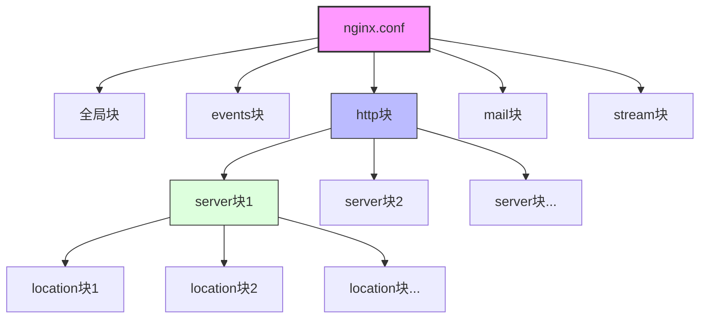

# Nginx安装与基础配置  

Nginx（发音为"engine x"）是一个高性能的HTTP和反向代理服务器，以其高并发处理能力、低内存消耗和优秀的稳定性而闻名。本文将详细介绍Nginx的安装方法和基础配置，帮助读者快速搭建一个高效、安全的Web服务环境。

## 1. 多平台安装指南  

Nginx支持多种操作系统平台，包括Windows、Linux、macOS等。下面介绍几种常见平台的安装方法。

### 1.1 Windows安装  

Windows平台安装Nginx相对简单，主要通过下载预编译的二进制包完成。

```powershell:c:\project\kphub\scripts\install_nginx.ps1  
# 下载稳定版Nginx  
Invoke-WebRequest -Uri "http://nginx.org/download/nginx-1.25.3.zip" -OutFile "c:\nginx.zip"  

# 解压到安装目录  
Expand-Archive -Path "c:\nginx.zip" -DestinationPath "c:\nginx"  

# 设置环境变量  
[Environment]::SetEnvironmentVariable("Path", "$env:Path;c:\nginx", "Machine")  

# 验证安装
nginx -v

# 启动Nginx服务
Start-Process -FilePath "c:\nginx\nginx.exe"

# 在浏览器中访问 http://localhost 验证
```  

**Windows安装注意事项**：

1. 确保下载最新稳定版本，可以在[Nginx官网](http://nginx.org/en/download.html)查看
2. Windows版本不支持某些Linux特有的功能，如epoll事件模型
3. 默认安装后，Nginx会监听80端口，确保该端口未被其他程序占用
4. 如需将Nginx注册为Windows服务，可以使用第三方工具如NSSM（Non-Sucking Service Manager）

### 1.2 Linux快速安装  

Linux平台是Nginx的主要运行环境，大多数Linux发行版都提供了Nginx的软件包。

```bash:c:\project\kphub\scripts\install_nginx.sh  
#!/bin/bash

# Ubuntu/Debian系统安装
if [ -f /etc/debian_version ]; then
    echo "正在Ubuntu/Debian系统上安装Nginx..."
    sudo apt update
    sudo apt install -y nginx
    
# CentOS/RHEL系统安装
elif [ -f /etc/redhat-release ]; then
    echo "正在CentOS/RHEL系统上安装Nginx..."
    sudo yum install -y epel-release  
    sudo yum install -y nginx  
    
# Arch Linux系统安装
elif [ -f /etc/arch-release ]; then
    echo "正在Arch Linux系统上安装Nginx..."
    sudo pacman -Sy nginx
    
# 其他Linux发行版
else
    echo "未识别的Linux发行版，请手动安装Nginx"
    exit 1
fi

# 验证安装  
nginx -v  

# 启动并设置开机自启
if command -v systemctl &> /dev/null; then
    sudo systemctl start nginx
    sudo systemctl enable nginx
    echo "Nginx已启动并设置为开机自启"
else
    sudo service nginx start
    echo "Nginx已启动，请手动配置开机自启"
fi

# 检查Nginx状态
if pgrep nginx > /dev/null; then
    echo "Nginx安装成功并正在运行"
else
    echo "Nginx安装可能出现问题，请检查错误日志"
fi
```  

**Linux安装方式对比**：

| 安装方式 | 优点 | 缺点 | 适用场景 |
|---------|------|------|----------|
| 包管理器 | 简单快捷，自动处理依赖 | 版本可能不是最新 | 开发环境、一般应用 |
| 源码编译 | 可定制功能，优化性能 | 过程复杂，需要手动管理 | 生产环境、特殊需求 |
| Docker容器 | 环境隔离，快速部署 | 需要Docker环境 | 微服务架构、CI/CD |

### 1.3 源码编译安装

对于需要特定功能模块或性能优化的场景，可以选择源码编译安装：

```bash:c:\project\kphub\scripts\compile_nginx.sh
#!/bin/bash

# 安装编译依赖
sudo apt update
sudo apt install -y build-essential libpcre3-dev zlib1g-dev libssl-dev

# 下载源码
wget http://nginx.org/download/nginx-1.25.3.tar.gz
tar -zxvf nginx-1.25.3.tar.gz
cd nginx-1.25.3

# 配置编译选项
./configure \
  --prefix=/usr/local/nginx \
  --with-http_ssl_module \
  --with-http_v2_module \
  --with-http_realip_module \
  --with-http_stub_status_module \
  --with-http_gzip_static_module \
  --with-pcre \
  --with-stream \
  --with-stream_ssl_module

# 编译和安装
make -j$(nproc)
sudo make install

# 创建软链接
sudo ln -s /usr/local/nginx/sbin/nginx /usr/local/bin/nginx

# 验证安装
nginx -v
```

## 2. 核心配置文件解析  

理解Nginx的配置文件结构是有效管理和优化Nginx服务的基础。

### 2.1 主配置文件结构  

Nginx的主配置文件通常位于`/etc/nginx/nginx.conf`（Linux）或`c:\nginx\conf\nginx.conf`（Windows）。配置文件采用层次化结构，由多个块（block）组成。

```nginx:c:\project\kphub\conf\nginx.conf  
# 全局块 - 影响Nginx全局的配置指令
user  nginx;                          # 运行Nginx的用户
worker_processes  auto;               # Worker进程数，auto表示自动检测CPU核心数
error_log  logs/error.log  warn;      # 错误日志路径和级别
pid        logs/nginx.pid;            # PID文件路径

# Events块 - 影响Nginx事件处理的配置指令
events {  
    worker_connections  1024;         # 每个Worker进程的最大连接数
    multi_accept        on;           # 允许一个Worker同时接受多个连接
    use                 epoll;        # 事件驱动模型（Linux下推荐epoll）
}  

# HTTP块 - HTTP服务器相关的配置指令
http {  
    include       mime.types;         # 包含MIME类型定义文件
    default_type  application/octet-stream;  # 默认MIME类型
    
    # 日志格式定义
    log_format  main  '$remote_addr - $remote_user [$time_local] "$request" '
                      '$status $body_bytes_sent "$http_referer" '
                      '"$http_user_agent" "$http_x_forwarded_for"';
    
    access_log  logs/access.log  main;  # 访问日志路径和格式
    
    # 基本优化设置
    sendfile        on;               # 启用零拷贝文件传输
    tcp_nopush      on;               # 启用TCP_NOPUSH选项，提高网络传输效率
    tcp_nodelay     on;               # 启用TCP_NODELAY选项，减少延迟
    
    keepalive_timeout  65;            # 长连接超时时间
    
    # 压缩设置
    gzip  on;                         # 启用gzip压缩
    gzip_min_length 1k;               # 最小压缩文件大小
    gzip_types text/plain text/css application/javascript application/json;  # 压缩类型
    
    # Server块 - 虚拟主机配置
    server {  
        listen       80;              # 监听端口
        server_name  localhost;       # 服务器名称
        
        # Location块 - 特定URI的配置
        location / {  
            root   html;              # 网站根目录
            index  index.html index.htm;  # 默认索引文件
        }  
        
        # 错误页面配置
        error_page   500 502 503 504  /50x.html;
        location = /50x.html {
            root   html;
        }
    }
    
    # 可以包含其他配置文件
    include conf.d/*.conf;
}  

# 可选的Mail块 - 邮件代理服务配置
# mail {
#     ...
# }

# 可选的Stream块 - TCP/UDP代理配置
# stream {
#     ...
# }
```  

**配置文件层次结构**：



### 2.2 关键配置指令说明  

以下是Nginx中一些关键配置指令的详细说明：

| 指令                | 作用域       | 默认值     | 说明                     |  
|---------------------|-------------|-----------|--------------------------|  
| worker_processes    | main        | 1         | Worker进程数，建议设置为CPU核心数 |  
| worker_connections  | events      | 512       | 单个Worker最大连接数，影响并发处理能力 |  
| worker_rlimit_nofile| main        | 无        | 每个Worker进程的最大文件描述符数量 |
| use                 | events      | 自动选择   | 事件驱动模型(epoll/kqueue/select) |
| sendfile            | http/server | off       | 启用零拷贝文件传输，提高静态文件效率 |  
| tcp_nopush          | http/server | off       | 在sendfile开启时使用，优化数据包传输 |
| tcp_nodelay         | http/server | on        | 禁用Nagle算法，减少小数据包延迟 |
| keepalive_timeout   | http/server | 75s       | 长连接超时时间，影响服务器资源占用 |  
| client_max_body_size| http/server | 1m        | 客户端请求体最大大小，影响文件上传 |
| gzip                | http/server | off       | 启用gzip压缩，减少传输数据量 |
| server_name         | server      | ""        | 虚拟主机名称，支持通配符和正则表达式 |
| listen              | server      | 80        | 监听的IP地址和端口 |
| root                | http/server/location | html | 网站根目录路径 |
| index               | http/server/location | index.html | 默认索引文件 |
| proxy_pass          | location    | 无        | 反向代理目标URL |
| return              | server/location | 无    | 返回指定的状态码和内容 |
| rewrite             | server/location | 无    | URL重写规则 |

**指令继承关系**：

子级配置块会继承父级配置块的设置，但可以覆盖它们。例如，http块中的设置会被server块继承，server块的设置会被location块继承。

```nginx:c:\project\kphub\conf\inheritance_example.conf
http {
    gzip on;                # 在http级别启用gzip
    
    server {
        # 继承http块的gzip设置
        
        location /api/ {
            gzip off;       # 在此location覆盖继承的设置，禁用gzip
        }
        
        location /static/ {
            # 继承server块的gzip设置(即http块的设置)
            gzip_comp_level 6;  # 添加额外的gzip设置
        }
    }
}
```

## 3. 基础服务管理  

掌握Nginx服务的基本管理操作是日常维护的必备技能。

### 3.1 Windows服务管理  

Windows平台下管理Nginx服务的方法：

```powershell:c:\project\kphub\scripts\nginx_service.ps1  
# 启动Nginx服务  
function Start-Nginx {
    Write-Host "正在启动Nginx服务..."
    Start-Process -FilePath "c:\nginx\nginx.exe" -NoNewWindow
    
    # 检查是否成功启动
    Start-Sleep -Seconds 1
    $process = Get-Process -Name "nginx" -ErrorAction SilentlyContinue
    if ($process) {
        Write-Host "Nginx服务已成功启动" -ForegroundColor Green
    } else {
        Write-Host "Nginx服务启动失败，请检查错误日志" -ForegroundColor Red
    }
}

# 停止Nginx服务（快速停止）
function Stop-NginxFast {
    Write-Host "正在快速停止Nginx服务..."
    Start-Process -FilePath "c:\nginx\nginx.exe" -ArgumentList "-s stop" -NoNewWindow -Wait
    
    # 确保进程已停止
    $process = Get-Process -Name "nginx" -ErrorAction SilentlyContinue
    if ($process) {
        Write-Host "Nginx进程仍在运行，强制终止..." -ForegroundColor Yellow
        taskkill /IM nginx.exe /F
    }
    
    Write-Host "Nginx服务已停止" -ForegroundColor Green
}

# 优雅停止Nginx服务（等待请求处理完成）
function Stop-NginxGraceful {
    Write-Host "正在优雅停止Nginx服务..."
    Start-Process -FilePath "c:\nginx\nginx.exe" -ArgumentList "-s quit" -NoNewWindow -Wait
    
    # 等待进程退出
    $timeout = 30  # 最多等待30秒
    $elapsed = 0
    while (($process = Get-Process -Name "nginx" -ErrorAction SilentlyContinue) -and ($elapsed -lt $timeout)) {
        Write-Host "等待Nginx进程退出... ($elapsed/$timeout 秒)"
        Start-Sleep -Seconds 1
        $elapsed++
    }
    
    if ($process) {
        Write-Host "Nginx进程未能在$timeout秒内退出，强制终止..." -ForegroundColor Yellow
        taskkill /IM nginx.exe /F
    } else {
        Write-Host "Nginx服务已优雅停止" -ForegroundColor Green
    }
}

# 重载配置（不中断服务）
function Reload-Nginx {
    Write-Host "正在重载Nginx配置..."
    
    # 先检查配置是否有效
    $result = Start-Process -FilePath "c:\nginx\nginx.exe" -ArgumentList "-t" -NoNewWindow -Wait -PassThru
    if ($result.ExitCode -ne 0) {
        Write-Host "配置文件有误，请修正后再重载" -ForegroundColor Red
        return
    }
    
    # 重载配置
    Start-Process -FilePath "c:\nginx\nginx.exe" -ArgumentList "-s reload" -NoNewWindow -Wait
    Write-Host "Nginx配置已重载" -ForegroundColor Green
}

# 检查Nginx状态
function Get-NginxStatus {
    $process = Get-Process -Name "nginx" -ErrorAction SilentlyContinue
    if ($process) {
        Write-Host "Nginx服务正在运行" -ForegroundColor Green
        Write-Host "主进程ID: $($process[0].Id)"
        Write-Host "Worker进程数: $($process.Count - 1)"
        
        # 显示监听端口
        Write-Host "`n监听端口:"
        netstat -ano | findstr "LISTENING" | findstr "$($process[0].Id)"
    } else {
        Write-Host "Nginx服务未运行" -ForegroundColor Yellow
    }
}
```  

**Windows服务注册**：

要将Nginx注册为Windows系统服务，可以使用NSSM工具：

```powershell:c:\project\kphub\scripts\register_nginx_service.ps1
# 下载NSSM工具
Invoke-WebRequest -Uri "https://nssm.cc/release/nssm-2.24.zip" -OutFile "c:\nssm.zip"
Expand-Archive -Path "c:\nssm.zip" -DestinationPath "c:\nssm"

# 注册Nginx为系统服务
$nssmPath = "c:\nssm\nssm-2.24\win64\nssm.exe"
& $nssmPath install nginx "c:\nginx\nginx.exe"
& $nssmPath set nginx AppDirectory "c:\nginx"
& $nssmPath set nginx Description "Nginx Web Server"
& $nssmPath set nginx Start SERVICE_AUTO_START

# 启动服务
Start-Service nginx

# 检查服务状态
Get-Service nginx
```

### 3.2 Linux服务管理  

Linux平台下管理Nginx服务的方法：

```bash:c:\project\kphub\scripts\nginx_service.sh  
#!/bin/bash

# 检测系统类型
if command -v systemctl &> /dev/null; then
    # systemd系统（现代Linux发行版）
    SYSTEM_TYPE="systemd"
elif command -v service &> /dev/null; then
    # SysV init系统（较旧的Linux发行版）
    SYSTEM_TYPE="sysvinit"
else
    # 直接使用nginx命令控制
    SYSTEM_TYPE="direct"
fi

# 启动Nginx服务
start_nginx() {
    echo "正在启动Nginx服务..."
    
    case $SYSTEM_TYPE in
        systemd)
            sudo systemctl start nginx
            ;;
        sysvinit)
            sudo service nginx start
            ;;
        direct)
            sudo nginx
            ;;
    esac
    
    # 检查是否成功启动
    if pgrep nginx &> /dev/null; then
        echo "Nginx服务已成功启动"
    else
        echo "Nginx服务启动失败，请检查错误日志"
        exit 1
    fi
}

# 停止Nginx服务
stop_nginx() {
    echo "正在停止Nginx服务..."
    
    case $SYSTEM_TYPE in
        systemd)
            sudo systemctl stop nginx
            ;;
        sysvinit)
            sudo service nginx stop
            ;;
        direct)
            sudo nginx -s stop      # 立即停止
            ;;
    esac
    
    # 确保进程已停止
    if pgrep nginx &> /dev/null; then
        echo "Nginx进程仍在运行，强制终止..."
        sudo killall nginx
    fi
    
    echo "Nginx服务已停止"
}

# 优雅停止Nginx服务
graceful_stop_nginx() {
    echo "正在优雅停止Nginx服务..."
    
    case $SYSTEM_TYPE in
        systemd)
            sudo systemctl stop nginx
            ;;
        sysvinit)
            sudo service nginx stop
            ;;
        direct)
            sudo nginx -s quit      # 优雅停止
            ;;
    esac
    
    # 等待进程退出
    timeout=30  # 最多等待30秒
    elapsed=0
    while pgrep nginx &> /dev/null && [ $elapsed -lt $timeout ]; do
        echo "等待Nginx进程退出... ($elapsed/$timeout 秒)"
        sleep 1
        elapsed=$((elapsed+1))
    done
    
    if pgrep nginx &> /dev/null; then
        echo "Nginx进程未能在$timeout秒内退出，强制终止..."
        sudo killall nginx
    else
        echo "Nginx服务已优雅停止"
    fi
}

# 重载配置
reload_nginx() {
    echo "正在重载Nginx配置..."
    
    # 先检查配置是否有效
    if ! nginx -t &> /dev/null; then
        echo "配置文件有误，请修正后再重载"
        nginx -t  # 显示详细错误信息
        exit 1
    fi
    
    case $SYSTEM_TYPE in
        systemd)
            sudo systemctl reload nginx
            ;;
        sysvinit)
            sudo service nginx reload
            ;;
        direct)
            sudo nginx -s reload    # 重载配置
            ;;
    esac
    
    echo "Nginx配置已重载"
}

# 设置开机自启
enable_nginx() {
    echo "设置Nginx开机自启..."
    
    case $SYSTEM_TYPE in
        systemd)
            sudo systemctl enable nginx
            echo "已设置Nginx开机自启"
            ;;
        sysvinit)
            sudo update-rc.d nginx defaults
            echo "已设置Nginx开机自启"
            ;;
        direct)
            echo "请手动配置开机自启脚本"
            ;;
    esac
}

# 检查Nginx状态
check_status() {
    echo "Nginx状态检查:"
    
    case $SYSTEM_TYPE in
        systemd)
            sudo systemctl status nginx
            ;;
        sysvinit)
            sudo service nginx status
            ;;
        direct)
            if pgrep nginx &> /dev/null; then
                echo "Nginx服务正在运行"
                echo "主进程ID: $(pgrep -o nginx)"
                echo "Worker进程数: $(pgrep nginx | wc -l)"
                
                echo -e "\n监听端口:"
                sudo netstat -tulpn | grep nginx
            else
                echo "Nginx服务未运行"
            fi
            ;;
    esac
}

# 根据参数执行相应操作
case "$1" in
    start)
        start_nginx
        ;;
    stop)
        stop_nginx
        ;;
    graceful-stop)
        graceful_stop_nginx
        ;;
    reload)
        reload_nginx
        ;;
    restart)
        stop_nginx
        start_nginx
        ;;
    enable)
        enable_nginx
        ;;
    status)
        check_status
        ;;
    *)
        echo "用法: $0 {start|stop|graceful-stop|reload|restart|enable|status}"
        exit 1
        ;;
esac

exit 0
```  

**Nginx信号控制**：

Nginx支持通过信号控制主进程行为：

| 信号 | 命令行参数 | 作用 |
|------|-----------|------|
| TERM, INT | nginx -s stop | 快速停止 |
| QUIT | nginx -s quit | 优雅停止 |
| HUP | nginx -s reload | 重载配置 |
| USR1 | nginx -s reopen | 重新打开日志文件 |
| USR2 | - | 平滑升级可执行文件 |
| WINCH | - | 优雅关闭worker进程 |

## 4. 安全基线配置  

安全是Web服务器配置中的重要环节，以下是Nginx的基础安全配置。

### 4.1 基础安全加固  

```nginx:c:\project\kphub\conf.d\security.conf  
# 基础安全配置

# 隐藏Nginx版本信息，防止信息泄露
server_tokens off;  

# 设置安全相关的HTTP响应头
add_header X-Content-Type-Options "nosniff" always;
add_header X-Frame-Options "SAMEORIGIN" always;
add_header X-XSS-Protection "1; mode=block" always;
add_header Referrer-Policy "strict-origin-when-cross-origin" always;

# 禁用不安全的HTTP方法
if ($request_method !~ ^(GET|HEAD|POST|PUT|DELETE)$ ) {  
    return 405;  
}  

# 防止MIME类型混淆攻击
default_type application/octet-stream;  

# 限制请求体大小，防止DOS攻击
client_max_body_size 10m;

# 限制缓冲区大小
client_body_buffer_size 128k;
client_header_buffer_size 1k;
large_client_header_buffers 4 4k;

# 超时设置，防止慢速攻击
client_body_timeout 10;
client_header_timeout 10;
keepalive_timeout 65;
send_timeout 10;

# 限制并发连接数
limit_conn_zone $binary_remote_addr zone=conn_limit_per_ip:10m;
limit_conn conn_limit_per_ip 10;

# 限制请求速率
limit_req_zone $binary_remote_addr zone=req_limit_per_ip:10m rate=1r/s;
limit_req zone=req_limit_per_ip burst=10 nodelay;

# SSL/TLS安全配置（如果使用HTTPS）
ssl_protocols TLSv1.2 TLSv1.3;
ssl_prefer_server_ciphers on;
ssl_ciphers 'ECDHE-ECDSA-AES256-GCM-SHA384:ECDHE-RSA-AES256-GCM-SHA384:ECDHE-ECDSA-CHACHA20-POLY1305:ECDHE-RSA-CHACHA20-POLY1305';
ssl_session_cache shared:SSL:10m;
ssl_session_timeout 1d;
ssl_session_tickets off;
ssl_stapling on;
ssl_stapling_verify on;
```  

**安全配置说明**：

1. **信息隐藏**：
   - `server_tokens off` - 隐藏Nginx版本信息，减少攻击面
   - 自定义错误页面，避免泄露服务器信息

2. **HTTP安全头**：
   - X-Content-Type-Options - 防止MIME类型嗅探
   - X-Frame-Options - 防止点击劫持
   - X-XSS-Protection - 启用浏览器XSS过滤
   - Referrer-Policy - 控制Referer头的发送

3. **请求限制**：
   - 限制请求体大小 - 防止资源耗尽
   - 限制并发连接数 - 防止单IP占用过多资源
   - 限制请求速率 - 防止暴力攻击

4. **SSL/TLS安全**：
   - 仅使用安全的TLS版本和密码套件
   - 启用OCSP Stapling提高性能和安全性
   - 禁用不安全的SSL功能

### 4.2 访问日志配置  

日志是安全监控和问题排查的重要工具，合理配置日志可以帮助及时发现安全问题。

```nginx:c:\project\kphub\conf.d\log_format.conf  
# 定义标准日志格式
log_format main '$remote_addr - $remote_user [$time_local] "$request" '
                '$status $body_bytes_sent "$http_referer" '
                '"$http_user_agent" "$http_x_forwarded_for"';

# 定义详细日志格式（包含更多安全相关信息）
log_format detailed '$remote_addr - $remote_user [$time_local] "$request" '
                    '$status $body_bytes_sent "$http_referer" '
                    '"$http_user_agent" "$http_x_forwarded_for" '
                    '$request_time $upstream_response_time '
                    '$pipe $connection $connection_requests '
                    '"$http_content_type" "$http_authorization"';

# 定义JSON格式日志（便于日志分析系统处理）
log_format json_combined escape=json '{'
                                     '"time_local":"$time_local",'
                                     '"remote_addr":"$remote_addr",'
                                     '"remote_user":"$remote_user",'
                                     '"request":"$request",'
                                     '"status": "$status",'
                                     '"body_bytes_sent":"$body_bytes_sent",'
                                     '"request_time":"$request_time",'
                                     '"http_referrer":"$http_referer",'
                                     '"http_user_agent":"$http_user_agent",'
                                     '"http_x_forwarded_for":"$http_x_forwarded_for"'
                                     '}';

# 全局访问日志配置
access_log logs/access.log main buffer=32k flush=5s;

# 错误日志配置
error_log logs/error.log warn;

# 在server块中可以针对不同虚拟主机设置不同的日志
server {
    # 使用详细日志格式
    access_log logs/detailed.log detailed buffer=64k flush=5s;
    
    # 特定URI使用JSON格式日志
    location
让我继续编写Nginx安装与基础配置的内容：

### 4.2 访问日志配置（续）

```nginx:c:\project\kphub\conf.d\log_format.conf  
    # 特定URI使用JSON格式日志
    location /api/ {
        access_log logs/api.log json_combined buffer=64k flush=1s;
    }
    
    # 静态资源可以禁用访问日志以提高性能
    location /static/ {
        access_log off;
    }
    
    # 健康检查端点可以禁用日志
    location = /health {
        access_log off;
    }
}

# 日志轮转配置（需要与logrotate配合使用）
# 在/etc/logrotate.d/nginx中配置
```

**日志配置最佳实践**：

1. **缓冲与刷新**：
   - 使用`buffer`参数缓冲日志写入，减少I/O操作
   - 使用`flush`参数定期刷新日志，避免数据丢失
   - 生产环境建议：`buffer=64k flush=5s`

2. **日志分割**：
   - 按照虚拟主机分割日志
   - 按照不同URI路径分割日志
   - 使用logrotate定期轮转日志，防止单个日志文件过大

3. **日志安全**：
   - 避免记录敏感信息（如密码、令牌）
   - 定期备份和归档日志
   - 设置适当的日志文件权限

4. **性能考虑**：
   - 对高流量的静态资源路径禁用访问日志
   - 使用异步日志写入（`aio`）减少阻塞
   - 将日志存储在单独的磁盘分区

### 4.3 防止常见攻击的配置

```nginx:c:\project\kphub\conf.d\security_advanced.conf
# 防止SQL注入和XSS攻击（基本过滤）
# 注意：这只是基本防护，建议使用WAF如ModSecurity进行更全面的保护
location ~ \.php$ {
    # 拒绝包含可疑SQL注入模式的请求
    if ($query_string ~* "union.*select.*\(") {
        return 403;
    }
    if ($query_string ~* "concat.*\(") {
        return 403;
    }
    
    # 拒绝包含可疑XSS模式的请求
    if ($query_string ~* "<script.*>") {
        return 403;
    }
    
    # 正常处理PHP请求
    fastcgi_pass   127.0.0.1:9000;
    fastcgi_index  index.php;
    include        fastcgi_params;
}

# 防止目录遍历
location ~ \.(git|svn|hg|bzr)/ {
    deny all;
    return 404;
}

# 保护敏感文件
location ~ \.(bak|config|sql|fla|psd|ini|log|sh|inc|swp|dist|env)$ {
    deny all;
    return 404;
}

# 防止恶意爬虫和扫描器
if ($http_user_agent ~* (nmap|nikto|wikto|sf|sqlmap|bsqlbf|w3af|acunetix|havij|appscan)) {
    return 403;
}

# 防止恶意引用
valid_referers none blocked server_names
               *.example.com example.* *.google.com *.baidu.com;
if ($invalid_referer) {
    return 403;
}

# IP地址访问控制
# 允许特定IP访问管理区域
location /admin/ {
    allow 192.168.1.0/24;
    allow 10.0.0.0/8;
    deny all;
}
```

## 5. 性能基线配置  

优化Nginx性能是提高网站响应速度和处理能力的关键。

### 5.1 连接优化参数  

```nginx:c:\project\kphub\conf.d\performance.conf  
# 工作进程配置
worker_processes auto;           # 自动检测CPU核心数
worker_cpu_affinity auto;        # 自动绑定进程到CPU核心
worker_rlimit_nofile 65535;      # 每个进程的最大文件描述符数量

# 事件模块配置
events {  
    # 使用高效的事件模型
    use epoll;                   # Linux系统使用epoll
    # use kqueue;                # FreeBSD/macOS系统使用kqueue
    # use select;                # Windows系统使用select
    
    # 单个Worker连接数上限  
    worker_connections 10240;    # 根据服务器内存和CPU调整
    
    # 允许同时接受多个连接
    multi_accept on;
    
    # 启用负载均衡互斥锁
    accept_mutex on;
    accept_mutex_delay 100ms;
}  

http {  
    # TCP连接优化
    
    # 开启TCP快速打开（Linux 3.7+）
    tcp_fastopen on;             # 减少TCP握手延迟
    
    # 启用sendfile零拷贝  
    sendfile on;                 # 避免用户空间和内核空间的数据拷贝
    
    # 在sendfile开启时使用，提高网络包的传输效率
    tcp_nopush on;               # 尽可能多地发送数据包
    
    # 禁用Nagle算法，减少小包延迟
    tcp_nodelay on;              # 对于实时应用很重要
    
    # 长连接配置
    keepalive_timeout 65;        # 保持连接的超时时间
    keepalive_requests 1000;     # 单个连接上可处理的请求数
    
    # 读取请求体的超时时间
    client_body_timeout 10s;
    
    # 读取请求头的超时时间
    client_header_timeout 10s;
    
    # 向客户端传输响应的超时时间
    send_timeout 10s;
    
    # 请求缓冲区大小
    client_header_buffer_size 1k;
    large_client_header_buffers 4 8k;
    client_body_buffer_size 128k;
    
    # 输出缓冲区大小
    output_buffers 2 32k;
    postpone_output 1460;        # 等待数据达到一个TCP包的大小再发送
    
    # 临时文件目录
    client_body_temp_path temp/client_body;
    proxy_temp_path temp/proxy;
    fastcgi_temp_path temp/fastcgi;
    uwsgi_temp_path temp/uwsgi;
    scgi_temp_path temp/scgi;
}
```  

**性能参数调优指南**：

1. **worker_processes**：
   - 通常设置为CPU核心数
   - 对于I/O密集型应用，可以设置为核心数的1.5-2倍
   - 对于CPU密集型应用，设置为核心数即可

2. **worker_connections**：
   - 计算公式：最大并发连接数 = worker_processes × worker_connections
   - 受限于系统可用文件描述符数量
   - 通常设置为4096-10240之间

3. **事件模型选择**：
   - Linux系统优先使用epoll
   - FreeBSD/macOS系统优先使用kqueue
   - Windows系统使用select
   - 自动选择：不指定use指令时Nginx会自动选择最优模型

### 5.2 文件缓存设置  

文件缓存可以显著提高静态内容的访问速度：

```nginx:c:\project\kphub\conf.d\cache.conf  
# 打开文件缓存
open_file_cache max=10000 inactive=30s;  # 最多缓存10000个文件，30秒不访问则清除
open_file_cache_valid 60s;               # 60秒检查一次缓存中的文件状态
open_file_cache_min_uses 2;              # 文件被访问2次后才会被缓存
open_file_cache_errors on;               # 缓存文件找不到等错误信息

# 静态文件缓存控制
location ~* \.(jpg|jpeg|png|gif|ico|css|js)$ {
    expires 30d;                         # 设置过期时间为30天
    add_header Cache-Control "public, no-transform";  # 允许公共缓存，禁止转换
    
    # 启用gzip压缩
    gzip on;
    gzip_min_length 1000;                # 最小压缩文件大小
    gzip_types text/plain text/css application/javascript application/json image/svg+xml;
    gzip_comp_level 6;                   # 压缩级别（1-9，权衡CPU和压缩率）
    gzip_vary on;                        # 添加Vary: Accept-Encoding头
    
    # 启用浏览器缓存
    etag on;                             # 启用ETag头
    if_modified_since exact;             # 精确匹配If-Modified-Since头
    
    # 大文件优化
    aio on;                              # 启用异步I/O（需要编译支持）
    directio 512;                        # 大于512KB的文件使用直接I/O
    directio_alignment 512;              # 直接I/O对齐大小
}

# 微缓存配置（用于动态内容）
proxy_cache_path /var/cache/nginx levels=1:2 keys_zone=microcache:10m max_size=1g inactive=1h;

location /dynamic/ {
    proxy_pass http://backend;
    
    # 启用微缓存
    proxy_cache microcache;
    proxy_cache_valid 200 1m;            # 成功响应缓存1分钟
    proxy_cache_use_stale error timeout updating; # 当后端出错时使用过期缓存
    proxy_cache_lock on;                 # 防止缓存雪崩
    
    # 添加缓存状态头
    add_header X-Cache-Status $upstream_cache_status;
}
```

**缓存策略优化**：

1. **静态文件缓存**：
   - 为不同类型的静态文件设置合适的过期时间
   - 频繁变化的文件设置较短的过期时间
   - 使用版本化URL（如file.js?v=123）处理更新

2. **微缓存**：
   - 对动态内容进行短时间缓存（1-60秒）
   - 显著减轻后端服务器负载
   - 适用于高流量但内容变化不频繁的页面

3. **分层缓存**：
   - Nginx作为前端缓存
   - 后端应用服务器使用本地缓存
   - 数据库使用查询缓存

### 5.3 压缩与传输优化

```nginx:c:\project\kphub\conf.d\compression.conf
# 全局压缩设置
gzip on;
gzip_comp_level 5;                # 压缩级别，平衡CPU使用和压缩率
gzip_min_length 256;              # 最小压缩文件大小
gzip_proxied any;                 # 对所有代理请求进行压缩
gzip_vary on;                     # 添加Vary头，正确处理缓存
gzip_types
    text/plain
    text/css
    text/xml
    text/javascript
    application/javascript
    application/x-javascript
    application/xml
    application/json
    application/rss+xml
    application/atom+xml
    image/svg+xml;
gzip_disable "MSIE [1-6]\.";      # 禁用对旧版IE的压缩

# 启用Brotli压缩（如果编译时包含ngx_brotli模块）
# brotli on;
# brotli_comp_level 4;
# brotli_types text/plain text/css application/javascript application/json image/svg+xml;

# HTTP/2配置（需要SSL）
server {
    listen 443 ssl http2;
    server_name example.com;
    
    ssl_certificate /path/to/cert.pem;
    ssl_certificate_key /path/to/key.pem;
    
    # HTTP/2特定优化
    http2_push_preload on;              # 支持预加载资源
    http2_max_concurrent_streams 128;   # 最大并发流
    http2_idle_timeout 3m;              # 空闲连接超时
}

# 图片优化（需要image_filter模块）
location ~* \.(jpg|jpeg|png|gif)$ {
    # 根据请求参数调整图片大小
    image_filter resize $arg_width $arg_height;
    image_filter_jpeg_quality 85;       # JPEG质量
    image_filter_buffer 10M;            # 处理缓冲区大小
    
    # 缓存处理后的图片
    proxy_cache images;
    proxy_cache_valid 200 30d;
}
```

## 6. 配置验证与调试  

正确验证和调试Nginx配置是确保服务稳定运行的关键步骤。

### 6.1 配置语法检查  

在应用配置前，应该先检查语法是否正确：

```bash  
# 检查默认配置文件
nginx -t

# 检查指定配置文件
nginx -t -c c:\project\kphub\conf\nginx.conf  

# 显示详细信息
nginx -T

# 检查并显示配置文件路径
nginx -t -v
```  

**配置检查最佳实践**：

1. **自动化检查**：
   - 在部署流程中加入配置检查步骤
   - 使用CI/CD管道自动验证配置
   - 配置失败时自动回滚

2. **常见错误处理**：
   - 语法错误：检查分号、大括号是否匹配
   - 路径错误：确保文件和目录路径存在且有正确权限
   - 指令错误：检查指令名称和参数是否正确

3. **分阶段测试**：
   - 先在测试环境验证配置
   - 使用`curl`或其他工具测试关键功能
   - 逐步推广到生产环境

### 6.2 运行时状态监控  

监控Nginx运行状态对于及时发现和解决问题至关重要：

```nginx:c:\project\kphub\conf.d\status.conf
# 启用状态页面
server {
    listen 8080;
    server_name localhost;
    
    # 限制只允许内部网络访问
    allow 127.0.0.1;
    allow 192.168.0.0/16;
    deny all;
    
    # 基本状态页面
    location /nginx_status {
        stub_status on;
        access_log off;
    }
    
    # 扩展状态模块（如果安装了nginx-module-vts）
    location /status {
        vhost_traffic_status_display;
        vhost_traffic_status_display_format html;
        access_log off;
    }
}
```

**监控脚本示例**：

```powershell:c:\project\kphub\scripts\monitor_nginx.ps1
# Nginx监控脚本

# 检查Nginx进程
function Check-NginxProcess {
    $process = Get-Process -Name "nginx" -ErrorAction SilentlyContinue
    if ($process) {
        Write-Host "Nginx进程正在运行" -ForegroundColor Green
        Write-Host "主进程ID: $($process[0].Id)"
        Write-Host "Worker进程数: $($process.Count - 1)"
        return $true
    } else {
        Write-Host "Nginx进程未运行" -ForegroundColor Red
        return $false
    }
}

# 检查Nginx状态页面
function Check-NginxStatus {
    try {
        $response = Invoke-WebRequest -Uri "http://localhost:8080/nginx_status" -UseBasicParsing
        if ($response.StatusCode -eq 200) {
            Write-Host "Nginx状态页面可访问" -ForegroundColor Green
            Write-Host "状态信息:"
            Write-Host $response.Content
            
            # 解析状态信息
            $content = $response.Content
            if ($content -match "Active connections: (\d+)") {
                $activeConnections = $matches[1]
                Write-Host "活动连接数: $activeConnections" -ForegroundColor Cyan
            }
            
            if ($content -match "(\d+) (\d+) (\d+)") {
                Write-Host "请求统计:" -ForegroundColor Cyan
                Write-Host "  接受的连接数: $($matches[1])"
                Write-Host "  处理的连接数: $($matches[2])"
                Write-Host "  总请求数: $($matches[3])"
            }
            
            return $true
        } else {
            Write-Host "Nginx状态页面返回错误状态码: $($response.StatusCode)" -ForegroundColor Yellow
            return $false
        }
    } catch {
        Write-Host "无法访问Nginx状态页面: $_" -ForegroundColor Red
        return $false
    }
}

# 检查错误日志
function Check-ErrorLogs {
    $logPath = "c:\nginx\logs\error.log"
    if (Test-Path $logPath) {
        $recentErrors = Get-Content $logPath -Tail 10
        if ($recentErrors) {
            Write-Host "最近的错误日志:" -ForegroundColor Yellow
            $recentErrors | ForEach-Object { Write-Host "  $_" }
        } else {
            Write-Host "错误日志为空" -ForegroundColor Green
        }
    } else {
        Write-Host "错误日志文件不存在: $logPath" -ForegroundColor Red
    }
}

# 检查访问日志
function Check-AccessLogs {
    $logPath = "c:\nginx\logs\access.log"
    if (Test-Path $logPath) {
        $recentAccess = Get-Content $logPath -Tail 5
        if ($recentAccess) {
            Write-Host "最近的访问日志:" -ForegroundColor Cyan
            $recentAccess | ForEach-Object { Write-Host "  $_" }
        } else {
            Write-Host "访问日志为空" -ForegroundColor Yellow
        }
    } else {
        Write-Host "访问日志文件不存在: $logPath" -ForegroundColor Red
    }
}

# 检查配置文件
function Check-ConfigFile {
    $output = & nginx -t 2>&1
    if ($LASTEXITCODE -eq 0) {
        Write-Host "配置文件语法正确" -ForegroundColor Green
    } else {
        Write-Host "配置文件存在错误:" -ForegroundColor Red
        Write-Host $output
    }
}

# 主函数
function Monitor-Nginx {
    Write-Host "===== Nginx监控报告 =====" -ForegroundColor Magenta
    Write-Host "时间: $(Get-Date)" -ForegroundColor Magenta
    Write-Host "=========================" -ForegroundColor Magenta
    
    $processRunning = Check-NginxProcess
    
    if ($processRunning) {
        Check-NginxStatus
        Check-ConfigFile
        Check-ErrorLogs
        Check-AccessLogs
    } else {
        Write-Host "Nginx未运行，尝试启动..." -ForegroundColor Yellow
        Start-Process -FilePath "c:\nginx\nginx.exe" -NoNewWindow
        Start-Sleep -Seconds 2
        if (Get-Process -Name "nginx" -ErrorAction SilentlyContinue) {
            Write-Host "Nginx已成功启动" -ForegroundColor Green
        } else {
            Write-Host "Nginx启动失败" -ForegroundColor Red
        }
    }
    
    Write-Host "=========================" -ForegroundColor Magenta
}

# 执行监控
Monitor-Nginx
```

**实时错误监控**：

```bash  
# Windows下实时监控错误日志
Get-Content c:\project\kphub\logs\error.log -Wait  

# Linux下实时监控错误日志
tail -f /var/log/nginx/error.log

# 使用grep过滤特定错误
Get-Content c:\project\kphub\logs\error.log -Wait | Select-String "error"
```  

## 7. 高级配置示例

### 7.1 负载均衡配置

```nginx:c:\project\kphub\conf.d\load_balancing.conf
# 定义上游服务器组
upstream backend {
    # 基本轮询负载均衡
    server 192.168.1.10:8080;
    server 192.168.1.11:8080;
    server 192.168.1.12:8080;
    
    # 加权轮询
    server 192.168.1.13:8080 weight=2;  # 接收2倍的请求
    
    # 标记备用服务器
    server 192.168.1.14:8080 backup;    # 仅在其他服务器不可用时使用
    
    # 健康检查和失败处理
    server 192.168.1.15:8080 max_fails=3 fail_timeout=30s;
    
    # 保持客户端IP哈希，实现会话粘性
    ip_hash;
    
    # 其他负载均衡算法
    # least_conn;      # 最少连接
    # hash $request_uri;  # 基于URI的哈希
    
    # 启用保持连接
    keepalive 32;
}

# 使用上游服务器组
server {
    listen 80;
    server_name example.com;
    
    location / {
        proxy_pass http://backend;
        
        # 代理设置
        proxy_set_header Host $host;
        proxy_set_header X-Real-IP $remote_addr;
        proxy_set_header X-Forwarded-For $proxy_add_x_forwarded_for;
        proxy_set_header X-Forwarded-Proto $scheme;
        
        # 超时设置
        proxy_connect_timeout 5s;
        proxy_send_timeout 10s;
        proxy_read_timeout 10s;
        
        # 缓冲设置
        proxy_buffer_size 16k;
        proxy_buffers 4 32k;
        proxy_busy_buffers_size 64k;
        
        # 启用WebSocket支持
        proxy_http_version 1.1;
        proxy_set_header Upgrade $http_upgrade;
        proxy_set_header Connection "upgrade";
    }
}
```

### 7.2 HTTPS配置

```nginx:c:\project\kphub\conf.d\https.conf
# HTTPS服务器配置
server {
    listen 443 ssl http2;
    server_name example.com;
    
    # SSL证书配置
    ssl_certificate /path/to/fullchain.pem;
    ssl_certificate_key /path/to/privkey.pem;
    ssl_trusted_certificate /path/to/chain.pem;
    
    # 现代SSL配置
    ssl_protocols TLSv1.2 TLSv1.3;
    ssl_ciphers 'ECDHE-ECDSA-AES128-GCM-SHA256:ECDHE-RSA-AES128-GCM-SHA256:ECDHE-ECDSA-AES256-GCM-SHA384:ECDHE-RSA-AES256-GCM-SHA384:ECDHE-ECDSA-CHACHA20-POLY1305:ECDHE-RSA-CHACHA20-POLY1305:DHE-RSA-AES128-GCM-SHA256:DHE-RSA-AES256-GCM-SHA384';
    ssl_prefer_server_ciphers on;
    
    # DH参数（提高密钥交换安全性）
    ssl_dhparam /path/to/dhparam.pem;
    
    # OCSP Stapling
    ssl_stapling on;
    ssl_stapling_verify on;
    resolver 8.8.8.8 8.8.4.4 valid=300s;
    resolver_timeout 5s;
    
    # SSL会话缓存
    ssl_session_cache shared:SSL:10m;
    ssl_session_timeout 1d;
    ssl_session_tickets off;
    
    # HSTS (HTTP Strict Transport Security)
    add_header Strict-Transport-Security "max-age=63072000; includeSubDomains; preload" always;
    
    # 其他安全头
    add_header X-Content-Type-Options nosniff always;
    add_header X-Frame-Options DENY always;
    add_header X-XSS-Protection "1; mode=block" always;
    
    # 网站内容配置
    location / {
        root /var/www/html;
        index index.html;
    }
}

# HTTP重定向到HTTPS
server {
    listen 80;
    server_name example.com;
    
    # 永久重定向到HTTPS
    return 301 https://$host$request_uri;
}
```

## 8. 总结与最佳实践

Nginx是一个功能强大、高度可配置的Web服务器和反向代理服务器。通过本文的介绍，我们了解了Nginx的安装方法、基础配置、安全加固和性能优化等方面的内容。

### 8.1 配置最佳实践

1. **模块化配置**：
   - 将配置分割为多个功能性文件
   - 使用include指令组织配置
   - 便于维护和重用

2. **安全第一**：
   - 隐藏版本信息
   - 限制请求大小和速率
   - 使用最新的TLS配置
   - 定期更新Nginx版本

3. **性能优化**：
   - 根据硬件资源调整worker进程数
   - 启用文件缓存和压缩
   - 使用sendfile和tcp_nodelay
   - 配置适当的缓冲区大小

4. **监控与日志**：
   - 启用状态监控
   - 配置详细的访问日志
   - 设置日志轮转
   - 定期分析日志发现问题

### 8.2 常见问题排查

1. **403 Forbidden错误**：
   - 检查文件和目录权限
   - 检查SELinux或AppArmor设置
   - 检查nginx用户是否有访问权限

2. **502 Bad Gateway错误**：
   - 检查上游服务器是否正常运行
   - 检查代理配置是否正确
   - 检查超时设置是否合理

3. **性能问题**：
   - 使用`nginx -t`检查配置
   - 检查错误日志中的警告
   - 使用工具如ab或wrk进行压力测试
   - 监控CPU、内存和网络使用情况

### 8.3 持续优化建议

1. **定期审查配置**：
   - 移除不必要的模块和功能
   - 更新安全设置
   - 根据流量模式调整参数

2. **自动化管理**：
   - 使用配置管理工具如Ansible
   - 实现自动部署和回滚
   - 设置自动监控和告警

3. **保持学习**：
   - 关注Nginx官方文档和更新
   - 学习新的最佳实践
   - 参与社区讨论

通过合理配置和持续优化，Nginx可以为您的应用提供高性能、高可靠性的服务，满足从小型网站到大型企业级应用的各种需求。