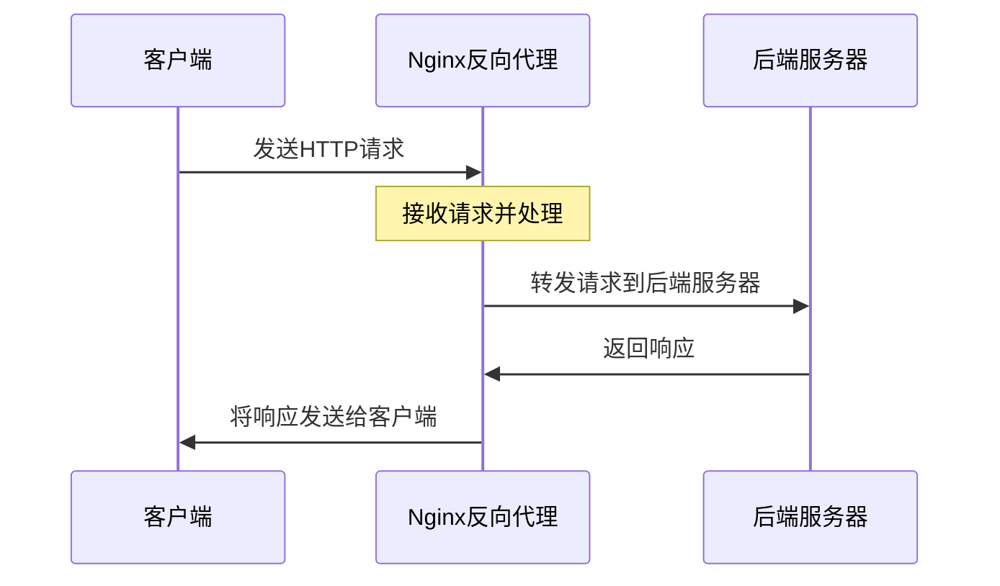
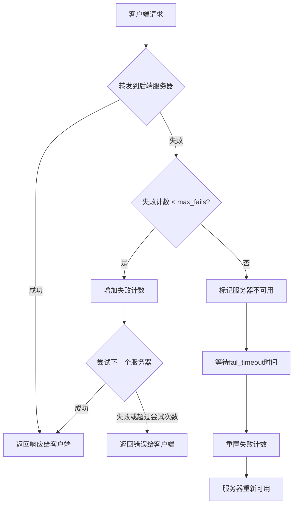
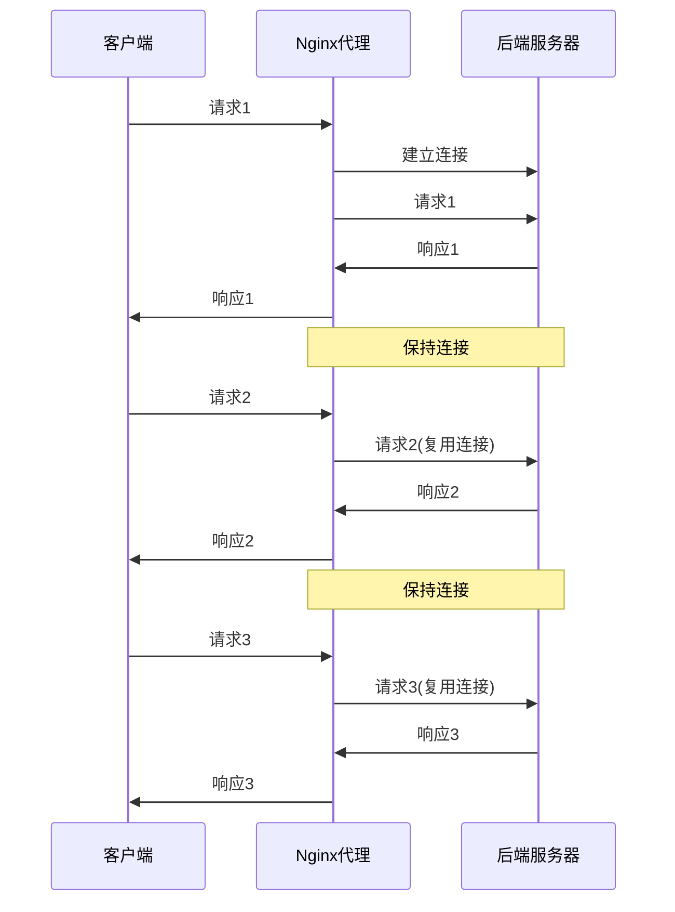

# 反向代理与负载均衡实现  

反向代理和负载均衡是现代Web架构中不可或缺的组件，它们能够提高系统的可扩展性、可用性和性能。本文将详细介绍如何使用Nginx实现反向代理和负载均衡，从基础配置到高级应用，帮助读者构建高效、可靠的Web服务架构。

## 1. 反向代理基础配置  

反向代理是一种服务器架构，它接收客户端请求并将其转发到后端服务器，然后将后端服务器的响应返回给客户端。客户端只与反向代理服务器通信，不直接接触后端服务器。

### 1.1 基本代理设置  

下面是一个基本的反向代理配置示例：

```nginx:c:\project\kphub\conf\proxy_basic.conf  
# 定义后端服务器组
upstream backend_server {  
    server 192.168.1.101:8080;  # 后端服务器地址和端口
}  

# 配置反向代理服务器
server {  
    listen 80;                  # 监听的端口
    server_name proxy.example.com;  # 服务器域名
    
    # 访问日志配置
    access_log logs/proxy.access.log main;
    error_log logs/proxy.error.log warn;

    # 所有请求都转发到后端服务器
    location / {  
        proxy_pass http://backend_server;  # 指向后端服务器组
        
        # 传递原始请求头信息
        proxy_set_header Host $host;  # 传递原始Host头
        proxy_set_header X-Real-IP $remote_addr;  # 传递客户端真实IP
        
        # 基本超时设置
        proxy_connect_timeout 5s;  # 连接超时
        proxy_send_timeout 10s;    # 发送超时
        proxy_read_timeout 10s;    # 读取超时
    }  
}  
```  

**配置说明**：

1. **upstream 块**：定义一组后端服务器，可以包含一个或多个服务器。
2. **server 块**：定义虚拟主机，监听特定端口和域名。
3. **location / 块**：匹配所有请求路径，并将请求转发到后端服务器。
4. **proxy_pass 指令**：指定请求转发的目标地址，可以是一个服务器或一个upstream组。
5. **proxy_set_header 指令**：设置或修改发送到后端服务器的请求头。

**工作流程**：



### 1.2 代理头信息处理  

正确处理HTTP头信息对于反向代理至关重要，特别是在多层代理或需要保留客户端信息的场景中。

```nginx:c:\project\kphub\conf\proxy_headers.conf  
# 全局代理头信息配置，可以包含在http块中

# 启用HTTP/1.1支持
proxy_http_version 1.1;  

# 清空Connection头，允许保持长连接
proxy_set_header Connection "";  

# 传递客户端真实IP和代理链信息
proxy_set_header X-Real-IP $remote_addr;  
proxy_set_header X-Forwarded-For $proxy_add_x_forwarded_for;  

# 传递原始协议信息(http/https)
proxy_set_header X-Forwarded-Proto $scheme;  

# 传递原始主机名
proxy_set_header Host $host;  

# 传递原始URI
proxy_set_header X-Original-URI $request_uri;  

# 传递SSL客户端证书信息(如果有)
proxy_set_header X-SSL-Client-Cert $ssl_client_cert;  

# 设置代理缓冲区
proxy_buffering on;
proxy_buffer_size 4k;
proxy_buffers 8 8k;
proxy_busy_buffers_size 16k;
```  

**重要头信息说明**：

1. **X-Real-IP**：客户端的真实IP地址。
2. **X-Forwarded-For**：包含请求经过的所有代理服务器的IP地址列表。
3. **X-Forwarded-Proto**：客户端连接到代理服务器时使用的协议（HTTP或HTTPS）。
4. **Host**：原始请求的主机名。
5. **Connection**：设置为空字符串，允许保持长连接。

**X-Forwarded-For 工作原理**：

```
客户端(1.2.3.4) -> 代理1 -> 代理2 -> 后端服务器
```

在后端服务器看到的X-Forwarded-For头：
```
X-Forwarded-For: 1.2.3.4, 代理1的IP, 代理2的IP
```

**使用场景**：

- 多层代理架构中保留客户端信息
- 基于客户端IP的访问控制
- 日志记录真实客户端信息
- SSL终端代理后保留协议信息

## 2. 负载均衡策略实现  

负载均衡是将工作负载分布到多个服务器的技术，可以提高应用系统的可用性和可扩展性。

### 2.1 多节点负载均衡  

以下是一个基本的负载均衡配置示例：

```nginx:c:\project\kphub\conf\load_balance.conf  
# 定义上游服务器组
upstream app_cluster {  
    # 默认使用轮询策略  
    server 192.168.1.101:8000;      # 节点1
    server 192.168.1.102:8000;      # 节点2
    server 192.168.1.103:8000 backup;  # 备用节点，仅在其他节点不可用时使用
    
    # 健康检查配置
    server 192.168.1.104:8000 max_fails=3 fail_timeout=30s;  # 3次失败后，30秒内不再尝试
    
    # 加权配置
    server 192.168.1.105:8000 weight=3;  # 权重为3，接收3倍的请求
    
    # 连接限制
    server 192.168.1.106:8000 max_conns=100;  # 最大并发连接数为100
    
    # 慢启动时间
    server 192.168.1.107:8000 slow_start=30s;  # 30秒内逐渐增加转发的请求数(仅商业版)
    
    # 启用保持长连接
    keepalive 32;  # 每个worker进程保持的空闲连接数
}  

# 使用负载均衡集群
server {
    listen 80;
    server_name www.example.com;
    
    location / {
        proxy_pass http://app_cluster;
        proxy_http_version 1.1;
        proxy_set_header Connection "";
        
        # 设置代理超时
        proxy_connect_timeout 5s;
        proxy_send_timeout 10s;
        proxy_read_timeout 10s;
    }
}
```  

**服务器参数说明**：

1. **weight**：权重，默认为1，权重越高分配的请求越多。
2. **max_fails**：允许请求失败的次数，超过后暂时认为服务器不可用。
3. **fail_timeout**：服务器被认为不可用的时间段。
4. **backup**：备份服务器，仅在主服务器不可用时使用。
5. **down**：标记服务器永久不可用。
6. **max_conns**：限制到服务器的最大并发连接数。
7. **slow_start**：慢启动时间，在此期间逐渐增加转发的请求数(仅商业版)。

### 2.2 负载均衡算法对比  

Nginx提供了多种负载均衡算法，适用于不同的场景：

| 算法         | 配置指令           | 适用场景               | 优点                 | 缺点                 |
|--------------|-------------------|-----------------------|---------------------|---------------------|
| 轮询         | 默认              | 各服务器性能均衡       | 实现简单，请求均匀分布 | 不考虑服务器负载情况 |
| 加权轮询     | weight=n         | 服务器性能差异较大     | 可根据服务器性能分配负载 | 静态权重，不能动态调整 |
| IP哈希       | ip_hash          | 需要会话保持           | 同一客户端请求固定转发到同一服务器 | 负载可能不均衡 |
| 最少连接     | least_conn       | 长连接服务             | 动态分配，避免服务器过载 | 需要跟踪连接状态 |
| 通用哈希     | hash $variable   | 特定内容路由           | 可基于任意变量进行哈希 | 配置复杂，可能导致不均衡 |
| 随机         | random           | 大规模部署             | 简单高效，适合大量服务器 | 短期内可能不均衡 |
| 最少时间     | least_time       | 对延迟敏感的应用(仅商业版) | 考虑响应时间，更智能 | 仅商业版支持 |

**算法选择指南**：

1. **默认轮询**：适用于服务器配置相近，且请求处理时间相对一致的场景。
2. **加权轮询**：当服务器性能不同时，可以根据服务器性能设置权重。
3. **IP哈希**：适用于需要会话保持的应用，如购物车、游戏状态等。
4. **最少连接**：适用于请求处理时间差异较大的场景，避免某些服务器过载。
5. **通用哈希**：可以基于URL、请求参数等进行哈希，适用于缓存服务器。

**负载均衡算法配置示例**：

```nginx:c:\project\kphub\conf\load_balance_algorithms.conf
# 轮询(默认)
upstream round_robin {
    server 192.168.1.101:8000;
    server 192.168.1.102:8000;
    # 不需要额外指令
}

# 加权轮询
upstream weighted_round_robin {
    server 192.168.1.101:8000 weight=3;  # 权重为3
    server 192.168.1.102:8000;           # 默认权重为1
    server 192.168.1.103:8000 weight=2;  # 权重为2
}

# IP哈希
upstream ip_hash {
    ip_hash;  # 启用IP哈希
    server 192.168.1.101:8000;
    server 192.168.1.102:8000;
}

# 最少连接
upstream least_conn {
    least_conn;  # 启用最少连接
    server 192.168.1.101:8000;
    server 192.168.1.102:8000;
}

# 通用哈希(基于URI)
upstream hash {
    hash $request_uri;  # 基于请求URI的哈希
    server 192.168.1.101:8000;
    server 192.168.1.102:8000;
}

# 随机
upstream random {
    random;  # 启用随机选择
    server 192.168.1.101:8000;
    server 192.168.1.102:8000;
}

# 最少时间(仅商业版)
upstream least_time {
    least_time header;  # 基于响应头接收时间
    # 可选值: connect(连接时间), header(响应头时间), last_byte(完整响应时间)
    server 192.168.1.101:8000;
    server 192.168.1.102:8000;
}
```

## 3. 高级代理配置  

高级代理配置可以实现更复杂的路由规则、内容重写和缓存策略，提高系统的灵活性和性能。

### 3.1 动态代理重写  

URL重写和路径修改是反向代理中常见的需求，可以实现API网关、微服务路由等功能。

```nginx:c:\project\kphub\conf\proxy_rewrite.conf  
# 定义上游服务器组
upstream api_gateway {
    server 192.168.1.110:8080;
    server 192.168.1.111:8080;
}

upstream cdn_servers {
    server 192.168.1.120:8080;
    server 192.168.1.121:8080;
}

upstream app_servers {
    server 192.168.1.130:8080;
}

server {
    listen 80;
    server_name api.example.com;
    
    # API路径重写 - 去除/api前缀
    location /api/ {  
        # 重写URL，移除/api前缀
        rewrite ^/api/(.*)$ /$1 break;  
        
        # 转发到API网关
        proxy_pass http://api_gateway;  
        
        # 添加自定义头
        proxy_set_header X-API-Version "1.0";
        
        # 记录原始URI
        proxy_set_header X-Original-URI $request_uri;
    }  
    
    # 静态资源代理 - 直接转发到CDN
    location /static/ {  
        proxy_pass http://cdn_servers;  
        
        # 静态资源缓存控制
        expires 30d;
        add_header Cache-Control "public, max-age=2592000";
        
        # 禁用Cookie
        proxy_cookie_path / "/; secure; HttpOnly; SameSite=strict";
    }  
    
    # 版本化API路由 - 基于URI匹配不同版本
    location ~ ^/v(\d+)/ {
        # $1包含版本号
        proxy_pass http://api_gateway;
        proxy_set_header X-API-Version $1;
    }
    
    # 基于查询参数的路由
    location / {
        if ($arg_version) {
            proxy_pass http://api_gateway;
            proxy_set_header X-API-Version $arg_version;
        }
        
        # 默认路由
        proxy_pass http://app_servers;
    }
    
    # 基于请求方法的路由
    location /resources/ {
        if ($request_method = GET) {
            proxy_pass http://cdn_servers;
        }
        
        if ($request_method ~ ^(POST|PUT|DELETE)$) {
            proxy_pass http://api_gateway;
        }
    }
    
    # 请求体修改(需要第三方模块)
    # location /transform/ {
    #     proxy_pass http://api_gateway;
    #     
    #     # 使用Lua或其他模块修改请求体
    #     rewrite_by_lua_block {
    #         ngx.req.read_body()
    #         local body = ngx.req.get_body_data()
    #         -- 修改body
    #         ngx.req.set_body_data(modified_body)
    #     }
    # }
}
```  

**重写技术说明**：

1. **rewrite指令**：使用正则表达式匹配和替换URI。
   - `break` 参数：停止处理当前rewrite指令集。
   - `last` 参数：停止处理当前rewrite指令集并重新开始匹配location。
   - `redirect` 参数：返回302临时重定向。
   - `permanent` 参数：返回301永久重定向。

2. **proxy_pass与URI**：
   - 当`proxy_pass`包含URI部分时，匹配的location部分会被替换。
   - 当`proxy_pass`不包含URI部分时，完整的请求URI会被传递。

3. **条件判断**：
   - 使用`if`指令基于各种条件进行路由。
   - 可以基于请求方法、查询参数、请求头等进行判断。

4. **变量捕获**：
   - 使用正则表达式捕获组`()`捕获URI的部分内容。
   - 通过`$1`, `$2`等变量引用捕获的内容。

### 3.2 代理缓存配置  

Nginx的代理缓存功能可以缓存后端服务器的响应，减轻后端负载并提高响应速度。

```nginx:c:\project\kphub\conf\proxy_cache.conf  
# 定义缓存区域
proxy_cache_path /data/nginx/cache  # 缓存存储路径
                 levels=1:2         # 缓存目录层级，提高文件系统性能
                 keys_zone=my_cache:10m  # 缓存区名称和元数据大小
                 max_size=10g       # 缓存最大大小
                 inactive=60m       # 未被访问文件在缓存中保留时间
                 use_temp_path=off; # 禁用临时文件路径，提高性能

# 定义缓存键
map $request_method $cache_key {
    default         "$scheme$request_method$host$request_uri";
    "GET|HEAD"      "$scheme$host$request_uri$is_args$args";
}

server {  
    listen 80;
    server_name cache.example.com;
    
    # 全局缓存设置
    proxy_cache my_cache;  # 使用定义的缓存区域
    proxy_cache_key $cache_key;  # 缓存键
    proxy_cache_valid 200 302 10m;  # 成功响应缓存10分钟
    proxy_cache_valid 404 1m;       # 404响应缓存1分钟
    proxy_cache_use_stale error timeout updating http_500 http_502 http_503 http_504;  # 后端出错时使用过期缓存
    proxy_cache_lock on;  # 防止缓存雪崩
    proxy_cache_background_update on;  # 后台更新过期缓存
    
    # 添加缓存状态头
    add_header X-Cache-Status $upstream_cache_status;
    
    # 基本路径 - 应用缓存
    location / {  
        proxy_pass http://backend;
    }
    
    # API路径 - 有条件缓存
    location /api/ {
        proxy_pass http://api_backend;
        
        # 只缓存GET和HEAD请求
        proxy_cache_methods GET HEAD;
        
        # 根据请求头决定是否缓存
        proxy_cache_bypass $http_cache_control;
        
        # 不同的API端点有不同的缓存时间
        location ~ ^/api/products {
            proxy_cache_valid 200 30m;  # 产品信息缓存30分钟
        }
        
        location ~ ^/api/prices {
            proxy_cache_valid 200 5m;   # 价格信息缓存5分钟
        }
    }
    
    # 静态资源 - 长时间缓存
    location /static/ {
        proxy_pass http://static_backend;
        proxy_cache_valid 200 24h;  # 缓存24小时
        
        # 添加缓存控制头
        add_header Cache-Control "public, max-age=86400";
    }
    
    # 清除缓存的特殊端点(需要适当的访问控制)
    location /purge/ {
        allow 127.0.0.1;  # 只允许本地访问
        allow 192.168.0.0/16;  # 允许内部网络
        deny all;  # 拒绝其他所有访问
        
        proxy_cache_purge $cache_key;  # 清除缓存
    }
}  
```  

**缓存配置说明**：

1. **proxy_cache_path**：定义缓存存储的位置和参数。
   - `levels`：缓存目录的层级结构，提高文件系统性能。
   - `keys_zone`：缓存区名称和元数据内存大小。
   - `max_size`：缓存的最大大小。
   - `inactive`：未被访问的缓存项保留时间。

2. **proxy_cache_key**：定义缓存键，决定如何识别缓存项。

3. **proxy_cache_valid**：定义不同响应状态码的缓存时间。

4. **proxy_cache_use_stale**：当后端出错时使用过期缓存，提高可用性。

5. **proxy_cache_lock**：防止缓存雪崩，同一时间只允许一个请求更新缓存。

6. **X-Cache-Status**：添加缓存状态头，可能的值包括：
   - `MISS`：未命中缓存，从后端获取。
   - `HIT`：命中缓存。
   - `EXPIRED`：缓存已过期，从后端获取。
   - `UPDATING`：缓存正在更新，返回旧版本。
   - `STALE`：使用过期缓存（因为后端出错）。
   - `BYPASS`：绕过缓存，直接从后端获取。

**缓存策略最佳实践**：

1. **合理设置缓存大小**：根据服务器内存和磁盘空间设置适当的缓存大小。
2. **差异化缓存时间**：根据内容更新频率设置不同的缓存时间。
3. **使用缓存键变量**：根据实际需求定制缓存键，避免不必要的缓存重复。
4. **实现缓存清除机制**：提供安全的缓存清除机制，用于内容更新时。
5. **监控缓存效率**：通过日志和监控工具跟踪缓存命中率。

## 4. 健康检查机制  

健康检查是负载均衡系统的关键组件，它能够检测后端服务器的状态，确保请求只转发到健康的服务器。

### 4.1 被动健康检查  

被动健康检查是Nginx开源版本支持的基本健康检查机制，它基于请求处理的结果来判断服务器健康状态。

```nginx:c:\project\kphub\conf\health_check.conf  
upstream backend {  
    # 服务器1：最多3次失败，失败后30秒内不再尝试
    server 192.168.1.101:8000 max_fails=3 fail_timeout=30s;  
    
    # 服务器2：最多2次失败，失败后20秒内不再尝试
    server 192.168.1.102:8000 max_fails=2 fail_timeout=20s;  
    
    # 服务器3：不进行健康检查
    server 192.168.1.103:8000;
    
    # 备份服务器：只在其他服务器不可用时使用
    server 192.168.1.104:8000 backup;
}  

server {
    listen 80;
    server_name example.com;
    
    # 自定义错误页面
    error_page 500 502 503 504 /50x.html;
    
    location / {
        proxy_pass http://backend;
        
        # 设置超时参数
        proxy_connect_timeout 5s;  # 连接超时
        proxy_read_timeout 10s;    # 读取超时
        proxy_send_timeout 10s;    # 发送超时
        
        # 错误处理
        proxy_next_upstream error timeout http_500 http_502 http_503 http_504;
        proxy_next_upstream_timeout 10s;  # 尝试下一个上游的总超时
        proxy_next_upstream_tries 3;      # 最多尝试3次
    }
    
    # 自定义健康检查端点
    location = /health_check {
        access_log off;  # 不记录访问日志
        
        # 返回200状态码
        return 200 "OK\n";
    }
}
```  

**被动健康检查参数说明**：

1. **max_fails**：允许请求失败的次数，超过后暂时认为服务器不可用。
2. **fail_timeout**：服务器被认为不可用的时间段，同时也是检测失败尝试的时间段。
3. **proxy_next_upstream**：定义什么情况下请求应该传递给下一个服务器。
   - `error`：与服务器建立连接或在传递请求时发生错误。
   - `timeout`：连接、发送或读取超时。
   - `invalid_header`：服务器返回空或无效响应。
   - `http_500`/`http_502`/`http_503`/`http_504`：服务器返回特定错误码。
   - `non_idempotent`：允许对非幂等方法(POST, PATCH)重试。
4. **proxy_next_upstream_timeout**：将请求传递给下一个服务器的总超时时间。
5. **proxy_next_upstream_tries**：尝试将请求传递给下一个服务器的最大次数。

**被动健康检查工作流程**：



### 4.2 主动健康检查（商业版）  

Nginx Plus（商业版）提供了主动健康检查功能，它会定期发送请求到后端服务器，主动检测服务器状态。

```nginx:c:\project\kphub\conf\health_check_plus.conf  
# 定义共享内存区域，用于存储服务器状态
upstream backend {  
    zone backend 64k;  # 定义共享内存区域，用于存储服务器状态
    
    server 192.168.1.101:8000;  
    server 192.168.1.102:8000;  

    # 主动健康检查配置
    health_check interval=5s      # 检查间隔
                  passes=3        # 连续成功次数，标记为健康
                  fails=2         # 连续失败次数，标记为不健康
                  uri=/health_check  # 健康检查URI
                  match=health;   # 使用自定义匹配条件
}  

# 定义健康检查匹配条件
match health {
    status 200-399;              # 状态码范围
    header Content-Type ~ text/html;  # 响应头匹配
    body ~ "OK";                 # 响应体匹配
}

# 定义另一个使用TCP健康检查的上游组
upstream tcp_backend {
    zone tcp_backend 64k;
    server 192.168.1.201:5000;
    server 192.168.1.202:5000;
    
    # TCP健康检查
    health_check type=tcp
                 interval=10s
                 passes=2
                 fails=3;
}

# 定义使用SSL健康检查的上游组
upstream ssl_backend {
    zone ssl_backend 64k;
    server 192.168.1.301:443;
    server 192.168.1.302:443;
    
    # HTTPS健康检查
    health_check type=https
                 interval=30s
                 uri=/secure/health
让我继续编写反向代理与负载均衡实现的内容：

### 4.2 主动健康检查（商业版）（续）

```nginx:c:\project\kphub\conf\health_check_plus.conf
    # HTTPS健康检查
    health_check type=https
                 interval=30s
                 uri=/secure/health
                 port=8443        # 使用不同端口进行健康检查
                 ssl_verify=on;   # 验证SSL证书
}

# 使用健康检查的服务器配置
server {
    listen 80;
    server_name health.example.com;
    
    # 状态监控页面
    location /status {
        status;  # Nginx Plus状态页面
        
        # 限制访问
        allow 127.0.0.1;
        allow 192.168.0.0/16;
        deny all;
    }
    
    # API端点
    location /api/ {
        proxy_pass http://backend;
    }
    
    # TCP代理
    location /tcp/ {
        proxy_pass http://tcp_backend;
    }
    
    # 安全API
    location /secure/ {
        proxy_pass https://ssl_backend;
    }
}
```

**主动健康检查参数说明**：

1. **zone**：定义共享内存区域，用于存储服务器状态信息。
2. **health_check**：配置主动健康检查。
   - `interval`：检查间隔时间。
   - `passes`：连续成功次数，达到后标记为健康。
   - `fails`：连续失败次数，达到后标记为不健康。
   - `uri`：健康检查请求的URI。
   - `match`：匹配条件，用于判断响应是否表示健康。
   - `type`：健康检查类型（http、https、tcp、udp等）。
   - `port`：健康检查使用的端口，可以与服务端口不同。

3. **match**：定义健康检查响应的匹配条件。
   - `status`：HTTP状态码范围。
   - `header`：响应头匹配。
   - `body`：响应体匹配。

**主动健康检查与被动健康检查对比**：

| 特性 | 被动健康检查 | 主动健康检查 |
|------|------------|------------|
| 可用版本 | 开源版和商业版 | 仅商业版(Nginx Plus) |
| 检查方式 | 基于实际请求结果 | 定期发送专门的检查请求 |
| 检测速度 | 依赖于实际流量 | 独立于流量，更快检测故障 |
| 配置复杂度 | 简单 | 较复杂 |
| 资源消耗 | 低 | 较高 |
| 适用场景 | 高流量、简单检测 | 低流量、精确检测 |

### 4.3 自定义健康检查实现

对于开源版Nginx，可以通过组合其他功能实现类似主动健康检查的效果：

```nginx:c:\project\kphub\conf\custom_health_check.conf
# 定义共享内存区域，用于存储健康检查状态
lua_shared_dict healthcheck 1m;

# 初始化健康检查
init_worker_by_lua_block {
    local healthcheck = require "resty.healthcheck"
    local checker = healthcheck.new({
        name = "backend_healthcheck",
        shm_name = "healthcheck",
        checks = {
            active = {
                type = "http",
                http_path = "/health",
                healthy = {
                    interval = 5,
                    successes = 2
                },
                unhealthy = {
                    interval = 2,
                    http_failures = 3
                }
            }
        }
    })
    
    -- 添加后端服务器
    checker:add_target("192.168.1.101", 8000)
    checker:add_target("192.168.1.102", 8000)
}

# 使用健康检查结果
upstream backend {
    server 192.168.1.101:8000;
    server 192.168.1.102:8000;
    
    balancer_by_lua_block {
        local healthcheck = require "resty.healthcheck"
        local balancer = require "ngx.balancer"
        
        -- 获取健康的服务器
        local checker = healthcheck.get_checker("backend_healthcheck")
        local healthy_hosts = checker:get_healthy_hosts()
        
        if #healthy_hosts > 0 then
            -- 随机选择一个健康的服务器
            local index = math.random(#healthy_hosts)
            local host = healthy_hosts[index]
            balancer.set_current_peer(host.ip, host.port)
        else
            -- 所有服务器都不健康，返回错误
            ngx.status = 503
            ngx.say("Service Unavailable")
            ngx.exit(503)
        }
    }
}

# 定时健康检查脚本
server {
    listen 8080;
    server_name localhost;
    
    location /check_health {
        content_by_lua_block {
            local http = require "resty.http"
            local cjson = require "cjson"
            
            local backends = {
                { host = "192.168.1.101", port = 8000 },
                { host = "192.168.1.102", port = 8000 }
            }
            
            local results = {}
            
            for _, backend in ipairs(backends) do
                local httpc = http.new()
                httpc:set_timeout(5000)
                
                local res, err = httpc:request_uri("http://" .. backend.host .. ":" .. backend.port .. "/health", {
                    method = "GET",
                    headers = {
                        ["User-Agent"] = "Nginx Health Check"
                    }
                })
                
                if res and res.status == 200 then
                    results[backend.host .. ":" .. backend.port] = "healthy"
                else
                    results[backend.host .. ":" .. backend.port] = "unhealthy"
                end
            end
            
            ngx.header.content_type = "application/json"
            ngx.say(cjson.encode(results))
        }
    }
}
```

**注意**：上述自定义健康检查实现需要安装OpenResty或Nginx with Lua模块。

## 5. 安全防护配置  

反向代理是实现Web应用安全防护的重要一环，可以在不修改应用代码的情况下提供额外的安全层。

### 5.1 代理层防护  

```nginx:c:\project\kphub\conf\proxy_security.conf  
# 定义限制区域
# 限制请求速率 - 每个IP每秒最多10个请求，突发允许20个
limit_req_zone $binary_remote_addr zone=proxy_limit:10m rate=10r/s;  

# 限制连接数 - 每个IP最多5个并发连接
limit_conn_zone $binary_remote_addr zone=conn_limit:10m;

# 定义IP黑名单
geo $bad_guys {
    default 0;
    192.168.1.1 1;  # 标记为恶意IP
    192.168.1.2 1;
    10.0.0.0/24 1;  # 封禁整个子网
}

# 定义允许的引用来源
map $http_referer $bad_referer {
    default 1;
    "~*example.com" 0;  # 允许的引用来源
    "~*google.com" 0;
    "~*baidu.com" 0;
    "" 0;  # 允许空引用
}

server {
    listen 80;
    server_name secure.example.com;
    
    # 全局安全头
    add_header X-Content-Type-Options "nosniff" always;
    add_header X-Frame-Options "SAMEORIGIN" always;
    add_header X-XSS-Protection "1; mode=block" always;
    add_header Referrer-Policy "strict-origin-when-cross-origin" always;
    
    # 拒绝黑名单IP
    if ($bad_guys) {
        return 403 "Forbidden";
    }
    
    # 基本路径 - 应用限制
    location / {  
        # 应用请求速率限制
        limit_req zone=proxy_limit burst=20 nodelay;  
        
        # 应用连接数限制
        limit_conn conn_limit 5;
        
        # 转发到后端
        proxy_pass http://backend;
        
        # 超时设置
        proxy_connect_timeout 5s;
        proxy_send_timeout 10s;
        proxy_read_timeout 10s;
        
        # 缓冲设置
        proxy_buffer_size 4k;
        proxy_buffers 8 16k;
        
        # 禁止某些User-Agent
        if ($http_user_agent ~* (curl|wget|nmap|nikto|sqlmap|libwww|python|perl)) {
            return 403;
        }
        
        # 拒绝非法引用
        if ($bad_referer) {
            return 403;
        }
    }
    
    # 敏感路径 - 更严格的限制
    location /admin/ {
        # 更严格的速率限制
        limit_req zone=proxy_limit burst=5;
        
        # IP白名单
        allow 127.0.0.1;
        allow 192.168.0.0/16;
        deny all;
        
        # 转发到后端
        proxy_pass http://backend;
        
        # 基本认证
        auth_basic "Restricted Area";
        auth_basic_user_file /etc/nginx/htpasswd;
    }
    
    # 防止SQL注入和XSS攻击的基本过滤
    location ~ \.php$ {
        # 拒绝包含可疑SQL注入模式的请求
        if ($query_string ~* "union.*select.*\(") {
            return 403;
        }
        if ($query_string ~* "concat.*\(") {
            return 403;
        }
        
        # 拒绝包含可疑XSS模式的请求
        if ($query_string ~* "<script.*>") {
            return 403;
        }
        
        proxy_pass http://backend;
    }
    
    # 防止目录遍历
    location ~ \.(git|svn|hg|bzr)/ {
        deny all;
        return 404;
    }
    
    # 保护敏感文件
    location ~ \.(bak|config|sql|fla|psd|ini|log|sh|inc|swp|dist|env)$ {
        deny all;
        return 404;
    }
}
```  

**安全防护措施说明**：

1. **请求限制**：
   - `limit_req_zone`和`limit_req`：限制请求速率，防止暴力攻击。
   - `limit_conn_zone`和`limit_conn`：限制并发连接数，防止资源耗尽。

2. **IP控制**：
   - `geo`：基于客户端IP地址创建变量，用于黑名单或白名单。
   - `allow`/`deny`：控制特定IP或网段的访问权限。

3. **内容过滤**：
   - 使用正则表达式过滤可疑请求参数，防止SQL注入和XSS攻击。
   - 过滤特定User-Agent，阻止自动化工具。
   - 控制引用来源，防止资源盗链。

4. **安全头**：
   - `X-Content-Type-Options`：防止MIME类型嗅探。
   - `X-Frame-Options`：防止点击劫持。
   - `X-XSS-Protection`：启用浏览器XSS过滤。
   - `Referrer-Policy`：控制引用信息的发送。

5. **访问控制**：
   - `auth_basic`：启用HTTP基本认证。
   - 路径限制：对敏感路径实施更严格的访问控制。

### 5.2 SSL终端代理  

SSL终端代理（SSL Termination）是指在反向代理服务器上处理SSL/TLS连接，然后使用非加密连接与后端服务器通信。

```nginx:c:\project\kphub\conf\proxy_ssl.conf  
# HTTPS服务器配置
server {  
    listen 443 ssl http2;  # 监听443端口，启用SSL和HTTP/2
    server_name secure.example.com;  
    
    # SSL证书配置
    ssl_certificate /path/to/cert.pem;  # SSL证书路径
    ssl_certificate_key /path/to/key.pem;  # SSL私钥路径
    ssl_trusted_certificate /path/to/chain.pem;  # 信任链证书
    
    # 现代SSL配置
    ssl_protocols TLSv1.2 TLSv1.3;  # 只使用TLS 1.2和1.3
    ssl_ciphers 'ECDHE-ECDSA-AES128-GCM-SHA256:ECDHE-RSA-AES128-GCM-SHA256:ECDHE-ECDSA-AES256-GCM-SHA384:ECDHE-RSA-AES256-GCM-SHA384:ECDHE-ECDSA-CHACHA20-POLY1305:ECDHE-RSA-CHACHA20-POLY1305:DHE-RSA-AES128-GCM-SHA256:DHE-RSA-AES256-GCM-SHA384';  # 安全的密码套件
    ssl_prefer_server_ciphers on;  # 优先使用服务器的密码套件
    
    # DH参数（提高密钥交换安全性）
    ssl_dhparam /path/to/dhparam.pem;  # DH参数文件
    
    # OCSP Stapling
    ssl_stapling on;  # 启用OCSP Stapling
    ssl_stapling_verify on;  # 验证OCSP响应
    resolver 8.8.8.8 8.8.4.4 valid=300s;  # DNS解析器
    resolver_timeout 5s;  # 解析超时
    
    # SSL会话缓存
    ssl_session_cache shared:SSL:10m;  # 共享SSL会话缓存
    ssl_session_timeout 1d;  # 会话超时时间
    ssl_session_tickets off;  # 禁用会话票证
    
    # HSTS (HTTP Strict Transport Security)
    add_header Strict-Transport-Security "max-age=63072000; includeSubDomains; preload" always;  # 启用HSTS
    
    # 转发到后端（使用HTTP）
    location / {  
        proxy_pass http://backend;  # 后端使用HTTP
        
        # 传递原始协议信息
        proxy_set_header X-Forwarded-Proto https;  # 告知后端原始协议为HTTPS
        proxy_set_header X-Forwarded-Ssl on;  # 告知后端SSL已启用
        
        # 其他代理头
        proxy_set_header Host $host;
        proxy_set_header X-Real-IP $remote_addr;
        proxy_set_header X-Forwarded-For $proxy_add_x_forwarded_for;
    }
    
    # 转发到后端（使用HTTPS）
    location /secure/ {
        proxy_pass https://secure_backend;  # 后端使用HTTPS
        
        # SSL客户端证书
        proxy_ssl_certificate /path/to/client.pem;  # 客户端证书
        proxy_ssl_certificate_key /path/to/client.key;  # 客户端私钥
        
        # 验证后端服务器证书
        proxy_ssl_verify on;  # 启用验证
        proxy_ssl_verify_depth 2;  # 验证深度
        proxy_ssl_trusted_certificate /path/to/trusted_ca.pem;  # 信任的CA证书
        
        # 其他SSL选项
        proxy_ssl_protocols TLSv1.2 TLSv1.3;  # SSL协议版本
        proxy_ssl_ciphers HIGH:!aNULL:!MD5;  # 密码套件
        proxy_ssl_session_reuse on;  # 重用SSL会话
    }
}  

# HTTP重定向到HTTPS
server {
    listen 80;
    server_name secure.example.com;
    
    # 永久重定向到HTTPS
    return 301 https://$host$request_uri;
}
```  

**SSL终端代理优势**：

1. **性能优化**：
   - 减轻后端服务器的SSL处理负担。
   - 集中管理SSL证书和配置。
   - 启用HTTP/2等现代协议，无需后端支持。

2. **安全增强**：
   - 在代理层实施统一的安全策略。
   - 使用最新的SSL/TLS配置，即使后端不支持。
   - 简化证书更新和安全漏洞修复。

3. **灵活性**：
   - 支持不同后端使用不同的协议（HTTP/HTTPS）。
   - 可以根据路径或其他条件选择不同的SSL配置。
   - 简化后端服务器的配置和管理。

**SSL配置最佳实践**：

1. **使用强密码套件**：只使用安全的密码套件，禁用弱加密算法。
2. **启用OCSP Stapling**：减少证书验证延迟，提高性能。
3. **配置适当的会话缓存**：减少握手次数，提高性能。
4. **启用HSTS**：强制客户端使用HTTPS连接。
5. **定期更新证书**：使用自动化工具如Certbot定期更新SSL证书。
6. **使用足够长的DH参数**：推荐使用2048位或更长的DH参数。

## 6. 性能优化技巧  

反向代理的性能直接影响整个系统的响应速度和吞吐量，合理的性能优化可以显著提升用户体验。

### 6.1 连接池优化  

连接池优化可以减少连接建立和断开的开销，提高请求处理效率。

```nginx:c:\project\kphub\conf\proxy_performance.conf  
# 全局性能优化设置

# 工作进程配置
worker_processes auto;  # 自动检测CPU核心数
worker_rlimit_nofile 65535;  # 每个进程的最大文件描述符数量

# 事件模块配置
events {
    use epoll;  # 使用epoll事件模型（Linux）
    worker_connections 10240;  # 每个工作进程的最大连接数
    multi_accept on;  # 一次接受多个连接
}

http {
    # 基本优化
    sendfile on;  # 启用sendfile
    tcp_nopush on;  # 启用TCP_NOPUSH
    tcp_nodelay on;  # 启用TCP_NODELAY
    
    # 代理连接超时设置
    proxy_connect_timeout 5s;  # 连接超时
    proxy_send_timeout 10s;  # 发送超时
    proxy_read_timeout 30s;  # 读取超时
    
    # 代理缓冲区设置
    proxy_buffer_size 4k;  # 代理响应头缓冲区大小
    proxy_buffers 8 16k;  # 代理响应体缓冲区大小和数量
    proxy_busy_buffers_size 32k;  # 忙碌缓冲区大小
    proxy_temp_file_write_size 64k;  # 临时文件写入大小
    
    # 代理缓存设置
    proxy_cache_path /data/nginx/cache levels=1:2 keys_zone=proxy_cache:10m max_size=10g inactive=60m;
    proxy_cache_key "$scheme$host$request_uri";
    proxy_cache_valid 200 302 10m;
    proxy_cache_valid 404 1m;
    
    # 文件描述符缓存
    open_file_cache max=1000 inactive=20s;
    open_file_cache_valid 30s;
    open_file_cache_min_uses 2;
    open_file_cache_errors on;
    
    # 上游服务器组
    upstream backend {
        server 192.168.1.101:8000;
        server 192.168.1.102:8000;
        
        # 连接池设置
        keepalive 32;  # 每个工作进程保持的空闲连接数
        keepalive_requests 1000;  # 每个连接上可处理的请求数
        keepalive_timeout 60s;  # 空闲连接的超时时间
    }
    
    # 服务器配置
    server {
        listen 80;
        server_name performance.example.com;
        
        # 启用gzip压缩
        gzip on;
        gzip_min_length 1000;
        gzip_types text/plain text/css application/json application/javascript;
        
        # 代理设置
        location / {
            proxy_pass http://backend;
            
            # 启用缓存
            proxy_cache proxy_cache;
            add_header X-Cache-Status $upstream_cache_status;
            
            # 启用缓冲
            proxy_buffering on;
            
            # 连接优化
            proxy_http_version 1.1;
            proxy_set_header Connection "";
        }
        
        # 静态文件优化
        location ~* \.(jpg|jpeg|png|gif|ico|css|js)$ {
            proxy_pass http://backend;
            proxy_cache proxy_cache;
            proxy_cache_valid 200 24h;
            expires 30d;
            add_header Cache-Control "public, no-transform";
        }
    }
}
```  

**连接池参数说明**：

1. **proxy_connect_timeout**：与后端服务器建立连接的超时时间。
2. **proxy_send_timeout**：向后端服务器传输请求的超时时间。
3. **proxy_read_timeout**：从后端服务器读取响应的超时时间。
4. **proxy_buffer_size**：用于存储后端服务器响应头的缓冲区大小。
5. **proxy_buffers**：用于存储后端服务器响应体的缓冲区数量和大小。
6. **proxy_busy_buffers_size**：在响应未完全读取时可用于向客户端发送数据的缓冲区大小。

**性能优化最佳实践**：

1. **调整工作进程数**：通常设置为CPU核心数。
2. **增加最大文件描述符数**：防止"too many open files"错误。
3. **使用适当的事件模型**：Linux使用epoll，FreeBSD使用kqueue。
4. **启用sendfile和tcp_nopush**：减少数据复制和网络开销。
5. **合理设置缓冲区大小**：根据典型响应大小调整，避免过大或过小。
6. **启用压缩**：减少传输数据量，但会增加CPU使用率。
7. **使用缓存**：缓存频繁访问的内容，减轻后端负载。

### 6.2 Keepalive连接复用  

Keepalive连接可以在多个请求之间复用TCP连接，减少连接建立和断开的开销。

```nginx:c:\project\kphub\conf\proxy_keepalive.conf  
# 上游服务器组配置
upstream backend {  
    server 192.168.1.101:8000;  
    server 192.168.1.102:8000;  
    
    keepalive 32;  # 每个Worker保持的空闲连接数
    keepalive_requests 1000;  # 每个连接上可处理的请求数
    keepalive_timeout 60s;  # 空闲连接的超时时间
}  

server {  
    listen 80;
    server_name keepalive.example.com;
    
    location / {  
        # 启用HTTP/1.1
        proxy_http_version 1.1;  
        
        # 清空Connection头，允许保持长连接
        proxy_set_header Connection "";  
        
        # 转发到后端
        proxy_pass http://backend;
        
        # 其他必要的头信息
        proxy_set_header Host $host;
        proxy_set_header X-Real-IP $remote_addr;
        proxy_set_header X-Forwarded-For $proxy_add_x_forwarded_for;
        proxy_set_header X-Forwarded-Proto $scheme;
    }
    
    # 客户端keepalive设置
    keepalive_timeout 65;  # 客户端连接的keepalive超时
    keepalive_requests 100;  # 单个客户端连接上可处理的请求数
    
    # WebSocket支持
    location /ws/ {
        proxy_pass http://backend;
        proxy_http_version 1.1;
        proxy_set_header Upgrade $http_upgrade;
        proxy_set_header Connection "upgrade";
        proxy_read_timeout 3600s;  # WebSocket连接超时时间
        proxy_send_timeout 3600s;
    }
}  
```  

**Keepalive连接工作原理**：



**Keepalive优化要点**：

1. **合理设置keepalive连接数**：
   - 太小：连接复用效率低，频繁建立新连接。
   - 太大：占用过多资源，可能导致连接耗尽。
   - 建议值：每个工作进程保持的连接数 = 预期并发请求数 / 工作进程数。

2. **设置适当的keepalive_requests**：
   - 控制单个连接上可处理的最大请求数。
   - 防止连接长时间不刷新。
   - 建议值：100-1000之间，根据应用特性调整。

3. **设置合理的keepalive_timeout**：
   - 控制空闲连接的保持时间。
   - 太短：连接复用效率低。
   - 太长：占用资源时间过长。
   - 建议值：30-60秒。

4. **HTTP版本和头信息**：
   - 使用HTTP/1.1支持长连接。
   - 清空Connection头，允许保持长连接。
   - 对于WebSocket，设置Upgrade和Connection头。

## 7. 故障排查指南  

反向代理环境中的故障排查需要系统化的方法和工具，以下是常见问题的排查思路。

### 7.1 常见代理错误  

| 错误代码 | 错误描述 | 可能原因 | 解决方案 |  
|---------|---------|---------|---------|  
| 502     | Bad Gateway | 后端服务不可达或返回无效响应 | 检查后端服务状态、网络连接、防火墙设置 |  
| 504     | Gateway Timeout | 后端响应超时 | 调整proxy_read_timeout、检查后端服务性能问题 |  
| 499     | Client Closed Request | 客户端提前关闭连接 | 检查网络延迟、客户端超时设置、响应时间 |  
| 503     | Service Unavailable | 所有后端服务器不可用 | 检查健康检查配置、增加备用服务器 |
| 400     | Bad Request | 请求格式错误 | 检查客户端请求、代理头信息设置 |
| 413     | Request Entity Too Large | 请求体过大 | 调整client_max_body_size |
| 497     | HTTP to HTTPS | HTTP请求发送到HTTPS端口 | 配置HTTP到HTTPS的重定向 |
让我继续编写反向代理与负载均衡实现的内容：

### 7.1 常见代理错误（续）

**错误排查流程**：

1. **检查错误日志**：
   - 查看Nginx错误日志，了解具体错误信息
   - 检查后端服务器日志，查找可能的原因

2. **检查连接问题**：
   - 验证后端服务器是否正常运行
   - 检查网络连接是否通畅
   - 验证防火墙规则是否允许连接

3. **检查配置问题**：
   - 验证代理配置是否正确
   - 检查超时设置是否合理
   - 验证SSL证书配置（如果使用HTTPS）

4. **检查负载问题**：
   - 监控后端服务器负载
   - 检查是否有资源瓶颈
   - 验证是否需要调整连接池大小

### 7.2 调试日志配置  

配置详细的日志对于排查代理问题至关重要：

```nginx:c:\project\kphub\conf\proxy_debug.conf  
# 启用调试级别的错误日志
error_log logs/proxy_error.log debug;  # 可选级别: debug, info, notice, warn, error, crit, alert, emerg

# 定义详细的访问日志格式
log_format proxy_debug '$remote_addr - $upstream_addr [$time_local] '  
                       '"$request" $status $body_bytes_sent '  
                       '"$http_referer" "$http_user_agent" '
                       '$request_time $upstream_response_time '
                       '$upstream_status $upstream_cache_status';  

# 应用日志格式
server {
    listen 80;
    server_name debug.example.com;
    
    # 使用自定义日志格式
    access_log logs/proxy_access.log proxy_debug;
    
    # 记录上游响应头
    log_format upstream_headers '$remote_addr - $upstream_addr [$time_local] '
                               '"$request" $status '
                               'upstream_http_content_type: "$upstream_http_content_type" '
                               'upstream_http_content_length: "$upstream_http_content_length" '
                               'upstream_http_server: "$upstream_http_server"';
    
    # 特定路径使用详细日志
    location /api/ {
        access_log logs/api_debug.log upstream_headers;
        proxy_pass http://backend;
    }
    
    # 记录请求头和响应头
    location /debug/ {
        # 记录请求头
        log_format req_headers '$remote_addr - [$time_local] '
                              'host: "$http_host" '
                              'user-agent: "$http_user_agent" '
                              'cookie: "$http_cookie" '
                              'authorization: "$http_authorization"';
        
        access_log logs/req_headers.log req_headers;
        
        # 添加响应头，显示调试信息
        add_header X-Debug-Remote-Addr $remote_addr;
        add_header X-Debug-Upstream-Addr $upstream_addr;
        add_header X-Debug-Upstream-Response-Time $upstream_response_time;
        
        proxy_pass http://backend;
    }
    
    # 启用条件日志
    map $status $loggable {
        ~^[23]  0;  # 不记录2xx和3xx状态码
        default 1;  # 记录其他状态码
    }
    
    location /errors/ {
        access_log logs/errors_only.log proxy_debug if=$loggable;
        proxy_pass http://backend;
    }
}

# 请求体和响应体调试（需要第三方模块）
# location /body_debug/ {
#     # 使用echo-nginx-module或lua模块记录请求体
#     access_by_lua_block {
#         ngx.req.read_body()
#         local body = ngx.req.get_body_data()
#         ngx.log(ngx.DEBUG, "Request body: ", body)
#     }
#     
#     # 使用body_filter_by_lua记录响应体
#     body_filter_by_lua_block {
#         local chunk = ngx.arg[1]
#         ngx.log(ngx.DEBUG, "Response chunk: ", chunk)
#     }
#     
#     proxy_pass http://backend;
# }
```  

**日志变量说明**：

1. **基本变量**：
   - `$remote_addr`：客户端IP地址
   - `$time_local`：本地时间
   - `$request`：完整的请求行
   - `$status`：响应状态码
   - `$body_bytes_sent`：发送给客户端的响应体大小

2. **代理相关变量**：
   - `$upstream_addr`：后端服务器地址
   - `$upstream_status`：后端服务器返回的状态码
   - `$upstream_response_time`：后端服务器响应时间
   - `$upstream_cache_status`：缓存状态（HIT, MISS, BYPASS等）
   - `$upstream_http_*`：后端服务器返回的响应头

3. **性能相关变量**：
   - `$request_time`：处理请求的总时间
   - `$upstream_connect_time`：连接后端服务器的时间
   - `$upstream_header_time`：接收后端响应头的时间

**调试技巧**：

1. **使用curl测试**：
   ```bash
   # 基本请求
   curl -v http://debug.example.com/api/test
   
   # 指定方法和数据
   curl -v -X POST -d "data=test" http://debug.example.com/api/test
   
   # 添加自定义头
   curl -v -H "X-Custom-Header: Value" http://debug.example.com/api/test
   
   # 跟踪重定向
   curl -v -L http://debug.example.com/redirect
   ```

2. **使用tcpdump捕获网络流量**：
   ```bash
   # 捕获特定端口的流量
   tcpdump -i any -n port 80 -s 0 -A
   
   # 捕获特定主机的流量
   tcpdump -i any -n host 192.168.1.101 -s 0 -A
   ```

3. **使用netstat检查连接**：
   ```bash
   # 查看所有TCP连接
   netstat -an | findstr "ESTABLISHED"
   
   # 查看特定端口的连接
   netstat -an | findstr ":80"
   ```

### 7.3 高级故障排查工具

除了基本的日志配置外，还可以使用一些高级工具和技术来排查复杂问题：

```nginx:c:\project\kphub\conf\proxy_troubleshooting.conf
# 启用状态监控
server {
    listen 8080;
    server_name localhost;
    
    # 限制只允许内部访问
    allow 127.0.0.1;
    allow 192.168.0.0/16;
    deny all;
    
    # 基本状态页面
    location /nginx_status {
        stub_status on;
        access_log off;
    }
    
    # 自定义状态检查
    location /check_backends {
        default_type application/json;
        
        # 使用Lua或其他模块检查后端状态
        content_by_lua_block {
            local backends = {
                {name = "backend1", host = "192.168.1.101", port = 8000},
                {name = "backend2", host = "192.168.1.102", port = 8000}
            }
            
            local cjson = require "cjson"
            local http = require "resty.http"
            local results = {}
            
            for _, backend in ipairs(backends) do
                local httpc = http.new()
                httpc:set_timeout(1000)
                
                local ok, err = httpc:connect(backend.host, backend.port)
                if not ok then
                    results[backend.name] = {status = "down", error = err}
                else
                    local res, err = httpc:request_uri("http://" .. backend.host .. ":" .. backend.port .. "/health", {
                        method = "GET",
                        headers = {
                            ["User-Agent"] = "Nginx Health Check"
                        }
                    })
                    
                    if res and res.status == 200 then
                        results[backend.name] = {status = "up", response_time = res.times.total}
                    else
                        results[backend.name] = {status = "error", error = err or ("HTTP " .. (res and res.status or "unknown"))}
                    end
                    
                    httpc:close()
                end
            end
            
            ngx.say(cjson.encode(results))
        }
    }
    
    # 请求跟踪
    location /trace {
        # 添加跟踪ID
        set $trace_id $request_id;
        add_header X-Trace-ID $trace_id;
        
        # 传递跟踪ID给后端
        proxy_set_header X-Trace-ID $trace_id;
        
        # 记录详细日志
        log_format trace '$remote_addr - $upstream_addr [$time_local] '
                        '"$request" $status $body_bytes_sent '
                        'trace_id: "$trace_id"';
        
        access_log logs/trace.log trace;
        
        proxy_pass http://backend;
    }
}
```

**故障排查工具和技术**：

1. **状态监控**：
   - `stub_status`：提供基本的Nginx状态信息
   - 自定义状态检查：使用脚本检查后端服务器状态

2. **请求跟踪**：
   - 添加跟踪ID：为每个请求分配唯一ID
   - 传递跟踪ID：将ID传递给后端服务器
   - 记录详细日志：包含跟踪ID的日志

3. **性能分析**：
   - 使用`ngx_http_stub_status_module`监控连接数和请求数
   - 使用第三方模块如`nginx-module-vts`获取更详细的统计信息
   - 使用外部工具如Prometheus和Grafana进行监控和可视化

4. **调试脚本**：

```powershell:c:\project\kphub\scripts\debug_proxy.ps1
# Nginx代理调试脚本

# 检查Nginx配置
function Check-NginxConfig {
    Write-Host "检查Nginx配置..." -ForegroundColor Cyan
    $output = & nginx -t 2>&1
    if ($LASTEXITCODE -eq 0) {
        Write-Host "配置正确" -ForegroundColor Green
        return $true
    } else {
        Write-Host "配置错误:" -ForegroundColor Red
        Write-Host $output
        return $false
    }
}

# 检查后端连接
function Check-BackendConnection {
    param (
        [string]$host,
        [int]$port
    )
    
    Write-Host "检查后端连接 $host:$port..." -ForegroundColor Cyan
    
    try {
        $tcpClient = New-Object System.Net.Sockets.TcpClient
        $connection = $tcpClient.BeginConnect($host, $port, $null, $null)
        $wait = $connection.AsyncWaitHandle.WaitOne(1000, $false)
        
        if ($wait -and $tcpClient.Connected) {
            Write-Host "连接成功" -ForegroundColor Green
            $tcpClient.Close()
            return $true
        } else {
            Write-Host "连接失败" -ForegroundColor Red
            $tcpClient.Close()
            return $false
        }
    } catch {
        Write-Host "连接错误: $_" -ForegroundColor Red
        return $false
    }
}

# 测试代理请求
function Test-ProxyRequest {
    param (
        [string]$url,
        [string]$method = "GET",
        [hashtable]$headers = @{},
        [string]$body = ""
    )
    
    Write-Host "测试代理请求 $method $url..." -ForegroundColor Cyan
    
    try {
        $request = [System.Net.WebRequest]::Create($url)
        $request.Method = $method
        $request.Timeout = 5000
        
        # 添加头信息
        foreach ($key in $headers.Keys) {
            $request.Headers.Add($key, $headers[$key])
        }
        
        # 添加请求体
        if ($body -and ($method -eq "POST" -or $method -eq "PUT")) {
            $bytes = [System.Text.Encoding]::UTF8.GetBytes($body)
            $request.ContentLength = $bytes.Length
            $request.ContentType = "application/x-www-form-urlencoded"
            
            $requestStream = $request.GetRequestStream()
            $requestStream.Write($bytes, 0, $bytes.Length)
            $requestStream.Close()
        }
        
        # 发送请求
        $response = $request.GetResponse()
        $statusCode = [int]$response.StatusCode
        
        # 读取响应
        $responseStream = $response.GetResponseStream()
        $reader = New-Object System.IO.StreamReader($responseStream)
        $responseBody = $reader.ReadToEnd()
        
        # 关闭连接
        $reader.Close()
        $responseStream.Close()
        $response.Close()
        
        # 输出结果
        Write-Host "状态码: $statusCode" -ForegroundColor $(if ($statusCode -ge 200 -and $statusCode -lt 300) { "Green" } else { "Yellow" })
        Write-Host "响应头:"
        foreach ($key in $response.Headers.AllKeys) {
            Write-Host "  $key: $($response.Headers[$key])"
        }
        
        Write-Host "响应体 (前100字符):"
        if ($responseBody.Length -gt 100) {
            Write-Host $responseBody.Substring(0, 100) + "..."
        } else {
            Write-Host $responseBody
        }
        
        return @{
            StatusCode = $statusCode
            Headers = $response.Headers
            Body = $responseBody
        }
    } catch [System.Net.WebException] {
        $ex = $_.Exception
        
        if ($ex.Response -ne $null) {
            $statusCode = [int]$ex.Response.StatusCode
            
            $responseStream = $ex.Response.GetResponseStream()
            $reader = New-Object System.IO.StreamReader($responseStream)
            $responseBody = $reader.ReadToEnd()
            $reader.Close()
            
            Write-Host "错误状态码: $statusCode" -ForegroundColor Red
            Write-Host "错误响应: $responseBody" -ForegroundColor Red
            
            return @{
                StatusCode = $statusCode
                Error = $true
                ErrorMessage = $ex.Message
                Body = $responseBody
            }
        } else {
            Write-Host "请求错误: $($ex.Message)" -ForegroundColor Red
            
            return @{
                Error = $true
                ErrorMessage = $ex.Message
            }
        }
    } catch {
        Write-Host "未知错误: $_" -ForegroundColor Red
        
        return @{
            Error = $true
            ErrorMessage = $_.ToString()
        }
    }
}

# 检查Nginx状态
function Check-NginxStatus {
    Write-Host "检查Nginx状态..." -ForegroundColor Cyan
    
    $result = Test-ProxyRequest -url "http://localhost:8080/nginx_status"
    
    if (-not $result.Error -and $result.StatusCode -eq 200) {
        Write-Host "Nginx状态正常" -ForegroundColor Green
        
        # 解析状态信息
        $statusText = $result.Body
        Write-Host "状态信息:"
        Write-Host $statusText
        
        return $true
    } else {
        Write-Host "无法获取Nginx状态" -ForegroundColor Red
        return $false
    }
}

# 主函数
function Debug-NginxProxy {
    param (
        [string]$proxyUrl = "http://localhost",
        [array]$backends = @(
            @{Host = "192.168.1.101"; Port = 8000},
            @{Host = "192.168.1.102"; Port = 8000}
        )
    )
    
    Write-Host "===== Nginx代理调试工具 =====" -ForegroundColor Magenta
    
    # 检查Nginx配置
    $configOk = Check-NginxConfig
    if (-not $configOk) {
        Write-Host "配置错误，请修复后重试" -ForegroundColor Red
        return
    }
    
    # 检查Nginx状态
    $statusOk = Check-NginxStatus
    
    # 检查后端连接
    Write-Host "`n检查后端连接..." -ForegroundColor Cyan
    $allBackendsOk = $true
    
    foreach ($backend in $backends) {
        $connectionOk = Check-BackendConnection -host $backend.Host -port $backend.Port
        if (-not $connectionOk) {
            $allBackendsOk = $false
        }
    }
    
    if (-not $allBackendsOk) {
        Write-Host "警告: 部分后端服务器连接失败" -ForegroundColor Yellow
    }
    
    # 测试代理请求
    Write-Host "`n测试代理请求..." -ForegroundColor Cyan
    
    # 基本GET请求
    Test-ProxyRequest -url "$proxyUrl/api/test"
    
    # 带自定义头的请求
    Test-ProxyRequest -url "$proxyUrl/api/test" -headers @{
        "X-Custom-Header" = "TestValue"
        "Accept" = "application/json"
    }
    
    # POST请求
    Test-ProxyRequest -url "$proxyUrl/api/test" -method "POST" -body "param1=value1&param2=value2"
    
    Write-Host "`n调试完成" -ForegroundColor Magenta
}

# 执行调试
Debug-NginxProxy
```

## 8. 实战案例与最佳实践

### 8.1 多应用API网关

以下是一个实际的API网关配置示例，用于管理多个微服务：

```nginx:c:\project\kphub\conf\api_gateway.conf
# 定义上游服务器组
upstream auth_service {
    server 192.168.1.101:8000;
    server 192.168.1.102:8000 backup;
    keepalive 16;
}

upstream user_service {
    server 192.168.1.103:8001;
    server 192.168.1.104:8001;
    least_conn;
    keepalive 16;
}

upstream product_service {
    server 192.168.1.105:8002;
    server 192.168.1.106:8002;
    ip_hash;
    keepalive 16;
}

upstream order_service {
    server 192.168.1.107:8003;
    server 192.168.1.108:8003;
    keepalive 16;
}

# 共享内存区域用于限速
limit_req_zone $binary_remote_addr zone=api_limit:10m rate=10r/s;

# 共享内存区域用于JWT缓存
# lua_shared_dict jwt_cache 10m;

# API网关服务器
server {
    listen 443 ssl http2;
    server_name api.example.com;
    
    # SSL配置
    ssl_certificate /path/to/cert.pem;
    ssl_certificate_key /path/to/key.pem;
    ssl_protocols TLSv1.2 TLSv1.3;
    
    # 访问日志
    log_format api_log '$remote_addr - $remote_user [$time_local] "$request" '
                      '$status $body_bytes_sent "$http_referer" '
                      '"$http_user_agent" $request_time '
                      '"$http_authorization" "$upstream_addr"';
    
    access_log logs/api_access.log api_log;
    error_log logs/api_error.log warn;
    
    # 全局代理设置
    proxy_http_version 1.1;
    proxy_set_header Connection "";
    proxy_set_header Host $host;
    proxy_set_header X-Real-IP $remote_addr;
    proxy_set_header X-Forwarded-For $proxy_add_x_forwarded_for;
    proxy_set_header X-Forwarded-Proto $scheme;
    
    # 全局CORS设置
    add_header Access-Control-Allow-Origin '*' always;
    add_header Access-Control-Allow-Methods 'GET, POST, PUT, DELETE, OPTIONS' always;
    add_header Access-Control-Allow-Headers 'DNT,X-CustomHeader,Keep-Alive,User-Agent,X-Requested-With,If-Modified-Since,Cache-Control,Content-Type,Authorization' always;
    
    # 处理OPTIONS请求
    if ($request_method = 'OPTIONS') {
        add_header Access-Control-Allow-Origin '*';
        add_header Access-Control-Allow-Methods 'GET, POST, PUT, DELETE, OPTIONS';
        add_header Access-Control-Allow-Headers 'DNT,X-CustomHeader,Keep-Alive,User-Agent,X-Requested-With,If-Modified-Since,Cache-Control,Content-Type,Authorization';
        add_header Access-Control-Max-Age 1728000;
        add_header Content-Type 'text/plain charset=UTF-8';
        add_header Content-Length 0;
        return 204;
    }
    
    # 认证服务
    location /auth/ {
        proxy_pass http://auth_service/;
        
        # 不限制认证请求
        limit_req zone=api_limit burst=20 nodelay;
    }
    
    # 用户服务
    location /api/users/ {
        # 验证JWT令牌
        # access_by_lua_block {
        #     local jwt = require "resty.jwt"
        #     local auth_header = ngx.req.get_headers()["Authorization"]
        #     
        #     if auth_header == nil or not auth_header:find("Bearer ") then
        #         ngx.status = 401
        #         ngx.header.content_type = "application/json"
        #         ngx.say('{"error":"未授权访问"}')
        #         return ngx.exit(401)
        #     end
        #     
        #     local token = auth_header:sub(8)
        #     local jwt_secret = "your-secret-key"
        #     
        #     local jwt_obj = jwt:verify(jwt_secret, token)
        #     if not jwt_obj.verified then
        #         ngx.status = 401
        #         ngx.header.content_type = "application/json"
        #         ngx.say('{"error":"无效的令牌"}')
        #         return ngx.exit(401)
        #     end
        # }
        
        # 重写路径
        rewrite ^/api/users/(.*) /$1 break;
        
        # 限制请求速率
        limit_req zone=api_limit burst=10;
        
        # 转发到用户服务
        proxy_pass http://user_service;
        
        # 缓存配置
        proxy_cache api_cache;
        proxy_cache_valid 200 5m;
        proxy_cache_methods GET HEAD;
        add_header X-Cache-Status $upstream_cache_status;
    }
    
    # 产品服务
    location /api/products/ {
        # 重写路径
        rewrite ^/api/products/(.*) /$1 break;
        
        # 限制请求速率
        limit_req zone=api_limit burst=20;
        
        # 转发到产品服务
        proxy_pass http://product_service;
        
        # 缓存配置
        proxy_cache api_cache;
        proxy_cache_valid 200 10m;
        proxy_cache_methods GET HEAD;
        add_header X-Cache-Status $upstream_cache_status;
    }
    
    # 订单服务
    location /api/orders/ {
        # 重写路径
        rewrite ^/api/orders/(.*) /$1 break;
        
        # 限制请求速率
        limit_req zone=api_limit burst=5;
        
        # 转发到订单服务
        proxy_pass http://order_service;
        
        # 不缓存订单数据
        proxy_no_cache 1;
        proxy_cache_bypass 1;
    }
    
    # API文档
    location /docs/ {
        root /var/www/api-docs;
        index index.html;
        
        # 缓存静态文件
        expires 1d;
        add_header Cache-Control "public, max-age=86400";
    }
    
    # 健康检查端点
    location /health {
        access_log off;
        return 200 '{"status":"UP"}';
    }
    
    # 默认处理
    location / {
        return 404 '{"error":"Not Found","message":"API endpoint not found"}';
    }
}
```

### 8.2 高可用负载均衡架构

以下是一个高可用负载均衡架构的配置示例：

```nginx:c:\project\kphub\conf\high_availability.conf
# 主配置文件

# 定义上游服务器组
upstream web_cluster {
    # 使用一致性哈希算法
    hash $remote_addr consistent;
    
    # 应用服务器
    server 192.168.1.101:8080 max_fails=3 fail_timeout=30s;
    server 192.168.1.102:8080 max_fails=3 fail_timeout=30s;
    server 192.168.1.103:8080 max_fails=3 fail_timeout=30s;
    
    # 备用服务器
    server 192.168.1.104:8080 backup;
    
    # 保持长连接
    keepalive 32;
}

# 静态资源服务器
upstream static_cluster {
    server 192.168.1.201:8080;
    server 192.168.1.202:8080;
    
    least_conn;
    keepalive 32;
}

# 缓存配置
proxy_cache_path /data/nginx/cache levels=1:2 keys_zone=web_cache:10m max_size=10g inactive=60m;
proxy_cache_key "$scheme$host$request_uri";

# 主服务器配置
server {
    listen 80;
    listen 443 ssl http2;
    server_name www.example.com;
    
    # SSL配置
    ssl_certificate /path/to/cert.pem;
    ssl_certificate_key /path/to/key.pem;
    ssl_protocols TLSv1.2 TLSv1.3;
    
    # HTTP重定向到HTTPS
    if ($scheme != "https") {
        return 301 https://$host$request_uri;
    }
    
    # 全局代理设置
    proxy_http_version 1.1;
    proxy_set_header Connection "";
    proxy_set_header Host $host;
    proxy_set_header X-Real-IP $remote_addr;
    proxy_set_header X-Forwarded-For $proxy_add_x_forwarded_for;
    proxy_set_header X-Forwarded-Proto $scheme;
    
    # 静态资源
    location ~* \.(jpg|jpeg|png|gif|ico|css|js)$ {
        proxy_pass http://static_cluster;
        
        # 缓存设置
        proxy_cache web_cache;
        proxy_cache_valid 200 24h;
        expires 30d;
        add_header Cache-Control "public, max-age=2592000";
        
        # 故障转移
        proxy_next_upstream error timeout http_500 http_502 http_503 http_504;
        proxy_next_upstream_tries 3;
        proxy_next_upstream_timeout 10s;
    }
    
    # 动态内容
    location / {
        proxy_pass http://web_cluster;
        
        # 微缓存
        proxy_cache web_cache;
        proxy_cache_valid 200 30s;
        proxy_cache_use_stale error timeout updating http_500 http_502 http_503 http_504;
        proxy_cache_lock on;
        add_header X-Cache-Status $upstream_cache_status;
        
        # 故障转移
        proxy_next_upstream error timeout http_500 http_502 http_503 http_504;
        proxy_next_upstream_tries 3;
        proxy_next_upstream_timeout 10s;
        
        # 超时设置
        proxy_connect_timeout 5s;
        proxy_send_timeout 10s;
        proxy_read_timeout 30s;
    }
    
    # 健康检查端点
    location /health {
        access_log off;
        return 200 '{"status":"UP"}';
    }
}
```

### 8.3 最佳实践总结

**1. 架构设计最佳实践**：

- **分层代理**：使用多层代理分担不同职责（边缘代理、API网关、服务代理）
- **冗余设计**：关键组件配置多个实例，避免单点故障
- **区域隔离**：按功能或服务类型划分不同的代理区域
- **灰度发布**：支持新旧版本并行运行，逐步切换流量

**2. 性能优化最佳实践
让我继续编写反向代理与负载均衡实现的内容：

### 8.3 最佳实践总结（续）

**2. 性能优化最佳实践**：

- **连接池管理**：合理配置keepalive参数，减少连接建立开销
- **缓冲区调优**：根据请求和响应大小调整缓冲区大小
- **缓存策略**：对静态内容和API响应实施差异化缓存策略
- **压缩传输**：启用gzip压缩减少传输数据量
- **HTTP/2支持**：利用HTTP/2多路复用和头部压缩提升性能
- **资源限制**：设置合理的请求限制和连接限制，防止资源耗尽

**3. 安全加固最佳实践**：

- **深度防御**：实施多层安全措施，包括WAF、限速和访问控制
- **最小权限**：代理服务器只开放必要的端口和服务
- **TLS配置**：使用安全的TLS版本和密码套件，定期更新
- **请求过滤**：过滤恶意请求参数和头信息
- **响应头安全**：添加安全相关的HTTP响应头
- **日志审计**：记录详细的访问日志，便于安全审计

**4. 运维管理最佳实践**：

- **配置管理**：使用版本控制系统管理配置文件
- **自动化部署**：使用CI/CD流程自动部署配置更新
- **监控告警**：实施全面的监控和告警机制
- **日志集中化**：集中收集和分析日志
- **定期备份**：定期备份配置和证书
- **灾难恢复**：制定并测试灾难恢复计划

## 9. 扩展功能与高级应用

### 9.1 WebSocket代理配置

WebSocket是一种在单个TCP连接上进行全双工通信的协议，需要特殊的代理配置：

```nginx:c:\project\kphub\conf\websocket_proxy.conf
# WebSocket代理配置

map $http_upgrade $connection_upgrade {
    default upgrade;
    ''      close;
}

upstream ws_backend {
    server 192.168.1.101:8080;
    server 192.168.1.102:8080;
    
    # 使用IP哈希保持连接一致性
    ip_hash;
}

server {
    listen 80;
    server_name ws.example.com;
    
    # WebSocket代理
    location /ws/ {
        proxy_pass http://ws_backend;
        
        # WebSocket特定设置
        proxy_http_version 1.1;
        proxy_set_header Upgrade $http_upgrade;
        proxy_set_header Connection $connection_upgrade;
        
        # 增加超时时间
        proxy_read_timeout 3600s;
        proxy_send_timeout 3600s;
        
        # 其他必要的头信息
        proxy_set_header Host $host;
        proxy_set_header X-Real-IP $remote_addr;
        proxy_set_header X-Forwarded-For $proxy_add_x_forwarded_for;
        proxy_set_header X-Forwarded-Proto $scheme;
        
        # 禁用缓存
        proxy_buffering off;
    }
    
    # 普通HTTP请求
    location / {
        proxy_pass http://ws_backend;
        
        # 标准代理设置
        proxy_set_header Host $host;
        proxy_set_header X-Real-IP $remote_addr;
        proxy_set_header X-Forwarded-For $proxy_add_x_forwarded_for;
    }
}
```

**WebSocket代理关键点**：

1. **连接升级**：使用`map`指令处理连接升级
2. **HTTP版本**：必须使用HTTP/1.1
3. **特殊头信息**：设置Upgrade和Connection头
4. **长超时**：WebSocket连接通常需要更长的超时时间
5. **会话保持**：使用ip_hash等方法确保客户端始终连接到同一后端
6. **禁用缓冲**：对于实时通信，通常禁用缓冲

### 9.2 gRPC代理配置

gRPC是一种高性能的RPC框架，基于HTTP/2协议，需要特殊的代理配置：

```nginx:c:\project\kphub\conf\grpc_proxy.conf
# gRPC代理配置

upstream grpc_backend {
    server 192.168.1.101:50051;
    server 192.168.1.102:50051;
}

server {
    listen 443 ssl http2;
    server_name grpc.example.com;
    
    # SSL配置（必须启用HTTP/2）
    ssl_certificate /path/to/cert.pem;
    ssl_certificate_key /path/to/key.pem;
    ssl_protocols TLSv1.2 TLSv1.3;
    
    # gRPC服务代理
    location /my.grpc.service/ {
        # 使用grpc://前缀
        grpc_pass grpc://grpc_backend;
        
        # gRPC特定设置
        grpc_set_header Host $host;
        grpc_set_header X-Real-IP $remote_addr;
        
        # 超时设置
        grpc_read_timeout 60s;
        grpc_send_timeout 60s;
        grpc_connect_timeout 5s;
        
        # 错误处理
        error_page 502 = /error/502;
    }
    
    # 健康检查
    location /health {
        return 200 '{"status":"healthy"}';
    }
    
    # 错误页面
    location /error/502 {
        default_type application/json;
        return 502 '{"error":"Bad Gateway","message":"gRPC service unavailable"}';
    }
}
```

**gRPC代理关键点**：

1. **HTTP/2支持**：gRPC需要HTTP/2，必须启用
2. **专用指令**：使用`grpc_pass`而不是`proxy_pass`
3. **错误处理**：gRPC有特定的错误处理机制
4. **超时设置**：根据gRPC服务特性设置适当的超时
5. **SSL配置**：通常gRPC需要SSL支持

### 9.3 动态模块与第三方扩展

Nginx支持动态模块和第三方扩展，可以增强其功能：

```nginx:c:\project\kphub\conf\dynamic_modules.conf
# 动态模块配置

# 加载动态模块
load_module modules/ngx_http_image_filter_module.so;
load_module modules/ngx_http_js_module.so;

# 图像处理模块配置
server {
    listen 80;
    server_name images.example.com;
    
    # 图像处理
    location ~ ^/resize/(\d+)/(\d+)/(.+)$ {
        # $1和$2是宽度和高度，$3是图像路径
        image_filter resize $1 $2;
        image_filter_jpeg_quality 85;
        image_filter_buffer 10M;
        
        # 原始图像路径
        alias /var/www/images/$3;
    }
    
    # 图像裁剪
    location ~ ^/crop/(\d+)/(\d+)/(.+)$ {
        image_filter crop $1 $2;
        image_filter_jpeg_quality 85;
        image_filter_buffer 10M;
        
        alias /var/www/images/$3;
    }
    
    # 图像旋转
    location ~ ^/rotate/(\d+)/(.+)$ {
        image_filter rotate $1;
        
        alias /var/www/images/$2;
    }
}

# NJS模块配置
js_import main from conf/scripts/main.js;

server {
    listen 80;
    server_name api.example.com;
    
    # 使用NJS处理请求
    location /api/transform {
        js_content main.transformRequest;
    }
    
    # 使用NJS修改响应
    location /api/data {
        proxy_pass http://backend;
        js_header_filter main.addHeaders;
        js_body_filter main.transformResponse;
    }
}
```

**NJS脚本示例**：

```javascript:c:\project\kphub\conf\scripts\main.js
// NJS模块示例

// 请求处理函数
function transformRequest(r) {
    // 获取请求参数
    let params = r.args;
    
    // 构建响应
    let response = {
        timestamp: new Date().toISOString(),
        clientIp: r.remoteAddress,
        headers: r.headersIn,
        params: params
    };
    
    // 设置响应头
    r.headersOut['Content-Type'] = 'application/json';
    
    // 返回JSON响应
    r.return(200, JSON.stringify(response));
}

// 响应头过滤器
function addHeaders(r) {
    r.headersOut['X-Powered-By'] = 'Nginx+NJS';
    r.headersOut['X-Response-Time'] = new Date().toISOString();
}

// 响应体过滤器
function transformResponse(r, chunk, flags) {
    // 如果是最后一个块且内容类型是JSON
    if (flags.last && r.headersOut['Content-Type'].includes('application/json')) {
        try {
            // 解析JSON
            let data = JSON.parse(chunk);
            
            // 添加额外字段
            data.processed_by = 'njs';
            data.processed_time = new Date().toISOString();
            
            // 返回修改后的JSON
            return JSON.stringify(data);
        } catch (e) {
            // 解析错误，返回原始数据
            return chunk;
        }
    }
    
    // 其他情况返回原始数据
    return chunk;
}

// 导出函数
export default { transformRequest, addHeaders, transformResponse };
```

**常用第三方模块**：

1. **ngx_http_geoip2_module**：基于MaxMind GeoIP2数据库提供地理位置信息
2. **nginx-rtmp-module**：支持RTMP、HLS和DASH流媒体
3. **lua-nginx-module**：在Nginx中嵌入Lua脚本
4. **headers-more-nginx-module**：提供更多的请求/响应头操作
5. **nginx-module-vts**：提供详细的虚拟主机流量状态

### 9.4 容器化与云原生部署

在容器和云原生环境中部署Nginx反向代理和负载均衡：

```dockerfile:c:\project\kphub\Dockerfile
# Nginx反向代理Docker镜像

FROM nginx:1.21-alpine

# 安装依赖
RUN apk add --no-cache curl openssl ca-certificates

# 创建必要的目录
RUN mkdir -p /data/nginx/cache /data/nginx/logs

# 复制配置文件
COPY ./conf/nginx.conf /etc/nginx/nginx.conf
COPY ./conf/conf.d/ /etc/nginx/conf.d/
COPY ./conf/ssl/ /etc/nginx/ssl/

# 健康检查
HEALTHCHECK --interval=30s --timeout=3s \
  CMD curl -f http://localhost/health || exit 1

# 暴露端口
EXPOSE 80 443

# 启动Nginx
CMD ["nginx", "-g", "daemon off;"]
```

**Kubernetes部署示例**：

```yaml:c:\project\kphub\k8s\nginx-deployment.yaml
apiVersion: apps/v1
kind: Deployment
metadata:
  name: nginx-proxy
  namespace: web
  labels:
    app: nginx-proxy
spec:
  replicas: 3
  selector:
    matchLabels:
      app: nginx-proxy
  template:
    metadata:
      labels:
        app: nginx-proxy
    spec:
      containers:
      - name: nginx
        image: nginx-proxy:latest
        ports:
        - containerPort: 80
          name: http
        - containerPort: 443
          name: https
        resources:
          limits:
            cpu: "1"
            memory: "1Gi"
          requests:
            cpu: "500m"
            memory: "512Mi"
        livenessProbe:
          httpGet:
            path: /health
            port: 80
          initialDelaySeconds: 10
          periodSeconds: 30
        readinessProbe:
          httpGet:
            path: /health
            port: 80
          initialDelaySeconds: 5
          periodSeconds: 10
        volumeMounts:
        - name: nginx-config
          mountPath: /etc/nginx/conf.d
        - name: nginx-cache
          mountPath: /data/nginx/cache
        - name: nginx-logs
          mountPath: /data/nginx/logs
        - name: ssl-certs
          mountPath: /etc/nginx/ssl
      volumes:
      - name: nginx-config
        configMap:
          name: nginx-config
      - name: nginx-cache
        emptyDir: {}
      - name: nginx-logs
        emptyDir: {}
      - name: ssl-certs
        secret:
          secretName: nginx-ssl-certs
---
apiVersion: v1
kind: Service
metadata:
  name: nginx-proxy
  namespace: web
spec:
  selector:
    app: nginx-proxy
  ports:
  - name: http
    port: 80
    targetPort: 80
  - name: https
    port: 443
    targetPort: 443
  type: LoadBalancer
---
apiVersion: networking.k8s.io/v1
kind: Ingress
metadata:
  name: nginx-proxy-ingress
  namespace: web
  annotations:
    kubernetes.io/ingress.class: "nginx"
    cert-manager.io/cluster-issuer: "letsencrypt-prod"
spec:
  tls:
  - hosts:
    - example.com
    - www.example.com
    secretName: example-tls
  rules:
  - host: example.com
    http:
      paths:
      - path: /
        pathType: Prefix
        backend:
          service:
            name: nginx-proxy
            port:
              number: 80
  - host: www.example.com
    http:
      paths:
      - path: /
        pathType: Prefix
        backend:
          service:
            name: nginx-proxy
            port:
              number: 80
```

**云原生部署最佳实践**：

1. **配置外部化**：使用ConfigMap和Secret管理配置和敏感信息
2. **健康检查**：实现适当的健康检查端点
3. **资源限制**：设置合理的CPU和内存限制
4. **水平扩展**：配置自动扩缩容
5. **持久化存储**：对需要持久化的数据使用适当的存储
6. **日志收集**：集成日志收集系统
7. **监控集成**：集成Prometheus等监控系统

## 10. 总结与参考资源

### 10.1 技术选型建议

根据不同场景选择合适的反向代理和负载均衡解决方案：

| 场景 | 推荐技术 | 优势 |
|------|---------|------|
| 小型网站 | Nginx开源版 | 轻量级、易配置、资源占用少 |
| 大型网站 | Nginx Plus或HAProxy | 高级健康检查、动态重配置、详细监控 |
| 微服务架构 | Envoy或Traefik | 服务发现、动态配置、丰富的路由功能 |
| Kubernetes环境 | Ingress Controller | 与K8s原生集成、自动服务发现 |
| 边缘计算 | Nginx或Cloudflare | 全球分布、DDoS防护、CDN功能 |

### 10.2 性能基准与容量规划

**性能基准参考**：

- 单个Nginx实例（4核8G）：约可处理10,000-50,000 QPS
- 启用SSL后：性能降低约30-50%
- 启用复杂路由规则：性能降低约10-30%
- 启用缓存：可提升性能2-10倍（取决于缓存命中率）

**容量规划建议**：

1. **CPU规划**：每10,000 QPS约需要2-4个CPU核心
2. **内存规划**：基础配置约需要2GB，每10,000并发连接额外增加1GB
3. **磁盘规划**：日志和缓存需要足够的磁盘空间，建议使用SSD
4. **网络规划**：确保网络带宽足够，避免成为瓶颈
5. **实例数量**：N+2冗余（N是满足负载所需的最小实例数）

### 10.3 学习资源与参考文档

**官方文档**：
- [Nginx官方文档](https://nginx.org/en/docs/)
- [Nginx Plus文档](https://docs.nginx.com/)

**书籍推荐**：
- 《Nginx高性能Web服务器详解》
- 《精通Nginx》
- 《Nginx HTTP Server》

**在线教程**：
- Nginx官方博客
- DigitalOcean的Nginx教程系列
- Nginx Inc.的webinars和技术文章

**社区资源**：
- Stack Overflow的Nginx标签
- GitHub上的Nginx配置示例
- Nginx邮件列表和论坛

通过本文的学习，读者应该能够理解反向代理和负载均衡的基本概念，掌握Nginx的配置方法，并能够根据实际需求设计和实现高性能、高可用的Web架构。无论是初学者还是有经验的开发者，都可以从中获取有价值的知识和实践经验。