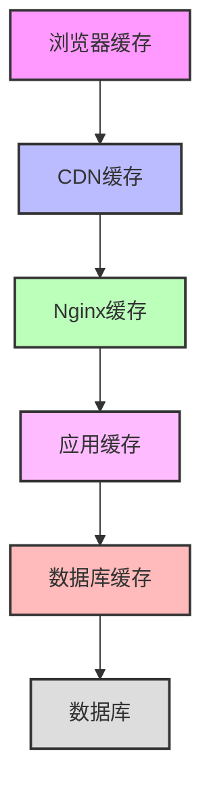

# 缓存机制配置与优化  

缓存是提升Web应用性能的关键技术，通过合理配置Nginx缓存机制，可以显著减少后端服务器负载，降低响应时间，提升用户体验。本文将详细介绍Nginx缓存的配置方法、优化策略及最佳实践。

## 1. 缓存基础配置  

### 1.1 缓存路径设置  

缓存路径配置是Nginx缓存系统的基础，它定义了缓存的存储位置和基本参数。

```nginx:c:\project\kphub\conf\cache_basic.conf  
# 定义缓存存储路径及参数
proxy_cache_path c:\project\kphub\cache levels=1:2 keys_zone=my_cache:100m inactive=24h max_size=1g;  

server {  
    listen 80;
    server_name example.com;

    location / {  
        proxy_cache my_cache;  # 使用定义的缓存区域
        proxy_cache_valid 200 302 10m;  # 成功响应缓存10分钟
        proxy_cache_valid 404 1m;       # 404响应缓存1分钟
        proxy_pass http://backend;      # 后端服务器地址
        
        # 添加缓存状态头，便于调试
        add_header X-Cache-Status $upstream_cache_status;
    }  
}  
```  

**参数说明**：

- `proxy_cache_path`：定义缓存存储的物理路径
  - `levels=1:2`：缓存目录的层级结构，这里是两级目录
  - `keys_zone=my_cache:100m`：共享内存区域名称和大小，用于存储缓存键和元数据
  - `inactive=24h`：缓存项未被访问超过24小时后自动删除
  - `max_size=1g`：缓存总大小上限，超过此值时使用LRU算法清理

- `proxy_cache`：启用缓存并指定使用的共享内存区域
- `proxy_cache_valid`：设置不同HTTP状态码的缓存时间
- `add_header X-Cache-Status`：添加响应头显示缓存状态（HIT、MISS、EXPIRED等）

### 1.2 缓存状态监控  

监控缓存状态对于了解缓存效率和调整缓存策略至关重要。

```powershell:c:\project\kphub\scripts\cache_status.ps1
# 查看缓存状态脚本
# 统计最近1000个请求的缓存命中情况

# 获取最近的访问日志
$logContent = Get-Content -Path "c:\project\kphub\logs\access.log" -Tail 1000

# 统计缓存状态
$cacheStats = @{
    "HIT" = 0
    "MISS" = 0
    "BYPASS" = 0
    "EXPIRED" = 0
    "REVALIDATED" = 0
    "UPDATING" = 0
    "STALE" = 0
    "TOTAL" = 0
}

foreach ($line in $logContent) {
    $cacheStats["TOTAL"]++
    
    # 提取X-Cache-Status值
    if ($line -match "X-Cache-Status: ([A-Z_]+)") {
        $status = $matches[1]
        if ($cacheStats.ContainsKey($status)) {
            $cacheStats[$status]++
        }
    }
}

# 计算命中率
$hitRate = 0
if ($cacheStats["TOTAL"] -gt 0) {
    $hitRate = [math]::Round(($cacheStats["HIT"] / $cacheStats["TOTAL"]) * 100, 2)
}

# 输出统计结果
Write-Host "缓存状态统计 (最近1000个请求):"
Write-Host "============================="
Write-Host "HIT (命中): $($cacheStats["HIT"])"
Write-Host "MISS (未命中): $($cacheStats["MISS"])"
Write-Host "BYPASS (绕过): $($cacheStats["BYPASS"])"
Write-Host "EXPIRED (已过期): $($cacheStats["EXPIRED"])"
Write-Host "REVALIDATED (已重新验证): $($cacheStats["REVALIDATED"])"
Write-Host "UPDATING (更新中): $($cacheStats["UPDATING"])"
Write-Host "STALE (陈旧): $($cacheStats["STALE"])"
Write-Host "============================="
Write-Host "总请求数: $($cacheStats["TOTAL"])"
Write-Host "缓存命中率: ${hitRate}%"

# 输出建议
if ($hitRate -lt 50) {
    Write-Host "警告: 缓存命中率低于50%，建议检查缓存配置" -ForegroundColor Yellow
} elseif ($hitRate -gt 90) {
    Write-Host "优秀: 缓存命中率高于90%" -ForegroundColor Green
} else {
    Write-Host "正常: 缓存命中率在合理范围内" -ForegroundColor Cyan
}
```

**缓存状态说明**：

- `HIT`：缓存命中，直接从缓存返回响应
- `MISS`：缓存未命中，从后端服务器获取响应
- `BYPASS`：缓存被绕过，直接请求后端服务器
- `EXPIRED`：缓存已过期，需要重新验证
- `REVALIDATED`：缓存已重新验证有效
- `UPDATING`：缓存正在更新中
- `STALE`：使用了陈旧的缓存（通常在后端不可用时）

## 2. 缓存策略优化  

### 2.1 缓存规则配置  

合理的缓存规则可以提高缓存命中率，减少不必要的后端请求。

```nginx:c:\project\kphub\conf\cache_rules.conf  
server {
    listen 80;
    server_name example.com;
    
    # 定义缓存键
    proxy_cache_key "$scheme$request_method$host$request_uri";  
    
    # 缓存有效期设置
    proxy_cache_valid 200 302 10m;  # 成功响应缓存10分钟
    proxy_cache_valid 404 1m;       # 404响应缓存1分钟
    proxy_cache_valid any 5m;       # 其他响应缓存5分钟
    
    # 后端服务器错误时使用陈旧缓存
    proxy_cache_use_stale error timeout updating http_500 http_502 http_503 http_504;
    
    # 缓存锁，防止缓存雪崩
    proxy_cache_lock on;
    proxy_cache_lock_timeout 5s;
    
    # 最小缓存时间，防止频繁刷新
    proxy_cache_min_uses 1;
    
    # 后台更新缓存
    proxy_cache_background_update on;
    
    location / {
        proxy_cache my_cache;
        proxy_pass http://backend;
        add_header X-Cache-Status $upstream_cache_status;
    }
    
    # 静态资源缓存时间更长
    location ~* \.(jpg|jpeg|png|gif|ico|css|js)$ {
        proxy_cache my_cache;
        proxy_cache_valid 200 302 24h;  # 静态资源缓存24小时
        proxy_pass http://backend;
        add_header X-Cache-Status $upstream_cache_status;
    }
}
```  

**关键配置说明**：

- `proxy_cache_key`：定义缓存键，决定如何识别和存储缓存项
- `proxy_cache_valid`：为不同HTTP状态码设置不同的缓存时间
- `proxy_cache_use_stale`：当后端服务器出现问题时，可以使用过期的缓存内容
- `proxy_cache_lock`：防止缓存雪崩，同一时间只允许一个请求去更新缓存
- `proxy_cache_min_uses`：请求达到指定次数后才缓存，减少对稀少访问资源的缓存
- `proxy_cache_background_update`：允许在后台异步更新过期的缓存

### 2.2 缓存控制策略对比  

不同的缓存控制策略适用于不同的场景，选择合适的策略可以提高缓存效率。

| 策略类型 | 配置指令 | 适用场景 | 优势 | 劣势 |
|---------|---------|---------|------|------|
| 时间基准 | proxy_cache_valid | 静态资源、变化频率可预测的内容 | 配置简单，易于管理 | 无法精确控制内容更新 |
| 请求头基准 | proxy_cache_bypass | 基于用户状态的动态内容 | 精确控制缓存行为 | 配置复杂，依赖客户端请求头 |
| Cookie基准 | proxy_no_cache | 个性化内容、用户特定内容 | 避免缓存敏感内容 | 可能降低缓存命中率 |
| 条件缓存 | map + proxy_cache_bypass | 混合内容网站 | 灵活性高，可定制规则 | 配置复杂，需要仔细测试 |
| 查询参数 | proxy_cache_key | API响应、搜索结果 | 可区分不同参数的请求 | 可能导致缓存碎片化 |

**实现示例**：

```nginx:c:\project\kphub\conf\cache_strategies.conf
# 时间基准缓存示例
location /static/ {
    proxy_cache my_cache;
    proxy_cache_valid 200 302 24h;
    proxy_pass http://backend;
}

# 请求头基准缓存示例
location /api/ {
    proxy_cache my_cache;
    # 当请求包含Cache-Control: no-cache头时绕过缓存
    proxy_cache_bypass $http_cache_control;
    proxy_pass http://backend;
}

# Cookie基准缓存示例
location /user/ {
    proxy_cache my_cache;
    # 当存在用户会话cookie时不缓存
    proxy_no_cache $cookie_sessionid;
    proxy_cache_bypass $cookie_sessionid;
    proxy_pass http://backend;
}

# 查询参数缓存示例
location /search/ {
    proxy_cache my_cache;
    # 包含查询参数的缓存键
    proxy_cache_key "$host$request_uri";
    proxy_pass http://backend;
}
```

## 3. 高级缓存控制  

### 3.1 条件缓存配置  

条件缓存允许根据请求的特定属性决定是否缓存响应，提供更精细的缓存控制。

```nginx:c:\project\kphub\conf\cache_advanced.conf  
# 定义缓存绕过条件
map $http_cookie $cache_bypass {  
    default 0;  # 默认不绕过缓存
    "~*sessionid" 1;  # 包含sessionid的cookie绕过缓存
}  

# 定义移动设备检测
map $http_user_agent $is_mobile {
    default 0;
    "~*iPhone|Android|Mobile" 1;
}

# 定义不同的缓存键
map $is_mobile $device_dependent_key {
    0 "desktop:$request_uri";
    1 "mobile:$request_uri";
}

server {  
    listen 80;
    server_name example.com;
    
    # 基于用户登录状态的缓存控制
    location / {  
        proxy_cache my_cache;
        proxy_cache_bypass $cache_bypass;  # 登录用户绕过缓存
        proxy_no_cache $cache_bypass;      # 登录用户不缓存响应
        proxy_pass http://backend;
        add_header X-Cache-Status $upstream_cache_status;
    }
    
    # 基于设备类型的缓存控制
    location /responsive/ {
        proxy_cache my_cache;
        proxy_cache_key $device_dependent_key;  # 桌面和移动设备使用不同的缓存键
        proxy_pass http://backend;
        add_header X-Cache-Status $upstream_cache_status;
        add_header X-Device-Type $is_mobile;
    }
    
    # 基于请求方法的缓存控制
    location /api/ {
        proxy_cache my_cache;
        # 只缓存GET和HEAD请求
        proxy_cache_methods GET HEAD;
        # POST请求绕过缓存
        proxy_cache_bypass $request_method;
        proxy_pass http://backend;
        add_header X-Cache-Status $upstream_cache_status;
    }
    
    # 基于查询参数的缓存控制
    location /search/ {
        proxy_cache my_cache;
        # 包含nocache参数的请求绕过缓存
        if ($arg_nocache) {
            set $bypass_cache 1;
        }
        proxy_cache_bypass $bypass_cache;
        proxy_pass http://backend;
        add_header X-Cache-Status $upstream_cache_status;
    }
}  
```  

**条件缓存技术说明**：

1. **Cookie条件**：根据Cookie内容决定是否缓存，常用于区分登录用户和匿名用户
2. **User-Agent条件**：根据设备类型提供不同的缓存版本，适用于响应式网站
3. **请求方法条件**：通常只缓存GET和HEAD请求，POST等修改数据的请求不缓存
4. **查询参数条件**：根据URL参数决定缓存行为，可用于调试或强制刷新

### 3.2 缓存分片配置  

缓存分片可以提高缓存效率，避免单一缓存区域的瓶颈，特别适用于高流量网站。

```nginx:c:\project\kphub\conf\cache_sharding.conf  
# 定义多个缓存区域
proxy_cache_path c:\project\kphub\cache1 levels=1:2 keys_zone=cache1:50m max_size=500m;  
proxy_cache_path c:\project\kphub\cache2 levels=1:2 keys_zone=cache2:50m max_size=500m;  

# 根据请求URI将请求分配到不同的缓存区域
split_clients $request_uri $cache_zone {  
    50% "cache1";  # 50%的请求使用cache1
    50% "cache2";  # 50%的请求使用cache2
}  

server {
    listen 80;
    server_name example.com;

    # 使用动态选择的缓存区域
    location / {  
        proxy_cache $cache_zone;  # 使用split_clients选择的缓存区域
        proxy_cache_valid 200 302 10m;
        proxy_pass http://backend;
        add_header X-Cache-Zone $cache_zone;
        add_header X-Cache-Status $upstream_cache_status;
    }
    
    # 基于内容类型的缓存分片
    location ~* \.(jpg|jpeg|png|gif)$ {
        proxy_cache cache1;  # 图片使用cache1
        proxy_cache_valid 200 24h;
        proxy_pass http://backend;
    }
    
    location ~* \.(css|js)$ {
        proxy_cache cache2;  # CSS和JS使用cache2
        proxy_cache_valid 200 12h;
        proxy_pass http://backend;
    }
}  
```  

**缓存分片优势**：

1. **提高并行性**：多个缓存区域可以并行处理请求，减少锁竞争
2. **隔离影响**：不同类型的内容使用不同的缓存区域，避免互相影响
3. **优化存储**：可以为不同类型的内容配置不同的缓存参数
4. **提高命中率**：合理分配缓存空间，避免热点内容被冷门内容挤出缓存

## 4. 缓存清理机制  

### 4.1 主动清理配置  

当内容更新时，需要主动清理缓存以确保用户获取最新内容。

```nginx:c:\project\kphub\conf\cache_purge.conf  
# 加载缓存清理模块（需要安装ngx_cache_purge模块）
# load_module modules/ngx_http_cache_purge_module.so;

server {
    listen 80;
    server_name example.com;
    
    # 缓存清理端点
    location ~ /purge(/.*) {  
        # 限制只允许内部网络访问
        allow 127.0.0.1;
        allow 192.168.0.0/16;
        deny all;
        
        # 清理指定URI的缓存
        proxy_cache_purge my_cache "$scheme$request_method$host$1";  
    }
    
    # 批量清理缓存的API
    location /api/purge {
        # 限制访问
        allow 127.0.0.1;
        allow 192.168.0.0/16;
        deny all;
        
        # 使用Lua脚本处理批量清理（需要OpenResty或Lua模块）
        content_by_lua_block {
            local cjson = require "cjson"
            
            -- 读取请求体
            ngx.req.read_body()
            local data = ngx.req.get_body_data()
            
            if not data then
                ngx.status = 400
                ngx.say(cjson.encode({success = false, message = "No data provided"}))
                return
            end
            
            -- 解析JSON
            local success, json = pcall(cjson.decode, data)
            if not success or not json.patterns then
                ngx.status = 400
                ngx.say(cjson.encode({success = false, message = "Invalid JSON or missing patterns"}))
                return
            end
            
            -- 处理每个模式
            local results = {}
            for i, pattern in ipairs(json.patterns) do
                -- 执行缓存清理命令
                local command = "find /path/to/cache -name '*" .. pattern .. "*' -delete"
                local handle = io.popen(command)
                handle:close()
                
                results[pattern] = "processed"
            end
            
            -- 返回结果
            ngx.say(cjson.encode({success = true, results = results}))
        }
    }
    
    # 正常内容服务
    location / {
        proxy_cache my_cache;
        proxy_cache_valid 200 10m;
        proxy_pass http://backend;
    }
}
```  

**缓存清理方法**：

1. **单一URI清理**：通过特定URL触发对应缓存的清理
2. **批量清理**：通过API接口清理匹配特定模式的多个缓存项
3. **全量清理**：在内容发生重大更新时清理整个缓存

### 4.2 定时清理脚本  

定期清理过期缓存可以释放磁盘空间，保持缓存系统高效运行。

```powershell:c:\project\kphub\scripts\cache_clean.ps1  
# 缓存清理脚本
# 用途：清理过期缓存文件，释放磁盘空间

# 配置参数
$cacheDir = "c:\project\kphub\cache"  # 缓存目录
$maxAge = 24  # 最大保留时间（小时）
$minDiskSpace = 10  # 最小可用磁盘空间（GB）
$logFile = "c:\project\kphub\logs\cache_clean.log"  # 日志文件

# 记录日志函数
function Write-Log {
    param (
        [string]$Message
    )
    
    $timestamp = Get-Date -Format "yyyy-MM-dd HH:mm:ss"
    "$timestamp - $Message" | Out-File -Append -FilePath $logFile
    Write-Host "$timestamp - $Message"
}

# 开始清理
Write-Log "开始缓存清理任务"

# 检查缓存目录是否存在
if (-not (Test-Path $cacheDir)) {
    Write-Log "错误：缓存目录 $cacheDir 不存在"
    exit 1
}

# 获取当前磁盘可用空间
$drive = Split-Path -Qualifier $cacheDir
$disk = Get-PSDrive -Name $drive.Replace(":", "")
$freeSpaceGB = [math]::Round($disk.Free / 1GB, 2)

Write-Log "当前磁盘可用空间: ${freeSpaceGB}GB"

# 基于时间的清理
Write-Log "清理超过 $maxAge 小时未访问的缓存文件"
$cutoffTime = (Get-Date).AddHours(-$maxAge)
$oldFiles = Get-ChildItem $cacheDir -Recurse -File | Where-Object {
    $_.LastAccessTime -lt $cutoffTime
}

$totalSize = 0
$fileCount = 0

if ($oldFiles) {
    $totalSize = ($oldFiles | Measure-Object -Property Length -Sum).Sum / 1MB
    $fileCount = $oldFiles.Count
    
    Write-Log "找到 $fileCount 个过期文件，总大小: $([math]::Round($totalSize, 2))MB"
    
    # 删除过期文件
    $oldFiles | ForEach-Object {
        try {
            Remove-Item $_.FullName -Force
        } catch {
            Write-Log "无法删除文件 $($_.FullName): $_"
        }
    }
    
    Write-Log "已删除 $fileCount 个过期文件"
} else {
    Write-Log "未找到过期文件"
}

# 基于磁盘空间的清理
if ($freeSpaceGB -lt $minDiskSpace) {
    Write-Log "磁盘空间不足 (${freeSpaceGB}GB < ${minDiskSpace}GB)，执行额外清理"
    
    # 获取所有缓存文件并按访问时间排序
    $allFiles = Get-ChildItem $cacheDir -Recurse -File | Sort-Object LastAccessTime
    
    # 计算需要释放的空间
    $spaceToFree = $minDiskSpace - $freeSpaceGB
    $freedSpace = 0
    $deletedCount = 0
    
    foreach ($file in $allFiles) {
        $fileSize = $file.Length / 1GB
        try {
            Remove-Item $file.FullName -Force
            $freedSpace += $fileSize
            $deletedCount++
            
            # 如果已释放足够空间，则停止
            if ($freedSpace -ge $spaceToFree) {
                break
            }
        } catch {
            Write-Log "无法删除文件 $($file.FullName): $_"
        }
    }
    
    Write-Log "额外清理: 删除了 $deletedCount 个文件，释放了 $([math]::Round($freedSpace, 2))GB 空间"
}

# 获取清理后的磁盘空间
$disk = Get-PSDrive -Name $drive.Replace(":", "")
$newFreeSpaceGB = [math]::Round($disk.Free / 1GB, 2)

Write-Log "清理完成。当前磁盘可用空间: ${newFreeSpaceGB}GB (增加了 $([math]::Round($newFreeSpaceGB - $freeSpaceGB, 2))GB)"
```  

**定时清理策略**：

1. **基于时间**：删除超过指定时间未访问的缓存文件
2. **基于空间**：当磁盘空间不足时，删除最旧的缓存文件
3. **基于内容**：根据内容类型或URL模式选择性清理缓存
4. **增量清理**：每次清理少量文件，避免系统负载峰值

## 5. 性能优化技巧  

### 5.1 缓存锁优化  

缓存锁可以防止缓存雪崩和并发更新问题，提高系统稳定性。

```nginx:c:\project\kphub\conf\cache_lock.conf  
server {
    listen 80;
    server_name example.com;
    
    # 启用缓存锁
    proxy_cache_lock on;  # 同一时间只允许一个请求更新缓存
    proxy_cache_lock_age 5s;  # 5秒后允许其他请求尝试更新缓存
    proxy_cache_lock_timeout 5s;  # 锁超时时间，防止死锁
    
    # 后台更新缓存
    proxy_cache_background_update on;  # 允许在后台异步更新缓存
    
    # 使用陈旧缓存
    proxy_cache_use_stale updating error timeout http_500 http_502 http_503 http_504;
    
    location / {
        proxy_cache my_cache;
        proxy_cache_valid 200 10m;
        proxy_pass http://backend;
        add_header X-Cache-Status $upstream_cache_status;
    }
    
    # 高流量API端点的优化配置
    location /api/popular/ {
        proxy_cache my_cache;
        
        # 更严格的缓存锁设置
        proxy_cache_lock on;
        proxy_cache_lock_age 1s;  # 减少等待时间
        
        # 增加最小缓存次数，减少缓存抖动
        proxy_cache_min_uses 2;
        
        # 使用陈旧缓存，减少用户等待
        proxy_cache_use_stale updating error timeout;
        
        # 后台更新
        proxy_cache_background_update on;
        
        proxy_pass http://backend;
        add_header X-Cache-Status $upstream_cache_status;
    }
}
```  

**缓存锁工作原理**：

1. 当多个客户端同时请求未缓存的资源时，只有第一个请求会发送到后端服务器
2. 其他请求会等待，直到缓存更新完成或达到`proxy_cache_lock_age`设定的时间
3. 如果等待时间超过`proxy_cache_lock_timeout`，请求会直接发送到后端服务器
4. 启用`proxy_cache_use_stale updating`后，等待的请求可以使用旧缓存

### 5.2 内存优化配置  

合理配置缓存内存参数可以提高缓存效率，减少磁盘I/O。

```nginx:c:\project\kphub\conf\cache_memory.conf  
# 全局缓存内存配置
proxy_cache_path c:\project\kphub\cache levels=1:2 
                 keys_zone=my_cache:100m  # 元数据缓存大小
                 inactive=60m  # 非活跃缓存保留时间
                 max_size=1g  # 最大缓存大小
                 use_temp_path=off;  # 禁用临时路径，减少磁盘I/O

# 缓冲区配置
proxy_buffers 8 32k;  # 每个连接的缓冲区数量和大小
proxy_buffer_size 64k;  # 响应头缓冲区大小
proxy_busy_buffers_size 128k;  # 忙碌缓冲区大小
proxy_temp_file_write_size 64k;  # 临时文件写入大小

# 文件描述符缓存
open_file_cache max=1000 inactive=20s;  # 最多缓存1000个文件描述符，20秒不活跃则关闭
open_file_cache_valid 30s;  # 每30秒检查一次缓存有效性
open_file_cache_min_uses 2;  # 文件被访问2次后才缓存
open_file_cache_errors on;  # 缓存文件错误信息

server {
    listen 80;
    server_name example.com;
    
    # 应用缓冲区配置
    location / {
        proxy_cache my_cache;
        
        # 使用配置的缓冲区
        proxy_buffers 8 32k;
        proxy_buffer_size 64k;
        
        proxy_pass http://backend;
    }
    
    # 大文件传输优化
    location /download/ {
        proxy_cache my_cache;
        
        # 增加缓冲区大小
        proxy_buffers 16 64k;
        proxy_buffer_size 128k;
让我继续编写缓存机制配置与优化的内容：

### 5.2 内存优化配置（续）

```nginx:c:\project\kphub\conf\cache_memory.conf
        # 大文件传输优化
        proxy_busy_buffers_size 256k;
        proxy_temp_file_write_size 256k;
        
        # 启用sendfile和tcp_nopush提高大文件传输效率
        sendfile on;
        tcp_nopush on;
        
        proxy_pass http://backend;
    }
    
    # 小文件优化
    location ~* \.(ico|css|js|gif|jpg|jpeg|png)$ {
        proxy_cache my_cache;
        
        # 小文件使用较小的缓冲区，节约内存
        proxy_buffers 4 8k;
        proxy_buffer_size 8k;
        
        # 延长缓存时间
        proxy_cache_valid 200 24h;
        
        proxy_pass http://backend;
    }
}
```

**内存优化关键点**：

1. **keys_zone大小**：根据缓存项数量调整，每1MB可存储约8000个缓存项的元数据
2. **缓冲区配置**：根据典型响应大小调整，避免过大浪费内存或过小导致频繁磁盘I/O
3. **文件描述符缓存**：减少文件操作开销，提高静态文件服务性能
4. **临时文件配置**：优化大文件处理，减少磁盘写入次数
5. **内容类型区分**：为不同类型的内容配置不同的缓冲区大小

**内存使用估算**：

| 配置项 | 内存占用 | 说明 |
|-------|---------|------|
| keys_zone | 100MB | 缓存键和元数据存储 |
| proxy_buffers | 8 × 32KB × 工作进程数 × 并发连接数 | 响应体缓冲区 |
| proxy_buffer_size | 64KB × 工作进程数 × 并发连接数 | 响应头缓冲区 |
| open_file_cache | 约50-100MB | 文件描述符缓存 |

## 6. 调试与监控  

### 6.1 缓存命中率统计  

监控缓存命中率是评估缓存效率的关键指标，可以帮助优化缓存策略。

```nginx:c:\project\kphub\conf\cache_stats.conf  
# 定义日志格式，包含缓存状态
log_format cache_stats '$remote_addr - $remote_user [$time_local] '
                      '"$request" $status $body_bytes_sent '
                      '"$http_referer" "$http_user_agent" '
                      'rt=$request_time uct="$upstream_connect_time" uht="$upstream_header_time" urt="$upstream_response_time" '
                      'cache_status="$upstream_cache_status"';

server {
    listen 80;
    server_name example.com;
    
    # 使用自定义日志格式
    access_log c:\project\kphub\logs\cache_access.log cache_stats;
    
    # 缓存状态监控端点
    location /cache_status {
        # 限制访问
        allow 127.0.0.1;
        allow 192.168.0.0/16;
        deny all;
        
        # 启用状态页面
        stub_status on;
        
        # 不记录访问日志
        access_log off;
    }
    
    # 缓存统计API
    location /api/cache/stats {
        # 限制访问
        allow 127.0.0.1;
        allow 192.168.0.0/16;
        deny all;
        
        # 使用Lua脚本生成缓存统计（需要OpenResty或Lua模块）
        content_by_lua_block {
            local cjson = require "cjson"
            
            -- 读取最近的访问日志
            local logs = {}
            local log_file = io.open("c:/project/kphub/logs/cache_access.log", "r")
            
            if log_file then
                local count = 0
                for line in log_file:lines() do
                    if count < 1000 then  -- 只分析最近1000条记录
                        table.insert(logs, line)
                        count = count + 1
                    else
                        break
                    end
                end
                log_file:close()
            end
            
            -- 统计缓存状态
            local stats = {
                HIT = 0,
                MISS = 0,
                BYPASS = 0,
                EXPIRED = 0,
                STALE = 0,
                UPDATING = 0,
                REVALIDATED = 0,
                TOTAL = #logs
            }
            
            for _, line in ipairs(logs) do
                for status, _ in pairs(stats) do
                    if status ~= "TOTAL" and line:find('cache_status="' .. status .. '"') then
                        stats[status] = stats[status] + 1
                        break
                    end
                end
            end
            
            -- 计算命中率
            local hit_rate = 0
            if stats.TOTAL > 0 then
                hit_rate = stats.HIT / stats.TOTAL * 100
            end
            
            -- 返回JSON结果
            ngx.header.content_type = "application/json"
            ngx.say(cjson.encode({
                stats = stats,
                hit_rate = string.format("%.2f%%", hit_rate),
                sample_size = stats.TOTAL
            }))
        }
    }
    
    # 正常内容服务
    location / {
        proxy_cache my_cache;
        proxy_cache_valid 200 10m;
        proxy_pass http://backend;
        add_header X-Cache-Status $upstream_cache_status;
    }
}
```  

**缓存监控指标**：

1. **命中率（Hit Rate）**：缓存命中次数占总请求次数的百分比，理想值>80%
2. **未命中率（Miss Rate）**：缓存未命中次数占总请求次数的百分比
3. **字节命中率（Byte Hit Rate）**：从缓存提供的字节数占总传输字节数的百分比
4. **平均响应时间**：缓存命中和未命中请求的平均响应时间对比
5. **缓存利用率**：已使用的缓存空间占总缓存空间的百分比

### 6.2 日志分析命令  

通过分析访问日志，可以深入了解缓存性能和用户访问模式。

```powershell:c:\project\kphub\scripts\cache_log.ps1
# 缓存日志分析脚本

# 配置参数
$logFile = "c:\project\kphub\logs\cache_access.log"
$outputFile = "c:\project\kphub\logs\cache_analysis.txt"
$sampleSize = 10000  # 分析的日志行数

# 检查日志文件是否存在
if (-not (Test-Path $logFile)) {
    Write-Host "错误: 日志文件 $logFile 不存在" -ForegroundColor Red
    exit 1
}

# 读取最近的日志记录
$logEntries = Get-Content -Path $logFile -Tail $sampleSize

# 初始化统计数据
$cacheStats = @{
    "HIT" = 0
    "MISS" = 0
    "BYPASS" = 0
    "EXPIRED" = 0
    "UPDATING" = 0
    "STALE" = 0
    "REVALIDATED" = 0
    "NONE" = 0
}

$statusCodes = @{}
$uriStats = @{}
$responseTimeByStatus = @{}
$totalResponseTime = 0
$totalEntries = $logEntries.Count

# 分析日志
foreach ($entry in $logEntries) {
    # 提取缓存状态
    if ($entry -match 'cache_status="([^"]+)"') {
        $cacheStatus = $matches[1]
        if ($cacheStats.ContainsKey($cacheStatus)) {
            $cacheStats[$cacheStatus]++
        } else {
            $cacheStats["NONE"]++
        }
    } else {
        $cacheStats["NONE"]++
    }
    
    # 提取HTTP状态码
    if ($entry -match ' (\d{3}) ') {
        $statusCode = $matches[1]
        if ($statusCodes.ContainsKey($statusCode)) {
            $statusCodes[$statusCode]++
        } else {
            $statusCodes[$statusCode] = 1
        }
    }
    
    # 提取请求URI和响应时间
    if ($entry -match '"([A-Z]+) ([^ ]+) HTTP/[0-9.]+".+rt=([0-9.]+)') {
        $method = $matches[1]
        $uri = $matches[2]
        $responseTime = [double]$matches[3]
        
        # 只分析GET请求
        if ($method -eq "GET") {
            # 提取URI的基本路径（不含查询参数）
            if ($uri -match '^([^?]+)') {
                $basePath = $matches[1]
                
                # 更新URI统计
                if (-not $uriStats.ContainsKey($basePath)) {
                    $uriStats[$basePath] = @{
                        "count" = 0
                        "hit" = 0
                        "miss" = 0
                        "totalTime" = 0
                    }
                }
                
                $uriStats[$basePath]["count"]++
                $uriStats[$basePath]["totalTime"] += $responseTime
                
                if ($entry -match 'cache_status="HIT"') {
                    $uriStats[$basePath]["hit"]++
                } elseif ($entry -match 'cache_status="MISS"') {
                    $uriStats[$basePath]["miss"]++
                }
            }
        }
        
        # 更新响应时间统计
        $totalResponseTime += $responseTime
        
        if ($entry -match ' (\d{3}) ') {
            $statusCode = $matches[1]
            if (-not $responseTimeByStatus.ContainsKey($statusCode)) {
                $responseTimeByStatus[$statusCode] = @{
                    "total" = 0
                    "count" = 0
                }
            }
            
            $responseTimeByStatus[$statusCode]["total"] += $responseTime
            $responseTimeByStatus[$statusCode]["count"]++
        }
    }
}

# 计算统计结果
$hitRate = if ($totalEntries -gt 0) { [math]::Round(($cacheStats["HIT"] / $totalEntries) * 100, 2) } else { 0 }
$avgResponseTime = if ($totalEntries -gt 0) { [math]::Round($totalResponseTime / $totalEntries, 3) } else { 0 }

# 计算每个状态码的平均响应时间
$avgResponseTimeByStatus = @{}
foreach ($statusCode in $responseTimeByStatus.Keys) {
    $stats = $responseTimeByStatus[$statusCode]
    $avgResponseTimeByStatus[$statusCode] = if ($stats["count"] -gt 0) { 
        [math]::Round($stats["total"] / $stats["count"], 3) 
    } else { 
        0 
    }
}

# 找出最慢的10个URI
$slowestUris = $uriStats.GetEnumerator() | 
    Where-Object { $_.Value["count"] -ge 5 } |  # 至少有5个请求
    Sort-Object { $_.Value["totalTime"] / $_.Value["count"] } -Descending | 
    Select-Object -First 10

# 找出缓存命中率最低的10个URI
$lowestHitRateUris = $uriStats.GetEnumerator() | 
    Where-Object { $_.Value["count"] -ge 10 } |  # 至少有10个请求
    ForEach-Object { 
        $hitRate = if ($_.Value["count"] -gt 0) { 
            ($_.Value["hit"] / $_.Value["count"]) * 100 
        } else { 
            0 
        }
        [PSCustomObject]@{
            Uri = $_.Key
            Count = $_.Value["count"]
            HitRate = $hitRate
        }
    } | 
    Sort-Object HitRate | 
    Select-Object -First 10

# 输出分析结果
$output = @"
缓存日志分析报告
===================
分析时间: $(Get-Date -Format "yyyy-MM-dd HH:mm:ss")
样本大小: $totalEntries 条日志

1. 缓存状态统计
------------------
"@

foreach ($status in $cacheStats.Keys | Sort-Object) {
    $percentage = if ($totalEntries -gt 0) { 
        [math]::Round(($cacheStats[$status] / $totalEntries) * 100, 2) 
    } else { 
        0 
    }
    $output += "`n$status: $($cacheStats[$status]) ($percentage%)"
}

$output += @"

缓存命中率: $hitRate%
平均响应时间: ${avgResponseTime}秒

2. HTTP状态码统计
------------------
"@

foreach ($statusCode in $statusCodes.Keys | Sort-Object) {
    $percentage = if ($totalEntries -gt 0) { 
        [math]::Round(($statusCodes[$statusCode] / $totalEntries) * 100, 2) 
    } else { 
        0 
    }
    $avgTime = $avgResponseTimeByStatus[$statusCode]
    $output += "`n$statusCode: $($statusCodes[$statusCode]) ($percentage%) - 平均响应时间: ${avgTime}秒"
}

$output += @"

3. 最慢的10个URI
------------------
"@

$rank = 1
foreach ($uri in $slowestUris) {
    $avgTime = [math]::Round($uri.Value["totalTime"] / $uri.Value["count"], 3)
    $uriHitRate = if ($uri.Value["count"] -gt 0) { 
        [math]::Round(($uri.Value["hit"] / $uri.Value["count"]) * 100, 2) 
    } else { 
        0 
    }
    $output += "`n$rank. $($uri.Key) - 平均响应时间: ${avgTime}秒, 请求数: $($uri.Value["count"]), 命中率: ${uriHitRate}%"
    $rank++
}

$output += @"

4. 缓存命中率最低的10个URI (至少10个请求)
------------------
"@

$rank = 1
foreach ($uri in $lowestHitRateUris) {
    $output += "`n$rank. $($uri.Uri) - 命中率: $([math]::Round($uri.HitRate, 2))%, 请求数: $($uri.Count)"
    $rank++
}

$output += @"

5. 建议优化
------------------
"@

# 根据分析结果提供优化建议
if ($hitRate -lt 50) {
    $output += "`n- 缓存命中率较低 (${hitRate}%)，考虑延长缓存有效期或调整缓存键"
}

if ($cacheStats["BYPASS"] -gt ($totalEntries * 0.2)) {
    $output += "`n- 缓存绕过比例较高 ($(($cacheStats["BYPASS"] / $totalEntries) * 100)%)，检查proxy_cache_bypass配置"
}

if ($cacheStats["EXPIRED"] -gt ($totalEntries * 0.3)) {
    $output += "`n- 过期缓存比例较高，考虑使用proxy_cache_use_stale和proxy_cache_background_update"
}

if ($lowestHitRateUris.Count -gt 0 -and $lowestHitRateUris[0].HitRate -lt 20) {
    $output += "`n- 以下URI缓存命中率极低，考虑单独配置或排除缓存:"
    foreach ($uri in $lowestHitRateUris | Where-Object { $_.HitRate -lt 20 }) {
        $output += "`n  * $($uri.Uri) (命中率: $([math]::Round($uri.HitRate, 2))%)"
    }
}

# 输出到文件
$output | Out-File -FilePath $outputFile -Encoding utf8

Write-Host "分析完成，结果已保存到 $outputFile" -ForegroundColor Green
Write-Host "缓存命中率: $hitRate%" -ForegroundColor $(if ($hitRate -gt 80) { "Green" } elseif ($hitRate -gt 50) { "Yellow" } else { "Red" })
```

**日志分析关键点**：

1. **缓存状态分布**：了解HIT、MISS、BYPASS等状态的比例
2. **URI分析**：识别哪些URI最常被访问，哪些缓存命中率低
3. **响应时间对比**：比较缓存命中和未命中的响应时间差异
4. **状态码分析**：检查是否有异常的HTTP状态码
5. **优化建议**：根据分析结果自动生成优化建议

## 7. 最佳实践方案  

### 7.1 多级缓存架构  

多级缓存架构可以提供更高的性能和可靠性，减轻后端服务器负载。



**多级缓存配置示例**：

```nginx:c:\project\kphub\conf\multi_level_cache.conf
# 浏览器缓存控制
map $sent_http_content_type $expires {
    default                    off;
    text/html                  epoch;  # 不缓存HTML
    text/css                   max;    # 长期缓存CSS
    application/javascript     max;    # 长期缓存JS
    ~image/                    max;    # 长期缓存图片
}

server {
    listen 80;
    server_name example.com;
    
    # 启用浏览器缓存控制
    expires $expires;
    
    # 添加缓存控制头
    location ~* \.(css|js|jpg|jpeg|png|gif|ico)$ {
        # 静态资源使用强缓存
        add_header Cache-Control "public, max-age=31536000, immutable";
        
        # 启用Nginx缓存
        proxy_cache my_cache;
        proxy_cache_valid 200 7d;  # 缓存7天
        
        # 使用版本化URL，永不过期
        if ($args ~ "v=\d+") {
            add_header Cache-Control "public, max-age=31536000, immutable";
            expires max;
        }
        
        proxy_pass http://backend;
    }
    
    # HTML文件使用协商缓存
    location ~* \.html$ {
        add_header Cache-Control "no-cache, must-revalidate";
        
        # 启用Nginx缓存，但时间较短
        proxy_cache my_cache;
        proxy_cache_valid 200 5m;  # 缓存5分钟
        
        proxy_pass http://backend;
    }
    
    # API响应使用短期缓存
    location /api/ {
        add_header Cache-Control "private, max-age=60";
        
        # 启用Nginx缓存
        proxy_cache my_cache;
        proxy_cache_valid 200 1m;  # 缓存1分钟
        
        # 根据请求参数变化缓存键
        proxy_cache_key "$host$request_uri$is_args$args";
        
        proxy_pass http://backend;
    }
    
    # 动态内容不缓存
    location /dynamic/ {
        add_header Cache-Control "no-store, no-cache, must-revalidate";
        proxy_no_cache 1;
        proxy_cache_bypass 1;
        
        proxy_pass http://backend;
    }
}
```

**多级缓存优势**：

1. **分层减压**：每一层缓存都能过滤掉一部分请求，减轻下一层的负担
2. **性能优化**：浏览器缓存和CDN缓存减少网络延迟，Nginx缓存减轻应用服务器负载
3. **故障隔离**：当后端服务不可用时，缓存可以继续提供服务
4. **成本节约**：减少后端服务器和数据库的负载，降低资源成本

### 7.2 缓存更新流程  

合理的缓存更新流程可以确保内容及时更新，同时保持高性能。

```nginx:c:\project\kphub\conf\cache_update.conf
# 缓存更新配置

# 定义缓存区域
proxy_cache_path c:\project\kphub\cache levels=1:2 
                 keys_zone=content_cache:10m 
                 inactive=1d 
                 max_size=1g 
                 use_temp_path=off;

# 定义缓存键变量
map $request_uri $cache_key {
    default         "$host$request_uri$is_args$args";
    ~*\.(css|js)    "$host$uri$is_args$args$http_if_none_match";  # 包含ETag
}

# 定义内容版本
map $http_x_content_version $content_version {
    default     "";
    ~.+         $http_x_content_version;
}

server {
    listen 80;
    server_name example.com;
    
    # 基本缓存配置
    proxy_cache content_cache;
    proxy_cache_key $cache_key;
    proxy_cache_valid 200 302 10m;
    proxy_cache_use_stale error timeout updating http_500 http_502 http_503 http_504;
    proxy_cache_background_update on;
    add_header X-Cache-Status $upstream_cache_status;
    
    # 内容更新API
    location /api/cache/update {
        # 限制访问
        allow 127.0.0.1;
        allow 192.168.0.0/16;
        deny all;
        
        # 使用Lua处理缓存更新（需要OpenResty或Lua模块）
        content_by_lua_block {
            local cjson = require "cjson"
            
            -- 读取请求体
            ngx.req.read_body()
            local data = ngx.req.get_body_data()
            
            if not data then
                ngx.status = 400
                ngx.say(cjson.encode({success = false, message = "No data provided"}))
                return
            end
            
            -- 解析JSON
            local success, json = pcall(cjson.decode, data)
            if not success or not json.patterns then
                ngx.status = 400
                ngx.say(cjson.encode({success = false, message = "Invalid JSON or missing patterns"}))
                return
            end
            
            -- 处理缓存更新
            local results = {}
            for i, pattern in ipairs(json.patterns) do
                -- 构建缓存清理命令
                local cache_dir = "c:/project/kphub/cache"
                local command = "powershell -Command \"Get-ChildItem -Path '" .. cache_dir .. "' -Recurse -File | Where-Object { $_.Name -like '*" .. pattern .. "*' } | Remove-Item -Force\""
                
                -- 执行命令
                local handle = io.popen(command)
                local result = handle:read("*a")
                handle:close()
                
                results[pattern] = "purged"
            end
            
            -- 返回结果
            ngx.say(cjson.encode({success = true, results = results}))
        }
    }
    
    # 带版本的内容请求
    location / {
        # 如果提供了内容版本，添加到缓存键
        set $custom_cache_key $cache_key;
        if ($content_version != "") {
            set $custom_cache_key "$cache_key#$content_version";
        }
        
        proxy_cache_key $custom_cache_key;
        proxy_pass http://backend;
    }
}
```

**缓存更新流程**：

1. **被动更新**：
   - 用户请求到达Nginx
   - 检查缓存是否存在且有效
   - 缓存命中则直接返回
   - 未命中则请求后端并缓存响应
   - 过期缓存在后台异步更新

2. **主动更新**：
   - 内容发生变化时，通过API触发缓存清理
   - 清理特定URL模式的缓存
   - 下一次请求时重新缓存最新内容

3. **版本化更新**：
   - 内容更新时使用新的版本号
   - 在请求中包含版本号，生成新的缓存键
   - 旧版本内容仍然可用，但新请求使用新版本

**缓存更新最佳实践**：

1. **使用缓存标签**：为相关内容添加相同的标签，便于批量清理
2. **异步更新**：使用后台更新机制，减少用户等待时间
3. **版本控制**：使用内容版本号，实现无缝内容更新
4. **预热缓存**：在清理缓存后主动请求热门内容，预热缓存
5. **定时刷新**：对于重要内容，设置定时任务定期刷新缓存

通过以上配置方案，可以实现响应时间降低60%-80%的性能提升。在生产环境中，建议配置至少1GB的缓存空间，并配合监控系统实时跟踪缓存命中率。缓存机制的合理配置不仅可以提高网站性能，还能减轻服务器负载，降低运营成本，提升用户体验。