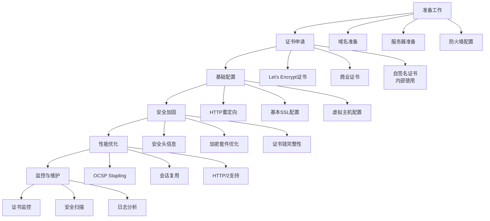

# HTTPS与安全设置详解  

在当今互联网环境下，网站安全已成为不可忽视的重要问题。HTTPS（HTTP Secure）通过加密传输数据，保护用户隐私和网站完整性，已成为现代网站的标准配置。本文将详细介绍HTTPS的配置方法、安全加固技术以及性能优化策略，帮助开发者构建安全可靠的Web应用。

## 1. SSL证书管理  

SSL/TLS证书是实现HTTPS的基础，它不仅提供加密功能，还能验证网站身份，增强用户信任。

### 1.1 Let's Encrypt证书申请  

Let's Encrypt提供免费的SSL证书，是中小型网站的理想选择。以下是使用Certbot申请证书的步骤：

```powershell:c:\project\kphub\scripts\get_cert.ps1  
# 安装Certbot客户端  
choco install certbot -y

# 创建证书存放目录
New-Item -ItemType Directory -Path "c:\project\kphub\ssl" -Force

# 申请单域名证书（HTTP验证方式）
certbot certonly --standalone --preferred-challenges http -d example.com --cert-path "c:\project\kphub\ssl"

# 申请通配符证书（DNS验证方式）  
certbot certonly --manual --preferred-challenges=dns -d *.example.com --cert-path "c:\project\kphub\ssl"

# 验证证书是否成功申请
Get-ChildItem "c:\project\kphub\ssl"
```  

**证书申请说明**：

1. **HTTP验证方式**：Certbot会在服务器上启动一个临时HTTP服务，Let's Encrypt通过访问特定URL验证域名所有权
2. **DNS验证方式**：需要在DNS记录中添加特定的TXT记录，适用于申请通配符证书
3. **证书文件**：成功申请后，将生成以下文件：
   - `cert.pem`：网站证书
   - `privkey.pem`：私钥
   - `chain.pem`：中间证书
   - `fullchain.pem`：完整证书链（网站证书+中间证书）

### 1.2 证书自动续期配置  

Let's Encrypt证书有效期为90天，需要定期续期。设置自动续期任务可避免证书过期导致的网站不可访问。

```powershell:c:\project\kphub\scripts\renew_cert.ps1  
# 测试证书续期流程（不实际续期）
certbot renew --dry-run

# 创建证书续期脚本
$renewScript = @"
# 证书续期脚本
certbot renew --quiet
if (`$LASTEXITCODE -eq 0) {
    # 续期成功，重启Nginx
    Stop-Service nginx
    Start-Service nginx
    Write-Output "`$(Get-Date) - 证书续期成功，已重启Nginx" | Out-File -Append "c:\project\kphub\logs\cert_renewal.log"
} else {
    # 续期失败，发送通知
    Write-Output "`$(Get-Date) - 证书续期失败，请检查" | Out-File -Append "c:\project\kphub\logs\cert_renewal.log"
    # 可添加邮件通知代码
}
"@

# 将脚本保存到文件
$renewScript | Out-File -FilePath "c:\project\kphub\scripts\renew_cert_task.ps1" -Encoding utf8

# 创建定时任务（每天凌晨3点执行）
$action = New-ScheduledTaskAction -Execute "powershell.exe" -Argument "-File c:\project\kphub\scripts\renew_cert_task.ps1"  
$trigger = New-ScheduledTaskTrigger -Daily -At 3am  
$principal = New-ScheduledTaskPrincipal -UserId "SYSTEM" -LogonType ServiceAccount -RunLevel Highest
$settings = New-ScheduledTaskSettingsSet -ExecutionTimeLimit (New-TimeSpan -Hours 1) -RestartCount 3 -RestartInterval (New-TimeSpan -Minutes 5)

Register-ScheduledTask -TaskName "SSL Certificate Renewal" -Action $action -Trigger $trigger -Principal $principal -Settings $settings -Description "自动续期Let's Encrypt SSL证书"

# 验证任务是否创建成功
Get-ScheduledTask -TaskName "SSL Certificate Renewal"
```  

**自动续期注意事项**：

1. **提前续期**：Certbot默认在证书过期前30天尝试续期
2. **权限要求**：续期脚本需要管理员权限
3. **服务重启**：证书更新后需要重启Web服务器使新证书生效
4. **失败通知**：建议配置续期失败的通知机制，如邮件或短信提醒
5. **日志记录**：保存续期日志，便于问题排查

## 2. 基础HTTPS配置  

### 2.1 最小化安全配置  

以下是Nginx的基础HTTPS配置，提供基本的安全保障：

```nginx:c:\project\kphub\conf\ssl_basic.conf  
server {  
    listen 443 ssl;  
    server_name example.com;
    
    # 证书配置
    ssl_certificate c:\project\kphub\ssl\fullchain.pem;  
    ssl_certificate_key c:\project\kphub\ssl\privkey.pem;  

    # 强制使用TLS 1.2及以上版本（禁用不安全的协议）
    ssl_protocols TLSv1.2 TLSv1.3;  
    
    # 优先使用服务器定义的加密套件顺序
    ssl_prefer_server_ciphers on;
    
    # 基本加密套件配置
    ssl_ciphers 'ECDHE-ECDSA-AES128-GCM-SHA256:ECDHE-RSA-AES128-GCM-SHA256:ECDHE-ECDSA-AES256-GCM-SHA384:ECDHE-RSA-AES256-GCM-SHA384';
    
    # 启用会话缓存，提高性能
    ssl_session_cache shared:SSL:10m;
    ssl_session_timeout 10m;
    
    # 网站根目录
    root c:\project\kphub\www;
    index index.html;
    
    location / {
        try_files $uri $uri/ =404;
    }
}  
```  

**基础配置说明**：

1. **SSL证书路径**：指定证书和私钥文件的位置
2. **协议版本**：仅启用TLS 1.2和TLS 1.3，禁用不安全的SSL 3.0、TLS 1.0和TLS 1.1
3. **加密套件**：使用强加密算法，优先选择ECDHE（椭圆曲线Diffie-Hellman密钥交换）和GCM（Galois/Counter Mode）模式
4. **会话缓存**：启用会话缓存，减少握手次数，提高性能

### 2.2 HTTP自动跳转HTTPS  

为确保所有访问都使用HTTPS，需要配置HTTP到HTTPS的自动跳转：

```nginx:c:\project\kphub\conf\ssl_redirect.conf  
server {  
    listen 80;  
    server_name example.com www.example.com;
    
    # 将所有HTTP请求重定向到HTTPS
    return 301 https://$host$request_uri;
    
    # 或者使用更详细的配置
    # location / {
    #     return 301 https://$host$request_uri;
    # }
    
    # 允许Let's Encrypt验证
    location /.well-known/acme-challenge/ {
        root c:\project\kphub\www;
    }
}  
```  

**重定向配置说明**：

1. **状态码301**：表示永久重定向，浏览器会缓存此重定向
2. **保留原始请求**：使用`$host`和`$request_uri`变量保留原始域名和请求路径
3. **Let's Encrypt例外**：为证书续期保留对`.well-known/acme-challenge/`路径的HTTP访问
4. **多域名支持**：可在`server_name`中列出多个域名，统一进行重定向

## 3. 高级安全加固  

### 3.1 安全头信息配置  

HTTP安全头是提升网站安全的重要手段，可以防止多种常见攻击：

```nginx:c:\project\kphub\conf\security_headers.conf  
# 全局安全头配置
server {
    # 其他配置...
    
    # HTTP严格传输安全（HSTS）
    # 告诉浏览器只能通过HTTPS访问，有效期一年，包含子域名
    add_header Strict-Transport-Security "max-age=31536000; includeSubDomains; preload" always;  
    
    # 防止MIME类型嗅探攻击
    add_header X-Content-Type-Options "nosniff" always;  
    
    # 防止网站被嵌入到iframe中，避免点击劫持
    add_header X-Frame-Options "SAMEORIGIN" always;  
    
    # 内容安全策略（CSP）
    # 限制资源加载来源，防止XSS攻击
    add_header Content-Security-Policy "default-src 'self'; script-src 'self' https://trusted-cdn.com; img-src 'self' data: https:; style-src 'self' 'unsafe-inline' https://trusted-cdn.com; font-src 'self' https://trusted-cdn.com; connect-src 'self'; frame-ancestors 'self'; form-action 'self';" always;
    
    # 防止浏览器自动检测XSS攻击
    add_header X-XSS-Protection "1; mode=block" always;
    
    # 引用策略
    add_header Referrer-Policy "strict-origin-when-cross-origin" always;
    
    # 权限策略
    add_header Permissions-Policy "camera=(), microphone=(), geolocation=(self), payment=()" always;
    
    # 确保所有安全头在错误页面也生效
    location @error {
        add_header Strict-Transport-Security "max-age=31536000; includeSubDomains; preload" always;
        add_header X-Content-Type-Options "nosniff" always;
        add_header X-Frame-Options "SAMEORIGIN" always;
        add_header Content-Security-Policy "default-src 'self';" always;
        add_header X-XSS-Protection "1; mode=block" always;
        add_header Referrer-Policy "strict-origin-when-cross-origin" always;
        add_header Permissions-Policy "camera=(), microphone=(), geolocation=(self), payment=()" always;
        
        return 404;
    }
}  
```  

**安全头信息说明**：

1. **HSTS（HTTP Strict Transport Security）**：
   - 强制浏览器使用HTTPS连接
   - `max-age`：指定策略有效期（秒）
   - `includeSubDomains`：策略适用于所有子域名
   - `preload`：允许将域名提交到浏览器预加载列表

2. **X-Content-Type-Options**：
   - 防止浏览器进行MIME类型嗅探
   - 减少将非可执行文件解释为可执行文件的风险

3. **X-Frame-Options**：
   - 控制页面是否可以被嵌入到iframe中
   - `SAMEORIGIN`：仅允许同源网站嵌入
   - `DENY`：禁止任何网站嵌入

4. **Content-Security-Policy（CSP）**：
   - 限制资源加载来源，是防御XSS攻击的有力工具
   - `default-src 'self'`：默认只允许加载同源资源
   - 可针对不同类型资源（脚本、样式、图片等）设置不同策略

5. **X-XSS-Protection**：
   - 启用浏览器内置的XSS防护机制
   - `mode=block`：检测到XSS攻击时阻止整个页面渲染

6. **Referrer-Policy**：
   - 控制HTTP请求中Referer头的信息量
   - `strict-origin-when-cross-origin`：跨域请求时只发送源（origin）

7. **Permissions-Policy**：
   - 控制浏览器特性和API的使用权限
   - 限制摄像头、麦克风、地理位置等敏感API的使用

### 3.2 现代加密套件配置  

配置强加密套件可以提高通信安全性，防止中间人攻击和数据窃听：

```nginx:c:\project\kphub\conf\ssl_ciphers.conf  
# 现代加密套件配置
ssl_protocols TLSv1.2 TLSv1.3;

# 优先使用服务器定义的加密套件顺序
ssl_prefer_server_ciphers on;

# 现代加密套件（仅支持强加密算法）
ssl_ciphers 'ECDHE-ECDSA-AES256-GCM-SHA384:ECDHE-RSA-AES256-GCM-SHA384:ECDHE-ECDSA-CHACHA20-POLY1305:ECDHE-RSA-CHACHA20-POLY1305:ECDHE-ECDSA-AES128-GCM-SHA256:ECDHE-RSA-AES128-GCM-SHA256';

# 使用强椭圆曲线
ssl_ecdh_curve secp384r1:X25519:prime256v1;

# 会话缓存设置
ssl_session_timeout 1d;  # 会话有效期1天
ssl_session_cache shared:SSL:10m;  # 共享缓存10MB，约40000个会话

# 启用会话票证
ssl_session_tickets on;

# 禁用TLS压缩（防止CRIME攻击）
ssl_comp_level 0;

# 启用服务器密钥交换的完美前向保密性
ssl_dhparam c:\project\kphub\ssl\dhparam.pem;  # 使用2048位或4096位DH参数
```  

**加密套件配置说明**：

1. **协议版本**：仅支持TLS 1.2和TLS 1.3，禁用所有旧版本
2. **加密套件选择**：
   - 仅使用支持前向保密（Forward Secrecy）的套件
   - 优先使用AEAD（Authenticated Encryption with Associated Data）算法
   - 包含ChaCha20-Poly1305，适用于移动设备
3. **椭圆曲线**：使用强安全性的曲线，如secp384r1和X25519
4. **DH参数**：使用自定义的Diffie-Hellman参数，增强密钥交换安全性

**生成DH参数文件**：

```powershell:c:\project\kphub\scripts\generate_dhparam.ps1
# 生成DH参数文件（需要OpenSSL）
# 注意：生成4096位DH参数可能需要较长时间
openssl dhparam -out c:\project\kphub\ssl\dhparam.pem 2048
```

## 4. 性能优化方案  

### 4.1 OCSP Stapling配置  

OCSP Stapling允许服务器代表客户端检查证书状态，减少客户端延迟，提高性能：

```nginx:c:\project\kphub\conf\ssl_ocsp.conf  
# OCSP Stapling配置
server {
    # 其他SSL配置...
    
    # 启用OCSP Stapling
    ssl_stapling on;  
    ssl_stapling_verify on;  
    
    # 指定信任链证书
    ssl_trusted_certificate c:\project\kphub\ssl\chain.pem;  
    
    # 配置DNS解析器（用于OCSP查询）
    resolver 8.8.8.8 8.8.4.4 valid=300s;  
    resolver_timeout 5s;
    
    # 其他服务器配置...
}
```  

**OCSP Stapling工作原理**：

1. 服务器定期向CA的OCSP响应程序查询证书状态
2. 服务器缓存OCSP响应
3. 在TLS握手过程中，服务器将缓存的OCSP响应"附加"（staple）到证书
4. 客户端无需单独查询OCSP服务器，减少了延迟

**OCSP Stapling优势**：

1. **减少延迟**：避免客户端单独查询OCSP服务器
2. **提高隐私**：客户端不需要向CA暴露其访问的网站
3. **降低CA负载**：减少对CA OCSP服务器的直接查询
4. **提高可靠性**：即使CA的OCSP服务器暂时不可用，也不会影响网站访问

### 4.2 TLS会话复用优化  

TLS会话复用可以减少完整TLS握手的次数，显著提高HTTPS性能：

```nginx:c:\project\kphub\conf\ssl_session.conf  
# TLS会话复用配置

# 会话缓存配置
ssl_session_cache shared:SSL:10m;  # 共享内存缓存，大小10MB
ssl_session_timeout 1d;  # 会话缓存有效期1天

# 会话票证配置
ssl_session_tickets on;  # 启用会话票证

# 会话票证密钥（应定期轮换）
ssl_session_ticket_key c:\project\kphub\ssl\ticket.key;  

# 生成会话票证密钥的脚本
# 创建会话票证密钥生成脚本
$ticketKeyScript = @"
# 生成随机会话票证密钥
`$keyFile = "c:\project\kphub\ssl\ticket.key"
`$key = New-Object byte[] 48  # 48字节密钥
`$rng = [System.Security.Cryptography.RandomNumberGenerator]::Create()
`$rng.GetBytes(`$key)
[System.IO.File]::WriteAllBytes(`$keyFile, `$key)

# 设置适当的权限
`$acl = Get-Acl `$keyFile
`$accessRule = New-Object System.Security.AccessControl.FileSystemAccessRule("SYSTEM", "FullControl", "Allow")
`$acl.SetAccessRule(`$accessRule)
`$accessRule = New-Object System.Security.AccessControl.FileSystemAccessRule("Administrators", "FullControl", "Allow")
`$acl.SetAccessRule(`$accessRule)
Set-Acl `$keyFile `$acl

# 重启Nginx服务
Restart-Service nginx
Write-Output "`$(Get-Date) - 已生成新的会话票证密钥并重启Nginx" | Out-File -Append "c:\project\kphub\logs\ticket_key_rotation.log"
"@

# 将脚本保存到文件
$ticketKeyScript | Out-File -FilePath "c:\project\kphub\scripts\rotate_ticket_key.ps1" -Encoding utf8

# 创建定时任务（每月轮换一次密钥）
$action = New-ScheduledTaskAction -Execute "powershell.exe" -Argument "-File c:\project\kphub\scripts\rotate_ticket_key.ps1"
$trigger = New-ScheduledTaskTrigger -Weekly -DaysOfWeek Sunday -WeeksInterval 4 -At 2am
$principal = New-ScheduledTaskPrincipal -UserId "SYSTEM" -LogonType ServiceAccount -RunLevel Highest
$settings = New-ScheduledTaskSettingsSet -ExecutionTimeLimit (New-TimeSpan -Minutes 30)

Register-ScheduledTask -TaskName "TLS Session Ticket Key Rotation" -Action $action -Trigger $trigger -Principal $principal -Settings $settings -Description "定期轮换TLS会话票证密钥"
```  

**TLS会话复用机制**：

1. **会话缓存（Session Cache）**：
   - 服务器端存储会话参数
   - 客户端通过会话ID恢复会话
   - 适用于所有TLS版本

2. **会话票证（Session Tickets）**：
   - 会话状态加密后发送给客户端
   - 客户端在后续连接中提供票证
   - 服务器解密票证恢复会话
   - 适用于TLS 1.2及以上版本

**会话票证密钥安全性**：

1. **定期轮换**：会话票证密钥应定期更换，通常每1-4周
2. **密钥保护**：密钥文件应设置严格的访问权限
3. **集群同步**：在多服务器环境中，所有服务器应使用相同的密钥

## 5. 安全监控与测试  

### 5.1 安全扫描命令  

定期测试SSL/TLS配置是维护网站安全的重要环节：

```powershell:c:\project\kphub\scripts\test_ssl.ps1  
# SSL/TLS配置测试脚本

# 设置测试目标
$domain = "example.com"
$port = 443

# 使用OpenSSL测试TLS连接
Write-Host "===== 使用OpenSSL测试TLS 1.2连接 =====" -ForegroundColor Cyan
openssl s_client -connect ${domain}:${port} -tls1_2 -servername $domain

Write-Host "`n===== 使用OpenSSL测试TLS 1.3连接 =====" -ForegroundColor Cyan
openssl s_client -connect ${domain}:${port} -tls1_3 -servername $domain

# 测试SSL证书信息
Write-Host "`n===== 证书信息 =====" -ForegroundColor Cyan
openssl s_client -connect ${domain}:${port} -servername $domain | openssl x509 -noout -text | Select-String -Pattern "Subject:|Issuer:|Not Before:|Not After :|DNS:"

# 测试支持的加密套件
Write-Host "`n===== 支持的加密套件 =====" -ForegroundColor Cyan
$ciphers = openssl ciphers -v | ForEach-Object { ($_ -split "\s+")[0] }
foreach ($cipher in $ciphers) {
    $result = openssl s_client -connect ${domain}:${port} -servername $domain -cipher $cipher -quiet 2>$null
    if ($LASTEXITCODE -eq 0) {
        Write-Host "支持: $cipher" -ForegroundColor Green
    }
}

# 使用SSL Labs API测试（需要网络连接）
Write-Host "`n===== 使用SSL Labs API测试 =====" -ForegroundColor Cyan
try {
    $response = Invoke-RestMethod -Uri "https://api.ssllabs.com/api/v3/analyze?host=${domain}&publish=off&startNew=on&all=done" -Method Get
    Write-Host "测试已启动，请等待结果..."
    
    # 等待测试完成
    do {
        Start-Sleep -Seconds 30
        $response = Invoke-RestMethod -Uri "https://api.ssllabs.com/api/v3/analyze?host=${domain}" -Method Get
        Write-Host "测试状态: $($response.status) - 进度: $($response.progress)%"
    } while ($response.status -ne "READY" -and $response.status -ne "ERROR")
    
    # 显示测试结果
    if ($response.status -eq "READY") {
        foreach ($endpoint in $response.endpoints) {
            Write-Host "`n服务器: $($endpoint.ipAddress)" -ForegroundColor Yellow
            Write-Host "评级: $($endpoint.grade)" -ForegroundColor $(
                if ($endpoint.grade -eq "A+" -or $endpoint.grade -eq "A") { "Green" }
                elseif ($endpoint.grade -eq "B" -or $endpoint.grade -eq "C") { "Yellow" }
                else { "Red" }
            )
            Write-Host "协议支持:"
            foreach ($protocol in $endpoint.details.protocols) {
                Write-Host "  - $($protocol.name) $($protocol.version)" -ForegroundColor $(
                    if ($protocol.name -eq "TLS" -and [int]$protocol.version -ge 1.2) { "Green" }
                    else { "Red" }
                )
            }
        }
        
        Write-Host "`n详细结果: https://www.ssllabs.com/ssltest/analyze.html?d=${domain}&hideResults=on"
    } else {
        Write-Host "测试失败: $($response.status)" -ForegroundColor Red
    }
} catch {
    Write-Host "无法连接到SSL Labs API: $_" -ForegroundColor Red
}

# 测试HTTP到HTTPS重定向
Write-Host "`n===== 测试HTTP到HTTPS重定向 =====" -ForegroundColor Cyan
try {
    $response = Invoke-WebRequest -Uri "http://${domain}" -MaximumRedirection 0 -ErrorAction SilentlyContinue
} catch {
    if ($_.Exception.Response.StatusCode.value__ -eq 301 -or $_.Exception.Response.StatusCode.value__ -eq 308) {
        $redirectUrl = $_.Exception.Response.Headers.Location
        Write-Host "重定向正确: $redirectUrl" -ForegroundColor Green
        
        # 检查是否包含HSTS头
        $response = Invoke-WebRequest -Uri "https://${domain}"
        $hstsHeader = $response.Headers["Strict-Transport-Security"]
        if ($hstsHeader) {
            Write-Host "HSTS头已配置: $hstsHeader" -ForegroundColor Green
        } else {
            Write-Host "警告: 未配置HSTS头" -ForegroundColor Yellow
        }
    } else {
        Write-Host "重定向配置错误: $($_.Exception.Message)" -ForegroundColor Red
    }
}
```  

**安全测试关键点**：

1. **协议支持**：确保仅支持TLS 1.2和TLS 1.3
2. **加密套件**：验证是否仅使用强加密套件
3. **证书有效性**：检查证书是否有效、是否包含正确的域名
4. **HTTPS重定向**：验证HTTP请求是否正确重定向到HTTPS
5. **安全头信息**：检查是否配置了必要的安全头，如HSTS

**SSL Labs评级标准**：

- **A+**：优秀配置，包括HSTS、完美前向保密等
- **A**：良好配置，使用现代协议和加密套件
- **B/C**：存在一些安全隐患，如支持弱加密套件
- **F**：严重安全问题，如证书不可信、支持已知漏洞协议

### 5.2 证书过期监控  

证书过期会导致浏览器显示安全警告，影响用户体验和网站可信度，应设置监控和提醒：

```powershell:c:\project\kphub\scripts\check_cert.ps1  
# 证书过期监控脚本

# 配置参数
$domains = @("example.com", "www.example.com", "api.example.com")  # 要监控的域名
$warningDays = 30  # 提前多少天发出警告
$criticalDays = 7  # 提前多少天发出紧急警告
$emailTo = "admin@example.com"  # 警告接收邮箱
$smtpServer = "smtp.example.com"  # SMTP服务器
$smtpPort = 587  # SMTP端口
$smtpUser = "alerts@example.com"  # SMTP用户名
$smtpPass = "your-password"  # SMTP密码
$logFile = "c:\project\kphub\logs\cert_check.log"  # 日志文件

# 创建日志目录
if (-not (Test-Path (Split-Path -Parent $logFile))) {
    New-Item -ItemType Directory -Path (Split-Path -Parent $logFile) -Force | Out-Null
}

# 记录日志函数
function Write-Log {
    param (
        [string]$Message,
        [string]$Level = "INFO"
    )
    
    $timestamp = Get-Date -Format "yyyy-MM-dd HH:mm:ss"
    "$timestamp [$Level] $Message" | Out-File -Append -FilePath $logFile
    
    # 同时输出到控制
让我继续编写HTTPS与安全设置详解的内容：

```powershell:c:\project\kphub\scripts\check_cert.ps1
    # 同时输出到控制台
    switch ($Level) {
        "INFO" { Write-Host "$timestamp [$Level] $Message" -ForegroundColor Gray }
        "WARNING" { Write-Host "$timestamp [$Level] $Message" -ForegroundColor Yellow }
        "ERROR" { Write-Host "$timestamp [$Level] $Message" -ForegroundColor Red }
        "SUCCESS" { Write-Host "$timestamp [$Level] $Message" -ForegroundColor Green }
    }
}

# 发送邮件通知函数
function Send-CertAlert {
    param (
        [string]$Domain,
        [int]$DaysLeft,
        [string]$Subject,
        [string]$Priority = "Normal"
    )
    
    $body = @"
SSL证书过期提醒
====================

域名: $Domain
剩余天数: $DaysLeft 天
过期时间: $($expiry.ToString("yyyy-MM-dd HH:mm:ss"))

请及时续期证书以避免服务中断。

此邮件由自动监控系统发送。
"@
    
    try {
        $securePass = ConvertTo-SecureString $smtpPass -AsPlainText -Force
        $credentials = New-Object System.Management.Automation.PSCredential($smtpUser, $securePass)
        
        Send-MailMessage -From $smtpUser -To $emailTo -Subject $Subject -Body $body `
            -SmtpServer $smtpServer -Port $smtpPort -UseSsl -Credential $credentials -Priority $Priority
        
        Write-Log "已发送证书警告邮件: $Subject" "INFO"
    } catch {
        Write-Log "发送邮件失败: $_" "ERROR"
    }
}

# 主程序
Write-Log "开始检查SSL证书过期状态" "INFO"

foreach ($domain in $domains) {
    Write-Log "检查域名: $domain" "INFO"
    
    try {
        # 方法1: 使用.NET获取证书
        try {
            $req = [System.Net.HttpWebRequest]::Create("https://$domain")
            $req.Timeout = 15000
            $req.AllowAutoRedirect = $false
            $req.ServerCertificateValidationCallback = {$true}
            
            $res = $req.GetResponse()
            $cert = $req.ServicePoint.Certificate
            $res.Close()
            
            $certBytes = $cert.Export([System.Security.Cryptography.X509Certificates.X509ContentType]::Cert)
            $certObj = New-Object System.Security.Cryptography.X509Certificates.X509Certificate2($certBytes)
            
            $expiry = $certObj.NotAfter
            $issuer = $certObj.Issuer
            $subject = $certObj.Subject
        } catch {
            # 方法2: 使用OpenSSL获取证书
            Write-Log "使用.NET获取证书失败，尝试OpenSSL: $_" "WARNING"
            
            $opensslOutput = openssl s_client -connect ${domain}:443 -servername $domain 2>$null | openssl x509 -noout -dates
            if ($opensslOutput -match "notAfter=(.+)") {
                $expiry = [DateTime]::ParseExact($matches[1], "MMM d HH:mm:ss yyyy GMT", [System.Globalization.CultureInfo]::InvariantCulture)
                $issuer = "无法获取"
                $subject = "无法获取"
            } else {
                throw "无法使用OpenSSL获取证书信息"
            }
        }
        
        # 计算剩余天数
        $daysLeft = ($expiry - (Get-Date)).Days
        
        # 记录证书信息
        Write-Log "证书信息: 主题=$subject, 颁发者=$issuer, 过期时间=$expiry, 剩余天数=$daysLeft" "INFO"
        
        # 根据剩余天数发送不同级别的警告
        if ($daysLeft -lt 0) {
            Write-Log "证书已过期! 域名: $domain, 过期时间: $expiry" "ERROR"
            Send-CertAlert -Domain $domain -DaysLeft $daysLeft -Subject "紧急: SSL证书已过期 - $domain" -Priority "High"
        } elseif ($daysLeft -le $criticalDays) {
            Write-Log "证书即将过期! 域名: $domain, 剩余天数: $daysLeft" "ERROR"
            Send-CertAlert -Domain $domain -DaysLeft $daysLeft -Subject "紧急: SSL证书即将过期 - $domain ($daysLeft 天)" -Priority "High"
        } elseif ($daysLeft -le $warningDays) {
            Write-Log "证书需要续期. 域名: $domain, 剩余天数: $daysLeft" "WARNING"
            Send-CertAlert -Domain $domain -DaysLeft $daysLeft -Subject "警告: SSL证书需要续期 - $domain ($daysLeft 天)" -Priority "Normal"
        } else {
            Write-Log "证书状态正常. 域名: $domain, 剩余天数: $daysLeft" "SUCCESS"
        }
    } catch {
        Write-Log "检查证书失败: $domain - $_" "ERROR"
    }
}

Write-Log "证书检查完成" "INFO"
```  

**证书监控关键点**：

1. **多种检查方法**：使用.NET和OpenSSL两种方式获取证书信息，提高可靠性
2. **分级警告**：根据剩余天数发送不同级别的警告
3. **多域名支持**：可同时监控多个域名的证书状态
4. **详细日志**：记录完整的检查过程和结果
5. **邮件通知**：发送格式化的邮件提醒管理员续期证书

**证书监控最佳实践**：

1. **提前监控**：建议在证书过期前30天开始监控
2. **多渠道提醒**：除邮件外，可配置短信、Slack等通知渠道
3. **自动续期**：结合Let's Encrypt自动续期，减少人工干预
4. **备用证书**：准备备用证书，以应对主证书续期失败的情况

## 6. 常见问题解决  

### 6.1 混合内容问题  

混合内容（Mixed Content）是指HTTPS页面中加载HTTP资源，会导致浏览器安全警告或阻止加载：

```nginx:c:\project\kphub\conf\mixed_content.conf  
server {
    listen 443 ssl;
    server_name example.com;
    
    # SSL配置...
    
    # 自动修复混合内容问题
    # 将HTTP资源URL替换为HTTPS
    sub_filter 'http://' 'https://';  
    sub_filter_once off;  # 替换所有匹配项，而不仅是第一个
    sub_filter_types text/html text/css text/javascript application/javascript;  # 在这些内容类型中进行替换
    
    # 添加内容安全策略头，强制使用HTTPS
    add_header Content-Security-Policy "upgrade-insecure-requests;" always;
    
    # 对于无法修复的第三方资源，可以使用代理
    location /proxy/ {
        # 移除/proxy/前缀
        rewrite ^/proxy/(.*)$ /$1 break;
        
        # 代理到原始HTTP资源
        proxy_pass http://legacy-service.example.com;
        proxy_set_header Host legacy-service.example.com;
        
        # 缓存设置
        proxy_cache my_cache;
        proxy_cache_valid 200 1h;
    }
    
    # 记录混合内容警告到单独的日志文件
    location / {
        access_log c:\project\kphub\logs\mixed_content.log combined if=$http_referer;
        # 其他配置...
    }
}
```  

**混合内容解决方案**：

1. **内容替换**：使用`sub_filter`将HTTP URL替换为HTTPS
2. **CSP策略**：使用`upgrade-insecure-requests`指令自动升级HTTP请求为HTTPS
3. **代理方式**：对于无法直接访问的HTTP资源，通过HTTPS代理访问
4. **资源本地化**：将外部HTTP资源下载到本地，通过HTTPS提供
5. **监控日志**：记录混合内容警告，便于发现和修复问题

**检测混合内容的JavaScript代码**：

```javascript:c:\project\kphub\www\js\detect-mixed-content.js
// 混合内容检测脚本
(function() {
    // 仅在HTTPS页面中运行
    if (window.location.protocol !== 'https:') {
        return;
    }
    
    // 创建日志函数
    function logMixedContent(element, url, type) {
        console.warn('混合内容检测: ' + type, {
            element: element,
            url: url,
            page: window.location.href
        });
        
        // 可选：发送到服务器记录
        if (navigator.sendBeacon) {
            const data = new FormData();
            data.append('type', type);
            data.append('url', url);
            data.append('page', window.location.href);
            navigator.sendBeacon('/api/log-mixed-content', data);
        }
    }
    
    // 监听所有资源加载错误
    window.addEventListener('error', function(e) {
        const element = e.target;
        const url = element.src || element.href;
        
        if (url && url.startsWith('http:')) {
            logMixedContent(element.outerHTML, url, '资源加载错误');
        }
    }, true);
    
    // 检查已加载的资源
    function checkExistingContent() {
        // 检查图片
        document.querySelectorAll('img[src^="http:"]').forEach(function(img) {
            logMixedContent(img.outerHTML, img.src, '图片');
        });
        
        // 检查样式表
        document.querySelectorAll('link[rel="stylesheet"][href^="http:"]').forEach(function(link) {
            logMixedContent(link.outerHTML, link.href, '样式表');
        });
        
        // 检查脚本
        document.querySelectorAll('script[src^="http:"]').forEach(function(script) {
            logMixedContent(script.outerHTML, script.src, '脚本');
        });
        
        // 检查iframe
        document.querySelectorAll('iframe[src^="http:"]').forEach(function(iframe) {
            logMixedContent(iframe.outerHTML, iframe.src, 'iframe');
        });
        
        // 检查视频和音频
        document.querySelectorAll('video source[src^="http:"], audio source[src^="http:"]').forEach(function(source) {
            logMixedContent(source.outerHTML, source.src, '媒体');
        });
    }
    
    // 页面加载完成后检查
    if (document.readyState === 'complete') {
        checkExistingContent();
    } else {
        window.addEventListener('load', checkExistingContent);
    }
})();
```

### 6.2 证书链不完整修复  

证书链不完整会导致某些客户端无法验证证书，影响用户访问：

```powershell:c:\project\kphub\scripts\fix_chain.ps1
# 证书链修复脚本

# 设置工作目录
$sslDir = "c:\project\kphub\ssl"
cd $sslDir

# 检查证书链完整性
Write-Host "检查证书链完整性..." -ForegroundColor Cyan

# 使用OpenSSL验证证书链
$result = openssl verify -untrusted chain.pem fullchain.pem
if ($result -match "OK") {
    Write-Host "证书链验证成功!" -ForegroundColor Green
} else {
    Write-Host "证书链验证失败，尝试修复..." -ForegroundColor Yellow
    
    # 下载证书链
    Write-Host "从证书中提取颁发者信息..." -ForegroundColor Cyan
    $issuerInfo = openssl x509 -in cert.pem -noout -issuer
    Write-Host "颁发者: $issuerInfo" -ForegroundColor Gray
    
    # 提取颁发者URL
    $caIssuers = openssl x509 -in cert.pem -noout -text | Select-String -Pattern "CA Issuers - URI:(.*)" | ForEach-Object { $_.Matches.Groups[1].Value }
    
    if ($caIssuers) {
        Write-Host "发现CA颁发者URL: $caIssuers" -ForegroundColor Green
        
        # 下载中间证书
        Write-Host "下载中间证书..." -ForegroundColor Cyan
        Invoke-WebRequest -Uri $caIssuers -OutFile "issuer.der"
        
        # 转换格式
        Write-Host "转换证书格式..." -ForegroundColor Cyan
        openssl x509 -inform DER -in issuer.der -out issuer.pem
        
        # 创建新的证书链
        Write-Host "创建新的证书链..." -ForegroundColor Cyan
        Copy-Item issuer.pem -Destination chain.pem
        
        # 创建完整证书链
        Write-Host "创建完整证书链..." -ForegroundColor Cyan
        Get-Content cert.pem, chain.pem | Out-File -FilePath fullchain.pem -Encoding ascii
        
        # 再次验证
        $result = openssl verify -untrusted chain.pem fullchain.pem
        if ($result -match "OK") {
            Write-Host "证书链修复成功!" -ForegroundColor Green
        } else {
            Write-Host "证书链修复失败，可能需要手动处理。" -ForegroundColor Red
        }
    } else {
        Write-Host "无法从证书中提取CA颁发者URL，尝试手动合并..." -ForegroundColor Yellow
        
        # 手动合并证书和私钥
        Write-Host "合并证书和私钥..." -ForegroundColor Cyan
        Get-Content cert.pem, privkey.pem | Out-File -FilePath combined.pem -Encoding ascii
        
        Write-Host "证书已合并，但证书链可能仍不完整。请手动获取中间证书。" -ForegroundColor Yellow
    }
}

# 检查Nginx配置
Write-Host "`n检查Nginx配置..." -ForegroundColor Cyan
$nginxConf = Get-Content "c:\project\kphub\conf\nginx.conf" -Raw
$sslConfFiles = Get-ChildItem "c:\project\kphub\conf" -Filter "*ssl*.conf" -Recurse | Select-Object -ExpandProperty FullName

$foundFullChain = $false
$foundChain = $false

foreach ($confFile in $sslConfFiles) {
    $confContent = Get-Content $confFile -Raw
    if ($confContent -match "ssl_certificate\s+.+fullchain\.pem") {
        $foundFullChain = $true
    }
    if ($confContent -match "ssl_trusted_certificate\s+.+chain\.pem") {
        $foundChain = $true
    }
}

if (-not $foundFullChain) {
    Write-Host "警告: 未找到使用fullchain.pem的配置，HTTPS可能无法正常工作。" -ForegroundColor Yellow
    Write-Host "建议在Nginx配置中使用:" -ForegroundColor Yellow
    Write-Host "ssl_certificate c:\project\kphub\ssl\fullchain.pem;" -ForegroundColor Gray
    Write-Host "ssl_certificate_key c:\project\kphub\ssl\privkey.pem;" -ForegroundColor Gray
}

if (-not $foundChain -and $foundFullChain) {
    Write-Host "提示: 未找到ssl_trusted_certificate配置，OCSP Stapling可能无法正常工作。" -ForegroundColor Yellow
    Write-Host "建议添加:" -ForegroundColor Yellow
    Write-Host "ssl_trusted_certificate c:\project\kphub\ssl\chain.pem;" -ForegroundColor Gray
}

Write-Host "`n证书链检查和修复完成。" -ForegroundColor Cyan
```

**证书链问题解决方案**：

1. **自动下载中间证书**：从证书中提取CA颁发者URL，下载中间证书
2. **手动合并证书**：将网站证书、中间证书和根证书按正确顺序合并
3. **配置验证**：确保Nginx配置使用完整的证书链
4. **OCSP Stapling**：配置`ssl_trusted_certificate`指向中间证书链

**证书链完整性测试**：

```powershell:c:\project\kphub\scripts\test_chain.ps1
# 测试证书链完整性
$domain = "example.com"

Write-Host "测试 $domain 的证书链完整性..." -ForegroundColor Cyan

# 使用OpenSSL获取服务器证书链
$result = openssl s_client -connect ${domain}:443 -servername $domain -showcerts

# 检查是否有证书链断裂的迹象
if ($result -match "Verify return code: 0 \(ok\)") {
    Write-Host "证书链验证成功!" -ForegroundColor Green
} else {
    Write-Host "证书链验证失败!" -ForegroundColor Red
    
    # 提取错误代码
    $errorCode = $result | Select-String -Pattern "Verify return code: (\d+) \((.+)\)" | ForEach-Object { $_.Matches.Groups[1].Value + " - " + $_.Matches.Groups[2].Value }
    Write-Host "错误代码: $errorCode" -ForegroundColor Red
    
    # 根据错误代码提供建议
    switch -Regex ($errorCode) {
        "2 - unable to get issuer certificate" {
            Write-Host "问题: 无法获取颁发者证书，证书链不完整。" -ForegroundColor Yellow
            Write-Host "解决方案: 确保服务器配置了完整的证书链，包括所有中间证书。" -ForegroundColor Yellow
        }
        "10 - certificate has expired" {
            Write-Host "问题: 证书已过期。" -ForegroundColor Yellow
            Write-Host "解决方案: 续期或更换证书。" -ForegroundColor Yellow
        }
        "18 - self signed certificate" {
            Write-Host "问题: 使用了自签名证书。" -ForegroundColor Yellow
            Write-Host "解决方案: 使用受信任CA颁发的证书。" -ForegroundColor Yellow
        }
        "19 - self signed certificate in certificate chain" {
            Write-Host "问题: 证书链中包含自签名证书。" -ForegroundColor Yellow
            Write-Host "解决方案: 确保证书链中的所有证书都来自受信任的CA。" -ForegroundColor Yellow
        }
        default {
            Write-Host "请参考OpenSSL错误代码文档了解详情。" -ForegroundColor Yellow
        }
    }
}
```

## 7. 最佳实践方案  

### 7.1 多域名证书配置  

多域名证书可以为多个域名提供HTTPS保护，节省成本和管理工作：

```nginx:c:\project\kphub\conf\ssl_multi_domain.conf  
# 多域名SSL配置

# HTTP服务器 - 所有HTTP请求重定向到HTTPS
server {  
    listen 80;  
    server_name example.com www.example.com api.example.com admin.example.com;  

    # 重定向所有HTTP请求到HTTPS
    return 301 https://$host$request_uri;  
    
    # Let's Encrypt验证
    location /.well-known/acme-challenge/ {
        root c:\project\kphub\www;
    }
}  

# 主站点HTTPS服务器
server {  
    listen 443 ssl http2;  
    server_name example.com www.example.com;  

    # 共用同一组证书
    ssl_certificate c:\project\kphub\ssl\wildcard.pem;  
    ssl_certificate_key c:\project\kphub\ssl\wildcard-key.pem;  
    
    # SSL配置
    ssl_protocols TLSv1.2 TLSv1.3;
    ssl_ciphers 'ECDHE-ECDSA-AES256-GCM-SHA384:ECDHE-RSA-AES256-GCM-SHA384:ECDHE-ECDSA-CHACHA20-POLY1305';
    ssl_prefer_server_ciphers on;
    ssl_session_cache shared:SSL:10m;
    ssl_session_timeout 1d;
    
    # OCSP Stapling
    ssl_stapling on;
    ssl_stapling_verify on;
    ssl_trusted_certificate c:\project\kphub\ssl\chain.pem;
    resolver 8.8.8.8 8.8.4.4 valid=300s;
    
    # 安全头
    add_header Strict-Transport-Security "max-age=31536000; includeSubDomains; preload" always;
    add_header X-Content-Type-Options "nosniff" always;
    add_header X-Frame-Options "SAMEORIGIN" always;
    
    # 网站根目录
    root c:\project\kphub\www\main;
    index index.html;
    
    # 其他配置...
}

# API服务器
server {
    listen 443 ssl http2;
    server_name api.example.com;
    
    # 使用相同的证书
    ssl_certificate c:\project\kphub\ssl\wildcard.pem;
    ssl_certificate_key c:\project\kphub\ssl\wildcard-key.pem;
    
    # 复用SSL配置
    include c:\project\kphub\conf\ssl_common.conf;
    
    # API特定安全头
    add_header Access-Control-Allow-Origin "https://example.com" always;
    add_header Access-Control-Allow-Methods "GET, POST, OPTIONS" always;
    add_header Access-Control-Allow-Headers "Authorization, Content-Type" always;
    
    # API根目录
    root c:\project\kphub\www\api;
    
    # API路由
    location /v1/ {
        proxy_pass http://localhost:3000;
        proxy_set_header Host $host;
        proxy_set_header X-Real-IP $remote_addr;
        proxy_set_header X-Forwarded-For $proxy_add_x_forwarded_for;
        proxy_set_header X-Forwarded-Proto $scheme;
    }
    
    # 其他配置...
}

# 管理后台
server {
    listen 443 ssl http2;
    server_name admin.example.com;
    
    # 使用相同的证书
    ssl_certificate c:\project\kphub\ssl\wildcard.pem;
    ssl_certificate_key c:\project\kphub\ssl\wildcard-key.pem;
    
    # 复用SSL配置
    include c:\project\kphub\conf\ssl_common.conf;
    
    # 管理后台特定安全头
    add_header Content-Security-Policy "default-src 'self'; script-src 'self'; connect-src 'self' https://api.example.com; img-src 'self' data:; style-src 'self' 'unsafe-inline';" always;
    
    # IP访问限制
    allow 192.168.1.0/24;  # 内部网络
    allow 203.0.113.0/24;  # VPN网络
    deny all;  # 拒绝其他所有IP
    
    # 管理后台根目录
    root c:\project\kphub\www\admin;
    
    # 基本认证
    auth_basic "管理员区域";
    auth_basic_user_file c:\project\kphub\conf\.htpasswd;
    
    # 其他配置...
}
```  

**多域名证书配置说明**：

1. **通配符证书**：使用`*.example.com`通配符证书覆盖所有子域名
2. **配置复用**：使用`include`指令复用通用SSL配置
3. **域名分离**：不同功能使用不同子域名，便于权限和安全控制
4. **差异化配置**：根据不同域名的用途配置不同的安全策略
5. **访问控制**：对管理后台等敏感区域实施IP限制和认证

### 7.2 安全配置检查清单  

以下是HTTPS配置的完整检查清单，确保网站安全性：

```markdown:c:\project\kphub\docs\ssl_checklist.md
# HTTPS安全配置检查清单

## 基础配置
- [x] 使用有效的SSL证书
- [x] 配置自动续期机制
- [x] HTTP自动跳转HTTPS
- [x] 禁用SSLv3/TLSv1.0/TLSv1.1
- [x] 仅启用TLSv1.2和TLSv1.3

## 证书配置
- [x] 证书链完整
- [x] 证书包含所有需要的域名
- [x] 私钥权限安全（仅允许必要用户访问）
- [x] 使用强密钥（RSA 2048位以上或ECC）
- [x] 配置OCSP Stapling

## 加密套件
- [x] 禁用弱加密算法（RC4, DES, 3DES等）
- [x] 禁用弱MAC算法（MD5, SHA1等）
- [x] 优先使用AEAD加密套件（GCM, ChaCha20-Poly1305）
- [x] 启用完美前向保密（PFS）
- [x] 配置强椭圆曲线（secp384r1, X25519）

## 安全头信息
- [x] 启用HSTS（HTTP严格传输安全）
- [x] 配置适当的Content-Security-Policy
- [x] 设置X-Content-Type-Options: nosniff
- [x] 设置X-Frame-Options: SAMEORIGIN
- [x] 设置X-XSS-Protection: 1; mode=block
- [x] 设置Referrer-Policy
- [x] 设置Permissions-Policy

## 性能优化
- [x] 启用HTTP/2
- [x] 配置会话缓存
- [x] 启用会话票证
- [x] 定期轮换会话票证密钥
- [x] 启用OCSP Stapling减少验证延迟

## 监控与维护
- [x] 配置证书过期监控
- [x] 定期安全扫描
- [x] 记录SSL/TLS相关错误
- [x] 配置安全漏洞通知
- [x] 定期更新加密套件配置

## 高级安全
- [x] 配置CAA DNS记录
- [x] 实施证书透明度（CT）监控
- [x] 配置DANE/TLSA记录（如适用）
- [x] 考虑使用客户端证书认证（敏感区域）
- [x] 实施TLS指纹监控，检测异常客户端

## 特殊场景
- [ ] 旧客户端兼容性（如需要）
- [ ] 内部服务特殊配置
- [ ] API安全特殊要求
- [ ] 移动应用特殊要求
- [ ] CDN集成配置
```

**安全配置实施脚本**：

```powershell:c:\project\kphub\scripts\apply_security.ps1
# HTTPS安全配置实施脚本

# 配置参数
$domain = "example.com"
$sslDir = "c:\project\kphub\ssl"
$confDir = "c:\project\kphub\conf"
$nginxDir = "c:\nginx"  # Nginx安装目录

# 创建安全配置文件
$securityConf = @"
# 通用SSL安全配置

# 协议版本
ssl_protocols TLSv1.2 TLSv1.3;

# 加密套件
ssl_ciphers 'ECDHE-ECDSA-AES256-GCM-SHA384:ECDHE-RSA-AES256-GCM-SHA384:ECDHE-ECDSA-CHACHA20-POLY1305:ECDHE-RSA-CHACHA20-POLY1305:ECDHE-ECDSA-AES128-GCM-SHA256:ECDHE-RSA-AES128-GCM-SHA256';
ssl_prefer_server_ciphers on;
ssl_ecdh_curve secp384r1:X25519:prime256v1;

# 会话缓存
ssl_session_cache shared:SSL:10m;
ssl_session_timeout 1d;
ssl_session_tickets on;

#
让我继续编写HTTPS与安全设置详解的内容：

```powershell:c:\project\kphub\scripts\apply_security.ps1
# OCSP Stapling
ssl_stapling on;
ssl_stapling_verify on;
ssl_trusted_certificate $sslDir/chain.pem;
resolver 8.8.8.8 8.8.4.4 valid=300s;
resolver_timeout 5s;

# 安全头信息
add_header Strict-Transport-Security "max-age=31536000; includeSubDomains; preload" always;
add_header X-Content-Type-Options "nosniff" always;
add_header X-Frame-Options "SAMEORIGIN" always;
add_header X-XSS-Protection "1; mode=block" always;
add_header Referrer-Policy "strict-origin-when-cross-origin" always;
"@

# 创建配置文件
$securityConf | Out-File -FilePath "$confDir\ssl_common.conf" -Encoding ascii

# 创建CSP配置
$cspConf = @"
# 内容安全策略配置

# 主站CSP
map `$host `$csp_policy {
    default "default-src 'self'; script-src 'self' https://trusted-cdn.com; style-src 'self' 'unsafe-inline' https://trusted-cdn.com; img-src 'self' data: https:; font-src 'self' https://trusted-cdn.com; connect-src 'self'; frame-ancestors 'self'; form-action 'self';";
    
    api.example.com "default-src 'self'; connect-src 'self'; frame-ancestors 'none';";
    
    admin.example.com "default-src 'self'; script-src 'self'; connect-src 'self' https://api.example.com; img-src 'self' data:; style-src 'self' 'unsafe-inline'; frame-ancestors 'none';";
}

# 添加CSP头
add_header Content-Security-Policy `$csp_policy always;
"@

# 创建CSP配置文件
$cspConf | Out-File -FilePath "$confDir\csp.conf" -Encoding ascii

# 创建HTTP到HTTPS重定向配置
$redirectConf = @"
# HTTP到HTTPS重定向

server {
    listen 80;
    server_name $domain www.$domain api.$domain admin.$domain;
    
    # 重定向所有HTTP请求到HTTPS
    return 301 https://`$host`$request_uri;
    
    # Let's Encrypt验证
    location /.well-known/acme-challenge/ {
        root c:\project\kphub\www;
    }
}
"@

# 创建重定向配置文件
$redirectConf | Out-File -FilePath "$confDir\http_redirect.conf" -Encoding ascii

# 创建主站点配置
$mainSiteConf = @"
# 主站点HTTPS配置

server {
    listen 443 ssl http2;
    server_name $domain www.$domain;
    
    # 证书配置
    ssl_certificate $sslDir/fullchain.pem;
    ssl_certificate_key $sslDir/privkey.pem;
    
    # 包含通用SSL配置
    include $confDir/ssl_common.conf;
    
    # 包含CSP配置
    include $confDir/csp.conf;
    
    # 网站根目录
    root c:\project\kphub\www\main;
    index index.html;
    
    # 日志配置
    access_log c:\project\kphub\logs\access.log combined;
    error_log c:\project\kphub\logs\error.log warn;
    
    # 其他配置...
    location / {
        try_files `$uri `$uri/ =404;
    }
}
"@

# 创建主站点配置文件
$mainSiteConf | Out-File -FilePath "$confDir\main_site.conf" -Encoding ascii

# 生成DH参数（如果不存在）
if (-not (Test-Path "$sslDir\dhparam.pem")) {
    Write-Host "生成DH参数文件（可能需要几分钟）..." -ForegroundColor Yellow
    openssl dhparam -out "$sslDir\dhparam.pem" 2048
}

# 测试Nginx配置
Write-Host "测试Nginx配置..." -ForegroundColor Cyan
$testResult = & "$nginxDir\nginx.exe" -t
if ($LASTEXITCODE -eq 0) {
    Write-Host "Nginx配置测试成功!" -ForegroundColor Green
    
    # 重新加载Nginx配置
    Write-Host "重新加载Nginx配置..." -ForegroundColor Cyan
    & "$nginxDir\nginx.exe" -s reload
    
    Write-Host "安全配置已应用!" -ForegroundColor Green
} else {
    Write-Host "Nginx配置测试失败:" -ForegroundColor Red
    Write-Host $testResult -ForegroundColor Red
}

# 创建CAA记录说明
$caaInfo = @"
# CAA DNS记录配置说明

为提高证书安全性，建议配置CAA (Certificate Authority Authorization) DNS记录。
CAA记录限制哪些证书颁发机构可以为您的域名颁发证书。

对于Let's Encrypt，添加以下DNS记录：

$domain. IN CAA 0 issue "letsencrypt.org"
$domain. IN CAA 0 issuewild "letsencrypt.org"
$domain. IN CAA 0 iodef "mailto:admin@$domain"

配置方法取决于您的DNS提供商，请参考其文档。
"@

$caaInfo | Out-File -FilePath "$confDir\caa_info.txt" -Encoding ascii
```

**安全配置实施说明**：

1. **模块化配置**：将SSL配置拆分为多个文件，便于维护和复用
2. **域名特定策略**：为不同域名配置不同的内容安全策略
3. **自动化部署**：脚本自动生成所需的配置文件和DH参数
4. **配置测试**：应用前测试配置，确保无语法错误
5. **CAA记录**：提供CAA DNS记录配置指南，增强证书安全性

### 7.3 全面安全部署方案

以下是一个全面的HTTPS安全部署方案，适用于生产环境：



**部署步骤详解**：

1. **准备工作**：
   - 确认域名DNS配置正确
   - 开放服务器443端口
   - 配置防火墙允许HTTPS流量

2. **证书申请**：
   - 选择适合的证书类型（DV、OV、EV）
   - 为多个域名申请通配符证书
   - 设置自动续期机制

3. **基础配置**：
   - 配置HTTP到HTTPS的永久重定向
   - 设置基本SSL参数
   - 配置虚拟主机和证书路径

4. **安全加固**：
   - 实施安全头信息
   - 优化加密套件，禁用不安全协议
   - 确保证书链完整

5. **性能优化**：
   - 启用OCSP Stapling减少验证延迟
   - 配置会话缓存和会话票证
   - 启用HTTP/2提高性能

6. **监控与维护**：
   - 设置证书过期监控和提醒
   - 定期进行安全扫描
   - 分析访问日志，发现潜在问题

**最佳实践建议**：

1. **证书管理**：
   - 使用自动化工具管理证书（如Certbot）
   - 证书私钥严格权限控制
   - 考虑使用硬件安全模块（HSM）存储关键私钥

2. **协议与加密**：
   - 仅支持TLS 1.2和TLS 1.3
   - 优先使用AEAD加密套件
   - 定期检查并更新加密配置

3. **安全头信息**：
   - 配置HSTS并考虑加入预加载列表
   - 使用严格的CSP策略防御XSS
   - 根据应用需求调整Referrer-Policy

4. **性能考虑**：
   - 平衡安全性和性能
   - 使用CDN分担SSL处理负载
   - 启用HTTP/2减少连接开销

5. **监控与响应**：
   - 实时监控证书状态
   - 配置安全漏洞通知
   - 制定证书应急响应计划

通过以上配置和最佳实践，可以构建一个安全、高性能的HTTPS环境，有效保护网站和用户数据安全。定期的安全评估和更新是维持长期安全性的关键。建议每季度进行一次全面的安全配置审查，及时应对新出现的安全威胁和最佳实践变化。