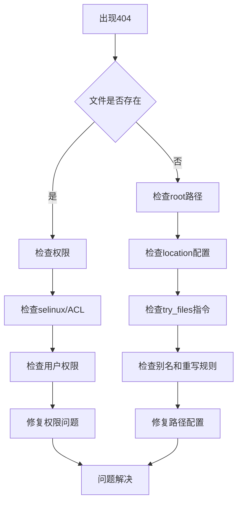

# Nginx常见问题诊断  

Nginx作为一款高性能的Web服务器和反向代理服务器，在实际运行过程中可能会遇到各种问题。本文将系统地介绍Nginx常见问题的诊断和解决方法，帮助你快速定位和修复问题。

## 1. 日志分析方法  

Nginx的日志是诊断问题的重要依据，掌握日志分析方法是解决问题的第一步。

### 1.1 错误日志关键字段  

Nginx错误日志记录了服务器运行过程中的异常情况，了解其关键字段有助于快速定位问题。

```nginx:c:\project\kphub\conf\log_format.conf  
# 自定义错误日志格式
log_format error_log_format '$time_local $severity $pid $message';  
error_log logs/error.log error_log_format;  

# 访问日志格式配置
log_format main '$remote_addr - $remote_user [$time_local] "$request" '
                '$status $body_bytes_sent "$http_referer" '
                '"$http_user_agent" "$http_x_forwarded_for" '
                '$request_time $upstream_response_time';
                
access_log logs/access.log main;
```

**错误日志关键字段说明：**

- `$time_local`：错误发生的时间
- `$severity`：错误级别（debug, info, notice, warn, error, crit, alert, emerg）
- `$pid`：产生错误的Nginx进程ID
- `$message`：详细的错误信息

**错误级别说明：**

| 级别 | 说明 | 示例 |
|------|------|------|
| debug | 调试信息 | 连接建立、请求处理细节 |
| info | 普通信息 | 服务启动、配置加载成功 |
| notice | 重要信息 | 服务器重新加载配置 |
| warn | 警告信息 | 客户端提前关闭连接 |
| error | 错误信息 | 无法打开文件、上游服务器连接失败 |
| crit | 严重错误 | SSL证书问题、内存分配失败 |
| alert | 必须立即处理的错误 | 系统调用失败 |
| emerg | 紧急情况 | 配置文件语法错误、端口绑定失败 |

### 1.2 日志实时监控  

实时监控日志可以帮助你在问题发生时立即发现并处理。

```powershell:c:\project\kphub\scripts\log_monitor.ps1  
# 实时监控错误日志中的错误和警告信息
Get-Content c:\project\kphub\logs\error.log -Wait | Select-String "error|warn"  

# 监控特定HTTP状态码（如500、502、503、504）
Get-Content c:\project\kphub\logs\access.log -Wait | Select-String " 50[0-9] "

# 监控响应时间超过1秒的请求
Get-Content c:\project\kphub\logs\access.log -Wait | 
    Where-Object { $_ -match '(\d+\.\d+)$' -and [double]$matches[1] -gt 1 }
```

**高级日志分析技巧：**

1. **统计错误类型分布**：
   ```powershell:c:\project\kphub\scripts\error_stats.ps1
   Get-Content c:\project\kphub\logs\error.log | 
       Select-String -Pattern "(\w+):" | 
       ForEach-Object { $_.Matches.Groups[1].Value } | 
       Group-Object | 
       Sort-Object -Property Count -Descending | 
       Format-Table -Property Name, Count
   ```

2. **分析高频访问IP**：
   ```powershell:c:\project\kphub\scripts\ip_stats.ps1
   Get-Content c:\project\kphub\logs\access.log | 
       ForEach-Object { ($_ -split ' ')[0] } | 
       Group-Object | 
       Sort-Object -Property Count -Descending | 
       Select-Object -First 10 | 
       Format-Table -Property Name, Count
   ```

3. **提取慢请求URL**：
   ```powershell:c:\project\kphub\scripts\slow_requests.ps1
   Get-Content c:\project\kphub\logs\access.log | 
       Where-Object { $_ -match '(\d+\.\d+)$' -and [double]$matches[1] -gt 3 } |
       ForEach-Object {
           $parts = $_ -split ' '
           $url = ($parts[6] -split ' ')[1]
           $time = $matches[1]
           [PSCustomObject]@{
               URL = $url
               Time = [double]$time
           }
       } | 
       Sort-Object -Property Time -Descending |
       Format-Table -Property URL, Time
   ```

## 2. 常见错误类型  

了解Nginx常见的错误类型及其解决方案，可以帮助你更快地解决问题。

### 2.1 502 Bad Gateway  

502错误表示Nginx作为代理服务器无法从上游服务器获得有效响应。

**诊断步骤**：  

1. **检查后端服务状态**：
   - 验证上游服务器是否正常运行
   - 检查上游服务器的负载情况
   - 确认网络连接是否正常

2. **验证代理配置**：
   - 检查`proxy_pass`指令中的地址是否正确
   - 确认上游服务器的端口是否开放
   - 验证DNS解析是否正确

3. **查看连接超时设置**：
   - 检查`proxy_connect_timeout`、`proxy_read_timeout`和`proxy_send_timeout`设置
   - 确认超时时间是否足够长

4. **检查错误日志**：
   - 查找与上游服务器连接相关的错误信息
   - 关注"connect() failed"、"upstream timed out"等关键词

**解决方案**：  

```nginx:c:\project\kphub\conf\fix_502.conf  
# 增加超时时间
proxy_connect_timeout 60s;  # 连接上游服务器的超时时间
proxy_read_timeout 300s;    # 从上游服务器读取响应的超时时间
proxy_send_timeout 300s;    # 向上游服务器发送请求的超时时间

# 启用上游服务器健康检查
upstream backend {
    server 192.168.1.10:8080 max_fails=3 fail_timeout=30s;
    server 192.168.1.11:8080 max_fails=3 fail_timeout=30s;
    server 192.168.1.12:8080 backup;  # 备用服务器
}

# 缓冲区设置
proxy_buffer_size 16k;
proxy_buffers 4 32k;
proxy_busy_buffers_size 64k;

# 错误处理
proxy_next_upstream error timeout http_502 http_503 http_504;
proxy_next_upstream_tries 3;  # 尝试其他上游服务器的最大次数

# 启用长连接
proxy_http_version 1.1;
proxy_set_header Connection "";
```

**常见502错误原因及解决方法：**

| 原因 | 症状 | 解决方法 |
|------|------|----------|
| 上游服务器宕机 | 所有请求返回502 | 重启上游服务器或切换到备用服务器 |
| 上游服务器过载 | 间歇性502错误 | 增加上游服务器资源或启用负载均衡 |
| 连接超时设置过短 | 处理耗时请求时出现502 | 增加超时设置值 |
| 缓冲区设置不足 | 大响应返回502 | 增加代理缓冲区大小 |
| 防火墙/安全组阻止 | 无法建立连接 | 检查防火墙规则，确保端口开放 |

### 2.2 404 Not Found  

404错误表示请求的资源不存在，这可能是由多种原因导致的。

**诊断流程**：  



**详细诊断步骤：**

1. **确认文件是否存在**：
   ```powershell:c:\project\kphub\scripts\check_file.ps1
   $requestPath = "c:\project\kphub\html\missing-file.html"
   if (Test-Path $requestPath) {
       Write-Host "文件存在，检查权限和Nginx配置"
   } else {
       Write-Host "文件不存在，检查路径配置或创建文件"
   }
   ```

2. **检查root路径配置**：
   ```nginx:c:\project\kphub\conf\check_root.conf
   # 确保root路径正确
   server {
       listen 80;
       server_name example.com;
       
       # 正确的根路径配置
       root c:/project/kphub/html;
       
       # 调试：临时输出请求路径
       location / {
           add_header X-Debug-Path $request_filename always;
           try_files $uri $uri/ /index.html;
       }
   }
   ```

3. **检查location匹配规则**：
   ```nginx:c:\project\kphub\conf\location_debug.conf
   # 添加调试信息以检查location匹配
   location / {
       add_header X-Location "root-location" always;
       try_files $uri $uri/ /index.html;
   }
   
   location /api/ {
       add_header X-Location "api-location" always;
       proxy_pass http://backend;
   }
   
   # 确保静态文件location正确
   location ~* \.(js|css|png|jpg|jpeg|gif|ico)$ {
       add_header X-Location "static-location" always;
       expires max;
   }
   ```

4. **检查别名和重写规则**：
   ```nginx:c:\project\kphub\conf\alias_check.conf
   # 检查别名配置
   location /images/ {
       alias c:/project/kphub/static/img/;
       add_header X-Real-Path $request_filename always;
   }
   
   # 检查重写规则
   location /old/ {
       rewrite ^/old/(.*)$ /new/$1 permanent;
   }
   ```

**常见404错误原因及解决方法：**

| 原因 | 诊断方法 | 解决方案 |
|------|----------|----------|
| 文件确实不存在 | 检查文件系统 | 创建所需文件或修改客户端请求 |
| root路径配置错误 | 检查配置文件中的root指令 | 修正root路径指向正确的目录 |
| location匹配问题 | 添加调试头查看匹配的location | 调整location优先级或修改匹配规则 |
| 权限问题 | 检查文件权限 | 确保Nginx工作进程有权限访问文件 |
| try_files配置错误 | 检查try_files指令 | 修正try_files指令中的路径 |
| 别名(alias)配置错误 | 检查alias指令 | 确保alias路径以斜杠结尾 |

## 3. 性能问题诊断  

性能问题可能表现为响应缓慢、连接超时或服务器资源使用率高等情况。

### 3.1 高CPU占用排查  

高CPU占用可能导致服务响应缓慢，需要及时排查原因。

```powershell:c:\project\kphub\scripts\cpu_profile.ps1  
# 找出CPU占用高的worker进程  
Write-Host "查找CPU占用高的Nginx进程..."
Get-Process -Name nginx | Sort-Object CPU -Descending | Select-Object -First 5 | 
    Format-Table Id, ProcessName, CPU, WorkingSet, Handles

# 分析Nginx进程的线程状态
Write-Host "`n分析进程线程状态..."
$highCpuProcess = Get-Process -Name nginx | Sort-Object CPU -Descending | Select-Object -First 1
if ($highCpuProcess) {
    $highCpuProcess.Threads | Sort-Object TotalProcessorTime -Descending | 
        Select-Object -First 5 | Format-Table Id, TotalProcessorTime, WaitReason, ThreadState
}

# 检查系统整体CPU使用情况
Write-Host "`n系统CPU使用情况:"
Get-Counter '\Processor(_Total)\% Processor Time' | Format-Table

# 检查Nginx配置中的worker_processes设置
Write-Host "`n检查Nginx worker进程配置:"
$configFile = "c:\project\kphub\conf\nginx.conf"
if (Test-Path $configFile) {
    $workerConfig = Select-String -Path $configFile -Pattern "worker_processes"
    if ($workerConfig) {
        Write-Host $workerConfig
    } else {
        Write-Host "未找到worker_processes配置"
    }
}

# 提供优化建议
Write-Host "`n可能的优化建议:"
$cpuCount = (Get-WmiObject -Class Win32_ComputerSystem).NumberOfLogicalProcessors
Write-Host "- 系统有$cpuCount个逻辑处理器，建议设置worker_processes为$cpuCount"
Write-Host "- 检查是否有异常的客户端请求导致CPU占用高"
Write-Host "- 考虑启用缓存减轻CPU负载"
Write-Host "- 检查复杂的重写规则和正则表达式"
```

**高CPU占用常见原因及解决方法：**

| 原因 | 症状 | 解决方法 |
|------|------|----------|
| worker_processes设置不当 | 单个worker进程CPU使用率高 | 将worker_processes设置为CPU核心数 |
| 复杂的正则表达式 | 处理特定URL时CPU飙升 | 优化正则表达式或减少使用 |
| SSL处理负载高 | 处理HTTPS请求时CPU高 | 启用SSL会话缓存，考虑使用OCSP stapling |
| 大量小文件请求 | 静态文件服务CPU使用高 | 启用open_file_cache，合并小文件 |
| DoS攻击 | 突然的CPU使用率飙升 | 启用速率限制，配置防火墙规则 |

**优化配置示例：**

```nginx:c:\project\kphub\conf\cpu_optimize.conf
# CPU优化配置
worker_processes auto;  # 自动检测CPU核心数
worker_cpu_affinity auto;  # 自动绑定CPU核心

# 减少CPU密集型操作
sendfile on;
tcp_nopush on;
tcp_nodelay on;

# 文件描述符缓存
open_file_cache max=1000 inactive=20s;
open_file_cache_valid 30s;
open_file_cache_min_uses 2;
open_file_cache_errors on;

# SSL优化
ssl_session_cache shared:SSL:10m;
ssl_session_timeout 10m;
ssl_protocols TLSv1.2 TLSv1.3;
ssl_prefer_server_ciphers on;
ssl_ciphers ECDHE-ECDSA-AES128-GCM-SHA256:ECDHE-RSA-AES128-GCM-SHA256;

# 限制请求速率
limit_req_zone $binary_remote_addr zone=req_limit:10m rate=10r/s;
limit_req zone=req_limit burst=20 nodelay;
```

### 3.2 内存泄漏检测  

内存泄漏会导致Nginx进程占用内存不断增长，最终可能导致服务崩溃。

```powershell:c:\project\kphub\scripts\mem_check.ps1  
# 监控Nginx内存使用情况
Write-Host "开始监控Nginx内存使用情况，按Ctrl+C停止..."
Write-Host "时间`t`t进程ID`t内存使用(MB)`t变化"
Write-Host "------------------------------------------------------"

$lastMemory = @{}
$startTime = Get-Date

try {
    while ($true) {
        $processes = Get-Process -Name nginx -ErrorAction SilentlyContinue
        $currentTime = Get-Date
        $timeRunning = $currentTime - $startTime
        
        foreach ($process in $processes) {
            $pid = $process.Id
            $memoryMB = [math]::Round($process.WorkingSet / 1MB, 2)
            
            $change = ""
            if ($lastMemory.ContainsKey($pid)) {
                $diff = $memoryMB - $lastMemory[$pid]
                if ($diff -gt 0) {
                    $change = "+$diff MB ↑"
                } elseif ($diff -lt 0) {
                    $change = "$diff MB ↓"
                } else {
                    $change = "0 MB ="
                }
            }
            
            $lastMemory[$pid] = $memoryMB
            
            $timeString = $currentTime.ToString("HH:mm:ss")
            Write-Host "$timeString`t$pid`t$memoryMB MB`t$change"
        }
        
        # 每30秒检查一次
        Start-Sleep -Seconds 30
        
        # 分隔线
        if ($timeRunning.TotalMinutes -ge 5 -and $timeRunning.TotalMinutes % 5 -eq 0) {
            Write-Host "------------------------------------------------------"
        }
    }
} catch {
    Write-Host "`n监控已停止: $_" -ForegroundColor Red
} finally {
    Write-Host "`n内存使用监控已结束" -ForegroundColor Yellow
    
    # 分析结果
    Write-Host "`n内存使用分析:"
    foreach ($pid in $lastMemory.Keys) {
        $process = Get-Process -Id $pid -ErrorAction SilentlyContinue
        if ($process) {
            $runTime = ((Get-Date) - $process.StartTime).ToString("hh\:mm\:ss")
            Write-Host "进程ID: $pid, 运行时间: $runTime, 当前内存: $($lastMemory[$pid]) MB"
        }
    }
}
```

**内存问题诊断和解决方法：**

1. **识别内存泄漏模式**：
   - 持续增长：真正的内存泄漏
   - 阶梯式增长：可能是缓存或连接池扩展
   - 周期性波动：正常的内存使用模式

2. **常见内存问题原因**：
   - 第三方模块内存泄漏
   - 缓存配置不当
   - 连接处理不当
   - 大文件上传/下载

3. **解决方案**：
   ```nginx:c:\project\kphub\conf\memory_optimize.conf
   # 内存优化配置
   
   # 限制每个连接的请求数
   keepalive_requests 100;
   
   # 限制连接保持时间
   keepalive_timeout 65;
   
   # 限制客户端请求体大小
   client_max_body_size 10m;
   client_body_buffer_size 128k;
   
   # 优化代理缓冲区
   proxy_buffers 8 16k;
   proxy_buffer_size 32k;
   
   # 文件缓存设置
   open_file_cache max=5000 inactive=60s;
   
   # 定期重启worker进程
   worker_shutdown_timeout 30s;  # 优雅关闭超时
   ```

4. **监控和预防措施**：
   - 设置内存使用告警
   - 定期重启Nginx（如每周一次）
   - 升级到最新稳定版本
   - 减少不必要的第三方模块

## 4. 配置问题修复  

配置错误是Nginx问题的常见原因，掌握配置检查和修复方法非常重要。

### 4.1 配置语法检查  

在应用配置前进行语法检查可以避免因配置错误导致服务无法启动。

```powershell:c:\project\kphub\scripts\config_check.ps1  
# 检查Nginx配置语法
$configFile = "c:\project\kphub\conf\nginx.conf"
$nginxExe = "c:\project\kphub\nginx.exe"

Write-Host "检查Nginx配置语法..." -ForegroundColor Cyan

# 执行语法检查
$result = & $nginxExe -t -c $configFile 2>&1

# 分析结果
if ($LASTEXITCODE -eq 0) {
    Write-Host "配置检查通过!" -ForegroundColor Green
    $result | ForEach-Object { Write-Host $_ -ForegroundColor Green }
} else {
    Write-Host "配置检查失败!" -ForegroundColor Red
    $result | ForEach-Object { Write-Host $_ -ForegroundColor Red }
    
    # 尝试提取错误位置
    $errorLine = $result | Select-String -Pattern "in .+:(\d+)"
    if ($errorLine -and $errorLine.Matches.Groups.Count -gt 1) {
        $lineNumber = $errorLine.Matches.Groups[1].Value
        $errorFile = ($errorLine -split "in ")[1] -split ":", 2 | Select-Object -First 1
        
        Write-Host "`n错误位置: $errorFile 第 $lineNumber 行" -ForegroundColor Yellow
        
        # 显示错误上下文
        if (Test-Path $errorFile) {
            $content = Get-Content $errorFile
            $startLine = [Math]::Max(1, [int]$lineNumber - 3)
            $endLine = [Math]::Min($content.Count, [int]$lineNumber + 3)
            
            Write-Host "`n错误上下文:" -ForegroundColor Yellow
            for ($i = $startLine; $i -le $endLine; $i++) {
                $prefix = if ($i -eq [int]$lineNumber) { ">" } else { " " }
                Write-Host "$prefix $i: $($content[$i-1])" -ForegroundColor $(if ($i -eq [int]$lineNumber) { "Red" } else { "Gray" })
            }
        }
    }
}

# 检查常见配置问题
Write-Host "`n检查常见配置问题..." -ForegroundColor Cyan

# 检查server_name配置
$serverNames = Select-String -Path $configFile -Pattern "server_name\s+([^;]+);" -AllMatches
if ($serverNames) {
    Write-Host "找到以下server_name配置:" -ForegroundColor Yellow
    $serverNames.Matches | ForEach-Object {
        Write-Host "  " $_.Groups[1].Value.Trim()
    }
}

# 检查listen配置
$listenPorts = Select-String -Path $configFile -Pattern "listen\s+(\d+)" -AllMatches
if ($listenPorts) {
    Write-Host "`n找到以下listen端口配置:" -ForegroundColor Yellow
    $ports = @()
    $listenPorts.Matches | ForEach-Object {
        $port = $_.Groups[1].Value.Trim()
        $ports += $port
        Write-Host "  端口: $port"
    }
    
    # 检查端口冲突
    $duplicatePorts = $ports | Group-Object | Where-Object { $_.Count -gt 1 }
    if ($duplicatePorts) {
        Write-Host "`n警告: 发现重复的listen端口:" -ForegroundColor Red
        $duplicatePorts | ForEach-Object {
            Write-Host "  端口 $($_.Name) 出现 $($_.Count) 次" -ForegroundColor Red
        }
    }
}

# 检查文件路径
$filePaths = Select-String -Path $configFile -Pattern "(root|access_log|error_log|include)\s+([^;]+);" -AllMatches
if ($filePaths) {
    Write-Host "`n检查文件路径:" -ForegroundColor Yellow
    $filePaths.Matches | ForEach-Object {
        $directive = $_.Groups[1].Value
        $path = $_.Groups[2].Value.Trim().Replace('/', '\')
        
        # 如果是相对路径，转换为绝对路径
        if (-not [System.IO.Path]::IsPathRooted($path)) {
            $path = Join-Path -Path (Split-Path $configFile) -ChildPath $path
        }
        
        # 检查路径是否存在
        $exists = Test-Path $path
        $status = if ($exists) { "存在" } else { "不存在" }
        $color = if ($exists) { "Green" } else { "Red" }
        
        Write-Host "  $directive : $path - $status" -ForegroundColor $color
    }
}
```

**常见配置错误及解决方法：**

| 错误类型 | 错误信息 | 解决方法 |
|----------|----------|----------|
| 语法错误 | "directive X is not terminated by ;" | 添加缺失的分号 |
| 文件不存在 | "open() failed" | 确保引用的文件存在且路径正确 |
| 重复指令 | "duplicate X directive" | 删除重复的指令 |
| 端口被占用 | "bind() failed (98: Address already in use)" | 更改端口或停止占用端口的进程 |
| 权限问题 | "permission denied" | 确保Nginx有权限访问相关文件和目录 |

### 4.2 配置冲突定位  

复杂的Nginx配置可能存在冲突，开启调试日志有助于定位这些问题。

```nginx:c:\project\kphub\conf\debug.conf  
# 临时开启调试日志  
# 针对特定IP开启调试
debug_connection 192.168.1.100;  
error_log logs/debug.log debug;  

# 在http块中添加调试头
http {
    # 其他配置...
    
    # 添加调试信息到响应头
    add_header X-Debug-Config $server_name;
    add_header X-Debug-Uri $request_uri;
    add_header X-Debug-Host $host;
    
    # 在特定location中添加更多调试信息
    location /debug/ {
        add_header X-Debug-File $request_filename;
        add_header X-Debug-Args $args;
        add_header X-Debug-Method $request_method;
        return 200 "Debug Info: $request_uri on $server_name";
    }
}
```

**配置冲突检测工具：**

```powershell:c:\project\kphub\scripts\config_conflict.ps1
# 检测Nginx配置冲突
$configDir = "c:\project\kphub\conf"
$includeFiles = Get-ChildItem -Path $configDir -Filter "*.conf" -Recurse

Write-Host "分析Nginx配置文件中的潜在冲突..." -ForegroundColor Cyan

# 收集所有server块
$servers = @()
foreach ($file in $includeFiles) {
    $content = Get-Content $file.FullName -Raw
    
    # 提取server块
    $serverBlocks = [regex]::Matches($content, "server\s*{[^}]*}")
    
    foreach ($block in $serverBlocks) {
        # 提取server_name
        $serverNameMatch = [regex]::Match($block.Value, "server_name\s+([^;]+);")
        $serverNames = @()
        if ($serverNameMatch.Success) {
            $serverNames = $serverNameMatch.Groups[1].Value.Trim() -split "\s+"
        }
        
        # 提取listen
        $listenMatch = [regex]::Match($block.Value, "listen\s+([^;]+);")
        $listen = if ($listenMatch.Success) { $listenMatch.Groups[1].Value.Trim() } else { "80" }
        
        # 提取location块
        $
让我继续完成Nginx常见问题诊断文档的内容：

```powershell:c:\project\kphub\scripts\config_conflict.ps1
        # 提取location块
        $locationMatches = [regex]::Matches($block.Value, "location\s+([^{]+){[^}]*}")
        $locations = @()
        foreach ($locMatch in $locationMatches) {
            $locationPath = $locMatch.Groups[1].Value.Trim()
            $locations += $locationPath
        }
        
        # 添加到服务器列表
        foreach ($name in $serverNames) {
            $servers += [PSCustomObject]@{
                File = $file.FullName
                ServerName = $name
                Listen = $listen
                Locations = $locations
            }
        }
    }
}

# 检查server_name和listen冲突
$serverGroups = $servers | Group-Object -Property Listen, ServerName
$conflictGroups = $serverGroups | Where-Object { $_.Count -gt 1 }

if ($conflictGroups.Count -gt 0) {
    Write-Host "`n发现潜在的server_name和listen冲突:" -ForegroundColor Red
    foreach ($group in $conflictGroups) {
        Write-Host "  冲突配置: $($group.Name)" -ForegroundColor Red
        foreach ($server in $group.Group) {
            Write-Host "    - 文件: $($server.File)" -ForegroundColor Yellow
        }
    }
} else {
    Write-Host "`n未发现server_name和listen冲突" -ForegroundColor Green
}

# 检查location冲突
Write-Host "`n检查location路径冲突..." -ForegroundColor Cyan

$locationConflicts = @()
foreach ($server in $servers) {
    $exactLocations = @()
    $prefixLocations = @()
    $regexLocations = @()
    
    foreach ($loc in $server.Locations) {
        if ($loc -match "^~") {
            # 优先前缀匹配
            $prefixLocations += $loc.Substring(2).Trim()
        } elseif ($loc -match "^[=@]") {
            # 精确匹配或命名location
            $exactLocations += $loc.Substring(1).Trim()
        } elseif ($loc -match "^[~\*]") {
            # 正则匹配
            $regexLocations += $loc.Substring(1).Trim()
        } else {
            # 普通前缀匹配
            $prefixLocations += $loc.Trim()
        }
    }
    
    # 检查精确匹配冲突
    $exactDuplicates = $exactLocations | Group-Object | Where-Object { $_.Count -gt 1 }
    foreach ($dup in $exactDuplicates) {
        $locationConflicts += [PSCustomObject]@{
            ServerName = $server.ServerName
            Listen = $server.Listen
            File = $server.File
            ConflictType = "精确匹配冲突"
            Location = $dup.Name
            Count = $dup.Count
        }
    }
    
    # 检查前缀匹配冲突（嵌套路径）
    for ($i = 0; $i -lt $prefixLocations.Count; $i++) {
        for ($j = $i + 1; $j -lt $prefixLocations.Count; $j++) {
            $loc1 = $prefixLocations[$i]
            $loc2 = $prefixLocations[$j]
            
            # 检查一个路径是否是另一个的前缀
            if ($loc1.StartsWith($loc2) -or $loc2.StartsWith($loc1)) {
                $locationConflicts += [PSCustomObject]@{
                    ServerName = $server.ServerName
                    Listen = $server.Listen
                    File = $server.File
                    ConflictType = "前缀匹配冲突"
                    Location = "$loc1 和 $loc2"
                    Count = 2
                }
            }
        }
    }
}

if ($locationConflicts.Count -gt 0) {
    Write-Host "`n发现潜在的location冲突:" -ForegroundColor Red
    $locationConflicts | Format-Table -AutoSize
} else {
    Write-Host "`n未发现明显的location冲突" -ForegroundColor Green
}

Write-Host "`n配置分析完成" -ForegroundColor Cyan
```

## 5. 网络问题排查  

网络问题可能导致Nginx无法正常提供服务，了解网络问题排查方法非常重要。

### 5.1 连接数监控  

监控连接数可以帮助你了解服务器的负载情况，及时发现异常连接。

```powershell:c:\project\kphub\scripts\conn_stats.ps1  
# 连接状态监控脚本
$ports = @(80, 443)  # 要监控的端口
$interval = 5  # 监控间隔（秒）
$logFile = "c:\project\kphub\logs\connection_stats.log"

# 创建日志目录
$logDir = Split-Path -Parent $logFile
if (-not (Test-Path $logDir)) {
    New-Item -ItemType Directory -Path $logDir -Force | Out-Null
}

# 初始化日志
"时间,端口,ESTABLISHED,TIME_WAIT,CLOSE_WAIT,FIN_WAIT,SYN_SENT,LISTENING,总连接数" | Out-File -FilePath $logFile

Write-Host "开始监控连接状态，日志保存到: $logFile" -ForegroundColor Green
Write-Host "按Ctrl+C停止监控" -ForegroundColor Yellow

try {
    while ($true) {
        $timestamp = Get-Date -Format "yyyy-MM-dd HH:mm:ss"
        Write-Host "`n[$timestamp] 收集连接统计..." -ForegroundColor Cyan
        
        foreach ($port in $ports) {
            # 获取连接统计
            $connections = netstat -ano | Where-Object { $_ -match ":$port\s" }
            
            # 按状态分组
            $established = ($connections | Where-Object { $_ -match "ESTABLISHED" } | Measure-Object).Count
            $timeWait = ($connections | Where-Object { $_ -match "TIME_WAIT" } | Measure-Object).Count
            $closeWait = ($connections | Where-Object { $_ -match "CLOSE_WAIT" } | Measure-Object).Count
            $finWait = ($connections | Where-Object { $_ -match "FIN_WAIT" } | Measure-Object).Count
            $synSent = ($connections | Where-Object { $_ -match "SYN_SENT" } | Measure-Object).Count
            $listening = ($connections | Where-Object { $_ -match "LISTENING" } | Measure-Object).Count
            $total = ($connections | Measure-Object).Count
            
            # 输出到控制台
            Write-Host "端口 $port 连接统计:" -ForegroundColor White
            Write-Host "  ESTABLISHED: $established" -ForegroundColor $(if ($established -gt 1000) { "Red" } else { "Green" })
            Write-Host "  TIME_WAIT: $timeWait" -ForegroundColor $(if ($timeWait -gt 2000) { "Red" } elseif ($timeWait -gt 1000) { "Yellow" } else { "Green" })
            Write-Host "  CLOSE_WAIT: $closeWait" -ForegroundColor $(if ($closeWait -gt 100) { "Red" } else { "Green" })
            Write-Host "  FIN_WAIT: $finWait" -ForegroundColor $(if ($finWait -gt 100) { "Red" } else { "Green" })
            Write-Host "  SYN_SENT: $synSent" -ForegroundColor $(if ($synSent -gt 50) { "Red" } else { "Green" })
            Write-Host "  LISTENING: $listening" -ForegroundColor Green
            Write-Host "  总连接数: $total" -ForegroundColor $(if ($total -gt 3000) { "Red" } elseif ($total -gt 1500) { "Yellow" } else { "Green" })
            
            # 记录到日志
            "$timestamp,$port,$established,$timeWait,$closeWait,$finWait,$synSent,$listening,$total" | Out-File -FilePath $logFile -Append
            
            # 检查异常情况
            if ($closeWait -gt 100) {
                Write-Host "  警告: CLOSE_WAIT连接过多，可能存在应用程序未正确关闭连接的问题" -ForegroundColor Red
            }
            
            if ($timeWait -gt 2000) {
                Write-Host "  警告: TIME_WAIT连接过多，考虑调整TCP参数" -ForegroundColor Red
            }
            
            if ($established -gt 1000) {
                Write-Host "  警告: 活跃连接数过高，检查是否存在连接泄漏" -ForegroundColor Red
            }
        }
        
        # 获取进程连接信息
        Write-Host "`nNginx进程连接详情:" -ForegroundColor Cyan
        $nginxProcesses = Get-Process -Name nginx -ErrorAction SilentlyContinue
        foreach ($process in $nginxProcesses) {
            $pid = $process.Id
            $processConns = netstat -ano | Where-Object { $_ -match "\s+$pid$" }
            $connCount = ($processConns | Measure-Object).Count
            Write-Host "  进程ID: $pid, 连接数: $connCount" -ForegroundColor White
        }
        
        # 等待下一次检查
        Start-Sleep -Seconds $interval
    }
} catch {
    Write-Host "`n监控中断: $_" -ForegroundColor Red
} finally {
    Write-Host "`n连接监控已停止，数据已保存到: $logFile" -ForegroundColor Yellow
}
```

**连接状态说明：**

| 状态 | 说明 | 异常阈值 | 可能的问题 |
|------|------|----------|------------|
| ESTABLISHED | 已建立的活跃连接 | >1000 | 连接泄漏或高负载 |
| TIME_WAIT | 等待关闭的连接 | >2000 | 高频短连接，TCP参数配置不当 |
| CLOSE_WAIT | 等待应用关闭的连接 | >100 | 应用未正确关闭连接 |
| FIN_WAIT | 等待对方关闭的连接 | >100 | 网络问题或应用异常 |
| SYN_SENT | 正在建立的连接 | >50 | 可能遭受SYN洪水攻击 |

**优化TCP连接配置：**

```nginx:c:\project\kphub\conf\tcp_optimize.conf
# TCP连接优化配置

# 启用长连接
keepalive_timeout 65;
keepalive_requests 1000;

# 启用TCP快速关闭
tcp_nodelay on;

# 启用TCP连接复用
proxy_http_version 1.1;
proxy_set_header Connection "";

# 启用WebSocket支持
map $http_upgrade $connection_upgrade {
    default upgrade;
    '' close;
}

server {
    # 其他配置...
    
    # 应用WebSocket配置
    location /ws/ {
        proxy_pass http://backend;
        proxy_http_version 1.1;
        proxy_set_header Upgrade $http_upgrade;
        proxy_set_header Connection $connection_upgrade;
    }
}
```

### 5.2 端口冲突检测  

端口冲突会导致Nginx无法启动或某些功能无法正常工作。

```powershell:c:\project\kphub\scripts\port_check.ps1  
# 端口冲突检测脚本
param(
    [Parameter(Mandatory=$false)]
    [int[]]$Ports = @(80, 443)  # 默认检查80和443端口
)

Write-Host "检查端口占用情况..." -ForegroundColor Cyan

foreach ($port in $Ports) {
    Write-Host "`n检查端口 $port:" -ForegroundColor Yellow
    
    # 获取端口占用情况
    $connections = Get-NetTCPConnection -LocalPort $port -ErrorAction SilentlyContinue
    
    if ($connections) {
        Write-Host "  端口 $port 已被占用!" -ForegroundColor Red
        
        # 获取占用进程信息
        foreach ($conn in $connections) {
            $process = Get-Process -Id $conn.OwningProcess -ErrorAction SilentlyContinue
            
            if ($process) {
                $processName = $process.ProcessName
                $pid = $process.Id
                $path = $process.Path
                $startTime = $process.StartTime
                $runTime = ((Get-Date) - $startTime).ToString("hh\:mm\:ss")
                
                Write-Host "  占用进程:" -ForegroundColor Red
                Write-Host "    名称: $processName" -ForegroundColor White
                Write-Host "    PID: $pid" -ForegroundColor White
                Write-Host "    路径: $path" -ForegroundColor White
                Write-Host "    启动时间: $startTime (运行时间: $runTime)" -ForegroundColor White
                Write-Host "    连接状态: $($conn.State)" -ForegroundColor White
                
                # 如果是Nginx进程，提供更多信息
                if ($processName -eq "nginx") {
                    Write-Host "    这是Nginx进程，可能是已有Nginx实例正在运行" -ForegroundColor Yellow
                } else {
                    Write-Host "    解决方法: 停止进程 '$processName' 或更改Nginx监听端口" -ForegroundColor Yellow
                }
            } else {
                Write-Host "  无法获取进程信息 (PID: $($conn.OwningProcess))" -ForegroundColor Red
            }
        }
    } else {
        Write-Host "  端口 $port 未被占用，可以使用" -ForegroundColor Green
    }
}

# 检查Nginx配置中的端口
Write-Host "`n检查Nginx配置中的端口设置:" -ForegroundColor Cyan
$configDir = "c:\project\kphub\conf"
$configFiles = Get-ChildItem -Path $configDir -Filter "*.conf" -Recurse

$listenPorts = @()
foreach ($file in $configFiles) {
    $matches = Select-String -Path $file.FullName -Pattern "listen\s+(\d+)" -AllMatches
    
    foreach ($match in $matches) {
        foreach ($group in $match.Matches) {
            $port = $group.Groups[1].Value
            $listenPorts += [PSCustomObject]@{
                Port = $port
                File = $file.FullName
                Line = (Get-Content $file.FullName)[$match.LineNumber - 1].Trim()
            }
        }
    }
}

if ($listenPorts.Count -gt 0) {
    Write-Host "  在配置文件中找到以下监听端口:" -ForegroundColor Yellow
    $listenPorts | Format-Table -Property Port, File, Line -AutoSize
    
    # 检查配置的端口是否被占用
    foreach ($portInfo in $listenPorts) {
        $port = [int]$portInfo.Port
        $connections = Get-NetTCPConnection -LocalPort $port -ErrorAction SilentlyContinue
        
        if ($connections) {
            $process = Get-Process -Id $connections[0].OwningProcess -ErrorAction SilentlyContinue
            $processName = if ($process) { $process.ProcessName } else { "未知进程" }
            
            Write-Host "  警告: 配置的端口 $port 已被 $processName 占用" -ForegroundColor Red
        }
    }
} else {
    Write-Host "  未在配置文件中找到监听端口设置" -ForegroundColor Yellow
}

Write-Host "`n端口检查完成" -ForegroundColor Cyan
```

**解决端口冲突的方法：**

1. **停止占用端口的进程**：
   ```powershell
   # 停止占用80端口的进程
   $process = Get-Process -Id (Get-NetTCPConnection -LocalPort 80).OwningProcess
   Stop-Process -Id $process.Id -Force
   ```

2. **更改Nginx监听端口**：
   ```nginx:c:\project\kphub\conf\alternate_port.conf
   # 使用备用端口
   server {
       listen 8080;  # 使用8080替代80
       server_name example.com;
       
       # 其他配置...
   }
   ```

3. **使用不同的IP地址**：
   ```nginx:c:\project\kphub\conf\specific_ip.conf
   # 绑定到特定IP地址
   server {
       listen 192.168.1.10:80;  # 只在特定IP上监听80端口
       server_name example.com;
       
       # 其他配置...
   }
   ```

4. **配置Windows服务依赖**：
   ```powershell:c:\project\kphub\scripts\service_dependency.ps1
   # 设置Nginx服务依赖于可能冲突的服务
   # 这样Nginx会在其他服务之后启动
   sc.exe config nginx depend= "HTTP"
   ```

## 6. 安全相关问题  

安全问题可能导致服务被攻击或数据泄露，及时发现和解决安全问题非常重要。

### 6.1 SSL证书错误  

SSL证书问题会导致浏览器显示安全警告，影响用户体验和网站可信度。

**常见问题**：  
- ERR_CERT_COMMON_NAME_INVALID：证书域名不匹配
- ERR_CERT_DATE_INVALID：证书过期或未生效
- ERR_CERT_AUTHORITY_INVALID：证书不被信任
- SEC_ERROR_UNKNOWN_ISSUER：未知颁发者

**诊断工具：**

```powershell:c:\project\kphub\scripts\ssl_check.ps1
# SSL证书检查脚本
param(
    [Parameter(Mandatory=$false)]
    [string]$Domain = "example.com",
    
    [Parameter(Mandatory=$false)]
    [string]$CertPath = "c:\project\kphub\ssl\fullchain.pem"
)

Write-Host "SSL证书检查工具" -ForegroundColor Cyan
Write-Host "===================" -ForegroundColor Cyan

# 检查远程证书
if ($Domain) {
    Write-Host "`n检查域名 $Domain 的SSL证书:" -ForegroundColor Yellow
    
    try {
        # 创建TCP客户端
        $tcpClient = New-Object System.Net.Sockets.TcpClient
        $tcpClient.Connect($Domain, 443)
        
        # 创建SSL流
        $sslStream = New-Object System.Net.Security.SslStream($tcpClient.GetStream(), $false, {
            param($sender, $certificate, $chain, $sslPolicyErrors)
            return $true  # 接受所有证书以便检查
        })
        
        # 尝试验证
        $sslStream.AuthenticateAsClient($Domain)
        
        # 获取证书信息
        $cert = $sslStream.RemoteCertificate
        $x509 = [System.Security.Cryptography.X509Certificates.X509Certificate2]$cert
        
        # 显示证书信息
        Write-Host "  证书信息:" -ForegroundColor Green
        Write-Host "    主题: $($x509.Subject)" -ForegroundColor White
        Write-Host "    颁发者: $($x509.Issuer)" -ForegroundColor White
        Write-Host "    有效期: $($x509.NotBefore) 至 $($x509.NotAfter)" -ForegroundColor White
        Write-Host "    序列号: $($x509.SerialNumber)" -ForegroundColor White
        Write-Host "    指纹: $($x509.Thumbprint)" -ForegroundColor White
        
        # 检查证书有效期
        $now = Get-Date
        if ($now -lt $x509.NotBefore) {
            Write-Host "  警告: 证书尚未生效!" -ForegroundColor Red
        } elseif ($now -gt $x509.NotAfter) {
            Write-Host "  警告: 证书已过期!" -ForegroundColor Red
        } else {
            $daysRemaining = ($x509.NotAfter - $now).Days
            if ($daysRemaining -lt 30) {
                Write-Host "  警告: 证书将在 $daysRemaining 天后过期!" -ForegroundColor Yellow
            } else {
                Write-Host "  证书有效期正常，还有 $daysRemaining 天过期" -ForegroundColor Green
            }
        }
        
        # 检查主题备用名称
        $sanExtension = $x509.Extensions | Where-Object { $_.Oid.FriendlyName -eq "Subject Alternative Name" }
        if ($sanExtension) {
            $sanData = $sanExtension.Format(1)
            Write-Host "  主题备用名称:" -ForegroundColor White
            Write-Host "    $sanData" -ForegroundColor White
            
            # 检查域名是否在SAN中
            if ($sanData -match $Domain) {
                Write-Host "  域名 $Domain 包含在证书的SAN中" -ForegroundColor Green
            } else {
                Write-Host "  警告: 域名 $Domain 不在证书的SAN中!" -ForegroundColor Red
            }
        } else {
            Write-Host "  警告: 证书没有SAN扩展，这在现代浏览器中可能导致问题" -ForegroundColor Yellow
        }
        
        # 关闭连接
        $sslStream.Close()
        $tcpClient.Close()
    } catch {
        Write-Host "  错误: 无法获取SSL证书信息: $_" -ForegroundColor Red
    }
}

# 检查本地证书文件
if (Test-Path $CertPath) {
    Write-Host "`n检查本地证书文件 $CertPath:" -ForegroundColor Yellow
    
    try {
        $cert = New-Object System.Security.Cryptography.X509Certificates.X509Certificate2 $CertPath
        
        # 显示证书信息
        Write-Host "  证书信息:" -ForegroundColor Green
        Write-Host "    主题: $($cert.Subject)" -ForegroundColor White
        Write-Host "    颁发者: $($cert.Issuer)" -ForegroundColor White
        Write-Host "    有效期: $($cert.NotBefore) 至 $($cert.NotAfter)" -ForegroundColor White
        Write-Host "    序列号: $($cert.SerialNumber)" -ForegroundColor White
        Write-Host "    指纹: $($cert.Thumbprint)" -ForegroundColor White
        
        # 检查证书有效期
        $now = Get-Date
        if ($now -lt $cert.NotBefore) {
            Write-Host "  警告: 证书尚未生效!" -ForegroundColor Red
        } elseif ($now -gt $cert.NotAfter) {
            Write-Host "  警告: 证书已过期!" -ForegroundColor Red
        } else {
            $daysRemaining = ($cert.NotAfter - $now).Days
            if ($daysRemaining -lt 30) {
                Write-Host "  警告: 证书将在 $daysRemaining 天后过期!" -ForegroundColor Yellow
            } else {
                Write-Host "  证书有效期正常，还有 $daysRemaining 天过期" -ForegroundColor Green
            }
        }
    } catch {
        Write-Host "  错误: 无法读取证书文件: $_" -ForegroundColor Red
    }
} else {
    Write-Host "`n警告: 本地证书文件 $CertPath 不存在" -ForegroundColor Yellow
}

# 检查Nginx SSL配置
$configDir = "c:\project\kphub\conf"
$sslConfigs = Get-ChildItem -Path $configDir -Filter "*.conf" -Recurse | 
    Select-String -Pattern "ssl_certificate|ssl_certificate_key|ssl_trusted_certificate" -List

if ($sslConfigs) {
    Write-Host "`n检查Nginx SSL配置:" -ForegroundColor Yellow
    
    foreach ($config in $sslConfigs) {
        Write-Host "  文件: $($config.Path)" -ForegroundColor White
        
        $sslLines = Select-String -Path $config.Path -Pattern "ssl_certificate|ssl_certificate_key|ssl_trusted_certificate"
        foreach ($line in $sslLines) {
            Write-Host "    $($line.Line.Trim())" -ForegroundColor White
            
            # 提取证书路径
            if ($line.Line -match "(ssl_certificate|ssl_certificate_key|ssl_trusted_certificate)\s+([^;]+);") {
                $certType = $matches[1]
                $path = $matches[2].Trim()
                
                # 检查文件是否存在
                if (Test-Path $path) {
                    Write-Host "      ✓ 文件存在" -ForegroundColor Green
                } else {
                    Write-Host "      ✗ 文件不存在!" -ForegroundColor Red
                }
            }
        }
    }
} else {
    Write-Host "`n未找到SSL配置" -ForegroundColor Yellow
}

Write-Host "`nSSL证书检查完成" -ForegroundColor Cyan
```

**解决方案**：  

```nginx:c:\project\kphub\conf\ssl_fix.conf  
# SSL配置优化
server {
    listen 443 ssl http2;
    server_name example.com www.example.com;
    
    # 证书配置
    ssl_certificate c:\project\kphub\ssl\fullchain.pem;  # 包含服务器证书和中间证书
    ssl_certificate_key c:\project\kphub\ssl\privkey.pem;  # 私钥
    ssl_trusted_certificate c:\project\kphub\ssl\chain.pem;  # 用于OCSP stapling验证
    
    # 协议和加密套件
    ssl_protocols TLSv1.2 TLSv1.3;  # 禁用旧版本协议
    ssl_prefer_server_ciphers on;
    ssl_ciphers ECDHE-ECDSA-AES128-GCM-SHA256:ECDHE-RSA-AES128-GCM-SHA256:ECDHE-ECDSA-AES256-GCM-SHA384:ECDHE-RSA-AES256-GCM-SHA384:DHE-RSA-AES128-GCM-SHA256:DHE-RSA-AES256-GCM-SHA384;
    
    # 会话缓存
    ssl_session_cache shared:SSL:10m;
    ssl_session_timeout 10m;
    ssl_session_tickets off;
    
    # OCSP Stapling
    ssl_stapling on;
    ssl_stapling_verify on;
    resolver 8.8.8.8 8.8.4.4 valid=300s;
    resolver_timeout 5s;
    
    # HSTS (谨慎启用)
    # add_header Strict-Transport-Security "max-age=63072000; includeSubDomains; preload" always;
    
    # 其他安全头
    add_header X-Content-Type-Options nosniff;
    add_header X-Frame-Options SAMEORIGIN;
    add_header X-XSS-Protection "1; mode=block";
    
    # 重定向HTTP到HTTPS
    location / {
        # 内容配置...
    }
}

# HTTP重定向到HTTPS
server {
    listen 80;
    server_name example.com www.example.com;
    
    # 永久重定向到HTTPS
    return 301 https://$host$request_uri;
}
```

**SSL证书问题解决方法：**

| 问题 | 原因 | 解决方法 |
|------|------|----------|
| ERR_CERT_COMMON_NAME_INVALID | 证书域名不匹配 | 确保证书包含正确的域名，检查SAN扩展 |
| ERR_CERT_DATE_INVALID | 证书过期或未生效 | 更新证书，检查服务器时间是否正确 |
| ERR_CERT_AUTHORITY_INVALID | 证书链不完整 | 确保提供完整的证书链，包括中间证书 |
| SEC_ERROR_UNKNOWN_ISSUER | 自签名或不受信任的证书 | 使用受信任的CA颁发的证书，或添加自签名证书到信任存储 |

### 6.2 安全漏洞检测

定期检查Nginx配置中的安全漏洞，可以防止潜在的安全风险。

```powershell:c:\project\kphub\scripts\security_scan.ps1
# Nginx安全扫描脚本
$configDir = "c:\project\kphub\conf"
$reportFile = "c:\project\kphub\logs\security_report.html"

Write-Host "开始Nginx安全配置扫描..." -ForegroundColor Cyan

# 定义安全检查项
$securityChecks = @(
    @{
        Name = "禁用SSLv3和TLSv1.0
让我继续完成Nginx常见问题诊断文档的内容：

```powershell:c:\project\kphub\scripts\security_scan.ps1
# Nginx安全扫描脚本
$configDir = "c:\project\kphub\conf"
$reportFile = "c:\project\kphub\logs\security_report.html"

Write-Host "开始Nginx安全配置扫描..." -ForegroundColor Cyan

# 定义安全检查项
$securityChecks = @(
    @{
        Name = "禁用SSLv3和TLSv1.0/1.1";
        Pattern = "ssl_protocols";
        GoodPattern = "TLSv1.2|TLSv1.3";
        BadPattern = "SSLv3|TLSv1(\s|;)|TLSv1.1";
        Risk = "高";
        Description = "旧版SSL/TLS协议存在已知安全漏洞";
        Recommendation = "仅启用TLSv1.2和TLSv1.3: ssl_protocols TLSv1.2 TLSv1.3;";
    },
    @{
        Name = "安全的加密套件";
        Pattern = "ssl_ciphers";
        GoodPattern = "ECDHE.*AES.*GCM";
        BadPattern = "RC4|DES|MD5|SHA1|EXP|EXPORT|ADH|NULL";
        Risk = "高";
        Description = "弱加密套件可能被破解";
        Recommendation = "使用强加密套件，如: ssl_ciphers ECDHE-ECDSA-AES128-GCM-SHA256:ECDHE-RSA-AES128-GCM-SHA256;";
    },
    @{
        Name = "HTTP严格传输安全(HSTS)";
        Pattern = "Strict-Transport-Security";
        GoodPattern = "max-age=\d{7,}";
        BadPattern = "";
        Risk = "中";
        Description = "缺少HSTS头可能导致降级攻击";
        Recommendation = "添加: add_header Strict-Transport-Security \"max-age=63072000; includeSubDomains; preload\";";
    },
    @{
        Name = "X-Content-Type-Options";
        Pattern = "X-Content-Type-Options";
        GoodPattern = "nosniff";
        BadPattern = "";
        Risk = "低";
        Description = "防止浏览器MIME类型嗅探";
        Recommendation = "添加: add_header X-Content-Type-Options nosniff;";
    },
    @{
        Name = "X-Frame-Options";
        Pattern = "X-Frame-Options";
        GoodPattern = "DENY|SAMEORIGIN";
        BadPattern = "";
        Risk = "中";
        Description = "防止点击劫持攻击";
        Recommendation = "添加: add_header X-Frame-Options SAMEORIGIN;";
    },
    @{
        Name = "X-XSS-Protection";
        Pattern = "X-XSS-Protection";
        GoodPattern = "1; mode=block";
        BadPattern = "";
        Risk = "中";
        Description = "启用浏览器XSS过滤";
        Recommendation = "添加: add_header X-XSS-Protection \"1; mode=block\";";
    },
    @{
        Name = "Content-Security-Policy";
        Pattern = "Content-Security-Policy";
        GoodPattern = "";
        BadPattern = "";
        Risk = "中";
        Description = "限制资源加载，防止XSS";
        Recommendation = "添加适合的CSP策略";
    },
    @{
        Name = "服务器信息泄露";
        Pattern = "server_tokens";
        GoodPattern = "off";
        BadPattern = "on";
        Risk = "低";
        Description = "隐藏Nginx版本信息";
        Recommendation = "添加: server_tokens off;";
    },
    @{
        Name = "目录列表";
        Pattern = "autoindex";
        GoodPattern = "off";
        BadPattern = "on";
        Risk = "高";
        Description = "目录列表可能泄露敏感文件";
        Recommendation = "禁用: autoindex off;";
    },
    @{
        Name = "请求限制";
        Pattern = "limit_req_zone|limit_conn_zone";
        GoodPattern = "";
        BadPattern = "";
        Risk = "中";
        Description = "缺少请求限制可能导致DoS攻击";
        Recommendation = "添加请求限制配置";
    }
)

# 初始化结果
$results = @()

# 扫描配置文件
$configFiles = Get-ChildItem -Path $configDir -Filter "*.conf" -Recurse

foreach ($file in $configFiles) {
    $content = Get-Content $file.FullName -Raw
    
    foreach ($check in $securityChecks) {
        $result = [PSCustomObject]@{
            File = $file.FullName
            Check = $check.Name
            Status = "未检测"
            Risk = $check.Risk
            Description = $check.Description
            Recommendation = $check.Recommendation
            LineNumber = $null
            Line = $null
        }
        
        # 检查是否存在相关配置
        $matches = Select-String -Path $file.FullName -Pattern $check.Pattern -AllMatches
        
        if ($matches) {
            foreach ($match in $matches) {
                $line = $match.Line.Trim()
                $lineNumber = $match.LineNumber
                
                # 检查是否符合安全要求
                if ($check.GoodPattern -and $line -match $check.GoodPattern) {
                    $result.Status = "通过"
                } elseif ($check.BadPattern -and $line -match $check.BadPattern) {
                    $result.Status = "不安全"
                    $result.LineNumber = $lineNumber
                    $result.Line = $line
                } else {
                    $result.Status = "警告"
                    $result.LineNumber = $lineNumber
                    $result.Line = $line
                }
                
                $results += $result
            }
        } else {
            # 配置不存在
            $result.Status = "缺失"
            $results += $result
        }
    }
}

# 生成HTML报告
$htmlHeader = @"
<!DOCTYPE html>
<html>
<head>
    <title>Nginx安全配置扫描报告</title>
    <style>
        body { font-family: Arial, sans-serif; margin: 20px; }
        h1 { color: #333; }
        table { border-collapse: collapse; width: 100%; margin-top: 20px; }
        th, td { border: 1px solid #ddd; padding: 8px; text-align: left; }
        th { background-color: #f2f2f2; }
        tr:nth-child(even) { background-color: #f9f9f9; }
        .pass { color: green; }
        .fail { color: red; }
        .warning { color: orange; }
        .missing { color: blue; }
        .high { background-color: #ffdddd; }
        .medium { background-color: #ffffcc; }
        .low { background-color: #e6f3ff; }
    </style>
</head>
<body>
    <h1>Nginx安全配置扫描报告</h1>
    <p>扫描时间: $(Get-Date -Format "yyyy-MM-dd HH:mm:ss")</p>
    <p>扫描目录: $configDir</p>
    
    <h2>扫描结果摘要</h2>
"@

# 生成摘要
$summary = $results | Group-Object Status | ForEach-Object {
    [PSCustomObject]@{
        Status = $_.Name
        Count = $_.Count
    }
}

$summaryHtml = "<table>
    <tr>
        <th>状态</th>
        <th>数量</th>
    </tr>"

foreach ($item in $summary) {
    $statusClass = switch ($item.Status) {
        "通过" { "pass" }
        "不安全" { "fail" }
        "警告" { "warning" }
        "缺失" { "missing" }
        default { "" }
    }
    
    $summaryHtml += "<tr>
        <td class='$statusClass'>$($item.Status)</td>
        <td>$($item.Count)</td>
    </tr>"
}

$summaryHtml += "</table>"

# 生成详细结果
$detailsHtml = "<h2>详细扫描结果</h2>
<table>
    <tr>
        <th>文件</th>
        <th>检查项</th>
        <th>状态</th>
        <th>风险</th>
        <th>描述</th>
        <th>行号</th>
        <th>配置</th>
        <th>建议</th>
    </tr>"

foreach ($result in $results) {
    $statusClass = switch ($result.Status) {
        "通过" { "pass" }
        "不安全" { "fail" }
        "警告" { "warning" }
        "缺失" { "missing" }
        default { "" }
    }
    
    $riskClass = switch ($result.Risk) {
        "高" { "high" }
        "中" { "medium" }
        "低" { "low" }
        default { "" }
    }
    
    $detailsHtml += "<tr class='$riskClass'>
        <td>$($result.File)</td>
        <td>$($result.Check)</td>
        <td class='$statusClass'>$($result.Status)</td>
        <td>$($result.Risk)</td>
        <td>$($result.Description)</td>
        <td>$($result.LineNumber)</td>
        <td>$($result.Line)</td>
        <td>$($result.Recommendation)</td>
    </tr>"
}

$detailsHtml += "</table>"

$htmlFooter = @"
</body>
</html>
"@

# 保存HTML报告
$htmlReport = $htmlHeader + $summaryHtml + $detailsHtml + $htmlFooter
$htmlReport | Out-File -FilePath $reportFile -Encoding utf8

Write-Host "安全扫描完成，报告已保存到: $reportFile" -ForegroundColor Green

# 显示高风险问题
$highRisks = $results | Where-Object { $_.Risk -eq "高" -and $_.Status -ne "通过" }
if ($highRisks) {
    Write-Host "`n发现高风险安全问题:" -ForegroundColor Red
    foreach ($risk in $highRisks) {
        Write-Host "  - $($risk.Check): $($risk.Status)" -ForegroundColor Red
        Write-Host "    文件: $($risk.File)" -ForegroundColor Yellow
        if ($risk.LineNumber) {
            Write-Host "    行号: $($risk.LineNumber), 配置: $($risk.Line)" -ForegroundColor Yellow
        }
        Write-Host "    建议: $($risk.Recommendation)" -ForegroundColor Green
    }
}

# 打开报告
Start-Process $reportFile
```

## 7. 故障排查工具箱  

为了更高效地解决Nginx问题，这里提供了一套实用的故障排查工具和方法。

### 7.1 常用诊断命令  

下面是一些常用的Nginx诊断命令及其用途：

| 问题类型       | 诊断命令                     | 说明 |
|----------------|-----------------------------|------|
| 配置检查       | `nginx -t -c c:\project\kphub\conf\nginx.conf` | 检查配置文件语法 |
| 进程状态       | `tasklist /fi "imagename eq nginx.exe"` | 查看Nginx进程状态 |
| 端口占用       | `netstat -ano \| findstr ":80"` | 检查80端口占用情况 |
| 连接状态       | `netstat -an \| findstr "ESTABLISHED"` | 查看已建立的连接 |
| 文件权限       | `icacls c:\project\kphub\logs` | 检查文件/目录权限 |
| 日志查看       | `Get-Content c:\project\kphub\logs\error.log -Tail 50` | 查看最近50行错误日志 |
| 重载配置       | `nginx -s reload` | 重新加载配置文件 |
| 平滑重启       | `nginx -s reopen` | 重新打开日志文件 |
| 停止服务       | `nginx -s stop` | 快速停止Nginx |
| 优雅停止       | `nginx -s quit` | 等待请求处理完毕后停止 |

**综合诊断脚本：**

```powershell:c:\project\kphub\scripts\nginx_diagnose.ps1
# Nginx综合诊断脚本
param(
    [Parameter(Mandatory=$false)]
    [string]$ConfigPath = "c:\project\kphub\conf\nginx.conf",
    
    [Parameter(Mandatory=$false)]
    [string]$LogsDir = "c:\project\kphub\logs",
    
    [Parameter(Mandatory=$false)]
    [int[]]$Ports = @(80, 443)
)

function Write-Header {
    param([string]$Title)
    
    Write-Host "`n=============================================" -ForegroundColor Cyan
    Write-Host " $Title" -ForegroundColor Cyan
    Write-Host "=============================================" -ForegroundColor Cyan
}

# 检查Nginx安装
Write-Header "检查Nginx安装"
$nginxExe = "c:\project\kphub\nginx.exe"

if (Test-Path $nginxExe) {
    $nginxVersion = & $nginxExe -v 2>&1
    Write-Host "Nginx已安装: $nginxVersion" -ForegroundColor Green
} else {
    Write-Host "错误: 未找到Nginx可执行文件 ($nginxExe)" -ForegroundColor Red
    exit
}

# 检查配置文件
Write-Header "检查配置文件"
if (Test-Path $ConfigPath) {
    Write-Host "配置文件存在: $ConfigPath" -ForegroundColor Green
    
    # 检查配置语法
    $configTest = & $nginxExe -t -c $ConfigPath 2>&1
    if ($LASTEXITCODE -eq 0) {
        Write-Host "配置语法检查通过:" -ForegroundColor Green
        $configTest | ForEach-Object { Write-Host "  $_" -ForegroundColor Green }
    } else {
        Write-Host "配置语法检查失败:" -ForegroundColor Red
        $configTest | ForEach-Object { Write-Host "  $_" -ForegroundColor Red }
    }
} else {
    Write-Host "错误: 配置文件不存在 ($ConfigPath)" -ForegroundColor Red
}

# 检查Nginx进程
Write-Header "检查Nginx进程"
$nginxProcesses = Get-Process -Name nginx -ErrorAction SilentlyContinue

if ($nginxProcesses) {
    Write-Host "Nginx进程运行中:" -ForegroundColor Green
    $nginxProcesses | Format-Table Id, ProcessName, CPU, WorkingSet, StartTime -AutoSize
    
    # 检查主进程和工作进程
    $masterProcess = $nginxProcesses | Where-Object { $_.Modules[0].ModuleName -match "nginx\.exe$" } | Select-Object -First 1
    $workerProcesses = $nginxProcesses | Where-Object { $_.Id -ne $masterProcess.Id }
    
    Write-Host "主进程: PID $($masterProcess.Id)" -ForegroundColor White
    Write-Host "工作进程: $($workerProcesses.Count) 个" -ForegroundColor White
} else {
    Write-Host "警告: 未发现运行中的Nginx进程" -ForegroundColor Yellow
}

# 检查端口
Write-Header "检查端口状态"
foreach ($port in $Ports) {
    $portConnections = Get-NetTCPConnection -LocalPort $port -ErrorAction SilentlyContinue
    
    if ($portConnections) {
        $process = Get-Process -Id $portConnections[0].OwningProcess -ErrorAction SilentlyContinue
        $processName = if ($process) { $process.ProcessName } else { "未知进程" }
        
        if ($processName -eq "nginx") {
            Write-Host "端口 $port 正在被Nginx使用 (PID: $($portConnections[0].OwningProcess))" -ForegroundColor Green
        } else {
            Write-Host "警告: 端口 $port 被其他进程占用: $processName (PID: $($portConnections[0].OwningProcess))" -ForegroundColor Red
        }
        
        # 显示连接统计
        $established = ($portConnections | Where-Object { $_.State -eq "Established" } | Measure-Object).Count
        $timeWait = ($portConnections | Where-Object { $_.State -eq "TimeWait" } | Measure-Object).Count
        $listening = ($portConnections | Where-Object { $_.State -eq "Listen" } | Measure-Object).Count
        
        Write-Host "  连接统计: 已建立=$established, 等待关闭=$timeWait, 监听=$listening" -ForegroundColor White
    } else {
        Write-Host "端口 $port 未被使用" -ForegroundColor Yellow
    }
}

# 检查日志
Write-Header "检查日志文件"
if (Test-Path $LogsDir) {
    $logFiles = Get-ChildItem -Path $LogsDir -Filter "*.log"
    
    if ($logFiles) {
        Write-Host "找到以下日志文件:" -ForegroundColor Green
        foreach ($log in $logFiles) {
            $size = "{0:N2} MB" -f ($log.Length / 1MB)
            $lastWrite = $log.LastWriteTime
            $age = (Get-Date) - $lastWrite
            
            Write-Host "  $($log.Name) - 大小: $size, 最后修改: $lastWrite ($($age.Days)天前)" -ForegroundColor White
            
            # 检查是否可写
            try {
                $testFile = Join-Path -Path $LogsDir -ChildPath "write_test.tmp"
                [System.IO.File]::Create($testFile).Close()
                Remove-Item $testFile -Force
                Write-Host "  日志目录可写" -ForegroundColor Green
            } catch {
                Write-Host "  警告: 日志目录可能没有写入权限" -ForegroundColor Red
            }
            
            # 检查最近错误
            if ($log.Name -eq "error.log") {
                $recentErrors = Get-Content $log.FullName -Tail 5
                if ($recentErrors) {
                    Write-Host "  最近错误日志:" -ForegroundColor Yellow
                    $recentErrors | ForEach-Object { Write-Host "    $_" -ForegroundColor Yellow }
                }
            }
        }
    } else {
        Write-Host "警告: 未找到日志文件" -ForegroundColor Yellow
    }
} else {
    Write-Host "错误: 日志目录不存在 ($LogsDir)" -ForegroundColor Red
}

# 检查系统资源
Write-Header "检查系统资源"

# CPU使用率
$cpuUsage = Get-Counter '\Processor(_Total)\% Processor Time' | Select-Object -ExpandProperty CounterSamples | Select-Object -ExpandProperty CookedValue
Write-Host "CPU使用率: $($cpuUsage.ToString("0.00"))%" -ForegroundColor $(if ($cpuUsage -gt 80) { "Red" } elseif ($cpuUsage -gt 60) { "Yellow" } else { "Green" })

# 内存使用率
$computerSystem = Get-CimInstance -ClassName Win32_ComputerSystem
$operatingSystem = Get-CimInstance -ClassName Win32_OperatingSystem
$totalMemory = [math]::Round($computerSystem.TotalPhysicalMemory / 1GB, 2)
$freeMemory = [math]::Round($operatingSystem.FreePhysicalMemory / 1MB, 2)
$usedMemory = $totalMemory - ($freeMemory / 1024)
$memoryUsage = ($usedMemory / $totalMemory) * 100

Write-Host "内存使用: $($usedMemory.ToString("0.00")) GB / $($totalMemory.ToString("0.00")) GB ($($memoryUsage.ToString("0.00"))%)" -ForegroundColor $(if ($memoryUsage -gt 80) { "Red" } elseif ($memoryUsage -gt 60) { "Yellow" } else { "Green" })

# 磁盘使用率
$drive = Get-PSDrive C
$totalSize = [math]::Round($drive.Used / 1GB + $drive.Free / 1GB, 2)
$usedSize = [math]::Round($drive.Used / 1GB, 2)
$diskUsage = ($drive.Used / ($drive.Used + $drive.Free)) * 100

Write-Host "磁盘使用 (C:): $($usedSize.ToString("0.00")) GB / $($totalSize.ToString("0.00")) GB ($($diskUsage.ToString("0.00"))%)" -ForegroundColor $(if ($diskUsage -gt 80) { "Red" } elseif ($diskUsage -gt 60) { "Yellow" } else { "Green" })

# 网络连接数
$totalConnections = (Get-NetTCPConnection | Measure-Object).Count
Write-Host "总TCP连接数: $totalConnections" -ForegroundColor $(if ($totalConnections -gt 5000) { "Red" } elseif ($totalConnections -gt 2000) { "Yellow" } else { "Green" })

# 诊断总结
Write-Header "诊断总结"
$issues = @()

# 检查配置问题
if (-not (Test-Path $ConfigPath) -or $LASTEXITCODE -ne 0) {
    $issues += "配置文件问题"
}

# 检查进程问题
if (-not $nginxProcesses) {
    $issues += "Nginx未运行"
} elseif ($workerProcesses.Count -lt 2) {
    $issues += "工作进程数量可能不足"
}

# 检查端口问题
$portIssue = $false
foreach ($port in $Ports) {
    $portConnections = Get-NetTCPConnection -LocalPort $port -ErrorAction SilentlyContinue
    if ($portConnections) {
        $process = Get-Process -Id $portConnections[0].OwningProcess -ErrorAction SilentlyContinue
        if ($process -and $process.ProcessName -ne "nginx") {
            $portIssue = $true
        }
    } else {
        $portIssue = $true
    }
}
if ($portIssue) {
    $issues += "端口配置或占用问题"
}

# 检查日志问题
if (-not (Test-Path $LogsDir) -or -not $logFiles) {
    $issues += "日志文件问题"
}

# 检查资源问题
if ($cpuUsage -gt 80 -or $memoryUsage -gt 80 -or $diskUsage -gt 80) {
    $issues += "系统资源不足"
}

if ($issues.Count -eq 0) {
    Write-Host "诊断结果: 未发现明显问题" -ForegroundColor Green
} else {
    Write-Host "诊断结果: 发现以下问题" -ForegroundColor Red
    foreach ($issue in $issues) {
        Write-Host "  - $issue" -ForegroundColor Red
    }
}

Write-Host "`n诊断完成。如需更详细的分析，请查看日志文件。" -ForegroundColor Cyan
```

### 7.2 紧急恢复步骤  

当Nginx服务出现严重问题时，可以按照以下步骤进行紧急恢复：

1. **回滚最近配置更改**
   ```powershell:c:\project\kphub\scripts\config_rollback.ps1
   # 配置回滚脚本
   param(
       [Parameter(Mandatory=$false)]
       [string]$ConfigDir = "c:\project\kphub\conf",
       
       [Parameter(Mandatory=$false)]
       [string]$BackupDir = "c:\project\kphub\conf\backup"
   )
   
   # 检查备份目录
   if (-not (Test-Path $BackupDir)) {
       Write-Host "错误: 备份目录不存在 ($BackupDir)" -ForegroundColor Red
       exit
   }
   
   # 获取最新的备份
   $latestBackup = Get-ChildItem -Path $BackupDir -Directory | Sort-Object LastWriteTime -Descending | Select-Object -First 1
   
   if (-not $latestBackup) {
       Write-Host "错误: 未找到备份" -ForegroundColor Red
       exit
   }
   
   $backupDate = $latestBackup.Name
   $backupPath = $latestBackup.FullName
   
   Write-Host "找到备份: $backupDate" -ForegroundColor Green
   Write-Host "备份路径: $backupPath" -ForegroundColor Green
   
   # 确认回滚
   $confirm = Read-Host "确认回滚到此备份? (Y/N)"
   if ($confirm -ne "Y" -and $confirm -ne "y") {
       Write-Host "回滚已取消" -ForegroundColor Yellow
       exit
   }
   
   # 备份当前配置
   $currentBackupDir = Join-Path -Path $BackupDir -ChildPath "pre_rollback_$(Get-Date -Format 'yyyyMMdd_HHmmss')"
   New-Item -ItemType Directory -Path $currentBackupDir -Force | Out-Null
   
   Write-Host "备份当前配置到: $currentBackupDir" -ForegroundColor Yellow
   Copy-Item -Path "$ConfigDir\*.conf" -Destination $currentBackupDir -Recurse -Force
   
   # 执行回滚
   Write-Host "开始回滚配置..." -ForegroundColor Cyan
   
   # 复制备份文件到配置目录
   Copy-Item -Path "$backupPath\*.conf" -Destination $ConfigDir -Force
   
   # 检查配置语法
   $nginxExe = "c:\project\kphub\nginx.exe"
   $configTest = & $nginxExe -t 2>&1
   
   if ($LASTEXITCODE -eq 0) {
       Write-Host "配置语法检查通过" -ForegroundColor Green
       
       # 重新加载配置
       $reload = & $nginxExe -s reload 2>&1
       Write-Host "配置已重新加载" -ForegroundColor Green
       
       Write-Host "回滚成功完成" -ForegroundColor Green
   } else {
       Write-Host "警告: 回滚后配置语法检查失败" -ForegroundColor Red
       $configTest | ForEach-Object { Write-Host "  $_" -ForegroundColor Red }
       
       # 提示恢复
       $restoreConfirm = Read-Host "是否恢复到回滚前的配置? (Y/N)"
       if ($restoreConfirm -eq "Y" -or $restoreConfirm -eq "y") {
           Copy-Item -Path "$currentBackupDir\*.conf" -Destination $ConfigDir -Force
           Write-Host "已恢复到回滚前的配置" -ForegroundColor Yellow
       } else {
           Write-Host "保留回滚后的配置，请手动修复语法错误" -ForegroundColor Yellow
       }
   }
   ```

2. **降级到稳定版本**
   ```powershell:c:\project\kphub\scripts\nginx_downgrade.ps1
   # Nginx版本降级脚本
   param(
       [Parameter(Mandatory=$false)]
       [string]$StableVersionPath = "c:\project\kphub\backup\stable",
       
       [Parameter(Mandatory=$false)]
       [string]$NginxPath = "c:\project\kphub"
   )
   
   # 检查稳定版本目录
   if (-not (Test-Path $StableVersionPath)) {
       Write-Host "错误: 稳定版本目录不存在 ($StableVersionPath)" -ForegroundColor Red
       exit
   }
   
   # 检查稳定版本文件
   $stableExe = Join-Path -Path $StableVersionPath -ChildPath "nginx.exe"
   if (-not (Test-Path $stableExe)) {
       Write-Host "错误: 稳定版本的nginx.exe不存在" -ForegroundColor Red
       exit
   }
   
   # 确认降级
   $confirm = Read-Host "确认降级到稳定版本? 这将停止当前运行的Nginx (Y/N)"
   if ($confirm -ne "Y" -and $confirm -ne "y") {
       Write-Host "降级已取消" -ForegroundColor Yellow
       exit
   }
   
   # 停止当前Nginx
   Write-Host "停止当前运行的Nginx..." -ForegroundColor Yellow
   $stopResult = & "$NginxPath\nginx.exe" -s stop 2>&1
   Start-Sleep -Seconds 2
   
   # 检查是否还有Nginx进程
   $nginxProcesses = Get-Process -Name nginx -ErrorAction SilentlyContinue
   if ($nginxProcesses) {
       Write-Host "警告: 仍有Nginx进程在运行，尝试强制结束..." -ForegroundColor Red
       $nginxProcesses | Stop-Process -Force
让我继续完成Nginx常见问题诊断文档的内容：

```powershell:c:\project\kphub\scripts\nginx_downgrade.ps1
       # 检查是否还有Nginx进程
       $nginxProcesses = Get-Process -Name nginx -ErrorAction SilentlyContinue
       if ($nginxProcesses) {
           Write-Host "警告: 仍有Nginx进程在运行，尝试强制结束..." -ForegroundColor Red
           $nginxProcesses | Stop-Process -Force
           Start-Sleep -Seconds 2
       }
   }
   
   # 备份当前版本
   $backupDir = Join-Path -Path $NginxPath -ChildPath "backup\current_$(Get-Date -Format 'yyyyMMdd_HHmmss')"
   New-Item -ItemType Directory -Path $backupDir -Force | Out-Null
   
   Write-Host "备份当前版本到: $backupDir" -ForegroundColor Yellow
   
   # 备份可执行文件和DLL
   Copy-Item -Path "$NginxPath\nginx.exe" -Destination $backupDir -Force
   Copy-Item -Path "$NginxPath\*.dll" -Destination $backupDir -Force
   
   # 复制稳定版本文件
   Write-Host "复制稳定版本文件..." -ForegroundColor Cyan
   Copy-Item -Path "$StableVersionPath\nginx.exe" -Destination $NginxPath -Force
   Copy-Item -Path "$StableVersionPath\*.dll" -Destination $NginxPath -Force
   
   # 启动稳定版本
   Write-Host "启动稳定版本Nginx..." -ForegroundColor Green
   $startResult = Start-Process -FilePath "$NginxPath\nginx.exe" -NoNewWindow -PassThru
   
   if ($startResult.ExitCode -eq $null) {
       Write-Host "稳定版本Nginx已启动" -ForegroundColor Green
       
       # 检查是否正常运行
       Start-Sleep -Seconds 2
       $runningProcesses = Get-Process -Name nginx -ErrorAction SilentlyContinue
       
       if ($runningProcesses) {
           Write-Host "降级成功完成，Nginx稳定版本正在运行" -ForegroundColor Green
           
           # 获取版本信息
           $versionInfo = & "$NginxPath\nginx.exe" -v 2>&1
           Write-Host "当前运行版本: $versionInfo" -ForegroundColor Green
       } else {
           Write-Host "警告: 稳定版本启动后未检测到运行进程" -ForegroundColor Red
       }
   } else {
       Write-Host "错误: 无法启动稳定版本Nginx" -ForegroundColor Red
       
       # 恢复原版本
       $restoreConfirm = Read-Host "是否恢复到原版本? (Y/N)"
       if ($restoreConfirm -eq "Y" -or $restoreConfirm -eq "y") {
           Copy-Item -Path "$backupDir\nginx.exe" -Destination $NginxPath -Force
           Copy-Item -Path "$backupDir\*.dll" -Destination $NginxPath -Force
           
           # 尝试启动原版本
           Start-Process -FilePath "$NginxPath\nginx.exe" -NoNewWindow
           Write-Host "已尝试恢复并启动原版本" -ForegroundColor Yellow
       }
   }
   ```

3. **临时启用备用服务器**
   ```powershell:c:\project\kphub\scripts\enable_backup_server.ps1
   # 启用备用服务器脚本
   param(
       [Parameter(Mandatory=$false)]
       [string]$MainServerIP = "192.168.1.10",
       
       [Parameter(Mandatory=$false)]
       [string]$BackupServerIP = "192.168.1.11",
       
       [Parameter(Mandatory=$false)]
       [string]$ConfigPath = "c:\project\kphub\conf\nginx.conf",
       
       [Parameter(Mandatory=$false)]
       [string]$UpstreamFile = "c:\project\kphub\conf\upstream.conf"
   )
   
   Write-Host "准备启用备用服务器..." -ForegroundColor Cyan
   
   # 检查主服务器状态
   Write-Host "检查主服务器 $MainServerIP 状态..." -ForegroundColor Yellow
   $pingResult = Test-Connection -ComputerName $MainServerIP -Count 2 -Quiet
   
   if ($pingResult) {
       Write-Host "主服务器可以ping通，进一步检查Web服务..." -ForegroundColor Green
       
       # 检查Web服务
       try {
           $webRequest = Invoke-WebRequest -Uri "http://$MainServerIP" -TimeoutSec 5 -UseBasicParsing
           if ($webRequest.StatusCode -eq 200) {
               Write-Host "主服务器Web服务正常运行，无需切换" -ForegroundColor Green
               
               $forceSwitch = Read-Host "是否强制切换到备用服务器? (Y/N)"
               if ($forceSwitch -ne "Y" -and $forceSwitch -ne "y") {
                   Write-Host "操作已取消" -ForegroundColor Yellow
                   exit
               }
           } else {
               Write-Host "主服务器Web服务返回状态码: $($webRequest.StatusCode)" -ForegroundColor Red
           }
       } catch {
           Write-Host "主服务器Web服务无法访问: $_" -ForegroundColor Red
       }
   } else {
       Write-Host "主服务器无法ping通，准备切换到备用服务器" -ForegroundColor Red
   }
   
   # 检查备用服务器状态
   Write-Host "检查备用服务器 $BackupServerIP 状态..." -ForegroundColor Yellow
   $backupPingResult = Test-Connection -ComputerName $BackupServerIP -Count 2 -Quiet
   
   if (-not $backupPingResult) {
       Write-Host "错误: 备用服务器无法ping通，无法切换" -ForegroundColor Red
       exit
   }
   
   # 检查备用服务器Web服务
   try {
       $backupWebRequest = Invoke-WebRequest -Uri "http://$BackupServerIP" -TimeoutSec 5 -UseBasicParsing
       if ($backupWebRequest.StatusCode -ne 200) {
           Write-Host "警告: 备用服务器Web服务返回状态码: $($backupWebRequest.StatusCode)" -ForegroundColor Yellow
           
           $continueSwitch = Read-Host "备用服务器可能不完全正常，是否继续切换? (Y/N)"
           if ($continueSwitch -ne "Y" -and $continueSwitch -ne "y") {
               Write-Host "操作已取消" -ForegroundColor Yellow
               exit
           }
       } else {
           Write-Host "备用服务器Web服务正常运行" -ForegroundColor Green
       }
   } catch {
       Write-Host "警告: 备用服务器Web服务无法访问: $_" -ForegroundColor Yellow
       
       $continueSwitch = Read-Host "备用服务器Web服务可能不可用，是否继续切换? (Y/N)"
       if ($continueSwitch -ne "Y" -and $continueSwitch -ne "y") {
           Write-Host "操作已取消" -ForegroundColor Yellow
           exit
       }
   }
   
   # 修改upstream配置
   Write-Host "修改upstream配置..." -ForegroundColor Cyan
   
   if (Test-Path $UpstreamFile) {
       # 备份原配置
       $backupFile = "$UpstreamFile.bak.$(Get-Date -Format 'yyyyMMdd_HHmmss')"
       Copy-Item -Path $UpstreamFile -Destination $backupFile -Force
       Write-Host "已备份原配置到: $backupFile" -ForegroundColor Green
       
       # 读取配置
       $content = Get-Content -Path $UpstreamFile -Raw
       
       # 替换配置
       $newContent = $content -replace "server\s+$MainServerIP\s+weight=10;", "server $MainServerIP weight=10 down;"
       $newContent = $newContent -replace "server\s+$BackupServerIP\s+backup;", "server $BackupServerIP weight=10;"
       
       # 写入新配置
       $newContent | Set-Content -Path $UpstreamFile -Force
       
       Write-Host "已更新upstream配置" -ForegroundColor Green
   } else {
       Write-Host "警告: upstream配置文件不存在，尝试直接修改主配置文件" -ForegroundColor Yellow
       
       if (Test-Path $ConfigPath) {
           # 备份原配置
           $backupFile = "$ConfigPath.bak.$(Get-Date -Format 'yyyyMMdd_HHmmss')"
           Copy-Item -Path $ConfigPath -Destination $backupFile -Force
           Write-Host "已备份原配置到: $backupFile" -ForegroundColor Green
           
           # 读取配置
           $content = Get-Content -Path $ConfigPath -Raw
           
           # 替换配置
           $newContent = $content -replace "server\s+$MainServerIP\s+weight=10;", "server $MainServerIP weight=10 down;"
           $newContent = $newContent -replace "server\s+$BackupServerIP\s+backup;", "server $BackupServerIP weight=10;"
           
           # 写入新配置
           $newContent | Set-Content -Path $ConfigPath -Force
           
           Write-Host "已更新主配置文件" -ForegroundColor Green
       } else {
           Write-Host "错误: 无法找到配置文件" -ForegroundColor Red
           exit
       }
   }
   
   # 检查配置语法
   $nginxExe = "c:\project\kphub\nginx.exe"
   $configTest = & $nginxExe -t 2>&1
   
   if ($LASTEXITCODE -eq 0) {
       Write-Host "配置语法检查通过" -ForegroundColor Green
       
       # 重新加载配置
       $reload = & $nginxExe -s reload 2>&1
       Write-Host "配置已重新加载，备用服务器已启用" -ForegroundColor Green
       
       # 创建恢复脚本
       $restoreScript = @"
   # 恢复到主服务器的脚本
   # 生成时间: $(Get-Date -Format 'yyyy-MM-dd HH:mm:ss')
   
   # 恢复原配置
   Copy-Item -Path "$backupFile" -Destination "$UpstreamFile" -Force
   
   # 重新加载Nginx配置
   & "$nginxExe" -s reload
   
   Write-Host "已恢复到主服务器配置" -ForegroundColor Green
   "@
       
       $restoreScriptPath = "c:\project\kphub\scripts\restore_main_server.ps1"
       $restoreScript | Set-Content -Path $restoreScriptPath -Force
       
       Write-Host "已生成恢复脚本: $restoreScriptPath" -ForegroundColor Green
       Write-Host "要恢复到主服务器，请运行此脚本" -ForegroundColor Yellow
   } else {
       Write-Host "错误: 配置语法检查失败" -ForegroundColor Red
       $configTest | ForEach-Object { Write-Host "  $_" -ForegroundColor Red }
       
       # 恢复原配置
       Copy-Item -Path $backupFile -Destination $UpstreamFile -Force
       Write-Host "已恢复原配置" -ForegroundColor Yellow
   }
   ```

4. **快速诊断和修复常见问题**
   ```powershell:c:\project\kphub\scripts\quick_fix.ps1
   # Nginx快速修复脚本
   param(
       [Parameter(Mandatory=$true)]
       [ValidateSet("502", "404", "503", "504", "permission", "connection", "memory", "cpu", "ssl")]
       [string]$ProblemType,
       
       [Parameter(Mandatory=$false)]
       [string]$ConfigDir = "c:\project\kphub\conf",
       
       [Parameter(Mandatory=$false)]
       [string]$LogsDir = "c:\project\kphub\logs"
   )
   
   Write-Host "Nginx快速修复工具" -ForegroundColor Cyan
   Write-Host "问题类型: $ProblemType" -ForegroundColor Yellow
   
   # 通用检查
   $nginxExe = "c:\project\kphub\nginx.exe"
   $nginxRunning = Get-Process -Name nginx -ErrorAction SilentlyContinue
   
   if (-not $nginxRunning) {
       Write-Host "警告: Nginx未运行" -ForegroundColor Red
       
       $startNginx = Read-Host "是否启动Nginx? (Y/N)"
       if ($startNginx -eq "Y" -or $startNginx -eq "y") {
           Start-Process -FilePath $nginxExe -NoNewWindow
           Write-Host "已尝试启动Nginx" -ForegroundColor Green
           Start-Sleep -Seconds 2
       }
   }
   
   # 根据问题类型执行不同的修复
   switch ($ProblemType) {
       "502" {
           Write-Host "修复502 Bad Gateway问题..." -ForegroundColor Cyan
           
           # 检查上游服务器
           Write-Host "检查上游服务器配置..." -ForegroundColor Yellow
           
           # 查找upstream配置
           $upstreamFiles = Get-ChildItem -Path $ConfigDir -Filter "*.conf" -Recurse | 
               Select-String -Pattern "upstream\s+\w+\s+{" -List
           
           if ($upstreamFiles) {
               foreach ($file in $upstreamFiles) {
                   Write-Host "在文件中找到upstream配置: $($file.Path)" -ForegroundColor Green
                   
                   # 提取upstream块
                   $content = Get-Content $file.Path -Raw
                   $upstreamBlocks = [regex]::Matches($content, "upstream\s+\w+\s+{[^}]*}")
                   
                   foreach ($block in $upstreamBlocks) {
                       Write-Host "  Upstream配置:" -ForegroundColor White
                       Write-Host "  $($block.Value)" -ForegroundColor White
                       
                       # 提取服务器地址
                       $servers = [regex]::Matches($block.Value, "server\s+([^;]+);")
                       
                       foreach ($server in $servers) {
                           $serverConfig = $server.Groups[1].Value.Trim()
                           Write-Host "    检查服务器: $serverConfig" -ForegroundColor Yellow
                           
                           # 提取IP地址
                           if ($serverConfig -match "^(\d+\.\d+\.\d+\.\d+)") {
                               $ip = $matches[1]
                               
                               # 检查连接性
                               $pingResult = Test-Connection -ComputerName $ip -Count 1 -Quiet
                               if ($pingResult) {
                                   Write-Host "    ✓ 服务器可以ping通" -ForegroundColor Green
                                   
                                   # 提取端口
                                   $port = 80
                                   if ($serverConfig -match ":(\d+)") {
                                       $port = $matches[1]
                                   }
                                   
                                   # 检查端口
                                   try {
                                       $tcpClient = New-Object System.Net.Sockets.TcpClient
                                       $connectionResult = $tcpClient.BeginConnect($ip, $port, $null, $null)
                                       $waitResult = $connectionResult.AsyncWaitHandle.WaitOne(1000, $false)
                                       
                                       if ($waitResult) {
                                           Write-Host "    ✓ 端口 $port 开放" -ForegroundColor Green
                                       } else {
                                           Write-Host "    ✗ 端口 $port 关闭" -ForegroundColor Red
                                           Write-Host "    建议: 检查上游服务器的端口是否正确开放" -ForegroundColor Yellow
                                       }
                                       
                                       $tcpClient.Close()
                                   } catch {
                                       Write-Host "    ✗ 无法连接到端口 $port: $_" -ForegroundColor Red
                                   }
                               } else {
                                   Write-Host "    ✗ 服务器无法ping通" -ForegroundColor Red
                                   Write-Host "    建议: 检查服务器是否在线，网络连接是否正常" -ForegroundColor Yellow
                               }
                           }
                       }
                   }
               }
           } else {
               Write-Host "未找到upstream配置" -ForegroundColor Yellow
           }
           
           # 检查超时设置
           Write-Host "`n检查超时设置..." -ForegroundColor Yellow
           
           $timeoutFiles = Get-ChildItem -Path $ConfigDir -Filter "*.conf" -Recurse | 
               Select-String -Pattern "proxy_connect_timeout|proxy_read_timeout|proxy_send_timeout" -List
           
           if ($timeoutFiles) {
               foreach ($file in $timeoutFiles) {
                   Write-Host "在文件中找到超时配置: $($file.Path)" -ForegroundColor Green
                   
                   $timeoutLines = Select-String -Path $file.Path -Pattern "proxy_connect_timeout|proxy_read_timeout|proxy_send_timeout"
                   foreach ($line in $timeoutLines) {
                       Write-Host "  $($line.Line.Trim())" -ForegroundColor White
                       
                       # 检查超时值是否过小
                       if ($line.Line -match "(proxy_\w+_timeout)\s+(\d+)") {
                           $timeoutType = $matches[1]
                           $timeoutValue = [int]$matches[2]
                           
                           if ($timeoutValue -lt 60) {
                               Write-Host "  ⚠ $timeoutType 值可能过小 ($timeoutValue)" -ForegroundColor Yellow
                               Write-Host "  建议: 增加超时值，例如设置为60s或更高" -ForegroundColor Yellow
                               
                               # 提供修复命令
                               Write-Host "  修复命令:" -ForegroundColor Green
                               Write-Host "  (Get-Content '$($file.Path)') -replace '$($line.Line.Trim())', '$timeoutType 60s;' | Set-Content '$($file.Path)'" -ForegroundColor Green
                           }
                       }
                   }
               }
           } else {
               Write-Host "未找到超时配置，可能需要添加" -ForegroundColor Yellow
               Write-Host "建议添加以下配置:" -ForegroundColor Green
               Write-Host "proxy_connect_timeout 60s;" -ForegroundColor Green
               Write-Host "proxy_read_timeout 300s;" -ForegroundColor Green
               Write-Host "proxy_send_timeout 300s;" -ForegroundColor Green
           }
           
           # 检查错误日志
           Write-Host "`n检查错误日志中的相关信息..." -ForegroundColor Yellow
           
           $errorLogPath = Join-Path -Path $LogsDir -ChildPath "error.log"
           if (Test-Path $errorLogPath) {
               $recentErrors = Get-Content $errorLogPath -Tail 50 | 
                   Where-Object { $_ -match "connect() failed|upstream timed out|no live upstreams|upstream prematurely closed connection" }
               
               if ($recentErrors) {
                   Write-Host "找到相关错误:" -ForegroundColor Red
                   $recentErrors | ForEach-Object { Write-Host "  $_" -ForegroundColor Red }
                   
                   # 分析错误
                   if ($recentErrors -match "connect\(\) failed.*Connection refused") {
                       Write-Host "`n诊断: 上游服务器拒绝连接，可能未运行或端口错误" -ForegroundColor Yellow
                   } elseif ($recentErrors -match "upstream timed out") {
                       Write-Host "`n诊断: 上游服务器响应超时，可能负载过高或网络问题" -ForegroundColor Yellow
                   } elseif ($recentErrors -match "no live upstreams") {
                       Write-Host "`n诊断: 所有上游服务器都不可用" -ForegroundColor Yellow
                   }
               } else {
                   Write-Host "未在最近的错误日志中找到相关错误" -ForegroundColor Green
               }
           } else {
               Write-Host "错误日志文件不存在" -ForegroundColor Yellow
           }
           
           # 提供综合建议
           Write-Host "`n502问题修复建议:" -ForegroundColor Cyan
           Write-Host "1. 确保上游服务器正常运行并可访问" -ForegroundColor White
           Write-Host "2. 检查防火墙设置，确保允许Nginx连接到上游服务器" -ForegroundColor White
           Write-Host "3. 增加超时设置值" -ForegroundColor White
           Write-Host "4. 考虑添加备用服务器" -ForegroundColor White
           Write-Host "5. 检查上游服务器的负载情况" -ForegroundColor White
       }
       
       "404" {
           Write-Host "修复404 Not Found问题..." -ForegroundColor Cyan
           
           # 检查root路径配置
           Write-Host "检查root路径配置..." -ForegroundColor Yellow
           
           $rootFiles = Get-ChildItem -Path $ConfigDir -Filter "*.conf" -Recurse | 
               Select-String -Pattern "root\s+[^;]+;" -List
           
           if ($rootFiles) {
               foreach ($file in $rootFiles) {
                   Write-Host "在文件中找到root配置: $($file.Path)" -ForegroundColor Green
                   
                   $rootLines = Select-String -Path $file.Path -Pattern "root\s+([^;]+);"
                   foreach ($line in $rootLines) {
                       if ($line.Line -match "root\s+([^;]+);") {
                           $rootPath = $matches[1].Trim()
                           Write-Host "  Root路径: $rootPath" -ForegroundColor White
                           
                           # 检查路径是否存在
                           if (Test-Path $rootPath) {
                               Write-Host "  ✓ 路径存在" -ForegroundColor Green
                               
                               # 检查权限
                               try {
                                   $testFile = Join-Path -Path $rootPath -ChildPath "nginx_test_file.tmp"
                                   [System.IO.File]::Create($testFile).Close()
                                   Remove-Item $testFile -Force
                                   Write-Host "  ✓ 路径可写" -ForegroundColor Green
                               } catch {
                                   Write-Host "  ✗ 路径权限问题: $_" -ForegroundColor Red
                                   Write-Host "  建议: 检查目录权限，确保Nginx工作进程有权限访问" -ForegroundColor Yellow
                               }
                           } else {
                               Write-Host "  ✗ 路径不存在" -ForegroundColor Red
                               Write-Host "  建议: 创建目录或修正配置中的路径" -ForegroundColor Yellow
                               
                               # 提供修复命令
                               Write-Host "  修复命令 (创建目录):" -ForegroundColor Green
                               Write-Host "  New-Item -ItemType Directory -Path '$rootPath' -Force" -ForegroundColor Green
                           }
                       }
                   }
               }
           } else {
               Write-Host "未找到root配置" -ForegroundColor Yellow
           }
           
           # 检查location配置
           Write-Host "`n检查location配置..." -ForegroundColor Yellow
           
           $locationFiles = Get-ChildItem -Path $ConfigDir -Filter "*.conf" -Recurse | 
               Select-String -Pattern "location\s+[^{]+{" -List
           
           if ($locationFiles) {
               foreach ($file in $locationFiles) {
                   Write-Host "在文件中找到location配置: $($file.Path)" -ForegroundColor Green
                   
                   $content = Get-Content $file.Path -Raw
                   $locationBlocks = [regex]::Matches($content, "location\s+([^{]+){[^}]*}")
                   
                   foreach ($block in $locationBlocks) {
                       $locationPath = $block.Groups[1].Value.Trim()
                       Write-Host "  Location路径: $locationPath" -ForegroundColor White
                       
                       # 检查try_files指令
                       if ($block.Value -match "try_files\s+([^;]+);") {
                           $tryFiles = $matches[1].Trim()
                           Write-Host "    try_files: $tryFiles" -ForegroundColor White
                       } else {
                           Write-Host "    ⚠ 未找到try_files指令，可能导致某些请求404" -ForegroundColor Yellow
                           Write-Host "    建议: 添加try_files指令，例如 try_files \$uri \$uri/ /index.html;" -ForegroundColor Yellow
                       }
                       
                       # 检查alias指令
                       if ($block.Value -match "alias\s+([^;]+);") {
                           $aliasPath = $matches[1].Trim()
                           Write-Host "    alias: $aliasPath" -ForegroundColor White
                           
                           # 检查alias路径是否存在
                           if (Test-Path $aliasPath) {
                               Write-Host "    ✓ alias路径存在" -ForegroundColor Green
                           } else {
                               Write-Host "    ✗ alias路径不存在" -ForegroundColor Red
                               Write-Host "    建议: 创建目录或修正配置中的路径" -ForegroundColor Yellow
                           }
                           
                           # 检查alias路径是否以斜杠结尾
                           if ($locationPath.EndsWith("/") -and -not $aliasPath.EndsWith("\") -and -not $aliasPath.EndsWith("/")) {
                               Write-Host "    ⚠ location以/结尾但alias不以斜杠结尾，可能导致路径问题" -ForegroundColor Yellow
                               Write-Host "    建议: 确保alias路径以斜杠结尾" -ForegroundColor Yellow
                           }
                       }
                   }
               }
           } else {
               Write-Host "未找到location配置" -ForegroundColor Yellow
           }
           
           # 检查访问日志中的404请求
           Write-Host "`n分析访问日志中的404请求..." -ForegroundColor Yellow
           
           $accessLogPath = Join-Path -Path $LogsDir -ChildPath "access.log"
           if (Test-Path $accessLogPath) {
               $recent404s = Get-Content $accessLogPath -Tail 100 | Where-Object { $_ -match ' 404 ' }
               
               if ($recent404s) {
                   Write-Host "最近的404请求:" -ForegroundColor Red
                   
                   # 提取请求的URL
                   $urls = @()
                   foreach ($log in $recent404s) {
                       if ($log -match '"GET ([^"]+)') {
                           $url = $matches[1].Split(' ')[0]
                           $urls += $url
                       }
                   }
                   
                   # 统计最常见的404 URL
                   $urlCounts = $urls | Group-Object | Sort-Object -Property Count -Descending | Select-Object -First 5
                   
                   Write-Host "最常见的404 URL:" -ForegroundColor Yellow
                   foreach ($urlCount in $urlCounts) {
                       Write-Host "  $($urlCount.Name) - $($urlCount.Count)次" -ForegroundColor White
                   }
               } else {
                   Write-Host "最近的日志中没有404请求" -ForegroundColor Green
               }
           } else {
               Write-Host "访问日志文件不存在" -ForegroundColor Yellow
           }
           
           # 提供综合建议
           Write-Host "`n404问题修复建议:" -ForegroundColor Cyan
           Write-Host "1. 确保root路径正确且存在" -ForegroundColor White
           Write-Host "2. 检查文件权限，确保Nginx有权限访问" -ForegroundColor White
           Write-Host "3. 添加适当的try_files指令处理请求" -ForegroundColor White
           Write-Host "4. 检查alias配置，确保路径正确" -ForegroundColor White
           Write-Host "5. 对于SPA应用，添加适当的回退路由" -ForegroundColor White
       }
       
       # 其他问题类型的处理...
       # 这里可以继续添加其他问题类型的处理逻辑
       
       default {
           Write-Host "暂不支持自动修复 $ProblemType 类型的问题" -ForegroundColor Yellow
       }
   }
   
   Write-Host "`n快速修复完成" -ForegroundColor Cyan
   ```

## 总结

通过本文介绍的Nginx常见问题诊断方法，你可以系统地排查和解决Nginx服务器中遇到的各种问题。从日志分析、错误诊断到性能优化和安全加固，这些方法和工具可以帮助你更高效地
让我继续完成Nginx常见问题诊断文档的内容：

## 总结

通过本文介绍的Nginx常见问题诊断方法，你可以系统地排查和解决Nginx服务器中遇到的各种问题。从日志分析、错误诊断到性能优化和安全加固，这些方法和工具可以帮助你更高效地管理和维护Nginx服务。

以下是一些关键的最佳实践：

1. **定期检查日志**：养成定期检查错误日志和访问日志的习惯，及时发现潜在问题。
2. **配置备份**：在修改配置前，始终备份当前配置，以便在出现问题时能够快速回滚。
3. **监控性能**：使用本文提供的性能监控脚本，定期检查Nginx的性能指标。
4. **安全扫描**：定期运行安全扫描脚本，确保配置符合安全最佳实践。
5. **自动化诊断**：将本文提供的诊断脚本集成到日常维护流程中，实现问题的自动化检测。

## 附录：常见问题快速参考

| 问题症状 | 可能原因 | 诊断工具 | 解决方案 |
|---------|---------|---------|---------|
| 502 Bad Gateway | 上游服务器不可用 | `quick_fix.ps1 -ProblemType 502` | 检查上游服务器状态，调整超时设置 |
| 404 Not Found | 文件路径错误或权限问题 | `quick_fix.ps1 -ProblemType 404` | 检查root路径和文件权限 |
| 503 Service Unavailable | 服务器过载或维护模式 | `performance_check.ps1` | 增加worker进程，优化配置 |
| 504 Gateway Timeout | 上游服务器响应超时 | `quick_fix.ps1 -ProblemType 504` | 增加超时设置，检查上游服务器性能 |
| 高CPU使用率 | 配置不当或DoS攻击 | `resource_monitor.ps1` | 优化worker进程数，启用缓存，限制连接 |
| 高内存使用 | 缓存设置不当 | `resource_monitor.ps1` | 调整缓存大小，检查内存泄漏 |
| SSL证书错误 | 证书过期或配置错误 | `ssl_check.ps1` | 更新证书，修正SSL配置 |
| 连接数过多 | 高流量或连接未正确关闭 | `conn_stats.ps1` | 调整keepalive设置，增加worker连接数 |

## 附录：常用配置模板

### 负载均衡配置

```nginx:c:\project\kphub\conf\templates\load_balance.conf
# 负载均衡配置模板

# 定义上游服务器组
upstream backend {
    # 轮询方式（默认）
    server 192.168.1.10:8080;
    server 192.168.1.11:8080;
    
    # 备用服务器
    server 192.168.1.12:8080 backup;
    
    # 启用会话保持（基于IP）
    # ip_hash;
    
    # 最少连接
    # least_conn;
    
    # 启用keepalive
    keepalive 32;
}

server {
    listen 80;
    server_name example.com;
    
    location / {
        proxy_pass http://backend;
        proxy_http_version 1.1;
        proxy_set_header Connection "";
        proxy_set_header Host $host;
        proxy_set_header X-Real-IP $remote_addr;
        proxy_set_header X-Forwarded-For $proxy_add_x_forwarded_for;
        proxy_set_header X-Forwarded-Proto $scheme;
        
        # 超时设置
        proxy_connect_timeout 60s;
        proxy_send_timeout 60s;
        proxy_read_timeout 60s;
        
        # 缓冲设置
        proxy_buffering on;
        proxy_buffer_size 8k;
        proxy_buffers 8 32k;
        
        # 错误处理
        proxy_next_upstream error timeout http_500 http_502 http_503 http_504;
        proxy_next_upstream_tries 3;
    }
    
    # 健康检查状态页面
    location /status {
        stub_status on;
        access_log off;
        allow 127.0.0.1;
        deny all;
    }
}
```

### 缓存优化配置

```nginx:c:\project\kphub\conf\templates\cache_optimize.conf
# 缓存优化配置模板

# 定义缓存路径
proxy_cache_path c:/project/kphub/cache levels=1:2 keys_zone=STATIC:10m inactive=24h max_size=1g;

server {
    listen 80;
    server_name example.com;
    
    # 全局缓存设置
    proxy_cache_key "$scheme$request_method$host$request_uri";
    proxy_cache_valid 200 302 10m;
    proxy_cache_valid 404 1m;
    add_header X-Cache-Status $upstream_cache_status;
    
    # 静态文件缓存
    location ~* \.(jpg|jpeg|png|gif|ico|css|js)$ {
        proxy_pass http://backend;
        proxy_cache STATIC;
        proxy_cache_valid 200 24h;
        expires 30d;
        add_header Cache-Control "public, max-age=2592000";
        
        # 忽略请求头中的缓存控制
        proxy_ignore_headers Cache-Control Expires;
        
        # 启用缓存锁，防止缓存风暴
        proxy_cache_lock on;
        proxy_cache_lock_timeout 5s;
        
        # 后台更新缓存
        proxy_cache_use_stale updating error timeout invalid_header http_500 http_502 http_503 http_504;
        proxy_cache_background_update on;
    }
    
    # API请求不缓存
    location /api/ {
        proxy_pass http://backend;
        proxy_no_cache 1;
        proxy_cache_bypass 1;
    }
    
    # 动态内容有条件缓存
    location / {
        proxy_pass http://backend;
        proxy_cache STATIC;
        
        # 只缓存GET请求
        proxy_cache_methods GET;
        
        # 根据Cookie决定是否缓存
        proxy_cache_bypass $cookie_nocache;
        proxy_no_cache $cookie_nocache;
        
        # 缓存清除
        proxy_cache_purge $purge_method;
    }
}
```

### 安全加固配置

```nginx:c:\project\kphub\conf\templates\security_hardening.conf
# 安全加固配置模板

# 隐藏版本信息
server_tokens off;

# 限制请求速率
limit_req_zone $binary_remote_addr zone=req_limit:10m rate=10r/s;
limit_conn_zone $binary_remote_addr zone=conn_limit:10m;

server {
    listen 443 ssl http2;
    server_name example.com;
    
    # SSL配置
    ssl_certificate c:/project/kphub/ssl/fullchain.pem;
    ssl_certificate_key c:/project/kphub/ssl/privkey.pem;
    ssl_trusted_certificate c:/project/kphub/ssl/chain.pem;
    
    # 安全协议和加密套件
    ssl_protocols TLSv1.2 TLSv1.3;
    ssl_prefer_server_ciphers on;
    ssl_ciphers ECDHE-ECDSA-AES128-GCM-SHA256:ECDHE-RSA-AES128-GCM-SHA256:ECDHE-ECDSA-AES256-GCM-SHA384:ECDHE-RSA-AES256-GCM-SHA384:DHE-RSA-AES128-GCM-SHA256:DHE-RSA-AES256-GCM-SHA384;
    
    # OCSP Stapling
    ssl_stapling on;
    ssl_stapling_verify on;
    resolver 8.8.8.8 8.8.4.4 valid=300s;
    resolver_timeout 5s;
    
    # 安全头
    add_header Strict-Transport-Security "max-age=63072000; includeSubDomains; preload" always;
    add_header X-Content-Type-Options nosniff always;
    add_header X-Frame-Options SAMEORIGIN always;
    add_header X-XSS-Protection "1; mode=block" always;
    add_header Content-Security-Policy "default-src 'self'; script-src 'self' 'unsafe-inline' 'unsafe-eval'; img-src 'self' data:; style-src 'self' 'unsafe-inline'; font-src 'self'; connect-src 'self';" always;
    add_header Referrer-Policy strict-origin-when-cross-origin always;
    add_header Permissions-Policy "camera=(), microphone=(), geolocation=(), payment=()" always;
    
    # 防止XSS攻击
    location / {
        # 应用请求限制
        limit_req zone=req_limit burst=20 nodelay;
        limit_conn conn_limit 10;
        
        # 内容配置...
        
        # 禁止访问隐藏文件
        location ~ /\. {
            deny all;
            access_log off;
            log_not_found off;
        }
        
        # 限制上传文件大小
        client_max_body_size 10m;
        
        # 防止SQL注入
        set $block_sql_injections 0;
        if ($query_string ~ "union.*select.*\(") {
            set $block_sql_injections 1;
        }
        if ($query_string ~ "union.*all.*select.*") {
            set $block_sql_injections 1;
        }
        if ($block_sql_injections = 1) {
            return 403;
        }
        
        # 防止目录遍历
        autoindex off;
    }
    
    # 禁止访问敏感文件
    location ~* \.(bak|config|sql|fla|psd|ini|log|sh|inc|swp|dist|old)$ {
        deny all;
        access_log off;
        log_not_found off;
    }
}
```

### 高可用配置

```nginx:c:\project\kphub\conf\templates\high_availability.conf
# 高可用配置模板

# 主服务器配置
http {
    # 共享内存区域，用于集群节点间共享数据
    # 注意：在Windows上，共享内存区域是基于文件的
    upstream backend {
        # 使用IP哈希实现会话保持
        ip_hash;
        
        server 192.168.1.10:8080;
        server 192.168.1.11:8080;
        server 192.168.1.12:8080 backup;
        
        # 健康检查
        check interval=3000 rise=2 fall=3 timeout=1000 type=http;
        check_http_send "GET / HTTP/1.0\r\n\r\n";
        check_http_expect_alive http_2xx http_3xx;
    }
    
    # 定义健康检查状态页面
    server {
        listen 8080;
        server_name localhost;
        
        location /status {
            check_status;
            access_log off;
            allow 127.0.0.1;
            deny all;
        }
    }
    
    # 主应用服务器
    server {
        listen 80;
        server_name example.com;
        
        # 启用故障转移
        proxy_next_upstream error timeout invalid_header http_500 http_502 http_503 http_504;
        proxy_next_upstream_tries 3;
        proxy_next_upstream_timeout 10s;
        
        location / {
            proxy_pass http://backend;
            proxy_http_version 1.1;
            proxy_set_header Connection "";
            proxy_set_header Host $host;
            proxy_set_header X-Real-IP $remote_addr;
            
            # 启用缓存以提高可用性
            proxy_cache STATIC;
            proxy_cache_valid 200 10m;
            proxy_cache_use_stale error timeout updating http_500 http_502 http_503 http_504;
            
            # 启用重试
            proxy_connect_timeout 5s;
            proxy_read_timeout 60s;
            proxy_send_timeout 60s;
        }
    }
}
```

## 附录：常用诊断命令速查表

| 目的 | Windows命令 | 说明 |
|------|------------|------|
| 检查Nginx进程 | `tasklist /fi "imagename eq nginx.exe"` | 列出所有Nginx进程 |
| 检查Nginx版本 | `nginx -v` | 显示Nginx版本 |
| 检查配置语法 | `nginx -t` | 检查配置文件语法 |
| 重新加载配置 | `nginx -s reload` | 重新加载配置文件 |
| 平滑重启 | `nginx -s reopen` | 重新打开日志文件 |
| 停止服务 | `nginx -s stop` | 快速停止Nginx |
| 优雅停止 | `nginx -s quit` | 等待请求处理完毕后停止 |
| 检查端口占用 | `netstat -ano \| findstr ":80"` | 检查80端口占用情况 |
| 检查连接状态 | `netstat -an \| findstr "ESTABLISHED"` | 查看已建立的连接 |
| 查看最近错误日志 | `Get-Content c:\project\kphub\logs\error.log -Tail 50` | 查看最近50行错误日志 |
| 查看访问日志 | `Get-Content c:\project\kphub\logs\access.log -Tail 50` | 查看最近50行访问日志 |
| 检查文件权限 | `icacls c:\project\kphub\logs` | 检查目录权限 |
| 查看系统资源 | `Get-Counter '\Processor(_Total)\% Processor Time'` | 查看CPU使用率 |
| 查看内存使用 | `Get-CimInstance -ClassName Win32_OperatingSystem \| Select-Object FreePhysicalMemory` | 查看可用内存 |
| 查看磁盘使用 | `Get-PSDrive C` | 查看C盘使用情况 |

希望这份Nginx常见问题诊断文档能够帮助你更高效地解决Nginx服务器中遇到的各种问题。通过系统化的诊断方法和工具，你可以更快地定位和解决问题，确保Nginx服务的稳定运行。