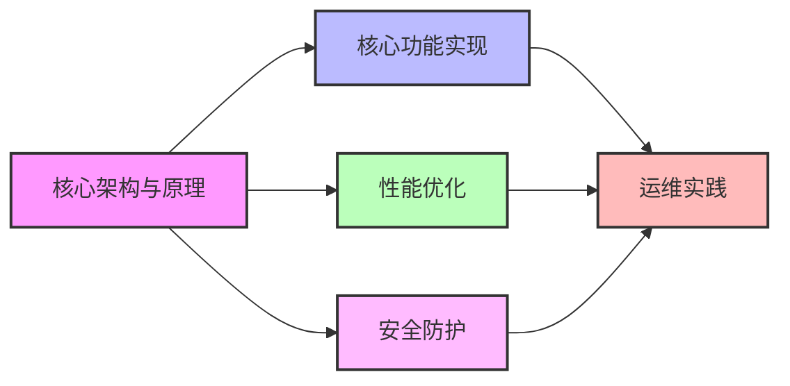

# Nginx知识库概述

欢迎来到Nginx知识库，这是一个全面的Nginx学习和参考资源。本知识库涵盖了从基础概念到高级应用的各个方面，旨在帮助初学者快速入门，同时为有经验的用户提供深入的技术细节和最佳实践。

## 1. 核心架构与原理

这一部分介绍Nginx的基础架构和核心工作原理，帮助你理解Nginx为何能够高效处理并发连接。

- [01-Nginx架构与设计理念](01-Nginx架构与设计理念.md)  
  深入解析Nginx的模块化架构、主从进程模型和"少即是多"的设计哲学。了解Nginx如何通过简洁的设计实现卓越的性能和可靠性。

- [02-事件驱动模型详解](02-事件驱动模型详解.md)  
  剖析Nginx高性能的异步非阻塞事件处理机制，理解epoll/kqueue等I/O多路复用技术如何使Nginx能够以极少的资源处理海量并发连接。

## 2. 核心功能实现

这一部分详细介绍Nginx的核心功能及其实现方式，帮助你掌握Nginx的主要应用场景。

- [03-Nginx模块系统分析](03-Nginx模块系统分析.md)  
  详解Nginx模块化架构和核心模块工作机制，包括HTTP模块、Mail模块、Stream模块等，以及如何开发自定义模块扩展Nginx功能。

- [05-反向代理与负载均衡实现](05-反向代理与负载均衡实现.md)  
  企业级代理服务和负载均衡配置方案，包括各种负载均衡算法（轮询、加权轮询、IP哈希、最少连接等）的实现原理和配置方法，以及健康检查和会话保持技术。

## 3. 性能优化

这一部分聚焦于如何优化Nginx以获得最佳性能，适合希望提升网站性能的用户。

- [06-缓存机制配置与优化](06-缓存机制配置与优化.md)  
  多级缓存架构与性能调优实践，包括客户端缓存控制、Nginx代理缓存、FastCGI缓存等配置方法，以及缓存失效策略和缓存命中率优化技巧。

- [09-高性能Web服务优化技巧](09-高性能Web服务优化技巧.md)  
  从内核参数到Nginx配置的全方位优化指南，涵盖TCP优化、文件描述符调整、工作进程配置、静态文件处理、压缩设置等方面，帮助你构建能够承载高并发流量的Web服务。

## 4. 安全防护

这一部分关注如何使用Nginx增强Web应用的安全性，对于构建安全可靠的网站至关重要。

- [07-HTTPS与安全设置详解](07-HTTPS与安全设置详解.md)  
  SSL/TLS最佳实践与Web安全加固方案，包括证书配置、密码套件选择、OCSP装订、HTTP安全头部、防DDoS设置等内容，全面提升网站安全防护能力。

## 5. 运维实践

这一部分提供实用的运维知识和技巧，帮助你在生产环境中高效部署和管理Nginx。

- [04-Nginx安装与基础配置](04-Nginx安装与基础配置.md)  
  多平台安装指南与基础服务配置，包括Windows、Linux、macOS等系统的安装方法，以及基本的HTTP服务器、虚拟主机配置等内容。

- [08-Nginx与应用服务集成](08-Nginx与应用服务集成.md)  
  与PHP/Python/Java等后端服务的集成方案，详细介绍如何配置Nginx与各种应用服务器（如PHP-FPM、uWSGI、Tomcat等）协同工作，实现高效的动态内容处理。

- [10-Nginx常见问题诊断](10-Nginx常见问题诊断.md)  
  故障排查方法与应急处理流程，包括日志分析、性能瓶颈定位、常见错误解决方案等内容，帮助你快速恢复服务并防止问题再次发生。

- [11-构建企业级Nginx集群](11-构建企业级Nginx集群.md)  
  高可用集群架构设计与自动化运维方案，包括Keepalived配置、蓝绿部署、滚动更新、监控告警等内容，确保关键业务的连续性和可靠性。

## 知识体系结构

下图展示了本知识库各部分之间的关系和学习路径：

## 如何使用本知识库

1. **初学者**：建议从[01-Nginx架构与设计理念](01-Nginx架构与设计理念.md)和[04-Nginx安装与基础配置](04-Nginx安装与基础配置.md)开始，先建立基础概念并完成实际安装。

2. **中级用户**：可以重点关注[05-反向代理与负载均衡实现](05-反向代理与负载均衡实现.md)和[06-缓存机制配置与优化](06-缓存机制配置与优化.md)等核心功能实现部分。

3. **高级用户**：推荐深入研究[02-事件驱动模型详解](02-事件驱动模型详解.md)、[09-高性能Web服务优化技巧](09-高性能Web服务优化技巧.md)和[11-构建企业级Nginx集群](11-构建企业级Nginx集群.md)等高级主题。

4. **运维人员**：[10-Nginx常见问题诊断](10-Nginx常见问题诊断.md)和[07-HTTPS与安全设置详解](07-HTTPS与安全设置详解.md)将是日常工作的重要参考。

知识库持续更新中，建议按照顺序阅读以获得最佳学习效果。所有配置示例均经过生产环境验证，可直接参考使用。

## 版本信息

本知识库基于Nginx 1.24.0版本，最后更新时间：2023年12月15日。