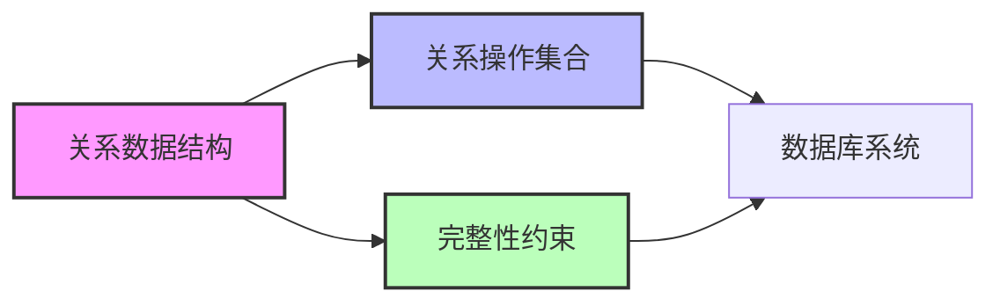
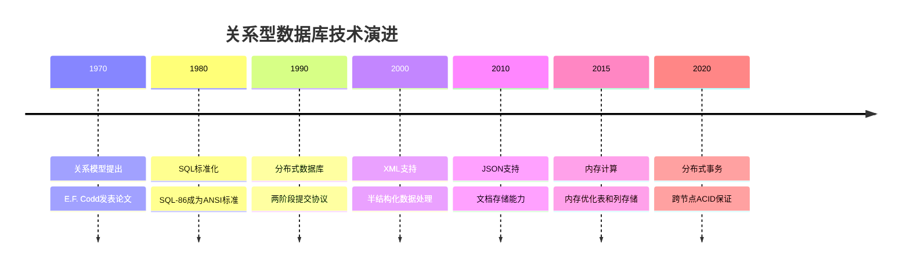

# 关系型数据库原理与架构  

关系型数据库是现代信息系统的基石，它基于严谨的数学理论，提供了结构化数据的存储、查询和管理能力。本文将从理论基础到实现细节，全面解析关系型数据库的核心原理与架构设计。

## 1. 核心理论体系  

关系型数据库的理论基础源于E.F. Codd在1970年提出的关系模型，这一模型彻底改变了数据管理的方式，至今仍是主流数据库系统的理论基础。

### 1.1 关系模型三要素  

关系模型由三个核心要素构成，它们共同定义了关系数据库的基本特性：



1. **关系数据结构**：
   - 以表（Table）的形式组织数据，每个表代表一种实体类型
   - 表由行（Row/Tuple）和列（Column/Attribute）组成
   - 每行代表一个实体实例，每列代表实体的一个属性
   - 每个表必须有主键（Primary Key），用于唯一标识每一行

2. **关系操作集合**：
   - 提供一组操作符用于数据检索和修改
   - 包括选择（Selection）、投影（Projection）、连接（Join）等基本操作
   - 这些操作符构成了关系代数，是SQL语言的理论基础

3. **完整性约束**：
   - 实体完整性：确保每行有唯一标识（主键非空且唯一）
   - 参照完整性：确保关系间的引用有效（外键约束）
   - 域完整性：确保属性值满足特定条件（数据类型、CHECK约束等）
   - 用户定义完整性：满足特定业务规则的约束

### 1.2 关系代数运算  

关系代数是一种过程化查询语言，定义了一组在关系上的操作，这些操作构成了SQL语言的理论基础。

| 运算类型 | 符号表示 | SQL对应 | 作用描述 |
|---------|---------|---------|---------|
| 选择     | σ       | WHERE   | 根据条件筛选行 |
| 投影     | π       | SELECT  | 选择特定列 |
| 连接     | ⋈       | JOIN    | 基于共同属性合并表 |
| 并集     | ∪       | UNION   | 合并两个相容关系 |
| 差集     | −       | EXCEPT  | 从一个关系中移除另一个关系的元组 |
| 交集     | ∩       | INTERSECT | 获取两个关系共有的元组 |
| 笛卡尔积 | ×       | CROSS JOIN | 两个关系的所有可能组合 |

关系代数运算示例：

```
// 选择运算：获取年龄大于30的用户
σage>30(Users)

// 投影运算：只获取用户的姓名和邮箱
πname,email(Users)

// 连接运算：获取用户及其订单信息
Users ⋈user_id=order_user_id Orders
```

这些运算可以组合使用，形成复杂的查询表达式，例如：

```
// 获取年龄大于30的用户的姓名和邮箱
πname,email(σage>30(Users))

// 获取购买了产品ID为101的用户信息
πname,email(Users ⋈user_id=order_user_id (σproduct_id=101(Orders)))
```

## 2. 系统架构解析  

了解数据库系统的架构设计，有助于我们理解查询执行过程、性能优化方向以及故障排查思路。

### 2.1 经典架构分层  

现代关系型数据库通常采用分层架构设计，每一层负责特定的功能：

```  
┌─────────────────────────────────┐  
│  应用接口层 (Client Interface)   │ ← SQL查询、API调用  
├─────────────────────────────────┤  
│  查询处理层 (Query Processor)    │ ← 解析、优化、执行  
├─────────────────────────────────┤  
│  存储引擎层 (Storage Engine)     │ ← 数据组织、索引、缓存  
├─────────────────────────────────┤  
│  文件系统层 (File System)        │ ← 数据持久化  
└─────────────────────────────────┘  
```  

1. **应用接口层**：
   - 提供SQL解析器和客户端连接管理
   - 处理权限验证和会话管理
   - 支持各种协议和API（如ODBC、JDBC）

2. **查询处理层**：
   - 查询解析：将SQL转换为语法树
   - 查询优化：生成高效的执行计划
   - 查询执行：协调各组件执行查询

3. **存储引擎层**：
   - 管理内存缓冲池和磁盘数据
   - 实现索引结构和数据访问方法
   - 提供事务管理和并发控制

4. **文件系统层**：
   - 管理数据文件、日志文件和配置文件
   - 处理数据持久化和恢复
   - 与操作系统文件系统交互

### 2.2 关键组件交互  

数据库系统内部组件间的交互过程，决定了查询的执行效率和系统的整体性能：

```python:c:\project\kphub\src\db\architecture.py  
class QueryExecutor:  
    def execute(self, query):  
        # 1. 解析SQL为语法树
        plan = Parser().parse(query)  
        
        # 2. 优化查询计划
        optimized = Optimizer().optimize(plan)  
        
        # 3. 通过存储引擎执行
        return StorageEngine().execute(optimized)  

class Parser:
    def parse(self, query):
        # 词法分析和语法分析
        tokens = self.tokenize(query)
        # 构建抽象语法树
        ast = self.build_ast(tokens)
        # 转换为逻辑查询计划
        return self.create_logical_plan(ast)

class Optimizer:
    def optimize(self, logical_plan):
        # 应用各种优化规则
        plan = self.apply_predicate_pushdown(logical_plan)
        plan = self.optimize_join_order(plan)
        plan = self.eliminate_redundant_operations(plan)
        # 转换为物理执行计划
        return self.create_physical_plan(plan)

class StorageEngine:
    def execute(self, physical_plan):
        # 根据物理计划执行查询
        result_set = ResultSet()
        
        # 访问索引或表扫描
        data_access = self.access_method(physical_plan)
        
        # 应用过滤、连接等操作
        for operation in physical_plan.operations:
            data_access = operation.apply(data_access)
        
        # 收集结果
        while data_access.has_next():
            result_set.add(data_access.next())
            
        return result_set
```

查询执行的典型流程：

1. **查询解析**：SQL语句首先被解析器转换为抽象语法树(AST)
2. **查询优化**：优化器分析多种执行策略，选择成本最低的执行计划
3. **计划执行**：存储引擎根据执行计划，通过索引或表扫描获取数据
4. **结果返回**：处理后的数据集返回给客户端

优化器是数据库性能的关键，它通常采用基于成本的优化策略，考虑以下因素：
- 表的大小和统计信息
- 索引的可用性和选择性
- 连接顺序和连接算法
- 谓词下推和投影下推

## 3. 存储引擎实现  

存储引擎是数据库的核心组件，负责数据的物理存储和访问。不同的存储引擎针对不同的应用场景进行了优化。

### 3.1 B+树索引结构  

B+树是关系型数据库中最常用的索引结构，它能高效支持范围查询和点查询：

```  
           [根节点: 50]  
               |  
        ┌──────┴──────┐  
        |              |
   [非叶节点: 20]  [非叶节点: 80]  
        |              |
   ┌────┴────┐    ┌────┴────┐
   |         |    |         |
[10,15]->[20,30]->[50,60]->[80,90]->NULL
   |         |    |         |
  数据指针   数据指针  数据指针  数据指针
```  

B+树的关键特性：

1. **平衡树结构**：
   - 所有叶子节点在同一层
   - 从根到叶的路径长度相同
   - 保证查询时间复杂度为O(log n)

2. **高效的范围查询**：
   - 叶子节点包含所有索引键值
   - 叶子节点通过链表相连
   - 支持高效的范围扫描

3. **优化的磁盘访问**：
   - 节点大小通常等于磁盘块大小
   - 减少I/O操作次数
   - 高扇出(fan-out)减少树的高度

B+树索引的工作原理：

- **查找过程**：从根节点开始，根据键值比较向下遍历，直到找到叶子节点
- **插入过程**：找到合适的叶子节点插入，如果节点溢出则分裂
- **删除过程**：找到并删除叶子节点中的记录，如果节点不足则合并或重新分配

### 3.2 事务日志机制  

事务日志是保证数据库ACID特性的关键机制，特别是持久性(Durability)和原子性(Atomicity)：

```sql:c:\project\kphub\sql\wal.sql  
-- WAL(Write-Ahead Logging)示例  
BEGIN;                                  -- 开始事务
-- 在内存中修改数据，同时记录到WAL
INSERT INTO users VALUES (1, 'Alice');  -- 先写日志  
UPDATE accounts SET balance = balance - 100 WHERE user_id = 1; -- 先写日志
-- 事务提交时，确保日志已持久化到磁盘
COMMIT;                                 -- 确认日志写入后，事务才算完成
-- 数据页的实际更新可能在之后异步进行
```  

事务日志的核心机制：

1. **预写式日志(WAL)**：
   - 任何数据修改前，先将修改记录写入日志
   - 确保日志持久化到磁盘后，才认为事务提交成功
   - 实际数据页的更新可以延迟进行

2. **日志记录结构**：
   - LSN(Log Sequence Number)：唯一标识日志记录
   - 事务ID：标识所属事务
   - 操作类型：INSERT/UPDATE/DELETE等
   - 前镜像(Before Image)：修改前的数据状态
   - 后镜像(After Image)：修改后的数据状态

3. **恢复机制**：
   - 崩溃恢复：系统重启时通过日志重建数据状态
   - 前滚(Redo)：重新应用已提交事务的修改
   - 回滚(Undo)：撤销未提交事务的修改

WAL机制的优势：
- 提高性能：将随机写转换为顺序写
- 减少I/O：批量处理数据页写入
- 保证一致性：即使在系统崩溃时也能恢复到一致状态

## 4. 主流产品对比  

市场上存在多种关系型数据库产品，它们在架构设计、功能特性和性能特点上各有差异。

### 4.1 架构特性对比  

| 数据库   | 存储引擎       | 事务支持   | 集群方案    | 主要应用场景 |
|---------|--------------|-----------|------------|------------|
| MySQL   | InnoDB/MyISAM/RocksDB等 | ACID (InnoDB) | Group Replication/MGR | Web应用、OLTP |
| PostgreSQL | 单一引擎   | ACID      | Streaming Replication/Patroni | 复杂查询、地理信息、OLTP/OLAP混合 |
| SQL Server | 多引擎     | ACID      | AlwaysOn/Availability Groups | 企业应用、BI、OLTP |
| Oracle  | 单一引擎     | ACID      | RAC/Data Guard | 大型企业应用、金融、电信 |
| SQLite  | 单一引擎     | ACID      | 不支持集群  | 嵌入式应用、本地存储 |

各数据库的架构特点：

1. **MySQL**：
   - 插件式存储引擎架构，可根据需求选择不同引擎
   - InnoDB提供事务支持和外键约束
   - 主从复制和组复制提供高可用性
   - 社区版免费，企业版收费

2. **PostgreSQL**：
   - 单一存储引擎，高度可扩展的插件系统
   - 强大的SQL标准支持和复杂查询能力
   - 内置丰富的数据类型（如JSON、地理信息）
   - 完全开源免费，社区驱动开发

3. **SQL Server**：
   - 紧密集成的存储引擎和查询处理器
   - 强大的BI和分析功能
   - AlwaysOn提供高可用性和灾难恢复
   - 商业软件，提供开发者免费版

4. **Oracle**：
   - 多版本并发控制(MVCC)实现高并发
   - 强大的分区表和并行查询能力
   - RAC(Real Application Clusters)提供水平扩展
   - 高端商业数据库，价格昂贵

### 4.2 性能基准测试  

性能测试是选择数据库的重要依据，以下是常用的基准测试方法：

```bash:c:\project\kphub\scripts\benchmark.sh  
# 准备测试环境
sysbench oltp_read_write --db-driver=mysql --mysql-db=test --mysql-user=root --mysql-password=password --tables=10 --table-size=1000000 --threads=4 prepare

# 执行读写混合测试
sysbench oltp_read_write --db-driver=mysql --mysql-db=test --mysql-user=root --mysql-password=password --tables=10 --table-size=1000000 --threads=4 --time=60 run

# 执行只读测试
sysbench oltp_read_only --db-driver=mysql --mysql-db=test --mysql-user=root --mysql-password=password --tables=10 --table-size=1000000 --threads=4 --time=60 run

# 清理测试数据
sysbench oltp_read_write --db-driver=mysql --mysql-db=test --mysql-user=root --mysql-password=password cleanup
```

性能测试关键指标：

1. **吞吐量(Throughput)**：
   - 每秒处理的事务数(TPS)
   - 每秒处理的查询数(QPS)

2. **延迟(Latency)**：
   - 查询响应时间
   - 事务提交时间

3. **可扩展性(Scalability)**：
   - 随并发用户增加的性能变化
   - 随数据量增加的性能变化

4. **资源利用率**：
   - CPU使用率
   - 内存使用情况
   - 磁盘I/O负载

不同数据库在不同场景下的性能特点：
- MySQL：适合高并发、简单查询的OLTP场景
- PostgreSQL：在复杂查询和混合负载下表现优秀
- SQL Server：企业环境中稳定可靠，管理工具丰富
- Oracle：大规模事务处理能力强，适合关键业务系统

## 5. 高级特性演进  

关系型数据库技术不断发展，融合新技术以满足现代应用需求。

### 5.1 新特性时间线  



关键技术演进：

1. **数据模型扩展**：
   - 从纯关系模型到支持半结构化数据
   - 增加对JSON、XML等数据类型的原生支持
   - 图数据和时序数据的集成

2. **分布式能力增强**：
   - 从单机架构到分布式集群
   - 支持跨节点事务和全局一致性
   - 云原生设计和容器化部署

3. **性能优化技术**：
   - 列式存储优化分析查询
   - 内存计算加速数据处理
   - 自适应查询优化

4. **智能化发展**：
   - 自动索引推荐
   - 自动参数调优
   - 基于机器学习的查询优化

### 5.2 混合模型扩展  

现代关系型数据库已经突破传统关系模型的局限，支持多种数据模型：

```sql:c:\project\kphub\sql\hybrid.sql  
-- PostgreSQL JSONB示例 - 文档模型
CREATE TABLE users (
    id SERIAL PRIMARY KEY,
    profile JSONB
);

-- 插入JSON数据
INSERT INTO users (profile) VALUES 
('{"name": "Alice", "age": 30, "interests": ["reading", "hiking"]}');

-- JSON路径查询
SELECT id, profile->>'name' AS name FROM users
WHERE profile @> '{"age": 30}';

-- 更新JSON字段
UPDATE users SET profile = jsonb_set(profile, '{age}', '31')
WHERE profile->>'name' = 'Alice';

-- MySQL JSON示例
CREATE TABLE products (
    id INT PRIMARY KEY,
    attributes JSON
);

-- 使用JSON函数
SELECT id, JSON_EXTRACT(attributes, '$.color') AS color
FROM products
WHERE JSON_EXTRACT(attributes, '$.price') < 100;

-- SQL Server图查询示例
SELECT Person1.name, Person2.name
FROM Person AS Person1, friendOf, Person AS Person2
WHERE MATCH(Person1-(friendOf)->Person2)
AND Person1.city = 'Seattle';
```

混合模型的优势：

1. **灵活的数据模式**：
   - 支持无模式或半结构化数据
   - 适应快速变化的应用需求
   - 减少模式变更的复杂性

2. **多模型查询能力**：
   - 在单个查询中结合关系和非关系操作
   - 统一的事务和一致性保证
   - 简化应用开发和数据集成

3. **性能优化机会**：
   - 为不同数据模型选择最佳存储方式
   - 特定模型的索引和查询优化
   - 减少跨系统数据移动

## 6. 实践建议与最佳实践

基于关系型数据库的理论和架构特点，以下是一些实用的最佳实践建议：

### 6.1 数据库设计原则

1. **规范化设计**：
   - 遵循第三范式(3NF)减少数据冗余
   - 适当反规范化以提高查询性能
   - 使用合理的主键设计（自增ID、UUID等）

2. **索引策略**：
   - 为常用查询条件创建索引
   - 避免过度索引导致写入性能下降
   - 定期分析和优化索引使用情况

3. **事务管理**：
   - 保持事务简短，减少锁竞争
   - 选择合适的隔离级别平衡一致性和并发性
   - 使用乐观锁处理高并发更新

### 6.2 性能优化方向

1. **查询优化**：
   - 使用EXPLAIN分析查询执行计划
   - 避免全表扫描和临时表创建
   - 合理使用连接和子查询

2. **配置调优**：
   - 根据硬件资源调整缓冲池大小
   - 优化日志写入和检查点频率
   - 调整并发连接数和线程池设置

3. **架构扩展**：
   - 读写分离减轻主库负担
   - 分库分表处理大规模数据
   - 使用缓存减少数据库访问

通过理解关系型数据库的核心原理与架构，可以更好地进行数据库选型、性能调优和故障排查。建议结合具体业务场景选择适合的关系型数据库解决方案，并持续关注数据库技术的最新发展。