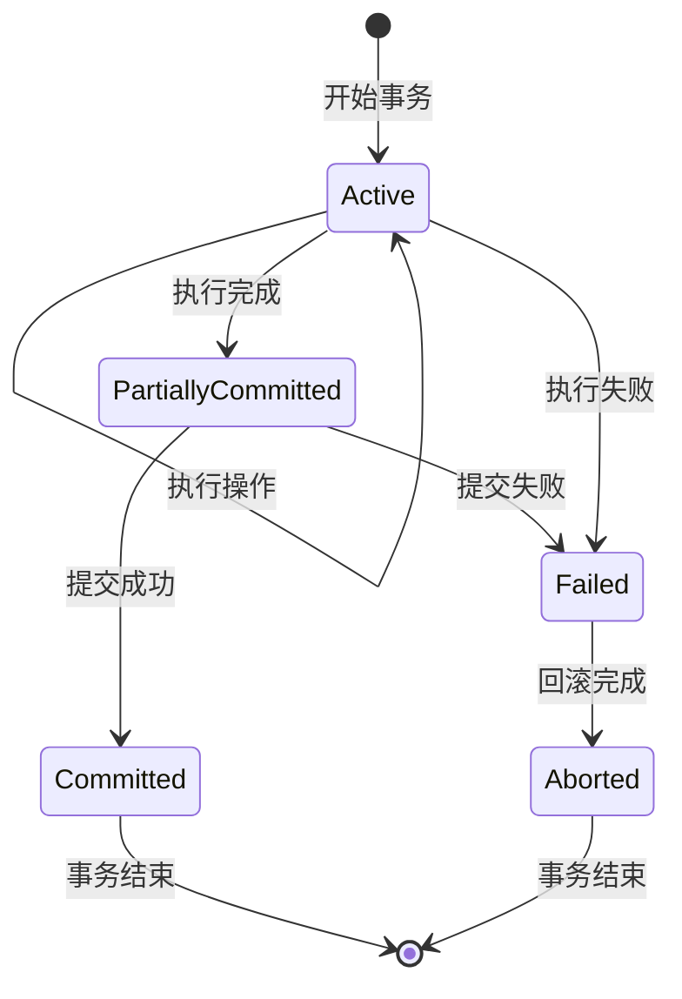
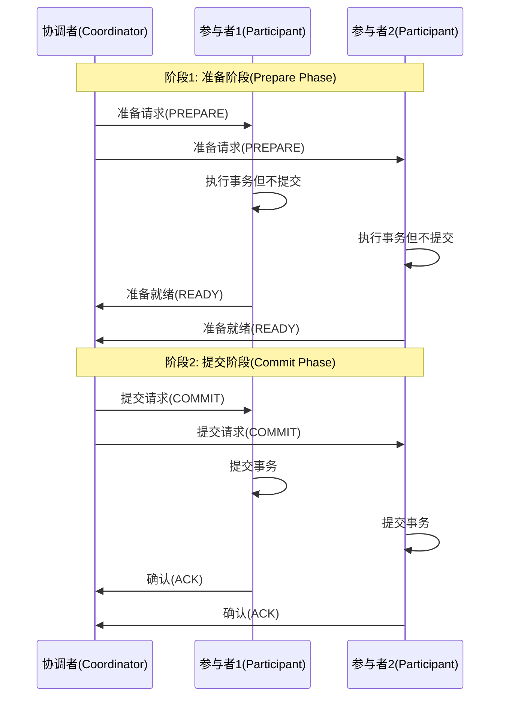

# 数据库事务与ACID特性  

数据库事务是现代数据库系统的核心功能，它确保在复杂操作中数据的一致性和可靠性。本文将深入探讨事务的基本概念、ACID特性、并发控制机制以及分布式事务解决方案，帮助你全面理解数据库事务的工作原理和应用场景。

## 1. 事务基础概念  

事务(Transaction)是数据库管理系统执行过程中的一个逻辑单位，由一组相关的数据库操作组成，这些操作要么全部成功执行，要么全部不执行，保证数据从一个一致状态转变到另一个一致状态。

### 1.1 事务生命周期  

一个事务从开始到结束会经历多个状态，理解这些状态有助于我们掌握事务的执行过程：



事务状态说明：

1. **Active（活动）**：事务开始执行后的初始状态，此时事务正在执行读写操作
2. **Partially Committed（部分提交）**：事务中的所有语句都已执行完毕，但事务操作的结果还未持久化到磁盘
3. **Committed（已提交）**：事务成功完成，所有修改被永久保存到数据库
4. **Failed（失败）**：事务执行过程中出现错误，无法继续执行
5. **Aborted（中止）**：事务执行失败后回滚完成，所有已执行的操作被撤销

事务状态转换的关键点：
- 只有当事务中的所有操作都成功执行，事务才能从Active状态转为Partially Committed状态
- 从Partially Committed到Committed的过程涉及将数据持久化到磁盘，这是保证事务持久性的关键步骤
- 任何阶段发生错误都会导致事务进入Failed状态，然后执行回滚操作进入Aborted状态

### 1.2 标准事务语法  

大多数关系型数据库支持类似的事务语法，下面是一个典型的资金转账事务示例：

```sql:c:\project\kphub\sql\transaction.sql  
-- 开始事务
BEGIN TRANSACTION;  

-- 从账户1扣款100元
UPDATE accounts SET balance = balance - 100 WHERE id = 1;  

-- 向账户2存入100元
UPDATE accounts SET balance = balance + 100 WHERE id = 2;  

-- 成功完成所有操作后提交事务
COMMIT;  

-- 如果执行过程中出现错误，可以回滚事务
-- ROLLBACK;  
```  

不同数据库系统的事务语法略有差异：

**MySQL/MariaDB**:
```sql
START TRANSACTION;
-- 操作语句
COMMIT; -- 或 ROLLBACK;
```

**PostgreSQL**:
```sql
BEGIN;
-- 操作语句
COMMIT; -- 或 ROLLBACK;
```

**SQL Server**:
```sql
BEGIN TRANSACTION;
-- 操作语句
COMMIT TRANSACTION; -- 或 ROLLBACK TRANSACTION;
```

**Oracle**:
```sql
-- Oracle默认自动开始事务，无需显式BEGIN
-- 操作语句
COMMIT; -- 或 ROLLBACK;
```

**SQLite**:
```sql
BEGIN TRANSACTION;
-- 操作语句
COMMIT; -- 或 ROLLBACK;
```

事务语法的关键要点：
- 事务以BEGIN或START TRANSACTION开始
- 事务以COMMIT成功结束，或以ROLLBACK取消
- 某些数据库（如Oracle）默认每条SQL语句都在隐式事务中执行
- 大多数数据库支持自动提交(autocommit)模式，每条SQL语句自动形成一个事务

## 2. ACID特性详解  

ACID是数据库事务正确执行所必须满足的四个特性，它们共同保证了数据库在事务处理过程中的可靠性。

### 2.1 原子性(Atomicity)实现  

**原子性**确保事务中的所有操作要么全部完成，要么全部不执行。即使在事务执行过程中发生系统崩溃，数据库也必须保证事务的原子性。

原子性的实现机制：

1. **撤销日志(Undo Log)**：
   - 记录事务修改前的数据状态（前镜像）
   - 如果事务失败，使用撤销日志恢复原始数据

2. **影子分页(Shadow Paging)**：
   - 事务修改数据时创建数据页的副本
   - 事务提交时原子地切换页面指针

下面是一个使用Python实现原子性转账操作的示例：

```python:c:\project\kphub\src\db\atomic.py  
def transfer_funds(conn, from_acc, to_acc, amount):  
    """
    原子性转账操作：从一个账户转账到另一个账户
    
    参数:
        conn: 数据库连接
        from_acc: 转出账户ID
        to_acc: 转入账户ID
        amount: 转账金额
    """
    try:  
        # 开始事务
        conn.execute("BEGIN")  
        
        # 检查余额是否充足
        balance = conn.execute(
            "SELECT balance FROM accounts WHERE id = ?", 
            (from_acc,)
        ).fetchone()[0]
        
        if balance < amount:
            raise Exception("余额不足")
        
        # 从转出账户扣款
        conn.execute(
            "UPDATE accounts SET balance = balance - ? WHERE id = ?", 
            (amount, from_acc)
        )  
        
        # 模拟可能的系统故障
        # if random.random() < 0.1:
        #     raise Exception("模拟系统故障")
        
        # 向转入账户存款
        conn.execute(
            "UPDATE accounts SET balance = balance + ? WHERE id = ?", 
            (amount, to_acc)
        )  
        
        # 记录交易历史
        conn.execute(
            "INSERT INTO transactions (from_acc, to_acc, amount, timestamp) VALUES (?, ?, ?, datetime('now'))",
            (from_acc, to_acc, amount)
        )
        
        # 提交事务
        conn.execute("COMMIT")
        return True
    except Exception as e:  
        # 发生任何错误，回滚事务
        conn.execute("ROLLBACK")
        print(f"转账失败: {e}")
        return False
```  

原子性的关键实现点：
- 使用try-except结构捕获所有可能的异常
- 任何异常发生时执行ROLLBACK，确保数据回到事务开始前的状态
- 只有所有操作都成功执行后才COMMIT事务
- 事务中应包含所有相关操作，包括数据验证和日志记录

### 2.2 一致性(Consistency)保障

**一致性**确保事务将数据库从一个一致状态转变为另一个一致状态，保持数据库完整性约束不被破坏。

一致性的实现依赖于：

1. **数据库约束**：
   - 主键和唯一性约束
   - 外键约束
   - CHECK约束和触发器

2. **应用程序逻辑**：
   - 业务规则验证
   - 数据完整性检查

一致性示例 - 银行转账必须保证总金额不变：

```sql
-- 转账前
-- 账户1: 1000元
-- 账户2: 500元
-- 总额: 1500元

BEGIN TRANSACTION;
UPDATE accounts SET balance = balance - 100 WHERE id = 1;
UPDATE accounts SET balance = balance + 100 WHERE id = 2;
COMMIT;

-- 转账后
-- 账户1: 900元
-- 账户2: 600元
-- 总额: 1500元 (保持不变，满足一致性)
```

### 2.3 隔离性(Isolation)级别对比  

**隔离性**确保并发执行的事务之间互不干扰。不同的隔离级别提供不同程度的隔离保证，同时也影响系统的并发性能。

| 隔离级别         | 脏读 | 不可重复读 | 幻读 | 性能 | 实现机制 |
|------------------|------|------------|------|------|---------|
| READ UNCOMMITTED | ✓    | ✓          | ✓    | 最高 | 无锁 |
| READ COMMITTED   | ×    | ✓          | ✓    | 高   | 读取已提交数据 |
| REPEATABLE READ  | ×    | ×          | ✓    | 中   | 范围锁或MVCC |
| SERIALIZABLE     | ×    | ×          | ×    | 最低 | 完全锁定或串行执行 |

隔离级别说明：

1. **READ UNCOMMITTED（读未提交）**：
   - 最低隔离级别，允许读取未提交的数据
   - 可能出现脏读、不可重复读和幻读
   - 适用场景：对一致性要求极低的报表查询

2. **READ COMMITTED（读已提交）**：
   - 只允许读取已提交的数据，避免脏读
   - 仍可能出现不可重复读和幻读
   - 适用场景：大多数OLTP系统的默认级别

3. **REPEATABLE READ（可重复读）**：
   - 确保在一个事务中多次读取同一数据得到相同结果
   - 可能出现幻读（新插入的行）
   - 适用场景：需要一致性读取的业务逻辑

4. **SERIALIZABLE（串行化）**：
   - 最高隔离级别，完全隔离事务
   - 避免所有并发问题，但性能最低
   - 适用场景：金融交易等要求极高一致性的场合

并发问题解释：

- **脏读(Dirty Read)**：事务A读取了事务B未提交的数据，如果事务B回滚，事务A读取的数据就是无效的
- **不可重复读(Non-repeatable Read)**：事务A多次读取同一数据，期间事务B修改并提交了该数据，导致事务A两次读取结果不一致
- **幻读(Phantom Read)**：事务A执行查询返回一组行，事务B插入新行并提交，事务A再次执行同样的查询会返回不同的行集

设置隔离级别的SQL语法：

```sql
-- MySQL
SET SESSION TRANSACTION ISOLATION LEVEL READ COMMITTED;

-- PostgreSQL
SET TRANSACTION ISOLATION LEVEL READ COMMITTED;

-- SQL Server
SET TRANSACTION ISOLATION LEVEL READ COMMITTED;
```

### 2.4 持久性(Durability)保证

**持久性**确保一旦事务提交，其结果就会永久保存在数据库中，即使系统发生崩溃也不会丢失。

持久性的实现机制：

1. **重做日志(Redo Log)**：
   - 记录事务修改后的数据状态（后镜像）
   - 系统崩溃后，通过重做日志恢复已提交的事务

2. **预写式日志(Write-Ahead Logging, WAL)**：
   - 在修改数据页之前，先将变更记录到日志
   - 确保即使在数据页写入磁盘前系统崩溃，也能通过日志恢复

3. **检查点(Checkpoint)**：
   - 定期将内存中的脏页写入磁盘
   - 缩短系统恢复时间

持久性配置示例（MySQL）：

```sql
-- 确保每次事务提交都写入磁盘
SET GLOBAL innodb_flush_log_at_trx_commit = 1;

-- 双写缓冲区，防止部分页写入
SET GLOBAL innodb_doublewrite = 1;
```

## 3. 并发控制机制  

并发控制是数据库系统管理多个事务同时访问数据的机制，它确保数据的一致性和隔离性。

### 3.1 锁类型与应用场景  

锁是最基本的并发控制机制，不同类型的锁用于不同的操作场景：

```  
┌───────────────┐       ┌───────────────┐  
│  共享锁(S锁)   │       │  排他锁(X锁)   │  
│  SELECT...    │       │  UPDATE...    │  
│  LOCK IN SHARE│       │  FOR UPDATE   │  
└───────────────┘       └───────────────┘  
        │                      │
        ▼                      ▼
┌───────────────┐       ┌───────────────┐
│  允许其他事务   │       │  阻止其他事务   │
│  获取共享锁     │       │  获取任何锁     │
└───────────────┘       └───────────────┘
```  

主要锁类型：

1. **共享锁(Shared Lock, S锁)**：
   - 读锁，允许多个事务同时读取同一数据
   - 一个数据被加了S锁，其他事务可以再加S锁，但不能加X锁
   - 适用于读取操作

2. **排他锁(Exclusive Lock, X锁)**：
   - 写锁，独占数据，阻止其他事务读取或修改
   - 一个数据被加了X锁，其他事务不能再加任何锁
   - 适用于更新、删除操作

3. **意向锁(Intention Lock)**：
   - 表示事务打算在更细粒度级别上加锁的意图
   - 提高加锁效率，避免逐行检查

4. **范围锁(Range Lock)**：
   - 锁定满足某条件的一组数据
   - 防止幻读问题

显式加锁的SQL语法：

```sql
-- 共享锁
SELECT * FROM accounts WHERE id = 1 LOCK IN SHARE MODE;  -- MySQL
SELECT * FROM accounts WHERE id = 1 FOR SHARE;          -- PostgreSQL

-- 排他锁
SELECT * FROM accounts WHERE id = 1 FOR UPDATE;         -- 大多数数据库

-- 行级锁示例（MySQL InnoDB）
BEGIN;
SELECT * FROM accounts WHERE id = 1 FOR UPDATE;
UPDATE accounts SET balance = balance - 100 WHERE id = 1;
COMMIT;

-- 表级锁示例（MySQL）
LOCK TABLES accounts WRITE;
UPDATE accounts SET balance = balance - 100 WHERE id = 1;
UNLOCK TABLES;
```

锁的粒度：

1. **表级锁(Table-level Lock)**：
   - 锁定整个表
   - 实现简单，开销小
   - 并发度低，适合读多写少的场景

2. **页级锁(Page-level Lock)**：
   - 锁定数据页
   - 介于表锁和行锁之间的折中方案

3. **行级锁(Row-level Lock)**：
   - 锁定单行数据
   - 实现复杂，开销大
   - 并发度高，适合高并发OLTP系统

### 3.2 MVCC多版本控制示例  

多版本并发控制(Multi-Version Concurrency Control, MVCC)是一种先进的并发控制机制，通过维护数据的多个版本，允许读操作不被写操作阻塞，大幅提高并发性能。

MVCC的基本原理：
- 每次更新操作创建数据的新版本，而不是直接覆盖
- 每个事务看到的是特定时间点的数据快照
- 通过版本号或时间戳判断数据对事务的可见性

PostgreSQL中的MVCC实现：

```sql:c:\project\kphub\sql\mvcc.sql  
-- PostgreSQL中可见性判断规则  
-- xmin: 创建该行版本的事务ID
-- xmax: 删除该行的事务ID，未删除时为0
-- 查看行的事务信息
SELECT xmin, xmax, * FROM accounts WHERE id = 1;  

-- 事务A: 开始时间T1
BEGIN;
-- 事务A看到的是T1时刻的数据快照

-- 事务B: 修改数据并提交
BEGIN;
UPDATE accounts SET balance = balance + 200 WHERE id = 1;
COMMIT;

-- 事务A: 再次查询同一数据，在READ COMMITTED级别下会看到新数据
-- 在REPEATABLE READ级别下仍然看到旧数据
SELECT balance FROM accounts WHERE id = 1;

-- 提交事务A
COMMIT;
```

MVCC的工作流程：

1. **插入操作**：
   - 创建新行，设置xmin为当前事务ID，xmax为0

2. **删除操作**：
   - 将现有行的xmax设置为当前事务ID

3. **更新操作**：
   - 将现有行的xmax设置为当前事务ID（逻辑删除）
   - 创建新行，设置xmin为当前事务ID（插入新版本）

4. **可见性判断**：
   - 行的xmin必须是已提交事务
   - 行的xmax必须是0或未提交事务
   - 根据隔离级别，可能还需考虑事务开始时间

MVCC的优势：
- 读不阻塞写，写不阻塞读，大幅提高并发性
- 读操作不需要加锁，减少锁竞争
- 支持一致性读取，实现不同隔离级别

不同数据库的MVCC实现：
- **PostgreSQL**：使用事务ID和系统表跟踪版本
- **MySQL InnoDB**：使用回滚段(undo log)存储旧版本
- **Oracle**：使用回滚段和SCN(System Change Number)
- **SQL Server**：通过tempdb中的版本存储实现

### 3.3 乐观并发控制与悲观并发控制

数据库系统通常采用两种并发控制策略：悲观并发控制和乐观并发控制。

**悲观并发控制(Pessimistic Concurrency Control)**：
- 假设冲突经常发生
- 在访问数据前先加锁
- 适用于高冲突环境
- 实现方式：各种锁机制

```sql
-- 悲观并发控制示例
BEGIN;
SELECT * FROM products WHERE id = 101 FOR UPDATE; -- 加锁
-- 业务逻辑处理
UPDATE products SET stock = stock - 1 WHERE id = 101;
COMMIT; -- 释放锁
```

**乐观并发控制(Optimistic Concurrency Control)**：
- 假设冲突很少发生
- 不加锁，在提交时检查冲突
- 适用于低冲突环境
- 实现方式：版本号或时间戳

```sql
-- 乐观并发控制示例
BEGIN;
-- 读取当前版本
SELECT id, stock, version FROM products WHERE id = 101;

-- 业务逻辑处理

-- 更新时检查版本号
UPDATE products 
SET stock = stock - 1, version = version + 1 
WHERE id = 101 AND version = 当前版本;

-- 检查是否更新成功
-- 如果影响行数为0，说明数据已被其他事务修改
COMMIT;
```

选择并发控制策略的考虑因素：
- 数据冲突频率
- 事务执行时间
- 系统负载特性
- 业务对一致性的要求

## 4. 分布式事务方案  

随着系统规模扩大，单一数据库无法满足需求，分布式事务成为解决跨数据库操作一致性的关键技术。

### 4.1 两阶段提交(2PC)流程  

两阶段提交(Two-Phase Commit, 2PC)是最经典的分布式事务协议，通过协调者和参与者的交互，确保所有节点要么都提交，要么都回滚。



2PC的执行流程：

1. **准备阶段(Prepare Phase)**：
   - 协调者向所有参与者发送准备请求
   - 参与者执行事务操作，但不提交
   - 参与者记录undo/redo日志，确保可以提交或回滚
   - 参与者向协调者报告准备结果(READY或ABORT)

2. **提交阶段(Commit Phase)**：
   - 如果所有参与者都回复READY，协调者发送COMMIT请求
   - 如果任一参与者回复ABORT，协调者发送ROLLBACK请求
   - 参与者根据协调者的指令完成提交或回滚
   - 参与者向协调者确认完成操作

2PC的Java实现示例：

```java
// 协调者代码
public class TransactionCoordinator {
    private List<Participant> participants;
    
    public boolean executeTransaction() {
        // 阶段1: 准备阶段
        boolean allReady = true;
        for (Participant p : participants) {
            if (!p.prepare()) {
                allReady = false;
                break;
            }
        }
        
        // 阶段2: 提交或回滚
        if (allReady) {
            // 所有参与者都准备就绪，发送提交请求
            for (Participant p : participants) {
                p.commit();
            }
            return true;
        } else {
            // 有参与者未就绪，发送回滚请求
            for (Participant p : participants) {
                p.rollback();
            }
            return false;
        }
    }
}

// 参与者接口
interface Participant {
    boolean prepare();
    void commit();
    void rollback();
}
```

2PC的优缺点：

**优点**：
- 保证强一致性
- 实现相对简单
- 被许多数据库和中间件支持

**缺点**：
- 同步阻塞，性能较低
- 单点故障（协调者）
- 脑裂问题（网络分区时）

### 4.2 三阶段提交(3PC)

三阶段提交(Three-Phase Commit, 3PC)是对2PC的改进，通过增加一个预提交阶段，减轻阻塞问题。

3PC的三个阶段：
1. **询问阶段(CanCommit)**：协调者询问参与者是否可以执行事务
2. **预提交阶段(PreCommit)**：协调者通知参与者准备提交
3. **提交阶段(DoCommit)**：协调者通知参与者正式提交

3PC相比2PC的改进：
- 引入超时机制，减少阻塞
- 在协调者故障时，参与者可以根据预提交状态决定后续操作
- 但仍然无法完全解决网络分区问题

### 4.3 补偿事务(SAGA)模式  

SAGA模式是一种长事务解决方案，将长事务拆分为多个本地事务，并为每个本地事务定义相应的补偿事务。

```python:c:\project\kphub\src\db\saga.py  
def order_flow():  
    """
    订单处理流程的SAGA模式实现
    每个步骤都有对应的补偿操作
    """
    saga = Saga()
    
    try:  
        # 步骤1: 创建订单
        order_id = create_order()
        saga.add_compensation(lambda: cancel_order(order_id))
        
        # 步骤2: 预留库存
        reserve_stock(order_id)  # 可补偿操作
        saga.add_compensation(lambda: cancel_reservation(order_id))
        
        # 步骤3: 处理支付
        payment_id = process_payment(order_id) # 关键操作
        saga.add_compensation(lambda: refund_payment(payment_id))
        
        # 步骤4: 安排配送
        delivery_id = arrange_delivery(order_id)
        saga.add_compensation(lambda: cancel_delivery(delivery_id))
        
        # 所有步骤成功，提交事务
        saga.commit()
        return True
        
    except Exception as e:
        # 任何步骤失败，执行补偿操作
        saga.rollback()
        print(f"订单处理失败: {e}")
        return False

class Saga:
    """SAGA事务管理器"""
    
    def __init__(self):
        self.compensations = []
        self.committed = False
    
    def add_compensation(self, compensation_function):
        """添加补偿函数"""
        self.compensations.append(compensation_function)
    
    def commit(self):
        """提交事务，清空补偿队列"""
        self.committed = True
        self.compensations.clear()
    
    def rollback(self):
        """回滚事务，按照相反顺序执行所有补偿操作"""
        if self.committed:
            return
            
        # 逆序执行补偿操作
        for compensation in reversed(self.compensations):
            try:
                compensation()
            except Exception as e:
                print(f"补偿操作执行失败: {e}")
                # 继续执行其他补偿操作
```  

SAGA模式的两种实现方式：

1. **编排式(Choreography)**：
   - 各服务通过事件相互协调
   - 去中心化，服务间松耦合
   - 适合简单流程

2. **协调式(Orchestration)**：
   - 中央协调器管理整个流程
   - 中心化，流程清晰可控
   - 适合复杂流程

SAGA模式的优缺点：

**优点**：
- 避免长时间锁定资源
- 高可用性和可扩展性
- 适合微服务架构

**缺点**：
- 最终一致性，不保证实时一致
- 补偿逻辑复杂
- 可能需要处理幂等性问题

### 4.4 XA协议与JTA

XA是一个分布式事务标准，定义了全局事务管理器(TM)和局部资源管理器(RM)之间的接口。

XA事务的参与者：
- **应用程序(AP)**：发起事务的应用
- **事务管
让我继续完成数据库事务与ACID特性的文档内容：

## 4.4 XA协议与JTA

XA是一个分布式事务标准，定义了全局事务管理器(TM)和局部资源管理器(RM)之间的接口。

XA事务的参与者：
- **应用程序(AP)**：发起事务的应用
- **事务管理器(TM)**：协调全局事务，实现两阶段提交
- **资源管理器(RM)**：管理具体资源，如数据库

JTA(Java Transaction API)是Java平台上XA协议的标准实现：

```java
// JTA分布式事务示例
UserTransaction userTx = (UserTransaction)context.lookup("java:comp/UserTransaction");

try {
    // 开始全局事务
    userTx.begin();
    
    // 数据库1操作
    Connection conn1 = dataSource1.getConnection();
    Statement stmt1 = conn1.createStatement();
    stmt1.executeUpdate("UPDATE accounts SET balance = balance - 100 WHERE id = 1");
    
    // 数据库2操作
    Connection conn2 = dataSource2.getConnection();
    Statement stmt2 = conn2.createStatement();
    stmt2.executeUpdate("UPDATE accounts SET balance = balance + 100 WHERE id = 2");
    
    // 提交全局事务
    userTx.commit();
} catch (Exception e) {
    // 回滚全局事务
    userTx.rollback();
    throw e;
}
```

XA事务的优缺点：
- **优点**：强一致性保证，广泛支持
- **缺点**：性能开销大，资源锁定时间长

## 5. 实战问题分析  

在实际应用中，事务处理常常面临各种挑战，如死锁、长事务和性能问题。

### 5.1 死锁检测与解决  

死锁是指两个或多个事务互相持有对方需要的锁，导致所有事务都无法继续执行的情况。

死锁示例：
- 事务A持有资源1的锁，等待资源2的锁
- 事务B持有资源2的锁，等待资源1的锁

```sql:c:\project\kphub\sql\deadlock.sql  
-- 事务A
BEGIN;
UPDATE accounts SET balance = balance - 100 WHERE id = 1; -- 获取id=1的锁
-- 此时事务B获取了id=2的锁
UPDATE accounts SET balance = balance + 100 WHERE id = 2; -- 等待id=2的锁，可能死锁
COMMIT;

-- 事务B
BEGIN;
UPDATE accounts SET balance = balance - 100 WHERE id = 2; -- 获取id=2的锁
-- 此时事务A获取了id=1的锁
UPDATE accounts SET balance = balance + 100 WHERE id = 1; -- 等待id=1的锁，形成死锁
COMMIT;

-- MySQL死锁日志分析  
SHOW ENGINE INNODB STATUS\G  
```  

死锁的检测与预防：

1. **死锁检测**：
   - 数据库系统自动检测死锁
   - 当检测到死锁时，选择一个事务作为牺牲者回滚

2. **死锁日志分析**：
   - MySQL: `SHOW ENGINE INNODB STATUS\G`
   - PostgreSQL: `pg_stat_activity`视图和日志
   - SQL Server: 使用动态管理视图(DMV)

3. **死锁预防策略**：
   - 按固定顺序访问资源（如按ID升序更新）
   - 减少事务持有锁的时间
   - 使用适当的隔离级别
   - 拆分大事务为小事务

死锁解决示例 - 固定访问顺序：

```sql
-- 修改后的事务A和B，始终按ID升序访问资源
-- 事务A
BEGIN;
UPDATE accounts SET balance = balance - 100 WHERE id = 1; -- 先访问较小ID
UPDATE accounts SET balance = balance + 100 WHERE id = 2; -- 后访问较大ID
COMMIT;

-- 事务B
BEGIN;
UPDATE accounts SET balance = balance - 100 WHERE id = 1; -- 先访问较小ID
UPDATE accounts SET balance = balance + 100 WHERE id = 2; -- 后访问较大ID
COMMIT;
```

### 5.2 长事务监控  

长时间运行的事务会占用系统资源，阻塞其他事务，并增加死锁风险。

```powershell:c:\project\kphub\scripts\monitor_tx.ps1  
# PostgreSQL长事务查询脚本
$connectionString = "Server=localhost;Port=5432;Database=mydb;User Id=postgres;Password=password;"

function Get-LongTransactions {
    param (
        [int]$MinDurationSeconds = 60
    )
    
    $query = @"
    SELECT 
        pid, 
        usename, 
        datname,
        now() - xact_start as duration, 
        state,
        query 
    FROM 
        pg_stat_activity 
    WHERE 
        state = 'active' 
        AND xact_start < now() - interval '$MinDurationSeconds seconds'
    ORDER BY 
        xact_start;
"@
    
    $connection = New-Object System.Data.Odbc.OdbcConnection
    $connection.ConnectionString = $connectionString
    
    try {
        $connection.Open()
        $command = $connection.CreateCommand()
        $command.CommandText = $query
        
        $reader = $command.ExecuteReader()
        $table = New-Object System.Data.DataTable
        $table.Load($reader)
        
        return $table
    }
    finally {
        $connection.Close()
    }
}

function Get-IdleInTransactions {
    $query = @"
    SELECT 
        pid, 
        usename, 
        datname,
        now() - xact_start as duration, 
        now() - state_change as idle_duration,
        query 
    FROM 
        pg_stat_activity 
    WHERE 
        state = 'idle in transaction'
    ORDER BY 
        xact_start;
"@
    
    $connection = New-Object System.Data.Odbc.OdbcConnection
    $connection.ConnectionString = $connectionString
    
    try {
        $connection.Open()
        $command = $connection.CreateCommand()
        $command.CommandText = $query
        
        $reader = $command.ExecuteReader()
        $table = New-Object System.Data.DataTable
        $table.Load($reader)
        
        return $table
    }
    finally {
        $connection.Close()
    }
}

# 获取运行超过5分钟的活跃事务
$longTransactions = Get-LongTransactions -MinDurationSeconds 300
Write-Host "长时间运行的活跃事务:"
$longTransactions | Format-Table -AutoSize

# 获取处于"idle in transaction"状态的事务
$idleTransactions = Get-IdleInTransactions
Write-Host "处于'idle in transaction'状态的事务:"
$idleTransactions | Format-Table -AutoSize

# 可选：终止长时间运行的事务
function Terminate-Transaction {
    param (
        [Parameter(Mandatory=$true)]
        [int]$ProcessId
    )
    
    $query = "SELECT pg_terminate_backend($ProcessId);"
    
    $connection = New-Object System.Data.Odbc.OdbcConnection
    $connection.ConnectionString = $connectionString
    
    try {
        $connection.Open()
        $command = $connection.CreateCommand()
        $command.CommandText = $query
        $result = $command.ExecuteScalar()
        
        Write-Host "进程 $ProcessId 已终止: $result"
    }
    finally {
        $connection.Close()
    }
}

# 示例：终止特定进程ID的事务
# Terminate-Transaction -ProcessId 12345
```  

长事务的危害：
- 占用数据库资源（内存、锁等）
- 阻塞其他事务执行
- 增加MVCC版本存储开销
- 影响数据库备份和维护操作

长事务监控策略：
1. **定期检查长时间运行的事务**
2. **设置事务超时机制**
3. **监控"idle in transaction"状态的会话**
4. **必要时终止长时间运行的事务**

不同数据库的长事务监控：
- **MySQL**: `SHOW PROCESSLIST` 或 `information_schema.innodb_trx`
- **PostgreSQL**: `pg_stat_activity` 视图
- **SQL Server**: `sys.dm_tran_active_transactions` 动态管理视图
- **Oracle**: `V$TRANSACTION` 和 `V$SESSION` 视图

### 5.3 事务性能优化

优化事务性能的关键策略：

1. **减小事务范围**：
   - 只包含必要的操作
   - 避免在事务中执行耗时操作（如HTTP请求）
   - 将只读操作移出事务

2. **选择合适的隔离级别**：
   - 大多数OLTP系统使用READ COMMITTED
   - 只有必要时才使用更高的隔离级别

3. **批量处理**：
   - 合并多个小事务为一个批量事务
   - 使用批量插入/更新语句

4. **优化锁策略**：
   - 减少锁的范围和持有时间
   - 使用乐观锁代替悲观锁（适用于低冲突场景）
   - 避免全表锁和热点行锁

5. **合理设置事务相关参数**：
   - 事务日志大小
   - 检查点频率
   - 锁超时设置

性能优化示例：

```sql
-- 优化前：每个操作一个事务
BEGIN;
INSERT INTO order_items VALUES (1, 101, 1, 10.00);
COMMIT;

BEGIN;
INSERT INTO order_items VALUES (1, 102, 2, 25.00);
COMMIT;

-- 优化后：批量操作
BEGIN;
INSERT INTO order_items VALUES 
    (1, 101, 1, 10.00),
    (1, 102, 2, 25.00),
    (1, 103, 1, 15.00);
COMMIT;
```

## 6. 事务设计最佳实践

### 6.1 事务边界设计

合理设计事务边界是保证系统性能和可靠性的关键：

1. **遵循"短小精悍"原则**：
   - 事务应尽可能短
   - 只包含必要的操作
   - 避免用户交互和长时间计算

2. **明确定义事务边界**：
   - 显式开始和结束事务
   - 避免隐式事务导致的边界不清

3. **异常处理策略**：
   - 捕获所有可能的异常
   - 确保在异常情况下正确回滚
   - 记录事务失败原因

4. **资源管理**：
   - 使用try-finally确保资源释放
   - 避免在事务中长时间持有连接

事务边界设计示例：

```java
// 良好的事务边界设计
public void transferMoney(long fromAccount, long toAccount, BigDecimal amount) {
    Connection conn = null;
    try {
        conn = dataSource.getConnection();
        conn.setAutoCommit(false);  // 开始事务
        
        // 检查余额
        AccountDAO accountDAO = new AccountDAO(conn);
        Account fromAcc = accountDAO.getAccount(fromAccount);
        if (fromAcc.getBalance().compareTo(amount) < 0) {
            throw new InsufficientFundsException("余额不足");
        }
        
        // 执行转账
        accountDAO.debit(fromAccount, amount);
        accountDAO.credit(toAccount, amount);
        
        // 记录交易
        TransactionDAO txDAO = new TransactionDAO(conn);
        txDAO.logTransfer(fromAccount, toAccount, amount);
        
        conn.commit();  // 提交事务
    } catch (Exception e) {
        if (conn != null) {
            try {
                conn.rollback();  // 回滚事务
            } catch (SQLException ex) {
                logger.error("回滚事务失败", ex);
            }
        }
        throw new TransferFailedException("转账失败", e);
    } finally {
        if (conn != null) {
            try {
                conn.setAutoCommit(true);
                conn.close();  // 释放连接
            } catch (SQLException e) {
                logger.error("关闭连接失败", e);
            }
        }
    }
}
```

### 6.2 事务模式与反模式

**事务最佳实践**：

1. **合理使用事务**：
   - 确保关键业务操作在事务中执行
   - 避免不必要的事务开销

2. **正确处理重试逻辑**：
   - 对于可重试的错误（如死锁）实现重试机制
   - 使用指数退避算法避免立即重试

3. **分离读写操作**：
   - 读操作使用只读事务或不使用事务
   - 写操作使用适当隔离级别的事务

**事务反模式**：

1. **过大的事务**：
   - 包含过多操作的长事务
   - 跨多个微服务的分布式事务

2. **嵌套事务滥用**：
   - 不必要的复杂嵌套事务
   - 混淆的事务传播行为

3. **事务中的远程调用**：
   - 在事务中调用外部服务
   - 导致长事务和分布式事务问题

4. **共享连接池与长事务**：
   - 长事务占用连接池资源
   - 导致其他操作无法获取连接

## 7. 总结与展望

### 7.1 事务技术发展趋势

数据库事务技术正在向以下方向发展：

1. **分布式事务的轻量化**：
   - 从强一致性向最终一致性转变
   - 基于消息和事件的异步事务模式

2. **云原生事务处理**：
   - 适应云环境的弹性和分布式特性
   - 支持多云和混合云架构

3. **AI辅助事务优化**：
   - 智能选择隔离级别和锁策略
   - 预测和避免事务冲突

4. **区块链与事务**：
   - 借鉴区块链的共识机制
   - 实现跨组织的可信事务

### 7.2 实践建议

根据不同场景选择合适的事务策略：

1. **OLTP系统**：
   - 使用短小事务和适中隔离级别
   - 关注并发性能和响应时间

2. **OLAP系统**：
   - 使用批量事务和只读事务
   - 关注数据一致性和查询性能

3. **微服务架构**：
   - 优先考虑本地事务和最终一致性
   - 必要时使用SAGA模式处理跨服务事务

4. **混合负载系统**：
   - 读写分离和多版本并发控制
   - 动态调整事务策略

通过理解事务机制，可以合理选择隔离级别，优化并发性能。建议OLTP系统使用READ COMMITTED级别，OLAP系统考虑SNAPSHOT ISOLATION，微服务架构优先采用最终一致性模型。