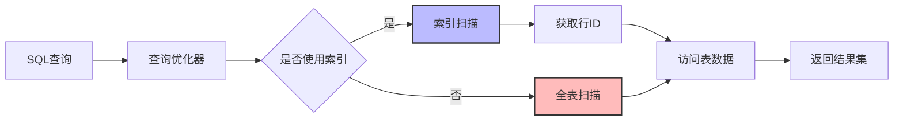

# 数据库索引原理与设计  

数据库索引是提高数据库查询性能的关键技术，它类似于书籍的目录，帮助数据库系统快速定位和访问数据。本文将深入探讨索引的工作原理、常见类型、设计原则以及优化策略，帮助你掌握数据库索引设计的核心知识。

## 1. 索引核心原理  

索引是数据库中用于加速数据检索操作的数据结构，它通过建立键值到数据行的映射，减少数据访问量，从而提高查询效率。

### 1.1 索引工作流程  

当数据库执行查询时，索引的工作流程如下：



工作流程详解：

1. **SQL解析**：数据库解析SQL语句，确定查询条件和目标表
2. **查询优化**：优化器评估可用索引和查询条件，生成执行计划
3. **索引选择**：根据查询条件和索引统计信息，决定是否使用索引
4. **索引扫描**：如果使用索引，通过索引结构快速定位满足条件的行ID
5. **数据访问**：根据行ID获取完整的行数据（如果需要）
6. **结果返回**：将查询结果返回给客户端

索引扫描与全表扫描的对比：
- **索引扫描**：仅读取满足条件的数据，I/O操作少，适合高选择性查询
- **全表扫描**：读取整个表的数据，I/O操作多，适合低选择性查询

### 1.2 索引代价模型  

数据库优化器通过代价模型决定是否使用索引，主要考虑以下因素：

```python:c:\project\kphub\src\db\index_cost.py  
def index_usable(query, index, table):  
    """
    判断查询是否应该使用索引
    
    参数:
        query: 查询对象，包含查询条件和列
        index: 索引对象，包含索引列和统计信息
        table: 表对象，包含表的统计信息
    
    返回:
        布尔值，表示是否应该使用索引
    """
    # 检查索引列是否匹配查询条件
    if not is_index_applicable(query.columns, index.columns):
        return False
    
    # 索引选择率计算（满足条件的行数比例）  
    selectivity = index.distinct_values / table.row_count
    
    # 估算使用索引的I/O成本
    index_io_cost = estimate_index_scan_cost(index, selectivity)
    
    # 估算表访问成本（回表成本）
    table_io_cost = estimate_table_access_cost(table, selectivity)
    
    # 估算全表扫描成本
    full_scan_cost = estimate_full_scan_cost(table)
    
    # 索引总成本 = 索引扫描成本 + 表访问成本
    index_total_cost = index_io_cost + table_io_cost
    
    # 如果索引成本低于全表扫描，则使用索引
    return index_total_cost < full_scan_cost

def is_index_applicable(query_columns, index_columns):
    """检查索引是否适用于查询条件"""
    # 检查最左前缀匹配
    for i, col in enumerate(index_columns):
        if i < len(query_columns) and col != query_columns[i]:
            return False
    return True
```  

代价模型关键因素：

1. **选择率(Selectivity)**：
   - 满足查询条件的行数占总行数的比例
   - 选择率越低（越少行满足条件），索引越有效
   - 通常选择率低于5-10%时，索引扫描优于全表扫描

2. **索引基数(Cardinality)**：
   - 索引列的唯一值数量
   - 基数越高，索引的区分度越好，效率越高
   - 主键和唯一索引基数最高

3. **I/O成本**：
   - 索引扫描的I/O操作次数
   - 回表查询的I/O操作次数
   - 全表扫描的I/O操作次数

4. **索引大小**：
   - 索引占用的存储空间和内存缓存
   - 较小的索引可以更多地缓存在内存中，提高访问速度

## 2. 索引类型详解  

不同类型的索引适用于不同的查询场景，了解各种索引类型的特点有助于选择最合适的索引结构。

### 2.1 B+树索引结构  

B+树是关系型数据库中最常用的索引结构，它能高效支持等值查询、范围查询和排序操作。

```  
          [根节点: 50]  
               |  
        ┌──────┴──────┐  
        |              |
   [非叶节点: 20]  [非叶节点: 80]  
        |              |
   ┌────┴────┐    ┌────┴────┐
   |         |    |         |
[10,15]->[20,30]->[50,60]->[80,90]->NULL
   |         |    |         |
  数据指针   数据指针  数据指针  数据指针
```  

B+树索引的关键特性：

1. **平衡树结构**：
   - 所有叶子节点在同一层
   - 从根到叶的路径长度相同
   - 保证查询时间复杂度为O(log n)

2. **高效的范围查询**：
   - 叶子节点包含所有索引键值
   - 叶子节点通过链表相连
   - 支持高效的范围扫描

3. **节点高填充率**：
   - 每个节点可以包含多个键值
   - 减少树的高度，降低I/O次数
   - 通常一个节点对应一个磁盘页

B+树索引的操作复杂度：
- **查找**：O(log n)，其中n是数据量
- **插入**：O(log n)
- **删除**：O(log n)
- **范围查询**：O(log n + k)，其中k是结果集大小

### 2.2 哈希索引示例  

哈希索引基于哈希表实现，适用于等值查询，但不支持范围查询和排序操作。

```sql:c:\project\kphub\sql\hash_index.sql  
-- MySQL内存表哈希索引  
CREATE TABLE session_data (  
    session_id VARCHAR(32) PRIMARY KEY,  
    data TEXT,
    last_access TIMESTAMP
) ENGINE=MEMORY;  

-- 插入会话数据
INSERT INTO session_data VALUES 
('abc123', '{"user_id": 42, "permissions": ["read", "write"]}', NOW()),
('xyz789', '{"user_id": 17, "permissions": ["read"]}', NOW());

-- 等值查询（哈希索引高效）
SELECT * FROM session_data WHERE session_id = 'abc123';

-- 创建PostgreSQL哈希索引
CREATE INDEX idx_hash_email ON users USING HASH (email);

-- Redis作为键值存储的哈希索引示例
-- redis-cli> HSET sessions abc123 '{"user_id": 42, "permissions": ["read", "write"]}'
-- redis-cli> HGET sessions abc123
```  

哈希索引的特点：

1. **等值查询性能极高**：
   - 时间复杂度为O(1)
   - 比B+树索引更快的点查询

2. **不支持范围操作**：
   - 无法执行范围查询
   - 无法进行排序
   - 不支持部分键匹配

3. **适用场景**：
   - 会话存储
   - 缓存系统
   - 只有等值查询的场景

### 2.3 位图索引

位图索引适用于基数低（唯一值少）的列，如性别、状态等。

```sql
-- Oracle位图索引示例
CREATE BITMAP INDEX idx_status ON orders(status);

-- 查询所有已完成订单
SELECT * FROM orders WHERE status = 'completed';

-- 位图索引的布尔运算（多条件组合）
SELECT * FROM customers 
WHERE gender = 'F' AND status = 'active';
```

位图索引的特点：
- 每个唯一值对应一个位图
- 非常节省空间（对于低基数列）
- 支持快速的布尔运算（AND, OR, NOT）
- 不适合频繁更新的数据

### 2.4 全文索引

全文索引专为文本搜索优化，支持关键词匹配和相关性排序。

```sql
-- MySQL全文索引
CREATE FULLTEXT INDEX idx_fulltext ON articles(title, content);

-- 全文搜索查询
SELECT * FROM articles 
WHERE MATCH(title, content) AGAINST('database indexing' IN NATURAL LANGUAGE MODE);

-- PostgreSQL全文搜索
CREATE INDEX idx_tsvector ON articles USING GIN (to_tsvector('english', content));

SELECT * FROM articles 
WHERE to_tsvector('english', content) @@ to_tsquery('english', 'database & indexing');
```

全文索引的特点：
- 支持词干提取、停用词过滤
- 提供相关性评分
- 支持模糊匹配和布尔操作
- 占用空间较大，更新成本高

## 3. 索引设计原则  

合理的索引设计能显著提升查询性能，而不当的索引则可能导致性能下降和资源浪费。

### 3.1 最左前缀匹配原则  

复合索引（多列索引）遵循最左前缀匹配原则，即必须按照索引定义的列顺序使用，从左到右匹配。

```sql  
-- 创建复合索引
CREATE INDEX idx_lastname_firstname ON users(last_name, first_name);

/* 有效使用索引（匹配最左前缀） */  
SELECT * FROM users WHERE last_name = 'Smith' AND first_name = 'John';  
SELECT * FROM users WHERE last_name = 'Smith'; -- 只使用第一列

/* 无法使用索引（未匹配最左前缀） */  
SELECT * FROM users WHERE first_name = 'John';  -- 跳过了第一列

/* 部分使用索引（范围查询后的列无法使用） */
SELECT * FROM users WHERE last_name = 'Smith' AND first_name > 'A';  -- first_name是范围查询
SELECT * FROM users WHERE last_name > 'N' AND first_name = 'John';   -- last_name后的列无法使用
```  

最左前缀匹配原则的关键点：

1. **列顺序至关重要**：
   - 必须从索引的第一列开始使用
   - 中间不能跳过列
   - 如果某列使用范围查询，则其后的列无法使用索引

2. **索引列顺序设计**：
   - 将选择性高的列放在前面
   - 将等值查询的列放在前面，范围查询的列放在后面
   - 考虑查询频率，将常用列放在前面

3. **索引列组合**：
   - 根据实际查询模式设计索引列组合
   - 避免创建冗余索引
   - 考虑索引覆盖查询需求

### 3.2 索引选择矩阵  

根据不同的查询模式选择合适的索引类型：

| 查询模式           | 推荐索引类型       | 适用场景                     | 示例SQL                                      |
|--------------------|-------------------|------------------------------|----------------------------------------------|
| 等值查询           | 哈希/B+树         | 主键查询、外键关联           | `WHERE id = 10`                              |
| 范围查询           | B+树              | 日期范围、数值区间           | `WHERE price BETWEEN 10 AND 50`              |
| 前缀匹配           | B+树(最左前缀)    | 模糊搜索、自动完成           | `WHERE name LIKE 'Joh%'`                     |
| 多列组合查询       | 复合索引          | 多条件过滤                   | `WHERE status = 'active' AND type = 'user'`  |
| 全文搜索           | 全文索引          | 文档搜索、内容检索           | `WHERE MATCH(content) AGAINST('keyword')`    |
| 低基数列查询       | 位图索引          | 状态标志、类别筛选           | `WHERE gender = 'F' AND status = 'active'`   |
| 排序和分组         | B+树              | ORDER BY和GROUP BY操作       | `ORDER BY created_at DESC LIMIT 10`          |

索引选择的考虑因素：

1. **查询频率**：
   - 高频查询应优先考虑索引优化
   - 低频查询可能不值得创建专用索引

2. **数据分布**：
   - 数据分布均匀的列适合作为索引
   - 数据分布极不均匀的列可能导致索引效率低下

3. **写入负载**：
   - 索引会增加写入开销
   - 高写入负载系统应谨慎添加索引

4. **空间限制**：
   - 索引占用额外存储空间
   - 需要在性能和空间之间权衡

### 3.3 避免索引失效的情况

某些操作会导致索引无法使用，应当尽量避免：

```sql
-- 索引列上使用函数（除非创建了函数索引）
SELECT * FROM users WHERE LOWER(email) = 'user@example.com'; -- 索引失效

-- 索引列进行计算
SELECT * FROM products WHERE price * 1.1 > 100; -- 索引失效

-- 使用不等于操作符
SELECT * FROM orders WHERE status != 'completed'; -- 可能导致索引失效

-- 使用OR连接不同列
SELECT * FROM customers WHERE email = 'test@example.com' OR phone = '1234567890'; -- 可能导致索引失效

-- 使用LIKE前缀通配符
SELECT * FROM products WHERE name LIKE '%phone'; -- 索引失效
```

保持索引有效的最佳实践：
- 保持索引列"干净"，不进行函数操作
- 将条件转换为索引列的等值或范围查询
- 使用适当的复合索引覆盖常见查询模式
- 考虑使用函数索引处理特殊需求

## 4. 索引优化策略  

除了基本的索引设计原则外，还有一些高级优化策略可以进一步提升索引效率。

### 4.1 覆盖索引优化  

覆盖索引是指索引包含查询所需的所有列，使得查询可以直接从索引获取数据，无需回表查询。

```sql:c:\project\kphub\sql\covering_index.sql  
-- 创建覆盖索引（包含查询所需的所有列）
CREATE INDEX idx_cover ON orders (customer_id, status) INCLUDE (order_date);  

-- 无需回表查询（所有需要的列都在索引中）
SELECT customer_id, status, order_date FROM orders WHERE status = 'shipped';  

-- MySQL中的覆盖索引（隐式包含主键）
CREATE INDEX idx_customer_status ON orders (customer_id, status);
SELECT customer_id, status, id FROM orders WHERE customer_id = 100;

-- 检查是否使用了覆盖索引
EXPLAIN SELECT customer_id, status, order_date FROM orders WHERE status = 'shipped';
-- 在"Extra"列中应显示"Using index"，表示使用了覆盖索引
```  

覆盖索引的优势：

1. **避免回表查询**：
   - 直接从索引获取所有数据
   - 减少I/O操作
   - 显著提高查询性能

2. **减少锁竞争**：
   - 只访问索引，不访问数据页
   - 减少锁定资源

3. **实现方式**：
   - 在索引中包含所有需要的列
   - 使用INCLUDE子句添加非键列（某些数据库支持）
   - 调整查询，只选择索引中包含的列

覆盖索引的设计考虑：
- 分析常见查询模式，确定频繁访问的列组合
- 权衡索引大小和查询性能
- 避免在索引中包含过多列，导致索引过大

### 4.2 索引合并技术  

索引合并是指查询优化器使用多个单列索引来满足复杂查询条件的技术。

```sql  
-- 创建单列索引
CREATE INDEX idx_category ON products(category_id);
CREATE INDEX idx_price ON products(price);

/* MySQL索引合并示例 */  
EXPLAIN SELECT * FROM products   
WHERE category_id = 5 OR price < 100;  
-- 可能显示"index_merge"访问类型，使用"union"合并策略

-- 索引合并的另一个例子（交集）
EXPLAIN SELECT * FROM employees
WHERE department_id = 10 AND salary > 50000;
-- 可能显示"index_merge"访问类型，使用"intersection"合并策略
```  

索引合并的类型：

1. **索引合并交集(Index Merge Intersection)**：
   - 使用AND连接的条件
   - 分别获取每个条件的结果集，然后取交集
   - 例如：`WHERE col1 = 10 AND col2 = 20`

2. **索引合并并集(Index Merge Union)**：
   - 使用OR连接的条件
   - 分别获取每个条件的结果集，然后取并集
   - 例如：`WHERE col1 = 10 OR col2 = 20`

3. **索引合并排序并集(Index Merge Sort Union)**：
   - 特殊的并集操作，需要对结果进行排序
   - 通常用于复杂的OR条件

索引合并的优缺点：
- **优点**：利用现有单列索引，无需创建额外的复合索引
- **缺点**：合并操作有额外开销，通常不如直接使用复合索引高效
- **适用场景**：无法创建理想复合索引的情况，或查询条件变化多样的场景

### 4.3 部分索引和条件索引

部分索引和条件索引只为满足特定条件的行创建索引，减少索引大小和维护成本。

```sql
-- PostgreSQL部分索引（只为活跃用户创建索引）
CREATE INDEX idx_active_users ON users(email) WHERE status = 'active';

-- 使用部分索引的查询
SELECT * FROM users WHERE status = 'active' AND email = 'user@example.com';

-- SQL Server过滤索引
CREATE INDEX idx_published_articles ON articles(title, author_id)
WHERE is_published = 1;

-- MySQL分区表上的本地索引
CREATE TABLE sales (
    id INT,
    sale_date DATE,
    amount DECIMAL(10,2),
    INDEX idx_date (sale_date)
) PARTITION BY RANGE (YEAR(sale_date)) (
    PARTITION p2020 VALUES LESS THAN (2021),
    PARTITION p2021 VALUES LESS THAN (2022),
    PARTITION p2022 VALUES LESS THAN (2023)
);
```

部分索引的优势：
- 索引更小，占用更少的存储空间
- 维护开销更低，提高写入性能
- 缓存效率更高，更多索引数据可以保留在内存中

适用场景：
- 查询条件中包含固定的过滤条件
- 数据分布不均匀，大部分查询只涉及特定子集
- 需要优化特定类型的查询而不影响其他操作

## 5. 高级索引技术  

随着数据库技术的发展，出现了许多高级索引技术，用于解决特定的性能挑战。

### 5.1 函数索引实现  

函数索引允许在列的函数或表达式上创建索引，解决了索引列上使用函数导致索引失效的问题。

```sql:c:\project\kphub\sql\function_index.sql  
-- PostgreSQL函数索引  
CREATE INDEX idx_name_lower ON users (LOWER(last_name));  

-- 使用函数索引查询  
SELECT * FROM users WHERE LOWER(last_name) = 'smith';  

-- MySQL表达式索引（8.0+）
CREATE INDEX idx_year_month ON orders ((YEAR(order_date)), (MONTH(order_date)));

SELECT * FROM orders WHERE YEAR(order_date) = 2023 AND MONTH(order_date) = 6;

-- Oracle函数索引
CREATE INDEX idx_upper_email ON customers (UPPER(email));

SELECT * FROM customers WHERE UPPER(email) = 'USER@EXAMPLE.COM';
```  

函数索引的应用场景：

1. **大小写不敏感搜索**：
   - 使用LOWER()或UPPER()函数
   - 例如：邮箱地址、用户名搜索

2. **日期部分提取**：
   - 使用YEAR()、MONTH()、DAY()等函数
   - 例如：按年月分组统计

3. **字符串处理**：
   - 使用SUBSTRING()、CONCAT()等函数
   - 例如：前缀匹配、格式化搜索

4. **计算字段**：
   - 使用数学表达式
   - 例如：价格计算、距离计算

函数索引的注意事项：
- 增加了索引维护的复杂性
- 可能导致索引较大
- 需要确保查询中使用的函数表达式与索引定义完全匹配

### 5.2 分区索引策略  

分区索引是与表分区配合使用的索引策略，可以显著提高大表的查询性能和管理效率。

```sql  
-- 按范围分区的表和索引
CREATE TABLE logs (  
    id BIGSERIAL,  
    log_date DATE,
    level VARCHAR(10),
    message TEXT
) PARTITION BY RANGE (log_date);  

-- 创建分区
CREATE TABLE logs_2021 PARTITION OF logs
FOR VALUES FROM ('2021-01-01') TO ('2022-01-01');

CREATE TABLE logs_2022 PARTITION OF logs
FOR VALUES FROM ('2022-01-01') TO ('2023-01-01');

-- 在分区表上创建本地索引
CREATE INDEX idx_log_date ON logs (log_date) LOCAL;  
CREATE INDEX idx_log_level ON logs (level) LOCAL;

-- 查询特定日期范围的日志（会自动只扫描相关分区）
SELECT * FROM logs 
WHERE log_date BETWEEN '2022-03-01' AND '2022-03-31'
AND level = 'ERROR';
```  

分区索引的类型：

1. **本地索引(Local Index)**：
   - 每个分区有独立的索引
   - 索引与分区一一对应
   - 适合大多数查询场景

2. **全局索引(Global Index)**：
   - 单个索引覆盖所有分区
   - 适合不按分区键查询的场景
   - 维护成本较高

分区索引的优势：

1. **查询性能提升**：
   - 分区裁剪(Partition Pruning)减少扫描范围
   - 并行查询多个分区
   - 较小的索引更容易缓存在内存中

2. **维护便利性**：
   - 可以独立管理各个分区的索引
   - 支持分区级别的索引重建
   - 简化历史数据归档和删除

3. **高可用性**：
   - 分区级别的备份和恢复
   - 减少锁竞争范围

分区索引的应用场景：
- 时间序列数据（日志、交易记录）
- 地理位置分布数据
- 多租户系统的数据隔离

### 5.3 空间索引

空间索引专为地理空间数据优化，支持点、线、面等几何对象的高效查询。

```sql
-- PostgreSQL PostGIS空间索引
CREATE INDEX idx_spatial ON locations USING GIST (geom);

-- 查询某个区域内的所有点
SELECT * FROM locations 
WHERE ST_Within(geom, ST_MakeEnvelope(0, 0, 10, 10, 4326));

-- MySQL空间索引
CREATE SPATIAL INDEX idx_location ON stores (location);

-- 查询距离特定点5公里内的所有商店
SELECT * FROM stores 
WHERE ST_Distance(location, ST_PointFromText('POINT(40.7128 -74.0060)')) <= 5000;
```

空间索引的特点：
- 基于R树或其变种（如R*树）实现
- 支持包含、相交、距离等空间关系查询
- 适用于GIS应用、位置服务、路径规划等场景

## 6. 性能监控与调优  

索引设计是一个持续优化的过程，需要通过监控和分析不断调整索引策略。

### 6.1 索引使用分析  

定期分析索引使用情况，识别未使用的索引和可能需要的新索引。

```powershell:c:\project\kphub\scripts\index_usage.ps1  
# PostgreSQL索引使用统计脚本
$connectionString = "Server=localhost;Port=5432;Database=mydb;User Id=postgres;Password=password;"

function Get-IndexUsageStats {
    $query = @"
    SELECT
        schemaname,
        relname as table_name,
        indexrelname as index_name,
        idx_scan as index_scans,
        idx_tup_read as tuples_read,
        idx_tup_fetch as tuples_fetched,
        pg_size_pretty(pg_relation_size(indexrelid)) as index_size
    FROM
        pg_stat_user_indexes
    WHERE
        schemaname = 'public'
    ORDER BY
        idx_scan DESC;
"@
    
    $connection = New-Object System.Data.Odbc.OdbcConnection
    $connection.ConnectionString = $connectionString
    
    try {
        $connection.Open()
        $command = $connection.CreateCommand()
        $command.CommandText = $query
        
        $reader = $command.ExecuteReader()
        $table = New-Object System.Data.DataTable
        $table.Load($reader)
        
        return $table
    }
    finally {
        $connection.Close()
    }
}

function Get-UnusedIndexes {
    $query = @"
    SELECT
        schemaname,
        relname as table_name,
        indexrelname as index_name,
        idx_scan as index_scans,
        pg_size_pretty(pg_relation_size(indexrelid)) as index_size
    FROM
        pg_stat_user_indexes
    WHERE
        schemaname = 'public'
        AND idx_scan = 0
        AND indexrelname NOT LIKE 'pg_%'
    ORDER BY
        pg_relation_size(indexrelid) DESC;
"@
    
    $connection = New-Object System.Data.Odbc.OdbcConnection
    $connection.ConnectionString = $connectionString
    
    try {
        $connection.Open()
        $command = $connection.CreateCommand()
        $command.CommandText = $query
        
        $reader = $command.ExecuteReader()
        $table = New-Object System.Data.
让我继续完成数据库索引原理与设计的文档内容：

```powershell:c:\project\kphub\scripts\index_usage.ps1
    # 前面的代码部分...
    
        $reader = $command.ExecuteReader()
        $table = New-Object System.Data.DataTable
        $table.Load($reader)
        
        return $table
    }
    finally {
        $connection.Close()
    }
}

function Get-MissingIndexes {
    $query = @"
    SELECT
        s.schemaname,
        s.relname as table_name,
        s.seq_scan - s.idx_scan as too_much_seq,
        CASE
            WHEN s.idx_scan > 0 THEN 'OK'
            ELSE 'No Index'
        END as index_usage,
        pg_size_pretty(pg_relation_size(s.relid)) as table_size,
        s.seq_scan as seq_scans,
        s.seq_tup_read as rows_fetched_by_seq_scan
    FROM
        pg_stat_user_tables s
    WHERE
        s.seq_scan > s.idx_scan
        AND s.seq_scan > 10
    ORDER BY
        too_much_seq DESC;
"@
    
    $connection = New-Object System.Data.Odbc.OdbcConnection
    $connection.ConnectionString = $connectionString
    
    try {
        $connection.Open()
        $command = $connection.CreateCommand()
        $command.CommandText = $query
        
        $reader = $command.ExecuteReader()
        $table = New-Object System.Data.DataTable
        $table.Load($reader)
        
        return $table
    }
    finally {
        $connection.Close()
    }
}

# 获取索引使用统计
$indexUsage = Get-IndexUsageStats
Write-Host "索引使用统计:"
$indexUsage | Format-Table -AutoSize

# 获取未使用的索引
$unusedIndexes = Get-UnusedIndexes
Write-Host "未使用的索引:"
$unusedIndexes | Format-Table -AutoSize

# 获取可能需要索引的表
$missingIndexes = Get-MissingIndexes
Write-Host "可能需要索引的表:"
$missingIndexes | Format-Table -AutoSize
```

索引使用分析的关键指标：

1. **索引扫描次数**：
   - 高频使用的索引表明其价值
   - 从未使用的索引可能是冗余的

2. **表扫描与索引扫描比例**：
   - 表扫描次数远高于索引扫描表明可能缺少合适的索引
   - 理想情况下，高频访问的表应主要通过索引访问

3. **索引大小**：
   - 大型索引占用更多存储空间和内存
   - 需要权衡索引大小与查询性能

4. **索引选择性**：
   - 高选择性索引（唯一值比例高）更有效
   - 低选择性索引可能不如全表扫描高效

不同数据库的索引监控工具：
- **MySQL**: `SHOW INDEX`, `information_schema.statistics`, `sys.schema_unused_indexes`
- **PostgreSQL**: `pg_stat_user_indexes`, `pg_stat_user_tables`
- **SQL Server**: `sys.dm_db_index_usage_stats`, `sys.dm_db_missing_index_details`
- **Oracle**: `V$OBJECT_USAGE`, `DBA_INDEXES`, `DBA_IND_COLUMNS`

### 6.2 索引维护命令  

定期维护索引可以保持索引的高效性能，特别是在大量数据变更后。

```sql  
-- PostgreSQL重建索引（不阻塞并发操作）
REINDEX INDEX CONCURRENTLY idx_customer_name;  

-- 更新表统计信息（帮助优化器做出更好的决策）
ANALYZE TABLE customers;  

-- MySQL重建索引
ALTER TABLE products DROP INDEX idx_name, ADD INDEX idx_name(name);

-- 或者使用OPTIMIZE TABLE（同时重建表和索引）
OPTIMIZE TABLE products;

-- SQL Server重建索引
ALTER INDEX idx_customer_name ON customers REBUILD
WITH (FILLFACTOR = 80, ONLINE = ON);

-- Oracle重建索引
ALTER INDEX idx_customer_name REBUILD;
```  

索引维护的最佳实践：

1. **定期重建索引**：
   - 解决索引碎片问题
   - 优化索引存储结构
   - 更新索引统计信息

2. **填充因子(Fill Factor)设置**：
   - 为索引页预留空间，减少页分裂
   - 高更新表使用较低的填充因子（如70-80%）
   - 只读或低更新表可使用较高的填充因子（如90-100%）

3. **统计信息更新**：
   - 保持最新的统计信息帮助优化器
   - 数据变化显著时手动更新统计信息
   - 配置适当的自动统计信息更新策略

4. **在线操作**：
   - 使用支持在线重建的命令
   - 避免长时间锁定表
   - 在低峰期执行大型维护操作

索引碎片的类型：
- **内部碎片**：索引页中的未使用空间
- **外部碎片**：索引页的物理存储不连续
- **逻辑碎片**：索引键值的逻辑顺序与物理存储顺序不一致

## 7. 实战设计案例  

通过实际案例学习索引设计，可以更好地理解如何应用索引原理解决实际问题。

### 7.1 电商系统索引方案  

电商系统需要处理商品搜索、订单管理、用户行为等多种查询模式，索引设计至关重要。

```sql  
/* 商品表索引设计 */
CREATE TABLE products (
    id BIGINT PRIMARY KEY,
    name VARCHAR(200) NOT NULL,
    category_id INT NOT NULL,
    price DECIMAL(10,2) NOT NULL,
    stock_status CHAR(1) NOT NULL, -- 'I'n stock, 'O'ut of stock, 'L'ow stock
    brand_id INT NOT NULL,
    created_at TIMESTAMP NOT NULL,
    is_published BOOLEAN NOT NULL DEFAULT false,
    description TEXT,
    specifications JSONB
);

/* 商品搜索复合索引 */
CREATE INDEX idx_product_search ON products  
(category_id, price, stock_status)  
WHERE is_published = true;  

/* 商品管理索引 */
CREATE INDEX idx_product_admin ON products (brand_id, created_at);

/* 商品名称搜索索引（使用GIN索引支持全文搜索） */
CREATE INDEX idx_product_name_search ON products USING GIN (to_tsvector('english', name));

/* 商品规格搜索索引（JSON数据） */
CREATE INDEX idx_product_specs ON products USING GIN (specifications);

/* 订单表索引设计 */
CREATE TABLE orders (
    id BIGINT PRIMARY KEY,
    customer_id BIGINT NOT NULL,
    status VARCHAR(20) NOT NULL,
    order_date TIMESTAMP NOT NULL,
    total_amount DECIMAL(12,2) NOT NULL,
    payment_method VARCHAR(50),
    shipping_address_id BIGINT
);

/* 订单查询索引（覆盖常见查询） */
CREATE INDEX idx_order_customer ON orders (customer_id, order_date DESC);
CREATE INDEX idx_order_status ON orders (status, order_date DESC);

/* 订单明细表索引 */
CREATE TABLE order_items (
    order_id BIGINT NOT NULL,
    product_id BIGINT NOT NULL,
    quantity INT NOT NULL,
    unit_price DECIMAL(10,2) NOT NULL,
    PRIMARY KEY (order_id, product_id)
);

/* 产品销售分析索引 */
CREATE INDEX idx_order_items_product ON order_items (product_id, order_id);
```  

电商系统索引设计考虑因素：

1. **查询模式分析**：
   - 商品搜索：按类别、价格、库存状态筛选
   - 订单管理：按客户、状态、日期查询
   - 销售分析：按产品、时间段统计

2. **复合索引策略**：
   - 将高频组合条件创建为复合索引
   - 考虑查询条件的选择性和顺序
   - 使用部分索引减少索引大小

3. **特殊索引类型**：
   - 全文索引支持产品名称搜索
   - JSON索引支持规格参数搜索
   - 降序索引支持最新订单查询

4. **索引覆盖优化**：
   - 设计索引包含查询所需的列
   - 减少回表操作提高性能

### 7.2 社交网络关系索引  

社交网络应用需要高效处理用户关系查询，如好友列表、关注者、推荐等。

```sql  
-- 用户表
CREATE TABLE users (
    id BIGINT PRIMARY KEY,
    username VARCHAR(50) UNIQUE NOT NULL,
    email VARCHAR(100) UNIQUE NOT NULL,
    created_at TIMESTAMP NOT NULL,
    last_active_at TIMESTAMP,
    status VARCHAR(20) NOT NULL
);

-- 用户搜索索引
CREATE INDEX idx_user_username ON users (username);
CREATE INDEX idx_user_email ON users (email);
CREATE INDEX idx_user_active ON users (last_active_at DESC) WHERE status = 'active';

-- 关系表（关注/好友关系）
CREATE TABLE relationships (
    user_id BIGINT NOT NULL,
    followee_id BIGINT NOT NULL,
    relationship_type VARCHAR(20) NOT NULL, -- 'follow', 'friend', 'block'
    created_at TIMESTAMP NOT NULL,
    PRIMARY KEY (user_id, followee_id)
);

-- 关系查询优化索引
CREATE INDEX idx_follower ON relationships (user_id, relationship_type, created_at DESC)  
WITH (fillfactor=70);  

-- 被关注者查询索引
CREATE INDEX idx_followee ON relationships (followee_id, relationship_type, created_at DESC)
WITH (fillfactor=70);

-- 内容表（帖子/动态）
CREATE TABLE posts (
    id BIGINT PRIMARY KEY,
    user_id BIGINT NOT NULL,
    content TEXT,
    created_at TIMESTAMP NOT NULL,
    visibility VARCHAR(20) NOT NULL -- 'public', 'friends', 'private'
);

-- 内容查询索引
CREATE INDEX idx_post_user ON posts (user_id, created_at DESC);
CREATE INDEX idx_post_timeline ON posts (created_at DESC) WHERE visibility = 'public';

-- 互动表（点赞/评论）
CREATE TABLE interactions (
    post_id BIGINT NOT NULL,
    user_id BIGINT NOT NULL,
    interaction_type VARCHAR(20) NOT NULL, -- 'like', 'comment', 'share'
    created_at TIMESTAMP NOT NULL,
    content TEXT,
    PRIMARY KEY (post_id, user_id, interaction_type)
);

-- 互动查询索引
CREATE INDEX idx_interaction_post ON interactions (post_id, interaction_type, created_at DESC);
CREATE INDEX idx_interaction_user ON interactions (user_id, interaction_type, created_at DESC);
```  

社交网络索引设计考虑因素：

1. **关系图查询优化**：
   - 双向索引支持关注者和被关注者查询
   - 复合索引包含关系类型和时间戳
   - 较低的填充因子应对频繁更新

2. **时间线查询优化**：
   - 按时间倒序的索引支持最新内容查询
   - 部分索引区分公开和私有内容
   - 覆盖索引减少常见查询的回表操作

3. **热点数据处理**：
   - 名人账号可能有数百万关注者
   - 考虑分区或特殊处理热点数据
   - 可能需要结合缓存策略

4. **实时性与性能平衡**：
   - 社交应用要求低延迟
   - 索引更新与查询性能的平衡
   - 考虑异步更新某些统计数据

## 8. 索引设计方法论

### 8.1 索引设计流程

有效的索引设计应遵循一个系统化的流程：

1. **需求分析**：
   - 识别关键查询模式和访问路径
   - 确定查询频率和性能要求
   - 了解数据量和增长趋势

2. **数据模型审查**：
   - 分析表结构和关系
   - 识别高基数和低基数列
   - 评估数据分布特性

3. **候选索引设计**：
   - 为高频查询设计索引
   - 考虑复合索引和覆盖索引
   - 评估特殊索引类型的适用性

4. **性能测试与验证**：
   - 使用代表性数据集测试索引效果
   - 分析执行计划变化
   - 测量查询性能提升

5. **实施与监控**：
   - 分阶段实施索引变更
   - 监控索引使用情况
   - 定期评估和优化

### 8.2 索引设计决策树

以下决策树可以帮助选择合适的索引类型：

```
查询类型是什么?
├── 等值查询 (WHERE col = value)
│   ├── 高基数列 → B+树索引或哈希索引
│   └── 低基数列 → 考虑部分索引或位图索引
│
├── 范围查询 (WHERE col BETWEEN x AND y)
│   └── B+树索引
│
├── 模糊查询 (WHERE col LIKE 'prefix%')
│   ├── 前缀匹配 → B+树索引
│   └── 包含匹配 (LIKE '%text%') → 全文索引
│
├── 多条件查询
│   ├── AND连接 → 复合索引(考虑列顺序)
│   └── OR连接 → 多个单列索引+索引合并或联合索引
│
├── 排序查询 (ORDER BY col)
│   └── B+树索引(考虑排序方向)
│
├── 分组聚合 (GROUP BY col)
│   └── B+树索引
│
└── 全文搜索
    └── 全文索引(GIN/GiST)
```

### 8.3 常见索引陷阱与避免策略

在索引设计中，需要避免以下常见陷阱：

1. **过度索引**：
   - 症状：表上有太多索引，写入性能下降
   - 解决：合并相似索引，移除未使用索引，优先使用复合索引

2. **索引不足**：
   - 症状：频繁的全表扫描，查询性能差
   - 解决：分析慢查询，为高频查询添加合适的索引

3. **索引列顺序不当**：
   - 症状：索引存在但未被使用
   - 解决：调整复合索引中列的顺序，遵循最左前缀原则

4. **忽视数据分布**：
   - 症状：索引存在但查询仍然慢
   - 解决：考虑数据分布特性，避免在分布极不均匀的列上创建索引

5. **忽视维护成本**：
   - 症状：写入操作变慢，索引占用空间过大
   - 解决：权衡查询性能和维护成本，使用部分索引减少开销

## 9. 总结与最佳实践

### 9.1 索引设计核心原则

1. **选择性原则**：
   - 在高选择性列上创建索引
   - 避免在低选择性列上单独创建索引

2. **最小化原则**：
   - 只创建必要的索引
   - 避免冗余索引和过度索引

3. **平衡原则**：
   - 平衡读写性能需求
   - 考虑索引维护成本

4. **监控优化原则**：
   - 持续监控索引使用情况
   - 根据实际查询模式调整索引

### 9.2 不同场景的索引策略

1. **OLTP系统**：
   - 优先考虑点查询和小范围查询的索引
   - 控制索引数量，减少写入开销
   - 使用覆盖索引优化高频查询

2. **OLAP系统**：
   - 优先考虑范围查询和聚合查询的索引
   - 可以使用更多索引，因为写入频率较低
   - 考虑列式存储和特殊索引类型

3. **混合负载系统**：
   - 区分热数据和冷数据的索引策略
   - 使用分区表和分区索引
   - 考虑读写分离架构

4. **大规模系统**：
   - 分库分表策略下的索引设计
   - 全局索引与本地索引的选择
   - 考虑索引的可扩展性

通过合理设计索引，可使查询性能提升10-100倍。建议新系统初期创建必要索引，后期根据实际SQL模式逐步优化。定期使用EXPLAIN分析执行计划是优化的关键。索引设计是一个持续的过程，需要根据系统演进和查询模式变化不断调整。