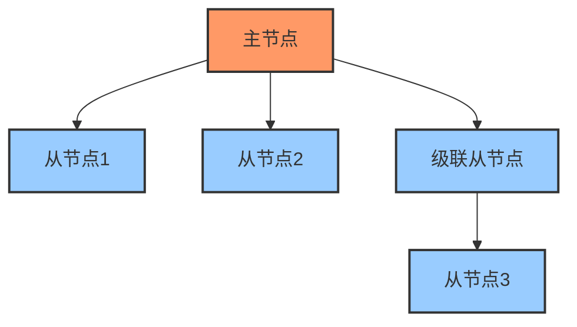
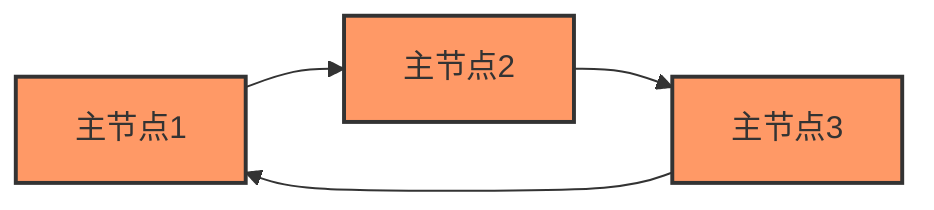
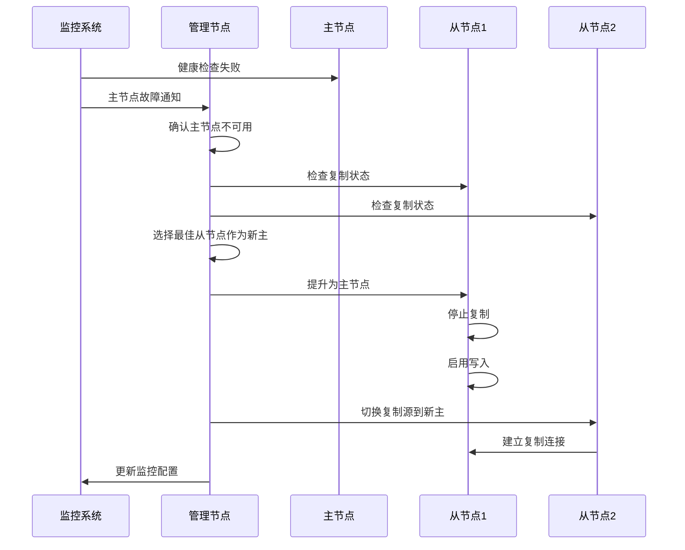
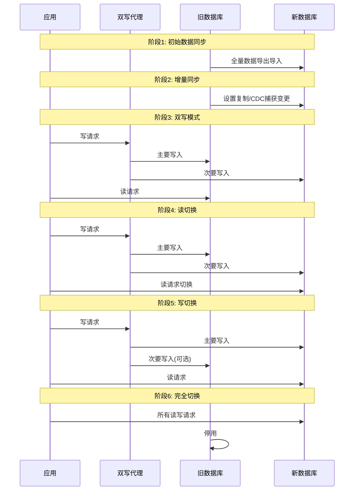

# 数据库复制与集群技术  

数据库复制与集群技术是现代数据库系统实现高可用性、可扩展性和容错性的核心机制。本文将深入探讨数据库复制的基本原理、不同复制模式、集群架构类型以及相关的监控与维护技术，帮助你全面理解如何构建可靠的数据库基础设施。

## 1. 复制基础原理  

数据库复制是指将数据从一个数据库服务器（主节点）复制到一个或多个数据库服务器（从节点）的过程。复制技术是实现数据库高可用性和负载均衡的基础。

### 1.1 复制拓扑结构  

数据库复制可以组织成不同的拓扑结构，每种结构都有其特定的优势和适用场景。



常见的复制拓扑结构包括：

1. **单主复制（Single-Master Replication）**：
   - 一个主节点，多个从节点
   - 所有写操作都在主节点进行
   - 读操作可以分散到从节点
   - 优点：简单易管理，写一致性高
   - 缺点：主节点是单点故障，写入容量受限

2. **主主复制（Master-Master Replication）**：
   - 两个或多个节点都可以接受写操作
   - 每个节点都会将变更复制到其他节点
   - 优点：提高写入可用性，消除单点故障
   - 缺点：可能产生数据冲突，需要冲突解决机制

3. **级联复制（Cascading Replication）**：
   - 从节点可以作为其他从节点的主节点
   - 减轻主节点的复制负担
   - 适用于地理分布式部署
   - 缺点：增加复制延迟，故障排查复杂

4. **环形复制（Circular Replication）**：
   - 节点形成一个环，每个节点复制到下一个节点
   - 所有节点既是主节点又是从节点
   - 优点：分散写入负载
   - 缺点：复杂度高，故障恢复困难

选择合适的拓扑结构需要考虑以下因素：
- 应用对数据一致性的要求
- 读写比例和负载特性
- 地理分布和网络条件
- 故障恢复的复杂度和时间要求

### 1.2 二进制日志格式  

二进制日志（Binary Log）是数据库复制的核心组件，它记录了数据库的所有变更操作，用于从主节点传输到从节点进行重放。

```sql:c:\project\kphub\sql\binlog_format.sql  
-- MySQL二进制日志配置  
-- 设置二进制日志格式为ROW模式
SET GLOBAL binlog_format = 'ROW';  
-- 确保每次事务提交都将二进制日志同步到磁盘
SET GLOBAL sync_binlog = 1;  

-- 查看当前二进制日志设置
SHOW VARIABLES LIKE 'binlog_format';
SHOW VARIABLES LIKE 'sync_binlog';

-- 查看二进制日志文件列表
SHOW BINARY LOGS;

-- 查看二进制日志事件
SHOW BINLOG EVENTS IN 'mysql-bin.000001' LIMIT 10;

-- 启用GTID模式（全局事务标识符）
SET GLOBAL gtid_mode = ON;
SET GLOBAL enforce_gtid_consistency = ON;
```  

二进制日志的三种格式：

1. **语句模式（Statement-based）**：
   - 记录执行的SQL语句
   - 优点：日志量小，效率高
   - 缺点：某些函数（如UUID()、RAND()）可能导致主从不一致

2. **行模式（Row-based）**：
   - 记录行的变化，而不是SQL语句
   - 优点：精确复制每一行的变更，确保一致性
   - 缺点：日志量大，特别是大批量操作时

3. **混合模式（Mixed）**：
   - 默认使用语句模式
   - 在可能导致不一致的情况下自动切换到行模式
   - 平衡了日志大小和复制精确性

二进制日志的工作流程：

1. 主节点执行事务并记录到二进制日志
2. 从节点的I/O线程从主节点获取二进制日志
3. 从节点将二进制日志保存到中继日志（Relay Log）
4. 从节点的SQL线程读取中继日志并重放操作

关键配置参数：

- **binlog_format**：设置二进制日志格式（STATEMENT/ROW/MIXED）
- **sync_binlog**：控制二进制日志写入磁盘的频率（1表示每次事务提交都同步）
- **expire_logs_days**：二进制日志自动清理的天数
- **max_binlog_size**：单个二进制日志文件的最大大小

## 2. 复制模式详解  

数据库复制可以采用不同的模式，主要区别在于数据如何从主节点传输到从节点，以及主节点如何确认复制完成。

### 2.1 同步 vs 异步复制  

同步复制和异步复制是两种基本的复制模式，它们在数据一致性和性能之间做出不同的权衡。

| 特性         | 同步复制          | 异步复制          |  
|--------------|------------------|------------------|  
| 数据一致性   | 强一致性          | 最终一致性        |  
| 性能影响     | 高延迟            | 低延迟            |  
| 故障恢复     | 复杂              | 简单              |  
| 网络要求     | 低延迟、高带宽    | 宽松              |
| 适用场景     | 金融交易、关键数据| 一般业务、分析系统|
| 主节点依赖   | 强依赖从节点可用性| 独立运行          |

**同步复制（Synchronous Replication）**：
- 主节点执行事务后，必须等待至少一个从节点确认接收并应用变更后才返回成功
- 确保在主节点故障时，至少有一个从节点包含所有已提交的事务
- 适用于对数据一致性要求极高的场景，如金融交易系统

```sql
-- Oracle Data Guard同步复制配置
ALTER DATABASE SET STANDBY DATABASE TO MAXIMIZE PROTECTION;
```

**异步复制（Asynchronous Replication）**：
- 主节点执行事务后立即返回，不等待从节点确认
- 从节点以自己的节奏应用变更，可能存在延迟
- 主节点性能不受从节点影响
- 适用于对性能要求高，可以容忍短暂数据不一致的场景

```sql
-- MySQL异步复制配置（默认模式）
CHANGE MASTER TO MASTER_HOST='master-server',
                 MASTER_USER='replication',
                 MASTER_PASSWORD='password',
                 MASTER_LOG_FILE='mysql-bin.000001',
                 MASTER_LOG_POS=4;
START SLAVE;
```

### 2.2 半同步复制配置  

半同步复制（Semi-Synchronous Replication）是同步复制和异步复制的折中方案，它要求至少一个从节点接收到变更后主节点才返回成功，但不要求从节点完成应用变更。

```ini:c:\project\kphub\conf\mysql_semisync.cnf  
[mysqld]  
# 加载半同步复制插件
plugin-load = "rpl_semi_sync_master=semisync_master.so;rpl_semi_sync_slave=semisync_slave.so"  
# 启用半同步复制（主节点配置）
rpl_semi_sync_master_enabled = 1  
# 主节点等待从节点确认的超时时间（毫秒）
rpl_semi_sync_master_timeout = 10000
# 启用半同步复制（从节点配置）
rpl_semi_sync_slave_enabled = 1  
# 主节点等待多少个从节点确认（默认为1）
rpl_semi_sync_master_wait_for_slave_count = 1
```  

半同步复制的工作流程：

1. 主节点执行事务并写入二进制日志
2. 主节点等待至少一个从节点确认接收到二进制日志事件
3. 主节点返回客户端事务提交成功
4. 从节点异步应用接收到的变更

半同步复制的优势：
- 在主节点故障时，至少有一个从节点接收了所有已提交的事务
- 相比同步复制，性能影响较小
- 相比异步复制，数据一致性更好

半同步复制的注意事项：
- 如果没有从节点在超时时间内确认，会自动降级为异步复制
- 需要监控复制状态，确保不会长时间运行在降级模式
- 网络延迟会直接影响写入性能

### 2.3 组复制技术

组复制（Group Replication）是一种更先进的复制技术，它使用分布式一致性协议来确保多个节点之间的数据一致性。

```sql
-- MySQL组复制配置
SET GLOBAL group_replication_bootstrap_group=ON;
START GROUP_REPLICATION;
SET GLOBAL group_replication_bootstrap_group=OFF;

-- 查看组成员状态
SELECT * FROM performance_schema.replication_group_members;
```

组复制的特点：
- 基于Paxos协议的变种实现多数派写入
- 自动成员管理和故障检测
- 支持多主模式和单主模式
- 内置冲突检测和解决机制
- 自动化故障转移

组复制适用场景：
- 需要高可用性和自动故障恢复的系统
- 地理分布式部署
- 需要强一致性保证的应用

## 3. 集群架构类型  

数据库集群是指多个数据库服务器协同工作，提供高可用性、可扩展性和负载均衡的系统。不同的集群架构适用于不同的业务需求。

### 3.1 主从架构部署  

主从架构（Master-Slave Architecture）是最基本的数据库集群形式，由一个主节点和一个或多个从节点组成。

```powershell:c:\project\kphub\scripts\setup_replication.ps1  
# 主库配置脚本
# 创建复制用户并授权
$masterCmd = @"
CREATE USER 'repl'@'%' IDENTIFIED BY 'password'; 
GRANT REPLICATION SLAVE ON *.* TO 'repl'@'%';
FLUSH PRIVILEGES;
"@

# 执行主库配置
mysql -h master-server -u root -p -e "$masterCmd"

# 获取主库二进制日志位置
$binlogInfo = mysql -h master-server -u root -p -e "SHOW MASTER STATUS\G"
Write-Host "主库二进制日志信息:"
Write-Host $binlogInfo

# 从库配置脚本
# 配置复制连接并启动复制
$slaveCmd = @"
STOP SLAVE;
CHANGE MASTER TO 
    MASTER_HOST='master-server', 
    MASTER_USER='repl', 
    MASTER_PASSWORD='password',
    MASTER_LOG_FILE='mysql-bin.000001',
    MASTER_LOG_POS=120;
START SLAVE;
"@

# 执行从库配置
mysql -h slave-server -u root -p -e "$slaveCmd"

# 检查从库状态
$slaveStatus = mysql -h slave-server -u root -p -e "SHOW SLAVE STATUS\G"
Write-Host "从库复制状态:"
Write-Host $slaveStatus

# 验证复制是否正常工作
function Test-Replication {
    # 在主库创建测试表并插入数据
    mysql -h master-server -u root -p -e "CREATE DATABASE IF NOT EXISTS test; USE test; CREATE TABLE IF NOT EXISTS repltest (id INT, value VARCHAR(50)); INSERT INTO repltest VALUES (1, 'Replication Test');"
    
    # 等待复制同步
    Start-Sleep -Seconds 5
    
    # 检查从库是否收到数据
    $result = mysql -h slave-server -u root -p -e "SELECT * FROM test.repltest;"
    
    if ($result -match "Replication Test") {
        Write-Host "复制测试成功！" -ForegroundColor Green
    } else {
        Write-Host "复制测试失败！" -ForegroundColor Red
    }
}

# 运行复制测试
Test-Replication
```  

主从架构的关键组件：

1. **主节点（Master）**：
   - 处理所有写操作
   - 生成二进制日志
   - 可以处理读操作（但通常分流到从节点）

2. **从节点（Slave）**：
   - 复制主节点的数据变更
   - 处理读查询，分担主节点负载
   - 可用于备份，减少主节点压力

3. **复制进程**：
   - I/O线程：从主节点获取二进制日志
   - SQL线程：应用二进制日志中的变更

主从架构的优势：
- 读写分离，提高系统吞吐量
- 数据备份和容灾
- 从节点可用于报表和分析，不影响主节点性能

主从架构的局限性：
- 主节点是单点故障
- 写入容量受限于单个主节点
- 复制延迟可能导致从节点数据不是最新的

### 3.2 多主环形复制  

多主环形复制（Multi-Master Ring Replication）是一种每个节点既是主节点又是从节点的复制拓扑，数据变更在节点之间形成一个环形传播路径。



多主环形复制的配置示例：

```sql
-- 节点1配置
-- 复制来自节点3的变更
CHANGE MASTER TO MASTER_HOST='node3', MASTER_USER='repl', MASTER_PASSWORD='password';
START SLAVE;

-- 节点2配置
-- 复制来自节点1的变更
CHANGE MASTER TO MASTER_HOST='node1', MASTER_USER='repl', MASTER_PASSWORD='password';
START SLAVE;

-- 节点3配置
-- 复制来自节点2的变更
CHANGE MASTER TO MASTER_HOST='node2', MASTER_USER='repl', MASTER_PASSWORD='password';
START SLAVE;
```

多主环形复制的特点：
- 每个节点可以接受写入操作
- 变更按照固定方向在环中传播
- 没有单点故障
- 写入负载分散到多个节点

多主环形复制的挑战：
- 数据冲突处理复杂
- 环中任一节点故障会中断整个复制链
- 复制延迟可能较大
- 故障恢复和新节点加入复杂

适用场景：
- 地理分布式部署，每个地区需要本地写入能力
- 写入负载需要分散到多个节点
- 可以容忍短暂的数据不一致

### 3.3 共享存储集群

共享存储集群（Shared Storage Cluster）是一种所有节点共享同一物理存储的集群架构。

```
┌─────────────┐  ┌─────────────┐  ┌─────────────┐
│  数据库节点1  │  │  数据库节点2  │  │  数据库节点3  │
└──────┬──────┘  └──────┬──────┘  └──────┬──────┘
        │                │                │
        └────────┬───────┴────────┬──────┘
                 │                │
         ┌───────┴────────┐ ┌────┴───────────┐
         │  共享存储系统   │ │  集群管理系统   │
         └────────────────┘ └────────────────┘
```

共享存储集群的实现方式：
- **Oracle RAC（Real Application Clusters）**：多个实例共享同一数据库存储
- **Windows Server Failover Clustering (WSFC)**：SQL Server的高可用性解决方案
- **NDB Cluster**：MySQL的内存数据库集群解决方案

共享存储集群的优势：
- 所有节点访问相同的数据，无需复制
- 故障转移速度快
- 无数据丢失风险
- 所有节点可以处理读写操作

共享存储集群的局限性：
- 共享存储可能成为性能瓶颈
- 存储系统是单点故障
- 通常需要专用硬件和高速互连
- 部署和维护成本高

### 3.4 分布式数据库集群

分布式数据库集群将数据分散存储在多个节点上，每个节点负责一部分数据，通过协调机制提供统一的访问接口。

```
┌─────────────────────────────────────────────┐
│               查询协调层                      │
└───────────┬─────────────┬──────────────────┘
            │             │                  │
┌───────────┴───┐ ┌───────┴────────┐ ┌──────┴───────┐
│  数据节点1     │ │   数据节点2     │ │   数据节点3   │
│ (分片1数据)    │ │  (分片2数据)    │ │  (分片3数据)  │
└───────────────┘ └────────────────┘ └──────────────┘
```

分布式数据库的代表：
- **Google Spanner**：全球分布式数据库
- **Amazon Aurora**：云原生分布式关系数据库
- **CockroachDB**：开源分布式SQL数据库
- **TiDB**：兼容MySQL协议的分布式数据库

分布式数据库集群的特点：
- 水平扩展能力强
- 数据自动分片和复制
- 支持跨地域部署
- 提供强一致性或可调节的一致性级别

## 4. 数据一致性保障  

在分布式数据库系统中，确保多个节点之间的数据一致性是一个核心挑战。不同的技术和机制被用来解决这一问题。

### 4.1 GTID复制原理  

全局事务标识符（Global Transaction Identifier, GTID）是一种用于唯一标识事务的机制，它简化了复制拓扑管理和故障恢复。

```sql:c:\project\kphub\sql\gtid_replication.sql  
-- 启用GTID复制
-- 在my.cnf中添加以下配置
-- gtid_mode = ON
-- enforce_gtid_consistency = ON

-- 在运行时启用GTID（需要重启服务）
SET GLOBAL gtid_mode = OFF_PERMISSIVE;
SET GLOBAL gtid_mode = ON_PERMISSIVE;
SET GLOBAL enforce_gtid_consistency = ON;
SET GLOBAL gtid_mode = ON;  

-- 查看GTID执行情况  
SELECT @@GLOBAL.gtid_executed;  

-- 使用GTID配置从库
CHANGE MASTER TO 
    MASTER_HOST='master-server',
    MASTER_USER='repl',
    MASTER_PASSWORD='password',
    MASTER_AUTO_POSITION=1;  -- 使用GTID自动定位

-- 启动从库复制
START SLAVE;

-- 查看从库复制状态
SHOW SLAVE STATUS\G
```  

GTID的组成：
- 服务器UUID：唯一标识一个数据库服务器
- 事务ID：服务器上执行的事务序号
- 格式：`server_uuid:transaction_id`
- 例如：`3E11FA47-71CA-11E1-9E33-C80AA9429562:23`

GTID复制的工作原理：
1. 主节点为每个事务生成一个全局唯一的GTID
2. 事务与GTID一起写入二进制日志
3. 从节点记录已执行的GTID集合
4. 从节点请求尚未执行的事务
5. 主节点发送从节点需要的事务

GTID复制的优势：
- 简化复制拓扑变更（如主从切换）
- 自动跳过已执行的事务，避免重复应用
- 提高故障恢复的可靠性和速度
- 简化复制监控和故障排查

GTID复制的注意事项：
- 所有服务器必须启用GTID
- 某些操作（如CREATE TABLE ... SELECT）需要特殊处理
- 迁移现有系统到GTID需要谨慎规划

### 4.2 冲突检测机制  

在多主复制或分布式数据库中，多个节点可能同时修改相同的数据，导致冲突。冲突检测和解决机制是确保数据一致性的关键。

```python:c:\project\kphub\src\db\conflict_resolution.py  
def detect_conflict(local_data, remote_data):  
    """
    检测本地数据和远程数据之间是否存在冲突
    
    参数:
        local_data: 本地数据对象，包含版本信息
        remote_data: 远程数据对象，包含版本信息
    
    返回:
        布尔值，表示是否存在冲突
    """
    # 基于版本号的冲突检测
    return local_data['version'] != remote_data['version']  

def resolve_conflict(local_data, remote_data, strategy='last_write_wins'):
    """
    解决数据冲突
    
    参数:
        local_data: 本地数据对象
        remote_data: 远程数据对象
        strategy: 冲突解决策略
    
    返回:
        解决冲突后的数据对象
    """
    if not detect_conflict(local_data, remote_data):
        return local_data  # 无冲突，返回本地数据
    
    if strategy == 'last_write_wins':
        # 基于时间戳的最后写入胜出策略
        if local_data['timestamp'] > remote_data['timestamp']:
            return local_data
        else:
            return remote_data
    
    elif strategy == 'higher_version_wins':
        # 基于版本号的高版本胜出策略
        if local_data['version'] > remote_data['version']:
            return local_data
        else:
            return remote_data
    
    elif strategy == 'merge':
        # 合并策略 - 合并两个数据对象的字段
        result = local_data.copy()
        for key, value in remote_data.items():
            if key not in ['version', 'timestamp']:
                # 对于非元数据字段，采用特定的合并逻辑
                if key in local_data and isinstance(local_data[key], list):
                    # 列表类型字段，合并并去重
                    result[key] = list(set(local_data[key] + remote_data[key]))
                else:
                    # 其他字段，使用远程值
                    result[key] = value
        
        # 更新版本和时间戳
        result['version'] = max(local_data['version'], remote_data['version']) + 1
        result['timestamp'] = max(local_data['timestamp'], remote_data['timestamp'])
        
        return result
    
    else:
        raise ValueError(f"不支持的冲突解决策略: {strategy}")
```  

常见的冲突检测机制：

1. **版本号检测**：
   - 每次修改增加版本号
   - 如果本地版本与远程版本不同，表示存在冲突
   - 简单高效，但需要额外存储版本信息

2. **时间戳检测**：
   - 记录每次修改的时间戳
   - 比较本地和远程时间戳
   - 依赖服务器时钟同步

3. **向量时钟（Vector Clock）**：
   - 每个节点维护一个向量，记录已知的每个节点的操作计数
   - 可以检测并发修改和因果关系
   - 更复杂但更精确

冲突解决策略：

1. **最后写入胜出（Last Write Wins）**：
   - 基于时间戳，最新的修改覆盖旧的修改
   - 简单但可能丢失数据

2. **高版本胜出（Higher Version Wins）**：
   - 基于版本号，版本号高的修改胜出
   - 适用于有明确版本控制的系统

3. **合并策略（Merge）**：
   - 尝试合并冲突的修改
   - 适用于可以并行修改不同字段的场景
   - 可能需要应用层逻辑

4. **用户解决（User Resolution）**：
   - 将冲突提交给用户或管理员解决
   - 适用于复杂冲突无法自动解决的情况

### 4.3 一致性模型

分布式系统中的一致性模型定义了系统对数据一致性的保证级别。

```
强一致性 ─────────────────────────────────────────> 弱一致性
│                │                │                │
线性一致性        顺序一致性        因果一致性        最终一致性
(Linearizability) (Sequential)    (Causal)        (Eventual)
```

主要的一致性模型：

1. **强一致性（Strong Consistency）**：
   - 所有节点在同一时间看到相同的数据
   - 任何读操作都能读到最近写入的数据
   - 实现成本高，性能受限

2. **最终一致性（Eventual Consistency）**：
   - 在没有新更新的情况下，最终所有节点将收敛到相同状态
   - 读操作可能返回旧数据
   - 性能好，可用性高

3. **因果一致性（Causal Consistency）**：
   - 保证因果相关的操作按正确顺序被观察到
   - 无因果关系的操作可能被不同节点以不同顺序观察到
   - 平衡了一致性和性能

4. **会话一致性（Session Consistency）**：
   - 在同一会话内保证读自己写的一致性
   - 不同会话之间可能看到不同的数据状态
   - 对用户体验友好

## 5. 分片集群技术  

当数据量增长超过单个服务器的容量时，分片（Sharding）技术允许将数据水
让我继续完成数据库复制与集群技术的文档内容：

## 5. 分片集群技术  

当数据量增长超过单个服务器的容量时，分片（Sharding）技术允许将数据水平分割到多个服务器上，实现系统的水平扩展。

### 5.1 水平分片策略  

水平分片是将表的行按照特定规则分布到不同的物理节点上，每个节点只存储部分数据。

```sql:c:\project\kphub\sql\sharding_rules.sql  
-- 按用户ID范围分片示例（伪代码，具体语法因数据库而异）
CREATE SHARDING RULE user_rule  
TYPE RANGE  
FOR TABLE users  
KEY user_id  
RANGE (  
    SHARD s1 VALUES LESS THAN (10000),  
    SHARD s2 VALUES LESS THAN (20000),
    SHARD s3 VALUES LESS THAN (MAXVALUE)
);  

-- 按地理位置哈希分片示例
CREATE SHARDING RULE order_rule
TYPE HASH
FOR TABLE orders
KEY region_code
PARTITIONS 4;

-- 按时间范围分片示例
CREATE SHARDING RULE log_rule
TYPE RANGE
FOR TABLE logs
KEY created_at
RANGE (
    SHARD log_2021 VALUES LESS THAN ('2022-01-01'),
    SHARD log_2022 VALUES LESS THAN ('2023-01-01'),
    SHARD log_2023 VALUES LESS THAN ('2024-01-01')
);
```  

常见的分片策略：

1. **范围分片（Range Sharding）**：
   - 按照键值的连续范围分片
   - 例如：用户ID 1-10000在分片1，10001-20000在分片2
   - 优点：范围查询高效
   - 缺点：可能导致数据分布不均

2. **哈希分片（Hash Sharding）**：
   - 使用哈希函数将键值映射到特定分片
   - 例如：hash(user_id) % 4 确定分片位置
   - 优点：数据分布均匀
   - 缺点：范围查询需要访问所有分片

3. **列表分片（List Sharding）**：
   - 基于离散值列表分片
   - 例如：不同国家/地区的数据存储在不同分片
   - 优点：业务逻辑清晰
   - 缺点：分片扩展不灵活

4. **复合分片（Composite Sharding）**：
   - 结合多种分片策略
   - 例如：先按地区分片，再按用户ID哈希分片
   - 优点：灵活性高
   - 缺点：实现复杂

分片键选择的考虑因素：

- **数据分布**：选择能够均匀分布数据的键
- **查询模式**：常用于查询条件的列是理想的分片键
- **更新频率**：避免频繁更新分片键，可能导致跨分片数据迁移
- **业务逻辑**：考虑业务自然分区（如地区、租户）

### 5.2 全局序列生成  

在分片环境中，传统的自增主键无法保证全局唯一性。全局序列生成器用于生成跨分片唯一的ID。

```java:c:\project\kphub\src\db\SnowflakeIdWorker.java  
/**
 * Twitter的Snowflake算法实现
 * 生成64位的长整型ID，结构如下：
 * 0 - 41位时间戳 - 5位数据中心ID - 5位工作节点ID - 12位序列号
 */
public class SnowflakeIdWorker {
    // 开始时间戳 (2020-01-01)
    private final long twepoch = 1577836800000L;
    
    // 数据中心ID和工作节点ID所占位数
    private final long datacenterIdBits = 5L;
    private final long workerIdBits = 5L;
    
    // 支持的最大数据中心ID和工作节点ID
    private final long maxDatacenterId = -1L ^ (-1L << datacenterIdBits);
    private final long maxWorkerId = -1L ^ (-1L << workerIdBits);
    
    // 序列号所占位数
    private final long sequenceBits = 12L;
    
    // 工作节点ID左移位数
    private final long workerIdShift = sequenceBits;
    // 数据中心ID左移位数
    private final long datacenterIdShift = sequenceBits + workerIdBits;
    // 时间戳左移位数
    private final long timestampLeftShift = sequenceBits + workerIdBits + datacenterIdBits;
    
    // 序列号掩码
    private final long sequenceMask = -1L ^ (-1L << sequenceBits);
    
    // 数据中心ID
    private long datacenterId;
    // 工作节点ID
    private long workerId;
    // 序列号
    private long sequence = 0L;
    // 上次生成ID的时间戳
    private long lastTimestamp = -1L;
    
    /**
     * 构造函数
     * @param datacenterId 数据中心ID (0~31)
     * @param workerId 工作节点ID (0~31)
     */
    public SnowflakeIdWorker(long datacenterId, long workerId) {
        if (datacenterId > maxDatacenterId || datacenterId < 0) {
            throw new IllegalArgumentException("数据中心ID不能大于" + maxDatacenterId + "或小于0");
        }
        if (workerId > maxWorkerId || workerId < 0) {
            throw new IllegalArgumentException("工作节点ID不能大于" + maxWorkerId + "或小于0");
        }
        this.datacenterId = datacenterId;
        this.workerId = workerId;
    }
    
    /**
     * 生成下一个ID
     * @return 唯一ID
     */
    public synchronized long nextId() {  
        long timestamp = timeGen();
        
        // 如果当前时间小于上次生成ID的时间，说明系统时钟回退，抛出异常
        if (timestamp < lastTimestamp) {  
            throw new RuntimeException("时钟回拨异常，拒绝生成ID");  
        }
        
        // 如果是同一时间生成的，则进行序列号递增
        if (lastTimestamp == timestamp) {  
            sequence = (sequence + 1) & sequenceMask;
            // 序列号溢出，等待下一毫秒
            if (sequence == 0) {
                timestamp = tilNextMillis(lastTimestamp);
            }
        } else {
            // 时间戳改变，序列号重置
            sequence = 0L;
        }
        
        // 更新上次生成ID的时间戳
        lastTimestamp = timestamp;
        
        // 组合各部分位数，生成最终的ID
        return ((timestamp - twepoch) << timestampLeftShift)  
                | (datacenterId << datacenterIdShift)  
                | (workerId << workerIdShift)  
                | sequence;  
    }
    
    /**
     * 阻塞到下一个毫秒，直到获得新的时间戳
     * @param lastTimestamp 上次生成ID的时间戳
     * @return 新的时间戳
     */
    private long tilNextMillis(long lastTimestamp) {
        long timestamp = timeGen();
        while (timestamp <= lastTimestamp) {
            timestamp = timeGen();
        }
        return timestamp;
    }
    
    /**
     * 获取当前时间戳
     * @return 当前时间(毫秒)
     */
    private long timeGen() {
        return System.currentTimeMillis();
    }
}
```  

全局唯一ID生成的常用方案：

1. **Snowflake算法**：
   - Twitter开发的分布式ID生成算法
   - 64位长整型，包含时间戳、工作节点ID和序列号
   - 优点：高性能，无需中央协调
   - 缺点：依赖系统时钟，时钟回拨会导致问题

2. **UUID/GUID**：
   - 128位全局唯一标识符
   - 优点：生成简单，不依赖中央服务
   - 缺点：占用空间大，不利于索引，无序

3. **数据库序列**：
   - 使用专用的序列服务器分配ID段
   - 每个应用服务器获取一段ID范围，本地分配
   - 优点：有序，便于索引
   - 缺点：需要维护中央序列服务

4. **Redis自增**：
   - 利用Redis的INCR命令生成序列
   - 优点：实现简单，性能高
   - 缺点：依赖Redis可用性

全局ID生成器的选择考虑因素：
- 性能要求（每秒生成数量）
- 可用性需求（是否容忍中央服务故障）
- ID格式要求（长度、可读性）
- 排序需求（是否需要按时间顺序）

### 5.3 分布式事务处理

在分片环境中，跨分片事务是一个挑战，需要特殊的分布式事务处理机制。

```java:c:\project\kphub\src\db\XATransactionExample.java
import javax.sql.XAConnection;
import javax.sql.XADataSource;
import javax.transaction.xa.XAException;
import javax.transaction.xa.XAResource;
import javax.transaction.xa.Xid;
import java.sql.Connection;
import java.sql.SQLException;
import java.sql.Statement;
import java.util.Random;

/**
 * XA分布式事务示例
 * 演示如何在两个不同的数据库之间执行分布式事务
 */
public class XATransactionExample {
    
    // 简化的XID实现
    static class MyXid implements Xid {
        private final int formatId;
        private final byte[] gtrid; // 全局事务ID
        private final byte[] bqual; // 分支限定符
        
        public MyXid(int formatId, byte[] gtrid, byte[] bqual) {
            this.formatId = formatId;
            this.gtrid = gtrid;
            this.bqual = bqual;
        }
        
        @Override
        public int getFormatId() {
            return formatId;
        }
        
        @Override
        public byte[] getGlobalTransactionId() {
            return gtrid;
        }
        
        @Override
        public byte[] getBranchQualifier() {
            return bqual;
        }
    }
    
    /**
     * 执行XA分布式事务
     * @param xaDS1 第一个数据源
     * @param xaDS2 第二个数据源
     * @throws SQLException SQL异常
     * @throws XAException XA异常
     */
    public void executeXATransaction(XADataSource xaDS1, XADataSource xaDS2) 
            throws SQLException, XAException {
        
        // 生成事务ID
        Random rand = new Random();
        byte[] gtrid = new byte[64];
        byte[] bqual1 = new byte[64];
        byte[] bqual2 = new byte[64];
        rand.nextBytes(gtrid);
        rand.nextBytes(bqual1);
        rand.nextBytes(bqual2);
        
        Xid xid1 = new MyXid(100, gtrid, bqual1);
        Xid xid2 = new MyXid(100, gtrid, bqual2);
        
        // 获取XA连接和资源
        XAConnection xaConn1 = xaDS1.getXAConnection();
        XAResource xaRes1 = xaConn1.getXAResource();
        Connection conn1 = xaConn1.getConnection();
        
        XAConnection xaConn2 = xaDS2.getXAConnection();
        XAResource xaRes2 = xaConn2.getXAResource();
        Connection conn2 = xaConn2.getConnection();
        
        try {
            // 开始第一个分支事务
            xaRes1.start(xid1, XAResource.TMNOFLAGS);
            Statement stmt1 = conn1.createStatement();
            stmt1.executeUpdate("UPDATE accounts SET balance = balance - 100 WHERE id = 1");
            xaRes1.end(xid1, XAResource.TMSUCCESS);
            
            // 开始第二个分支事务
            xaRes2.start(xid2, XAResource.TMNOFLAGS);
            Statement stmt2 = conn2.createStatement();
            stmt2.executeUpdate("UPDATE accounts SET balance = balance + 100 WHERE id = 2");
            xaRes2.end(xid2, XAResource.TMSUCCESS);
            
            // 准备阶段
            int prepare1 = xaRes1.prepare(xid1);
            int prepare2 = xaRes2.prepare(xid2);
            
            // 提交阶段
            if (prepare1 == XAResource.XA_OK && prepare2 == XAResource.XA_OK) {
                xaRes1.commit(xid1, false);
                xaRes2.commit(xid2, false);
                System.out.println("XA事务提交成功");
            } else {
                xaRes1.rollback(xid1);
                xaRes2.rollback(xid2);
                System.out.println("XA事务准备失败，已回滚");
            }
            
        } catch (SQLException | XAException e) {
            // 异常处理 - 回滚事务
            try {
                xaRes1.rollback(xid1);
                xaRes2.rollback(xid2);
            } catch (XAException xe) {
                System.err.println("回滚过程中发生错误: " + xe.getMessage());
            }
            throw e;
        } finally {
            // 关闭连接
            conn1.close();
            conn2.close();
            xaConn1.close();
            xaConn2.close();
        }
    }
}
```

分布式事务处理的主要方案：

1. **两阶段提交（2PC）**：
   - 准备阶段：协调者询问所有参与者是否可以提交
   - 提交阶段：如果所有参与者都同意，则执行提交
   - 优点：保证强一致性
   - 缺点：性能开销大，协调者是单点故障

2. **补偿事务（Saga）**：
   - 将分布式事务拆分为一系列本地事务
   - 每个本地事务都有对应的补偿事务
   - 如果某步骤失败，执行已完成步骤的补偿事务
   - 优点：性能好，无需锁定资源
   - 缺点：编程复杂，最终一致性

3. **TCC（Try-Confirm-Cancel）**：
   - Try：资源检查和预留
   - Confirm：确认执行业务操作
   - Cancel：取消操作，释放资源
   - 优点：比2PC性能好，比Saga一致性强
   - 缺点：实现复杂，需要业务层支持

4. **本地事务表 + 定时任务**：
   - 记录事务状态到本地表
   - 定时任务检查未完成事务并重试
   - 优点：实现简单，适合大多数业务场景
   - 缺点：一致性延迟，需要额外的状态管理

## 6. 监控与维护  

数据库复制和集群系统需要持续监控和维护，以确保其正常运行和高性能。

### 6.1 复制延迟检测  

复制延迟是指从主节点执行事务到从节点应用变更之间的时间差，是衡量复制健康状况的重要指标。

```powershell:c:\project\kphub\scripts\check_repl_lag.ps1  
# MySQL复制延迟监控脚本
# 获取从库复制状态并提取延迟信息

# 配置参数
$slaveServer = "slave-server"
$username = "monitor"
$password = "password"

function Get-ReplicationLag {
    param (
        [string]$server,
        [string]$user,
        [string]$pass
    )
    
    # 执行MySQL命令获取复制状态
    $command = "mysql -h $server -u $user -p$pass -e 'SHOW SLAVE STATUS\G'"
    $result = Invoke-Expression $command
    
    # 提取Seconds_Behind_Master值
    $lagLine = $result | Select-String "Seconds_Behind_Master"
    
    if ($lagLine) {
        $lag = $lagLine -replace ".*Seconds_Behind_Master: ", "" -replace "\s+", ""
        
        # 检查是否为NULL（表示复制未运行）
        if ($lag -eq "NULL") {
            return -1
        }
        
        return [int]$lag
    } else {
        Write-Error "无法获取复制延迟信息"
        return -1
    }
}

function Check-ReplicationHealth {
    param (
        [int]$lag,
        [int]$warningThreshold = 10,
        [int]$criticalThreshold = 30
    )
    
    if ($lag -eq -1) {
        Write-Host "复制未运行或无法获取状态" -ForegroundColor Red
        return "CRITICAL"
    }
    
    if ($lag -ge $criticalThreshold) {
        Write-Host "复制延迟严重: $lag 秒" -ForegroundColor Red
        return "CRITICAL"
    }
    
    if ($lag -ge $warningThreshold) {
        Write-Host "复制延迟警告: $lag 秒" -ForegroundColor Yellow
        return "WARNING"
    }
    
    Write-Host "复制状态正常: $lag 秒" -ForegroundColor Green
    return "OK"
}

# 获取复制延迟
$replicationLag = Get-ReplicationLag -server $slaveServer -user $username -pass $password

# 检查复制健康状态
$status = Check-ReplicationHealth -lag $replicationLag -warningThreshold 10 -criticalThreshold 30

# 输出详细信息
Write-Host "从库服务器: $slaveServer"
Write-Host "复制延迟: $replicationLag 秒"
Write-Host "状态: $status"

# 如果需要集成到监控系统，可以返回状态码
if ($status -eq "CRITICAL") {
    exit 2
} elseif ($status -eq "WARNING") {
    exit 1
} else {
    exit 0
}
```  

复制延迟的常见原因：

1. **大事务**：
   - 单个大事务需要在从节点一次性应用
   - 解决方案：拆分大事务，限制事务大小

2. **从节点负载过高**：
   - 从节点处理查询负载导致复制线程资源不足
   - 解决方案：增加从节点资源，分离查询负载

3. **网络带宽限制**：
   - 二进制日志传输受网络带宽限制
   - 解决方案：增加网络带宽，使用压缩复制

4. **磁盘I/O瓶颈**：
   - 从节点写入速度跟不上主节点
   - 解决方案：使用更快的存储，优化I/O配置

5. **单线程复制限制**：
   - 传统的单线程复制无法充分利用多核
   - 解决方案：使用并行复制（如MySQL 5.7+的多线程复制）

复制延迟监控的最佳实践：

- 设置合理的告警阈值（如10秒警告，30秒严重）
- 监控趋势而不仅是绝对值
- 结合其他指标（如I/O线程状态、SQL线程状态）
- 定期测试复制恢复流程

### 6.2 故障切换流程  

当主节点发生故障时，需要快速将一个从节点提升为新的主节点，并重新配置复制拓扑。



自动故障切换的实现方案：

1. **基于中间件的切换**：
   - 使用ProxySQL、HAProxy等代理
   - 监控数据库健康状态
   - 自动将流量切换到健康节点
   - 优点：对应用透明，切换快速
   - 缺点：增加系统复杂性

2. **基于集群管理器的切换**：
   - 使用Orchestrator、MHA等专用工具
   - 自动检测故障并执行切换
   - 重新配置复制拓扑
   - 优点：专为数据库设计，功能完善
   - 缺点：需要额外维护

3. **基于云服务的切换**：
   - 使用AWS RDS、Azure Database等托管服务
   - 由云服务提供商管理故障切换
   - 优点：运维简单，可靠性高
   - 缺点：依赖特定云服务，成本较高

故障切换的关键步骤：

1. **故障检测**：
   - 确认主节点确实不可用（避免脑裂）
   - 检查从节点复制状态和延迟

2. **选择新主节点**：
   - 选择复制延迟最小的从节点
   - 考虑硬件配置和网络位置

3. **提升新主节点**：
   - 停止从节点复制
   - 应用所有中继日志
   - 启用写入功能

4. **重新配置拓扑**：
   - 将其他从节点指向新主节点
   - 更新应用连接信息
   - 处理原主节点恢复后的角色

5. **验证切换结果**：
   - 确认新主节点可写入
   - 确认从节点正常复制
   - 确认应用正常运行

### 6.3 性能监控与优化

持续监控复制和集群性能，及时发现和解决潜在问题。

```powershell:c:\project\kphub\scripts\monitor_cluster_performance.ps1
# 数据库集群性能监控脚本

# 配置参数
$servers = @{
    "master" = @{
        "host" = "master-server",
        "role" = "master"
    },
    "slave1" = @{
        "host" = "slave1-server",
        "role" = "slave"
    },
    "slave2" = @{
        "host" = "slave2-server",
        "role" = "slave"
    }
}
$username = "monitor"
$password = "password"

function Get-ServerPerformance {
    param (
        [string]$server,
        [string]$user,
        [string]$pass,
        [string]$role
    )
    
    # 基本性能指标查询
    $queries = @{
        "connections" = "SELECT COUNT(*) AS active_connections FROM information_schema.processlist WHERE command != 'Sleep'"
        "queries_per_second" = "SHOW GLOBAL STATUS LIKE 'Queries'"
        "slow_queries" = "SHOW GLOBAL STATUS LIKE 'Slow_queries'"
        "buffer_pool_hit_ratio" = "SELECT (1 - ((SELECT VARIABLE_VALUE FROM information_schema.global_status WHERE VARIABLE_NAME = 'Innodb_buffer_pool_reads') / (SELECT VARIABLE_VALUE FROM information_schema.global_status WHERE VARIABLE_NAME = 'Innodb_buffer_pool_read_requests'))) * 100 AS buffer_pool_hit_ratio"
    }
    
    # 主节点特定查询
    if ($role -eq "master") {
        $queries["binlog_cache_use"] = "SHOW GLOBAL STATUS LIKE 'Binlog_cache_use'"
        $queries["binlog_cache_disk_use"] = "SHOW GLOBAL STATUS LIKE 'Binlog_cache_disk_use'"
        $queries["connected_slaves"] = "SHOW SLAVE HOSTS"
    }
    
    # 从节点特定查询
    if ($role -eq "slave") {
        $queries["slave_status"] = "SHOW SLAVE STATUS"
        $queries["relay_log_space"] = "SHOW GLOBAL STATUS LIKE 'Relay_Log_Space'"
    }
    
    $results = @{}
    
    foreach ($queryName in $queries.Keys) {
        $query = $queries[$queryName]
        $command = "mysql -h $server -u $user -p$pass -e `"$query`" -N"
        
        try {
            $result = Invoke-Expression $command
            $results[$queryName] = $result
        } catch {
            $results[$queryName] = "Error: $_"
        }
    }
    
    return $results
}

# 收集所有服务器的性能数据
$performanceData = @{}

foreach ($serverName in $servers.Keys) {
    $serverInfo = $servers[$serverName]
    Write-Host "收集服务器 $serverName ($($serverInfo.host)) 的性能数据..." -ForegroundColor Cyan
    
    $performanceData[$serverName] = Get-ServerPerformance -server $serverInfo.host -user $username -pass $password -role $serverInfo.role
}

# 分析性能数据
Write-Host "`n性能分析报告:" -ForegroundColor Green

foreach ($serverName in $performanceData.Keys) {
    $data = $performanceData[$serverName]
    $serverInfo = $servers[$serverName]
    
    Write-Host "`n服务器: $serverName ($($serverInfo.host)) - 角色: $($serverInfo.role)" -ForegroundColor Yellow
    
    # 显示基本性能指标
    Write-Host "活动连接数: $($data.connections)"
    Write-Host "查询速率: $($data.queries_per_second)"
    Write-Host "慢查询数: $($data.slow_queries)"
    Write-Host "缓冲池命中率: $($data.buffer_pool_hit_ratio)%"
    
    # 显示角色特定指标
    if ($serverInfo.role -eq "master") {
        Write-Host "二进制日志缓存使用: $($data.binlog_cache_use)"
        Write-Host "二进制日志缓存磁盘使用: $($data.binlog_cache_disk_use)"
        Write-Host "连接的从节点数: $($data.connected_slaves)"
    }
    
    if ($serverInfo.role -eq "slave") {
        $slaveStatus = $data.slave_status
        if ($slaveStatus -match "Seconds_Behind_Master") {
            $lag = $slaveStatus | Select-String "Seconds_Behind_Master" | ForEach-Object { $_ -replace ".*Seconds_Behind_Master\s+", "" }
            Write-Host "复制延迟: $lag 秒"
        }
        Write-Host "中继日志空间: $($data.relay_log_space)"
    }
}

# 输出性能建议
Write-Host "`n性能优化建议:" -ForegroundColor Green

# 检查缓冲池命中率
foreach ($serverName in $performanceData.Keys) {
    $data = $performanceData[$serverName]
    $hitRatio = [double]($data.buffer_pool_hit_ratio -replace "%", "")
    
    if ($hitRatio -lt 95) {
        Write-Host "服务器 $serverName 的缓冲池命中率较低 ($hitRatio%)，考虑增加 innodb_buffer_pool_size" -ForegroundColor Yellow
    }
}

# 检查二进制日志缓存
让我继续完成数据库复制与集群技术的文档内容：

## 7. 主流方案对比  

不同的数据库系统提供了各自的复制和集群解决方案，选择合适的方案需要考虑业务需求、性能要求和运维复杂度。

### 7.1 数据库集群方案  

| 方案          | 适用场景         | 数据一致性       | 扩展性 | 故障恢复 | 复杂度 |
|---------------|----------------|------------------|--------|---------|--------|
| MySQL Group Replication | OLTP，需要强一致性 | 强一致性 | 中等 | 自动 | 中等 |
| MongoDB副本集 | 文档数据库，高吞吐量 | 最终一致性 | 高 | 自动 | 低 |
| PostgreSQL流复制 | 关系型数据库，数据完整性要求高 | 可配置一致性 | 中等 | 手动/自动 | 中等 |
| Redis Sentinel/Cluster | 缓存，高性能键值存储 | 异步/最终一致性 | 高 | 自动 | 中等 |
| Cassandra | 大规模分布式数据，高可用性 | 可调节一致性 | 极高 | 自动 | 高 |
| SQL Server AlwaysOn | 企业级OLTP/OLAP混合负载 | 同步/异步可选 | 中等 | 自动 | 高 |

**MySQL Group Replication详解**：

MySQL Group Replication是一种基于Paxos协议变种的多主复制技术，提供强一致性保证。

```ini:c:\project\kphub\conf\group_replication.cnf
[mysqld]
# 基本配置
server_id=1
gtid_mode=ON
enforce_gtid_consistency=ON

# 组复制插件配置
plugin-load=group_replication.so
group_replication_group_name="aaaaaaaa-bbbb-cccc-dddd-eeeeeeeeeeee"
group_replication_start_on_boot=OFF
group_replication_local_address="192.168.1.1:33061"
group_replication_group_seeds="192.168.1.1:33061,192.168.1.2:33061,192.168.1.3:33061"
group_replication_bootstrap_group=OFF

# 单主模式配置
group_replication_single_primary_mode=ON

# 自动主节点选举
group_replication_auto_increment_increment=1
```

优势：
- 内置冲突检测和解决
- 自动成员管理和故障检测
- 支持单主模式和多主模式
- 与InnoDB集群集成提供完整解决方案

局限性：
- 对网络延迟敏感
- 需要较高的硬件配置
- 不支持特定类型的DDL操作
- 复制延迟可能在高负载下增加

**MongoDB副本集详解**：

MongoDB副本集是一种自动故障转移的高可用性解决方案，由一个主节点和多个从节点组成。

```javascript:c:\project\kphub\conf\mongodb_replica.js
// 初始化副本集
rs.initiate({
  _id: "myReplicaSet",
  members: [
    { _id: 0, host: "mongodb1:27017", priority: 2 },
    { _id: 1, host: "mongodb2:27017", priority: 1 },
    { _id: 2, host: "mongodb3:27017", priority: 1, arbiterOnly: false }
  ]
})

// 检查副本集状态
rs.status()

// 配置读取偏好
db.getMongo().setReadPref('secondary')
```

优势：
- 自动故障转移
- 灵活的读取偏好设置
- 支持地理分布式部署
- 操作简单，维护成本低

局限性：
- 主节点是写入单点
- 复制是异步的，可能丢失数据
- 分片集群配置较复杂
- 事务支持有限（4.0版本后改进）

**PostgreSQL流复制详解**：

PostgreSQL流复制是一种基于WAL（预写式日志）的物理复制技术，提供高性能和可靠性。

```ini:c:\project\kphub\conf\postgresql_replication.conf
# 主节点配置
wal_level = replica
max_wal_senders = 10
wal_keep_segments = 64
synchronous_standby_names = 'standby1'  # 同步复制配置

# 从节点配置
primary_conninfo = 'host=primary port=5432 user=replication password=password'
restore_command = 'cp /path/to/archive/%f %p'
recovery_target_timeline = 'latest'
```

优势：
- 支持同步和异步复制
- 流复制延迟低
- 支持级联复制
- 逻辑复制支持异构环境

局限性：
- 传统流复制不支持写入扩展
- 手动故障转移（需要额外工具如Patroni自动化）
- 复制粒度为整个集群
- 配置相对复杂

### 7.2 性能基准测试  

选择数据库复制和集群方案时，性能基准测试是必不可少的环节，帮助评估不同方案在实际负载下的表现。

```bash:c:\project\kphub\scripts\cluster_benchmark.sh
#!/bin/bash
# 数据库集群性能基准测试脚本

# 测试参数
HOST="cluster-proxy"
USER="benchmark"
PASSWORD="password"
DATABASE="test"
THREADS=16
TABLES=10
TABLE_SIZE=1000000
DURATION=300

# 清理测试环境
echo "清理测试环境..."
sysbench oltp_read_write --db-driver=mysql --mysql-host=$HOST --mysql-user=$USER --mysql-password=$PASSWORD --mysql-db=$DATABASE cleanup

# 准备测试数据
echo "准备测试数据..."
sysbench oltp_read_write --db-driver=mysql --mysql-host=$HOST --mysql-user=$USER --mysql-password=$PASSWORD --mysql-db=$DATABASE --tables=$TABLES --table-size=$TABLE_SIZE prepare

# 运行只读测试
echo "运行只读测试..."
sysbench oltp_read_only --db-driver=mysql --mysql-host=$HOST --mysql-user=$USER --mysql-password=$PASSWORD --mysql-db=$DATABASE --tables=$TABLES --table-size=$TABLE_SIZE --threads=$THREADS --time=$DURATION run > read_only_results.txt

# 运行读写测试
echo "运行读写测试..."
sysbench oltp_read_write --db-driver=mysql --mysql-host=$HOST --mysql-user=$USER --mysql-password=$PASSWORD --mysql-db=$DATABASE --tables=$TABLES --table-size=$TABLE_SIZE --threads=$THREADS --time=$DURATION run > read_write_results.txt

# 运行写入密集测试
echo "运行写入密集测试..."
sysbench oltp_write_only --db-driver=mysql --mysql-host=$HOST --mysql-user=$USER --mysql-password=$PASSWORD --mysql-db=$DATABASE --tables=$TABLES --table-size=$TABLE_SIZE --threads=$THREADS --time=$DURATION run > write_only_results.txt

# 分析结果
echo "测试完成，分析结果..."
echo "只读测试结果:"
grep "transactions:" read_only_results.txt
grep "queries:" read_only_results.txt
grep "latency:" read_only_results.txt

echo "读写测试结果:"
grep "transactions:" read_write_results.txt
grep "queries:" read_write_results.txt
grep "latency:" read_write_results.txt

echo "写入密集测试结果:"
grep "transactions:" write_only_results.txt
grep "queries:" write_only_results.txt
grep "latency:" write_only_results.txt

# 清理测试环境
echo "清理测试环境..."
sysbench oltp_read_write --db-driver=mysql --mysql-host=$HOST --mysql-user=$USER --mysql-password=$PASSWORD --mysql-db=$DATABASE cleanup
```

性能基准测试的关键指标：

1. **吞吐量（Throughput）**：
   - 每秒事务数（TPS）
   - 每秒查询数（QPS）
   - 衡量系统处理能力

2. **延迟（Latency）**：
   - 平均响应时间
   - 95/99百分位响应时间
   - 衡量用户体验

3. **可扩展性（Scalability）**：
   - 随节点增加的性能提升
   - 线性扩展能力
   - 扩展极限

4. **一致性（Consistency）**：
   - 数据一致性延迟
   - 冲突率
   - 异常情况下的行为

基准测试的最佳实践：

- 使用真实数据量和查询模式
- 测试不同负载类型（读密集、写密集、混合）
- 模拟网络延迟和故障
- 长时间运行测试（至少数小时）
- 监控系统资源使用情况
- 记录详细的测试条件和结果

### 7.3 选型决策框架

选择合适的数据库复制和集群方案需要综合考虑多种因素，以下决策框架可以帮助做出选择：

1. **业务需求分析**：
   - 数据一致性要求（强一致性 vs 最终一致性）
   - 可用性要求（99.9% vs 99.99% vs 99.999%）
   - 性能要求（延迟敏感度、吞吐量）
   - 数据量和增长预期

2. **技术兼容性**：
   - 现有技术栈和技术债务
   - 团队技术能力和经验
   - 与其他系统的集成需求
   - 云环境或本地部署

3. **成本考量**：
   - 硬件/云资源成本
   - 许可证成本
   - 运维人力成本
   - 培训和学习成本

4. **风险评估**：
   - 技术成熟度和社区活跃度
   - 供应商锁定风险
   - 迁移复杂度和风险
   - 安全性和合规性

决策矩阵示例：

| 需求/方案 | MySQL Group Replication | MongoDB副本集 | PostgreSQL流复制 | 分布式NewSQL |
|----------|------------------------|--------------|-----------------|-------------|
| 强一致性  | ★★★★☆                 | ★★☆☆☆        | ★★★★☆           | ★★★★★       |
| 高可用性  | ★★★★☆                 | ★★★★★        | ★★★☆☆           | ★★★★☆       |
| 水平扩展  | ★★★☆☆                 | ★★★★☆        | ★★☆☆☆           | ★★★★★       |
| 运维简易度| ★★★☆☆                 | ★★★★☆        | ★★★☆☆           | ★★☆☆☆       |
| 成本效益  | ★★★★☆                 | ★★★★☆        | ★★★★★           | ★★☆☆☆       |

## 8. 实施与迁移策略  

实施数据库复制和集群方案需要仔细规划和执行，特别是对于已有系统的迁移。

### 8.1 零停机迁移技术  

零停机迁移是指在不中断业务的情况下，将数据库从一个架构迁移到另一个架构。



零停机迁移的关键技术：

1. **变更数据捕获（CDC）**：
   - 捕获源数据库的所有变更
   - 实时应用到目标数据库
   - 工具：Debezium, Oracle GoldenGate, AWS DMS

2. **双写模式**：
   - 应用同时写入新旧数据库
   - 确保数据一致性
   - 允许快速回滚

3. **流量切换**：
   - 逐步将读流量切换到新数据库
   - 验证新系统稳定后切换写流量
   - 使用代理层实现透明切换

4. **数据验证**：
   - 持续比较新旧数据库数据
   - 检测并解决不一致
   - 确保数据完整性

零停机迁移的挑战与解决方案：

| 挑战 | 解决方案 |
|------|---------|
| 初始数据同步时间长 | 并行导出导入，使用增量备份 |
| 复制延迟 | 监控延迟，设置阈值，延迟过大时暂停切换 |
| 架构差异 | 使用转换层，处理数据类型和结构差异 |
| 应用兼容性 | 使用适配层，隔离应用与数据库变更 |
| 回滚机制 | 保留双写能力，准备快速切回方案 |

### 8.2 高可用部署架构  

高可用数据库架构设计需要考虑多层次的冗余和故障转移机制。

```
                      ┌─────────────────┐
                      │   负载均衡器    │
                      └────────┬────────┘
                               │
             ┌─────────────────┴─────────────────┐
             │                                   │
     ┌───────┴───────┐                   ┌───────┴───────┐
     │  应用服务器1   │                   │  应用服务器2   │
     └───────┬───────┘                   └───────┬───────┘
             │                                   │
     ┌───────┴───────┐                   ┌───────┴───────┐
     │  数据库代理1   │                   │  数据库代理2   │
     └───────┬───────┘                   └───────┬───────┘
             │                                   │
             └─────────────┬───────────────────┬─┘
                           │                   │
               ┌───────────┴───┐     ┌─────────┴─────┐
               │  主数据库节点  │────▶│ 同步从节点(HA) │
               └───────────┬───┘     └─────────┬─────┘
                           │                   │
                           ▼                   ▼
                    ┌──────────────┐   ┌──────────────┐
                    │ 异步从节点1   │   │ 异步从节点2   │
                    │ (只读副本)    │   │ (灾备)       │
                    └──────────────┘   └──────────────┘
```

高可用架构的关键组件：

1. **负载均衡层**：
   - 分发应用流量
   - 健康检查和故障检测
   - 实现透明的故障转移

2. **数据库代理层**：
   - 读写分离
   - 连接池管理
   - 故障检测和路由

3. **数据库集群**：
   - 主节点：处理写入和关键读取
   - 同步从节点：提供高可用性保障
   - 异步从节点：提供读扩展和备份

4. **监控和自动化**：
   - 全面监控所有组件
   - 自动故障检测和恢复
   - 警报和通知系统

高可用架构的设计原则：

- **消除单点故障**：每个组件都有冗余
- **故障隔离**：一个组件故障不应影响整个系统
- **自动恢复**：系统能够自动检测和恢复故障
- **可测试性**：定期测试故障转移流程
- **性能与可用性平衡**：根据业务需求选择同步或异步复制

### 8.3 灾备与恢复计划

灾难恢复计划是确保在严重故障或灾难情况下能够恢复数据库服务的关键策略。

```powershell:c:\project\kphub\scripts\disaster_recovery_test.ps1
# 数据库灾难恢复测试脚本

# 配置参数
$primarySite = "primary-datacenter"
$drSite = "dr-datacenter"
$applicationServers = @("app1", "app2", "app3")
$databaseServers = @{
    "primary" = "db-primary"
    "standby" = "db-standby"
    "dr" = "db-dr"
}
$backupLocation = "\\backup-server\db-backups"

# 1. 验证灾备站点可用性
function Test-DRSiteAvailability {
    Write-Host "测试灾备站点可用性..." -ForegroundColor Cyan
    
    # 检查网络连接
    $pingResult = Test-Connection -ComputerName $drSite -Count 2 -Quiet
    
    if ($pingResult) {
        Write-Host "灾备站点网络连接正常" -ForegroundColor Green
    } else {
        Write-Host "灾备站点网络连接失败！" -ForegroundColor Red
        return $false
    }
    
    # 检查DR数据库服务器
    $drDbPing = Test-Connection -ComputerName $databaseServers.dr -Count 2 -Quiet
    
    if ($drDbPing) {
        Write-Host "灾备数据库服务器可访问" -ForegroundColor Green
    } else {
        Write-Host "灾备数据库服务器不可访问！" -ForegroundColor Red
        return $false
    }
    
    return $true
}

# 2. 验证复制状态
function Test-ReplicationStatus {
    Write-Host "检查数据库复