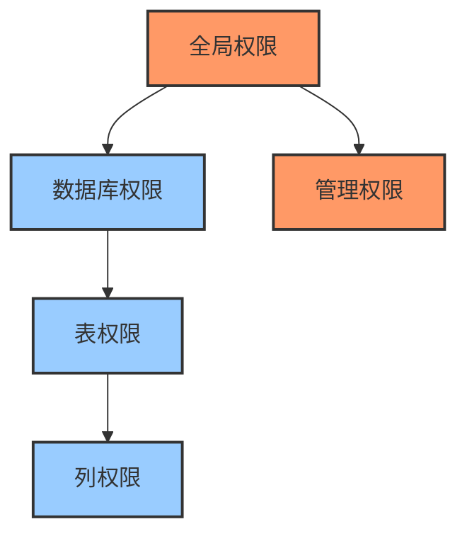

# 数据库用户与权限管理  

数据库用户与权限管理是数据库安全的核心组成部分，它确保只有授权用户能够访问数据，并且每个用户只能执行其被允许的操作。本文将详细介绍数据库用户管理、权限体系、安全审计以及最佳实践，帮助你构建安全可靠的数据库环境。

## 1. 用户管理基础  

数据库用户是访问数据库系统的实体，每个用户都有唯一的身份标识和相应的访问权限。用户管理是数据库管理员的基本职责之一。

### 1.1 用户创建与删除  

用户管理的基本操作包括创建用户、删除用户和修改用户属性（如密码）。

```sql:c:\project\kphub\sql\user_management.sql  
-- 创建带密码的用户  
-- 格式: CREATE USER '用户名'@'主机' IDENTIFIED BY '密码';
-- 主机可以是具体IP、IP段(使用%)或localhost
CREATE USER 'app_user'@'192.168.1.%' IDENTIFIED BY 'SecurePass123!';  

-- 创建不同访问来源的用户
CREATE USER 'local_admin'@'localhost' IDENTIFIED BY 'LocalAdminPass!';  -- 只允许本地连接
CREATE USER 'web_service'@'10.0.0.5' IDENTIFIED BY 'WebServicePass!';   -- 只允许特定IP连接
CREATE USER 'remote_user'@'%' IDENTIFIED BY 'RemoteUserPass!';          -- 允许任何IP连接

-- 删除用户  
-- 格式: DROP USER '用户名'@'主机';
DROP USER 'old_user'@'localhost';  

-- 修改密码  
-- 方法1: 管理员为其他用户修改密码
ALTER USER 'admin'@'%' IDENTIFIED BY 'NewAdminPass456!';  

-- 方法2: 用户修改自己的密码
SET PASSWORD = PASSWORD('MyNewPassword123!');

-- 锁定和解锁用户账户
ALTER USER 'temp_user'@'%' ACCOUNT LOCK;   -- 锁定用户
ALTER USER 'temp_user'@'%' ACCOUNT UNLOCK; -- 解锁用户

-- 设置密码过期策略
ALTER USER 'finance_user'@'%' PASSWORD EXPIRE INTERVAL 90 DAY; -- 90天后密码过期
```

在创建用户时需要注意以下几点：

1. **用户标识**：由用户名和主机组成，格式为`'username'@'host'`
2. **主机部分**：
   - `localhost`：只允许本地连接
   - 具体IP地址：只允许该IP连接
   - IP段（如`192.168.1.%`）：允许特定网段连接
   - `%`：允许任何主机连接
3. **密码安全**：
   - 使用强密码（包含大小写字母、数字和特殊字符）
   - 定期更换密码
   - 不同环境使用不同密码

### 1.2 密码策略配置  

为了增强安全性，数据库系统通常提供密码策略配置，用于强制实施密码复杂度要求。

```sql:c:\project\kphub\sql\password_policy.sql  
-- 查看当前密码验证插件状态
SHOW VARIABLES LIKE 'validate_password%';

-- 设置密码复杂度要求  
SET GLOBAL validate_password.policy = STRONG;           -- 密码策略级别(LOW, MEDIUM, STRONG)
SET GLOBAL validate_password.length = 12;               -- 最小密码长度
SET GLOBAL validate_password.mixed_case_count = 1;      -- 至少需要的大小写混合字符数
SET GLOBAL validate_password.number_count = 1;          -- 至少需要的数字字符数
SET GLOBAL validate_password.special_char_count = 1;    -- 至少需要的特殊字符数

-- 测试密码强度
SELECT VALIDATE_PASSWORD_STRENGTH('Weak123') AS strength;  -- 返回密码强度评分(0-100)

-- 在MySQL 8.0中永久设置密码策略(需要在配置文件中添加)
-- 在my.cnf或my.ini中:
-- [mysqld]
-- validate_password.policy=STRONG
-- validate_password.length=12
-- validate_password.mixed_case_count=1
-- validate_password.number_count=1
-- validate_password.special_char_count=1
```

密码策略级别说明：

1. **LOW**：只检查密码长度
2. **MEDIUM**：检查长度、数字、大小写和特殊字符
3. **STRONG**：检查所有MEDIUM级别要求，并对比常见词典单词

密码管理最佳实践：

- 实施密码复杂度要求
- 设置密码过期策略
- 限制密码重用
- 实施账户锁定策略（多次登录失败后）
- 定期审计用户账户

## 2. 权限体系详解  

数据库权限系统控制用户可以执行的操作，是保护数据安全的关键机制。了解权限体系有助于实施精细化的访问控制。

### 2.1 权限层级结构  

数据库权限通常按照不同的层级组织，从全局级别到列级别，形成一个层次结构。



权限层级详解：

1. **全局权限**：
   - 适用于服务器上的所有数据库
   - 例如：`SUPER`、`SHUTDOWN`、`PROCESS`
   - 语法：`GRANT privilege ON *.* TO user`

2. **数据库权限**：
   - 适用于特定数据库中的所有对象
   - 例如：`CREATE`、`DROP`
   - 语法：`GRANT privilege ON database.* TO user`

3. **表权限**：
   - 适用于特定表的所有列
   - 例如：`SELECT`、`INSERT`、`UPDATE`、`DELETE`
   - 语法：`GRANT privilege ON database.table TO user`

4. **列权限**：
   - 适用于表中的特定列
   - 例如：`SELECT (column1, column2)`、`UPDATE (column1)`
   - 语法：`GRANT privilege (column1, column2) ON database.table TO user`

5. **管理权限**：
   - 特殊权限，用于管理数据库系统
   - 例如：`CREATE USER`、`GRANT OPTION`
   - 通常只授予管理员

### 2.2 常用权限对照表  

下表列出了常见的数据库权限及其作用范围和用途：

| 权限类型 | 作用范围 | 描述 | 适用场景 |
|---------|---------|------|---------|
| SELECT | 表/视图/过程 | 允许查询数据 | 只读用户、报表用户 |
| INSERT | 表 | 允许插入数据 | 数据录入人员 |
| UPDATE | 表/列 | 允许修改现有数据 | 数据维护人员 |
| DELETE | 表 | 允许删除数据 | 数据管理员 |
| CREATE | 数据库/表/索引 | 允许创建对象 | 开发人员 |
| DROP | 数据库/表/视图 | 允许删除对象 | 管理员 |
| ALTER | 表 | 允许修改表结构 | 数据库开发人员 |
| INDEX | 表 | 允许创建和删除索引 | 性能优化人员 |
| EXECUTE | 存储过程 | 允许执行存储过程 | 应用用户 |
| GRANT OPTION | 任何级别 | 允许授予权限给其他用户 | 安全管理员 |
| SUPER | 服务器 | 允许执行管理操作 | 数据库管理员 |
| PROCESS | 服务器 | 允许查看所有进程 | 监控人员 |
| RELOAD | 服务器 | 允许重新加载权限 | 系统管理员 |
| SHUTDOWN | 服务器 | 允许关闭数据库服务 | 系统管理员 |
| FILE | 服务器 | 允许文件操作 | 备份管理员 |

### 2.3 权限授予与撤销

权限的授予和撤销是权限管理的核心操作。

```sql:c:\project\kphub\sql\grant_revoke.sql
-- 授予权限
-- 语法: GRANT 权限列表 ON 对象 TO 用户 [WITH GRANT OPTION];

-- 授予表级权限
GRANT SELECT, INSERT, UPDATE ON sales.customers TO 'sales_rep'@'%';

-- 授予列级权限(只允许更新特定列)
GRANT SELECT ON sales.customers TO 'analyst'@'%';
GRANT UPDATE (name, email, phone) ON sales.customers TO 'support'@'%';

-- 授予数据库级权限
GRANT ALL PRIVILEGES ON inventory.* TO 'inventory_admin'@'%';

-- 授予全局权限
GRANT PROCESS, SHOW DATABASES ON *.* TO 'monitoring'@'%';

-- 授予WITH GRANT OPTION(允许用户将自己的权限授予其他用户)
GRANT SELECT ON reports.* TO 'report_manager'@'%' WITH GRANT OPTION;

-- 撤销权限
-- 语法: REVOKE 权限列表 ON 对象 FROM 用户;

-- 撤销特定权限
REVOKE DELETE ON sales.customers FROM 'sales_rep'@'%';

-- 撤销所有权限
REVOKE ALL PRIVILEGES, GRANT OPTION FROM 'temp_user'@'%';

-- 刷新权限(使更改立即生效)
FLUSH PRIVILEGES;
```

权限授予的最佳实践：

1. **最小权限原则**：只授予用户执行其工作所需的最小权限集
2. **使用角色**：通过角色管理权限，而不是直接授予用户
3. **定期审查**：定期检查和清理不必要的权限
4. **避免使用通配符**：尽量避免使用`*.*`这样的通配符授予权限
5. **谨慎使用GRANT OPTION**：只有受信任的管理员应该拥有此权限

## 3. 权限分配实践  

实际工作中，我们需要根据不同用户的职责和需求分配适当的权限。角色是组织和管理权限的有效方式。

### 3.1 角色创建与授权  

角色是一组权限的集合，可以分配给多个用户。使用角色可以简化权限管理，提高安全性。

```sql:c:\project\kphub\sql\role_management.sql  
-- MySQL 8.0及以上版本支持角色

-- 创建角色  
CREATE ROLE 'read_only', 'data_writer', 'db_admin', 'app_user';  

-- 角色授权  
-- 只读角色
GRANT SELECT ON *.* TO 'read_only';  

-- 数据写入角色
GRANT SELECT, INSERT, UPDATE, DELETE ON sales.* TO 'data_writer';  
GRANT SELECT, INSERT, UPDATE, DELETE ON marketing.* TO 'data_writer';  

-- 数据库管理员角色
GRANT ALL PRIVILEGES ON *.* TO 'db_admin';

-- 应用用户角色(有限的权限集)
GRANT SELECT, INSERT, UPDATE ON app_schema.* TO 'app_user';
GRANT EXECUTE ON PROCEDURE app_schema.sp_process_data TO 'app_user';

-- 用户关联角色  
-- 将角色分配给用户
GRANT 'read_only' TO 'report_user'@'%';  
GRANT 'data_writer' TO 'sales_manager'@'%';
GRANT 'app_user' TO 'web_service'@'10.0.0.%';

-- 多角色分配
GRANT 'read_only', 'data_writer' TO 'team_lead'@'%';

-- 设置默认角色(登录时自动激活)
SET DEFAULT ROLE 'read_only' TO 'report_user'@'%';
SET DEFAULT ROLE ALL TO 'team_lead'@'%';  -- 激活所有分配的角色

-- 激活/停用角色(用户会话中)
SET ROLE 'data_writer';  -- 激活特定角色
SET ROLE NONE;           -- 停用所有角色
SET ROLE ALL;            -- 激活所有分配的角色

-- 查看当前激活的角色
SELECT CURRENT_ROLE();

-- 查看角色权限
SHOW GRANTS FOR 'data_writer';

-- 撤销角色
REVOKE 'data_writer' FROM 'sales_manager'@'%';

-- 删除角色
DROP ROLE 'temporary_role';
```

角色管理的优势：

1. **简化权限管理**：一次定义权限集，多次使用
2. **标准化访问控制**：确保相同职责的用户拥有相同的权限
3. **减少管理开销**：修改角色权限会自动影响所有分配该角色的用户
4. **提高安全性**：更容易审计和管理权限

### 3.2 最小权限原则示例  

最小权限原则是安全最佳实践，即只授予用户完成其工作所需的最小权限集。

```sql:c:\project\kphub\sql\least_privilege.sql  
-- 开发环境权限示例
-- 开发人员权限(只能访问开发数据库)
CREATE ROLE 'developer';
GRANT SELECT, INSERT, UPDATE, DELETE ON dev_db.* TO 'developer';
GRANT CREATE, ALTER, DROP ON dev_db.* TO 'developer';
GRANT 'developer' TO 'dev1'@'10.0.0.%', 'dev2'@'10.0.0.%';

-- 测试环境权限示例
-- 测试人员权限(只读+执行存储过程)
CREATE ROLE 'tester';
GRANT SELECT ON test_db.* TO 'tester';
GRANT EXECUTE ON test_db.* TO 'tester';
GRANT 'tester' TO 'qa1'@'%', 'qa2'@'%';

-- 生产环境权限示例
-- 应用服务账户(只有必要的操作权限)
CREATE ROLE 'app_service';
GRANT SELECT, INSERT, UPDATE ON prod_db.customers TO 'app_service';
GRANT SELECT ON prod_db.products TO 'app_service';
GRANT EXECUTE ON PROCEDURE prod_db.place_order TO 'app_service';
GRANT 'app_service' TO 'web_app'@'192.168.0.%';

-- 数据分析师权限(只读访问)
CREATE ROLE 'analyst';
GRANT SELECT ON analytics.* TO 'analyst';
GRANT SELECT ON prod_db.sales_summary TO 'analyst';
GRANT 'analyst' TO 'analyst1'@'%', 'analyst2'@'%';

-- 数据库操作员权限(监控和维护)
CREATE ROLE 'operator';
GRANT PROCESS, SHOW DATABASES, RELOAD ON *.* TO 'operator';
GRANT SELECT ON performance_schema.* TO 'operator';
GRANT 'operator' TO 'ops'@'10.0.0.%';
```

针对不同角色的最小权限设计：

1. **应用服务账户**：
   - 只能访问应用所需的表和列
   - 只能执行预定义的存储过程
   - 不能创建或修改数据库对象

2. **报表用户**：
   - 只有SELECT权限
   - 可能只能访问视图而非底层表
   - 可能只能在特定时间段访问

3. **开发人员**：
   - 在开发环境有完全权限
   - 在测试环境有有限权限
   - 在生产环境只有只读权限或无权限

4. **数据库管理员**：
   - 完全权限，但操作需要记录和审计
   - 敏感操作可能需要双人授权

## 4. 安全审计  

安全审计是确保数据库安全的重要组成部分，它帮助识别潜在的安全问题并确保合规性。

### 4.1 权限查看命令  

定期检查用户权限是安全审计的基本步骤。

```sql:c:\project\kphub\sql\permission_audit.sql  
-- 查看特定用户的权限  
SHOW GRANTS FOR 'app_user'@'192.168.1.%';  

-- 查看当前用户的权限
SHOW GRANTS;

-- 查看所有用户  
SELECT user, host FROM mysql.user;  

-- 查看用户详细信息
SELECT user, host, account_locked, password_expired 
FROM mysql.user;

-- 查看角色分配情况
SELECT FROM_USER, FROM_HOST, TO_USER, TO_HOST 
FROM mysql.role_edges;

-- 查看数据库级权限
SELECT * FROM mysql.db WHERE User = 'app_user';

-- 查看表级权限
SELECT * FROM mysql.tables_priv WHERE User = 'app_user';

-- 查看列级权限
SELECT * FROM mysql.columns_priv WHERE User = 'app_user';

-- 查看存储过程和函数权限
SELECT * FROM mysql.procs_priv WHERE User = 'app_user';
```

权限审计的关键点：

1. **定期审查**：定期检查所有用户的权限
2. **识别过度权限**：查找拥有超出其职责所需权限的用户
3. **检查未使用的账户**：识别长期未使用的账户
4. **验证密码策略**：确保所有账户遵循密码策略
5. **检查特权账户**：特别关注拥有高级权限的账户

### 4.2 审计日志配置  

审计日志记录数据库中的关键操作，有助于安全监控和事后调查。

```ini:c:\project\kphub\conf\mysql_audit.cnf  
[mysqld]  
# 加载审计日志插件
plugin-load = audit_log.so  

# 审计日志格式(JSON, NEW, OLD)
audit_log_format = JSON  

# 审计策略(ALL, LOGINS, QUERIES, NONE)
audit_log_policy = ALL  

# 审计日志文件
audit_log_file = C:/mysql/logs/audit.log

# 审计日志轮换(SIZE, DAY, NONE)
audit_log_rotate_on_size = 100M

# 审计日志过滤器(可选)
audit_log_filter_id = filter_1
audit_log_filter_user = '%'

# 包含/排除特定用户(可选)
# audit_log_include_accounts = 'root@localhost,admin@%'
# audit_log_exclude_accounts = 'app_user@%'
```

审计日志策略选项：

1. **ALL**：记录所有事件（登录和查询）
2. **LOGINS**：只记录登录事件
3. **QUERIES**：只记录查询事件
4. **NONE**：不记录任何事件

审计日志的最佳实践：

- 根据合规要求和安全策略配置审计级别
- 确保审计日志存储在安全位置
- 实施日志轮换以管理磁盘空间
- 定期检查审计日志以识别异常活动
- 考虑使用自动化工具分析审计日志

### 4.3 审计日志分析

收集审计日志后，需要对其进行分析以发现潜在的安全问题。

```powershell:c:\project\kphub\scripts\analyze_audit_log.ps1
# 审计日志分析脚本
# 分析MySQL审计日志以检测可疑活动

# 配置参数
$auditLogPath = "C:\mysql\logs\audit.log"
$outputReport = "C:\project\kphub\reports\audit_report.html"
$suspiciousPatterns = @(
    "DROP TABLE",
    "DROP DATABASE",
    "TRUNCATE TABLE",
    "DELETE FROM .* WHERE",
    "GRANT .*ALL PRIVILEGES",
    "CREATE USER"
)

# 读取审计日志
$logContent = Get-Content -Path $auditLogPath -Raw

# 解析JSON格式的审计日志
$logEntries = $logContent -split "\n" | Where-Object { $_ -ne "" } | ForEach-Object {
    try {
        $_ | ConvertFrom-Json
    } catch {
        Write-Warning "无法解析日志行: $_"
        $null
    }
} | Where-Object { $_ -ne $null }

# 分析函数
function Analyze-AuditLog {
    param (
        [Array]$entries,
        [Array]$patterns
    )
    
    $results = @{
        TotalEntries = $entries.Count
        FailedLogins = 0
        SuspiciousQueries = @()
        UserActivity = @{}
        TimeDistribution = @{}
    }
    
    foreach ($entry in $entries) {
        # 统计失败登录
        if ($entry.status -eq 1 -and $entry.command -eq "Connect") {
            $results.FailedLogins++
        }
        
        # 记录用户活动
        $user = "$($entry.user)@$($entry.host)"
        if (-not $results.UserActivity.ContainsKey($user)) {
            $results.UserActivity[$user] = 0
        }
        $results.UserActivity[$user]++
        
        # 时间分布
        if ($entry.timestamp) {
            $hour = [DateTime]::Parse($entry.timestamp).Hour
            if (-not $results.TimeDistribution.ContainsKey($hour)) {
                $results.TimeDistribution[$hour] = 0
            }
            $results.TimeDistribution[$hour]++
        }
        
        # 检测可疑查询
        if ($entry.sqltext) {
            foreach ($pattern in $patterns) {
                if ($entry.sqltext -match $pattern) {
                    $results.SuspiciousQueries += [PSCustomObject]@{
                        Timestamp = $entry.timestamp
                        User = $user
                        Query = $entry.sqltext
                        Pattern = $pattern
                    }
                    break
                }
            }
        }
    }
    
    return $results
}

# 执行分析
$analysisResults = Analyze-AuditLog -entries $logEntries -patterns $suspiciousPatterns

# 生成HTML报告
$htmlReport = @"
<!DOCTYPE html>
<html>
<head>
    <title>数据库审计日志分析报告</title>
    <style>
        body { font-family: Arial, sans-serif; margin: 20px; }
        h1, h2 { color: #333366; }
        table { border-collapse: collapse; width: 100%; margin-bottom: 20px; }
        th, td { border: 1px solid #ddd; padding: 8px; text-align: left; }
        th { background-color: #f2f2f2; }
        tr:nth-child(even) { background-color: #f9f9f9; }
        .warning { color: orange; }
        .critical { color: red; }
    </style>
</head>
<body>
    <h1>数据库审计日志分析报告</h1>
    <p>生成时间: $(Get-Date)</p>
    <p>分析的日志文件: $auditLogPath</p>
    
    <h2>摘要</h2>
    <p>总日志条目: $($analysisResults.TotalEntries)</p>
    <p>失败登录尝试: $($analysisResults.FailedLogins)</p>
    <p>可疑查询数量: $($analysisResults.SuspiciousQueries.Count)</p>
    
    <h2>可疑查询</h2>
"@

if ($analysisResults.SuspiciousQueries.Count -gt 0) {
    $htmlReport += @"
    <table>
        <tr>
            <th>时间</th>
            <th>用户</th>
            <th>查询</th>
            <th>匹配模式</th>
        </tr>
"@
    
    foreach ($query in $analysisResults.SuspiciousQueries) {
        $htmlReport += @"
        <tr>
            <td>$($query.Timestamp)</td>
            <td>$($query.User)</td>
            <td>$($query.Query)</td>
            <td>$($query.Pattern)</td>
        </tr>
"@
    }
    
    $htmlReport += "</table>"
} else {
    $htmlReport += "<p>未发现可疑查询</p>"
}

$htmlReport += @"
    <h2>用户活动</h2>
    <table>
        <tr>
            <th>用户</th>
            <th>活动次数</th>
        </tr>
"@

foreach ($user in $analysisResults.UserActivity.GetEnumerator() | Sort-Object -Property Value -Descending) {
    $htmlReport += @"
    <tr>
        <td>$($user.Key)</td>
        <td>$($user.Value)</td>
    </tr>
"@
}

$htmlReport += @"
    </table>
</body>
</html>
"@

# 保存报告
$htmlReport | Out-File -FilePath $outputReport -Encoding UTF8

Write-Host "审计日志分析完成，报告已保存到: $outputReport"
```

审计日志分析的关键点：

1. **异常登录检测**：识别失败的登录尝试和非常规时间的登录
2. **敏感操作监控**：监控数据定义语言(DDL)操作和权限变更
3. **异常查询模式**：识别可能表示SQL注入或数据泄露的查询
4. **用户行为分析**：分析用户活动模式，检测异常行为
5. **合规性报告**：生成满足合规要求的审计报告

## 5. 连接控制  

连接控制是数据库安全的另一个重要方面，它限制谁可以连接到数据库以及如何连接。

### 5.1 连接限制设置  

通过限制连接数和连接方式，可以防止资源耗尽和未授权访问。

```sql:c:\project\kphub\sql\connection_limits.sql  
-- 限制特定用户的连接数  
ALTER USER 'web_user'@'%' WITH MAX_USER_CONNECTIONS 50;  

-- 限制用户的连接空闲时间(秒)
ALTER USER 'batch_user'@'%' WITH MAX_CONNECT_ERRORS 5 
                              DEFAULT_AUTH_FACTOR 'mysql_native_password'
                              PASSWORD EXPIRE INTERVAL 90 DAY
                              FAILED_LOGIN_ATTEMPTS 3
                              PASSWORD_LOCK_TIME 2;

-- 全局连接限制  
-- 最大并发连接数
SET GLOBAL max_connections = 500;  

-- 连接超时设置(秒)
SET GLOBAL connect_timeout = 10;

-- 交互式连接超时(秒)
SET GLOBAL interactive_timeout = 3600;

-- 非交互式连接超时(秒)
SET GLOBAL wait_timeout = 600;

-- 查看当前连接数
SHOW STATUS LIKE 'Threads_connected';

-- 查看连接限制设置
SHOW VARIABLES LIKE '%connection%';
SHOW VARIABLES LIKE '%timeout%';

-- 查看当前连接详情
SHOW PROCESSLIST;

-- 终止特定连接
KILL CONNECTION 123;  -- 123是连接ID
```

连接限制的最佳实践：

1. **基于角色设置限制**：
   - 应用服务账户：较高的连接限制
   - 管理员账户：较低的连接限制
   - 报表用户：中等连接限制

2. **超时设置**：
   - 设置合理
让我继续完成数据库用户与权限管理的文档内容：

### 5.1 连接限制设置（续）

连接限制的最佳实践：

1. **基于角色设置限制**：
   - 应用服务账户：较高的连接限制
   - 管理员账户：较低的连接限制
   - 报表用户：中等连接限制

2. **超时设置**：
   - 设置合理的连接超时，防止空闲连接占用资源
   - 交互式会话可以设置较长超时
   - 批处理任务可以设置较短超时

3. **资源控制**：
   - 监控连接使用情况，及时调整限制
   - 为不同类型的连接设置不同的资源限制
   - 考虑使用连接池技术减少连接开销

### 5.2 IP白名单管理  

IP白名单限制只允许特定IP地址或网段的连接，是加强数据库安全的有效方法。

```sql:c:\project\kphub\sql\ip_whitelist.sql  
-- 创建带IP限制的用户  
-- 只允许特定IP地址连接
CREATE USER 'remote_admin'@'203.0.113.45' IDENTIFIED BY 'AdminPass789!';  

-- 允许特定IP段连接
CREATE USER 'office_user'@'192.168.10.%' IDENTIFIED BY 'OfficeUserPass!';

-- 允许多个IP来源(需要创建多个用户)
CREATE USER 'dev_user'@'10.0.1.15' IDENTIFIED BY 'DevPass123!';
CREATE USER 'dev_user'@'10.0.1.16' IDENTIFIED BY 'DevPass123!';

-- 修改用户访问来源  
-- 从任意地址限制为特定网段
RENAME USER 'dev'@'%' TO 'dev'@'10.0.0.%';  

-- 查看用户的主机限制
SELECT user, host FROM mysql.user WHERE user = 'dev';

-- 删除特定主机的用户
DROP USER 'analyst'@'old_ip';

-- 为现有用户添加新的访问来源
CREATE USER 'analyst'@'new_ip' IDENTIFIED BY 'AnalystPass!';
GRANT SELECT ON analytics.* TO 'analyst'@'new_ip';
```

IP白名单管理的最佳实践：

1. **网段规划**：
   - 为不同部门或功能划分不同的IP段
   - 内部管理访问使用专用网段
   - 应用服务器使用固定IP

2. **定期审查**：
   - 定期检查和更新IP白名单
   - 移除不再需要的IP访问权限
   - 验证IP限制是否正确实施

3. **应急访问**：
   - 为紧急情况准备特殊访问程序
   - 临时访问应有时间限制和审计记录

4. **结合VPN**：
   - 要求远程用户通过VPN连接
   - VPN网段有专门的访问控制

### 5.3 SSL/TLS连接加密

加密数据库连接可以防止数据在传输过程中被窃听或篡改。

```ini:c:\project\kphub\conf\mysql_ssl.cnf
[mysqld]
# SSL配置
ssl=ON
ssl-ca=C:/mysql/certs/ca.pem
ssl-cert=C:/mysql/certs/server-cert.pem
ssl-key=C:/mysql/certs/server-key.pem

# 要求特定用户使用SSL连接
require_secure_transport=ON
```

```sql:c:\project\kphub\sql\ssl_users.sql
-- 创建要求SSL连接的用户
CREATE USER 'secure_user'@'%' IDENTIFIED BY 'SecurePass123!' REQUIRE SSL;

-- 创建要求X509的用户(需要客户端证书)
CREATE USER 'cert_user'@'%' IDENTIFIED BY 'CertPass456!' 
REQUIRE X509;

-- 创建要求特定证书的用户
CREATE USER 'specific_cert_user'@'%' IDENTIFIED BY 'SpecificCertPass!' 
REQUIRE SUBJECT '/CN=client.example.com/O=Example Inc/C=US';

-- 修改现有用户要求SSL
ALTER USER 'finance_user'@'%' REQUIRE SSL;

-- 查看用户SSL要求
SELECT user, host, ssl_type FROM mysql.user;

-- 检查当前连接是否使用SSL
SHOW STATUS LIKE 'Ssl_cipher';
```

SSL/TLS连接的配置步骤：

1. **生成证书**：
   - 创建证书颁发机构(CA)证书
   - 生成服务器证书和密钥
   - 生成客户端证书和密钥

2. **配置服务器**：
   - 在配置文件中启用SSL
   - 指定证书和密钥文件路径
   - 可选：要求所有连接使用SSL

3. **配置客户端**：
   - 在连接字符串中指定SSL选项
   - 配置客户端证书(如需要)
   - 验证服务器证书

4. **验证配置**：
   - 检查SSL状态变量
   - 测试安全连接
   - 监控加密连接性能

## 6. 最佳实践  

以下是数据库用户与权限管理的最佳实践，帮助你建立安全可靠的数据库环境。

### 6.1 权限管理流程  

建立标准化的权限管理流程可以确保一致性和安全性。


权限管理流程详解：

1. **需求分析**：
   - 确定用户角色和职责
   - 识别每个角色所需的最小权限集
   - 考虑合规要求和安全策略

2. **创建角色**：
   - 基于职责定义角色
   - 为不同环境创建不同的角色
   - 记录角色的用途和权限范围

3. **分配权限**：
   - 遵循最小权限原则
   - 按层级分配权限(全局、数据库、表、列)
   - 避免过度授权

4. **关联用户**：
   - 将用户分配到适当的角色
   - 设置默认角色
   - 配置连接限制和安全要求

5. **定期审计**：
   - 检查用户权限是否合适
   - 识别未使用的账户
   - 验证权限分配符合策略

6. **权限调整**：
   - 根据审计结果调整权限
   - 响应组织变化和需求变更
   - 记录所有权限变更

### 6.2 安全检查清单  

以下安全检查清单可以帮助你确保数据库环境的安全：

```powershell:c:\project\kphub\scripts\security_checklist.ps1
# 数据库安全检查清单脚本
# 用于检查MySQL数据库的安全配置

# 配置参数
$server = "localhost"
$adminUser = "root"
$adminPassword = "your_password"
$outputFile = "C:\project\kphub\reports\security_checklist_report.html"

# 安全检查项目
$checkItems = @(
    @{
        Name = "禁用root远程访问";
        Query = "SELECT user, host FROM mysql.user WHERE user='root' AND host NOT IN ('localhost', '127.0.0.1', '::1')";
        ExpectedResult = 0;
        Remediation = "删除root用户的远程访问权限: DROP USER 'root'@'%';";
        Severity = "高";
    },
    @{
        Name = "检查匿名用户";
        Query = "SELECT user, host FROM mysql.user WHERE user=''";
        ExpectedResult = 0;
        Remediation = "删除匿名用户: DROP USER ''@'localhost';";
        Severity = "高";
    },
    @{
        Name = "检查空密码账户";
        Query = "SELECT user, host FROM mysql.user WHERE authentication_string=''";
        ExpectedResult = 0;
        Remediation = "为所有用户设置密码或删除未使用的账户";
        Severity = "高";
    },
    @{
        Name = "检查ALL PRIVILEGES权限";
        Query = "SELECT user, host FROM mysql.user WHERE Super_priv='Y' AND user!='root'";
        ExpectedResult = 0;
        Remediation = "限制超级用户权限: REVOKE SUPER ON *.* FROM 'user'@'host';";
        Severity = "中";
    },
    @{
        Name = "检查密码策略";
        Query = "SHOW VARIABLES LIKE 'validate_password%'";
        ExpectedResult = -1; # 特殊处理
        Remediation = "启用密码验证插件并设置强密码策略";
        Severity = "中";
    },
    @{
        Name = "检查SSL配置";
        Query = "SHOW VARIABLES LIKE 'have_ssl'";
        ExpectedResult = -1; # 特殊处理
        Remediation = "配置SSL/TLS加密连接";
        Severity = "中";
    },
    @{
        Name = "检查审计日志";
        Query = "SHOW VARIABLES LIKE 'audit_log%'";
        ExpectedResult = -1; # 特殊处理
        Remediation = "启用审计日志插件";
        Severity = "中";
    },
    @{
        Name = "检查FILE权限";
        Query = "SELECT user, host FROM mysql.user WHERE File_priv='Y'";
        ExpectedResult = 0;
        Remediation = "撤销FILE权限: REVOKE FILE ON *.* FROM 'user'@'host';";
        Severity = "中";
    },
    @{
        Name = "检查本地文件加载";
        Query = "SHOW VARIABLES LIKE 'local_infile'";
        ExpectedResult = -1; # 特殊处理
        Remediation = "禁用本地文件加载: SET GLOBAL local_infile=0;";
        Severity = "中";
    },
    @{
        Name = "检查错误登录限制";
        Query = "SHOW VARIABLES LIKE 'max_connect_errors'";
        ExpectedResult = -1; # 特殊处理
        Remediation = "设置合理的错误登录限制: SET GLOBAL max_connect_errors=10;";
        Severity = "低";
    }
)

# 执行检查
function Invoke-SecurityCheck {
    param (
        [string]$server,
        [string]$user,
        [string]$password,
        [array]$checks
    )
    
    $results = @()
    
    foreach ($check in $checks) {
        Write-Host "执行检查: $($check.Name)" -ForegroundColor Cyan
        
        try {
            $command = "mysql -h $server -u $user -p$password -e `"$($check.Query)`" -N"
            $queryResult = Invoke-Expression $command
            
            $status = "通过"
            $details = $queryResult
            
            # 特殊处理某些检查
            if ($check.ExpectedResult -eq -1) {
                # 密码策略检查
                if ($check.Name -eq "检查密码策略") {
                    if (-not ($queryResult -match "validate_password.policy.*STRONG" -or $queryResult -match "validate_password.policy.*MEDIUM")) {
                        $status = "失败"
                    }
                }