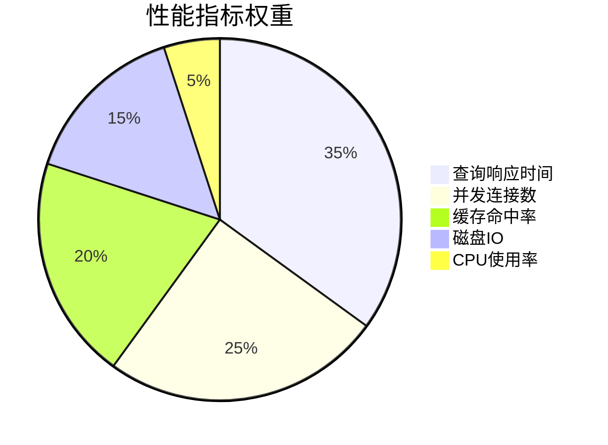

# 数据库性能监控与优化  

数据库性能监控与优化是确保数据库系统高效运行的关键环节。本文将系统地介绍数据库性能的核心指标、监控工具、分析方法以及优化技术，帮助你构建一个高性能、可靠的数据库环境。

## 1. 核心性能指标  

要有效监控和优化数据库性能，首先需要了解哪些指标最能反映系统的健康状况和性能瓶颈。

### 1.1 关键指标分类  

数据库性能指标可分为多个类别，每类指标在整体性能评估中占有不同的权重：



**1. 查询响应时间（Query Response Time）**
- **定义**：执行查询所需的时间，从发送查询到接收结果的时间间隔
- **重要性**：直接影响用户体验和应用性能
- **关键指标**：
  - 平均查询响应时间
  - 95/99百分位响应时间
  - 慢查询数量和比例

**2. 并发连接数（Concurrent Connections）**
- **定义**：同时连接到数据库的会话数量
- **重要性**：反映系统负载和资源使用情况
- **关键指标**：
  - 活动连接数
  - 等待连接数
  - 连接使用率（当前连接/最大连接）

**3. 缓存命中率（Cache Hit Ratio）**
- **定义**：从缓存中成功检索数据的请求比例
- **重要性**：高缓存命中率可显著减少磁盘I/O，提高性能
- **关键指标**：
  - 缓冲池命中率
  - 查询缓存命中率（如果启用）
  - 表缓存命中率

**4. 磁盘I/O（Disk I/O）**
- **定义**：数据库系统与存储设备之间的数据传输
- **重要性**：通常是数据库系统的主要瓶颈
- **关键指标**：
  - IOPS（每秒输入/输出操作数）
  - 读/写比率
  - I/O等待时间

**5. CPU使用率（CPU Utilization）**
- **定义**：数据库服务器CPU资源的使用百分比
- **重要性**：反映查询处理和系统开销
- **关键指标**：
  - 总体CPU使用率
  - 用户/系统CPU时间比例
  - 查询执行CPU消耗

**其他重要指标**：
- **内存使用率**：数据库服务器内存资源的使用情况
- **锁等待**：事务因锁定而等待的时间
- **临时表使用**：查询执行期间创建的临时表数量
- **网络流量**：数据库服务器的网络带宽使用情况

### 1.2 指标采集脚本  

以下是一个基本的PowerShell脚本，用于收集MySQL数据库的关键性能指标：

```powershell:c:\project\kphub\scripts\collect_metrics.ps1  
# 数据库性能指标采集脚本
# 用途：定期收集MySQL数据库的关键性能指标并保存为JSON格式

# 配置参数
$mysqlHost = "localhost"
$mysqlUser = "monitor"
$mysqlPassword = "monitor_password"
$outputDir = "c:\monitor"

# 确保输出目录存在
if (-not (Test-Path $outputDir)) {
    New-Item -ItemType Directory -Path $outputDir | Out-Null
}

# 获取当前时间戳
$timestamp = Get-Date -Format "yyyy-MM-dd HH:mm:ss"
$fileTimestamp = Get-Date -Format "yyyyMMddHHmm"

# 构建MySQL命令基础
$mysqlCmd = "mysql -h $mysqlHost -u $mysqlUser -p$mysqlPassword -s -N -e"

# 收集查询性能指标
$qps = Invoke-Expression "$mysqlCmd `"SHOW GLOBAL STATUS LIKE 'Questions'`"" | ForEach-Object { $_.Split("`t")[1] }
$slowQueries = Invoke-Expression "$mysqlCmd `"SHOW GLOBAL STATUS LIKE 'Slow_queries'`"" | ForEach-Object { $_.Split("`t")[1] }
$selectQueries = Invoke-Expression "$mysqlCmd `"SHOW GLOBAL STATUS LIKE 'Com_select'`"" | ForEach-Object { $_.Split("`t")[1] }
$insertQueries = Invoke-Expression "$mysqlCmd `"SHOW GLOBAL STATUS LIKE 'Com_insert'`"" | ForEach-Object { $_.Split("`t")[1] }
$updateQueries = Invoke-Expression "$mysqlCmd `"SHOW GLOBAL STATUS LIKE 'Com_update'`"" | ForEach-Object { $_.Split("`t")[1] }
$deleteQueries = Invoke-Expression "$mysqlCmd `"SHOW GLOBAL STATUS LIKE 'Com_delete'`"" | ForEach-Object { $_.Split("`t")[1] }

# 收集连接指标
$maxConnections = Invoke-Expression "$mysqlCmd `"SHOW VARIABLES LIKE 'max_connections'`"" | ForEach-Object { $_.Split("`t")[1] }
$threadsConnected = Invoke-Expression "$mysqlCmd `"SHOW STATUS LIKE 'Threads_connected'`"" | ForEach-Object { $_.Split("`t")[1] }
$threadsRunning = Invoke-Expression "$mysqlCmd `"SHOW STATUS LIKE 'Threads_running'`"" | ForEach-Object { $_.Split("`t")[1] }
$abortedConnections = Invoke-Expression "$mysqlCmd `"SHOW STATUS LIKE 'Aborted_connects'`"" | ForEach-Object { $_.Split("`t")[1] }

# 收集缓存指标
$innodbBufferPoolHitRatio = Invoke-Expression "$mysqlCmd `"SELECT (1 - ((SELECT VARIABLE_VALUE FROM performance_schema.global_status WHERE VARIABLE_NAME = 'Innodb_buffer_pool_reads') / (SELECT VARIABLE_VALUE FROM performance_schema.global_status WHERE VARIABLE_NAME = 'Innodb_buffer_pool_read_requests'))) * 100`"" 
$innodbBufferPoolSize = Invoke-Expression "$mysqlCmd `"SHOW VARIABLES LIKE 'innodb_buffer_pool_size'`"" | ForEach-Object { $_.Split("`t")[1] }
$openTables = Invoke-Expression "$mysqlCmd `"SHOW STATUS LIKE 'Open_tables'`"" | ForEach-Object { $_.Split("`t")[1] }
$tableOpenCache = Invoke-Expression "$mysqlCmd `"SHOW VARIABLES LIKE 'table_open_cache'`"" | ForEach-Object { $_.Split("`t")[1] }

# 收集I/O指标
$innodbDataReads = Invoke-Expression "$mysqlCmd `"SHOW STATUS LIKE 'Innodb_data_reads'`"" | ForEach-Object { $_.Split("`t")[1] }
$innodbDataWrites = Invoke-Expression "$mysqlCmd `"SHOW STATUS LIKE 'Innodb_data_writes'`"" | ForEach-Object { $_.Split("`t")[1] }
$innodbLogWrites = Invoke-Expression "$mysqlCmd `"SHOW STATUS LIKE 'Innodb_log_writes'`"" | ForEach-Object { $_.Split("`t")[1] }

# 构建指标对象
$metrics = @{  
    Timestamp = $timestamp
    
    # 查询性能
    QPS = $qps  
    SlowQueries = $slowQueries
    SelectQueries = $selectQueries
    InsertQueries = $insertQueries
    UpdateQueries = $updateQueries
    DeleteQueries = $deleteQueries
    
    # 连接
    MaxConnections = $maxConnections
    ThreadsConnected = $threadsConnected  
    ThreadsRunning = $threadsRunning
    ConnectionUtilization = [math]::Round(($threadsConnected / $maxConnections) * 100, 2)
    AbortedConnections = $abortedConnections
    
    # 缓存
    InnodbBufferPoolHitRatio = $innodbBufferPoolHitRatio
    InnodbBufferPoolSize = $innodbBufferPoolSize
    OpenTables = $openTables
    TableOpenCache = $tableOpenCache
    TableCacheHitRatio = [math]::Round(($openTables / $tableOpenCache) * 100, 2)
    
    # I/O
    InnodbDataReads = $innodbDataReads
    InnodbDataWrites = $innodbDataWrites
    InnodbLogWrites = $innodbLogWrites
    ReadWriteRatio = if ([int]$innodbDataWrites -gt 0) { [math]::Round([int]$innodbDataReads / [int]$innodbDataWrites, 2) } else { "N/A" }
}  

# 将指标保存为JSON文件
$outputFile = "$outputDir\db_$fileTimestamp.json"
$metrics | ConvertTo-Json -Depth 3 | Out-File $outputFile -Encoding UTF8

# 输出结果摘要
Write-Host "数据库性能指标已收集并保存到: $outputFile"
Write-Host "时间: $timestamp"
Write-Host "QPS: $qps"
Write-Host "活动连接: $threadsConnected / $maxConnections"
Write-Host "运行线程: $threadsRunning"
Write-Host "缓冲池命中率: $innodbBufferPoolHitRatio%"

# 可选：将指标发送到监控系统
# Invoke-RestMethod -Uri "http://monitoring-server/api/metrics" -Method Post -Body ($metrics | ConvertTo-Json)
```  

**脚本功能说明**：
1. 收集查询性能指标（QPS、慢查询数、各类SQL操作数）
2. 收集连接指标（活动连接数、运行线程数、连接利用率）
3. 收集缓存指标（缓冲池命中率、表缓存使用情况）
4. 收集I/O指标（读写操作数、读写比率）
5. 将所有指标保存为JSON格式，便于后续分析

**使用建议**：
- 将此脚本设置为定时任务，每5-15分钟运行一次
- 根据数据库类型和版本调整收集的指标
- 考虑添加阈值检查，当指标超出预设范围时发送告警
- 对长期收集的数据进行趋势分析，识别性能变化

## 2. 监控工具部署  

有效的数据库监控需要专业的工具支持。Prometheus和Grafana是目前最流行的开源监控解决方案组合。

### 2.1 Prometheus配置  

Prometheus是一个开源的系统监控和告警工具，非常适合用于数据库性能监控。

```yaml:c:\project\kphub\conf\prometheus_mysql.yml  
# Prometheus配置文件 - MySQL监控
# 保存为prometheus.yml并放在Prometheus配置目录

global:
  scrape_interval: 15s     # 默认抓取间隔
  evaluation_interval: 15s # 评估规则间隔

# 告警管理器配置
alerting:
  alertmanagers:
  - static_configs:
    - targets:
      - alertmanager:9093

# 规则文件，包含告警规则
rule_files:
  - "mysql_rules.yml"

# 抓取配置
scrape_configs:  
  # MySQL Exporter监控作业
  - job_name: 'mysql'  
    scrape_interval: 10s
    static_configs:  
      - targets: ['localhost:9104']  
    metrics_path: '/metrics'
    
    # 基本认证配置（如果需要）
    basic_auth:
      username: 'prometheus'
      password: 'password'
      
    # 标签添加
    relabel_configs:
      - source_labels: [__address__]
        target_label: instance
        replacement: 'mysql-