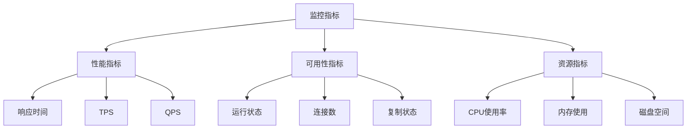
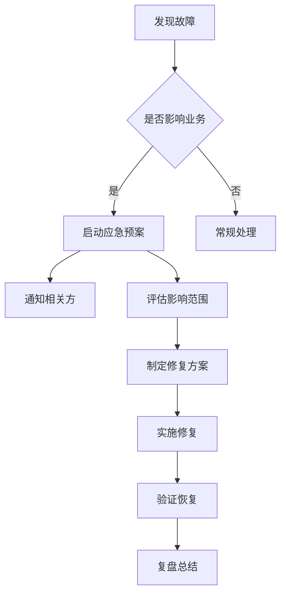

```markdown:c:\project\kphub\src\.help\rpa\knowdge_rules.md
---
title: 数据库常见故障处理
icon: troubleshooting
order: 11
---

# 数据库常见故障处理

## 1. 故障分类与诊断

### 1.1 故障类型矩阵

| 故障类型 | 典型表现 | 可能原因 | 紧急程度 | 影响范围 |
|----------|----------|----------|-----------|-----------|
| 连接失败 | "Too many connections" | - 连接未释放<br>- 连接池配置不当<br>- 并发请求过多 | 高 | 全局 |
| 死锁 | "Deadlock found" | - 事务设计不合理<br>- 索引缺失<br>- 并发更新冲突 | 中 | 局部 |
| 主从不同步 | 复制延迟>60秒 | - 主库负载高<br>- 网络问题<br>- 从库配置不当 | 高 | 全局 |
| 性能下降 | 查询响应慢 | - SQL语句未优化<br>- 索引失效<br>- 资源不足 | 中 | 局部/全局 |
| 数据损坏 | 表无法访问 | - 硬件故障<br>- 非正常关机<br>- 磁盘空间耗尽 | 高 | 局部 |

### 1.2 诊断方法

#### 1.2.1 系统层面诊断

```powershell:c:\project\kphub\scripts\system_check.ps1
# 检查系统资源
function Check-SystemResources {
    # CPU使用率
    $cpu = Get-Counter '\Processor(_Total)\% Processor Time'
    
    # 内存使用
    $memory = Get-Counter '\Memory\Available MBytes'
    
    # 磁盘IO
    $diskIO = Get-Counter '\PhysicalDisk(_Total)\Disk Reads/sec'
    
    # 网络连接
    $netConn = Get-NetTCPConnection | Where-Object State -eq 'Established'
    
    return @{
        CPU = $cpu.CounterSamples.CookedValue
        Memory = $memory.CounterSamples.CookedValue
        DiskIO = $diskIO.CounterSamples.CookedValue
        NetworkConnections = $netConn.Count
    }
}

# 检查系统日志
function Check-SystemLogs {
    Get-EventLog -LogName System -EntryType Error,Warning -Newest 50 |
        Select-Object TimeGenerated, Source, Message
}
```

#### 1.2.2 数据库层面诊断

```sql
-- 检查活动会话
SELECT 
    session_id,
    login_name,
    host_name,
    program_name,
    last_request_start_time,
    last_request_end_time,
    reads,
    writes,
    cpu_time
FROM sys.dm_exec_sessions
WHERE is_user_process = 1;

-- 检查阻塞情况
SELECT 
    blocking_session_id,
    wait_type,
    wait_time,
    last_wait_type
FROM sys.dm_exec_requests
WHERE blocking_session_id IS NOT NULL;

-- 检查表空间使用
SELECT 
    DB_NAME() AS DatabaseName,
    name AS TableName,
    SUM(reserved_page_count) * 8.0 / 1024 AS ReservedSpaceMB
FROM sys.dm_db_partition_stats
GROUP BY name
ORDER BY ReservedSpaceMB DESC;
```

### 1.3 监控指标体系



## 2. 常见故障处理方案

### 2.1 连接失败处理

#### 2.1.1 诊断脚本

```powershell:c:\project\kphub\scripts\connection_check.ps1
# 检查当前连接数
function Get-ConnectionCount {
    $query = "SHOW STATUS LIKE 'Threads_connected';"
    $result = mysql -u root -p$env:MYSQL_PWD -N -e $query
    return $result -split '\s+' | Select-Object -Last 1
}

# 检查最大连接数设置
function Get-MaxConnections {
    $query = "SHOW VARIABLES LIKE 'max_connections';"
    $result = mysql -u root -p$env:MYSQL_PWD -N -e $query
    return $result -split '\s+' | Select-Object -Last 1
}

# 检查等待连接数
function Get-ConnectionWaits {
    $query = "SHOW STATUS LIKE 'Threads_waiting';"
    $result = mysql -u root -p$env:MYSQL_PWD -N -e $query
    return $result -split '\s+' | Select-Object -Last 1
}
```

#### 2.1.2 解决方案

1. **临时解决方案**
```sql
-- 强制关闭空闲连接
KILL (SELECT id FROM information_schema.processlist 
      WHERE command = 'Sleep' 
      AND time > 3600);

-- 增加最大连接数
SET GLOBAL max_connections = 1000;
```

2. **长期解决方案**
```ini:c:\project\kphub\config\my.cnf
[mysqld]
# 连接池配置
max_connections = 1000
wait_timeout = 600
interactive_timeout = 600

# 线程池配置
thread_handling = pool-of-threads
thread_pool_size = 16
thread_pool_max_threads = 1000
```

### 2.2 死锁处理

#### 2.2.1 死锁检测

```sql
-- 查看当前锁等待
SELECT 
    r.trx_id waiting_trx_id,
    r.trx_mysql_thread_id waiting_thread,
    r.trx_query waiting_query,
    b.trx_id blocking_trx_id,
    b.trx_mysql_thread_id blocking_thread,
    b.trx_query blocking_query
FROM information_schema.innodb_lock_waits w
INNER JOIN information_schema.innodb_trx b 
    ON b.trx_id = w.blocking_trx_id
INNER JOIN information_schema.innodb_trx r 
    ON r.trx_id = w.requesting_trx_id;

-- 查看死锁历史
SHOW ENGINE INNODB STATUS;
```

#### 2.2.2 预防措施

```sql
-- 创建合适的索引
CREATE INDEX idx_status_created ON orders(status, created_at);

-- 设置事务隔离级别
SET SESSION TRANSACTION ISOLATION LEVEL READ COMMITTED;

-- 使用行锁代替表锁
SELECT * FROM orders WHERE id = 1 FOR UPDATE;
```

### 2.3 主从不同步处理

#### 2.3.1 监控脚本

```powershell:c:\project\kphub\scripts\replication_monitor.ps1
# 检查复制状态
function Check-ReplicationStatus {
    $query = @"
    SELECT 
        Slave_IO_Running,
        Slave_SQL_Running,
        Seconds_Behind_Master,
        Last_IO_Error,
        Last_SQL_Error
    FROM performance_schema.replication_applier_status_by_worker;
"@
    
    $result = mysql -u root -p$env:MYSQL_PWD -N -e $query
    
    if ($result -match "No") {
        Write-Warning "复制异常"
        Send-MailMessage -To "dba@company.com" `
                        -Subject "复制异常告警" `
                        -Body $result
    }
}

# 检查主从数据一致性
function Check-DataConsistency {
    param (
        [string]$table,
        [string]$checksum_column
    )
    
    # 主库checksum
    $master_checksum = mysql -h master -e "
        CHECKSUM TABLE $table;"
        
    # 从库checksum
    $slave_checksum = mysql -h slave -e "
        CHECKSUM TABLE $table;"
        
    if ($master_checksum -ne $slave_checksum) {
        Write-Warning "数据不一致: $table"
    }
}
```

#### 2.3.2 修复方案

```sql
-- 从库SQL线程异常修复
STOP SLAVE;
SET GLOBAL SQL_SLAVE_SKIP_COUNTER = 1;
START SLAVE;

-- 重新搭建复制
CHANGE MASTER TO
    MASTER_HOST='master_host',
    MASTER_USER='repl_user',
    MASTER_PASSWORD='repl_password',
    MASTER_LOG_FILE='mysql-bin.000123',
    MASTER_LOG_POS=4;
```

### 2.4 性能问题处理

#### 2.4.1 性能诊断

```sql
-- 查看慢查询
SELECT 
    start_time,
    query_time,
    lock_time,
    rows_sent,
    rows_examined,
    db,
    sql_text
FROM mysql.slow_log
WHERE start_time > DATE_SUB(NOW(), INTERVAL 1 HOUR)
ORDER BY query_time DESC
LIMIT 10;

-- 查看未使用索引的查询
SELECT 
    TABLE_SCHEMA,
    TABLE_NAME,
    INDEX_NAME,
    CARDINALITY,
    LAST_UPDATED
FROM information_schema.statistics
WHERE CARDINALITY < 10;
```

#### 2.4.2 优化方案

1. **查询优化**
```sql
-- 添加合适的索引
ALTER TABLE orders ADD INDEX idx_customer_created(customer_id, created_at);

-- 优化JOIN查询
EXPLAIN SELECT 
    o.order_id,
    c.customer_name,
    p.product_name
FROM orders o
INNER JOIN customers c ON o.customer_id = c.id
INNER JOIN products p ON o.product_id = p.id
WHERE o.created_at > '2023-01-01';
```

2. **配置优化**
```ini:c:\project\kphub\config\performance.cnf
[mysqld]
# 缓冲池配置
innodb_buffer_pool_size = 4G
innodb_buffer_pool_instances = 4

# 日志配置
innodb_log_file_size = 1G
innodb_log_buffer_size = 16M

# 查询缓存
query_cache_type = 0
query_cache_size = 0

# 临时表配置
tmp_table_size = 64M
max_heap_table_size = 64M
```

## 3. 应急预案

### 3.1 故障响应流程



### 3.2 应急工具箱

```powershell:c:\project\kphub\scripts\emergency_toolkit.ps1
# 快速备份
function Quick-Backup {
    param (
        [string]$database,
        [string]$backupDir = "D:\Backups"
    )
    
    $timestamp = Get-Date -Format "yyyyMMdd_HHmmss"
    $backupFile = Join-Path $backupDir "$database-$timestamp.sql"
    
    mysqldump --single-transaction `
              --quick `
              --routines `
              --triggers `
              $database > $backupFile
              
    Compress-Archive -Path $backupFile `
                    -DestinationPath "$backupFile.zip"
    Remove-Item $backupFile
}

# 紧急修复
function Emergency-Repair {
    param (
        [string]$database
    )
    
    # 检查并修复表
    mysqlcheck --auto-repair `
               --check `
               --optimize `
               $database
               
    # 分析表
    mysql -e "ANALYZE TABLE $database.*;"
    
    # 检查索引
    mysql -e "
        SELECT TABLE_NAME, INDEX_NAME 
        FROM information_schema.STATISTICS 
        WHERE TABLE_SCHEMA = '$database';"
}
```

### 3.3 故障演练

1. **模拟故障场景**
```powershell:c:\project\kphub\scripts\fault_simulation.ps1
# 模拟连接耗尽
for ($i = 0; $i -lt 1000; $i++) {
    Start-Job -ScriptBlock {
        mysql -e "SELECT SLEEP(3600);"
    }
}

# 模拟磁盘空间不足
$file = "C:\huge_file.dat"
fsutil file createnew $file (10GB)

# 模拟高负载
for ($i = 0; $i -lt 10; $i++) {
    Start-Job -ScriptBlock {
        mysql -e "SELECT * FROM huge_table 
                  WHERE id IN (SELECT id FROM another_huge_table);"
    }
}
```

2. **演练评估表**
```plaintext
演练项目：[故障类型]
日期：[YYYY-MM-DD]
参与人员：[名单]

1. 故障发现时间：[HH:mm:ss]
2. 响应时间：[分钟]
3. 解决时间：[分钟]
4. 是否达到预期：[是/否]
5. 问题点：
   - [问题1]
   - [问题2]
6. 改进建议：
   - [建议1]
   - [建议2]
```

## 4. 预防措施

### 4.1 日常巡检

```powershell:c:\project\kphub\scripts\daily_check.ps1
# 系统健康检查
function Check-SystemHealth {
    # 检查系统资源
    $resources = Check-SystemResources
    
    # 检查数据库状态
    $dbStatus = mysql -e "SHOW GLOBAL STATUS;"
    
    # 检查慢查询
    $slowQueries = mysql -e "
        SELECT COUNT(*) 
        FROM mysql.slow_log 
        WHERE start_time > DATE_SUB(NOW(), INTERVAL 24 HOUR);"
        
    # 检查错误日志
    $errors = Get-Content "C:\ProgramData\MySQL\MySQL Server 8.0\Data\error.log" -Tail 100 |
        Where-Object { $_ -match "ERROR" }
        
    # 生成报告
    $report = @{
        Timestamp = Get-Date
        SystemResources = $resources
        DatabaseStatus = $dbStatus
        SlowQueryCount = $slowQueries
        ErrorCount = $errors.Count
    }
    
    # 保存报告
    $report | ConvertTo-Json | 
        Out-File "C:\Reports\daily_health_$(Get-Date -Format 'yyyyMMdd').json"
}
```

### 4.2 性能基线

```sql
-- 建立性能基线
CREATE TABLE performance_baseline (
    id INT AUTO_INCREMENT PRIMARY KEY,
    metric_name VARCHAR(50),
    metric_value FLOAT,
    sample_time TIMESTAMP,
    comment TEXT
);

-- 收集基线数据
INSERT INTO performance_baseline 
SELECT 
    NULL,
    'Queries_per_second',
    VARIABLE_VALUE / (UNIX_TIMESTAMP() - 
        (SELECT VARIABLE_VALUE 
         FROM information_schema.GLOBAL_STATUS 
         WHERE VARIABLE_NAME = 'UPTIME')),
    NOW(),
    'Normal workload'
FROM information_schema.GLOBAL_STATUS 
WHERE VARIABLE_NAME = 'QUESTIONS';
```

### 4.3 容量规划

```powershell:c:\project\kphub\scripts\capacity_planning.ps1
# 预测存储增长
function Predict-StorageGrowth {
    param (
        [int]$days = 30
    )
    
    # 获取历史增长数据
    $history = mysql -e "
        SELECT 
            DATE(created_at) as date,
            SUM(data_length + index_length) / 1024 / 1024 as size_mb
        FROM information_schema.TABLES
        GROUP BY DATE(created_at)
        ORDER BY date DESC
        LIMIT $days;"
        
    # 计算平均增长率
    $growth_rate = ($history | 
        Measure-Object -Property size_mb -Average).Average
        
    # 预测未来30天
    $prediction = $growth_rate * 30
    
    return @{
        CurrentSize = $history[0].size_mb
        PredictedGrowth = $prediction
        RecommendedCapacity = $prediction * 1.5
    }
}
```

## 总结

数据库故障处理是一项需要经验积累的工作。本文介绍的故障处理方法和工具可以帮助数据库管理员更好地应对各类问题。关键点包括：

1. 建立完善的监控体系
2. 制定标准的故障处理流程
3. 准备必要的应急工具
4. 定期进行故障演练
5. 重视日常维护和预防

建议持续关注：
- 新版本特性和Bug修复
- 自动化运维工具
- 性能优化最佳实践
- 安全漏洞和补丁
```