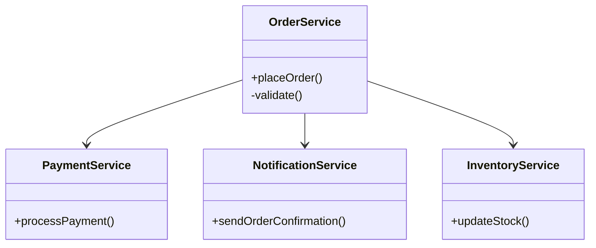
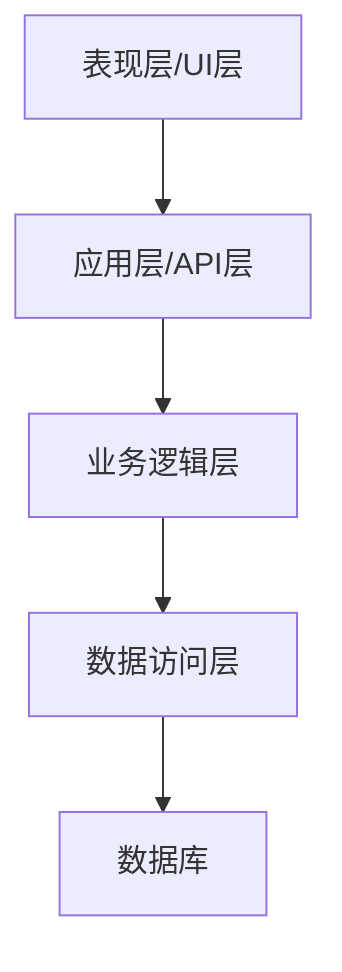
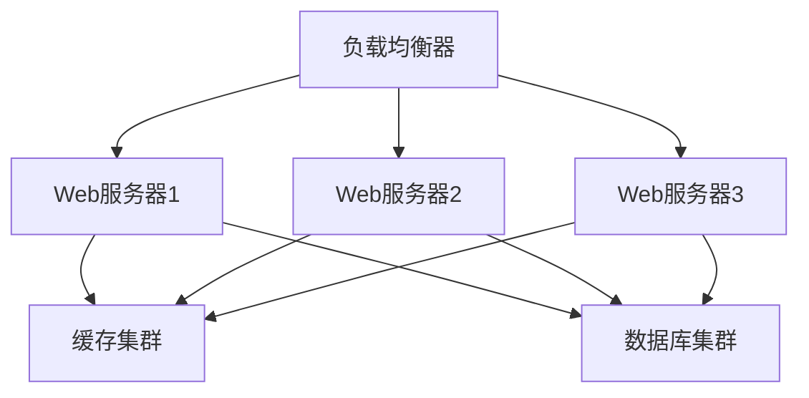

```markdown:c:\project\kphub\src\.help\rpa\knowdge_rules.md
---
title: Web应用架构设计原则
icon: theory
order: 1
---

# Web应用架构设计原则

## 1. 核心设计原则

### 1.1 SOLID原则应用

SOLID原则是构建可维护、可扩展Web应用的基石,包含五个核心设计原则。



1. **单一职责原则 (Single Responsibility Principle)**
   - 核心思想：一个类只负责一个功能领域中的相应职责
   - 实践示例：
   ```csharp:c:\project\kphub\src\Services\OrderService.cs
   public class OrderService {
       private readonly IPaymentService _paymentService;
       private readonly INotificationService _notificationService;
       private readonly IInventoryService _inventoryService;
       
       public async Task<OrderResult> PlaceOrder(Order order) {
           // 仅处理订单相关逻辑
           await ValidateOrder(order);
           var orderResult = await SaveOrder(order);
           
           // 委托其他服务处理各自职责
           await _paymentService.ProcessPayment(order);
           await _notificationService.SendConfirmation(order);
           await _inventoryService.UpdateStock(order);
           
           return orderResult;
       }
   }
   ```

2. **开放封闭原则 (Open/Closed Principle)**
   - 核心思想：软件实体应该对扩展开放，对修改关闭
   - 实践示例：
   ```csharp:c:\project\kphub\src\Services\PaymentService.cs
   public interface IPaymentProcessor {
       Task<PaymentResult> Process(Payment payment);
   }
   
   public class PaymentService {
       private readonly IDictionary<string, IPaymentProcessor> _processors;
       
       public async Task<PaymentResult> ProcessPayment(Payment payment) {
           var processor = _processors[payment.Method];
           return await processor.Process(payment);
       }
   }
   
   // 添加新支付方式只需实现接口
   public class WeChatPayProcessor : IPaymentProcessor {
       public async Task<PaymentResult> Process(Payment payment) {
           // 微信支付处理逻辑
       }
   }
   ```

3. **里氏替换原则 (Liskov Substitution Principle)**
   - 核心思想：子类必须能够替换其基类
   - 实践示例：
   ```csharp:c:\project\kphub\src\Services\CacheService.cs
   public interface ICacheService {
       Task<T> Get<T>(string key);
       Task Set<T>(string key, T value, TimeSpan expiry);
   }
   
   public class RedisCacheService : ICacheService {
       public async Task<T> Get<T>(string key) {
           // Redis实现
       }
       
       public async Task Set<T>(string key, T value, TimeSpan expiry) {
           // Redis实现
       }
   }
   
   public class MemoryCacheService : ICacheService {
       public async Task<T> Get<T>(string key) {
           // 内存缓存实现
       }
       
       public async Task Set<T>(string key, T value, TimeSpan expiry) {
           // 内存缓存实现
       }
   }
   ```

4. **接口隔离原则 (Interface Segregation Principle)**
   - 核心思想：客户端不应该依赖它不需要的接口
   - 实践示例：
   ```csharp:c:\project\kphub\src\Services\UserService.cs
   public interface IUserReader {
       Task<User> GetById(int id);
       Task<IEnumerable<User>> GetByRole(string role);
   }
   
   public interface IUserWriter {
       Task<User> Create(User user);
       Task<bool> Update(User user);
       Task<bool> Delete(int id);
   }
   
   public class UserService : IUserReader, IUserWriter {
       // 实现所有接口方法
   }
   
   // 只读服务只需依赖IUserReader
   public class UserReportService {
       private readonly IUserReader _userReader;
       
       public async Task GenerateReport() {
           var users = await _userReader.GetByRole("customer");
           // 生成报告逻辑
       }
   }
   ```

5. **依赖倒置原则 (Dependency Inversion Principle)**
   - 核心思想：高层模块不应该依赖低层模块，两者都应该依赖抽象
   - 实践示例：
   ```csharp:c:\project\kphub\src\Services\EmailService.cs
   public interface IEmailSender {
       Task SendEmail(string to, string subject, string body);
   }
   
   public interface IEmailTemplateRenderer {
       string RenderTemplate(string templateName, object model);
   }
   
   public class EmailService {
       private readonly IEmailSender _emailSender;
       private readonly IEmailTemplateRenderer _templateRenderer;
       
       public async Task SendWelcomeEmail(User user) {
           var body = _templateRenderer.RenderTemplate("Welcome", user);
           await _emailSender.SendEmail(user.Email, "Welcome!", body);
       }
   }
   ```

### 1.2 分层架构设计

现代Web应用通常采用多层架构设计，每层具有明确的职责和边界。



1. **表现层 (Presentation Layer)**
   ```typescript:c:\project\kphub\src\ClientApp\components\OrderForm.tsx
   interface OrderFormProps {
       onSubmit: (order: Order) => Promise<void>;
   }
   
   const OrderForm: React.FC<OrderFormProps> = ({ onSubmit }) => {
       const [order, setOrder] = useState<Order>({});
       
       const handleSubmit = async (e: React.FormEvent) => {
           e.preventDefault();
           await onSubmit(order);
       };
       
       return (
           <form onSubmit={handleSubmit}>
               {/* 表单内容 */}
           </form>
       );
   };
   ```

2. **应用层 (Application Layer)**
   ```csharp:c:\project\kphub\src\Controllers\OrderController.cs
   [ApiController]
   [Route("api/[controller]")]
   public class OrderController : ControllerBase {
       private readonly IOrderService _orderService;
       private readonly ILogger<OrderController> _logger;
       
       [HttpPost]
       public async Task<ActionResult<OrderResult>> CreateOrder(
           [FromBody] CreateOrderRequest request) {
           try {
               var result = await _orderService.PlaceOrder(request.ToOrder());
               return Ok(result);
           }
           catch (ValidationException ex) {
               _logger.LogWarning(ex, "订单验证失败");
               return BadRequest(ex.Message);
           }
       }
   }
   ```

3. **业务逻辑层 (Business Layer)**
   ```csharp:c:\project\kphub\src\Services\OrderProcessingService.cs
   public class OrderProcessingService {
       private readonly IOrderRepository _orderRepo;
       private readonly IPaymentService _paymentService;
       private readonly IInventoryService _inventoryService;
       
       public async Task<OrderResult> ProcessOrder(Order order) {
           // 业务规则验证
           await ValidateBusinessRules(order);
           
           // 事务处理
           using var transaction = await _orderRepo.BeginTransactionAsync();
           try {
               var savedOrder = await _orderRepo.SaveAsync(order);
               await _paymentService.ProcessPayment(order.Payment);
               await _inventoryService.UpdateStock(order.Items);
               
               await transaction.CommitAsync();
               return new OrderResult(savedOrder);
           }
           catch {
               await transaction.RollbackAsync();
               throw;
           }
       }
   }
   ```

4. **数据访问层 (Data Access Layer)**
   ```csharp:c:\project\kphub\src\Repositories\OrderRepository.cs
   public class OrderRepository : IOrderRepository {
       private readonly DbContext _context;
       
       public async Task<Order> GetByIdAsync(int id) {
           return await _context.Orders
               .Include(o => o.Items)
               .Include(o => o.Payment)
               .FirstOrDefaultAsync(o => o.Id == id);
       }
       
       public async Task<Order> SaveAsync(Order order) {
           if (order.Id == 0) {
               _context.Orders.Add(order);
           }
           else {
               _context.Entry(order).State = EntityState.Modified;
           }
           
           await _context.SaveChangesAsync();
           return order;
       }
   }
   ```

### 1.3 横切关注点

横切关注点是贯穿应用各层的功能性需求。

1. **日志记录**
   ```csharp:c:\project\kphub\src\Infrastructure\Logging\LoggingMiddleware.cs
   public class LoggingMiddleware {
       private readonly RequestDelegate _next;
       private readonly ILogger _logger;
       
       public async Task InvokeAsync(HttpContext context) {
           var correlationId = GetOrCreateCorrelationId(context);
           
           using (_logger.BeginScope(new Dictionary<string, object> {
               ["CorrelationId"] = correlationId
           })) {
               try {
                   await _next(context);
               }
               catch (Exception ex) {
                   _logger.LogError(ex, "请求处理异常");
                   throw;
               }
           }
       }
   }
   ```

2. **性能监控**
   ```csharp:c:\project\kphub\src\Infrastructure\Monitoring\PerformanceMonitor.cs
   public class PerformanceMonitor {
       private readonly IMetricsCollector _metrics;
       
       public async Task<T> TrackOperation<T>(
           string operationName, 
           Func<Task<T>> operation) {
           var sw = Stopwatch.StartNew();
           try {
               return await operation();
           }
           finally {
               sw.Stop();
               _metrics.RecordMetric(
                   operationName,
                   sw.ElapsedMilliseconds);
           }
       }
   }
   ```

3. **异常处理**
   ```csharp:c:\project\kphub\src\Infrastructure\Exceptions\GlobalExceptionHandler.cs
   public class GlobalExceptionHandler : IExceptionHandler {
       private readonly ILogger _logger;
       
       public async Task HandleException(
           HttpContext context,
           Exception exception) {
           _logger.LogError(exception, "未处理的异常");
           
           var response = new ErrorResponse {
               Message = "服务器内部错误",
               TraceId = Activity.Current?.Id
           };
           
           context.Response.StatusCode = 500;
           await context.Response.WriteAsJsonAsync(response);
       }
   }
   ```

## 2. 可扩展性设计

### 2.1 水平扩展



1. **无状态设计**
   ```csharp:c:\project\kphub\src\Infrastructure\Session\DistributedSessionProvider.cs
   public class DistributedSessionProvider : ISessionProvider {
       private readonly IDistributedCache _cache;
       
       public async Task<SessionData> GetSession(string sessionId) {
           var data = await _cache.GetAsync(sessionId);
           return data != null 
               ? JsonSerializer.Deserialize<SessionData>(data)
               : null;
       }
       
       public async Task SaveSession(
           string sessionId, 
           SessionData data,
           TimeSpan expiry) {
           var options = new DistributedCacheEntryOptions {
               AbsoluteExpirationRelativeToNow = expiry
           };
           
           await _cache.SetAsync(
               sessionId,
               JsonSerializer.SerializeToUtf8Bytes(data),
               options);
       }
   }
   ```

2. **缓存策略**
   ```csharp:c:\project\kphub\src\Infrastructure\Caching\CacheManager.cs
   public class CacheManager {
       private readonly IDistributedCache _cache;
       private readonly ILogger _logger;
       
       public async Task<T> GetOrCreate<T>(
           string key,
           Func<Task<T>> factory,
           TimeSpan expiry) {
           var data = await _cache.GetAsync(key);
           if (data != null) {
               return JsonSerializer.Deserialize<T>(data);
           }
           
           var value = await factory();
           await _cache.SetAsync(
               key,
               JsonSerializer.SerializeToUtf8Bytes(value),
               new DistributedCacheEntryOptions {
                   AbsoluteExpirationRelativeToNow = expiry
               });
           
           return value;
       }
   }
   ```

### 2.2 模块化设计

1. **插件系统**
   ```csharp:c:\project\kphub\src\Infrastructure\Plugins\PluginLoader.cs
   public class PluginLoader {
       private readonly IServiceCollection _services;
       
       public void LoadPlugins(string pluginDirectory) {
           foreach (var dll in Directory.GetFiles(
               pluginDirectory, "*.dll")) {
               var assembly = Assembly.LoadFrom(dll);
               
               var pluginTypes = assembly.GetTypes()
                   .Where(t => typeof(IPlugin).IsAssignableFrom(t));
                   
               foreach (var pluginType in pluginTypes) {
                   _services.AddTransient(
                       typeof(IPlugin),
                       pluginType);
               }
           }
       }
   }
   ```

2. **微服务架构**
   ```csharp:c:\project\kphub\src\Services\ServiceRegistry.cs
   public class ServiceRegistry {
       private readonly HttpClient _httpClient;
       private readonly string _registryUrl;
       
       public async Task RegisterService(
           ServiceDefinition service) {
           await _httpClient.PostAsJsonAsync(
               $"{_registryUrl}/services",
               service);
       }
       
       public async Task<ServiceDefinition> DiscoverService(
           string serviceName) {
           var response = await _httpClient.GetAsync(
               $"{_registryUrl}/services/{serviceName}");
           return await response.Content
               .ReadFromJsonAsync<ServiceDefinition>();
       }
   }
   ```

## 3. 性能优化

### 3.1 数据库优化

1. **查询优化**
   ```csharp:c:\project\kphub\src\Infrastructure\Data\QueryOptimizer.cs
   public class QueryOptimizer {
       private readonly DbContext _context;
       
       public IQueryable<T> OptimizeQuery<T>(
           IQueryable<T> query,
           QueryOptions options) where T : class {
           // 添加必要的Include
           foreach (var include in options.Includes) {
               query = query.Include(include);
           }
           
           // 添加分页
           if (options.PageSize > 0) {
               query = query
                   .Skip(options.Page * options.PageSize)
                   .Take(options.PageSize);
           }
           
           // 添加缓存标记
           if (options.EnableCaching) {
               query = query.TagWith("cache");
           }
           
           return query;
       }
   }
   ```

2. **索引优化**
   ```sql:c:\project\kphub\src\Database\Indexes\CreateIndexes.sql
   -- 创建复合索引
   CREATE INDEX IX_Orders_CustomerId_OrderDate 
   ON Orders (CustomerId, OrderDate DESC)
   INCLUDE (Status);
   
   -- 创建全文索引
   CREATE FULLTEXT INDEX ON Products(Description)
   KEY INDEX PK_Products;
   
   -- 创建空间索引
   CREATE SPATIAL INDEX IX_Stores_Location 
   ON Stores(Location)
   USING GEOMETRY_GRID;
   ```

### 3.2 缓存策略

1. **多级缓存**
   ```csharp:c:\project\kphub\src\Infrastructure\Caching\MultilevelCache.cs
   public class MultilevelCache {
       private readonly IMemoryCache _l1Cache;
       private readonly IDistributedCache _l2Cache;
       
       public async Task<T> Get<T>(string key) {
           // 检查L1缓存
           if (_l1Cache.TryGetValue(key, out T value)) {
               return value;
           }
           
           // 检查L2缓存
           var data = await _l2Cache.GetAsync(key);
           if (data != null) {
               value = JsonSerializer.Deserialize<T>(data);
               // 填充L1缓存
               _l1Cache.Set(key, value, TimeSpan.FromMinutes(5));
               return value;
           }
           
           return default;
       }
   }
   ```

2. **缓存预热**
   ```csharp:c:\project\kphub\src\Infrastructure\Caching\CacheWarmer.cs
   public class CacheWarmer {
       private readonly IServiceProvider _services;
       private readonly ILogger _logger;
       
       public async Task WarmupCache() {
           try {
               // 预热常用数据
               await WarmupProducts();
               await WarmupCategories();
               await WarmupConfigurations();
               
               _logger.LogInformation("缓存预热完成");
           }
           catch (Exception ex) {
               _logger.LogError(ex, "缓存预热失败");
           }
       }
       
       private async Task WarmupProducts() {
           using var scope = _services.CreateScope();
           var productService = scope.ServiceProvider
               .GetRequiredService<IProductService>();
               
           var products = await productService
               .GetFeaturedProducts();
               
           // 将数据加载到缓存
           foreach (var product in products) {
               await _cache.Set(
                   $"product:{product.Id}",
                   product,
                   TimeSpan.FromHours(1));
           }
       }
   }
   ```

### 3.3 异步处理

1. **后台任务**
   ```csharp:c:\project\kphub\src\Infrastructure\Background\BackgroundJobManager.cs
   public class BackgroundJobManager {
       private readonly IServiceScopeFactory _scopeFactory;
       private readonly ILogger _logger;
       
       public async Task EnqueueJob<T>(
           string jobId,
           T jobData,
           TimeSpan? delay = null) where T : IJob {
           using var scope = _scopeFactory.CreateScope();
           var jobQueue = scope.ServiceProvider
               .GetRequiredService<IJobQueue>();
               
           await jobQueue.Enqueue(new JobInfo<T> {
               Id = jobId,
               Data = jobData,
               ExecuteAt = DateTime.UtcNow + (delay ?? TimeSpan.Zero)
           });
       }
   }
   ```

2. **消息队列**
   ```csharp:c:\project\kphub\src\Infrastructure\Messaging\MessageBroker.cs
   public class MessageBroker {
       private readonly IConnection _connection;
       private readonly ILogger _logger;
       
       public async Task PublishMessage<T>(
           string exchange,
           string routingKey,
           T message) {
           try {
               using var channel = _connection.CreateModel();
               var body = JsonSerializer.SerializeToUtf8Bytes(message);
               
               channel.BasicPublish(
                   exchange: exchange,
                   routingKey: routingKey,
                   mandatory: true,
                   basicProperties: null,
                   body: body);
                   
               _logger.LogInformation(
                   "消息已发布: {Exchange}.{RoutingKey}",
                   exchange,
                   routingKey);
           }
           catch (Exception ex) {
               _logger.LogError(ex, "消息发布失败");
               throw;
           }
       }
   }
   ```

## 总结

Web应用架构设计是一个复杂的工程，需要在多个维度进行权衡和取舍。本文介绍的设计原则和实践方法可以帮助开发团队构建高质量的Web应用。关键要点包括：

1. 遵循SOLID原则，保持代码的可维护性
2. 采用清晰的分层架构，保持关注点分离
3. 考虑横切关注点，确保非功能性需求
4. 设计可扩展的架构，应对未来的增长
5. 注重性能优化，提供良好的用户体验

建议持续关注：
- 新的架构模式和最佳实践
- 云原生技术的发展
- 性能优化技术
- 安全性考虑
- 可维护性改进
```