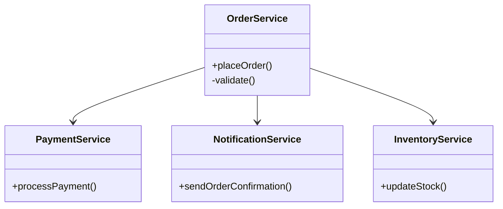

# Web应用架构设计原则  

Web应用架构是构建现代Web系统的基础框架，它决定了系统的可扩展性、可维护性和性能表现。本文将系统性地介绍Web应用架构设计的核心原则，帮助开发者构建高质量的Web应用系统。

## 1. 核心设计原则  

核心设计原则是构建优秀Web应用架构的基础，它们指导我们如何组织代码结构和系统组件。

### 1.1 SOLID原则应用  

SOLID是面向对象设计的五个基本原则的首字母缩写，在Web应用架构中应用这些原则可以显著提高代码质量和系统可维护性。

SOLID原则详解：

1. **单一职责原则 (Single Responsibility Principle)**
   - 一个类应该只有一个引起它变化的原因
   - 实例：将订单处理、支付处理和通知功能分离到不同的服务中
   - 好