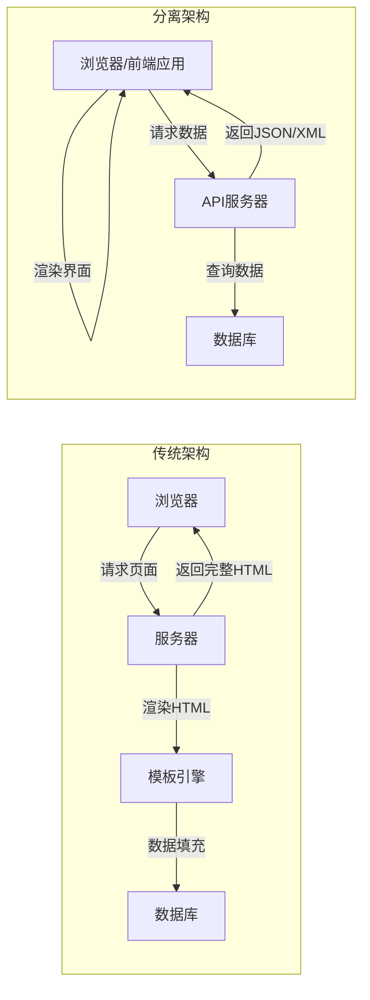
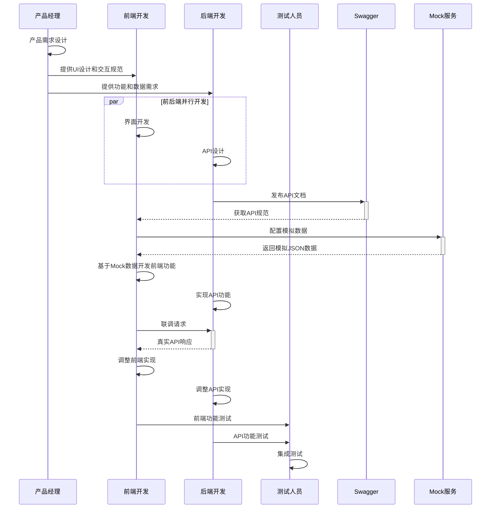

# 前后端分离架构分析  

前后端分离架构是现代Web应用开发的主流模式，它将前端界面与后端服务解耦，使得开发更加灵活高效。本文将深入分析前后端分离架构的原理、实践方法以及相关技术栈，帮助你全面理解并应用这一架构模式。

## 1. 架构原理  

前后端分离架构的核心思想是将用户界面与业务逻辑和数据处理分开，通过API接口进行通信，实现各自独立开发和部署。

### 1.1 传统vs分离架构对比  

传统的Web应用采用服务端渲染模式，前后端代码紧密耦合；而分离架构则通过API接口实现前后端解耦，各自独立发展。



**传统架构特点**：
- 服务端负责HTML渲染和数据处理
- 前端与后端紧密耦合
- 页面刷新频繁，用户体验较差
- 开发效率低，前后端开发人员协作复杂
- 难以适应多端应用需求（Web、移动端、小程序等）

**分离架构特点**：
- 前端负责界面渲染，后端提供API服务
- 前后端通过API契约解耦
- 单页应用体验流畅，减少页面刷新
- 前后端可并行开发，提高开发效率
- 易于支持多端应用，API可复用

### 1.2 技术栈组成  

前后端分离架构涉及多个技术层面，每个层面都有多种技术选择。

| 层级 | 技术选项 | 说明 |
|------|----------|------|
| 前端框架 | React | 由Facebook开发的组件化UI库，适合构建复杂交互的单页应用 |
| | Vue | 轻量级渐进式框架，易学易用，适合各种规模项目 |
| | Angular | 完整的MVC框架，内置丰富特性，适合企业级应用 |
| 状态管理 | Redux/Vuex/Pinia | 集中管理应用状态，实现可预测的状态变化 |
| HTTP客户端 | Axios | 基于Promise的HTTP客户端，支持浏览器和Node.js环境 |
| | Fetch API | 浏览器原生API，简洁但需要额外处理错误和解析JSON |
| API风格 | RESTful | 基于资源的API设计风格，使用HTTP方法表示操作 |
| | GraphQL | 查询语言和运行时，允许客户端精确指定所需数据 |
| | gRPC | 高性能RPC框架，适合微服务间通信 |
| 后端框架 | Spring Boot (Java) | 企业级应用框架，功能全面，生态丰富 |
| | Express/Nest.js (Node.js) | 轻量级Web框架，适合构建API服务 |
| | Django/Flask (Python) | Python生态下的Web框架，开发效率高 |
| | Laravel/Symfony (PHP) | PHP生态下的现代Web框架 |
| 认证授权 | JWT | 基于Token的认证机制，适合分布式系统 |
| | OAuth 2.0 | 开放授权标准，适合第三方应用授权 |
| 文档工具 | Swagger/OpenAPI | API文档生成和测试工具 |
| | Postman | API开发和测试平台 |

选择合适的技术栈应考虑团队技术背景、项目规模、性能需求等因素。对于初创项目，可以选择Vue+Express等轻量级组合；对于企业级应用，可以考虑React/Angular+Spring Boot等成熟稳定的组合。

## 2. 接口规范设计  

良好的API设计是前后端分离架构的基础，它直接影响开发效率和系统可维护性。

### 2.1 RESTful设计原则  

RESTful API是一种基于HTTP协议的API设计风格，它将后端服务抽象为资源，通过标准HTTP方法对资源进行操作。

```json:c:\project\kphub\api-spec\user.json  
{  
  "openapi": "3.0.0",
  "info": {
    "title": "用户服务API",
    "version": "1.0.0",
    "description": "提供用户相关的所有操作"
  },
  "paths": {  
    "/users": {
      "get": {
        "summary": "获取用户列表",
        "tags": ["User"],
        "parameters": [
          {
            "name": "page",
            "in": "query",
            "description": "页码",
            "schema": { "type": "integer", "default": 1 }
          },
          {
            "name": "limit",
            "in": "query",
            "description": "每页数量",
            "schema": { "type": "integer", "default": 10 }
          }
        ],
        "responses": {
          "200": {
            "description": "成功返回用户列表",
            "content": {
              "application/json": {
                "schema": {
                  "type": "object",
                  "properties": {
                    "data": {
                      "type": "array",
                      "items": { "$ref": "#/components/schemas/User" }
                    },
                    "total": { "type": "integer" },
                    "page": { "type": "integer" },
                    "limit": { "type": "integer" }
                  }
                }
              }
            }
          }
        }
      },
      "post": {
        "summary": "创建新用户",
        "tags": ["User"],
        "requestBody": {
          "required": true,
          "content": {
            "application/json": {
              "schema": { "$ref": "#/components/schemas/UserInput" }
            }
          }
        },
        "responses": {
          "201": {
            "description": "用户创建成功",
            "content": {
              "application/json": {
                "schema": { "$ref": "#/components/schemas/User" }
              }
            }
          },
          "400": {
            "description": "输入数据验证失败",
            "content": {
              "application/json": {
                "schema": { "$ref": "#/components/schemas/Error" }
              }
            }
          }
        }
      }
    },
    "/users/{id}": {  
      "get": {  
        "summary": "获取指定用户详情",
        "tags": ["User"],  
        "parameters": [
          {
            "name": "id", 
            "in": "path",
            "required": true,
            "description": "用户ID",
            "schema": { "type": "integer" }
          }
        ],
        "responses": {
          "200": {
            "description": "成功返回用户详情",
            "content": {
              "application/json": {
                "schema": { "$ref": "#/components/schemas/User" }
              }
            }
          },
          "404": {
            "description": "用户不存在",
            "content": {
              "application/json": {
                "schema": { "$ref": "#/components/schemas/Error" }
              }
            }
          }
        }
      },
      "put": {
        "summary": "更新指定用户",
        "tags": ["User"],
        "parameters": [
          {
            "name": "id",
            "in": "path",
            "required": true,
            "description": "用户ID",
            "schema": { "type": "integer" }
          }
        ],
        "requestBody": {
          "required": true,
          "content": {
            "application/json": {
              "schema": { "$ref": "#/components/schemas/UserInput" }
            }
          }
        },
        "responses": {
          "200": {
            "description": "用户更新成功",
            "content": {
              "application/json": {
                "schema": { "$ref": "#/components/schemas/User" }
              }
            }
          }
        }
      },
      "delete": {
        "summary": "删除指定用户",
        "tags": ["User"],
        "parameters": [
          {
            "name": "id",
            "in": "path",
            "required": true,
            "description": "用户ID",
            "schema": { "type": "integer" }
          }
        ],
        "responses": {
          "204": {
            "description": "用户删除成功"
          }
        }
      }
    }  
  },
  "components": {
    "schemas": {
      "User": {
        "type": "object",
        "properties": {
          "id": { "type": "integer" },
          "username": { "type": "string" },
          "email": { "type": "string", "format": "email" },
          "createdAt": { "type": "string", "format": "date-time" }
        }
      },
      "UserInput": {
        "type": "object",
        "required": ["username", "email", "password"],
        "properties": {
          "username": { "type": "string", "minLength": 3 },
          "email": { "type": "string", "format": "email" },
          "password": { "type": "string", "minLength": 6 }
        }
      },
      "Error": {
        "type": "object",
        "properties": {
          "code": { "type": "integer" },
          "message": { "type": "string" }
        }
      }
    }
  }
}  
```  

**RESTful API设计核心原则**：

1. **以资源为中心**：将系统功能抽象为资源（如用户、订单、商品）
2. **使用HTTP方法表示操作**：
   - GET：获取资源（读取）
   - POST：创建资源
   - PUT/PATCH：更新资源
   - DELETE：删除资源
3. **使用URL表示资源**：
   - 资源集合：`/users`
   - 特定资源：`/users/{id}`
   - 子资源：`/users/{id}/orders`
4. **使用HTTP状态码表示结果**：
   - 2xx：成功（200 OK, 201 Created, 204 No Content）
   - 4xx：客户端错误（400 Bad Request, 401 Unauthorized, 404 Not Found）
   - 5xx：服务器错误（500 Internal Server Error）
5. **无状态通信**：服务器不保存客户端状态，每个请求包含所有必要信息
6. **支持过滤、排序、分页**：通过查询参数实现（如`?page=1&limit=10&sort=name`）

### 2.2 错误码标准化  

统一的错误处理机制可以提高API的可用性和可维护性，便于前端进行错误处理和展示。

```typescript:c:\project\kphub\src\shared\error.ts  
/**
 * API错误码枚举
 * 错误码设计规则：
 * - 4xxx: 客户端错误
 * - 5xxx: 服务端错误
 * - 具体分类:
 *   - x0xx: 通用错误
 *   - x1xx: 认证授权相关
 *   - x2xx: 用户相关
 *   - x3xx: 资源相关
 *   - x4xx: 业务逻辑相关
 */
export enum API_ERROR {  
  // 通用错误 (40xx)
  BAD_REQUEST = 4000,
  VALIDATION_FAILED = 4001,
  
  // 认证授权相关 (41xx)
  UNAUTHORIZED = 4100,
  INVALID_TOKEN = 4101,  
  TOKEN_EXPIRED = 4102,
  PERMISSION_DENIED = 4103,
  
  // 用户相关 (42xx)
  USER_NOT_FOUND = 4200,
  USER_ALREADY_EXISTS = 4201,
  INVALID_CREDENTIALS = 4202,
  ACCOUNT_DISABLED = 4203,
  
  // 资源相关 (43xx)
  RESOURCE_NOT_FOUND = 4300,
  RESOURCE_ALREADY_EXISTS = 4301,
  RESOURCE_ACCESS_DENIED = 4302,
  
  // 业务逻辑相关 (44xx)
  BUSINESS_RULE_VIOLATION = 4400,
  OPERATION_NOT_ALLOWED = 4401,
  
  // 服务端错误 (5xxx)
  INTERNAL_SERVER_ERROR = 5000,
  SERVICE_UNAVAILABLE = 5001,
  DATABASE_ERROR = 5002,
  EXTERNAL_SERVICE_ERROR = 5003
}

/**
 * API错误响应接口
 */
export interface ApiErrorResponse {
  code: API_ERROR;
  message: string;
  details?: any;
  timestamp?: string;
  path?: string;
}

/**
 * API错误工厂类
 */
export class ApiErrorFactory {
  /**
   * 创建标准API错误响应
   */
  static create(
    code: API_ERROR, 
    message?: string, 
    details?: any, 
    path?: string
  ): ApiErrorResponse {
    return {
      code,
      message: message || this.getDefaultMessage(code),
      details: details || null,
      timestamp: new Date().toISOString(),
      path
    };
  }
  
  /**
   * 获取错误码对应的默认错误消息
   */
  private static getDefaultMessage(code: API_ERROR): string {
    const messages = {
      [API_ERROR.BAD_REQUEST]: '请求格式不正确',
      [API_ERROR.VALIDATION_FAILED]: '数据验证失败',
      [API_ERROR.UNAUTHORIZED]: '未授权访问',
      [API_ERROR.INVALID_TOKEN]: '无效的访问令牌',
      [API_ERROR.TOKEN_EXPIRED]: '访问令牌已过期',
      [API_ERROR.PERMISSION_DENIED]: '权限不足',
      [API_ERROR.USER_NOT_FOUND]: '用户不存在',
      [API_ERROR.USER_ALREADY_EXISTS]: '用户已存在',
      [API_ERROR.INVALID_CREDENTIALS]: '用户名或密码错误',
      [API_ERROR.ACCOUNT_DISABLED]: '账户已被禁用',
      [API_ERROR.RESOURCE_NOT_FOUND]: '请求的资源不存在',
      [API_ERROR.RESOURCE_ALREADY_EXISTS]: '资源已存在',
      [API_ERROR.RESOURCE_ACCESS_DENIED]: '无权访问该资源',
      [API_ERROR.BUSINESS_RULE_VIOLATION]: '违反业务规则',
      [API_ERROR.OPERATION_NOT_ALLOWED]: '操作不允许',
      [API_ERROR.INTERNAL_SERVER_ERROR]: '服务器内部错误',
      [API_ERROR.SERVICE_UNAVAILABLE]: '服务暂时不可用',
      [API_ERROR.DATABASE_ERROR]: '数据库操作错误',
      [API_ERROR.EXTERNAL_SERVICE_ERROR]: '外部服务调用失败'
    };
    
    return messages[code] || '未知错误';
  }
}
```  

**错误处理最佳实践**：

1. **结构化错误响应**：统一的错误响应格式，包含错误码、消息、详情等
2. **分类错误码**：按功能域和错误类型分类，便于定位和处理
3. **详细错误信息**：提供足够详细的错误信息，帮助调试
4. **安全考虑**：避免在错误响应中泄露敏感信息
5. **国际化支持**：支持多语言错误消息
6. **前端友好**：错误信息应该对最终用户友好

## 3. 开发工作流  

前后端分离架构下，前后端团队可以并行开发，但需要良好的协作机制确保接口对接顺利。

### 3.1 联调流程优化  

前后端分离开发中，接口联调是一个关键环节，良好的工作流可以大幅提高开发效率。



**联调流程优化策略**：

1. **API优先设计**：
   - 在开发前先确定API规范，作为前后端开发的契约
   - 使用OpenAPI/Swagger记录和共享API文档
   - 前端可以基于API规范进行开发，无需等待后端实现

2. **Mock服务使用**：
   - 前端基于API规范创建Mock数据
   - 使用Mock服务模拟后端响应，加速前端开发
   - 逐步从Mock切换到真实API

3. **接口版本控制**：
   - 使用API版本控制（如`/api/v1/users`）
   - 确保向后兼容性，避免破坏性变更
   - 使用API废弃策略，给客户端足够的迁移时间

4. **自动化测试**：
   - 为API编写自动化测试
   - 使用契约测试确保前后端接口一致性
   - 集成测试验证端到端功能

### 3.2 接口Mock配置  

Mock服务可以模拟后端API响应，使前端开发不依赖后端进度，提高开发效率。

```javascript:c:\project\kphub\mock\server.js  
const express = require('express');
const bodyParser = require('body-parser');
const cors = require('cors');
const mockjs = require('mockjs');

// 创建Express应用
const app = express();
const port = 3001;

// 中间件配置
app.use(cors());
app.use(bodyParser.json());
app.use(bodyParser.urlencoded({ extended: true }));

// 响应延迟模拟（模拟网络延迟）
const responseDelay = (req, res, next) => {
  const delay = req.query._delay || 300;
  setTimeout(next, parseInt(delay));
};

app.use(responseDelay);

// 定义Mock数据模板
const mockData = {
  // 用户相关接口
  '/api/users': {
    'GET': () => {
      return mockjs.mock({
        'code': 0,
        'message': 'success',
        'data|10': [{
          'id|+1': 1,
          'username': '@name',
          'email': '@email',
          'avatar': '@image("100x100")',
          'role': '@pick(["admin", "user", "editor"])',
          'status|1': [0, 1],
          'createdAt': '@datetime'
        }],
        'total': 100,
        'page': 1,
        'limit': 10
      });
    },
    'POST': (req) => {
      const { username, email } = req.body;
      return mockjs.mock({
        'code': 0,
        'message': 'success',
        'data': {
          'id': '@integer(100, 999)',
          'username': username || '@name',
          'email': email || '@email',
          'createdAt': '@now'
        }
      });
    }
  },
  
  '/api/users/:id': {
    'GET': (req) => {
      const { id } = req.params;
      return mockjs.mock({
        'code': 0,
        'message': 'success',
        'data': {
          'id': id,
          'username': '@name',
          'email': '@email',
          'avatar': '@image("100x100")',
          'role': '@pick(["admin", "user", "editor"])',
          'status|1': [0, 1],
          'createdAt': '@datetime',
          'lastLogin': '@datetime',
          'bio': '@paragraph(1, 3)',
          'location': '@city',
          'company': '@company'
        }
      });
    },
    'PUT': (req) => {
      const { id } = req.params;
      const { username, email } = req.body;
      return {
        'code': 0,
        'message': 'success',
        'data': {
          'id': parseInt(id),
          'username': username,
          'email': email,
          'updatedAt': new Date().toISOString()
        }
      };
    },
    'DELETE': () => {
      return {
        'code': 0,
        'message': 'success'
      };
    }
  },
  
  // 认证相关接口
  '/api/auth/login': {
    'POST': (req) => {
      const { username, password } = req.body;
      
      // 模拟登录失败
      if (password === 'wrong') {
        return {
          'code': 4102,
          'message': '用户名或密码错误'
        };
      }
      
      return {
        'code': 0,
        'message': 'success',
        'data': {
          'token': 'mock_token_' + Math.random().toString(36).substring(2),
          'expires': new Date(Date.now() + 24 * 60 * 60 * 1000).toISOString(),
          'user': {
            'id': 1,
            'username': username || 'admin',
            'role': 'admin'
          }
        }
      };
    }
  }
};

// 注册Mock路由
Object.keys(mockData).forEach(path => {
  const pathPattern = path.replace(/:\w+/g, '([^/]+)');
  const regex = new RegExp(`^${pathPattern}$`);
  
  Object.keys(mockData[path]).forEach(method => {
    app[method.toLowerCase()]('*', (req, res) => {
      const match = req.path.match(regex);
      if (match) {
        // 提取路径参数
        const params = {};
        const paramNames = (path.match(/:\w+/g) || []).map(p => p.substring(1));
        paramNames.forEach((name, index) => {
          params[name] = match[index + 1];
        });
        req.params = { ...req.params, ...params };
        
        // 生成响应数据
        const responseData = mockData[path][method](req);
        
        // 模拟错误响应
        if (req.query._code) {
          res.status(parseInt(req.query._code));
        }
        
        res.json(responseData);
        return;
      }
    });
  });
});

// 自定义Mock接口
app.get('/api/custom', (req, res) => {
  res.json({
    message: '这是一个自定义Mock接口'
  });
});

// 启动服务器
app.listen(port, () => {
  console.log(`Mock服务器运行在 http://localhost:${port}`);
  console.log('可用的Mock接口:');
  Object.keys(mockData).forEach(path => {
    Object.keys(mockData[path]).forEach(method => {
      console.log(`${method} ${path}`);
    });
  });
});
```  

**Mock服务的关键功能**：

1. **数据模板**：使用MockJS等工具生成随机但符合规则的数据
2. **接口匹配**：支持RESTful风格的路径参数和查询参数
3. **请求方法**：支持GET、POST、PUT、DELETE等HTTP方法
4. **延迟模拟**：模拟网络延迟，测试加载状态
5. **错误模拟**：模拟各种错误情况，测试错误处理
6. **状态管理**：支持基本的状态管理，如登录状态

**前端如何使用Mock服务**：

```javascript:c:\project\kphub\src\utils\request.js
import axios from 'axios';

// 创建axios实例
const request = axios.create({
  // 根据环境切换API基础URL
  baseURL: process.env.NODE_ENV === 'development' 
    ? 'http://localhost:3001/api' // Mock服务地址
    : 'https://api.example.com/api', // 生产环境API地址
  timeout: 10000
});

// 请求拦截器
request.interceptors.request.use(
  config => {
    // 添加认证token
    const token = localStorage.getItem('token');
    if (token) {
      config.headers.Authorization = `Bearer ${token}`;
    }
    return config;
  },
  error => Promise.reject(error)
);

// 响应拦截器
request.interceptors.response.use(
  response => {
    const res = response.data;
    // 统一处理业务状态码
    if (res.code !== 0) {
      // 处理特定错误码
      if (res.code === 4101 || res.code === 4102) {
        // token无效或过期，清除登录状态
        localStorage.removeItem('token');
        window.location.href = '/login';
      }
      return Promise.reject(new Error(res.message || '请求失败'));
    }
    return res.data;
  },
  error => {
    console.error('请求错误:', error);
    return Promise.reject(error);
  }
);

export default request;
```

## 4. 性能优化  

前后端分离架构下，性能优化需要从前端渲染、网络请求、缓存策略等多方面考虑。

### 4.1 请求合并策略  

减少HTTP请求数量是前端性能优化的重要手段，请求合并可以有效减少网络往返。

```javascript:c:\project\kphub\src\utils\api.js  
import axios from 'axios';
import { message } from 'antd';

/**
 * 批量请求处理函数
 * 将多个请求合并为一次网络请求，减少HTTP请求次数
 * @param {Array} requests - axios请求数组
 * @param {Object} options - 配置选项
 * @returns {Promise} 返回所有请求的结果数组
 */
export const batchRequests = (requests, options = {}) => {  
  const { showError = true, allSettled = false } = options;
  
  // 使用Promise.all处理并行请求
  const promise = allSettled 
    ? Promise.allSettled(requests) 
    : Promise.all(requests);
  
  return promise
    .then(responses => {
      // 处理响应结果
      return allSettled 
        ? responses.map(result => result.status === 'fulfilled' ? result.value : null)
        : responses;
    })
    .catch(error => {
      // 错误处理
      if (showError) {
        message.error(`批量请求失败: ${error.message}`);
      }
      throw error;
    });
}

/**
 * GraphQL批量查询
 * 将多个GraphQL查询合并为一个请求
 * @param {Array} queries - GraphQL查询数组
 * @returns {Promise} 返回合并后的查询结果
 */
export const batchGraphQLQueries = (queries) => {
  // 构建合并后的查询
  const combinedQuery = `
    query BatchQuery {
让我继续完成前后端分离架构分析的内容。

```javascript:c:\project\kphub\src\utils\api.js  
import axios from 'axios';
import { message } from 'antd';

/**
 * 批量请求处理函数
 * 将多个请求合并为一次网络请求，减少HTTP请求次数
 * @param {Array} requests - axios请求数组
 * @param {Object} options - 配置选项
 * @returns {Promise} 返回所有请求的结果数组
 */
export const batchRequests = (requests, options = {}) => {  
  const { showError = true, allSettled = false } = options;
  
  // 使用Promise.all处理并行请求
  const promise = allSettled 
    ? Promise.allSettled(requests) 
    : Promise.all(requests);
  
  return promise
    .then(responses => {
      // 处理响应结果
      return allSettled 
        ? responses.map(result => result.status === 'fulfilled' ? result.value : null)
        : responses;
    })
    .catch(error => {
      // 错误处理
      if (showError) {
        message.error(`批量请求失败: ${error.message}`);
      }
      throw error;
    });
}

/**
 * GraphQL批量查询
 * 将多个GraphQL查询合并为一个请求
 * @param {Array} queries - GraphQL查询数组
 * @returns {Promise} 返回合并后的查询结果
 */
export const batchGraphQLQueries = (queries) => {
  // 构建合并后的查询
  const combinedQuery = `
    query BatchQuery {
      ${queries.map((q, index) => `query${index}: ${q}`).join('\n')}
    }
  `;
  
  // 发送合并查询
  return axios.post('/graphql', {
    query: combinedQuery
  }).then(response => {
    const { data } = response.data;
    // 将结果拆分为对应的查询结果
    return Object.keys(data).map(key => data[key]);
  });
}

/**
 * 数据预取与缓存
 * 预先获取可能需要的数据并缓存
 * @param {String} url - 请求URL
 * @param {Object} options - 缓存选项
 * @returns {Promise} 返回请求结果
 */
export const prefetchData = (() => {
  const cache = new Map();
  
  return (url, options = {}) => {
    const { expireTime = 60000, force = false } = options;
    
    // 检查缓存
    if (!force && cache.has(url)) {
      const cachedData = cache.get(url);
      if (Date.now() - cachedData.timestamp < expireTime) {
        return Promise.resolve(cachedData.data);
      }
    }
    
    // 发起请求并缓存结果
    return axios.get(url)
      .then(response => {
        const data = response.data;
        cache.set(url, {
          data,
          timestamp: Date.now()
        });
        return data;
      });
  };
})();

/**
 * 请求节流与防抖
 * 防止短时间内发送过多相同请求
 * @param {Function} requestFn - 请求函数
 * @param {Number} wait - 等待时间(ms)
 * @returns {Function} 节流后的请求函数
 */
export const throttleRequest = (requestFn, wait = 300) => {
  let lastCall = 0;
  let lastPromise = null;
  
  return function(...args) {
    const now = Date.now();
    
    // 如果距离上次请求时间小于等待时间，返回上次的Promise
    if (now - lastCall < wait && lastPromise) {
      return lastPromise;
    }
    
    lastCall = now;
    lastPromise = requestFn.apply(this, args);
    return lastPromise;
  };
};
```

### 4.2 缓存控制头  

合理配置HTTP缓存可以减少不必要的网络请求，提高应用响应速度和用户体验。

```nginx:c:\project\kphub\config\nginx.conf  
# Nginx前端资源缓存配置
server {
    listen 80;
    server_name example.com;
    
    # 根目录，存放前端构建文件
    root /usr/share/nginx/html;
    index index.html;
    
    # 静态资源缓存策略
    # 对于带有哈希值的文件(如app.a1b2c3.js)，可以设置长期缓存
    location ~* \.(js|css|png|jpg|jpeg|gif|ico|svg|woff|woff2|ttf|eot)$ {
        expires 1y;  # 设置过期时间为1年
        add_header Cache-Control "public, max-age=31536000, immutable";
        access_log off;  # 关闭访问日志，减少IO
    }
    
    # HTML文件不缓存，确保始终获取最新版本
    location ~* \.html$ {  
        expires -1;  # 不缓存
        add_header Cache-Control "no-store, no-cache, must-revalidate, proxy-revalidate";
    }
    
    # API请求反向代理
    location /api/