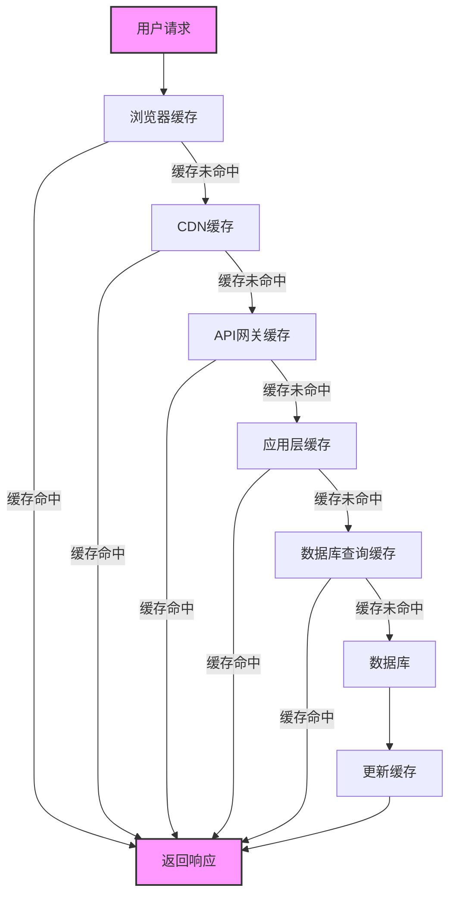

让我继续完成前面的内容：

```javascript:c:\project\kphub\src\utils\framework-benchmark.js
/**
 * 前端框架性能基准测试工具
 * 用于比较不同框架在相同操作下的性能表现
 */
class FrameworkBenchmark {
  constructor() {
    this.results = {};
    this.iterations = 100; // 测试迭代次数
  }

  /**
   * 运行DOM操作基准测试
   * @param {string} framework 框架名称
   * @param {Function} createElementsFn 创建元素的函数
   * @param {Function} updateElementsFn 更新元素的函数
   * @param {Function} removeElementsFn 移除元素的函数
   */
  runDOMBenchmark(framework, createElementsFn, updateElementsFn, removeElementsFn) {
    if (!this.results[framework]) {
      this.results[framework] = {};
    }
    
    // 测量创建元素性能
    const createTimes = [];
    for (let i = 0; i < this.iterations; i++) {
      const startCreate = performance.now();
      createElementsFn();
      createTimes.push(performance.now() - startCreate);
    }
    
    // 测量更新元素性能
    const updateTimes = [];
    for (let i = 0; i < this.iterations; i++) {
      const startUpdate = performance.now();
      updateElementsFn();
      updateTimes.push(performance.now() - startUpdate);
    }
    
    // 测量删除元素性能
    const removeTimes = [];
    for (let i = 0; i < this.iterations; i++) {
      const startRemove = performance.now();
      removeElementsFn();
      removeTimes.push(performance.now() - startRemove);
    }
    
    // 计算平均值和中位数
    this.results[framework] = {
      create: {
        mean: this.calculateMean(createTimes),
        median: this.calculateMedian(createTimes)
      },
      update: {
        mean: this.calculateMean(updateTimes),
        median: this.calculateMedian(updateTimes)
      },
      remove: {
        mean: this.calculateMean(removeTimes),
        median: this.calculateMedian(removeTimes)
      }
    };
    
    return this.results[framework];
  }
  
  /**
   * 测量内存使用情况
   * @param {string} framework 框架名称
   * @param {Function} setupFn 设置函数
   */
  measureMemoryUsage(framework, setupFn) {
    if (window.performance && performance.memory) {
      const beforeMemory = performance.memory.usedJSHeapSize;
      setupFn();
      const afterMemory = performance.memory.usedJSHeapSize;
      
      if (!this.results[framework]) {
        this.results[framework] = {};
      }
      
      this.results[framework].memory = {
        before: beforeMemory / (1024 * 1024), // MB
        after: afterMemory / (1024 * 1024), // MB
        diff: (afterMemory - beforeMemory) / (1024 * 1024) // MB
      };
      
      return this.results[framework].memory;
    } else {
      console.warn('内存使用测量不可用');
      return null;
    }
  }
  
  /**
   * 计算平均值
   */
  calculateMean(array) {
    return array.reduce((sum, val) => sum + val, 0) / array.length;
  }
  
  /**
   * 计算中位数
   */
  calculateMedian(array) {
    const sorted = [...array].sort((a, b) => a - b);
    const mid = Math.floor(sorted.length / 2);
    return sorted.length % 2 === 0
      ? (sorted[mid - 1] + sorted[mid]) / 2
      : sorted[mid];
  }
  
  /**
   * 生成比较报告
   */
  generateReport() {
    console.table(
      Object.keys(this.results).map(framework => ({
        Framework: framework,
        '创建元素(ms)': this.results[framework].create?.median.toFixed(2) || 'N/A',
        '更新元素(ms)': this.results[framework].update?.median.toFixed(2) || 'N/A',
        '删除元素(ms)': this.results[framework].remove?.median.toFixed(2) || 'N/A',
        '内存增长(MB)': this.results[framework].memory?.diff.toFixed(2) || 'N/A'
      }))
    );
    
    return this.results;
  }
}

export default FrameworkBenchmark;
```

**框架选择建议**：

1. **性能优先场景**：
   - 对于性能极其敏感的应用，考虑使用Svelte或原生JavaScript
   - 移动端或低性能设备上的应用应优先考虑轻量级框架
   - 大型数据可视化应用需要高效DOM更新能力

2. **开发效率场景**：
   - 大型团队协作项目可能更适合Angular的严格架构
   - 中小型项目Vue提供了良好的性能和开发体验平衡
   - React适合需要跨平台(Web/移动)的项目

3. **混合策略**：
   - 考虑在同一应用中混合使用不同框架
   - 性能关键路径使用更轻量的解决方案
   - 使用Web Components实现跨框架组件

4. **优化现有框架**：
   - React: 使用`React.memo`、`useMemo`和`useCallback`减少重渲染
   - Vue: 合理使用`v-once`和`keep-alive`优化渲染性能
   - Angular: 使用`OnPush`变更检测策略和懒加载模块

## 4. 数据库访问因素  

数据库访问效率直接影响Web应用的响应时间，特别是在数据密集型应用中。

### 4.1 查询性能分析  

优化数据库查询是提升应用性能的关键环节，良好的索引设计和查询优化可以显著减少响应时间。

```sql:c:\project\kphub\sql\query_optimize.sql  
-- 数据库查询优化示例

-- 1. 问题查询示例
-- 这个查询在大表上性能较差
SELECT * FROM orders 
WHERE status = 'pending' 
ORDER BY create_time;  

-- 2. 查询分析
-- 使用EXPLAIN分析查询执行计划
EXPLAIN SELECT * FROM orders 
WHERE status = 'pending' 
ORDER BY create_time;
/*
+----+-------------+--------+------+---------------+------+---------+------+------+-----------------------------+
| id | select_type | table  | type | possible_keys | key  | key_len | ref  | rows | Extra                       |
+----+-------------+--------+------+---------------+------+---------+------+------+-----------------------------+
|  1 | SIMPLE      | orders | ALL  | NULL          | NULL | NULL    | NULL | 1000 | Using where; Using filesort |
+----+-------------+--------+------+---------------+------+---------+------+------+-----------------------------+
*/

-- 3. 创建合适的索引
-- 为查询条件和排序字段创建复合索引
CREATE INDEX idx_status_time ON orders(status, create_time);

-- 4. 再次分析优化后的查询
EXPLAIN SELECT * FROM orders 
WHERE status = 'pending' 
ORDER BY create_time;
/*
+----+-------------+--------+------+---------------+---------------+---------+-------+------+-------------+
| id | select_type | table  | type | possible_keys | key           | key_len | ref   | rows | Extra       |
+----+-------------+--------+------+---------------+---------------+---------+-------+------+-------------+
|  1 | SIMPLE      | orders | ref  | idx_status_time | idx_status_time | 12      | const |   50 | Using index |
+----+-------------+--------+------+---------------+---------------+---------+-------+------+-------------+
*/

-- 5. 只查询需要的字段，避免SELECT *
SELECT id, customer_id, total_amount, create_time 
FROM orders 
WHERE status = 'pending' 
ORDER BY create_time;

-- 6. 使用LIMIT限制结果集大小
SELECT id, customer_id, total_amount, create_time 
FROM orders 
WHERE status = 'pending' 
ORDER BY create_time
LIMIT 20;

-- 7. 避免在大表上使用ORDER BY RAND()
-- 问题查询
SELECT * FROM products ORDER BY RAND() LIMIT 5;

-- 优化方案
SELECT * FROM products 
WHERE id >= (SELECT FLOOR(RAND() * (SELECT MAX(id) FROM products)))
ORDER BY id
LIMIT 5;

-- 8. 优化JOIN查询
-- 问题查询
SELECT o.*, c.name 
FROM orders o 
LEFT JOIN customers c ON o.customer_id = c.id
WHERE o.status = 'completed';

-- 确保JOIN字段有索引
CREATE INDEX idx_customer_id ON orders(customer_id);
CREATE INDEX idx_id ON customers(id);

-- 9. 使用覆盖索引
-- 创建包含所有查询字段的索引
CREATE INDEX idx_status_time_amount ON orders(status, create_time, total_amount);

-- 使用覆盖索引的查询
SELECT status, create_time, total_amount
FROM orders
WHERE status = 'pending'
ORDER BY create_time;

-- 10. 分页优化
-- 问题查询(深度分页)
SELECT * FROM orders ORDER BY id LIMIT 10000, 20;

-- 优化方案(使用上次查询的最后一个ID)
SELECT * FROM orders 
WHERE id > 123456  -- 上一页的最后一个ID
ORDER BY id
LIMIT 20;

-- 11. 避免在WHERE子句中使用函数
-- 问题查询
SELECT * FROM orders WHERE YEAR(create_time) = 2023;

-- 优化方案
SELECT * FROM orders 
WHERE create_time >= '2023-01-01' AND create_time < '2024-01-01';

-- 12. 使用UNION ALL代替OR(当有索引时)
-- 问题查询
SELECT * FROM orders WHERE status = 'pending' OR status = 'processing';

-- 优化方案
SELECT * FROM orders WHERE status = 'pending'
UNION ALL
SELECT * FROM orders WHERE status = 'processing';
```  

**查询优化最佳实践**：

1. **索引优化**：
   - 为WHERE子句、JOIN条件和ORDER BY字段创建适当索引
   - 使用复合索引优化多字段查询
   - 避免过度索引，每个索引都会增加写入开销

2. **查询语句优化**：
   - 只查询需要的字段，避免`SELECT *`
   - 使用`LIMIT`限制结果集大小
   - 避免在WHERE子句中使用函数，会导致索引失效
   - 使用覆盖索引减少回表操作

3. **JOIN优化**：
   - 确保JOIN字段有索引
   - 小表驱动大表，将小结果集表放在JOIN左侧
   - 考虑使用子查询替代复杂JOIN

4. **分页优化**：
   - 使用"基于游标"的分页代替深度OFFSET
   - 对大数据集使用分区表
   - 考虑使用NoSQL数据库处理超大数据集

### 4.2 连接池配置  

数据库连接池管理是优化数据库访问的重要环节，合理的连接池配置可以提高并发处理能力和响应速度。

```python:c:\project\kphub\src\database\pool.py  
"""
数据库连接池配置与管理
提供高效的数据库连接复用机制
"""
from sqlalchemy import create_engine
from sqlalchemy.pool import QueuePool
import time
import logging
import os
from contextlib import contextmanager

# 配置日志
logging.basicConfig(level=logging.INFO)
logger = logging.getLogger(__name__)

# 数据库连接参数
DB_HOST = os.environ.get('DB_HOST', 'localhost')
DB_PORT = os.environ.get('DB_PORT', '3306')
DB_NAME = os.environ.get('DB_NAME', 'appdb')
DB_USER = os.environ.get('DB_USER', 'appuser')
DB_PASS = os.environ.get('DB_PASS', 'password')

# 构建数据库连接URL
DB_URL = f"mysql+pymysql://{DB_USER}:{DB_PASS}@{DB_HOST}:{DB_PORT}/{DB_NAME}"

# 连接池配置
pool_config = {
    # 池中保持的连接数
    'pool_size': 20,
    # 池满时允许的最大溢出连接数
    'max_overflow': 10,
    # 连接回收时间(秒)
    'pool_recycle': 3600,
    # 获取连接的超时时间(秒)
    'pool_timeout': 30,
    # 连接预热
    'pool_pre_ping': True
}

# 创建数据库引擎
engine = create_engine(
    DB_URL,
    poolclass=QueuePool,
    **pool_config
)

# 连接池监控指标
class PoolMetrics:
    def __init__(self, engine):
        self.engine = engine
        self.metrics = {
            'created_connections': 0,
            'reused_connections': 0,
            'connection_errors': 0,
            'slow_queries': 0,
            'query_times': []
        }
    
    def get_pool_status(self):
        """获取连接池状态"""
        return {
            'size': self.engine.pool.size(),
            'checkedin': self.engine.pool.checkedin(),
            'checkedout': self.engine.pool.checkedout(),
            'overflow': self.engine.pool.overflow(),
            'created_connections': self.metrics['created_connections'],
            'reused_connections': self.metrics['reused_connections'],
            'connection_errors': self.metrics['connection_errors'],
            'slow_queries': self.metrics['slow_queries'],
            'avg_query_time': sum(self.metrics['query_times']) / len(self.metrics['query_times']) if self.metrics['query_times'] else 0
        }
    
    def record_connection_created(self):
        """记录创建的新连接"""
        self.metrics['created_connections'] += 1
    
    def record_connection_reused(self):
        """记录复用的连接"""
        self.metrics['reused_connections'] += 1
    
    def record_connection_error(self):
        """记录连接错误"""
        self.metrics['connection_errors'] += 1
    
    def record_query_time(self, duration):
        """记录查询时间"""
        self.metrics['query_times'].append(duration)
        # 保持最近100条查询的时间
        if len(self.metrics['query_times']) > 100:
            self.metrics['query_times'].pop(0)
        
        # 记录慢查询(>500ms)
        if duration > 0.5:
            self.metrics['slow_queries'] += 1
            logger.warning(f"慢查询: {duration:.2f}秒")

# 创建连接池监控实例
pool_metrics = PoolMetrics(engine)

# 监听SQLAlchemy事件
from sqlalchemy import event

@event.listens_for(engine, "connect")
def connect(dbapi_connection, connection_record):
    """连接创建事件"""
    pool_metrics.record_connection_created()
    logger.debug("数据库连接已创建")

@event.listens_for(engine, "checkout")
def checkout(dbapi_connection, connection_record, connection_proxy):
    """连接检出事件"""
    pool_metrics.record_connection_reused()
    connection_record.info['checkout_time'] = time.time()

@event.listens_for(engine, "checkin")
def checkin(dbapi_connection, connection_record):
    """连接归还事件"""
    checkout_time = connection_record.info.get('checkout_time')
    if checkout_time:
        connection_time = time.time() - checkout_time
        if connection_time > 5:
            logger.warning(f"连接使用时间过长: {connection_time:.2f}秒")

# 提供上下文管理器获取连接
@contextmanager
def get_connection():
    """获取数据库连接的上下文管理器"""
    connection = engine.connect()
    start_time = time.time()
    try:
        yield connection
    except Exception as e:
        pool_metrics.record_connection_error()
        logger.error(f"数据库连接错误: {str(e)}")
        raise
    finally:
        duration = time.time() - start_time
        pool_metrics.record_query_time(duration)
        connection.close()

# 提供执行查询的辅助函数
def execute_query(query, params=None):
    """执行SQL查询"""
    with get_connection() as conn:
        result = conn.execute(query, params or {})
        return result.fetchall()

# 定期打印连接池状态
def print_pool_status():
    """打印连接池状态"""
    status = pool_metrics.get_pool_status()
    logger.info(f"连接池状态: {status}")

# 示例使用
if __name__ == "__main__":
    # 测试连接池
    for i in range(30):
        try:
            result = execute_query("SELECT 1")
            print(f"查询结果: {result}")
        except Exception as e:
            print(f"查询错误: {str(e)}")
    
    # 打印连接池状态
    print_pool_status()
```  

**连接池优化策略**：

1. **连接池大小配置**：
   - 基本公式：连接数 = CPU核心数 × (1 + 等待时间/CPU时间)
   - 对I/O密集型应用，可以设置较大的连接池
   - 监控连接使用情况，避免连接池过大或过小

2. **连接生命周期管理**：
   - 设置连接最大生存时间，避免长时间不活跃的连接
   - 使用连接验证机制，确保连接有效
   - 实现连接预热，避免冷启动性能问题

3. **事务管理**：
   - 保持事务简短，避免长事务占用连接
   - 使用适当的隔离级别，避免不必要的锁等待
   - 实现事务超时机制，防止死锁

4. **监控与调优**：
   - 监控连接池使用情况和等待时间
   - 记录并分析慢查询
   - 根据负载情况动态调整连接池大小

## 5. 缓存策略因素  

缓存是提升Web应用性能的强大工具，合理的缓存策略可以显著减少数据库负载和响应时间。

### 5.1 多级缓存架构  

多级缓存架构通过在不同层次应用缓存，最大化性能提升效果。



**多级缓存策略**：

1. **浏览器缓存**：
   - 使用适当的Cache-Control和Expires头
   - 对静态资源使用长期缓存和内容哈希
   - 利用Service Worker实现离线缓存

2. **CDN缓存**：
   - 将静态资源和API响应缓存在CDN
   - 使用合适的缓存控制策略
   - 实现主动缓存刷新机制

3. **API网关缓存**：
   - 缓存常用API响应
   - 实现请求合并和批处理
   - 应用速率限制和熔断机制

4. **应用层缓存**：
   - 使用内存缓存(如Redis)存储热点数据
   - 实现分布式缓存保证集群一致性
   - 采用多级缓存策略(L1/L2缓存)

5. **数据库查询缓存**：
   - 缓存常用查询结果
   - 使用预编译语句减少解析开销
   - 实现结果集分页缓存

### 5.2 Redis配置示例  

Redis是常用的高性能缓存解决方案，合理配置可以显著提升缓存效率。

```yaml:c:\project\kphub\config\redis.yml  
# Redis缓存配置
cache:
  # 默认缓存过期时间(秒)
  default_ttl: 3600
  
  # Redis集群配置
  clusters:
    # 主缓存节点
    - host: cache1.example.com
      port: 6379
      db: 0
      password: ${REDIS_PASSWORD}
      max_connections: 100
      
    # 备份缓存节点
    - host: cache2.example.com
      port: 6379
      db: 0
      password: ${REDIS_PASSWORD}
      max_connections: 50
  
  # 连接池配置
  pool:
    max_connections: 100
    min_idle: 10
    max_idle: 50
    timeout: 5000
    
  # 哨兵配置(高可用)
  sentinel:
    enabled: true
    master: mymaster
    nodes:
      - sentinel1.example.com:26379
      - sentinel2.example.com:26379
      - sentinel3.example.com:26379
  
  # 缓存策略配置
  policies:
    # 用户数据缓存策略
    user:
      ttl: 1800  # 30分钟
      max_size: 10000
      eviction: LRU
    
    # 产品数据缓存策略
    product:
      ttl: 7200  # 2小时
      max_size: 5000
      eviction: LFU
    
    # 会话数据缓存策略
    session:
      ttl: 86400  # 24小时
      max_size: 50000
      eviction: FIFO
  
  # 缓存预热配置
  warmup:
    enabled: true
    sources:
      - key_pattern: "product:*"
        query: "SELECT id FROM products WHERE popular = 1"
      - key_pattern: "category:*"
        query: "SELECT id FROM categories"
```  

```java:c:\project\kphub\src\main\java\com\kphub\config\RedisConfig.java
package com.kphub.config;

import org.springframework.beans.factory.annotation.Value;
import org.springframework.cache.CacheManager;
import org.springframework.cache.annotation.EnableCaching;
import org.springframework.context.annotation.Bean;
import org.springframework.context.annotation.Configuration;
import org.springframework.data.redis.cache.RedisCacheConfiguration;
import org.springframework.data.redis.cache.RedisCacheManager;
import org.springframework.data.redis.connection.RedisConnectionFactory;
import org.springframework.data.redis.connection.RedisStandaloneConfiguration;
import org.springframework.data.redis.connection.lettuce.LettuceClientConfiguration;
import org.springframework.data.redis.connection.lettuce.LettuceConnectionFactory;
import org.springframework.data.redis.core.RedisTemplate;
import org.springframework.data.redis.serializer.GenericJackson2JsonRedisSerializer;
import org.springframework.data.redis.serializer.RedisSerializationContext;
import org.springframework.data.redis.serializer.StringRedisSerializer;

import java.time.Duration;
import java.util.HashMap;
import java.util.Map;

/**
 * Redis缓存配置类
 * 配置Redis连接、缓存管理器和序列化方式
 */
@Configuration
@EnableCaching
public class RedisConfig {

    @Value("${cache.default_ttl:3600}")
    private long defaultTtl;
    
    @Value("${cache.clusters[0].host:localhost}")
    private String redisHost;
    
    @Value("${cache.clusters[0].port:6379}")
    private int redisPort;
    
    @Value("${cache.clusters[0].password:}")
    private String redisPassword;
    
    @Value("${cache.policies.user.ttl:1800}")
    private long userCacheTtl;
    
    @Value("${cache.policies.product.ttl:7200}")
    private long productCacheTtl;
    
    @Value("${cache.policies.session.ttl:86400}")
    private long sessionCacheTtl;

    /**
     * 配置Redis连接工厂
     */
    @Bean
    public LettuceConnectionFactory redisConnectionFactory() {
        RedisStandaloneConfiguration config = new RedisStandaloneConfiguration(redisHost, redisPort);
        if (!redisPassword.isEmpty()) {
            config.setPassword(redisPassword);
        }
        
        LettuceClientConfiguration clientConfig = LettuceClientConfiguration.builder()
                .commandTimeout(Duration.ofMillis(5000)) // 命令超时
                .build();
                
        return new LettuceConnectionFactory(config, clientConfig);
    }
    
    /**
     * 配置RedisTemplate
     * 使用JSON序列化值，提高可读性和互操作性
     */
    @Bean
    public RedisTemplate<String, Object> redisTemplate(RedisConnectionFactory connectionFactory) {
        RedisTemplate<String, Object> template = new RedisTemplate<>();
        template.setConnectionFactory(connectionFactory);
        
        // 使用String序列化器处理key
        template.setKeySerializer(new StringRedisSerializer());
        // 使用JSON序列化器处理value
        template.setValueSerializer(new GenericJackson2JsonRedisSerializer());
        
        // Hash操作的序列化器
        template.setHashKeySerializer(new StringRedisSerializer());
        template.setHashValueSerializer(new GenericJackson2JsonRedisSerializer());
        
        template.afterPropertiesSet();
        return template;
    }
    
    /**
     * 配置缓存管理器
     * 为不同类型的数据配置不同的缓存策略
     */
    @Bean
    public CacheManager cacheManager(RedisConnectionFactory connectionFactory) {
        // 默认缓存配置
        RedisCacheConfiguration defaultConfig = RedisCacheConfiguration.defaultCacheConfig()
                .entryTtl(Duration.ofSeconds(defaultTtl))
                .serializeKeysWith(RedisSerializationContext.SerializationPair.fromSerializer(new StringRedisSerializer()))
                .serializeValuesWith(RedisSerializationContext.SerializationPair.fromSerializer(new GenericJackson2JsonRedisSerializer()))
                .disableCachingNullValues(); // 不缓存空值
        
        // 特定缓存配置
        Map<String, RedisCacheConfiguration> cacheConfigurations = new HashMap<>();
        
        // 用户缓存配置
        cacheConfigurations.put("userCache", defaultConfig.entryTtl(Duration.ofSeconds(userCacheTtl)));
        
        // 产品缓存配置
        cacheConfigurations.put("productCache", defaultConfig.entryTtl(Duration.ofSeconds(productCacheTtl)));
        
        // 会话缓存配置
        cacheConfigurations.put("sessionCache", defaultConfig.entryTtl(Duration.ofSeconds(sessionCacheTtl)));
        
        return RedisCacheManager.builder(connectionFactory)
                .cacheDefaults(defaultConfig)
                .withInitialCacheConfigurations(cacheConfigurations)
                .transactionAware() // 支持事务
                .build();
    }
}
```

**Redis缓存优化策略**：

1. **数据分类缓存**：
   - 根据数据类型和访问模式设置不同的TTL
   - 为热点数据设置更长的缓存时间
   - 使用合适的淘汰策略(LRU/LFU/FIFO)

2. **缓存预热与更新**：
   - 系统启动时预加载热点数据
   - 实现缓存与数据库的同步更新
   - 使用后台任务定期刷新缓存

3. **缓存穿透防护**：
   - 对不存在的数据设置空值缓存
   - 使用布隆过滤器快速判断数据是否存在
   - 实施请求限流防止恶意攻击

4. **缓存
让我继续完成前面的内容：

## 5. 缓存策略因素（续）

### 5.2 Redis配置示例（续）

**Redis缓存优化策略**（续）：

4. **缓存击穿与雪崩防护**：
   - 对热点数据设置永不过期或较长过期时间
   - 实现互斥锁防止并发重建缓存
   - 为不同数据设置随机过期时间，避免同时失效

5. **分布式缓存一致性**：
   - 实现"先更新数据库，再删除缓存"模式
   - 使用消息队列确保最终一致性
   - 考虑使用Redis集群提高可用性

```java:c:\project\kphub\src\main\java\com\kphub\service\CacheService.java
package com.kphub.service;

import com.kphub.exception.CacheException;
import org.slf4j.Logger;
import org.slf4j.LoggerFactory;
import org.springframework.beans.factory.annotation.Autowired;
import org.springframework.data.redis.core.RedisTemplate;
import org.springframework.data.redis.core.script.DefaultRedisScript;
import org.springframework.stereotype.Service;

import javax.annotation.PostConstruct;
import java.util.Arrays;
import java.util.List;
import java.util.concurrent.TimeUnit;
import java.util.function.Supplier;

/**
 * 缓存服务
 * 提供高级缓存操作和防护机制
 */
@Service
public class CacheService {
    private static final Logger logger = LoggerFactory.getLogger(CacheService.class);
    
    @Autowired
    private RedisTemplate<String, Object> redisTemplate;
    
    // 缓存互斥锁Lua脚本
    private DefaultRedisScript<Long> lockScript;
    private DefaultRedisScript<Long> unlockScript;
    
    @PostConstruct
    public void init() {
        // 初始化加锁脚本
        lockScript = new DefaultRedisScript<>();
        lockScript.setScriptText(
            "if redis.call('exists', KEYS[1]) == 0 then " +
            "  redis.call('set', KEYS[1], ARGV[1], 'PX', ARGV[2]) " +
            "  return 1 " +
            "else " +
            "  return 0 " +
            "end"
        );
        lockScript.setResultType(Long.class);
        
        // 初始化解锁脚本
        unlockScript = new DefaultRedisScript<>();
        unlockScript.setScriptText(
            "if redis.call('get', KEYS[1]) == ARGV[1] then " +
            "  return redis.call('del', KEYS[1]) " +
            "else " +
            "  return 0 " +
            "end"
        );
        unlockScript.setResultType(Long.class);
    }
    
    /**
     * 获取缓存，如果不存在则通过提供的函数加载并缓存
     * 实现缓存击穿防护
     */
    public <T> T getWithCache(String key, Class<T> type, long ttl, Supplier<T> dataLoader) {
        // 尝试从缓存获取
        Object cachedValue = redisTemplate.opsForValue().get(key);
        if (cachedValue != null) {
            logger.debug("缓存命中: {}", key);
            return type.cast(cachedValue);
        }
        
        // 缓存未命中，尝试获取互斥锁
        String lockKey = "lock:" + key;
        String lockValue = Thread.currentThread().getId() + ":" + System.currentTimeMillis();
        boolean locked = acquireLock(lockKey, lockValue, 10000);
        
        if (!locked) {
            // 无法获取锁，等待一段时间后重试缓存
            logger.debug("无法获取缓存锁，等待后重试: {}", key);
            try {
                Thread.sleep(100);
            } catch (InterruptedException e) {
                Thread.currentThread().interrupt();
            }
            return getWithCache(key, type, ttl, dataLoader);
        }
        
        try {
            // 双重检查，可能其他线程已经重建了缓存
            cachedValue = redisTemplate.opsForValue().get(key);
            if (cachedValue != null) {
                logger.debug("二次检查缓存命中: {}", key);
                return type.cast(cachedValue);
            }
            
            // 执行数据加载
            logger.debug("重建缓存: {}", key);
            T value = dataLoader.get();
            
            // 如果值不为null，则缓存
            if (value != null) {
                redisTemplate.opsForValue().set(key, value, ttl, TimeUnit.SECONDS);
            } else {
                // 缓存空值防止缓存穿透，但使用较短的过期时间
                redisTemplate.opsForValue().set(key, "NULL_VALUE", 60, TimeUnit.SECONDS);
            }
            
            return value;
        } catch (Exception e) {
            logger.error("缓存加载异常: {}", key, e);
            throw new CacheException("缓存加载失败: " + key, e);
        } finally {
            // 释放锁
            releaseLock(lockKey, lockValue);
        }
    }
    
    /**
     * 批量获取缓存，对于缓存未命中的键使用提供的函数加载
     */
    public <T> List<T> multiGetWithCache(List<String> keys, Class<T> type, long ttl, 
                                         Supplier<List<T>> dataLoader) {
        // 实现批量缓存获取逻辑
        // ...
        return null; // 简化示例
    }
    
    /**
     * 使用布隆过滤器防止缓存穿透
     */
    public <T> T getWithBloomFilter(String key, String bloomFilterName, Class<T> type, 
                                    long ttl, Supplier<T> dataLoader) {
        // 检查布隆过滤器
        Boolean exists = checkBloomFilter(bloomFilterName, key);
        
        // 如果布隆过滤器表明键不存在，直接返回null
        if (exists != null && !exists) {
            logger.debug("布隆过滤器表明键不存在: {}", key);
            return null;
        }
        
        // 继续正常的缓存获取逻辑
        return getWithCache(key, type, ttl, dataLoader);
    }
    
    /**
     * 检查布隆过滤器
     */
    private Boolean checkBloomFilter(String bloomFilterName, String key) {
        // 实现布隆过滤器检查逻辑
        // 这里简化处理，实际应使用Redis的布隆过滤器模块或自定义实现
        return true; // 简化示例
    }
    
    /**
     * 获取分布式锁
     */
    private boolean acquireLock(String lockKey, String lockValue, long ttlMillis) {
        try {
            Long result = redisTemplate.execute(
                lockScript, 
                Arrays.asList(lockKey), 
                lockValue, 
                String.valueOf(ttlMillis)
            );
            return result != null && result == 1;
        } catch (Exception e) {
            logger.error("获取分布式锁异常", e);
            return false;
        }
    }
    
    /**
     * 释放分布式锁
     */
    private boolean releaseLock(String lockKey, String lockValue) {
        try {
            Long result = redisTemplate.execute(
                unlockScript, 
                Arrays.asList(lockKey), 
                lockValue
            );
            return result != null && result == 1;
        } catch (Exception e) {
            logger.error("释放分布式锁异常", e);
            return false;
        }
    }
}
```

## 6. 第三方依赖因素  

第三方依赖的质量和使用方式对Web应用性能有显著影响，合理管理依赖可以减少资源消耗和加载时间。

### 6.1 资源加载监控  

监控第三方资源的加载性能，识别并优化性能瓶颈。

```javascript:c:\project\kphub\src\app\performance.js  
/**
 * 第三方资源性能监控工具
 * 用于跟踪和分析外部资源加载性能
 */
class ThirdPartyMonitor {
  constructor() {
    this.resources = {};
    this.slowThreshold = 1000; // 慢资源阈值(毫秒)
    this.initObserver();
  }
  
  /**
   * 初始化性能观察器
   */
  initObserver() {
    if (typeof PerformanceObserver !== 'undefined') {
      // 创建资源性能观察器
      const observer = new PerformanceObserver((list) => {  
        list.getEntries().forEach(entry => {
          // 只关注第三方资源
          if (this.isThirdParty(entry.name)) {
            this.processResourceTiming(entry);
          }
        });  
      });
      
      // 开始观察资源加载性能
      observer.observe({type: 'resource'});
      
      console.log('第三方资源性能监控已启动');
    } else {
      console.warn('PerformanceObserver API不可用，无法监控资源加载');
    }
  }
  
  /**
   * 判断资源是否为第三方资源
   */
  isThirdParty(url) {
    const currentDomain = window.location.hostname;
    try {
      const resourceDomain = new URL(url).hostname;
      return resourceDomain !== currentDomain && resourceDomain !== 'localhost';
    } catch (e) {
      return false;
    }
  }
  
  /**
   * 处理资源计时信息
   */
  processResourceTiming(entry) {
    // 提取资源域名
    const domain = new URL(entry.name).hostname;
    
    // 计算关键性能指标
    const metrics = {
      url: entry.name,
      type: entry.initiatorType,
      startTime: entry.startTime,
      duration: entry.duration,
      size: entry.transferSize || 0,
      