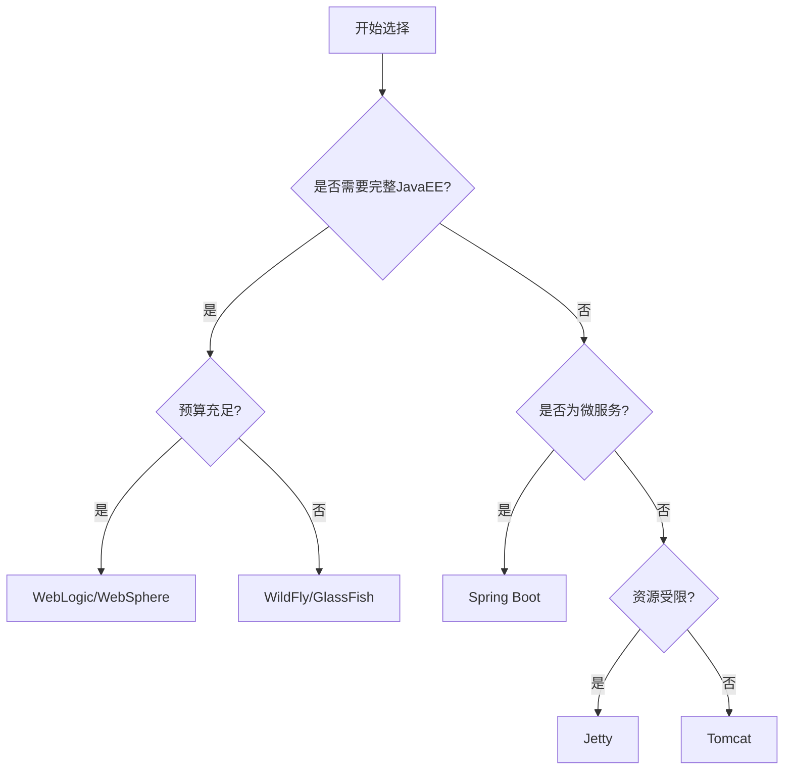

# Java应用服务部署流程  

## 1. 环境准备  

### 1.1 JDK安装配置  
Java开发工具包(JDK)是运行Java应用的基础环境，不同版本的JDK适用于不同的应用场景。

#### 1.1.1 JDK版本选择
| JDK版本 | 发布日期 | 支持状态 | 主要特性 | 适用场景 |
|---------|----------|----------|----------|----------|
| JDK 8   | 2014年   | 长期支持(LTS) | Lambda表达式，Stream API | 传统企业应用 |
| JDK 11  | 2018年   | 长期支持(LTS) | HTTP客户端API，本地变量类型推断 | 现代企业应用 |
| JDK 17  | 2021年   | 长期支持(LTS) | 密封类，模式匹配，记录类 | 新项目首选 |
| JDK 21  | 2023年   | 长期支持(LTS) | 虚拟线程，字符串模板 | 高性能应用 |

#### 1.1.2 Linux环境安装JDK
```powershell
# 更新软件包列表
wsl sudo apt update

# 下载并安装JDK 17
wsl sudo apt install openjdk-17-jdk -y

# 验证安装
wsl java -version

# 配置环境变量
wsl echo 'export JAVA_HOME=/usr/lib/jvm/java-17-openjdk-amd64' >> ~/.bashrc
wsl echo 'export PATH=$JAVA_HOME/bin:$PATH' >> ~/.bashrc
wsl source ~/.bashrc

# 验证环境变量
wsl echo $JAVA_HOME
```

#### 1.1.3 Windows环境安装JDK
```powershell
# 使用Chocolatey安装JDK (需先安装Chocolatey)
choco install openjdk17 -y

# 手动设置环境变量
[Environment]::SetEnvironmentVariable("JAVA_HOME", "C:\Program Files\OpenJDK\jdk-17", "Machine")
[Environment]::SetEnvironmentVariable("Path", $env:Path + ";%JAVA_HOME%\bin", "Machine")

# 验证安装
java -version
```

#### 1.1.4 JDK多版本管理
对于需要维护多个Java版本的环境，可以使用版本管理工具：

```powershell
# 在Linux上使用SDKMAN
wsl curl -s "https://get.sdkman.io" | bash
wsl source "$HOME/.sdkman/bin/sdkman-init.sh"
wsl sdk list java
wsl sdk install java 17.0.7-tem
wsl sdk use java 17.0.7-tem

# 在Windows上使用Jabba
Invoke-Expression (
  Invoke-WebRequest https://github.com/shyiko/jabba/raw/master/install.ps1 -UseBasicParsing
).Content
jabba install openjdk@1.17.0
jabba use openjdk@1.17.0
```

### 1.2 服务器选择对比  
Java应用服务器是运行Java Web应用的容器环境，不同服务器有各自的特点和适用场景。

| 服务器      | 适用场景       | 特点               | 资源占用 | 启动速度 | 配置复杂度 |
|-------------|--------------|--------------------|----------|----------|------------|
| Tomcat      | Web应用       | 轻量级，Servlet容器 | 低       | 快       | 简单       |
| Jetty       | 嵌入式应用    | 更轻量，高度可定制  | 极低     | 极快     | 中等       |
| Spring Boot | 微服务        | 内嵌服务器，自动配置| 中       | 中       | 简单       |
| WildFly     | 企业级EE应用  | 完整Java EE支持    | 高       | 慢       | 复杂       |
| WebLogic    | 大型企业应用  | 商业支持，集群管理  | 极高     | 极慢     | 极复杂     |
| WebSphere   | 银行金融系统  | 高可靠性，事务管理  | 极高     | 极慢     | 极复杂     |

#### 1.2.1 选择决策流程图



#### 1.2.2 服务器安装示例

**Tomcat安装**
```powershell
# 安装Tomcat 9
wsl sudo apt install tomcat9 -y

# 启动服务
wsl sudo systemctl start tomcat9

# 设置开机启动
wsl sudo systemctl enable tomcat9

# 检查状态
wsl sudo systemctl status tomcat9
```

**Jetty安装**
```powershell
# 下载Jetty
wsl wget https://repo1.maven.org/maven2/org/eclipse/jetty/jetty-distribution/11.0.15/jetty-distribution-11.0.15.tar.gz

# 解压
wsl sudo tar -xzvf jetty-distribution-11.0.15.tar.gz -C /opt/
wsl sudo ln -s /opt/jetty-distribution-11.0.15 /opt/jetty

# 创建服务用户
wsl sudo useradd -m jetty
wsl sudo chown -R jetty:jetty /opt/jetty

# 创建系统服务
wsl sudo tee /etc/systemd/system/jetty.service > /dev/null << 'EOF'
[Unit]
Description=Jetty Web Server
After=network.target

[Service]
Type=forking
User=jetty
Group=jetty
ExecStart=/opt/jetty/bin/jetty.sh start
ExecStop=/opt/jetty/bin/jetty.sh stop
Restart=on-failure

[Install]
WantedBy=multi-user.target
EOF

# 启动服务
wsl sudo systemctl daemon-reload
wsl sudo systemctl start jetty
wsl sudo systemctl enable jetty
```

## 2. 应用部署  

### 2.1 Tomcat部署WAR包  
Tomcat是最常用的Java Web应用服务器，支持标准的WAR包部署。

#### 2.1.1 手动部署流程
```powershell
# 安装Tomcat
wsl sudo apt install tomcat9 -y

# 停止Tomcat服务
wsl sudo systemctl stop tomcat9

# 部署应用（将WAR包复制到webapps目录）
wsl sudo cp target/app.war /var/lib/tomcat9/webapps/

# 启动Tomcat服务
wsl sudo systemctl start tomcat9

# 查看日志
wsl sudo tail -f /var/log/tomcat9/catalina.out
```

#### 2.1.2 Tomcat Manager部署
Tomcat Manager是一个Web界面，可以用于远程部署和管理应用。

```powershell
# 配置Tomcat用户
wsl sudo tee -a /etc/tomcat9/tomcat-users.xml > /dev/null << 'EOF'
<tomcat-users>
  <role rolename="manager-gui"/>
  <role rolename="manager-script"/>
  <role rolename="admin-gui"/>
  <user username="admin" password="SecurePassword123!" roles="manager-gui,admin-gui,manager-script"/>
</tomcat-users>
EOF

# 允许远程访问Manager（如果需要）
wsl sudo tee /etc/tomcat9/Catalina/localhost/manager.xml > /dev/null << 'EOF'
<Context privileged="true" antiResourceLocking="false" docBase="${catalina.home}/webapps/manager">
  <Valve className="org.apache.catalina.valves.RemoteAddrValve" allow="127\.0\.0\.1|::1|192\.168\..*" />
</Context>
EOF

# 重启Tomcat
wsl sudo systemctl restart tomcat9
```

使用Maven部署到Tomcat：
```xml
<plugin>
    <groupId>org.apache.tomcat.maven</groupId>
    <artifactId>tomcat7-maven-plugin</artifactId>
    <version>2.2</version>
    <configuration>
        <url>http://localhost:8080/manager/text</url>
        <server>tomcat</server>
        <path>/app</path>
        <username>admin</username>
        <password>SecurePassword123!</password>
    </configuration>
</plugin>
```

```powershell
# 使用Maven部署
mvn tomcat7:deploy
```

#### 2.1.3 虚拟主机配置
对于需要在同一Tomcat实例上部署多个应用的场景，可以配置虚拟主机：

```xml
<!-- 在server.xml中添加虚拟主机配置 -->
<Host name="app1.example.com" appBase="webapps/app1"
      unpackWARs="true" autoDeploy="true">
    <Valve className="org.apache.catalina.valves.AccessLogValve"
           directory="logs" prefix="app1_access_log" suffix=".txt"
           pattern="%h %l %u %t &quot;%r&quot; %s %b" />
</Host>

<Host name="app2.example.com" appBase="webapps/app2"
      unpackWARs="true" autoDeploy="true">
    <Valve className="org.apache.catalina.valves.AccessLogValve"
           directory="logs" prefix="app2_access_log" suffix=".txt"
           pattern="%h %l %u %t &quot;%r&quot; %s %b" />
</Host>
```

### 2.2 Spring Boot启动  
Spring Boot应用内嵌了服务器（默认为Tomcat），可以直接作为独立应用运行。

#### 2.2.1 基本启动命令
```powershell
# 直接运行JAR
java -jar target/app.jar --server.port=8080

# 指定配置文件
java -jar target/app.jar --spring.profiles.active=prod

# 指定外部配置文件
java -jar target/app.jar --spring.config.location=file:///c:/project/kphub/conf/application.properties
```

#### 2.2.2 生产环境启动脚本
```powershell
# 创建启动脚本
tee c:\project\kphub\scripts\start-app.bat > $null << 'EOF'
@echo off
set APP_NAME=myapp
set APP_HOME=c:\project\kphub
set JAVA_OPTS=-Xms512m -Xmx1024m -XX:MaxMetaspaceSize=256m -XX:+HeapDumpOnOutOfMemoryError -XX:HeapDumpPath=%APP_HOME%\logs\
set LOG_FOLDER=%APP_HOME%\logs

if not exist %LOG_FOLDER% mkdir %LOG_FOLDER%

echo Starting %APP_NAME%...
java %JAVA_OPTS% -jar %APP_HOME%\target\app.jar --spring.profiles.active=prod > %LOG_FOLDER%\app.log 2>&1
EOF

# Linux版本启动脚本
wsl sudo tee /opt/app/start-app.sh > /dev/null << 'EOF'
#!/bin/bash
APP_NAME="myapp"
APP_HOME="/opt/app"
JAVA_OPTS="-Xms512m -Xmx1024m -XX:MaxMetaspaceSize=256m -XX:+HeapDumpOnOutOfMemoryError -XX:HeapDumpPath=$APP_HOME/logs/"
LOG_FOLDER="$APP_HOME/logs"

mkdir -p $LOG_FOLDER

echo "Starting $APP_NAME..."
nohup java $JAVA_OPTS -jar $APP_HOME/target/app.jar --spring.profiles.active=prod > $LOG_FOLDER/app.log 2>&1 &

# 保存PID
echo $! > $APP_HOME/app.pid
echo "$APP_NAME started with PID $!"
EOF

# 设置执行权限
wsl sudo chmod +x /opt/app/start-app.sh
```

#### 2.2.3 创建系统服务
在Linux上，可以将Spring Boot应用注册为系统服务：

```powershell
# 创建systemd服务文件
wsl sudo tee /etc/systemd/system/myapp.service > /dev/null << 'EOF'
[Unit]
Description=My Spring Boot Application
After=syslog.target network.target

[Service]
User=appuser
Group=appuser
WorkingDirectory=/opt/app
ExecStart=/usr/bin/java -Xms512m -Xmx1024m -jar /opt/app/target/app.jar --spring.profiles.active=prod
SuccessExitStatus=143
Restart=always
RestartSec=5
StandardOutput=syslog
StandardError=syslog
SyslogIdentifier=myapp

[Install]
WantedBy=multi-user.target
EOF

# 重新加载systemd配置
wsl sudo systemctl daemon-reload

# 启动服务
wsl sudo systemctl start myapp

# 设置开机启动
wsl sudo systemctl enable myapp

# 查看服务状态
wsl sudo systemctl status myapp
```

#### 2.2.4 使用Spring Boot Actuator监控
Spring Boot Actuator提供了生产级别的监控和管理功能：

```xml
<!-- 在pom.xml中添加依赖 -->
<dependency>
    <groupId>org.springframework.boot</groupId>
    <artifactId>spring-boot-starter-actuator</artifactId>
</dependency>
```

```properties
# 在application.properties中配置
# 启用所有端点
management.endpoints.web.exposure.include=*
# 显示详细健康信息
management.endpoint.health.show-details=always
# 启用关机端点
management.endpoint.shutdown.enabled=true
```

## 3. 配置优化  

### 3.1 Tomcat性能调优  
Tomcat性能调优涉及多个方面，包括连接器配置、线程池设置和资源优化。

#### 3.1.1 连接器配置
```xml:c:\project\kphub\conf\tomcat\server.xml
<!-- HTTP 连接器优化 -->
<Connector port="8080" protocol="HTTP/1.1"
           maxThreads="400"           <!-- 最大工作线程数，默认200 -->
           minSpareThreads="50"       <!-- 最小空闲线程数，默认10 -->
           maxConnections="10000"     <!-- 最大连接数，默认10000 -->
           acceptCount="500"          <!-- 等待队列长度，默认100 -->
           connectionTimeout="20000"  <!-- 连接超时时间(毫秒)，默认20000 -->
           keepAliveTimeout="60000"   <!-- 保持连接超时时间(毫秒) -->
           maxKeepAliveRequests="100" <!-- 每个连接最大请求数 -->
           compression="on"           <!-- 启用压缩 -->
           compressionMinSize="2048"  <!-- 最小压缩大小(字节) -->
           noCompressionUserAgents="gozilla, traviata" <!-- 不压缩的用户代理 -->
           compressibleMimeType="text/html,text/xml,text/plain,text/css,text/javascript,application/javascript,application/json" <!-- 可压缩的MIME类型 -->
           URIEncoding="UTF-8"        <!-- URI编码 -->
           enableLookups="false"      <!-- 禁用DNS查询 -->
           tcpNoDelay="true"          <!-- 禁用Nagle算法 -->
           socket.soReuseAddress="true" <!-- 允许地址重用 -->
           socket.soKeepAlive="true"  <!-- 保持TCP连接活跃 -->
           socket.performanceConnectionTime="1" <!-- 连接时间性能偏好 -->
           socket.performanceLatency="0"        <!-- 延迟性能偏好 -->
           socket.performanceBandwidth="1"      <!-- 带宽性能偏好 -->
           socket.bufferPool="500"              <!-- 套接字缓冲池大小 -->
/>
```

#### 3.1.2 执行器(线程池)配置
```xml:c:\project\kphub\conf\tomcat\server.xml
<!-- 共享线程池配置 -->
<Executor name="tomcatThreadPool" 
          namePrefix="catalina-exec-"
          maxThreads="400"
          minSpareThreads="50"
          maxIdleTime="60000"
          prestartminSpareThreads="true"
          maxQueueSize="100"/>

<!-- 使用共享线程池的连接器 -->
<Connector port="8080" 
           protocol="HTTP/1.1"
           executor="tomcatThreadPool"
           ... />
```

#### 3.1.3 静态资源缓存
```xml:c:\project\kphub\conf\tomcat\context.xml
<!-- 在Context元素中添加 -->
<Resources cachingAllowed="true" 
           cacheMaxSize="100000" 
           cacheObjectMaxSize="10000" />
```

#### 3.1.4 禁用自动部署和JSP预编译
```xml:c:\project\kphub\conf\tomcat\server.xml
<!-- 在Host元素中设置 -->
<Host name="localhost" appBase="webapps"
      unpackWARs="true" autoDeploy="false" deployOnStartup="false">
    <!-- ... -->
</Host>
```

```powershell
# 预编译JSP
wsl sudo $CATALINA_HOME/bin/jspc.sh -webapp $CATALINA_HOME/webapps/myapp -d $CATALINA_HOME/work/Catalina/localhost/myapp
```

### 3.2 JVM参数配置  
JVM参数配置对Java应用性能有重大影响，需要根据应用特性和服务器资源进行调优。

#### 3.2.1 内存设置
```powershell
# 基本内存设置
java -Xms2g -Xmx2g -XX:MetaspaceSize=128m -XX:MaxMetaspaceSize=256m -jar app.jar

# 解释:
# -Xms2g: 初始堆大小为2GB
# -Xmx2g: 最大堆大小为2GB (建议设置相同值减少GC)
# -XX:MetaspaceSize=128m: 初始元空间大小
# -XX:MaxMetaspaceSize=256m: 最大元空间大小
```

#### 3.2.2 垃圾收集器选择
```powershell
# 使用G1垃圾收集器(Java 9+默认)
java -XX:+UseG1GC -jar app.jar

# 使用并行垃圾收集器(吞吐量优先)
java -XX:+UseParallelGC -jar app.jar

# 使用ZGC(低延迟优先，Java 15+)
java -XX:+UseZGC -jar app.jar
```

#### 3.2.3 GC日志配置
```powershell
# 启用GC日志
java -Xms2g -Xmx2g -XX:+UseG1GC \
     -Xlog:gc*=info:file=c:/project/kphub/logs/gc.log:time,uptime,level,tags:filecount=5,filesize=20m \
     -jar app.jar
```

#### 3.2.4 内存溢出处理
```powershell
# 内存溢出时生成堆转储
java -Xms2g -Xmx2g -XX:+HeapDumpOnOutOfMemoryError \
     -XX:HeapDumpPath=c:/project/kphub/logs/heapdump.hprof \
     -jar app.jar
```

#### 3.2.5 常用JVM参数组合
```powershell
# 通用生产环境配置
java -server -Xms2g -Xmx2g -XX:MetaspaceSize=128m -XX:MaxMetaspaceSize=256m \
     -XX:+UseG1GC -XX:MaxGCPauseMillis=200 -XX:InitiatingHeapOccupancyPercent=70 \
     -XX:+HeapDumpOnOutOfMemoryError -XX:HeapDumpPath=c:/project/kphub/logs/ \
     -Xlog:gc*=info:file=c:/project/kphub/logs/gc.log:time,uptime,level,tags:filecount=5,filesize=20m \
     -Djava.net.preferIPv4Stack=true \
     -jar app.jar

# 高吞吐量配置
java -server -Xms4g -Xmx4g -XX:+UseParallelGC -XX:ParallelGCThreads=8 \
     -XX:+UseNUMA -XX:+AggressiveOpts \
     -jar app.jar

# 低延迟配置
java -server -Xms2g -Xmx2g -XX:+UseZGC \
     -XX:ConcGCThreads=2 -XX:ZCollectionInterval=120 \
     -jar app.jar
```

## 4. 安全管理  

### 4.1 Tomcat安全加固  
Tomcat安全加固是保障Java Web应用安全的重要环节，包括多个方面的配置。

#### 4.1.1 强制HTTPS配置
```xml:c:\project\kphub\conf\tomcat\web.xml
<!-- 在web.xml的</web-app>标签前添加 -->
<security-constraint>
    <web-resource-collection>
        <web-resource-name>Entire Application</web-resource-name>
        <url-pattern>/*</url-pattern>
    </web-resource-collection>
    <user-data-constraint>
        <transport-guarantee>CONFIDENTIAL</transport-guarantee>
    </user-data-constraint>
</security-constraint>
```

#### 4.1.2 隐藏版本信息
```xml:c:\project\kphub\conf\tomcat\server.xml
<!-- 在Connector元素中添加 -->
<Connector ... server="Server" />
```

```properties:c:\project\kphub\conf\tomcat\catalina.properties
# 添加以下配置
server.info=
server.number=
server.built=
```

#### 4.1.3 禁用默认应用
```powershell
# 删除不必要的默认应用
wsl sudo rm -rf /var/lib/tomcat9/webapps/examples
wsl sudo rm -rf /var/lib/tomcat9/webapps/docs
wsl sudo rm -rf /var/lib/tomcat9/webapps/ROOT
wsl sudo rm -rf /var/lib/tomcat9/webapps/host-manager
```

#### 4.1.4 配置安全Headers
```xml:c:\project\kphub\conf\tomcat\web.xml
<!-- 添加安全过滤器 -->
<filter>
    <filter-name>httpHeaderSecurity</filter-name>
    <filter-class>org.apache.catalina.filters.HttpHeaderSecurityFilter</filter-class>
    <init-param>
        <param-name>hstsEnabled</param-name>
        <param-value>true</param-value>
    </init-param>
    <init-param>
        <param-name>hstsMaxAgeSeconds</param-name>
        <param-value>31536000</param-value>
    </init-param>
    <init-param>
        <param-name>hstsIncludeSubDomains</param-name>
        <param-value>true</param-value>
    </init-param>
    <init-param>
        <param-name>antiClickJackingEnabled</param-name>
        <param-value>true</param-value>
    </init-param>
    <init-param>
        <param-name>antiClickJackingOption</param-name>
        <param-value>DENY</param-value>
    </init-param>
    <init-param>
        <param-name>xssProtectionEnabled</param-name>
        <param-value>true</param-value>
    </init-param>
</filter>

<filter-mapping>
    <filter-name>httpHeaderSecurity</filter-name>
    <url-pattern>/*</url-pattern>
</filter-mapping>
```

#### 4.1.5 限制文件访问
```xml:c:\project\kphub\conf\tomcat\context.xml
<!-- 在Context元素中添加 -->
<Context>
    <!-- 禁止目录列表 -->
    <Resources allowLinking="false" cachingAllowed="true" cacheMaxSize="100000" />
    
    <!-- 限制上传文件大小 -->
    <Valve className="org.apache.catalina.valves.RequestLimitValve"
           maxRequestSize="10485760" />
</Context>
```

### 4.2 证书配置  
HTTPS证书配置是保障数据传输安全的关键步骤。

#### 4.2.1 生成自签名证书
```powershell
# 生成密钥库和自签名证书
keytool -genkey -alias tomcat -keyalg RSA -keysize 2048 -keystore c:\project\kphub\conf\tomcat\keystore.jks -validity 3650 -storepass changeit -keypass changeit -dname "CN=localhost, OU=IT, O=Example, L=City, ST=State, C=US"
```

#### 4.2.2 配置Tomcat使用SSL
```xml:c:\project\kphub\conf\tomcat\server.xml
<!-- 在server.xml中添加HTTPS连接器 -->
<Connector port="8443" protocol="org.apache.coyote.http11.Http11NioProtocol"
           maxThreads="150" SSLEnabled="true">
    <SSLHostConfig>
        <Certificate certificateKeystoreFile="c:/project/kphub/conf/tomcat/keystore.jks"
                     certificateKeystorePassword="changeit"
                     type="RSA" />
    </SSLHostConfig>
</Connector>
```

#### 4.2.3 使用Let's Encrypt免费证书
```powershell
# 安装Certbot
wsl sudo apt install certbot -y

# 获取证书
wsl sudo certbot certonly --standalone -d example.com -d www.example.com

# 转换为PKCS12格式
wsl sudo openssl pkcs12 -export -in /etc/letsencrypt/live/example.com/fullchain.pem -inkey /etc/letsencrypt/live/example.com/privkey.pem -out /etc/tomcat9/example.com.p12 -name tomcat -password pass:changeit

# 导入到JKS密钥库
wsl sudo keytool -importkeystore -deststorepass changeit -destkeypass changeit -destkeystore /etc/tomcat9/keystore.jks -srckeystore /etc/tomcat9/example.com.p12 -srcstoretype PKCS12 -srcstorepass changeit -alias tomcat
```

#### 4.2.4 证书自动更新
```powershell
# 创建证书更新脚本
wsl sudo tee /usr/local/bin/renew-cert.sh > /dev/null << 'EOF'
#!/bin/bash
# 更新证书
certbot renew --quiet

# 转换为PKCS12格式
openssl pkcs12 -export -in /etc/letsencrypt/live/example.com/fullchain.pem -inkey /etc/letsencrypt/live/example.com/privkey.pem -out /etc/tomcat9/example.com.p12 -name tomcat -password pass:changeit

# 导入到JKS密钥库
keytool -importkeystore -deststorepass changeit -destkeypass changeit -destkeystore /etc/tomcat9/keystore.jks -srckeystore /etc/tomcat9/example.com.p12 -srcstoretype PKCS12 -srcstorepass changeit -alias tomcat -noprompt

# 重启Tomcat
systemctl restart tomcat9
EOF

# 设置执行权限
wsl sudo chmod +x /usr/local/bin/renew-cert.sh

# 添加到crontab
wsl sudo crontab -l | { cat; echo "0 3 1 * * /usr/local/bin/renew-cert.sh"; } | sudo crontab -
```

## 5. 监控维护  

### 5.1 JVM监控  
JVM监控是Java应用性能分析和问题排查的重要手段。

#### 5.1.1 JDK内置监控工具
```powershell
# 查看Java进程
jps -lvm

# 查看JVM状态
jstat -gcutil <pid> 1000 5

# 内存分析
jmap -heap <pid>

# 线程分析
jstack <pid> > c:\project\kphub\logs\thread_dump.log

# 查看JVM参数
jinfo -flags <pid>

# 实时监控
jconsole
```

#### 5.1.2 使用VisualVM进行可视化监控
```powershell
# 启
让我继续完成Java应用服务部署流程的文档：

#### 5.1.2 使用VisualVM进行可视化监控
```powershell
# 启动VisualVM
jvisualvm
```

VisualVM提供了图形化界面，可以监控以下内容：
- CPU和内存使用情况
- 线程活动和死锁检测
- 堆转储分析
- 性能分析（CPU和内存）
- GC活动

#### 5.1.3 使用JMX远程监控
```properties:c:\project\kphub\conf\jmx.properties
# JMX远程监控配置
com.sun.management.jmxremote=true
com.sun.management.jmxremote.port=9999
com.sun.management.jmxremote.authenticate=true
com.sun.management.jmxremote.ssl=true
com.sun.management.jmxremote.password.file=c:/project/kphub/conf/jmxremote.password
com.sun.management.jmxremote.access.file=c:/project/kphub/conf/jmxremote.access
```

```powershell
# 创建JMX访问控制文件
echo "admin readwrite" > c:\project\kphub\conf\jmxremote.access
echo "admin password123" > c:\project\kphub\conf\jmxremote.password
# 设置密码文件权限（在Linux上）
wsl sudo chmod 600 /path/to/jmxremote.password

# 启动应用时启用JMX
java -Dcom.sun.management.config.file=c:/project/kphub/conf/jmx.properties -jar app.jar
```

#### 5.1.4 集成Prometheus和Grafana
```xml
<!-- 在pom.xml中添加依赖 -->
<dependency>
    <groupId>io.micrometer</groupId>
    <artifactId>micrometer-registry-prometheus</artifactId>
</dependency>
```

```properties:c:\project\kphub\conf\application.properties
# Spring Boot应用中启用Prometheus端点
management.endpoints.web.exposure.include=prometheus,health,info
management.metrics.export.prometheus.enabled=true
```

### 5.2 日志管理  
有效的日志管理对于问题排查和系统监控至关重要。

#### 5.2.1 Logback配置（Spring Boot默认）
```xml:c:\project\kphub\conf\logback-spring.xml
<?xml version="1.0" encoding="UTF-8"?>
<configuration>
    <property name="LOG_PATH" value="c:/project/kphub/logs" />
    <property name="LOG_PATTERN" value="%d{yyyy-MM-dd HH:mm:ss.SSS} [%thread] %-5level %logger{36} - %msg%n" />
    
    <!-- 控制台输出 -->
    <appender name="CONSOLE" class="ch.qos.logback.core.ConsoleAppender">
        <encoder>
            <pattern>${LOG_PATTERN}</pattern>
        </encoder>
    </appender>
    
    <!-- 应用日志文件 -->
    <appender name="FILE" class="ch.qos.logback.core.rolling.RollingFileAppender">
        <file>${LOG_PATH}/application.log</file>
        <encoder>
            <pattern>${LOG_PATTERN}</pattern>
        </encoder>
        <rollingPolicy class="ch.qos.logback.core.rolling.SizeAndTimeBasedRollingPolicy">
            <fileNamePattern>${LOG_PATH}/application-%d{yyyy-MM-dd}-%i.log</fileNamePattern>
            <maxFileSize>10MB</maxFileSize>
            <maxHistory>30</maxHistory>
            <totalSizeCap>1GB</totalSizeCap>
        </rollingPolicy>
    </appender>
    
    <!-- 错误日志单独记录 -->
    <appender name="ERROR_FILE" class="ch.qos.logback.core.rolling.RollingFileAppender">
        <file>${LOG_PATH}/error.log</file>
        <encoder>
            <pattern>${LOG_PATTERN}</pattern>
        </encoder>
        <rollingPolicy class="ch.qos.logback.core.rolling.SizeAndTimeBasedRollingPolicy">
            <fileNamePattern>${LOG_PATH}/error-%d{yyyy-MM-dd}-%i.log</fileNamePattern>
            <maxFileSize>10MB</maxFileSize>
            <maxHistory>30</maxHistory>
            <totalSizeCap>1GB</totalSizeCap>
        </rollingPolicy>
        <filter class="ch.qos.logback.classic.filter.ThresholdFilter">
            <level>ERROR</level>
        </filter>
    </appender>
    
    <!-- 异步记录日志 -->
    <appender name="ASYNC" class="ch.qos.logback.classic.AsyncAppender">
        <appender-ref ref="FILE" />
        <queueSize>512</queueSize>
        <discardingThreshold>0</discardingThreshold>
    </appender>
    
    <!-- 根日志级别 -->
    <root level="INFO">
        <appender-ref ref="CONSOLE" />
        <appender-ref ref="ASYNC" />
        <appender-ref ref="ERROR_FILE" />
    </root>
    
    <!-- 应用包日志级别 -->
    <logger name="com.example.app" level="DEBUG" additivity="false">
        <appender-ref ref="CONSOLE" />
        <appender-ref ref="ASYNC" />
        <appender-ref ref="ERROR_FILE" />
    </logger>
    
    <!-- 第三方库日志级别 -->
    <logger name="org.springframework" level="WARN" />
    <logger name="org.hibernate" level="WARN" />
</configuration>
```

#### 5.2.2 Log4j2配置（高性能选择）
```xml:c:\project\kphub\conf\log4j2.xml
<?xml version="1.0" encoding="UTF-8"?>
<Configuration status="WARN" monitorInterval="30">
    <Properties>
        <Property name="LOG_PATH">c:/project/kphub/logs</Property>
        <Property name="LOG_PATTERN">%d{yyyy-MM-dd HH:mm:ss.SSS} [%thread] %-5level %logger{36} - %msg%n</Property>
    </Properties>
    
    <Appenders>
        <Console name="Console" target="SYSTEM_OUT">
            <PatternLayout pattern="${LOG_PATTERN}"/>
        </Console>
        
        <RollingFile name="RollingFile" fileName="${LOG_PATH}/application.log"
                     filePattern="${LOG_PATH}/application-%d{yyyy-MM-dd}-%i.log">
            <PatternLayout pattern="${LOG_PATTERN}"/>
            <Policies>
                <TimeBasedTriggeringPolicy />
                <SizeBasedTriggeringPolicy size="10 MB"/>
            </Policies>
            <DefaultRolloverStrategy max="30"/>
        </RollingFile>
        
        <RollingFile name="ErrorFile" fileName="${LOG_PATH}/error.log"
                     filePattern="${LOG_PATH}/error-%d{yyyy-MM-dd}-%i.log">
            <PatternLayout pattern="${LOG_PATTERN}"/>
            <Policies>
                <TimeBasedTriggeringPolicy />
                <SizeBasedTriggeringPolicy size="10 MB"/>
            </Policies>
            <DefaultRolloverStrategy max="30"/>
        </RollingFile>
    </Appenders>
    
    <Loggers>
        <Root level="info">
            <AppenderRef ref="Console"/>
            <AppenderRef ref="RollingFile"/>
        </Root>
        
        <Logger name="com.example.app" level="debug" additivity="false">
            <AppenderRef ref="Console"/>
            <AppenderRef ref="RollingFile"/>
            <AppenderRef ref="ErrorFile" level="error"/>
        </Logger>
        
        <Logger name="org.springframework" level="warn" additivity="false">
            <AppenderRef ref="Console"/>
            <AppenderRef ref="RollingFile"/>
        </Logger>
    </Loggers>
</Configuration>
```

#### 5.2.3 日志轮转和清理
```powershell
# 创建日志清理脚本
tee c:\project\kphub\scripts\clean-logs.bat > $null << 'EOF'
@echo off
echo 清理超过30天的日志文件...
forfiles /p "c:\project\kphub\logs" /s /m *.log /d -30 /c "cmd /c del @path"
echo 日志清理完成
EOF

# Linux版本
wsl sudo tee /opt/app/clean-logs.sh > /dev/null << 'EOF'
#!/bin/bash
echo "清理超过30天的日志文件..."
find /opt/app/logs -name "*.log" -type f -mtime +30 -delete
echo "日志清理完成"
EOF

# 设置执行权限
wsl sudo chmod +x /opt/app/clean-logs.sh

# 添加到计划任务
schtasks /create /tn "CleanAppLogs" /tr "c:\project\kphub\scripts\clean-logs.bat" /sc daily /st 01:00
```

#### 5.2.4 集中式日志管理
对于分布式系统，可以使用ELK(Elasticsearch, Logstash, Kibana)或EFK(Elasticsearch, Fluentd, Kibana)进行集中式日志管理：

```xml
<!-- 在pom.xml中添加依赖 -->
<dependency>
    <groupId>net.logstash.logback</groupId>
    <artifactId>logstash-logback-encoder</artifactId>
    <version>7.2</version>
</dependency>
```

```xml:c:\project\kphub\conf\logback-spring.xml
<!-- 在logback配置中添加Logstash appender -->
<appender name="LOGSTASH" class="net.logstash.logback.appender.LogstashTcpSocketAppender">
    <destination>logstash-server:5000</destination>
    <encoder class="net.logstash.logback.encoder.LogstashEncoder">
        <includeMdc>true</includeMdc>
        <customFields>{"application":"myapp","environment":"production"}</customFields>
    </encoder>
</appender>

<root level="INFO">
    <appender-ref ref="CONSOLE" />
    <appender-ref ref="FILE" />
    <appender-ref ref="LOGSTASH" />
</root>
```

## 6. 容器化部署  

### 6.1 Dockerfile示例  
Docker容器化部署是现代Java应用的主流部署方式，具有环境一致性和部署便捷性等优势。

#### 6.1.1 基础Dockerfile
```dockerfile:c:\project\kphub\Dockerfile
# 使用官方JDK镜像作为基础镜像
FROM openjdk:17-jdk-slim

# 设置工作目录
WORKDIR /app

# 添加应用JAR包
COPY target/app.jar /app/

# 暴露应用端口
EXPOSE 8080

# 设置JVM参数和启动命令
ENV JAVA_OPTS="-Xms512m -Xmx1024m -XX:+UseG1GC"
ENTRYPOINT ["sh", "-c", "java $JAVA_OPTS -jar /app/app.jar"]
```

#### 6.1.2 多阶段构建Dockerfile
```dockerfile:c:\project\kphub\Dockerfile.multistage
# 构建阶段
FROM maven:3.8.6-openjdk-17-slim AS build
WORKDIR /build
COPY pom.xml .
# 下载依赖
RUN mvn dependency:go-offline
# 复制源代码
COPY src ./src
# 构建应用
RUN mvn package -DskipTests

# 运行阶段
FROM openjdk:17-jdk-slim
WORKDIR /app
# 从构建阶段复制JAR文件
COPY --from=build /build/target/*.jar /app/app.jar
# 暴露端口
EXPOSE 8080
# 设置JVM参数
ENV JAVA_OPTS="-Xms512m -Xmx1024m -XX:+UseG1GC"
# 启动应用
ENTRYPOINT ["sh", "-c", "java $JAVA_OPTS -jar /app/app.jar"]
```

#### 6.1.3 使用JIB插件构建Docker镜像
JIB是Google开发的Maven/Gradle插件，可以无需Dockerfile构建Docker镜像：

```xml
<!-- 在pom.xml中添加JIB插件 -->
<plugin>
    <groupId>com.google.cloud.tools</groupId>
    <artifactId>jib-maven-plugin</artifactId>
    <version>3.3.1</version>
    <configuration>
        <from>
            <image>openjdk:17-jdk-slim</image>
        </from>
        <to>
            <image>myregistry.io/myapp:${project.version}</image>
        </to>
        <container>
            <jvmFlags>
                <jvmFlag>-Xms512m</jvmFlag>
                <jvmFlag>-Xmx1024m</jvmFlag>
                <jvmFlag>-XX:+UseG1GC</jvmFlag>
            </jvmFlags>
            <ports>
                <port>8080</port>
            </ports>
        </container>
    </configuration>
</plugin>
```

```powershell
# 使用JIB构建镜像
mvn compile jib:build
```

#### 6.1.4 Docker Compose配置
```yaml:c:\project\kphub\docker-compose.yml
version: '3.8'

services:
  app:
    image: myapp:1.0
    build:
      context: .
      dockerfile: Dockerfile
    ports:
      - "8080:8080"
    environment:
      - SPRING_PROFILES_ACTIVE=prod
      - JAVA_OPTS=-Xms512m -Xmx1024m -XX:+UseG1GC
    volumes:
      - app-logs:/app/logs
    depends_on:
      - db
    restart: always
    healthcheck:
      test: ["CMD", "curl", "-f", "http://localhost:8080/actuator/health"]
      interval: 30s
      timeout: 10s
      retries: 3
      start_period: 40s
      
  db:
    image: postgres:14
    ports:
      - "5432:5432"
    environment:
      - POSTGRES_DB=appdb
      - POSTGRES_USER=appuser
      - POSTGRES_PASSWORD=apppassword
    volumes:
      - db-data:/var/lib/postgresql/data
    restart: always
    healthcheck:
      test: ["CMD", "pg_isready", "-U", "appuser"]
      interval: 10s
      timeout: 5s
      retries: 5

volumes:
  app-logs:
  db-data:
```

### 6.2 Kubernetes部署  
Kubernetes是容器编排平台，适合大规模分布式应用部署。

#### 6.2.1 基本部署配置
```yaml:c:\project\kphub\k8s\deployment.yaml
apiVersion: apps/v1
kind: Deployment
metadata:
  name: myapp
  namespace: production
  labels:
    app: myapp
spec:
  replicas: 3
  selector:
    matchLabels:
      app: myapp
  strategy:
    type: RollingUpdate
    rollingUpdate:
      maxSurge: 1
      maxUnavailable: 0
  template:
    metadata:
      labels:
        app: myapp
    spec:
      containers:
      - name: myapp
        image: myregistry.io/myapp:1.0
        imagePullPolicy: Always
        ports:
        - containerPort: 8080
        resources:
          requests:
            memory: "512Mi"
            cpu: "500m"
          limits:
            memory: "1Gi"
            cpu: "1000m"
        env:
        - name: SPRING_PROFILES_ACTIVE
          value: "prod"
        - name: JAVA_OPTS
          value: "-Xms512m -Xmx1024m -XX:+UseG1GC"
        readinessProbe:
          httpGet:
            path: /actuator/health
            port: 8080
          initialDelaySeconds: 30
          periodSeconds: 10
        livenessProbe:
          httpGet:
            path: /actuator/health/liveness
            port: 8080
          initialDelaySeconds: 60
          periodSeconds: 20
        volumeMounts:
        - name: app-logs
          mountPath: /app/logs
      volumes:
      - name: app-logs
        persistentVolumeClaim:
          claimName: app-logs-pvc
```

#### 6.2.2 服务配置
```yaml:c:\project\kphub\k8s\service.yaml
apiVersion: v1
kind: Service
metadata:
  name: myapp-service
  namespace: production
  labels:
    app: myapp
spec:
  selector:
    app: myapp
  ports:
  - port: 80
    targetPort: 8080
  type: ClusterIP
```

#### 6.2.3 Ingress配置
```yaml:c:\project\kphub\k8s\ingress.yaml
apiVersion: networking.k8s.io/v1
kind: Ingress
metadata:
  name: myapp-ingress
  namespace: production
  annotations:
    kubernetes.io/ingress.class: "nginx"
    nginx.ingress.kubernetes.io/ssl-redirect: "true"
    cert-manager.io/cluster-issuer: "letsencrypt-prod"
spec:
  tls:
  - hosts:
    - app.example.com
    secretName: myapp-tls
  rules:
  - host: app.example.com
    http:
      paths:
      - path: /
        pathType: Prefix
        backend:
          service:
            name: myapp-service
            port:
              number: 80
```

#### 6.2.4 配置映射和密钥
```yaml:c:\project\kphub\k8s\configmap.yaml
apiVersion: v1
kind: ConfigMap
metadata:
  name: myapp-config
  namespace: production
data:
  application.properties: |
    server.port=8080
    spring.datasource.url=jdbc:postgresql://postgres-service:5432/appdb
    spring.jpa.hibernate.ddl-auto=validate
    logging.level.root=INFO
    logging.level.com.example=DEBUG
```

```yaml:c:\project\kphub\k8s\secret.yaml
apiVersion: v1
kind: Secret
metadata:
  name: myapp-secrets
  namespace: production
type: Opaque
data:
  # 使用base64编码的值
  db-password: YXBwcGFzc3dvcmQ=  # apppassword
  api-key: c2VjcmV0LWFwaS1rZXk=  # secret-api-key
```

## 7. 高可用方案  

### 7.1 负载均衡配置  
负载均衡是实现高可用的关键技术，可以分散流量并提供故障转移。

#### 7.1.1 Nginx负载均衡
```nginx:c:\project\kphub\conf\nginx\loadbalance.conf
upstream app_servers {
    # 轮询方式（默认）
    server 192.168.1.10:8080;
    server 192.168.1.11:8080;
    server 192.168.1.12:8080;
    
    # 可选配置：
    # 最少连接
    # least_conn;
    
    # IP哈希（会话保持）
    # ip_hash;
    
    # 加权轮询
    # server 192.168.1.10:8080 weight=3;
    # server 192.168.1.11:8080 weight=2;
    # server 192.168.1.12:8080 weight=1;
    
    # 备用服务器
    # server 192.168.1.13:8080 backup;
    
    # 健康检查
    # server 192.168.1.10:8080 max_fails=3 fail_timeout=30s;
}

server {
    listen 80;
    server_name app.example.com;
    
    # 重定向到HTTPS
    return 301 https://$host$request_uri;
}

server {
    listen 443 ssl;
    server_name app.example.com;
    
    # SSL配置
    ssl_certificate /etc/nginx/ssl/app.example.com.crt;
    ssl_certificate_key /etc/nginx/ssl/app.example.com.key;
    ssl_protocols TLSv1.2 TLSv1.3;
    ssl_ciphers HIGH:!aNULL:!MD5;
    ssl_prefer_server_ciphers on;
    ssl_session_cache shared:SSL:10m;
    ssl_session_timeout 10m;
    
    # 代理设置
    location / {
        proxy_pass http://app_servers;
        proxy_set_header Host $host;
        proxy_set_header X-Real-IP $remote_addr;
        proxy_set_header X-Forwarded-For $proxy_add_x_forwarded_for;
        proxy_set_header X-Forwarded-Proto $scheme;
        
        # 超时设置
        proxy_connect_timeout 5s;
        proxy_send_timeout 60s;
        proxy_read_timeout 60s;
        
        # 缓冲设置
        proxy_buffering on;
        proxy_buffer_size 16k;
        proxy_buffers 4 32k;
        proxy_busy_buffers_size 64k;
        
        # WebSocket支持
        proxy_http_version 1.1;
        proxy_set_header Upgrade $http_upgrade;
        proxy_set_header Connection "upgrade";
    }
    
    # 静态资源缓存
    location ~* \.(jpg|jpeg|png|gif|ico|css|js)$ {
        proxy_pass http://app_servers;
        proxy_cache_valid 200 302 1h;
        proxy_cache_valid 404 1m;
        expires 1d;
        add_header Cache-Control "public";
    }
    
    # 健康检查端点
    location /health {
        proxy_pass http://app_servers/actuator/health;
        access_log off;
        proxy_cache_bypass 1;
        proxy_no_cache 1;
    }
}
```

#### 7.1.2 HAProxy负载均衡
```conf:c:\project\kphub\conf\haproxy\haproxy.cfg
global
    log 127.0.0.1 local0
    maxconn 4000
    user haproxy
    group haproxy
    daemon
    ssl-default-bind-options no-sslv3 no-tlsv10 no-tlsv11
    ssl-default-bind-ciphers ECDHE-ECDSA-AES256-GCM-SHA384:ECDHE-RSA-AES256-GCM-SHA384

defaults
    log global
    mode http
    option httplog
    option dontlognull
    timeout connect 5000ms
    timeout client 50000ms
    timeout server 50000ms
    errorfile 400 /etc/haproxy/errors/400.http
    errorfile 403 /etc/haproxy/errors/403.http
    errorfile 408 /etc/haproxy/errors/408.http
    errorfile 500 /etc/haproxy/errors/500.http
    errorfile 502 /etc/haproxy/errors/502.http
    errorfile 503 /etc/haproxy/errors/503.http
    errorfile 504 /etc/haproxy/errors/504.http

frontend http-in
    bind *:80
    mode http
    option forwardfor
    http-request redirect scheme https unless { ssl_fc }
    default_backend app_servers

frontend https-in
    bind *:443 ssl crt /etc/haproxy/certs/app.example.com.pem
    mode http
    option forwardfor
    http-request set-header X-Forwarded-Proto https
    default_backend app_servers

backend app_servers
    mode http
    balance roundrobin
    option httpchk GET /actuator/health HTTP/1.1\r\nHost:\ app.example.com
    http-check expect status 200
    cookie SERVERID insert indirect nocache
    server app1 192.168.1.10:8080 check cookie app1 inter 2000 rise 2 fall 3
    server app2 192.168.1.11:8080 check cookie app2 inter 2000 rise 2 fall 3
    server app3 192.168.1.12:8080 check cookie app3 inter 2000 rise 2 fall 3
```

### 7.2 健康检查端点  
健康检查端点用于监控应用状态，是负载均衡和自动恢复的基础。

#### 7.2.1 Spring Boot Actuator健康检查
```java:c:\project\kphub\src\main\java\com\example\health\HealthController.java
package com.example.health;

import org.springframework.boot.actuate.health.Health;
import org.springframework.boot.actuate.health.HealthIndicator;
import org.springframework.stereotype.Component;
import org.springframework.web.bind.annotation.GetMapping;
import org.springframework.web.bind.annotation.RestController;

@RestController
public class HealthController {
    
    @GetMapping("/health")
    public String health() {
        return "OK";
    }
}

@Component
class DatabaseHealthIndicator implements HealthIndicator {
    
    @Override
    public Health health() {
        // 检查数据库连接
        boolean dbStatus = checkDatabaseConnection();
        
        if (dbStatus) {
            return Health.up()
                    .withDetail("database", "Available")
                    .build();
        } else {
            return Health.down()
                    .withDetail("database", "Unavailable")
                    .build();
        }
    }
    
    private boolean checkDatabaseConnection() {
        // 实现数据库连接检查逻辑
        try {
            // 执行简单查询
            return true;
        } catch (Exception e) {
            return false;
        }
    }
}

@Component
class ExternalServiceHealthIndicator implements HealthIndicator {
    
    @Override
    public Health health() {
        // 检查外部服务
        boolean serviceStatus = checkExternalService();
        
        if (serviceStatus) {
            return Health.up()
                    .withDetail("externalService", "Available")
                    .build();
        } else {
            return Health.down()
                    .withDetail("externalService", "Unavailable")
                    .build();
        }
    }
    
    private boolean checkExternalService() {
        // 实现外部服务检查逻辑
        try {
            // 发送HTTP请求检查服务可用性
            return true;
        } catch (Exception e) {
            return false;
        }
    }
}
```

```properties:c:\project\kphub\conf\application.properties
# 配置Actuator健康检查
management.endpoint.health.show-details=always
management.endpoints.web.exposure.include=health,info,metrics
management.health.diskspace.enabled=true
management.health.db.enabled=true
```

#### 7.2.2 自定义健康检查
```java:c:\project\kphub\src\main\java\com\example\health\CustomHealthCheck.java
package com.example.health;

import java.util.HashMap;
import java.util.Map;

import org.springframework.http.ResponseEntity;
import org.springframework.web.bind.annotation.GetMapping;
import org.springframework.web.bind.annotation.RequestMapping;
import org.springframework.web.bind.annotation.RestController;

@RestController
@RequestMapping("/api/health")
public class CustomHealthCheck {

    @GetMapping("/status")
    public ResponseEntity<Map<String, Object>> healthStatus() {
        Map<String, Object> status = new HashMap<>();
        
        // 检查各组件状态
        boolean dbStatus = checkDatabase();
        boolean cacheStatus = checkCache();
        boolean filesystemStatus = checkFilesystem();
        
        // 设置状态信息
        status.put("status", (dbStatus && cacheStatus && filesystemStatus) ? "UP" : "DOWN");
        status.put("timestamp", System.currentTimeMillis());
        
        Map<String, Object> components = new HashMap<>();
        components.put("database", Map.of("status", dbStatus ? "UP" : "DOWN"));
        components.put("cache", Map.of("status", cacheStatus ? "UP" : "DOWN"));
        components.put("filesystem", Map.of("status", filesystemStatus ? "UP" : "DOWN"));
        
        status.put("components", components);
        
        // 如果所有组件正常，返回200，否则返回503
        return (dbStatus && cacheStatus && filesystemStatus) 
                ? ResponseEntity.ok(status) 
                : ResponseEntity.status(503).body(status);
    }
    
    private boolean checkDatabase() {
        // 实现数据库检查逻辑
        return true;
    }
    
    private boolean checkCache() {
        // 实现缓存检查逻辑
        return true;
    }
    
    private boolean checkFilesystem() {
        // 实现文件系统检查逻辑
        return true;
    }
    
    @GetMapping("/liveness")
    public ResponseEntity<String> liveness() {
        // 简单的存活检查，只要应用运行就返回成功
        return ResponseEntity.ok("Alive");
    }
    
    @GetMapping("/readiness")
    public ResponseEntity<String> readiness() {
        // 就绪检查，确认应用可以处理请求
        boolean isReady = checkIfApplicationIsReady();
        
        return isReady 
                ? ResponseEntity.ok("Ready") 
                : ResponseEntity.status(503).body("Not Ready");
    }
    
    private boolean checkIfApplicationIsReady() {
        // 实现应用就绪检查
让我继续完成Java应用服务部署流程的文档：

#### 7.2.2 自定义健康检查（续）
```java:c:\project\kphub\src\main\java\com\example\health\CustomHealthCheck.java
    private boolean checkIfApplicationIsReady() {
        // 实现应用就绪检查逻辑
        try {
            // 检查必要的资源是否可用
            boolean dbReady = checkDatabase();
            boolean cacheReady = checkCache();
            boolean externalServicesReady = checkExternalServices();
            
            return dbReady && cacheReady && externalServicesReady;
        } catch (Exception e) {
            return false;
        }
    }
    
    private boolean checkExternalServices() {
        // 检查外部服务可用性
        return true;
    }
}
```

## 8. 自动化部署流程

### 8.1 CI/CD流水线配置

#### 8.1.1 Jenkins Pipeline
```groovy:c:\project\kphub\jenkins\Jenkinsfile
pipeline {
    agent any
    
    tools {
        maven 'Maven 3.8.6'
        jdk 'JDK 17'
    }
    
    environment {
        DOCKER_REGISTRY = 'registry.example.com'
        APP_NAME = 'myapp'
        VERSION = "${env.BUILD_NUMBER}"
    }
    
    stages {
        stage('Checkout') {
            steps {
                checkout scm
            }
        }
        
        stage('Build') {
            steps {
                sh 'mvn clean package -DskipTests'
            }
        }
        
        stage('Test') {
            steps {
                sh 'mvn test'
            }
            post {
                always {
                    junit '**/target/surefire-reports/*.xml'
                }
            }
        }
        
        stage('Code Quality') {
            steps {
                sh 'mvn sonar:sonar -Dsonar.host.url=http://sonarqube:9000'
            }
        }
        
        stage('Build Docker Image') {
            steps {
                sh "docker build -t ${DOCKER_REGISTRY}/${APP_NAME}:${VERSION} ."
            }
        }
        
        stage('Push Docker Image') {
            steps {
                withCredentials([string(credentialsId: 'docker-registry-token', variable: 'DOCKER_TOKEN')]) {
                    sh "docker login ${DOCKER_REGISTRY} -u jenkins -p ${DOCKER_TOKEN}"
                    sh "docker push ${DOCKER_REGISTRY}/${APP_NAME}:${VERSION}"
                    sh "docker tag ${DOCKER_REGISTRY}/${APP_NAME}:${VERSION} ${DOCKER_REGISTRY}/${APP_NAME}:latest"
                    sh "docker push ${DOCKER_REGISTRY}/${APP_NAME}:latest"
                }
            }
        }
        
        stage('Deploy to Dev') {
            steps {
                sh "kubectl set image deployment/${APP_NAME} ${APP_NAME}=${DOCKER_REGISTRY}/${APP_NAME}:${VERSION} --namespace=dev"
                sh "kubectl rollout status deployment/${APP_NAME} --namespace=dev"
            }
        }
        
        stage('Integration Tests') {
            steps {
                sh 'mvn verify -Pintegration-tests'
            }
        }
        
        stage('Deploy to Staging') {
            when {
                branch 'develop'
            }
            steps {
                sh "kubectl set image deployment/${APP_NAME} ${APP_NAME}=${DOCKER_REGISTRY}/${APP_NAME}:${VERSION} --namespace=staging"
                sh "kubectl rollout status deployment/${APP_NAME} --namespace=staging"
            }
        }
        
        stage('Deploy to Production') {
            when {
                branch 'main'
            }
            steps {
                timeout(time: 1, unit: 'HOURS') {
                    input message: '确认部署到生产环境?', ok: '部署'
                }
                sh "kubectl set image deployment/${APP_NAME} ${APP_NAME}=${DOCKER_REGISTRY}/${APP_NAME}:${VERSION} --namespace=production"
                sh "kubectl rollout status deployment/${APP_NAME} --namespace=production"
            }
        }
    }
    
    post {
        success {
            echo '部署成功!'
            slackSend channel: '#deployments', color: 'good', message: "部署成功: ${env.JOB_NAME} ${env.BUILD_NUMBER}"
        }
        failure {
            echo '部署失败!'
            slackSend channel: '#deployments', color: 'danger', message: "部署失败: ${env.JOB_NAME} ${env.BUILD_NUMBER}"
        }
        always {
            archiveArtifacts artifacts: 'target/*.jar', fingerprint: true
            cleanWs()
        }
    }
}
```

#### 8.1.2 GitHub Actions
```yaml:c:\project\kphub\github\workflows\ci-cd.yml
name: Java CI/CD Pipeline

on:
  push:
    branches: [ main, develop ]
  pull_request:
    branches: [ main, develop ]

jobs:
  build:
    runs-on: ubuntu-latest
    
    steps:
    - uses: actions/checkout@v3
    
    - name: Set up JDK 17
      uses: actions/setup-java@v3
      with:
        java-version: '17'
        distribution: 'temurin'
        cache: maven
    
    - name: Build with Maven
      run: mvn -B package --file pom.xml
    
    - name: Run Tests
      run: mvn test
    
    - name: Run SonarQube Analysis
      env:
        GITHUB_TOKEN: ${{ secrets.GITHUB_TOKEN }}
        SONAR_TOKEN: ${{ secrets.SONAR_TOKEN }}
      run: mvn sonar:sonar -Dsonar.host.url=${{ secrets.SONAR_HOST_URL }}
    
    - name: Build and Push Docker Image
      uses: docker/build-push-action@v4
      with:
        context: .
        push: true
        tags: |
          ${{ secrets.DOCKER_REGISTRY }}/${{ secrets.APP_NAME }}:${{ github.sha }}
          ${{ secrets.DOCKER_REGISTRY }}/${{ secrets.APP_NAME }}:latest
        username: ${{ secrets.DOCKER_USERNAME }}
        password: ${{ secrets.DOCKER_PASSWORD }}
    
    - name: Deploy to Dev
      uses: actions-hub/kubectl@master
      env:
        KUBE_CONFIG: ${{ secrets.KUBE_CONFIG }}
      with:
        args: set image deployment/${{ secrets.APP_NAME }} ${{ secrets.APP_NAME }}=${{ secrets.DOCKER_REGISTRY }}/${{ secrets.APP_NAME }}:${{ github.sha }} --namespace=dev
    
    - name: Verify Dev Deployment
      uses: actions-hub/kubectl@master
      env:
        KUBE_CONFIG: ${{ secrets.KUBE_CONFIG }}
      with:
        args: rollout status deployment/${{ secrets.APP_NAME }} --namespace=dev
    
    - name: Run Integration Tests
      run: mvn verify -Pintegration-tests
    
    - name: Deploy to Staging
      if: github.ref == 'refs/heads/develop'
      uses: actions-hub/kubectl@master
      env:
        KUBE_CONFIG: ${{ secrets.KUBE_CONFIG }}
      with:
        args: set image deployment/${{ secrets.APP_NAME }} ${{ secrets.APP_NAME }}=${{ secrets.DOCKER_REGISTRY }}/${{ secrets.APP_NAME }}:${{ github.sha }} --namespace=staging
    
    - name: Deploy to Production
      if: github.ref == 'refs/heads/main'
      uses: actions-hub/kubectl@master
      env:
        KUBE_CONFIG: ${{ secrets.KUBE_CONFIG }}
      with:
        args: set image deployment/${{ secrets.APP_NAME }} ${{ secrets.APP_NAME }}=${{ secrets.DOCKER_REGISTRY }}/${{ secrets.APP_NAME }}:${{ github.sha }} --namespace=production
```

### 8.2 蓝绿部署与金丝雀发布

#### 8.2.1 Kubernetes蓝绿部署
```yaml:c:\project\kphub\k8s\blue-green-deployment.yaml
apiVersion: apps/v1
kind: Deployment
metadata:
  name: myapp-blue
  namespace: production
spec:
  replicas: 3
  selector:
    matchLabels:
      app: myapp
      version: blue
  template:
    metadata:
      labels:
        app: myapp
        version: blue
    spec:
      containers:
      - name: myapp
        image: myregistry.io/myapp:1.0
        ports:
        - containerPort: 8080
---
apiVersion: apps/v1
kind: Deployment
metadata:
  name: myapp-green
  namespace: production
spec:
  replicas: 3
  selector:
    matchLabels:
      app: myapp
      version: green
  template:
    metadata:
      labels:
        app: myapp
        version: green
    spec:
      containers:
      - name: myapp
        image: myregistry.io/myapp:2.0
        ports:
        - containerPort: 8080
---
apiVersion: v1
kind: Service
metadata:
  name: myapp-service
  namespace: production
spec:
  selector:
    app: myapp
    version: blue  # 切换到green进行蓝绿切换
  ports:
  - port: 80
    targetPort: 8080
```

#### 8.2.2 金丝雀发布脚本
```powershell:c:\project\kphub\scripts\canary-deploy.ps1
# 金丝雀发布脚本
param (
    [string]$namespace = "production",
    [string]$deployment = "myapp",
    [string]$newImage = "myregistry.io/myapp:2.0",
    [int]$canaryReplicas = 1,
    [int]$totalReplicas = 10,
    [int]$intervalMinutes = 10
)

Write-Host "开始金丝雀发布流程..."

# 创建金丝雀部署
Write-Host "创建金丝雀部署 ($canaryReplicas/$totalReplicas)..."
kubectl create deployment $deployment-canary --image=$newImage --namespace=$namespace
kubectl scale deployment $deployment-canary --replicas=$canaryReplicas --namespace=$namespace

# 等待金丝雀部署就绪
Write-Host "等待金丝雀部署就绪..."
kubectl rollout status deployment/$deployment-canary --namespace=$namespace

# 监控一段时间
Write-Host "监控金丝雀部署 $intervalMinutes 分钟..."
Start-Sleep -Seconds ($intervalMinutes * 60)

# 检查金丝雀部署状态
$canaryStatus = kubectl get deployment $deployment-canary -o jsonpath='{.status.conditions[?(@.type=="Available")].status}' --namespace=$namespace
if ($canaryStatus -ne "True") {
    Write-Host "金丝雀部署不健康，回滚..."
    kubectl delete deployment $deployment-canary --namespace=$namespace
    exit 1
}

# 逐步替换主部署
Write-Host "金丝雀部署健康，开始逐步替换主部署..."
$step = [Math]::Ceiling($totalReplicas / 5)  # 每次替换20%

for ($i = $canaryReplicas; $i -le $totalReplicas; $i += $step) {
    $stableReplicas = $totalReplicas - $i
    
    Write-Host "更新部署比例: 金丝雀 $i, 稳定版 $stableReplicas"
    kubectl scale deployment $deployment-canary --replicas=$i --namespace=$namespace
    kubectl scale deployment $deployment --replicas=$stableReplicas --namespace=$namespace
    
    # 等待部署稳定
    Start-Sleep -Seconds 60
    
    # 检查部署状态
    $deployStatus = kubectl rollout status deployment/$deployment-canary --namespace=$namespace
    if ($LASTEXITCODE -ne 0) {
        Write-Host "部署不健康，回滚..."
        kubectl scale deployment $deployment --replicas=$totalReplicas --namespace=$namespace
        kubectl delete deployment $deployment-canary --namespace=$namespace
        exit 1
    }
}

# 完成迁移
Write-Host "迁移完成，更新主部署镜像..."
kubectl set image deployment/$deployment $deployment=$newImage --namespace=$namespace
kubectl scale deployment $deployment --replicas=$totalReplicas --namespace=$namespace

# 删除金丝雀部署
Write-Host "删除金丝雀部署..."
kubectl delete deployment $deployment-canary --namespace=$namespace

Write-Host "金丝雀发布完成!"
```

## 9. 性能优化与调优

### 9.1 应用性能优化

#### 9.1.1 数据库连接池配置
```properties:c:\project\kphub\conf\application.properties
# HikariCP连接池配置
spring.datasource.hikari.maximum-pool-size=20
spring.datasource.hikari.minimum-idle=5
spring.datasource.hikari.idle-timeout=300000
spring.datasource.hikari.max-lifetime=1800000
spring.datasource.hikari.connection-timeout=30000
spring.datasource.hikari.pool-name=HikariPool-App
spring.datasource.hikari.connection-test-query=SELECT 1
```

#### 9.1.2 缓存配置
```java:c:\project\kphub\src\main\java\com\example\config\CacheConfig.java
package com.example.config;

import java.time.Duration;

import org.springframework.cache.CacheManager;
import org.springframework.cache.annotation.EnableCaching;
import org.springframework.context.annotation.Bean;
import org.springframework.context.annotation.Configuration;
import org.springframework.data.redis.cache.RedisCacheConfiguration;
import org.springframework.data.redis.cache.RedisCacheManager;
import org.springframework.data.redis.connection.RedisConnectionFactory;
import org.springframework.data.redis.serializer.GenericJackson2JsonRedisSerializer;
import org.springframework.data.redis.serializer.RedisSerializationContext;
import org.springframework.data.redis.serializer.StringRedisSerializer;

@Configuration
@EnableCaching
public class CacheConfig {

    @Bean
    public CacheManager cacheManager(RedisConnectionFactory connectionFactory) {
        // 默认缓存配置
        RedisCacheConfiguration defaultCacheConfig = RedisCacheConfiguration.defaultCacheConfig()
                .entryTtl(Duration.ofMinutes(10))  // 默认过期时间10分钟
                .serializeKeysWith(
                        RedisSerializationContext.SerializationPair.fromSerializer(new StringRedisSerializer()))
                .serializeValuesWith(
                        RedisSerializationContext.SerializationPair.fromSerializer(new GenericJackson2JsonRedisSerializer()))
                .disableCachingNullValues();  // 不缓存空值
        
        // 构建缓存管理器
        return RedisCacheManager.builder(connectionFactory)
                .cacheDefaults(defaultCacheConfig)
                // 针对特定缓存设置不同的过期时间
                .withCacheConfiguration("userCache", 
                        defaultCacheConfig.entryTtl(Duration.ofHours(1)))
                .withCacheConfiguration("productCache", 
                        defaultCacheConfig.entryTtl(Duration.ofMinutes(30)))
                .build();
    }
}
```

#### 9.1.3 异步处理配置
```java:c:\project\kphub\src\main\java\com\example\config\AsyncConfig.java
package com.example.config;

import java.util.concurrent.Executor;

import org.springframework.context.annotation.Bean;
import org.springframework.context.annotation.Configuration;
import org.springframework.scheduling.annotation.EnableAsync;
import org.springframework.scheduling.concurrent.ThreadPoolTaskExecutor;

@Configuration
@EnableAsync
public class AsyncConfig {

    @Bean(name = "taskExecutor")
    public Executor taskExecutor() {
        ThreadPoolTaskExecutor executor = new ThreadPoolTaskExecutor();
        executor.setCorePoolSize(5);  // 核心线程数
        executor.setMaxPoolSize(20);  // 最大线程数
        executor.setQueueCapacity(100);  // 队列容量
        executor.setKeepAliveSeconds(60);  // 线程空闲时间
        executor.setThreadNamePrefix("AppTask-");  // 线程名前缀
        executor.setRejectedExecutionHandler(new java.util.concurrent.ThreadPoolExecutor.CallerRunsPolicy());  // 拒绝策略
        executor.initialize();
        return executor;
    }
    
    @Bean(name = "emailExecutor")
    public Executor emailExecutor() {
        ThreadPoolTaskExecutor executor = new ThreadPoolTaskExecutor();
        executor.setCorePoolSize(2);
        executor.setMaxPoolSize(5);
        executor.setQueueCapacity(50);
        executor.setThreadNamePrefix("EmailTask-");
        executor.initialize();
        return executor;
    }
    
    @Bean(name = "reportExecutor")
    public Executor reportExecutor() {
        ThreadPoolTaskExecutor executor = new ThreadPoolTaskExecutor();
        executor.setCorePoolSize(2);
        executor.setMaxPoolSize(10);
        executor.setQueueCapacity(20);
        executor.setThreadNamePrefix("ReportTask-");
        executor.initialize();
        return executor;
    }
}
```

### 9.2 压力测试与性能分析

#### 9.2.1 JMeter测试计划
```xml:c:\project\kphub\jmeter\test-plan.jmx
<?xml version="1.0" encoding="UTF-8"?>
<jmeterTestPlan version="1.2" properties="5.0" jmeter="5.5">
  <hashTree>
    <TestPlan guiclass="TestPlanGui" testclass="TestPlan" testname="Java应用性能测试" enabled="true">
      <stringProp name="TestPlan.comments"></stringProp>
      <boolProp name="TestPlan.functional_mode">false</boolProp>
      <boolProp name="TestPlan.tearDown_on_shutdown">true</boolProp>
      <boolProp name="TestPlan.serialize_threadgroups">false</boolProp>
      <elementProp name="TestPlan.user_defined_variables" elementType="Arguments" guiclass="ArgumentsPanel" testclass="Arguments" testname="User Defined Variables" enabled="true">
        <collectionProp name="Arguments.arguments"/>
      </elementProp>
      <stringProp name="TestPlan.user_define_classpath"></stringProp>
    </TestPlan>
    <hashTree>
      <ThreadGroup guiclass="ThreadGroupGui" testclass="ThreadGroup" testname="用户登录场景" enabled="true">
        <stringProp name="ThreadGroup.on_sample_error">continue</stringProp>
        <elementProp name="ThreadGroup.main_controller" elementType="LoopController" guiclass="LoopControlPanel" testclass="LoopController" testname="Loop Controller" enabled="true">
          <boolProp name="LoopController.continue_forever">false</boolProp>
          <stringProp name="LoopController.loops">10</stringProp>
        </elementProp>
        <stringProp name="ThreadGroup.num_threads">100</stringProp>
        <stringProp name="ThreadGroup.ramp_time">30</stringProp>
        <boolProp name="ThreadGroup.scheduler">false</boolProp>
        <stringProp name="ThreadGroup.duration"></stringProp>
        <stringProp name="ThreadGroup.delay"></stringProp>
        <boolProp name="ThreadGroup.same_user_on_next_iteration">false</boolProp>
      </ThreadGroup>
      <hashTree>
        <HTTPSamplerProxy guiclass="HttpTestSampleGui" testclass="HTTPSamplerProxy" testname="登录请求" enabled="true">
          <elementProp name="HTTPsampler.Arguments" elementType="Arguments" guiclass="HTTPArgumentsPanel" testclass="Arguments" testname="User Defined Variables" enabled="true">
            <collectionProp name="Arguments.arguments">
              <elementProp name="username" elementType="HTTPArgument">
                <boolProp name="HTTPArgument.always_encode">false</boolProp>
                <stringProp name="Argument.value">${username}</stringProp>
                <stringProp name="Argument.metadata">=</stringProp>
                <boolProp name="HTTPArgument.use_equals">true</boolProp>
                <stringProp name="Argument.name">username</stringProp>
              </elementProp>
              <elementProp name="password" elementType="HTTPArgument">
                <boolProp name="HTTPArgument.always_encode">false</boolProp>
                <stringProp name="Argument.value">${password}</stringProp>
                <stringProp name="Argument.metadata">=</stringProp>
                <boolProp name="HTTPArgument.use_equals">true</boolProp>
                <stringProp name="Argument.name">password</stringProp>
              </elementProp>
            </collectionProp>
          </elementProp>
          <stringProp name="HTTPSampler.domain">app.example.com</stringProp>
          <stringProp name="HTTPSampler.port">443</stringProp>
          <stringProp name="HTTPSampler.protocol">https</stringProp>
          <stringProp name="HTTPSampler.contentEncoding"></stringProp>
          <stringProp name="HTTPSampler.path">/api/login</stringProp>
          <stringProp name="HTTPSampler.method">POST</stringProp>
          <boolProp name="HTTPSampler.follow_redirects">true</boolProp>
          <boolProp name="HTTPSampler.auto_redirects">false</boolProp>
          <boolProp name="HTTPSampler.use_keepalive">true</boolProp>
          <boolProp name="HTTPSampler.DO_MULTIPART_POST">false</boolProp>
          <stringProp name="HTTPSampler.embedded_url_re"></stringProp>
          <stringProp name="HTTPSampler.connect_timeout">5000</stringProp>
          <stringProp name="HTTPSampler.response_timeout">30000</stringProp>
        </HTTPSamplerProxy>
        <hashTree>
          <HeaderManager guiclass="HeaderPanel" testclass="HeaderManager" testname="HTTP Header Manager" enabled="true">
            <collectionProp name="HeaderManager.headers">
              <elementProp name="" elementType="Header">
                <stringProp name="Header.name">Content-Type</stringProp>
                <stringProp name="Header.value">application/json</stringProp>
              </elementProp>
              <elementProp name="" elementType="Header">
                <stringProp name="Header.name">Accept</stringProp>
                <stringProp name="Header.value">application/json</stringProp>
              </elementProp>
            </collectionProp>
          </HeaderManager>
          <hashTree/>
          <CSVDataSet guiclass="TestBeanGUI" testclass="CSVDataSet" testname="CSV Data Set Config" enabled="true">
            <stringProp name="delimiter">,</stringProp>
            <stringProp name="fileEncoding">UTF-8</stringProp>
            <stringProp name="filename">c:/project/kphub/jmeter/users.csv</stringProp>
            <boolProp name="ignoreFirstLine">true</boolProp>
            <boolProp name="quotedData">false</boolProp>
            <boolProp name="recycle">true</boolProp>
            <stringProp name="shareMode">shareMode.all</stringProp>
            <boolProp name="stopThread">false</boolProp>
            <stringProp name="variableNames">username,password</stringProp>
          </CSVDataSet>
          <hashTree/>
          <JSONPostProcessor guiclass="JSONPostProcessorGui" testclass="JSONPostProcessor" testname="JSON Extractor" enabled="true">
            <stringProp name="JSONPostProcessor.referenceNames">token</stringProp>
            <stringProp name="JSONPostProcessor.jsonPathExprs">$.token</stringProp>
            <stringProp name="JSONPostProcessor.match_numbers"></stringProp>
          </JSONPostProcessor>
          <hashTree/>
        </hashTree>
        <HTTPSamplerProxy guiclass="HttpTestSampleGui" testclass="HTTPSamplerProxy" testname="获取用户信息" enabled="true">
          <elementProp name="HTTPsampler.Arguments" elementType="Arguments" guiclass="HTTPArgumentsPanel" testclass="Arguments" testname="User Defined Variables" enabled="true">
            <collectionProp name="Arguments.arguments"/>
          </elementProp>
          <stringProp name="HTTPSampler.domain">app.example.com</stringProp>
          <stringProp name="HTTPSampler.port">443</stringProp>
          <stringProp name="HTTPSampler.protocol">https</stringProp>
          <stringProp name="HTTPSampler.contentEncoding"></stringProp>
          <stringProp name="HTTPSampler.path">/api/user/profile</stringProp>
          <stringProp name="HTTPSampler.method">GET</stringProp>
          <boolProp name="HTTPSampler.follow_redirects">true</boolProp>
          <boolProp name="HTTPSampler.auto_redirects">false</boolProp>
          <boolProp name="HTTPSampler.use_keepalive">true</boolProp>
          <boolProp name="HTTPSampler.DO_MULTIPART_POST">false</boolProp>
          <stringProp name="HTTPSampler.embedded_url_re"></stringProp>
          <stringProp name="HTTPSampler.connect_timeout">5000</stringProp>
          <stringProp name="HTTPSampler.response_timeout">30000</stringProp>
        </HTTPSamplerProxy>
        <hashTree>
          <HeaderManager guiclass="HeaderPanel" testclass="HeaderManager" testname="HTTP Header Manager" enabled="true">
            <collectionProp name="HeaderManager.headers">
              <elementProp name="" elementType="Header">
                <stringProp name="Header.name">Authorization</stringProp>
                <stringProp name="Header.value">Bearer ${token}</stringProp>
              </elementProp>
              <elementProp name="" elementType="Header">
                <stringProp name="Header.name">Accept</stringProp>
                <stringProp name="Header.value">application/json</stringProp>
              </elementProp>
            </collectionProp>
          </HeaderManager>
          <hashTree/>
        </hashTree>
        <ResultCollector guiclass="ViewResultsFullVisualizer" testclass="ResultCollector" testname="View Results Tree" enabled="true">
          <boolProp name="ResultCollector.error_logging">false</boolProp>
          <objProp>
            <name>saveConfig</name>
            <value class="SampleSaveConfiguration">
              <time>true</time>
              <latency>true</latency>
              <timestamp>true</timestamp>
              <success>true</success>
              <label>true</label>
              <code>true</code>
              <message>true</message>
              <threadName>true</threadName>
              <dataType>true</dataType>
              <encoding>false</encoding>
              <assertions>true</assertions>
              <subresults>true</subresults>
              <responseData>false</responseData>
              <samplerData>false</samplerData>
              <xml>false</xml>
              <fieldNames>true</fieldNames>
              <responseHeaders>false</responseHeaders>
              <requestHeaders>false</requestHeaders>
              <responseDataOnError>false</responseDataOnError>
              <saveAssertionResultsFailureMessage>true</saveAssertionResultsFailureMessage>
              <assertionsResultsToSave>0</assertionsResultsToSave>
              <bytes>true</bytes>
              <sentBytes>true</sentBytes>
              <url>true</url>
              <threadCounts>true</threadCounts>
              <idleTime>true</idleTime>
              <connectTime>true</connectTime>
            </value>
          </objProp>
          <stringProp name="filename"></stringProp>
        </ResultCollector>
        <hashTree/>
        <ResultCollector guiclass="SummaryReport" testclass="ResultCollector" testname="Summary Report" enabled="true">
          <boolProp name="ResultCollector.error_logging">false</boolProp>
          <objProp>
            <name>saveConfig</name>
            <value class="SampleSaveConfiguration">
              <time>true</time>
              <latency>true</latency>
              <timestamp>true</timestamp>
              <success>true</success>
              <label>true</label>
              <code>true</code>
              <message>true</message>
              <threadName>true</threadName>
              <dataType>true</dataType>
              <encoding>false</encoding>
              <assertions>true</assertions>
              <subresults>true</subresults>
              <responseData>false</responseData>
              <samplerData>false</samplerData>
              <xml>false</xml>
              <fieldNames>true</fieldNames>
              <responseHeaders>false</responseHeaders>
              <requestHeaders>false</requestHeaders>
              <responseDataOnError>false</responseDataOnError>
              <saveAssertionResultsFailureMessage>true</saveAssertionResultsFailureMessage>
              <assertionsResultsToSave>0</assertionsResultsToSave>
              <bytes>true</bytes>
              <sentBytes>true</sentBytes>
              <url>true</url>
              <threadCounts>true</threadCounts>
              <idleTime>true</idleTime>
              <connectTime>true</connectTime>
            </value>
          </objProp>
          <stringProp name="filename">c:/project/kphub/jmeter/results/summary-report.csv</stringProp>
        </ResultCollector>
        <hashTree/>
      </hashTree>
    </hashTree>
  </hashTree>
</jmeterTestPlan>
```

#### 9.2.2 性能分析脚本
```powershell:c:\project\kphub\scripts\analyze-performance.ps1
# 性能分析脚本
param (
    [string]$jmeterResultsFile = "c:\project\kphub\jmeter\results\summary-report.csv",
    [string]$jvmGcLogFile = "c:\project\kphub\logs\gc.log",
让我继续完成Java应用服务部署流程的文档：

```powershell:c:\project\kphub\scripts\analyze-performance.ps1
# 性能分析脚本
param (
    [string]$jmeterResultsFile = "c:\project\kphub\jmeter\results\summary-report.csv",
    [string]$jvmGcLogFile = "c:\project\kphub\logs\gc.log",
    [string]$outputDir = "c:\project\kphub\reports"
)

# 创建输出目录
if (-not (Test-Path $outputDir)) {
    New-Item -ItemType Directory -Path $outputDir | Out-Null
}

Write-Host "开始性能分析..."

# 分析JMeter结果
if (Test-Path $jmeterResultsFile) {
    Write-Host "分析JMeter测试结果..."
    
    $results = Import-Csv $jmeterResultsFile
    
    # 计算关键指标
    $totalRequests = $results.Count
    $successRequests = ($results | Where-Object { $_.success -eq "true" }).Count
    $failedRequests = $totalRequests - $successRequests
    $successRate = [math]::Round(($successRequests / $totalRequests) * 100, 2)
    
    $avgResponseTime = [math]::Round(($results | Measure-Object -Property elapsed -Average).Average, 2)
    $maxResponseTime = ($results | Measure-Object -Property elapsed -Maximum).Maximum
    $minResponseTime = ($results | Measure-Object -Property elapsed -Minimum).Minimum
    
    $p90ResponseTime = [math]::Round(($results | Sort-Object -Property elapsed)[([int]($totalRequests * 0.9))].elapsed, 2)
    $p95ResponseTime = [math]::Round(($results | Sort-Object -Property elapsed)[([int]($totalRequests * 0.95))].elapsed, 2)
    $p99ResponseTime = [math]::Round(($results | Sort-Object -Property elapsed)[([int]($totalRequests * 0.99))].elapsed, 2)
    
    # 生成报告
    $reportContent = @"
# JMeter性能测试报告

## 测试概述
- 总请求数: $totalRequests
- 成功请求数: $successRequests
- 失败请求数: $failedRequests
- 成功率: $successRate%

## 响应时间统计
- 平均响应时间: $avgResponseTime ms
- 最大响应时间: $maxResponseTime ms
- 最小响应时间: $minResponseTime ms
- 90%响应时间: $p90ResponseTime ms
- 95%响应时间: $p95ResponseTime ms
- 99%响应时间: $p99ResponseTime ms

## 按接口分析
"@

    # 按接口分组统计
    $endpoints = $results | Group-Object -Property label
    
    foreach ($endpoint in $endpoints) {
        $endpointName = $endpoint.Name
        $endpointCount = $endpoint.Count
        $endpointAvgTime = [math]::Round(($endpoint.Group | Measure-Object -Property elapsed -Average).Average, 2)
        $endpointMaxTime = ($endpoint.Group | Measure-Object -Property elapsed -Maximum).Maximum
        
        $reportContent += @"

### $endpointName
- 请求数: $endpointCount
- 平均响应时间: $endpointAvgTime ms
- 最大响应时间: $endpointMaxTime ms
"@
    }
    
    # 保存报告
    $reportContent | Out-File "$outputDir\jmeter-report.md" -Encoding utf8
    Write-Host "JMeter分析报告已保存至: $outputDir\jmeter-report.md"
} else {
    Write-Host "JMeter结果文件不存在: $jmeterResultsFile"
}

# 分析GC日志
if (Test-Path $jvmGcLogFile) {
    Write-Host "分析JVM GC日志..."
    
    $gcLog = Get-Content $jvmGcLogFile
    
    # 提取GC事件
    $youngGCCount = ($gcLog | Select-String -Pattern "GC pause \(G1 Young Generation\)" -AllMatches).Matches.Count
    $fullGCCount = ($gcLog | Select-String -Pattern "GC pause \(G1 Mixed\)" -AllMatches).Matches.Count
    
    # 提取GC暂停时间
    $gcPauses = @()
    foreach ($line in $gcLog) {
        if ($line -match "GC pause.*?([0-9]+\.[0-9]+)ms") {
            $gcPauses += [double]$Matches[1]
        }
    }
    
    $avgGCPause = 0
    $maxGCPause = 0
    
    if ($gcPauses.Count -gt 0) {
        $avgGCPause = [math]::Round(($gcPauses | Measure-Object -Average).Average, 2)
        $maxGCPause = [math]::Round(($gcPauses | Measure-Object -Maximum).Maximum, 2)
    }
    
    # 生成报告
    $gcReportContent = @"
# JVM GC分析报告

## GC事件统计
- Young GC次数: $youngGCCount
- Full GC次数: $fullGCCount
- 总GC次数: $($youngGCCount + $fullGCCount)

## GC暂停时间
- 平均GC暂停时间: $avgGCPause ms
- 最大GC暂停时间: $maxGCPause ms

## GC建议
"@

    # 根据GC情况提供建议
    if ($fullGCCount -gt 5) {
        $gcReportContent += @"
- 发现较多Full GC事件，建议增加堆内存大小或检查内存泄漏
- 考虑调整-XX:InitiatingHeapOccupancyPercent参数
- 检查大对象分配情况
"@
    } elseif ($avgGCPause -gt 200) {
        $gcReportContent += @"
- GC暂停时间较长，建议调整-XX:MaxGCPauseMillis参数
- 考虑使用ZGC或Shenandoah GC以减少暂停时间
"@
    } else {
        $gcReportContent += @"
- GC表现良好，无需特别调整
"@
    }
    
    # 保存报告
    $gcReportContent | Out-File "$outputDir\gc-analysis.md" -Encoding utf8
    Write-Host "GC分析报告已保存至: $outputDir\gc-analysis.md"
} else {
    Write-Host "GC日志文件不存在: $jvmGcLogFile"
}

Write-Host "性能分析完成!"
```

## 10. 灾备与恢复方案

### 10.1 数据备份策略

#### 10.1.1 数据库备份脚本
```powershell:c:\project\kphub\scripts\backup-database.ps1
# 数据库备份脚本
param (
    [string]$backupDir = "c:\project\kphub\backups\db",
    [string]$dbName = "appdb",
    [string]$dbUser = "appuser",
    [string]$dbPassword = "apppassword",
    [string]$dbHost = "localhost",
    [int]$retentionDays = 7
)

# 创建备份目录
if (-not (Test-Path $backupDir)) {
    New-Item -ItemType Directory -Path $backupDir | Out-Null
}

# 生成备份文件名
$timestamp = Get-Date -Format "yyyyMMdd_HHmmss"
$backupFile = "$backupDir\${dbName}_$timestamp.sql"

Write-Host "开始备份数据库 $dbName 到 $backupFile..."

# 执行PostgreSQL备份
try {
    $env:PGPASSWORD = $dbPassword
    & pg_dump -h $dbHost -U $dbUser -F c -b -v -f $backupFile $dbName
    
    if ($LASTEXITCODE -eq 0) {
        Write-Host "数据库备份成功: $backupFile"
        
        # 压缩备份文件
        Compress-Archive -Path $backupFile -DestinationPath "$backupFile.zip" -Force
        Remove-Item $backupFile
        Write-Host "备份文件已压缩: $backupFile.zip"
        
        # 清理旧备份
        Write-Host "清理超过 $retentionDays 天的旧备份..."
        $oldBackups = Get-ChildItem $backupDir -Filter "*.zip" | Where-Object { $_.LastWriteTime -lt (Get-Date).AddDays(-$retentionDays) }
        
        foreach ($oldBackup in $oldBackups) {
            Remove-Item $oldBackup.FullName -Force
            Write-Host "已删除旧备份: $($oldBackup.Name)"
        }
    } else {
        Write-Host "数据库备份失败!" -ForegroundColor Red
    }
} catch {
    Write-Host "备份过程中发生错误: $_" -ForegroundColor Red
} finally {
    # 清除环境变量
    $env:PGPASSWORD = ""
}
```

#### 10.1.2 应用配置备份
```powershell:c:\project\kphub\scripts\backup-config.ps1
# 应用配置备份脚本
param (
    [string]$configDir = "c:\project\kphub\conf",
    [string]$backupDir = "c:\project\kphub\backups\config",
    [int]$retentionCount = 10
)

# 创建备份目录
if (-not (Test-Path $backupDir)) {
    New-Item -ItemType Directory -Path $backupDir | Out-Null
}

# 生成备份文件名
$timestamp = Get-Date -Format "yyyyMMdd_HHmmss"
$backupFile = "$backupDir\config_$timestamp.zip"

Write-Host "开始备份配置文件..."

try {
    # 压缩配置目录
    Compress-Archive -Path "$configDir\*" -DestinationPath $backupFile -Force
    
    if (Test-Path $backupFile) {
        Write-Host "配置备份成功: $backupFile"
        
        # 保留最近的N个备份
        $allBackups = Get-ChildItem $backupDir -Filter "config_*.zip" | Sort-Object LastWriteTime -Descending
        
        if ($allBackups.Count -gt $retentionCount) {
            $backupsToDelete = $allBackups | Select-Object -Skip $retentionCount
            
            foreach ($backup in $backupsToDelete) {
                Remove-Item $backup.FullName -Force
                Write-Host "已删除旧配置备份: $($backup.Name)"
            }
        }
    } else {
        Write-Host "配置备份失败!" -ForegroundColor Red
    }
} catch {
    Write-Host "备份过程中发生错误: $_" -ForegroundColor Red
}
```

### 10.2 灾难恢复流程

#### 10.2.1 数据库恢复脚本
```powershell:c:\project\kphub\scripts\restore-database.ps1
# 数据库恢复脚本
param (
    [Parameter(Mandatory=$true)]
    [string]$backupFile,
    [string]$dbName = "appdb",
    [string]$dbUser = "appuser",
    [string]$dbPassword = "apppassword",
    [string]$dbHost = "localhost",
    [switch]$createDb = $false
)

if (-not (Test-Path $backupFile)) {
    Write-Host "备份文件不存在: $backupFile" -ForegroundColor Red
    exit 1
}

Write-Host "开始恢复数据库 $dbName 从 $backupFile..."

try {
    $env:PGPASSWORD = $dbPassword
    
    # 如果需要，创建新数据库
    if ($createDb) {
        Write-Host "创建新数据库 $dbName..."
        & psql -h $dbHost -U $dbUser -c "CREATE DATABASE $dbName;"
        
        if ($LASTEXITCODE -ne 0) {
            Write-Host "创建数据库失败!" -ForegroundColor Red
            exit 1
        }
    }
    
    # 解压备份文件（如果是压缩文件）
    $tempDir = [System.IO.Path]::GetTempPath() + [System.Guid]::NewGuid().ToString()
    New-Item -ItemType Directory -Path $tempDir | Out-Null
    
    if ($backupFile.EndsWith(".zip")) {
        Write-Host "解压备份文件..."
        Expand-Archive -Path $backupFile -DestinationPath $tempDir
        $sqlFile = Get-ChildItem $tempDir -Filter "*.sql" | Select-Object -First 1
        
        if ($null -eq $sqlFile) {
            Write-Host "压缩包中未找到SQL备份文件!" -ForegroundColor Red
            exit 1
        }
        
        $backupFile = $sqlFile.FullName
    }
    
    # 恢复数据库
    Write-Host "正在恢复数据库..."
    & pg_restore -h $dbHost -U $dbUser -d $dbName -c -v $backupFile
    
    if ($LASTEXITCODE -eq 0) {
        Write-Host "数据库恢复成功!" -ForegroundColor Green
    } else {
        Write-Host "数据库恢复过程中出现警告或错误，请检查日志" -ForegroundColor Yellow
    }
} catch {
    Write-Host "恢复过程中发生错误: $_" -ForegroundColor Red
} finally {
    # 清除环境变量和临时文件
    $env:PGPASSWORD = ""
    if (Test-Path $tempDir) {
        Remove-Item $tempDir -Recurse -Force
    }
}
```

#### 10.2.2 完整恢复流程
```powershell:c:\project\kphub\scripts\disaster-recovery.ps1
# 灾难恢复主脚本
param (
    [Parameter(Mandatory=$true)]
    [string]$backupDate,
    [string]$backupDir = "c:\project\kphub\backups",
    [string]$configDir = "c:\project\kphub\conf",
    [string]$appDir = "c:\project\kphub"
)

Write-Host "开始灾难恢复流程，使用 $backupDate 的备份..." -ForegroundColor Cyan

# 查找数据库备份
$dbBackup = Get-ChildItem "$backupDir\db" -Filter "*$backupDate*.zip" | Sort-Object LastWriteTime -Descending | Select-Object -First 1

if ($null -eq $dbBackup) {
    Write-Host "未找到指定日期的数据库备份!" -ForegroundColor Red
    exit 1
}

# 查找配置备份
$configBackup = Get-ChildItem "$backupDir\config" -Filter "*$backupDate*.zip" | Sort-Object LastWriteTime -Descending | Select-Object -First 1

if ($null -eq $configBackup) {
    Write-Host "未找到指定日期的配置备份!" -ForegroundColor Red
    exit 1
}

# 1. 停止应用服务
Write-Host "1. 停止应用服务..."
try {
    Stop-Service -Name "myapp" -ErrorAction Stop
    Write-Host "  应用服务已停止" -ForegroundColor Green
} catch {
    Write-Host "  无法停止应用服务: $_" -ForegroundColor Yellow
    $confirmation = Read-Host "  是否继续恢复流程? (Y/N)"
    if ($confirmation -ne "Y") {
        exit 1
    }
}

# 2. 恢复配置文件
Write-Host "2. 恢复配置文件..."
try {
    # 备份当前配置
    $timestamp = Get-Date -Format "yyyyMMdd_HHmmss"
    Compress-Archive -Path "$configDir\*" -DestinationPath "$backupDir\config\pre_recovery_$timestamp.zip" -Force
    
    # 清空配置目录
    Remove-Item "$configDir\*" -Recurse -Force
    
    # 解压配置备份
    Expand-Archive -Path $configBackup.FullName -DestinationPath $configDir -Force
    
    Write-Host "  配置文件已恢复" -ForegroundColor Green
} catch {
    Write-Host "  配置恢复失败: $_" -ForegroundColor Red
    exit 1
}

# 3. 恢复数据库
Write-Host "3. 恢复数据库..."
try {
    & "$appDir\scripts\restore-database.ps1" -backupFile $dbBackup.FullName
    
    if ($LASTEXITCODE -ne 0) {
        throw "数据库恢复脚本返回错误代码: $LASTEXITCODE"
    }
    
    Write-Host "  数据库已恢复" -ForegroundColor Green
} catch {
    Write-Host "  数据库恢复失败: $_" -ForegroundColor Red
    exit 1
}

# 4. 启动应用服务
Write-Host "4. 启动应用服务..."
try {
    Start-Service -Name "myapp" -ErrorAction Stop
    
    # 等待服务启动
    $timeout = 60
    $elapsed = 0
    $interval = 5
    $serviceRunning = $false
    
    while ($elapsed -lt $timeout -and -not $serviceRunning) {
        $service = Get-Service -Name "myapp" -ErrorAction SilentlyContinue
        if ($service.Status -eq "Running") {
            $serviceRunning = $true
        } else {
            Start-Sleep -Seconds $interval
            $elapsed += $interval
            Write-Host "  等待服务启动... ($elapsed/$timeout 秒)"
        }
    }
    
    if ($serviceRunning) {
        Write-Host "  应用服务已启动" -ForegroundColor Green
    } else {
        throw "服务启动超时"
    }
} catch {
    Write-Host "  应用服务启动失败: $_" -ForegroundColor Red
    exit 1
}

# 5. 验证应用状态
Write-Host "5. 验证应用状态..."
try {
    $healthCheck = Invoke-RestMethod -Uri "http://localhost:8080/actuator/health" -TimeoutSec 30
    
    if ($healthCheck.status -eq "UP") {
        Write-Host "  应用健康检查通过" -ForegroundColor Green
    } else {
        Write-Host "  应用健康检查未通过: $($healthCheck.status)" -ForegroundColor Yellow
    }
} catch {
    Write-Host "  应用健康检查失败: $_" -ForegroundColor Yellow
}

Write-Host "灾难恢复流程完成!" -ForegroundColor Cyan
```

## 11. 最佳实践与建议

### 11.1 生产环境部署清单

以下是Java应用部署到生产环境的最佳实践清单：

1. **环境准备**
   - 确保服务器满足最低硬件要求（CPU、内存、磁盘空间）
   - 安装正确版本的JDK并配置环境变量
   - 配置服务器时区和NTP同步
   - 设置适当的文件系统权限

2. **安全措施**
   - 使用非root用户运行应用
   - 配置防火墙只开放必要端口
   - 启用HTTPS并配置TLS证书
   - 实施密码和敏感信息管理策略
   - 定期更新系统和依赖包

3. **性能优化**
   - 根据服务器资源配置适当的JVM参数
   - 配置合适的GC策略
   - 优化数据库连接池
   - 实施缓存策略
   - 配置日志级别和轮转策略

4. **高可用配置**
   - 部署至少两个应用实例
   - 配置负载均衡
   - 实施健康检查和自动恢复
   - 配置数据库主从复制或集群
   - 设置监控和告警系统

5. **部署前检查**
   - 执行全面的测试（单元测试、集成测试、性能测试）
   - 验证配置文件中的环境特定设置
   - 检查数据库迁移脚本
   - 准备回滚计划
   - 更新文档和变更日志

6. **部署后验证**
   - 验证应用健康状态
   - 检查关键功能是否正常
   - 监控系统资源使用情况
   - 验证日志记录是否正常
   - 执行安全扫描

### 11.2 常见问题与解决方案

| 问题 | 可能原因 | 解决方案 |
|------|---------|---------|
| 应用启动失败 | 端口冲突 | 检查端口占用情况，修改应用配置使用其他端口 |
| | 内存不足 | 调整JVM内存参数，增加服务器内存 |
| | 配置错误 | 检查配置文件，特别是数据库连接、文件路径等 |
| 应用响应缓慢 | JVM内存不足 | 增加堆内存，优化GC参数 |
| | 数据库查询效率低 | 优化SQL，添加索引，使用缓存 |
| | 线程池配置不当 | 调整线程池大小和队列容量 |
| 内存泄漏 | 代码中的资源未释放 | 使用JProfiler或MAT分析堆转储，修复泄漏点 |
| | 第三方库问题 | 更新或替换有问题的依赖库 |
| 数据库连接耗尽 | 连接未正确关闭 | 检查代码确保连接释放，使用try-with-resources |
| | 连接池配置不当 | 调整最大连接数、超时时间等参数 |
| 磁盘空间不足 | 日志文件过大 | 配置日志轮转，清理旧日志 |
| | 临时文件未清理 | 设置定期清理任务，监控磁盘使用 |
| 证书过期 | 未设置自动更新 | 配置证书自动更新，设置证书到期提醒 |
| 负载均衡问题 | 会话粘性配置错误 | 检查负载均衡器配置，实现正确的会话管理 |
| | 健康检查配置不当 | 调整健康检查参数，确保准确检测应用状态 |

### 11.3 持续改进建议

为确保Java应用服务长期稳定运行，建议实施以下持续改进措施：

1. **定期性能评估**
   - 每季度执行全面性能测试
   - 分析并优化慢SQL查询
   - 检查并优化JVM参数配置

2. **自动化运维**
   - 实现自动化部署流程
   - 配置自动化备份和验证
   - 建立自动化监控和告警系统

3. **技术栈更新**
   - 定期评估JDK版本升级
   - 更新依赖库到安全版本
   - 评估新技术引入的可能性

4. **文档维护**
   - 保持部署文档的更新
   - 记录所有配置变更
   - 维护问题解决方案知识库

5. **团队能力建设**
   - 培训团队成员掌握性能调优技能
   - 进行定期的故障演练
   - 分享最佳实践和经验教训

通过以上Java应用服务部署流程，可以实现高效、稳定、安全的Java应用部署和运维，为业务提供可靠的技术支持。