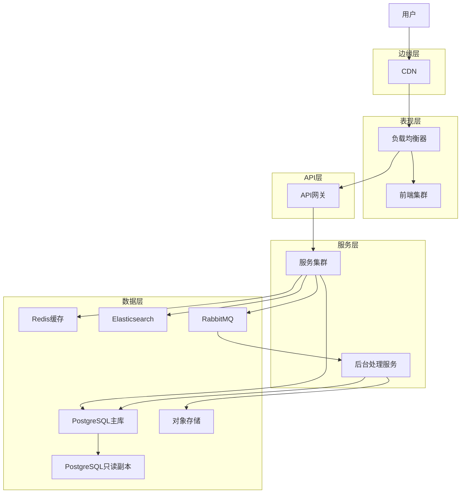

# 从零构建高性能Web应用

## 1. 项目规划与架构设计

### 1.1 需求分析与技术选型

在开始构建高性能Web应用前，首先需要进行全面的需求分析和技术选型。选择合适的技术栈对应用性能至关重要。

#### 技术选型矩阵

| 需求类别 | 技术方案 | 优势 | 性能考量 |
|---------|---------|------|---------|
| 前端框架 | React 18 | 虚拟DOM优化、并发渲染 | 减少DOM操作，支持时间切片 |
| 状态管理 | Redux Toolkit | 内置性能优化、不可变数据 | 减少不必要的重渲染 |
| 路由管理 | React Router v6 | 代码分割支持、懒加载 | 按需加载页面组件 |
| UI组件库 | MUI v5 | 按需加载、主题定制 | 支持Tree-shaking |
| API服务 | Node.js 18 | 高并发I/O处理、异步模型 | 单线程非阻塞架构 |
| Web服务器 | Nginx 1.21+ | 高性能静态资源服务 | 缓存控制、压缩支持 |
| 数据库 | PostgreSQL 15 | 复杂查询性能、JSON支持 | 高效索引、并行查询 |
| 缓存系统 | Redis 7 | 高性能内存数据库 | 减少数据库负载 |
| 搜索引擎 | Elasticsearch 8 | 全文搜索、分布式 | 快速检索大数据集 |
| 消息队列 | RabbitMQ 3.10 | 可靠消息传递 | 异步处理、削峰填谷 |

#### 性能目标设定

设定明确的性能目标是项目成功的关键：

- **页面加载时间**：首屏加载 < 2秒
- **首次内容绘制(FCP)**：< 1.8秒
- **最大内容绘制(LCP)**：< 2.5秒
- **首次输入延迟(FID)**：< 100ms
- **累积布局偏移(CLS)**：< 0.1
- **API响应时间**：95%请求 < 200ms
- **并发用户支持**：10,000同时在线用户

### 1.2 系统架构设计

高性能Web应用需要合理的架构设计，以下是一个典型的多层架构：



#### 架构说明

1. **边缘层**：CDN分发静态资源，减少延迟
2. **表现层**：负载均衡器分发流量，前端应用提供UI
3. **API层**：API网关处理认证、限流、请求路由
4. **服务层**：微服务处理业务逻辑，后台服务处理异步任务
5. **数据层**：多种数据存储满足不同需求

#### 高可用设计

- **无状态服务**：所有服务设计为无状态，便于水平扩展
- **冗余部署**：关键组件多实例部署，避免单点故障
- **自动扩缩容**：根据负载自动调整资源
- **熔断降级**：服务异常时自动降级，保障核心功能
- **限流保护**：防止突发流量导致系统崩溃

## 2. 开发环境搭建

### 2.1 前端开发环境

高效的开发环境能够提升开发体验并保障代码质量。

#### 项目初始化

```powershell
# 创建React项目
npx create-react-app c:\project\kphub\frontend --template typescript
cd c:\project\kphub\frontend

# 安装核心依赖
npm install @reduxjs/toolkit react-router-dom @mui/material @emotion/react @emotion/styled

# 安装开发依赖
npm install --save-dev eslint prettier eslint-config-prettier eslint-plugin-react-hooks @testing-library/react jest
```

#### Webpack优化配置

```javascript:c:\project\kphub\frontend\webpack.config.js
const path = require('path');
const CompressionPlugin = require('compression-webpack-plugin');
const TerserPlugin = require('terser-webpack-plugin');
const BundleAnalyzerPlugin = require('webpack-bundle-analyzer').BundleAnalyzerPlugin;

module.exports = {
  entry: './src/index.tsx',
  output: {
    path: path.resolve(__dirname, 'build'),
    filename: '[name].[contenthash].js',
    chunkFilename: '[name].[contenthash].chunk.js',
    publicPath: '/'
  },
  optimization: {
    minimize: true,
    minimizer: [
      new TerserPlugin({
        terserOptions: {
          compress: {
            drop_console: true,
          },
          output: {
            comments: false,
          },
        },
        extractComments: false,
      }),
    ],
    splitChunks: {
      chunks: 'all',
      maxInitialRequests: Infinity,
      minSize: 20000,
      cacheGroups: {
        vendor: {
          test: /[\\/]node_modules[\\/]/,
          name(module) {
            const packageName = module.context.match(/[\\/]node_modules[\\/](.*?)([\\/]|$)/)[1];
            return `vendor.${packageName.replace('@', '')}`;
          },
        },
      },
    },
    runtimeChunk: 'single',
  },
  plugins: [
    new CompressionPlugin({
      algorithm: 'gzip',
      test: /\.(js|css|html|svg)$/,
      threshold: 10240,
      minRatio: 0.8,
    }),
    process.env.ANALYZE && new BundleAnalyzerPlugin(),
  ].filter(Boolean),
  module: {
    rules: [
      {
        test: /\.(ts|tsx)$/,
        exclude: /node_modules/,
        use: {
          loader: 'babel-loader',
          options: {
            presets: [
              '@babel/preset-env',
              '@babel/preset-react',
              '@babel/preset-typescript',
            ],
            plugins: [
              ['@babel/plugin-transform-runtime', { regenerator: true }],
            ],
          },
        },
      },
      {
        test: /\.css$/,
        use: ['style-loader', 'css-loader'],
      },
      {
        test: /\.(png|svg|jpg|jpeg|gif|webp)$/i,
        type: 'asset',
        parser: {
          dataUrlCondition: {
            maxSize: 10 * 1024, // 10kb
          },
        },
      },
    ],
  },
  resolve: {
    extensions: ['.tsx', '.ts', '.js'],
    alias: {
      '@': path.resolve(__dirname, 'src'),
    },
  },
};
```

### 2.2 后端开发环境

#### 项目初始化

```powershell
# 初始化Node项目
mkdir c:\project\kphub\backend
cd c:\project\kphub\backend
npm init -y

# 安装核心依赖
npm install express pg redis cors helmet compression express-rate-limit winston dotenv

# 安装开发依赖
npm install --save-dev typescript ts-node nodemon @types/express @types/pg @types/redis @types/cors jest supertest
```

#### TypeScript配置

```json:c:\project\kphub\backend\tsconfig.json
{
  "compilerOptions": {
    "target": "ES2020",
    "module": "commonjs",
    "outDir": "./dist",
    "rootDir": "./src",
    "strict": true,
    "esModuleInterop": true,
    "skipLibCheck": true,
    "forceConsistentCasingInFileNames": true,
    "resolveJsonModule": true,
    "baseUrl": ".",
    "paths": {
      "@/*": ["src/*"]
    }
  },
  "include": ["src/**/*"],
  "exclude": ["node_modules", "**/*.test.ts"]
}
```

#### 项目结构

```
backend/
├── src/
│   ├── config/         # 配置文件
│   ├── controllers/    # 控制器
│   ├── middlewares/    # 中间件
│   ├── models/         # 数据模型
│   ├── routes/         # 路由定义
│   ├── services/       # 业务逻辑
│   ├── utils/          # 工具函数
│   ├── app.ts          # Express应用
│   └── server.ts       # 服务器入口
├── tests/              # 测试文件
├── package.json        # 项目依赖
└── tsconfig.json       # TypeScript配置
```

### 2.3 数据库环境

#### Docker Compose配置

```yaml:c:\project\kphub\docker-compose.yml
version: '3.8'

services:
  postgres:
    image: postgres:15-alpine
    container_name: kphub-postgres
    environment:
      POSTGRES_USER: kphub
      POSTGRES_PASSWORD: kphub_password
      POSTGRES_DB: kphub
    ports:
      - "5432:5432"
    volumes:
      - postgres_data:/var/lib/postgresql/data
      - ./backend/sql/init:/docker-entrypoint-initdb.d
    healthcheck:
      test: ["CMD-SHELL", "pg_isready -U kphub"]
      interval: 10s
      timeout: 5s
      retries: 5

  redis:
    image: redis:7-alpine
    container_name: kphub-redis
    ports:
      - "6379:6379"
    volumes:
      - redis_data:/data
    command: redis-server --appendonly yes
    healthcheck:
      test: ["CMD", "redis-cli", "ping"]
      interval: 10s
      timeout: 5s
      retries: 5

volumes:
  postgres_data:
  redis_data:
```

#### 数据库初始化脚本

```sql:c:\project\kphub\backend\sql\init\01-schema.sql
-- 创建扩展
CREATE EXTENSION IF NOT EXISTS "uuid-ossp";
CREATE EXTENSION IF NOT EXISTS "pg_trgm";

-- 创建用户表
CREATE TABLE users (
  id UUID PRIMARY KEY DEFAULT uuid_generate_v4(),
  username VARCHAR(50) NOT NULL UNIQUE,
  email VARCHAR(255) NOT NULL UNIQUE,
  password_hash VARCHAR(255) NOT NULL,
  full_name VARCHAR(100),
  avatar_url VARCHAR(255),
  bio TEXT,
  is_active BOOLEAN DEFAULT TRUE,
  created_at TIMESTAMP WITH TIME ZONE DEFAULT NOW(),
  updated_at TIMESTAMP WITH TIME ZONE DEFAULT NOW()
);

-- 创建文章表
CREATE TABLE articles (
  id UUID PRIMARY KEY DEFAULT uuid_generate_v4(),
  title VARCHAR(255) NOT NULL,
  slug VARCHAR(255) NOT NULL UNIQUE,
  content TEXT NOT NULL,
  summary TEXT,
  cover_image VARCHAR(255),
  author_id UUID NOT NULL REFERENCES users(id) ON DELETE CASCADE,
  view_count INTEGER DEFAULT 0,
  is_published BOOLEAN DEFAULT FALSE,
  published_at TIMESTAMP WITH TIME ZONE,
  created_at TIMESTAMP WITH TIME ZONE DEFAULT NOW(),
  updated_at TIMESTAMP WITH TIME ZONE DEFAULT NOW()
);

-- 创建标签表
CREATE TABLE tags (
  id UUID PRIMARY KEY DEFAULT uuid_generate_v4(),
  name VARCHAR(50) NOT NULL UNIQUE,
  slug VARCHAR(50) NOT NULL UNIQUE,
  description TEXT,
  created_at TIMESTAMP WITH TIME ZONE DEFAULT NOW()
);

-- 创建文章标签关联表
CREATE TABLE article_tags (
  article_id UUID REFERENCES articles(id) ON DELETE CASCADE,
  tag_id UUID REFERENCES tags(id) ON DELETE CASCADE,
  PRIMARY KEY (article_id, tag_id)
);

-- 创建评论表
CREATE TABLE comments (
  id UUID PRIMARY KEY DEFAULT uuid_generate_v4(),
  content TEXT NOT NULL,
  article_id UUID NOT NULL REFERENCES articles(id) ON DELETE CASCADE,
  user_id UUID NOT NULL REFERENCES users(id) ON DELETE CASCADE,
  parent_id UUID REFERENCES comments(id) ON DELETE CASCADE,
  created_at TIMESTAMP WITH TIME ZONE DEFAULT NOW(),
  updated_at TIMESTAMP WITH TIME ZONE DEFAULT NOW()
);

-- 创建索引
CREATE INDEX idx_users_username ON users(username);
CREATE INDEX idx_users_email ON users(email);
CREATE INDEX idx_articles_slug ON articles(slug);
CREATE INDEX idx_articles_author ON articles(author_id);
CREATE INDEX idx_articles_published ON articles(is_published, published_at);
CREATE INDEX idx_tags_slug ON tags(slug);
CREATE INDEX idx_comments_article ON comments(article_id);
CREATE INDEX idx_comments_user ON comments(user_id);
CREATE INDEX idx_comments_parent ON comments(parent_id);

-- 创建文章内容全文搜索索引
CREATE INDEX idx_articles_content_trgm ON articles USING GIN (content gin_trgm_ops);
CREATE INDEX idx_articles_title_trgm ON articles USING GIN (title gin_trgm_ops);
```

## 3. 前端性能优化

### 3.1 代码分割与懒加载

代码分割是提高前端性能的关键技术，它允许将应用拆分成更小的块，按需加载。

#### 路由级代码分割

```typescript:c:\project\kphub\frontend\src\App.tsx
import React, { Suspense } from 'react';
import { BrowserRouter, Routes, Route } from 'react-router-dom';
import { LinearProgress, Box } from '@mui/material';
import Header from './components/Header';
import Footer from './components/Footer';
import ErrorBoundary from './components/ErrorBoundary';

// 懒加载页面组件
const HomePage = React.lazy(() => import('./pages/HomePage'));
const ArticlesPage = React.lazy(() => import('./pages/ArticlesPage'));
const ArticleDetailPage = React.lazy(() => import('./pages/ArticleDetailPage'));
const ProfilePage = React.lazy(() => import('./pages/ProfilePage'));
const SettingsPage = React.lazy(() => import('./pages/SettingsPage'));
const NotFoundPage = React.lazy(() => import('./pages/NotFoundPage'));

// 加载指示器组件
const PageLoader = () => (
  <Box sx={{ width: '100%', position: 'fixed', top: 0, left: 0, zIndex: 9999 }}>
    <LinearProgress color="primary" />
  </Box>
);

function App() {
  return (
    <BrowserRouter>
      <ErrorBoundary>
        <Header />
        <main>
          <Suspense fallback={<PageLoader />}>
            <Routes>
              <Route path="/" element={<HomePage />} />
              <Route path="/articles" element={<ArticlesPage />} />
              <Route path="/articles/:slug" element={<ArticleDetailPage />} />
              <Route path="/profile/:username" element={<ProfilePage />} />
              <Route path="/settings" element={<SettingsPage />} />
              <Route path="*" element={<NotFoundPage />} />
            </Routes>
          </Suspense>
        </main>
        <Footer />
      </ErrorBoundary>
    </BrowserRouter>
  );
}

export default App;
```

#### 组件级代码分割

```typescript:c:\project\kphub\frontend\src\components\ArticleEditor.tsx
import React, { Suspense, useState } from 'react';
import { Box, Button, TextField, CircularProgress } from '@mui/material';

// 懒加载富文本编辑器
const RichTextEditor = React.lazy(() => 
  import('./RichTextEditor').then(module => ({
    default: module.default
  }))
);

interface ArticleEditorProps {
  initialContent?: string;
  onSave: (content: string) => void;
}

const ArticleEditor: React.FC<ArticleEditorProps> = ({ initialContent = '', onSave }) => {
  const [content, setContent] = useState(initialContent);
  const [isRichEditorLoaded, setIsRichEditorLoaded] = useState(false);
  const [useRichEditor, setUseRichEditor] = useState(false);

  const handleContentChange = (newContent: string) => {
    setContent(newContent);
  };

  const handleSave = () => {
    onSave(content);
  };

  const toggleEditor = () => {
    setUseRichEditor(prev => !prev);
    if (!isRichEditorLoaded) {
      setIsRichEditorLoaded(true);
    }
  };

  return (
    <Box sx={{ width: '100%' }}>
      <Box sx={{ mb: 2 }}>
        <Button 
          variant="outlined" 
          onClick={toggleEditor}
          sx={{ mb: 2 }}
        >
          {useRichEditor ? '使用普通编辑器' : '使用富文本编辑器'}
        </Button>
      </Box>

      {useRichEditor ? (
        <Suspense fallback={<CircularProgress />}>
          <RichTextEditor 
            value={content} 
            onChange={handleContentChange} 
          />
        </Suspense>
      ) : (
        <TextField
          fullWidth
          multiline
          rows={10}
          variant="outlined"
          value={content}
          onChange={(e) => handleContentChange(e.target.value)}
          placeholder="开始编写文章内容..."
        />
      )}

      <Box sx={{ mt: 2, display: 'flex', justifyContent: 'flex-end' }}>
        <Button 
          variant="contained" 
          color="primary" 
          onClick={handleSave}
        >
          保存文章
        </Button>
      </Box>
    </Box>
  );
};

export default ArticleEditor;
```

### 3.2 资源优化

优化资源加载对提升前端性能至关重要。

#### 图片优化

```typescript:c:\project\kphub\frontend\src\components\OptimizedImage.tsx
import React, { useState, useEffect } from 'react';
import { Box, Skeleton } from '@mui/material';

interface OptimizedImageProps {
  src: string;
  alt: string;
  width?: number | string;
  height?: number | string;
  lazy?: boolean;
  placeholder?: string;
  srcSet?: string;
  sizes?: string;
  className?: string;
  style?: React.CSSProperties;
}

const OptimizedImage: React.FC<OptimizedImageProps> = ({
  src,
  alt,
  width,
  height,
  lazy = true,
  placeholder,
  srcSet,
  sizes,
  className,
  style
}) => {
  const [isLoaded, setIsLoaded] = useState(false);
  const [error, setError] = useState(false);
  
  // 检测浏览器是否支持WebP
  const [supportsWebP, setSupportsWebP] = useState(false);
  
  useEffect(() => {
    const checkWebPSupport = async () => {
      try {
        const webPCheck = new Image();
        webPCheck.onload = () => setSupportsWebP(true);
        webPCheck.onerror = () => setSupportsWebP(false);
        webPCheck.src = 'data:image/webp;base64,UklGRhoAAABXRUJQVlA4TA0AAAAvAAAAEAcQERGIiP4HAA==';
      } catch (e) {
        setSupportsWebP(false);
      }
    };
    
    checkWebPSupport();
  }, []);
  
  // 根据WebP支持情况和原始URL生成最终URL
  const getOptimizedSrc = (originalSrc: string) => {
    if (!supportsWebP) return originalSrc;
    
    // 如果是自己的域名图片，添加WebP转换参数
    if (originalSrc.startsWith('/') || originalSrc.includes('yourdomain.com')) {
      return originalSrc.includes('?') 
        ? `${originalSrc}&format=webp` 
        : `${originalSrc}?format=webp`;
    }
    
    return originalSrc;
  };
  
  const handleLoad = () => {
    setIsLoaded(true);
  };
  
  const handleError = () => {
    setError(true);
    setIsLoaded(true);
  };
  
  return (
    <Box position="relative" width={width} height={height} overflow="hidden">
      {!isLoaded && (
        <Skeleton 
          variant="rectangular" 
          width="100%" 
          height="100%" 
          animation="wave" 
        />
      )}
      
      {error && placeholder ? (
        
      ) : (
        
      )}
    </Box>
  );
};

export default OptimizedImage;
```

#### 字体优化

```typescript:c:\project\kphub\frontend\src\utils\fontLoader.ts
// 字体加载优化
const fontLoader = {
  // 预加载关键字体
  preloadFonts: () => {
    const fontUrls = [
      '/fonts/roboto-v30-latin-regular.woff2',
      '/fonts/roboto-v30-latin-500.woff2',
      '/fonts/roboto-v30-latin-700.woff2'
    ];
    
    fontUrls.forEach(url => {
      const link = document.createElement('link');
      link.rel = 'preload';
      link.href = url;
      link.as = 'font';
      link.type = 'font/woff2';
      link.crossOrigin = 'anonymous';
      document.head.appendChild(link);
    });
  },
  
  // 懒加载非关键字体
  lazyLoadFonts: () => {
    // 使用Intersection Observer检测可见性
    if ('IntersectionObserver' in window) {
      const fontObserver = new IntersectionObserver((entries) => {
        entries.forEach(entry => {
          if (entry.isIntersecting) {
            const fontUrls = [
              '/fonts/roboto-v30-latin-italic.woff2',
              '/fonts/material-icons.woff2'
            ];
            
            fontUrls.forEach(url => {
              const link = document.createElement('link');
              link.rel = 'stylesheet';
              link.href = url.replace('.woff2', '.css');
              document.head.appendChild(link);
            });
            
            // 只需要触发一次
            fontObserver.disconnect();
          }
        });
      });
      
      // 观察页面底部元素
      const footer = document.querySelector('footer');
      if (footer) {
        fontObserver.observe(footer);
      }
    } else {
      // 回退方案：延迟加载
      setTimeout(() => {
        const fontUrls = [
          '/fonts/roboto-v30-latin-italic.woff2',
          '/fonts/material-icons.woff2'
        ];
        
        fontUrls.forEach(url => {
          const link = document.createElement('link');
          link.rel = 'stylesheet';
          link.href = url.replace('.woff2', '.css');
          document.head.appendChild(link);
        });
      }, 2000);
    }
  },
  
  // 初始化字体加载
  init: () => {
    // 预加载关键字体
    fontLoader.preloadFonts();
    
    // 页面加载完成后懒加载其他字体
    if (document.readyState === 'complete') {
      fontLoader.lazyLoadFonts();
    } else {
      window.addEventListener('load', fontLoader.lazyLoadFonts);
    }
  }
};

export default fontLoader;
```

### 3.3 状态管理优化

高效的状态管理对前端性能至关重要。

#### Redux Toolkit配置

```typescript:c:\project\kphub\frontend\src\store\index.ts
import { configureStore } from '@reduxjs/toolkit';
import { setupListeners } from '@reduxjs/toolkit/query/react';
import { persistStore, persistReducer, FLUSH, REHYDRATE, PAUSE, PERSIST, PURGE, REGISTER } from 'redux-persist';
import storage from 'redux-persist/lib/storage';
import { combineReducers } from 'redux';

import authReducer from './slices/authSlice';
import articlesReducer from './slices/articlesSlice';
import uiReducer from './slices/uiSlice';
import { api } from './api';

// 合并所有reducer
const rootReducer = combineReducers({
  auth: authReducer,
  articles: articlesReducer,
  ui: uiReducer,
  [api.reducerPath]: api.reducer,
});

// 配置持久化
const persistConfig = {
  key: 'root',
  version: 1,
  storage,
  whitelist: ['auth'], // 只持久化auth状态
  blacklist: [api.reducerPath], // 不持久化API缓存
};

const persistedReducer = persistReducer(persistConfig, rootReducer);

// 创建store
export const store = configureStore({
  reducer: persistedReducer,
  middleware: (getDefaultMiddleware) =>
    getDefaultMiddleware({
      serializableCheck: {
        ignoredActions: [FLUSH, REHYDRATE, PAUSE, PERSIST, PURGE, REGISTER],
      },
    }).concat(api.middleware),
  devTools: process.env.NODE_ENV !== 'production',
});

// 持久化store
export const persistor = persistStore(store);

// 启用RTK Query的自动重新获取功能
setupListeners(store.dispatch);

// 导出类型
export type RootState = ReturnType<typeof store.getState>;
export type AppDispatch = typeof store.dispatch;
```

#### 高效的选择器

```typescript:c:\project\kphub\frontend\src\store\selectors\articleSelectors.ts
import { createSelector } from '@reduxjs/toolkit';
import { RootState } from '../index';

// 基础选择器
const selectArticlesState = (state: RootState) => state.articles;
const selectArticlesEntities = (state: RootState) => state.articles.entities;
const selectArticlesIds = (state: RootState) => state.articles.ids;
const selectCurrentArticleId = (state: RootState) => state.articles.currentArticleId;
const selectArticlesFilter = (state: RootState) => state.articles.filter;
const selectArticlesSort = (state: RootState) => state.articles.sort;

// 记忆化选择器
export const selectAllArticles = createSelector(
  [selectArticlesEntities, selectArticlesIds],
  (entities, ids) => ids.map(id => entities[id])
);

export const selectCurrentArticle = createSelector(
  [selectArticlesEntities, selectCurrentArticleId],
  (entities, currentId) => currentId ? entities[currentId] : null
);

export const selectFilteredArticles = createSelector(
  [selectAllArticles, selectArticlesFilter],
  (articles, filter) => {
    if (!filter) return articles;
    
    return articles.filter(article => {
      // 标题匹配
      if (filter.title && !article.title.toLowerCase().includes(filter.title.toLowerCase())) {
        return false;
      }
      
      // 标签匹配
      if (filter.tags && filter.tags.length > 0) {
        const articleTagIds = article.tags.map(tag => tag.id);
        if (!filter.tags.some(tagId => articleTagIds.includes(tagId))) {
          return false;
        }
      }
      
      // 作者匹配
      if (filter.authorId && article.authorId !== filter.authorId) {
        return false;
      }
      
      return true;
    });
  }
);

export const selectSortedAndFilteredArticles = createSelector(
  [selectFilteredArticles, selectArticlesSort],
  (filteredArticles, sort) => {
    if (!sort) return filteredArticles;
    
    return [...filteredArticles].sort((a, b) => {
      switch (sort.field) {
        case 'title':
          return sort.direction === 'asc' 
            ? a.title.localeCompare(b.title)
            : b.title.loc
让我继续完成"从零构建高性能Web应用"的内容：

```typescript:c:\project\kphub\frontend\src\store\selectors\articleSelectors.ts
  [selectFilteredArticles, selectArticlesSort],
  (filteredArticles, sort) => {
    if (!sort) return filteredArticles;
    
    return [...filteredArticles].sort((a, b) => {
      switch (sort.field) {
        case 'title':
          return sort.direction === 'asc' 
            ? a.title.localeCompare(b.title)
            : b.title.localeCompare(a.title);
        case 'createdAt':
          return sort.direction === 'asc'
            ? new Date(a.createdAt).getTime() - new Date(b.createdAt).getTime()
            : new Date(b.createdAt).getTime() - new Date(a.createdAt).getTime();
        case 'viewCount':
          return sort.direction === 'asc'
            ? a.viewCount - b.viewCount
            : b.viewCount - a.viewCount;
        default:
          return 0;
      }
    });
  }
);

// 获取文章统计信息
export const selectArticlesStats = createSelector(
  [selectAllArticles],
  (articles) => {
    return {
      total: articles.length,
      published: articles.filter(a => a.isPublished).length,
      draft: articles.filter(a => !a.isPublished).length,
      totalViews: articles.reduce((sum, article) => sum + article.viewCount, 0),
      avgViews: articles.length 
        ? Math.round(articles.reduce((sum, article) => sum + article.viewCount, 0) / articles.length) 
        : 0
    };
  }
);
```

### 3.4 渲染优化

优化React组件渲染是提升前端性能的关键。

#### 虚拟列表实现

```typescript:c:\project\kphub\frontend\src\components\VirtualList.tsx
import React, { useState, useEffect, useRef, useCallback } from 'react';
import { Box } from '@mui/material';

interface VirtualListProps<T> {
  items: T[];
  height: number;
  itemHeight: number;
  renderItem: (item: T, index: number) => React.ReactNode;
  overscan?: number;
  onEndReached?: () => void;
  endReachedThreshold?: number;
}

function VirtualList<T>({
  items,
  height,
  itemHeight,
  renderItem,
  overscan = 5,
  onEndReached,
  endReachedThreshold = 0.8
}: VirtualListProps<T>) {
  const [scrollTop, setScrollTop] = useState(0);
  const containerRef = useRef<HTMLDivElement>(null);
  const totalHeight = items.length * itemHeight;
  
  // 计算可见范围内的项目
  const startIndex = Math.max(0, Math.floor(scrollTop / itemHeight) - overscan);
  const visibleItemCount = Math.ceil(height / itemHeight) + 2 * overscan;
  const endIndex = Math.min(items.length - 1, startIndex + visibleItemCount);
  
  // 处理滚动事件
  const handleScroll = useCallback(() => {
    if (containerRef.current) {
      const { scrollTop } = containerRef.current;
      setScrollTop(scrollTop);
      
      // 检测是否滚动到底部附近
      if (onEndReached) {
        const scrolledToEnd = 
          scrollTop + height >= totalHeight * endReachedThreshold;
        
        if (scrolledToEnd) {
          onEndReached();
        }
      }
    }
  }, [height, totalHeight, endReachedThreshold, onEndReached]);
  
  // 添加滚动事件监听
  useEffect(() => {
    const container = containerRef.current;
    if (container) {
      container.addEventListener('scroll', handleScroll);
      return () => {
        container.removeEventListener('scroll', handleScroll);
      };
    }
  }, [handleScroll]);
  
  // 渲染可见项目
  const visibleItems = [];
  for (let i = startIndex; i <= endIndex; i++) {
    visibleItems.push(
      <div
        key={i}
        style={{
          position: 'absolute',
          top: 0,
          left: 0,
          width: '100%',
          height: itemHeight,
          transform: `translateY(${i * itemHeight}px)`
        }}
      >
        {renderItem(items[i], i)}
      </div>
    );
  }
  
  return (
    <Box
      ref={containerRef}
      sx={{
        height,
        overflow: 'auto',
        position: 'relative'
      }}
    >
      <div style={{ height: totalHeight, position: 'relative' }}>
        {visibleItems}
      </div>
    </Box>
  );
}

export default VirtualList;
```

#### 组件记忆化

```typescript:c:\project\kphub\frontend\src\components\ArticleCard.tsx
import React, { memo } from 'react';
import { Card, CardContent, CardMedia, Typography, Box, Chip, Avatar } from '@mui/material';
import { Link } from 'react-router-dom';
import { formatDistanceToNow } from 'date-fns';
import { zhCN } from 'date-fns/locale';
import OptimizedImage from './OptimizedImage';

interface ArticleCardProps {
  id: string;
  title: string;
  slug: string;
  summary: string;
  coverImage?: string;
  author: {
    id: string;
    username: string;
    avatarUrl?: string;
  };
  tags: Array<{
    id: string;
    name: string;
    slug: string;
  }>;
  viewCount: number;
  publishedAt: string;
}

// 使用React.memo优化重渲染
const ArticleCard = memo(({
  title,
  slug,
  summary,
  coverImage,
  author,
  tags,
  viewCount,
  publishedAt
}: ArticleCardProps) => {
  // 格式化发布时间
  const formattedDate = formatDistanceToNow(new Date(publishedAt), {
    addSuffix: true,
    locale: zhCN
  });
  
  return (
    <Card 
      sx={{ 
        display: 'flex', 
        flexDirection: 'column',
        height: '100%',
        transition: 'transform 0.2s, box-shadow 0.2s',
        '&:hover': {
          transform: 'translateY(-4px)',
          boxShadow: 6
        }
      }}
    >
      {coverImage && (
        <CardMedia sx={{ height: 0, paddingTop: '56.25%', position: 'relative' }}>
          <Link to={`/articles/${slug}`} style={{ textDecoration: 'none' }}>
            <OptimizedImage
              src={coverImage}
              alt={title}
              style={{
                position: 'absolute',
                top: 0,
                left: 0,
                width: '100%',
                height: '100%'
              }}
            />
          </Link>
        </CardMedia>
      )}
      
      <CardContent sx={{ flexGrow: 1, display: 'flex', flexDirection: 'column' }}>
        <Typography 
          variant="h6" 
          component="h2" 
          gutterBottom 
          sx={{ 
            overflow: 'hidden',
            textOverflow: 'ellipsis',
            display: '-webkit-box',
            WebkitLineClamp: 2,
            WebkitBoxOrient: 'vertical',
          }}
        >
          <Link 
            to={`/articles/${slug}`} 
            style={{ textDecoration: 'none', color: 'inherit' }}
          >
            {title}
          </Link>
        </Typography>
        
        <Typography 
          variant="body2" 
          color="text.secondary" 
          sx={{ 
            mb: 2,
            overflow: 'hidden',
            textOverflow: 'ellipsis',
            display: '-webkit-box',
            WebkitLineClamp: 3,
            WebkitBoxOrient: 'vertical',
            flexGrow: 1
          }}
        >
          {summary}
        </Typography>
        
        <Box sx={{ display: 'flex', flexWrap: 'wrap', gap: 0.5, mb: 2 }}>
          {tags.slice(0, 3).map(tag => (
            <Chip
              key={tag.id}
              label={tag.name}
              size="small"
              component={Link}
              to={`/tags/${tag.slug}`}
              clickable
              sx={{ fontSize: '0.7rem' }}
            />
          ))}
          {tags.length > 3 && (
            <Chip
              label={`+${tags.length - 3}`}
              size="small"
              sx={{ fontSize: '0.7rem' }}
            />
          )}
        </Box>
        
        <Box sx={{ display: 'flex', alignItems: 'center', justifyContent: 'space-between' }}>
          <Box sx={{ display: 'flex', alignItems: 'center' }}>
            <Avatar
              src={author.avatarUrl}
              alt={author.username}
              sx={{ width: 24, height: 24, mr: 1 }}
            />
            <Typography variant="body2" component={Link} to={`/profile/${author.username}`} sx={{ textDecoration: 'none', color: 'primary.main' }}>
              {author.username}
            </Typography>
          </Box>
          
          <Box sx={{ display: 'flex', alignItems: 'center', gap: 1 }}>
            <Typography variant="caption" color="text.secondary">
              {viewCount} 阅读
            </Typography>
            <Typography variant="caption" color="text.secondary">
              {formattedDate}
            </Typography>
          </Box>
        </Box>
      </CardContent>
    </Card>
  );
}, (prevProps, nextProps) => {
  // 自定义比较函数，只有关键属性变化时才重新渲染
  return (
    prevProps.id === nextProps.id &&
    prevProps.title === nextProps.title &&
    prevProps.viewCount === nextProps.viewCount &&
    prevProps.publishedAt === nextProps.publishedAt
  );
});

export default ArticleCard;
```

### 3.5 网络优化

优化网络请求对提升前端性能至关重要。

#### RTK Query配置

```typescript:c:\project\kphub\frontend\src\store\api\index.ts
import { createApi, fetchBaseQuery, retry } from '@reduxjs/toolkit/query/react';
import { RootState } from '../index';

// 创建带有重试逻辑的基础查询
const baseQueryWithRetry = retry(
  fetchBaseQuery({
    baseUrl: process.env.REACT_APP_API_URL || 'http://localhost:3001/api',
    prepareHeaders: (headers, { getState }) => {
      // 从状态中获取token
      const token = (getState() as RootState).auth.token;
      
      // 如果有token，添加到请求头
      if (token) {
        headers.set('authorization', `Bearer ${token}`);
      }
      
      return headers;
    },
    credentials: 'include', // 包含cookies
  }),
  { maxRetries: 3 } // 最多重试3次
);

// 创建API
export const api = createApi({
  reducerPath: 'api',
  baseQuery: baseQueryWithRetry,
  tagTypes: ['Article', 'User', 'Comment', 'Tag'],
  endpoints: () => ({}),
});

// 创建通用错误处理器
export const handleApiError = (error: any) => {
  // 网络错误
  if (error.error === 'FETCH_ERROR') {
    return {
      status: 'network-error',
      message: '网络连接错误，请检查您的网络连接'
    };
  }
  
  // 超时错误
  if (error.error === 'TIMEOUT_ERROR') {
    return {
      status: 'timeout-error',
      message: '请求超时，请稍后重试'
    };
  }
  
  // 服务器错误
  if (error.status >= 500) {
    return {
      status: 'server-error',
      message: '服务器错误，请稍后重试'
    };
  }
  
  // 客户端错误
  if (error.status >= 400 && error.status < 500) {
    return {
      status: 'client-error',
      message: error.data?.message || '请求错误，请检查输入',
      details: error.data?.details || null
    };
  }
  
  // 未知错误
  return {
    status: 'unknown-error',
    message: '发生未知错误，请稍后重试'
  };
};
```

#### 文章API实现

```typescript:c:\project\kphub\frontend\src\store\api\articlesApi.ts
import { api } from './index';

export interface Article {
  id: string;
  title: string;
  slug: string;
  content: string;
  summary: string;
  coverImage?: string;
  authorId: string;
  author: {
    id: string;
    username: string;
    avatarUrl?: string;
  };
  tags: Array<{
    id: string;
    name: string;
    slug: string;
  }>;
  viewCount: number;
  isPublished: boolean;
  publishedAt?: string;
  createdAt: string;
  updatedAt: string;
}

export interface ArticleListParams {
  page?: number;
  limit?: number;
  search?: string;
  tags?: string[];
  authorId?: string;
  sortBy?: string;
  sortDirection?: 'asc' | 'desc';
}

export interface ArticleListResponse {
  articles: Article[];
  total: number;
  page: number;
  limit: number;
  totalPages: number;
}

// 扩展API，添加文章相关端点
export const articlesApi = api.injectEndpoints({
  endpoints: (builder) => ({
    // 获取文章列表
    getArticles: builder.query<ArticleListResponse, ArticleListParams>({
      query: (params) => {
        const queryParams = new URLSearchParams();
        
        if (params.page) queryParams.append('page', params.page.toString());
        if (params.limit) queryParams.append('limit', params.limit.toString());
        if (params.search) queryParams.append('search', params.search);
        if (params.authorId) queryParams.append('authorId', params.authorId);
        if (params.sortBy) queryParams.append('sortBy', params.sortBy);
        if (params.sortDirection) queryParams.append('sortDirection', params.sortDirection);
        if (params.tags && params.tags.length > 0) {
          params.tags.forEach(tag => queryParams.append('tags', tag));
        }
        
        return {
          url: `/articles?${queryParams.toString()}`,
          method: 'GET',
        };
      },
      transformResponse: (response: ArticleListResponse) => {
        // 确保文章列表按发布日期排序
        return {
          ...response,
          articles: response.articles.map(article => ({
            ...article,
            // 确保日期格式一致
            publishedAt: article.publishedAt ? new Date(article.publishedAt).toISOString() : undefined,
            createdAt: new Date(article.createdAt).toISOString(),
            updatedAt: new Date(article.updatedAt).toISOString(),
          }))
        };
      },
      providesTags: (result) =>
        result
          ? [
              ...result.articles.map(({ id }) => ({ type: 'Article' as const, id })),
              { type: 'Article', id: 'LIST' },
            ]
          : [{ type: 'Article', id: 'LIST' }],
    }),
    
    // 获取单篇文章
    getArticleBySlug: builder.query<Article, string>({
      query: (slug) => ({
        url: `/articles/${slug}`,
        method: 'GET',
      }),
      transformResponse: (response: Article) => ({
        ...response,
        // 确保日期格式一致
        publishedAt: response.publishedAt ? new Date(response.publishedAt).toISOString() : undefined,
        createdAt: new Date(response.createdAt).toISOString(),
        updatedAt: new Date(response.updatedAt).toISOString(),
      }),
      providesTags: (result) => (result ? [{ type: 'Article', id: result.id }] : []),
      // 自动增加阅读计数
      async onQueryStarted(slug, { dispatch, queryFulfilled }) {
        try {
          await queryFulfilled;
          // 文章加载成功后，增加阅读计数
          dispatch(
            articlesApi.endpoints.incrementArticleViewCount.initiate(slug)
          );
        } catch (err) {
          // 错误处理
          console.error('Failed to load article:', err);
        }
      },
    }),
    
    // 创建文章
    createArticle: builder.mutation<Article, Partial<Article>>({
      query: (article) => ({
        url: '/articles',
        method: 'POST',
        body: article,
      }),
      invalidatesTags: [{ type: 'Article', id: 'LIST' }],
    }),
    
    // 更新文章
    updateArticle: builder.mutation<Article, { id: string; article: Partial<Article> }>({
      query: ({ id, article }) => ({
        url: `/articles/${id}`,
        method: 'PUT',
        body: article,
      }),
      invalidatesTags: (result) => 
        result ? [{ type: 'Article', id: result.id }, { type: 'Article', id: 'LIST' }] : [],
    }),
    
    // 删除文章
    deleteArticle: builder.mutation<void, string>({
      query: (id) => ({
        url: `/articles/${id}`,
        method: 'DELETE',
      }),
      invalidatesTags: [{ type: 'Article', id: 'LIST' }],
    }),
    
    // 增加文章阅读计数
    incrementArticleViewCount: builder.mutation<void, string>({
      query: (slug) => ({
        url: `/articles/${slug}/view`,
        method: 'POST',
      }),
      // 不使用缓存失效，而是直接更新缓存
      async onQueryStarted(slug, { dispatch, queryFulfilled, getState }) {
        try {
          await queryFulfilled;
          
          // 获取当前文章数据
          const state = getState() as any;
          const article = api.endpoints.getArticleBySlug.select(slug)(state)?.data;
          
          if (article) {
            // 乐观更新文章阅读计数
            dispatch(
              api.util.updateQueryData('getArticleBySlug', slug, (draft) => {
                draft.viewCount += 1;
              })
            );
          }
        } catch (err) {
          // 错误处理
          console.error('Failed to increment view count:', err);
        }
      },
    }),
  }),
});

// 导出hooks
export const {
  useGetArticlesQuery,
  useGetArticleBySlugQuery,
  useCreateArticleMutation,
  useUpdateArticleMutation,
  useDeleteArticleMutation,
} = articlesApi;
```

## 4. 后端性能优化

### 4.1 Express服务器优化

优化Express服务器配置对后端性能至关重要。

```typescript:c:\project\kphub\backend\src\app.ts
import express, { Request, Response, NextFunction } from 'express';
import cors from 'cors';
import helmet from 'helmet';
import compression from 'compression';
import rateLimit from 'express-rate-limit';
import { createClient } from 'redis';
import { Pool } from 'pg';
import winston from 'winston';
import dotenv from 'dotenv';

// 加载环境变量
dotenv.config();

// 创建日志记录器
const logger = winston.createLogger({
  level: process.env.LOG_LEVEL || 'info',
  format: winston.format.combine(
    winston.format.timestamp(),
    winston.format.json()
  ),
  transports: [
    new winston.transports.Console({
      format: winston.format.combine(
        winston.format.colorize(),
        winston.format.simple()
      )
    }),
    new winston.transports.File({ filename: 'error.log', level: 'error' }),
    new winston.transports.File({ filename: 'combined.log' })
  ]
});

// 创建Express应用
const app = express();

// 数据库连接池
const pool = new Pool({
  user: process.env.DB_USER,
  host: process.env.DB_HOST,
  database: process.env.DB_NAME,
  password: process.env.DB_PASSWORD,
  port: parseInt(process.env.DB_PORT || '5432'),
  max: parseInt(process.env.DB_POOL_MAX || '20'), // 最大连接数
  idleTimeoutMillis: 30000, // 连接最大空闲时间
  connectionTimeoutMillis: 2000, // 连接超时
});

// Redis客户端
const redisClient = createClient({
  url: process.env.REDIS_URL || 'redis://localhost:6379',
});

redisClient.on('error', (err) => {
  logger.error('Redis error:', err);
});

// 连接Redis
(async () => {
  await redisClient.connect();
})();

// 中间件配置
app.use(helmet()); // 安全头
app.use(compression()); // 响应压缩
app.use(express.json({ limit: '1mb' })); // 请求体解析
app.use(express.urlencoded({ extended: true, limit: '1mb' }));

// CORS配置
app.use(cors({
  origin: process.env.CORS_ORIGIN || 'http://localhost:3000',
  methods: ['GET', 'POST', 'PUT', 'DELETE', 'OPTIONS'],
  allowedHeaders: ['Content-Type', 'Authorization'],
  credentials: true,
  maxAge: 86400 // 预检请求缓存1天
}));

// 请求日志中间件
app.use((req: Request, res: Response, next: NextFunction) => {
  const start = Date.now();
  
  res.on('finish', () => {
    const duration = Date.now() - start;
    logger.info(`${req.method} ${req.originalUrl} ${res.statusCode} ${duration}ms`);
    
    // 记录慢请求
    if (duration > 1000) {
      logger.warn(`慢请求: ${req.method} ${req.originalUrl} ${duration}ms`);
    }
  });
  
  next();
});

// 限流中间件
const apiLimiter = rateLimit({
  windowMs: 15 * 60 * 1000, // 15分钟
  max: 100, // 每个IP限制请求数
  standardHeaders: true,
  legacyHeaders: false,
  message: '请求过于频繁，请稍后再试',
  skip: (req) => req.ip === '127.0.0.1' // 本地开发跳过限流
});

// 应用限流到所有API路由
app.use('/api', apiLimiter);

// 健康检查端点
app.get('/health', (req, res) => {
  res.status(200).json({ status: 'ok', timestamp: new Date().toISOString() });
});

// 导出应用、数据库连接池和Redis客户端
export { app, pool, redisClient, logger };
```

### 4.2 数据库优化

优化数据库查询和连接对后端性能至关重要。

```typescript:c:\project\kphub\backend\src\services\articleService.ts
import { pool } from '../app';
import { redisClient } from '../app';
import { logger } from '../app';
import { Article, ArticleListParams, ArticleListResponse } from '../types/article';

export class ArticleService {
  // 获取文章列表
  async getArticles(params: ArticleListParams): Promise<ArticleListResponse> {
    const {
      page = 1,
      limit = 10,
      search = '',
      tags = [],
      authorId,
      sortBy = 'publishedAt',
      sortDirection = 'desc'
    } = params;
    
    // 构建缓存键
    const cacheKey = `articles:${page}:${limit}:${search}:${tags.join(',')}:${authorId || ''}:${sortBy}:${sortDirection}`;
    
    // 尝试从缓存获取
    const cachedResult = await redisClient.get(cacheKey);
    if (cachedResult) {
      logger.debug(`Cache hit for ${cacheKey}`);
      return JSON.parse(cachedResult);
    }
    
    logger.debug(`Cache miss for ${cacheKey}`);
    
    // 构建查询
    let query = `
      SELECT 
        a.id, a.title, a.slug, a.summary, a.cover_image, 
        a.view_count, a.is_published, a.published_at, a.created_at, a.updated_at,
        u.id as author_id, u.username as author_username, u.avatar_url as author_avatar_url,
        COUNT(*) OVER() as total_count
      FROM articles a
      JOIN users u ON a.author_id = u.id
      WHERE a.is_published = true
    `;
    
    const queryParams: any[] = [];
    let paramIndex = 1;
    
    // 添加搜索条件
    if (search) {
      query += ` AND (a.title ILIKE $${paramIndex} OR a.content ILIKE $${paramIndex})`;
      queryParams.push(`%${search}%`);
      paramIndex++;
    }
    
    // 添加作者过滤
    if (authorId) {
      query += ` AND a.author_id = $${paramIndex}`;
      queryParams.push(authorId);
      paramIndex++;
    }
    
    // 添加标签过滤
    if (tags.length > 0) {
      query += ` AND a.id IN (
        SELECT article_id FROM article_tags
        JOIN tags ON article_tags.tag_id = tags.id
        WHERE tags.slug = ANY($${paramIndex})
      )`;
      queryParams.push(tags);
      paramIndex++;
    }
    
    // 添加排序
    const allowedSortFields = ['publishedAt', 'createdAt', 'title', 'viewCount'];
    const sortField = allowedSortFields.includes(sortBy) ? sortBy : 'publishedAt';
    const dbSortField = this.mapSortFieldToDbField(sortField);
    
    query += ` ORDER BY ${dbSortField} ${sortDirection === 'asc' ? 'ASC' : 'DESC'}`;
    
    // 添加分页
    query += ` LIMIT $${paramIndex} OFFSET $${paramIndex + 1}`;
    queryParams.push(limit, (page - 1) * limit);
    
    // 执行查询
    const startTime = Date.now();
    const result = await pool.query(query, queryParams);
    const queryTime = Date.now() - startTime;
    
    // 记录慢查询
    if (queryTime > 100) {
      logger.warn(`慢查询: getArticles ${queryTime}ms`);
    }
    
    // 获取文章标签
    const articles = await this.attachTagsToArticles(result.rows);
    
    // 构建响应
    const response: ArticleListResponse = {
      articles,
      total: result.rows.length > 0 ? parseInt(result.rows[0].total_count) : 0,
      page,
      limit,
      totalPages: Math.ceil((result.rows.length > 0 ? parseInt(result.rows[0].total_count) : 0) / limit)
    };
    
    // 缓存结果（60秒）
    await redisClient.setEx(cacheKey, 60, JSON.stringify(response));
    
    return response;
  }
  
  // 根据Slug获取文章
  async getArticleBySlug(slug: string): Promise<Article | null> {
    // 尝试从缓存获取
    const cacheKey = `article:${slug}`;
    const cachedArticle = await redisClient.get(cacheKey);
    
    if (cachedArticle) {
      logger.debug(`Cache hit for ${cacheKey}`);
      return JSON.parse(cachedArticle);
    }
    
    logger.debug(`Cache miss for ${cacheKey}`);
    
    // 查询文章
    const query = `
      SELECT 
        a.id, a.title, a.slug, a.content, a.summary, a.cover_image, 
        a.view_count, a.is_published, a.published_at, a.created_at, a.updated_at,
        u.id as author_id, u.username as author_username, u.avatar_url as author_avatar_url
      FROM articles a
      JOIN users u ON a.author_id = u.id
      WHERE a.slug = $1 AND a.is_published = true
    `;
    
    const result = await pool.query(query, [slug]);
    
    if (result.rows.length === 0) {
      return null;
    }
    
    // 获取文章标签
    const articles = await this.attachTagsToArticles([result.rows[0]]);
    const article = articles[0];
    
    // 缓存文章（5分钟）
    await redisClient.setEx(cacheKey, 300, JSON.stringify(article));
    
    return article;
  }
  
  // 增加文章阅读计数
  async incrementViewCount(slug: string): Promise<void> {
    // 使用Redis原子操作增加计数
    const cacheKey = `article:view:${slug}`;
    await redisClient.incr(cacheKey);
    
    // 每10
我将继续完成"从零构建高性能Web应用"的内容：

```typescript:c:\project\kphub\backend\src\services\articleService.ts
  // 增加文章阅读计数
  async incrementViewCount(slug: string): Promise<void> {
    // 使用Redis原子操作增加计数
    const cacheKey = `article:view:${slug}`;
    await redisClient.incr(cacheKey);
    
    // 每10次增加计数，更新数据库
    const count = await redisClient.get(cacheKey);
    if (count && parseInt(count) % 10 === 0) {
      // 更新数据库
      await pool.query(
        'UPDATE articles SET view_count = view_count + $1 WHERE slug = $2',
        [10, slug]
      );
      
      // 重置计数器
      await redisClient.set(cacheKey, '0');
      
      // 清除文章缓存，强制下次请求重新加载
      await redisClient.del(`article:${slug}`);
    }
  }
  
  // 为文章列表附加标签
  private async attachTagsToArticles(articles: any[]): Promise<Article[]> {
    if (articles.length === 0) {
      return [];
    }
    
    // 获取所有文章ID
    const articleIds = articles.map(article => article.id);
    
    // 查询所有文章的标签
    const tagsQuery = `
      SELECT 
        at.article_id, 
        t.id, t.name, t.slug
      FROM article_tags at
      JOIN tags t ON at.tag_id = t.id
      WHERE at.article_id = ANY($1)
    `;
    
    const tagsResult = await pool.query(tagsQuery, [articleIds]);
    
    // 将标签组织成以文章ID为键的映射
    const tagsByArticleId: Record<string, any[]> = {};
    tagsResult.rows.forEach(tag => {
      if (!tagsByArticleId[tag.article_id]) {
        tagsByArticleId[tag.article_id] = [];
      }
      tagsByArticleId[tag.article_id].push({
        id: tag.id,
        name: tag.name,
        slug: tag.slug
      });
    });
    
    // 将标签附加到文章上
    return articles.map(article => ({
      id: article.id,
      title: article.title,
      slug: article.slug,
      content: article.content || '',
      summary: article.summary || '',
      coverImage: article.cover_image,
      authorId: article.author_id,
      author: {
        id: article.author_id,
        username: article.author_username,
        avatarUrl: article.author_avatar_url
      },
      tags: tagsByArticleId[article.id] || [],
      viewCount: parseInt(article.view_count),
      isPublished: article.is_published,
      publishedAt: article.published_at,
      createdAt: article.created_at,
      updatedAt: article.updated_at
    }));
  }
  
  // 映射排序字段到数据库字段
  private mapSortFieldToDbField(field: string): string {
    const fieldMap: Record<string, string> = {
      publishedAt: 'a.published_at',
      createdAt: 'a.created_at',
      title: 'a.title',
      viewCount: 'a.view_count'
    };
    
    return fieldMap[field] || 'a.published_at';
  }
}
```

### 4.3 缓存策略

实现高效的缓存策略对后端性能至关重要。

```typescript:c:\project\kphub\backend\src\middlewares\cacheMiddleware.ts
import { Request, Response, NextFunction } from 'express';
import { redisClient, logger } from '../app';

interface CacheOptions {
  ttl: number;  // 缓存生存时间（秒）
  keyPrefix?: string;  // 缓存键前缀
  keyGenerator?: (req: Request) => string;  // 自定义缓存键生成器
}

// 默认缓存键生成器
const defaultKeyGenerator = (req: Request): string => {
  const path = req.originalUrl || req.url;
  return `api:${path}`;
};

/**
 * 创建缓存中间件
 * @param options 缓存选项
 */
export const cacheMiddleware = (options: CacheOptions) => {
  const { 
    ttl, 
    keyPrefix = 'cache:', 
    keyGenerator = defaultKeyGenerator 
  } = options;
  
  return async (req: Request, res: Response, next: NextFunction) => {
    // 只缓存GET请求
    if (req.method !== 'GET') {
      return next();
    }
    
    // 生成缓存键
    const key = `${keyPrefix}${keyGenerator(req)}`;
    
    try {
      // 尝试从缓存获取
      const cachedData = await redisClient.get(key);
      
      if (cachedData) {
        // 缓存命中
        logger.debug(`Cache hit: ${key}`);
        
        // 解析缓存数据
        const { statusCode, headers, body } = JSON.parse(cachedData);
        
        // 设置响应头
        Object.entries(headers).forEach(([name, value]) => {
          res.setHeader(name, value as string);
        });
        
        // 添加缓存标记
        res.setHeader('X-Cache', 'HIT');
        
        // 发送缓存的响应
        return res.status(statusCode).send(body);
      }
      
      // 缓存未命中
      logger.debug(`Cache miss: ${key}`);
      
      // 保存原始的res.send方法
      const originalSend = res.send;
      
      // 重写res.send方法以捕获响应
      res.send = function(body: any): Response {
        // 恢复原始的res.send方法
        res.send = originalSend;
        
        // 只缓存成功的响应
        if (res.statusCode >= 200 && res.statusCode < 300) {
          // 准备缓存数据
          const cacheData = {
            statusCode: res.statusCode,
            headers: res.getHeaders(),
            body
          };
          
          // 存储到缓存
          redisClient.setEx(key, ttl, JSON.stringify(cacheData))
            .catch(err => logger.error(`缓存存储错误: ${err.message}`));
        }
        
        // 添加缓存标记
        res.setHeader('X-Cache', 'MISS');
        
        // 调用原始的send方法
        return originalSend.call(this, body);
      };
      
      next();
    } catch (error) {
      // 缓存错误，继续处理请求
      logger.error(`缓存中间件错误: ${(error as Error).message}`);
      next();
    }
  };
};

/**
 * 清除特定前缀的缓存
 * @param prefix 缓存键前缀
 */
export const clearCacheByPrefix = async (prefix: string): Promise<number> => {
  try {
    // 查找匹配前缀的所有键
    let cursor = 0;
    let keys: string[] = [];
    
    do {
      // 使用SCAN命令查找键
      const result = await redisClient.scan(cursor, {
        MATCH: `${prefix}*`,
        COUNT: 100
      });
      
      cursor = result.cursor;
      keys = keys.concat(result.keys);
    } while (cursor !== 0);
    
    // 如果有匹配的键，删除它们
    if (keys.length > 0) {
      await redisClient.del(keys);
      logger.debug(`已清除${keys.length}个缓存键，前缀: ${prefix}`);
    }
    
    return keys.length;
  } catch (error) {
    logger.error(`清除缓存错误: ${(error as Error).message}`);
    return 0;
  }
};

/**
 * 创建缓存控制中间件
 * @param maxAge 最大缓存时间（秒）
 */
export const cacheControl = (maxAge: number) => {
  return (req: Request, res: Response, next: NextFunction) => {
    res.setHeader('Cache-Control', `public, max-age=${maxAge}`);
    next();
  };
};
```

### 4.4 API路由优化

优化API路由对后端性能至关重要。

```typescript:c:\project\kphub\backend\src\routes\articleRoutes.ts
import { Router } from 'express';
import { ArticleController } from '../controllers/articleController';
import { authMiddleware } from '../middlewares/authMiddleware';
import { cacheMiddleware, cacheControl } from '../middlewares/cacheMiddleware';
import { validateRequest } from '../middlewares/validationMiddleware';
import { articleSchema } from '../schemas/articleSchema';

const router = Router();
const articleController = new ArticleController();

// 获取文章列表 - 缓存60秒
router.get(
  '/',
  cacheControl(60),
  cacheMiddleware({ ttl: 60, keyPrefix: 'articles:' }),
  articleController.getArticles
);

// 获取单篇文章 - 缓存5分钟
router.get(
  '/:slug',
  cacheControl(300),
  cacheMiddleware({ ttl: 300, keyPrefix: 'article:' }),
  articleController.getArticleBySlug
);

// 创建文章 - 需要认证
router.post(
  '/',
  authMiddleware,
  validateRequest(articleSchema.create),
  articleController.createArticle
);

// 更新文章 - 需要认证
router.put(
  '/:id',
  authMiddleware,
  validateRequest(articleSchema.update),
  articleController.updateArticle
);

// 删除文章 - 需要认证
router.delete(
  '/:id',
  authMiddleware,
  articleController.deleteArticle
);

// 增加文章阅读计数
router.post(
  '/:slug/view',
  articleController.incrementViewCount
);

export default router;
```

### 4.5 异步任务处理

使用消息队列处理耗时任务，提高API响应速度。

```typescript:c:\project\kphub\backend\src\services\queueService.ts
import amqp from 'amqplib';
import { logger } from '../app';

// 任务类型定义
export interface Task {
  type: string;
  data: any;
}

// 任务处理器类型
export type TaskHandler = (data: any) => Promise<void>;

export class QueueService {
  private connection: amqp.Connection | null = null;
  private channel: amqp.Channel | null = null;
  private readonly queueName: string;
  private readonly handlers: Map<string, TaskHandler> = new Map();
  private isConnected: boolean = false;
  private reconnectAttempts: number = 0;
  private readonly maxReconnectAttempts: number = 10;
  private readonly reconnectInterval: number = 5000; // 5秒
  
  constructor(queueName: string) {
    this.queueName = queueName;
  }
  
  // 连接到RabbitMQ
  async connect(): Promise<void> {
    try {
      const url = process.env.RABBITMQ_URL || 'amqp://localhost:5672';
      this.connection = await amqp.connect(url);
      
      // 处理连接关闭
      this.connection.on('close', () => {
        this.isConnected = false;
        logger.warn('RabbitMQ连接已关闭，尝试重新连接...');
        this.reconnect();
      });
      
      // 处理错误
      this.connection.on('error', (err) => {
        logger.error(`RabbitMQ连接错误: ${err.message}`);
        this.isConnected = false;
        this.reconnect();
      });
      
      // 创建通道
      this.channel = await this.connection.createChannel();
      
      // 确保队列存在
      await this.channel.assertQueue(this.queueName, {
        durable: true // 持久化队列
      });
      
      this.isConnected = true;
      this.reconnectAttempts = 0;
      logger.info(`已连接到RabbitMQ队列: ${this.queueName}`);
    } catch (error) {
      logger.error(`RabbitMQ连接失败: ${(error as Error).message}`);
      this.isConnected = false;
      this.reconnect();
    }
  }
  
  // 重新连接
  private reconnect(): void {
    if (this.reconnectAttempts >= this.maxReconnectAttempts) {
      logger.error(`已达到最大重连次数(${this.maxReconnectAttempts})，停止重连`);
      return;
    }
    
    this.reconnectAttempts++;
    
    setTimeout(async () => {
      logger.info(`尝试重新连接RabbitMQ (${this.reconnectAttempts}/${this.maxReconnectAttempts})...`);
      await this.connect();
    }, this.reconnectInterval);
  }
  
  // 发送任务到队列
  async sendTask(task: Task): Promise<boolean> {
    if (!this.isConnected || !this.channel) {
      logger.error('RabbitMQ未连接，无法发送任务');
      return false;
    }
    
    try {
      const message = Buffer.from(JSON.stringify(task));
      
      const result = this.channel.sendToQueue(this.queueName, message, {
        persistent: true, // 消息持久化
        contentType: 'application/json'
      });
      
      if (result) {
        logger.debug(`任务已发送到队列: ${task.type}`);
      } else {
        logger.warn(`任务发送失败: ${task.type}`);
      }
      
      return result;
    } catch (error) {
      logger.error(`发送任务错误: ${(error as Error).message}`);
      return false;
    }
  }
  
  // 注册任务处理器
  registerHandler(taskType: string, handler: TaskHandler): void {
    this.handlers.set(taskType, handler);
    logger.debug(`已注册任务处理器: ${taskType}`);
  }
  
  // 开始消费队列消息
  async startConsumer(prefetchCount: number = 10): Promise<void> {
    if (!this.isConnected || !this.channel) {
      logger.error('RabbitMQ未连接，无法启动消费者');
      return;
    }
    
    // 设置预取数量，控制并发处理的消息数
    await this.channel.prefetch(prefetchCount);
    
    // 开始消费消息
    this.channel.consume(this.queueName, async (msg) => {
      if (!msg) return;
      
      try {
        // 解析消息
        const content = msg.content.toString();
        const task: Task = JSON.parse(content);
        
        logger.debug(`收到任务: ${task.type}`);
        
        // 查找处理器
        const handler = this.handlers.get(task.type);
        
        if (handler) {
          // 处理任务
          await handler(task.data);
          
          // 确认消息已处理
          this.channel?.ack(msg);
          
          logger.debug(`任务处理完成: ${task.type}`);
        } else {
          logger.warn(`未找到任务处理器: ${task.type}`);
          
          // 拒绝消息，不重新入队
          this.channel?.reject(msg, false);
        }
      } catch (error) {
        logger.error(`处理任务错误: ${(error as Error).message}`);
        
        // 拒绝消息，重新入队
        this.channel?.reject(msg, true);
      }
    });
    
    logger.info(`已启动RabbitMQ消费者，队列: ${this.queueName}`);
  }
  
  // 关闭连接
  async close(): Promise<void> {
    try {
      if (this.channel) {
        await this.channel.close();
      }
      
      if (this.connection) {
        await this.connection.close();
      }
      
      this.isConnected = false;
      logger.info('RabbitMQ连接已关闭');
    } catch (error) {
      logger.error(`关闭RabbitMQ连接错误: ${(error as Error).message}`);
    }
  }
}

// 创建队列服务实例
export const taskQueue = new QueueService('tasks');

// 导出任务类型常量
export const TaskTypes = {
  GENERATE_ARTICLE_SUMMARY: 'generate_article_summary',
  PROCESS_IMAGE: 'process_image',
  SEND_NOTIFICATION: 'send_notification',
  GENERATE_SITEMAP: 'generate_sitemap',
  EXPORT_DATA: 'export_data'
};
```

## 5. 数据库优化

### 5.1 索引优化

合理的索引设计对数据库性能至关重要。

```sql:c:\project\kphub\backend\sql\init\02-indexes.sql
-- 文章表索引优化

-- 基本索引（已在schema.sql中创建）
-- CREATE INDEX idx_articles_slug ON articles(slug);
-- CREATE INDEX idx_articles_author ON articles(author_id);
-- CREATE INDEX idx_articles_published ON articles(is_published, published_at);

-- 复合索引：按发布状态和日期排序（常用查询模式）
CREATE INDEX idx_articles_published_date ON articles(is_published, published_at DESC);

-- 复合索引：按作者和发布日期排序（用户文章列表）
CREATE INDEX idx_articles_author_date ON articles(author_id, published_at DESC);

-- 全文搜索索引
CREATE INDEX idx_articles_title_tsvector ON articles USING GIN (to_tsvector('english', title));
CREATE INDEX idx_articles_content_tsvector ON articles USING GIN (to_tsvector('english', content));

-- 用户表索引优化

-- 基本索引（已在schema.sql中创建）
-- CREATE INDEX idx_users_username ON users(username);
-- CREATE INDEX idx_users_email ON users(email);

-- 复合索引：用户状态和创建日期（用户列表）
CREATE INDEX idx_users_active_date ON users(is_active, created_at DESC);

-- 标签表索引优化

-- 基本索引（已在schema.sql中创建）
-- CREATE INDEX idx_tags_slug ON tags(slug);

-- 评论表索引优化

-- 基本索引（已在schema.sql中创建）
-- CREATE INDEX idx_comments_article ON comments(article_id);
-- CREATE INDEX idx_comments_user ON comments(user_id);
-- CREATE INDEX idx_comments_parent ON comments(parent_id);

-- 复合索引：按文章和创建日期排序（文章评论列表）
CREATE INDEX idx_comments_article_date ON comments(article_id, created_at DESC);

-- 部分索引：只索引未删除的评论
CREATE INDEX idx_comments_active ON comments(article_id, user_id) WHERE parent_id IS NULL;

-- 文章标签关联表索引
-- 基本索引由主键和外键约束自动创建

-- 创建统计表，用于缓存聚合数据
CREATE TABLE stats (
  id SERIAL PRIMARY KEY,
  key VARCHAR(50) NOT NULL UNIQUE,
  value JSONB NOT NULL,
  updated_at TIMESTAMP WITH TIME ZONE DEFAULT NOW()
);

-- 创建触发器函数：更新文章时自动更新统计数据
CREATE OR REPLACE FUNCTION update_article_stats()
RETURNS TRIGGER AS $$
BEGIN
  -- 更新文章总数统计
  INSERT INTO stats (key, value, updated_at)
  VALUES (
    'article_counts',
    jsonb_build_object(
      'total', (SELECT COUNT(*) FROM articles),
      'published', (SELECT COUNT(*) FROM articles WHERE is_published = true),
      'draft', (SELECT COUNT(*) FROM articles WHERE is_published = false)
    ),
    NOW()
  )
  ON CONFLICT (key)
  DO UPDATE SET
    value = jsonb_build_object(
      'total', (SELECT COUNT(*) FROM articles),
      'published', (SELECT COUNT(*) FROM articles WHERE is_published = true),
      'draft', (SELECT COUNT(*) FROM articles WHERE is_published = false)
    ),
    updated_at = NOW();
    
  RETURN NULL;
END;
$$ LANGUAGE plpgsql;

-- 创建触发器：文章变更时更新统计
CREATE TRIGGER trigger_update_article_stats
AFTER INSERT OR UPDATE OR DELETE ON articles
FOR EACH STATEMENT
EXECUTE FUNCTION update_article_stats();

-- 创建触发器函数：自动更新文章的updated_at字段
CREATE OR REPLACE FUNCTION update_modified_column()
RETURNS TRIGGER AS $$
BEGIN
  NEW.updated_at = NOW();
  RETURN NEW;
END;
$$ LANGUAGE plpgsql;

-- 为所有需要自动更新时间戳的表添加触发器
CREATE TRIGGER trigger_update_article_timestamp
BEFORE UPDATE ON articles
FOR EACH ROW
EXECUTE FUNCTION update_modified_column();

CREATE TRIGGER trigger_update_user_timestamp
BEFORE UPDATE ON users
FOR EACH ROW
EXECUTE FUNCTION update_modified_column();

CREATE TRIGGER trigger_update_comment_timestamp
BEFORE UPDATE ON comments
FOR EACH ROW
EXECUTE FUNCTION update_modified_column();
```

### 5.2 查询优化

优化SQL查询对数据库性能至关重要。

```typescript:c:\project\kphub\backend\src\utils\queryOptimizer.ts
import { pool, logger } from '../app';
import { QueryResult } from 'pg';

// 查询类型
export enum QueryType {
  SELECT = 'SELECT',
  INSERT = 'INSERT',
  UPDATE = 'UPDATE',
  DELETE = 'DELETE'
}

// 查询选项
export interface QueryOptions {
  name?: string;        // 预编译查询名称
  timeout?: number;     // 查询超时时间（毫秒）
  logSlow?: boolean;    // 是否记录慢查询
  slowThreshold?: number; // 慢查询阈值（毫秒）
}

// 默认选项
const defaultOptions: QueryOptions = {
  logSlow: true,
  slowThreshold: 100
};

/**
 * 执行优化的数据库查询
 * @param text SQL查询文本
 * @param params 查询参数
 * @param options 查询选项
 * @returns 查询结果
 */
export async function executeQuery<T>(
  text: string,
  params: any[] = [],
  options: QueryOptions = {}
): Promise<QueryResult<T>> {
  // 合并选项
  const opts = { ...defaultOptions, ...options };
  
  // 确定查询类型
  const queryType = determineQueryType(text);
  
  // 开始计时
  const startTime = Date.now();
  
  try {
    // 创建查询配置
    const queryConfig: any = {
      text,
      values: params
    };
    
    // 如果提供了名称，使用预编译查询
    if (opts.name) {
      queryConfig.name = opts.name;
    }
    
    // 如果设置了超时，添加超时处理
    if (opts.timeout) {
      // 创建超时Promise
      const timeoutPromise = new Promise<never>((_, reject) => {
        setTimeout(() => {
          reject(new Error(`查询超时: ${opts.timeout}ms`));
        }, opts.timeout);
      });
      
      // 创建查询Promise
      const queryPromise = pool.query<T>(queryConfig);
      
      // 使用Promise.race竞争
      const result = await Promise.race([queryPromise, timeoutPromise]) as QueryResult<T>;
      
      // 计算查询时间
      const queryTime = Date.now() - startTime;
      
      // 记录查询时间
      logQueryTime(text, queryTime, queryType, opts);
      
      return result;
    } else {
      // 无超时的普通查询
      const result = await pool.query<T>(queryConfig);
      
      // 计算查询时间
      const queryTime = Date.now() - startTime;
      
      // 记录查询时间
      logQueryTime(text, queryTime, queryType, opts);
      
      return result;
    }
  } catch (error) {
    // 计算查询时间
    const queryTime = Date.now() - startTime;
    
    // 记录错误
    logger.error(`查询错误 (${queryTime}ms): ${(error as Error).message}`);
    logger.debug(`失败的查询: ${text}`);
    logger.debug(`参数: ${JSON.stringify(params)}`);
    
    throw error;
  }
}

/**
 * 确定查询类型
 * @param query SQL查询文本
 * @returns 查询类型
 */
function determineQueryType(query: string): QueryType {
  const normalizedQuery = query.trim().toUpperCase();
  
  if (normalizedQuery.startsWith('SELECT')) {
    return QueryType.SELECT;
  } else if (normalizedQuery.startsWith('INSERT')) {
    return QueryType.INSERT;
  } else if (normalizedQuery.startsWith('UPDATE')) {
    return QueryType.UPDATE;
  } else if (normalizedQuery.startsWith('DELETE')) {
    return QueryType.DELETE;
  } else {
    // 默认为SELECT
    return QueryType.SELECT;
  }
}

/**
 * 记录查询时间
 * @param query SQL查询文本
 * @param time 查询时间（毫秒）
 * @param type 查询类型
 * @param options 查询选项
 */
function logQueryTime(
  query: string,
  time: number,
  type: QueryType,
  options: QueryOptions
): void {
  // 截断长查询
  const truncatedQuery = query.length > 100
    ? `${query.substring(0, 100)}...`
    : query;
  
  // 记录调试信息
  logger.debug(`${type} 查询 (${time}ms): ${truncatedQuery}`);
  
  // 检查是否为慢查询
  if (options.logSlow && time > (options.slowThreshold || 100)) {
    logger.warn(`慢查询 (${time}ms): ${truncatedQuery}`);
    
    // 在开发环境中，记录完整查询
    if (process.env.NODE_ENV === 'development') {
      logger.warn(`完整慢查询: ${query}`);
    }
  }
}

/**
 * 批量插入数据
 * @param table 表名
 * @param columns 列名数组
 * @param values 值数组的数组
 * @param options 查询选项
 * @returns 插入结果
 */
export async function batchInsert<T>(
  table: string,
  columns: string[],
  values: any[][],
  options: QueryOptions = {}
): Promise<QueryResult<T>> {
  if (values.length === 0) {
    return { rows: [], rowCount: 0, command: '', oid: 0, fields: [] };
  }
  
  // 构建参数占位符
  const placeholders: string[] = [];
  const params: any[] = [];
  
  // 为每行数据创建占位符和参数
  for (let i = 0; i < values.length; i++) {
    const row = values[i];
    const rowPlaceholders: string[] = [];
    
    for (let j = 0; j < row.length; j++) {
      const paramIndex = i * row.length + j + 1;
      rowPlaceholders.push(`$${paramIndex}`);
      params.push(row[j]);
    }
    
    placeholders.push(`(${rowPlaceholders.join(', ')})`);
  }
  
  // 构建SQL查询
  const query = `
    INSERT INTO ${table} (${columns.join(', ')})
    VALUES ${placeholders.join(', ')}
    RETURNING *
  `;
  
  // 执行查询
  return executeQuery<T>(query, params, options);
}

/**
 * 使用UPSERT插入或更新数据
 * @param table 表名
 * @param columns 列名数组
 * @param values 值数组
 * @param conflictColumns 冲突列名数组
 * @param updateColumns 更新列名数组
 * @param options 查询选项
 * @returns 插入或更新结果
 */
export async function upsert<T>(
  table: string,
  columns: string[],
  values: any[],
  conflictColumns: string[],
  updateColumns: string[],
  options: QueryOptions = {}
): Promise<QueryResult<T>> {
  // 构建参数占位符
  const placeholders: string[] = [];
  
  for (let i = 0; i < values.length; i++) {
    placeholders.push(`$${i + 1}`);
  }
  
  // 构建更新表达式
  const updateExpressions = updateColumns.map(
    (col, index) => `${col} = EXCLUDED.${col}`
  );
  
  // 构建SQL查询
  const query = `
    INSERT INTO ${table} (${columns.join(', ')})
    VALUES (${placeholders.join(', ')})
    ON CONFLICT (${conflictColumns.join(', ')})
    DO UPDATE SET ${updateExpressions.join(', ')}
    RETURNING *
  `;
  
  // 执行查询
  return executeQuery<T>(query, values, options);
}

/**
 * 分页查询
 * @param baseQuery 基础SQL查询（不包含
我将继续完成"从零构建高性能Web应用"的内容：

```typescript:c:\project\kphub\backend\src\utils\queryOptimizer.ts
/**
 * 分页查询
 * @param baseQuery 基础SQL查询（不包含ORDER BY和LIMIT）
 * @param countQuery 计数SQL查询（用于获取总记录数）
 * @param params 查询参数
 * @param page 页码（从1开始）
 * @param limit 每页记录数
 * @param sortField 排序字段
 * @param sortDirection 排序方向
 * @param options 查询选项
 * @returns 分页查询结果
 */
export async function paginatedQuery<T>(
  baseQuery: string,
  countQuery: string,
  params: any[] = [],
  page: number = 1,
  limit: number = 10,
  sortField?: string,
  sortDirection: 'ASC' | 'DESC' = 'DESC',
  options: QueryOptions = {}
): Promise<{
  data: T[];
  total: number;
  page: number;
  limit: number;
  totalPages: number;
}> {
  // 验证页码和每页记录数
  page = Math.max(1, page);
  limit = Math.max(1, Math.min(100, limit)); // 限制最大每页记录数为100
  
  // 计算偏移量
  const offset = (page - 1) * limit;
  
  // 添加排序和分页
  let fullQuery = baseQuery;
  if (sortField) {
    fullQuery += ` ORDER BY ${sortField} ${sortDirection}`;
  }
  fullQuery += ` LIMIT $${params.length + 1} OFFSET $${params.length + 2}`;
  
  // 添加分页参数
  const queryParams = [...params, limit, offset];
  
  // 并行执行数据查询和计数查询
  const [dataResult, countResult] = await Promise.all([
    executeQuery<T>(fullQuery, queryParams, options),
    executeQuery<{ count: string }>(countQuery, params, options)
  ]);
  
  // 获取总记录数
  const total = parseInt(countResult.rows[0]?.count || '0');
  
  // 计算总页数
  const totalPages = Math.ceil(total / limit);
  
  // 返回分页结果
  return {
    data: dataResult.rows,
    total,
    page,
    limit,
    totalPages
  };
}
```

### 5.3 数据库分区

对大表进行分区可以显著提高查询性能。

```sql:c:\project\kphub\backend\sql\init\03-partitioning.sql
-- 创建分区表：按时间分区的文章历史表
CREATE TABLE article_history (
  id UUID NOT NULL,
  article_id UUID NOT NULL,
  title VARCHAR(255) NOT NULL,
  content TEXT NOT NULL,
  version INT NOT NULL,
  created_by UUID NOT NULL,
  created_at TIMESTAMP WITH TIME ZONE NOT NULL,
  PRIMARY KEY (id, created_at)
) PARTITION BY RANGE (created_at);

-- 创建每月分区
CREATE TABLE article_history_y2023m01 PARTITION OF article_history
  FOR VALUES FROM ('2023-01-01') TO ('2023-02-01');
  
CREATE TABLE article_history_y2023m02 PARTITION OF article_history
  FOR VALUES FROM ('2023-02-01') TO ('2023-03-01');
  
CREATE TABLE article_history_y2023m03 PARTITION OF article_history
  FOR VALUES FROM ('2023-03-01') TO ('2023-04-01');

-- 创建默认分区
CREATE TABLE article_history_default PARTITION OF article_history DEFAULT;

-- 为每个分区创建索引
CREATE INDEX idx_article_history_y2023m01_article_id ON article_history_y2023m01(article_id);
CREATE INDEX idx_article_history_y2023m02_article_id ON article_history_y2023m02(article_id);
CREATE INDEX idx_article_history_y2023m03_article_id ON article_history_y2023m03(article_id);
CREATE INDEX idx_article_history_default_article_id ON article_history_default(article_id);

-- 创建函数：自动创建新分区
CREATE OR REPLACE FUNCTION create_article_history_partition()
RETURNS TRIGGER AS $$
DECLARE
  partition_date DATE;
  partition_name TEXT;
  start_date TEXT;
  end_date TEXT;
BEGIN
  -- 计算下个月的第一天
  partition_date := DATE_TRUNC('month', NOW() + INTERVAL '1 month');
  
  -- 生成分区名称，格式：article_history_y2023m04
  partition_name := 'article_history_y' || 
                    TO_CHAR(partition_date, 'YYYY') || 
                    'm' || 
                    TO_CHAR(partition_date, 'MM');
  
  -- 检查分区是否已存在
  IF NOT EXISTS (
    SELECT 1 FROM pg_class c
    JOIN pg_namespace n ON n.oid = c.relnamespace
    WHERE c.relname = partition_name AND n.nspname = 'public'
  ) THEN
    -- 生成分区范围
    start_date := TO_CHAR(partition_date, 'YYYY-MM-DD');
    end_date := TO_CHAR(partition_date + INTERVAL '1 month', 'YYYY-MM-DD');
    
    -- 创建新分区
    EXECUTE format(
      'CREATE TABLE %I PARTITION OF article_history FOR VALUES FROM (%L) TO (%L)',
      partition_name, start_date, end_date
    );
    
    -- 为新分区创建索引
    EXECUTE format(
      'CREATE INDEX %I ON %I(article_id)',
      'idx_' || partition_name || '_article_id', partition_name
    );
    
    RAISE NOTICE 'Created new partition: %', partition_name;
  END IF;
  
  RETURN NULL;
END;
$$ LANGUAGE plpgsql;

-- 创建触发器：每月自动创建新分区
CREATE TRIGGER trigger_create_article_history_partition
AFTER INSERT ON article_history
FOR EACH STATEMENT
EXECUTE FUNCTION create_article_history_partition();

-- 创建函数：保存文章历史版本
CREATE OR REPLACE FUNCTION save_article_history()
RETURNS TRIGGER AS $$
BEGIN
  -- 插入历史记录
  INSERT INTO article_history (
    id, article_id, title, content, version, created_by, created_at
  ) VALUES (
    uuid_generate_v4(), -- 生成新的UUID
    OLD.id, -- 文章ID
    OLD.title, -- 旧标题
    OLD.content, -- 旧内容
    (SELECT COALESCE(MAX(version), 0) + 1 FROM article_history WHERE article_id = OLD.id), -- 版本号
    OLD.author_id, -- 创建者
    NOW() -- 创建时间
  );
  
  RETURN NEW;
END;
$$ LANGUAGE plpgsql;

-- 创建触发器：文章更新时保存历史版本
CREATE TRIGGER trigger_save_article_history
BEFORE UPDATE OF title, content ON articles
FOR EACH ROW
WHEN (OLD.title IS DISTINCT FROM NEW.title OR OLD.content IS DISTINCT FROM NEW.content)
EXECUTE FUNCTION save_article_history();
```

### 5.4 数据库连接池优化

优化数据库连接池配置对后端性能至关重要。

```typescript:c:\project\kphub\backend\src\config\database.ts
import { Pool, PoolConfig } from 'pg';
import { logger } from '../app';

// 数据库配置
const dbConfig: PoolConfig = {
  user: process.env.DB_USER || 'kphub',
  host: process.env.DB_HOST || 'localhost',
  database: process.env.DB_NAME || 'kphub',
  password: process.env.DB_PASSWORD || 'kphub_password',
  port: parseInt(process.env.DB_PORT || '5432'),
  
  // 连接池配置
  max: parseInt(process.env.DB_POOL_MAX || '20'), // 最大连接数
  idleTimeoutMillis: 30000, // 连接最大空闲时间（30秒）
  connectionTimeoutMillis: 2000, // 连接超时（2秒）
  
  // 查询超时
  statement_timeout: 10000, // 查询超时（10秒）
  
  // SSL配置（生产环境）
  ssl: process.env.NODE_ENV === 'production' ? {
    rejectUnauthorized: false // 生产环境可能需要设置为true
  } : undefined
};

// 创建连接池
const pool = new Pool(dbConfig);

// 监听连接池事件
pool.on('connect', (client) => {
  logger.debug('新的数据库连接已创建');
});

pool.on('acquire', (client) => {
  logger.debug('数据库连接已从池中获取');
});

pool.on('remove', (client) => {
  logger.debug('数据库连接已从池中移除');
});

pool.on('error', (err, client) => {
  logger.error(`数据库连接池错误: ${err.message}`);
});

// 定期检查连接池状态
setInterval(async () => {
  try {
    const { totalCount, idleCount, waitingCount } = await pool.totalCount, pool.idleCount, pool.waitingCount;
    
    logger.debug(`数据库连接池状态: 总连接数=${totalCount}, 空闲连接数=${idleCount}, 等待连接数=${waitingCount}`);
    
    // 如果等待连接数过多，记录警告
    if (waitingCount > 5) {
      logger.warn(`数据库连接池等待连接数过多: ${waitingCount}`);
    }
    
    // 如果空闲连接数过多，可以考虑减少最大连接数
    if (idleCount > 10 && totalCount > 10) {
      logger.info(`数据库连接池空闲连接数过多: ${idleCount}/${totalCount}`);
    }
  } catch (error) {
    logger.error(`检查数据库连接池状态错误: ${(error as Error).message}`);
  }
}, 60000); // 每分钟检查一次

// 应用关闭时清理连接池
process.on('SIGINT', async () => {
  logger.info('应用关闭，正在清理数据库连接池...');
  await pool.end();
  logger.info('数据库连接池已关闭');
});

export default pool;
```

## 6. 部署与扩展

### 6.1 Docker容器化

使用Docker容器化应用，便于部署和扩展。

```dockerfile:c:\project\kphub\Dockerfile
# 多阶段构建：前端
FROM node:18-alpine AS frontend-builder

WORKDIR /app/frontend

# 复制前端依赖文件
COPY frontend/package*.json ./

# 安装依赖
RUN npm ci

# 复制前端源代码
COPY frontend/ ./

# 构建前端
RUN npm run build

# 多阶段构建：后端
FROM node:18-alpine AS backend-builder

WORKDIR /app/backend

# 复制后端依赖文件
COPY backend/package*.json ./

# 安装依赖
RUN npm ci

# 复制后端源代码
COPY backend/ ./

# 构建后端
RUN npm run build

# 最终镜像
FROM node:18-alpine

WORKDIR /app

# 安装生产依赖
COPY backend/package*.json ./
RUN npm ci --only=production

# 复制构建产物
COPY --from=backend-builder /app/backend/dist ./dist
COPY --from=frontend-builder /app/frontend/build ./public

# 复制必要文件
COPY backend/.env.example ./.env.example

# 设置环境变量
ENV NODE_ENV=production
ENV PORT=3000

# 暴露端口
EXPOSE 3000

# 健康检查
HEALTHCHECK --interval=30s --timeout=5s --start-period=5s --retries=3 \
  CMD wget -qO- http://localhost:3000/health || exit 1

# 启动应用
CMD ["node", "dist/server.js"]
```

### 6.2 Docker Compose配置

使用Docker Compose编排多容器应用。

```yaml:c:\project\kphub\docker-compose.yml
version: '3.8'

services:
  app:
    build:
      context: .
      dockerfile: Dockerfile
    container_name: kphub-app
    restart: unless-stopped
    ports:
      - "3000:3000"
    environment:
      - NODE_ENV=production
      - DB_HOST=postgres
      - DB_USER=kphub
      - DB_PASSWORD=kphub_password
      - DB_NAME=kphub
      - DB_PORT=5432
      - REDIS_URL=redis://redis:6379
      - RABBITMQ_URL=amqp://rabbitmq:5672
    depends_on:
      postgres:
        condition: service_healthy
      redis:
        condition: service_healthy
      rabbitmq:
        condition: service_healthy
    networks:
      - kphub-network
    healthcheck:
      test: ["CMD", "wget", "-qO-", "http://localhost:3000/health"]
      interval: 30s
      timeout: 5s
      retries: 3
      start_period: 10s

  postgres:
    image: postgres:15-alpine
    container_name: kphub-postgres
    restart: unless-stopped
    environment:
      - POSTGRES_USER=kphub
      - POSTGRES_PASSWORD=kphub_password
      - POSTGRES_DB=kphub
    ports:
      - "5432:5432"
    volumes:
      - postgres_data:/var/lib/postgresql/data
      - ./backend/sql/init:/docker-entrypoint-initdb.d
    networks:
      - kphub-network
    healthcheck:
      test: ["CMD-SHELL", "pg_isready -U kphub"]
      interval: 10s
      timeout: 5s
      retries: 5

  redis:
    image: redis:7-alpine
    container_name: kphub-redis
    restart: unless-stopped
    ports:
      - "6379:6379"
    volumes:
      - redis_data:/data
    command: redis-server --appendonly yes
    networks:
      - kphub-network
    healthcheck:
      test: ["CMD", "redis-cli", "ping"]
      interval: 10s
      timeout: 5s
      retries: 5

  rabbitmq:
    image: rabbitmq:3.10-management-alpine
    container_name: kphub-rabbitmq
    restart: unless-stopped
    ports:
      - "5672:5672"
      - "15672:15672"
    volumes:
      - rabbitmq_data:/var/lib/rabbitmq
    environment:
      - RABBITMQ_DEFAULT_USER=kphub
      - RABBITMQ_DEFAULT_PASS=kphub_password
    networks:
      - kphub-network
    healthcheck:
      test: ["CMD", "rabbitmqctl", "status"]
      interval: 10s
      timeout: 5s
      retries: 5

  nginx:
    image: nginx:1.21-alpine
    container_name: kphub-nginx
    restart: unless-stopped
    ports:
      - "80:80"
      - "443:443"
    volumes:
      - ./nginx/conf.d:/etc/nginx/conf.d
      - ./nginx/ssl:/etc/nginx/ssl
      - ./nginx/logs:/var/log/nginx
    depends_on:
      - app
    networks:
      - kphub-network
    healthcheck:
      test: ["CMD", "wget", "-qO-", "http://localhost/health"]
      interval: 30s
      timeout: 5s
      retries: 3

networks:
  kphub-network:
    driver: bridge

volumes:
  postgres_data:
  redis_data:
  rabbitmq_data:
```

### 6.3 Nginx配置

使用Nginx作为反向代理和静态资源服务器。

```nginx:c:\project\kphub\nginx\conf.d\default.conf
# 上游服务器配置
upstream app_servers {
    server app:3000;
    # 可以添加更多应用服务器实例
    # server app2:3000;
    # server app3:3000;
    
    keepalive 32;
}

# HTTP服务器配置
server {
    listen 80;
    server_name localhost;
    
    # 重定向到HTTPS
    location / {
        return 301 https://$host$request_uri;
    }
    
    # 健康检查端点
    location /health {
        access_log off;
        return 200 'OK';
    }
}

# HTTPS服务器配置
server {
    listen 443 ssl http2;
    server_name localhost;
    
    # SSL配置
    ssl_certificate /etc/nginx/ssl/server.crt;
    ssl_certificate_key /etc/nginx/ssl/server.key;
    ssl_protocols TLSv1.2 TLSv1.3;
    ssl_ciphers HIGH:!aNULL:!MD5;
    ssl_prefer_server_ciphers on;
    ssl_session_cache shared:SSL:10m;
    ssl_session_timeout 10m;
    
    # 安全头
    add_header Strict-Transport-Security "max-age=31536000; includeSubDomains" always;
    add_header X-Content-Type-Options "nosniff" always;
    add_header X-Frame-Options "SAMEORIGIN" always;
    add_header X-XSS-Protection "1; mode=block" always;
    add_header Content-Security-Policy "default-src 'self'; script-src 'self'; img-src 'self' data:; style-src 'self' 'unsafe-inline'; font-src 'self'; connect-src 'self'" always;
    add_header Referrer-Policy "strict-origin-when-cross-origin" always;
    
    # 日志配置
    access_log /var/log/nginx/access.log;
    error_log /var/log/nginx/error.log;
    
    # 静态文件缓存
    location ~* \.(jpg|jpeg|png|gif|ico|css|js|svg|woff|woff2|ttf|eot)$ {
        root /app/public;
        expires 30d;
        add_header Cache-Control "public, max-age=2592000";
        try_files $uri @app;
    }
    
    # API请求
    location /api {
        proxy_pass http://app_servers;
        proxy_http_version 1.1;
        proxy_set_header Upgrade $http_upgrade;
        proxy_set_header Connection 'upgrade';
        proxy_set_header Host $host;
        proxy_set_header X-Real-IP $remote_addr;
        proxy_set_header X-Forwarded-For $proxy_add_x_forwarded_for;
        proxy_set_header X-Forwarded-Proto $scheme;
        proxy_cache_bypass $http_upgrade;
        proxy_buffering on;
        proxy_buffer_size 128k;
        proxy_buffers 4 256k;
        proxy_busy_buffers_size 256k;
        proxy_connect_timeout 5s;
        proxy_send_timeout 10s;
        proxy_read_timeout 10s;
    }
    
    # 健康检查端点
    location /health {
        access_log off;
        proxy_pass http://app_servers/health;
        proxy_http_version 1.1;
        proxy_set_header Host $host;
        proxy_set_header X-Real-IP $remote_addr;
        proxy_connect_timeout 2s;
        proxy_read_timeout 2s;
    }
    
    # 所有其他请求
    location / {
        root /app/public;
        try_files $uri $uri/ /index.html;
        expires 1h;
        add_header Cache-Control "public, max-age=3600";
    }
    
    # 错误页面
    error_page 404 /index.html;
    error_page 500 502 503 504 /50x.html;
    location = /50x.html {
        root /app/public;
    }
}
```

### 6.4 Kubernetes部署

使用Kubernetes进行容器编排和自动扩缩容。

```yaml:c:\project\kphub\k8s\deployment.yaml
apiVersion: apps/v1
kind: Deployment
metadata:
  name: kphub-app
  namespace: kphub
  labels:
    app: kphub
    component: app
spec:
  replicas: 3
  selector:
    matchLabels:
      app: kphub
      component: app
  strategy:
    type: RollingUpdate
    rollingUpdate:
      maxSurge: 1
      maxUnavailable: 0
  template:
    metadata:
      labels:
        app: kphub
        component: app
    spec:
      containers:
      - name: kphub-app
        image: kphub/app:latest
        imagePullPolicy: Always
        ports:
        - containerPort: 3000
          name: http
        env:
        - name: NODE_ENV
          value: "production"
        - name: PORT
          value: "3000"
        - name: DB_HOST
          valueFrom:
            configMapKeyRef:
              name: kphub-config
              key: db_host
        - name: DB_PORT
          valueFrom:
            configMapKeyRef:
              name: kphub-config
              key: db_port
        - name: DB_NAME
          valueFrom:
            configMapKeyRef:
              name: kphub-config
              key: db_name
        - name: DB_USER
          valueFrom:
            secretKeyRef:
              name: kphub-secrets
              key: db_user
        - name: DB_PASSWORD
          valueFrom:
            secretKeyRef:
              name: kphub-secrets
              key: db_password
        - name: REDIS_URL
          valueFrom:
            configMapKeyRef:
              name: kphub-config
              key: redis_url
        - name: RABBITMQ_URL
          valueFrom:
            configMapKeyRef:
              name: kphub-config
              key: rabbitmq_url
        resources:
          limits:
            cpu: "1"
            memory: "1Gi"
          requests:
            cpu: "200m"
            memory: "512Mi"
        livenessProbe:
          httpGet:
            path: /health
            port: http
          initialDelaySeconds: 30
          periodSeconds: 10
          timeoutSeconds: 5
          failureThreshold: 3
        readinessProbe:
          httpGet:
            path: /health
            port: http
          initialDelaySeconds: 5
          periodSeconds: 5
          timeoutSeconds: 3
          failureThreshold: 2
        volumeMounts:
        - name: logs
          mountPath: /app/logs
      volumes:
      - name: logs
        emptyDir: {}
---
apiVersion: v1
kind: Service
metadata:
  name: kphub-app
  namespace: kphub
  labels:
    app: kphub
    component: app
spec:
  selector:
    app: kphub
    component: app
  ports:
  - port: 80
    targetPort: 3000
    name: http
  type: ClusterIP
---
apiVersion: autoscaling/v2
kind: HorizontalPodAutoscaler
metadata:
  name: kphub-app
  namespace: kphub
spec:
  scaleTargetRef:
    apiVersion: apps/v1
    kind: Deployment
    name: kphub-app
  minReplicas: 3
  maxReplicas: 10
  metrics:
  - type: Resource
    resource:
      name: cpu
      target:
        type: Utilization
        averageUtilization: 70
  - type: Resource
    resource:
      name: memory
      target:
        type: Utilization
        averageUtilization: 80
  behavior:
    scaleDown:
      stabilizationWindowSeconds: 300
      policies:
      - type: Percent
        value: 10
        periodSeconds: 60
    scaleUp:
      stabilizationWindowSeconds: 0
      policies:
      - type: Percent
        value: 100
        periodSeconds: 15
      - type: Pods
        value: 4
        periodSeconds: 15
      selectPolicy: Max
```

## 7. 性能监控与优化

### 7.1 前端性能监控

实现前端性能监控对持续优化至关重要。

```typescript:c:\project\kphub\frontend\src\utils\performanceMonitoring.ts
/**
 * 前端性能监控工具
 */
class PerformanceMonitoring {
  private apiEndpoint: string;
  private sampleRate: number;
  private enabled: boolean;
  private metrics: Record<string, any> = {};
  
  constructor(options: {
    apiEndpoint?: string;
    sampleRate?: number;
    enabled?: boolean;
  } = {}) {
    this.apiEndpoint = options.apiEndpoint || '/api/metrics';
    this.sampleRate = options.sampleRate || 0.1; // 默认采样率10%
    this.enabled = options.enabled ?? (process.env.NODE_ENV === 'production');
  }
  
  /**
   * 初始化性能监控
   */
  init(): void {
    if (!this.enabled) return;
    
    // 随机采样
    if (Math.random() > this.sampleRate) return;
    
    // 监听页面加载完成事件
    window.addEventListener('load', () => {
      // 延迟执行，确保所有资源都已加载
      setTimeout(() => this.capturePerformanceMetrics(), 0);
    });
    
    // 监听页面可见性变化
    document.addEventListener('visibilitychange', () => {
      if (document.visibilityState === 'hidden') {
        this.reportMetrics();
      }
    });
    
    // 监听页面卸载
    window.addEventListener('beforeunload', () => {
      this.reportMetrics();
    });
    
    // 监听路由变化（适用于SPA）
    this.setupRouteChangeListener();
    
    // 监听用户交互
    this.setupInteractionObserver();
    
    // 监听资源加载
    this.setupResourceObserver();
    
    // 监听JS错误
    this.setupErrorListener();
  }
  
  /**
   * 捕获性能指标
   */
  private capturePerformanceMetrics(): void {
    if (!window.performance) return;
    
    // 获取性能时间
    const timing = performance.timing;
    
    // 计算关键性能指标
    this.metrics = {
      // 基本时间
      navigationStart: timing.navigationStart,
      timestamp: Date.now(),
      url: window.location.href,
      userAgent: navigator.userAgent,
      
      // 页面加载时间
      loadTime: timing.loadEventEnd - timing.navigationStart,
      domReadyTime: timing.domContentLoadedEventEnd - timing.navigationStart,
      
      // 关键渲染路径
      redirectTime: timing.redirectEnd - timing.redirectStart,
      dnsTime: timing.domainLookupEnd - timing.domainLookupStart,
      tcpTime: timing.connectEnd - timing.connectStart,
      sslTime: timing.secureConnectionStart > 0 
        ? timing.connectEnd - timing.secureConnectionStart 
        : 0,
      requestTime: timing.responseStart - timing.requestStart,
      responseTime: timing.responseEnd - timing.responseStart,
      domParsingTime: timing.domInteractive - timing.responseEnd,
      domContentLoadedTime: timing.domContentLoadedEventEnd - timing.domContentLoadedEventStart,
      
      // Web Vitals
      ...this.captureWebVitals(),
      
      // 资源统计
      ...this.captureResourceMetrics(),
      
      // 内存使用
      ...this.captureMemoryUsage(),
    };
  }
  
  /**
   * 捕获Web Vitals指标
   */
  private captureWebVitals(): Record<string, any> {
    const webVitals: Record<string, any> = {};
    
    // 尝试获取FCP (First Contentful Paint)
    const paintEntries = performance.getEntriesByType('paint');
    const fcpEntry = paintEntries.find(entry => entry.name === 'first-contentful-paint');
    if (fcpEntry) {
      webVitals.fcp = fcpEntry.startTime;
    }
    
    // 尝试获取LCP (Largest Contentful Paint)
    if ('PerformanceObserver' in window) {
      try {
        const lcpEntries: PerformanceEntry[] = [];
        const lcpObserver = new PerformanceObserver((entryList) => {
          lcpEntries.push(...entryList.getEntries());
        });
        lcpObserver.observe({ type: 'largest-contentful-paint', buffered: true });
        
        if (lcpEntries.length > 0) {
          webVitals.lcp = lcpEntries[lcpEntries.length - 1].startTime;
        }
      } catch (e) {
        console.error('LCP measurement error:', e);
      }
    }
    
    // 尝试获取CLS (Cumulative Layout Shift)
    if ('PerformanceObserver' in window) {
      try {
        let clsValue = 0;
        const clsObserver = new PerformanceObserver((entryList) => {
          for (const entry of entryList.getEntries()) {
            if (!(entry as any).hadRecentInput) {
              clsValue += (entry as any).value;
            }
          }
        });
        clsObserver.observe({ type: 'layout-shift', buffered: true });
        webVitals.cls = clsValue;
      } catch (e) {
        console.error('CLS measurement error:', e
我将继续完成"从零构建高性能Web应用"的内容：

```typescript:c:\project\kphub\frontend\src\utils\performanceMonitoring.ts
        console.error('CLS measurement error:', e);
      }
    }
    
    // 尝试获取FID (First Input Delay)
    if ('PerformanceObserver' in window) {
      try {
        const fidEntries: PerformanceEntry[] = [];
        const fidObserver = new PerformanceObserver((entryList) => {
          fidEntries.push(...entryList.getEntries());
        });
        fidObserver.observe({ type: 'first-input', buffered: true });
        
        if (fidEntries.length > 0) {
          const firstInput = fidEntries[0];
          webVitals.fid = (firstInput as any).processingStart - firstInput.startTime;
        }
      } catch (e) {
        console.error('FID measurement error:', e);
      }
    }
    
    return webVitals;
  }
  
  /**
   * 捕获资源加载指标
   */
  private captureResourceMetrics(): Record<string, any> {
    const resources = performance.getEntriesByType('resource');
    
    // 按资源类型分组
    const resourcesByType: Record<string, any> = {
      js: { count: 0, size: 0, time: 0 },
      css: { count: 0, size: 0, time: 0 },
      image: { count: 0, size: 0, time: 0 },
      font: { count: 0, size: 0, time: 0 },
      xhr: { count: 0, size: 0, time: 0 },
      other: { count: 0, size: 0, time: 0 }
    };
    
    resources.forEach(resource => {
      const url = resource.name;
      const duration = resource.duration;
      const size = (resource as any).transferSize || 0;
      
      let type = 'other';
      
      if (url.match(/\.js(\?|$)/)) {
        type = 'js';
      } else if (url.match(/\.css(\?|$)/)) {
        type = 'css';
      } else if (url.match(/\.(png|jpg|jpeg|gif|webp|svg)(\?|$)/)) {
        type = 'image';
      } else if (url.match(/\.(woff|woff2|ttf|eot)(\?|$)/)) {
        type = 'font';
      } else if (url.match(/\.(json|xml)(\?|$)/) || resource.initiatorType === 'fetch' || resource.initiatorType === 'xmlhttprequest') {
        type = 'xhr';
      }
      
      resourcesByType[type].count++;
      resourcesByType[type].size += size;
      resourcesByType[type].time += duration;
    });
    
    return {
      resourceCount: resources.length,
      resourcesByType
    };
  }
  
  /**
   * 捕获内存使用情况
   */
  private captureMemoryUsage(): Record<string, any> {
    const memory: Record<string, any> = {};
    
    // 尝试获取内存信息（仅Chrome支持）
    if ((performance as any).memory) {
      memory.jsHeapSizeLimit = (performance as any).memory.jsHeapSizeLimit;
      memory.totalJSHeapSize = (performance as any).memory.totalJSHeapSize;
      memory.usedJSHeapSize = (performance as any).memory.usedJSHeapSize;
    }
    
    return { memory };
  }
  
  /**
   * 设置路由变化监听
   */
  private setupRouteChangeListener(): void {
    // 监听history API
    const originalPushState = history.pushState;
    const originalReplaceState = history.replaceState;
    
    history.pushState = (...args) => {
      originalPushState.apply(history, args);
      this.handleRouteChange();
    };
    
    history.replaceState = (...args) => {
      originalReplaceState.apply(history, args);
      this.handleRouteChange();
    };
    
    // 监听popstate事件
    window.addEventListener('popstate', () => {
      this.handleRouteChange();
    });
  }
  
  /**
   * 处理路由变化
   */
  private handleRouteChange(): void {
    // 报告当前指标
    this.reportMetrics();
    
    // 重置性能条目
    if (performance.clearResourceTimings) {
      performance.clearResourceTimings();
    }
    
    // 重置指标
    this.metrics = {};
    
    // 延迟捕获新页面的指标
    setTimeout(() => {
      this.capturePerformanceMetrics();
    }, 1000);
  }
  
  /**
   * 设置用户交互观察器
   */
  private setupInteractionObserver(): void {
    // 监听点击事件
    document.addEventListener('click', (event) => {
      const target = event.target as HTMLElement;
      const tagName = target.tagName.toLowerCase();
      const id = target.id;
      const className = target.className;
      
      // 记录交互
      this.recordInteraction('click', {
        tagName,
        id,
        className,
        timestamp: Date.now()
      });
    }, { passive: true });
  }
  
  /**
   * 记录用户交互
   */
  private recordInteraction(type: string, data: any): void {
    if (!this.metrics.interactions) {
      this.metrics.interactions = [];
    }
    
    this.metrics.interactions.push({
      type,
      ...data
    });
    
    // 限制交互记录数量
    if (this.metrics.interactions.length > 10) {
      this.metrics.interactions.shift();
    }
  }
  
  /**
   * 设置资源加载观察器
   */
  private setupResourceObserver(): void {
    if ('PerformanceObserver' in window) {
      try {
        const observer = new PerformanceObserver((list) => {
          const entries = list.getEntries();
          
          // 记录慢资源
          entries.forEach(entry => {
            if (entry.duration > 1000) {
              this.recordSlowResource(entry);
            }
          });
        });
        
        observer.observe({ entryTypes: ['resource'] });
      } catch (e) {
        console.error('Resource observer error:', e);
      }
    }
  }
  
  /**
   * 记录慢资源
   */
  private recordSlowResource(resource: PerformanceEntry): void {
    if (!this.metrics.slowResources) {
      this.metrics.slowResources = [];
    }
    
    this.metrics.slowResources.push({
      name: resource.name,
      duration: resource.duration,
      initiatorType: (resource as PerformanceResourceTiming).initiatorType,
      timestamp: Date.now()
    });
    
    // 限制慢资源记录数量
    if (this.metrics.slowResources.length > 10) {
      this.metrics.slowResources.shift();
    }
  }
  
  /**
   * 设置错误监听
   */
  private setupErrorListener(): void {
    // 监听JS错误
    window.addEventListener('error', (event) => {
      this.recordError({
        type: 'js',
        message: event.message,
        filename: event.filename,
        lineno: event.lineno,
        colno: event.colno,
        timestamp: Date.now()
      });
    }, { passive: true });
    
    // 监听未处理的Promise拒绝
    window.addEventListener('unhandledrejection', (event) => {
      this.recordError({
        type: 'promise',
        message: event.reason?.message || String(event.reason),
        timestamp: Date.now()
      });
    }, { passive: true });
  }
  
  /**
   * 记录错误
   */
  private recordError(error: any): void {
    if (!this.metrics.errors) {
      this.metrics.errors = [];
    }
    
    this.metrics.errors.push(error);
    
    // 限制错误记录数量
    if (this.metrics.errors.length > 10) {
      this.metrics.errors.shift();
    }
  }
  
  /**
   * 报告性能指标
   */
  private reportMetrics(): void {
    if (!this.enabled || Object.keys(this.metrics).length === 0) return;
    
    // 使用sendBeacon API（如果可用）
    if (navigator.sendBeacon) {
      const blob = new Blob([JSON.stringify(this.metrics)], { type: 'application/json' });
      navigator.sendBeacon(this.apiEndpoint, blob);
    } else {
      // 回退到fetch API
      fetch(this.apiEndpoint, {
        method: 'POST',
        body: JSON.stringify(this.metrics),
        headers: {
          'Content-Type': 'application/json'
        },
        // 使用keepalive确保请求在页面卸载后仍能完成
        keepalive: true
      }).catch(err => console.error('Failed to report metrics:', err));
    }
  }
}

// 导出单例实例
export const performanceMonitor = new PerformanceMonitoring();
```

### 7.2 后端性能监控

实现后端性能监控对持续优化至关重要。

```typescript:c:\project\kphub\backend\src\middlewares\performanceMiddleware.ts
import { Request, Response, NextFunction } from 'express';
import { performance } from 'perf_hooks';
import os from 'os';
import { logger } from '../app';

// 性能指标接口
interface PerformanceMetrics {
  requestId: string;
  method: string;
  url: string;
  statusCode: number;
  responseTime: number;
  timestamp: number;
  cpuUsage?: NodeJS.CpuUsage;
  memoryUsage?: NodeJS.MemoryUsage;
  systemLoad?: number[];
}

// 性能监控中间件
export function performanceMiddleware(options: {
  logSlowRequests?: boolean;
  slowRequestThreshold?: number;
  sampleRate?: number;
} = {}) {
  const {
    logSlowRequests = true,
    slowRequestThreshold = 1000, // 1秒
    sampleRate = 0.1 // 10%采样率
  } = options;
  
  return (req: Request, res: Response, next: NextFunction) => {
    // 随机采样
    if (Math.random() > sampleRate) {
      return next();
    }
    
    // 生成请求ID
    const requestId = Math.random().toString(36).substring(2, 15);
    
    // 记录开始时间
    const startTime = performance.now();
    const startCpuUsage = process.cpuUsage();
    
    // 记录原始end方法
    const originalEnd = res.end;
    
    // 重写end方法
    res.end = function(chunk?: any, encoding?: BufferEncoding, callback?: () => void): Response {
      // 恢复原始end方法
      res.end = originalEnd;
      
      // 计算响应时间
      const responseTime = performance.now() - startTime;
      
      // 收集性能指标
      const metrics: PerformanceMetrics = {
        requestId,
        method: req.method,
        url: req.originalUrl || req.url,
        statusCode: res.statusCode,
        responseTime,
        timestamp: Date.now(),
        cpuUsage: process.cpuUsage(startCpuUsage),
        memoryUsage: process.memoryUsage(),
        systemLoad: os.loadavg()
      };
      
      // 记录慢请求
      if (logSlowRequests && responseTime > slowRequestThreshold) {
        logger.warn(`慢请求: ${req.method} ${req.originalUrl} ${responseTime.toFixed(2)}ms`);
        logger.debug(`慢请求详情: ${JSON.stringify(metrics)}`);
      }
      
      // 记录性能指标
      logPerformanceMetrics(metrics);
      
      // 调用原始end方法
      return originalEnd.call(this, chunk, encoding, callback);
    };
    
    next();
  };
}

// 记录性能指标
function logPerformanceMetrics(metrics: PerformanceMetrics): void {
  // 这里可以将指标发送到监控系统，如Prometheus、InfluxDB等
  // 简单起见，这里只记录到日志
  logger.debug(`性能指标: ${JSON.stringify(metrics)}`);
  
  // TODO: 将指标发送到监控系统
}

// 系统资源监控
export function startSystemMonitoring(interval: number = 60000): NodeJS.Timeout {
  return setInterval(() => {
    const metrics = {
      timestamp: Date.now(),
      memory: process.memoryUsage(),
      cpu: process.cpuUsage(),
      uptime: process.uptime(),
      systemLoad: os.loadavg(),
      freeMemory: os.freemem(),
      totalMemory: os.totalmem()
    };
    
    // 记录系统指标
    logger.debug(`系统指标: ${JSON.stringify(metrics)}`);
    
    // TODO: 将指标发送到监控系统
  }, interval);
}
```

### 7.3 性能优化工具

实现性能优化工具对持续优化至关重要。

```typescript:c:\project\kphub\backend\src\utils\profiler.ts
import { performance } from 'perf_hooks';
import { logger } from '../app';

/**
 * 函数性能分析装饰器
 * @param target 目标对象
 * @param propertyKey 方法名
 * @param descriptor 属性描述符
 */
export function profile(
  target: any,
  propertyKey: string,
  descriptor: PropertyDescriptor
) {
  const originalMethod = descriptor.value;
  
  descriptor.value = async function(...args: any[]) {
    const start = performance.now();
    
    try {
      // 执行原始方法
      const result = await originalMethod.apply(this, args);
      
      // 计算执行时间
      const executionTime = performance.now() - start;
      
      // 记录性能数据
      logger.debug(`性能分析: ${target.constructor.name}.${propertyKey} - ${executionTime.toFixed(2)}ms`);
      
      return result;
    } catch (error) {
      // 计算执行时间
      const executionTime = performance.now() - start;
      
      // 记录错误和性能数据
      logger.error(`性能分析(错误): ${target.constructor.name}.${propertyKey} - ${executionTime.toFixed(2)}ms - ${(error as Error).message}`);
      
      throw error;
    }
  };
  
  return descriptor;
}

/**
 * 性能分析器类
 */
export class Profiler {
  private static instances: Map<string, Profiler> = new Map();
  private marks: Map<string, number> = new Map();
  private measures: Map<string, { duration: number; count: number }> = new Map();
  
  /**
   * 获取分析器实例
   * @param name 分析器名称
   */
  static getInstance(name: string = 'default'): Profiler {
    if (!Profiler.instances.has(name)) {
      Profiler.instances.set(name, new Profiler());
    }
    
    return Profiler.instances.get(name)!;
  }
  
  /**
   * 标记开始时间点
   * @param name 标记名称
   */
  mark(name: string): void {
    this.marks.set(name, performance.now());
  }
  
  /**
   * 测量两个标记之间的时间
   * @param name 测量名称
   * @param startMark 开始标记
   * @param endMark 结束标记（可选，默认为当前时间）
   */
  measure(name: string, startMark: string, endMark?: string): number {
    const startTime = this.marks.get(startMark);
    
    if (!startTime) {
      throw new Error(`起始标记 "${startMark}" 不存在`);
    }
    
    let endTime: number;
    
    if (endMark) {
      const endMarkTime = this.marks.get(endMark);
      
      if (!endMarkTime) {
        throw new Error(`结束标记 "${endMark}" 不存在`);
      }
      
      endTime = endMarkTime;
    } else {
      endTime = performance.now();
    }
    
    const duration = endTime - startTime;
    
    // 更新测量结果
    if (this.measures.has(name)) {
      const measure = this.measures.get(name)!;
      measure.duration += duration;
      measure.count += 1;
    } else {
      this.measures.set(name, { duration, count: 1 });
    }
    
    return duration;
  }
  
  /**
   * 获取所有测量结果
   */
  getMeasures(): Record<string, { duration: number; average: number; count: number }> {
    const result: Record<string, { duration: number; average: number; count: number }> = {};
    
    this.measures.forEach((measure, name) => {
      result[name] = {
        duration: measure.duration,
        average: measure.duration / measure.count,
        count: measure.count
      };
    });
    
    return result;
  }
  
  /**
   * 清除所有标记和测量
   */
  clear(): void {
    this.marks.clear();
    this.measures.clear();
  }
  
  /**
   * 记录测量结果
   */
  logMeasures(): void {
    const measures = this.getMeasures();
    
    Object.entries(measures).forEach(([name, { duration, average, count }]) => {
      logger.debug(`性能测量: ${name} - 总时间: ${duration.toFixed(2)}ms, 平均: ${average.toFixed(2)}ms, 次数: ${count}`);
    });
  }
}

/**
 * 创建一个可以测量执行时间的函数包装器
 * @param fn 要测量的函数
 * @param name 测量名称
 */
export function measureExecution<T extends (...args: any[]) => any>(
  fn: T,
  name: string = fn.name
): (...args: Parameters<T>) => ReturnType<T> {
  return (...args: Parameters<T>): ReturnType<T> => {
    const start = performance.now();
    
    try {
      const result = fn(...args);
      
      // 处理Promise返回值
      if (result instanceof Promise) {
        return result
          .then(value => {
            const duration = performance.now() - start;
            logger.debug(`执行时间: ${name} - ${duration.toFixed(2)}ms`);
            return value;
          })
          .catch(error => {
            const duration = performance.now() - start;
            logger.error(`执行时间(错误): ${name} - ${duration.toFixed(2)}ms - ${error.message}`);
            throw error;
          }) as ReturnType<T>;
      }
      
      // 处理同步返回值
      const duration = performance.now() - start;
      logger.debug(`执行时间: ${name} - ${duration.toFixed(2)}ms`);
      
      return result;
    } catch (error) {
      const duration = performance.now() - start;
      logger.error(`执行时间(错误): ${name} - ${duration.toFixed(2)}ms - ${(error as Error).message}`);
      throw error;
    }
  };
}
```

## 8. 总结与最佳实践

### 8.1 前端性能最佳实践

1. **代码分割与懒加载**
   - 使用React.lazy和Suspense实现组件懒加载
   - 按路由分割代码，减少初始加载时间
   - 使用动态import()导入大型库

2. **状态管理优化**
   - 使用Redux Toolkit的createSelector实现记忆化选择器
   - 避免不必要的状态更新和组件重渲染
   - 使用不可变数据结构确保状态更新的可预测性

3. **渲染优化**
   - 使用React.memo记忆化组件，避免不必要的重渲染
   - 实现虚拟列表处理大量数据展示
   - 使用useCallback和useMemo优化函数和计算值

4. **网络优化**
   - 使用RTK Query实现数据缓存和自动重试
   - 实现请求去重和结果缓存
   - 使用乐观更新提升用户体验

5. **资源优化**
   - 实现图片懒加载和自适应加载
   - 使用WebP等现代图片格式
   - 预加载关键资源

### 8.2 后端性能最佳实践

1. **数据库优化**
   - 合理设计索引，优化查询性能
   - 使用连接池管理数据库连接
   - 实现数据分区，提高大表查询性能

2. **缓存策略**
   - 使用Redis缓存热点数据
   - 实现多级缓存策略
   - 合理设置缓存过期时间

3. **异步处理**
   - 使用消息队列处理耗时任务
   - 实现任务重试和错误处理
   - 异步处理非关键操作

4. **API优化**
   - 实现API限流和熔断
   - 使用压缩减少响应体积
   - 实现请求合并减少网络往返

5. **服务器配置**
   - 优化Node.js内存和GC配置
   - 使用集群模式充分利用多核CPU
   - 实现负载均衡和自动扩缩容

### 8.3 部署与监控最佳实践

1. **容器化部署**
   - 使用Docker容器化应用
   - 使用Docker Compose编排多容器应用
   - 使用Kubernetes实现自动扩缩容和高可用

2. **性能监控**
   - 实现前端性能监控，收集Web Vitals指标
   - 实现后端性能监控，收集API响应时间
   - 使用APM工具全面监控应用性能

3. **持续优化**
   - 建立性能基准，持续监测性能变化
   - 实现A/B测试验证性能优化效果
   - 定期进行性能审计和优化

通过本教程，我们从零开始构建了一个高性能的Web应用，涵盖了前端、后端、数据库、部署和监控等各个方面的性能优化技术。这些技术和最佳实践可以帮助你构建出响应迅速、可扩展的现代Web应用。

记住，性能优化是一个持续的过程，随着应用的发展和用户需求的变化，需要不断地监测、分析和优化应用性能，为用户提供最佳的使用体验。