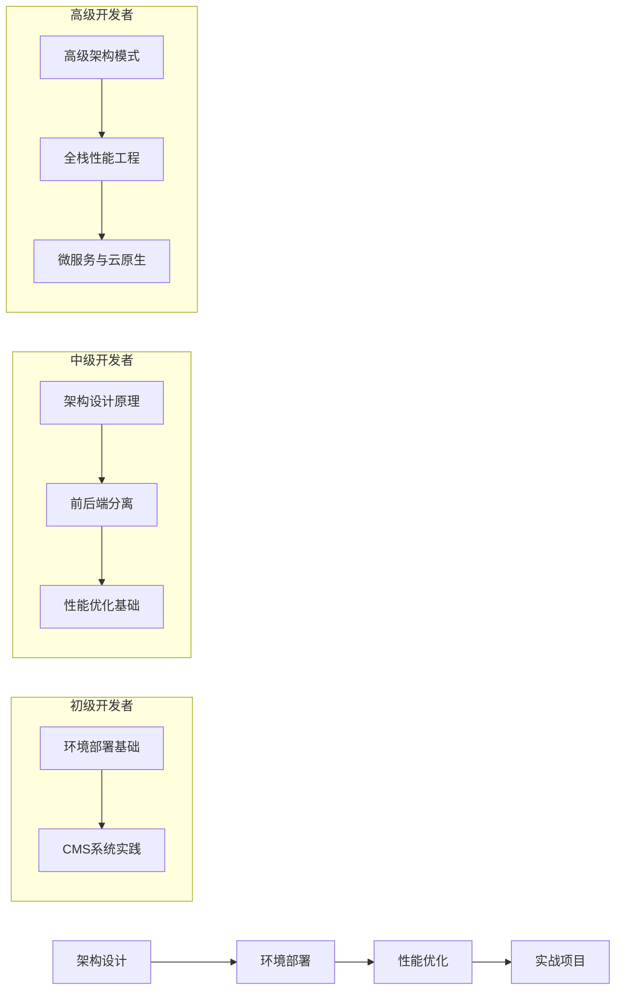

# Web开发知识库概述

本知识库系统化整理了Web开发全链路技术体系，涵盖架构设计、环境部署、性能优化等核心领域，适用于不同阶段的开发者学习参考。

## 知识体系目录

### 1. 架构设计原理
- [Web应用架构设计原则](./01-Web应用架构设计原则.md)  
  讲解SOLID原则、分层架构、技术选型等核心设计方法论，帮助开发者构建可维护、可扩展的应用架构。

### 2. 架构模式解析
- [前后端分离架构分析](./02-前后端分离架构分析.md)  
  详解RESTful规范、接口设计、Mock服务等分离架构实践，指导开发者实现高效的前后端协作开发模式。

### 3. 性能工程体系
- [Web应用性能影响因素](./03-Web应用性能影响因素.md)  
  分析服务器、网络、数据库等全栈性能关键点，帮助开发者识别性能瓶颈。  
- [Web应用性能优化策略](./10-Web应用性能优化策略.md)  
  提供前端到数据库的完整优化方案，包括缓存策略、代码优化、资源压缩等实用技术。

### 4. 环境部署指南
- [LAMP环境搭建与配置](./04-LAMP环境搭建与配置.md)  
  传统PHP环境的完整部署手册，包括Linux、Apache、MySQL和PHP的安装与配置。  
- [LNMP环境部署与优化](./05-LNMP环境部署与优化.md)  
  高性能Nginx+PHP环境的配置详解，适用于高并发Web应用的生产环境部署。  
- [Java应用服务部署流程](./08-Java应用服务部署流程.md)  
  Tomcat/WildFly等Java应用的部署规范，包括JVM调优、WAR包部署等专业指南。  
- [Node.js应用部署与管理](./09-Node.js应用部署与管理.md)  
  PM2集群管理、Nginx反向代理等Node.js方案，确保JavaScript应用的稳定运行。

### 5. CMS系统实践
- [WordPress网站完整部署](./06-WordPress网站完整部署.md)  
  从安装到安全加固的WordPress生产级部署，包括插件优化、缓存配置等最佳实践。  
- [Discuz论坛搭建与配置](./07-Discuz论坛搭建与配置.md)  
  中文论坛系统的专项部署指南，涵盖数据库优化、防spam策略等运维要点。

### 6. 综合实战项目
- [从零构建高性能Web应用](./11-从零构建高性能Web应用.md)  
  基于React+Node.js的完整项目实战手册，从需求分析到上线部署的全流程实践。

## 学习路径建议

根据开发者的不同阶段，我们推荐以下学习路径：

## 文档特色

所有知识库文档均提供：

- **多操作系统兼容方案**：涵盖Windows、Linux和macOS的操作指南
- **生产级配置示例**：直接可用于实际项目的配置文件和参数
- **性能与安全最佳实践**：基于行业标准的优化和防护措施
- **配套的可运行代码片段**：便于读者实践和验证的示例代码
- **故障排查指南**：常见问题的诊断和解决方案
- **扩展阅读资源**：进阶学习的推荐材料和工具

## 更新计划

本知识库将定期更新以反映Web技术的最新发展：

- 每季度更新现有文档中的技术细节和最佳实践
- 每半年增加新的专题内容，如云原生部署、容器化应用等
- 根据读者反馈持续优化内容结构和深度

通过系统学习本知识库，开发者将能够掌握从架构设计到性能优化的全栈Web开发技能，为构建高质量的Web应用奠定坚实基础。