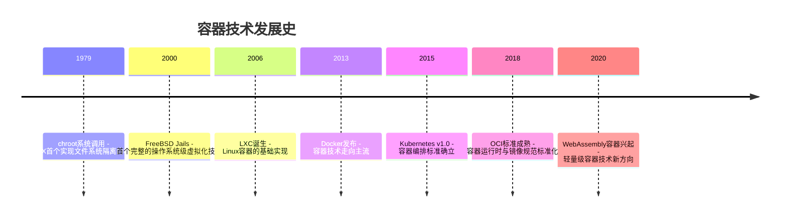
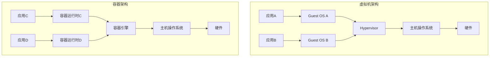
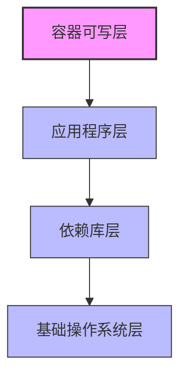
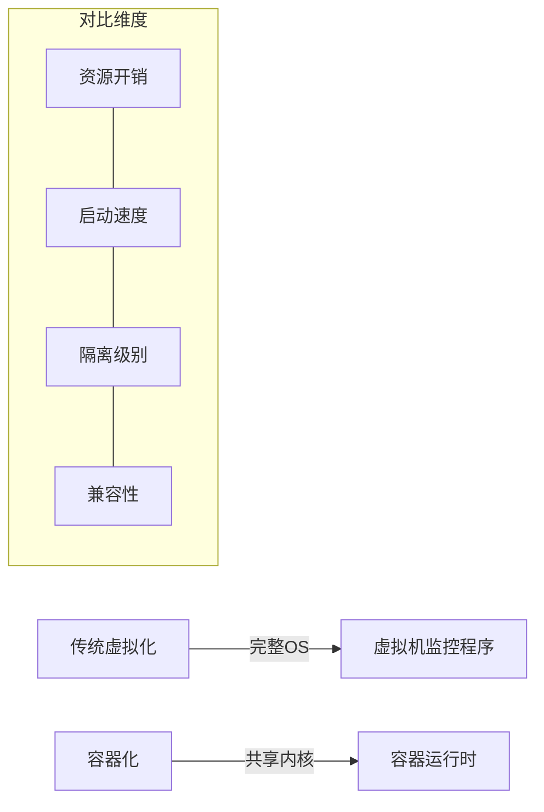
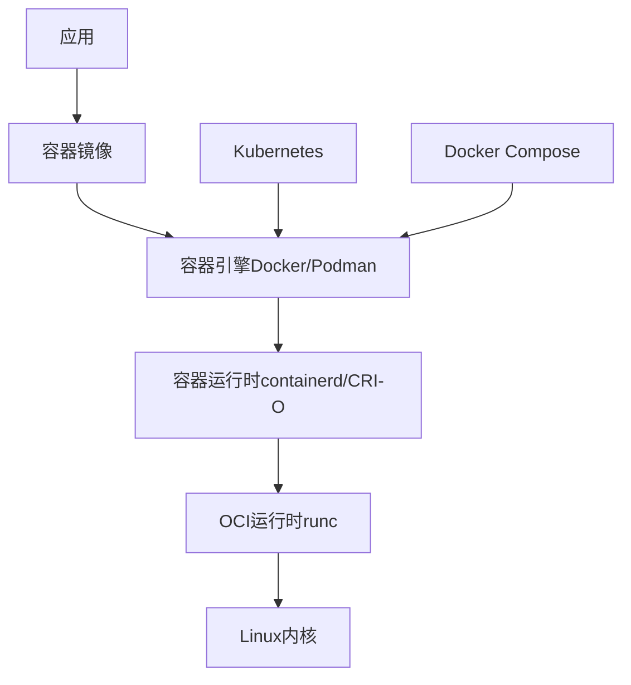
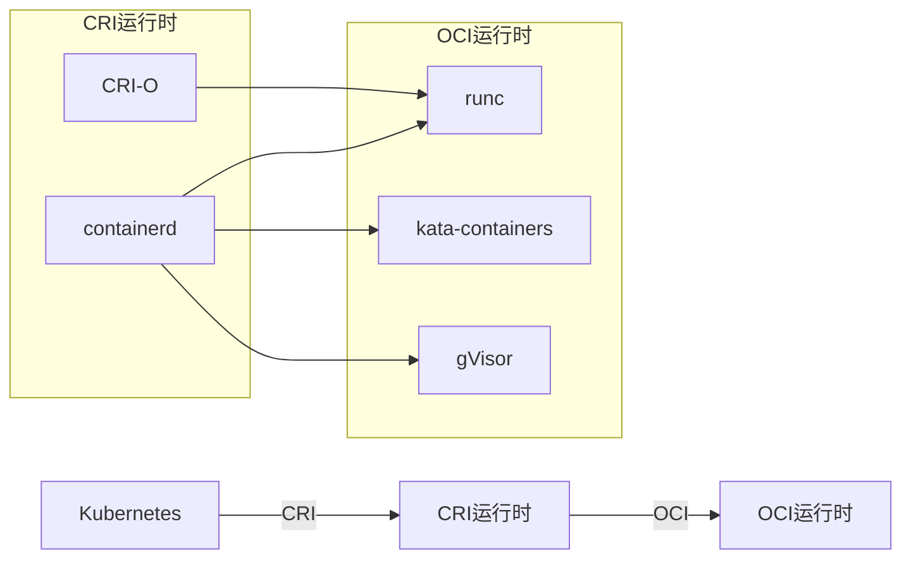
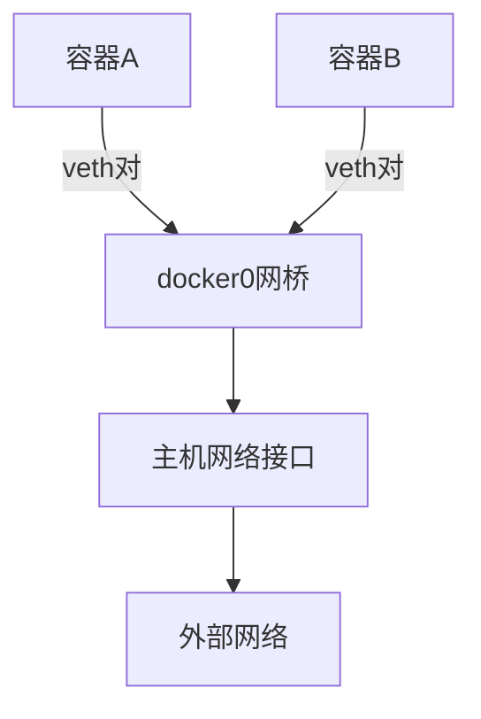
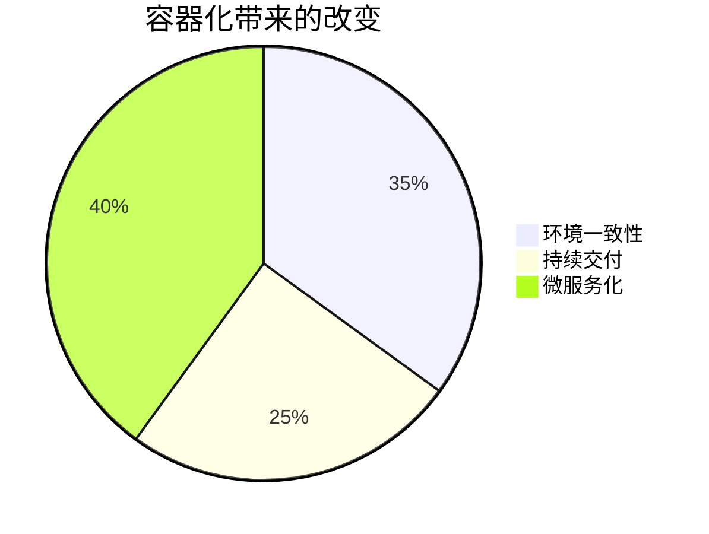
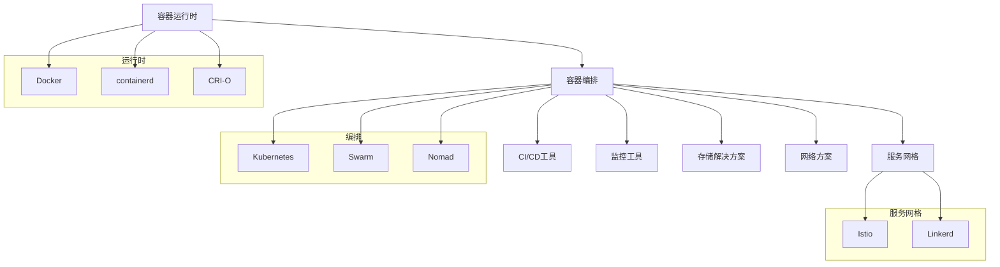

# 容器技术原理与发展历程  

容器技术作为现代云原生应用的基础设施，已经深刻改变了软件开发、测试和部署的方式。本文将从技术演进、核心原理到未来趋势，全面解析容器技术的发展历程与工作机制。

## 1. 技术演进路线  

容器技术并非一蹴而就，而是经历了数十年的技术积累与演进。

### 1.1 发展里程碑  


### 1.2 关键技术突破  
| 技术         | 贡献                           | 代表项目       | 实现原理 |
|--------------|-------------------------------|--------------|---------|
| 命名空间(Namespace) | 实现进程隔离                   | Linux Kernel | 为进程提供独立的系统资源视图 |
| Cgroups      | 资源限制与统计                 | Google Borg  | 限制、记录和隔离进程组的资源使用 |
| 联合文件系统(UnionFS) | 镜像分层存储                   | Docker       | 将多个目录层叠挂载到同一挂载点 |
| 容器运行时   | 标准化容器执行环境             | containerd, CRI-O | 管理容器生命周期 |
| 镜像规范     | 定义可移植容器格式             | OCI Image Spec | 确保容器镜像跨平台兼容 |

### 1.3 从虚拟机到容器的演进

传统虚拟化技术通过虚拟机监控程序(Hypervisor)模拟完整硬件环境，每个虚拟机运行独立的操作系统内核。而容器技术则共享主机操作系统内核，仅隔离应用程序的运行环境，大幅降低了资源开销。



## 2. 核心原理剖析  

容器技术的核心在于利用Linux内核特性实现轻量级的隔离环境。

### 2.1 命名空间隔离机制  

Linux命名空间(Namespace)是容器隔离的基础，它将全局系统资源包装在一个抽象中，使命名空间内的进程看到的是自己的隔离资源实例。

Linux提供了7种类型的命名空间：

1. **PID命名空间**：进程ID隔离
2. **NET命名空间**：网络设备、协议栈隔离
3. **IPC命名空间**：进程间通信资源隔离
4. **MNT命名空间**：挂载点隔离
5. **UTS命名空间**：主机名和域名隔离
6. **USER命名空间**：用户和组ID隔离
7. **Cgroup命名空间**：Cgroup根目录视图隔离

```c:c:\project\kphub\src\kernel\namespace.c
// 创建一个新的命名空间并在其中运行程序
#define _GNU_SOURCE
#include <sched.h>
#include <stdio.h>
#include <stdlib.h>
#include <unistd.h>
#include <sys/wait.h>

// 子进程的栈空间
#define STACK_SIZE (1024 * 1024)
static char child_stack[STACK_SIZE];

static int child_func(void* arg) {
    printf("子进程PID: %ld\n", (long)getpid());
    printf("子进程PPID: %ld\n", (long)getppid());
    
    // 在新命名空间中执行shell
    execl("/bin/bash", "/bin/bash", NULL);
    return 0;
}

int main() {
    printf("父进程PID: %ld\n", (long)getpid());
    
    // 创建新的PID、UTS、IPC、NET和MNT命名空间
    int flags = CLONE_NEWPID | CLONE_NEWUTS | CLONE_NEWIPC | 
                CLONE_NEWNET | CLONE_NEWNS;
    
    // 克隆子进程到新的命名空间
    pid_t child_pid = clone(child_func, child_stack + STACK_SIZE, 
                           flags | SIGCHLD, NULL);
    
    if (child_pid == -1) {
        perror("clone失败");
        exit(EXIT_FAILURE);
    }
    
    // 等待子进程结束
    waitpid(child_pid, NULL, 0);
    return 0;
}
```

### 2.2 Cgroups资源控制  

控制组(Control Groups, Cgroups)是Linux内核的一个特性，用于限制、记录和隔离进程组的资源使用（CPU、内存、磁盘I/O等）。

Cgroups提供了以下功能：

- **资源限制**：限制进程组可以使用的资源数量
- **优先级**：控制进程组获取资源的优先级
- **资源统计**：监控进程组使用的资源
- **进程控制**：控制进程组的生命周期

```bash
# 创建一个新的cgroup
mkdir -p /sys/fs/cgroup/cpu/container1

# 限制CPU使用率为50%（单核心情况下）
echo 50000 > /sys/fs/cgroup/cpu/container1/cpu.cfs_quota_us
echo 100000 > /sys/fs/cgroup/cpu/container1/cpu.cfs_period_us

# 限制内存使用为512MB
echo 536870912 > /sys/fs/cgroup/memory/container1/memory.limit_in_bytes

# 将进程添加到cgroup
echo $PID > /sys/fs/cgroup/cpu/container1/cgroup.procs
echo $PID > /sys/fs/cgroup/memory/container1/cgroup.procs
```

使用`cgcreate`和`cgexec`工具可以更方便地管理cgroups：

```bash
# 创建CPU和内存限制组
cgcreate -g cpu,memory:/container1

# 设置CPU使用限额(50%)和内存限制(512MB)
cgset -r cpu.cfs_quota_us=50000 container1
cgset -r cpu.cfs_period_us=100000 container1
cgset -r memory.limit_in_bytes=536870912 container1

# 在cgroup中运行命令
cgexec -g cpu,memory:/container1 stress --cpu 1 --timeout 60s
```

### 2.3 联合文件系统与镜像分层  

联合文件系统(Union Filesystem)是容器镜像技术的核心，它允许将多个目录层叠挂载到同一个挂载点，形成一个统一的视图。Docker常用的联合文件系统包括OverlayFS、AUFS等。

镜像分层存储的工作原理：

1. **基础层**：通常是一个精简的操作系统
2. **中间层**：添加应用程序依赖
3. **应用层**：包含实际应用程序
4. **容器层**：可写层，存储容器运行时的变更



OverlayFS的工作原理示例：

```bash
# 创建目录结构
mkdir -p /tmp/overlay/{lower1,lower2,upper,work,merged}

# 在lower层添加只读文件
echo "来自lower1的文件" > /tmp/overlay/lower1/file1.txt
echo "来自lower2的文件" > /tmp/overlay/lower2/file2.txt

# 挂载overlay文件系统
mount -t overlay overlay \
  -o lowerdir=/tmp/overlay/lower1:/tmp/overlay/lower2,\
upperdir=/tmp/overlay/upper,\
workdir=/tmp/overlay/work \
  /tmp/overlay/merged

# 在merged目录中可以看到所有层的文件
ls -la /tmp/overlay/merged

# 修改merged中的文件会反映到upper层
echo "修改后的内容" > /tmp/overlay/merged/file1.txt
cat /tmp/overlay/upper/file1.txt  # 显示"修改后的内容"
cat /tmp/overlay/lower1/file1.txt  # 仍然显示原始内容
```

## 3. 架构演进对比  

### 3.1 传统虚拟化 vs 容器化  

传统虚拟化和容器化技术在资源利用、启动速度和隔离级别上有显著差异：



| 特性 | 传统虚拟化 | 容器化 | 说明 |
|------|------------|--------|------|
| 资源开销 | 高 | 低 | 容器不需要运行完整的OS |
| 启动速度 | 分钟级 | 秒级 | 容器无需引导操作系统 |
| 隔离级别 | 完全隔离 | 进程级隔离 | 虚拟机提供更强的安全隔离 |
| 兼容性 | 可运行任何OS | 依赖主机内核 | 容器需要与主机内核兼容 |
| 密度 | 低 | 高 | 单机可运行的实例数量 |

### 3.2 现代容器架构  

现代容器架构已经发展为一个分层的体系结构，从底层运行时到上层编排平台形成完整生态：



容器运行时的核心组件：

```go:c:\project\kphub\src\runtime\container.go
package runtime

import (
    "fmt"
    "os"
    "syscall"
)

// 容器配置结构
type Container struct {
    ID          string            // 容器唯一标识
    Namespace   []string          // PID,NET,IPC等命名空间
    Cgroups     ResourceLimit     // CPU,Memory限制
    RootFS      string            // 联合挂载点
    Mounts      []Mount           // 额外挂载点
    Env         map[string]string // 环境变量
    Entrypoint  []string          // 入口命令
    NetworkMode string            // 网络模式
}

// 资源限制结构
type ResourceLimit struct {
    CPUShares   int64  // CPU份额
    CPUQuota    int64  // CPU配额
    CPUPeriod   int64  // CPU周期
    MemoryLimit int64  // 内存限制(字节)
    PidsLimit   int64  // 进程数限制
}

// 挂载点结构
type Mount struct {
    Source      string // 源路径
    Destination string // 目标路径
    Type        string // 挂载类型
    Options     string // 挂载选项
}

// 创建容器
func CreateContainer(config *Container) error {
    fmt.Printf("创建容器: %s\n", config.ID)
    fmt.Printf("命名空间: %v\n", config.Namespace)
    fmt.Printf("资源限制: CPU份额=%d, 内存限制=%d字节\n", 
               config.Cgroups.CPUShares, config.Cgroups.MemoryLimit)
    fmt.Printf("根文件系统: %s\n", config.RootFS)
    
    // 实际实现会调用clone()创建新进程并设置命名空间
    // 设置cgroups限制资源使用
    // 准备rootfs和挂载点
    // 执行entrypoint命令
    
    return nil
}
```

## 4. 关键技术组件  

### 4.1 容器运行时接口(CRI)  

容器运行时接口(Container Runtime Interface, CRI)是Kubernetes定义的一套标准API，用于与容器运行时通信。它使Kubernetes能够支持多种容器运行时，如containerd、CRI-O等。

```yaml:c:\project\kphub\config\cri\containerd.yaml
version: 2
# containerd配置示例
root = "/var/lib/containerd"
state = "/run/containerd"

[grpc]
  address = "/run/containerd/containerd.sock"
  max_recv_message_size = 16777216
  max_send_message_size = 16777216

[plugins]
  [plugins."io.containerd.grpc.v1.cri"]
    sandbox_image = "k8s.gcr.io/pause:3.5"
    [plugins."io.containerd.grpc.v1.cri".containerd]
      default_runtime_name = "runc"
      [plugins."io.containerd.grpc.v1.cri".containerd.runtimes.runc]
        runtime_type = "io.containerd.runc.v2"
        [plugins."io.containerd.grpc.v1.cri".containerd.runtimes.runc.options]
          NoPivotRoot = false
          NoNewKeyring = false
          SystemdCgroup = true
    
    # 镜像拉取配置
    [plugins."io.containerd.grpc.v1.cri".registry]
      [plugins."io.containerd.grpc.v1.cri".registry.mirrors]
        [plugins."io.containerd.grpc.v1.cri".registry.mirrors."docker.io"]
          endpoint = ["https://registry-1.docker.io"]
```

CRI架构示意图：



### 4.2 镜像构建规范  

容器镜像是容器的静态视图，包含了应用程序及其依赖。OCI(Open Container Initiative)镜像规范定义了容器镜像的标准格式。

Dockerfile是最常用的镜像定义文件，它描述了如何构建容器镜像：

```dockerfile:c:\project\kphub\images\base.dockerfile
# 多阶段构建示例
# 构建阶段
FROM golang:1.17 AS builder
WORKDIR /app
COPY go.mod go.sum ./
RUN go mod download
COPY . .
RUN CGO_ENABLED=0 GOOS=linux go build -a -installsuffix cgo -o myapp .

# 最终镜像
FROM scratch
# 从构建阶段复制二进制文件
COPY --from=builder /app/myapp /myapp
# 添加CA证书以支持HTTPS
COPY --from=builder /etc/ssl/certs/ca-certificates.crt /etc/ssl/certs/
# 设置非root用户
USER 1000
# 暴露应用端口
EXPOSE 8080
# 定义入口点
ENTRYPOINT ["/myapp"]
```

镜像分层结构示例：

```bash
# 查看镜像层
docker history nginx:latest

# 输出示例
IMAGE          CREATED       CREATED BY                                      SIZE      COMMENT
f8f4ffc8092c   2 weeks ago   /bin/sh -c #(nop)  CMD ["nginx" "-g" "daemon…   0B        
<missing>      2 weeks ago   /bin/sh -c #(nop)  STOPSIGNAL SIGQUIT           0B        
<missing>      2 weeks ago   /bin/sh -c #(nop)  EXPOSE 80                    0B        
<missing>      2 weeks ago   /bin/sh -c #(nop)  ENTRYPOINT ["/docker-entr…   0B        
<missing>      2 weeks ago   /bin/sh -c #(nop) COPY file:09a214a3e07c919a…   4.61kB    
<missing>      2 weeks ago   /bin/sh -c #(nop) COPY file:0fd5fca330dcd6a7…   1.04kB    
<missing>      2 weeks ago   /bin/sh -c #(nop) COPY file:0b866ff3fc1ef5b0…   1.96kB    
<missing>      2 weeks ago   /bin/sh -c #(nop) COPY file:65504f71f5855ca0…   1.2kB     
<missing>      2 weeks ago   /bin/sh -c set -x     && addgroup --system -…   63.9MB    
<missing>      2 weeks ago   /bin/sh -c #(nop)  ENV PKG_RELEASE=1~bullseye   0B        
<missing>      2 weeks ago   /bin/sh -c #(nop)  ENV NJS_VERSION=0.7.9        0B        
<missing>      2 weeks ago   /bin/sh -c #(nop)  ENV NGINX_VERSION=1.23.3     0B        
<missing>      2 weeks ago   /bin/sh -c #(nop)  LABEL maintainer=NGINX Do…   0B        
<missing>      2 weeks ago   /bin/sh -c #(nop)  CMD ["bash"]                 0B        
<missing>      2 weeks ago   /bin/sh -c #(nop) ADD file:9a4f77dfaba7fd2aa…   80.5MB
```

### 4.3 容器网络模型

容器网络是容器技术的关键组成部分，提供了容器间通信和对外服务的能力。

常见的容器网络模型：

1. **Bridge网络**：默认模式，容器通过虚拟网桥连接
2. **Host网络**：容器共享主机网络命名空间
3. **Overlay网络**：跨主机容器通信
4. **Macvlan网络**：容器拥有独立MAC地址
5. **CNI网络**：容器网络接口标准，用于Kubernetes等平台

Docker Bridge网络工作原理：



容器网络配置示例：

```bash
# 创建自定义网桥
docker network create --driver bridge --subnet=172.18.0.0/16 mynetwork

# 在自定义网络中启动容器
docker run --network=mynetwork --ip=172.18.0.10 -d nginx

# 查看网络详情
docker network inspect mynetwork
```

## 5. 行业影响分析  

容器技术已经深刻改变了软件开发和部署方式，带来了多方面的行业变革。

### 5.1 开发流程变革  

容器化技术对软件开发生命周期的影响：



| 变革点 | 传统方式 | 容器化方式 | 优势 |
|--------|----------|------------|------|
| 环境一致性 | "在我机器上能运行" | "一次构建，到处运行" | 消除环境差异导致的问题 |
| 开发测试 | 环境搭建复杂 | 一键启动开发环境 | 提高开发效率 |
| 交付部署 | 手动部署，容易出错 | 自动化CI/CD流水线 | 加速交付，提高质量 |
| 应用架构 | 单体应用 | 微服务架构 | 提高可维护性和扩展性 |
| 资源利用 | 资源浪费 | 高密度部署 | 降低基础设施成本 |

DevOps流程中的容器应用：


### 5.2 技术生态图谱  

容器技术已经形成了丰富的生态系统：

- **编排调度**
  - Kubernetes：容器编排的事实标准
  - Docker Swarm：Docker原生编排工具
  - Amazon ECS：AWS容器服务
  - Azure AKS/Google GKE：托管Kubernetes服务

- **安全加固**
  - gVisor：Google开发的应用内核，提供额外安全层
  - Kata Containers：结合VM安全性和容器轻量级的混合运行时
  - Seccomp：限制容器可用的系统调用
  - AppArmor/SELinux：强制访问控制

- **网络方案**
  - Calico：基于BGP的网络方案，支持网络策略
  - Flannel：简单的覆盖网络
  - Cilium：基于eBPF的网络和安全方案
  - Istio：服务网格，提供流量管理、安全和可观测性

- **存储解决方案**
  - Ceph：分布式存储系统
  - Longhorn：Kubernetes原生分布式块存储
  - Rook：云原生存储编排
  - OpenEBS：容器化存储

容器生态系统关系图：



## 6. 未来发展趋势  

容器技术仍在快速发展，多个新兴方向正在改变容器的未来。

### 6.1 新兴技术方向  

```text
1. WebAssembly容器
   - 更轻量级的沙箱执行环境
   - 比传统容器启动更快、资源占用更少
   - 跨平台兼容性更好

2. 无服务器容器(Serverless Containers)
   - 按需自动扩缩容
   - 零闲置成本
   - AWS Fargate, Azure Container Instances, Google Cloud Run

3. 机密计算容器(Confidential Containers)
   - 硬件级加密保护
   - 防止主机管理员访问容器数据
   - 适用于多租户环境和敏感数据处理

4. eBPF增强容器
   - 内核级可编程性
   - 高性能网络和安全策略
   - 细粒度可观测性
```

WebAssembly与传统容器对比：

| 特性 | 传统容器 | WebAssembly容器 |
|------|----------|----------------|
| 启动时间 | 毫秒级 | 微秒级 |
| 内存占用 | MB级 | KB级 |
| 安全隔离 | 进程级 | 更强的沙箱隔离 |
| 兼容性 | 依赖主机内核 | 跨平台一致 |
| 生态成熟度 | 成熟 | 发展中 |

### 6.2 性能优化前沿  

容器性能优化的新技术：

1. **eBPF技术**：Linux内核的革命性技术，允许在内核中安全地运行沙箱程序

```bash
# 使用eBPF监控容器系统调用
bpftrace -e 'tracepoint:syscalls:sys_enter_openat { 
    printf("%s(%d) 打开文件: %s\n", comm, pid, str(args->filename)); 
}'

# 使用BCC工具监控容器网络性能
/usr/share/bcc/tools/tcpconnect -n container_name

# 使用Cilium进行eBPF网络策略
kubectl apply -f - <<EOF
apiVersion: "cilium.io/v2"
kind: CiliumNetworkPolicy
metadata:
  name: "secure-app"
spec:
  endpointSelector:
    matchLabels:
      app: secure-app
  ingress:
  - fromEndpoints:
    - matchLabels:
        app: frontend
    toPorts:
    - ports:
      - port: "8080"
        protocol: TCP
EOF
```

2. **内核旁路技术**：DPDK、XDP等技术绕过内核网络栈，提高网络性能

```bash
# 使用XDP加速容器网络
ip link set dev eth0 xdp obj xdp_prog.o sec xdp_drop

# 查看XDP程序状态
ip link show dev eth0
```

3. **资源隔离优化**：CPU固定、NUMA亲和性等技术提高容器性能

```bash
# 将容器固定到特定CPU核心
docker run --cpuset-cpus="0,1" nginx

# 设置NUMA亲和性
docker run --cpuset-mems="0" nginx
```

## 7. 实践案例与最佳实践

### 7.1 容器安全最佳实践

保障容器安全的关键措施：

1. **最小特权原则**
   ```dockerfile
   # 使用非root用户运行容器
   FROM node:14-alpine
   RUN addgroup -g 1000 appuser && \
       adduser -u 1000 -G appuser -s /bin/sh -
继续完成容器技术原理与发展历程的内容：

```dockerfile:c:\project\kphub\images\secure.dockerfile
# 使用非root用户运行容器
FROM node:14-alpine
RUN addgroup -g 1000 appuser && \
    adduser -u 1000 -G appuser -s /bin/sh -D appuser
    
# 设置工作目录并更改所有权
WORKDIR /app
COPY --chown=appuser:appuser . .
RUN npm ci --production

# 使用非特权用户运行应用
USER appuser

# 定义健康检查
HEALTHCHECK --interval=30s --timeout=3s \
  CMD wget -q --spider http://localhost:3000/health || exit 1

EXPOSE 3000
CMD ["node", "server.js"]
```

2. **镜像安全扫描**
```bash
# 使用Trivy扫描容器镜像漏洞
trivy image nginx:latest

# 使用Docker Bench进行安全检查
docker run --rm -it \
  --net host --pid host --userns host --cap-add audit_control \
  -v /var/lib:/var/lib \
  -v /var/run/docker.sock:/var/run/docker.sock \
  -v /etc:/etc \
  docker/docker-bench-security
```

3. **运行时安全控制**
```yaml:c:\project\kphub\config\security\seccomp-profile.json
{
  "defaultAction": "SCMP_ACT_ERRNO",
  "architectures": ["SCMP_ARCH_X86_64"],
  "syscalls": [
    {
      "names": [
        "accept", "access", "arch_prctl", "brk", "capget",
        "capset", "chdir", "chmod", "chown", "close", "connect",
        "dup", "dup2", "epoll_create", "epoll_ctl", "epoll_wait",
        "execve", "exit_group", "faccessat", "fchdir", "fchmod",
        "fchown", "fcntl", "fstat", "fstatfs", "futex", "getcwd",
        "getdents", "getdents64", "geteuid", "getgid", "getpid", "getppid",
        "getuid", "ioctl", "listen", "lseek", "mkdir", "mmap", "mount",
        "mprotect", "munmap", "nanosleep", "open", "openat", "pipe",
        "prctl", "read", "readlink", "rt_sigaction", "rt_sigprocmask",
        "rt_sigreturn", "select", "sendto", "set_robust_list",
        "set_tid_address", "setgid", "setgroups", "setuid", "stat",
        "statfs", "sysinfo", "umask", "uname", "unlink", "unshare",
        "wait4", "write"
      ],
      "action": "SCMP_ACT_ALLOW"
    }
  ]
}
```

### 7.2 容器化应用最佳实践

1. **构建优化的容器镜像**
   - 使用多阶段构建减小镜像大小
   - 合并RUN指令减少层数
   - 使用.dockerignore排除不必要文件

2. **应用设计原则**
   - 单一职责：每个容器只运行一个进程
   - 无状态设计：将状态存储在外部服务
   - 配置外部化：使用环境变量或配置文件
   - 正确处理信号：应用能够优雅关闭

3. **资源管理最佳实践**
```yaml:c:\project\kphub\config\kubernetes\deployment.yaml
apiVersion: apps/v1
kind: Deployment
metadata:
  name: web-app
spec:
  replicas: 3
  selector:
    matchLabels:
      app: web-app
  template:
    metadata:
      labels:
        app: web-app
    spec:
      containers:
      - name: web-app
        image: my-web-app:1.0.0
        ports:
        - containerPort: 8080
        resources:
          requests:
            memory: "128Mi"
            cpu: "100m"
          limits:
            memory: "256Mi"
            cpu: "500m"
        livenessProbe:
          httpGet:
            path: /health
            port: 8080
          initialDelaySeconds: 30
          periodSeconds: 10
        readinessProbe:
          httpGet:
            path: /ready
            port: 8080
          initialDelaySeconds: 5
          periodSeconds: 5
        securityContext:
          runAsNonRoot: true
          runAsUser: 1000
          allowPrivilegeEscalation: false
          capabilities:
            drop:
            - ALL
```

### 7.3 容器监控与可观测性

现代容器环境需要全面的监控和可观测性解决方案：

1. **Prometheus + Grafana监控方案**
```yaml:c:\project\kphub\config\monitoring\prometheus.yaml
global:
  scrape_interval: 15s

scrape_configs:
  - job_name: 'kubernetes-pods'
    kubernetes_sd_configs:
    - role: pod
    relabel_configs:
    - source_labels: [__meta_kubernetes_pod_annotation_prometheus_io_scrape]
      action: keep
      regex: true
    - source_labels: [__meta_kubernetes_pod_annotation_prometheus_io_path]
      action: replace
      target_label: __metrics_path__
      regex: (.+)
    - source_labels: [__address__, __meta_kubernetes_pod_annotation_prometheus_io_port]
      action: replace
      regex: ([^:]+)(?::\d+)?;(\d+)
      replacement: $1:$2
      target_label: __address__
```

2. **使用eBPF进行深度监控**
```c:c:\project\kphub\src\monitoring\container_monitor.c
#include <linux/bpf.h>
#include <linux/ptrace.h>
#include <bpf/bpf_helpers.h>

struct event {
    u32 pid;
    u64 timestamp;
    char comm[16];
    char filename[256];
};

struct {
    __uint(type, BPF_MAP_TYPE_PERF_EVENT_ARRAY);
    __uint(key_size, sizeof(int));
    __uint(value_size, sizeof(int));
    __uint(max_entries, 1024);
} events SEC(".maps");

SEC("tracepoint/syscalls/sys_enter_openat")
int trace_openat(struct trace_event_raw_sys_enter *ctx)
{
    struct event event = {};
    
    // 获取进程ID和名称
    event.pid = bpf_get_current_pid_tgid() >> 32;
    bpf_get_current_comm(&event.comm, sizeof(event.comm));
    
    // 获取文件名
    bpf_probe_read_user(&event.filename, sizeof(event.filename), 
                        (void *)ctx->args[1]);
    
    // 获取时间戳
    event.timestamp = bpf_ktime_get_ns();
    
    // 发送事件到用户空间
    bpf_perf_event_output(ctx, &events, BPF_F_CURRENT_CPU, 
                          &event, sizeof(event));
    
    return 0;
}

char LICENSE[] SEC("license") = "GPL";
```

## 8. 总结

容器技术已经从简单的进程隔离工具发展为现代云原生应用的基础设施。通过深入理解容器的核心原理和技术组件，开发者和运维人员可以更有效地利用容器技术构建可靠、安全、高效的应用系统。

容器技术的关键价值：

1. **标准化交付**：解决了"在我机器上能运行"的问题
2. **资源效率**：比虚拟机更轻量，提高了资源利用率
3. **开发效率**：简化了环境配置，加速了开发周期
4. **部署一致性**：确保开发、测试和生产环境的一致
5. **微服务支持**：为微服务架构提供了理想的部署单元

随着WebAssembly容器、无服务器容器和机密计算容器等新技术的发展，容器技术将继续演进，为云原生应用提供更高效、更安全的运行环境。掌握容器技术已经成为现代软件开发人员的必备技能。