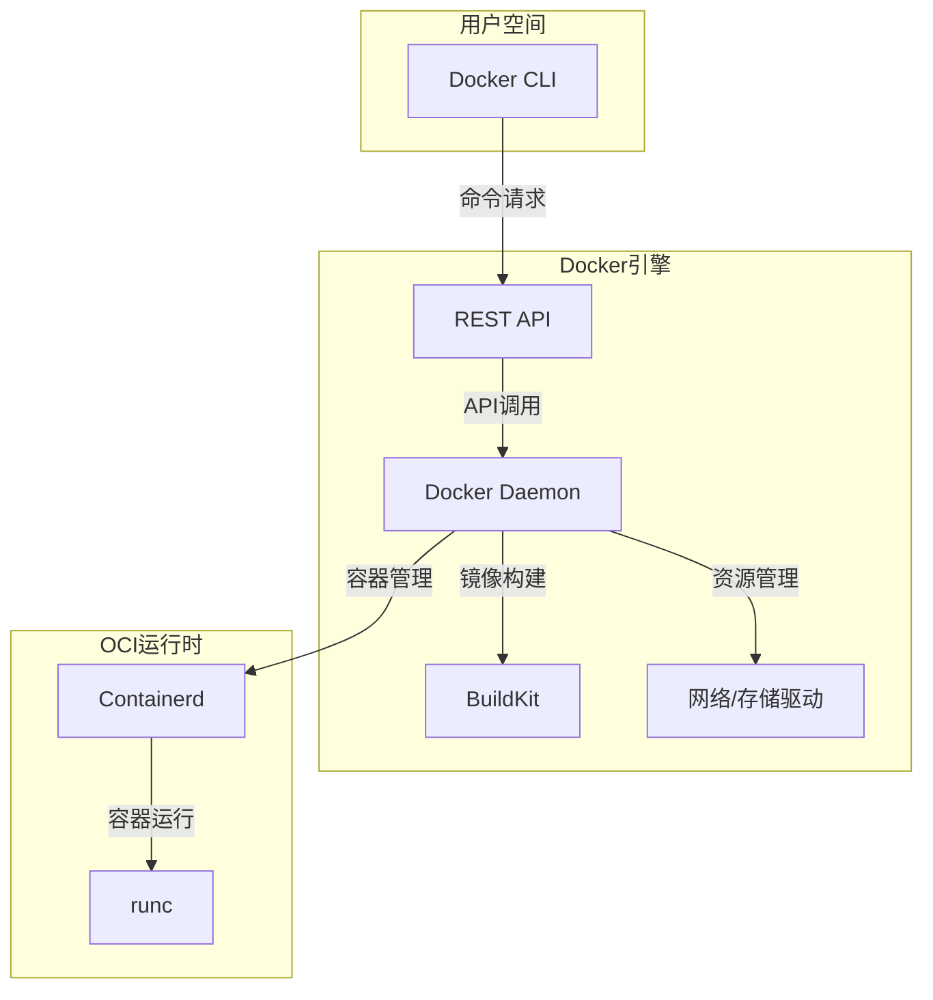
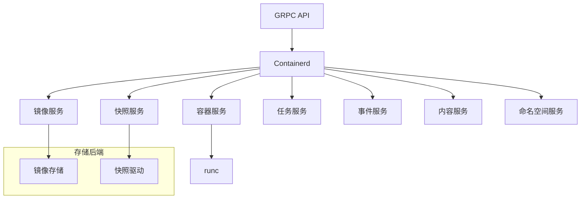
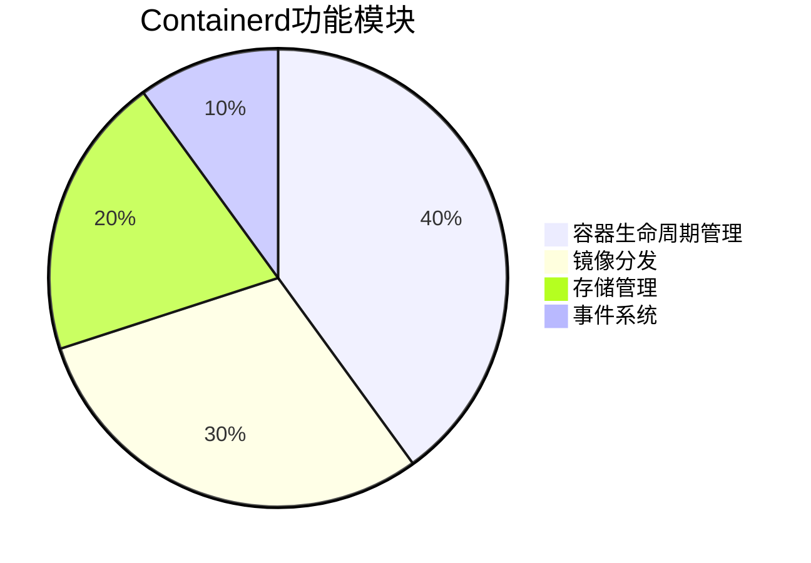
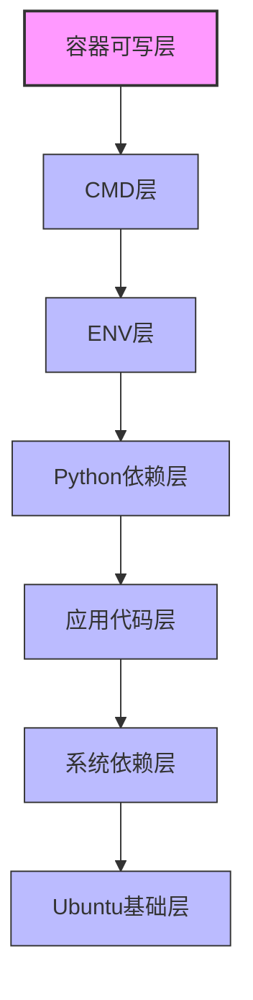
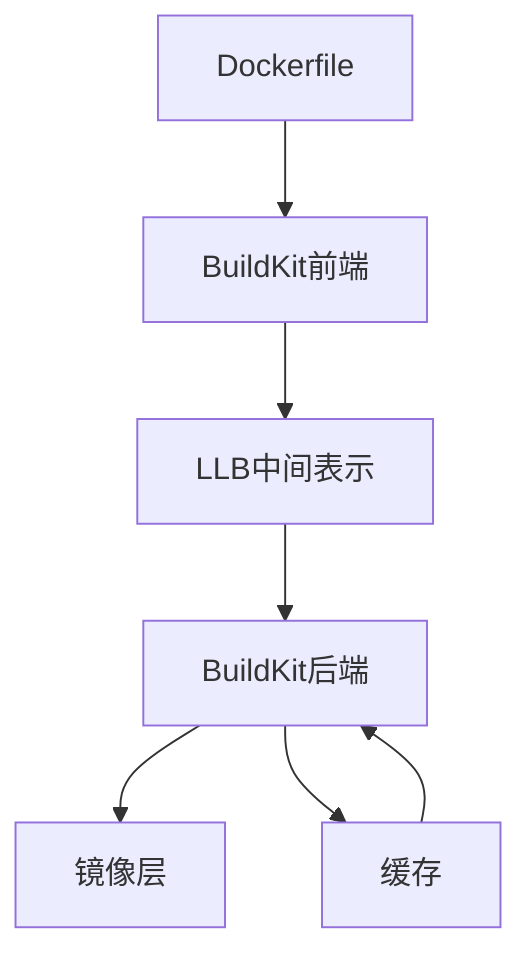
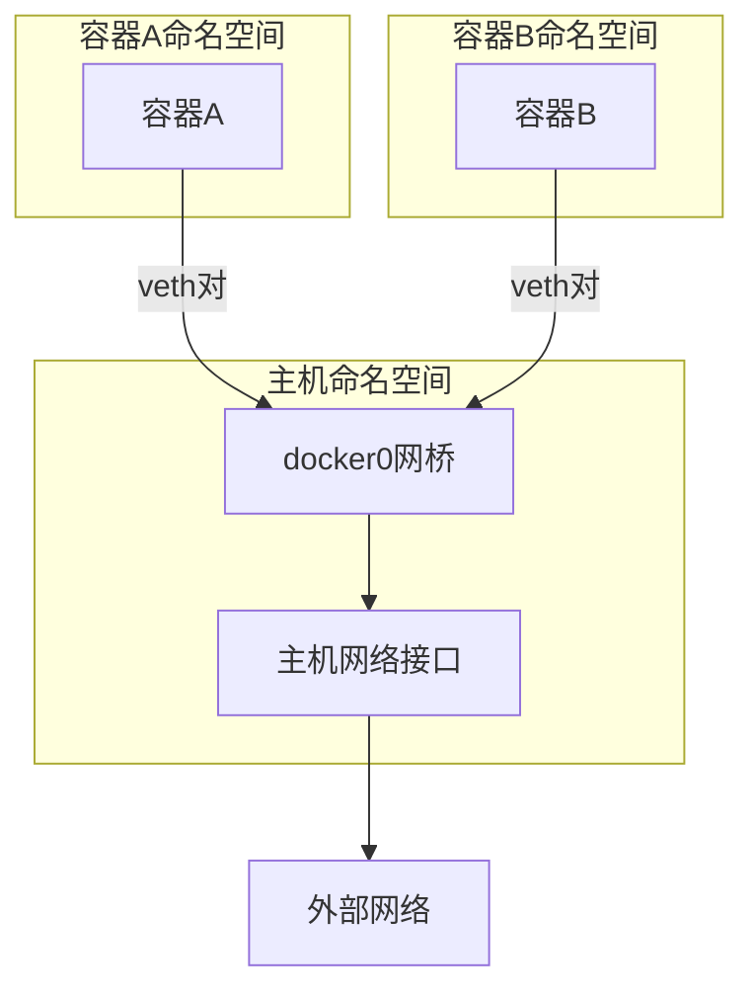
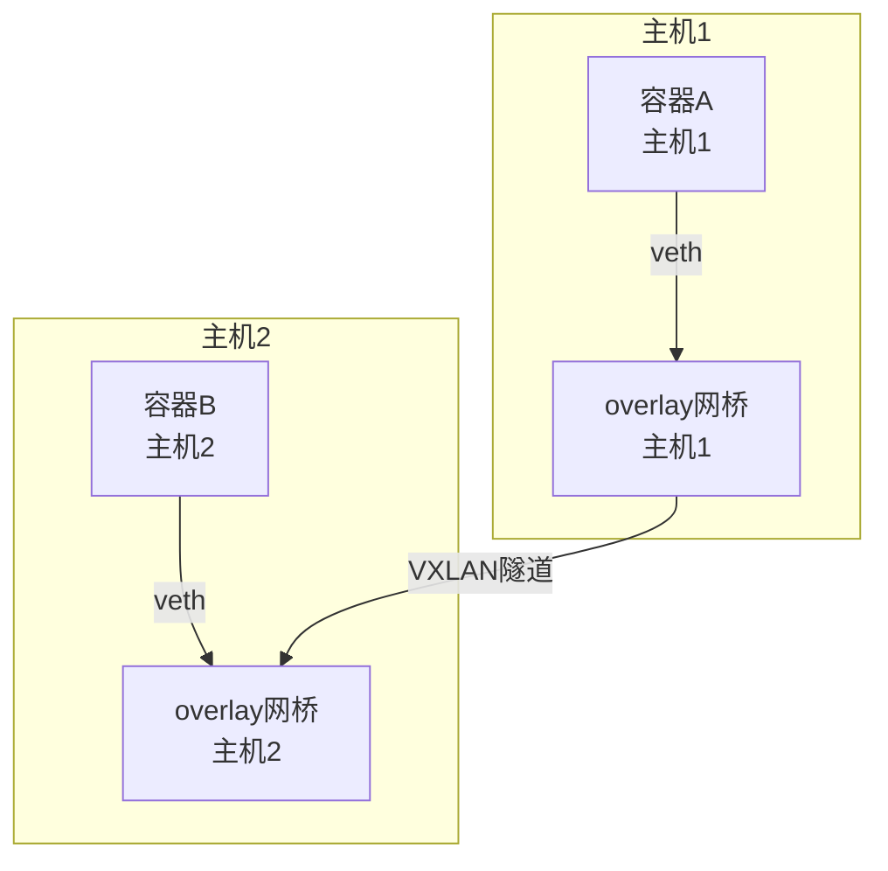

# Docker架构与核心组件  

Docker作为容器技术的代表性实现，通过一系列精心设计的组件协同工作，为用户提供了简单易用的容器化体验。本文将深入剖析Docker的架构设计与核心组件，帮助读者全面理解Docker的工作原理。

## 1. 整体架构  

Docker采用客户端-服务器(C/S)架构模式，由多个松耦合的组件构成，实现了容器的构建、运行和管理功能。

### 1.1 架构示意图  


### 1.2 组件通信流程  

Docker的各组件之间通过明确定义的接口进行通信，形成完整的命令执行链路：

```text
用户命令 → Docker CLI → REST API → Docker Daemon → containerd → runc
```

以创建并启动容器为例，完整的通信流程如下：

1. 用户在终端执行 `docker run nginx`
2. Docker CLI 解析命令并通过REST API发送请求
3. Docker Daemon接收请求并处理业务逻辑
4. Daemon调用containerd创建容器
5. containerd通过runc创建符合OCI标准的容器
6. runc配置命名空间和cgroups并启动容器进程
7. 容器启动后，控制返回给containerd
8. containerd将容器状态报告给Docker Daemon
9. Docker Daemon更新容器状态并返回结果给客户端

### 1.3 Docker架构演进

Docker架构经历了多次重要演进，逐步走向模块化和标准化：

| 版本 | 架构特点 | 主要变化 |
|------|---------|---------|
| 早期(1.x) | 单体架构 | Docker Daemon包含所有功能 |
| 中期(1.11+) | 引入containerd | 将容器运行时剥离为独立组件 |
| 现代(17.03+) | 模块化架构 | 引入BuildKit、支持OCI标准 |
| 最新(20.10+) | 完全模块化 | 组件可独立升级、替换 |

## 2. 核心组件详解  

### 2.1 Docker Daemon  

Docker Daemon是Docker的核心服务进程，负责API请求处理、容器管理、镜像构建等核心功能。

```go:c:\project\kphub\src\docker\daemon.go
// Daemon结构体定义了Docker引擎的核心组件
type Daemon struct {
    ContainerdSocket string         // 与containerd通信的socket路径
    BuildController  *build.Controller // 镜像构建控制器
    NetworkDriver    network.Driver    // 网络驱动接口
    VolumeManager    *volume.Manager   // 数据卷管理器
    ImageStore       image.Store       // 镜像存储
    EventsService    *events.Events    // 事件服务
    
    containers       container.Store   // 容器状态存储
    configStore      *config.Config    // 配置存储
    
    // 插件系统
    PluginManager    *plugin.Manager
    
    // 资源限制
    ResourceController *control.Controller
}

// 启动Docker Daemon
func (d *Daemon) Start() error {
    // 初始化各子系统
    if err := d.initNetworkController(); err != nil {
        return err
    }
    
    // 连接containerd
    if err := d.connectContainerd(); err != nil {
        return err
    }
    
    // 恢复已有容器
    if err := d.restore(); err != nil {
        return err
    }
    
    // 启动API服务器
    return d.serveAPI()
}

// 处理容器创建请求
func (d *Daemon) CreateContainer(config *container.Config) (container.Container, error) {
    // 验证配置
    if err := d.validateConfig(config); err != nil {
        return nil, err
    }
    
    // 准备容器规范
    spec, err := d.createSpec(config)
    if err != nil {
        return nil, err
    }
    
    // 调用containerd创建容器
    return d.containerdClient.CreateContainer(spec)
}
```

Docker Daemon的主要职责：

1. **API服务**：提供RESTful API接口，处理来自客户端的请求
2. **容器生命周期管理**：创建、启动、停止、删除容器
3. **镜像管理**：构建、拉取、推送、删除镜像
4. **网络管理**：创建和管理容器网络
5. **数据卷管理**：创建和管理持久化存储
6. **系统监控**：收集容器和系统资源使用情况
7. **事件分发**：处理和分发系统事件

### 2.2 Containerd架构  

Containerd是一个工业级标准的容器运行时，负责容器的生命周期管理，最初从Docker中分离出来，现已成为CNCF项目。



Containerd功能模块占比：



Containerd的核心功能：

1. **容器生命周期管理**：创建、启动、停止和删除容器
2. **镜像管理**：拉取、解压和管理容器镜像
3. **存储管理**：管理容器镜像层和容器根文件系统
4. **事件系统**：提供容器和镜像事件的订阅机制

Containerd的设计特点：

- **模块化**：采用插件架构，各功能模块可独立扩展
- **可移植性**：支持多种操作系统和架构
- **高性能**：针对生产环境优化，支持高密度容器部署
- **标准化**：实现OCI规范，确保容器格式和运行时标准兼容

### 2.3 Docker CLI

Docker命令行接口(CLI)是用户与Docker交互的主要方式，它将用户命令转换为API请求发送给Docker Daemon。

```go:c:\project\kphub\src\docker\cli\command.go
// Command结构体定义了Docker CLI命令
type Command struct {
    Name        string   // 命令名称
    Description string   // 命令描述
    Usage       string   // 使用说明
    Flags       []Flag   // 命令参数
    Action      func(*Context) error // 命令处理函数
}

// 执行docker run命令
func runCommand(ctx *Context) error {
    // 解析命令参数
    config, hostConfig, err := parseRunOptions(ctx)
    if err != nil {
        return err
    }
    
    // 创建API客户端
    client := newAPIClient(ctx)
    
    // 调用API创建并启动容器
    resp, err := client.ContainerCreate(
        context.Background(),
        config,
        hostConfig,
        nil,
        nil,
        ctx.String("name"),
    )
    if err != nil {
        return err
    }
    
    // 启动容器
    return client.ContainerStart(
        context.Background(),
        resp.ID,
        types.ContainerStartOptions{},
    )
}
```

Docker CLI的主要特点：

1. **命令分组**：按功能将命令分为容器管理、镜像管理、网络管理等类别
2. **上下文管理**：支持多Docker环境切换
3. **插件扩展**：支持CLI插件机制扩展功能
4. **格式化输出**：支持多种输出格式(JSON、表格等)

## 3. 运行时组件  

### 3.1 runc工作流程  

runc是一个轻量级的容器运行时，实现了OCI运行时规范，负责创建和运行容器。

```bash
# 创建容器运行时环境
runc create --bundle /path/to/bundle mycontainer

# 启动容器
runc start mycontainer

# 查看容器状态
runc state mycontainer

# 执行容器内命令
runc exec mycontainer ls -la

# 停止容器
runc kill mycontainer SIGTERM

# 删除容器
runc delete mycontainer
```

runc的工作流程：

1. **创建阶段**：
   - 解析OCI规范文件(config.json)
   - 准备根文件系统
   - 设置命名空间和cgroups
   - 创建容器初始进程

2. **启动阶段**：
   - 执行容器进程
   - 设置进程状态
   - 配置网络和存储

3. **运行阶段**：
   - 监控容器状态
   - 处理信号和事件

4. **停止阶段**：
   - 发送终止信号
   - 清理资源

### 3.2 命名空间隔离实现  

Linux命名空间是容器隔离的基础，runc利用命名空间实现进程隔离。

```c:c:\project\kphub\src\runtime\namespace.c
#define _GNU_SOURCE
#include <sched.h>
#include <stdio.h>
#include <stdlib.h>
#include <unistd.h>
#include <sys/wait.h>
#include <sys/mount.h>
#include <sys/types.h>
#include <sys/stat.h>
#include <fcntl.h>

// 容器初始化函数
int container_init(void* arg) {
    // 设置主机名
    sethostname("container", 9);
    
    // 挂载proc文件系统
    mount("proc", "/proc", "proc", 0, NULL);
    
    // 执行容器命令
    char *argv[] = {"/bin/bash", NULL};
    execv(argv[0], argv);
    
    return 0;
}

// 创建容器
int create_container() {
    // 分配栈空间
    const int STACK_SIZE = 1024 * 1024;
    char* stack = malloc(STACK_SIZE);
    
    if (!stack) {
        perror("Failed to allocate stack");
        return 1;
    }
    
    // 创建新进程，并设置命名空间隔离
    // CLONE_NEWNS: 挂载命名空间
    // CLONE_NEWUTS: 主机名和域名命名空间
    // CLONE_NEWPID: 进程ID命名空间
    // CLONE_NEWNET: 网络命名空间
    // CLONE_NEWIPC: IPC命名空间
    pid_t pid = clone(container_init, 
                     stack + STACK_SIZE, 
                     CLONE_NEWNS | CLONE_NEWUTS | CLONE_NEWPID | 
                     CLONE_NEWNET | CLONE_NEWIPC | SIGCHLD, 
                     NULL);
    
    if (pid == -1) {
        perror("Failed to create container");
        free(stack);
        return 1;
    }
    
    // 等待容器进程结束
    waitpid(pid, NULL, 0);
    free(stack);
    
    return 0;
}
```

Docker使用的Linux命名空间类型：

| 命名空间 | 系统调用参数 | 隔离内容 | 作用 |
|---------|-------------|---------|------|
| PID | CLONE_NEWPID | 进程ID | 容器内进程看到的是独立的PID空间 |
| Network | CLONE_NEWNET | 网络设备、协议栈 | 容器拥有独立的网络资源 |
| Mount | CLONE_NEWNS | 挂载点 | 容器拥有独立的文件系统视图 |
| UTS | CLONE_NEWUTS | 主机名和域名 | 容器可设置自己的主机名 |
| IPC | CLONE_NEWIPC | 进程间通信资源 | 容器进程间通信与主机隔离 |
| User | CLONE_NEWUSER | 用户和组ID | 容器内外用户ID映射 |
| Cgroup | CLONE_NEWCGROUP | cgroup根目录 | 容器拥有独立的cgroup视图 |

### 3.3 资源限制与Cgroups

控制组(Control Groups, Cgroups)是Linux内核的一个特性，用于限制、记录和隔离进程组的资源使用。

```go:c:\project\kphub\src\runtime\cgroups.go
// 资源限制配置
type Resources struct {
    // CPU资源限制
    CPUShares         uint64 // CPU份额(相对权重)
    CPUQuota          int64  // CPU使用配额(微秒)
    CPUPeriod         uint64 // CPU周期(微秒)
    CPURealtimeRuntime int64  // CPU实时运行时间
    CPURealtimePeriod uint64 // CPU实时周期
    CPUSetCPUs        string // 允许使用的CPU核心
    CPUSetMems        string // 允许使用的内存节点
    
    // 内存资源限制
    Memory            int64 // 内存使用限制(字节)
    MemoryReservation int64 // 内存软限制(字节)
    MemorySwap        int64 // 内存+交换空间限制(字节)
    KernelMemory      int64 // 内核内存限制(字节)
    
    // IO资源限制
    BlkioWeight       uint16 // 块IO权重
    BlkioLeafWeight   uint16 // 叶子权重
    
    // 其他资源限制
    PidsLimit         int64  // 进程数限制
    OomKillDisable    bool   // 禁止OOM Killer
}

// 应用资源限制
func ApplyResourceLimits(pid int, res *Resources) error {
    // 创建cgroup路径
    cgroupPath := fmt.Sprintf("/sys/fs/cgroup/cpu/docker/%d", pid)
    if err := os.MkdirAll(cgroupPath, 0755); err != nil {
        return err
    }
    
    // 设置CPU限制
    if res.CPUQuota > 0 {
        if err := ioutil.WriteFile(
            filepath.Join(cgroupPath, "cpu.cfs_quota_us"),
            []byte(fmt.Sprintf("%d", res.CPUQuota)),
            0644,
        ); err != nil {
            return err
        }
    }
    
    if res.CPUPeriod > 0 {
        if err := ioutil.WriteFile(
            filepath.Join(cgroupPath, "cpu.cfs_period_us"),
            []byte(fmt.Sprintf("%d", res.CPUPeriod)),
            0644,
        ); err != nil {
            return err
        }
    }
    
    // 设置内存限制
    memCgroupPath := fmt.Sprintf("/sys/fs/cgroup/memory/docker/%d", pid)
    if err := os.MkdirAll(memCgroupPath, 0755); err != nil {
        return err
    }
    
    if res.Memory > 0 {
        if err := ioutil.WriteFile(
            filepath.Join(memCgroupPath, "memory.limit_in_bytes"),
            []byte(fmt.Sprintf("%d", res.Memory)),
            0644,
        ); err != nil {
            return err
        }
    }
    
    // 将进程添加到cgroup
    return ioutil.WriteFile(
        filepath.Join(cgroupPath, "tasks"),
        []byte(fmt.Sprintf("%d", pid)),
        0644,
    )
}
```

Docker使用cgroups限制容器资源的方式：

```bash
# 限制容器使用50%的CPU和512MB内存
docker run --cpus=0.5 --memory=512m nginx
```

## 4. 镜像管理  

### 4.1 镜像分层结构  

Docker镜像采用分层存储架构，每一层代表文件系统的变化，多个层叠加形成最终的容器文件系统。

```dockerfile:c:\project\kphub\images\layered.dockerfile
# 基础层 - 提供基本操作系统文件
FROM ubuntu:22.04

# 操作层1 - 更新包管理器并安装依赖
RUN apt-get update && \
    apt-get install -y --no-install-recommends \
    python3 \
    python3-pip \
    && rm -rf /var/lib/apt/lists/*

# 操作层2 - 复制应用代码
COPY app /opt/app

# 操作层3 - 安装Python依赖
WORKDIR /opt/app
RUN pip3 install --no-cache-dir -r requirements.txt

# 操作层4 - 配置环境变量
ENV PATH="/opt/app:${PATH}" \
    PYTHONUNBUFFERED=1

# 操作层5 - 定义启动命令
CMD ["python3", "app.py"]
```

镜像层结构示意图：



镜像分层的优势：

1. **共享层**：相同的层只存储一次，节省磁盘空间
2. **增量更新**：只传输和存储变化的层，提高效率
3. **快速部署**：基于现有层快速创建新容器
4. **缓存构建**：利用缓存加速镜像构建过程

### 4.2 镜像分发协议  

Docker镜像分发基于HTTP协议，遵循OCI分发规范，通过Registry API实现镜像的上传和下载。

```text
Registry API → Manifest → Config → Layer Data
```

镜像分发流程：

1. **认证**：客户端向Registry进行身份验证
2. **查询**：获取镜像清单(Manifest)
3. **下载**：根据清单下载配置文件和镜像层
4. **验证**：校验每一层的完整性
5. **存储**：将镜像层保存到本地存储

```json:c:\project\kphub\config\docker\manifest.json
{
  "schemaVersion": 2,
  "mediaType": "application/vnd.docker.distribution.manifest.v2+json",
  "config": {
    "mediaType": "application/vnd.docker.container.image.v1+json",
    "size": 7023,
    "digest": "sha256:b5b2b2c507a0944348e0303114d8d93aaaa081732b86451d9bce1f432a537bc7"
  },
  "layers": [
    {
      "mediaType": "application/vnd.docker.image.rootfs.diff.tar.gzip",
      "size": 32654,
      "digest": "sha256:e692418e4cbaf90ca69d05a66403747baa33ee08806650b51fab815ad7fc331f"
    },
    {
      "mediaType": "application/vnd.docker.image.rootfs.diff.tar.gzip",
      "size": 16724,
      "digest": "sha256:3c3a4604a545cdc127456d94e421cd355bca5b528f4a9c1905b15da2eb4a4c6b"
    },
    {
      "mediaType": "application/vnd.docker.image.rootfs.diff.tar.gzip",
      "size": 73109,
      "digest": "sha256:ec4b8955958665577945c89419d1af06b5f7636b4ac3da7f12184802ad867736"
    }
  ]
}
```

### 4.3 BuildKit构建系统

BuildKit是Docker的新一代镜像构建系统，提供了并行构建、更好的缓存利用和更高效的构建过程。



BuildKit的主要特性：

1. **并行构建**：自动分析依赖关系，并行执行独立步骤
2. **高效缓存**：基于内容寻址的缓存系统
3. **多前端支持**：支持Dockerfile、Buildpacks等多种构建定义
4. **多后端输出**：可输出OCI镜像、单一二进制等多种格式

```bash
# 使用BuildKit构建镜像
DOCKER_BUILDKIT=1 docker build -t myapp:latest .

# 使用BuildKit并行构建多平台镜像
docker buildx build --platform linux/amd64,linux/arm64 -t myapp:latest .
```

## 5. 网络模型  

Docker提供了多种网络驱动，满足不同场景的网络需求。

### 5.1 网络驱动比较  

| 驱动类型   | 适用场景         | 性能特点       | 隔离级别 | 跨主机通信 |
|------------|----------------|--------------|---------|----------|
| bridge     | 单主机容器通信   | 中等性能      | 高      | 否       |
| host       | 高性能网络要求   | 接近物理网络   | 低      | 否       |
| overlay    | 跨主机容器网络   | 较高延迟      | 高      | 是       |
| macvlan    | 直接物理网络接入 | 接近物理性能   | 中      | 有限     |
| ipvlan     | 大规模部署      | 高性能        | 中      | 有限     |
| none       | 完全隔离环境    | 无网络开销     | 最高    | 否       |

### 5.2 网络命名空间配置  

Docker网络基于Linux网络命名空间实现容器网络隔离，通过虚拟以太网设备(veth)对连接容器和主机网络。

```bash
# 创建网络命名空间
ip netns add container_ns

# 创建veth设备对
ip link add veth0 type veth peer name veth1

# 将veth1移动到容器命名空间
ip link set veth1 netns container_ns

# 配置主机侧接口
ip addr add 172.17.0.1/24 dev veth0
ip link set veth0 up

# 配置容器侧接口
ip netns exec container_ns ip addr add 172.17.0.2/24 dev veth1
ip netns exec container_ns ip link set veth1 up
ip netns exec container_ns ip link set lo up

# 设置默认路由
ip netns exec container_ns ip route add default via 172.17.0.1
```

### 5.3 Bridge网络实现

Bridge网络是Docker的默认网络模式，通过Linux网桥实现容器间通信。

```go:c:\project\kphub\src\network\bridge.go
// Bridge网络驱动
type BridgeDriver struct {
    NetworkID   string
    BridgeName  string
    Gateway     net.IP
    Subnet      *net.IPNet
    EnableIPv6  bool
    EnableIPTables bool
}

// 创建Bridge网络
func (d *BridgeDriver) CreateNetwork() error {
    // 创建Linux网桥
    if err := netlink.LinkAdd(&netlink.Bridge{
        LinkAttrs: netlink.LinkAttrs{
            Name: d.BridgeName,
        },
    }); err != nil {
        return err
    }
    
    // 设置网桥IP地址
    addr := &netlink.Addr{
        IPNet: &net.IPNet{
            IP:   d.Gateway,
            Mask: d.Subnet.Mask,
        },
    }
    
    // 获取网桥接口
    bridge, err := netlink.LinkByName(d.BridgeName)
    if err != nil {
        return err
    }
    
    // 添加IP地址到网桥
    if err := netlink.AddrAdd(bridge, addr); err != nil {
        return err
    }
    
    // 启用网桥
    if err := netlink.LinkSetUp(bridge); err != nil {
        return err
    }
    
    // 配置iptables规则
    if d.EnableIPTables {
        if err := setupIPTables(d.BridgeName, d.Subnet); err != nil {
            return err
        }
    }
    
    return nil
}

// 连接容器到网络
func (d *BridgeDriver) ConnectContainer(containerID string, namespace string) error {
    // 分配IP地址
    ip, err := d.allocateIP()
    if err != nil {
        return err
    }
    
    // 创建veth对
    vethName := fmt.Sprintf("veth%s", containerID[:12])
    peerName := fmt.Sprintf("eth0")
    
    veth := &netlink.Veth{
        LinkAttrs: netlink.LinkAttrs{
            Name: vethName,
        },
        PeerName: peerName,
    }
    
    if err := netlink.LinkAdd(veth); err != nil {
        return err
    }
    
    // 将veth连接到网桥
    bridge, err := netlink.LinkByName(d.BridgeName)
    if err != nil {
        return err
    }
    
    if err := netlink.LinkSetMaster(veth, bridge.(*netlink.Bridge)); err != nil {
        return err
    }
    
    // 启用主机侧veth
    if err := netlink.LinkSetUp(veth); err != nil {
        return err
    }
    
    // 将peer移动到容器命名空间
    netnsHandle, err := netns.GetFromPath(namespace)
    if err != nil {
        return err
    }
    defer netnsHandle.Close()
    
    peer, err := netlink.LinkByName(peerName)
    if err != nil {
        return err
    }
    
    if err := netlink.LinkSetNsFd(peer, int(netnsHandle)); err != nil {
        return err
    }
    
    // 在容器命名空间中配置网络
    return netns.Do(netnsHandle, func(_ ns.NetNS) error {
        // 设置接口名称
        if err := netlink.LinkSetName(peer, "eth0"); err != nil {
            return err
        }
        
        // 配置IP地址
        addr := &netlink.Addr{
            IPNet: &net.IPNet{
                IP:   ip,
                Mask: d.Subnet.Mask,
            },
        }
        
        if err := netlink.AddrAdd(peer, addr); err != nil {
            return err
        }
        
        // 启用接口
        if err := netlink.LinkSetUp(peer); err != nil {
            return err
        }
        
        // 添加默认路由
        return
继续完成Docker架构与核心组件的内容：

### 5.3 Bridge网络实现（续）

```go:c:\project\kphub\src\network\bridge.go
        // 添加默认路由
        return netlink.RouteAdd(&netlink.Route{
            Scope:     netlink.SCOPE_UNIVERSE,
            LinkIndex: peer.Attrs().Index,
            Gw:        d.Gateway,
        })
    })
}

// 分配IP地址
func (d *BridgeDriver) allocateIP() (net.IP, error) {
    // 实际实现中会使用IPAM(IP地址管理)系统
    // 这里简化为从子网中分配一个可用IP
    // ...
    return net.ParseIP("172.17.0.2"), nil
}
```

Bridge网络工作原理示意图：



### 5.4 Overlay网络原理

Overlay网络用于跨主机容器通信，基于VXLAN技术实现。



Overlay网络的关键组件：

1. **VXLAN隧道**：在主机间创建虚拟隧道
2. **分布式键值存储**：存储网络配置和状态
3. **控制平面**：管理网络创建和容器连接

## 6. 存储系统  

Docker存储系统负责管理容器镜像层和持久化数据。

### 6.1 存储驱动对比  

Docker支持多种存储驱动，用于管理镜像层和容器可写层。

```mermaid
bar
    title 存储驱动性能对比(读写操作IOPS)
    overlay2 : 85
    aufs : 70
    devicemapper : 60
    btrfs : 75
    zfs : 65
```

各存储驱动特点对比：

| 存储驱动 | 优点 | 缺点 | 适用场景 |
|---------|------|------|---------|
| overlay2 | 性能好，内存使用低 | 不支持某些文件系统特性 | 大多数Linux发行版 |
| aufs | 稳定，内存使用低 | 不在主线内核中 | Ubuntu等特定发行版 |
| devicemapper | 支持直接IO | 性能较低，需要调优 | 需要直接IO的场景 |
| btrfs | 支持快照，性能好 | 内存使用高 | 使用btrfs文件系统的环境 |
| zfs | 高可靠性，支持压缩 | 内存使用高 | 高可靠性要求的环境 |

### 6.2 数据卷实现原理  

数据卷是Docker持久化数据的主要方式，通过挂载宿主机目录到容器实现。

```go:c:\project\kphub\src\storage\volume.go
// 数据卷结构
type Volume struct {
    ID          string            // 卷ID
    Name        string            // 卷名称
    Driver      string            // 存储驱动
    Mountpoint  string            // 挂载点
    Labels      map[string]string // 元数据标签
    Options     map[string]string // 驱动选项
    Scope       string            // 作用域(local/global)
    CreatedAt   time.Time         // 创建时间
}

// 挂载信息
type MountPoint struct {
    Source      string // 宿主机路径
    Destination string // 容器挂载点
    Driver      string // 驱动类型
    Mode        string // 访问模式(ro/rw)
    RW          bool   // 读写标志
    Propagation string // 挂载传播模式
}

// 卷管理器
type VolumeManager struct {
    volumes     map[string]*Volume
    drivers     map[string]Driver
    mountpoints map[string]map[string]*MountPoint
}

// 创建数据卷
func (m *VolumeManager) Create(name string, driver string, opts map[string]string) (*Volume, error) {
    // 检查卷是否已存在
    if _, exists := m.volumes[name]; exists {
        return nil, fmt.Errorf("volume %s already exists", name)
    }
    
    // 获取驱动
    d, exists := m.drivers[driver]
    if !exists {
        return nil, fmt.Errorf("driver %s not found", driver)
    }
    
    // 创建卷
    v := &Volume{
        ID:         uuid.New().String(),
        Name:       name,
        Driver:     driver,
        Options:    opts,
        CreatedAt:  time.Now(),
        Scope:      "local",
    }
    
    // 调用驱动创建卷
    mountpoint, err := d.Create(v.ID, opts)
    if err != nil {
        return nil, err
    }
    
    v.Mountpoint = mountpoint
    m.volumes[name] = v
    
    return v, nil
}

// 挂载卷到容器
func (m *VolumeManager) Mount(containerID, volumeName, destination string) (*MountPoint, error) {
    // 获取卷
    v, exists := m.volumes[volumeName]
    if !exists {
        return nil, fmt.Errorf("volume %s not found", volumeName)
    }
    
    // 创建挂载点
    mp := &MountPoint{
        Source:      v.Mountpoint,
        Destination: destination,
        Driver:      v.Driver,
        Mode:        "rw",
        RW:          true,
        Propagation: "rprivate",
    }
    
    // 记录挂载信息
    if _, exists := m.mountpoints[containerID]; !exists {
        m.mountpoints[containerID] = make(map[string]*MountPoint)
    }
    m.mountpoints[containerID][destination] = mp
    
    return mp, nil
}
```

数据卷的工作原理：

1. **创建阶段**：
   - 在宿主机上创建目录或使用已有目录
   - 记录卷元数据

2. **挂载阶段**：
   - 在容器启动时，将卷挂载到容器内指定路径
   - 使用bind mount或volume驱动实现挂载

3. **使用阶段**：
   - 容器可以读写挂载点的数据
   - 数据持久化在宿主机上

4. **卸载阶段**：
   - 容器停止时，卸载数据卷
   - 卷数据保留在宿主机上

### 6.3 多主机存储解决方案

Docker支持多种多主机存储解决方案，用于在集群环境中共享数据。

```yaml:c:\project\kphub\config\docker\volume-plugins.yaml
# Docker Compose配置示例 - 使用NFS卷插件
version: '3'
services:
  web:
    image: nginx
    volumes:
      - nfs-data:/usr/share/nginx/html
    ports:
      - "80:80"

volumes:
  nfs-data:
    driver: local
    driver_opts:
      type: nfs
      o: addr=192.168.1.100,rw,nfsvers=4
      device: ":/path/to/nfs/share"
```

常见的多主机存储解决方案：

1. **NFS卷**：使用网络文件系统共享数据
2. **Ceph RBD**：分布式块存储
3. **GlusterFS**：分布式文件系统
4. **AWS EBS/EFS**：云存储服务
5. **专用存储插件**：如Portworx、Longhorn等

## 7. 插件体系  

Docker采用插件架构，支持扩展网络、存储、认证等功能。

### 7.1 插件接口规范  

Docker插件遵循统一的接口规范，通过JSON配置文件定义。

```json:c:\project\kphub\config\docker\plugin.json
{
  "SchemaVersion": "1.0",
  "Description": "示例网络插件",
  "Documentation": "https://example.com/plugin-docs",
  "Entrypoint": ["/usr/bin/plugin-daemon"],
  "WorkDir": "/var/lib/plugin",
  "Network": {
    "Type": "host"
  },
  "Mounts": [
    {
      "Source": "/var/run/docker.sock",
      "Destination": "/var/run/docker.sock",
      "Type": "bind",
      "Options": ["rbind"]
    }
  ],
  "Env": [
    {
      "Name": "DEBUG",
      "Description": "启用调试模式",
      "Settable": ["value"],
      "Value": "0"
    }
  ],
  "Interface": {
    "Types": ["docker.networkdriver/1.0"],
    "Socket": "plugin.sock"
  },
  "Linux": {
    "Capabilities": ["CAP_NET_ADMIN", "CAP_SYS_ADMIN"],
    "AllowAllDevices": false,
    "Devices": null
  },
  "Propagatedmount": "/var/lib/plugin-data"
}
```

### 7.2 常用插件类型  

Docker支持多种类型的插件，扩展不同功能：

- **网络插件**:
  - Calico: 基于BGP的网络解决方案，支持网络策略
  - Weave: 创建虚拟网络，连接跨主机容器
  - Cilium: 基于eBPF的网络和安全解决方案

- **存储插件**:
  - REX-Ray: 多云存储编排平台
  - Portworx: 容器原生存储平台
  - NetApp Trident: 企业级存储编排

- **日志插件**:
  - Fluentd: 统一日志层
  - Logentries: 云日志管理
  - Splunk: 企业级日志分析

- **认证插件**:
  - LDAP: 轻量级目录访问协议
  - Kerberos: 网络认证协议
  - OAuth: 开放授权标准

### 7.3 插件开发示例

开发Docker插件需要实现特定的API接口：

```go:c:\project\kphub\src\plugins\network\main.go
package main

import (
    "encoding/json"
    "fmt"
    "net"
    "net/http"
    "os"
)

// 插件API响应结构
type Response struct {
    Err string `json:"Err,omitempty"`
}

// 创建网络请求
type CreateNetworkRequest struct {
    NetworkID string                 `json:"NetworkID"`
    Options   map[string]interface{} `json:"Options"`
    IPv4Data  []IPAMData             `json:"IPv4Data"`
    IPv6Data  []IPAMData             `json:"IPv6Data"`
}

// IPAM数据
type IPAMData struct {
    AddressSpace string `json:"AddressSpace"`
    Pool         string `json:"Pool"`
    Gateway      string `json:"Gateway"`
}

// 网络插件
type NetworkPlugin struct {
    networks map[string]*Network
}

// 网络结构
type Network struct {
    ID      string
    Gateway net.IP
    Subnet  *net.IPNet
}

// 创建网络处理函数
func (p *NetworkPlugin) createNetwork(w http.ResponseWriter, r *http.Request) {
    var req CreateNetworkRequest
    
    if err := json.NewDecoder(r.Body).Decode(&req); err != nil {
        sendError(w, "无法解析请求: "+err.Error())
        return
    }
    
    // 解析网络配置
    if len(req.IPv4Data) == 0 {
        sendError(w, "未提供IPv4配置")
        return
    }
    
    // 创建网络
    _, subnet, err := net.ParseCIDR(req.IPv4Data[0].Pool)
    if err != nil {
        sendError(w, "无效的子网: "+err.Error())
        return
    }
    
    gateway := net.ParseIP(req.IPv4Data[0].Gateway)
    
    network := &Network{
        ID:      req.NetworkID,
        Gateway: gateway,
        Subnet:  subnet,
    }
    
    p.networks[req.NetworkID] = network
    
    // 实际实现中，这里会创建网络设备
    
    // 返回成功
    sendResponse(w, Response{})
}

// 删除网络处理函数
func (p *NetworkPlugin) deleteNetwork(w http.ResponseWriter, r *http.Request) {
    var req struct {
        NetworkID string `json:"NetworkID"`
    }
    
    if err := json.NewDecoder(r.Body).Decode(&req); err != nil {
        sendError(w, "无法解析请求: "+err.Error())
        return
    }
    
    // 检查网络是否存在
    if _, exists := p.networks[req.NetworkID]; !exists {
        sendError(w, "网络不存在: "+req.NetworkID)
        return
    }
    
    // 删除网络
    delete(p.networks, req.NetworkID)
    
    // 实际实现中，这里会清理网络设备
    
    // 返回成功
    sendResponse(w, Response{})
}

// 发送错误响应
func sendError(w http.ResponseWriter, err string) {
    sendResponse(w, Response{Err: err})
}

// 发送响应
func sendResponse(w http.ResponseWriter, r Response) {
    w.Header().Set("Content-Type", "application/json")
    json.NewEncoder(w).Encode(r)
}

func main() {
    plugin := &NetworkPlugin{
        networks: make(map[string]*Network),
    }
    
    // 设置HTTP路由
    http.HandleFunc("/Plugin.Activate", func(w http.ResponseWriter, r *http.Request) {
        json.NewEncoder(w).Encode(map[string]interface{}{
            "Implements": []string{"NetworkDriver"},
        })
    })
    
    http.HandleFunc("/NetworkDriver.CreateNetwork", plugin.createNetwork)
    http.HandleFunc("/NetworkDriver.DeleteNetwork", plugin.deleteNetwork)
    
    // 启动插件服务
    socketPath := "/run/docker/plugins/example.sock"
    os.Remove(socketPath)
    
    listener, err := net.Listen("unix", socketPath)
    if err != nil {
        fmt.Printf("错误: %v\n", err)
        os.Exit(1)
    }
    
    fmt.Println("插件服务已启动")
    http.Serve(listener, nil)
}
```

## 8. 安全机制

Docker提供多层安全机制，保护容器和主机安全。

### 8.1 默认安全特性

Docker默认启用多种安全特性：

1. **命名空间隔离**：进程、网络、文件系统等资源隔离
2. **控制组限制**：限制容器资源使用
3. **能力限制**：限制容器进程的特权操作
4. **Seccomp过滤**：限制容器可用的系统调用
5. **只读文件系统**：防止容器修改系统文件

```json:c:\project\kphub\config\docker\seccomp-default.json
{
  "defaultAction": "SCMP_ACT_ERRNO",
  "architectures": [
    "SCMP_ARCH_X86_64",
    "SCMP_ARCH_X86",
    "SCMP_ARCH_AARCH64"
  ],
  "syscalls": [
    {
      "names": [
        "accept",
        "access",
        "arch_prctl",
        "bind",
        "brk",
        // ... 更多允许的系统调用
        "write",
        "writev"
      ],
      "action": "SCMP_ACT_ALLOW"
    },
    {
      "names": [
        "personality"
      ],
      "action": "SCMP_ACT_ALLOW",
      "args": [
        {
          "index": 0,
          "value": 0,
          "op": "SCMP_CMP_EQ"
        }
      ]
    }
  ]
}
```

### 8.2 安全最佳实践

Docker安全最佳实践：

1. **使用非root用户**：在容器内使用非特权用户运行应用
2. **限制容器能力**：只授予必要的Linux能力
3. **使用只读文件系统**：防止容器修改系统文件
4. **限制资源使用**：设置内存、CPU限制
5. **使用安全扫描工具**：定期扫描镜像漏洞
6. **使用内容信任**：验证镜像签名

```dockerfile:c:\project\kphub\images\secure-app.dockerfile
# 使用多阶段构建减小攻击面
FROM node:16-alpine AS builder
WORKDIR /app
COPY package*.json ./
RUN npm ci
COPY . .
RUN npm run build

# 最小化生产镜像
FROM node:16-alpine
# 创建非root用户
RUN addgroup -g 1000 appuser && \
    adduser -u 1000 -G appuser -s /bin/sh -D appuser

# 设置工作目录
WORKDIR /app
# 仅复制构建产物和运行时依赖
COPY --from=builder /app/dist ./dist
COPY --from=builder /app/package*.json ./
RUN npm ci --only=production && \
    chown -R appuser:appuser /app

# 使用非root用户
USER appuser

# 设置只读文件系统
VOLUME ["/tmp", "/var/run"]

# 健康检查
HEALTHCHECK --interval=30s --timeout=3s \
  CMD wget -q --spider http://localhost:3000/health || exit 1

# 暴露端口
EXPOSE 3000

# 启动应用
CMD ["node", "dist/server.js"]
```

## 9. 总结与最佳实践

### 9.1 Docker架构演进趋势

Docker架构正在向以下方向演进：

1. **组件模块化**：更细粒度的组件分解，便于独立升级和替换
2. **标准化接口**：遵循OCI等行业标准，提高互操作性
3. **安全强化**：增强默认安全特性，减少攻击面
4. **性能优化**：降低开销，提高资源利用率
5. **云原生集成**：更好地与Kubernetes等编排平台集成

### 9.2 生产环境最佳实践

Docker生产环境最佳实践：

1. **镜像管理**：
   - 使用精简的基础镜像
   - 实施镜像版本控制
   - 定期更新基础镜像
   - 使用多阶段构建减小镜像大小

2. **容器配置**：
   - 设置资源限制
   - 使用健康检查
   - 实施日志轮转
   - 使用环境变量注入配置

3. **安全加固**：
   - 使用非root用户
   - 限制容器能力
   - 使用只读文件系统
   - 实施网络策略

4. **监控与可观测性**：
   - 收集容器指标
   - 集中化日志管理
   - 设置告警规则
   - 实施分布式追踪

5. **高可用部署**：
   - 使用编排平台(Kubernetes/Swarm)
   - 实施滚动更新
   - 配置自动扩缩容
   - 使用服务发现

Docker已经从单一容器运行时发展为完整的容器平台，通过理解其架构和核心组件，开发者和运维人员可以更有效地利用Docker构建、部署和管理容器化应用。随着容器技术的不断发展，Docker生态系统将继续演进，为云原生应用提供更强大的支持。