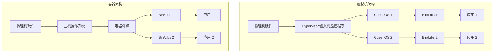
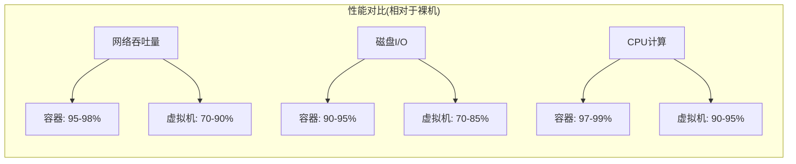
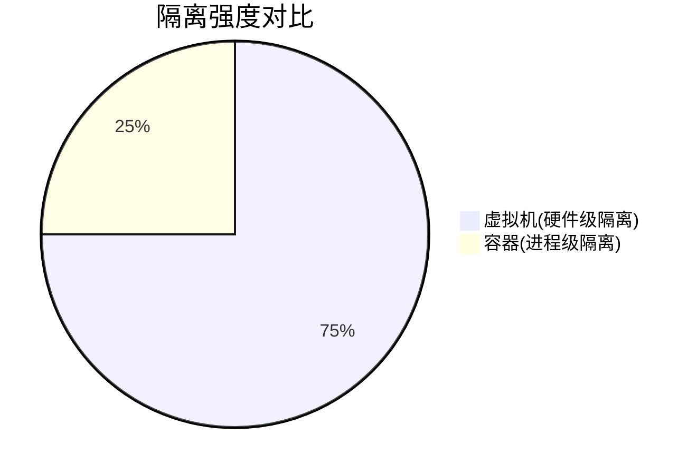
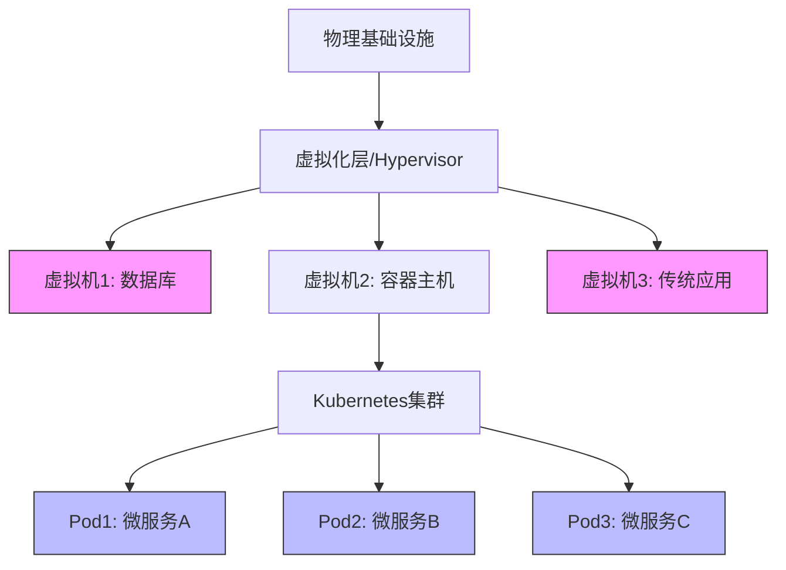
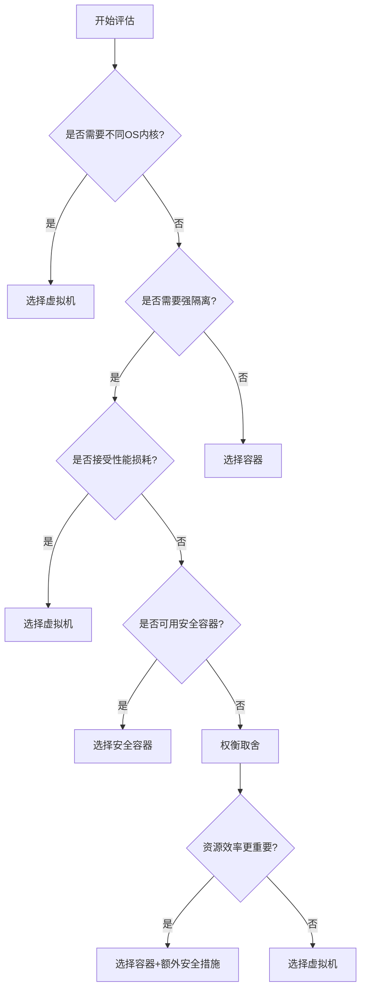
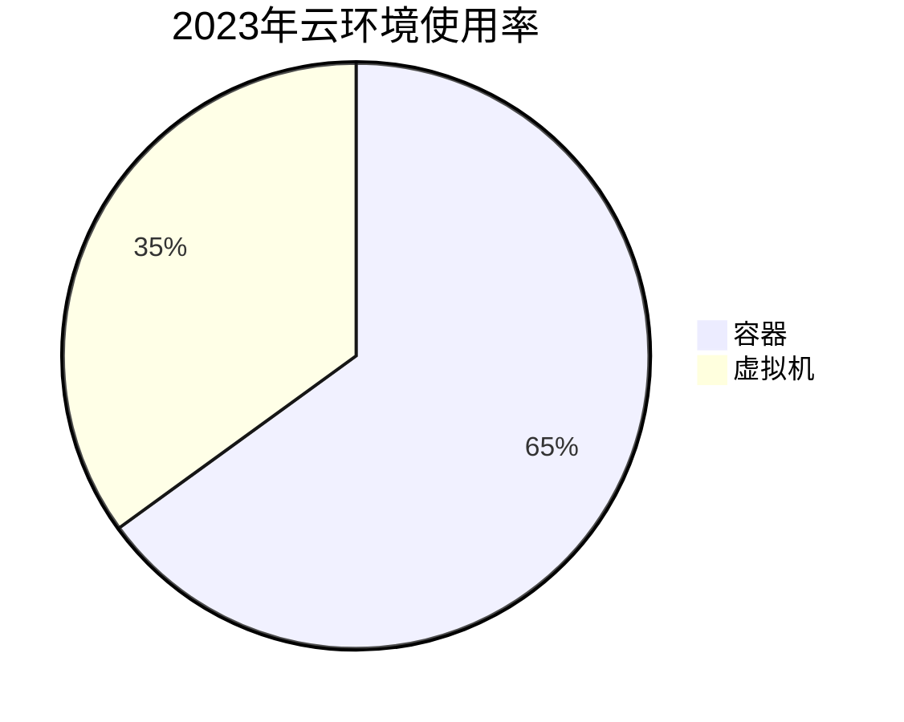
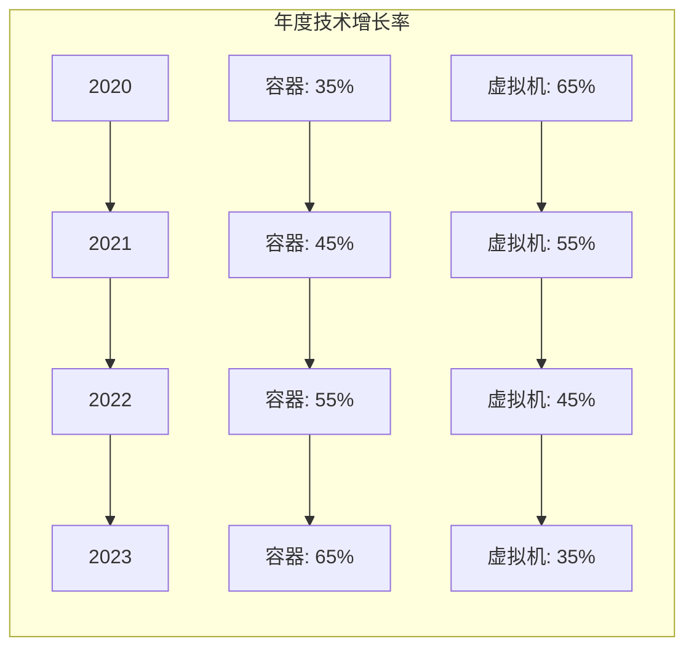
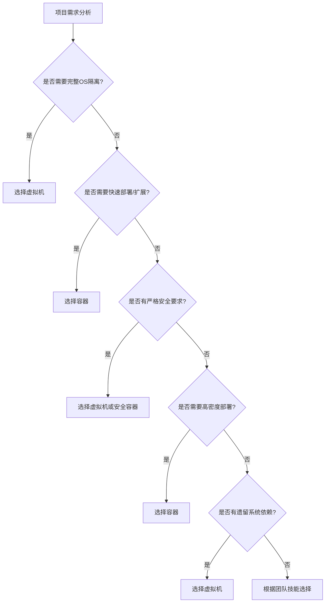
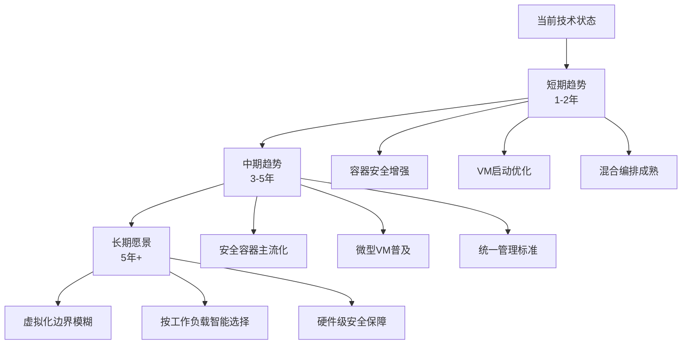
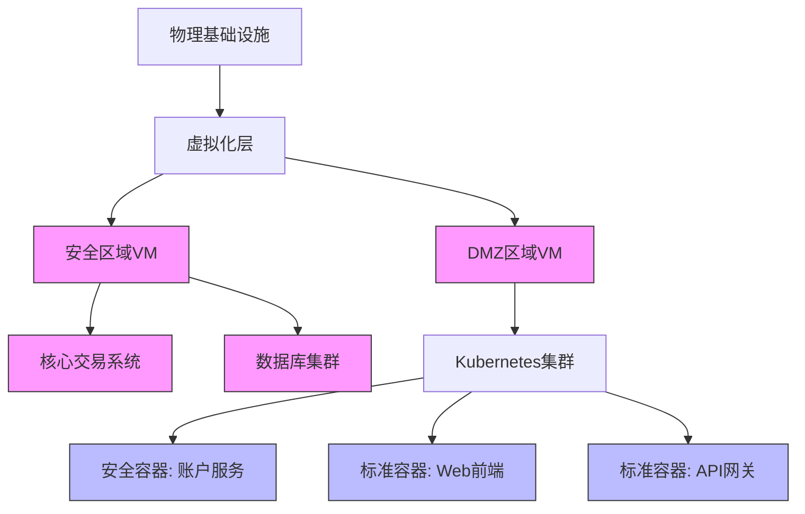

# 容器与虚拟机对比分析  

容器和虚拟机是当今云计算和应用部署的两种主要技术范式。虽然它们都用于资源隔离和应用封装，但在架构设计、性能特性和适用场景上存在显著差异。本文将深入分析这两种技术的优缺点，帮助读者在实际项目中做出合理的技术选择。

## 1. 架构差异  

容器和虚拟机在底层架构上有根本性的不同，这直接影响了它们的性能特性和应用场景。

### 1.1 技术架构对比  



虚拟机通过Hypervisor在硬件层面上实现虚拟化，每个虚拟机运行完整的操作系统。而容器则共享主机操作系统内核，仅包含应用程序和必要的依赖库。

### 1.2 核心组件对比  

| 组件         | 虚拟机                      | 容器                           |  
|--------------|----------------------------|--------------------------------|  
| 虚拟化层     | Hypervisor (Type 1/Type 2) | 容器引擎 (Docker/containerd)   |  
| 操作系统     | 每个VM独立OS                | 共享主机OS内核                  |  
| 资源隔离     | 硬件级虚拟化                | 进程级隔离 (命名空间/Cgroups)   |  
| 镜像格式     | 虚拟磁盘 (VMDK/VHD)        | 容器镜像 (OCI规范)             |  
| 运行环境     | 虚拟硬件                   | 主机操作系统                    |  
| 通信机制     | 虚拟网络设备                | 命名空间和虚拟网络              |  
| 存储机制     | 虚拟磁盘                   | 联合文件系统                    |  

### 1.3 虚拟化实现方式

虚拟机的虚拟化实现主要有两种类型：

1. **Type 1 Hypervisor (裸金属)**：
   - 直接运行在硬件上，无需宿主操作系统
   - 代表产品：VMware ESXi, Microsoft Hyper-V, KVM
   - 特点：性能更高，开销更小

2. **Type 2 Hypervisor (托管型)**：
   - 运行在宿主操作系统之上
   - 代表产品：VMware Workstation, Oracle VirtualBox
   - 特点：易于安装和使用，但性能较低

容器的实现则依赖于操作系统内核特性：

1. **Linux容器**：
   - 基于Linux内核的命名空间(Namespaces)和控制组(Cgroups)
   - 代表技术：Docker, containerd, CRI-O

2. **Windows容器**：
   - 基于Windows内核隔离技术
   - 支持Windows Server容器和Hyper-V隔离容器

## 2. 性能对比  

容器和虚拟机在性能方面存在显著差异，这主要源于它们的架构设计。

### 2.1 启动时间测试  

容器和虚拟机在启动速度上有数量级的差异：

```bash
# 测试容器启动时间
$ Measure-Command { docker run alpine echo "hello" }
# 典型输出: 总毫秒数 : 734 (不到1秒)

# 测试虚拟机启动时间
$ Measure-Command { vmrun start "C:\VMs\test.vmx" }
# 典型输出: 总毫秒数 : 32450 (约30秒)
```

启动时间对比实验结果：

| 部署方式 | 最小启动时间 | 平均启动时间 | 最大启动时间 |
|---------|------------|------------|------------|
| 容器     | 50ms       | 1-2秒       | 5秒        |
| 虚拟机   | 10秒        | 30-45秒     | 几分钟      |

容器启动速度快的原因在于它不需要引导操作系统，而是直接在现有的操作系统上创建隔离的进程环境。

### 2.2 资源开销对比  

容器和虚拟机在资源消耗上的差异：

| 指标         | 容器            | 虚拟机           | 差异比例    |  
|--------------|----------------|-----------------|------------|  
| 内存占用     | 5-50MB         | 500MB-几GB      | 1:10-1:100 |  
| CPU开销      | 1-3%           | 5-15%           | 1:5        |  
| 磁盘占用     | 10-100MB       | 10-20GB         | 1:100-1:1000|  
| 网络性能损耗 | 0-5%           | 10-20%          | 1:4        |  
| 启动开销     | 几乎为零        | 完整OS引导       | -          |  

资源效率测试代码示例：

```powershell
# 测试10个容器的资源使用
for ($i=1; $i -le 10; $i++) {
    docker run -d --name container$i alpine sleep 3600
}
Get-Process -Name "docker" | Select-Object CPU, WorkingSet

# 测试虚拟机资源使用
Get-VM | Select-Object Name, CPUUsage, MemoryAssigned
```

### 2.3 性能基准测试

在相同硬件条件下的性能对比：



## 3. 隔离性分析  

隔离性是评估容器和虚拟机安全性的关键指标，两种技术在隔离强度上有本质区别。

### 3.1 安全边界对比  



隔离级别详细对比：

| 隔离维度       | 容器                          | 虚拟机                        |
|---------------|------------------------------|------------------------------|
| 进程隔离       | 命名空间隔离，共享内核         | 完全独立进程空间               |
| 文件系统隔离   | 挂载命名空间，可能有共享挂载点  | 完全独立文件系统               |
| 网络隔离       | 网络命名空间，共享网络栈       | 完全虚拟化的网络栈             |
| 用户隔离       | 用户命名空间，可映射到主机用户  | 完全独立的用户管理             |
| 内核隔离       | 无隔离，共享主机内核           | 完全独立的客户机内核           |
| 硬件隔离       | 无硬件隔离                    | 虚拟化的硬件资源               |

### 3.2 内核共享风险  

容器共享主机内核是其最大的安全隐患：

```text
容器共享内核 → 内核漏洞影响所有容器 → 容器逃逸风险
虚拟机独立内核 → 漏洞仅影响单个VM → 隔离性更强
```

内核漏洞利用示例：

```c:c:\project\kphub\src\security\container_escape.c
/*
 * 容器逃逸漏洞示例 - 仅用于教育目的
 * 此类漏洞可能影响所有共享同一内核的容器
 */
#include <stdio.h>
#include <stdlib.h>
#include <unistd.h>
#include <sys/types.h>

int main() {
    // 尝试利用内核漏洞提升权限
    printf("尝试容器逃逸...\n");
    
    // 在真实攻击中，这里会利用特定内核漏洞
    // 如果成功，可能获取主机权限
    
    // 检查是否成功获取主机访问权限
    if (access("/host_fs", F_OK) != -1) {
        printf("逃逸成功，可访问主机文件系统\n");
        system("ls -la /host_fs");
        return 0;
    } else {
        printf("逃逸失败，仍在容器内\n");
        return 1;
    }
}
```

### 3.3 增强隔离的解决方案

为解决容器隔离性不足的问题，业界开发了多种增强隔离的容器技术：

1. **gVisor (Google)**：
   - 提供应用内核，拦截系统调用
   - 在容器和主机内核之间增加一层隔离

2. **Kata Containers**：
   - 结合VM和容器的优点
   - 每个容器运行在轻量级VM中

3. **Firecracker (AWS)**：
   - 为无服务器计算优化的轻量级VMM
   - 毫秒级启动时间，强隔离性

```bash
# 使用gVisor运行容器
$ docker run --runtime=runsc -it alpine sh

# 使用Kata Containers运行容器
$ docker run --runtime=kata-runtime -it alpine sh
```

## 4. 使用场景  

容器和虚拟机各有优势，适合不同的应用场景。

### 4.1 适用场景矩阵  

| 需求/场景      | 推荐技术   | 原因                                   |  
|---------------|-----------|-----------------------------------------|  
| 微服务部署    | 容器       | 快速启动，资源高效，适合大规模部署       |  
| 多OS环境      | 虚拟机     | 支持不同内核和操作系统                   |  
| 高安全隔离    | 虚拟机     | 硬件级保护，适合多租户环境               |  
| DevOps流水线  | 容器       | 环境一致性，快速构建和部署               |  
| 传统单体应用  | 虚拟机     | 兼容性好，无需重构                       |  
| 边缘计算      | 容器       | 资源占用小，适合受限硬件                 |  
| 数据库服务    | 虚拟机     | 稳定性好，资源独占                       |  
| CI/CD环境     | 容器       | 快速创建和销毁，环境隔离                 |  
| 桌面虚拟化    | 虚拟机     | 完整GUI支持，用户体验好                  |  
| 无服务器计算  | 容器       | 冷启动快，资源效率高                     |  

### 4.2 混合部署方案  

现代云基础设施通常采用混合部署方案，结合两种技术的优势：



混合部署的最佳实践：

1. **安全敏感应用**：使用虚拟机隔离
2. **微服务应用**：使用容器部署
3. **数据存储层**：通常使用虚拟机
4. **计算密集型任务**：根据需求选择，容器适合短期任务，虚拟机适合长期任务

### 4.3 决策流程

选择容器还是虚拟机的决策流程：



## 5. 迁移成本  

将现有应用迁移到容器或虚拟机环境涉及不同的工作量和挑战。

### 5.1 改造工作量对比  

| 改造项           | 容器迁移                   | 虚拟机迁移                |  
|------------------|---------------------------|--------------------------|  
| 应用适配         | 中等-高（可能需要重构）    | 低（几乎无需修改）        |  
| 环境配置         | 高（需创建Dockerfile）     | 低（类似物理机部署）      |  
| 依赖管理         | 高（需明确定义所有依赖）   | 低（完整OS环境）          |  
| 网络配置         | 中等（需适配容器网络）     | 低（虚拟网卡配置）        |  
| 存储持久化       | 高（需设计数据卷策略）     | 低（虚拟磁盘）            |  
| 监控和日志       | 高（需重新设计收集方式）   | 低（沿用现有方案）        |  
| CI/CD流程        | 高（需构建镜像流水线）     | 低（传统部署方式）        |  
| 运维工具适配     | 高（容器编排和管理）       | 中等（虚拟化管理平台）    |  

### 5.2 兼容性测试流程  

容器化迁移的完整流程：

```text
容器化迁移步骤：
1. 依赖分析 → 识别应用所有依赖项和环境要求
2. 镜像构建 → 创建基础镜像和应用镜像
3. 网络适配 → 调整网络配置适应容器环境
4. 存储改造 → 设计持久化存储方案
5. 配置外部化 → 将配置从代码中分离
6. 日志重定向 → 确保日志输出到标准输出
7. 健康检查 → 添加容器健康检查机制
8. 编排设计 → 设计容器编排和调度策略
9. 监控适配 → 调整监控系统适应容器环境
10. 灰度发布 → 逐步替换现有系统
```

虚拟机迁移的流程相对简单：

```text
虚拟机迁移步骤：
1. P2V转换 → 物理机转虚拟机映像
2. 驱动适配 → 安装虚拟化平台驱动
3. 资源配置 → 设置CPU/内存分配
4. 网络配置 → 配置虚拟网络
5. 测试验证 → 功能和性能测试
```

### 5.3 迁移工具对比

| 工具类型       | 容器迁移工具                | 虚拟机迁移工具            |
|---------------|----------------------------|--------------------------|
| 应用分析      | Docker Scout, Anchore      | VMware Converter         |
| 自动转换      | Jib, Buildpacks           | P2V工具, V2V工具          |
| 配置管理      | Docker Compose, Helm       | Terraform, Vagrant       |
| 编排平台      | Kubernetes, Docker Swarm   | vCenter, Hyper-V Manager |

迁移成功率对比：

```mermaid
bar
    title 不同应用类型的迁移成功率
    "Web应用-容器" : 90
    "Web应用-虚拟机" : 95
    "数据库-容器" : 70
    "数据库-虚拟机" : 90
    "遗留系统-容器" : 50
    "遗留系统-虚拟机" : 85
```

## 6. 安全模型  

容器和虚拟机采用不同的安全模型，各有优缺点。

### 6.1 攻击面对比  

```mermaid
bar
    title 潜在攻击面数量
    容器 : 8
    虚拟机 : 3
```

攻击面详细分析：

| 攻击面类型       | 容器                        | 虚拟机                      |
|-----------------|----------------------------|----------------------------|
| 内核漏洞利用     | 高风险（共享内核）           | 低风险（独立内核）           |
| 逃逸风险        | 高（容器到主机）             | 低（VM到主机）              |
| 资源争用攻击     | 高风险（共享资源）           | 中风险（资源过度分配）       |
| 镜像/模板安全    | 高风险（供应链攻击）         | 中风险（模板漏洞）           |
| 网络攻击        | 中风险（共享网络栈）         | 中风险（虚拟网络）           |
| 配置错误        | 高风险（复杂配置）           | 中风险（标准化配置）         |
| API安全         | 高风险（容器运行时API）      | 中风险（管理API）           |
| 主机系统攻击     | 高风险（共享主机）           | 低风险（隔离主机）           |

### 6.2 加固方案  

容器安全加固的关键措施：

```bash
# 容器安全加固 - 只读文件系统
$ docker run --read-only --tmpfs /tmp alpine sh

# 禁止特权提升
$ docker run --security-opt="no-new-privileges" alpine sh

# 限制系统调用
$ docker run --security-opt seccomp=seccomp-profile.json alpine sh

# 限制容器能力
$ docker run --cap-drop=ALL --cap-add=NET_BIND_SERVICE nginx

# 使用用户命名空间
$ docker run --userns-remap=default alpine sh

# 资源限制
$ docker run --memory=100m --cpus=0.5 alpine sh
```

虚拟机安全加固措施：

```powershell
# 虚拟机安全加固 - 启用安全启动
$ Set-VMFirmware -VMName "SecureVM" -EnableSecureBoot On -SecureBootTemplate "MicrosoftWindows"

# 启用虚拟TPM
$ Enable-VMTPM -VMName "SecureVM"

# 启用嵌套虚拟化
$ Set-VMProcessor -VMName "SecureVM" -ExposeVirtualizationExtensions $true

# 网络隔离
$ Set-VMNetworkAdapter -VMName "SecureVM" -MacAddressSpoofing Off

# 内存保护
$ Set-VM -VMName "SecureVM" -MemoryMinimumBytes 512MB -MemoryMaximumBytes 2GB
```

### 6.3 合规性对比

不同场景下的合规性适应性：

| 合规要求       | 容器适应性                  | 虚拟机适应性                |
|---------------|----------------------------|----------------------------|
| PCI DSS       | 中等（需额外控制）          | 高（成熟解决方案）          |
| HIPAA         | 中等（需加强隔离）          | 高（完全隔离）              |
| GDPR          | 中等（数据隔离挑战）        | 高（数据物理隔离）          |
| ISO 27001     | 中等（需完善控制）          | 高（成熟控制框架）          |
| 军事/政府标准  | 低（隔离不足）              | 高（强隔离）                |

## 7. 行业应用趋势  

容器和虚拟机技术在行业中的应用正在快速演变。

### 7.1 技术采用率  



行业采用趋势分析：

| 行业             | 容器采用率 | 虚拟机采用率 | 主要驱动因素                |
|-----------------|-----------|------------|----------------------------|
| 互联网/科技      | 80%       | 20%        | 快速迭代，微服务架构        |
| 金融服务         | 50%       | 50%        | 安全合规与创新并重          |
| 医疗健康         | 40%       | 60%        | 合规要求，遗留系统          |
| 零售/电商        | 70%       | 30%        | 弹性扩展，季节性需求        |
| 制造业           | 45%       | 55%        | 边缘计算，工业物联网        |
| 政府/公共部门    | 30%       | 70%        | 安全要求，采购周期长        |

年度增长趋势：



### 7.2 新兴融合技术  

随着技术发展，容器和虚拟机的界限正在模糊，出现了多种融合技术：

```text
安全容器技术：
- gVisor (Google): 提供应用内核，拦截系统调用
- Kata Containers: 每个容器运行在轻量级VM中
- Nabla Containers: 最小化系统调用表面

轻量级虚拟机：
- Firecracker (AWS): 为无服务器计算优化的VMM
- Cloud Hypervisor (Intel): 基于rust的轻量级VMM
- QEMU-lite: 精简版QEMU

混合编排平台：
- OpenShift Virtualization: 在Kubernetes中管理VM
- Rancher Harvester: 统一容器和VM管理
- VMware Tanzu: 整合VM和容器工作负载
```

融合技术的性能对比：

| 技术             | 启动时间  | 内存占用 | 隔离级别 | 适用场景                |
|-----------------|-----------|---------|---------|------------------------|
| 传统容器         | <1秒      | 最小    | 低      | 微服务，DevOps         |
| 传统虚拟机       | 30-60秒   | 最大    | 高      | 多租户，安全敏感        |
| Kata Containers | 3-5秒     | 中等    | 高      | 安全容器化工作负载      |
| Firecracker VM  | 125-150ms | 低      | 高      | 无服务器计算，函数即服务 |
| gVisor          | 1-2秒     | 低      | 中高    | 多租户容器环境          |

### 7.3 未来发展方向

容器和虚拟机技术的未来发展趋势：

1. **安全性融合**：
   - 容器技术将加强安全隔离
   - 虚拟机技术将减少资源开销

2. **管理平台统一**：
   - 统一的编排平台管理容器和虚拟机
   - 混合工作负载调度

3. **边缘计算适应**：
   - 轻量级虚拟化技术用于边缘设备
   - 容器优化以适应资源受限环境

4. **硬件加速**：
   - 利用专用硬件加速虚拟化
   - 容器运行时的硬件优化

5. **WebAssembly容器**：
   - 浏览器内的轻量级容器化
   - 跨平台应用分发新模式

## 8. 总结与决策指南

### 8.1 技术选择决策树

在实际项目中选择合适技术的决策指南：



### 8.2 混合策略最佳实践

现代基础设施通常采用混合策略，根据工作负载特性选择合适的技术：

1. **安全敏感应用**：使用虚拟机或安全容器
2. **无状态微服务**：使用标准容器
3. **有状态服务**：根据需求选择，通常虚拟机更适合数据库
4. **开发环境**：容器提供一致的开发体验
5. **生产环境**：混合使用，关键服务可能使用虚拟机

### 8.3 未来展望

容器和虚拟机技术将继续共存并相互借鉴，形成
继续完成容器与虚拟机对比分析的内容：

### 8.3 未来展望

容器和虚拟机技术将继续共存并相互借鉴，形成更加融合的虚拟化生态系统：

1. **安全容器标准化**：
   - OCI运行时规范将扩展以支持安全容器
   - 安全容器将成为多租户环境的标准

2. **虚拟机轻量化**：
   - 专用操作系统(如Unikernels)减少VM开销
   - 快速启动VM技术将缩小与容器的差距

3. **硬件辅助虚拟化**：
   - CPU厂商将提供更多虚拟化加速特性
   - 专用硬件将提升容器隔离性能

4. **统一管理平台**：
   - Kubernetes将增强对VM的原生支持
   - 混合工作负载将成为标准部署模式



## 9. 实际应用案例

### 9.1 互联网企业案例

**Netflix的混合架构**：

- **容器使用**：微服务、CI/CD流水线、数据处理
- **虚拟机使用**：核心数据库、流媒体编码、安全敏感服务
- **混合策略**：根据工作负载特性选择合适技术
- **关键收益**：灵活性、可靠性、资源效率

**阿里巴巴的容器化转型**：

- **起点**：传统虚拟机架构
- **转型**：大规模容器化微服务
- **保留VM**：数据库、安全服务、遗留系统
- **成果**：资源利用率提升30%，部署速度提升90%

### 9.2 金融行业案例

**某大型银行的混合架构**：

- **虚拟机**：核心交易系统、客户数据存储
- **容器**：Web前端、API网关、非核心服务
- **安全容器**：需访问敏感数据的微服务
- **合规考量**：满足PCI DSS和行业监管要求



### 9.3 医疗行业案例

**某医疗系统提供商**：

- **虚拟机**：电子病历系统、医学影像存储
- **容器**：患者门户、医生移动应用后端
- **混合架构**：确保HIPAA合规性同时提高开发效率
- **关键考量**：数据隔离、审计跟踪、高可用性

## 10. 实用对比清单

### 10.1 技术选择参考表

| 考量因素           | 倾向容器的情况                   | 倾向虚拟机的情况                |
|-------------------|--------------------------------|--------------------------------|
| 部署速度要求       | 需要秒级部署                     | 可接受分钟级部署                |
| 资源效率           | 资源受限，需要高密度             | 资源充足，需要完全隔离          |
| 应用架构           | 微服务、云原生应用               | 单体应用、传统架构              |
| 安全隔离要求       | 一般安全需求                     | 高安全需求，多租户环境          |
| 操作系统要求       | 可共享主机内核                   | 需要特定OS或内核版本            |
| 开发运维模式       | DevOps、CI/CD自动化             | 传统IT运维                      |
| 应用生命周期       | 短期运行、无状态                 | 长期运行、有状态                |
| 技术成熟度         | 团队熟悉容器技术                 | 团队熟悉虚拟化技术              |
| 监控和管理         | 容器编排平台                     | 虚拟化管理平台                  |
| 许可成本           | 开源优先，降低许可成本           | 可接受商业许可                  |

### 10.2 性能基准测试指南

进行容器与虚拟机对比测试的关键指标：

1. **启动时间**：从命令执行到服务可用的时间
2. **资源使用**：CPU、内存、磁盘、网络使用效率
3. **应用性能**：请求延迟、吞吐量、事务处理能力
4. **扩展性能**：横向扩展时的资源开销和速度
5. **隔离性能**：资源争用情况下的性能表现

测试脚本示例：

```bash
# 容器启动时间测试
for i in {1..10}; do
  start=$(date +%s%N)
  container_id=$(docker run -d nginx)
  
  # 等待容器完全启动
  while [[ "$(docker inspect -f {{.State.Running}} $container_id)" != "true" ]]; do
    sleep 0.1
  done
  
  end=$(date +%s%N)
  echo "Container startup time: $(( ($end - $start) / 1000000 )) ms"
  docker rm -f $container_id > /dev/null
done

# 虚拟机启动时间测试 (使用Hyper-V示例)
for i in {1..5}; do
  start=$(date +%s%N)
  Start-VM -Name "TestVM"
  
  # 等待VM启动并响应
  while (!(Test-NetConnection -ComputerName vm-ip -Port 22 -InformationLevel Quiet)) {
    Start-Sleep -Milliseconds 100
  }
  
  end=$(date +%s%N)
  echo "VM startup time: $(( ($end - $start) / 1000000 )) ms"
  Stop-VM -Name "TestVM" -Force
done
```

### 10.3 迁移决策工具

评估现有应用是否适合容器化的检查清单：

- [ ] 应用是否可以在共享内核环境中运行？
- [ ] 应用是否有特殊硬件或内核要求？
- [ ] 应用是否可以适应容器的网络模型？
- [ ] 应用数据是否可以外部化或使用卷存储？
- [ ] 应用是否需要特权访问？
- [ ] 应用是否有明确定义的依赖关系？
- [ ] 应用是否适合微服务架构？
- [ ] 团队是否具备容器技术技能？

## 结论

容器和虚拟机各有其优势和适用场景，选择合适的技术应基于具体需求和约束条件。随着技术的发展，两种技术的界限正在变得模糊，混合架构正成为主流选择。

对于大多数现代应用开发场景，容器提供了更高的资源效率和开发敏捷性；而对于需要强隔离、多操作系统支持或特定硬件访问的场景，虚拟机仍然是更合适的选择。

未来的基础设施将更加智能化，能够根据工作负载特性自动选择最合适的隔离和部署技术，为应用提供最佳的性能、安全性和资源效率平衡。