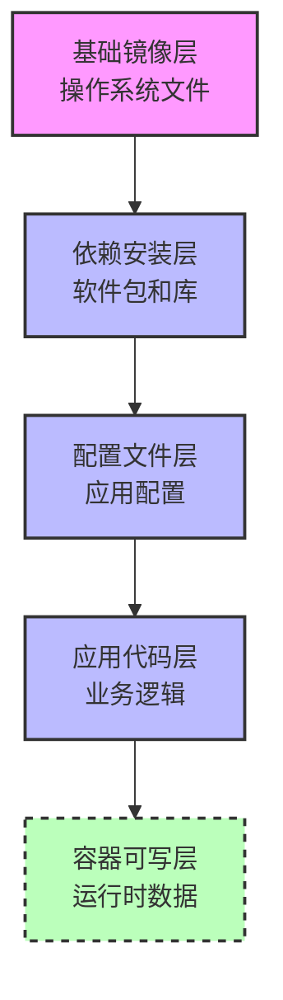
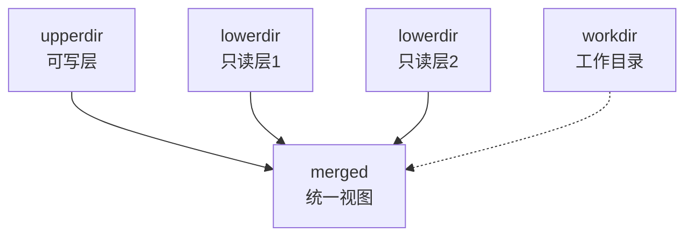
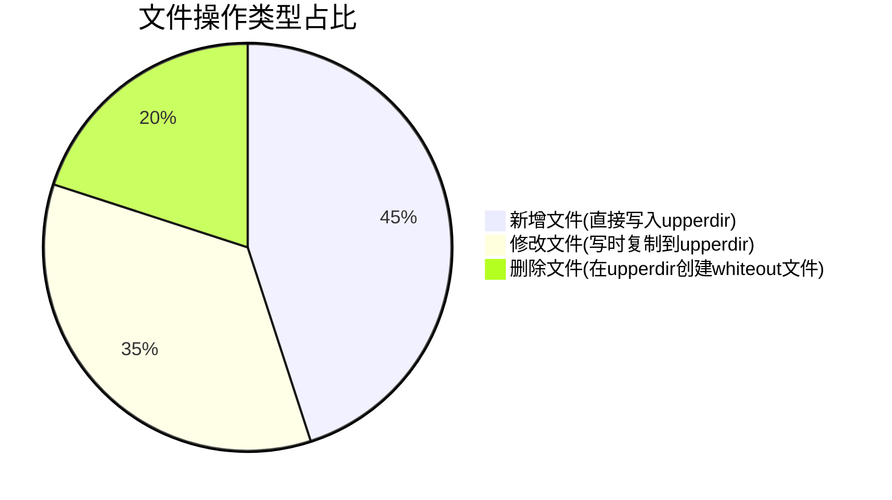
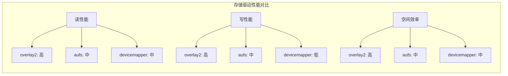
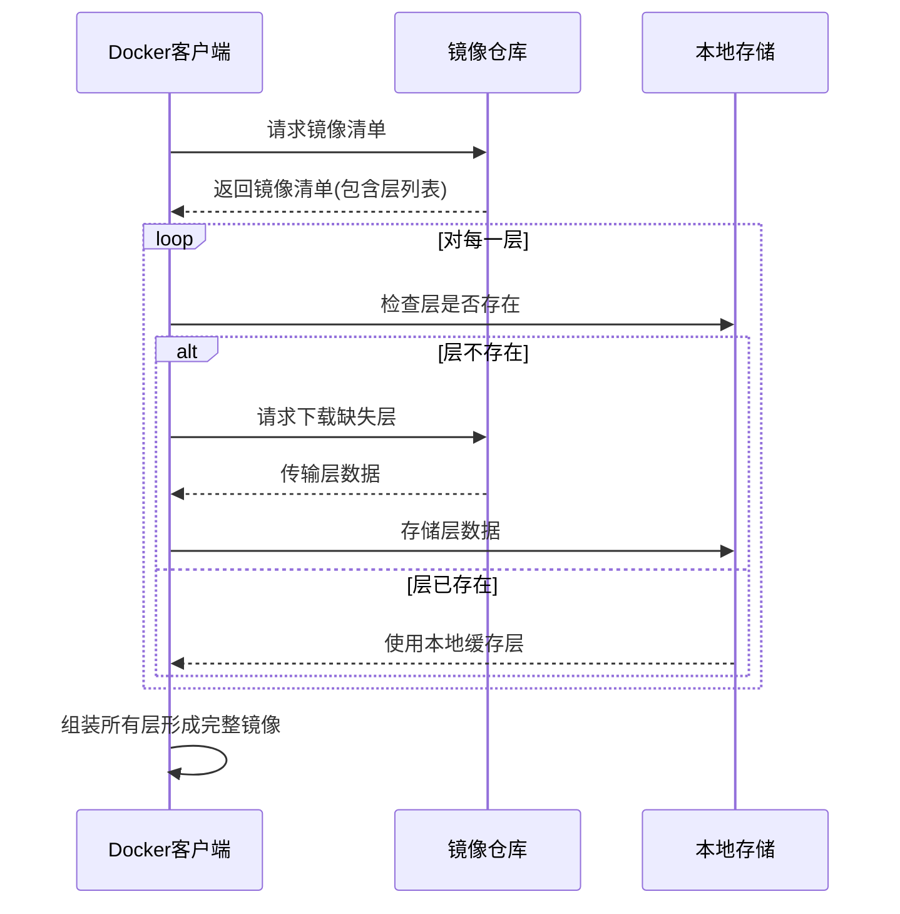
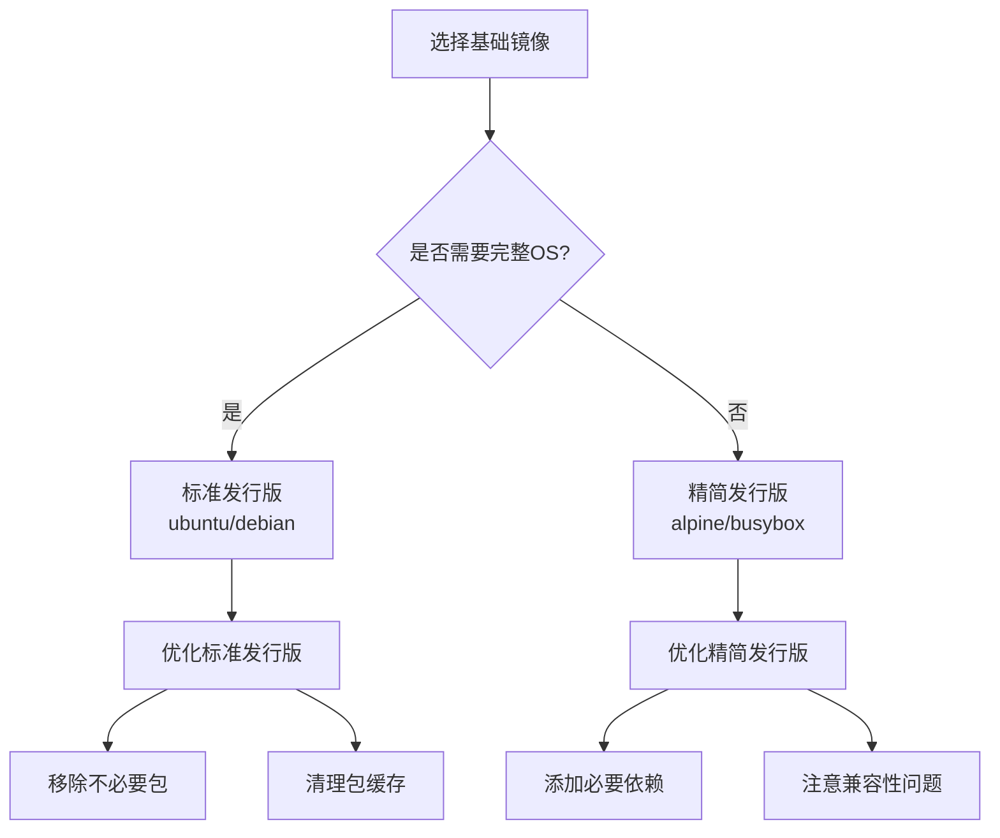
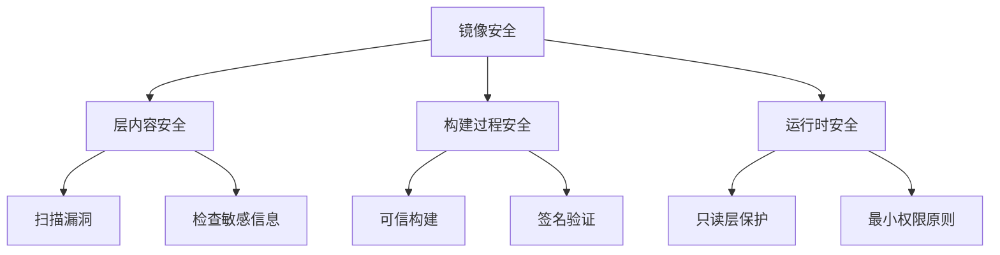

# 容器镜像分层机制详解  

容器镜像分层机制是Docker等容器技术的核心创新之一，它通过分层存储和增量更新显著提高了存储效率和分发速度。本文将深入剖析镜像分层的工作原理、实现技术和优化策略，帮助读者全面理解容器镜像的内部结构。

## 1. 分层架构原理  

容器镜像采用分层架构，将镜像拆分为多个独立的层，每层代表文件系统的一组变更。这种设计带来了显著的存储和传输效率提升。

### 1.1 镜像层结构示意图  



每个镜像层都是前一层变更的增量集合，包含了添加、修改或删除的文件。当容器启动时，会在镜像顶部添加一个可写层，用于存储运行时的所有变更。

### 1.2 各层存储内容  

| 层级类型   | 典型内容                 | 可变性   | 生命周期 | 共享特性 |
|------------|--------------------------|----------|----------|----------|
| 基础层     | OS文件系统、核心库       | 只读     | 长期     | 高度共享 |
| 中间层     | 软件包、依赖库、工具     | 只读     | 中期     | 部分共享 |
| 应用层     | 应用代码、配置文件       | 只读     | 短期     | 应用专属 |
| 可写层     | 运行时数据、日志、缓存   | 可写     | 容器生命期 | 不共享 |

分层存储的核心优势：

1. **空间效率**：相同的层在不同镜像间共享，大幅减少存储占用
2. **传输效率**：仅传输缺失的层，减少网络流量
3. **构建速度**：利用缓存层加速镜像构建
4. **版本控制**：每层代表一个变更点，便于回滚和审计

### 1.3 层标识与元数据

每个镜像层都由内容哈希值唯一标识，确保内容一致性：

```json:c:\project\kphub\config\docker\layer-metadata.json
{
  "id": "sha256:a9503c8f6ad5d7dbb5e4fe3a664e0e55d7d3dbc5613b2e599a47e4c9170e50b6",
  "parent": "sha256:f1b5933fe4b5f49bbe8258745cf396afe07e625bd4e3b96e7a234b5fe74c33d1",
  "created": "2023-05-15T09:22:34.917Z",
  "container_config": {
    "Cmd": ["/bin/sh -c apt-get update && apt-get install -y nginx"]
  },
  "size": 85901345,
  "diffid": "sha256:d6dfff1f6f3ddd3d4bed5b6b5c87e81f63f52bfbb5bf2f4886891239d3c6f351"
}
```

## 2. 联合文件系统  

联合文件系统(Union Filesystem)是容器镜像分层机制的技术基础，它能够将多个目录挂载到同一个挂载点，形成统一的视图。

### 2.1 OverlayFS工作流程  

OverlayFS是Docker默认的存储驱动，它通过以下方式组织文件层：

```text
lowerdir=/var/lib/docker/overlay2/l/base层:/var/lib/docker/overlay2/l/中间层1:/var/lib/docker/overlay2/l/中间层2
upperdir=/var/lib/docker/overlay2/容器ID/diff
workdir=/var/lib/docker/overlay2/容器ID/work
merged=/var/lib/docker/overlay2/容器ID/merged
```

OverlayFS工作原理示意图：



当容器需要访问文件时，OverlayFS按照以下规则处理：

1. 如果文件在upperdir中存在，返回upperdir中的版本
2. 如果文件在upperdir中不存在，但在lowerdir中存在，返回lowerdir中的版本
3. 如果文件在所有层中都不存在，返回"文件不存在"错误

### 2.2 文件操作规则  

不同文件操作在联合文件系统中的处理方式：



文件操作详细规则：

1. **读取文件**：
   - 从上到下搜索各层
   - 返回找到的第一个匹配文件

2. **写入文件**：
   - 如果文件不存在于upperdir，从lowerdir复制到upperdir(写时复制)
   - 修改upperdir中的副本

3. **删除文件**：
   - 在upperdir中创建特殊的"whiteout"文件
   - whiteout文件标记下层同名文件为"已删除"

```c:c:\project\kphub\src\storage\overlay_operations.c
/*
 * OverlayFS文件操作示例代码
 */

// 写操作示例 - 写时复制
int overlay_write(const char *path, const char *buf, size_t size) {
    char lower_path[PATH_MAX];
    char upper_path[PATH_MAX];
    
    // 构建上下层路径
    snprintf(lower_path, PATH_MAX, "%s%s", lowerdir, path);
    snprintf(upper_path, PATH_MAX, "%s%s", upperdir, path);
    
    // 检查文件是否已在上层存在
    if (access(upper_path, F_OK) != 0) {
        // 文件不在上层，检查是否在下层
        if (access(lower_path, F_OK) == 0) {
            // 文件在下层存在，需要复制到上层(写时复制)
            char cmd[PATH_MAX * 2];
            snprintf(cmd, PATH_MAX * 2, "cp -a %s %s", lower_path, upper_path);
            system(cmd);
        }
    }
    
    // 现在文件应该在上层，或已创建空文件
    int fd = open(upper_path, O_WRONLY | O_CREAT, 0644);
    if (fd < 0) return -errno;
    
    // 写入文件内容
    int res = write(fd, buf, size);
    close(fd);
    
    return res;
}

// 删除操作示例 - 创建whiteout文件
int overlay_unlink(const char *path) {
    char upper_path[PATH_MAX];
    char whiteout_path[PATH_MAX];
    
    // 构建上层路径和whiteout路径
    snprintf(upper_path, PATH_MAX, "%s%s", upperdir, path);
    snprintf(whiteout_path, PATH_MAX, "%s%s", upperdir, path);
    
    // 如果文件在上层存在，直接删除
    if (access(upper_path, F_OK) == 0) {
        unlink(upper_path);
    }
    
    // 创建whiteout文件标记删除
    // 在OverlayFS中，whiteout文件是一个字符设备文件，主设备号为0，次设备号为0
    mknod(whiteout_path, S_IFCHR, makedev(0, 0));
    
    return 0;
}
```

## 3. 镜像构建优化  

理解分层机制后，可以优化Dockerfile以创建更高效的镜像。

### 3.1 Dockerfile最佳实践  

多阶段构建是减小镜像大小的有效方法：

```dockerfile:c:\project\kphub\images\optimized.dockerfile
# 构建阶段 - 包含编译工具和依赖
FROM node:16-alpine as builder

# 设置工作目录
WORKDIR /app

# 首先复制依赖文件，利用缓存
COPY package*.json ./
RUN npm ci

# 然后复制源代码并构建
COPY . .
RUN npm run build

# 运行阶段 - 仅包含运行时环境和构建产物
FROM nginx:alpine

# 从构建阶段复制构建结果
COPY --from=builder /app/dist /usr/share/nginx/html

# 配置
COPY nginx.conf /etc/nginx/conf.d/default.conf

# 减少层数的技巧 - 合并RUN命令
RUN mkdir -p /var/cache/nginx && \
    chown -R nginx:nginx /var/cache/nginx && \
    chmod -R 755 /usr/share/nginx/html

# 使用非root用户
USER nginx

EXPOSE 80
CMD ["nginx", "-g", "daemon off;"]
```

优化Dockerfile的关键原则：

1. **最小化层数**：合并相关命令减少层数
2. **优化层顺序**：将变化最少的层放在前面
3. **利用构建缓存**：合理安排指令顺序
4. **减小层大小**：清理临时文件和缓存
5. **多阶段构建**：分离构建环境和运行环境

### 3.2 层数控制策略  

控制和优化镜像层数的方法：

```powershell
# 查看镜像分层情况
docker history my-image:latest

# 输出示例
IMAGE          CREATED       CREATED BY                                      SIZE      COMMENT
abc123def456   2 hours ago   /bin/sh -c #(nop)  CMD ["nginx" "-g" "daemon…   0B        
ghijkl789012   2 hours ago   /bin/sh -c #(nop)  EXPOSE 80                    0B        
mnopqr345678   2 hours ago   /bin/sh -c #(nop)  USER nginx                   0B        
stuvwx901234   2 hours ago   /bin/sh -c mkdir -p /var/cache/nginx &&  cho…   1.2MB     
yzabcd567890   2 hours ago   /bin/sh -c #(nop) COPY file:0fd5fca330dcd6a7…   1.04kB    
efghij123456   2 hours ago   /bin/sh -c #(nop) COPY dir:b5c35d3029d94f3b1…   2.1MB     
```

使用`--squash`选项合并构建层：

```powershell
# 构建时压缩所有层为一层
docker build --squash -t flat-image:latest .

# 导出和导入镜像也会压缩层
docker save my-image:latest | docker load
```

层数优化的权衡：

| 策略 | 优点 | 缺点 |
|------|------|------|
| 保留多层 | 更好的缓存利用、共享效率高 | 元数据开销大、层数限制 |
| 压缩层数 | 减少元数据、突破层数限制 | 缓存效率低、共享性差 |
| 混合策略 | 平衡缓存和大小 | 需要精心设计构建流程 |

### 3.3 缓存优化策略

合理利用构建缓存可以显著提高构建速度：

```dockerfile:c:\project\kphub\images\cache-optimized.dockerfile
# 基础镜像
FROM python:3.9-slim

# 1. 首先复制依赖文件
COPY requirements.txt /app/requirements.txt
WORKDIR /app

# 2. 安装依赖 - 这一层只有requirements.txt变化时才会重建
RUN pip install --no-cache-dir -r requirements.txt

# 3. 复制应用代码 - 代码变化不会触发依赖重新安装
COPY . /app

# 4. 运行应用
CMD ["python", "app.py"]
```

缓存失效的常见原因：

1. 上游层发生变化
2. ADD/COPY指令的源文件变化
3. 构建上下文变化
4. 使用不同的构建参数

## 4. 存储驱动对比  

Docker支持多种存储驱动，每种都有不同的性能特点和适用场景。

### 4.1 主流驱动性能  

| 驱动类型     | 写性能 | 读性能 | 层支持 | 内存占用 | 适用场景 | 限制 |
|--------------|--------|--------|--------|----------|----------|------|
| overlay2     | 高     | 高     | 128层  | 低       | 大多数Linux发行版 | 某些文件系统操作限制 |
| aufs         | 中     | 中     | 42层   | 中       | Ubuntu等特定发行版 | 不在主线内核中 |
| devicemapper | 低     | 中     | 无限制 | 高       | 需要直接IO的场景 | 配置复杂，性能开销大 |
| btrfs        | 高     | 高     | 无限制 | 高       | 使用btrfs文件系统的环境 | 需要btrfs文件系统 |
| zfs          | 中     | 高     | 无限制 | 高       | 高可靠性要求的环境 | 需要zfs支持 |
| vfs          | 低     | 低     | 无限制 | 低       | 测试环境 | 无分层共享，性能差 |

存储驱动性能对比图：



### 4.2 存储驱动配置  

Docker存储驱动配置示例：

```json:c:\project\kphub\config\docker\daemon.json
{
  "storage-driver": "overlay2",
  "storage-opts": [
    "overlay2.override_kernel_check=true",
    "overlay2.size=20G"
  ],
  "log-driver": "json-file",
  "log-opts": {
    "max-size": "10m",
    "max-file": "3"
  }
}
```

选择存储驱动的考虑因素：

1. **操作系统兼容性**：不同Linux发行版支持的驱动不同
2. **文件系统要求**：某些驱动需要特定文件系统
3. **性能需求**：读写性能、内存使用等
4. **稳定性考虑**：生产环境应选择成熟稳定的驱动
5. **特殊功能需求**：如直接IO、快照等

切换存储驱动的步骤：

```powershell
# 1. 修改daemon.json配置文件
# 2. 重启Docker服务
Restart-Service docker

# 3. 验证存储驱动是否生效
docker info | Select-String "Storage Driver"
```

## 5. 镜像分发机制  

镜像分层机制不仅优化了存储，也显著提升了镜像分发效率。

### 5.1 分层传输原理  

Docker镜像分发利用分层结构实现增量传输：

```text
1. 客户端请求镜像 → 发送镜像清单请求到Registry
2. Registry返回镜像清单 → 包含所有层的摘要和大小
3. 客户端检查本地缓存 → 确定哪些层已存在
4. 客户端仅下载缺失层 → 并行下载多个层
5. 客户端验证层完整性 → 通过SHA256校验
6. 本地重组完整镜像 → 准备运行容器
```

分层传输流程示意图：



### 5.2 层校验过程  

Docker使用内容寻址存储确保镜像完整性：

```bash
# 查看镜像层摘要
docker inspect --format='{{.RootFS.Layers}}' nginx:latest

# 输出示例
[sha256:2edcec3590a4ec7f40cf0743c15d78fb39d8326bc029073b41ef9727da6c851f sha256:e379e8aedd4d343a93eb1f35aee800c4a7a9f939b7f4f105a39a36907d3e3c94 sha256:b8d6e692a25e11b0d32c5c3dd544b71b1085ddc1fbd9cb3a8ab4f215724f0609]
```

每一层都由其内容的SHA256哈希值唯一标识，确保：

1. **完整性验证**：防止传输错误或篡改
2. **重复数据删除**：相同内容的层只存储一次
3. **缓存识别**：通过哈希值快速识别已有层

镜像清单示例：

```json:c:\project\kphub\config\docker\manifest.json
{
  "schemaVersion": 2,
  "mediaType": "application/vnd.docker.distribution.manifest.v2+json",
  "config": {
    "mediaType": "application/vnd.docker.container.image.v1+json",
    "size": 7023,
    "digest": "sha256:b8cf2cbeaf747bfdb89b852ae765d92d26c83a72af216f206ea5fc9ae3a43c15"
  },
  "layers": [
    {
      "mediaType": "application/vnd.docker.image.rootfs.diff.tar.gzip",
      "size": 2811969,
      "digest": "sha256:2edcec3590a4ec7f40cf0743c15d78fb39d8326bc029073b41ef9727da6c851f"
    },
    {
      "mediaType": "application/vnd.docker.image.rootfs.diff.tar.gzip",
      "size": 1218,
      "digest": "sha256:e379e8aedd4d343a93eb1f35aee800c4a7a9f939b7f4f105a39a36907d3e3c94"
    },
    {
      "mediaType": "application/vnd.docker.image.rootfs.diff.tar.gzip",
      "size": 7805,
      "digest": "sha256:b8d6e692a25e11b0d32c5c3dd544b71b1085ddc1fbd9cb3a8ab4f215724f0609"
    }
  ]
}
```

## 6. 实践案例分析  

通过实际案例深入理解镜像分层机制的应用。

### 6.1 层缓存失效场景  

常见的缓存失效问题及解决方案：

```dockerfile
# 错误示例 - 顺序影响缓存
COPY . .                 # 源代码变更导致后续层全部重建
RUN apt-get update       # 每次构建都会重新执行
RUN apt-get install -y python3

# 优化示例 - 合理排序
RUN apt-get update && apt-get install -y python3  # 合并减少层数
COPY requirements.txt .  # 仅复制依赖文件
RUN pip install -r requirements.txt  # 仅在依赖变化时重建
COPY . .                # 源代码变更不影响前面的层
```

缓存失效的常见原因及解决方法：

| 问题 | 原因 | 解决方案 |
|------|------|----------|
| 每次构建都重新安装依赖 | 源代码变化导致COPY后的层缓存失效 | 分离依赖文件和源代码的复制步骤 |
| 频繁更新的命令放在前面 | 前面的层变化导致后续层缓存失效 | 将稳定的命令放在前面，变化频繁的放在后面 |
| 清理操作不当 | 在单独的RUN中清理临时文件 | 在同一RUN命令中完成安装和清理 |
| 使用ADD而非COPY | ADD指令功能复杂，缓存行为不可预测 | 除非需要自动解压，否则使用COPY |

### 6.2 多阶段构建优化  

多阶段构建是减小镜像大小的有效方法：

```dockerfile:c:\project\kphub\images\multistage.dockerfile
# 第一阶段 - 编译环境
FROM golang:1.19 AS build

WORKDIR /src
COPY go.mod go.sum ./
RUN go mod download  # 仅下载依赖，利用缓存

COPY . .
# 构建静态链接的二进制文件
RUN CGO_ENABLED=0 GOOS=linux go build -a -installsuffix cgo -o /app .

# 第二阶段 - 运行环境
FROM alpine:3.16

# 安装运行时依赖
RUN apk --no-cache add ca-certificates tzdata

WORKDIR /
# 仅从构建阶段复制编译结果
COPY --from=build /app /app

# 配置容器
USER nobody:nobody
ENTRYPOINT ["/app"]
```

多阶段构建的优势：

1. **显著减小镜像大小**：从1GB+减小到几十MB
2. **减少攻击面**：不包含编译工具和源代码
3. **提高构建效率**：可以并行构建多个阶段
4. **简化CI/CD流程**：单个Dockerfile处理完整构建

多阶段构建大小对比：

```mermaid
bar
    title 镜像大小对比(MB)
    "单阶段Go应用" : 1200
    "多阶段Go应用" : 25
    "单阶段Node应用" : 950
    "多阶段Node应用" : 150
```

### 6.3 实际项目优化案例

以一个典型的Web应用为例，展示优化前后的对比：

**优化前**：

```dockerfile:c:\project\kphub\images\before-optimization.dockerfile
FROM ubuntu:20.04

# 安装依赖
RUN apt-get update
RUN apt-get install -y nodejs npm
RUN apt-get install -y nginx

# 设置工作目录
WORKDIR /app

# 复制应用代码
COPY . .

# 安装npm依赖
RUN npm install

# 构建前端资源
RUN npm run build

# 配置nginx
COPY nginx.conf /etc/nginx/sites-available/default

EXPOSE 80
CMD ["nginx", "-g", "daemon off;"]
```

**优化后**：

```dockerfile:c:\project\kphub\images\after-optimization.dockerfile
# 构建阶段
FROM node:16-alpine AS builder

WORKDIR /app

# 分离依赖安装和代码构建
COPY package*.json ./
RUN npm ci

COPY . .
RUN npm run build

# 运行阶段
FROM nginx:alpine

# 复制构建产物
COPY --from=builder /app/dist /usr/share/nginx/html
COPY nginx.conf /etc/nginx/conf.d/default.conf

# 安全加固
RUN chmod -R 755 /usr/share/nginx/html && \
    chown -R nginx:nginx /usr/share/nginx/html && \
    chown -R nginx:nginx /var/cache/nginx && \
    chown -R nginx:nginx /var/log/nginx && \
    touch /var/run/nginx.pid && \
    chown -R nginx:nginx /var/run/nginx.pid

USER nginx
EXPOSE 80
CMD ["nginx", "-g", "daemon off;"]
```

优化效果对比：

| 指标 | 优化前 | 优化后 | 改进 |
|------|--------|--------|------|
| 镜像大小 | 1.2GB | 23MB | 减少98% |
| 层数 | 12层 | 8层 | 减少33% |
| 构建时间 | 5分钟 | 2分钟 | 减少60% |
| 安全漏洞 | 高(包含编译工具) | 低(仅运行时) | 显著提升 |

## 7. 高级调试技巧  

深入了解镜像内部结构的调试技术。

### 7.1 层内容检查  

检查特定镜像层内容的方法：

```powershell
# 导出镜像到tar文件
docker save my-image:latest -o image.tar

# 解压tar文件
mkdir -p image-contents
tar -xf image.tar -C image-contents

# 查看镜像结构
Get-ChildItem image-contents

# 检查特定层内容
$LAYER_ID = "a94d714f29d55373a3d3e8ae7d5ee18545455e2825eb17c48ea9c3ca97285567"
mkdir -p layer-contents
tar -xf image-contents/$LAYER_ID/layer.tar -C layer-contents

# 查看层中的文件
Get-ChildItem layer-contents -Recurse | Select-Object FullName
```

使用工具简化层检查：

```bash
# 安装dive工具
choco install dive

# 使用dive交互式检查镜像层
dive my-image:latest
```

### 7.2 构建过程分析  

详细分析构建过程和缓存使用情况：

```bash
# 显示详细构建步骤
DOCKER_BUILDKIT=1 docker build --progress=plain -t my-image .

# 分析构建时间
docker build --no-cache --progress=plain -t my-image . 2>&1 | grep "Step"

# 使用BuildKit的调试功能
BUILDKIT_PROGRESS=plain docker build -t my-image .
```

使用实验性功能检查构建缓存：

```powershell
# 启用构建缓存导出
docker build --build-arg BUILDKIT_INLINE_CACHE=1 -t my-image .

# 查看缓存使用情况
docker history my-image:latest
```

### 7.3 存储空间分析

分析Docker存储空间使用情况：

```powershell
# 查看Docker磁盘
继续完成容器镜像分层机制详解的内容：

### 7.3 存储空间分析

分析Docker存储空间使用情况：

```powershell
# 查看Docker磁盘使用情况
docker system df

# 详细查看镜像占用空间
docker system df -v

# 查看悬空镜像(未被标记且未被使用)
docker images --filter "dangling=true"

# 查看未使用的数据卷
docker volume ls -f "dangling=true"
```

存储空间优化命令：

```powershell
# 清理未使用的镜像、容器、网络和构建缓存
docker system prune -a

# 清理未使用的数据卷
docker volume prune

# 限制容器日志大小
# 在daemon.json中配置
# "log-driver": "json-file",
# "log-opts": { "max-size": "10m", "max-file": "3" }
```

## 8. 镜像分层的高级应用

### 8.1 基础镜像优化

选择和优化基础镜像对整体效率有重大影响：



基础镜像大小对比：

| 基础镜像 | 大小 | 特点 | 适用场景 |
|---------|------|------|----------|
| ubuntu:20.04 | ~73MB | 完整工具链，兼容性好 | 复杂应用，需要多种工具 |
| debian:bullseye-slim | ~80MB | 精简版Debian，平衡性能和大小 | 通用应用，需要良好兼容性 |
| alpine:3.16 | ~5.6MB | 极小体积，基于musl libc | 简单应用，注重镜像大小 |
| distroless/static | ~2MB | 仅包含应用和运行时依赖 | 静态编译的应用 |
| scratch | ~0MB | 空镜像，无任何文件 | 完全静态编译的应用 |

自定义基础镜像示例：

```dockerfile:c:\project\kphub\images\custom-base.dockerfile
# 创建精简的Python基础镜像
FROM debian:bullseye-slim

# 安装Python并清理
RUN apt-get update && \
    apt-get install -y --no-install-recommends \
        python3.9 \
        python3-pip \
        python3-setuptools \
        python3-wheel && \
    apt-get clean && \
    rm -rf /var/lib/apt/lists/* && \
    ln -s /usr/bin/python3.9 /usr/bin/python

# 设置工作目录
WORKDIR /app

# 设置环境变量
ENV PYTHONDONTWRITEBYTECODE=1 \
    PYTHONUNBUFFERED=1 \
    PIP_NO_CACHE_DIR=1

# 预安装常用包
RUN pip install --no-cache-dir requests pyyaml

# 设置默认命令
CMD ["python"]
```

### 8.2 镜像分发优化

优化镜像分发的策略：

1. **镜像压缩**：
   ```powershell
   # 使用BuildKit的压缩功能
   DOCKER_BUILDKIT=1 docker build --compress -t my-image .
   ```

2. **多架构镜像**：
   ```powershell
   # 创建多架构镜像清单
   docker manifest create my-image:latest \
     my-image:amd64 \
     my-image:arm64
   
   # 推送多架构清单
   docker manifest push my-image:latest
   ```

3. **镜像分层优化**：
   - 将公共依赖放在单独的基础镜像中
   - 使用中间镜像作为构建缓存

4. **镜像仓库缓存**：
   - 设置本地镜像仓库缓存
   - 使用镜像拉取策略优化分发

### 8.3 安全与合规性

镜像分层机制中的安全考量：



镜像安全最佳实践：

1. **漏洞扫描**：
   ```powershell
   # 使用Trivy扫描镜像漏洞
   docker run --rm -v /var/run/docker.sock:/var/run/docker.sock aquasec/trivy image my-image:latest
   ```

2. **镜像签名**：
   ```powershell
   # 使用Docker Content Trust签名镜像
   $env:DOCKER_CONTENT_TRUST=1
   docker push my-image:latest
   ```

3. **层内容审计**：
   - 检查每一层是否包含敏感信息
   - 使用.dockerignore排除敏感文件

4. **最小化攻击面**：
   - 使用多阶段构建移除构建工具
   - 选择最小化基础镜像

## 9. 未来发展趋势

容器镜像分层技术的未来发展方向：

### 9.1 OCI标准演进

开放容器倡议(OCI)标准的发展：

1. **镜像规范扩展**：
   - 支持更多元数据
   - 增强安全特性

2. **分发规范增强**：
   - 改进增量下载算法
   - 支持P2P分发模式

3. **运行时规范更新**：
   - 更精细的资源控制
   - 增强隔离特性

### 9.2 新兴技术整合

与新兴技术的整合：

1. **WebAssembly容器**：
   - 更轻量级的容器格式
   - 浏览器和服务器统一运行时

2. **不可变基础设施**：
   - 只读镜像层与不可变部署
   - 增强安全性和可预测性

3. **AI辅助镜像优化**：
   - 自动识别最佳分层策略
   - 智能缓存管理

### 9.3 边缘计算适配

为边缘计算场景优化：

1. **超轻量级镜像**：
   - 针对资源受限设备优化
   - 减少层数和元数据开销

2. **增量更新机制**：
   - 仅传输变更的二进制差异
   - 降低带宽需求

3. **离线优先设计**：
   - 本地镜像缓存策略
   - 断网环境下的镜像管理

## 结论

容器镜像分层机制是Docker等容器技术的核心创新，通过分层存储和增量更新显著提高了存储效率和分发速度。理解分层原理有助于开发者构建更高效、更安全的容器镜像。

关键要点总结：

1. **分层架构**：镜像由多个只读层和一个可写层组成，每层代表文件系统的变更集
2. **联合文件系统**：通过OverlayFS等技术将多个层合并为统一视图
3. **构建优化**：合理安排Dockerfile指令顺序，利用缓存机制加速构建
4. **存储驱动**：不同驱动有各自的性能特点和适用场景
5. **分发效率**：分层机制使镜像传输只需传输缺失的层，大幅提高效率

通过合理应用镜像分层机制，可以显著提高容器化应用的构建速度、减小镜像体积、优化存储空间使用，并提升分发效率，为容器化应用的开发和部署带来巨大便利。