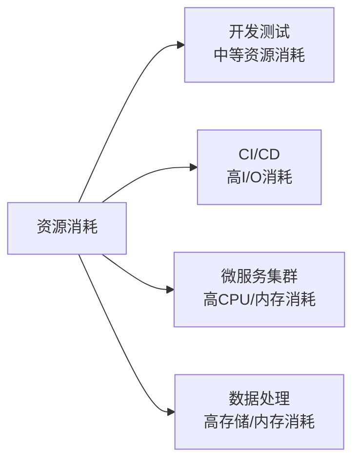
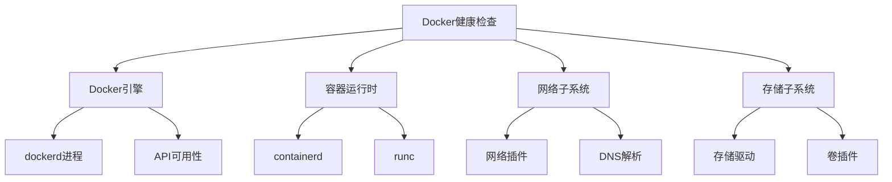

# Docker环境安装与配置  

Docker是一种轻量级的容器化技术，它使应用程序能够以独立、可移植的方式运行。本文将详细介绍如何在不同操作系统上安装和配置Docker环境，从基础安装到高级配置，满足从开发到生产的各种需求。

## 1. 系统环境准备  

在安装Docker之前，需要确保系统满足基本要求，包括硬件配置和操作系统版本。

### 1.1 硬件要求  

Docker可以在各种规格的机器上运行，但根据使用场景，建议满足以下配置：

| 资源类型   | 最低配置 | 开发环境推荐 | 生产环境推荐 | 说明                           |
|------------|----------|--------------|--------------|--------------------------------|
| CPU        | 2核      | 4核          | 8核+         | 多容器环境需要更多CPU资源      |
| 内存       | 2GB      | 8GB          | 16GB+        | 内存不足会导致容器性能下降     |
| 存储       | 20GB     | 50GB         | 100GB+       | SSD存储可显著提升容器启动速度  |
| 网络       | 基础网络  | 千兆网络     | 万兆网络     | 影响镜像拉取和容器通信效率     |

不同使用场景的资源消耗：



### 1.2 操作系统要求

#### Windows系统

Windows系统有两种安装方式：Docker Desktop和WSL 2。

**Docker Desktop for Windows要求**：
- Windows 10 64位: 专业版、企业版或教育版(Build 19041+)
- 启用Hyper-V和容器功能
- 支持BIOS级硬件虚拟化

**WSL 2要求**：
```powershell
# 检查Windows版本
winver
# 应为Windows 10 version 2004及更高版本(Build 19041+)

# 启用WSL 2
dism.exe /online /enable-feature /featurename:Microsoft-Windows-Subsystem-Linux /all /norestart
dism.exe /online /enable-feature /featurename:VirtualMachinePlatform /all /norestart

# 下载并安装WSL 2内核更新包
# 从https://aka.ms/wsl2kernel下载

# 设置WSL 2为默认版本
wsl --set-default-version 2

# 安装Linux发行版(如Ubuntu)
# 从Microsoft Store安装
```

#### Linux系统

**内核版本检查**：
```powershell
# 检查Linux内核版本
wsl uname -r
# 要求内核版本 >= 4.14
```

**系统要求**：
- Ubuntu 20.04/22.04 LTS, Debian 11+, CentOS 7/8, RHEL 7/8/9
- 支持overlay2存储驱动的文件系统(ext4, xfs)
- 建议使用systemd作为init系统

#### macOS系统

**系统要求**：
- macOS 11.0+ (Big Sur及更高版本)
- 至少4GB RAM
- 不支持Apple Silicon(M1/M2)的应用需通过Rosetta 2运行

### 1.3 网络环境准备

Docker需要访问互联网下载镜像，建议准备以下网络环境：

```powershell
# 检查DNS配置
ipconfig /all | findstr "DNS"

# 检查Docker Hub连通性
ping docker.io
curl -L https://docker.io

# 如果网络受限，准备代理设置
$env:HTTP_PROXY="http://proxy.example.com:8080"
$env:HTTPS_PROXY="http://proxy.example.com:8080"
$env:NO_PROXY="localhost,127.0.0.1"
```

## 2. 安装Docker引擎  

根据不同操作系统，Docker的安装方式有所不同。

### 2.1 Windows安装

Windows平台推荐使用Docker Desktop：

```powershell
# 下载Docker Desktop安装程序
Invoke-WebRequest -Uri "https://desktop.docker.com/win/stable/Docker%20Desktop%20Installer.exe" -OutFile "DockerDesktopInstaller.exe"

# 静默安装Docker Desktop
Start-Process -Wait -FilePath ".\DockerDesktopInstaller.exe" -ArgumentList "install", "--quiet"

# 验证安装
docker --version
```

或者通过Chocolatey包管理器安装：

```powershell
# 使用Chocolatey安装
choco install docker-desktop
```

### 2.2 Ubuntu安装  

Ubuntu系统上安装Docker的步骤：

```powershell
# 卸载旧版本
wsl sudo apt remove docker docker-engine docker.io containerd runc

# 设置仓库
wsl sudo apt update
wsl sudo apt install -y ca-certificates curl gnupg lsb-release
wsl sudo mkdir -p /etc/apt/keyrings
wsl curl -fsSL https://download.docker.com/linux/ubuntu/gpg | sudo gpg --dearmor -o /etc/apt/keyrings/docker.gpg
wsl sudo chmod a+r /etc/apt/keyrings/docker.gpg

# 添加Docker官方仓库
wsl echo "deb [arch=$(dpkg --print-architecture) signed-by=/etc/apt/keyrings/docker.gpg] https://download.docker.com/linux/ubuntu $(lsb_release -cs) stable" | sudo tee /etc/apt/sources.list.d/docker.list > /dev/null

# 安装Docker Engine
wsl sudo apt update
wsl sudo apt install -y docker-ce docker-ce-cli containerd.io docker-buildx-plugin docker-compose-plugin

# 启动Docker服务
wsl sudo systemctl enable docker
wsl sudo systemctl start docker
```

### 2.3 CentOS安装  

CentOS系统上安装Docker的步骤：

```powershell
# 卸载旧版本
wsl sudo yum remove docker docker-client docker-client-latest docker-common docker-latest docker-latest-logrotate docker-logrotate docker-engine

# 添加yum源
wsl sudo yum install -y yum-utils
wsl sudo yum-config-manager --add-repo https://download.docker.com/linux/centos/docker-ce.repo

# 安装Docker
wsl sudo yum install -y docker-ce docker-ce-cli containerd.io docker-buildx-plugin docker-compose-plugin

# 启动Docker服务
wsl sudo systemctl enable docker
wsl sudo systemctl start docker
```

### 2.4 macOS安装

macOS系统上安装Docker Desktop：

```bash
# 使用Homebrew安装
brew install --cask docker

# 启动Docker Desktop
open /Applications/Docker.app
```

### 2.5 离线安装方法

在无法访问互联网的环境中安装Docker：

```powershell
# 1. 在有网络的环境中下载Docker安装包
Invoke-WebRequest -Uri "https://download.docker.com/linux/static/stable/x86_64/docker-20.10.9.tgz" -OutFile "docker-20.10.9.tgz"

# 2. 将安装包传输到目标服务器

# 3. 在目标服务器上解压并安装
wsl tar xzvf docker-20.10.9.tgz
wsl sudo cp docker/* /usr/bin/

# 4. 创建服务文件
wsl sudo tee /etc/systemd/system/docker.service > /dev/null <<EOF
[Unit]
Description=Docker Application Container Engine
Documentation=https://docs.docker.com
After=network-online.target firewalld.service
Wants=network-online.target

[Service]
Type=notify
ExecStart=/usr/bin/dockerd
ExecReload=/bin/kill -s HUP $MAINPID
TimeoutSec=0
RestartSec=2
Restart=always
StartLimitBurst=3
StartLimitInterval=60s
LimitNOFILE=infinity
LimitNPROC=infinity
LimitCORE=infinity
TasksMax=infinity
Delegate=yes
KillMode=process

[Install]
WantedBy=multi-user.target
EOF

# 5. 启动Docker服务
wsl sudo systemctl daemon-reload
wsl sudo systemctl enable docker
wsl sudo systemctl start docker
```

## 3. 基础配置  

安装完成后，需要进行一些基础配置以确保Docker正常运行。

### 3.1 用户组配置  

为避免每次使用Docker命令都需要sudo，可以将当前用户添加到docker组：

```powershell
# 添加当前用户到docker组
wsl sudo usermod -aG docker $USER

# 应用新组设置(无需注销)
wsl newgrp docker

# 验证无需sudo即可运行docker命令
wsl docker ps
```

用户权限说明：
- 添加到docker组的用户可以直接运行docker命令
- docker组成员实际上拥有等同于root的权限
- 在生产环境中应谨慎管理docker组成员

### 3.2 守护进程配置  

Docker守护进程(dockerd)的配置文件可以自定义Docker的行为：

```json:c:\project\kphub\config\docker\daemon.json
{
  "exec-opts": ["native.cgroupdriver=systemd"],
  "log-driver": "json-file",
  "log-opts": {
    "max-size": "100m",
    "max-file": "3"
  },
  "storage-driver": "overlay2",
  "storage-opts": [
    "overlay2.override_kernel_check=true"
  ],
  "default-ulimits": {
    "nofile": {
      "Name": "nofile",
      "Hard": 64000,
      "Soft": 64000
    }
  },
  "live-restore": true,
  "iptables": true,
  "default-address-pools": [
    {
      "base": "172.30.0.0/16",
      "size": 24
    }
  ]
}
```

配置文件位置：
- Windows: `%ProgramData%\docker\config\daemon.json`
- Linux: `/etc/docker/daemon.json`
- macOS: `~/Library/Containers/com.docker.docker/Data/vms/0/etc/docker/daemon.json`

主要配置项说明：

| 配置项 | 说明 | 推荐值 |
|--------|------|--------|
| exec-opts | 执行选项，如cgroup驱动 | ["native.cgroupdriver=systemd"] |
| log-driver | 容器日志驱动 | "json-file" |
| log-opts | 日志驱动选项 | {"max-size": "100m", "max-file": "3"} |
| storage-driver | 存储驱动 | "overlay2" |
| default-ulimits | 容器默认ulimit值 | 根据系统资源设置 |
| live-restore | 守护进程重启时保持容器运行 | true |
| insecure-registries | 不安全的镜像仓库 | 仅用于测试环境 |

应用配置更改：

```powershell
# Linux系统重启Docker服务
wsl sudo systemctl daemon-reload
wsl sudo systemctl restart docker

# Windows系统重启Docker服务
Restart-Service docker
```

### 3.3 网络配置

Docker默认创建三种网络：bridge、host和none。可以根据需要自定义网络配置：

```powershell
# 查看现有网络
wsl docker network ls

# 创建自定义网络(推荐使用)
wsl docker network create --driver bridge --subnet=172.20.0.0/16 --gateway=172.20.0.1 my-network

# 使用自定义网络启动容器
wsl docker run --network my-network --name container1 -d nginx
```

网络模式对比：

| 网络模式 | 说明 | 适用场景 |
|----------|------|----------|
| bridge | 默认模式，容器通过网桥连接 | 大多数容器应用 |
| host | 容器使用主机网络栈 | 需要高性能网络的应用 |
| none | 容器没有网络连接 | 安全敏感的应用 |
| overlay | 跨主机容器网络 | Swarm集群环境 |
| macvlan | 容器拥有MAC地址 | 需要直接连接物理网络的应用 |

## 4. 镜像加速  

Docker默认从Docker Hub拉取镜像，在国内网络环境下可能较慢，配置镜像加速可以提高下载速度。

### 4.1 国内源配置  

配置国内镜像加速器：

```json:c:\project\kphub\config\docker\daemon.json
{
  "registry-mirrors": [
    "https://registry.docker-cn.com",
    "https://hub-mirror.c.163.com",
    "https://mirror.baidubce.com",
    "https://docker.mirrors.ustc.edu.cn"
  ]
}
```

各大云服务商也提供镜像加速服务：

| 服务商 | 镜像加速地址 | 是否需要账号 |
|--------|--------------|--------------|
| 阿里云 | https://<your_code>.mirror.aliyuncs.com | 是，需要获取专属地址 |
| 腾讯云 | https://mirror.ccs.tencentyun.com | 否 |
| 华为云 | https://05f073ad3c0010ea0f4bc00b7105ec20.mirror.swr.myhuaweicloud.com | 是，需要获取专属地址 |
| 网易云 | https://hub-mirror.c.163.com | 否 |
| 百度云 | https://mirror.baidubce.com | 否 |

获取阿里云镜像加速地址：
1. 登录阿里云容器镜像服务
2. 左侧导航栏选择"镜像工具 > 镜像加速器"
3. 获取专属加速地址

### 4.2 重启生效  

配置镜像加速器后需要重启Docker服务：

```powershell
# Linux系统
wsl sudo systemctl daemon-reload
wsl sudo systemctl restart docker

# Windows系统
Restart-Service docker

# 验证配置是否生效
wsl docker info | grep "Registry Mirrors"
```

### 4.3 私有镜像仓库

对于企业内部使用，建议搭建私有镜像仓库：

```powershell
# 启动本地镜像仓库
wsl docker run -d -p 5000:5000 --restart=always --name registry registry:2

# 推送镜像到本地仓库
wsl docker tag nginx:latest localhost:5000/my-nginx
wsl docker push localhost:5000/my-nginx

# 从本地仓库拉取镜像
wsl docker pull localhost:5000/my-nginx
```

配置私有仓库认证：

```json:c:\project\kphub\config\docker\config.json
{
  "auths": {
    "your-registry.example.com": {
      "auth": "base64(username:password)"
    }
  }
}
```

## 5. 验证安装  

安装完成后，需要验证Docker是否正常工作。

### 5.1 基础命令测试  

验证Docker安装是否成功：

```powershell
# 检查Docker版本
wsl docker --version
wsl docker compose version

# 运行测试容器
wsl docker run hello-world

# 输出应包含:
# Hello from Docker!
# This message shows that your installation appears to be working correctly.
```

基本功能测试：

```powershell
# 拉取镜像
wsl docker pull nginx:latest

# 运行容器
wsl docker run -d -p 8080:80 --name test-nginx nginx:latest

# 检查容器运行状态
wsl docker ps

# 访问测试页面
Start-Process "http://localhost:8080"

# 停止并删除容器
wsl docker stop test-nginx
wsl docker rm test-nginx
```

### 5.2 系统状态检查  

检查Docker系统状态：

```powershell
# 查看Docker系统信息
wsl docker info

# 查看Docker状态
wsl sudo systemctl status docker

# 检查存储驱动
wsl docker info | grep "Storage Driver"

# 检查日志
wsl sudo journalctl -u docker.service

# 检查资源使用情况
wsl docker stats
```

Docker组件健康检查：



## 6. 常见问题  

安装和配置过程中可能遇到的常见问题及解决方案。

### 6.1 权限问题解决  

Docker权限相关问题：

```powershell
# 修复socket权限问题
wsl sudo chown root:docker /var/run/docker.sock
wsl sudo chmod 660 /var/run/docker.sock

# 如果遇到"Got permission denied"错误
wsl sudo chown $USER /var/run/docker.sock
# 或者重新登录使组成员身份生效
wsl sudo su - $USER
```

SELinux相关问题(CentOS/RHEL)：

```powershell
# 检查SELinux状态
wsl sudo sestatus

# 临时关闭SELinux
wsl sudo setenforce 0

# 永久关闭SELinux(不推荐，应正确配置)
wsl sudo sed -i 's/^SELINUX=enforcing$/SELINUX=permissive/' /etc/selinux/config
```

### 6.2 网络问题  

Docker网络常见问题：

```powershell
# 防火墙配置 - 开放Docker端口
wsl sudo ufw allow 2375/tcp  # Docker API端口(不建议在生产环境开放)
wsl sudo ufw allow 2376/tcp  # Docker安全API端口
wsl sudo ufw allow 2377/tcp  # Docker Swarm端口
wsl sudo ufw allow 7946/tcp  # Docker Swarm节点通信
wsl sudo ufw allow 7946/udp  # Docker Swarm节点通信
wsl sudo ufw allow 4789/udp  # Docker Overlay网络
wsl sudo ufw reload

# 检查Docker网络
wsl docker network inspect bridge

# 重置Docker网络
wsl sudo systemctl restart docker
```

DNS问题解决：

```json:c:\project\kphub\config\docker\daemon.json
{
  "dns": ["8.8.8.8", "8.8.4.4"]
}
```

### 6.3 存储问题

存储相关问题：

```powershell
# 检查磁盘空间
wsl df -h /var/lib/docker

# 清理未使用的Docker资源
wsl docker system prune -a --volumes

# 如果出现存储驱动错误
wsl sudo rm -rf /var/lib/docker
wsl sudo systemctl restart docker
```

修改Docker数据目录位置：

```json:c:\project\kphub\config\docker\daemon.json
{
  "data-root": "/path/to/docker/data"
}
```

### 6.4 WSL 2相关问题

Windows WSL 2环境中的Docker问题：

```powershell
# 检查WSL版本
wsl --list --verbose

# 确保使用WSL 2
wsl --set-version Ubuntu-20.04 2

# 内存限制问题，创建.wslconfig文件
New-Item -Path "$env:USERPROFILE\.wslconfig" -ItemType File -Force
Set-Content -Path "$env:USERPROFILE\.wslconfig" -Value @"
[wsl2]
memory=8GB
processors=4
swap=4GB
"@

# 重启WSL
wsl --shutdown
```

## 7. 开发环境集成  

将Docker集成到开发环境中，提高开发效率。

### 7.1 VS Code配置  

Visual Studio Code与Docker集成：

```json:c:\project\kphub\.vscode\settings.json
{
  "docker.explorerRefreshInterval": 30000,
  "docker.defaultRegistryPath": "registry.cn-hangzhou.aliyuncs.com",
  "docker.containers.sortBy": "Status",
  "docker.containers.description": ["Status", "Name"],
  "docker.images.sortBy": "CreatedTime",
  "docker.showStartPage": false,
  "remote.containers.defaultExtensions": [
    "ms-azuretools.vscode-docker",
    "esbenp.prettier-vscode"
  ]
}
```

安装Docker扩展：
1. 打开VS Code
2. 按Ctrl+Shift+X打开扩展面板
3. 搜索"Docker"并安装Microsoft的Docker扩展
4. 重启VS Code

### 7.2 开发容器准备  

使用VS Code的开发容器功能：

```powershell
# 拉取开发镜像
wsl docker pull mcr.microsoft.com/vscode/devcontainers/base:ubuntu

# 创建开发容器配置
mkdir -p .devcontainer
```

创建开发容器配置文件：

```json:c:\project\kphub\.devcontainer\devcontainer.json
{
  "name": "Development Environment",
  "image": "mcr.microsoft.com/vscode/devcontainers/base:ubuntu",
  "extensions": [
    "ms-azuretools.vscode-docker",
    "esbenp.prettier-vscode",
    "dbaeumer.vscode-eslint"
  ],
  "settings": {
    "terminal.integrated.defaultProfile.linux": "bash"
  },
  "forwardPorts": [3000, 8080],
  "postCreateCommand": "echo 'Development container is ready!'",
  "remoteUser": "vscode"
}
```

### 7.3 Docker Compose开发环境

使用Docker Compose创建完整开发环境：

```yaml:c:\project\kphub\docker-compose.dev.yml
version: '3.8'

services:
  app:
    build:
      context: .
      dockerfile: Dockerfile.dev
    volumes:
      - .:/app
      - /app/node_modules
    ports:
      - "3000:3000"
    environment:
      - NODE_ENV=development
    depends_on:
      - db
      - redis

  db:
    image: postgres:13
    volumes:
      - postgres_data:/var/lib/postgresql/data
    environment:
      - POSTGRES_PASSWORD=password
      - POSTGRES_USER=user
      - POSTGRES_DB=myapp
    ports:
      - "5432:5432"

  redis:
    image: redis:6
    ports:
      - "6379:6379"
    volumes:
      - redis_data:/data

volumes:
  postgres_data:
  redis_data:
```

启动开发环境：

```powershell
wsl docker-compose -f docker-compose.dev.yml up -d
```

## 8. 生产环境配置

为生产环境配置Docker，确保安全性和稳定性。

### 8.1 安全加固

Docker生产环境安全加固：

```json:c:\project\kphub\config\docker\daemon.json
{
  "icc": false,
  "no-new-privileges": true,
  "userns-remap": "default",
  "live-restore": true,
  "userland-proxy": false,
  "seccomp-profile": "/etc/docker/seccomp-profile.json"
}
```

安全最佳实践：

1. 使用非root用户运行容器
   ```dockerfile:c:\project\kphub\Dockerfile.secure
   FROM alpine:3.16
   RUN addgroup -g 1000 appuser && \
       adduser -u 1000 -G appuser -s /bin/sh -D appuser
   USER appuser
   ```

2. 限制容器资源
   ```powershell
   wsl docker run --memory=2g --cpus=2 --pids-limit=100 nginx
   ```

3. 使用内容信任
   ```powershell
   $env:DOCKER_CONTENT_TRUST=1
   wsl docker pull nginx:latest
   ```

4. 定期更新Docker
   ```powershell
   wsl sudo apt update
   wsl sudo apt upgrade docker-ce docker-ce-cli containerd.io
   ```

### 8.2 监控配置

配置Docker监控：

```powershell
# 启用Docker指标API
# 在daemon.json中添加:
# "metrics-addr": "0.0.0.0:9323",
# "experimental": true

# 使用Prometheus监控Docker
wsl docker run -d -p 9090:9090 --name prometheus -v /path/to/prometheus.yml:/etc/prometheus/prometheus.yml prom/prometheus

# 使用Grafana可视化
wsl docker run -d -p 3000:3000 --name grafana grafana/grafana
```

Prometheus配置示例：

```yaml:c:\project\kphub\config\prometheus\prometheus.yml
global:
  scrape_interval: 15s

scrape_configs:
  - job_name: 'docker'
    static_configs:
      - targets: ['host.docker.internal:9323']
```

### 8.3 日志管理

配置Docker日志管理：

```json:c:\project\kphub\config\docker\daemon.json
{
  "log-driver": "json-file",
  "log-opts": {
    "max-size": "10m",
    "max-file": "3",
    "labels": "production_status",
    "env": "os,customer"
  }
}
```

使用ELK堆栈收集日志：

```yaml:c:\project\kphub\docker-compose.logging.yml
version: '3.8'

services:
  elasticsearch:
    image: docker.elastic.co/elasticsearch/elasticsearch:7.14.0
    environment:
      - discovery.type=single-node
    volumes:
      - elasticsearch_data:/usr/share/elasticsearch/data
    ports:
      - "9200:9200"

  logstash:
    image: docker.elastic.co/logstash/logstash:7.14.0
    volumes:
      - ./logstash.conf:/usr/share/logstash/pipeline/logstash.conf
    depends_on:
      - elasticsearch

  kibana:
    image: docker.elastic.co/kibana/kibana:7.14.0
    ports:
      - "5601:5601"
    depends_on:
      - elasticsearch

volumes:
  elasticsearch_data:
```

## 9. 高级主题

Docker高级配置和使用技巧。

### 9.1 多架构支持

配置Docker支持多架构镜像：

```powershell
# 启用buildx
wsl docker buildx create --name mybuilder --use

# 构建多架构镜像
wsl docker buildx build --platform linux/amd64,linux/arm64,linux/arm/v7 -t username/demo:latest --push .
```

### 9.2 GPU支持

配置Docker支持GPU：

```powershell
# 安装NVIDIA Container Toolkit
wsl distribution=$(. /etc/os-release;echo $ID$VERSION_ID)
wsl curl -s -L https://nvidia.github.io/nvidia-docker/gpgkey | sudo apt-key add -
wsl curl -s -L https://nvidia.github.io/nvidia-docker/$distribution/nvidia-docker.list | sudo tee /etc/apt/sources.list.d/nvidia-docker.list
wsl sudo apt update
wsl sudo apt install -y nvidia-docker2
wsl sudo systemctl restart docker

# 测试GPU支持
wsl docker run --gpus all nvidia/cuda:11.0-base nvidia-smi
```

### 9.3 自动化部署

使用Docker Hub自动构建：

```yaml:c:\project\kphub\.github\workflows\docker-build.yml
name: Docker Build and Push

on:
  push:
    branches: [ main ]

jobs:
  build:
    runs-on: ubuntu-latest
    steps:
      - name: Checkout code
        uses: actions/checkout@v2
        
      - name: Set up Docker Buildx
        uses: docker/setup-buildx-action@v1
        
      - name: Login to DockerHub
        uses: docker/login-action@v1
        with:
          username: ${{ secrets.DOCKERHUB_USERNAME }}
          password: ${{ secrets.DOCKERHUB
继续完成Docker环境安装与配置的内容：

### 9.3 自动化部署

使用GitHub Actions自动构建和部署Docker镜像：

```yaml:c:\project\kphub\.github\workflows\docker-build.yml
name: Docker Build and Push

on:
  push:
    branches: [ main ]

jobs:
  build:
    runs-on: ubuntu-latest
    steps:
      - name: Checkout code
        uses: actions/checkout@v2
        
      - name: Set up Docker Buildx
        uses: docker/setup-buildx-action@v1
        
      - name: Login to DockerHub
        uses: docker/login-action@v1
        with:
          username: ${{ secrets.DOCKERHUB_USERNAME }}
          password: ${{ secrets.DOCKERHUB_TOKEN }}
          
      - name: Build and push
        uses: docker/build-push-action@v2
        with:
          context: .
          push: true
          tags: username/myapp:latest,username/myapp:${{ github.sha }}
          cache-from: type=registry,ref=username/myapp:buildcache
          cache-to: type=registry,ref=username/myapp:buildcache,mode=max
```

使用Docker Compose实现简单部署：

```yaml:c:\project\kphub\docker-compose.prod.yml
version: '3.8'

services:
  app:
    image: username/myapp:latest
    restart: always
    environment:
      - NODE_ENV=production
    ports:
      - "80:3000"
    deploy:
      replicas: 3
      update_config:
        parallelism: 1
        delay: 10s
      restart_policy:
        condition: on-failure
        max_attempts: 3
    healthcheck:
      test: ["CMD", "curl", "-f", "http://localhost:3000/health"]
      interval: 30s
      timeout: 10s
      retries: 3
      start_period: 40s
```

## 10. 维护与升级

定期维护Docker环境，确保系统稳定和安全。

### 10.1 日常维护

Docker环境日常维护任务：

```powershell
# 查看Docker系统使用情况
wsl docker system df -v

# 清理未使用的资源
wsl docker system prune --volumes

# 定期备份重要数据
wsl docker run --rm -v docker_volumes:/volumes -v $(pwd)/backup:/backup alpine tar -czvf /backup/volumes_backup_$(date +%Y%m%d).tar.gz /volumes

# 检查容器健康状态
wsl docker ps --filter "health=healthy"

# 监控Docker日志
wsl docker logs --tail=100 container_name
```

创建维护脚本：

```powershell:c:\project\kphub\scripts\docker-maintenance.ps1
# Docker维护脚本
Write-Host "开始Docker维护..." -ForegroundColor Green

# 备份Docker数据
$backupDir = "C:\docker-backups"
$date = Get-Date -Format "yyyyMMdd"
$backupFile = "$backupDir\docker-volumes-$date.tar"

if (-not (Test-Path $backupDir)) {
    New-Item -ItemType Directory -Path $backupDir
}

Write-Host "备份Docker卷..." -ForegroundColor Yellow
wsl docker run --rm -v /var/lib/docker/volumes:/volumes -v /c/docker-backups:/backup alpine tar -cf /backup/docker-volumes-$date.tar /volumes

# 清理未使用的资源
Write-Host "清理未使用的Docker资源..." -ForegroundColor Yellow
wsl docker system prune -f

# 检查Docker状态
Write-Host "检查Docker服务状态..." -ForegroundColor Yellow
$dockerService = Get-Service docker
Write-Host "Docker服务状态: $($dockerService.Status)"

# 检查磁盘空间
Write-Host "检查Docker磁盘使用情况..." -ForegroundColor Yellow
wsl df -h /var/lib/docker

Write-Host "Docker维护完成!" -ForegroundColor Green
```

### 10.2 版本升级

Docker版本升级步骤：

```powershell
# 检查当前版本
wsl docker version

# 备份Docker数据
$backupDir = "C:\docker-backups"
$date = Get-Date -Format "yyyyMMdd"
wsl sudo tar -czvf $backupDir/docker-data-$date.tar.gz /var/lib/docker

# Windows升级Docker Desktop
# 下载最新版本安装程序
Invoke-WebRequest -Uri "https://desktop.docker.com/win/stable/Docker%20Desktop%20Installer.exe" -OutFile "DockerDesktopInstaller.exe"
# 安装新版本
Start-Process -Wait -FilePath ".\DockerDesktopInstaller.exe" -ArgumentList "install", "--quiet"

# Linux升级Docker
wsl sudo apt update
wsl sudo apt install docker-ce docker-ce-cli containerd.io

# 验证升级
wsl docker version
```

升级注意事项：

1. 升级前备份所有重要数据
2. 检查新版本的兼容性问题
3. 先在测试环境验证升级
4. 准备回滚计划
5. 选择低峰时段进行升级

### 10.3 故障排除

常见Docker故障排除方法：

```powershell
# 检查Docker服务状态
wsl sudo systemctl status docker

# 查看Docker日志
wsl sudo journalctl -u docker.service

# 检查容器日志
wsl docker logs container_name

# 检查容器详细信息
wsl docker inspect container_name

# 进入容器排查问题
wsl docker exec -it container_name sh

# 检查网络连接
wsl docker network inspect bridge

# 重启Docker服务
wsl sudo systemctl restart docker
```

常见问题及解决方案：

| 问题 | 症状 | 解决方案 |
|------|------|----------|
| 容器无法启动 | `docker: Error response from daemon` | 检查日志、验证镜像完整性、检查存储空间 |
| 网络连接问题 | 容器间无法通信 | 检查网络配置、防火墙设置、DNS配置 |
| 存储空间不足 | `no space left on device` | 清理未使用资源、扩展存储空间 |
| 性能问题 | 容器响应缓慢 | 检查资源限制、监控系统负载、优化应用 |
| 镜像拉取失败 | `Error pulling image` | 检查网络连接、验证镜像名称、配置镜像加速 |

## 11. 最佳实践

Docker使用的最佳实践总结。

### 11.1 镜像管理

Docker镜像管理最佳实践：

1. **使用官方镜像**：优先使用Docker Hub上的官方镜像
2. **指定确切版本**：使用具体版本标签而非latest
3. **构建小型镜像**：使用多阶段构建、Alpine基础镜像
4. **定期更新基础镜像**：保持安全补丁更新
5. **使用.dockerignore**：排除不必要文件

```dockerfile:c:\project\kphub\Dockerfile.best-practices
# 使用多阶段构建
FROM node:16-alpine AS builder
WORKDIR /app
COPY package*.json ./
RUN npm ci
COPY . .
RUN npm run build

# 使用更小的生产镜像
FROM nginx:alpine
COPY --from=builder /app/build /usr/share/nginx/html
# 添加健康检查
HEALTHCHECK --interval=30s --timeout=3s \
  CMD wget -q -O /dev/null http://localhost || exit 1

# 使用非root用户
USER nginx
```

### 11.2 容器管理

Docker容器管理最佳实践：

1. **使用容器编排**：生产环境使用Kubernetes或Docker Swarm
2. **实现健康检查**：为所有容器配置健康检查
3. **限制资源使用**：设置内存、CPU限制
4. **使用数据卷**：持久化重要数据
5. **实现日志轮转**：防止日志占用过多空间

```yaml:c:\project\kphub\docker-compose.best-practices.yml
version: '3.8'

services:
  app:
    image: myapp:1.0.0
    restart: unless-stopped
    deploy:
      resources:
        limits:
          cpus: '0.5'
          memory: 512M
    healthcheck:
      test: ["CMD", "curl", "-f", "http://localhost:3000/health"]
      interval: 30s
      timeout: 5s
      retries: 3
      start_period: 40s
    logging:
      driver: "json-file"
      options:
        max-size: "10m"
        max-file: "3"
    volumes:
      - app_data:/app/data
    networks:
      - app_network

volumes:
  app_data:

networks:
  app_network:
    driver: bridge
```

### 11.3 安全最佳实践

Docker安全最佳实践：

1. **保持最新版本**：定期更新Docker引擎
2. **使用内容信任**：验证镜像签名
3. **限制容器权限**：移除不必要的capabilities
4. **扫描镜像漏洞**：使用安全扫描工具
5. **实施网络分段**：使用自定义网络隔离容器

```powershell
# 以受限权限运行容器
wsl docker run --cap-drop=ALL --cap-add=NET_BIND_SERVICE nginx

# 使用只读文件系统
wsl docker run --read-only --tmpfs /tmp nginx

# 扫描镜像漏洞
wsl docker run --rm -v /var/run/docker.sock:/var/run/docker.sock aquasec/trivy image nginx:latest

# 启用内容信任
$env:DOCKER_CONTENT_TRUST=1
wsl docker pull nginx:latest
```

## 总结

Docker已成为现代应用开发和部署的标准工具，正确安装和配置Docker环境是充分利用容器化技术的基础。本文详细介绍了从基础安装到高级配置的完整流程，涵盖了不同操作系统的安装方法、性能优化、安全加固以及与开发环境的集成等方面。

通过遵循本文提供的最佳实践，可以构建一个安全、高效、易于维护的Docker环境，为应用的开发、测试和部署提供强大支持。无论是个人开发者还是企业用户，都能从容器化技术中获得显著的效率提升和资源节约。

对于初学者，建议从基础安装开始，逐步探索Docker的各项功能；对于有经验的用户，可以重点关注安全加固、性能优化和自动化部署等高级主题。随着对Docker的深入理解和实践，您将能够更好地利用容器技术解决实际问题，提升开发和运维效率。