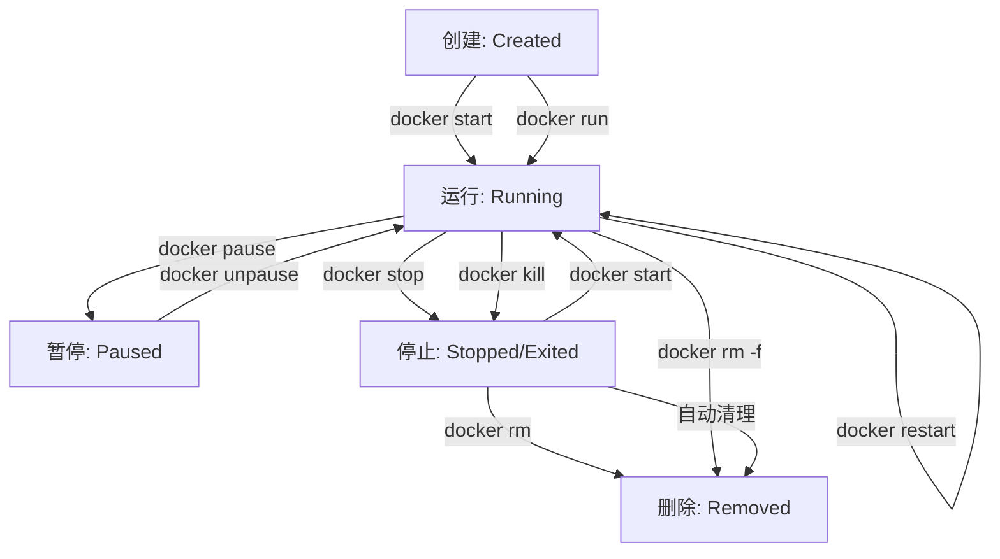
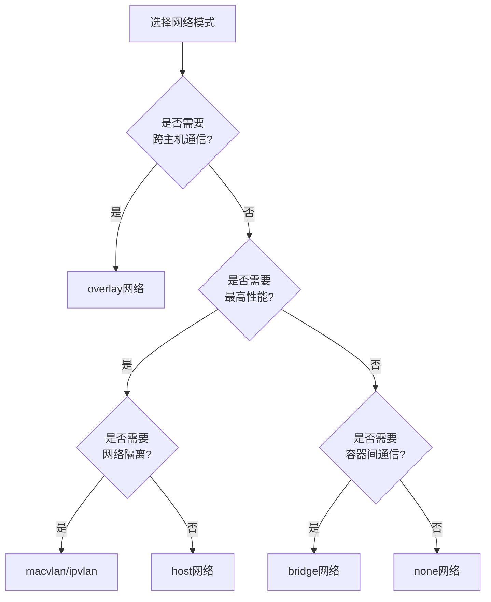

# Docker命令行工具使用  

Docker命令行工具是与Docker引擎交互的主要方式，掌握这些命令可以帮助开发者和运维人员高效地管理容器、镜像、网络和存储。本文将系统介绍Docker命令行的使用方法，从基础到高级，帮助读者全面掌握Docker的操作技巧。

## 1. 基础命令结构  

Docker命令行遵循一致的结构模式，理解这种模式有助于快速掌握各种命令。

### 1.1 命令格式规范  

Docker命令的基本格式如下：

```text
docker [选项] 命令 [子命令] [参数]
```

这种结构可以分解为：
- **docker**：基本调用命令
- **选项**：全局选项，影响docker命令本身的行为
- **命令**：主要操作类别（如run, build, pull等）
- **子命令**：特定命令的进一步操作（如network create）
- **参数**：命令所需的具体参数和标志

示例解析：
```powershell
docker --log-level debug container ls --all --format "{{.Names}}"
#      [全局选项]     [命令]  [子命令] [参数]        [参数值]
```

### 1.2 全局选项  

全局选项适用于所有Docker命令，用于控制Docker CLI的行为：

| 选项                | 作用                           | 示例                                      |  
|---------------------|--------------------------------|-------------------------------------------|  
| --debug, -D         | 启用调试模式                   | docker --debug ps                         |  
| --host, -H          | 指定Docker守护进程地址         | docker --host tcp://192.168.1.100:2375 ps |  
| --log-level         | 设置日志级别                   | docker --log-level info ps                |  
| --tls               | 使用TLS连接                    | docker --tls ps                           |  
| --tlscert           | TLS证书文件路径                | docker --tlscert cert.pem ps              |  
| --config            | 指定配置文件目录               | docker --config ~/.docker ps              |  
| --context           | 指定Docker上下文               | docker --context remote-server ps         |  

获取帮助的方法：

```powershell
# 查看全局帮助
docker --help

# 查看特定命令帮助
docker run --help

# 查看Docker版本
docker version

# 查看系统信息
docker info
```

## 2. 容器生命周期管理  

容器的生命周期管理是Docker最基本的功能，包括创建、启动、停止和删除容器等操作。

### 2.1 容器操作命令集  

#### 创建和运行容器

```powershell
# 创建并启动容器（前台运行）
docker run nginx:alpine

# 创建并启动容器（后台运行）
docker run -d --name myapp -p 8080:80 nginx:alpine

# 创建并启动容器（交互式终端）
docker run -it --name myshell ubuntu:20.04 bash

# 使用环境变量
docker run -e DB_HOST=mysql -e DB_PORT=3306 myapp

# 限制资源使用
docker run --memory=512m --cpus=0.5 --name limited-app nginx:alpine
```

`docker run`常用参数说明：

| 参数                | 作用                           | 示例                                |
|---------------------|--------------------------------|-------------------------------------|
| -d, --detach        | 后台运行容器                   | docker run -d nginx                 |
| -i, --interactive   | 保持STDIN开放                  | docker run -i ubuntu bash           |
| -t, --tty           | 分配伪终端                     | docker run -t ubuntu bash           |
| --name              | 指定容器名称                   | docker run --name web nginx         |
| -p, --publish       | 映射端口                       | docker run -p 8080:80 nginx         |
| -v, --volume        | 挂载卷或绑定挂载               | docker run -v data:/app/data nginx  |
| -e, --env           | 设置环境变量                   | docker run -e DEBUG=true app        |
| --network           | 连接到网络                     | docker run --network mynet app      |
| --restart           | 设置重启策略                   | docker run --restart always nginx   |
| --rm                | 容器停止后自动删除             | docker run --rm nginx               |

#### 管理运行中的容器

```powershell
# 查看所有容器
docker ps -a

# 格式化输出容器列表
docker ps --format "table {{.ID}}\t{{.Names}}\t{{.Status}}\t{{.Ports}}"

# 停止容器（优雅停止，等待最多10秒）
docker stop myapp --time 10

# 强制停止容器
docker kill myapp

# 暂停容器
docker pause myapp

# 恢复暂停的容器
docker unpause myapp

# 重启容器
docker restart myapp

# 进入运行中的容器
docker exec -it myapp sh

# 在容器中执行命令并获取输出
docker exec myapp cat /etc/nginx/nginx.conf
```

#### 容器清理操作

```powershell
# 删除已停止的容器
docker rm myapp

# 删除容器及其卷
docker rm -v myapp

# 强制删除运行中的容器
docker rm -f myapp

# 批量删除所有已停止的容器
docker container prune

# 批量删除所有容器（包括运行中的）
docker rm -f $(docker ps -aq)
```

### 2.2 状态转换流程  

容器在其生命周期中会经历多种状态，了解这些状态及其转换关系有助于更好地管理容器：



查看容器状态的命令：

```powershell
# 查看容器详细信息（包括状态）
docker inspect myapp

# 仅查看容器状态
docker inspect --format='{{.State.Status}}' myapp

# 查看容器健康状态（如果配置了健康检查）
docker inspect --format='{{.State.Health.Status}}' myapp
```

容器状态码及其含义：

| 状态码    | 描述                           | 常见原因                                |
|-----------|--------------------------------|----------------------------------------|
| created   | 已创建但未启动                 | 容器刚被创建，尚未调用start命令        |
| running   | 正在运行                       | 容器进程正常运行中                      |
| paused    | 已暂停                         | 容器进程被暂停（通过pause命令）        |
| exited    | 已退出                         | 容器主进程已结束，可能正常或异常退出   |
| restarting| 重启中                         | 容器正在重启过程中                      |
| dead      | 死亡状态                       | 容器无法正常工作且无法被移除           |

## 3. 镜像管理  

Docker镜像是容器的基础，包含了应用程序运行所需的所有文件和配置。

### 3.1 镜像操作命令  

#### 搜索和拉取镜像

```powershell
# 搜索镜像
docker search --filter=stars=100 nginx

# 拉取镜像（默认latest标签）
docker pull nginx

# 拉取特定版本镜像
docker pull nginx:1.21.6-alpine

# 拉取特定平台的镜像
docker pull --platform linux/amd64 mysql:8.0

# 拉取镜像摘要（确保获取特定版本）
docker pull nginx@sha256:2f1cd90e00fe2c991e18272bb35d8dd5fce44d2cec32451ba5b49ceda0a5452d
```

#### 查看和管理本地镜像

```powershell
# 列出本地镜像
docker images

# 格式化输出镜像列表
docker images --format "table {{.Repository}}\t{{.Tag}}\t{{.Size}}"

# 查看镜像详细信息
docker inspect nginx:alpine

# 查看镜像历史和层信息
docker history --no-trunc nginx:alpine

# 为镜像添加标签
docker tag nginx:latest myregistry.com/myapp/nginx:v1

# 删除镜像
docker rmi nginx:alpine

# 强制删除镜像（即使有容器使用它）
docker rmi -f nginx:alpine

# 删除所有未使用的镜像
docker image prune -a
```

#### 构建自定义镜像

```powershell
# 从Dockerfile构建镜像
docker build -t myapp:1.0 .

# 指定Dockerfile路径
docker build -t myapp:1.0 -f c:\project\kphub\Dockerfile.prod .

# 构建时传递构建参数
docker build --build-arg VERSION=1.2.3 -t myapp:1.0 .

# 不使用缓存构建
docker build --no-cache -t myapp:1.0 .

# 多平台构建
docker buildx build --platform linux/amd64,linux/arm64 -t myapp:1.0 .
```

### 3.2 镜像导出导入  

在无网络环境或需要备份镜像时，可以使用导出导入功能：

```powershell
# 导出镜像为tar包
docker save -o c:\project\kphub\backup\nginx.tar nginx:alpine

# 导出多个镜像到一个tar包
docker save -o c:\project\kphub\backup\images.tar nginx:alpine mysql:8.0

# 从tar包导入镜像
docker load -i c:\project\kphub\backup\nginx.tar

# 查看tar包中的镜像信息（不导入）
docker load --input c:\project\kphub\backup\nginx.tar --quiet
```

与容器导出的区别：

```powershell
# 将容器导出为镜像tar包
docker export myapp > c:\project\kphub\backup\myapp-container.tar

# 从容器导出的tar包导入为镜像
cat c:\project\kphub\backup\myapp-container.tar | docker import - myapp:exported
```

`save/load`与`export/import`的区别：
- `save/load`：保留镜像的所有层和历史记录，适合镜像备份
- `export/import`：将容器文件系统导出为单层镜像，丢失历史和元数据，适合容器快照

### 3.3 镜像仓库操作

```powershell
# 登录到Docker Hub
docker login

# 登录到私有仓库
docker login myregistry.com:5000 -u username -p password

# 推送镜像到仓库
docker push myregistry.com/myapp:1.0

# 从私有仓库拉取镜像
docker pull myregistry.com/myapp:1.0

# 注销登录
docker logout
```

## 4. 网络管理  

Docker网络允许容器之间以及容器与外部世界进行通信。

### 4.1 网络操作示例  

#### 网络创建和管理

```powershell
# 列出所有网络
docker network ls

# 创建自定义网络（bridge类型）
docker network create --driver bridge --subnet 172.28.0.0/16 --gateway 172.28.0.1 mynet

# 创建具有IPv6支持的网络
docker network create --ipv6 --subnet 2001:db8::/64 mynet-ipv6

# 检查网络详情
docker network inspect mynet

# 删除网络
docker network rm mynet

# 清理未使用的网络
docker network prune
```

#### 容器网络连接

```powershell
# 创建容器并连接到指定网络
docker run --network mynet --name container1 -d nginx:alpine

# 将运行中的容器连接到网络
docker network connect mynet container2

# 指定IP地址连接到网络
docker network connect --ip 172.28.5.10 mynet container3

# 断开容器与网络的连接
docker network disconnect mynet container1
```

#### 网络故障排查

```powershell
# 查看容器网络设置
docker inspect --format='{{json .NetworkSettings.Networks}}' container1

# 在容器间测试网络连通性
docker exec container1 ping container2

# 查看容器网络接口
docker exec container1 ip addr show

# 查看容器DNS配置
docker exec container1 cat /etc/resolv.conf
```

### 4.2 网络类型对比  

Docker提供多种网络驱动，适用于不同场景：

| 类型       | 隔离性 | 性能   | 适用场景                     | 特点                                |  
|------------|--------|--------|------------------------------|-------------------------------------|  
| bridge     | 中     | 中     | 单主机容器通信               | 默认网络，容器间可通过IP通信        |  
| host       | 低     | 高     | 高性能需求                   | 共享主机网络栈，无网络隔离          |  
| none       | 高     | 低     | 安全敏感应用                 | 无网络连接，完全隔离                |  
| overlay    | 高     | 低     | 跨主机容器网络               | Swarm模式下多主机容器通信           |  
| macvlan    | 中     | 高     | 需要物理网络特性的应用       | 容器拥有MAC地址，直接连接物理网络   |  
| ipvlan     | 中     | 高     | IP地址受限环境               | 共享MAC地址，每个容器有独立IP       |  

网络模式选择流程图：



## 5. 数据卷管理  

Docker数据卷提供了持久化数据和在容器间共享数据的能力。

### 5.1 数据持久化操作  

#### 数据卷创建和管理

```powershell
# 列出所有数据卷
docker volume ls

# 创建数据卷
docker volume create app_data

# 创建具有标签的数据卷
docker volume create --label environment=production db_data

# 查看数据卷详情
docker volume inspect app_data

# 删除数据卷
docker volume rm app_data

# 清理未使用的数据卷
docker volume prune

# 强制清理所有未使用的数据卷（包括有标签的）
docker volume prune -af
```

#### 使用数据卷

```powershell
# 创建使用数据卷的容器
docker run -v app_data:/var/lib/mysql mysql:8.0

# 使用只读数据卷
docker run -v app_data:/app/config:ro myapp

# 使用匿名数据卷
docker run -v /var/lib/mysql mysql:8.0

# 在docker-compose中使用命名数据卷
# docker-compose.yml示例:
```

```yaml:c:\project\kphub\docker-compose.yml
version: '3.8'
services:
  db:
    image: mysql:8.0
    volumes:
      - db_data:/var/lib/mysql
volumes:
  db_data:
```

### 5.2 绑定挂载示例  

绑定挂载允许将主机上的文件或目录挂载到容器中：

```powershell
# 挂载主机目录到容器
docker run -v c:\project\kphub\data:/app/data myapp

# 挂载单个文件
docker run -v c:\project\kphub\config\app.conf:/etc/app/app.conf myapp

# 使用只读绑定挂载
docker run -v c:\project\kphub\config:/etc/app:ro myapp

# 使用相对路径（相对于当前工作目录）
# 注意：在Windows中使用相对路径时需要特别注意路径格式
docker run -v ${PWD}/data:/app/data myapp
```

### 5.3 临时文件系统挂载

```powershell
# 创建临时文件系统挂载
docker run --tmpfs /tmp:rw,size=100M,noexec myapp

# 组合使用数据卷和临时文件系统
docker run -v app_data:/app/data --tmpfs /app/cache myapp
```

数据管理策略对比：

| 存储类型     | 持久性 | 性能   | 适用场景                     | 特点                                |  
|--------------|--------|--------|------------------------------|-------------------------------------|  
| 数据卷       | 高     | 高     | 数据库、持久化应用数据       | 由Docker管理，独立于容器生命周期    |  
| 绑定挂载     | 高     | 中     | 开发环境、配置文件           | 依赖主机文件系统，方便开发时修改    |  
| tmpfs挂载    | 低     | 极高   | 临时数据、敏感信息           | 存储在内存中，容器停止后数据消失    |  

## 6. 日志与监控  

监控容器状态和查看日志是排查问题的关键工具。

### 6.1 日志查看技巧  

Docker提供了多种查看和管理容器日志的方法：

```powershell
# 查看容器日志
docker logs myapp

# 跟踪实时日志（类似tail -f）
docker logs -f --tail 100 myapp

# 显示时间戳
docker logs --timestamps myapp

# 按时间过滤日志
docker logs --since 2023-01-01T00:00:00 myapp
docker logs --until 2023-01-02T00:00:00 myapp

# 查看最近30分钟的日志
docker logs --since 30m myapp

# 限制输出行数
docker logs --tail 50 myapp

# 格式化日志输出（需要容器使用json-file日志驱动）
docker logs --details myapp
```

配置容器日志驱动：

```powershell
# 使用特定日志驱动启动容器
docker run --log-driver json-file --log-opt max-size=10m --log-opt max-file=3 nginx

# 全局配置日志驱动（在daemon.json中）
```

```json:c:\project\kphub\config\docker\daemon.json
{
  "log-driver": "json-file",
  "log-opts": {
    "max-size": "10m",
    "max-file": "3"
  }
}
```

### 6.2 资源监控命令  

监控容器资源使用情况：

```powershell
# 查看所有容器资源使用情况
docker stats

# 格式化输出特定指标
docker stats --format "table {{.Container}}\t{{.CPUPerc}}\t{{.MemUsage}}\t{{.NetIO}}"

# 只查看特定容器
docker stats myapp mysql

# 查看容器进程
docker top myapp

# 使用特定格式查看进程
docker top myapp -eo pid,ppid,cmd,pcpu,pmem

# 检查容器详细状态
docker inspect --format='{{json .State}}' myapp | ConvertFrom-Json
```

资源限制设置：

```powershell
# 限制CPU和内存
docker run --cpus=0.5 --memory=512m --memory-swap=1g myapp

# 设置重启策略
docker run --restart=always myapp

# 设置健康检查
docker run --health-cmd="curl -f http://localhost/ || exit 1" --health-interval=30s nginx
```

## 7. 高级使用技巧  

掌握高级技巧可以提高Docker使用效率。

### 7.1 命令自动补全  

在Windows PowerShell中配置Docker命令自动补全：

```powershell
# 安装PowerShell补全
Register-ArgumentCompleter -CommandName docker -ScriptBlock {
    param($wordToComplete, $commandAst, $cursorPosition)
    docker --help | Where-Object { $_ -like "*$wordToComplete*" }
}

# 保存到PowerShell配置文件
$profilePath = $PROFILE.CurrentUserAllHosts
if (-not (Test-Path $profilePath)) {
    New-Item -Path $profilePath -ItemType File -Force
}
Add-Content -Path $profilePath -Value @'
Register-ArgumentCompleter -CommandName docker -ScriptBlock {
    param($wordToComplete, $commandAst, $cursorPosition)
    docker --help | Where-Object { $_ -like "*$wordToComplete*" }
}
'@
```

在Linux Bash中配置Docker命令自动补全：

```bash
# 安装bash-completion
sudo apt-get update
sudo apt-get install -y bash-completion

# 添加Docker补全脚本
sudo curl -L https://raw.githubusercontent.com/docker/docker-ce/master/components/cli/contrib/completion/bash/docker -o /etc/bash_completion.d/docker

# 重新加载bash配置
source ~/.bashrc
```

### 7.2 批量操作示例  

使用命令组合进行批量操作：

```powershell
# 停止所有运行中的容器
docker stop $(docker ps -q)

# 删除所有已停止的容器
docker container prune

# 删除所有未使用的资源（容器、网络、镜像、卷）
docker system prune -a --volumes

# 删除所有未标记的镜像
docker rmi $(docker images -f "dangling=true" -q)

# 批量重启所有容器
docker restart $(docker ps -q)

# 查找并删除大于1GB的镜像
docker images --format "{{.Repository}}:{{.Tag}} {{.Size}}" | findstr "GB" | ForEach-Object { 
    $image = ($_ -split " ")[0]; 
    Write-Host "Removing $image"; 
    docker rmi $image 
}
```

### 7.3 格式化输出技巧

使用Go模板格式化Docker命令输出：

```powershell
# 自定义容器列表格式
docker ps --format "table {{.ID}}\t{{.Names}}\t{{.Status}}\t{{.Ports}}"

# 输出JSON格式
docker inspect --format='{{json .}}' myapp | ConvertFrom-Json

# 提取特定信息
docker inspect --format='{{.NetworkSettings.IPAddress}}' myapp

# 条件格式化
docker inspect --format='{{if .State.Running}}容器运行中{{else}}容器已停止{{end}}' myapp

# 遍历数组
docker inspect --format='{{range .NetworkSettings.Networks}}{{.IPAddress}}{{end}}' myapp

# 创建自定义报告
docker ps -a --format "table {{.Names}}\t{{.Image}}\t{{.Status}}\t{{.Ports}}" > c:\project\kphub\reports\containers.txt
```

### 7.4 Docker上下文管理

管理多个Docker环境：

```powershell
# 列出所有上下文
docker context ls

# 创建新上下文（连接到远程Docker主机）
docker context create remote-server --docker "host=ssh://user@remote-server"

# 切换上下文
docker context use remote-server

# 在特定上下文中执行命令
docker --context=remote-server ps

# 删除上下文
docker context rm remote-server
```

## 8. 安全最佳实践  

安全使用Docker对于生产环境至关重要。

### 8.1 最小权限原则  

遵循最小权限原则配置容器：

```powershell
# 以非root用户运行容器
docker run --user 1000:1000 myapp

# 使用只读根文件系统
docker run --read-only myapp

# 为可写目录添加临时文件系统
docker run --read-only --tmpfs /tmp --tmpfs /var/run myapp

# 限制内核能力
docker run --cap-drop ALL --cap-add NET_BIND_SERVICE nginx

# 禁止特权提升
docker run --security-opt=no-new-privileges myapp

# 限制系统调用
docker run --security-opt seccomp=c:\project\kphub\config\seccomp-profile.json myapp
```

### 8.2 安全扫描  

扫描镜像中的安全漏洞：

```powershell
# 使用Docker Scan扫描镜像（需要Docker Desktop）
docker scan nginx:alpine

# 使用第三方工具扫描（如Trivy）
docker run --rm -v /var/run/docker.sock:/var/run/docker.sock aquasec/trivy image nginx:alpine

# 定期扫描所有本地镜像
docker images --format "{{.Repository}}:{{.Tag}}" | ForEach-Object {
    Write-Host "Scanning $_..."
    docker scan $_
}
```

### 8.3 内容信任

使用Docker内容信任确保镜像完整性：

```powershell
# 启用Docker内容信任
$env:DOCKER_CONTENT_TRUST=1

# 拉取签名镜像
docker pull nginx:latest

# 推送并签名镜像
docker push myregistry.com/myapp:1.0

# 查看签名信息
docker trust inspect --pretty nginx:latest
```

## 9. Docker Compose命令

Docker Compose是管理多容器应用的工具，提供了一组专用命令。

### 9.1 基本Compose命令

```powershell
# 启动所有服务
docker-compose up -d

# 查看服务状态
docker-compose ps

# 查看服务日志
docker-compose logs -f

# 停止所有服务
docker-compose down

# 重建特定服务
docker-compose up -d --build web

# 扩展服务实例数
docker-compose up -d --scale web=3
```

### 9.2 Compose文件示例

```yaml:c:\project\kphub\docker-compose.yml
version: '3.8'

services:
  web:
    build: .
    ports:
      - "8000:8000"
    depends_on:
      - db
    environment:
      - DATABASE_URL=postgres://postgres:password@db:5432/app
    restart: always

  db:
    image: postgres:13
    volumes:
      - postgres_data:/var/lib/postgresql/data
    environment:
      - POSTGRES_PASSWORD=password
      - POSTGRES_DB=app

volumes:
  postgres_data:
```

## 10. 实用命令速查表

### 10.1 常用命令组合

| 操作目标 | 命令组合 | 说明 |
|----------|----------|------|
| 快速清理 | `docker system prune -af` | 清理所有未使用的容器、网络、镜像和构建缓存 |
| 完全重置 | `docker stop $(docker ps -q) && docker system prune -af --volumes` | 停止所有容器并清理所有资源（包括卷） |
| 镜像瘦身 | `docker build --squash -t myapp:slim .` | 构建压缩层的镜像 |
| 容器调试 | `docker run --rm -it --entrypoint sh myapp` | 以shell方式启动容器进行调试 |
| 资源监控 | `docker stats --no-stream` | 查看所有容器资源使用的快照 |
| 网络调试 | `docker run --rm --net container:myapp nicolaka/netshoot` | 使用网络工具容器调试另一个容器的网络 |

### 10.2 环境变量参考

| 环境变量 | 作用 | 示例 |
|----------|------|------|
| DOCKER_HOST | 指定Docker守护进程地
继续完成Docker命令行工具使用的内容：

### 10.2 环境变量参考

| 环境变量 | 作用 | 示例 |
|----------|------|------|
| DOCKER_HOST | 指定Docker守护进程地址 | `$env:DOCKER_HOST="tcp://192.168.1.100:2375"` |
| DOCKER_TLS_VERIFY | 启用TLS验证 | `$env:DOCKER_TLS_VERIFY=1` |
| DOCKER_CERT_PATH | 指定TLS证书路径 | `$env:DOCKER_CERT_PATH="C:\Users\.docker"` |
| DOCKER_CONFIG | 指定Docker配置目录 | `$env:DOCKER_CONFIG="C:\Users\.docker"` |
| DOCKER_CONTENT_TRUST | 启用内容信任 | `$env:DOCKER_CONTENT_TRUST=1` |
| DOCKER_BUILDKIT | 启用BuildKit构建引擎 | `$env:DOCKER_BUILDKIT=1` |
| DOCKER_CLI_EXPERIMENTAL | 启用实验性功能 | `$env:DOCKER_CLI_EXPERIMENTAL=enabled` |

## 11. 故障排除

### 11.1 常见错误及解决方案

| 错误信息 | 可能原因 | 解决方案 |
|----------|----------|----------|
| `Cannot connect to the Docker daemon` | Docker服务未运行 | 启动Docker服务：`Start-Service docker` |
| `Error response from daemon: conflict` | 容器名称冲突 | 使用不同名称或删除现有容器 |
| `Error pulling image: no space left on device` | 磁盘空间不足 | 清理空间：`docker system prune -af` |
| `Permission denied` | 权限不足 | 使用管理员权限或添加用户到docker组 |
| `Network timeout` | 网络连接问题 | 检查网络设置或配置镜像加速器 |
| `OCI runtime create failed` | 容器配置错误 | 检查容器参数和镜像兼容性 |

### 11.2 诊断工具

```powershell
# 检查Docker服务状态
Get-Service docker

# 查看Docker系统信息
docker info

# 检查Docker磁盘使用情况
docker system df -v

# 验证Docker API连接
docker version

# 检查Docker日志
Get-EventLog -LogName Application -Source docker -Newest 20

# 检查容器健康状态
docker ps --filter health=unhealthy
```

### 11.3 性能优化

```powershell
# 检查容器资源使用情况
docker stats --no-stream

# 限制容器CPU使用
docker update --cpus 0.5 myapp

# 限制容器内存使用
docker update --memory 512M --memory-swap 1G myapp

# 优化存储驱动
# 在daemon.json中配置:
# "storage-driver": "windowsfilter"  # Windows
# "storage-driver": "overlay2"       # Linux

# 清理未使用的数据
docker system prune --volumes
```

## 12. 实战案例

### 12.1 Web应用部署

使用Docker部署一个完整的Web应用：

```powershell
# 创建自定义网络
docker network create webapp-net

# 部署数据库
docker run -d --name webapp-db `
  --network webapp-net `
  -e MYSQL_ROOT_PASSWORD=secret `
  -e MYSQL_DATABASE=webapp `
  -v webapp-db-data:/var/lib/mysql `
  mysql:8.0

# 部署Redis缓存
docker run -d --name webapp-redis `
  --network webapp-net `
  redis:alpine

# 部署Web应用
docker run -d --name webapp `
  --network webapp-net `
  -p 8080:80 `
  -e DB_HOST=webapp-db `
  -e REDIS_HOST=webapp-redis `
  -e DB_PASSWORD=secret `
  --restart always `
  --health-cmd="curl -f http://localhost/health || exit 1" `
  --health-interval=30s `
  mywebapp:latest

# 部署Nginx反向代理
docker run -d --name webapp-proxy `
  --network webapp-net `
  -p 80:80 `
  -v c:\project\kphub\config\nginx\nginx.conf:/etc/nginx/nginx.conf:ro `
  nginx:alpine
```

### 12.2 CI/CD流水线集成

在CI/CD流水线中使用Docker命令：

```yaml:c:\project\kphub\ci\jenkins-pipeline.groovy
pipeline {
    agent any
    
    environment {
        DOCKER_BUILDKIT = '1'
    }
    
    stages {
        stage('Build') {
            steps {
                sh 'docker build -t myapp:${BUILD_NUMBER} .'
                sh 'docker tag myapp:${BUILD_NUMBER} myapp:latest'
            }
        }
        
        stage('Test') {
            steps {
                sh 'docker run --rm myapp:${BUILD_NUMBER} npm test'
            }
        }
        
        stage('Deploy') {
            steps {
                sh 'docker stop myapp || true'
                sh 'docker rm myapp || true'
                sh 'docker run -d --name myapp -p 8080:80 myapp:${BUILD_NUMBER}'
            }
        }
    }
    
    post {
        failure {
            sh 'docker rmi myapp:${BUILD_NUMBER} || true'
        }
    }
}
```

### 12.3 多环境配置管理

使用Docker管理不同环境的配置：

```powershell
# 开发环境
docker-compose -f docker-compose.yml -f docker-compose.dev.yml up -d

# 测试环境
docker-compose -f docker-compose.yml -f docker-compose.test.yml up -d

# 生产环境
docker-compose -f docker-compose.yml -f docker-compose.prod.yml up -d
```

配置文件示例：

```yaml:c:\project\kphub\docker-compose.yml
version: '3.8'
services:
  app:
    image: myapp:latest
    restart: always
```

```yaml:c:\project\kphub\docker-compose.dev.yml
version: '3.8'
services:
  app:
    build: .
    volumes:
      - ./src:/app/src
    environment:
      - NODE_ENV=development
      - DEBUG=true
```

```yaml:c:\project\kphub\docker-compose.prod.yml
version: '3.8'
services:
  app:
    environment:
      - NODE_ENV=production
    deploy:
      replicas: 3
      resources:
        limits:
          cpus: '0.5'
          memory: 512M
```

## 13. 自动化脚本示例

### 13.1 容器健康监控脚本

```powershell:c:\project\kphub\scripts\monitor-containers.ps1
# 容器健康监控脚本
$unhealthyContainers = docker ps --filter health=unhealthy --format "{{.Names}}"

if ($unhealthyContainers) {
    Write-Host "发现不健康的容器:" -ForegroundColor Red
    foreach ($container in $unhealthyContainers) {
        Write-Host "- $container" -ForegroundColor Yellow
        
        # 获取容器日志
        Write-Host "容器日志:" -ForegroundColor Cyan
        docker logs --tail 20 $container
        
        # 尝试重启容器
        Write-Host "尝试重启容器 $container..." -ForegroundColor Cyan
        docker restart $container
        
        # 等待容器启动
        Start-Sleep -Seconds 10
        
        # 检查重启后状态
        $status = docker inspect --format="{{.State.Health.Status}}" $container
        Write-Host "重启后状态: $status" -ForegroundColor $(if ($status -eq "healthy") { "Green" } else { "Red" })
    }
} else {
    Write-Host "所有容器运行正常" -ForegroundColor Green
}

# 检查资源使用情况
Write-Host "`n资源使用情况:" -ForegroundColor Cyan
docker stats --no-stream
```

### 13.2 镜像清理脚本

```powershell:c:\project\kphub\scripts\cleanup-images.ps1
# 镜像清理脚本
param (
    [switch]$DryRun = $false,
    [int]$OlderThanDays = 30,
    [switch]$Force = $false
)

$cutoffDate = (Get-Date).AddDays(-$OlderThanDays)
Write-Host "清理早于 $cutoffDate 的未使用镜像" -ForegroundColor Cyan

# 获取所有镜像
$images = docker images --format "{{.Repository}}:{{.Tag}}|{{.ID}}|{{.CreatedAt}}"

# 获取正在使用的镜像
$usedImages = docker ps -a --format "{{.Image}}"

$totalSpace = 0
$deletedCount = 0

foreach ($image in $images) {
    $imageParts = $image -split "\|"
    $imageName = $imageParts[0]
    $imageId = $imageParts[1]
    $createdAt = [DateTime]::Parse($imageParts[2])
    
    # 跳过正在使用的镜像
    if ($usedImages -contains $imageName -or $usedImages -contains $imageId) {
        Write-Host "跳过正在使用的镜像: $imageName" -ForegroundColor Yellow
        continue
    }
    
    # 检查镜像创建时间
    if ($createdAt -lt $cutoffDate) {
        # 获取镜像大小
        $imageSize = docker image inspect $imageId --format "{{.Size}}"
        $imageSizeMB = [math]::Round($imageSize / 1MB, 2)
        $totalSpace += $imageSizeMB
        
        if ($DryRun) {
            Write-Host "将删除: $imageName (创建于 $createdAt, 大小: $imageSizeMB MB)" -ForegroundColor Yellow
        } else {
            Write-Host "删除: $imageName (创建于 $createdAt, 大小: $imageSizeMB MB)" -ForegroundColor Red
            if ($Force) {
                docker rmi -f $imageId
            } else {
                docker rmi $imageId
            }
            $deletedCount++
        }
    }
}

if ($DryRun) {
    Write-Host "`n模拟运行完成。将释放 $totalSpace MB 空间，共 $deletedCount 个镜像" -ForegroundColor Green
} else {
    Write-Host "`n清理完成。释放了 $totalSpace MB 空间，共删除 $deletedCount 个镜像" -ForegroundColor Green
}
```

## 总结

Docker命令行工具提供了丰富而强大的功能，掌握这些命令可以帮助开发者和运维人员高效地管理容器化应用。从基础的容器生命周期管理到高级的网络配置和安全加固，Docker CLI都提供了直观而灵活的操作方式。

通过本文介绍的命令和技巧，读者可以：
1. 熟练管理容器的创建、启动、停止和删除
2. 高效操作镜像的拉取、构建和推送
3. 灵活配置网络和存储
4. 有效监控容器状态和资源使用
5. 实施安全最佳实践
6. 解决常见问题和故障

随着容器技术的不断发展，Docker命令行工具也在持续更新和改进。建议读者定期查阅官方文档，了解最新的功能和最佳实践。通过日常实践和不断学习，可以充分发挥Docker的强大能力，提升应用开发和部署的效率。