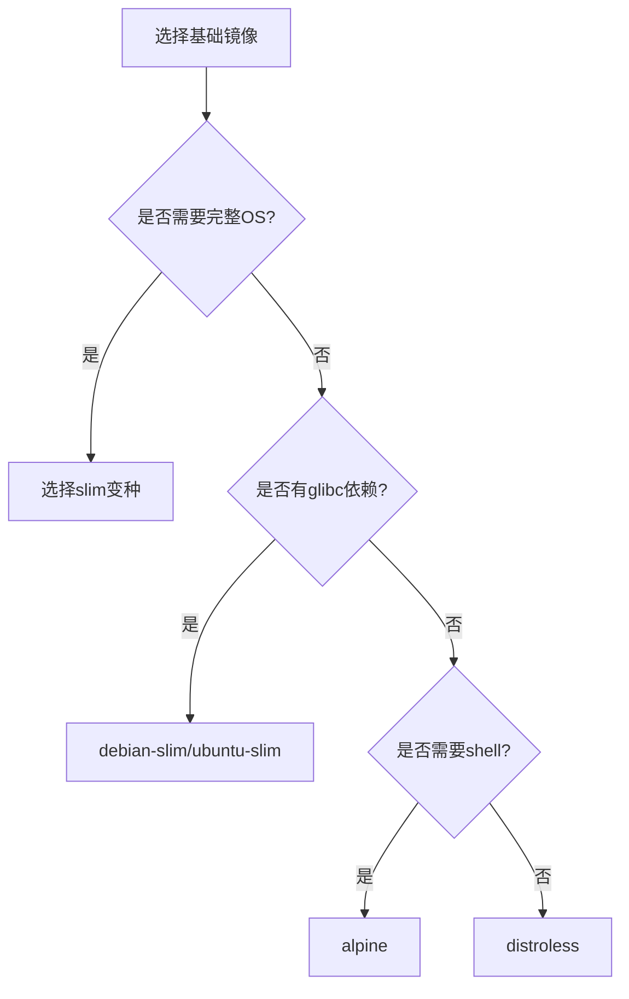
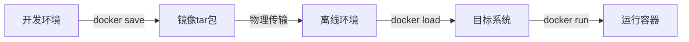
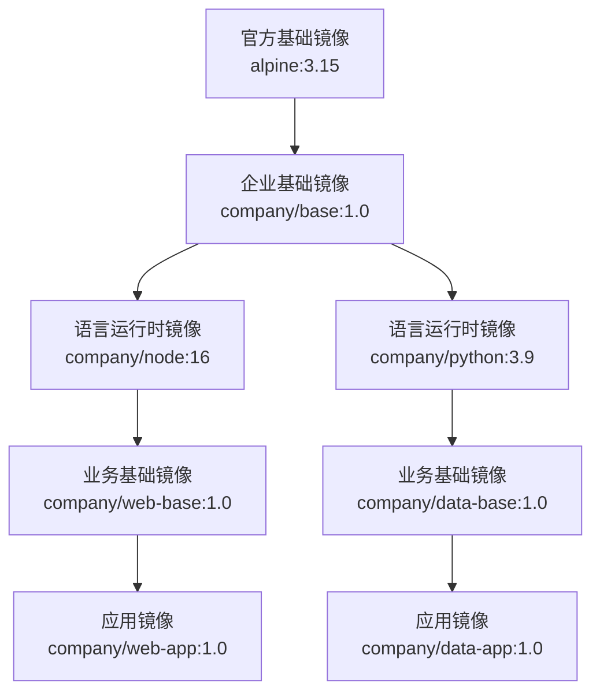

# Docker镜像管理与构建  

Docker镜像是容器的基础，它包含了应用程序运行所需的所有文件和配置。高效管理和构建镜像对于容器化应用的开发和部署至关重要。本文将详细介绍Docker镜像的管理、构建和优化技术，帮助读者掌握从基础到高级的镜像操作技能。

## 1. 镜像基础操作  

Docker镜像是分层的、只读的文件系统，用于创建容器。掌握基础操作是使用Docker的第一步。

### 1.1 镜像仓库操作  

镜像仓库是存储和分发Docker镜像的服务，类似于代码的Git仓库。Docker Hub是默认的公共仓库，企业通常使用私有仓库或云服务商提供的仓库服务。

```powershell
# 登录镜像仓库
docker login registry.cn-hangzhou.aliyuncs.com
# 系统会提示输入用户名和密码

# 从仓库拉取镜像
docker pull nginx:alpine

# 为本地镜像添加标签（准备推送）
docker tag nginx:alpine registry.cn-hangzhou.aliyuncs.com/myproject/nginx:v1

# 推送镜像到仓库
docker push registry.cn-hangzhou.aliyuncs.com/myproject/nginx:v1

# 查看镜像详细信息
docker inspect nginx:alpine

# 注销仓库登录
docker logout registry.cn-hangzhou.aliyuncs.com
```

常见镜像仓库服务对比：

| 仓库服务 | 类型 | 特点 | 适用场景 |
|----------|------|------|----------|
| Docker Hub | 公共/私有 | 官方仓库，集成度高 | 开源项目，个人使用 |
| Harbor | 私有 | 开源，企业级功能 | 企业内部使用 |
| 阿里云容器镜像服务 | 私有 | 国内访问快，安全扫描 | 国内企业使用 |
| AWS ECR | 私有 | 与AWS服务集成 | AWS用户 |
| Azure Container Registry | 私有 | 与Azure服务集成 | Azure用户 |
| Google Container Registry | 私有 | 与GCP服务集成 | GCP用户 |

### 1.2 本地镜像管理  

高效管理本地镜像可以节省磁盘空间并提高工作效率。

```powershell
# 查看本地镜像列表
docker images

# 使用过滤器查看镜像
docker images --filter "dangling=false"
docker images --filter "reference=nginx*"

# 格式化输出镜像列表
docker images --format "table {{.Repository}}\t{{.Tag}}\t{{.Size}}"

# 删除指定镜像
docker rmi nginx:alpine

# 强制删除镜像（即使有容器使用它）
docker rmi -f nginx:alpine

# 删除符合特定模式的镜像
docker rmi -f $(docker images -q --filter "reference=*:test")

# 删除所有未使用的镜像
docker image prune

# 删除所有未被使用的镜像（包括未标记和未被容器使用的）
docker image prune -a

# 删除24小时前创建的未使用镜像
docker image prune -a --filter "until=24h"

# 查看镜像占用空间
docker system df -v
```

镜像标签命名最佳实践：

1. 使用有意义的标签而非`latest`
2. 版本号遵循语义化版本规范（如`v1.2.3`）
3. 对于开发版本，可使用`dev`、`test`或日期标签
4. 考虑使用Git提交哈希作为标签的一部分
5. 对于多架构镜像，可在标签中包含架构信息

```powershell
# 标签命名示例
docker tag myapp:latest myapp:v1.2.3
docker tag myapp:latest myapp:20230601
docker tag myapp:latest myapp:$(git rev-parse --short HEAD)
```

## 2. Dockerfile构建  

Dockerfile是构建Docker镜像的脚本，它包含了一系列指令，用于定义镜像的内容和行为。

### 2.1 基础指令详解  

```dockerfile:c:\project\kphub\docker\Dockerfile
# 基础镜像，所有镜像的起点
FROM alpine:3.15 as builder

# 定义构建参数，可在构建时传入
ARG BUILD_VERSION=1.0
ARG BUILD_DATE

# 设置环境变量，在容器运行时可用
ENV APP_VERSION=$BUILD_VERSION
ENV APP_HOME=/app

# 设置工作目录
WORKDIR $APP_HOME

# 复制文件到镜像
COPY ./src ./src
COPY ["package.json", "package-lock.json", "./"]

# 执行命令
RUN apk add --no-cache build-base && \
    npm ci && \
    make build VERSION=$BUILD_VERSION && \
    rm -rf /var/cache/apk/*

# 声明容器监听的端口
EXPOSE 8080

# 定义数据卷挂载点
VOLUME /app/data

# 设置容器启动时执行的命令
CMD ["npm", "start"]

# 设置容器入口点
ENTRYPOINT ["/usr/local/bin/entrypoint.sh"]

# 健康检查
HEALTHCHECK --interval=30s --timeout=3s --start-period=5s --retries=3 \
    CMD curl -f http://localhost:8080/health || exit 1

# 添加元数据
LABEL maintainer="team@example.com" \
      version="$BUILD_VERSION" \
      description="示例应用"
```

主要Dockerfile指令说明：

| 指令 | 作用 | 最佳实践 |
|------|------|----------|
| FROM | 指定基础镜像 | 使用官方镜像，指定确切版本 |
| ARG | 定义构建参数 | 用于可变内容，如版本号 |
| ENV | 设置环境变量 | 用于配置应用运行环境 |
| WORKDIR | 设置工作目录 | 使用绝对路径，避免使用`RUN cd` |
| COPY/ADD | 复制文件 | 优先使用COPY，ADD用于自动解压 |
| RUN | 执行命令 | 合并多条命令减少层数，清理缓存 |
| EXPOSE | 声明端口 | 仅作为文档，不实际开放端口 |
| VOLUME | 声明挂载点 | 用于持久化数据 |
| CMD | 默认命令 | 提供默认行为，可被覆盖 |
| ENTRYPOINT | 入口点 | 设置固定的启动命令 |
| HEALTHCHECK | 健康检查 | 定义容器健康状态的检测方法 |
| LABEL | 添加元数据 | 用于版本、维护者等信息 |

### 2.2 构建上下文优化  

构建上下文是指发送给Docker守护进程的文件集合，优化上下文可以提高构建速度和效率。

```powershell
# 基本构建命令
docker build -t myapp:latest .

# 指定Dockerfile路径
docker build -f c:\project\kphub\docker\Dockerfile -t myapp:latest .

# 不使用缓存构建
docker build -f c:\project\kphub\docker\Dockerfile --no-cache -t myapp .

# 显示构建过程详情
docker build -f c:\project\kphub\docker\Dockerfile --progress=plain -t myapp .

# 查看构建上下文大小
docker build -f c:\project\kphub\docker\Dockerfile --progress=plain . 2>&1 | Select-String "Sending build context"

# 使用标准输入作为Dockerfile（无上下文）
Get-Content c:\project\kphub\docker\Dockerfile | docker build -t myapp -
```

优化构建上下文的方法：

1. 使用`.dockerignore`文件排除不需要的文件

```text:c:\project\kphub\docker\.dockerignore
# 版本控制
.git
.gitignore

# 开发环境
node_modules
npm-debug.log
yarn-error.log

# 编译输出
dist
build
*.o
*.obj

# 测试和文档
test
docs
*.md

# 其他
.DS_Store
.env
.env.*
```

2. 最小化构建目录，只包含必要文件
3. 使用多阶段构建分离构建环境和运行环境
4. 考虑使用BuildKit的外部缓存功能

```powershell
# 使用BuildKit的缓存挂载功能
$env:DOCKER_BUILDKIT=1
docker build --build-arg BUILDKIT_INLINE_CACHE=1 -t myapp .
```

## 3. 多阶段构建  

多阶段构建允许在单个Dockerfile中使用多个FROM指令，每个指令开始一个新的构建阶段，可以选择性地将文件从一个阶段复制到另一个阶段。

### 3.1 多阶段构建示例  

```dockerfile:c:\project\kphub\docker\multistage.dockerfile
# 构建阶段 - 编译应用
FROM golang:1.19 AS build
WORKDIR /src
COPY go.mod go.sum ./
RUN go mod download
COPY . .
RUN CGO_ENABLED=0 GOOS=linux go build -o /app -ldflags="-s -w" .

# 测试阶段 - 运行单元测试
FROM build AS test
RUN go test -v ./...

# 安全扫描阶段
FROM aquasec/trivy:latest AS security-scan
COPY --from=build /app /app
RUN trivy filesystem --exit-code 1 --severity HIGH,CRITICAL /app

# 最终阶段 - 创建最小运行镜像
FROM alpine:3.15
RUN apk --no-cache add ca-certificates tzdata
WORKDIR /root/
# 仅从构建阶段复制编译好的应用
COPY --from=build /app .
# 设置时区
ENV TZ=Asia/Shanghai
# 配置健康检查
HEALTHCHECK --interval=30s --timeout=3s CMD wget -q -O - http://localhost:8080/health || exit 1
# 暴露应用端口
EXPOSE 8080
# 启动应用
ENTRYPOINT ["./app"]
```

多阶段构建的优势：

1. 显著减小最终镜像大小
2. 分离构建环境和运行环境
3. 提高安全性（减少攻击面）
4. 简化CI/CD流程
5. 可以只构建特定阶段

```powershell
# 只构建到特定阶段
docker build --target build -t myapp:build -f c:\project\kphub\docker\multistage.dockerfile .

# 构建所有阶段但跳过测试
docker build --target security-scan -t myapp:scan -f c:\project\kphub\docker\multistage.dockerfile .
```

### 3.2 构建缓存控制  

有效利用构建缓存可以大幅提高构建速度。

```powershell
# 使用缓存构建
docker build -t myapp:new .

# 指定缓存来源（可以是之前的镜像）
docker build --cache-from=myapp:latest -t myapp:new .

# 从特定指令开始不使用缓存
docker build --no-cache --build-arg CACHEBUST=$(date +%s) -t myapp:new .

# 导出/导入构建缓存
docker build --output type=local,dest=c:\project\kphub\cache .
docker build --cache-from type=local,src=c:\project\kphub\cache .
```

缓存失效的常见原因：

1. Dockerfile指令发生变化
2. COPY/ADD的文件内容变化
3. 构建参数(ARG)值变化
4. 基础镜像更新

缓存优化策略：

```dockerfile:c:\project\kphub\docker\cache-optimized.dockerfile
FROM node:16-alpine

WORKDIR /app

# 先复制依赖文件，利用缓存
COPY package.json package-lock.json ./
RUN npm ci

# 再复制源代码（经常变化的部分）
COPY . .

# 构建应用
RUN npm run build

CMD ["npm", "start"]
```

## 4. 镜像优化策略  

优化Docker镜像可以减小体积、提高安全性和启动速度。

### 4.1 层合并技术  

Docker镜像由多个层组成，每个指令创建一个新层。减少层数可以优化镜像大小和性能。

```dockerfile:c:\project\kphub\docker\layer-optimized.dockerfile
FROM debian:bullseye-slim

# 不推荐：每个RUN创建一个新层
RUN apt-get update
RUN apt-get install -y curl
RUN apt-get install -y nginx
RUN rm -rf /var/lib/apt/lists/*

# 推荐：合并RUN指令减少层数
RUN apt-get update && \
    apt-get install -y \
    curl \
    nginx && \
    rm -rf /var/lib/apt/lists/*

# 使用多行格式提高可读性
RUN set -ex; \
    apt-get update; \
    apt-get install -y \
        curl \
        nginx; \
    rm -rf /var/lib/apt/lists/*; \
    mkdir -p /app/logs
```

层优化的关键点：

1. 合并相关的RUN指令
2. 在同一层中安装和清理
3. 使用`&&`和`\`组织多行命令
4. 考虑指令的变化频率，将不常变化的指令放在前面

### 4.2 镜像瘦身方法  

减小镜像体积可以加快部署速度、减少存储成本并提高安全性。

```dockerfile:c:\project\kphub\docker\slim.dockerfile
# 使用Alpine作为基础镜像
FROM alpine:3.15

# 安装依赖并清理缓存（单层操作）
RUN apk add --no-cache \
    python3 \
    py3-pip \
    && pip3 install --no-cache-dir requests

# 删除不必要的文件
RUN rm -rf /tmp/* /var/cache/apk/*

# 使用非root用户运行
RUN addgroup -g 1000 appuser && \
    adduser -u 1000 -G appuser -h /app -D appuser
USER appuser
WORKDIR /app

COPY --chown=appuser:appuser ./app .

CMD ["python3", "app.py"]
```

镜像分析和瘦身工具：

```powershell
# 使用dive分析镜像层
docker run --rm -it -v /var/run/docker.sock:/var/run/docker.sock wagoodman/dive:latest myapp:latest

# 使用docker-slim自动优化镜像
docker run --rm -it -v /var/run/docker.sock:/var/run/docker.sock dslim/slim build --http-probe=false myapp:latest

# 使用docker history查看各层大小
docker history --no-trunc --format "{{.Size}}\t{{.CreatedBy}}" myapp:latest
```

瘦身策略对比：

| 策略 | 优点 | 缺点 | 适用场景 |
|------|------|------|----------|
| 使用Alpine基础镜像 | 体积小（5MB左右） | 使用musl libc可能兼容性问题 | 简单应用，无特殊依赖 |
| 使用slim变种镜像 | 兼容性好，体积适中 | 比Alpine大 | 需要glibc的应用 |
| 多阶段构建 | 高度定制，只包含必要组件 | 需要精心设计 | 几乎所有场景 |
| 使用distroless镜像 | 极小攻击面，安全性高 | 缺少调试工具 | 生产环境，安全敏感应用 |
| 使用docker-slim工具 | 自动优化，效果显著 | 可能影响功能 | 需要极致优化的场景 |

基础镜像选择流程图：



## 5. 高级构建技巧  

掌握高级构建技巧可以提高构建效率和镜像质量。

### 5.1 BuildKit特性  

BuildKit是Docker的下一代构建引擎，提供了更多高级特性。

```powershell
# 启用BuildKit
$env:DOCKER_BUILDKIT=1

# 使用SSH转发进行私有仓库认证
docker build --ssh default -t myapp .

# 使用秘密构建参数
docker build --secret id=mysecret,src=c:\project\kphub\secrets\api_key.txt -t myapp .

# 并行构建多个阶段
docker build --progress=plain -t myapp .

# 导出构建结果（不仅是镜像）
docker build --output type=local,dest=c:\project\kphub\output .
```

在Dockerfile中使用BuildKit特性：

```dockerfile:c:\project\kphub\docker\buildkit.dockerfile
# 启用BuildKit语法
# syntax=docker/dockerfile:1.4

FROM alpine:3.15

# 使用秘密挂载（不会保存在镜像层中）
RUN --mount=type=secret,id=mysecret \
    cat /run/secrets/mysecret > /app/config

# 使用SSH挂载克隆私有仓库
RUN --mount=type=ssh \
    git clone git@github.com:private/repo.git

# 使用缓存挂载加速构建
RUN --mount=type=cache,target=/var/cache/apt \
    apt-get update && apt-get install -y package

# 内联Dockerfile构建
COPY --from=inline:c:\project\kphub\docker\helper.dockerfile /output /app/helper
```

### 5.2 跨平台构建  

Docker支持构建适用于不同CPU架构的镜像。

```powershell
# 创建并使用buildx构建器
docker buildx create --name mybuilder --use

# 检查支持的平台
docker buildx inspect --bootstrap

# 构建多平台镜像并推送到仓库
docker buildx build --platform linux/amd64,linux/arm64 -t username/myapp:multiarch --push .

# 构建多平台镜像到本地
docker buildx build --platform linux/amd64,linux/arm64 -t username/myapp:multiarch --load .

# 查看镜像支持的平台
docker buildx imagetools inspect username/myapp:multiarch
```

多架构镜像清单：

```powershell
# 创建多架构清单
docker manifest create myapp:latest \
  myapp:amd64 \
  myapp:arm64

# 添加架构注解
docker manifest annotate myapp:latest myapp:arm64 --arch arm64

# 推送清单
docker manifest push myapp:latest
```

## 6. 安全扫描  

确保Docker镜像的安全性对于生产环境至关重要。

### 6.1 漏洞扫描  

定期扫描镜像中的安全漏洞是DevSecOps的重要实践。

```powershell
# 使用Trivy扫描镜像漏洞
docker run --rm -v /var/run/docker.sock:/var/run/docker.sock aquasec/trivy:latest image myapp:latest

# 仅扫描高危和严重漏洞
docker run --rm -v /var/run/docker.sock:/var/run/docker.sock aquasec/trivy:latest image --severity HIGH,CRITICAL myapp:latest

# 生成HTML报告
docker run --rm -v /var/run/docker.sock:/var/run/docker.sock -v c:\project\kphub\reports:/reports aquasec/trivy:latest image -f html -o /reports/scan.html myapp:latest

# 集成到CI/CD流水线（失败条件）
docker run --rm -v /var/run/docker.sock:/var/run/docker.sock aquasec/trivy:latest image --exit-code 1 --severity CRITICAL myapp:latest
```

其他安全扫描工具：

| 工具 | 特点 | 适用场景 |
|------|------|----------|
| Trivy | 轻量级，易用，开源 | 通用扫描，CI/CD集成 |
| Clair | 深度扫描，可扩展 | 企业级安全需求 |
| Anchore | 策略驱动，合规检查 | 严格合规要求 |
| Snyk | 漏洞数据库全面，修复建议 | 开发阶段集成 |
| Docker Scout | 与Docker Desktop集成 | Docker用户 |

### 6.2 签名验证  

使用内容信任机制确保镜像的完整性和来源。

```powershell
# 启用内容信任
$env:DOCKER_CONTENT_TRUST=1

# 拉取签名镜像（会验证签名）
docker pull docker.io/library/nginx:latest

# 推送并签名镜像
docker push myregistry.com/myapp:latest

# 查看签名信息
docker trust inspect --pretty myregistry.com/myapp:latest

# 添加签名者
docker trust signer add --key cert.pem username myregistry.com/myapp
```

镜像签名最佳实践：

1. 在CI/CD流水线中自动签名镜像
2. 安全存储签名密钥
3. 在生产环境强制验证签名
4. 定期轮换签名密钥
5. 使用硬件安全模块(HSM)保护密钥

## 7. 镜像分发  

高效分发镜像是容器化应用部署的关键环节。

### 7.1 离线分发方案  

在无网络或网络受限环境中分发Docker镜像。

```powershell
# 导出单个镜像为tar包
docker save -o c:\project\kphub\backup\myapp.tar myapp:latest

# 导出多个镜像到一个tar包
docker save -o c:\project\kphub\backup\images.tar nginx:alpine redis:6 myapp:latest

# 查看tar包内容
tar -tf c:\project\kphub\backup\myapp.tar

# 导入镜像
docker load -i c:\project\kphub\backup\myapp.tar

# 批量导出所有本地镜像
docker images --format "{{.Repository}}:{{.Tag}}" | ForEach-Object {
    $imageName = $_ -replace "/", "-"
    docker save -o "c:\project\kphub\backup\$imageName.tar" $_
}
```

离线分发流程：



### 7.2 私有仓库部署  

部署私有Docker镜像仓库，用于团队内部共享镜像。

```powershell
# 启动简单的私有仓库
docker run -d -p 5000:5000 --restart=always --name registry registry:2

# 配置TLS的安全仓库
docker run -d -p 5000:5000 --restart=always --name registry `
  -v c:\project\kphub\certs:/certs `
  -e REGISTRY_HTTP_TLS_CERTIFICATE=/certs/domain.crt `
  -e REGISTRY_HTTP_TLS_KEY=/certs/domain.key `
  registry:2

# 配置认证的仓库
docker run -d -p 5000:5000 --restart=always --name registry `
  -v c:\project\kphub\auth:/auth `
  -e "REGISTRY_AUTH=htpasswd" `
  -e "REGISTRY_AUTH_HTPASSWD_REALM=Registry Realm" `
  -e "REGISTRY_AUTH_HTPASSWD_PATH=/auth/htpasswd" `
  registry:2

# 创建认证文件
docker run --rm --entrypoint htpasswd httpd:2 -Bbn username password > c:\project\kphub\auth\htpasswd

# 推送镜像到私有仓库
docker tag myapp:latest localhost:5000/myapp:latest
docker push localhost:5000/myapp:latest

# 从私有仓库拉取镜像
docker pull localhost:5000/myapp:latest

# 查看仓库中的镜像列表
curl -X GET http://localhost:5000/v2/_catalog
curl -X GET http://localhost:5000/v2/myapp/tags/list
```

企业级镜像仓库解决方案：

| 解决方案 | 特点 | 适用场景 |
|----------|------|----------|
| Harbor | 开源，企业级功能，RBAC | 中大型企业 |
| Nexus Repository | 多种制品类型支持 | 需要管理多种制品的团队 |
| JFrog Artifactory | 商业支持，高可用 | 大型企业，关键业务 |
| GitLab Container Registry | 与GitLab集成 | GitLab用户 |
| Docker Registry | 轻量级，官方支持 | 小型团队，简单需求 |

## 8. CI/CD集成

将Docker镜像构建集成到持续集成和持续部署流程中。

### 8.1 GitHub Actions集成

```yaml:c:\project\kphub\github\workflows\docker-build.yml
name: Build and Push Docker Image

on:
  push:
    branches: [ main ]
    tags: [ 'v*' ]
  pull_request:
    branches: [ main ]

jobs:
  build:
    runs-on: ubuntu-latest
    steps:
      - name: Checkout code
        uses: actions/checkout@v3

      - name: Set up Docker Buildx
        uses: docker/setup-buildx-action@v2

      - name: Login to DockerHub
        if: github.event_name != 'pull_request'
        uses: docker/login-action@v2
        with:
          username: ${{ secrets.DOCKERHUB_USERNAME }}
          password: ${{ secrets.DOCKERHUB_TOKEN }}

      - name: Extract metadata
        id: meta
        uses: docker/metadata-action@v4
        with:
          images: username/myapp
          tags: |
            type=semver,pattern={{version}}
            type=ref,event=branch
            type=sha,format=short

      - name: Build and push
        uses: docker/build-push-action@v4
        with:
          context: .
          push: ${{ github.event_name != 'pull_request' }}
          tags: ${{ steps.meta.outputs.tags }}
          labels: ${{ steps.meta.outputs.labels }}
          cache-from: type=gha
          cache-to: type=gha,mode=max
```

### 8.2 Jenkins Pipeline集成

```groovy:c:\project\kphub\jenkins\Jenkinsfile
pipeline {
    agent any
    
    environment {
        DOCKER_BUILDKIT = '1'
        DOCKER_REGISTRY = 'registry.example.com'
        IMAGE_NAME = 'myapp'
        IMAGE_TAG = "${env.BUILD_NUMBER}"
    }
    
    stages {
        stage('Checkout') {
            steps {
                checkout scm
            }
        }
        
        stage('Build') {
            steps {
                sh "docker build -t ${DOCKER_REGISTRY}/${IMAGE_NAME}:${IMAGE_TAG} ."
                sh "docker tag ${DOCKER_REGISTRY}/${IMAGE_NAME}:${IMAGE_TAG} ${DOCKER_REGISTRY}/${IMAGE_NAME}:latest"
            }
        }
        
        stage('Test') {
            steps {
                sh "docker run --rm ${DOCKER_REGISTRY}/${IMAGE_NAME}:${IMAGE_TAG} npm test"
            }
        }
        
        stage('Scan') {
            steps {
                sh "docker run --rm -v /var/run/docker.sock:/var/run/docker.
继续完成Docker镜像管理与构建的内容：

### 8.2 Jenkins Pipeline集成（续）

```groovy:c:\project\kphub\jenkins\Jenkinsfile
                sh "docker run --rm -v /var/run/docker.sock:/var/run/docker.sock aquasec/trivy:latest image --exit-code 1 --severity CRITICAL ${DOCKER_REGISTRY}/${IMAGE_NAME}:${IMAGE_TAG}"
            }
        }
        
        stage('Push') {
            when {
                branch 'main'
            }
            steps {
                withCredentials([usernamePassword(credentialsId: 'docker-registry', passwordVariable: 'DOCKER_PASSWORD', usernameVariable: 'DOCKER_USERNAME')]) {
                    sh "echo ${DOCKER_PASSWORD} | docker login ${DOCKER_REGISTRY} -u ${DOCKER_USERNAME} --password-stdin"
                    sh "docker push ${DOCKER_REGISTRY}/${IMAGE_NAME}:${IMAGE_TAG}"
                    sh "docker push ${DOCKER_REGISTRY}/${IMAGE_NAME}:latest"
                }
            }
        }
        
        stage('Deploy') {
            when {
                branch 'main'
            }
            steps {
                sh "kubectl set image deployment/myapp myapp=${DOCKER_REGISTRY}/${IMAGE_NAME}:${IMAGE_TAG}"
            }
        }
    }
    
    post {
        always {
            sh "docker rmi ${DOCKER_REGISTRY}/${IMAGE_NAME}:${IMAGE_TAG} || true"
            sh "docker rmi ${DOCKER_REGISTRY}/${IMAGE_NAME}:latest || true"
        }
    }
}
```

## 9. 镜像分层设计

合理设计镜像分层结构可以提高构建效率和镜像复用率。

### 9.1 基础镜像策略

在企业环境中，通常采用多级镜像策略：



企业基础镜像示例：

```dockerfile:c:\project\kphub\docker\base-image.dockerfile
FROM alpine:3.15

# 添加企业通用工具
RUN apk add --no-cache \
    curl \
    tzdata \
    ca-certificates \
    bash

# 设置时区
ENV TZ=Asia/Shanghai
RUN ln -snf /usr/share/zoneinfo/$TZ /etc/localtime && echo $TZ > /etc/timezone

# 添加企业证书
COPY certs/company-ca.crt /usr/local/share/ca-certificates/
RUN update-ca-certificates

# 添加健康检查工具
COPY scripts/healthcheck.sh /usr/local/bin/
RUN chmod +x /usr/local/bin/healthcheck.sh

# 添加企业标准标签
LABEL maintainer="devops@company.com" \
      vendor="Company Name" \
      security-scan-date="2023-06-01"
```

### 9.2 分层优化实践

优化镜像分层的关键策略：

1. **依赖层与代码层分离**：将不常变化的依赖与经常变化的代码分开

```dockerfile:c:\project\kphub\docker\layer-optimized-app.dockerfile
FROM node:16-alpine

WORKDIR /app

# 依赖层 - 不常变化
COPY package.json package-lock.json ./
RUN npm ci --production

# 配置层 - 偶尔变化
COPY config/ ./config/

# 代码层 - 经常变化
COPY src/ ./src/

# 启动命令
CMD ["node", "src/index.js"]
```

2. **共享层策略**：设计可在多个应用间共享的基础层

```dockerfile:c:\project\kphub\docker\shared-base.dockerfile
# 共享基础层
FROM company/node:16 AS base
WORKDIR /app
COPY package.json package-lock.json ./
RUN npm ci --production

# 应用A
FROM base AS app-a
COPY src/app-a ./src/
CMD ["node", "src/app-a/index.js"]

# 应用B
FROM base AS app-b
COPY src/app-b ./src/
CMD ["node", "src/app-b/index.js"]
```

3. **缓存优化**：按变化频率排序指令

```dockerfile:c:\project\kphub\docker\cache-optimized-app.dockerfile
FROM python:3.9-slim

WORKDIR /app

# 1. 很少变化的系统依赖
RUN apt-get update && \
    apt-get install -y --no-install-recommends \
    gcc \
    && rm -rf /var/lib/apt/lists/*

# 2. 不经常变化的Python依赖
COPY requirements.txt .
RUN pip install --no-cache-dir -r requirements.txt

# 3. 偶尔变化的配置文件
COPY config/ ./config/

# 4. 经常变化的应用代码
COPY app/ ./app/

# 5. 最经常变化的版本信息
ARG VERSION=unknown
ENV APP_VERSION=$VERSION

CMD ["python", "app/main.py"]
```

## 10. 镜像版本管理

有效的镜像版本管理策略对于生产环境至关重要。

### 10.1 标签命名策略

```powershell
# 语义化版本标签
docker tag myapp:latest myapp:v1.2.3

# 日期标签
docker tag myapp:latest myapp:20230601

# Git提交哈希标签
docker tag myapp:latest myapp:$(git rev-parse --short HEAD)

# 环境标签
docker tag myapp:latest myapp:production

# 组合标签
docker tag myapp:latest myapp:v1.2.3-$(git rev-parse --short HEAD)
```

企业级标签策略示例：

| 标签类型 | 格式 | 用途 | 示例 |
|----------|------|------|------|
| 语义化版本 | v{major}.{minor}.{patch} | 发布版本 | v1.2.3 |
| 开发版本 | v{major}.{minor}.{patch}-dev.{build} | 开发构建 | v1.2.3-dev.42 |
| 预发布版本 | v{major}.{minor}.{patch}-rc.{num} | 候选发布 | v1.2.3-rc.2 |
| 环境标签 | {env}-{date} | 环境部署 | prod-20230601 |
| 分支构建 | {branch}-{commit} | 特性分支 | feature-abc123 |

### 10.2 镜像生命周期管理

```powershell
# 列出过期镜像（90天前创建）
$cutoffDate = (Get-Date).AddDays(-90).ToString("yyyy-MM-ddTHH:mm:ss")
docker images --format "{{.ID}}\t{{.Repository}}:{{.Tag}}\t{{.CreatedAt}}" | 
    Where-Object { $_ -match ".*\t.*\t(.*)$" -and [DateTime]::Parse($Matches[1]) -lt [DateTime]::Parse($cutoffDate) }

# 自动清理策略
# 保留最新的5个版本，删除其余版本
$repo = "myapp"
$keep = 5
$images = docker images $repo --format "{{.Tag}}" | Sort-Object -Descending
if ($images.Count -gt $keep) {
    $images | Select-Object -Skip $keep | ForEach-Object {
        Write-Host "Removing $repo:$_"
        docker rmi "$repo:$_"
    }
}
```

镜像归档策略：

```powershell
# 归档旧版本镜像
$archiveDir = "c:\project\kphub\archive"
if (-not (Test-Path $archiveDir)) {
    New-Item -ItemType Directory -Path $archiveDir
}

$imageName = "myapp"
$imageTag = "v1.0.0"
$archiveFile = "$archiveDir\$imageName-$imageTag.tar"

# 导出镜像到归档
docker save -o $archiveFile "$imageName:$imageTag"

# 删除本地镜像
docker rmi "$imageName:$imageTag"

# 记录归档信息
$archiveInfo = @{
    "ImageName" = $imageName
    "ImageTag" = $imageTag
    "ArchiveDate" = Get-Date -Format "yyyy-MM-dd"
    "ArchivePath" = $archiveFile
    "SHA256" = (Get-FileHash $archiveFile -Algorithm SHA256).Hash
}

$archiveInfo | ConvertTo-Json | Out-File "$archiveFile.json"
```

## 11. 镜像质量保证

确保镜像质量的全面策略。

### 11.1 自动化测试

```dockerfile:c:\project\kphub\docker\testable.dockerfile
FROM node:16-alpine AS build
WORKDIR /app
COPY . .
RUN npm ci && npm run build

FROM node:16-alpine AS test
WORKDIR /app
COPY --from=build /app .
RUN npm test

FROM node:16-alpine AS production
WORKDIR /app
COPY --from=build /app/dist ./dist
COPY --from=build /app/package*.json ./
RUN npm ci --production
CMD ["npm", "start"]
```

集成测试示例：

```yaml:c:\project\kphub\ci\integration-test.yml
version: '3.8'

services:
  app:
    image: ${IMAGE_TO_TEST}
    environment:
      - NODE_ENV=test
      - DB_HOST=db
    depends_on:
      - db
    healthcheck:
      test: ["CMD", "curl", "-f", "http://localhost:3000/health"]
      interval: 10s
      timeout: 5s
      retries: 3
      start_period: 10s

  db:
    image: postgres:13-alpine
    environment:
      - POSTGRES_PASSWORD=test
      - POSTGRES_DB=testdb
    healthcheck:
      test: ["CMD", "pg_isready", "-U", "postgres"]
      interval: 5s
      timeout: 5s
      retries: 5

  test:
    image: ${TEST_IMAGE}
    environment:
      - APP_URL=http://app:3000
    depends_on:
      app:
        condition: service_healthy
      db:
        condition: service_healthy
    command: ["npm", "run", "integration-test"]
```

### 11.2 镜像质量门禁

设置镜像质量门禁，确保只有高质量的镜像才能进入生产环境：

```powershell
# 镜像质量检查脚本
$imageName = "myapp:latest"
$qualityGate = $true

# 1. 大小检查
$sizeLimit = 500MB
$imageSize = docker images $imageName --format "{{.Size}}" | ForEach-Object { 
    if ($_ -match "([0-9\.]+)MB") { [double]$Matches[1] } 
    elseif ($_ -match "([0-9\.]+)GB") { [double]$Matches[1] * 1000 }
    else { 0 }
}
Write-Host "镜像大小: $imageSize MB (限制: $sizeLimit MB)"
if ($imageSize -gt $sizeLimit) {
    Write-Host "镜像大小超过限制!" -ForegroundColor Red
    $qualityGate = $false
}

# 2. 漏洞扫描
Write-Host "执行安全扫描..."
$scanResult = docker run --rm -v /var/run/docker.sock:/var/run/docker.sock aquasec/trivy:latest image --exit-code 0 --severity CRITICAL $imageName
$criticalCount = ($scanResult | Select-String "CRITICAL" | Measure-Object).Count
Write-Host "发现 $criticalCount 个严重漏洞"
if ($criticalCount -gt 0) {
    Write-Host "存在严重安全漏洞!" -ForegroundColor Red
    $qualityGate = $false
}

# 3. 基础镜像检查
$baseImage = docker inspect --format='{{.Config.Image}}' $imageName
$allowedBases = @("alpine:3.15", "debian:bullseye-slim")
$baseAllowed = $false
foreach ($allowed in $allowedBases) {
    if ($baseImage -like "*$allowed*") {
        $baseAllowed = $true
        break
    }
}
Write-Host "基础镜像: $baseImage"
if (-not $baseAllowed) {
    Write-Host "使用了未批准的基础镜像!" -ForegroundColor Red
    $qualityGate = $false
}

# 4. 标签检查
$labels = docker inspect --format='{{range $k, $v := .Config.Labels}}{{$k}}={{$v}}{{println}}{{end}}' $imageName
$requiredLabels = @("maintainer", "version")
foreach ($required in $requiredLabels) {
    if (-not ($labels -match $required)) {
        Write-Host "缺少必要的标签: $required" -ForegroundColor Red
        $qualityGate = $false
    }
}

# 输出最终结果
if ($qualityGate) {
    Write-Host "镜像质量检查通过!" -ForegroundColor Green
    exit 0
} else {
    Write-Host "镜像质量检查失败!" -ForegroundColor Red
    exit 1
}
```

## 总结

Docker镜像管理与构建是容器化应用开发和部署的核心环节。通过本文介绍的技术和最佳实践，开发者可以构建高效、安全、可维护的Docker镜像，并实现自动化的构建、测试和部署流程。

关键要点总结：

1. **基础操作**：掌握镜像的拉取、推送、标记和删除等基本操作
2. **Dockerfile优化**：合理组织指令顺序，减少层数，优化缓存利用
3. **多阶段构建**：分离构建环境和运行环境，减小最终镜像体积
4. **镜像瘦身**：选择合适的基础镜像，清理不必要的文件，使用Alpine等轻量级基础镜像
5. **高级特性**：利用BuildKit提供的秘密挂载、SSH转发等功能提高构建效率和安全性
6. **安全实践**：定期扫描镜像漏洞，使用内容信任机制确保镜像完整性
7. **分发策略**：根据实际需求选择合适的镜像分发方式，包括公共仓库、私有仓库和离线分发
8. **CI/CD集成**：将镜像构建集成到持续集成和持续部署流程中，实现自动化
9. **分层设计**：按照变化频率组织镜像层，提高构建效率和镜像复用率
10. **版本管理**：采用清晰的标签命名策略，实施完善的镜像生命周期管理
11. **质量保证**：通过自动化测试和质量门禁确保镜像质量

通过系统性地应用这些技术和最佳实践，开发团队可以构建出高质量的Docker镜像，为容器化应用的稳定运行和高效部署奠定坚实基础。