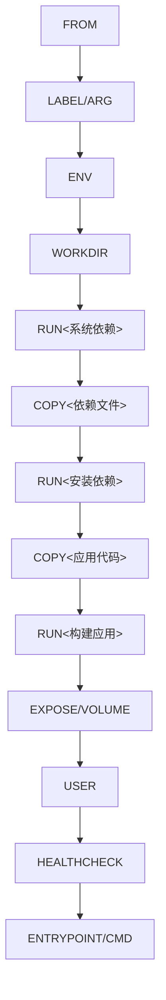

# Dockerfile编写最佳实践  

Dockerfile是构建Docker镜像的脚本文件，它包含了一系列指令和参数，用于自动化构建过程。编写高质量的Dockerfile对于创建高效、安全、可维护的容器镜像至关重要。本文将详细介绍Dockerfile编写的最佳实践，从基础结构到高级技巧，帮助开发者构建出专业级别的Docker镜像。

## 1. 基础结构规范  

一个良好的Dockerfile应当遵循清晰的结构规范，使其易于理解和维护。

### 1.1 标准模板结构  

以下是一个标准的Dockerfile模板，展示了常用指令的推荐顺序和用法：

```dockerfile:c:\project\kphub\docker\Dockerfile.template
# 指定基础镜像
FROM alpine:3.15 AS builder

# 设置元数据
LABEL maintainer="dev@kphub.com"
LABEL description="应用描述"
LABEL version="1.0.0"

# 定义构建参数
ARG BUILD_ENV=production
ARG BUILD_DATE=unknown

# 设置环境变量
ENV APP_HOME=/app
ENV PATH="${APP_HOME}/bin:${PATH}"

# 安装系统依赖
RUN apk add --no-cache build-base git curl

# 创建并设置工作目录
WORKDIR ${APP_HOME}

# 复制应用代码
# 先复制依赖文件，利用缓存
COPY package*.json ./
RUN npm install --production

# 再复制其他文件
COPY . .

# 构建应用
RUN make build

# 最终运行镜像（多阶段构建）
FROM alpine:3.15
LABEL maintainer="dev@kphub.com"

# 创建非root用户
RUN addgroup -S appgroup && adduser -S appuser -G appgroup

# 从构建阶段复制构建产物
COPY --from=builder /app/bin /usr/local/bin

# 设置工作目录
WORKDIR /data

# 声明卷
VOLUME ["/data"]

# 暴露端口
EXPOSE 8080

# 切换到非特权用户
USER appuser

# 健康检查
HEALTHCHECK --interval=30s --timeout=3s --start-period=5s --retries=3 \
    CMD curl -f http://localhost:8080/health || exit 1

# 容器启动命令
ENTRYPOINT ["/usr/local/bin/app"]
CMD ["--config", "/data/config.json"]
```

这个模板包含了构建高质量Docker镜像所需的大部分关键元素，包括多阶段构建、非root用户、健康检查等最佳实践。

### 1.2 指令执行顺序  

Dockerfile中指令的执行顺序不仅影响构建过程，还会影响缓存利用和最终镜像的层结构。以下是推荐的指令顺序及其原因：



指令顺序的关键考虑因素：

1. **变化频率**：将不常变化的指令放在前面，以最大化利用Docker的构建缓存
2. **依赖关系**：确保指令按照逻辑依赖顺序排列
3. **安全性**：将用户切换(USER)放在所有文件操作之后，但在ENTRYPOINT/CMD之前
4. **可读性**：相关指令应当分组放置，使用注释分隔不同的部分

## 2. 核心指令详解  

了解每个Dockerfile指令的特性和最佳用法，对于编写高效的Dockerfile至关重要。

### 2.1 COPY与ADD对比  

`COPY`和`ADD`都用于将文件添加到镜像中，但它们有重要区别：

| 指令   | 适用场景                 | 特性                     | 最佳实践                 |  
|--------|--------------------------|--------------------------|--------------------------|  
| COPY   | 普通文件复制             | 不自动解压，行为可预测   | 大多数情况下首选COPY     |  
| ADD    | 需要自动解压的tar包      | 支持URL下载，自动解压    | 仅在需要自动解压时使用   |  

示例对比：

```dockerfile
# COPY示例 - 简单文件复制
COPY ./app /app
COPY ["./file with spaces.txt", "/destination/"]

# ADD示例 - 自动解压
ADD app.tar.gz /app
# ADD示例 - 从URL下载（不推荐，应使用RUN curl或wget）
ADD https://example.com/file.txt /app/
```

最佳实践：

```dockerfile
# 推荐：使用COPY复制文件
COPY ./app /app

# 推荐：需要下载并解压时，使用RUN而非ADD
RUN curl -fsSL https://example.com/archive.tar.gz | tar -xz -C /app/

# 仅在这种情况使用ADD：本地tar包需要自动解压
ADD app.tar.gz /app/
```

### 2.2 RUN指令优化  

`RUN`指令用于在镜像中执行命令，每个`RUN`指令都会创建一个新的镜像层。优化`RUN`指令可以减少层数并降低镜像大小。

```dockerfile
# 错误示例 - 每条RUN创建一个新层，增加镜像大小
RUN apt-get update
RUN apt-get install -y curl
RUN apt-get install -y nginx
RUN rm -rf /var/lib/apt/lists/*

# 正确示例 - 合并为单层操作
RUN apt-get update && \
    apt-get install -y \
    curl \
    nginx && \
    rm -rf /var/lib/apt/lists/*
```

高级RUN优化技巧：

```dockerfile
# 使用shell技巧组织复杂命令
RUN set -ex; \
    # 更新包索引
    apt-get update; \
    # 安装依赖
    apt-get install -y --no-install-recommends \
        curl \
        nginx \
        openssl; \
    # 清理缓存
    apt-get clean; \
    rm -rf /var/lib/apt/lists/*; \
    # 创建必要目录
    mkdir -p /app/logs; \
    # 设置权限
    chmod -R 755 /app

# 针对不同包管理器的优化
# Debian/Ubuntu
RUN apt-get update && \
    apt-get install -y --no-install-recommends <packages> && \
    rm -rf /var/lib/apt/lists/*

# Alpine
RUN apk add --no-cache <packages>

# CentOS/RHEL
RUN yum install -y <packages> && \
    yum clean all
```

### 2.3 ENV与ARG的区别

`ENV`和`ARG`都用于设置变量，但用途不同：

| 指令 | 可用阶段 | 持久性 | 适用场景 |
|------|----------|--------|----------|
| ENV  | 构建时和运行时 | 持久保存在镜像中 | 运行时配置、路径设置 |
| ARG  | 仅构建时 | 不保存在最终镜像中 | 版本号、构建选项 |

```dockerfile
# ARG示例 - 仅构建时可用
ARG VERSION=1.0
ARG BUILD_DATE

# ENV示例 - 构建时和运行时都可用
ENV APP_VERSION=${VERSION}
ENV APP_HOME=/app
ENV PATH="${APP_HOME}/bin:${PATH}"

# 组合使用
ARG NODE_VERSION=16
FROM node:${NODE_VERSION}-alpine
```

## 3. 多阶段构建实践  

多阶段构建是创建精简镜像的强大技术，它允许在单个Dockerfile中使用多个FROM指令，每个指令开始一个新的构建阶段。

### 3.1 构建与运行分离  

多阶段构建的核心优势是可以将构建环境与运行环境分离，只将必要的构建产物复制到最终镜像中。

```dockerfile:c:\project\kphub\docker\multistage.dockerfile
# 构建阶段 - 包含所有构建工具和依赖
FROM golang:1.19 AS build
WORKDIR /src

# 先复制依赖文件并下载依赖
COPY go.mod go.sum ./
RUN go mod download

# 复制源代码并构建
COPY . .
RUN CGO_ENABLED=0 GOOS=linux go build -o /app -ldflags="-s -w" .

# 运行阶段 - 最小化基础镜像
FROM scratch
# 复制CA证书以支持HTTPS
COPY --from=build /etc/ssl/certs/ca-certificates.crt /etc/ssl/certs/
# 仅复制构建产物
COPY --from=build /app /app
# 设置入口点
ENTRYPOINT ["/app"]
```

不同语言的多阶段构建示例：

```dockerfile:c:\project\kphub\docker\node-multistage.dockerfile
# Node.js应用多阶段构建
FROM node:16-alpine AS builder
WORKDIR /app
COPY package*.json ./
RUN npm ci
COPY . .
RUN npm run build

FROM node:16-alpine
WORKDIR /app
COPY --from=builder /app/package*.json ./
RUN npm ci --production
COPY --from=builder /app/dist ./dist
USER node
CMD ["node", "dist/index.js"]
```

```dockerfile:c:\project\kphub\docker\python-multistage.dockerfile
# Python应用多阶段构建
FROM python:3.9-slim AS builder
WORKDIR /app
RUN pip install --no-cache-dir poetry
COPY pyproject.toml poetry.lock ./
RUN poetry export -f requirements.txt > requirements.txt
COPY . .
RUN pip wheel --no-cache-dir --wheel-dir /wheels -r requirements.txt

FROM python:3.9-slim
WORKDIR /app
COPY --from=builder /wheels /wheels
COPY --from=builder /app/requirements.txt .
RUN pip install --no-cache-dir --no-index --find-links=/wheels -r requirements.txt && \
    rm -rf /wheels
COPY --from=builder /app/src ./src
USER 1000
CMD ["python", "-m", "src.main"]
```

### 3.2 构建缓存利用  

合理组织Dockerfile指令可以最大化利用Docker的构建缓存，显著提高构建速度。

```dockerfile:c:\project\kphub\docker\cache-optimized.dockerfile
FROM node:16-alpine AS builder
WORKDIR /app

# 1. 复制依赖文件 - 这些文件变化不频繁
COPY package.json package-lock.json ./
# 2. 安装依赖 - 只有当依赖文件变化时才会重新执行
RUN npm ci

# 3. 复制源代码 - 这些文件变化频繁
COPY . .
# 4. 构建应用 - 只有当源代码变化时才会重新执行
RUN npm run build

FROM nginx:alpine
# 复制构建产物
COPY --from=builder /app/build /usr/share/nginx/html
```

缓存优化的关键原则：

1. **按变化频率排序**：将不常变化的指令放在前面
2. **分离依赖安装**：先复制依赖文件，安装依赖后，再复制源代码
3. **使用.dockerignore**：排除不需要的文件，减小构建上下文

```text:c:\project\kphub\docker\.dockerignore
# 版本控制
.git
.gitignore

# 依赖目录
node_modules
vendor
__pycache__

# 构建输出
dist
build
*.o

# 开发工具配置
.vscode
.idea

# 日志和临时文件
*.log
tmp
```

## 4. 安全最佳实践  

安全是容器化应用的重要考虑因素，Dockerfile中应当实施多种安全最佳实践。

### 4.1 最小权限原则  

容器应当以最小权限运行，避免使用root用户。

```dockerfile:c:\project\kphub\docker\secure.dockerfile
FROM alpine:3.15

# 创建非root用户和组
RUN addgroup -S appgroup && adduser -S appuser -G appgroup

# 设置工作目录并调整权限
WORKDIR /app
COPY --chown=appuser:appgroup . .

# 确保应用有必要的权限
RUN chmod +x /app/entrypoint.sh && \
    # 移除不必要的写权限
    chmod -R a-w /app/config

# 切换到非root用户
USER appuser

ENTRYPOINT ["/app/entrypoint.sh"]
```

不同基础镜像的用户创建方法：

```dockerfile
# Alpine
RUN addgroup -S appgroup && adduser -S appuser -G appgroup

# Debian/Ubuntu
RUN groupadd -r appgroup && useradd -r -g appgroup appuser

# RHEL/CentOS
RUN groupadd -r appgroup && useradd -r -g appgroup -s /sbin/nologin appuser
```

### 4.2 漏洞防范  

减少镜像中的安全漏洞是构建安全容器的关键步骤。

```dockerfile:c:\project\kphub\docker\secure-advanced.dockerfile
# 使用特定摘要而非标签，确保基础镜像不变
FROM alpine:3.15@sha256:4edbd2beb5f78b1014028f4fbb99f3237d9561100b6881aabbf5acce2c4f9454

# 安装依赖并清理缓存
RUN apk add --no-cache curl openssl && \
    # 更新CA证书
    update-ca-certificates

# 移除setuid/setgid权限，减少提权风险
RUN find / -perm /6000 -type f -exec chmod a-s {} \; || true

# 创建非root用户
RUN addgroup -S appgroup && adduser -S appuser -G appgroup

# 复制应用
COPY --chown=appuser:appgroup . /app/

# 验证下载的文件
RUN wget -O app.tar.gz https://example.com/app.tar.gz && \
    echo "expected-sha256sum app.tar.gz" | sha256sum -c && \
    tar -xzf app.tar.gz && \
    rm app.tar.gz

# 限制网络暴露
EXPOSE 8080

# 使用非root用户
USER appuser

# 使用exec形式的ENTRYPOINT，避免shell注入
ENTRYPOINT ["/app/entrypoint.sh"]
```

安全扫描集成：

```dockerfile:c:\project\kphub\docker\scan-integrated.dockerfile
FROM alpine:3.15 AS builder
# ... 构建阶段 ...

# 安全扫描阶段
FROM aquasec/trivy:latest AS security-scan
COPY --from=builder /app /app-to-scan
RUN trivy filesystem --exit-code 1 --severity HIGH,CRITICAL /app-to-scan

# 最终镜像
FROM alpine:3.15
COPY --from=builder /app /app
# ... 其余配置 ...
```

## 5. 性能优化技巧  

优化Docker镜像的构建过程和运行性能可以提高开发和部署效率。

### 5.1 构建上下文控制  

Docker构建上下文是发送给Docker守护进程的文件集合，控制上下文大小可以加快构建速度。

```powershell
# 从当前目录构建，使用指定的Dockerfile
docker build -f c:\project\kphub\docker\Dockerfile -t myapp .

# 使用标准输入作为Dockerfile，无上下文
echo 'FROM alpine:3.15\nRUN echo "Hello"' | docker build -t minimal -

# 使用特定目录作为上下文
docker build -f c:\project\kphub\docker\Dockerfile -t myapp c:\project\kphub\src
```

使用`.dockerignore`文件排除不必要的文件：

```text:c:\project\kphub\docker\.dockerignore
# 大型数据文件
*.zip
*.tar.gz
data/

# 临时文件
tmp/
*.tmp

# 日志
logs/
*.log

# 开发工具
.git/
.github/
.vscode/
.idea/

# 测试文件
test/
tests/
__tests__/
```

### 5.2 层合并策略  

Docker镜像由多个层组成，减少层数可以优化镜像大小和性能。

```dockerfile:c:\project\kphub\docker\layer-optimized.dockerfile
FROM debian:bullseye-slim

# 不推荐：每个RUN创建一个新层
RUN apt-get update
RUN apt-get install -y curl
RUN apt-get install -y nginx
RUN apt-get clean
RUN rm -rf /var/lib/apt/lists/*

# 推荐：合并相关操作到单个RUN指令
RUN apt-get update && \
    apt-get install -y \
    curl \
    nginx \
    && apt-get clean \
    && rm -rf /var/lib/apt/lists/*
```

层优化的高级技巧：

```dockerfile:c:\project\kphub\docker\advanced-layer.dockerfile
FROM debian:bullseye-slim

# 1. 系统依赖层 - 不常变化
RUN apt-get update && \
    apt-get install -y --no-install-recommends \
    curl \
    ca-certificates \
    && rm -rf /var/lib/apt/lists/*

# 2. 应用依赖层 - 偶尔变化
COPY requirements.txt /tmp/
RUN pip install --no-cache-dir -r /tmp/requirements.txt && \
    rm /tmp/requirements.txt

# 3. 应用代码层 - 经常变化
COPY ./app /app
WORKDIR /app

# 4. 配置层 - 可能单独变化
COPY ./config /app/config

# 使用多行格式提高可读性
RUN set -ex; \
    # 创建目录
    mkdir -p /app/data; \
    # 设置权限
    chown -R nobody:nogroup /app/data; \
    # 创建符号链接
    ln -sf /app/config/default.conf /etc/app.conf
```

## 6. 调试与验证  

调试Dockerfile和验证构建结果是开发过程中的重要环节。

### 6.1 构建过程检查  

检查Docker构建过程可以帮助识别和解决问题。

```powershell
# 禁用BuildKit，显示传统构建输出
$env:DOCKER_BUILDKIT=0
docker build --no-cache --progress=plain -t myapp .

# 启用BuildKit，使用详细输出
$env:DOCKER_BUILDKIT=1
docker build --no-cache --progress=plain -t myapp .

# 构建到特定阶段并停止
docker build --target builder -t myapp:builder .

# 交互式调试失败的构建
docker build --no-cache -t myapp . || docker run -it $(docker ps -lq) /bin/sh
```

调试技巧：

```dockerfile:c:\project\kphub\docker\debug.dockerfile
FROM alpine:3.15

# 添加调试指令（构建完成后可以移除）
RUN set -x && \
    echo "Current directory: $(pwd)" && \
    ls -la

# 在关键步骤之间添加检查点
COPY setup.sh /tmp/
RUN chmod +x /tmp/setup.sh && \
    # 验证文件内容
    cat /tmp/setup.sh && \
    # 执行脚本
    /tmp/setup.sh

# 使用构建参数控制调试模式
ARG DEBUG=false
RUN if [ "$DEBUG" = "true" ]; then \
        echo "Debug info: $(uname -a)" && \
        env; \
    fi
```

### 6.2 镜像分析工具  

使用专业工具分析Docker镜像可以发现优化机会和潜在问题。

```powershell
# 使用dive分析镜像层
docker run --rm -it -v /var/run/docker.sock:/var/run/docker.sock wagoodman/dive:latest myapp:latest

# 查看镜像历史
docker history --no-trunc myapp:latest

# 检查镜像配置
docker inspect myapp:latest

# 使用container-diff比较镜像
docker run --rm -v /var/run/docker.sock:/var/run/docker.sock gcr.io/google-containers/container-diff:latest diff --type=file --type=size myapp:v1 myapp:v2
```

镜像分析最佳实践：

1. 定期检查镜像大小和层数
2. 识别并移除不必要的文件
3. 合并可以组合的层
4. 验证最终镜像中不包含敏感信息
5. 确保镜像符合安全最佳实践

## 7. 生产环境建议  

为生产环境构建Docker镜像需要考虑额外的因素，包括标准化、可维护性和可靠性。

### 7.1 标签规范  

使用标准化的镜像标签可以提高可维护性和可追溯性。

```dockerfile:c:\project\kphub\docker\production.dockerfile
# 使用ARG接收构建信息
ARG VERSION=unknown
ARG BUILD_DATE=unknown
ARG VCS_REF=unknown

# 使用OCI标准标签
LABEL org.opencontainers.image.title="应用名称" \
      org.opencontainers.image.description="应用描述" \
      org.opencontainers.image.version="${VERSION}" \
      org.opencontainers.image.created="${BUILD_DATE}" \
      org.opencontainers.image.revision="${VCS_REF}" \
      org.opencontainers.image.authors="team@example.com" \
      org.opencontainers.image.url="https://example.com" \
      org.opencontainers.image.documentation="https://docs.example.com" \
      org.opencontainers.image.source="https://github.com/example/repo" \
      org.opencontainers.image.licenses="MIT"
```

在构建时传递标签信息：

```powershell
# 获取Git信息
$VCS_REF = git rev-parse --short HEAD
$BUILD_DATE = Get-Date -Format "yyyy-MM-ddTHH:mm:ssZ"

# 构建带标签的镜像
docker build `
  --build-arg VERSION=1.2.3 `
  --build-arg BUILD_DATE=$BUILD_DATE `
  --build-arg VCS_REF=$VCS_REF `
  -t myapp:1.2.3 .
```

### 7.2 健康检查  

为容器添加健康检查可以提高可靠性和可维护性。

```dockerfile:c:\project\kphub\docker\healthcheck.dockerfile
FROM nginx:alpine

# 复制自定义配置
COPY nginx.conf /etc/nginx/nginx.conf
COPY app /usr/share/nginx/html

# 安装curl用于健康检查
RUN apk add --no-cache curl

# 配置健康检查
HEALTHCHECK --interval=30s --timeout=3s --start-period=5s --retries=3 \
  CMD curl -f http://localhost/ || exit 1

EXPOSE 80
CMD ["nginx", "-g", "daemon off;"]
```

不同应用类型的健康检查示例：

```dockerfile
# Web应用健康检查
HEALTHCHECK --interval=30s --timeout=3s \
  CMD curl -f http://localhost:8080/health || exit 1

# 数据库健康检查
HEALTHCHECK --interval=30s --timeout=5s \
  CMD pg_isready -U postgres || exit 1

# 消息队列健康检查
HEALTHCHECK --interval=30s --timeout=3s \
  CMD rabbitmqctl node_health_check || exit 1

# 自定义脚本健康检查
COPY healthcheck.sh /usr/local/bin/
RUN chmod +x /usr/local/bin/healthcheck.sh
HEALTHCHECK --interval=30s --timeout=3s \
  CMD ["healthcheck.sh"]
```

### 7.3 资源限制与优化

在Dockerfile中考虑容器运行时的资源使用是生产环境的重要实践。

```dockerfile:c:\project\kphub\docker\resource-optimized.dockerfile
FROM node:16-alpine

# 设置NODE_ENV为production可减少内存使用
ENV NODE_ENV=production

# 优化Node.js内存使用
ENV NODE_OPTIONS="--max-old-space-size=256"

# 使用非root用户运行
USER node

# 使用exec形式的CMD，确保正确处理信号
CMD ["node", "server.js"]
```

在运行容器时设置资源限制：

```powershell
# 限制CPU和内存
docker run -d --name myapp --cpus=0.5 --memory=512m myapp:latest

# 设置重启策略
docker run -d --name myapp --restart=on-failure:5 myapp:latest
```

## 8. 高级技巧与模式

掌握高级Dockerfile技巧可以解决复杂场景下的构建需求。

### 8.1 条件构建

使用ARG和条件语句实现灵活的构建逻辑。

```dockerfile:c:\project\kphub\docker\conditional.dockerfile
FROM alpine:3.15

# 定义构建参数
ARG ENVIRONMENT=production

# 基于环境安装不同的依赖
RUN if [ "$ENVIRONMENT" = "development" ]; then \
        apk add --no-cache git vim; \
    else \
        apk add --no-cache curl; \
    fi

# 复制不同的配置文件
COPY config/${ENVIRONMENT}.conf /app/config.conf

# 设置不同的命令
CMD if [ "$ENVIRONMENT" = "development" ]; then \
        /app/run-dev.sh; \
    else \
        /app/run-prod.sh; \
    fi
```

使用不同参数构建：

```powershell
# 构建开发环境镜像
docker build --build-arg ENVIRONMENT=development -t myapp:dev .

# 构建生产环境镜像
docker build --build-arg ENVIRONMENT=production -t myapp:prod .
```

### 8.2 BuildKit高级特性

利用Docker BuildKit提供的高级特性可以增强构建过程。

```dockerfile:c:\project\kphub\docker\buildkit.dockerfile
# 启用BuildKit语法
# syntax=docker/dockerfile:1.4

FROM alpine:3.15

# 使用秘密挂载（不会保存在镜像层中）
RUN --mount=type=secret,id=api_key \
    cat /run/secrets/api_key > /app/config/api_key

# 使用SSH挂载克隆私有仓库
RUN --mount=type=ssh \
    git clone git@github.com:private/repo.git

# 使用缓存挂载加速构建
RUN --mount=type=cache,target=/var/cache/apt \
    apt-get update && apt-get install -y package

# 并行构建
RUN --parallel sleep 1 && echo "Task 1 done" & \
    sleep 2 && echo "Task 2 done" & \
    wait
```

使用BuildKit特性构建：

```powershell
# 启用BuildKit
$env:DOCKER_BUILDKIT=1

# 使用SSH转发
docker build --ssh default=~/.ssh/id_rsa -t myapp .

# 使用秘密
docker build --secret id=api_key,src=c:\project\kphub\secrets\api_key.txt -t myapp .
```

## 总结

编写高质量的Dockerfile是构建高效、安全、可维护Docker镜像的关键。通过遵循本文介绍的最佳实践，开发者可以：

1. 创建结构清晰、易于维护的Dockerfile
2. 优化构建过程，提高构建速度和缓存利用率
3. 减小镜像体积，提高部署效率
4. 增强容器安全性，减少潜在漏洞
5. 提高容器
继续完成Dockerfile编写最佳实践的内容：

## 总结（续）

编写高质量的Dockerfile是构建高效、安全、可维护Docker镜像的关键。通过遵循本文介绍的最佳实践，开发者可以：

1. 创建结构清晰、易于维护的Dockerfile
2. 优化构建过程，提高构建速度和缓存利用率
3. 减小镜像体积，提高部署效率
4. 增强容器安全性，减少潜在漏洞
5. 提高容器在生产环境中的可靠性和可维护性

遵循这些最佳实践可构建出体积小(通常<100MB)、安全性高、易于维护的Docker镜像。建议结合CI/CD流程实现自动化构建和扫描，每次代码提交都重新构建镜像，确保镜像始终反映最新的代码状态和安全修复。

## 9. 常见问题与解决方案

在Dockerfile编写过程中，开发者可能会遇到各种问题。以下是一些常见问题及其解决方案。

### 9.1 构建失败问题

```dockerfile:c:\project\kphub\docker\troubleshooting.dockerfile
# 问题：找不到文件
# 解决：检查文件路径和构建上下文
COPY ./app /app  # 确保app目录在构建上下文中

# 问题：权限不足
# 解决：在RUN命令中添加必要的权限
RUN chmod +x /app/script.sh && /app/script.sh

# 问题：网络问题导致下载失败
# 解决：添加重试逻辑或使用本地文件
RUN wget --tries=3 https://example.com/file.tar.gz || \
    cp /backup/file.tar.gz .
```

常见错误及解决方法表：

| 错误信息 | 可能原因 | 解决方案 |
|----------|----------|----------|
| `COPY failed: file not found` | 文件不在构建上下文中 | 检查文件路径，调整构建上下文 |
| `permission denied` | 文件权限不足 | 添加chmod命令设置正确权限 |
| `network timeout` | 网络连接问题 | 配置代理，使用本地缓存，增加重试 |
| `exec format error` | 架构不匹配或脚本缺少执行权限 | 检查架构兼容性，添加执行权限 |
| `no space left on device` | 磁盘空间不足 | 清理Docker系统，增加磁盘空间 |

### 9.2 镜像大小优化

当镜像体积过大时，可以采用以下策略进行优化：

```dockerfile:c:\project\kphub\docker\size-optimization.dockerfile
# 使用更小的基础镜像
FROM alpine:3.15 AS builder
# 而非 FROM ubuntu:20.04

# 清理包管理器缓存
RUN apk add --no-cache curl && \
    # 不要保留缓存
    rm -rf /var/cache/apk/*

# 删除构建依赖
RUN apk add --no-cache --virtual .build-deps \
    gcc \
    make \
    && make install \
    # 构建完成后删除构建依赖
    && apk del .build-deps

# 使用多阶段构建
FROM alpine:3.15
COPY --from=builder /usr/local/bin/app /usr/local/bin/app
# 只复制必要文件，而非整个构建环境
```

镜像瘦身检查清单：

1. 使用轻量级基础镜像（Alpine、slim变种、distroless）
2. 清理包管理器缓存
3. 删除临时文件和构建依赖
4. 合并RUN指令减少层数
5. 使用多阶段构建分离构建环境和运行环境
6. 使用.dockerignore排除不必要的文件
7. 避免安装不必要的包
8. 考虑使用压缩工具（如UPX）压缩二进制文件

## 10. 行业特定最佳实践

不同类型的应用可能需要特定的Dockerfile优化策略。

### 10.1 Web应用

```dockerfile:c:\project\kphub\docker\web-app.dockerfile
# 前端应用多阶段构建
FROM node:16-alpine AS builder
WORKDIR /app
COPY package*.json ./
RUN npm ci
COPY . .
RUN npm run build

# 使用轻量级Web服务器
FROM nginx:alpine
# 复制构建产物
COPY --from=builder /app/build /usr/share/nginx/html
# 复制自定义配置
COPY nginx.conf /etc/nginx/conf.d/default.conf
# 暴露端口
EXPOSE 80
# 健康检查
HEALTHCHECK --interval=30s --timeout=3s CMD curl -f http://localhost/ || exit 1
```

### 10.2 数据库应用

```dockerfile:c:\project\kphub\docker\database.dockerfile
FROM postgres:13-alpine

# 设置时区
ENV TZ=Asia/Shanghai

# 复制初始化脚本
COPY ./init-scripts/ /docker-entrypoint-initdb.d/

# 复制自定义配置
COPY ./config/postgresql.conf /etc/postgresql/postgresql.conf

# 设置数据目录权限
RUN mkdir -p /var/lib/postgresql/data && \
    chown -R postgres:postgres /var/lib/postgresql/data

# 设置健康检查
HEALTHCHECK --interval=30s --timeout=5s --start-period=60s \
    CMD pg_isready -U postgres || exit 1

# 暴露端口
EXPOSE 5432

# 使用自定义配置启动
CMD ["postgres", "-c", "config_file=/etc/postgresql/postgresql.conf"]
```

### 10.3 微服务应用

```dockerfile:c:\project\kphub\docker\microservice.dockerfile
FROM golang:1.19-alpine AS builder
WORKDIR /src
# 缓存依赖
COPY go.mod go.sum ./
RUN go mod download
# 构建应用
COPY . .
RUN CGO_ENABLED=0 GOOS=linux go build -o /app -ldflags="-s -w" ./cmd/service

# 最小运行镜像
FROM scratch
# 复制CA证书支持HTTPS
COPY --from=builder /etc/ssl/certs/ca-certificates.crt /etc/ssl/certs/
# 复制应用
COPY --from=builder /app /app
# 复制配置
COPY --from=builder /src/configs /configs
# 设置环境变量
ENV CONFIG_PATH=/configs/production.yaml
# 暴露API端口
EXPOSE 8080
# 健康检查
HEALTHCHECK --interval=5s --timeout=3s --start-period=5s \
    CMD ["/app", "health"] || exit 1
# 启动应用
ENTRYPOINT ["/app"]
```

## 11. 自动化与工具集成

将Dockerfile最佳实践与自动化工具集成可以提高开发效率和镜像质量。

### 11.1 CI/CD集成

```yaml:c:\project\kphub\github\workflows\docker-build.yml
name: Build and Push Docker Image

on:
  push:
    branches: [ main ]
  pull_request:
    branches: [ main ]

jobs:
  build:
    runs-on: ubuntu-latest
    steps:
      - name: Checkout code
        uses: actions/checkout@v3

      - name: Set up Docker Buildx
        uses: docker/setup-buildx-action@v2

      - name: Cache Docker layers
        uses: actions/cache@v3
        with:
          path: /tmp/.buildx-cache
          key: ${{ runner.os }}-buildx-${{ github.sha }}
          restore-keys: |
            ${{ runner.os }}-buildx-

      - name: Build and export
        uses: docker/build-push-action@v4
        with:
          context: .
          push: false
          load: true
          tags: myapp:test
          cache-from: type=local,src=/tmp/.buildx-cache
          cache-to: type=local,dest=/tmp/.buildx-cache-new

      - name: Test image
        run: |
          docker run --rm myapp:test echo "Test passed"

      - name: Scan for vulnerabilities
        uses: aquasecurity/trivy-action@master
        with:
          image-ref: myapp:test
          format: 'table'
          exit-code: '1'
          severity: 'CRITICAL,HIGH'

      # 更新缓存
      - name: Move cache
        run: |
          rm -rf /tmp/.buildx-cache
          mv /tmp/.buildx-cache-new /tmp/.buildx-cache
```

### 11.2 Dockerfile Linting

使用Dockerfile linting工具可以自动检查Dockerfile是否符合最佳实践。

```powershell
# 安装hadolint
docker pull hadolint/hadolint

# 检查Dockerfile
docker run --rm -i hadolint/hadolint < c:\project\kphub\docker\Dockerfile

# 集成到CI/CD流程
docker run --rm -i hadolint/hadolint < c:\project\kphub\docker\Dockerfile | tee hadolint-results.txt
if (Get-Content hadolint-results.txt) { exit 1 }
```

常见的Dockerfile linting规则：

1. 使用特定版本标签而非latest
2. 避免使用ADD而应使用COPY
3. 合并RUN指令减少层数
4. 清理包管理器缓存
5. 避免使用sudo
6. 使用SHELL指令时指定JSON格式

## 12. 版本控制与文档

良好的版本控制和文档实践可以提高Dockerfile的可维护性。

### 12.1 版本控制策略

```dockerfile:c:\project\kphub\docker\versioned.dockerfile
# 文件头部添加版本和变更信息
# Version: 1.2.0
# Last Updated: 2023-06-01
# Changes: Added health check, reduced image size

FROM alpine:3.15

# 使用ARG接收版本信息
ARG VERSION=1.0.0
ARG BUILD_DATE=unknown
ARG VCS_REF=unknown

# 记录版本信息
LABEL version="${VERSION}" \
      build-date="${BUILD_DATE}" \
      vcs-ref="${VCS_REF}"

# ... 其余指令 ...
```

### 12.2 文档化最佳实践

```dockerfile:c:\project\kphub\docker\documented.dockerfile
# 应用名称: 示例Web应用
# 描述: 提供RESTful API服务的Web应用
# 使用方法:
#   构建: docker build -t myapp .
#   运行: docker run -d -p 8080:8080 myapp
#   环境变量:
#     - DB_HOST: 数据库主机地址
#     - API_KEY: 外部API密钥

FROM node:16-alpine

# 设置工作目录
WORKDIR /app

# 安装依赖
# 注意: 先复制package.json以利用缓存
COPY package*.json ./
RUN npm ci --production

# 复制应用代码
# 注意: 这些文件变化频繁，放在后面
COPY . .

# 暴露应用端口
EXPOSE 8080

# 启动命令
# 使用exec格式确保正确处理信号
CMD ["node", "server.js"]
```

## 结语

Dockerfile编写是一门平衡艺术，需要在镜像大小、构建速度、安全性和可维护性之间找到最佳平衡点。通过遵循本文介绍的最佳实践，开发者可以创建出高质量的Docker镜像，为容器化应用提供坚实的基础。

随着容器技术的不断发展，Dockerfile最佳实践也在不断演进。建议开发者持续关注Docker官方文档和社区最新动态，及时更新自己的知识和技能，以构建出更加高效、安全、可靠的容器镜像。