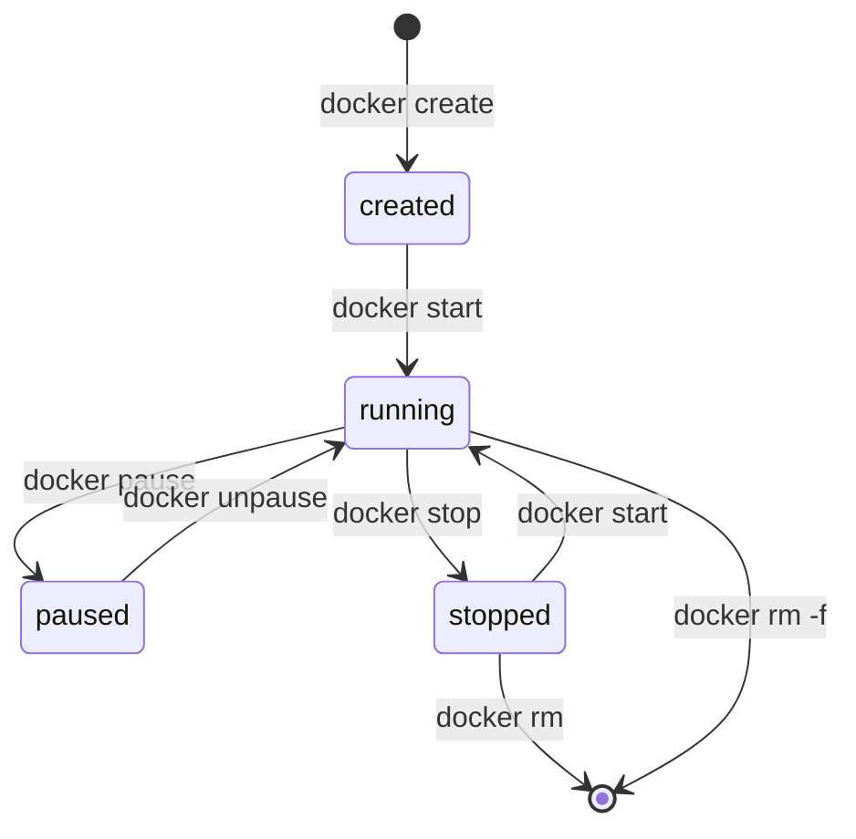
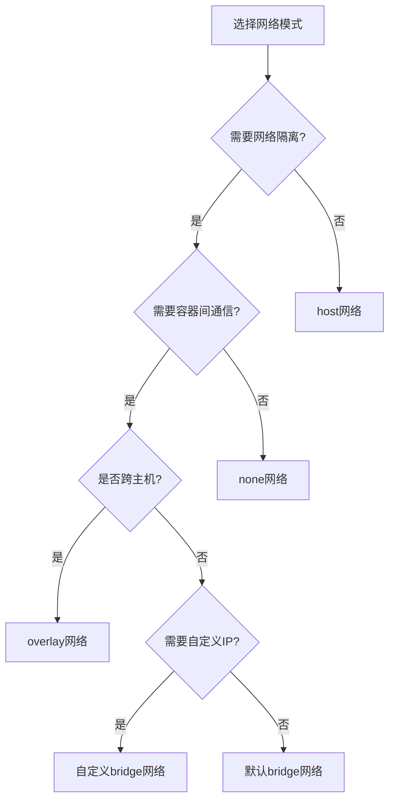
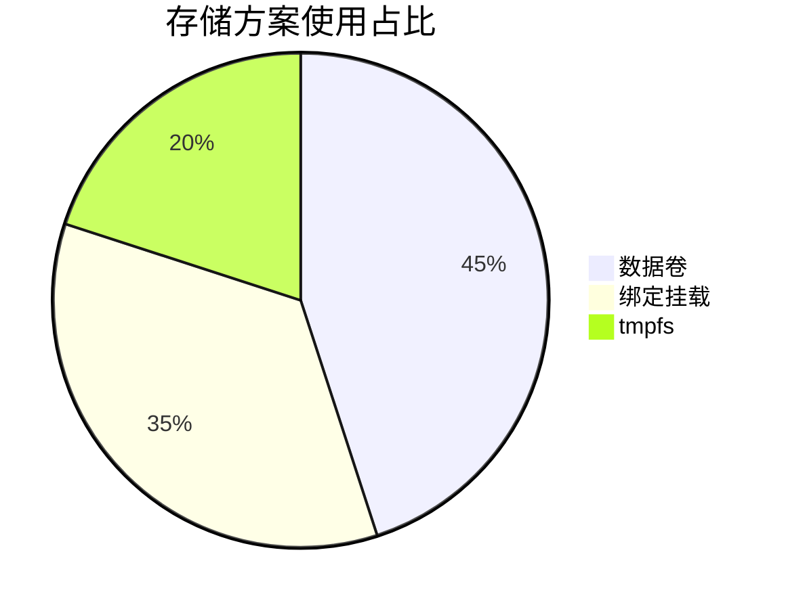

# 容器运行与生命周期管理  

容器的生命周期管理是Docker使用中的核心环节，它涉及容器的创建、启动、运行、暂停、停止和删除等全过程。掌握容器生命周期管理不仅能帮助开发者更好地使用Docker，还能确保容器化应用在生产环境中稳定高效地运行。本文将详细介绍容器的生命周期、运行参数配置、状态监控以及各种管理技巧。

## 1. 容器生命周期  

容器生命周期是指容器从创建到删除的整个过程，包括多个状态和状态之间的转换。

### 1.1 状态转换流程  

容器在其生命周期中会经历多个状态，下图展示了容器状态之间的转换关系：



容器状态说明：

| 状态 | 描述 | 特点 |
|------|------|------|
| created | 已创建但未启动 | 容器已创建，但进程未运行 |
| running | 运行中 | 容器进程正在执行 |
| paused | 已暂停 | 容器进程被暂停，但仍在内存中 |
| stopped | 已停止 | 容器进程已退出，但容器元数据保留 |
| deleted | 已删除 | 容器完全被移除 |

### 1.2 核心操作命令  

以下是管理容器生命周期的核心命令：

```powershell
# 创建容器但不启动
docker create --name my_nginx nginx:alpine

# 启动已创建的容器
docker start my_nginx

# 创建并立即启动容器（组合了create和start）
docker run -d --name my_nginx_direct nginx:alpine

# 暂停容器（冻结进程但保留在内存中）
docker pause my_nginx

# 恢复已暂停的容器
docker unpause my_nginx

# 停止容器（发送SIGTERM信号，等待优雅关闭）
docker stop my_nginx

# 停止容器并指定超时时间（10秒后发送SIGKILL）
docker stop -t 10 my_nginx

# 强制停止容器（立即发送SIGKILL信号）
docker kill my_nginx

# 重启容器
docker restart my_nginx

# 删除已停止的容器
docker rm my_nginx

# 强制删除运行中的容器
docker rm -f my_nginx

# 查看所有容器（包括停止的）
docker ps -a

# 查看最近创建的容器
docker ps -n 5
```

容器生命周期管理最佳实践：

1. **优雅关闭**：尽量使用`docker stop`而非`docker kill`，给应用足够时间清理资源
2. **合理超时**：根据应用特性设置合适的停止超时时间
3. **自动清理**：使用`--rm`标志自动删除退出的容器
4. **命名规范**：使用有意义的名称命名容器，便于管理
5. **状态检查**：在操作前检查容器当前状态

## 2. 运行参数配置  

容器运行参数决定了容器的资源使用、安全性和可靠性。合理配置这些参数对于生产环境尤为重要。

### 2.1 资源限制参数  

Docker允许对容器使用的CPU、内存等资源进行精细控制：

```powershell
# 内存限制
docker run -d --name redis_limited \
  --memory=512m \           # 限制最大内存使用为512MB
  --memory-swap=1g \        # 限制内存+交换空间总计1GB
  --memory-reservation=400m # 软限制，内存压力大时触发
  redis

# CPU限制
docker run -d --name app_cpu_limited \
  --cpus=1.5 \              # 限制最多使用1.5个CPU核心
  --cpu-shares=512 \        # 设置CPU共享权重
  --cpu-period=100000 \     # 设置CPU CFS周期为100ms
  --cpu-quota=50000         # 在周期内最多使用50ms CPU时间
  app

# 组合资源限制
docker run -d --name db_limited \
  --memory=2g \
  --cpus=2 \
  --pids-limit=100 \        # 限制最大进程数
  --device-read-bps /dev/sda:30mb \  # 限制磁盘读取速率
  --device-write-bps /dev/sda:10mb \ # 限制磁盘写入速率
  postgres:13
```

资源限制建议值（根据应用类型调整）：

| 应用类型 | 内存建议 | CPU建议 | 其他限制 |
|----------|----------|---------|----------|
| Web服务 | 256MB-1GB | 0.5-2 cpus | pids-limit=100 |
| 数据库 | 1GB-4GB | 1-4 cpus | 磁盘I/O限制 |
| 缓存服务 | 512MB-2GB | 0.5-1 cpus | 网络带宽限制 |
| 批处理任务 | 512MB-2GB | 1-2 cpus | 临时提高限制 |

### 2.2 重启策略  

重启策略决定了容器在退出或宿主机重启后的行为：

| 策略           | 命令参数               | 行为描述                     | 适用场景         |  
|----------------|-----------------------|------------------------------|------------------|  
| 不自动重启     | --restart=no          | 容器退出后不重启             | 开发测试环境、一次性任务 |  
| 失败时重启     | --restart=on-failure[:max-retries] | 非零退出码时重启，可限制次数 | 大多数生产环境服务 |  
| 总是重启       | --restart=always      | 总是重启，包括Docker重启后   | 关键系统服务、数据库 |  
| 除非停止       | --restart=unless-stopped | 类似always，但不包括手动停止的容器 | 需要手动控制的关键服务 |  

```powershell
# 开发环境（不自动重启）
docker run -d --restart=no --name dev_app dev_image

# 生产环境Web服务（失败时重启，最多5次）
docker run -d --restart=on-failure:5 --name web_app web_image

# 数据库服务（总是重启）
docker run -d --restart=always --name database db_image

# 可手动控制的关键服务
docker run -d --restart=unless-stopped --name message_queue rabbitmq
```

重启策略最佳实践：

1. 开发环境使用`no`策略，便于调试
2. 生产环境基础服务使用`always`或`unless-stopped`
3. 应用服务使用`on-failure`并设置合理的最大重试次数
4. 结合健康检查机制，避免无效重启
5. 对于有状态服务，确保重启不会导致数据不一致

### 2.3 环境变量与配置

容器的环境变量和配置参数对应用行为有重要影响：

```powershell
# 设置单个环境变量
docker run -d --name app \
  -e "DEBUG=true" \
  app_image

# 设置多个环境变量
docker run -d --name db \
  -e "POSTGRES_USER=admin" \
  -e "POSTGRES_PASSWORD=secret" \
  -e "POSTGRES_DB=myapp" \
  postgres

# 从文件读取环境变量
docker run -d --name app \
  --env-file c:\project\kphub\config\app.env \
  app_image

# 传递主机环境变量
docker run -d --name app \
  -e "HOST_VARIABLE=$env:HOST_VARIABLE" \
  app_image
```

环境变量文件示例 (`c:\project\kphub\config\app.env`):

```
# 应用配置
APP_ENV=production
DEBUG=false
LOG_LEVEL=info

# 数据库连接
DB_HOST=db.example.com
DB_PORT=5432
DB_NAME=myapp
DB_USER=appuser
# 敏感信息应使用Docker secrets或其他安全机制
DB_PASSWORD=password123
```

## 3. 运行状态监控  

监控容器运行状态对于保障应用稳定性和及时发现问题至关重要。

### 3.1 实时状态查看  

Docker提供了多种命令来查看容器的运行状态：

```powershell
# 查看容器内运行的进程
docker top my_nginx

# 实时查看容器资源使用情况
docker stats

# 自定义输出格式查看资源使用
docker stats --format "table {{.Name}}\t{{.CPUPerc}}\t{{.MemUsage}}\t{{.NetIO}}"

# 只查看特定容器
docker stats my_nginx my_redis

# 查看容器日志
docker logs my_nginx

# 查看最近100条日志并持续跟踪
docker logs --tail 100 -f my_nginx

# 查看带时间戳的日志
docker logs --timestamps my_nginx

# 查看特定时间范围的日志
docker logs --since 2023-06-01T00:00:00 --until 2023-06-02T00:00:00 my_nginx
```

自动化监控脚本示例：

```powershell:c:\project\kphub\scripts\container-monitor.ps1
# 容器资源使用监控脚本
$threshold_cpu = 80  # CPU使用率阈值（百分比）
$threshold_mem = 80  # 内存使用率阈值（百分比）

# 获取容器统计信息
$stats = docker stats --no-stream --format "{{.Name}},{{.CPUPerc}},{{.MemPerc}}"

foreach ($line in $stats) {
    $container, $cpu, $mem = $line.Split(',')
    
    # 移除百分号并转换为数字
    $cpu_value = [double]($cpu -replace '[^0-9.]')
    $mem_value = [double]($mem -replace '[^0-9.]')
    
    Write-Host "容器: $container, CPU: $cpu_value%, 内存: $mem_value%"
    
    # 检查是否超过阈值
    if ($cpu_value -gt $threshold_cpu) {
        Write-Host "警告: $container CPU使用率过高: $cpu_value%" -ForegroundColor Red
        # 这里可以添加告警逻辑，如发送邮件或调用监控API
    }
    
    if ($mem_value -gt $threshold_mem) {
        Write-Host "警告: $container 内存使用率过高: $mem_value%" -ForegroundColor Red
        # 这里可以添加告警逻辑
    }
}
```

### 3.2 健康检查配置  

健康检查是确保容器中应用正常运行的重要机制：

```dockerfile:c:\project\kphub\docker\healthcheck.dockerfile
FROM nginx:alpine

# 安装curl用于健康检查
RUN apk add --no-cache curl

# 配置健康检查
HEALTHCHECK --interval=30s --timeout=3s --start-period=5s --retries=3 \
  CMD curl -f http://localhost/ || exit 1

# 或者使用自定义脚本
COPY healthcheck.sh /usr/local/bin/
RUN chmod +x /usr/local/bin/healthcheck.sh
HEALTHCHECK --interval=30s --timeout=3s \
  CMD ["healthcheck.sh"]
```

健康检查脚本示例 (`c:\project\kphub\docker\healthcheck.sh`):

```bash
#!/bin/sh
set -e

# 检查Web服务
if curl -f http://localhost/health; then
  # 检查数据库连接
  if mysql -u$MYSQL_USER -p$MYSQL_PASSWORD -e "SELECT 1" $MYSQL_DATABASE; then
    # 所有检查通过
    exit 0
  fi
fi

# 任何检查失败
exit 1
```

在运行时配置健康检查：

```powershell
docker run -d --name web \
  --health-cmd="curl -f http://localhost/health || exit 1" \
  --health-interval=30s \
  --health-timeout=3s \
  --health-retries=3 \
  --health-start-period=5s \
  nginx:alpine
```

查看健康状态：

```powershell
# 查看健康状态
docker inspect --format='{{.State.Health.Status}}' web

# 筛选不健康的容器
docker ps --filter health=unhealthy

# 查看健康检查历史
docker inspect --format='{{range .State.Health.Log}}{{.ExitCode}} {{.Output}}{{end}}' web
```

健康检查最佳实践：

1. 检查应用核心功能而非简单的端口可达性
2. 设置合理的间隔和超时时间，避免过于频繁的检查
3. 为新启动的容器设置适当的启动期（start-period）
4. 健康检查脚本应该轻量且可靠，避免消耗过多资源
5. 结合外部监控系统，对不健康的容器进行自动处理

## 4. 容器网络管理  

容器网络是容器与外界通信以及容器间相互通信的基础。

### 4.1 网络模式对比  

Docker支持多种网络模式，每种模式有不同的特点和适用场景：

| 模式       | 命令参数           | 特点                       | 适用场景                 |  
|------------|-------------------|----------------------------|--------------------------|  
| bridge     | --network=bridge  | 默认模式，创建虚拟网桥和NAT | 大多数单机容器应用       |  
| host       | --network=host    | 直接使用主机网络，无隔离    | 需要高性能网络的应用     |  
| none       | --network=none    | 无网络，完全隔离           | 安全敏感的计算任务       |  
| container  | --network=container:name | 共享其他容器的网络命名空间 | 需要网络共享的辅助容器   |  
| overlay    | --network=overlay_name | 跨主机容器网络          | 分布式应用、Swarm集群    |  
| macvlan    | --network=macvlan_name | 容器拥有自己的MAC地址   | 需要直接接入物理网络     |  
| ipvlan     | --network=ipvlan_name | 容器共享MAC但有独立IP   | 受限于MAC地址数量的环境  |  

```powershell
# 默认桥接网络
docker run -d --name bridge_container nginx:alpine

# 主机网络模式（直接使用主机网络）
docker run -d --name host_container --network=host nginx:alpine

# 无网络模式
docker run -d --name isolated_container --network=none alpine sleep infinity

# 容器网络模式（共享其他容器的网络）
docker run -d --name main_container nginx:alpine
docker run -d --name helper_container --network=container:main_container alpine

# 创建自定义网络
docker network create --driver bridge my_network

# 连接到自定义网络
docker run -d --name custom_net_container --network=my_network nginx:alpine

# 连接容器到多个网络
docker network connect my_second_network custom_net_container
```

网络模式选择指南：



### 4.2 端口映射示例  

端口映射使容器内的服务可以被外部访问：

```powershell
# 随机映射容器的所有暴露端口到主机
docker run -d -P nginx:alpine

# 指定端口映射（主机8080端口映射到容器80端口）
docker run -d -p 8080:80 nginx:alpine

# 多端口映射
docker run -d -p 8080:80 -p 8443:443 nginx:alpine

# 指定IP地址的端口映射（仅监听特定IP）
docker run -d -p 127.0.0.1:8080:80 nginx:alpine

# 指定协议的端口映射
docker run -d -p 8080:80/tcp -p 53:53/udp dns_server

# 映射端口范围
docker run -d -p 8000-8005:80-85 multi_service_app
```

查看端口映射：

```powershell
# 查看容器端口映射
docker port nginx_container

# 在容器列表中显示端口映射
docker ps --format "table {{.Names}}\t{{.Ports}}"
```

端口映射最佳实践：

1. 生产环境使用特定端口而非随机端口，便于配置防火墙和负载均衡
2. 内部服务使用容器网络通信，无需映射到主机
3. 敏感服务仅映射到localhost或内网IP
4. 使用非标准端口减少被扫描的风险
5. 记录端口映射关系，避免端口冲突

## 5. 数据持久化  

容器默认是无状态的，所有写入容器文件系统的数据在容器删除后都会丢失。数据持久化是保存容器数据的关键机制。

### 5.1 存储方案对比  

Docker提供了三种主要的数据持久化方案：



| 存储方案 | 命令参数 | 特点 | 适用场景 |
|----------|----------|------|----------|
| 数据卷 | -v volume_name:/container/path | 由Docker管理，独立于主机目录结构 | 数据库、持久应用数据 |
| 绑定挂载 | -v /host/path:/container/path | 直接映射主机目录，依赖主机目录结构 | 配置文件、开发环境 |
| tmpfs | --tmpfs /container/path | 存储在内存中，容器停止后数据丢失 | 敏感信息、临时数据 |

存储方案详细对比：

| 特性 | 数据卷 | 绑定挂载 | tmpfs |
|------|--------|----------|-------|
| 备份难度 | 简单 | 简单 | 不可备份 |
| 性能 | 高 | 中 | 极高 |
| 可移植性 | 高 | 低 | 高 |
| 安全性 | 高 | 中 | 高 |
| 共享难度 | 简单 | 简单 | 不可共享 |
| 适用OS | 全部 | 全部 | 全部 |

### 5.2 数据卷操作  

数据卷是Docker推荐的持久化数据的主要方式：

```powershell
# 创建数据卷
docker volume create app_data

# 创建带标签的数据卷
docker volume create --label env=prod --label app=web web_data

# 查看数据卷列表
docker volume ls

# 查看数据卷详情
docker volume inspect app_data

# 挂载数据卷到容器
docker run -d --name mysql_db -v app_data:/var/lib/mysql mysql:8.0

# 使用只读数据卷
docker run -d -v config_volume:/etc/nginx/conf.d:ro nginx:alpine

# 使用匿名数据卷
docker run -d -v /var/lib/mysql mysql:8.0

# 备份数据卷内容
docker run --rm -v app_data:/source -v c:\project\kphub\backup:/backup alpine tar -czf /backup/app_data.tar.gz -C /source .

# 恢复数据卷内容
docker run --rm -v app_data:/target -v c:\project\kphub\backup:/backup alpine tar -xzf /backup/app_data.tar.gz -C /target

# 删除数据卷
docker volume rm app_data

# 清理无用数据卷
docker volume prune

# 清理特定标签的数据卷
docker volume prune --filter "label=env=dev"
```

### 5.3 绑定挂载示例

绑定挂载直接使用主机文件系统：

```powershell
# 挂载配置目录
docker run -d --name nginx -v c:\project\kphub\config\nginx:/etc/nginx/conf.d nginx:alpine

# 挂载单个配置文件
docker run -d --name app -v c:\project\kphub\config\app.conf:/app/config.conf:ro app_image

# 挂载多个目录
docker run -d --name web \
  -v c:\project\kphub\html:/usr/share/nginx/html \
  -v c:\project\kphub\logs:/var/log/nginx \
  nginx:alpine

# 使用相对路径（不推荐）
docker run -d -v ./data:/app/data app_image
```

数据持久化最佳实践：

1. 优先使用数据卷而非绑定挂载，提高可移植性
2. 对配置文件使用只读挂载，防止容器修改
3. 使用有意义的卷名，便于管理
4. 定期备份重要数据卷
5. 使用卷标签组织和管理数据卷
6. 谨慎使用数据卷清理命令，避免数据丢失

## 6. 容器调试技巧  

当容器出现问题时，掌握有效的调试技巧可以快速定位和解决问题。

### 6.1 进入容器  

进入容器是调试的基本方法：

```powershell
# 交互模式进入运行中的容器
docker exec -it my_nginx /bin/sh

# 以特定用户身份进入容器
docker exec -it -u root my_nginx /bin/bash

# 在容器中运行特定命令
docker exec my_nginx cat /etc/nginx/nginx.conf

# 调试模式运行新容器（覆盖默认入口点）
docker run --rm -it --entrypoint=/bin/sh nginx:alpine

# 在特权模式下进入容器（谨慎使用）
docker exec -it --privileged my_nginx /bin/sh
```

### 6.2 容器检查  

检查容器配置和状态：

```powershell
# 查看容器详细配置
docker inspect my_nginx

# 查看特定信息
docker inspect --format='{{.NetworkSettings.IPAddress}}' my_nginx

# 查看容器环境变量
docker exec my_nginx env

# 查看容器挂载点
docker inspect --format='{{range .Mounts}}{{.Source}} -> {{.Destination}}{{println}}{{end}}' my_nginx

# 查看容器资源限制
docker inspect --format='{{.HostConfig.Memory}}' my_nginx

# 导出容器文件系统
docker export my_nginx > c:\project\kphub\backup\nginx.tar

# 从导出文件创建镜像
docker import c:\project\kphub\backup\nginx.tar nginx:backup
```

### 6.3 日志分析

分析容器日志是排查问题的重要手段：

```powershell
# 查看最近的日志
docker logs --tail 100 my_nginx

# 持续查看日志
docker logs -f my_nginx

# 查看带时间戳的日志
docker logs --timestamps my_nginx

# 查看特定时间范围的日志
docker logs --since 2023-06-01T10:00:00 --until 2023-06-01T11:00:00 my_nginx

# 将日志保存到文件
docker logs my_nginx > c:\project\kphub\logs\nginx.log

# 查看Docker守护进程日志
Get-EventLog -LogName Application -Source docker
```

高级调试脚本示例：

```powershell:c:\project\kphub\scripts\container-debug.ps1
param (
    [Parameter(Mandatory=$true)]
    [string]$ContainerName
)

# 创建调试目录
$debugDir = "c:\project\kphub\debug\$ContainerName-$(Get-Date -Format 'yyyyMMdd-HHmmss')"
New-Item -ItemType Directory -Path $debugDir -Force | Out-Null

Write-Host "收集容器 $ContainerName 的调试信息..." -ForegroundColor Cyan

# 收集基本信息
docker inspect $ContainerName > "$debugDir\inspect.json"
docker logs $ContainerName > "$debugDir\logs.txt"
docker stats --no-stream $ContainerName > "$debugDir\stats.txt"

# 收集进程信息
docker top $ContainerName > "$debugDir\processes.txt"

# 尝试收集内部信息
try {
    docker exec $ContainerName cat /etc/os-release > "$debugDir\os-release.txt"
    docker exec $ContainerName ps aux > "$debugDir\ps-aux.txt"
    docker exec $ContainerName netstat -tulpn > "$debugDir\netstat.txt"
    docker exec $ContainerName df -h > "$debugDir\disk-usage.txt"
    docker exec $ContainerName env > "$debugDir\environment.txt"
} catch {
    Write-Host "无法收集部分内部信息: $_" -ForegroundColor Yellow
}

Write-Host "调试信息已保存到: $debugDir" -ForegroundColor Green
```

## 7. 自动维护策略  

自动化维护可以减少人工干预，提高系统可靠性。

### 7.1 自动清理  

定期清理无用的容器和镜像可以节省磁盘空间：

```powershell
# 自动删除停止的容器（使用--rm标志）
docker run --rm nginx:alpine echo "Task completed"

# 清理所有停止的容器
docker container prune

# 清理特定条件的容器
docker container prune --filter "until=24h"

# 清理所有未使用的对象（容器、网络、镜像、卷）
docker system prune

# 包括未使用的数据卷
docker system prune -a --volumes

# 定时清理脚本
```

自动清理脚本示例：

```powershell:c:\project\kphub\scripts\auto-cleanup.ps1
# 设置保留策略
$keepLastDays = 7          # 保留最近7天创建的对象
$keepRunningContainers = $true  # 保留运行中的容器
$pruneVolumes = $false     # 是否清理数据卷

# 获取截止日期
$cutoffDate = (Get-Date).AddDays(-$keepLastDays).ToString("yyyy-MM-ddTHH:mm:ss")

Write-Host "开始清理Docker资源..." -ForegroundColor Cyan
Write-Host "保留策略: 保留$keepLastDays天内创建的资源" -ForegroundColor Cyan

# 清理容器
if ($keepRunningContainers) {
    Write-Host "清理停止的容器..." -ForegroundColor Yellow
    docker container prune -f --filter "until=$cutoffDate"
} else {
    Write-Host "警告: 将清理所有容器，包括运行中的!" -ForegroundColor Red
    $confirmation = Read-Host "确定要继续吗? (y/n)"
    if ($confirmation -eq 'y') {
        docker container ls -q | ForEach-Object { docker container rm -f $_ }
    }
}

# 清理镜像
Write-Host "清
继续完成容器运行与生命周期管理的内容：

### 7.1 自动清理（续）

自动清理脚本示例（续）：

```powershell:c:\project\kphub\scripts\auto-cleanup.ps1
# 清理镜像
Write-Host "清理未使用的镜像..." -ForegroundColor Yellow
docker image prune -a -f --filter "until=$cutoffDate"

# 清理网络
Write-Host "清理未使用的网络..." -ForegroundColor Yellow
docker network prune -f --filter "until=$cutoffDate"

# 清理数据卷（可选）
if ($pruneVolumes) {
    Write-Host "警告: 将清理未使用的数据卷，这可能导致数据丢失!" -ForegroundColor Red
    $confirmation = Read-Host "确定要继续吗? (y/n)"
    if ($confirmation -eq 'y') {
        docker volume prune -f
    }
}

Write-Host "Docker资源清理完成!" -ForegroundColor Green

# 显示清理后的状态
Write-Host "`n当前Docker资源状态:" -ForegroundColor Cyan
Write-Host "容器数量: $(docker ps -q | Measure-Object | Select-Object -ExpandProperty Count) 运行, $(docker ps -aq | Measure-Object | Select-Object -ExpandProperty Count) 总计"
Write-Host "镜像数量: $(docker images -q | Measure-Object | Select-Object -ExpandProperty Count)"
Write-Host "数据卷数量: $(docker volume ls -q | Measure-Object | Select-Object -ExpandProperty Count)"
Write-Host "网络数量: $(docker network ls -q | Measure-Object | Select-Object -ExpandProperty Count)"
```

### 7.2 监控告警  

设置监控和告警机制可以及时发现并解决容器问题：

```powershell
# 监控Docker事件
docker events

# 监控特定事件类型
docker events --filter 'event=die'

# 监控特定容器
docker events --filter 'container=my_nginx'

# 监控资源使用并告警
docker stats --format "{{.Name}} CPU: {{.CPUPerc}} MEM: {{.MemUsage}}" | findstr "CPU: 90"
```

高级监控脚本示例：

```powershell:c:\project\kphub\scripts\container-monitor-alert.ps1
param (
    [int]$CpuThreshold = 80,
    [int]$MemThreshold = 80,
    [string]$AlertEmail = "admin@example.com"
)

function Send-Alert {
    param (
        [string]$Subject,
        [string]$Body
    )
    
    Write-Host "发送告警: $Subject" -ForegroundColor Red
    # 实际环境中可以使用Send-MailMessage或其他告警机制
    # Send-MailMessage -From "docker-monitor@example.com" -To $AlertEmail -Subject $Subject -Body $Body -SmtpServer "smtp.example.com"
    
    # 记录告警到日志文件
    $logEntry = "$(Get-Date) - $Subject - $Body"
    Add-Content -Path "c:\project\kphub\logs\container-alerts.log" -Value $logEntry
}

# 创建日志目录
if (-not (Test-Path "c:\project\kphub\logs")) {
    New-Item -ItemType Directory -Path "c:\project\kphub\logs" | Out-Null
}

Write-Host "开始监控容器资源使用情况..." -ForegroundColor Cyan
Write-Host "CPU阈值: ${CpuThreshold}%, 内存阈值: ${MemThreshold}%" -ForegroundColor Cyan

while ($true) {
    $stats = docker stats --no-stream --format "{{.Name}},{{.CPUPerc}},{{.MemPerc}},{{.PIDs}}"
    
    foreach ($line in $stats) {
        $container, $cpu, $mem, $pids = $line.Split(',')
        
        # 移除百分号并转换为数字
        $cpu_value = [double]($cpu -replace '[^0-9.]')
        $mem_value = [double]($mem -replace '[^0-9.]')
        
        # 检查是否超过阈值
        if ($cpu_value -gt $CpuThreshold) {
            $subject = "容器CPU告警: $container"
            $body = "容器 $container CPU使用率 $cpu_value% 超过阈值 ${CpuThreshold}%"
            Send-Alert -Subject $subject -Body $body
        }
        
        if ($mem_value -gt $MemThreshold) {
            $subject = "容器内存告警: $container"
            $body = "容器 $container 内存使用率 $mem_value% 超过阈值 ${MemThreshold}%"
            Send-Alert -Subject $subject -Body $body
        }
        
        # 检查进程数是否异常（超过100个进程）
        if ([int]$pids -gt 100) {
            $subject = "容器进程数告警: $container"
            $body = "容器 $container 进程数 $pids 可能异常"
            Send-Alert -Subject $subject -Body $body
        }
    }
    
    # 检查不健康的容器
    $unhealthy = docker ps --filter health=unhealthy --format "{{.Names}}"
    foreach ($container in $unhealthy) {
        $subject = "容器健康状态告警: $container"
        $body = "容器 $container 健康检查失败"
        Send-Alert -Subject $subject -Body $body
    }
    
    # 检查最近退出的容器
    $recentlyExited = docker ps -a --filter "status=exited" --filter "exited=1" --format "{{.Names}}: 退出代码 {{.Status}}"
    if ($recentlyExited) {
        $subject = "容器异常退出告警"
        $body = "以下容器异常退出:`n$recentlyExited"
        Send-Alert -Subject $subject -Body $body
    }
    
    # 等待一段时间再次检查
    Start-Sleep -Seconds 60
}
```

## 8. 高级容器管理技巧

掌握高级容器管理技巧可以更有效地管理和优化容器环境。

### 8.1 容器编排与组合

在实际应用中，通常需要运行多个相互关联的容器：

```powershell
# 创建自定义网络
docker network create app_network

# 运行数据库容器
docker run -d --name db \
  --network app_network \
  -v db_data:/var/lib/mysql \
  -e MYSQL_ROOT_PASSWORD=secret \
  -e MYSQL_DATABASE=app \
  mysql:8.0

# 运行应用容器，连接到数据库
docker run -d --name app \
  --network app_network \
  -p 8080:80 \
  -e DB_HOST=db \
  -e DB_NAME=app \
  -e DB_USER=root \
  -e DB_PASSWORD=secret \
  app_image

# 运行辅助服务容器
docker run -d --name redis \
  --network app_network \
  redis:alpine
```

使用Docker Compose简化多容器管理（`c:\project\kphub\docker-compose.yml`）：

```yaml
version: '3.8'

services:
  db:
    image: mysql:8.0
    volumes:
      - db_data:/var/lib/mysql
    environment:
      MYSQL_ROOT_PASSWORD: secret
      MYSQL_DATABASE: app
    restart: unless-stopped
    healthcheck:
      test: ["CMD", "mysqladmin", "ping", "-h", "localhost"]
      interval: 10s
      timeout: 5s
      retries: 3
      start_period: 30s

  redis:
    image: redis:alpine
    restart: unless-stopped
    healthcheck:
      test: ["CMD", "redis-cli", "ping"]
      interval: 5s
      timeout: 3s
      retries: 3

  app:
    image: app_image
    ports:
      - "8080:80"
    environment:
      DB_HOST: db
      DB_NAME: app
      DB_USER: root
      DB_PASSWORD: secret
      REDIS_HOST: redis
    depends_on:
      db:
        condition: service_healthy
      redis:
        condition: service_healthy
    restart: unless-stopped
    healthcheck:
      test: ["CMD", "curl", "-f", "http://localhost/health"]
      interval: 30s
      timeout: 5s
      retries: 3
      start_period: 10s

volumes:
  db_data:
```

### 8.2 资源限制与性能优化

精细控制容器资源使用可以提高系统整体性能：

```powershell
# 限制CPU和内存
docker run -d --name app \
  --cpus=1.5 \
  --memory=1g \
  --memory-reservation=800m \
  --memory-swap=2g \
  app_image

# 设置CPU亲和性（绑定到特定CPU核心）
docker run -d --name cpu_bound_app \
  --cpuset-cpus="0,1" \
  cpu_intensive_image

# 设置I/O限制
docker run -d --name db \
  --device-read-bps /dev/sda:50mb \
  --device-write-bps /dev/sda:30mb \
  db_image

# 设置网络带宽限制（需要高级网络驱动）
docker run -d --name web \
  --network=limited_net \
  --network-alias=web \
  web_image
```

性能优化建议：

1. **合理分配资源**：根据应用特性分配适当的CPU和内存资源
2. **使用资源预留**：设置`--memory-reservation`为软限制，提高资源利用率
3. **I/O优化**：对I/O密集型应用设置合理的磁盘和网络限制
4. **CPU亲和性**：将计算密集型容器绑定到特定CPU核心，减少上下文切换
5. **网络优化**：使用自定义网络提高容器间通信效率
6. **存储驱动选择**：根据工作负载特性选择合适的存储驱动（overlay2通常是最佳选择）

### 8.3 容器安全加固

增强容器安全性的关键措施：

```powershell
# 以非特权模式运行
docker run -d --name secure_app \
  --security-opt=no-new-privileges \
  app_image

# 只读根文件系统
docker run -d --name readonly_app \
  --read-only \
  --tmpfs /tmp \
  app_image

# 限制系统调用
docker run -d --name restricted_app \
  --security-opt seccomp=c:\project\kphub\security\seccomp-profile.json \
  app_image

# 限制capabilities
docker run -d --name limited_cap_app \
  --cap-drop=ALL \
  --cap-add=NET_BIND_SERVICE \
  web_server

# 设置内存和交换限制
docker run -d --name secure_db \
  --memory=2g \
  --memory-swap=2g \  # 设置与内存相同，禁用交换
  db_image

# 使用用户命名空间重映射
docker run -d --name remapped_app \
  --userns-remap=default \
  app_image
```

安全加固最佳实践：

1. **最小权限原则**：仅授予容器所需的最小权限
2. **使用非root用户**：在Dockerfile中设置USER指令，避免以root运行应用
3. **只读文件系统**：将不需要写入的文件系统设为只读
4. **限制capabilities**：删除所有capabilities，仅添加必要的capabilities
5. **使用安全计算配置文件**：限制容器可以使用的系统调用
6. **定期更新基础镜像**：确保使用最新的安全补丁
7. **启用用户命名空间**：隔离容器用户ID与主机用户ID

## 9. 容器日志管理

有效的日志管理对于排查问题和监控容器至关重要。

### 9.1 日志驱动配置

Docker支持多种日志驱动，可以根据需求选择合适的驱动：

```powershell
# 使用json-file驱动并限制日志大小
docker run -d --name app \
  --log-driver json-file \
  --log-opt max-size=10m \
  --log-opt max-file=3 \
  app_image

# 使用syslog驱动
docker run -d --name app \
  --log-driver syslog \
  --log-opt syslog-address=udp://192.168.1.100:514 \
  app_image

# 使用fluentd驱动
docker run -d --name app \
  --log-driver fluentd \
  --log-opt fluentd-address=192.168.1.100:24224 \
  --log-opt tag=docker.{{.Name}} \
  app_image

# 完全禁用日志
docker run -d --name no_log_app \
  --log-driver none \
  app_image
```

常用日志驱动对比：

| 日志驱动 | 特点 | 适用场景 |
|----------|------|----------|
| json-file | 默认驱动，将日志存储为JSON文件 | 开发环境，简单部署 |
| syslog | 发送日志到syslog服务器 | 集中式日志管理 |
| journald | 发送日志到journald | 使用systemd的系统 |
| fluentd | 发送日志到fluentd聚合器 | 复杂的日志处理需求 |
| awslogs | 发送日志到Amazon CloudWatch | AWS环境 |
| splunk | 发送日志到Splunk | 企业级监控环境 |
| gelf | 发送日志到Graylog | 集中式日志分析 |
| none | 禁用日志存储 | 不需要日志的场景 |

### 9.2 日志轮转与清理

防止日志占用过多磁盘空间：

```powershell
# 配置日志轮转
docker run -d --name app \
  --log-opt max-size=100m \
  --log-opt max-file=5 \
  app_image

# 手动清理特定容器的日志
$logPath = "C:\ProgramData\Docker\containers\<container-id>\<container-id>-json.log"
Clear-Content -Path $logPath

# 查找大型日志文件
Get-ChildItem -Path "C:\ProgramData\Docker\containers" -Recurse -Filter "*-json.log" | 
    Sort-Object Length -Descending | 
    Select-Object -First 10 | 
    Format-Table Name, @{Name="SizeMB";Expression={$_.Length / 1MB}}
```

日志管理最佳实践：

1. **设置日志大小限制**：防止单个容器日志占用过多空间
2. **配置日志轮转**：自动轮转旧日志文件
3. **使用集中式日志系统**：将容器日志发送到专门的日志管理系统
4. **结构化日志**：使用JSON等结构化格式记录日志
5. **区分应用日志和容器日志**：了解Docker日志驱动只捕获标准输出和标准错误
6. **定期审查日志配置**：确保日志策略满足需求

## 10. 容器化应用的可观测性

可观测性是指通过外部输出了解系统内部状态的能力，包括日志、指标和追踪。

### 10.1 指标收集

收集容器性能指标对于监控和优化至关重要：

```powershell
# 使用cAdvisor收集容器指标
docker run -d --name cadvisor \
  --volume=/:/rootfs:ro \
  --volume=/var/run:/var/run:ro \
  --volume=/sys:/sys:ro \
  --volume=/var/lib/docker/:/var/lib/docker:ro \
  --publish=8080:8080 \
  --restart=always \
  google/cadvisor:latest

# 使用Prometheus监控容器
docker run -d --name prometheus \
  -p 9090:9090 \
  -v c:\project\kphub\prometheus\prometheus.yml:/etc/prometheus/prometheus.yml \
  prom/prometheus
```

Prometheus配置示例 (`c:\project\kphub\prometheus\prometheus.yml`):

```yaml
global:
  scrape_interval: 15s

scrape_configs:
  - job_name: 'cadvisor'
    static_configs:
      - targets: ['cadvisor:8080']

  - job_name: 'node-exporter'
    static_configs:
      - targets: ['node-exporter:9100']
```

### 10.2 分布式追踪

追踪容器化应用中的请求流：

```powershell
# 运行Jaeger追踪系统
docker run -d --name jaeger \
  -p 16686:16686 \
  -p 6831:6831/udp \
  jaegertracing/all-in-one:latest

# 配置应用使用Jaeger
docker run -d --name traced_app \
  -e JAEGER_AGENT_HOST=jaeger \
  -e JAEGER_AGENT_PORT=6831 \
  -e JAEGER_SERVICE_NAME=my_service \
  --network=app_network \
  traced_app_image
```

可观测性最佳实践：

1. **三大支柱**：同时实现日志、指标和追踪
2. **标准化**：使用标准格式记录日志和指标
3. **关联性**：通过请求ID关联不同组件的日志和追踪
4. **自动化**：自动收集和分析可观测性数据
5. **可视化**：使用仪表板直观展示系统状态
6. **告警**：基于可观测性数据设置智能告警

## 总结

容器运行与生命周期管理是Docker使用中的核心环节，掌握这些知识对于构建稳定、高效的容器化应用至关重要。本文详细介绍了容器的生命周期、运行参数配置、状态监控、网络管理、数据持久化、调试技巧以及自动维护策略等内容。

通过合理配置资源限制、重启策略和健康检查，可以确保容器服务的稳定运行。建议生产环境至少配置on-failure重启策略和健康检查机制，关键服务应考虑使用always策略。同时，实施自动化监控和维护策略，可以及时发现并解决潜在问题，提高系统的可靠性和可维护性。

随着容器技术的不断发展，容器管理实践也在不断演进。建议开发者持续关注Docker官方文档和社区最新动态，及时更新自己的知识和技能，以构建出更加高效、安全、可靠的容器化应用。