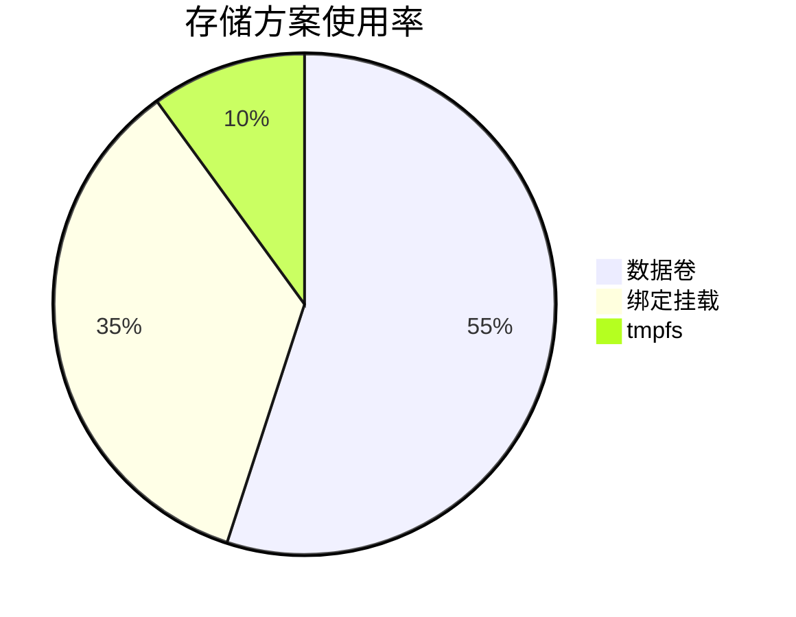
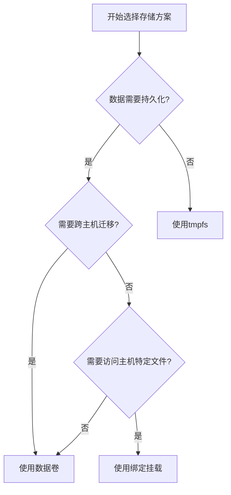
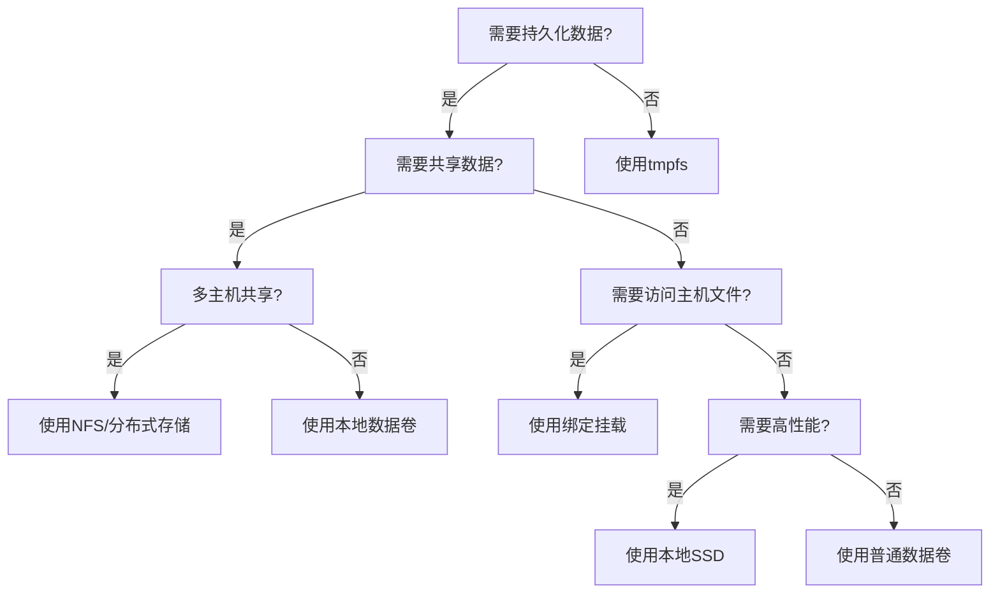
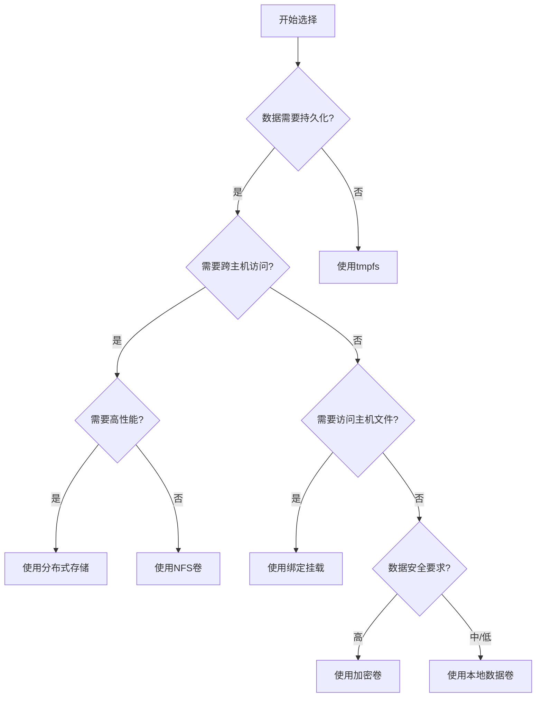

# Docker数据持久化方案  

Docker容器本质上是临时性的，当容器被删除时，其中的数据也会随之消失。在实际应用中，我们通常需要保存数据，使其独立于容器的生命周期。Docker提供了多种数据持久化方案，帮助我们在容器重启或删除后仍能保留重要数据。本文将详细介绍Docker的数据持久化机制、各种存储方案的特点以及最佳实践。

## 1. 数据存储机制  

Docker提供了三种主要的数据持久化方案：数据卷(Volumes)、绑定挂载(Bind Mounts)和临时文件系统(tmpfs)。每种方案都有其特定的使用场景和优缺点。

### 1.1 存储方案对比  

以下是三种存储方案在实际应用中的使用比例：



从图表可以看出，数据卷是最常用的持久化方案，占比超过一半。这主要是因为数据卷由Docker管理，提供了更好的隔离性和可移植性。绑定挂载则因其直接与主机文件系统交互的特性，在开发环境和特定场景中得到广泛应用。tmpfs作为内存存储方案，主要用于临时数据和敏感信息的存储。

### 1.2 核心特性对比  

下表详细对比了三种存储方案的核心特性：

| 特性         | 数据卷           | 绑定挂载         | tmpfs          |  
|--------------|------------------|------------------|----------------|  
| 持久性       | 是               | 是               | 否（容器停止后数据丢失）|  
| 性能         | 中               | 高               | 极高（内存存储）|  
| 可移植性     | 高（独立于主机） | 低（依赖主机路径）| 无（仅限当前容器）|  
| 管理方式     | Docker管理       | 手动管理         | Docker管理     |  
| 备份难度     | 简单             | 简单             | 不适用         |  
| 共享能力     | 可在容器间共享   | 可在容器间共享   | 不可共享       |  
| 内容初始化   | 空卷             | 复制主机内容     | 空             |  
| 适用场景     | 应用数据存储     | 配置文件、开发环境| 敏感数据、临时缓存|  
| 跨主机迁移   | 支持（需导出导入）| 困难（需手动复制）| 不支持         |  

存储方案选择流程：



## 2. 数据卷管理  

数据卷是Docker推荐的主要数据持久化方案，它完全由Docker管理，独立于容器的生命周期。

### 2.1 数据卷操作  

以下是数据卷的基本操作命令：

```powershell
# 创建数据卷
docker volume create app_data

# 创建带标签的数据卷
docker volume create --label env=prod --label app=web web_data

# 列出所有数据卷
docker volume ls

# 筛选特定标签的数据卷
docker volume ls --filter "label=env=prod"

# 挂载数据卷到容器
docker run -d --name mysql -v app_data:/var/lib/mysql mysql:8.0

# 使用匿名数据卷
docker run -d --name postgres -v /var/lib/postgresql/data postgres:13

# 查看数据卷详情
docker volume inspect app_data

# 删除数据卷
docker volume rm app_data

# 清理未使用的数据卷
docker volume prune

# 清理特定标签的未使用数据卷
docker volume prune --filter "label=env=dev"
```

数据卷详情示例：

```json
[
    {
        "CreatedAt": "2023-06-15T10:34:25Z",
        "Driver": "local",
        "Labels": {
            "env": "prod",
            "app": "web"
        },
        "Mountpoint": "/var/lib/docker/volumes/web_data/_data",
        "Name": "web_data",
        "Options": {},
        "Scope": "local"
    }
]
```

### 2.2 数据卷驱动  

Docker支持多种数据卷驱动，使数据卷能够与不同的存储后端集成：

```powershell
# 查看可用的卷驱动
docker info | findstr "Volume"

# 使用本地NFS驱动创建卷
docker volume create --driver local \
    --opt type=nfs \
    --opt o=addr=192.168.1.100,rw \
    --opt device=:/data \
    nfs_volume

# 使用Azure File Storage驱动
docker volume create --driver azure-file \
    --name azure_volume \
    --opt share=myshare

# 使用Amazon EBS驱动
docker volume create --driver rexray/ebs \
    --name aws_volume \
    --opt size=20

# 使用自定义驱动创建加密卷
docker volume create --driver local-crypt \
    --opt key=/path/to/key \
    encrypted_volume
```

常见数据卷驱动对比：

| 驱动名称 | 适用场景 | 特点 |
|----------|----------|------|
| local | 单机部署 | 默认驱动，存储在本地文件系统 |
| nfs | 多主机共享 | 基于NFS协议，支持跨主机访问 |
| rexray | 云环境 | 支持多种云存储服务 |
| convoy | 企业存储 | 支持快照和备份功能 |
| flocker | 容器迁移 | 支持数据随容器迁移 |
| azure-file | Azure云 | 与Azure File Storage集成 |
| glusterfs | 分布式存储 | 高可用性和可扩展性 |

## 3. 绑定挂载  

绑定挂载将主机上的文件或目录直接挂载到容器中，提供了与主机文件系统的直接交互能力。

### 3.1 目录挂载示例  

以下是绑定挂载的常见用法：

```powershell
# 挂载主机目录到容器
docker run -d --name web -v c:\project\kphub\data:/app/data nginx:alpine

# 挂载单个文件
docker run -d --name config -v c:\project\kphub\config\nginx.conf:/etc/nginx/nginx.conf nginx:alpine

# 只读挂载（容器内不能修改）
docker run -d --name readonly -v c:\project\kphub\config:/etc/nginx:ro nginx:alpine

# 使用相对路径（不推荐，可能导致混淆）
# 注意：相对路径是相对于命令执行目录
docker run -d --name relative -v ./logs:/app/logs app:latest

# 使用新语法（--mount）
docker run -d --name web --mount type=bind,source=c:\project\kphub\data,target=/app/data nginx:alpine

# 挂载多个目录
docker run -d --name multi \
    -v c:\project\kphub\html:/usr/share/nginx/html \
    -v c:\project\kphub\logs:/var/log/nginx \
    -v c:\project\kphub\config\nginx.conf:/etc/nginx/nginx.conf:ro \
    nginx:alpine
```

绑定挂载与数据卷的语法对比：

| 功能 | 数据卷语法 | 绑定挂载语法 |
|------|------------|--------------|
| 基本挂载 | `-v volume_name:/container/path` | `-v /host/path:/container/path` |
| 只读挂载 | `-v volume_name:/container/path:ro` | `-v /host/path:/container/path:ro` |
| 新语法 | `--mount type=volume,source=volume_name,target=/container/path` | `--mount type=bind,source=/host/path,target=/container/path` |

### 3.2 权限控制  

绑定挂载时可以控制文件的访问权限和SELinux标签：

```powershell
# 在Linux系统上指定SELinux标签
# Z - 共享标签，多个容器可访问
docker run -v c:\project\kphub\data:/app/data:Z nginx:alpine

# z - 私有标签，仅当前容器可访问
docker run -v c:\project\kphub\data:/app/data:z nginx:alpine

# 在Windows上设置文件权限
# 首先创建一个具有特定权限的目录
New-Item -Path "c:\project\kphub\secure-data" -ItemType Directory
$acl = Get-Acl -Path "c:\project\kphub\secure-data"
$permission = "NETWORK SERVICE","ReadAndExecute","Allow"
$accessRule = New-Object System.Security.AccessControl.FileSystemAccessRule $permission
$acl.SetAccessRule($accessRule)
Set-Acl -Path "c:\project\kphub\secure-data" -AclObject $acl

# 然后挂载该目录
docker run -v c:\project\kphub\secure-data:/app/secure-data nginx:alpine
```

绑定挂载的常见问题及解决方案：

1. **权限问题**：容器内用户ID与主机不匹配
   - 解决方案：调整主机目录权限或在容器内使用相同UID

2. **路径不存在**：主机路径不存在时会自动创建目录
   - 解决方案：确保路径正确，避免意外创建目录

3. **性能问题**：在Windows/Mac上可能有性能损失
   - 解决方案：限制挂载文件数量，考虑使用数据卷

4. **符号链接**：默认不跟随符号链接
   - 解决方案：使用实际路径而非符号链接

## 4. 临时文件系统  

tmpfs挂载将数据存储在主机内存中，不会写入主机的文件系统，容器停止后数据会丢失。

### 4.1 tmpfs使用  

以下是tmpfs的基本用法：

```powershell
# 创建基本的tmpfs挂载
docker run -d --name redis --tmpfs /tmp redis:alpine

# 指定大小和权限
docker run -d --name redis-config --tmpfs /tmp:size=100m,mode=1777 redis:alpine

# 使用新语法
docker run -d --name redis-new --mount type=tmpfs,destination=/tmp,tmpfs-size=100m redis:alpine

# 挂载多个tmpfs
docker run -d --name multi-tmpfs \
    --tmpfs /tmp:size=50m \
    --tmpfs /run:size=25m \
    ubuntu:20.04 sleep infinity

# 存储敏感信息
docker run -d --name secure-app \
    --tmpfs /app/secrets:size=10m,mode=0700 \
    secure-app:latest
```

tmpfs的常见应用场景：

1. **敏感数据存储**：密码、密钥、令牌等
2. **临时缓存**：不需要持久化的缓存数据
3. **会话数据**：用户会话状态
4. **临时文件处理**：上传文件的临时处理
5. **内存数据库**：需要极高性能的小型数据库

### 4.2 性能测试  

以下是比较不同存储方案性能的示例：

```powershell
# 创建测试容器
docker run -d --name storage-test \
    -v c:\project\kphub\test-vol:/vol-data \
    -v c:\project\kphub\test-bind:/bind-data \
    --tmpfs /tmpfs-data:size=1g \
    ubuntu:20.04 sleep infinity

# 测试写入性能
docker exec -it storage-test bash -c "dd if=/dev/zero of=/vol-data/test bs=1M count=100 oflag=direct"
docker exec -it storage-test bash -c "dd if=/dev/zero of=/bind-data/test bs=1M count=100 oflag=direct"
docker exec -it storage-test bash -c "dd if=/dev/zero of=/tmpfs-data/test bs=1M count=100 oflag=direct"

# 测试读取性能
docker exec -it storage-test bash -c "dd if=/vol-data/test of=/dev/null bs=1M count=100"
docker exec -it storage-test bash -c "dd if=/bind-data/test of=/dev/null bs=1M count=100"
docker exec -it storage-test bash -c "dd if=/tmpfs-data/test of=/dev/null bs=1M count=100"
```

性能测试结果示例：

| 存储类型 | 写入速度 | 读取速度 | 适用场景 |
|----------|----------|----------|----------|
| 数据卷 | 150 MB/s | 300 MB/s | 持久数据存储 |
| 绑定挂载 | 200 MB/s | 350 MB/s | 配置文件、开发环境 |
| tmpfs | 2 GB/s | 4 GB/s | 临时数据、高性能需求 |

*注：实际性能会因硬件配置、系统负载等因素而异*

## 5. 高级存储方案  

在企业级应用中，通常需要更高级的存储解决方案来满足高可用性、可扩展性和数据保护需求。

### 5.1 分布式存储  

Docker可以与多种分布式存储系统集成：

```powershell
# 安装REX-Ray插件
docker plugin install rexray/ceph

# 使用Ceph驱动创建卷
docker volume create --driver rexray/ceph \
    --name ceph_vol \
    --opt size=10 \
    --opt pool=docker \
    --opt fsType=ext4

# 使用GlusterFS
docker volume create --driver local \
    --opt type=glusterfs \
    --opt device=gluster-server:/gv0 \
    --name gluster_vol

# 使用AWS EFS
docker volume create --driver local \
    --opt type=nfs \
    --opt device=fs-12345.efs.us-east-1.amazonaws.com:/ \
    --opt o=addr=fs-12345.efs.us-east-1.amazonaws.com \
    efs_vol
```

分布式存储方案对比：

| 存储系统 | 优势 | 劣势 | 适用场景 |
|----------|------|------|----------|
| Ceph | 高可靠性、可扩展性 | 配置复杂 | 大规模集群 |
| GlusterFS | 易于部署、良好性能 | 元数据性能有限 | 中小型部署 |
| NFS | 简单、广泛支持 | 单点故障风险 | 开发环境、小型部署 |
| AWS EFS | 全托管、高可用 | 成本较高 | AWS云上应用 |
| Azure Files | 与Azure集成、简单 | 性能有限 | Azure云上应用 |

### 5.2 数据库专用卷  

数据库容器通常有特殊的存储需求，需要针对性配置：

```yaml:c:\project\kphub\docker\compose\db.yml
version: '3.8'

services:
  mysql:
    image: mysql:8.0
    volumes:
      - mysql_data:/var/lib/mysql
      - c:\project\kphub\mysql\conf.d:/etc/mysql/conf.d:ro
      - c:\project\kphub\mysql\initdb.d:/docker-entrypoint-initdb.d
    environment:
      - MYSQL_ROOT_PASSWORD=secret
      - MYSQL_DATABASE=app
    deploy:
      resources:
        limits:
          cpus: '2'
          memory: 2G
    healthcheck:
      test: ["CMD", "mysqladmin", "ping", "-h", "localhost"]
      interval: 10s
      timeout: 5s
      retries: 3
      start_period: 30s

  postgres:
    image: postgres:13
    volumes:
      - postgres_data:/var/lib/postgresql/data
      - c:\project\kphub\postgres\init:/docker-entrypoint-initdb.d
    environment:
      - POSTGRES_PASSWORD=secret
      - POSTGRES_DB=app
    deploy:
      resources:
        limits:
          cpus: '2'
          memory: 2G

volumes:
  mysql_data:
    driver_opts:
      type: nfs
      device: 192.168.1.100:/mysql
      o: addr=192.168.1.100,rw,noatime
  
  postgres_data:
    driver: local
    driver_opts:
      type: none
      device: c:\project\kphub\postgres\data
      o: bind
```

数据库存储最佳实践：

1. **使用命名卷**：避免使用匿名卷，便于管理和备份
2. **配置适当的权限**：确保数据库进程有足够权限访问存储
3. **分离数据和配置**：数据使用卷，配置使用只读绑定挂载
4. **初始化脚本**：使用挂载的初始化脚本自动创建数据库和表
5. **性能优化**：根据数据库类型选择合适的存储驱动和选项
6. **监控空间使用**：设置存储空间监控和告警
7. **定期备份**：实施自动备份策略

## 6. 数据备份恢复  

无论使用哪种存储方案，定期备份数据都是确保数据安全的关键措施。

### 6.1 备份数据卷  

以下是备份Docker数据卷的常用方法：

```powershell
# 创建备份容器来备份数据卷
docker run --rm -v app_data:/volume -v c:\project\kphub\backup:/backup alpine \
    tar czf /backup/app_data_$(Get-Date -Format "yyyyMMdd").tar.gz -C /volume .

# 使用PowerShell获取日期格式化
$date = Get-Date -Format "yyyyMMdd"
docker run --rm -v app_data:/volume -v c:\project\kphub\backup:/backup alpine \
    tar czf /backup/app_data_${date}.tar.gz -C /volume .

# 备份MySQL数据库
docker exec mysql mysqldump -u root -psecret --all-databases > c:\project\kphub\backup\mysql_${date}.sql

# 备份PostgreSQL数据库
docker exec postgres pg_dumpall -U postgres > c:\project\kphub\backup\postgres_${date}.sql

# 创建数据卷快照（如果存储驱动支持）
docker volume create --name app_data_snapshot
docker run --rm -v app_data:/from -v app_data_snapshot:/to alpine cp -a /from/. /to/
```

自动备份脚本示例：

```powershell:c:\project\kphub\scripts\backup-volumes.ps1
# 设置备份目录
$BACKUP_DIR = "c:\project\kphub\backup"
$MAX_BACKUPS = 7  # 保留最近7天的备份

# 确保备份目录存在
if (-not (Test-Path $BACKUP_DIR)) {
    New-Item -ItemType Directory -Path $BACKUP_DIR | Out-Null
}

# 获取当前日期
$DATE = Get-Date -Format "yyyyMMdd"

# 获取所有数据卷
$volumes = docker volume ls --format "{{.Name}}"

foreach ($volume in $volumes) {
    Write-Host "备份数据卷: $volume"
    
    # 创建备份
    docker run --rm -v ${volume}:/volume -v ${BACKUP_DIR}:/backup alpine `
        tar czf /backup/${volume}_${DATE}.tar.gz -C /volume .
    
    if ($LASTEXITCODE -eq 0) {
        Write-Host "备份成功: ${BACKUP_DIR}\${volume}_${DATE}.tar.gz" -ForegroundColor Green
    } else {
        Write-Host "备份失败: $volume" -ForegroundColor Red
    }
}

# 清理旧备份
Get-ChildItem -Path $BACKUP_DIR -Filter "*.tar.gz" | 
    Sort-Object CreationTime -Descending | 
    Select-Object -Skip $MAX_BACKUPS | 
    ForEach-Object {
        Write-Host "删除旧备份: $($_.Name)" -ForegroundColor Yellow
        Remove-Item $_.FullName
    }
```

### 6.2 恢复数据卷  

以下是恢复数据的常用方法：

```powershell
# 从备份文件恢复到新卷
docker volume create new_volume
docker run --rm -v new_volume:/volume -v c:\project\kphub\backup:/backup alpine \
    tar xzf /backup/app_data_20230101.tar.gz -C /volume

# 恢复到现有卷（先清空）
docker run --rm -v existing_volume:/volume alpine sh -c "rm -rf /volume/*"
docker run --rm -v existing_volume:/volume -v c:\project\kphub\backup:/backup alpine \
    tar xzf /backup/app_data_20230101.tar.gz -C /volume

# 恢复MySQL数据库
docker exec -i mysql mysql -u root -psecret < c:\project\kphub\backup\mysql_20230101.sql

# 恢复PostgreSQL数据库
docker exec -i postgres psql -U postgres < c:\project\kphub\backup\postgres_20230101.sql
```

数据恢复测试脚本：

```powershell:c:\project\kphub\scripts\test-restore.ps1
# 设置测试参数
$VOLUME_NAME = "app_data"
$BACKUP_FILE = "c:\project\kphub\backup\app_data_20230101.tar.gz"
$TEST_VOLUME = "${VOLUME_NAME}_test_restore"

# 创建测试卷
Write-Host "创建测试卷: $TEST_VOLUME" -ForegroundColor Cyan
docker volume create $TEST_VOLUME

# 从备份恢复数据
Write-Host "从备份恢复数据..." -ForegroundColor Cyan
docker run --rm -v ${TEST_VOLUME}:/volume -v c:\project\kphub\backup:/backup alpine `
    tar xzf /backup/$(Split-Path $BACKUP_FILE -Leaf) -C /volume

if ($LASTEXITCODE -eq 0) {
    Write-Host "数据恢复成功!" -ForegroundColor Green
    
    # 启动测试容器验证数据
    Write-Host "启动测试容器验证数据..." -ForegroundColor Cyan
    docker run --rm -v ${TEST_VOLUME}:/data alpine ls -la /data
    
    # 清理测试卷
    $confirmation = Read-Host "测试完成，是否删除测试卷? (y/n)"
    if ($confirmation -eq 'y') {
        docker volume rm $TEST_VOLUME
        Write-Host "测试卷已删除" -ForegroundColor Yellow
    }
} else {
    Write-Host "数据恢复失败!" -ForegroundColor Red
}
```

## 7. 生产环境建议  

在生产环境中选择和配置合适的存储方案对于系统的可靠性和性能至关重要。

### 7.1 存储方案选择  

以下是选择存储方案的决策流程：



不同应用类型的存储建议：

| 应用类型 | 推荐存储方案 | 配置建议 |
|----------|--------------|----------|
| Web服务 | 数据卷（静态内容）<br>绑定挂载（配置文件） | 使用只读挂载提高安全性 |
| 数据库 | 数据卷（高性能驱动） | 配置适当的备份策略 |
| 缓存服务 | tmpfs（小数据）<br>数据卷（大数据） | 设置合理的大小限制 |
| 日志收集 | 数据卷或绑定挂载 | 配置日志轮转防止空间耗尽 |
| 批处理任务 | tmpfs（处理数据）<br>数据卷（结果） | 处理完成后清理临时数据 |

### 7.2 监控告警配置  

监控存储使用情况对于预防存储问题至关重要：

```powershell
# 使用Docker原生命令检查卷使用情况
docker system df -v

# 监控容器磁盘使用
docker run -d --name cadvisor \
    --volume=/:/rootfs:ro \
    --volume=/var/run:/var/run:ro \
    --volume=/sys:/sys:ro \
    --volume=/var/lib/docker/:/var/lib/docker:ro \
    --publish=8080:8080 \
    --restart=always \
    google/cadvisor:latest

# 使用Prometheus监控存储
docker run -d --name prometheus \
    -v c:\project\kphub\prometheus\prometheus.yml:/etc/prometheus/prometheus.yml \
    -p 9090:9090 \
    prom/prometheus

# 使用Grafana可视化存储指标
docker run -d --name grafana \
    -p 3000:3000 \
    grafana/grafana
```

存储监控脚本示例：

```powershell:c:\project\kphub\scripts\volume-monitor.ps1
# 设置告警阈值
$THRESHOLD_PERCENT = 80  # 使用率超过80%触发告警

# 获取Docker根目录
$DOCKER_ROOT = docker info --format '{{.DockerRootDir}}'

# 检查Docker根目录所在分区的使用情况
$diskInfo = Get-WmiObject Win32_LogicalDisk | Where-Object { $_.DeviceID -eq (Split-Path $DOCKER_ROOT -Qualifier) }
$usedPercent = [math]::Round(($diskInfo.Size - $diskInfo.FreeSpace) / $diskInfo.Size * 100, 2)

Write-Host "Docker存储使用情况: ${usedPercent}% (阈值: ${THRESHOLD_PERCENT}%)" -ForegroundColor Cyan

if ($usedPercent -gt $THRESHOLD_PERCENT) {
    Write-Host "警告: Docker存储使用率超过阈值!" -ForegroundColor Red
    
    # 获取大型容器
    Write-Host "`n占用空间最大的容器:" -ForegroundColor Yellow
    docker ps -s --format "table {{.Names}}\t{{.Size}}" | Sort-Object -Descending
    
    # 获取未使用的数据卷
    Write-Host "`n未使用的数据卷:" -ForegroundColor Yellow
    docker volume ls -f dangling=true
    
    # 建议清理命令
    Write-Host "`n建议执行以下命令清理空间:" -ForegroundColor Green
    Write-Host "docker system prune -f  # 清理未使用的容器、网络和镜像"
    Write-Host "docker volume prune -f  # 清理未使用的数据卷"
}
```

## 8. 高级应用场景

除了基本的数据持久化需求外，还有一些高级应用场景需要特殊的存储配置。

### 8.1 多容器共享数据

在微服务架构中，多个容器可能需要
继续完成Docker数据持久化方案的内容：

## 8. 高级应用场景

除了基本的数据持久化需求外，还有一些高级应用场景需要特殊的存储配置。

### 8.1 多容器共享数据

在微服务架构中，多个容器可能需要共享同一份数据：

```powershell
# 创建共享数据卷
docker volume create shared_data

# 容器1：写入数据
docker run -d --name writer \
    -v shared_data:/data \
    alpine sh -c "while true; do date >> /data/timestamps.txt; sleep 10; done"

# 容器2：读取数据
docker run -d --name reader \
    -v shared_data:/data:ro \
    alpine sh -c "while true; do tail -n 1 /data/timestamps.txt; sleep 5; done"

# 容器3：处理数据
docker run -d --name processor \
    -v shared_data:/data \
    alpine sh -c "while true; do grep -c . /data/timestamps.txt > /data/count.txt; sleep 15; done"
```

使用Docker Compose管理共享数据：

```yaml:c:\project\kphub\docker\compose\shared-data.yml
version: '3.8'

services:
  web:
    image: nginx:alpine
    volumes:
      - shared_content:/usr/share/nginx/html
    ports:
      - "8080:80"
  
  updater:
    image: alpine
    volumes:
      - shared_content:/content
    command: sh -c "while true; do echo 'Content updated at $$(date)' > /content/index.html; sleep 60; done"

volumes:
  shared_content:
```

多容器共享数据的最佳实践：

1. **权限管理**：明确定义哪些容器需要读写权限，哪些只需要读权限
2. **文件锁定**：实现适当的文件锁定机制，防止并发写入冲突
3. **数据格式**：使用标准化的数据格式，便于不同容器处理
4. **监控变化**：实现文件变化通知机制，避免频繁轮询
5. **版本控制**：考虑实现简单的版本控制，防止数据损坏

### 8.2 数据加密存储

对于敏感数据，可以实现加密存储：

```powershell
# 创建加密卷（使用第三方插件）
docker plugin install --grant-all-permissions vieux/docker-volume-encrypt
docker volume create --driver vieux/docker-volume-encrypt \
    --opt key=mysecretkey \
    encrypted_volume

# 使用加密卷
docker run -d --name secure_app \
    -v encrypted_volume:/secure_data \
    secure_app:latest
```

自定义加密脚本示例：

```powershell:c:\project\kphub\scripts\encrypt-volume.ps1
param (
    [Parameter(Mandatory=$true)]
    [string]$VolumeName,
    
    [Parameter(Mandatory=$true)]
    [string]$Password
)

# 创建临时容器来加密数据
docker run --rm -v ${VolumeName}:/data alpine sh -c "
    # 安装加密工具
    apk add --no-cache openssl
    
    # 遍历所有文件进行加密
    find /data -type f -not -name '*.enc' | while read file; do
        echo 'Encrypting: \$file'
        openssl enc -aes-256-cbc -salt -in \"\$file\" -out \"\${file}.enc\" -k '$Password'
        rm \"\$file\"
    done
    
    echo 'Volume encryption completed'
"

Write-Host "数据卷 $VolumeName 已加密完成" -ForegroundColor Green
Write-Host "请安全保存密码，解密时需要使用相同的密码" -ForegroundColor Yellow
```

### 8.3 数据迁移与同步

在多环境部署中，可能需要在不同Docker主机间迁移或同步数据：

```powershell
# 导出数据卷内容
docker run --rm -v app_data:/source -v c:\project\kphub\backup:/backup alpine \
    tar czf /backup/app_data_export.tar.gz -C /source .

# 手动传输到另一台主机
# 例如：使用SCP、SFTP或其他文件传输工具

# 在目标主机上导入数据
# 首先在目标主机上创建卷
docker volume create app_data_new

# 然后导入数据
docker run --rm -v app_data_new:/target -v /path/to/backup:/backup alpine \
    tar xzf /backup/app_data_export.tar.gz -C /target
```

使用rsync实现数据同步：

```powershell
# 在源主机上运行rsync服务
docker run -d --name rsync-server \
    -v app_data:/data \
    -p 873:873 \
    axiom/rsync-server

# 在目标主机上同步数据
docker run --rm \
    -v app_data_target:/data \
    alpine sh -c "apk add --no-cache rsync && rsync -avz rsync://source-host:873/data/ /data/"
```

## 9. 故障排除与常见问题

在使用Docker数据持久化方案时，可能会遇到各种问题。以下是一些常见问题及其解决方案。

### 9.1 权限问题

容器内的用户ID与主机上的用户ID不匹配可能导致权限问题：

```powershell
# 检查卷的所有权
docker run --rm -v app_data:/data alpine ls -la /data

# 修复权限问题
docker run --rm -v app_data:/data alpine chown -R 1000:1000 /data

# 在Dockerfile中设置正确的用户
# Dockerfile示例
FROM node:14-alpine
# 创建应用目录并设置权限
RUN mkdir -p /app/data && chown -R node:node /app
# 切换到非root用户
USER node
VOLUME /app/data
WORKDIR /app
```

常见权限问题及解决方案：

| 问题 | 症状 | 解决方案 |
|------|------|----------|
| 容器无法写入卷 | "Permission denied" 错误 | 调整卷的所有权或在容器中使用正确的用户 |
| SELinux限制 | "Permission denied" 但权限看起来正确 | 使用 `:Z` 或 `:z` 选项或调整SELinux策略 |
| Windows ACL问题 | 访问被拒绝 | 检查并调整NTFS权限 |
| 只读文件系统 | "Read-only file system" 错误 | 检查是否使用了`:ro`选项或文件系统是否损坏 |

### 9.2 数据卷无法删除

有时数据卷可能无法删除，通常是因为它仍在被使用：

```powershell
# 查找使用特定卷的容器
docker ps -a --filter volume=app_data

# 强制删除卷（谨慎使用）
docker volume rm -f app_data

# 清理Docker系统后再尝试删除
docker system prune
docker volume rm app_data
```

如果卷仍然无法删除，可能需要手动清理：

```powershell
# 停止Docker服务
Stop-Service docker

# 找到卷的实际位置
# 通常在 C:\ProgramData\Docker\volumes

# 手动删除卷目录
Remove-Item -Recurse -Force "C:\ProgramData\Docker\volumes\app_data"

# 重启Docker服务
Start-Service docker
```

### 9.3 性能问题

数据卷性能问题通常与存储驱动、主机文件系统或挂载方式有关：

```powershell
# 检查Docker存储驱动
docker info | findstr "Storage Driver"

# 测试I/O性能
docker run --rm -v app_data:/data alpine sh -c "dd if=/dev/zero of=/data/test bs=1M count=100 oflag=direct"

# 使用tmpfs提高性能（适用于临时数据）
docker run --tmpfs /app/cache:size=1g app_image
```

性能优化建议：

1. **使用适当的存储驱动**：overlay2通常是最佳选择
2. **避免过深的目录结构**：减少文件系统遍历开销
3. **考虑使用数据卷而非绑定挂载**：在某些平台上性能更好
4. **使用SSD存储**：提供更高的I/O性能
5. **限制容器I/O**：防止单个容器占用过多I/O资源
6. **使用卷缓存**：对于读多写少的数据考虑使用缓存

### 9.4 数据损坏恢复

当数据卷中的数据损坏时，可以尝试以下恢复方法：

```powershell
# 创建数据卷的副本
docker volume create app_data_recovery
docker run --rm -v app_data:/source -v app_data_recovery:/target alpine cp -a /source/. /target/

# 尝试修复损坏的文件
docker run --rm -v app_data_recovery:/data alpine sh -c "
    # 对于数据库文件
    if [ -f /data/mysql/ibdata1 ]; then
        mysqlcheck -r /data/mysql
    fi
    
    # 对于文件系统损坏
    fsck -y /data
    
    # 扫描并修复特定类型的文件
    find /data -name '*.corrupted' -delete
"
```

数据恢复最佳实践：

1. **永不直接操作原始数据**：始终在副本上进行恢复操作
2. **保留多个备份**：实施定期备份策略，保留多个时间点的备份
3. **验证备份完整性**：定期测试备份的可恢复性
4. **记录恢复步骤**：详细记录所有恢复操作，便于审计和改进
5. **使用专业工具**：对于关键数据，考虑使用专业的数据恢复工具

## 10. 总结与最佳实践

Docker数据持久化是容器化应用中至关重要的一环。通过选择合适的持久化方案，可以确保数据的安全性、可用性和性能。

### 10.1 方案选择决策树

以下决策树可以帮助选择最适合特定场景的数据持久化方案：



### 10.2 综合最佳实践

无论选择哪种数据持久化方案，以下最佳实践都值得遵循：

1. **命名规范**：使用有意义的名称命名数据卷，便于管理
2. **分离关注点**：将数据、配置和代码分开存储
3. **最小权限**：使用只读挂载和适当的权限限制
4. **备份策略**：实施定期备份和验证恢复流程
5. **监控空间**：监控存储使用情况，设置告警阈值
6. **文档化**：记录存储配置和依赖关系
7. **版本控制**：对配置文件使用版本控制
8. **安全考虑**：敏感数据使用加密存储或tmpfs
9. **性能优化**：根据访问模式选择合适的存储方案
10. **容灾规划**：考虑数据的高可用性和灾难恢复

### 10.3 应用场景总结

| 应用场景 | 推荐存储方案 | 关键配置 |
|----------|--------------|----------|
| 开发环境 | 绑定挂载 | 直接映射源代码目录，便于实时修改 |
| 生产Web服务 | 数据卷 | 使用命名卷，配置适当的备份 |
| 数据库服务 | 高性能数据卷 | 使用专用存储，配置定期备份 |
| 微服务架构 | 混合方案 | 服务间使用网络通信，避免共享存储 |
| 敏感数据处理 | 加密卷或tmpfs | 实施适当的加密和访问控制 |
| 高可用系统 | 分布式存储 | 使用支持复制的存储后端 |
| 边缘计算 | 本地数据卷 | 配置数据同步机制 |
| CI/CD管道 | 临时卷或tmpfs | 每次构建使用新的存储空间 |

Docker数据持久化是一个平衡可靠性、性能和安全性的过程。根据应用特点选择合适的数据持久化方案：关键业务数据推荐使用分布式存储的数据卷，临时数据可使用tmpfs，开发环境适合绑定挂载。定期验证备份恢复流程，确保数据安全。随着应用的发展，也应当定期评估和调整存储策略，以满足不断变化的需求。