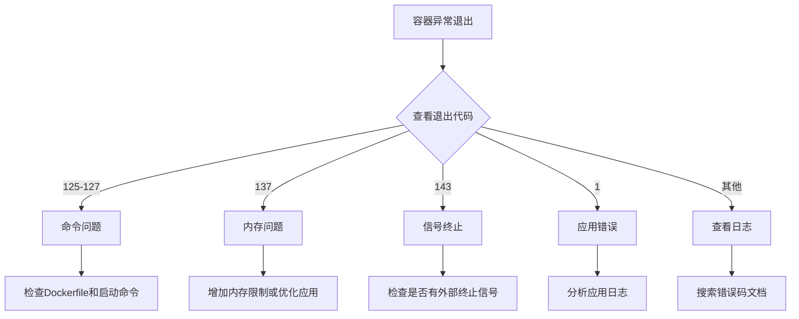
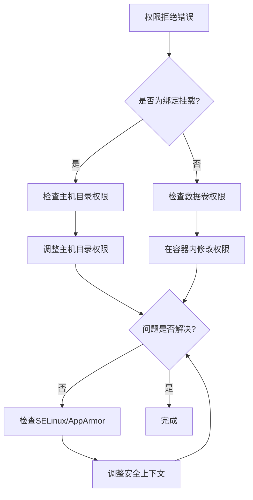
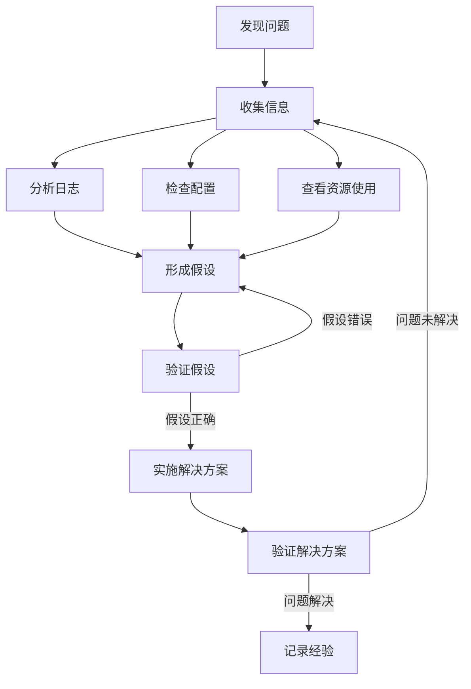

# Docker常见问题解决  

Docker作为一种容器化技术，在使用过程中可能会遇到各种各样的问题。本文将系统地介绍Docker使用过程中的常见问题及其解决方案，帮助开发者和运维人员快速定位和解决问题，提高工作效率。

## 1. 安装与配置问题  

Docker的安装和配置是使用Docker的第一步，也是容易出现问题的环节。

### 1.1 启动失败排查  

当Docker服务无法启动时，可以通过以下步骤进行排查：

```powershell
# 查看Docker服务状态
Get-Service docker

# 查看详细日志
Get-EventLog -LogName Application -Source Docker -Newest 20 | Format-Table -AutoSize

# 检查Docker服务依赖项
Get-Service -Name "vmcompute", "com.docker.service" | Format-Table -AutoSize

# 重启Docker服务
Restart-Service docker

# 检查Docker配置文件
cat "$env:ProgramData\Docker\config\daemon.json"
```

常见的启动失败原因及解决方案：

1. **WSL 2相关问题**：
   ```powershell
   # 检查WSL版本
   wsl --status
   
   # 更新WSL内核
   wsl --update
   
   # 设置默认WSL版本
   wsl --set-default-version 2
   ```

2. **端口冲突**：
   ```powershell
   # 查找占用Docker API端口(默认2375)的进程
   netstat -ano | findstr 2375
   
   # 修改Docker守护进程端口
   # 编辑daemon.json添加: "hosts": ["tcp://0.0.0.0:2376", "npipe:////./pipe/docker_engine"]
   ```

3. **文件损坏**：
   ```powershell
   # 重置Docker数据
   Stop-Service docker
   Remove-Item "$env:ProgramData\Docker" -Recurse -Force
   Start-Service docker
   ```

### 1.2 常见错误代码  

Docker操作中常见的错误代码及其含义：

| 错误代码 | 原因                  | 解决方案                                     |  
|----------|-----------------------|----------------------------------------------|  
| 125      | 容器启动命令错误      | 检查ENTRYPOINT/CMD参数                       |  
| 126      | 命令无法执行          | 检查文件权限或路径是否正确                   |  
| 127      | 命令未找到            | 确认容器内是否安装了所需命令                 |  
| 137      | OOM内存溢出           | 增加内存限制或优化应用内存使用               |  
| 139      | 段错误                | 检查应用代码或使用兼容的基础镜像             |  
| 143      | 容器被正常终止(SIGTERM)| 检查应用是否正确处理终止信号                |  
| 1        | 应用错误退出          | 查看应用日志定位具体错误                     |  
| 403      | 镜像仓库权限不足      | 配置正确的认证信息                           |  
| 404      | 镜像或API不存在       | 检查镜像名称/标签或API路径是否正确           |  
| 500      | 服务器内部错误        | 检查Docker守护进程状态或重启服务             |  

错误代码排查流程：



## 2. 容器运行问题  

容器运行过程中可能会遇到各种问题，包括异常退出、资源不足等。

### 2.1 容器异常退出  

当容器异常退出时，可以通过以下方法进行排查：

```powershell
# 查看退出容器日志
docker logs --tail 100 exited_container

# 查看带时间戳的日志
docker logs --timestamps exited_container

# 检查退出状态码
docker inspect -f '{{.State.ExitCode}}' exited_container

# 查看容器详细信息
docker inspect exited_container

# 查看所有已退出的容器
docker ps -a --filter "status=exited"

# 以调试模式运行容器
docker run --rm -it --entrypoint=sh problem_image
```

排查容器异常退出的步骤：

1. **检查退出状态码**：了解容器为何退出
2. **查看容器日志**：获取应用错误信息
3. **检查资源限制**：确认是否因资源不足导致退出
4. **验证启动命令**：确保入口点和命令正确
5. **检查依赖服务**：确认所依赖的服务是否可用
6. **检查文件权限**：特别是挂载卷的权限问题

### 2.2 资源不足诊断  

容器资源不足是常见的运行问题，可以通过以下命令进行诊断：

```powershell
# 查看所有容器资源使用情况
docker stats --no-stream

# 查看特定容器的资源使用
docker stats --no-stream container_name

# 检查容器内存限制
docker inspect -f '{{.HostConfig.Memory}}' my_container

# 检查容器CPU限制
docker inspect -f '{{.HostConfig.NanoCpus}}' my_container

# 查看磁盘使用情况
docker system df -v

# 监控容器资源使用变化
docker stats container_name
```

资源不足的常见表现和解决方案：

1. **内存溢出(OOM)**：
   ```powershell
   # 增加容器内存限制
   docker update --memory 2g --memory-swap 4g my_container
   
   # 重启容器
   docker restart my_container
   ```

2. **CPU限制导致性能问题**：
   ```powershell
   # 增加CPU限制
   docker update --cpus 2 my_container
   
   # 调整CPU共享权重
   docker update --cpu-shares 1024 my_container
   ```

3. **磁盘空间不足**：
   ```powershell
   # 清理未使用的容器
   docker container prune
   
   # 清理未使用的镜像
   docker image prune -a
   
   # 清理未使用的卷
   docker volume prune
   
   # 全面清理
   docker system prune -a --volumes
   ```

资源监控脚本示例：

```powershell:c:\project\kphub\scripts\monitor-containers.ps1
# 设置阈值
$memoryThreshold = 80  # 内存使用率阈值(%)
$cpuThreshold = 90     # CPU使用率阈值(%)

# 获取容器统计信息
$stats = docker stats --no-stream --format "{{.Name}},{{.CPUPerc}},{{.MemPerc}}"

# 分析每个容器的资源使用
foreach ($line in $stats) {
    $container, $cpu, $mem = $line.Split(',')
    
    # 移除百分号并转换为数字
    $cpuValue = [double]($cpu -replace '[^0-9.]')
    $memValue = [double]($mem -replace '[^0-9.]')
    
    Write-Host "容器: $container, CPU: $cpuValue%, 内存: $memValue%"
    
    # 检查是否超过阈值
    if ($cpuValue -gt $cpuThreshold) {
        Write-Host "警告: $container CPU使用率过高!" -ForegroundColor Red
    }
    
    if ($memValue -gt $memoryThreshold) {
        Write-Host "警告: $container 内存使用率过高!" -ForegroundColor Red
    }
}
```

## 3. 网络连接问题  

Docker网络问题是容器化应用中的常见挑战，包括端口冲突、DNS解析失败等。

### 3.1 端口冲突解决  

当出现端口冲突时，可以通过以下方法解决：

```powershell
# 查找占用特定端口的进程
netstat -ano | findstr 8080

# 根据PID查找进程名称
Get-Process -Id 1234

# 终止占用端口的进程
Stop-Process -Id 1234 -Force

# 修改容器映射端口
docker run -p 8081:80 nginx

# 查看容器端口映射
docker port container_name

# 使用随机端口映射
docker run -P nginx
```

端口冲突的常见原因和解决方案：

1. **主机上已有服务占用端口**：
   - 使用不同的主机端口
   - 停止冲突的服务
   - 修改应用配置使用其他端口

2. **多个容器映射到同一端口**：
   - 使用不同的主机端口
   - 使用Docker网络让容器直接通信，减少端口映射

3. **端口被防火墙阻止**：
   ```powershell
   # 检查Windows防火墙规则
   Get-NetFirewallRule | Where-Object {$_.DisplayName -like "*Docker*"}
   
   # 添加防火墙规则
   New-NetFirewallRule -DisplayName "Docker Container Port 8080" -Direction Inbound -Action Allow -Protocol TCP -LocalPort 8080
   ```

### 3.2 DNS解析失败  

容器内DNS解析问题是常见的网络故障：

```powershell
# 进入容器测试DNS
docker exec -it container_name ping google.com

# 检查容器DNS配置
docker exec -it container_name cat /etc/resolv.conf

# 配置Docker守护进程DNS
```

在Docker守护进程配置文件中设置DNS：

```json:c:\project\kphub\config\docker\daemon.json
{
  "dns": ["8.8.8.8", "114.114.114.114"],
  "dns-opts": ["timeout:2", "attempts:3"],
  "dns-search": ["example.com", "example.org"]
}
```

容器级别DNS配置：

```powershell
# 运行容器时指定DNS
docker run --dns 8.8.8.8 --dns 114.114.114.114 nginx

# 指定DNS搜索域
docker run --dns-search example.com nginx
```

DNS问题排查步骤：

1. **检查网络连通性**：确认容器网络是否正常
2. **验证DNS服务器**：测试指定的DNS服务器是否可用
3. **检查防火墙规则**：确认DNS流量未被阻止
4. **尝试不同的DNS服务器**：使用公共DNS如8.8.8.8
5. **检查Docker网络模式**：不同网络模式有不同的DNS行为

### 3.3 容器间通信问题

容器间通信是微服务架构中的关键需求：

```powershell
# 创建自定义网络
docker network create my_network

# 将容器连接到网络
docker run -d --name container1 --network my_network nginx
docker run -d --name container2 --network my_network nginx

# 测试容器间通信
docker exec -it container1 ping container2

# 检查网络配置
docker network inspect my_network

# 查看容器网络设置
docker inspect -f '{{range .NetworkSettings.Networks}}{{.IPAddress}}{{end}}' container1
```

解决容器间通信问题的方法：

1. **使用自定义网络**：默认桥接网络不支持DNS解析
2. **使用容器名称**：在自定义网络中可以使用容器名称通信
3. **检查网络隔离**：确认容器在同一网络中
4. **检查防火墙规则**：确保容器间通信未被阻止

## 4. 存储与卷问题  

Docker存储和卷问题会影响数据持久化和应用正常运行。

### 4.1 权限拒绝错误  

容器内访问挂载卷时常见权限问题：

```powershell
# 修复卷权限
docker run -v c:\project\kphub\data:/data --rm alpine chown -R 1000:1000 /data

# 以特定用户运行容器
docker run -u 1000:1000 -v c:\project\kphub\data:/data nginx

# 检查卷权限
docker run --rm -v c:\project\kphub\data:/data alpine ls -la /data

# 在Windows上设置目录权限
icacls "c:\project\kphub\data" /grant "Everyone:(OI)(CI)F"
```

解决权限问题的常见方法：

1. **调整主机目录权限**：确保容器内用户可以访问
2. **使用正确的用户ID**：使容器内外用户ID一致
3. **使用数据卷而非绑定挂载**：减少权限问题
4. **在Dockerfile中设置权限**：预先设置应用目录权限

权限问题排查流程：



### 4.2 数据卷占用  

数据卷被占用导致无法删除是常见问题：

```powershell
# 查找占用数据卷的容器
docker ps -a --filter volume=volume_name

# 使用Sysinternals工具查找占用进程
# 首先下载Handle工具: https://docs.microsoft.com/en-us/sysinternals/downloads/handle
handle64.exe -p docker-desktop

# 强制删除所有停止的容器
docker container prune -f

# 强制清理未使用的卷
docker volume prune -f

# 检查卷使用情况
docker volume ls -f dangling=true
```

解决数据卷占用问题的步骤：

1. **识别占用卷的容器**：找出哪些容器在使用该卷
2. **停止相关容器**：停止使用该卷的容器
3. **移除容器**：删除不再需要的容器
4. **强制删除卷**：如果卷仍然无法删除，可能需要重启Docker服务

数据卷管理脚本示例：

```powershell:c:\project\kphub\scripts\manage-volumes.ps1
# 列出所有未使用的卷
$danglingVolumes = docker volume ls -q -f dangling=true

if ($danglingVolumes) {
    Write-Host "发现未使用的数据卷:" -ForegroundColor Yellow
    docker volume ls -f dangling=true
    
    $confirmation = Read-Host "是否清理这些未使用的卷? (y/n)"
    if ($confirmation -eq 'y') {
        docker volume prune -f
        Write-Host "未使用的卷已清理" -ForegroundColor Green
    }
} else {
    Write-Host "没有发现未使用的数据卷" -ForegroundColor Green
}

# 列出大型数据卷
Write-Host "`n检查数据卷使用情况..." -ForegroundColor Cyan
$volumes = docker volume ls -q
foreach ($volume in $volumes) {
    # 创建临时容器检查卷大小
    $size = docker run --rm -v ${volume}:/vol alpine sh -c "du -sh /vol | cut -f1"
    Write-Host "卷 $volume 大小: $size"
}
```

## 5. 镜像相关问题  

Docker镜像问题会影响容器的创建和运行。

### 5.1 拉取镜像失败  

镜像拉取失败是常见的问题，可以通过以下方法解决：

```powershell
# 测试连接Docker Hub
curl -v https://registry-1.docker.io/v2/

# 检查Docker登录状态
docker login

# 使用备用镜像源
docker pull registry.cn-hangzhou.aliyuncs.com/library/nginx

# 配置镜像加速器
```

在Docker配置文件中设置镜像加速器：

```json:c:\project\kphub\config\docker\daemon.json
{
  "registry-mirrors": [
    "https://registry.docker-cn.com",
    "https://docker.mirrors.ustc.edu.cn",
    "https://hub-mirror.c.163.com"
  ]
}
```

拉取失败的常见原因和解决方案：

1. **网络连接问题**：
   - 检查网络连接
   - 配置代理服务器
   - 使用镜像加速器

2. **认证问题**：
   ```powershell
   # 重新登录Docker Hub
   docker logout
   docker login
   
   # 检查凭证存储
   cat "$env:USERPROFILE\.docker\config.json"
   ```

3. **镜像不存在**：
   - 检查镜像名称和标签是否正确
   - 查找替代镜像

### 5.2 镜像层损坏  

镜像层损坏会导致容器无法启动：

```powershell
# 验证镜像完整性
docker images --digests

# 检查镜像历史
docker history image_name

# 重新拉取镜像
docker rmi broken_image && docker pull broken_image

# 清理镜像缓存
docker builder prune -a
```

修复镜像问题的步骤：

1. **识别问题镜像**：确定哪个镜像出现问题
2. **检查镜像层**：查看镜像历史和层信息
3. **删除并重新拉取**：移除损坏的镜像并重新拉取
4. **构建新镜像**：如果是自定义镜像，重新构建
5. **检查存储驱动**：某些存储驱动可能更容易出现问题

### 5.3 构建镜像失败

构建Docker镜像时可能会遇到各种问题：

```powershell
# 使用详细模式构建
docker build --no-cache --progress=plain -t my_image .

# 检查Dockerfile语法
docker run --rm -i hadolint/hadolint < Dockerfile

# 分阶段构建调试
docker build --target build-stage -t debug-image .
docker run -it --rm debug-image sh
```

常见构建问题及解决方案：

1. **依赖包安装失败**：
   - 检查网络连接
   - 更新包管理器缓存
   - 指定依赖包版本

2. **构建上下文过大**：
   - 使用.dockerignore文件排除不必要文件
   - 减小构建上下文

3. **多阶段构建问题**：
   - 确保基础镜像兼容性
   - 验证文件复制路径

Dockerfile最佳实践：

```dockerfile:c:\project\kphub\docker\best-practice.dockerfile
# 使用特定版本标签而非latest
FROM node:16-alpine

# 设置工作目录
WORKDIR /app

# 先复制依赖文件，利用缓存
COPY package*.json ./
RUN npm ci --only=production

# 然后复制应用代码
COPY . .

# 使用非root用户运行
USER node

# 使用ENTRYPOINT和CMD组合
ENTRYPOINT ["node"]
CMD ["app.js"]
```

## 6. 性能问题排查  

Docker容器性能问题会影响应用的响应速度和用户体验。

### 6.1 高CPU占用  

容器CPU占用过高会导致应用响应缓慢：

```powershell
# 分析容器进程
docker exec -it my_container top

# 查看容器CPU使用详情
docker stats --no-stream my_container

# 使用更详细的工具
docker exec -it my_container ps -eo pid,ppid,cmd,%cpu,%mem --sort=-%cpu | head

# 限制CPU使用
docker update --cpus 2 my_container

# 设置CPU共享权重
docker update --cpu-shares 512 my_container
```

CPU问题排查步骤：

1. **识别高CPU进程**：找出容器内消耗CPU的进程
2. **分析进程行为**：了解为什么进程消耗高CPU
3. **检查应用代码**：查找可能的无限循环或低效算法
4. **考虑资源限制**：设置合理的CPU限制
5. **监控CPU使用趋势**：了解CPU使用的模式和峰值

### 6.2 磁盘IO瓶颈  

磁盘IO瓶颈会影响容器性能，特别是数据库容器：

```powershell
# 安装性能分析工具容器
docker run -d --name netshoot --pid=host --net=host --privileged nicolaka/netshoot

# 监控IO性能
docker exec -it netshoot iostat -dx 2

# 使用fio测试磁盘性能
docker exec -it netshoot fio --name=test --filename=/tmp/test --size=1G --rw=randrw --bs=4k --direct=1 --runtime=60

# 限制容器IO
docker run -d --device-write-bps /dev/sda:10mb my_container
```

IO性能优化建议：

1. **使用数据卷而非绑定挂载**：通常性能更好
2. **选择高性能存储**：使用SSD而非HDD
3. **优化应用IO模式**：减少随机IO，增加批处理
4. **使用适当的存储驱动**：overlay2通常是最佳选择
5. **考虑使用tmpfs**：对于临时数据，使用内存存储

### 6.3 内存泄漏排查

容器内存泄漏会导致OOM错误和性能下降：

```powershell
# 监控内存使用
docker stats my_container

# 详细分析内存使用
docker exec -it my_container cat /proc/meminfo

# 查看进程内存使用
docker exec -it my_container ps -eo pid,ppid,cmd,%mem --sort=-%mem | head

# 使用内存分析工具
docker exec -it my_container pmap -x 1
```

内存问题排查脚本：

```powershell:c:\project\kphub\scripts\memory-analysis.ps1
param (
    [Parameter(Mandatory=$true)]
    [string]$ContainerName
)

# 获取容器内存使用情况
$memStats = docker stats --no-stream $ContainerName --format "{{.MemUsage}}"
Write-Host "容器 $ContainerName 内存使用: $memStats" -ForegroundColor Cyan

# 获取容器内存限制
$memLimit = docker inspect -f '{{.HostConfig.Memory}}' $ContainerName
if ($memLimit -eq 0) {
    Write-Host "容器未设置内存限制" -ForegroundColor Yellow
} else {
    $memLimitMB = [math]::Round($memLimit / 1MB, 2)
    Write-Host "容器内存限制: $memLimitMB MB" -ForegroundColor Cyan
}

# 获取容器内TOP进程
Write-Host "`n容器内存占用TOP进程:" -ForegroundColor Cyan
docker exec $ContainerName ps -eo pid,ppid,cmd,%mem --sort=-%mem | Select-Object -First 5

# 检查是否有内存泄漏迹象
Write-Host "`n检查内存增长趋势..." -ForegroundColor Cyan
Write-Host "监控10秒内存变化..."
$memBefore = docker exec $ContainerName cat /proc/meminfo | Select-String "MemAvailable"
Start-Sleep -Seconds 10
$memAfter = docker exec $ContainerName cat /proc/meminfo | Select-String "MemAvailable"

Write-Host "开始: $memBefore"
Write-Host "结束: $memAfter"
```

## 7. Windows特有问题  

Windows环境下运行Docker有一些特有的问题需要注意。

### 7.1 路径转换问题  

Windows和Linux路径格式不同，导致挂载问题：

```powershell
# 禁用路径转换
$env:COMPOSE_CONVERT_WINDOWS_PATHS=0
docker-compose up

# 使用正确的路径格式
docker run -v c:/project/kphub/data:/data nginx

# 使用双反斜杠
docker run -v c:\\project\\kphub\\data:/data nginx

# 使用WSL路径
docker run -v /mnt/c/project/kphub/data:/data nginx
```

Windows路径问题的解决方案：

1. **使用正斜杠**：在Windows中使用正斜杠(/)而非反斜杠(\)
2. **使用绝对路径**：避免使用相对路径
3. **避免特殊字符**：路径中避免空格和特殊字符
4. **考虑使用数据卷**：减少路径转换问题

### 7.2 Hyper-V冲突  

Docker Desktop使用Hyper-V或WSL 2，可能与其他虚拟化软件冲突：

```powershell
# 检查Hyper-V状态
Get-WindowsOptionalFeature -Online -FeatureName Microsoft-Hyper-V

# 关闭冲突服务
Stop-Service -Name "Hyper-V*" -Force

# 重置网络适配器
Get-NetAdapter | Where-Object {$_.InterfaceDescription -like "*Hyper-V*"} | ForEach-Object {
    Disable-NetAdapter -Name $_.Name -Confirm:$false
    Enable-NetAdapter -Name $_.Name
}

# 切换到WSL 2后端
# 在Docker Desktop设置中切换
```

解决虚拟化冲突的步骤：

1. **识别冲突软件**：确定哪些软件使用了虚拟化技术
2. **选择合适的后端**：在Hyper-V和WSL 2之间选择
3. **调整虚拟化设置**：配置虚拟化软件共存
4. **考虑使用Docker Toolbox**：在不支持Hyper-V的环境中

### 7.3 WSL 2集成问题

使用WSL 2后端时可能遇到的问题：

```powershell
# 检查WSL状态
wsl --status

# 更新WSL内核
wsl --update

# 重启WSL
wsl --shutdown
wsl

# 检查WSL网络
wsl -- ip addr

# 配置WSL内存限制
# 创建或编辑文件: %UserProfile%\.wslconfig
# 内容:
# [wsl2]
# memory=4GB
# processors=2
```

WSL 2性能优化：

1. **限制内存使用**：防止WSL 2占用过多内存
2. **调整处理器分配**：根据主机能力分配CPU
3. **优化文件系统访问**：将工作目录放在WSL文件系统中
4. **使用WSL网络**：减少网络转发开销

## 8. 日志收集与分析  

有效的日志管理对于排查Docker问题至关重要。

### 8.1 集中式日志  

在生产环境中，通常需要集中收集和分析容器日志：

```powershell
# 使用syslog驱动发送日志
docker run --log-driver=syslog --log-opt syslog-address=tcp://logserver:514 my_
继续完成Docker常见问题解决的内容：

### 8.1 集中式日志（续）

在生产环境中，通常需要集中收集和分析容器日志：

```powershell
# 使用syslog驱动发送日志
docker run --log-driver=syslog --log-opt syslog-address=tcp://logserver:514 my_app

# 使用fluentd收集日志
docker run --log-driver=fluentd --log-opt fluentd-address=fluentdhost:24224 my_app

# 使用AWS CloudWatch
docker run --log-driver=awslogs --log-opt awslogs-region=us-west-2 --log-opt awslogs-group=my-containers my_app

# 使用Elasticsearch
docker run --log-driver=gelf --log-opt gelf-address=udp://elastichost:12201 my_app
```

集中式日志系统部署示例（使用EFK栈）：

```yaml:c:\project\kphub\docker\compose\logging-stack.yml
version: '3.8'

services:
  fluentd:
    image: fluent/fluentd:v1.14
    volumes:
      - c:\project\kphub\config\fluentd\conf:/fluentd/etc
    ports:
      - "24224:24224"
      - "24224:24224/udp"
    networks:
      - logging_network

  elasticsearch:
    image: elasticsearch:7.17.0
    environment:
      - "discovery.type=single-node"
      - "ES_JAVA_OPTS=-Xms512m -Xmx512m"
    ports:
      - "9200:9200"
    volumes:
      - elasticsearch_data:/usr/share/elasticsearch/data
    networks:
      - logging_network

  kibana:
    image: kibana:7.17.0
    ports:
      - "5601:5601"
    depends_on:
      - elasticsearch
    networks:
      - logging_network

  # 示例应用容器
  app:
    image: nginx:alpine
    logging:
      driver: fluentd
      options:
        fluentd-address: fluentd:24224
        tag: nginx.{{.Name}}
    networks:
      - logging_network

networks:
  logging_network:

volumes:
  elasticsearch_data:
```

### 8.2 日志轮转配置  

防止日志占用过多磁盘空间：

```json:c:\project\kphub\config\docker\daemon.json
{
  "log-driver": "json-file",
  "log-opts": {
    "max-size": "100m",
    "max-file": "3",
    "compress": "true",
    "labels": "production_app",
    "env": "os,customer"
  }
}
```

容器级别日志配置：

```powershell
# 单个容器配置日志轮转
docker run -d --name nginx \
  --log-opt max-size=50m \
  --log-opt max-file=5 \
  nginx

# 禁用特定容器的日志
docker run -d --name no-logs \
  --log-driver none \
  nginx
```

手动清理容器日志脚本：

```powershell:c:\project\kphub\scripts\clean-container-logs.ps1
# 获取所有容器ID
$containers = docker ps -aq

foreach ($container in $containers) {
    # 获取容器日志路径
    $logPath = docker inspect --format='{{.LogPath}}' $container
    
    if ($logPath -and (Test-Path $logPath)) {
        $containerName = docker inspect --format='{{.Name}}' $container
        $containerName = $containerName.TrimStart('/')
        
        $logSize = (Get-Item $logPath).Length / 1MB
        Write-Host "容器 $containerName 日志大小: $logSize MB" -ForegroundColor Cyan
        
        if ($logSize -gt 100) {
            Write-Host "清理容器 $containerName 的日志文件..." -ForegroundColor Yellow
            
            # 备份日志（可选）
            Copy-Item -Path $logPath -Destination "$logPath.bak"
            
            # 清空日志文件
            Clear-Content -Path $logPath
            
            Write-Host "日志已清理" -ForegroundColor Green
        }
    }
}
```

### 8.3 日志分析技巧

从容器日志中提取有用信息：

```powershell
# 提取错误日志
docker logs container_name 2>&1 | Select-String -Pattern "ERROR", "Exception", "failed"

# 按时间范围过滤日志
docker logs --since 2023-01-01T00:00:00 --until 2023-01-02T00:00:00 container_name

# 统计错误出现频率
docker logs container_name | Select-String -Pattern "ERROR" | Group-Object | Sort-Object -Property Count -Descending

# 提取特定请求的完整日志
docker logs container_name | Select-String -Pattern "request-123" -Context 5,5

# 实时监控特定类型的日志
docker logs -f container_name | Select-String -Pattern "CRITICAL" -NotMatch
```

日志分析脚本示例：

```powershell:c:\project\kphub\scripts\analyze-logs.ps1
param (
    [Parameter(Mandatory=$true)]
    [string]$ContainerName,
    
    [Parameter(Mandatory=$false)]
    [string]$Pattern = "ERROR|WARN|Exception|failed",
    
    [Parameter(Mandatory=$false)]
    [int]$Lines = 1000
)

# 获取容器日志
$logs = docker logs --tail $Lines $ContainerName

# 提取匹配的日志行
$matchedLogs = $logs | Select-String -Pattern $Pattern

# 统计错误类型
$errorTypes = $matchedLogs | ForEach-Object {
    if ($_ -match "(ERROR|WARN|Exception|failed)") {
        $Matches[1]
    }
} | Group-Object | Sort-Object -Property Count -Descending

# 输出统计结果
Write-Host "日志分析结果 - 容器: $ContainerName" -ForegroundColor Cyan
Write-Host "分析最近 $Lines 行日志" -ForegroundColor Cyan
Write-Host "`n错误类型统计:" -ForegroundColor Yellow
$errorTypes | Format-Table -Property Name, Count

# 输出最常见的错误消息
Write-Host "`n最常见的错误消息:" -ForegroundColor Yellow
$commonErrors = $matchedLogs | Group-Object | Sort-Object -Property Count -Descending | Select-Object -First 5
foreach ($error in $commonErrors) {
    Write-Host "出现 $($error.Count) 次: $($error.Name)" -ForegroundColor Red
}

# 输出错误时间分布
Write-Host "`n错误时间分布:" -ForegroundColor Yellow
$matchedLogs | ForEach-Object {
    if ($_ -match "\d{2}:\d{2}:\d{2}") {
        $Matches[0]
    }
} | Group-Object | Sort-Object -Property Name | Format-Table -Property Name, Count
```

## 9. 安全问题排查

Docker环境中的安全问题可能导致严重后果，需要及时发现和解决。

### 9.1 容器逃逸检测

容器逃逸是指攻击者从容器内部获取主机访问权限：

```powershell
# 检查容器特权设置
docker inspect --format='{{.HostConfig.Privileged}}' container_name

# 检查容器capabilities
docker inspect --format='{{.HostConfig.CapAdd}}' container_name

# 检查挂载的敏感目录
docker inspect --format='{{range .Mounts}}{{.Source}}:{{.Destination}} {{end}}' container_name

# 检查是否挂载了Docker套接字
docker inspect --format='{{range .Mounts}}{{if eq .Destination "/var/run/docker.sock"}}DANGER{{end}}{{end}}' container_name
```

安全检查脚本：

```powershell:c:\project\kphub\scripts\security-check.ps1
# 获取所有运行中的容器
$containers = docker ps -q

$securityIssues = @()

foreach ($container in $containers) {
    $name = docker inspect --format='{{.Name}}' $container
    $name = $name.TrimStart('/')
    
    # 检查特权模式
    $privileged = docker inspect --format='{{.HostConfig.Privileged}}' $container
    
    # 检查capabilities
    $capAdd = docker inspect --format='{{.HostConfig.CapAdd}}' $container
    
    # 检查敏感挂载
    $mounts = docker inspect --format='{{range .Mounts}}{{.Source}}:{{.Destination}} {{end}}' $container
    $sensitiveMount = $mounts -match "/var/run/docker.sock|/proc|/sys"
    
    # 检查网络模式
    $networkMode = docker inspect --format='{{.HostConfig.NetworkMode}}' $container
    
    # 检查用户
    $user = docker inspect --format='{{.Config.User}}' $container
    
    # 记录安全问题
    if ($privileged -eq "true") {
        $securityIssues += [PSCustomObject]@{
            Container = $name
            Issue = "特权模式"
            Severity = "高"
            Recommendation = "移除--privileged标志"
        }
    }
    
    if ($capAdd -match "SYS_ADMIN") {
        $securityIssues += [PSCustomObject]@{
            Container = $name
            Issue = "危险的Capability: SYS_ADMIN"
            Severity = "高"
            Recommendation = "移除--cap-add SYS_ADMIN"
        }
    }
    
    if ($sensitiveMount) {
        $securityIssues += [PSCustomObject]@{
            Container = $name
            Issue = "敏感目录挂载: $sensitiveMount"
            Severity = "高"
            Recommendation = "移除敏感目录挂载"
        }
    }
    
    if ($networkMode -eq "host") {
        $securityIssues += [PSCustomObject]@{
            Container = $name
            Issue = "主机网络模式"
            Severity = "中"
            Recommendation = "使用桥接网络代替主机网络"
        }
    }
    
    if ([string]::IsNullOrEmpty($user) -or $user -eq "0" -or $user -eq "root") {
        $securityIssues += [PSCustomObject]@{
            Container = $name
            Issue = "以root用户运行"
            Severity = "中"
            Recommendation = "使用非特权用户运行容器"
        }
    }
}

# 输出安全问题报告
if ($securityIssues.Count -gt 0) {
    Write-Host "发现 $($securityIssues.Count) 个安全问题:" -ForegroundColor Red
    $securityIssues | Format-Table -AutoSize
} else {
    Write-Host "未发现安全问题" -ForegroundColor Green
}
```

### 9.2 镜像漏洞扫描

检测容器镜像中的安全漏洞：

```powershell
# 使用Trivy扫描镜像
docker run --rm -v /var/run/docker.sock:/var/run/docker.sock aquasec/trivy image nginx:latest

# 使用Clair扫描镜像
# 首先部署Clair服务
docker run -d --name clair -p 6060:6060 quay.io/coreos/clair:latest

# 使用Docker Bench Security
docker run --rm -it \
    -v /var/run/docker.sock:/var/run/docker.sock \
    -v /usr/bin/docker:/usr/bin/docker \
    -v /etc/docker:/etc/docker \
    docker/docker-bench-security
```

定期漏洞扫描脚本：

```powershell:c:\project\kphub\scripts\scan-images.ps1
# 获取所有本地镜像
$images = docker images --format "{{.Repository}}:{{.Tag}}" | Where-Object { $_ -ne "<none>:<none>" }

# 创建结果目录
$resultDir = "c:\project\kphub\security\scan-results"
if (-not (Test-Path $resultDir)) {
    New-Item -ItemType Directory -Path $resultDir | Out-Null
}

$date = Get-Date -Format "yyyyMMdd"

foreach ($image in $images) {
    Write-Host "扫描镜像: $image" -ForegroundColor Cyan
    
    # 使用Trivy扫描镜像
    $outputFile = "$resultDir\${image.Replace(':', '_')}_$date.txt"
    $outputFile = $outputFile.Replace('/', '_')
    
    docker run --rm -v /var/run/docker.sock:/var/run/docker.sock aquasec/trivy image --output $outputFile $image
    
    if ($LASTEXITCODE -eq 0) {
        Write-Host "扫描完成，结果保存到: $outputFile" -ForegroundColor Green
    } else {
        Write-Host "扫描失败" -ForegroundColor Red
    }
}

# 生成摘要报告
Write-Host "`n生成漏洞摘要报告..." -ForegroundColor Cyan
$summaryFile = "$resultDir\summary_$date.txt"

"镜像漏洞扫描摘要报告 - $date`n" | Out-File $summaryFile

foreach ($image in $images) {
    $scanFile = "$resultDir\${image.Replace(':', '_')}_$date.txt".Replace('/', '_')
    
    if (Test-Path $scanFile) {
        $criticalCount = (Select-String -Path $scanFile -Pattern "CRITICAL" | Measure-Object).Count
        $highCount = (Select-String -Path $scanFile -Pattern "HIGH" | Measure-Object).Count
        
        "镜像: $image" | Out-File $summaryFile -Append
        "  严重漏洞: $criticalCount" | Out-File $summaryFile -Append
        "  高危漏洞: $highCount" | Out-File $summaryFile -Append
        "`n" | Out-File $summaryFile -Append
    }
}

Write-Host "摘要报告已生成: $summaryFile" -ForegroundColor Green
```

### 9.3 访问控制问题

Docker访问控制配置不当可能导致安全风险：

```powershell
# 检查Docker守护进程配置
cat "$env:ProgramData\Docker\config\daemon.json"

# 检查Docker API暴露情况
netstat -ano | findstr 2375

# 检查Docker用户组成员
net localgroup docker

# 配置TLS保护Docker API
# 1. 生成证书
# 2. 配置daemon.json:
# {
#   "tlsverify": true,
#   "tlscacert": "C:/ProgramData/Docker/certs/ca.pem",
#   "tlscert": "C:/ProgramData/Docker/certs/server-cert.pem",
#   "tlskey": "C:/ProgramData/Docker/certs/server-key.pem"
# }
```

## 10. 综合问题排查流程

面对复杂的Docker问题，需要系统化的排查流程。

### 10.1 问题排查方法论

有效的Docker问题排查遵循以下步骤：



排查流程详解：

1. **收集信息**：
   - 查看容器状态：`docker ps -a`
   - 检查容器日志：`docker logs container_name`
   - 查看容器详情：`docker inspect container_name`
   - 检查资源使用：`docker stats container_name`

2. **分析日志**：
   - 查找错误信息
   - 分析时间序列
   - 关联多个容器的日志

3. **检查配置**：
   - 验证Docker配置
   - 检查容器启动参数
   - 审查网络和存储设置

4. **形成假设**：
   - 基于收集的信息提出可能的原因
   - 按照可能性排序

5. **验证假设**：
   - 进行针对性测试
   - 修改配置验证
   - 隔离环境测试

6. **实施解决方案**：
   - 应用临时修复
   - 实施永久解决方案
   - 更新文档和最佳实践

### 10.2 常见问题快速参考

常见Docker问题的快速诊断和解决方法：

| 问题类型 | 症状 | 诊断命令 | 常见解决方案 |
|----------|------|----------|--------------|
| 容器无法启动 | `docker ps`显示容器已退出 | `docker logs container_name`<br>`docker inspect container_name` | 检查启动命令<br>验证挂载点<br>检查资源限制 |
| 网络连接问题 | 容器间无法通信<br>无法访问外部网络 | `docker network inspect bridge`<br>`docker exec container_name ping 8.8.8.8` | 检查网络配置<br>验证DNS设置<br>检查防火墙规则 |
| 存储问题 | 数据丢失<br>磁盘空间不足 | `docker system df`<br>`docker volume ls` | 配置数据卷<br>清理未使用资源<br>增加存储空间 |
| 性能问题 | 容器响应缓慢<br>主机资源占用高 | `docker stats`<br>`docker top container_name` | 限制容器资源<br>优化应用代码<br>调整Docker配置 |
| 镜像问题 | 无法拉取镜像<br>构建失败 | `docker pull --verbose image_name`<br>`docker build --no-cache .` | 配置镜像加速<br>检查网络连接<br>验证Dockerfile |

### 10.3 问题预防最佳实践

预防胜于治疗，以下是避免常见Docker问题的最佳实践：

1. **容器设计原则**：
   - 一个容器一个进程
   - 使用非root用户运行
   - 实现优雅关闭
   - 处理信号和健康检查

2. **资源管理**：
   - 设置合理的资源限制
   - 监控资源使用
   - 定期清理未使用资源
   - 实施自动扩缩容

3. **日志管理**：
   - 配置日志轮转
   - 实施集中式日志
   - 设置日志告警
   - 定期分析日志

4. **安全实践**：
   - 定期更新镜像
   - 扫描安全漏洞
   - 限制容器权限
   - 实施网络隔离

5. **监控与告警**：
   - 部署监控系统
   - 设置关键指标告警
   - 实施自动恢复机制
   - 定期进行压力测试

Docker问题排查工具箱脚本：

```powershell:c:\project\kphub\scripts\docker-troubleshoot.ps1
param (
    [Parameter(Mandatory=$false)]
    [string]$ContainerName,
    
    [Parameter(Mandatory=$false)]
    [switch]$Full
)

function Write-Header {
    param ([string]$Title)
    Write-Host "`n===== $Title =====" -ForegroundColor Cyan
}

# 基本Docker信息
Write-Header "Docker系统信息"
docker info

# Docker资源使用
Write-Header "Docker资源使用"
docker system df -v

if ($ContainerName) {
    # 容器详细信息
    Write-Header "容器详细信息: $ContainerName"
    docker inspect $ContainerName
    
    # 容器日志
    Write-Header "容器日志: $ContainerName"
    docker logs --tail 50 $ContainerName
    
    # 容器资源使用
    Write-Header "容器资源使用: $ContainerName"
    docker stats --no-stream $ContainerName
    
    # 容器进程
    Write-Header "容器进程: $ContainerName"
    docker top $ContainerName
    
    # 容器网络
    Write-Header "容器网络: $ContainerName"
    $networkName = docker inspect -f '{{range $key, $value := .NetworkSettings.Networks}}{{$key}}{{end}}' $ContainerName
    docker network inspect $networkName
} else {
    # 所有容器状态
    Write-Header "所有容器状态"
    docker ps -a
    
    # 运行中容器资源使用
    Write-Header "运行中容器资源使用"
    docker stats --no-stream
}

if ($Full) {
    # Docker守护进程配置
    Write-Header "Docker守护进程配置"
    if (Test-Path "$env:ProgramData\Docker\config\daemon.json") {
        Get-Content "$env:ProgramData\Docker\config\daemon.json"
    } else {
        Write-Host "未找到daemon.json配置文件" -ForegroundColor Yellow
    }
    
    # Docker网络
    Write-Header "Docker网络"
    docker network ls
    
    # Docker卷
    Write-Header "Docker卷"
    docker volume ls
    
    # Docker镜像
    Write-Header "Docker镜像"
    docker images
    
    # 系统端口使用
    Write-Header "系统端口使用"
    netstat -ano | findstr LISTENING
}

Write-Host "`n故障排查完成。如需更多信息，请使用-Full参数运行脚本。" -ForegroundColor Green
```

## 总结

Docker作为一种强大的容器化技术，为应用开发和部署带来了极大便利，但同时也引入了一系列新的问题和挑战。本文系统地介绍了Docker使用过程中常见问题的排查和解决方法，涵盖了安装配置、容器运行、网络连接、存储、镜像、性能、Windows特有问题以及日志管理等多个方面。

遇到Docker问题时，建议按照"查看日志→检查配置→隔离测试→搜索错误码"的流程进行排查。对于复杂问题，可以使用`docker system df`、`docker inspect`和`docker stats`等命令获取详细系统状态。在生产环境中，建议配置监控告警系统，及时发现并解决潜在问题。

通过掌握本文介绍的问题排查技巧和最佳实践，开发者和运维人员可以更加高效地解决Docker相关问题，确保容器化应用的稳定运行。