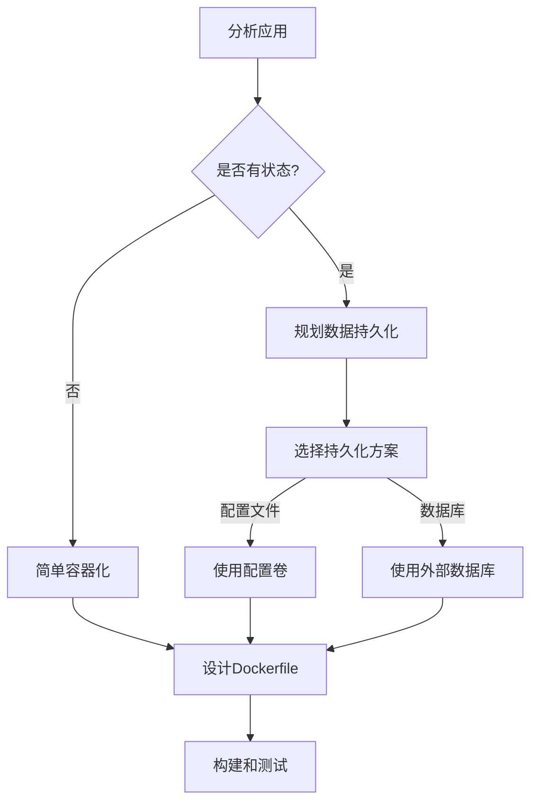
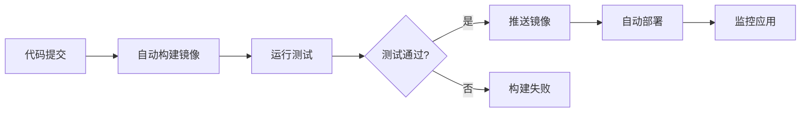
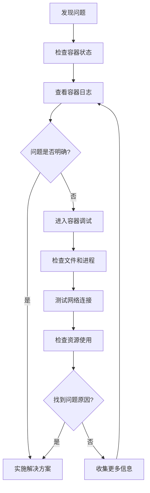

# 容器化第一个应用  

容器化是现代应用开发和部署的重要技术，它可以帮助开发者将应用及其依赖打包成一个独立的单元，确保应用在任何环境中都能一致地运行。本文将通过一个实际的示例项目，详细介绍如何将一个简单的Web应用容器化，并探讨容器化过程中的最佳实践和常见问题。

## 1. 项目准备  

在开始容器化之前，我们需要了解项目的结构和特点，这有助于我们设计合适的容器化策略。

### 1.1 示例项目结构  

我们的示例项目是一个简单的Flask Web应用，项目结构如下：

```text:c:\project\kphub\demo-app
demo-app/
├── src/
│   ├── app.py
│   └── requirements.txt
├── static/
│   └── style.css
└── data/
    └── config.json
```

这个结构包含了一个典型Web应用的基本组件：
- `src/app.py`：主应用代码，包含Flask应用逻辑
- `src/requirements.txt`：Python依赖列表
- `static/style.css`：静态资源文件
- `data/config.json`：应用配置文件

让我们看一下主应用代码的基本结构：

```python:c:\project\kphub\demo-app\src\app.py
from flask import Flask, render_template, jsonify
import json
import os

app = Flask(__name__, static_folder='../static')

# 加载配置文件
def load_config():
    config_path = os.path.join(os.path.dirname(os.path.dirname(__file__)), 'data', 'config.json')
    try:
        with open(config_path, 'r') as f:
            return json.load(f)
    except Exception as e:
        print(f"Error loading config: {e}")
        return {"error": "配置加载失败", "version": "unknown"}

@app.route('/')
def index():
    config = load_config()
    return render_template('index.html', config=config)

@app.route('/api/config')
def get_config():
    config = load_config()
    return jsonify(config)

if __name__ == '__main__':
    app.run(host='0.0.0.0', port=5000, debug=True)
```

依赖文件内容：

```text:c:\project\kphub\demo-app\src\requirements.txt
flask==2.0.1
gunicorn==20.1.0
pytest==6.2.5
```

配置文件内容：

```json:c:\project\kphub\demo-app\data\config.json
{
  "appName": "Demo Flask App",
  "version": "1.0.0",
  "environment": "development",
  "features": {
    "logging": true,
    "metrics": false
  }
}
```

### 1.2 应用分析  

在容器化应用之前，我们需要分析应用的特点和需求，以便设计合适的容器化策略。

| 组件       | 技术栈       | 容器化要点         |  
|------------|-------------|-------------------|  
| Web服务    | Flask       | 暴露5000端口      |  
| 静态资源   | CSS         | 挂载静态文件目录  |  
| 配置文件   | JSON        | 数据卷持久化      |  

从上表可以看出，我们的应用有以下容器化要点：

1. **Web服务**：Flask应用需要暴露5000端口，以便外部访问
2. **静态资源**：CSS文件需要通过挂载卷的方式提供，便于更新
3. **配置文件**：JSON配置文件需要持久化存储，以便在容器重启后保留配置

容器化策略决策流程：



## 2. Dockerfile编写  

Dockerfile是容器化应用的核心，它定义了如何构建Docker镜像。一个好的Dockerfile应该遵循最佳实践，如使用多阶段构建、最小化层数、优化缓存等。

### 2.1 基础镜像选择  

选择合适的基础镜像是Dockerfile编写的第一步。对于Python应用，我们可以选择官方的Python镜像，并使用多阶段构建来减小最终镜像的大小。

```dockerfile:c:\project\kphub\demo-app\Dockerfile
# 构建阶段
FROM python:3.9-slim as builder
WORKDIR /app
COPY src/requirements.txt .
RUN pip install --user -r requirements.txt

# 运行阶段
FROM python:3.9-slim
WORKDIR /app
COPY --from=builder /root/.local /root/.local
COPY . .
ENV PATH=/root/.local/bin:$PATH
```

在这个Dockerfile中：
1. 我们使用`python:3.9-slim`作为基础镜像，它比完整的Python镜像小得多
2. 第一阶段（builder）安装Python依赖
3. 第二阶段只复制必要的文件，减小最终镜像的大小
4. 设置环境变量，确保安装的Python包可以被正确访问

基础镜像选择考虑因素：

| 镜像类型 | 优点 | 缺点 | 适用场景 |
|---------|------|------|----------|
| 完整镜像<br>(python:3.9) | 包含所有工具和库 | 体积大 | 开发环境 |
| 精简镜像<br>(python:3.9-slim) | 体积小，包含基本工具 | 可能缺少某些系统库 | 大多数生产环境 |
| 极简镜像<br>(python:3.9-alpine) | 体积最小 | 兼容性问题，编译依赖复杂 | 对镜像大小有严格要求的环境 |

### 2.2 多阶段构建优化  

多阶段构建是减小Docker镜像大小的有效方法。在第一阶段，我们安装依赖；在第二阶段，我们只复制必要的文件。现在，让我们完善Dockerfile，添加运行配置：

```dockerfile:c:\project\kphub\demo-app\Dockerfile
# 构建阶段
FROM python:3.9-slim as builder
WORKDIR /app
COPY src/requirements.txt .
RUN pip install --user -r requirements.txt

# 运行阶段
FROM python:3.9-slim
WORKDIR /app
COPY --from=builder /root/.local /root/.local
COPY . .
ENV PATH=/root/.local/bin:$PATH

# 添加运行配置
EXPOSE 5000
VOLUME /app/data
CMD ["python", "src/app.py"]
```

新增的配置说明：
- `EXPOSE 5000`：声明容器将使用5000端口（这只是一个声明，实际暴露端口需要在运行时指定）
- `VOLUME /app/data`：声明数据卷，用于持久化存储配置文件
- `CMD ["python", "src/app.py"]`：指定容器启动时运行的命令

多阶段构建的优势：
1. **减小镜像大小**：最终镜像只包含运行所需的文件
2. **提高安全性**：减少攻击面，不包含构建工具
3. **优化缓存**：依赖安装和代码复制分离，提高构建效率

进一步优化的Dockerfile：

```dockerfile:c:\project\kphub\demo-app\Dockerfile.optimized
# 构建阶段
FROM python:3.9-slim as builder
WORKDIR /app

# 只复制依赖文件，利用缓存
COPY src/requirements.txt .
RUN pip install --user -r requirements.txt

# 运行阶段
FROM python:3.9-slim
WORKDIR /app

# 复制依赖
COPY --from=builder /root/.local /root/.local
ENV PATH=/root/.local/bin:$PATH

# 创建非root用户
RUN groupadd -r appuser && useradd -r -g appuser appuser

# 先复制代码，后复制可能变化的文件
COPY src /app/src
COPY static /app/static

# 设置目录权限
RUN mkdir -p /app/data && chown -R appuser:appuser /app

# 切换到非root用户
USER appuser

# 添加运行配置
EXPOSE 5000
VOLUME /app/data
HEALTHCHECK --interval=30s --timeout=3s CMD curl -f http://localhost:5000/ || exit 1
CMD ["gunicorn", "--bind", "0.0.0.0:5000", "src.app:app"]
```

这个优化版本的Dockerfile增加了以下改进：
1. 使用非root用户运行应用，提高安全性
2. 添加健康检查，便于监控容器状态
3. 使用Gunicorn作为生产级Web服务器
4. 优化文件复制顺序，提高缓存利用率

## 3. 镜像构建  

编写好Dockerfile后，下一步是构建Docker镜像。构建过程中需要注意缓存利用、标签管理等问题。

### 3.1 构建命令  

使用`docker build`命令构建镜像：

```powershell
# 构建镜像
cd c:\project\kphub\demo-app
docker build -t demo-app:v1 .

# 查看镜像
docker images | findstr demo-app
```

构建命令说明：
- `-t demo-app:v1`：指定镜像名称和标签
- `.`：指定构建上下文（当前目录）

构建过程输出示例：

```text
Sending build context to Docker daemon  8.192kB
Step 1/9 : FROM python:3.9-slim as builder
 ---> 2b9a41ddc2a8
Step 2/9 : WORKDIR /app
 ---> Using cache
 ---> 3a1f3e7a6b7c
Step 3/9 : COPY src/requirements.txt .
 ---> Using cache
 ---> 4b2c3d1e0f9a
Step 4/9 : RUN pip install --user -r requirements.txt
 ---> Using cache
 ---> 5c3b2a1d9e8f
Step 5/9 : FROM python:3.9-slim
 ---> 2b9a41ddc2a8
Step 6/9 : WORKDIR /app
 ---> Using cache
 ---> 3a1f3e7a6b7c
Step 7/9 : COPY --from=builder /root/.local /root/.local
 ---> Using cache
 ---> 6d4c3b2a1e0f
Step 8/9 : COPY . .
 ---> 7e5d4c3b2a1f
Step 9/9 : ENV PATH=/root/.local/bin:$PATH
 ---> Running in 8f7e6d5c4b3a
Removing intermediate container 8f7e6d5c4b3a
 ---> 9g8f7e6d5c4b
Successfully built 9g8f7e6d5c4b
Successfully tagged demo-app:v1
```

### 3.2 构建缓存利用  

Docker构建过程中会使用缓存来加速构建。了解缓存机制可以帮助我们优化构建过程。

```powershell
# 仅安装依赖
docker build --target builder -t demo-app:builder .

# 使用缓存构建完整镜像
docker build -t demo-app:v1 .

# 强制不使用缓存
docker build --no-cache -t demo-app:v1-fresh .

# 构建特定平台的镜像
docker build --platform linux/amd64 -t demo-app:v1-amd64 .
```

构建缓存优化策略：

1. **依赖文件先复制**：先复制`requirements.txt`，再安装依赖，这样当依赖不变时可以利用缓存
2. **分层复制文件**：按照变化频率组织文件复制，不常变化的文件先复制
3. **使用.dockerignore**：排除不需要的文件，减小构建上下文

`.dockerignore`文件示例：

```text:c:\project\kphub\demo-app\.dockerignore
.git
.github
__pycache__
*.pyc
*.pyo
*.pyd
.Python
env/
venv/
.venv/
.env
.pytest_cache/
.coverage
htmlcov/
.tox/
.nox/
.hypothesis/
.idea/
.vscode/
*.suo
*.ntvs*
*.njsproj
*.sln
*.sw?
```

## 4. 容器运行  

构建好镜像后，我们可以运行容器来启动应用。容器运行时需要考虑端口映射、卷挂载、环境变量等配置。

### 4.1 基础运行  

最简单的容器运行命令：

```powershell
# 开发模式运行
docker run -d -p 5000:5000 --name demo demo-app:v1
```

命令说明：
- `-d`：后台运行容器
- `-p 5000:5000`：将容器的5000端口映射到主机的5000端口
- `--name demo`：指定容器名称
- `demo-app:v1`：使用的镜像

验证容器运行状态：

```powershell
# 查看容器状态
docker ps

# 查看容器日志
docker logs demo

# 访问应用
Start-Process "http://localhost:5000"
```

### 4.2 生产环境配置  

在生产环境中，我们需要更完善的配置，包括卷挂载、重启策略、资源限制等：

```powershell
# 完整运行命令
docker run -d `
  -p 5000:5000 `
  -v c:\project\kphub\demo-app\static:/app/static `
  -v app_data:/app/data `
  --restart unless-stopped `
  --name demo-prod `
  --memory 512m `
  --cpus 0.5 `
  --health-cmd "curl -f http://localhost:5000/ || exit 1" `
  --health-interval 30s `
  --health-retries 3 `
  --health-timeout 5s `
  --health-start-period 10s `
  -e "FLASK_ENV=production" `
  demo-app:v1
```

命令说明：
- `-v c:\project\kphub\demo-app\static:/app/static`：挂载静态文件目录，便于更新静态资源
- `-v app_data:/app/data`：使用命名卷存储数据，确保数据持久化
- `--restart unless-stopped`：容器退出时自动重启，除非手动停止
- `--memory 512m`：限制容器使用的内存
- `--cpus 0.5`：限制容器使用的CPU资源
- `--health-*`：配置健康检查
- `-e "FLASK_ENV=production"`：设置环境变量

容器运行配置对比：

| 配置项 | 开发环境 | 生产环境 | 说明 |
|-------|---------|---------|------|
| 端口映射 | `-p 5000:5000` | `-p 80:5000` | 生产环境通常使用标准端口 |
| 卷挂载 | 代码和数据 | 仅配置和静态资源 | 生产环境代码应打包在镜像中 |
| 重启策略 | 无 | `--restart unless-stopped` | 生产环境需要高可用性 |
| 资源限制 | 无 | 内存和CPU限制 | 防止单个容器占用过多资源 |
| 健康检查 | 无 | 配置完善的健康检查 | 便于监控和自动恢复 |
| 环境变量 | 开发配置 | 生产配置 | 不同环境使用不同配置 |

## 5. 网络配置  

Docker容器的网络配置对于多容器应用和微服务架构至关重要。Docker提供了多种网络模式，如桥接网络、主机网络、覆盖网络等。

### 5.1 自定义网络  

创建自定义网络可以让容器之间通过容器名称相互访问，提高可维护性：

```powershell
# 创建网络
docker network create app-net

# 连接容器
docker network connect app-net demo-prod

# 创建并连接到网络
docker run -d --name api-service --network app-net demo-app:v1

# 查看网络信息
docker network inspect app-net
```

自定义网络的优势：
1. **DNS解析**：容器可以通过名称相互访问
2. **隔离性**：不同网络的容器默认无法通信
3. **更好的控制**：可以配置子网、网关等

网络模式对比：

| 网络模式 | 命令 | 特点 | 适用场景 |
|---------|------|------|----------|
| 桥接网络(默认) | `--network bridge` | 容器有独立IP，通过NAT访问外网 | 单机多容器 |
| 自定义桥接 | `--network app-net` | 支持容器名称解析，更好的隔离性 | 单机多容器应用 |
| 主机网络 | `--network host` | 共享主机网络栈，无隔离 | 需要高性能网络 |
| 覆盖网络 | `--network overlay-net` | 跨主机容器通信 | Swarm集群 |
| 无网络 | `--network none` | 完全隔离网络 | 安全敏感应用 |

### 5.2 DNS配置  

容器的DNS配置对于外部服务访问很重要：

```json:c:\project\kphub\demo-app\docker-daemon.json
{
  "dns": ["8.8.8.8", "114.114.114.114"]
}
```

这个配置文件需要放在Docker守护进程的配置目录中（Windows上通常是`C:\ProgramData\docker\config\daemon.json`），然后重启Docker服务。

容器级别的DNS配置：

```powershell
# 运行时指定DNS
docker run -d --dns 8.8.8.8 --dns 114.114.114.114 --name demo-dns demo-app:v1

# 指定DNS搜索域
docker run -d --dns-search example.com --name demo-dns-search demo-app:v1
```

网络故障排查：

```powershell
# 进入容器检查网络
docker exec -it demo-prod /bin/bash

# 容器内执行
ping google.com
curl -v https://api.example.com
cat /etc/resolv.conf
```

## 6. 数据管理  

Docker容器是临时性的，当容器被删除时，其中的数据也会丢失。为了持久化数据，我们需要使用Docker卷或绑定挂载。

### 6.1 数据卷操作  

Docker卷是持久化数据的首选方式：

```powershell
# 创建数据卷
docker volume create app_data

# 查看卷列表
docker volume ls

# 查看卷详情
docker volume inspect app_data

# 备份数据
docker run --rm -v app_data:/data -v c:\project\kphub\backup:/backup `
  alpine tar czf /backup/data_$(Get-Date -Format "yyyyMMdd").tar.gz -C /data .

# 恢复数据
docker run --rm -v app_data:/data -v c:\project\kphub\backup:/backup `
  alpine sh -c "rm -rf /data/* && tar xzf /backup/data_20230101.tar.gz -C /data"

# 删除卷
docker volume rm app_data
```

数据卷与绑定挂载对比：

| 特性 | 数据卷 | 绑定挂载 |
|------|-------|----------|
| 位置 | Docker管理的目录 | 主机上的任意目录 |
| 备份 | 需要特殊操作 | 直接备份主机目录 |
| 共享 | 可在多个容器间共享 | 可在多个容器间共享 |
| 权限 | Docker管理 | 遵循主机权限 |
| 性能 | 通常更好 | 取决于主机文件系统 |
| 可移植性 | 高 | 低 |

### 6.2 文件权限处理  

容器内的文件权限问题是容器化应用中常见的挑战：

```dockerfile
# 添加用户组
RUN groupadd -r appuser && useradd -r -g appuser appuser \
    && chown -R appuser:appuser /app
USER appuser
```

这段Dockerfile代码创建了一个非root用户，并将应用目录的所有权赋予该用户。这样可以提高安全性，防止容器内进程以root权限运行。

处理挂载卷的权限问题：

```powershell
# 修复卷权限
docker run --rm -v app_data:/data alpine chown -R 1000:1000 /data

# 使用特定用户运行容器
docker run -d -u 1000:1000 -v app_data:/app/data --name demo-user demo-app:v1
```

文件权限最佳实践：

1. **使用非root用户**：在Dockerfile中创建并使用非特权用户
2. **明确设置权限**：使用`chmod`和`chown`设置适当的权限
3. **卷初始化**：在容器启动时检查并初始化卷权限
4. **一致的UID/GID**：确保容器内外用户ID一致

## 7. 调试与优化  

容器化应用的调试和优化是确保应用稳定运行的关键步骤。

### 7.1 进入容器调试  

当容器运行出现问题时，我们可以进入容器内部进行调试：

```powershell
# 交互模式进入
docker exec -it demo-prod /bin/bash

# 如果容器没有bash，可以使用sh
docker exec -it demo-prod /bin/sh

# 查看日志
docker logs -f --tail 100 demo-prod

# 查看特定时间段的日志
docker logs --since 2023-01-01T00:00:00 --until 2023-01-02T00:00:00 demo-prod

# 将日志保存到文件
docker logs demo-prod > c:\project\kphub\logs\demo-prod.log
```

容器内常用调试命令：

```bash
# 查看进程
ps aux

# 查看网络连接
netstat -tulpn

# 查看文件系统
df -h

# 查看环境变量
env

# 测试网络连接
ping google.com
curl -v http://api-service:8080
```

### 7.2 性能监控  

监控容器的资源使用情况对于性能优化至关重要：

```powershell
# 资源监控
docker stats demo-prod

# 监控多个容器
docker stats demo-prod api-service db-service

# 进程查看
docker top demo-prod

# 查看容器详细信息
docker inspect demo-prod
```

性能优化建议：

1. **合理设置资源限制**：根据应用需求设置内存和CPU限制
2. **优化镜像大小**：使用多阶段构建，减小镜像体积
3. **减少层数**：合并RUN命令，减少镜像层数
4. **使用适当的基础镜像**：根据需求选择合适的基础镜像
5. **优化应用代码**：减少不必要的依赖，优化算法

性能监控脚本示例：

```powershell:c:\project\kphub\scripts\monitor-container.ps1
param (
    [Parameter(Mandatory=$true)]
    [string]$ContainerName,
    
    [Parameter(Mandatory=$false)]
    [int]$Duration = 60,
    
    [Parameter(Mandatory=$false)]
    [int]$Interval = 5
)

$startTime = Get-Date
$endTime = $startTime.AddSeconds($Duration)

$stats = @()

Write-Host "开始监控容器 $ContainerName，持续 $Duration 秒，间隔 $Interval 秒..."
Write-Host "时间`t`tCPU%`t内存使用`t网络I/O`t磁盘I/O"

while ((Get-Date) -lt $endTime) {
    $rawStats = docker stats --no-stream $ContainerName --format "{{.CPUPerc}}\t{{.MemUsage}}\t{{.NetIO}}\t{{.BlockIO}}"
    $currentTime = Get-Date -Format "HH:mm:ss"
    
    Write-Host "$currentTime`t$rawStats"
    
    $stats += [PSCustomObject]@{
        Time = $currentTime
        Raw = $rawStats
    }
    
    Start-Sleep -Seconds $Interval
}

# 保存结果
$stats | Export-Csv -Path "c:\project\kphub\logs\$ContainerName-stats.csv" -NoTypeInformation

Write-Host "监控完成，结果已保存到 c:\project\kphub\logs\$ContainerName-stats.csv"
```

## 8. 项目扩展  

随着应用的发展，我们可能需要添加更多的服务和功能。Docker Compose是管理多容器应用的有效工具。

### 8.1 Compose编排  

Docker Compose使用YAML文件定义和运行多容器应用：

```yaml:c:\project\kphub\demo-app\docker-compose.yml
version: '3.8'
services:
  web:
    build: .
    ports:
      - "5000:5000"
    volumes:
      - ./static:/app/static
      - app_data:/app/data
    environment:
      - FLASK_ENV=production
    restart: unless-stopped
    healthcheck:
      test: ["CMD", "curl", "-f", "http://localhost:5000/"]
      interval: 30s
      timeout: 10s
      retries: 3
      start_period: 10s
    networks:
      - app-net
    deploy:
      resources:
        limits:
          cpus: '0.5'
          memory: 512M

  redis:
    image: redis:alpine
    volumes:
      - redis_data:/data
    networks:
      - app-net
    restart: unless-stopped

volumes:
  app_data:
  redis_data:

networks:
  app-net:
    driver: bridge
```

使用Docker Compose管理应用：

```powershell
# 启动所有服务
cd c:\project\kphub\demo-app
docker-compose up -d

# 查看服务状态
docker-compose ps

# 查看服务日志
docker-compose logs -f

# 停止所有服务
docker-compose down

# 停止并删除卷
docker-compose down -v
```

Docker Compose的优势：
1. **声明式配置**：使用YAML文件定义整个应用栈
2. **一键部署**：一个命令启动所有服务
3. **环境隔离**：每个项目可以有独立的网络和卷
4. **开发-生产一致性**：确保开发和生产环境一致

### 8.2 CI/CD集成  

将Docker集成到CI/CD流程中可以实现自动化构建、测试和部署：

```yaml:c:\project\kphub\demo-app\.github\workflows\docker.yml
name: Docker Build and Test

on:
  push:
    branches: [ main ]
  pull_request:
    branches: [ main ]

jobs:
  build:
    runs-on: windows-latest
    steps:
      - name: Checkout code
        uses: actions/checkout
继续完成容器化第一个应用的内容：

### 8.2 CI/CD集成（续）

将Docker集成到CI/CD流程中可以实现自动化构建、测试和部署：

```yaml:c:\project\kphub\demo-app\.github\workflows\docker.yml
name: Docker Build and Test

on:
  push:
    branches: [ main ]
  pull_request:
    branches: [ main ]

jobs:
  build:
    runs-on: windows-latest
    steps:
      - name: Checkout code
        uses: actions/checkout@v2

      - name: Set up Docker Buildx
        uses: docker/setup-buildx-action@v1

      - name: Build and test
        uses: docker/build-push-action@v2
        with:
          context: .
          push: false
          tags: demo-app:test
          cache-from: type=local,src=/tmp/.buildx-cache
          cache-to: type=local,dest=/tmp/.buildx-cache

      - name: Run tests
        run: |
          docker run --rm demo-app:test pytest src/tests/

      - name: Login to Docker Hub
        if: github.event_name != 'pull_request'
        uses: docker/login-action@v1
        with:
          username: ${{ secrets.DOCKER_HUB_USERNAME }}
          password: ${{ secrets.DOCKER_HUB_TOKEN }}

      - name: Build and push
        if: github.event_name != 'pull_request'
        uses: docker/build-push-action@v2
        with:
          context: .
          push: true
          tags: username/demo-app:latest
```

这个GitHub Actions工作流程会在每次推送代码或创建Pull Request时自动构建和测试Docker镜像，并在合并到主分支后将镜像推送到Docker Hub。

CI/CD流程图：



完整的CI/CD流程包括：
1. **代码提交**：开发者提交代码到版本控制系统
2. **自动构建**：CI系统自动构建Docker镜像
3. **自动测试**：运行单元测试、集成测试和安全扫描
4. **镜像推送**：将测试通过的镜像推送到镜像仓库
5. **自动部署**：将新镜像部署到测试或生产环境
6. **监控反馈**：监控应用性能和错误，提供反馈

## 9. 生产环境最佳实践

将容器化应用部署到生产环境需要考虑更多因素，如安全性、可靠性、可扩展性等。

### 9.1 安全加固

容器安全是生产环境的重要考虑因素：

```dockerfile:c:\project\kphub\demo-app\Dockerfile.secure
FROM python:3.9-slim as builder
WORKDIR /app
COPY src/requirements.txt .
RUN pip install --user -r requirements.txt

FROM python:3.9-slim
WORKDIR /app

# 复制依赖
COPY --from=builder /root/.local /root/.local
ENV PATH=/root/.local/bin:$PATH

# 创建非root用户
RUN groupadd -r appuser && useradd -r -g appuser appuser

# 复制应用代码
COPY src /app/src
COPY static /app/static

# 设置目录权限
RUN mkdir -p /app/data && chown -R appuser:appuser /app

# 安全加固
RUN apt-get update && apt-get install -y --no-install-recommends \
    ca-certificates \
    && apt-get clean \
    && rm -rf /var/lib/apt/lists/* \
    && chmod -R 755 /app/src \
    && chmod -R 755 /app/static \
    && chmod 700 /app/data

# 切换到非root用户
USER appuser

# 添加运行配置
EXPOSE 5000
VOLUME /app/data
HEALTHCHECK --interval=30s --timeout=3s CMD curl -f http://localhost:5000/ || exit 1
CMD ["gunicorn", "--bind", "0.0.0.0:5000", "src.app:app"]
```

容器安全最佳实践：

1. **使用非root用户**：减少潜在的安全风险
2. **最小化镜像**：减少攻击面
3. **扫描漏洞**：使用工具如Trivy、Clair扫描镜像漏洞
4. **限制权限**：使用只读文件系统和适当的权限
5. **安全更新**：定期更新基础镜像和依赖
6. **加密敏感数据**：使用Docker Secrets或环境变量管理敏感信息

安全扫描命令：

```powershell
# 使用Trivy扫描镜像
docker run --rm -v /var/run/docker.sock:/var/run/docker.sock aquasec/trivy image demo-app:v1

# 使用Docker Bench Security
docker run --rm -it -v /var/run/docker.sock:/var/run/docker.sock docker/docker-bench-security
```

### 9.2 监控与日志

生产环境中的监控和日志对于问题排查和性能优化至关重要：

```yaml:c:\project\kphub\demo-app\docker-compose.prod.yml
version: '3.8'
services:
  web:
    image: demo-app:v1
    ports:
      - "5000:5000"
    volumes:
      - app_data:/app/data
    restart: unless-stopped
    logging:
      driver: "json-file"
      options:
        max-size: "10m"
        max-file: "3"
    deploy:
      resources:
        limits:
          cpus: '0.5'
          memory: 512M

  prometheus:
    image: prom/prometheus
    volumes:
      - ./prometheus.yml:/etc/prometheus/prometheus.yml
      - prometheus_data:/prometheus
    ports:
      - "9090:9090"
    restart: unless-stopped

  grafana:
    image: grafana/grafana
    volumes:
      - grafana_data:/var/lib/grafana
    ports:
      - "3000:3000"
    restart: unless-stopped
    depends_on:
      - prometheus

volumes:
  app_data:
  prometheus_data:
  grafana_data:
```

监控系统配置文件：

```yaml:c:\project\kphub\demo-app\prometheus.yml
global:
  scrape_interval: 15s

scrape_configs:
  - job_name: 'demo-app'
    static_configs:
      - targets: ['web:5000']
```

监控与日志最佳实践：

1. **集中式日志**：使用ELK Stack或Graylog收集和分析日志
2. **监控指标**：使用Prometheus和Grafana监控容器和应用指标
3. **告警配置**：设置关键指标的告警阈值
4. **健康检查**：实现和配置容器健康检查
5. **分布式追踪**：使用Jaeger或Zipkin追踪微服务调用

### 9.3 扩展与高可用

生产环境需要考虑应用的扩展性和高可用性：

```yaml:c:\project\kphub\demo-app\docker-compose.ha.yml
version: '3.8'
services:
  web:
    image: demo-app:v1
    deploy:
      replicas: 3
      update_config:
        parallelism: 1
        delay: 10s
        order: start-first
      restart_policy:
        condition: on-failure
      resources:
        limits:
          cpus: '0.5'
          memory: 512M
    ports:
      - "5000:5000"
    volumes:
      - app_data:/app/data
    networks:
      - app-net

  redis:
    image: redis:alpine
    deploy:
      replicas: 1
      placement:
        constraints:
          - node.role == manager
    volumes:
      - redis_data:/data
    networks:
      - app-net

  nginx:
    image: nginx:alpine
    ports:
      - "80:80"
    volumes:
      - ./nginx.conf:/etc/nginx/conf.d/default.conf
    depends_on:
      - web
    deploy:
      replicas: 2
    networks:
      - app-net

volumes:
  app_data:
  redis_data:

networks:
  app-net:
    driver: overlay
```

Nginx负载均衡配置：

```nginx:c:\project\kphub\demo-app\nginx.conf
upstream app {
    server web:5000;
}

server {
    listen 80;
    
    location / {
        proxy_pass http://app;
        proxy_set_header Host $host;
        proxy_set_header X-Real-IP $remote_addr;
    }
}
```

扩展与高可用最佳实践：

1. **水平扩展**：增加服务实例数量
2. **负载均衡**：使用Nginx或Traefik分发流量
3. **服务发现**：使用Docker Swarm或Kubernetes的服务发现机制
4. **滚动更新**：配置滚动更新策略，减少停机时间
5. **数据持久化**：使用分布式存储或外部数据库
6. **备份与恢复**：定期备份数据，测试恢复流程

## 10. 故障排查与调试

容器化应用的故障排查需要特定的技巧和工具。

### 10.1 常见问题与解决方案

| 问题 | 症状 | 解决方案 |
|------|------|----------|
| 容器无法启动 | `docker ps`显示容器已退出 | 检查日志：`docker logs container_id`<br>检查退出码：`docker inspect container_id` |
| 端口冲突 | 启动容器时报错"port is already allocated" | 使用不同端口：`-p 5001:5000`<br>查找占用端口的进程：`netstat -ano \| findstr 5000` |
| 卷权限问题 | 应用无法写入数据 | 检查卷权限：`docker exec -it container_id ls -la /app/data`<br>修复权限：`docker exec -it container_id chown -R appuser:appuser /app/data` |
| 网络连接问题 | 容器间无法通信 | 检查网络配置：`docker network inspect app-net`<br>确保容器在同一网络：`docker network connect app-net container_id` |
| 镜像构建失败 | `docker build`命令报错 | 检查Dockerfile语法<br>检查构建上下文<br>使用`--no-cache`选项重新构建 |
| 容器性能问题 | 应用响应缓慢 | 检查资源使用：`docker stats container_id`<br>增加资源限制：`docker update --cpus 1 --memory 1g container_id` |

### 10.2 调试技巧

调试容器化应用的有效技巧：

```powershell
# 以调试模式运行容器
docker run -it --rm demo-app:v1 /bin/bash

# 在运行中的容器中执行命令
docker exec -it demo-prod /bin/bash

# 查看容器日志
docker logs -f demo-prod

# 查看容器详细信息
docker inspect demo-prod

# 监控容器资源使用
docker stats demo-prod

# 导出容器文件系统
docker export demo-prod > c:\project\kphub\debug\demo-prod.tar

# 查看容器变更
docker diff demo-prod
```

调试流程图：



### 10.3 调试工具集

有用的容器调试工具：

```powershell
# 使用nicolaka/netshoot工具箱
docker run -it --network container:demo-prod nicolaka/netshoot

# 使用busybox进行简单测试
docker run -it --rm busybox ping web

# 使用curl测试HTTP服务
docker run -it --rm curlimages/curl http://web:5000

# 使用dive分析镜像层
docker run -it --rm -v /var/run/docker.sock:/var/run/docker.sock wagoodman/dive demo-app:v1
```

调试脚本示例：

```powershell:c:\project\kphub\scripts\debug-container.ps1
param (
    [Parameter(Mandatory=$true)]
    [string]$ContainerName
)

# 检查容器是否存在
$containerExists = docker ps -a --format "{{.Names}}" | Select-String -Pattern "^$ContainerName$"
if (-not $containerExists) {
    Write-Host "错误: 容器 '$ContainerName' 不存在" -ForegroundColor Red
    exit 1
}

# 检查容器状态
$containerRunning = docker ps --format "{{.Names}}" | Select-String -Pattern "^$ContainerName$"
if (-not $containerRunning) {
    Write-Host "警告: 容器 '$ContainerName' 未运行" -ForegroundColor Yellow
    $startContainer = Read-Host "是否启动容器? (y/n)"
    if ($startContainer -eq "y") {
        docker start $ContainerName
    } else {
        Write-Host "无法调试未运行的容器" -ForegroundColor Red
        exit 1
    }
}

# 创建调试目录
$debugDir = "c:\project\kphub\debug\$ContainerName-$(Get-Date -Format 'yyyyMMdd-HHmmss')"
New-Item -ItemType Directory -Path $debugDir -Force | Out-Null

# 收集容器信息
Write-Host "收集容器信息..." -ForegroundColor Cyan
docker inspect $ContainerName > "$debugDir\inspect.json"
docker logs $ContainerName > "$debugDir\logs.txt"
docker stats --no-stream $ContainerName > "$debugDir\stats.txt"

# 进入容器执行调试命令
Write-Host "进入容器执行调试命令..." -ForegroundColor Cyan
docker exec $ContainerName sh -c "
    echo '=== 进程列表 ===' > /tmp/debug.txt
    ps aux >> /tmp/debug.txt
    
    echo -e '\n=== 网络配置 ===' >> /tmp/debug.txt
    ip addr >> /tmp/debug.txt
    
    echo -e '\n=== 网络连接 ===' >> /tmp/debug.txt
    netstat -tulpn >> /tmp/debug.txt
    
    echo -e '\n=== 磁盘使用 ===' >> /tmp/debug.txt
    df -h >> /tmp/debug.txt
    
    echo -e '\n=== 环境变量 ===' >> /tmp/debug.txt
    env >> /tmp/debug.txt
    
    echo -e '\n=== 系统信息 ===' >> /tmp/debug.txt
    cat /etc/os-release >> /tmp/debug.txt
"

# 复制调试信息
docker cp $ContainerName:/tmp/debug.txt "$debugDir\container-debug.txt"

Write-Host "调试信息已保存到 $debugDir" -ForegroundColor Green
Write-Host "是否需要进入容器进行交互式调试? (y/n)" -ForegroundColor Cyan
$interactive = Read-Host
if ($interactive -eq "y") {
    docker exec -it $ContainerName /bin/sh
}
```

## 总结

通过本文的学习，我们已经掌握了将应用容器化的完整流程，从项目准备、Dockerfile编写、镜像构建到容器运行、网络配置、数据管理，以及调试与优化。容器化不仅可以简化应用的部署和管理，还可以提高应用的可移植性和可扩展性。

容器化应用的关键步骤：

1. **项目准备**：分析应用结构和依赖，确定容器化策略
2. **Dockerfile编写**：选择合适的基础镜像，使用多阶段构建优化镜像大小
3. **镜像构建**：构建Docker镜像，利用缓存提高构建效率
4. **容器运行**：配置端口映射、卷挂载、环境变量等
5. **网络配置**：创建自定义网络，配置DNS，实现容器间通信
6. **数据管理**：使用数据卷或绑定挂载持久化数据，处理文件权限
7. **调试与优化**：进入容器调试，监控资源使用，优化性能
8. **项目扩展**：使用Docker Compose编排多容器应用，集成CI/CD
9. **生产环境部署**：实施安全加固，配置监控与日志，实现扩展与高可用
10. **故障排查**：掌握常见问题的解决方案和调试技巧

容器化是一个持续学习和优化的过程。随着应用的发展，我们可能需要调整容器化策略，添加更多服务，优化性能和安全性。建议从简单应用开始实践，逐步增加网络、存储等复杂配置，最终实现完整的容器化应用架构。

在生产环境中，务必添加健康检查、资源限制、监控告警等配置，确保应用的稳定运行和高可用性。同时，持续关注Docker生态的发展，学习新的工具和最佳实践，不断提升容器化应用的质量和效率。