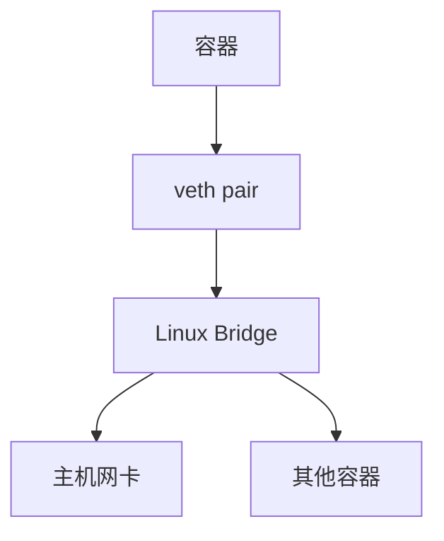
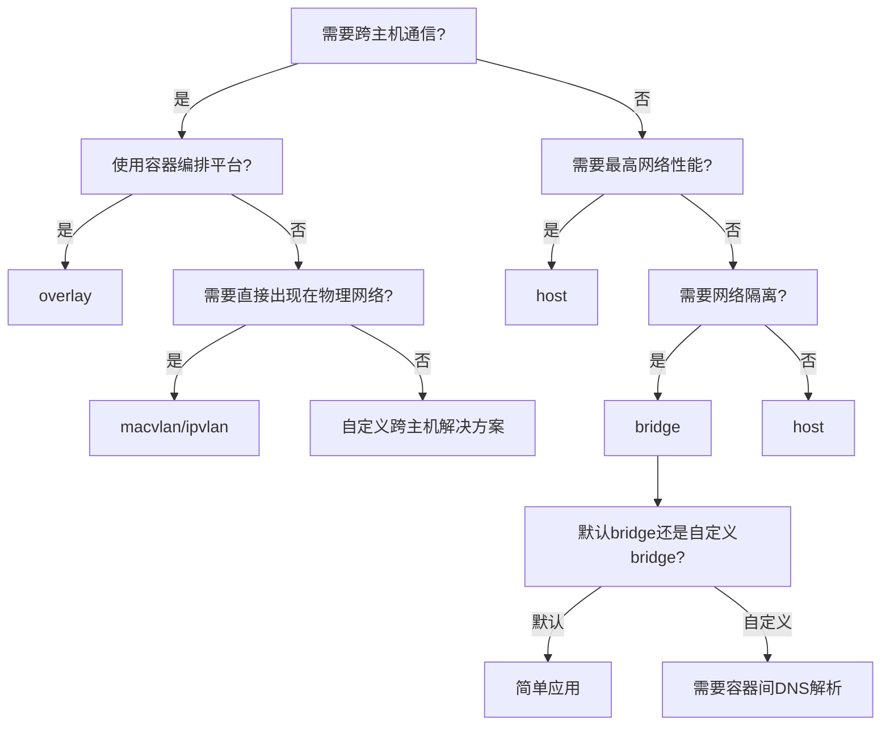
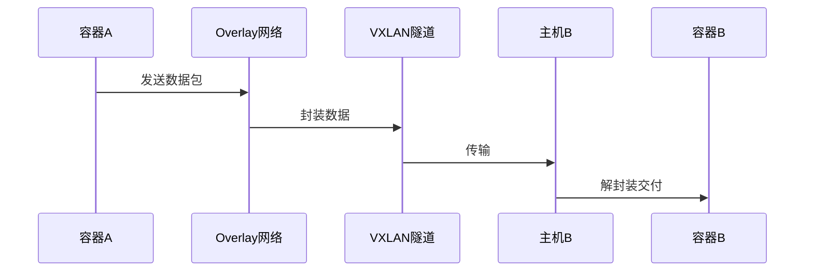

# Docker网络模型详解  

Docker网络是容器化应用中至关重要的组成部分，它使容器能够相互通信并与外部世界交互。理解Docker的网络模型对于构建、部署和排查容器化应用至关重要。本文将深入探讨Docker网络的架构、驱动类型、配置方法以及常见问题的解决方案。

## 1. 网络架构基础  

Docker网络架构建立在Linux网络虚拟化技术之上，通过网络命名空间、虚拟以太网设备和网桥等组件实现容器间的隔离与通信。

### 1.1 核心组件架构  

Docker网络由以下核心组件构成：



这些组件的工作原理如下：

1. **容器网络命名空间**：每个容器拥有独立的网络命名空间，包含自己的网络栈、路由表和防火墙规则。

2. **veth pair（虚拟以太网设备对）**：一种虚拟网络设备，总是成对出现。一端连接到容器的网络命名空间，另一端连接到主机的网络命名空间。

3. **Linux Bridge（网桥）**：在默认的bridge网络模式下，Docker创建一个名为docker0的网桥，作为容器间通信的交换机。

4. **主机网卡**：物理网卡或虚拟网卡，连接Docker主机与外部网络。

5. **iptables规则**：Docker自动配置NAT规则，允许容器访问外部网络并实现端口映射。

数据包在Docker网络中的流动路径：

```
容器内应用 → 容器网卡 → veth pair容器端 → veth pair主机端 → docker0网桥 → iptables NAT → 主机网卡 → 外部网络
```

### 1.2 网络命名空间隔离  

网络命名空间是Docker网络隔离的基础，它为每个容器提供独立的网络环境。

```powershell
# 查看容器的网络命名空间
docker exec -it my_container ip a

# 查看容器的路由表
docker exec -it my_container ip route

# 查看容器的iptables规则
docker exec -it my_container iptables -L
```

在主机上查看与容器相关的网络设备：

```powershell
# 查看所有网络接口
ipconfig /all

# 查看veth设备（Linux命令，需在WSL或Linux环境中执行）
ip link | grep veth

# 查看网桥信息（Linux命令，需在WSL或Linux环境中执行）
brctl show docker0
```

网络命名空间隔离的优势：

1. **安全性**：容器间网络互不干扰，一个容器的网络问题不会影响其他容器。
2. **灵活性**：每个容器可以有独立的IP地址、路由表和防火墙规则。
3. **可移植性**：容器的网络配置与主机无关，便于在不同环境间迁移。

## 2. 网络驱动类型  

Docker提供多种网络驱动，以满足不同场景的需求。每种驱动都有其特定的用途和性能特点。

### 2.1 驱动对比  

| 驱动类型   | 隔离性 | 性能 | 适用场景         | 工作原理                     |
|------------|--------|------|------------------|------------------------------|
| bridge     | 中     | 中   | 单主机容器通信   | 通过Linux网桥连接容器        |
| host       | 低     | 高   | 性能敏感型应用   | 共享主机网络命名空间         |
| overlay    | 高     | 低   | 跨主机容器网络   | 使用VXLAN隧道封装跨主机通信  |
| macvlan    | 高     | 高   | 直接MAC地址暴露  | 为容器分配物理网络的MAC地址  |
| none       | 最高   | N/A  | 完全网络隔离     | 容器没有网络接口             |
| ipvlan     | 高     | 高   | IP地址管理       | 多个容器共享MAC但有独立IP    |

各驱动类型详细说明：

1. **Bridge网络**：
   - Docker默认的网络驱动
   - 在单个主机上创建私有网络，容器可以通过此网络相互通信
   - 通过NAT和端口映射与外部网络通信
   - 适合开发环境和简单的应用部署

2. **Host网络**：
   - 容器直接使用主机的网络命名空间
   - 没有网络隔离，容器可以直接使用主机的网络接口
   - 性能最好，没有网络虚拟化开销
   - 适合对网络性能要求极高的应用
   - 安全性较低，容器可以访问主机的所有网络资源

3. **Overlay网络**：
   - 创建跨多个Docker主机的网络
   - 容器可以在不同主机上相互通信，就像在同一个网络中
   - 使用VXLAN技术封装数据包
   - 适合Docker Swarm或需要跨主机通信的应用
   - 有一定的性能开销

4. **Macvlan网络**：
   - 为容器分配物理网络的MAC地址
   - 容器直接出现在物理网络上，像物理设备一样
   - 性能接近直接使用物理网络
   - 适合需要直接出现在物理网络上的应用
   - 需要网络设备支持混杂模式

5. **None网络**：
   - 容器没有网络接口
   - 完全隔离，无法通过网络与外界通信
   - 适合不需要网络的应用或需要自定义网络的场景

6. **IPvlan网络**：
   - 与Macvlan类似，但多个容器共享同一MAC地址
   - 每个容器有独立的IP地址
   - 适合MAC地址数量受限的环境
   - 支持L2和L3模式

### 2.2 驱动选择指南  

选择合适的网络驱动是容器化应用设计的重要决策。以下决策树可以帮助选择适合的网络驱动：



选择网络驱动的考虑因素：

1. **性能要求**：对网络延迟和吞吐量敏感的应用可能需要host或macvlan网络。
2. **安全需求**：需要网络隔离的应用应使用bridge或overlay网络。
3. **部署环境**：单主机部署可以使用bridge，多主机部署需要overlay或自定义解决方案。
4. **IP地址管理**：如果需要固定IP或特定网段，自定义bridge或macvlan可能更合适。
5. **可移植性**：overlay网络提供最好的跨环境可移植性。

## 3. Bridge网络详解  

Bridge网络是Docker最常用的网络模式，它通过Linux网桥技术实现容器间的通信。

### 3.1 默认网络配置  

Docker安装后会自动创建一个名为"bridge"的默认网络，对应主机上的docker0网桥。

```powershell
# 查看所有Docker网络
docker network ls

# 查看默认bridge网络详情
docker network inspect bridge

# 查看docker0网桥（Linux命令，需在WSL或Linux环境中执行）
ip link show docker0

# Windows环境下查看网络适配器
Get-NetAdapter | Where-Object {$_.InterfaceDescription -like "*Docker*"}
```

默认bridge网络的特点：

1. **自动分配IP**：Docker从默认的172.17.0.0/16网段为容器分配IP地址。
2. **NAT转换**：容器可以访问外部网络，但外部网络不能直接访问容器。
3. **端口映射**：通过-p参数将容器端口映射到主机端口。
4. **无DNS服务**：容器只能通过IP地址相互访问，不能通过容器名称。

默认bridge网络的工作流程：

```
1. 创建容器时，Docker在容器内创建eth0接口
2. 在主机上创建veth接口对，一端连接到容器的eth0
3. veth对的另一端连接到docker0网桥
4. 配置iptables规则，实现NAT和端口映射
```

### 3.2 自定义Bridge网络  

自定义bridge网络提供更多功能和灵活性，特别是容器间的自动DNS解析。

```powershell
# 创建自定义bridge网络
docker network create --driver bridge `
    --subnet 172.28.0.0/16 `
    --gateway 172.28.0.1 `
    --opt com.docker.network.bridge.name=my_bridge `
    my_bridge

# 使用自定义网络启动容器
docker run -d --name web --network my_bridge nginx

# 使用自定义网络和指定IP启动容器
docker run -d --name db --network my_bridge --ip 172.28.5.10 mysql
```

自定义bridge网络的优势：

1. **自动DNS解析**：容器可以通过容器名称相互访问。
2. **更好的隔离性**：自定义网络之间完全隔离。
3. **自定义配置**：可以指定子网、网关和其他网络选项。
4. **连接控制**：容器可以同时连接到多个网络。

自定义网络配置示例：

```powershell
# 创建前端网络
docker network create frontend

# 创建后端网络
docker network create backend

# Web服务连接到前端和后端网络
docker run -d --name web --network frontend nginx
docker network connect backend web

# 数据库只连接到后端网络
docker run -d --name db --network backend mysql
```

这种配置实现了网络分层隔离：web容器可以访问前端和后端网络，而db容器只能访问后端网络，提高了安全性。

## 4. Overlay网络实现  

Overlay网络允许不同主机上的容器直接通信，是Docker Swarm等容器编排平台的基础。

### 4.1 跨主机通信原理  

Overlay网络使用VXLAN（Virtual Extensible LAN）技术在不同主机间创建虚拟网络。



VXLAN封装过程：

1. 容器A发送数据包到容器B
2. 数据包到达主机A的overlay网络
3. 主机A将原始数据包封装在UDP数据包中（VXLAN封装）
4. UDP数据包通过物理网络发送到主机B
5. 主机B接收UDP数据包并解封装
6. 解封装后的原始数据包通过overlay网络传递给容器B

Overlay网络的组件：

- **VXLAN隧道**：在UDP上封装二层以太网帧
- **分布式控制平面**：管理网络成员和路由信息
- **Overlay网桥**：连接容器到overlay网络

### 4.2 创建Overlay网络  

创建和使用Overlay网络需要Docker Swarm模式。

```powershell
# 初始化Swarm集群
docker swarm init

# 创建Overlay网络
docker network create -d overlay my_overlay

# 创建带有子网配置的Overlay网络
docker network create -d overlay `
    --subnet 10.0.9.0/24 `
    --gateway 10.0.9.1 `
    my_overlay_custom

# 创建服务并使用Overlay网络
docker service create --name web --network my_overlay --replicas 2 nginx
```

Overlay网络的高级配置：

```powershell
# 创建同时用于服务和独立容器的Overlay网络
docker network create -d overlay `
    --attachable `
    shared_overlay

# 独立容器使用overlay网络（需要--attachable选项）
docker run -d --name standalone --network shared_overlay nginx
```

Overlay网络的使用场景：

1. **微服务架构**：不同主机上的服务需要直接通信
2. **分布式应用**：应用组件分布在多个主机上
3. **容器编排**：与Docker Swarm或Kubernetes结合使用
4. **多租户环境**：为不同租户创建隔离的overlay网络

## 5. 网络连接管理  

Docker提供了灵活的网络连接管理功能，允许容器动态连接和断开网络。

### 5.1 容器网络连接  

容器可以在运行时连接到多个网络或从网络中断开。

```powershell
# 创建两个网络
docker network create net1
docker network create net2

# 启动容器并连接到net1
docker run -d --name container1 --network net1 nginx

# 将运行中的容器连接到另一个网络
docker network connect net2 container1

# 断开容器与网络的连接
docker network disconnect net1 container1

# 查看容器连接的网络
docker inspect -f '{{range $key, $value := .NetworkSettings.Networks}}{{$key}} {{end}}' container1
```

网络连接的应用场景：

1. **多层应用**：前端容器连接到前端和API网络，API容器连接到API和数据库网络
2. **网络迁移**：在不停止容器的情况下更改网络配置
3. **临时访问**：临时将容器连接到管理网络进行维护

网络连接最佳实践：

1. **最小权限原则**：容器只应连接到必需的网络
2. **网络分段**：使用多个网络隔离不同的应用组件
3. **命名规范**：使用清晰的命名约定管理网络和连接

### 5.2 端口映射配置  

端口映射允许外部网络访问容器内的服务。

```powershell
# 动态端口映射（主机随机端口）
docker run -d -P nginx

# 查看动态分配的端口
docker port $(docker ps -lq)

# 指定端口映射（主机端口:容器端口）
docker run -d -p 8080:80 -p 8443:443 nginx

# 指定IP和端口映射（仅特定接口接受连接）
docker run -d -p 127.0.0.1:8080:80 nginx

# 使用UDP协议的端口映射
docker run -d -p 53:53/udp dns-server

# 在docker-compose中配置端口映射
```

```yaml
version: '3'
services:
  web:
    image: nginx
    ports:
      - "8080:80"
      - "127.0.0.1:8443:443"
```

端口映射的工作原理：

1. Docker通过iptables（Linux）或Windows防火墙规则配置端口转发
2. 外部请求到达主机的映射端口
3. 主机将请求转发到容器的内部端口
4. 容器处理请求并返回响应
5. 响应通过相同的路径返回给客户端

端口映射的注意事项：

1. **端口冲突**：主机上的端口只能映射到一个容器
2. **权限要求**：映射1024以下的端口需要管理员权限
3. **安全考虑**：只映射必要的端口，考虑使用127.0.0.1绑定限制外部访问
4. **性能影响**：大量端口映射可能影响性能

## 6. 网络安全配置  

容器网络安全是Docker部署中的重要考虑因素。Docker提供多种机制来加强网络安全。

### 6.1 网络隔离策略  

网络隔离是容器安全的基础，可以通过多种方式实现。

```powershell
# 创建内部网络（无外部连接）
docker network create --internal secure_net

# 在内部网络中启动容器
docker run -d --name secure_app --network secure_net nginx

# 配置网络访问控制（禁用容器间通信）
docker network create `
    --opt com.docker.network.bridge.enable_icc=false `
    isolated_net

# 创建具有特定子网的隔离网络
docker network create `
    --subnet 192.168.100.0/28 `
    --internal `
    private_net
```

网络隔离的最佳实践：

1. **分段原则**：将应用分为不同的网络段，如前端、应用、数据库
2. **最小连接**：容器只连接到必需的网络
3. **内部网络**：敏感服务使用--internal网络，没有外部连接
4. **访问控制**：使用网络选项限制容器间通信

实现多层网络隔离的示例：

```powershell
# 创建三个隔离的网络
docker network create --internal db_net
docker network create --internal app_net
docker network create frontend_net

# 数据库只在db_net中
docker run -d --name db --network db_net mysql

# 应用服务器连接到app_net和db_net
docker run -d --name app --network app_net app_image
docker network connect db_net app

# Web服务器连接到frontend_net和app_net
docker run -d --name web --network frontend_net -p 80:80 nginx
docker network connect app_net web
```

这种配置确保：
- 数据库只能被应用服务器访问
- 应用服务器可以访问数据库和Web服务器
- Web服务器可以访问应用服务器和外部网络
- 外部网络只能访问Web服务器

### 6.2 TLS加密通信  

对于敏感数据，可以配置传输层加密保护容器间通信。

```powershell
# 创建加密的Overlay网络
docker network create -d overlay `
    --opt encrypted `
    secure_overlay

# 在加密网络上创建服务
docker service create --name secure_service --network secure_overlay secure_image
```

Docker Swarm的加密选项：

1. **控制平面加密**：Swarm管理通信自动加密
2. **数据平面加密**：通过--opt encrypted选项加密容器间流量
3. **证书轮换**：自动更新TLS证书

自定义TLS配置：

```powershell
# 为Docker守护进程配置TLS
# 1. 生成CA和证书
# 2. 配置Docker守护进程使用TLS

# 在Windows中配置Docker守护进程TLS
$configPath = "$env:ProgramData\docker\config\daemon.json"
$config = @{
    "tlsverify" = $true
    "tlscacert" = "C:\ProgramData\docker\certs\ca.pem"
    "tlscert" = "C:\ProgramData\docker\certs\server-cert.pem"
    "tlskey" = "C:\ProgramData\docker\certs\server-key.pem"
}
$config | ConvertTo-Json | Set-Content -Path $configPath

# 重启Docker服务
Restart-Service docker
```

网络加密的注意事项：

1. **性能开销**：加密会增加CPU使用率和网络延迟
2. **密钥管理**：安全存储和管理TLS证书
3. **兼容性**：确保所有服务支持TLS通信
4. **监控**：监控加密网络的性能和安全事件

## 7. 故障排查工具  

Docker网络问题的排查需要特定的工具和方法。

### 7.1 网络诊断命令  

常用的网络诊断命令可以帮助识别和解决网络问题。

```powershell
# 测试容器间连通性
docker exec -it container1 ping container2

# 查看容器网络配置
docker exec -it container1 ip addr

# 查看网络路由
docker exec -it container1 ip route

# 测试DNS解析
docker exec -it container1 nslookup container2

# 检查端口监听状态
docker exec -it container1 netstat -tulpn

# 跟踪网络路径
docker exec -it container1 traceroute google.com

# 查看iptables规则（Linux）
docker exec -it container1 iptables -L
```

网络问题排查流程：

1. **确认症状**：明确网络问题的具体表现
2. **检查配置**：验证网络、容器和服务配置
3. **测试连通性**：使用ping、curl等工具测试网络连接
4. **检查路由**：验证网络路由配置
5. **分析日志**：查看Docker和容器日志
6. **使用专用工具**：如有必要，使用网络诊断容器

### 7.2 抓包分析  

对于复杂的网络问题，可能需要抓包分析网络流量。

```powershell
# 使用nicolaka/netshoot工具容器进行网络诊断
docker run -it --network container:my_container nicolaka/netshoot

# 在容器内抓包
docker run --rm --net=container:my_container nicolaka/netshoot tcpdump -i eth0 -w /tmp/capture.pcap

# 将抓包文件复制到主机
docker cp $(docker ps -lq):/tmp/capture.pcap c:\project\kphub\capture.pcap

# 使用Wireshark分析（需要先安装）
Start-Process "C:\Program Files\Wireshark\Wireshark.exe" -ArgumentList "c:\project\kphub\capture.pcap"
```

网络诊断工具容器的优势：

1. **专用工具**：包含全面的网络诊断工具
2. **非侵入性**：不需要修改原始容器
3. **隔离环境**：诊断工具不会影响应用容器
4. **共享网络**：与目标容器共享相同的网络视图

常见网络问题及解决方案：

| 问题 | 可能原因 | 诊断命令 | 解决方案 |
|------|----------|----------|----------|
| 容器无法访问外网 | DNS配置错误 | `docker exec container cat /etc/resolv.conf` | 配置正确的DNS服务器 |
| 容器间无法通信 | 网络隔离设置 | `docker network inspect network_name` | 确保容器在同一网络或连接网络 |
| 端口映射不工作 | 端口冲突或防火墙 | `netstat -an \| findstr 8080` | 检查端口占用和防火墙规则 |
| Overlay网络问题 | VXLAN配置或防火墙 | `docker network inspect overlay_name` | 确保VXLAN端口(4789/UDP)开放 |
| 容器IP冲突 | 子网配置重叠 | `docker network ls` | 使用不同子网创建网络 |

## 8. 高级网络配置

### 8.1 自定义网络插件

Docker支持第三方网络插件，提供更多高级功能。

```powershell
# 安装Weave Net插件
docker plugin install weaveworks/net-plugin

# 使用Weave Net创建网络
docker network create --driver weaveworks/net-plugin weave-network

# 在Weave网络中启动容器
docker run -d --name weave-container --network weave-network nginx
```

常见的网络插件：

1. **Weave Net**：提供加密、服务发现和多主机网络
2. **Calico**：基于BGP的高性能网络解决方案
3. **Cilium**：基于BPF的安全网络和负载均衡
4. **Flannel**：为Kubernetes设计的简单overlay网络

### 8.2 自定义网络配置

对于特殊需求，可以自定义Docker网络配置。

```powershell
# 创建具有自定义MTU的网络
docker network create --opt com.docker.network.driver.mtu=1400 low_mtu_net

# 创建具有特定网关的网络
docker network create `
    --subnet 172.20.0.0/16 `
    --gateway 172.20.0.254 `
    custom_gateway_net

# 禁用IP伪装（容器使用主机IP）
docker network create `
    --opt com.docker.network.bridge.enable_ip_masquerade=false `
    no_masquerade_net
```

高级网络配置场景：

1. **特殊网络拓扑**：与现有网络基础设施集成
2. **性能优化**：调整MTU、TCP参数等提高性能
3. **安全需求**：自定义防火墙规则和访问控制
4. **多宿主网络**：容器连接到多个物理网络

## 总结

Docker网络模型提供了灵活、强大的容器网络解决方案，从单主机的bridge网络到跨主机的overlay网络，满足各种应用场景的需求。理解Docker网络的工作原理和配置方法，对于构建可靠、安全、高效的容器化应用至关重要。

在生产环境中，建议根据应用的具体需求选择合适的网络驱动和配置。对于单主机部署，自定义bridge网络通常是最佳选择；对于多主机部署，overlay网络或第三方网络插件可能更合适。无论选择哪种网络模式，都应遵循网络隔离和最小权限原则，确保容器网络的安全性。

对于关键业务应用，推荐使用overlay网络配合加密选项保障通信安全，并实施适当的网络监控和日志记录，以便及时发现和解决潜在问题。