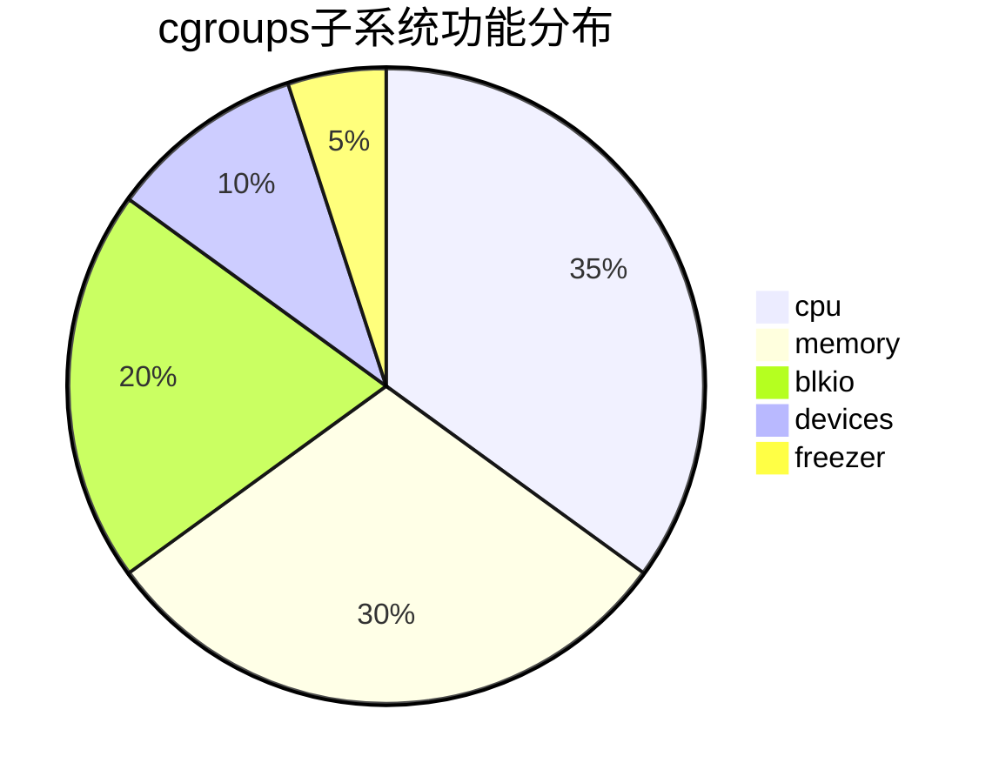
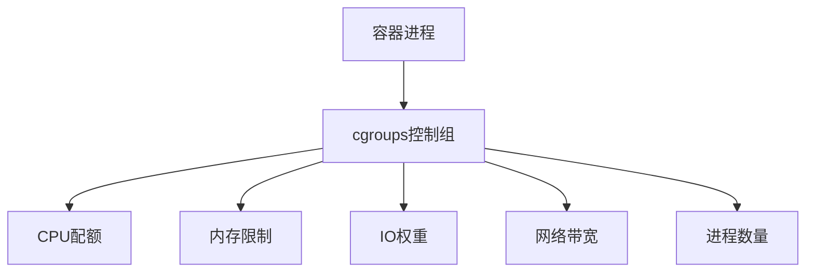
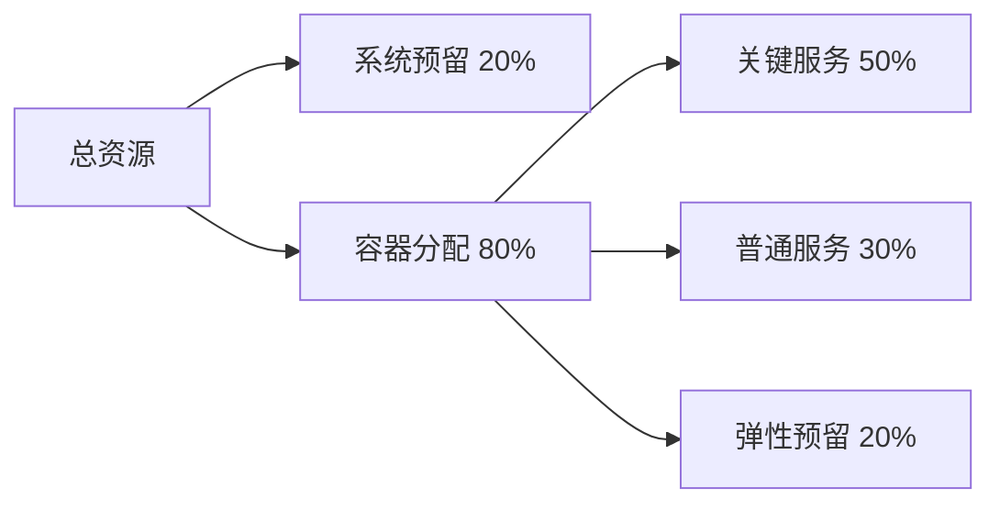
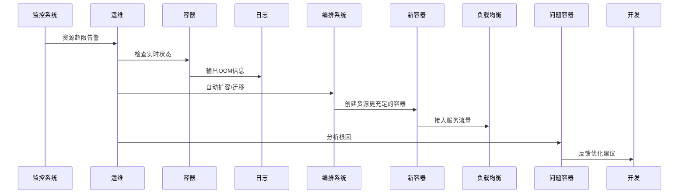

# 容器资源限制机制  

容器技术的一个核心优势是能够精确控制和限制应用程序可以使用的系统资源。Docker通过Linux内核的cgroups（控制组）功能实现了对CPU、内存、磁盘I/O等资源的精细化管理。合理配置资源限制不仅可以提高系统整体利用率，还能防止单个容器过度消耗资源而影响其他应用，是容器化应用部署的关键环节。

## 1. cgroups基础原理  

cgroups（Control Groups）是Linux内核提供的一种机制，用于限制、记录和隔离进程组使用的物理资源。Docker利用cgroups为每个容器创建独立的资源控制环境。

### 1.1 cgroups子系统  

cgroups通过不同的子系统（subsystem）管理不同类型的资源：



主要子系统及其功能：

1. **cpu**: 控制CPU使用时间的分配
   - 管理进程对CPU的访问
   - 实现CPU时间片的分配和调度
   - 支持相对权重和绝对配额两种限制方式

2. **memory**: 设置进程的内存使用限制
   - 限制进程组可以使用的内存上限
   - 控制内存回收策略
   - 提供内存使用统计信息

3. **blkio**: 限制对块设备I/O的访问
   - 控制读写带宽限制
   - 管理I/O操作的优先级
   - 提供I/O操作的统计信息

4. **devices**: 控制进程对设备的访问
   - 限制容器可以访问的设备
   - 实现设备的白名单和黑名单

5. **freezer**: 暂停和恢复cgroup中的进程
   - 用于容器的暂停和恢复功能
   - 便于系统维护和迁移

6. **pids**: 限制进程数量
   - 防止fork炸弹等DoS攻击
   - 控制容器内可创建的进程总数

7. **net_cls/net_prio**: 网络流量控制
   - 对网络数据包进行标记
   - 设置网络流量的优先级

### 1.2 容器资源隔离架构  

Docker使用cgroups为每个容器创建独立的资源控制环境：



cgroups的工作原理：

1. **层级结构**：cgroups以树状结构组织，子cgroup继承父cgroup的属性
2. **资源控制**：每个cgroup可以设置资源限制参数
3. **任务分配**：进程被分配到特定的cgroup中
4. **资源统计**：系统记录每个cgroup的资源使用情况

在Docker中，每个容器都有自己的cgroup，位于`/sys/fs/cgroup/*/docker/<container_id>`目录下。例如，容器的内存限制配置存储在`/sys/fs/cgroup/memory/docker/<container_id>/memory.limit_in_bytes`文件中。

cgroups与命名空间（namespaces）的区别：
- **命名空间**：提供资源的视图隔离（容器只能看到自己的资源）
- **cgroups**：提供资源的使用限制（容器只能使用分配给它的资源）

## 2. CPU资源限制  

CPU是容器最常需要限制的资源之一。Docker提供了多种方式来控制容器对CPU资源的使用。

### 2.1 核心参数对比  

| 参数            | 作用范围       | 示例值       | 适用场景                     |
|-----------------|----------------|--------------|------------------------------|
| --cpus          | 核心数限制     | 1.5          | 需要精确控制CPU使用量        |
| --cpu-shares    | 相对权重       | 512          | 多容器竞争CPU时的优先级分配  |
| --cpuset-cpus   | 绑定CPU核心    | 0-2,4        | 需要CPU亲和性或NUMA优化      |
| --cpu-period    | 调度周期       | 100000       | 与--cpu-quota配合使用        |
| --cpu-quota     | 周期内配额     | 150000       | 细粒度CPU限制                |

参数详解：

1. **--cpus**：
   - 限制容器可以使用的CPU核心数
   - 值可以是小数，如0.5表示半个核心
   - 内部实现是通过设置cpu-period和cpu-quota的比例实现的
   - 最直观且推荐的CPU限制方式

2. **--cpu-shares**：
   - 设置容器CPU使用的相对权重
   - 默认值为1024
   - 仅在CPU资源紧张时生效
   - 适合设置容器间的优先级

3. **--cpuset-cpus**：
   - 指定容器可以使用的CPU核心ID
   - 可以指定单个核心、多个核心或范围
   - 适合需要CPU亲和性的场景
   - 可以避免跨NUMA节点的性能损失

4. **--cpu-period**和**--cpu-quota**：
   - period定义CPU调度周期（微秒），默认100000（100ms）
   - quota定义容器在period内可以使用的CPU时间
   - quota/period的比值等同于--cpus的值
   - 提供更细粒度的控制

### 2.2 生产环境配置  

在生产环境中，根据应用特性选择合适的CPU限制参数：

```powershell
# 限制使用1.5个CPU核心（最常用）
docker run -d --name web --cpus="1.5" nginx

# 设置较高的CPU优先级（权重是默认值的2倍）
docker run -d --name priority-service --cpu-shares="2048" redis

# 绑定到特定CPU核心（适合性能敏感应用）
docker run -d --name db --cpuset-cpus="0,2" redis

# 使用CPU配额和周期（细粒度控制）
docker run -d --name batch-job --cpu-period="100000" --cpu-quota="50000" batch-processor

# 组合使用多种限制
docker run -d --name critical-app --cpus="2" --cpuset-cpus="0-3" --cpu-shares="1536" app-image
```

CPU限制的最佳实践：

1. **基准测试**：先测量应用在无限制情况下的CPU使用情况
2. **预留余量**：限制值应比平均使用量高20-30%，以应对峰值
3. **监控调整**：持续监控CPU使用率，根据实际情况调整限制
4. **考虑邻居**：在共享主机上，考虑其他容器的资源需求
5. **选择策略**：
   - 关键服务：使用--cpuset-cpus绑定专用核心
   - 普通服务：使用--cpus设置合理上限
   - 批处理任务：使用--cpu-shares设置较低优先级

不同应用类型的CPU配置建议：

| 应用类型 | 推荐配置 | 说明 |
|----------|----------|------|
| Web服务 | --cpus="0.5" 到 "2" | 根据并发量和复杂度调整 |
| 数据库 | --cpus="2" --cpuset-cpus="0,2,4,6" | 绑定物理核心，避免超线程 |
| 批处理 | --cpu-shares="512" | 使用相对权重，低优先级 |
| 微服务 | --cpus="0.25" 到 "0.5" | 小而多的资源分配 |
| 监控工具 | --cpus="0.1" --cpu-shares="256" | 最小化资源占用 |

## 3. 内存资源管理  

内存限制是容器资源管理中最关键的部分之一，不当的内存配置可能导致容器被OOM（Out of Memory）杀手终止。

### 3.1 内存限制参数  

Docker提供多种内存相关的限制参数：

```powershell
# 基本内存限制（硬限制）
docker run -d --name web --memory="512m" nginx

# 设置内存+交换空间总限制
docker run -d --name db --memory="512m" --memory-swap="1g" mysql

# 禁用OOM Killer（危险操作，谨慎使用）
docker run -d --name critical-app --memory="256m" --oom-kill-disable app

# 设置OOM优先级（值越低越不容易被杀死）
docker run -d --name important-service --memory="512m" --oom-score-adj=-500 service

# 限制内核内存
docker run -d --name kernel-intensive --memory="512m" --kernel-memory="50m" app

# 设置内存软限制
docker run -d --name flexible-app --memory="1g" --memory-reservation="512m" app
```

内存参数详解：

1. **--memory**：
   - 容器可使用的最大内存量（硬限制）
   - 超过此限制会触发OOM Killer
   - 必须设置合理值，过低会导致容器频繁重启

2. **--memory-swap**：
   - 内存+交换空间的总限制
   - 默认为--memory的两倍
   - 设置为-1表示不限制交换空间
   - 设置为0表示禁用交换

3. **--memory-reservation**：
   - 内存软限制，低于--memory的值
   - 当主机内存压力大时，容器会尝试降低内存使用到此值
   - 不会导致容器被杀死

4. **--oom-kill-disable**：
   - 禁止OOM Killer终止容器内的进程
   - 必须与--memory一起使用
   - 危险设置，可能导致主机内存耗尽

5. **--oom-score-adj**：
   - 调整容器的OOM优先级
   - 范围从-1000（最不可能被杀死）到1000（最可能被杀死）
   - 关键服务应设置较低的值

### 3.2 内存监控方法  

监控容器内存使用是资源管理的重要环节：

```powershell
# 实时查看所有容器的内存使用情况
docker stats

# 格式化输出特定信息
docker stats --format "{{.Name}}: {{.MemUsage}} / {{.MemPerc}}"

# 查看特定容器的内存限制配置
docker inspect -f '{{.HostConfig.Memory}}' my_container

# 查看容器内存使用详情
docker inspect -f '{{json .MemoryStats}}' my_container | ConvertFrom-Json | Format-List

# 使用工具容器查看cgroup内存统计
docker run --rm --privileged -v /sys/fs/cgroup:/sys/fs/cgroup:ro alpine cat /sys/fs/cgroup/memory/docker/<container_id>/memory.stat
```

内存使用分析：

1. **RSS (Resident Set Size)**：
   - 容器实际使用的物理内存
   - 不包括已交换出去的内存
   - 主要关注指标

2. **Cache**：
   - 文件系统缓存使用的内存
   - 可在内存压力下自动释放
   - 通常不需要过度担心

3. **Swap**：
   - 交换到磁盘的内存
   - 大量使用表示内存压力大
   - 应尽量避免使用

4. **内存峰值**：
   - 记录容器使用的最大内存量
   - 用于调整内存限制

内存限制的最佳实践：

1. **基于实际使用设置**：
   - 监控应用正常负载下的内存使用
   - 限制设置为正常使用的1.5-2倍

2. **考虑应用特性**：
   - Java应用：考虑JVM堆内存设置与容器限制的协调
   - 数据库：预留足够缓冲区和缓存空间
   - Web服务器：考虑并发连接数的内存需求

3. **避免过度分配**：
   - 主机总内存分配不应超过物理内存的80%
   - 为系统预留足够空间

4. **监控与调整**：
   - 定期检查内存使用趋势
   - 根据使用模式调整限制

## 4. 磁盘IO控制  

磁盘I/O往往是容器化应用的性能瓶颈，合理的I/O限制可以防止单个容器占用过多磁盘带宽。

### 4.1 块设备限制  

Docker提供多种参数控制容器对块设备的访问：

```powershell
# 限制读取速率（每秒1MB）
docker run -d --name slow-reader --device-read-bps /dev/sda:1mb ubuntu sleep infinity

# 限制写入速率（每秒5MB）
docker run -d --name slow-writer --device-write-bps /dev/sda:5mb ubuntu sleep infinity

# 限制读取IOPS（每秒100次操作）
docker run -d --name iops-reader --device-read-iops /dev/sda:100 ubuntu sleep infinity

# 限制写入IOPS（每秒200次操作）
docker run -d --name iops-writer --device-write-iops /dev/sda:200 ubuntu sleep infinity

# 组合使用多种限制
docker run -d --name io-limited `
    --device-read-bps /dev/sda:10mb `
    --device-write-bps /dev/sda:5mb `
    --device-read-iops /dev/sda:500 `
    --device-write-iops /dev/sda:300 `
    mysql
```

I/O限制参数详解：

1. **--device-read-bps**：
   - 限制从设备读取的速率（字节/秒）
   - 支持k、m、g单位（小写）
   - 硬限制，不能超过

2. **--device-write-bps**：
   - 限制写入设备的速率（字节/秒）
   - 适合限制日志写入等操作

3. **--device-read-iops**：
   - 限制每秒读取操作次数
   - 适合随机读取场景

4. **--device-write-iops**：
   - 限制每秒写入操作次数
   - 适合数据库等随机写入场景

注意事项：
- 这些限制针对特定设备（如/dev/sda）
- 在Windows容器中，设备路径可能不同
- 限制值应基于设备实际性能设置

### 4.2 权重分配  

除了直接限制I/O速率，还可以通过权重控制多个容器间的I/O资源分配：

```powershell
# 设置较高的I/O权重（默认为500）
docker run -d --name high-priority --blkio-weight 700 ubuntu sleep infinity

# 设置较低的I/O权重
docker run -d --name low-priority --blkio-weight 300 ubuntu sleep infinity

# 设置特定设备的权重
docker run -d --name custom-weight --blkio-weight-device "/dev/sda:600" ubuntu sleep infinity
```

权重参数说明：

1. **--blkio-weight**：
   - 设置容器的I/O权重
   - 范围从10到1000，默认为500
   - 仅在I/O资源竞争时生效

2. **--blkio-weight-device**：
   - 设置特定设备的I/O权重
   - 格式为"设备路径:权重"
   - 优先级高于全局权重设置

I/O控制的最佳实践：

1. **识别I/O模式**：
   - 顺序读写：使用bps限制
   - 随机读写：使用iops限制

2. **分类应用**：
   - I/O密集型：数据库、日志服务等
   - 计算密集型：API服务、计算任务等

3. **差异化配置**：
   - 关键服务：较高权重（700-1000）
   - 后台服务：中等权重（400-600）
   - 批处理任务：较低权重（100-300）

4. **避免过度限制**：
   - 过低的I/O限制会严重影响应用性能
   - 建议从较高值开始，逐步调整

## 5. 综合资源限制  

在实际部署中，通常需要同时限制多种资源，确保容器的资源使用在可控范围内。

### 5.1 Compose文件示例  

Docker Compose提供了声明式的资源限制配置方式：

```yaml:c:\project\kphub\docker\compose\resource-limit.yml
version: '3.8'
services:
  web:
    image: nginx
    deploy:
      resources:
        limits:
          cpus: "0.5"
          memory: 512M
        reservations:
          cpus: "0.2"
          memory: 256M
    
  api:
    image: api-service
    deploy:
      resources:
        limits:
          cpus: "1"
          memory: 1G
        reservations:
          cpus: "0.5"
          memory: 512M
    
  db:
    image: postgres
    deploy:
      resources:
        limits:
          cpus: "2"
          memory: 4G
        reservations:
          cpus: "1"
          memory: 2G
    volumes:
      - db-data:/var/lib/postgresql/data
    
  cache:
    image: redis
    deploy:
      resources:
        limits:
          cpus: "0.5"
          memory: 1G
    
  batch:
    image: batch-processor
    deploy:
      resources:
        limits:
          cpus: "1"
          memory: 2G
        reservations:
          memory: 512M
    blkio_config:
      weight: 300

volumes:
  db-data:
```

Compose资源限制说明：

1. **limits**：
   - 设置资源使用的硬限制
   - 容器不能超过这些限制

2. **reservations**：
   - 设置资源的软限制/预留
   - 保证容器至少能获得这些资源

3. **部署考虑**：
   - 数据库等关键服务分配更多资源
   - 无状态服务可以设置较低限制
   - 批处理任务使用较低I/O权重

### 5.2 资源预留策略  

合理的资源预留策略可以提高系统稳定性：



资源预留的关键点：

1. **系统预留**：
   - 为主机系统预留20-30%的资源
   - 确保系统服务和Docker守护进程正常运行

2. **服务分级**：
   - 关键服务：数据库、消息队列等
   - 核心服务：API、业务逻辑等
   - 辅助服务：日志、监控等
   - 批处理任务：报表、数据处理等

3. **预留策略**：
   - 关键服务：100% reservation + 20% buffer
   - 核心服务：80% reservation
   - 辅助服务：50% reservation
   - 批处理任务：最小reservation

4. **弹性调度**：
   - 保留部分未分配资源
   - 用于处理流量峰值
   - 支持临时任务执行

资源预留配置示例：

```powershell
# 关键服务（数据库）- 高预留
docker run -d --name db `
    --cpus="2" `
    --memory="4g" `
    --memory-reservation="3.5g" `
    --cpu-shares="1024" `
    postgres

# 核心服务（API）- 中等预留
docker run -d --name api `
    --cpus="1" `
    --memory="1g" `
    --memory-reservation="800m" `
    --cpu-shares="800" `
    api-service

# 辅助服务（日志）- 低预留
docker run -d --name logger `
    --cpus="0.5" `
    --memory="512m" `
    --memory-reservation="256m" `
    --cpu-shares="512" `
    logger

# 批处理任务 - 最小预留
docker run -d --name batch `
    --cpus="1" `
    --memory="1g" `
    --memory-reservation="128m" `
    --cpu-shares="256" `
    --blkio-weight="300" `
    batch-processor
```

## 6. 监控与调优  

资源限制的设置不是一成不变的，需要通过持续监控和调优来优化资源配置。

### 6.1 性能分析工具  

Docker提供了多种工具来监控和分析容器资源使用情况：

```powershell
# 基本资源使用监控
docker stats

# 安装高级诊断工具
docker run -d --name netshoot `
    --pid=host `
    --net=host `
    --privileged `
    nicolaka/netshoot

# 查看容器cgroups配置
docker exec -it netshoot bash -c "cat /sys/fs/cgroup/memory/docker/<container_id>/memory.limit_in_bytes"

# 查看容器CPU使用详情
docker exec -it netshoot bash -c "cat /sys/fs/cgroup/cpu/docker/<container_id>/cpu.stat"

# 使用ctop工具监控容器资源
docker run -it --rm `
    --name ctop `
    --volume /var/run/docker.sock:/var/run/docker.sock:ro `
    quay.io/vektorlab/ctop

# 使用cadvisor全面监控
docker run -d `
    --name cadvisor `
    --volume /:/rootfs:ro `
    --volume /var/run:/var/run:ro `
    --volume /sys:/sys:ro `
    --volume /var/lib/docker/:/var/lib/docker:ro `
    --publish 8080:8080 `
    --privileged `
    --device=/dev/kmsg `
    gcr.io/cadvisor/cadvisor
```

监控指标解读：

1. **CPU使用率**：
   - 持续高于80%：考虑增加CPU限制
   - 远低于限制：考虑减少CPU分配
   - 波动剧烈：可能需要调整应用或增加缓冲

2. **内存使用**：
   - 接近限制：存在OOM风险，考虑增加限制
   - 使用率稳定：配置合理
   - GC频繁：可能需要调整应用内存管理

3. **I/O操作**：
   - 高等待时间：I/O可能是瓶颈
   - 读写不平衡：考虑针对性优化
   - 突发I/O：需要更高的I/O限制或优先级

### 6.2 动态调整资源  

Docker支持在容器运行时动态调整资源限制：

```powershell
# 运行时修改CPU限制
docker update --cpus="2" my_container

# 增加内存限制
docker update --memory="2g" --memory-swap="4g" my_container

# 调整多个容器的CPU份额
docker update --cpu-shares="512" container1 container2

# 修改重启策略
docker update --restart=unless-stopped my_container

# 使用脚本自动调整资源（示例）
```

```powershell:c:\project\kphub\scripts\auto-scale.ps1
# 自动资源调整脚本示例
$container = "my_container"
$cpu_threshold = 80
$memory_threshold = 80

# 获取当前CPU使用率
$cpu_usage = docker stats --no-stream --format "{{.CPUPerc}}" $container
$cpu_usage = $cpu_usage -replace '%', ''

# 获取当前内存使用率
$memory_usage = docker stats --no-stream --format "{{.MemPerc}}" $container
$memory_usage = $memory_usage -replace '%', ''

# 获取当前CPU限制
$current_cpu = docker inspect --format "{{.HostConfig.NanoCpus}}" $container
$current_cpu = [math]::Round($current_cpu / 1000000000, 2)

# 获取当前内存限制
$current_memory = docker inspect --format "{{.HostConfig.Memory}}" $container
$current_memory = [math]::Round($current_memory / (1024*1024), 0)

# 根据使用率调整资源
if ([double]$cpu_usage -gt $cpu_threshold) {
    $new_cpu = [math]::Min(8, $current_cpu * 1.5)
    Write-Host "Increasing CPU limit from $current_cpu to $new_cpu"
    docker update --cpus="$new_cpu" $container
}

if ([double]$memory_usage -gt $memory_threshold) {
    $new_memory = [math]::Min(16384, $current_memory * 1.5)
    Write-Host "Increasing memory limit from $current_memory to $new_memory MB"
    docker update --memory="${new_memory}m" $container
}
```

动态调整的最佳实践：

1. **渐进式调整**：
   - 小幅增减资源限制（如25%一次）
   - 观察调整后的效果再决定下一步

2. **设置上下限**：
   - 定义资源调整的最大和最小值
   - 防止过度分配或限制过严

3. **基于指标调整**：
   - 使用多个指标综合判断
   - 考虑短期波动和长期趋势

4. **自动化与人工结合**：
   - 小幅调整可以自动化
   - 大幅调整应人工确认

## 7. 生产实践建议  

基于实际经验总结的容器资源限制最佳实践，帮助在生产环境中合理配置资源。

### 7.1 资源限制策略  

```text
1. 关键服务预留20%资源缓冲
   - 数据库、消息队列等状态服务
   - 避免资源竞争导致的性能下降

2. 开发环境设置硬性内存限制
   - 及早发现内存泄漏问题
   - 模拟生产环境资源约束

3. 数据库类服务禁用OOM Killer
   - 防止数据损坏
   - 必须同时设置合理的内存限制

4. 批量任务限制IO权重
   - 防止影响交互式服务
   - 设置较低的blkio-weight值

5. 使用相对值设置CPU份额
   - 提高资源利用率
   - 适应不同规格的主机

6. 为每类应用创建资源配置模板
   - 标准化部署配置
   - 便于管理和调整

7. 避免过度分配
   - 主机总CPU分配不超过物理核心数的1.5倍
   - 内存分配不超过物理内存的80%

8. 定期审计资源使用
   - 识别资源浪费
   - 优化分配策略
```

不同类型应用的
继续编写容器资源限制机制的内容：

### 7.1 资源限制策略（续）

不同类型应用的资源配置建议：

| 应用类型 | CPU配置 | 内存配置 | I/O配置 | 特殊考虑 |
|----------|---------|----------|---------|----------|
| Web服务 | --cpus="0.5-1" | --memory="256-512m" | 默认 | 根据并发量调整 |
| API服务 | --cpus="0.5-2" | --memory="512m-1g" | 默认 | 预留30%内存缓冲 |
| 数据库 | --cpus="2-4" | --memory="2-8g" | 高I/O权重 | 禁用OOM Killer |
| 缓存服务 | --cpus="0.5-1" | --memory="1-4g" | 默认 | 内存为主要资源 |
| 批处理任务 | --cpu-shares="512" | --memory="1-2g" | 低I/O权重 | 非高峰期调度 |
| 日志收集 | --cpus="0.2-0.5" | --memory="256-512m" | 写入限制 | 考虑日志量增长 |

### 7.2 异常处理流程  

当容器资源使用异常时，应有明确的处理流程：



异常处理的关键步骤：

1. **监控告警**：
   - 设置合理的告警阈值（如CPU>85%持续5分钟）
   - 分级告警（警告、严重、紧急）
   - 多渠道通知（邮件、短信、聊天工具）

2. **紧急响应**：
   - 检查容器状态和日志
   - 评估影响范围
   - 决定是扩容、重启还是迁移

3. **临时措施**：
   - 动态增加资源限制
   - 水平扩展增加实例
   - 必要时降级服务

4. **根因分析**：
   - 收集资源使用历史数据
   - 分析异常时间点的应用行为
   - 识别资源瓶颈

5. **长期优化**：
   - 调整资源限制策略
   - 优化应用代码
   - 改进部署架构

异常处理脚本示例：

```powershell:c:\project\kphub\scripts\container-recovery.ps1
param (
    [Parameter(Mandatory=$true)]
    [string]$ContainerName
)

# 记录开始时间
$startTime = Get-Date
Write-Host "[$startTime] 开始处理容器 $ContainerName 的资源异常" -ForegroundColor Yellow

# 检查容器状态
$status = docker inspect --format "{{.State.Status}}" $ContainerName
if ($status -ne "running") {
    Write-Host "容器已停止，状态: $status" -ForegroundColor Red
    
    # 检查是否OOM
    $oomKilled = docker inspect --format "{{.State.OOMKilled}}" $ContainerName
    if ($oomKilled -eq "true") {
        Write-Host "容器因内存不足(OOM)被终止" -ForegroundColor Red
        
        # 获取当前内存限制
        $currentMemory = docker inspect --format "{{.HostConfig.Memory}}" $ContainerName
        $currentMemoryMB = [math]::Round($currentMemory / (1024*1024), 0)
        
        # 计算新的内存限制 (增加50%)
        $newMemoryMB = [math]::Round($currentMemoryMB * 1.5, 0)
        Write-Host "增加内存限制: $currentMemoryMB MB -> $newMemoryMB MB" -ForegroundColor Cyan
        
        # 更新容器配置并重启
        docker update --memory="${newMemoryMB}m" $ContainerName
        docker start $ContainerName
        
        # 记录到日志文件
        $logEntry = "[$startTime] 容器 $ContainerName 因OOM被终止，内存从 $currentMemoryMB MB 增加到 $newMemoryMB MB"
        Add-Content -Path "c:\project\kphub\logs\container-recovery.log" -Value $logEntry
    } else {
        # 非OOM原因，尝试重启
        Write-Host "尝试重启容器..." -ForegroundColor Yellow
        docker start $ContainerName
    }
} else {
    # 容器运行中，检查资源使用情况
    Write-Host "容器运行中，检查资源使用情况..." -ForegroundColor Green
    
    # 获取CPU使用率
    $cpuUsage = docker stats --no-stream --format "{{.CPUPerc}}" $ContainerName
    $cpuUsage = $cpuUsage -replace '%', ''
    
    # 获取内存使用率
    $memUsage = docker stats --no-stream --format "{{.MemPerc}}" $ContainerName
    $memUsage = $memUsage -replace '%', ''
    
    Write-Host "CPU使用率: $cpuUsage%, 内存使用率: $memUsage%" -ForegroundColor Cyan
    
    # 根据资源使用情况采取措施
    if ([double]$cpuUsage -gt 90) {
        $currentCPU = docker inspect --format "{{.HostConfig.NanoCpus}}" $ContainerName
        if ($currentCPU -eq 0) {
            # 未设置CPU限制
            Write-Host "设置初始CPU限制: 2 CPUs" -ForegroundColor Yellow
            docker update --cpus="2" $ContainerName
        } else {
            $currentCPU = [math]::Round($currentCPU / 1000000000, 2)
            $newCPU = [math]::Min(8, $currentCPU * 1.5)
            Write-Host "增加CPU限制: $currentCPU -> $newCPU CPUs" -ForegroundColor Yellow
            docker update --cpus="$newCPU" $ContainerName
        }
    }
    
    if ([double]$memUsage -gt 85) {
        $currentMemory = docker inspect --format "{{.HostConfig.Memory}}" $ContainerName
        $currentMemoryMB = [math]::Round($currentMemory / (1024*1024), 0)
        $newMemoryMB = [math]::Min(16384, $currentMemoryMB * 1.3)
        Write-Host "增加内存限制: $currentMemoryMB MB -> $newMemoryMB MB" -ForegroundColor Yellow
        docker update --memory="${newMemoryMB}m" $ContainerName
    }
}

# 记录处理完成
$endTime = Get-Date
$duration = $endTime - $startTime
Write-Host "[$endTime] 资源异常处理完成，耗时: $($duration.TotalSeconds) 秒" -ForegroundColor Green
```

## 8. 高级资源管理技术

随着容器化应用的复杂度增加，可能需要使用更高级的资源管理技术。

### 8.1 资源自动伸缩

在Kubernetes等编排平台中，可以实现基于资源使用的自动伸缩：

```yaml:c:\project\kphub\k8s\hpa-example.yaml
apiVersion: autoscaling/v2
kind: HorizontalPodAutoscaler
metadata:
  name: api-service
spec:
  scaleTargetRef:
    apiVersion: apps/v1
    kind: Deployment
    name: api-service
  minReplicas: 2
  maxReplicas: 10
  metrics:
  - type: Resource
    resource:
      name: cpu
      target:
        type: Utilization
        averageUtilization: 70
  - type: Resource
    resource:
      name: memory
      target:
        type: Utilization
        averageUtilization: 80
```

自动伸缩的优势：

1. **响应性**：自动应对负载变化
2. **成本优化**：按需分配资源
3. **可靠性**：防止资源耗尽
4. **自动化**：减少人工干预

Docker Swarm中的服务自动伸缩：

```powershell
# 创建带有自动伸缩的服务
docker service create `
    --name web `
    --replicas 2 `
    --reserve-cpu 0.25 `
    --limit-cpu 0.5 `
    --reserve-memory 128M `
    --limit-memory 256M `
    nginx

# 基于CPU使用率扩展服务
docker service scale web=5
```

### 8.2 资源服务质量(QoS)

在多容器环境中，可以通过QoS类别区分服务优先级：

```powershell
# Guaranteed QoS (资源请求=限制)
docker run -d --name critical-app `
    --cpus="2" `
    --memory="2g" `
    --memory-reservation="2g" `
    critical-image

# Burstable QoS (资源请求<限制)
docker run -d --name standard-app `
    --cpus="1" `
    --memory="1g" `
    --memory-reservation="512m" `
    standard-image

# BestEffort QoS (无资源请求和限制)
docker run -d --name background-task background-image
```

QoS类别的特点：

1. **Guaranteed**：
   - 最高优先级
   - 资源请求等于限制
   - 不会被抢占
   - 适合关键业务

2. **Burstable**：
   - 中等优先级
   - 资源请求小于限制
   - 可以使用额外资源
   - 适合大多数应用

3. **BestEffort**：
   - 最低优先级
   - 无资源保证
   - 使用系统剩余资源
   - 适合非关键任务

### 8.3 NUMA感知调度

对于多处理器系统，NUMA(非统一内存访问)感知调度可以提高性能：

```powershell
# 绑定到特定NUMA节点
docker run -d --name numa-aware `
    --cpuset-cpus="0-3" `
    --cpuset-mems="0" `
    numa-app
```

NUMA优化的关键点：

1. **CPU亲和性**：
   - 使用--cpuset-cpus绑定到特定CPU核心
   - 避免进程在CPU间迁移

2. **内存亲和性**：
   - 使用--cpuset-mems绑定到特定内存节点
   - 减少跨节点内存访问

3. **适用场景**：
   - 高性能计算
   - 数据库服务
   - 实时处理系统

## 9. 总结与最佳实践

容器资源限制是容器化应用部署的关键环节，合理的资源配置可以提高系统稳定性、可靠性和资源利用率。

### 9.1 资源限制核心原则

1. **了解应用需求**：
   - 基准测试确定基本资源需求
   - 考虑峰值和平均负载差异
   - 识别关键资源（CPU/内存/IO）

2. **预留缓冲空间**：
   - CPU限制：平均使用的1.5-2倍
   - 内存限制：平均使用的1.3-1.5倍
   - 避免资源争用和频繁OOM

3. **分级资源策略**：
   - 关键服务：优先保障资源
   - 支持服务：适度资源分配
   - 后台任务：使用剩余资源

4. **持续监控与调优**：
   - 定期审查资源使用情况
   - 根据实际使用调整限制
   - 关注异常模式和趋势

### 9.2 常见问题与解决方案

| 问题 | 症状 | 解决方案 |
|------|------|----------|
| OOM终止 | 容器突然退出，日志显示OOM | 增加内存限制，优化应用内存使用 |
| CPU节流 | 应用响应缓慢，CPU使用率达到限制 | 增加CPU限制或优化应用CPU效率 |
| I/O瓶颈 | 磁盘操作缓慢，I/O等待时间长 | 调整I/O限制，使用卷或优化存储 |
| 资源争用 | 多容器性能同时下降 | 调整资源分配，迁移部分容器 |
| 内存泄漏 | 内存使用持续增长不释放 | 修复应用代码，设置合理内存限制 |

### 9.3 最终配置建议

生产环境的容器资源配置建议：

```powershell
# Web前端 - 轻量级，可水平扩展
docker run -d --name web `
    --cpus="0.5" `
    --memory="256m" `
    --memory-reservation="128m" `
    --cpu-shares="512" `
    --restart=unless-stopped `
    web-image

# API服务 - 中等资源需求
docker run -d --name api `
    --cpus="1" `
    --memory="1g" `
    --memory-reservation="512m" `
    --cpu-shares="1024" `
    --restart=unless-stopped `
    api-image

# 数据库 - 资源密集型，需要稳定性
docker run -d --name db `
    --cpus="2" `
    --memory="4g" `
    --memory-reservation="2g" `
    --memory-swappiness="0" `
    --oom-kill-disable `
    --cpu-shares="2048" `
    --blkio-weight="800" `
    --restart=unless-stopped `
    db-image

# 缓存服务 - 内存为主
docker run -d --name cache `
    --cpus="0.5" `
    --memory="2g" `
    --memory-reservation="1g" `
    --cpu-shares="512" `
    --restart=unless-stopped `
    redis

# 批处理任务 - 低优先级
docker run -d --name batch `
    --cpus="1" `
    --memory="1g" `
    --memory-reservation="256m" `
    --cpu-shares="256" `
    --blkio-weight="300" `
    batch-image
```

通过cgroups实现的资源限制机制使Docker能够精确控制容器资源使用，是容器化应用稳定运行的基础。合理配置资源限制不仅可以提高系统整体利用率，还能防止单个容器过度消耗资源而影响其他应用。在生产环境中，应根据应用特性和业务重要性制定差异化的资源限制策略，并通过持续监控和调优不断优化资源配置。